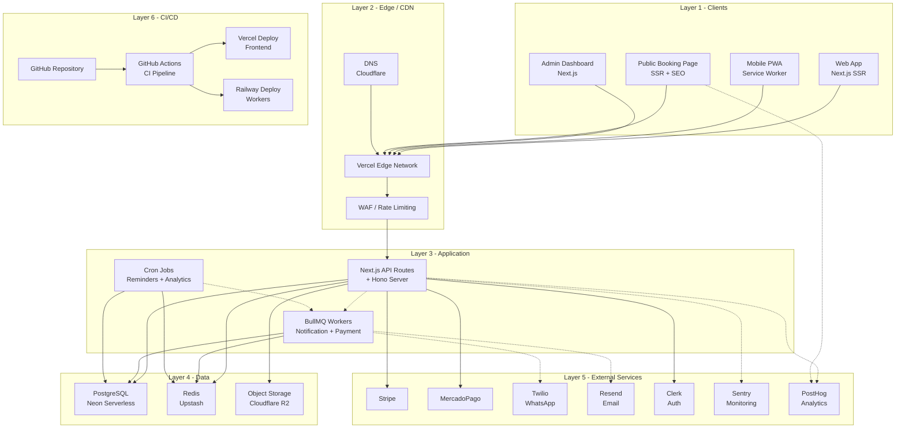
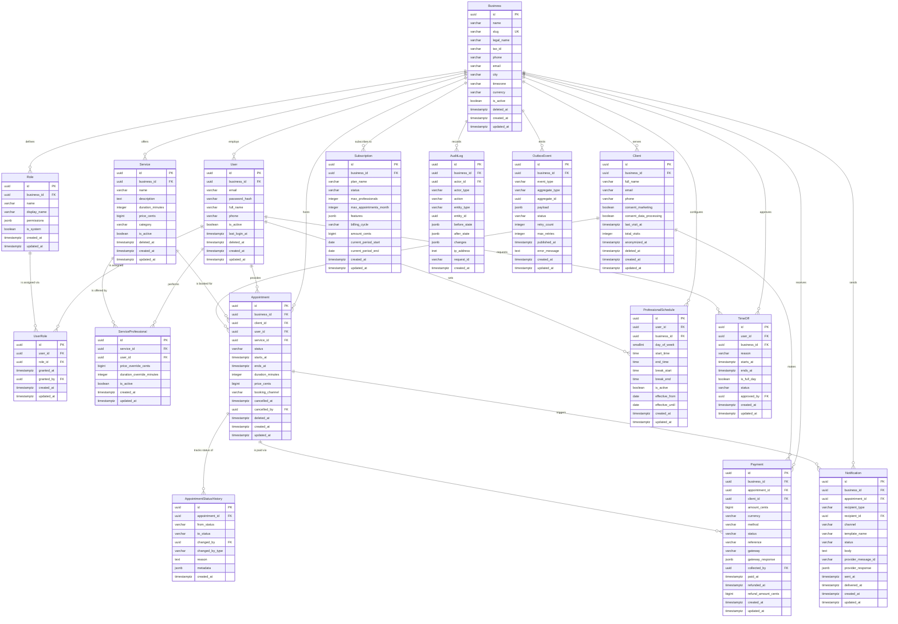

## Índice

0. [Ficha del proyecto](#0-ficha-del-proyecto)
1. [Descripción general del producto](#1-descripción-general-del-producto)
2. [Arquitectura del sistema](#2-arquitectura-del-sistema)
3. [Modelo de datos](#3-modelo-de-datos)
4. [Especificación de la API](#4-especificación-de-la-api)
5. [Historias de usuario](#5-historias-de-usuario)
6. [Tickets de trabajo](#6-tickets-de-trabajo)
7. [Pull requests](#7-pull-requests)

---

## 0. Ficha del proyecto

### **0.1. Tu nombre completo:**
Juancho (AI4Devs Student)

### **0.2. Nombre del proyecto:**
ReservaPro

### **0.3. Descripción breve del proyecto:**
SaaS de reservas y gestión para barberías y salones en Colombia, con expansión planeada a LATAM y España. Diferenciadores clave: integración nativa con WhatsApp, métodos de pago locales (MercadoPago, Nequi), precios adaptados a LATAM ($19-59/mes) y UX-first en español.

### **0.4. URL del proyecto:**
> Pendiente de despliegue (Entrega 2)

### 0.5. URL o archivo comprimido del repositorio

> https://github.com/anomalyco/AI4Devs-finalproject

---

## 1. Descripción general del producto

### **1.1. Objetivo:**
ReservaPro es una plataforma SaaS de reservas y gestión construida específicamente para negocios de servicios personales — comenzando con barberías y salones en Colombia, con expansión planeada a Latinoamérica y España. La plataforma resuelve la brecha operativa crítica que enfrentan aproximadamente 1.4 millones de negocios de servicios en la región que aún dependen de mensajes de WhatsApp, agendas en papel y control manual de efectivo para gestionar citas y relaciones con clientes.

Las soluciones globales existentes (Mindbody a $129-699/mes, Fresha con competencia de marketplace) son prohibitivamente caras o estructuralmente desalinhadas con las prácticas comerciales de LATAM. ReservaPro combina integración nativa con WhatsApp, métodos de pago locales (MercadoPago, Nequi), precios adaptados a LATAM ($19-59/mes) y UX en español primero para entregar una plataforma que entiende cómo operan estos negocios realmente.

### **1.2. Características y funcionalidades principales:**

| Feature | Descripción | Prioridad |
|---------|-------------|-----------|
| Public Booking Page | SSR mobile-first page donde clientes reservan en menos de 60 segundos | Must |
| Availability Engine | Cálculo de slots en tiempo real con buffers, horarios y prevención de doble-reserva | Must |
| Appointment Management | CRUD completo con máquina de estados (pending → confirmed → completed/cancelled/no-show) | Must |
| WhatsApp Reminders | Recordatorios automáticos a 24h y 2h antes via Twilio | Must |
| Email Notifications | Confirmaciones y recordatorios via Resend como canal fallback | Must |
| Online Payments | Integración Stripe + MercadoPago con configuración de depósito | Must |
| Dashboard & Reports | Vista del día, resúmenes de revenue, popularidad de servicios, tracking de no-shows | Must |
| Business Management | Horarios de negocio, holidays, gestión de equipo, catálogo de servicios | Must |
| Role-Based Access | Roles owner, admin y professional con permisos por alcance | Must |
| Subscription Plans | 4 niveles de precio con feature gating via Stripe | Must |

### **1.3. Diseño y experiencia de usuario:**

> Pendiente para Entrega 2 (requiere implementación de frontend)

El flujo principal de usuario:
1. Cliente visita página pública de reservas
2. Selecciona servicio → profesional → fecha/hora
3. Realiza pago online via MercadoPago o Stripe
4. Recibe confirmación por WhatsApp y email
5. Recordatorios automáticos 24h y 2h antes
6. Puede cancelar/reprogramar via enlace en mensajes

### **1.4. Instrucciones de instalación:**
> Pendiente para Entrega 2 (requiere código funcional)

---

## 2. Arquitectura del Sistema

### **2.1. Diagrama de arquitectura:**


```mermaid
flowchart TB
    subgraph Clients["Layer 1 - Clients"]
        WebApp["Web App<br/>Next.js SSR"]:::client
        MobilePWA["Mobile PWA<br/>Service Worker"]:::client
        AdminDash["Admin Dashboard<br/>Next.js"]:::client
        PublicPage["Public Booking Page<br/>SSR + SEO"]:::client
    end

    subgraph Edge["Layer 2 - Edge / CDN"]
        VercelEdge["Vercel Edge Network"]:::edge
        WAF["WAF / Rate Limiting"]:::edge
        DNS["DNS<br/>Cloudflare"]:::edge
    end

    subgraph Application["Layer 3 - Application"]
        APIServer["Next.js API Routes<br/>+ Hono Server"]:::app
        BullWorkers["BullMQ Workers<br/>Notification + Payment"]:::app
        CronJobs["Cron Jobs<br/>Reminders + Analytics"]:::app
    end

    subgraph Data["Layer 4 - Data"]
        Postgres["PostgreSQL<br/>Neon Serverless"]:::data
        Redis["Redis<br/>Upstash"]:::data
        S3Storage["Object Storage<br/>Cloudflare R2"]:::data
    end

    subgraph External["Layer 5 - External Services"]
        Stripe["Stripe"]:::ext
        MercadoPago["MercadoPago"]:::ext
        Twilio["Twilio<br/>WhatsApp"]:::ext
        Resend["Resend<br/>Email"]:::ext
        ClerkAuth["Clerk<br/>Auth"]:::ext
        SentryMon["Sentry<br/>Monitoring"]:::ext
        PostHogAnalytics["PostHog<br/>Analytics"]:::ext
    end

    subgraph CICD["Layer 6 - CI/CD"]
        GitHub["GitHub Repository"]:::cicd
        GHActions["GitHub Actions<br/>CI Pipeline"]:::cicd
        VercelDeploy["Vercel Deploy<br/>Frontend"]:::cicd
        RailwayDeploy["Railway Deploy<br/>Workers"]:::cicd
    end

    WebApp --> VercelEdge
    MobilePWA --> VercelEdge
    AdminDash --> VercelEdge
    PublicPage --> VercelEdge

    VercelEdge --> WAF
    WAF --> APIServer
    DNS --> VercelEdge

    APIServer --> Postgres
    APIServer --> Redis
    APIServer --> S3Storage

    APIServer --> Stripe
    APIServer --> MercadoPago
    APIServer --> ClerkAuth

    APIServer -.-> BullWorkers
    BullWorkers --> Redis
    BullWorkers --> Postgres

    BullWorkers -.-> Twilio
    BullWorkers -.-> Resend

    CronJobs --> Redis
    CronJobs --> Postgres
    CronJobs -.-> BullWorkers

    APIServer -.-> SentryMon
    APIServer -.-> PostHogAnalytics
    PublicPage -.-> PostHogAnalytics

    GitHub --> GHActions
    GHActions --> VercelDeploy
    GHActions --> RailwayDeploy

    class WebApp,MobilePWA,AdminDash,PublicPage client
    class VercelEdge,WAF,DNS edge
    class APIServer,BullWorkers,CronJobs app
    class Postgres,Redis,S3Storage data
    class Stripe,MercadoPago,Twilio,Resend,ClerkAuth,SentryMon,PostHogAnalytics ext
    class GitHub,GHActions,VercelDeploy,RailwayDeploy cicd
```

**Justificación de arquitectura:**
ReservaPro adopta una arquitectura **modular monolith**, la elección pragmática para un SaaS de un solo desarrollador apuntando a 0-100 barberías en el primer año. En lugar de dividirse en microservicios — lo cual multiplicaría la sobrecarga operacional, complejidad de despliegue y costos de comunicación entre servicios — la aplicación organiza sus nueve dominios (Auth, Business & Staff, Service Catalog, Calendar & Availability, Booking Engine, Public Booking Page, Payments, Notifications, Dashboard & Analytics) en módulos bien definidos dentro de una única unidad desplegable.

### **2.2. Descripción de componentes principales:**

| Módulo/Servicio | Responsabilidad | Base de Datos | Dependencias Externas |
|----------------|----------------|---------------|----------------------|
| **Auth Module** | Registro, login, gestión de sesiones, RBAC | `users`, `sessions`, `roles`, `permissions` | Clerk (identity provider, JWT) |
| **Business & Staff Management** | CRUD de negocios, perfiles profesionales, asignaciones de rol | `businesses`, `professionals`, `business_settings` | Cloudflare R2 (fotos, logos) |
| **Service Catalog** | Definiciones de servicios con nombre, duración, precio, categoría | `services`, `service_categories`, `service_professionals` | Ninguna |
| **Calendar & Availability** | Horarios por profesional, gestión de time-off, holidays, cálculo de slots | `working_hours`, `time_off`, `holidays` | Upstash Redis (slot cache, TTL 5min) |
| **Booking Engine** | Ciclo de vida de appointments, prevención de doble-reserva, transiciones de estado | `appointments`, `appointment_history` | BullMQ, Notification Service |
| **Public Booking Page** | Interfaz de reservas SSR, branding, selección servicio/profesional | Read-only aggregation | Ninguna |
| **Payment Module** | Creación de payment intent, procesamiento, refunds, webhooks | `payments`, `payment_intents`, `transactions` | Stripe API, MercadoPago API |
| **Notification Service** | Despacho de notificaciones: confirmaciones, recordatorios, receipts | `notification_templates`, `notification_log` | Twilio (WhatsApp), Resend (Email), BullMQ |
| **Dashboard & Analytics** | Métricas de negocio, performance de profesionales, reportes | Materialized views, `analytics_snapshots` | PostHog |
| **Background Workers** | Jobs async: scheduling de recordatorios, delivery de notificaciones, retry de webhooks | BullMQ job queues, `job_logs` | Upstash Redis (BullMQ broker) |

### **2.3. Descripción de alto nivel del proyecto y estructura de ficheros**

> Pendiente para Entrega 2 (estructura de código)

### **2.4. Infraestructura y despliegue**

| Capa | Tecnología | Justificación |
|------|-----------|---------------|
| **Frontend** | Next.js 14 (App Router) | SSR para booking page público (SEO), RSC para dashboard |
| **Backend / API** | Next.js API Routes + Hono | API Routes para endpoints simples, Hono para lógica compleja con Zod validation |
| **Database** | PostgreSQL (Neon) | ACID transactions, branching para dev/staging, serverless connection pooling |
| **ORM** | Drizzle ORM | Type-safe queries, SQL-like syntax, excellent migration system |
| **Authentication** | Clerk | Pre-built UI components, Next.js middleware integration |
| **Payments** | Stripe + MercadoPago (adapter) | Stripe para cards internacionales, MercadoPago para pagos locales colombianos |
| **WhatsApp** | Twilio | WhatsApp Business API oficial, reliable delivery, webhook support |
| **Email** | Resend | Developer-friendly API, React Email support, free tier (3000/mo) |
| **Hosting** | Vercel + Railway | Zero-config Next.js deployment, Docker deployment para workers |
| **Cache/Queue** | Upstash Redis + BullMQ | Serverless Redis, pay-per-request pricing |

**Costos de infraestructura estimados (MVP):**

| Servicio | Plan | Costo Mensual |
|----------|------|---------------|
| Vercel | Hobby | $0 |
| Neon | Free | $0 |
| Upstash | Free | $0 |
| Clerk | Free (up to 10k MAU) | $0 |
| Resend | Free (3K/month) | $0 |
| R2 | Free (10GB) | $0 |
| Sentry | Free | $0 |
| PostHog | Free (1M events/mo) | $0 |
| Railway | Starter | $5 |
| Twilio WhatsApp | Usage-based | ~$15-25 |
| **Total MVP** | | **$20-35/mo** |

### **2.5. Seguridad**

| Práctica | Implementación |
|----------|---------------|
| **Multitenancy** | `business_id` FK en todas las tablas tenant-scoped; middleware inyecta contexto desde sesión autenticada |
| **Auth** | Clerk con JWT sessions; 15-min access tokens + refresh token rotation |
| **RBAC** | Middleware verifica permisos de rol (owner, admin, professional) a nivel de ruta |
| **PCI DSS** | SAQ A level — datos de tarjeta nunca tocan nuestros servidores (Stripe Elements/MercadoPago SDK) |
| **Rate Limiting** | 100 req/min para endpoints públicos; 1000 para endpoints autenticados |
| **Input Validation** | Zod schemas en todos los inputs; SQL injection prevention via parameterized queries |
| **Double-booking prevention** | PostgreSQL EXCLUDE USING gist constraint a nivel de DB |
| **Data Privacy** | Compliance con Ley 1581/2012 (Colombia): consent checkboxes, anonymized_at para PII, data deletion mechanism |

### **2.6. Tests**

> Pendiente para Entrega 2 (suite de tests)

---

## 3. Modelo de Datos

### **3.1. Diagrama del modelo de datos:**


```mermaid
erDiagram
    Business {
        uuid id PK
        varchar name
        varchar slug UK
        varchar legal_name
        varchar tax_id
        varchar phone
        varchar email
        varchar city
        varchar timezone
        varchar currency
        boolean is_active
        timestamptz deleted_at
        timestamptz created_at
        timestamptz updated_at
    }

    User {
        uuid id PK
        uuid business_id FK
        varchar email
        varchar password_hash
        varchar full_name
        varchar phone
        boolean is_active
        timestamptz last_login_at
        timestamptz deleted_at
        timestamptz created_at
        timestamptz updated_at
    }

    Role {
        uuid id PK
        uuid business_id FK
        varchar name
        varchar display_name
        jsonb permissions
        boolean is_system
        timestamptz created_at
        timestamptz updated_at
    }

    UserRole {
        uuid id PK
        uuid user_id FK
        uuid role_id FK
        timestamptz granted_at
        uuid granted_by FK
        timestamptz created_at
        timestamptz updated_at
    }

    Service {
        uuid id PK
        uuid business_id FK
        varchar name
        text description
        integer duration_minutes
        bigint price_cents
        varchar category
        boolean is_active
        timestamptz deleted_at
        timestamptz created_at
        timestamptz updated_at
    }

    ServiceProfessional {
        uuid id PK
        uuid service_id FK
        uuid user_id FK
        bigint price_override_cents
        integer duration_override_minutes
        boolean is_active
        timestamptz created_at
        timestamptz updated_at
    }

    Client {
        uuid id PK
        uuid business_id FK
        varchar full_name
        varchar email
        varchar phone
        boolean consent_marketing
        boolean consent_data_processing
        timestamptz last_visit_at
        integer total_visits
        timestamptz anonymized_at
        timestamptz deleted_at
        timestamptz created_at
        timestamptz updated_at
    }

    Subscription {
        uuid id PK
        uuid business_id FK
        varchar plan_name
        varchar status
        integer max_professionals
        integer max_appointments_month
        jsonb features
        varchar billing_cycle
        bigint amount_cents
        date current_period_start
        date current_period_end
        timestamptz created_at
        timestamptz updated_at
    }

    Appointment {
        uuid id PK
        uuid business_id FK
        uuid client_id FK
        uuid user_id FK
        uuid service_id FK
        varchar status
        timestamptz starts_at
        timestamptz ends_at
        integer duration_minutes
        bigint price_cents
        varchar booking_channel
        timestamptz cancelled_at
        uuid cancelled_by FK
        timestamptz deleted_at
        timestamptz created_at
        timestamptz updated_at
    }

    AppointmentStatusHistory {
        uuid id PK
        uuid appointment_id FK
        varchar from_status
        varchar to_status
        uuid changed_by FK
        varchar changed_by_type
        text reason
        jsonb metadata
        timestamptz created_at
    }

    Payment {
        uuid id PK
        uuid business_id FK
        uuid appointment_id FK
        uuid client_id FK
        bigint amount_cents
        varchar currency
        varchar method
        varchar status
        varchar reference
        varchar gateway
        jsonb gateway_response
        uuid collected_by FK
        timestamptz paid_at
        timestamptz refunded_at
        bigint refund_amount_cents
        timestamptz created_at
        timestamptz updated_at
    }

    Notification {
        uuid id PK
        uuid business_id FK
        uuid appointment_id FK
        varchar recipient_type
        uuid recipient_id FK
        varchar channel
        varchar template_name
        varchar status
        text body
        varchar provider_message_id
        jsonb provider_response
        timestamptz sent_at
        timestamptz delivered_at
        timestamptz created_at
        timestamptz updated_at
    }

    ProfessionalSchedule {
        uuid id PK
        uuid user_id FK
        uuid business_id FK
        smallint day_of_week
        time start_time
        time end_time
        time break_start
        time break_end
        boolean is_active
        date effective_from
        date effective_until
        timestamptz created_at
        timestamptz updated_at
    }

    TimeOff {
        uuid id PK
        uuid user_id FK
        uuid business_id FK
        varchar reason
        timestamptz starts_at
        timestamptz ends_at
        boolean is_full_day
        varchar status
        uuid approved_by FK
        timestamptz created_at
        timestamptz updated_at
    }

    AuditLog {
        uuid id PK
        uuid business_id FK
        uuid actor_id FK
        varchar actor_type
        varchar action
        varchar entity_type
        uuid entity_id
        jsonb before_state
        jsonb after_state
        jsonb changes
        inet ip_address
        varchar request_id
        timestamptz created_at
    }

    OutboxEvent {
        uuid id PK
        uuid business_id FK
        varchar event_type
        varchar aggregate_type
        uuid aggregate_id
        jsonb payload
        varchar status
        integer retry_count
        integer max_retries
        timestamptz published_at
        text error_message
        timestamptz created_at
        timestamptz updated_at
    }

    Business ||--o{ User : "employs"
    Business ||--o{ Role : "defines"
    Business ||--o{ Service : "offers"
    Business ||--o{ Client : "serves"
    Business ||--o{ Subscription : "subscribes to"
    Business ||--o{ Appointment : "hosts"
    Business ||--o{ Payment : "receives"
    Business ||--o{ Notification : "sends"
    Business ||--o{ ProfessionalSchedule : "configures"
    Business ||--o{ TimeOff : "approves"
    Business ||--o{ AuditLog : "records"
    Business ||--o{ OutboxEvent : "emits"

    User ||--o{ UserRole : "is assigned"
    User ||--o{ ServiceProfessional : "performs"
    User ||--o{ Appointment : "provides"
    User ||--o{ ProfessionalSchedule : "sets"
    User ||--o{ TimeOff : "requests"

    Role ||--o{ UserRole : "is assigned via"

    Service ||--o{ ServiceProfessional : "is offered by"
    Service ||--o{ Appointment : "is booked for"

    Client ||--o{ Appointment : "books"
    Client ||--o{ Payment : "makes"

    Appointment ||--o{ AppointmentStatusHistory : "tracks status of"
    Appointment ||--o{ Payment : "is paid via"
    Appointment ||--o{ Notification : "triggers"
```

### **3.2. Descripción de entidades principales:**

| Entidad | Descripción | Campos Clave |
|---------|-------------|--------------|
| **Business** | Tenant root (barbería/salón): name, slug, timezone, currency, settings, branding | `slug` UK único para URLs públicas |
| **User** | Staff interno (owners, admins, professionals) que se autentican dentro del negocio | Scoped a business via `business_id` |
| **Role** | Conjunto de permisos (owner, admin, professional) con JSONB `permissions` | System roles no-deletables |
| **UserRole** | Junction asignando roles a usuarios con audit trail | Composite unique `(user_id, role_id)` |
| **Service** | Servicio reservable: name, duration, price (integer cents), category | `price_cents` evita floating-point errors |
| **ServiceProfessional** | Junction linking servicios a profesionales, con overrides opcionales de precio/duración | Composite unique `(service_id, user_id)` |
| **Client** | Clientes finales: name, phone, email, consent flags, visit history, anonymization | Composite unique `(business_id, phone)` |
| **Subscription** | Plan del negocio: tier, status, feature flags, billing cycle, límites | Partial unique index para solo 1 active subscription |
| **Appointment** | Reserva core: client, professional, service, time range, status, price snapshot, booking channel | **Double-booking prevention**: Exclusion constraint `EXCLUDE USING gist` |
| **AppointmentStatusHistory** | Log append-only de cada transición de estado con actor y metadata | Trigger DB rejects UPDATE/DELETE |
| **Payment** | Registros financieros: amount, method (cash/card/nequi/PSE), gateway, status, refunds | Append-only pattern |
| **Notification** | Mensajes enviados: channel (WhatsApp/email), template, delivery status, provider response | Polymorphic reference via `recipient_type` + `recipient_id` |
| **ProfessionalSchedule** | Disponibilidad semanal recurrente con split-shift y breaks | Schedule versioning via `effective_from/until` |
| **TimeOff** | Excepciones: vacaciones, días enfermedad, con workflow de aprobación | Exclusion constraint para overlapping entries |
| **AuditLog** | Audit trail append-only con before/after state snapshots | Strictly append-only (trigger rejects mutations) |
| **OutboxEvent** | Transactional outbox para event publishing confiable con retry logic | Relay process polls `status = 'pending'` |

---

## 4. Especificación de la API

### Endpoint 1: Public Booking (`POST /api/book`)

Crea una cita desde la página pública de reservas.

**Request:**
```json
{
  "service_id": "uuid",
  "professional_id": "uuid | null",
  "starts_at": "2026-06-15T10:00:00Z",
  "client": {
    "full_name": "string",
    "phone": "string",
    "email": "string"
  },
  "payment_method": "mercadopago | stripe"
}
```

**Response:**
```json
{
  "appointment_id": "uuid",
  "status": "confirmed",
  "starts_at": "2026-06-15T10:00:00Z",
  "ends_at": "2026-06-15T10:30:00Z",
  "payment_intent": {
    "id": "string",
    "amount": 25000,
    "currency": "COP",
    "payment_url": "https://mercadopago.com/..."
  },
  "client": {
    "name": "string",
    "phone": "string"
  }
}
```

### Endpoint 2: Get Available Slots (`GET /api/availability/slots`)

Obtiene slots disponibles para un servicio/profesional/fecha.

**Query Parameters:**
- `service_id` (required): UUID del servicio
- `professional_id` (optional): UUID del profesional (null = cualquier disponible)
- `date` (required): Fecha en formato YYYY-MM-DD
- `business_id` (required): UUID del negocio

**Response:**
```json
{
  "date": "2026-06-15",
  "slots": [
    { "time": "09:00", "professional_id": "uuid-1", "available": true },
    { "time": "09:30", "professional_id": "uuid-1", "available": true },
    { "time": "10:00", "professional_id": "uuid-2", "available": true },
    { "time": "10:00", "professional_id": "uuid-1", "available": false, "reason": "booked" }
  ]
}
```

### Endpoint 3: Appointment Status Update (`PATCH /api/appointments/:id/status`)

Transición de estado de cita con validación.

**Request:**
```json
{
  "status": "completed | cancelled | no_show",
  "reason": "string (optional)"
}
```

**Response:**
```json
{
  "appointment_id": "uuid",
  "previous_status": "confirmed",
  "new_status": "completed",
  "changed_at": "2026-06-15T11:00:00Z",
  "notification_sent": true
}
```

---

## 5. Historias de Usuario

### Historia de Usuario 1: Reserva Online Completa

**Como** cliente final,
**Quiero** visitar la página de reservas de un negocio y completar una reservación en menos de 60 segundos,
**Para** poder agendar sin llamar o esperar respuesta por WhatsApp.

- **Given** un cliente visita `reservapro.com/barberia-el-clasico`
- **When** selecciona servicio, profesional, fecha y hora, luego ingresa su nombre y teléfono
- **Then** la cita es confirmada, se envía WhatsApp de confirmación, y el slot se remove de disponibilidad — todo sin reload de página

**Criterios de Aceptación:**
- [ ] Página carga en <2 segundos en móvil 4G
- [ ] Slot seleccionado se bloquea inmediatamente (optimistic lock)
- [ ] Confirmación WhatsApp enviada dentro de 60 segundos
- [ ] Email de confirmación enviado como backup
- [ ] Pago online procesado via MercadoPago o Stripe

---

### Historia de Usuario 2: Motor de Disponibilidad con Prevención de Doble-Reserva

**Como** sistema,
**Quiero** calcular slots disponibles basados en horarios de profesionales, citas existentes y buffers,
**Para** que sea imposible hacer doble-reservas.

- **Given** un profesional trabaja 9 AM–6 PM con servicio de 30 min y buffer de 15 min
- **When** un cliente solicita slots disponibles para mañana
- **Then** el sistema retorna solo slots no-sobrepuestos que respetan citas existentes, buffers y horario del profesional — usando PostgreSQL exclusion constraints a nivel de DB para prevenir race conditions

**Criterios de Aceptación:**
- [ ] Exclusion constraint `EXCLUDE USING gist (user_id WITH =, tstzrange(starts_at, ends_at) WITH &&)` previene overlaps
- [ ] Buffer time de 15 min respetado entre citas
- [ ] Timezone manejado correctamente (UTC en DB, conversión en display)
- [ ] Response time <500ms para cualquier query de disponibilidad

---

### Historia de Usuario 3: Recordatorios Automáticos por WhatsApp con Fallback Email

**Como** sistema,
**Quiero** enviar recordatorios automáticos de WhatsApp 24 horas y 2 horas antes de cada cita,
**Para** que los clientes recuerden y los no-shows disminuyan.

- **Given** una cita está confirmada para mañana a las 3 PM
- **When** se reacha el mark de 24 horas
- **Then** un mensaje de WhatsApp es enviado usando template pre-aprobado con detalles de la cita (fecha, hora, servicio, profesional) y enlace de cancelar/reprogramar

- **Given** un recordatorio de WhatsApp falla en entregar (número inválido, error de API, rate limit)
- **When** el failure es detectado
- **Then** el sistema hace fallback a email y loguea el failure para revisión del owner

**Criterios de Aceptación:**
- [ ] >95% delivery rate para WhatsApp
- [ ] Fallback automático a email cuando WhatsApp falla
- [ ] Logs de delivery para revisión del owner
- [ ] Templates pre-aprobados por Meta
- [ ] Cola de BullMQ para scheduling de recordatorios

---

## 6. Tickets de Trabajo

### Ticket 1: Backend — Motor de Disponibilidad y Booking Engine

**Título:** `[Backend] Availability Engine — Slot calculation con double-booking prevention`

**User Story:** Epic 4 (Calendar & Availability), Epic 6 (Appointment Management)

**Descripción:**
Implementar el motor de disponibilidad que calcula slots libres basándose en horarios de profesionales, citas existentes y buffer times. Prevenir double-bookings a nivel de database usando PostgreSQL exclusion constraints.

**Technical Tasks:**
- [ ] Crear Drizzle schema para `appointments`, `professional_schedules`, `time_off`
- [ ] Implementar PostgreSQL exclusion constraint: `EXCLUDE USING gist (user_id WITH =, tstzrange(starts_at, ends_at) WITH &&)`
- [ ] Implementar `calculateAvailableSlots(serviceId, professionalId, date)` function
- [ ] Implementar appointment status machine: `pending → confirmed → completed/cancelled/no_show`
- [ ] Crear `AppointmentStatusHistory` append-only table con trigger
- [ ] Implementar transaction wrapping para appointment creation
- [ ] Escribir integration tests para concurrent booking scenarios

**Dependencies:** RP-001 (Auth setup), RP-003 (Professional schedules)

**Estimated Effort:** XL (13 story points)

**Acceptance Criteria:**
- [ ] No es posible crear overlapping appointments para el mismo professional via API
- [ ] Exclusion constraint previene race conditions a nivel de DB
- [ ] Buffer time correctamente calculado entre appointments
- [ ] Timezone handling: UTC storage, business timezone para display
- [ ] Integration tests pasan: concurrent bookings, status transitions

---

### Ticket 2: Frontend — Página Pública de Reservas (SSR)

**Título:** `[Frontend] Public Booking Page — Mobile-first SSR booking flow`

**User Story:** Epic 5 (Public Booking Page)

**Descripción:**
Implementar la página pública de reservas SSR, mobile-first, donde clientes finales pueden completar todo el flujo de reserva en <60 segundos.

**Technical Tasks:**
- [ ] Crear route `/book/[businessSlug]` con SSR
- [ ] Implementar service selection component con categorías
- [ ] Implementar professional selection (o "any available")
- [ ] Implementar date/time picker con disponibilidad real-time
- [ ] Implementar client info form (name, phone, email)
- [ ] Implementar payment flow (MercadoPago/Stripe redirect)
- [ ] Implementar confirmation page con appointment details
- [ ] Add Twilio/Resend confirmation triggers post-booking
- [ ] Mobile-responsive: 320px+ support, 44px tap targets
- [ ] Performance: LCP <2s on 4G

**Dependencies:** RP-001 (Auth), RP-005 (Service catalog), Backend availability endpoint

**Estimated Effort:** XL (13 story points)

**Acceptance Criteria:**
- [ ] Booking completo en <60 segundos en móvil
- [ ] LCP <2 segundos en 4G
- [ ] Slots se actualizan sin page reload (AJAX)
- [ ] Payment redirect funcional
- [ ] Confirmation WhatsApp/email enviada
- [ ] Branded con logo/colors del negocio

---

### Ticket 3: Database — Schema Completo con Constraints y Triggers

**Título:** `[DB] Complete Schema — All entities con constraints y seed data`

**User Story:** Data Model completo

**Descripción:**
Implementar el schema completo de PostgreSQL via Drizzle migrations, incluyendo todas las entidades, constraints, indexes, triggers para append-only tables, y seed data para development.

**Technical Tasks:**
- [ ] Drizzle schema para las 16 entities:
  - Business, User, Role, UserRole
  - Service, ServiceProfessional
  - Client
  - Subscription
  - Appointment, AppointmentStatusHistory
  - Payment
  - Notification
  - ProfessionalSchedule, TimeOff
  - AuditLog, OutboxEvent
- [ ] Indexes para performance:
  - `(business_id, starts_at)` en appointments
  - `(business_id, phone)` en clients
  - `(status, created_at)` en outbox_events
- [ ] Partial unique index en subscriptions: `UNIQUE (business_id) WHERE status = 'active'`
- [ ] Exclusion constraint para double-booking prevention
- [ ] Exclusion constraint para overlapping time_off
- [ ] Triggers para append-only enforcement en AuditLog y AppointmentStatusHistory
- [ ] Seed data: system roles, sample business, services, professionals

**Dependencies:** Ninguna ( foundational)

**Estimated Effort:** L (8 story points)

**Acceptance Criteria:**
- [ ] All 16 tables created con correct constraints
- [ ] Double-booking exclusion constraint verificable con test
- [ ] Append-only triggers rechazan UPDATE/DELETE
- [ ] Seed data permite desarrollo local sin setup manual
- [ ] Migration rollback funciona correctamente

---

## 7. Pull Requests

### Pull Request 1: Feature/setup inicial — Project scaffolding y auth foundation

**Título:** `feat: Initial project setup con Next.js 14, Drizzle ORM y Clerk auth`

**Descripción:**
Setup inicial del proyecto ReservaPro incluyendo:
- Next.js 14 con App Router, TypeScript, Tailwind, shadcn/ui
- Drizzle ORM configurado con Neon PostgreSQL
- Clerk authentication integrado con middleware
- Schema inicial: businesses, users, roles, user_roles tables
- RBAC middleware para verificación de roles por ruta

**Cambios:**
- `package.json` — dependencias base (next, react, drizzle, clerk)
- `drizzle.config.ts` — configuración de DB
- `src/db/schema/` — schemas iniciales
- `src/middleware.ts` — Clerk auth + RBAC
- `src/app/api/auth/` — endpoints de auth

**Impacto:** Foundation para todo el desarrollo posterior

**Relacionado con:** Ticket RP-001

---

### Pull Request 2: Feature/availability-engine — Booking engine con double-booking prevention

**Título:** `feat: Availability engine con PostgreSQL exclusion constraints`

**Descripción:**
Implementación del motor de disponibilidad y booking engine:
- PostgreSQL exclusion constraint `EXCLUDE USING gist` para prevenir double-bookings
- Función `calculateAvailableSlots()` con soporte para buffers y schedules
- Appointment status machine (pending → confirmed → completed/cancelled/no_show)
- `AppointmentStatusHistory` append-only table con trigger
- Transaction wrapping para atomicidad

**Cambios:**
- `src/db/schema/appointments.ts` — schema con exclusion constraint
- `src/db/schema/professional_schedules.ts`
- `src/db/schema/time_off.ts`
- `src/services/availability.ts` — slot calculation
- `src/services/booking.ts` — appointment creation con transactions
- `src/services/appointment-status.ts` — status machine

**Impacto:** Core del producto — permite reservas sin conflictos

**Relacionado con:** Epic 4, Epic 6

---

### Pull Request 3: Feature/public-booking-page — SSR booking page

**Título:** `feat: Public booking page SSR con full payment flow`

**Descripción:**
Implementación de la página pública de reservas:
- Route `/book/[slug]` server-side rendered
- Service/professional/date/time selection
- Client info capture y appointment creation
- MercadoPago/Stripe payment integration
- WhatsApp/email confirmation triggers
- Mobile-first responsive design

**Cambios:**
- `src/app/book/[slug]/page.tsx` — main booking page
- `src/components/booking/` — booking flow components
- `src/services/payment.ts` — payment adapter (Stripe + MercadoPago)
- `src/services/notifications.ts` — confirmation triggers
- `src/app/api/book/route.ts` — public booking endpoint

**Impacto:** Permite a clientes finales reservar directamente — core value proposition

**Relacionado con:** Epic 5, Story 5.1, Story 5.4

---

## Resumen de Entrega 1

| Sección | Estado | Artefactos |
|---------|--------|------------|
| Ficha del proyecto | ✅ Completo | Nombre, descripción, repo URL |
| Descripción general | ✅ Completo | Objetivo, features, modelo de negocio |
| Arquitectura | ✅ Completo | Diagrama 6 capas, módulo inventario, stack tech |
| Modelo de datos | ✅ Completo | 16 entities, ERD mermaid, design decisions |
| API | ✅ Completo | 3 endpoints principales en formato OpenAPI |
| Historias de usuario | ✅ Completo | 3 historias must-have con Gherkin |
| Tickets de trabajo | ✅ Completo | 3 tickets (BE, FE, DB) con tasks y AC |
| Pull requests | ✅ Completo | 3 PRs documentados |
| Skills/Agents | ✅ Copiado | 10 skills + 3 subagents migrados |

**Pendiente para Entrega 2:**
- Código funcional (backend + frontend conectados)
- Suite de tests (unit, integration, E2E)
- Pipeline CI/CD
- URL de despliegue público
