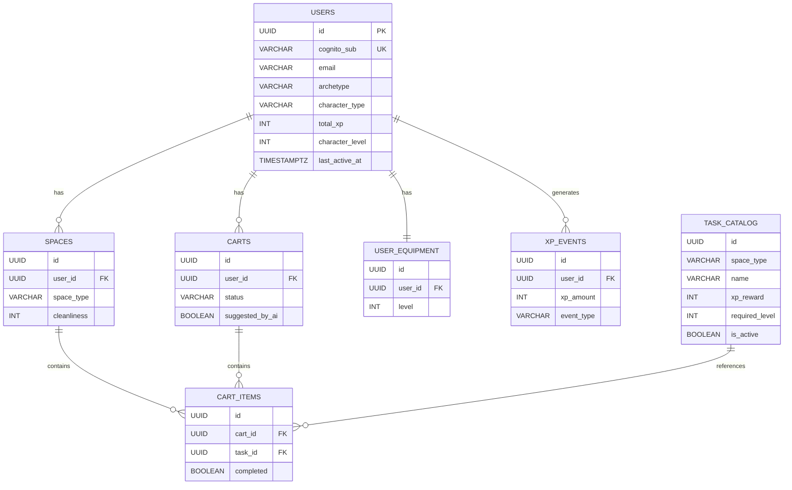

## Índice

0. [Ficha del proyecto](#0-ficha-del-proyecto)
1. [Descripción general del producto](#1-descripción-general-del-producto)
2. [Arquitectura del sistema](#2-arquitectura-del-sistema)
3. [Modelo de datos](#3-modelo-de-datos)
4. [Especificación de la API](#4-especificación-de-la-api)
5. [Historias de usuario](#5-historias-de-usuario)
6. [Tickets de trabajo](#6-tickets-de-trabajo)
7. [Pull requests](#7-pull-requests)
8. [Diseño y experiencia de usuario](#8-diseño-y-experiencia-de-usuario)
9. [Instrucciones de instalación](#9-instrucciones-de-instalación)

---

## 0. Ficha del proyecto

### 0.1. Nombre completo del desarrollador

**Andrés Lagos** (`nandilagos`)

### 0.2. Nombre del proyecto

**Aida** – Your Cleaning Coach

### 0.3. Descripción breve del proyecto

Aida es un ecosistema gamificado de gestión doméstica que elimina la parálisis de decisión en limpieza del hogar mediante un innovador "Shopping Cart" de tareas. Los usuarios seleccionan tareas como si estuvieran comprando — eligiendo solo lo que se sienten capaces de hacer ahora — ganando XP, desbloqueando personajes y disfrutando de campañas narrativas estacionales. Construida con IA adaptativa (Claude), Flutter (móvil) y React (admin dashboard), MVP en AWS Serverless.

### 0.4. URL del proyecto

**Repositorio público:** https://github.com/nandilagos/AI4Devs-finalproject-ALJ  
**Branch de entrega:** `finalproject-ALJ`  
**Documentación técnica:** `/docs/DI-01-OVERVIEW.md`, `/docs/DI-02-ARQUITECTURA.md`

### 0.5. URL del repositorio

https://github.com/nandilagos/AI4Devs-finalproject

---

## 1. Descripción general del producto

### 1.1. Objetivo

Aida existe para eliminar la "fase de planeación" que causa fatiga de decisión en la limpieza doméstica — especialmente en personas neurodivergentes (ADHD), profesionales independientes y familias modernas. El propósito es convertir las tareas del hogar de una fuente de estrés en una experiencia tan adictiva y gratificante como un juego móvil de alta calidad: el **"Duolingo de la domesticidad"**.

**Valor proposicional clave:**
- Elimina la parálisis de decisión mediante un método Shopping Cart innovador
- Gamificación sostenible diseñada para 6–8 meses de engagement
- IA adaptativa que personaliza recomendaciones según perfil y contexto del usuario
- Tolerancia a inactividad sin backlogs acumulados ni culpa
- Onboarding narrativo en 2 minutos sin formularios tediosos

### 1.2. Características y funcionalidades principales

**F1. Onboarding narrativo:** Trivia de 3–5 preguntas que perfila al usuario sin formularios, asignando personaje y arquetipo de hogar automáticamente.

**F2. Configuración del hogar:** Espacios predefinidos (baño, dormitorios, cocina, sala) con presets por arquetipo. Invitación de cohabitantes con visibilidad compartida.

**F3. Shopping Cart:** Core loop diario. Tareas presentadas como productos; usuario selecciona libremente; carrito muestra tiempo estimado y XP proyectado.

**F4. Sistema de equipamiento:** Tareas se adaptan a Level 0 (básico), Level 1 (intermedio) o Level 2 (avanzado) según productos que el usuario realmente tiene.

**F5. Gamificación:** Personajes desbloqueables, XP con scoring coherente, campañas estacionales narrativas, leaderboard del hogar (opcional).

**F6. Realismo conductual:** Tolerancia a inactividad, sin backlogs acumulados. Reanudación suave tras pausas. Frecuencias adaptativas.

**F7. Contenido educativo:** Tips contextuales durante ejecución, módulos deep-clean paso a paso.

**F8. IA adaptativa:** Claude API genera carrito sugerido personalizado, tips contextuales, mapeo predictivo tiempo-superficie. Caching 24h para control de costos.

**F9. Social (post-MVP):** Invitación de cohabitantes, treemaps de distribución de responsabilidades.

### 1.3. Diseño y experiencia de usuario

Experiencia diseñada en torno a **reducir fricción mental** y **maximizar gratificación**. Ver sección [8. Diseño y experiencia de usuario](#8-diseño-y-experiencia-de-usuario).

### 1.4. Instrucciones de instalación

Ver [Sección 9: Instrucciones de instalación](#9-instrucciones-de-instalación).

---

## 2. Arquitectura del sistema

### 2.1. Diagrama de arquitectura

```
┌─────────────────────────────────────────────────────────────────────┐
│                           CLIENTES                                  │
│   Flutter App (iOS/Android) │ React Admin Dashboard (Web)           │
└──────────────┬──────────────────────────────┬───────────────────────┘
               │                              │
               ▼                              ▼
        AWS API GATEWAY (HTTP API) + Cognito JWT Authorizer
               │
     ┌─────────┼──────────────┬─────────────┬──────────────┐
     ▼         ▼              ▼             ▼              ▼
  Auth      Home/Spaces    Tasks/Cart      IA Admin       ADMIN
  Lambdas   Lambdas        Lambdas      Lambdas        Lambdas
     │         │              │             │              │
     └─────────┼──────────────┼─────────────┼──────────────┘
               │
               ▼
     Lambda Layer (Clean Architecture)
     ├── domain/     (entidades, reglas puras)
     ├── use_cases/  (casos de uso)
     ├── adapters/   (repositories, gateways)
     └── infrastructure/ (db, auth, response)
               │
        ┌──────┴──────┐
        ▼             ▼
    RDS PostgreSQL   S3 + CloudFront
    (db.t4g.micro)   (avatares, web)
```

### 2.2. Descripción de componentes principales

| Componente | Tecnología | Descripción |
|---|---|---|
| **API Gateway** | AWS HTTP API | Enrutamiento, autorización JWT, rate limiting |
| **Lambdas** | Python 3.13 | 24 funciones (18 user + 6 admin), thin controllers |
| **Lambda Layer** | Python — Clean Architecture | Lógica compartida: db, auth, use cases, repositories |
| **RDS PostgreSQL** | db.t4g.micro → medium | BD relacional, 9 tablas, Single-AZ (MVP) |
| **RDS Proxy** | Connection pooling | Evita agotamiento de conexiones |
| **Cognito** | AWS User Pool | Autenticación email/password + Google sign-in |
| **Claude API** | Anthropic IA | Generación de carritos sugeridos y tips |
| **S3 + CloudFront** | Object Storage + CDN | Assets (avatares), web estática (React) |
| **Flutter** | Dart + Riverpod | App móvil iOS + Android |
| **React** | TypeScript + Vite | Admin dashboard CRUD |

### 2.3. Estructura de ficheros

```
AI4Devs-finalproject-ALJ/
├── docs/                    # Documentación técnica (DI-01 a DI-12)
├── infrastructure/          # AWS CDK (Python, 8 stacks)
├── backend/                 # Lambdas + Layer — Clean Architecture
│   ├── layer/python/shared/ # Domain, use cases, adapters, infrastructure
│   ├── lambdas/             # 24 funciones fn_*
│   ├── migrations/          # Alembic (PostgreSQL)
│   ├── seed/                # Datos iniciales (task_catalog.json)
│   └── tests/               # Unit + integration (pytest ≥95% coverage)
├── mobile/                  # Flutter (iOS + Android)
│   ├── lib/                 # Clean Architecture (core, data, domain, presentation)
│   └── test/                # flutter test ≥90% coverage
├── web/                     # React (Vite) — Admin Dashboard
│   ├── src/                 # API, components, features, hooks, store
│   └── tests/               # Vitest + MSW ≥90% coverage
└── .github/workflows/       # CI: lint + tests + secret-scan
```

Patrón: Monorepo serverless con Clean Architecture en todas las capas.

### 2.4. Infraestructura y despliegue

**Stack:** AWS CDK (Python) — 8 stacks con dependencias explícitas: VPC → Database → Lambda/CI → API → Auth; Storage → CDN.

**Despliegue:** Manual (`cdk deploy`) desde `infrastructure/`. Migraciones Alembic ejecutadas vía GitHub Actions con rol OIDC.

**Costos estimados (MVP):**
- AWS: ~$72/mes (RDS Proxy $22, NAT $33, RDS $15, resto free tier)
- IA: Variable (3 suggest-cart + 5 tips/usuario/día, cacheado 24h)

### 2.5. Seguridad

**Principios:** Secure by Design (menor privilegio, defensa profunda, defaults seguros, fail securely).

**Implementación:**
- Autenticación: Cognito JWT
- Autorización: Anti-IDOR (queries filtradas por user_id), admin vía grupo Cognito
- Secretos: AWS Secrets Manager (DB + API keys)
- Red: RDS en subnets privadas, Lambdas en VPC, NAT para salida controlada
- Validación: Pydantic v2 en cada Lambda
- IA: Input tratado como dato, caching separado de system prompt
- Logs: Sin PII (email/tokens), sí `cognito_sub` + `request_id`

Ver [`docs/DI-08-SEGURIDAD.md`](docs/DI-08-SEGURIDAD.md) para detalles.

### 2.6. Tests

**Coverage:** Backend ≥95%, Web ≥90%, Mobile ≥90%.

**Estrategia:** TDD obligatorio (Red → Green → Refactor). Unit tests sin BD (fakes). Integration tests contra PostgreSQL real (testcontainers).

**Ejecución:**
```bash
cd backend && uv run pytest  # Backend
cd web && npm test          # Web
cd mobile && flutter test   # Mobile
```

---

## 3. Modelo de datos

### 3.1. Diagrama del modelo de datos

9 tablas en RDS PostgreSQL, todas con UUIDs como PK:


```mermaid
erDiagram
    USERS ||--o{ SPACES : has
    USERS ||--o{ CARTS : has
    USERS ||--|| USER_EQUIPMENT : has
    USERS ||--o{ XP_EVENTS : generates
    SPACES ||--o{ CART_ITEMS : contains
    CARTS ||--o{ CART_ITEMS : contains
    TASK_CATALOG ||--o{ CART_ITEMS : references
    
    USERS {
        UUID id PK
        VARCHAR cognito_sub UK
        VARCHAR email
        VARCHAR archetype
        VARCHAR character_type
        INT total_xp
        INT character_level
        TIMESTAMPTZ last_active_at
    }
    
    SPACES {
        UUID id
        UUID user_id FK
        VARCHAR space_type
        INT cleanliness
    }
    
    TASK_CATALOG {
        UUID id
        VARCHAR space_type
        VARCHAR name
        INT xp_reward
        INT required_level
        BOOLEAN is_active
    }
    
    CARTS {
        UUID id
        UUID user_id FK
        VARCHAR status
        BOOLEAN suggested_by_ai
    }
    
    CART_ITEMS {
        UUID id
        UUID cart_id FK
        UUID task_id FK
        BOOLEAN completed
    }
    
    USER_EQUIPMENT {
        UUID id
        UUID user_id FK
        INT level
    }
    
    XP_EVENTS {
        UUID id
        UUID user_id FK
        INT xp_amount
        VARCHAR event_type
    }
```

### 3.2. Descripción de entidades principales

**users:** Perfil, onboarding, gamificación. UUIDs, Cognito sub único, email único, `is_suspended` para admin.

**spaces:** Espacios del hogar (baño, dormitorios, cocina). FK a users con CASCADE. UNIQUE(user_id, space_type). `cleanliness` calculado dinámicamente.

**task_catalog:** Catálogo global (gestionado por admin). Nunca lo crean los usuarios. Campos: name, space_type, category (basic/special/deep_clean), xp_reward, required_level, is_active.

**carts:** Sesiones de limpieza del usuario. Status: active/completed/abandoned.

**cart_items:** Tareas dentro de un carrito. Referencia a task_catalog y space_id.

**user_equipment:** Nivel de equipamiento (0–2) e inventario (JSONB).

**xp_events:** Registro granular de XP (auditoría). event_type: task_completed, cart_completed, etc.

**ai_suggestions_cache:** Cache 24h de respuestas Claude. Clave: (user_id, suggestion_type, context_hash).

**products:** Catálogo de productos de limpieza (gestionado por admin). Nivel (0–2), categoría, is_active.

---

## 4. Especificación de la API

### Bases de diseño

- Autenticación: JWT de Cognito en API Gateway
- Error envelope: `{ error: "message", error_code: "CODE" }`
- Rate limit: Implementado en API Gateway + límite IA (3 suggest-cart + 5 tips/usuario/día)
- CORS: Allowlist por entorno (nunca `*` en producción)

### Endpoints principales

#### **POST /v1/auth/register**
Registra usuario en Cognito + perfil en BD.
- Input: email, password, name, character_type, trivia_score, archetype
- Output: user_id, email, character_type, character_level, total_xp
- Status: 201 OK, 400 validation, 500 error

#### **POST /v1/cart**
Crea carrito con tareas seleccionadas.
- Input: items (array de {task_id, space_id}), suggested_by_ai (bool)
- Output: cart_id, items enriched, total_time, total_xp, created_at
- Autenticación: JWT requerido
- Status: 201 OK, 400 invalid task, 401 auth, 500 error

#### **PUT /v1/cart/{cartId}/complete**
Completa carrito, registra XP, actualiza limpieza.
- Input: cart_id
- Output: cart_id, xp_earned, user_total_xp, character_level, spaces_updated
- Autenticación: JWT requerido
- Status: 200 OK, 404 not found, 401 auth, 500 error

#### **POST /v1/ai/suggest-cart**
IA sugiere carrito personalizado.
- Input: context (string, opcional)
- Output: suggested_items (array), total_time, total_xp, cache_hit
- Autenticación: JWT requerido
- Rate limit: 3/día/usuario
- Status: 200 OK, 429 rate limit, 401 auth, 500 error

#### **GET /v1/admin/tasks** *(admin only)*
Lista tareas del catálogo.
- Query params: space_type (opcional), is_active (opcional)
- Output: array de tasks con id, name, space_type, category, xp_reward, required_level, is_active
- Admin: Cognito group `aida-admins` requerido
- Status: 200 OK, 403 forbidden, 401 auth, 500 error

#### **POST /v1/admin/tasks** *(admin only)*
Crea nueva tarea.
- Input: name, description, space_type, category, frequency_days, estimated_minutes, required_level, xp_reward, tips
- Output: task_id, ...fields
- Admin: Cognito group `aida-admins` requerido
- Status: 201 OK, 400 validation, 403 forbidden, 401 auth, 500 error

---

## 5. Historias de usuario

### **HU-1: Onboarding sin fricción**

**Como** usuario nuevo  
**Quiero** empezar el juego sin llenar formularios  
**Para que** entienda la propuesta de Aida en menos de 2 minutos

**Criterios de aceptación:**
- ✅ Trivia de 3–5 preguntas sin login obligatorio
- ✅ Asignación automática de personaje (Gold/Intermedio/Novato)
- ✅ Sugerencia de arquetipo de hogar
- ✅ Espacios precargados tras registro
- ✅ Tiempo total: <2 minutos

---

### **HU-2: Shopping Cart como core loop**

**Como** usuario  
**Quiero** seleccionar qué tareas hacer ahora sin obligación de hacer todo  
**Para que** me sienta motivado sin culpa por lo incompleto

**Criterios de aceptación:**
- ✅ Catálogo de tareas por espacio
- ✅ Agregar/quitar del carrito libremente
- ✅ Tiempo total + XP proyectado visible
- ✅ Ejecución guiada con timer y tips
- ✅ XP ganado registrado y visible

---

### **HU-3: Tolerancia a inactividad**

**Como** usuario en pausa  
**Quiero** volver sin lista enorme de pendientes  
**Para que** la app no me culpe ni desmoralice

**Criterios de aceptación:**
- ✅ Estado del hogar recalculado tras inactividad
- ✅ Tareas urgentes recargas sin backlogs
- ✅ Mensaje positivo de bienvenida
- ✅ Historial antiguo visible pero no interfiere
- ✅ Plan recalculado dinámicamente

---

## 6. Tickets de trabajo

### **AID-52: Backend — Onboarding trivia**

Implementar endpoints de onboarding: trivia questions, evaluación, asignación de personaje y arquetipo.

**Tareas:**
1. `fn_onboard_trivia_questions` (GET /onboarding/trivia/questions)
2. `fn_onboard_trivia` (POST /onboarding/trivia) — calcula personaje
3. `fn_onboard_archetype` (POST /onboarding/archetype) — genera presets

**Aceptación:** Tests unitarios + integration, coverage ≥95%, endpoints e2e testeados.

---

### **AID-78: Backend — fn_cart_create**

Implementar creación de carrito con validación, cálculo de tiempo y XP.

**Tareas:**
1. Use case `CreateCartUseCase` con validación
2. `fn_cart_create` handler thin
3. Tests: casos exitosos, tareas inválidas, equipamiento insuficiente

**Aceptación:** Tests + coverage ≥95%, handler sin lógica de negocio, error envelope estándar.

---

### **AID-96: Web — Admin CRUD de tareas**

Implementar dashboard de admin para CRUD de tareas.

**Tareas:**
1. Componente `TasksPage` con tabla, filtros, botones
2. Form `TaskEditForm` con validación client + server
3. API hooks para /v1/admin/tasks (GET, POST, PUT, DELETE)
4. Tests: rendering, form submission, error handling

**Aceptación:** Tests + coverage ≥90%, estilos consistentes, validación previa.

---

## 7. Pull requests

### **PR #32: Backend — Sprint Auth + Onboarding**

Autenticación completa con Cognito + onboarding narrativo.

**Commits:**
- feat(backend): fn_register, fn_login, JWT tokens
- feat(backend): fn_onboard_trivia_questions, fn_onboard_trivia
- feat(backend): fn_onboard_archetype
- test(backend): unit + integration, coverage 95%

**Review:** ✅ Clean Architecture, Pydantic v2, error envelope, sin secrets hardcodeados.

---

### **PR #38: Backend — Shopping Cart Core**

Core loop: crear carrito, agregar tareas, calcular XP, completado.

**Commits:**
- feat(backend): fn_cart_create, fn_cart_complete
- feat(backend): xp_events table, XpCalculator service
- feat(backend): cleanliness dinámico
- test(backend): tests del loop, coverage 96%

**Review:** ✅ Anti-IDOR, validación Pydantic, SQL parametrizado.

---

### **PR #40: Web — Admin Dashboard**

Admin dashboard: CRUD de tareas, productos y usuarios.

**Commits:**
- feat(web): TasksPage, ProductsPage, UsersPage
- feat(web): API hooks /v1/admin/*, forms con validación
- test(web): unit tests, MSW mocks, coverage 91%
- style(web): CSS responsive

**Review:** ✅ RequireAdmin guard, sin tokens en localStorage, CORS validado, design responsive.

---

## 8. Diseño y experiencia de usuario

### Flujos principales

**Usuario (Flutter mobile):**
```
Onboarding (trivia) → Setup hogar (espacios) → Home (resumen) 
→ Shopping Cart (seleccionar tareas) → Ejecución (timer + tips) 
→ Perfil (XP, personaje, historial)
```

**Admin (React web):**
```
Login → Dashboard → Tareas (CRUD) → Productos (CRUD) → Usuarios (buscar, suspender)
```

### Wireframes

**Onboarding (trivia):**
```
┌───────────────────────┐
│ ✨ ¡Bienvenida a Aida! │
│                       │
│ Pregunta 1 de 5       │
│ ¿Nivel de limpiador?  │
│ ◯ Experto             │
│ ◯ Intermedio          │
│ ◯ Novato              │
│ [Siguiente >]         │
└───────────────────────┘
```

**Home (dashboard):**
```
┌───────────────────────────────────────┐
│ 👋 ¡Hola, Alex!                       │
│ Nivel: Gold | XP: 1,250               │
│                                       │
│ 🚿 Baño 87%  | 🛏️ Dorm 92%           │
│ 🍳 Cocina 60% | 🛋️ Sala 78%          │
│                                       │
│ 🤖 Carrito sugerido: 30 min | 150 XP │
│ [+ Agregar al carrito >]              │
└───────────────────────────────────────┘
```

**Shopping Cart:**
```
┌─────────────────────────┐
│ 🛒 Mi Carrito            │
│                         │
│ ✓ Espejo baño (10 min)  │
│ ✓ Escoba sala (15 min)  │
│ ✓ Lavar platos (20 min) │
│                         │
│ Total: 45 min | 225 XP  │
│ [Confirmar y empezar >] │
└─────────────────────────┘
```

**Admin Dashboard (tareas):**
```
┌──────────────────────────────┐
│ [Tasks] [Products] [Users]   │
│                              │
│ [+ Nueva tarea]              │
│ Filtrar: [Baño ▼] [Activas]  │
│                              │
│ Tarea │ Nivel │ XP │ Acciones│
│─────────────────────────────│
│ Espejo│ 0     │ 25 │ ✏️ 🗑️  │
│ Toilet│ 1     │ 30 │ ✏️ 🗑️  │
└──────────────────────────────┘
```

### Paleta de colores

| Uso | Color | Hex |
|---|---|---|
| Primary | Azul | `#007BFF` |
| Success | Verde | `#28A745` |
| Warning | Naranja | `#FFA500` |
| Gold | Dorado | `#FFD700` |
| Intermedio | Plata | `#C0C0C0` |
| Novato | Cobre | `#B87333` |

---

## 9. Instrucciones de instalación

### Requisitos previos

- Node.js 18+ (web)
- Flutter 3.10+ (mobile)
- Python 3.13 (backend)
- Docker (PostgreSQL local)
- AWS CLI 2.x (si despliegas a AWS)

### Backend

```bash
cd backend
python3.13 -m venv venv
source venv/bin/activate
pip install uv
uv pip install -r layer/requirements.txt -e ".[dev]"
cp .env.example .env  # Editar con credenciales

# PostgreSQL local
docker-compose up -d postgres
sleep 5
cd backend && alembic upgrade head

# Tests
uv run pytest
uv run ruff check . && uv run black --check .
```

### Web (Admin Dashboard)

```bash
cd web
npm install
cp .env.example .env.local  # Editar API_BASE_URL

# Desarrollo
npm run dev

# Tests
npm test
```

### Mobile (Flutter)

```bash
cd mobile
flutter pub get
flutter run --dart-define=API_BASE_URL=http://localhost:3000

# Tests
flutter test
flutter analyze
```

### Infraestructura (AWS CDK — opcional)

```bash
cd infrastructure
uv sync
uv run cdk synth
uv run cdk deploy --all  # Requiere AWS CLI configurado
```

### Verificación final

```bash
# Backend: verde en tests
cd backend && uv run pytest -q

# Web: verde en linters y tests
cd web && npm test && npm run lint

# Mobile: verde en análisis y tests
cd mobile && flutter analyze && flutter test
```

---

**Contacto:** Andrés Lagos | lagos.jara.a@gmail.com | https://github.com/nandilagos

**Última actualización:** Julio 29, 2026 | Versión: MVP 1.0

