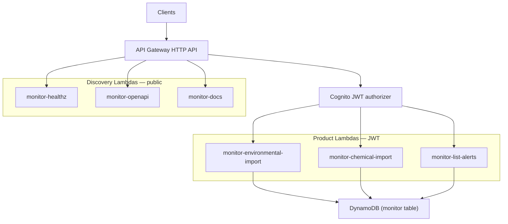
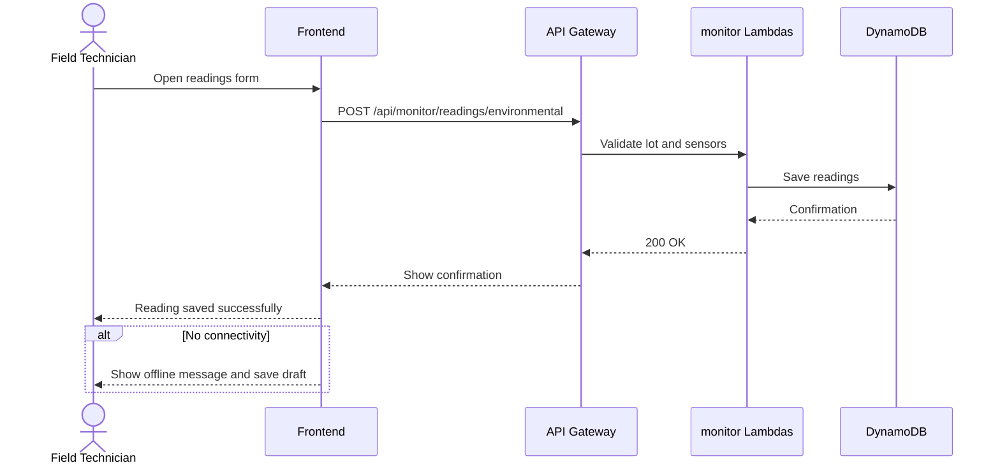
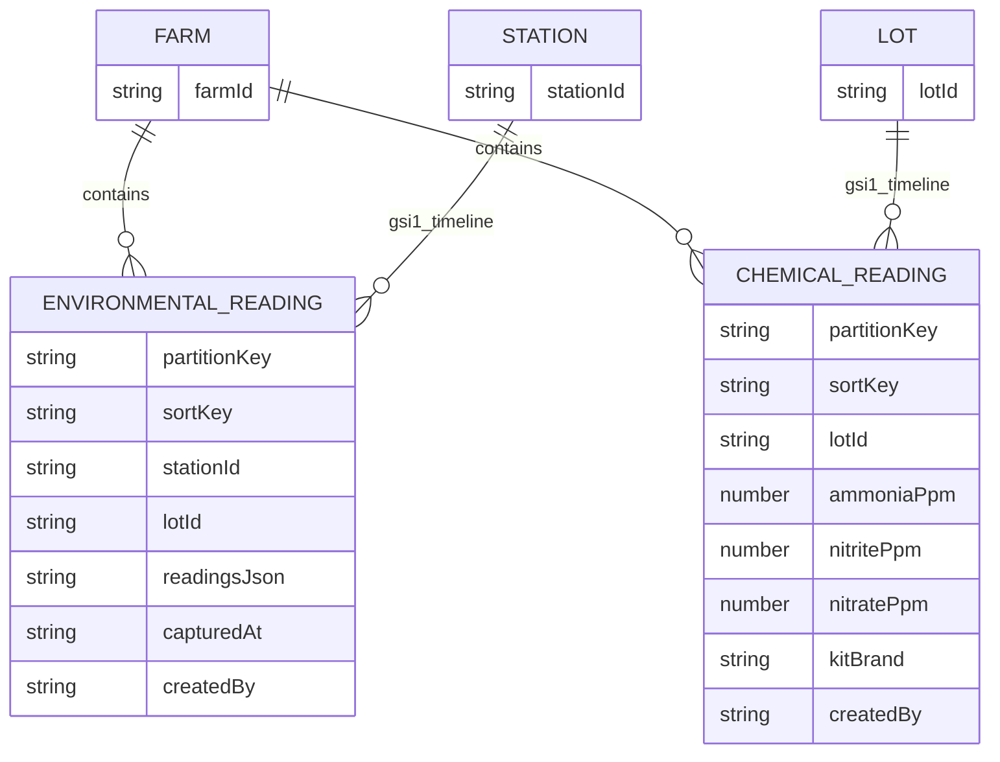

# Project Summary

**Generated:** 2026-06-23T23:05:36Z (UTC)

> **Document generated from:** repository files at `acualuz-monitor` (branch `feat/entrega2-ICS`). Imported product/architecture/data documents under `docs/` are bootstrapped locally from [`acualuz-c4`](https://github.com/icsanabriar/acualuz-c4) and are **not committed** to this repository; source links for those artifacts point to the upstream `acualuz-c4` tree.

---

## Index

| Section | Link |
|---|---|
| 0. Project Information | [#0-project-information](#0-project-information) |
| 0.1. Full Name | [#01-full-name](#01-full-name) |
| 0.2. Project Name | [#02-project-name](#02-project-name) |
| 0.3. Project Description | [#03-project-description](#03-project-description) |
| 0.4. Project URLs | [#04-project-urls](#04-project-urls) |
| 0.5. Tools Used | [#05-tools-used](#05-tools-used) |
| 1. Product Overview | [#1-product-overview](#1-product-overview) |
| 1.1. Objective | [#11-objective](#11-objective) |
| 1.2. Main Features and Functionalities | [#12-main-features-and-functionalities](#12-main-features-and-functionalities) |
| 1.3. User Experience Design | [#13-user-experience-design](#13-user-experience-design) |
| 1.4. Installation Instructions | [#14-installation-instructions](#14-installation-instructions) |
| 2. System Architecture | [#2-system-architecture](#2-system-architecture) |
| 2.1. Architecture Diagram | [#21-architecture-diagram](#21-architecture-diagram) |
| 2.2. Description of Main Components | [#22-description-of-main-components](#22-description-of-main-components) |
| 2.3. High-Level Project Description and File Structure | [#23-high-level-project-description-and-file-structure](#23-high-level-project-description-and-file-structure) |
| 2.4. Infrastructure & Deployment | [#24-infrastructure--deployment](#24-infrastructure--deployment) |
| 2.5. Security | [#25-security](#25-security) |
| 2.6. Testing | [#26-testing](#26-testing) |
| 3. Data Model | [#3-data-model](#3-data-model) |
| 3.1. Data Model Diagram | [#31-data-model-diagram](#31-data-model-diagram) |
| 3.2. Description of Main Entities | [#32-description-of-main-entities](#32-description-of-main-entities) |
| 4. API Specification | [#4-api-specification](#4-api-specification) |
| 5. User Stories | [#5-user-stories](#5-user-stories) |
| 6. Work Tickets | [#6-work-tickets](#6-work-tickets) |
| 7. Pull Requests | [#7-pull-requests](#7-pull-requests) |

---

## 0. Project Information

### 0.1. Full Name

**Acualuz Monitor Backend Service**

Source(s): 
- [README.md](https://github.com/icsanabriar/acualuz-monitor/blob/main/README.md)

### 0.2. Project Name

**acualuz-monitor** (service slug: `monitor`)

Source(s): 
- [.cursor/domain.manifest.yaml](https://github.com/icsanabriar/acualuz-monitor/blob/main/.cursor/domain.manifest.yaml)

### 0.3. Project Description

AWS Lambda + API Gateway + DynamoDB backend for the **monitor** domain of the Acualuz aquaponic farm management platform. It owns MVP use case **UC-001: Import environmental and chemical monitoring readings** and ships six Lambdas: three Cognito-protected product routes (environmental batch ingest, manual chemistry ingest, alerts listing) and three public discovery routes (health check, OpenAPI JSON, Swagger UI).

Source(s): 
- [README.md — Overview](https://github.com/icsanabriar/acualuz-monitor/blob/main/README.md)
- [docs/product/prd.md](https://github.com/icsanabriar/acualuz-c4/blob/main/docs/product/prd.md) (imported)

### 0.4. Project URLs

| Resource | URL |
|---|---|
| Git repository | https://github.com/icsanabriar/acualuz-monitor |
| Production API base URL | `https://8pquk6uyo0.execute-api.us-east-1.amazonaws.com/` |
| AWS region | `us-east-1` |
| Deployment stage | `production` |
| Jira project | https://acualuz.atlassian.net/jira/software/projects/SCRUM |
| Monitor epic (SCRUM-5) | https://acualuz.atlassian.net/browse/SCRUM-5 |
| Architecture docs (upstream) | https://github.com/icsanabriar/acualuz-c4/tree/main/docs |
| OpenAPI spec (local) | https://github.com/icsanabriar/acualuz-monitor/blob/main/contracts/open-api.yaml |

Source(s): 
- [README.md — Production deployment](https://github.com/icsanabriar/acualuz-monitor/blob/main/README.md)
- [docs/product/jira-traceability.md](https://github.com/icsanabriar/acualuz-c4/blob/main/docs/product/jira-traceability.md)

### 0.5. Tools Used

| Category | Tools / platforms |
|---|---|
| Language & runtime | Go 1.26.4+, AWS Lambda (`provided.al2023`, `linux/arm64`) |
| Edge & auth | Amazon API Gateway HTTP API, Amazon Cognito User Pool (JWT authorizer) |
| Persistence | Amazon DynamoDB (on-demand, single-table per service) |
| Events | Amazon EventBridge (optional `EVENT_BUS_NAME`; MVP records events) |
| IaC & deploy | Serverless Framework v3, Node.js 20+ |
| CI/CD | GitHub Actions (`ci.yml`, `deploy.yml`), GitHub OIDC for AWS |
| Observability | `log/slog`, CloudWatch EMF metrics, CloudWatch alarms |
| API contracts | OpenAPI 3.1 (`kin-openapi`), Postman/Newman |
| Quality gates | `golangci-lint`, `govulncheck`, `gitleaks`, `go-licenses`, SonarCloud |
| Review automation | CodeRabbit, Qodo (PR-Agent) |
| Issue tracking | Jira (project `SCRUM` / acualuz-tech) |
| Local testing | DynamoDB Local (Docker), `make unit-test`, `make integration-test` |

Source(s): 
- [README.md](https://github.com/icsanabriar/acualuz-monitor/blob/main/README.md)
- [serverless.yml](https://github.com/icsanabriar/acualuz-monitor/blob/main/serverless.yml)
- [docs/architecture/backend-design.md](https://github.com/icsanabriar/acualuz-c4/blob/main/docs/architecture/backend-design.md)
- [docs/architecture/aws-cost.md](https://github.com/icsanabriar/acualuz-c4/blob/main/docs/architecture/aws-cost.md)

---

## 1. Product Overview

### 1.1. Objective

Enable field technicians and farm administrators to capture environmental sensor data and manual water-chemistry readings (ammonia, nitrite, nitrate) so anomalies can be detected quickly, protecting biomass and crop health and anchoring the **Acualuz Pro monthly subscription** value proposition.

Primary use case:  
**UC-001** — Import environmental and chemical monitoring readings.

Source(s): 
- [docs/product/mvp-use-cases.md — UC-001](https://github.com/icsanabriar/acualuz-c4/blob/main/docs/product/mvp-use-cases.md)
- [docs/product/prd.md — Main functions](https://github.com/icsanabriar/acualuz-c4/blob/main/docs/product/prd.md)

### 1.2. Main Features and Functionalities

| Feature | Description | Backend route(s) |
|---|---|---|
| Environmental batch ingest | Accept CSV or API batch upload of environmental sensor readings (temperature, pH, dissolved oxygen, salinity) with partial-success error reporting | `POST /api/monitor/readings/environmental` |
| Manual chemistry capture | Record KIT-based ammonia/nitrite/nitrate readings with analyte enum and unit metadata | `POST /api/monitor/readings/chemical` |
| Integrity alerts listing | List monitor-scoped out-of-range alerts for administrators with farm/station/lot/severity/time filters | `GET /api/monitor/alerts` |
| API discovery | Public health probe, OpenAPI JSON, and Swagger UI for integrators | `GET /healthz`, `GET /open-api.json`, `GET /docs` |
| Domain events | Emit `MONITOR_ENVIRONMENTAL_IMPORTED` and `MONITOR_CHEMICAL_CREATED` on successful writes | EventBridge (optional) |

Source(s): 
- [README.md — Product routes](https://github.com/icsanabriar/acualuz-monitor/blob/main/README.md)
- [docs/architecture/backend-design.md — API routes](https://github.com/icsanabriar/acualuz-c4/blob/main/docs/architecture/backend-design.md)
- [docs/data/events.md](https://github.com/icsanabriar/acualuz-c4/blob/main/docs/data/events.md)

### 1.3. User Experience Design

UX for the monitor module is documented for the React frontend (`acualuz-frontend`), not in this backend repository. Documented screens (Spanish operator copy):

| Screen (English heading) | Spanish UI example | Purpose |
|---|---|---|
| Environmental import wizard | "Importar lecturas ambientales" | Batch upload with CSV preview and per-row error feedback |
| Chemical form | "Registrar química del agua" | Manual ammonia/nitrite/nitrate entry with KIT brand selector |
| Alert inbox | "Alertas de integridad" | Out-of-range readings with farm/station filters |

Design constraints: mobile-first / small-screen-first for Android phones on the farm; visible labels and logical focus order on all form fields.

Source(s): 
- [docs/architecture/frontend-design.md — Module: monitor](https://github.com/icsanabriar/acualuz-c4/blob/main/docs/architecture/frontend-design.md)
- [docs/product/use-case-diagrams.md — UC-001](https://github.com/icsanabriar/acualuz-c4/blob/main/docs/product/use-case-diagrams.md)

### 1.4. Installation Instructions

#### Prerequisites

- Go 1.26.4+
- Node.js 20+ (Serverless Framework CLI)
- Docker (DynamoDB Local for integration tests)
- Optional: `gitleaks`, `govulncheck`, `go-licenses`, `newman`, `openapi-to-postmanv2`
- AWS account with deploy permissions (GitHub OIDC role for CI; named profile for local deploy)
- Bootstrapped `docs/` tree for planning workflows (import from `acualuz-c4`)

Source(s): 
- [README.md — Prerequisites](https://github.com/icsanabriar/acualuz-monitor/blob/main/README.md)

#### Bootstrap imported documentation

```bash
rsync -a --delete ../acualuz-c4/docs/ ./docs/
make docs-check
make install-hooks
```

Source(s): 
- [README.md — Imported documentation bootstrap](https://github.com/icsanabriar/acualuz-monitor/blob/main/README.md)

#### Build, test, and deploy

```bash
npm install
cd src && go mod tidy && cd ..
make build
make unit-test
docker run -d --rm -p 8000:8000 --name dynamodb-local amazon/dynamodb-local
DYNAMODB_ENDPOINT=http://localhost:8000 make integration-test
docker stop dynamodb-local
make security-scan
make license-check
make deploy STAGE=production   # requires AWS credentials + Cognito env vars
```

Source(s): 
- [README.md — Getting started](https://github.com/icsanabriar/acualuz-monitor/blob/main/README.md)

#### Not documented in committed repository files

- Custom domain wiring (`https://api.acualuz.example.com` is a placeholder in OpenAPI; live API Gateway URL is authoritative).
- Cognito user pool / app client creation steps (IDs resolved from SSM or GitHub secrets at deploy time).

---

## 2. System Architecture

### 2.1. Architecture Diagram

Reproduced from [README.md — Architecture at a glance](https://github.com/icsanabriar/acualuz-monitor/blob/main/README.md):


```mermaid
flowchart TB
    clients[Clients]
    apiGateway["API Gateway HTTP API"]
    jwtAuth["Cognito JWT authorizer"]

    subgraph productLambdas [Product Lambdas — JWT]
        envImport[monitor-environmental-import]
        chemImport[monitor-chemical-import]
        listAlerts[monitor-list-alerts]
    end

    subgraph discoveryLambdas [Discovery Lambdas — public]
        healthz[monitor-healthz]
        openapi[monitor-openapi]
        docs[monitor-docs]
    end

    dynamoDB["DynamoDB (monitor table)"]

    clients --> apiGateway
    apiGateway --> jwtAuth
    jwtAuth --> envImport
    jwtAuth --> chemImport
    jwtAuth --> listAlerts
    apiGateway --> healthz
    apiGateway --> openapi
    apiGateway --> docs
    envImport --> dynamoDB
    chemImport --> dynamoDB
    listAlerts --> dynamoDB
```

UC-001 sequence (technician flow):

Source: [docs/product/use-case-diagrams.md — UC-001 Diagram](https://github.com/icsanabriar/acualuz-c4/blob/main/docs/product/use-case-diagrams.md)


```mermaid
sequenceDiagram
    actor Tech as Field Technician
    participant FE as Frontend
    participant API as API Gateway
    participant Svc as monitor Lambdas
    participant DB as DynamoDB

    Tech->>FE: Open readings form
    FE->>API: POST /api/monitor/readings/environmental
    API->>Svc: Validate lot and sensors
    Svc->>DB: Save readings
    DB-->>Svc: Confirmation
    Svc-->>API: 200 OK
    API-->>FE: Show confirmation
    FE-->>Tech: Reading saved successfully

    alt No connectivity
        FE-->>Tech: Show offline message and save draft
    end
```

### 2.2. Description of Main Components

| Component | Role |
|---|---|
| **API Gateway HTTP API** | Routes six HTTP paths; Cognito JWT authorizer on product routes; CORS and usage-plan throttling |
| **monitor-environmental-import** | Validates and persists environmental sensor batches; partial-success envelope; emits `MONITOR_ENVIRONMENTAL_IMPORTED` |
| **monitor-chemical-import** | Persists manual chemistry readings; idempotent writes; emits `MONITOR_CHEMICAL_CREATED` |
| **monitor-list-alerts** | Read-only alerts query with farm/station/lot/severity/time filters and cursor pagination |
| **monitor-healthz** | Liveness probe without downstream AWS calls |
| **monitor-openapi** | Serves OpenAPI 3.1 JSON (`Cache-Control: public, max-age=300`) |
| **monitor-docs** | Swagger UI bound to `/open-api.json` |
| **DynamoDB (`DYNAMODB_TABLE_MONITOR`)** | Single-table layout for `EnvironmentalReading` and `ChemicalReading` entities |
| **Amazon Cognito** | JWT issuer/audience validation; farm scope via `cognito:groups` (`farm:<farmId>`) |
| **EventBridge (`EVENT_BUS_NAME`)** | Optional domain event publishing |
| **GitHub Actions CI/CD** | Lint, build, test, security, deploy to single `production` stage via OIDC |

Source(s): 
- [docs/architecture/backend-design.md](https://github.com/icsanabriar/acualuz-c4/blob/main/docs/architecture/backend-design.md)
- [serverless.yml](https://github.com/icsanabriar/acualuz-monitor/blob/main/serverless.yml)
- [.cursor/domain.manifest.yaml](https://github.com/icsanabriar/acualuz-monitor/blob/main/.cursor/domain.manifest.yaml)

### 2.3. High-Level Project Description and File Structure

Clean architecture layout (Go module root: `src/`):

```text
acualuz-monitor/
├── src/
│   ├── cmd/                          # Lambda entrypoints (one binary per function)
│   │   ├── monitor-environmental-import/
│   │   ├── monitor-chemical-import/
│   │   ├── monitor-list-alerts/
│   │   ├── monitor-healthz/
│   │   ├── monitor-openapi/
│   │   └── monitor-docs/
│   ├── internal/
│   │   ├── handler/                  # API Gateway adapters, error mapping
│   │   ├── usecase/                  # Business logic
│   │   ├── domain/                   # Pure domain types and validation
│   │   └── repository/               # DynamoDB access
│   └── pkg/
│       ├── auth/                     # Cognito JWT / farm-scope helpers
│       └── observability/            # Logging, correlation IDs, EMF metrics
├── contracts/open-api.yaml           # OpenAPI 3.1 spec (six routes)
├── contracts/schema-reference.md     # Human-readable schema tables
├── serverless.yml                    # IaC: Lambdas, API, DynamoDB, alarms
├── .github/workflows/                # ci.yml, deploy.yml
├── postman/                          # Newman collection + environments
├── runbooks/observability.md         # Alarm catalog, OIDC trust policy
├── Makefile                          # build, test, lint, deploy targets
└── .cursor/                          # Cursor agents, rules, domain manifest
```

Source(s): 
- [docs/architecture/backend-design.md — Package structure / acualuz-monitor](https://github.com/icsanabriar/acualuz-c4/blob/main/docs/architecture/backend-design.md)
- [README.md](https://github.com/icsanabriar/acualuz-monitor/blob/main/README.md)

### 2.4. Infrastructure & Deployment

| Item | Value |
|---|---|
| IaC tool | Serverless Framework v3 (`serverless.yml`) |
| Lambda defaults | 128 MB memory, 10 s timeout, ≤ 15 MB artifact |
| Architecture | `arm64` on Amazon Linux 2023 |
| Stage | `production` only (no dev/staging) |
| CI trigger | PR and push to `main` → `ci.yml` |
| Deploy trigger | Merge to `main` after CI → `deploy.yml` |
| AWS credentials (CI) | GitHub OIDC (no long-lived keys) |
| First successful deploy | 2026-06-22 |
| Latest documented deploy | 2026-06-23 |
| Monthly AWS budget (platform) | ~USD 5.87 (monitor share documented in platform cost model) |

Post-deploy smoke checks: `GET /healthz` → 200; `GET /open-api.json` → 200 with OpenAPI body; legacy `GET /openapi.json` → 404.

Source(s): 
- [README.md — Production deployment](https://github.com/icsanabriar/acualuz-monitor/blob/main/README.md)
- [serverless.yml](https://github.com/icsanabriar/acualuz-monitor/blob/main/serverless.yml)
- [docs/architecture/aws-cost.md](https://github.com/icsanabriar/acualuz-c4/blob/main/docs/architecture/aws-cost.md)
- [.github/workflows/deploy.yml](https://github.com/icsanabriar/acualuz-monitor/blob/main/.github/workflows/deploy.yml)

### 2.5. Security

| Control | Implementation |
|---|---|
| Authentication | Cognito JWT authorizer on all product routes (`monitor/read`, `monitor/write` scopes) |
| Authorization (BOLA) | Farm ID derived from `cognito:groups` claim (`farm:<farmId>`); request `farmId` must match |
| Idempotency | `Idempotency-Key` header required on mutating POST routes |
| Secrets | SSM Parameter Store / Secrets Manager; no secrets in source |
| Encryption | TLS 1.2+ in transit; AWS-managed KMS at rest for DynamoDB |
| PII | `createdBy` treated as sensitive; never logged raw; synthetic fixtures in tests |
| Supply chain | `govulncheck`, `gitleaks`, `go-licenses` on every PR; Dependabot weekly |
| OWASP API Top 10 | Checklist verified on every handler change |

Source(s): 
- [README.md — Security](https://github.com/icsanabriar/acualuz-monitor/blob/main/README.md)
- [docs/data/data-strategy.md — Privacy constraints](https://github.com/icsanabriar/acualuz-c4/blob/main/docs/data/data-strategy.md)
- [docs/architecture/repo-boundaries.md](https://github.com/icsanabriar/acualuz-c4/blob/main/docs/architecture/repo-boundaries.md)

### 2.6. Testing

| Layer | Approach | Coverage floor |
|---|---|---|
| Domain (`internal/domain`) | Pure unit tests, table-driven, Given/When/Then | 100% lines & branches |
| Use case | Injected repository mocks | ≥ 95% |
| Handler | Contract tests against OpenAPI; auth scope tests | ≥ 95% |
| Repository | Mock DynamoDB in unit tests; DynamoDB Local in integration tests | ≥ 90% |
| Overall | `make unit-test` gate in CI | ≥ 95% |
| Contract | `kin-openapi` validation per route | Required on merge |
| Integration | Tagged tests against DynamoDB Local (Docker) | CI job `integration-test` |
| Static analysis | SonarCloud (non-fork PRs), `golangci-lint`, `govulncheck` | High/Critical blocks merge |
| API smoke | Postman/Newman collection under `postman/` | Optional local |

Source(s): 
- [README.md — Testing](https://github.com/icsanabriar/acualuz-monitor/blob/main/README.md)
- [docs/architecture/testing-strategy.md](https://github.com/icsanabriar/acualuz-c4/blob/main/docs/architecture/testing-strategy.md)

---

## 3. Data Model

### 3.1. Data Model Diagram

Monitor service entities within the platform single-table-per-service pattern:


```mermaid
erDiagram
    FARM ||--o{ ENVIRONMENTAL_READING : contains
    FARM ||--o{ CHEMICAL_READING : contains
    STATION ||--o{ ENVIRONMENTAL_READING : gsi1_timeline
    LOT ||--o{ CHEMICAL_READING : gsi1_timeline

    FARM {
        string farmId
    }
    STATION {
        string stationId
    }
    LOT {
        string lotId
    }
    ENVIRONMENTAL_READING {
        string partitionKey
        string sortKey
        string stationId
        string lotId
        string readingsJson
        string capturedAt
        string createdBy
    }
    CHEMICAL_READING {
        string partitionKey
        string sortKey
        string lotId
        number ammoniaPpm
        number nitritePpm
        number nitratePpm
        string kitBrand
        string createdBy
    }
```

Key shapes (single-table): `EnvironmentalReading` uses `PK = FARM#<farmId>`, `SK = ENV#<readingId>`; `ChemicalReading` uses `PK = FARM#<farmId>`, `SK = CHEM#<readingId>` (see entity table below).

Source(s): 
- [docs/data/data-model.md — Entities & Access patterns](https://github.com/icsanabriar/acualuz-c4/blob/main/docs/data/data-model.md)

### 3.2. Description of Main Entities

| Entity | PK | SK | GSI1 | Key attributes | Access patterns (UC-001) |
|---|---|---|---|---|---|
| **EnvironmentalReading** | `FARM#<farmId>` | `ENV#<readingId>` | `GSI1PK = STATION#<stationId>` / `GSI1SK = TS#<iso8601>` | `stationId`, `lotId`, `readingsJson`, `capturedAt`, `createdBy` | Batch ingest per farm/station (T-001); station timeline for alerts (T-002) |
| **ChemicalReading** | `FARM#<farmId>` | `CHEM#<readingId>` | `GSI1PK = LOT#<lotId>` / `GSI1SK = TS#<iso8601>` | `lotId`, `ammoniaPpm`, `nitritePpm`, `nitratePpm`, `kitBrand`, `createdBy` | Manual chemistry create (T-002) |

**Constraints and assumptions:**

- Tenant isolation via `FARM#<farmId>` partition key; MVP assumes single farm per deployment can use a constant farm identifier.
- On-demand DynamoDB billing; no cross-service table access.
- `createdBy` is classified sensitive per privacy table; pseudonymized in analytics tiers.
- Alerts are a read model over stored readings; no separate alert entity row in MVP data model.

Source(s): 
- [docs/data/data-model.md](https://github.com/icsanabriar/acualuz-c4/blob/main/docs/data/data-model.md)
- [.cursor/domain.manifest.yaml — dataModel](https://github.com/icsanabriar/acualuz-monitor/blob/main/.cursor/domain.manifest.yaml)

---

## 4. API Specification

| Method | Endpoint | Description | Request | Response | Auth Required | Source |
|---|---|---|---|---|---|---|
| POST | `/api/monitor/readings/environmental` | Ingest environmental sensor batch; partial success with per-row errors; emits `MONITOR_ENVIRONMENTAL_IMPORTED` | `EnvironmentalIngestRequest` | `EnvironmentalIngestResponse` | Yes — Cognito JWT scope `monitor/write`; `Idempotency-Key` header | [contracts/open-api.yaml](https://github.com/icsanabriar/acualuz-monitor/blob/main/contracts/open-api.yaml), [docs/architecture/backend-design.md — API routes](https://github.com/icsanabriar/acualuz-c4/blob/main/docs/architecture/backend-design.md) |
| POST | `/api/monitor/readings/chemical` | Record manual KIT chemistry reading; emits `MONITOR_CHEMICAL_CREATED` | `ChemicalReadingRequest` | `ChemicalReadingResponse` | Yes — Cognito JWT scope `monitor/write`; `Idempotency-Key` header | [contracts/open-api.yaml](https://github.com/icsanabriar/acualuz-monitor/blob/main/contracts/open-api.yaml) |
| GET | `/api/monitor/alerts` | List integrity alerts with farm/station/lot/severity/time filters and cursor pagination | `EmptyBody` (query params) | `MonitorAlertListResponse` | Yes — Cognito JWT scope `monitor/read` | [contracts/open-api.yaml](https://github.com/icsanabriar/acualuz-monitor/blob/main/contracts/open-api.yaml) |
| GET | `/healthz` | Liveness probe; no downstream dependency calls | — | `{ status, service, lambda }` | No | [contracts/open-api.yaml](https://github.com/icsanabriar/acualuz-monitor/blob/main/contracts/open-api.yaml) |
| GET | `/open-api.json` | OpenAPI 3.1 document as JSON | — | OpenAPI object | No | [contracts/open-api.yaml](https://github.com/icsanabriar/acualuz-monitor/blob/main/contracts/open-api.yaml) |
| GET | `/docs` | Swagger UI HTML bound to `/open-api.json` | — | HTML | No | [contracts/open-api.yaml](https://github.com/icsanabriar/acualuz-monitor/blob/main/contracts/open-api.yaml) |

**Error envelope (all non-2xx):** 
```json
{ 
    "error": { 
        "code", 
        "message", 
        "details?", 
        "correlationId?" 
    } 
}
```

Schema reference tables: 
- [contracts/schema-reference.md](https://github.com/icsanabriar/acualuz-monitor/blob/main/contracts/schema-reference.md)

---

## 5. User Stories

Monitor-domain stories only (this repository scope). Status from Jira (queried 2026-06-23).

| ID | User Story | Acceptance Criteria | Priority | Source |
|---|---|---|---|---|
| UC-001 | As a **Field Technician**, I want to import environmental and chemical monitoring readings so administrators can detect water-quality anomalies quickly. | 1. System accepts CSV or API batch upload for environmental sensors.<br>2. Manual form for ammonia/nitrite/nitrate (KIT readings).<br>3. Administrator reviews automated integrity alerts for out-of-range values. | Impact: H, Effort: M (composite score 6) | [docs/product/mvp-use-cases.md — UC-001](https://github.com/icsanabriar/acualuz-c4/blob/main/docs/product/mvp-use-cases.md) |
| SCRUM-5 (Epic) | Monitor Service MVP (UC-001) — environmental and chemical monitoring readings import for `acualuz-monitor`. | Epic covers tickets T-001, T-002. | Medium (Jira) | [Jira SCRUM-5](https://acualuz.atlassian.net/browse/SCRUM-5) |
| SCRUM-6 / T-001 | Environmental batch ingestion API — `POST /api/monitor/readings/environmental`. | Request body validates required station/lot identifiers and timestamp ordering.<br>Failed rows return partial success envelope with per-row errors. | Medium (Jira) — **Finalizada** | [Jira SCRUM-6](https://acualuz.atlassian.net/browse/SCRUM-6), [docs/product/mvp-tickets.md — T-001](https://github.com/icsanabriar/acualuz-c4/blob/main/docs/product/mvp-tickets.md) |
| SCRUM-12 / T-002 | Chemical reading capture and alert surfacing — `POST /api/monitor/readings/chemical`, `GET /api/monitor/alerts`. | Chemical readings stored with unit metadata and actor audit fields.<br>Alerts query returns only monitor-scoped anomalies. | Medium (Jira) — **Finalizada** | [Jira SCRUM-12](https://acualuz.atlassian.net/browse/SCRUM-12), [docs/product/mvp-tickets.md — T-002](https://github.com/icsanabriar/acualuz-c4/blob/main/docs/product/mvp-tickets.md) |

---

## 6. Work Tickets

Monitor service tickets only (T-001, T-002).

| Ticket | Title | Description | Status | Related Files | Source |
|---|---|---|---|---|---|
| T-001 | Environmental batch ingestion API | Implement authenticated `POST /api/monitor/readings/environmental` Lambda; validate and persist environmental sensor batches; write `MONITOR_ENVIRONMENTAL_IMPORTED` event. Estimate: 2 days. | **Done** (Jira SCRUM-6: Finalizada) | [src/cmd/monitor-environmental-import/](https://github.com/icsanabriar/acualuz-monitor/blob/main/src/cmd/monitor-environmental-import/main.go), [src/internal/handler/environmental_import.go](https://github.com/icsanabriar/acualuz-monitor/blob/main/src/internal/handler/environmental_import.go), [src/internal/usecase/](https://github.com/icsanabriar/acualuz-monitor/tree/main/src/internal/usecase), [src/internal/repository/environmental.go](https://github.com/icsanabriar/acualuz-monitor/blob/main/src/internal/repository/environmental.go) | [docs/product/mvp-tickets.md — T-001](https://github.com/icsanabriar/acualuz-c4/blob/main/docs/product/mvp-tickets.md), [Jira SCRUM-6](https://acualuz.atlassian.net/browse/SCRUM-6) |
| T-002 | Chemical reading capture and alert surfacing | Add `POST /api/monitor/readings/chemical` and `GET /api/monitor/alerts` with Cognito auth; chemical write emits `MONITOR_CHEMICAL_CREATED`; list endpoint returns integrity flags. Estimate: 2 days. | **Done** (Jira SCRUM-12: Finalizada) | [src/cmd/monitor-chemical-import/](https://github.com/icsanabriar/acualuz-monitor/blob/main/src/cmd/monitor-chemical-import/main.go), [src/cmd/monitor-list-alerts/](https://github.com/icsanabriar/acualuz-monitor/blob/main/src/cmd/monitor-list-alerts/main.go), [contracts/open-api.yaml](https://github.com/icsanabriar/acualuz-monitor/blob/main/contracts/open-api.yaml) | [docs/product/mvp-tickets.md — T-002](https://github.com/icsanabriar/acualuz-c4/blob/main/docs/product/mvp-tickets.md), [Jira SCRUM-12](https://acualuz.atlassian.net/browse/SCRUM-12) |

---

## 7. Pull Requests

All pull requests in `acualuz-monitor` as of generation time (25 merged; none open).

| PR | Title | Description | Status | Related Work | Source |
|---|---|---|---|---|---|
| #25 | ci(monitor): Add SonarCloud gate and align ingest error handling. | SonarCloud CI job; environmental partial-success row errors; chemical 409 CONFLICT mapping; repository integration-test exemplar. | MERGED | UC-001, T-001, T-002 | https://github.com/icsanabriar/acualuz-monitor/pull/25 |
| #24 | chore(deps): Bump actions/cache from 5.0.4 to 5.0.5 | Dependabot GitHub Actions dependency bump. | MERGED | CI infrastructure | https://github.com/icsanabriar/acualuz-monitor/pull/24 |
| #23 | chore(deps): Bump actions/github-script from 7.1.0 to 9.0.0 | Dependabot GitHub Actions dependency bump. | MERGED | CI infrastructure | https://github.com/icsanabriar/acualuz-monitor/pull/23 |
| #22 | fix(ci): Remove invalid top-level name from dependabot.yml. | Fix invalid Dependabot YAML schema. | MERGED | Supply chain config | https://github.com/icsanabriar/acualuz-monitor/pull/22 |
| #21 | feat(monitor): Align observability and project-audit governance. | Structured JSON logging, EMF metrics, DynamoDB correlation middleware, audit events, discovery handler instrumentation. | MERGED | UC-001 | https://github.com/icsanabriar/acualuz-monitor/pull/21 |
| #20 | fix(monitor): Harden Cognito groups parsing for farm auth. | Robust `cognito:groups` parsing; safe farm-auth failure diagnostics. | MERGED | UC-001, T-001 | https://github.com/icsanabriar/acualuz-monitor/pull/20 |
| #19 | fix(monitor): Resolve farm scope from Cognito groups. | Farm scope from `farm:<farmId>` groups instead of `custom:farmId` only. | MERGED | UC-001 | https://github.com/icsanabriar/acualuz-monitor/pull/19 |
| #18 | fix(monitor): Align Cognito scope names with resource server format. | Scope names `monitor/read` and `monitor/write` aligned with Cognito resource server. | MERGED | UC-001 | https://github.com/icsanabriar/acualuz-monitor/pull/18 |
| #17 | chore(deps): Bump actions/upload-artifact from 4.6.2 to 7.0.1 | Dependabot GitHub Actions dependency bump. | MERGED | CI infrastructure | https://github.com/icsanabriar/acualuz-monitor/pull/17 |
| #16 | chore(deps): Bump actions/setup-go from 5.6.0 to 6.4.0 | Dependabot GitHub Actions dependency bump. | MERGED | CI infrastructure | https://github.com/icsanabriar/acualuz-monitor/pull/16 |
| #15 | chore(deps): Bump actions/setup-node from 4.4.0 to 6.4.0 | Dependabot GitHub Actions dependency bump. | MERGED | CI infrastructure | https://github.com/icsanabriar/acualuz-monitor/pull/15 |
| #14 | ci(infra): Skip docs-bootstrap-check on Dependabot PRs. | CI exemption for Dependabot PRs on docs-bootstrap gate. | MERGED | CI infrastructure | https://github.com/icsanabriar/acualuz-monitor/pull/14 |
| #13 | chore(deps-dev): Bump serverless from 3.39.0 to 3.40.0 | Dependabot npm dependency bump. | MERGED | IaC tooling | https://github.com/icsanabriar/acualuz-monitor/pull/13 |
| #12 | chore(deps): Bump kin-openapi from 0.139.0 to 0.140.0 | Dependabot Go module bump for OpenAPI validation. | MERGED | Contract tests | https://github.com/icsanabriar/acualuz-monitor/pull/12 |
| #11 | chore(deps): Bump actions/checkout from 4.3.1 to 7.0.0 | Dependabot GitHub Actions dependency bump. | MERGED | CI infrastructure | https://github.com/icsanabriar/acualuz-monitor/pull/11 |
| #10 | chore(deps): Bump actions/download-artifact from 4.3.0 to 8.0.1 | Dependabot GitHub Actions dependency bump. | MERGED | CI infrastructure | https://github.com/icsanabriar/acualuz-monitor/pull/10 |
| #9 | chore(deps): Bump aws-actions/configure-aws-credentials from 4.3.1 to 6.2.0 | Dependabot GitHub Actions dependency bump. | MERGED | Deploy OIDC | https://github.com/icsanabriar/acualuz-monitor/pull/9 |
| #8 | chore(ci): Add Dependabot for Go, npm, and GitHub Actions. | Initial Dependabot configuration. | MERGED | Supply chain | https://github.com/icsanabriar/acualuz-monitor/pull/8 |
| #7 | fix(ci): Use vars for PRODUCTION_BASE_URL in deploy workflow. | Deploy workflow smoke-test URL from GitHub vars. | MERGED | Deploy pipeline | https://github.com/icsanabriar/acualuz-monitor/pull/7 |
| #6 | feat(SCRUM-12): Chemical import and alerts handlers. | Implements T-002: chemical import and alerts listing Lambdas. | MERGED | UC-001, T-002, SCRUM-12 | https://github.com/icsanabriar/acualuz-monitor/pull/6 |
| #5 | feat(SCRUM-6): Environmental batch import handler. | Implements T-001: environmental batch ingest Lambda. | MERGED | UC-001, T-001, SCRUM-6 | https://github.com/icsanabriar/acualuz-monitor/pull/5 |
| #4 | docs(monitor): Audit governance docs and rename PR template. | Governance documentation audit and PR template updates. | MERGED | Documentation | https://github.com/icsanabriar/acualuz-monitor/pull/4 |
| #3 | ci(monitor): Refactor CI/CD, harden validators, and rename open-api route. | CI/CD refactor; OpenAPI discovery route rename to `/open-api.json`. | MERGED | CI/CD, UC-001 discovery routes | https://github.com/icsanabriar/acualuz-monitor/pull/3 |
| #2 | chore(cursor): Add domain manifest and branch-scoped prompt governance. | Cursor domain manifest and prompt log governance. | MERGED | Project governance | https://github.com/icsanabriar/acualuz-monitor/pull/2 |
| #1 | feat(cursor): Bootstrap cursor workflow, dual PR review and CI/CD. | Initial Cursor workflow, CodeRabbit/Qodo dual review, CI/CD bootstrap. | MERGED | Project bootstrap | https://github.com/icsanabriar/acualuz-monitor/pull/1 |

---

## 7. Demostration

This section contains aditional artifacts to show the progess made on the acualuz platform development, especially on acualuz-monitor
backend service.

- [Artifacts] (https://drive.google.com/drive/folders/1MhBljKvan5xsZpCzaS2We4d0diSL0dO8?usp=drive_link)

---

*Generated: 2026-06-23 | Repository: https://github.com/icsanabriar/acualuz-monitor | Version: 0.1.0*
