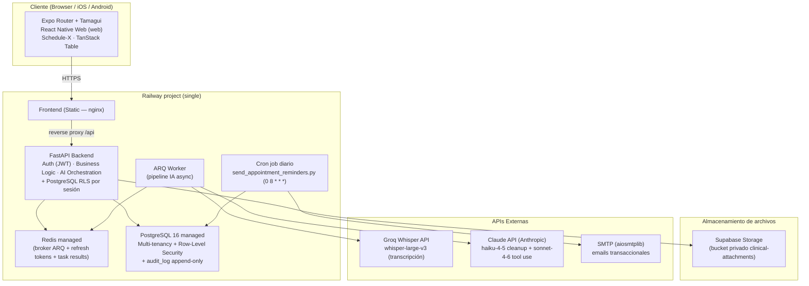
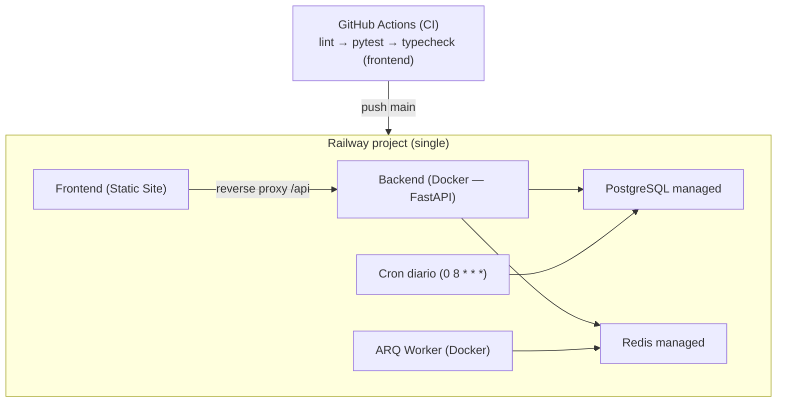
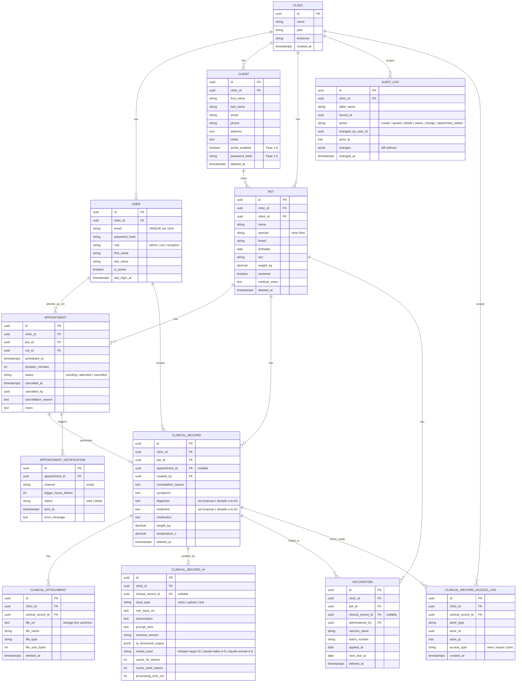

## Índice

0. [Ficha del proyecto](#0-ficha-del-proyecto)
1. [Descripción general del producto](#1-descripción-general-del-producto)
2. [Arquitectura del sistema](#2-arquitectura-del-sistema)
3. [Modelo de datos](#3-modelo-de-datos)
4. [Especificación de la API](#4-especificación-de-la-api)
5. [Historias de usuario](#5-historias-de-usuario)
6. [Tickets de trabajo](#6-tickets-de-trabajo)
7. [Pull requests](#7-pull-requests)

---

## 0. Ficha del proyecto

### **0.1. Tu nombre completo:**

Franco Borgato, Mateo Costes

### **0.2. Nombre del proyecto:**

Veterinary Intelligence Platform

### **0.3. Descripción breve del proyecto:**

Plataforma web SaaS multi-tenant para la gestión integral de clínicas veterinarias pequeñas (1–5 veterinarios). El diferenciador central es la **asistencia de IA para estructurar historias clínicas**: el veterinario graba una nota de voz (o sube un archivo de audio) y el sistema transcribe y completa automáticamente los campos predefinidos del registro clínico (motivo, síntomas, peso, temperatura, medicación referida y —cuando el profesional los dicta explícitamente— diagnóstico y tratamiento). El profesional revisa y confirma antes de guardar. **La IA nunca inventa diagnósticos ni tratamientos**: solo estructura lo que el veterinario efectivamente dictó.

El sistema cubre además gestión de usuarios staff, clientes y mascotas, agenda multi-veterinario con detección de solapamientos (Schedule-X), perfil clínico completo de la mascota, historial clínico con adjuntos (imágenes/PDF), registro de vacunación, recordatorios automáticos de turno por email y auditoría inmutable de cambios y accesos sobre datos clínicos.

> **Estado actual (junio 2026):** el proyecto pasó de la fase de documentación a un **MVP funcional**. Hay backend (FastAPI), frontend (Expo + Tamagui) y base de datos (PostgreSQL 16 con RLS) implementados y ejecutables localmente. Se completaron 24 pull requests sobre la rama `dev` (US-001 a US-014, US-017 a US-023 y US-DASH). El flujo diferenciador de IA (voz → campos clínicos) está operativo end-to-end.

### **0.4. URL del proyecto:**

> Producto aún no desplegado en producción (no hay URL pública). El MVP es **ejecutable localmente** con Docker Compose + los scripts `backend/start.ps1` y `frontend/start.ps1` (frontend en `http://localhost:8081`, backend en `http://localhost:8000`). El deploy en Railway está documentado pero pendiente de configurar.

### 0.5. URL o archivo comprimido del repositorio

https://github.com/mateocostes/Veterinary-Intelligence-Platform

Branch principal: `main`. El desarrollo activo del MVP vive en la rama **`dev`** (24 PRs mergeados, `feat/us-XXX → dev`). La documentación técnica vive en `docs/`.

---

## 1. Descripción general del producto

### **1.1. Objetivo:**

El producto resuelve un problema cuantificable de las clínicas veterinarias pequeñas: **la documentación clínica manual consume ~10 minutos por consulta**, tiempo que el veterinario no puede dedicar al paciente. La plataforma reduce ese tiempo estructurando automáticamente la historia clínica a partir de lo que el profesional dicta.

**Valor por stakeholder:**

- **Veterinario:** graba una nota de voz mientras atiende; recibe los campos pre-completados con la información transcrita; revisa, edita lo que necesite y guarda con un click. Reduce la fricción administrativa.
- **Recepcionista:** gestiona agenda multi-profesional sin solapamientos; el sistema dispara recordatorios automáticos de turno sin llamadas manuales.
- **Administrador (dueño de la clínica, que suele también ejercer como veterinario):** gestiona el staff de la clínica; ve el perfil clínico completo de cada mascota; audita cambios sobre historias clínicas; controla quién accedió a qué información (cumplimiento Ley 25.326).
- **Dueño de mascota:** recibe recordatorios automáticos por email; en Fase 1.5 accederá a un portal propio para consultar historial y autogestionar turnos.

**Para quién:** clínicas veterinarias pequeñas argentinas de 1–5 veterinarios, donde el dueño suele también ejercer como profesional clínico, con eventual recepcionista, y con acceso a internet estable durante las consultas.

### **1.2. Características y funcionalidades principales:**

| Feature | Estado | Descripción |
|---|---|---|
| **Autenticación y multi-tenancy** | ✅ Implementado | Registro de clínica (crea Clinic + User admin atómicamente), login con JWT + refresh tokens en Redis, recuperación de contraseña por email, gestión de usuarios staff (Admin/Vet/Reception) con RBAC. Aislamiento entre clínicas con `clinic_id` + PostgreSQL Row-Level Security. |
| **Historia Clínica Asistida por IA** | ✅ Implementado | Grabación de voz (MediaRecorder web) o subida de archivo de audio → transcripción con **Groq Whisper (`whisper-large-v3`)** → limpieza con **`claude-haiku-4-5`** → **estructuración** en los campos predefinidos con **`claude-sonnet-4-6`** (tool use + schema Pydantic `ClinicalRecordExtraction`, **prompt caching** activo). La IA extrae motivo, síntomas, peso, temperatura, medicación referida y —solo si el vet los dicta explícitamente— diagnóstico y tratamiento; **nunca los inventa**. Pipeline asíncrono vía ARQ con polling y fallback manual. Toda interacción IA queda auditada en `clinical_records_ai` (append-only). |
| **Gestión de Clientes y Mascotas** | ✅ Implementado | CRUD de clientes y mascotas. Perfil clínico unificado de la mascota (datos básicos + últimas consultas + vacunas + próximos turnos). Búsqueda global por nombre de mascota o dueño con resultado enriquecido (mascota + dueño + próximo turno). |
| **Agenda y Turnos** | ✅ Implementado | Vista diaria y semanal filtrable por veterinario (Schedule-X, español, anclada al lunes). Detección de solapamiento (HTTP 409). Reprogramar / cancelar (cancelación lógica que libera el horario). Marcar atendido (`pending → attended`) e iniciar/registrar la consulta desde el turno; ver/editar la consulta ya cargada (una por turno). |
| **Adjuntos clínicos** | ✅ Implementado | Subida de imágenes/PDF (≤ 20 MB, máx. 10) a una consulta, validando el lote completo antes de subir. Almacenamiento en **Supabase Storage** (bucket privado `clinical-attachments`, URLs firmadas de corta vida). Grilla de miniaturas, apertura en pestaña nueva y borrado (soft delete auditado). |
| **Vacunación** | ✅ Implementado | Registro de vacunas aplicadas con próxima fecha de vencimiento, opcionalmente vinculadas a una consulta. |
| **Notificaciones Automáticas** | ✅ Implementado | Recordatorio de turno por email vía **SMTP (`aiosmtplib`)**, disparado por un **cron diario de Railway (`0 8 * * *`)** que avisa los turnos de mañana (un recordatorio, idempotente). Estado de cada envío visible en la agenda para admin/reception. |
| **Auditoría y Trazabilidad** | ✅ Implementado | Registro automático e inmutable de mutaciones (`audit_log`, vía event listener de SQLAlchemy `after_flush`) y de accesos individuales a historias clínicas (`clinical_record_access_log`). Append-only enforced en motor (`REVOKE UPDATE, DELETE` al rol `app_runtime`). |
| **Reportes** | 🟡 Parcial | Endpoints de reportes operativos/financieros y de auditoría en el backend; UI de reportes pendiente. |

> **Features diferidos.**
> - **Portal del Cliente (Fase 1.5):** autenticación independiente para dueños de mascotas; ver historial filtrable por veterinario y solicitar/cancelar turnos propios. Los emails de recordatorio ya enlazan a una landing pública informativa (`/appointments/{id}`); la acción real es Fase 1.5.
> - **Soporte Offline (Fase 2):** Service Workers + IndexedDB con caché local y cola de mutaciones.
> - **Generación de diagnósticos sugeridos con IA (Fase 2):** la IA del MVP solo estructura lo dictado; generar diagnósticos propios requiere validación clínica y regulatoria independiente.
> - **Observabilidad completa (Fase 2):** Sentry + Pydantic Logfire / OpenTelemetry + PostHog. El MVP se sostiene con logging estructurado de FastAPI.

### **1.3. Diseño y experiencia de usuario:**

La interfaz está implementada sobre el design system **"Clinical Serenity"** (extraído del proyecto Stitch `VetCare Digital Hub`), codificado como tokens semánticos de marca en `frontend/tamagui.config.ts` (`$brandPrimary` teal médico `#0d9488`, `$surface`, `$onSurface`, `$inputBorder`, `$radiusCard`…) y documentado en `docs/design-system.md`. La app monta `TamaguiProvider` con `defaultTheme="light"`. Cada componente consume **solo** estos tokens (regla R11), nunca hex crudos.

Flujos principales implementados:

- **Dashboard por rol:** tarjetas de navegación con visibilidad según rol (admin/vet/reception), saludo dinámico y barra de búsqueda global.
- **Flujo de consulta con IA:** turno → "Marcar atendido" → "Registrar consulta" → grabar/subir audio → indicador de procesamiento → formulario pre-llenado con los campos extraídos → editar → guardar (con opción de adjuntar archivos).
- **Flujo de agenda:** calendario Schedule-X día/semana → filtro por veterinario → "Nuevo turno" (búsqueda de mascota + selección de vet, detección de solapamiento) → click en un turno pendiente para reprogramar/cancelar.
- **Perfil de mascota:** datos básicos + historial clínico (acordeón paginado) + vacunas + próximos turnos.

> **Capturas:** la UI es funcional y verificada manualmente en navegador a lo largo del desarrollo (ver `docs/changelog/US-*.md`). Las capturas formales se agregarán en la próxima iteración de documentación.

### **1.4. Instrucciones de instalación:**

**Infraestructura local (Docker):**
```powershell
docker-compose up -d postgres redis     # PostgreSQL 16 + Redis 7 (ambos healthy)
```

**Backend (FastAPI):**
```powershell
.\backend\start.ps1    # crea venv + instala deps + aplica migraciones + uvicorn (lee .env de la raíz)
# Worker ARQ (para el flujo IA):
.\.venv\Scripts\python.exe -m arq app.worker.settings.WorkerSettings
```

**Frontend (Expo web):**
```powershell
.\frontend\start.ps1   # instala deps si faltan + expo start --web (http://localhost:8081)
```

**Variables de entorno (`.env` en la raíz, ver `.env.example`):** `DATABASE_URL` / `DATABASE_URL_SYNC`, `JWT_SECRET`, `SMTP_*` (host/port/user/password/from), `GROQ_API_KEY` (Whisper), `ANTHROPIC_API_KEY` (Claude), `SUPABASE_URL` / `SUPABASE_KEY` (adjuntos). Las migraciones (Alembic `0001`–`0011`) crean el schema, activan Row-Level Security y aplican los GRANTs append-only sobre `audit_log` / `clinical_record_access_log` / `clinical_records_ai`.

**Tests:**
```powershell
# Backend
Set-Location backend; python -m pytest
# Frontend
Set-Location frontend; npx jest
# E2E
Set-Location e2e; npx playwright test --project=chromium
```

---

## 2. Arquitectura del Sistema

### **2.1. Diagrama de arquitectura:**

La arquitectura sigue un patrón de tres capas desacopladas: frontend (Expo + React Native Web), backend API REST (FastAPI) y base de datos relacional (PostgreSQL). Los servicios de IA y email se consumen como APIs externas. El almacenamiento de archivos es independiente de la base de datos. **Todos los servicios se planifican en un único proyecto de Railway** para simplificar la operación y eliminar CORS interno.


```mermaid
flowchart TD
  subgraph Client["Cliente (Browser / iOS / Android)"]
    FE["Expo Router + Tamagui<br/>React Native Web (web)<br/>Schedule-X · TanStack Table"]
  end

  subgraph Railway["Railway project (single)"]
    STATIC["Frontend (Static — nginx)"]
    API["FastAPI Backend<br/>Auth (JWT) · Business Logic · AI Orchestration<br/>+ PostgreSQL RLS por sesión"]
    ARQ["ARQ Worker<br/>(pipeline IA async)"]
    CRON["Cron job diario<br/>send_appointment_reminders.py (0 8 * * *)"]
    RED["Redis managed<br/>(broker ARQ + refresh tokens + task results)"]
    PG["PostgreSQL 16 managed<br/>Multi-tenancy + Row-Level Security<br/>+ audit_log append-only"]
  end

  subgraph Storage["Almacenamiento de archivos"]
    S3["Supabase Storage<br/>(bucket privado clinical-attachments)"]
  end

  subgraph External["APIs Externas"]
    WHISPER["Groq Whisper API<br/>whisper-large-v3 (transcripción)"]
    CLAUDE["Claude API (Anthropic)<br/>haiku-4-5 cleanup + sonnet-4-6 tool use"]
    SMTP["SMTP (aiosmtplib)<br/>emails transaccionales"]
  end

  FE -->|HTTPS| STATIC
  STATIC -->|reverse proxy /api| API
  API --> PG
  API --> S3
  API --> RED
  ARQ --> RED
  ARQ --> WHISPER
  ARQ --> CLAUDE
  CRON --> PG
  CRON --> SMTP
```

*Figure 1: Diagrama de arquitectura general del sistema*

**Patrón elegido:** Arquitectura de tres capas (Presentation / Application / Data) con orquestación async desacoplada (ARQ) para el pipeline de IA y un cron diario de Railway para los recordatorios. Multi-tenancy con **defensa en profundidad**: filtro por `clinic_id` en queries SQLAlchemy + PostgreSQL Row-Level Security como segunda capa en motor.

**Justificación:**
- **FastAPI + PostgreSQL** proveen un backend tipado, async-nativo y de alta performance. Pydantic v2 hace que el schema de extracción (`ClinicalRecordExtraction`) sirva simultáneamente como tool_use schema para Claude y como shape del JSONB en `clinical_records_ai`.
- **Expo (Expo Router + Tamagui)** con build web vía React Native Web comparte la UI entre web y móvil desde el primer componente — las capas `services/` y `store/` se portan sin reescritura.
- **ARQ** desacopla el pipeline de IA (latencia variable de Whisper + 2 llamadas a Claude) de la respuesta HTTP. Async-nativo, mismo Redis que ya se usa para refresh tokens — sin agregar Celery.
- **PostgreSQL Row-Level Security** en cada tabla con `clinic_id`: si una query omite el filtro, el motor devuelve cero filas en lugar de filtrar entre clínicas. La fuga de datos clínicos entre tenants se vuelve imposible a nivel de motor.
- **Railway-solo** elimina la fricción operativa de dos clouds (sin CORS, sin duplicación de envs).

**Trade-offs y decisiones de implementación:**
- **Groq Whisper en lugar de OpenAI `whisper-1`:** se adoptó Groq (`whisper-large-v3`, vía SDK de OpenAI con `base_url` override) por su capa gratuita sin tarjeta, suficiente para el desarrollo del MVP. Cambiar de proveedor es config.
- **SMTP (`aiosmtplib`) en lugar de Resend:** se migró en US-004 para entregar a cualquier destinatario sin verificar dominio (App Password de Gmail en dev; SES/Mailgun/Brevo en prod). Config-only para cambiar de proveedor.
- **RLS agrega complejidad de setup:** dos usuarios de DB (`app_runtime` con RLS forzado, `app_admin` con `BYPASSRLS` para Alembic) + `set_config('app.clinic_id', …, true)` por request (se usa `set_config`, no `SET LOCAL`, porque Postgres no acepta parámetros vinculados en `SET`).
- **Soporte offline diferido a Fase 2:** el MVP asume conectividad estable.

### **2.2. Descripción de componentes principales:**

| Componente | Tecnología | Responsabilidad |
|---|---|---|
| **Frontend** | React 18 + TypeScript, Expo Router + Tamagui, Zustand, TanStack Query, axios | UI web (y móvil compartida), estado local/servidor, grabación de audio (MediaRecorder web) |
| **Frontend — agenda** | Schedule-X v2 | Vista día/semana, navegación por semana (anclada al lunes), filtro por veterinario, click en turno → reprogramar/cancelar |
| **Frontend — data grids** | TanStack Table v8 | Listados (usuarios, clientes, mascotas) con orden y filtro |
| **Backend API** | Python 3.12, FastAPI, Pydantic v2 | REST API con validación, RBAC por rol (JWT), orquestación de servicios IA |
| **ORM / Migraciones** | SQLAlchemy 2.0 (async), Alembic | Acceso async tipado; migraciones `0001`–`0011`. Migraciones con `app_admin`; queries de la app con `app_runtime` (RLS forzado) |
| **Worker asíncrono** | ARQ + Redis | Pipeline IA (Groq Whisper → Haiku cleanup → Sonnet extracción → audit en DB) sin bloquear la respuesta HTTP. Crea su propia sesión con `set_config` para RLS |
| **Tarea programada** | Cron diario de Railway | `python -m app.jobs.send_appointment_reminders` (`0 8 * * *`); también invocable vía endpoint interno con API key |
| **Base de datos** | PostgreSQL 16 | Multi-tenancy `clinic_id` + RLS, soft delete, JSONB para output IA, tablas append-only de auditoría |
| **Object Storage** | Supabase Storage (Strategy `supabase`\|`s3`) | Adjuntos clínicos en bucket privado `clinical-attachments` con URLs firmadas (≤ 1h). Facade `StorageService` inyectable y mockeable |
| **Transcripción** | Groq (`whisper-large-v3`) | Audio → texto, procesado de forma asíncrona vía ARQ |
| **Estructuración IA** | Anthropic — `claude-haiku-4-5` (cleanup) + `claude-sonnet-4-6` (tool use + Vision a futuro) | Estructuración de la historia clínica vía tool use + schema Pydantic. Prompt caching (`cache_control: ephemeral`). No inventa diagnósticos |
| **Email** | SMTP vía `aiosmtplib` | Recordatorios de turno y recuperación de contraseña (multipart texto+HTML, timeout 30s, fallos swalloweados anti-enumeración) |

### **2.3. Descripción de alto nivel del proyecto y estructura de ficheros**

Organización monorepo con separación frontend/backend:

```
/
├── frontend/                 # Expo + React Native Web
│   └── src/
│       ├── app/              # Router (Expo Router): (app) protegido, (auth), rutas públicas
│       ├── features/         # Módulos por dominio (auth, users, clients, pets,
│       │                     #   clinical-records, appointments, vaccinations,
│       │                     #   ai-assistant, dashboard, …)
│       ├── shared/           # Componentes Tamagui, hooks y utils reutilizables
│       ├── services/         # Clientes HTTP por módulo (axios + interceptor JWT/refresh)
│       └── store/            # Stores de Zustand (persist web/native)
│
├── backend/                  # FastAPI application
│   └── app/
│       ├── core/             # Config, security, deps (set_config app.clinic_id para RLS)
│       ├── api/v1/endpoints/ # auth, users, clients, pets, appointments,
│       │                     #   clinical_records, vaccinations, search, ai,
│       │                     #   reports, audit, internal
│       ├── models/           # SQLAlchemy 2.0 con Timestamp/SoftDelete/Tenant mixins
│       ├── schemas/          # Pydantic (request/response + ClinicalRecordExtraction)
│       ├── crud/             # Operaciones de base de datos
│       ├── services/         # ai_service, notification_service, audit_logger, storage
│       ├── worker/           # ARQ worker (settings + tasks del pipeline IA)
│       ├── jobs/             # send_appointment_reminders (cron diario)
│       └── alembic/          # Migraciones 0001–0011
│
├── e2e/                      # Playwright (auth, agenda, flujo IA)
├── docs/                     # Documentación técnica + changelog/US-XXX.md + prompts
├── entrega1/ · entrega2/     # Artefactos de las entregas del curso
├── ia-agents/                # Agentes/skills/rules custom para asistencia de IA
├── docker-compose.yml        # Entorno de desarrollo local
└── CLAUDE.md                 # Contexto del proyecto para asistentes de IA
```

Patrón: **feature-based** en el frontend, **layered** en el backend (api → services/crud → models). Las capas `services/` y `store/` se comparten directamente entre web y móvil gracias a Expo.

### **2.4. Infraestructura y despliegue**

Todos los servicios se planifican en un único proyecto de **Railway**. El deploy está documentado (`backend/railway.cron.json` define el cron diario) pero aún no configurado; el desarrollo y la validación ocurren en local (Docker Compose).


```mermaid
flowchart TD
  GHA["GitHub Actions (CI)<br/>lint → pytest → typecheck (frontend)"]
  subgraph RAILWAY["Railway project (single)"]
    STATIC["Frontend (Static Site)"]
    BACKEND["Backend (Docker — FastAPI)"]
    WORKER["ARQ Worker (Docker)"]
    CRON["Cron diario (0 8 * * *)"]
    PG["PostgreSQL managed"]
    REDIS["Redis managed"]
  end

  GHA -->|push main| RAILWAY
  STATIC -->|reverse proxy /api| BACKEND
  BACKEND --> PG
  BACKEND --> REDIS
  WORKER --> REDIS
  CRON --> PG
```

*Figure 2: Pipeline de infraestructura y despliegue (planificado)*

| Entorno | Branch | Propósito |
|---|---|---|
| Development | `dev` | Desarrollo activo (Docker Compose local); 24 PRs `feat/us-XXX → dev` |
| Production | `main` | Clínicas reales (deploy pendiente) |

> **Nota sobre el flujo de git/board:** cada US se desarrolla en `feat/us-XXX` desde `dev`, con un commit por ticket (`feat(db|be|fe):`) y un PR a `dev` (`Closes #N`). El GitHub Project board recorre Todo → In Progress → In Review → Done. Como el PR apunta a `dev` (no a `main`), el `Closes #N` no auto-cierra al mergear a `dev`: el paso a Done es manual.

**Costo estimado mensual (MVP de pocos usuarios):** ~U$ 55–70/mes en Railway-solo (la transcripción usa la capa gratuita de Groq; Claude con prompt caching es marginal a este volumen).

### **2.5. Seguridad**

- **HTTPS obligatorio** (TLS gestionado por Railway en prod).
- **Autenticación JWT con refresh tokens:** access token de corta duración firmado con HMAC; refresh tokens en Redis con rotación. Payload: `{ user_id, clinic_id, role, exp }`. Índice inverso `user_refresh:{user_id}` para revocar todas las sesiones de un usuario al recuperar contraseña.
- **Multi-tenancy con defensa en profundidad:** filtro por `clinic_id` en cada query **+ PostgreSQL Row-Level Security**. La sesión ejecuta `SELECT set_config('app.clinic_id', :cid, true)` al abrirse; las policies filtran por `current_setting('app.clinic_id')::uuid`. El usuario `app_runtime` tiene `FORCE ROW LEVEL SECURITY`.
- **Anti-enumeración:** `forgot-password` siempre responde 200; login corre bcrypt contra un hash dummy si el usuario no existe (cierra el timing-oracle); accesos cruzados a recursos de otra clínica devuelven 404, no 403.
- **Rate limiting / headers de seguridad:** planificados como middleware en FastAPI.
- **Cifrado en reposo** (Postgres + Storage managed) y **URLs de archivos firmadas** (≤ 1h) para adjuntos.
- **Soft delete:** los registros clínicos nunca se eliminan físicamente. Excepción: los turnos se cancelan como cambio de estado (`status='cancelled'` + `cancelled_at`/`cancelled_by`/`cancellation_reason`), no con `deleted_at`, para liberar el horario.
- **Auditoría completa:**
  - `audit_log` registra todas las mutaciones (create/update/delete/restore + acciones explícitas como `status_change`, `attachment_added`) sobre tablas tenant-scoped, vía event listener de SQLAlchemy `after_flush`. Diff old/new en JSONB.
  - `clinical_record_access_log` registra cada lectura individual de una historia clínica.
  - **Append-only enforced en DB:** `REVOKE UPDATE, DELETE … FROM app_runtime`.
- **Auditoría de IA:** toda interacción con Whisper y Claude se almacena en `clinical_records_ai` (input, transcripción, prompt completo, schema, output estructurado, modelo, tokens de cache, tiempo). Tabla append-only.

### **2.6. Tests**

| Tipo | Tecnología | Cobertura |
|---|---|---|
| **Unitarios + integración (backend)** | pytest + pytest-asyncio (engine aiosqlite, rollback por test, `AsyncClient`) | Endpoints, CRUD, RLS, migraciones, append-only. Suite > 570 tests al cierre de US-010 |
| **Snapshot del prompt IA** | syrupy | Bloquea el merge si el system prompt o el schema enviado a Claude cambian sin actualizar el snapshot |
| **Aislamiento multi-tenant + append-only** | pytest (suite custom) | Verifica aislamiento entre clínicas y que `UPDATE`/`DELETE` sobre `audit_log` desde `app_runtime` falle con error de permisos de Postgres |
| **Frontend** | Jest + React Native Testing Library (mock de Tamagui/Expo Router/Zustand/TanStack Query) | Componentes, hooks, formularios, máscaras de entrada. Suite > 400 tests |
| **E2E del flujo crítico** | Playwright (chromium) | Registro, login (redirección por rol + persistencia), agenda (ver/togglear/filtrar/crear turno), flujo IA |

---

## 3. Modelo de Datos

### **3.1. Diagrama del modelo de datos:**

Todas las entidades están implementadas vía migraciones Alembic `0001`–`0011`, con `clinic_id` + RLS forzada en las tablas tenant-scoped.


```mermaid
erDiagram
  CLINIC ||--o{ USER : has
  CLINIC ||--o{ CLIENT : has
  CLINIC ||--o{ PET : has
  CLIENT ||--o{ PET : owns
  PET ||--o{ APPOINTMENT : has
  PET ||--o{ CLINICAL_RECORD : has
  PET ||--o{ VACCINATION : has
  USER ||--o{ APPOINTMENT : attends_as_vet
  USER ||--o{ CLINICAL_RECORD : creates
  APPOINTMENT ||--o| CLINICAL_RECORD : generates
  APPOINTMENT ||--o{ APPOINTMENT_NOTIFICATION : triggers
  CLINICAL_RECORD ||--o{ CLINICAL_ATTACHMENT : has
  CLINICAL_RECORD ||--o| CLINICAL_RECORD_AI : audited_by
  CLINICAL_RECORD ||--o{ VACCINATION : linked_to
  CLINIC ||--o{ AUDIT_LOG : scopes
  CLINIC ||--o{ CLINICAL_RECORD_ACCESS_LOG : scopes
  CLINICAL_RECORD ||--o{ CLINICAL_RECORD_ACCESS_LOG : tracks_reads

  CLINIC {
    uuid id PK
    string name
    string plan
    string timezone
    timestamptz created_at
  }

  USER {
    uuid id PK
    uuid clinic_id FK
    string email "UNIQUE per clinic"
    string password_hash
    string role "admin | vet | reception"
    string first_name
    string last_name
    boolean is_active
    timestamptz last_login_at
  }

  CLIENT {
    uuid id PK
    uuid clinic_id FK
    string first_name
    string last_name
    string email
    string phone
    text address
    text notes
    boolean portal_enabled "Fase 1.5"
    string password_hash "Fase 1.5"
    timestamptz deleted_at
  }

  PET {
    uuid id PK
    uuid clinic_id FK
    uuid client_id FK
    string name
    string species "texto libre"
    string breed
    date birthdate
    string sex
    decimal weight_kg
    boolean neutered
    text medical_notes
    timestamptz deleted_at
  }

  APPOINTMENT {
    uuid id PK
    uuid clinic_id FK
    uuid pet_id FK
    uuid vet_id FK
    timestamptz scheduled_at
    int duration_minutes
    string status "pending | attended | cancelled"
    timestamptz cancelled_at
    uuid cancelled_by
    text cancellation_reason
    text notes
  }

  APPOINTMENT_NOTIFICATION {
    uuid id PK
    uuid appointment_id FK
    string channel "email"
    int trigger_hours_before
    string status "sent | failed"
    timestamptz sent_at
    text error_message
  }

  CLINICAL_RECORD {
    uuid id PK
    uuid clinic_id FK
    uuid pet_id FK
    uuid appointment_id FK "nullable"
    uuid created_by FK
    text consultation_reason
    text symptoms
    text diagnosis "vet (manual o dictado a la IA)"
    text treatment "vet (manual o dictado a la IA)"
    text medication
    decimal weight_kg
    decimal temperature_c
    timestamptz deleted_at
  }

  CLINICAL_ATTACHMENT {
    uuid id PK
    uuid clinic_id FK
    uuid clinical_record_id FK
    text file_url "storage key canónico"
    string file_name
    string file_type
    int file_size_bytes
    timestamptz deleted_at
  }

  CLINICAL_RECORD_AI {
    uuid id PK
    uuid clinic_id FK
    uuid clinical_record_id FK "nullable"
    string input_type "voice | upload | text"
    text raw_input_url
    text transcription
    text prompt_sent
    string schema_version
    jsonb ai_structured_output
    string model_used "whisper-large-v3 | claude-haiku-4-5 | claude-sonnet-4-6"
    int cache_hit_tokens
    int cache_write_tokens
    int processing_time_ms
  }

  VACCINATION {
    uuid id PK
    uuid clinic_id FK
    uuid pet_id FK
    uuid clinical_record_id FK "nullable"
    uuid administered_by FK
    string vaccine_name
    string batch_number
    date applied_at
    date next_due_at
    timestamptz deleted_at
  }

  AUDIT_LOG {
    uuid id PK
    uuid clinic_id FK
    string table_name
    uuid record_id
    string action "create | update | delete | status_change | attachment_added"
    uuid changed_by_user_id
    inet actor_ip
    jsonb changes "diff old/new"
    timestamptz changed_at
  }

  CLINICAL_RECORD_ACCESS_LOG {
    uuid id PK
    uuid clinic_id FK
    uuid clinical_record_id FK
    string actor_type
    uuid actor_id
    inet actor_ip
    string access_type "view | export | print"
    timestamptz created_at
  }
```

*Figure 3: Diagrama ER del modelo de datos del MVP implementado (Fase 1) + campos de Portal del Cliente en `clients` reservados para Fase 1.5*

### **3.2. Descripción de entidades principales:**

**Convenciones globales:** UUID como PK; `created_at`/`updated_at` en todas las tablas; soft delete con `deleted_at` en modelos clínicos y de negocio (excepto `appointments`, que usa cambio de estado); `clinic_id` con RLS habilitado en cada tabla tenant-scoped.

- **`clinics`** — entidad raíz del multi-tenancy. Incluye `timezone` (IANA) para localizar la hora de los recordatorios.
- **`users`** — staff (Admin/Vet/Reception) con JWT propio; email único por clínica; `last_login_at`.
- **`clients`** — dueños de mascotas. Los campos de Portal (`portal_enabled`, `password_hash`…) están reservados para Fase 1.5.
- **`pets`** — pacientes; `species` es texto libre (selector con opción "Otro"); `neutered` boolean.
- **`appointments`** — turnos; índice para detección de solapamiento; cancelación lógica (`status='cancelled'` + campos asociados) que libera el horario (`has_overlap` y el listado filtran `status != 'cancelled'`).
- **`clinical_records`** — núcleo del sistema; soft delete; editable (auditado), una historia activa por turno (guard 409).
- **`clinical_records_ai`** — auditoría append-only del pipeline IA (input, transcripción, prompt, schema, output, modelo, tokens de cache, tiempo).
- **`clinical_attachments`** — adjuntos (tenant-scoped + RLS); `file_url` es la storage key canónica; la signed URL se resuelve por respuesta.
- **`vaccinations`** — vacunas aplicadas con próxima fecha; vínculo opcional a una consulta.
- **`appointment_notifications`** — sin `clinic_id` (aislamiento vía `appointment_id`); índice UNIQUE parcial `(appointment_id, trigger_hours_before) WHERE status='sent'` para idempotencia.
- **`audit_log` / `clinical_record_access_log`** — append-only enforced en motor (`REVOKE UPDATE, DELETE`); retención 7 años + anonimización ante derecho al olvido.

> **Entidades de Fase 2** (no implementadas): `services`, `payments`, `inventory_items`.

---

## 4. Especificación de la API

Endpoints implementados (selección representativa). Todos requieren JWT con `clinic_id` salvo los públicos (`/auth/*`, landing de turno) y el interno (API key). Multi-tenancy reforzada con RLS.

**Autenticación** — `POST /auth/register`, `POST /auth/login`, `POST /auth/refresh`, `POST /auth/logout`, `POST /auth/forgot-password`, `POST /auth/reset-password`.

**Staff / Clientes / Mascotas** — `GET/POST/PATCH/DELETE /users`, `GET/POST/PUT/DELETE /clients`, `GET /pets`, `GET /pets/{id}` (perfil agregado), `POST /clients/{client_id}/pets`, `GET /search?q=`.

**Agenda** — `GET /appointments?date=&view=day|week&vet_id=`, `POST /appointments` (409 por solapamiento), `PATCH /appointments/{id}` (reprogramar), `DELETE /appointments/{id}` (cancelar lógico), `PATCH /appointments/{id}/status` (marcar atendido), `GET /appointments/{id}/notifications`.

**Historia clínica** — `GET /pets/{id}/clinical-records` (paginado), `POST /clinical-records`, `GET /clinical-records/{id}`, `PATCH /clinical-records/{id}`, `DELETE /clinical-records/{id}`, `GET /clinical-records/by-appointment/{appointment_id}`, `POST/GET /clinical-records/{id}/attachments`, `DELETE /clinical-records/{id}/attachments/{attachment_id}`.

**Vacunación** — `POST/GET /pets/{pet_id}/vaccinations`.

**Asistente IA** (flujo diferenciador):

```yaml
openapi: 3.1.0
info:
  title: Veterinary Intelligence Platform API
  version: v1
paths:
  /ai/transcribe-voice:
    post:
      summary: Encolar transcripción de una grabación de voz
      description: |
        Recibe el audio grabado, valida formato/tamaño (≤ 20 MB) y encola una tarea ARQ
        (Groq Whisper → Claude Haiku cleanup → Claude Sonnet tool use). Retorna un task_id
        para polling. Rol vet/admin.
      security: [{ bearerAuth: [] }]
      responses:
        '202': { description: "Tarea encolada — { task_id, status: pending }" }
        '413': { description: "Audio > 20 MB" }
        '403': { description: "Rol distinto de vet o admin" }

  /ai/transcribe-upload:
    post:
      summary: Subir un archivo de audio externo para pre-llenado IA
      description: |
        Igual al pipeline de transcribe-voice pero acepta un archivo subido
        (MP3/MP4/WAV/M4A/WebM/AAC; valida MIME con fallback a extensión).
        input_type="upload" en clinical_records_ai.
      security: [{ bearerAuth: [] }]
      responses:
        '202': { description: "Tarea encolada" }
        '413': { description: "Archivo > 20 MB" }
        '422': { description: "Formato no soportado / archivo vacío / pet_id inválido" }

  /ai/tasks/{task_id}:
    get:
      summary: Polling del resultado del pipeline IA
      security: [{ bearerAuth: [] }]
      responses:
        '200':
          description: Estado de la tarea
          content:
            application/json:
              schema:
                type: object
                properties:
                  status: { type: string, enum: [pending, completed, failed] }
                  structured_output:
                    type: object
                    properties:
                      consultation_reason: { type: string, nullable: true }
                      symptoms: { type: string, nullable: true }
                      weight_kg: { type: number, nullable: true }
                      temperature_c: { type: number, nullable: true }
                      referred_medication: { type: string, nullable: true }
                      diagnosis: { type: string, nullable: true, description: "Solo si el vet lo dicta explícitamente; nunca inventado" }
                      treatment: { type: string, nullable: true, description: "Solo si el vet lo dicta explícitamente; nunca inventado" }
                  model_used: { type: string }
                  error: { type: string, nullable: true }

  /clinical-records:
    post:
      summary: Crear historia clínica
      description: |
        Persiste la historia validada por el veterinario. Si trae appointment_id y el turno
        está 'pending', lo transiciona a 'attended' (idempotente). El listener de SQLAlchemy
        registra el insert en audit_log automáticamente. 409 si el turno ya tiene historia activa.
      security: [{ bearerAuth: [] }]
      responses:
        '201': { description: Creada }
        '409': { description: "El turno ya tiene una historia clínica activa" }
        '403': { description: "Rol distinto de vet o admin" }

components:
  securitySchemes:
    bearerAuth: { type: http, scheme: bearer, bearerFormat: JWT }
```

---

## 5. Historias de Usuario

**Historia de Usuario 1 — Historia Clínica Asistida por IA (US-013, implementada)**

Como Veterinario, quiero grabar una nota de voz durante o después de la consulta y que la app **complete los campos predefinidos de la historia clínica** a partir de lo dictado, para reducir el tiempo de escritura administrativa.

**Criterios de aceptación (verificados):**
- Inicio/detengo la grabación desde la app (MediaRecorder web); veo un indicador de procesamiento.
- Recibo pre-completados: motivo, síntomas, peso, temperatura y medicación referida.
- Diagnóstico y tratamiento se completan **solo si los dicté explícitamente**; la IA nunca los inventa (se distingue `referred_medication` —lo que el dueño ya dio— de `treatment` —lo que indica el vet—).
- Puedo editar cualquier campo antes de guardar; si el procesamiento falla (timeout > 30s) completo el formulario manualmente.
- El registro y la interacción IA quedan auditados en `clinical_records_ai`.

---

**Historia de Usuario 2 — Agenda multi-veterinario sin solapamientos (US-017/018/019, implementada)**

Como Recepcionista o Veterinario, quiero crear, reprogramar y cancelar turnos asignados a una mascota y un veterinario, para organizar la agenda sin solapamientos.

**Criterios de aceptación (verificados):**
- Selecciono mascota (búsqueda por nombre), veterinario, fecha y hora; el sistema detecta solapamiento (HTTP 409).
- El turno aparece en la agenda Schedule-X (día/semana, filtrable por vet, en español, anclada al lunes).
- Click en un turno pendiente abre reprogramar (re-valida disponibilidad) o cancelar (motivo opcional). La cancelación libera el horario (re-bookeable).

---

**Historia de Usuario 3 — Adjuntar imágenes y archivos a una consulta (US-010, implementada)**

Como Veterinario, quiero adjuntar imágenes o PDFs a una consulta y verlos al reabrirla, para documentar estudios y evidencias.

**Criterios de aceptación (verificados):**
- Adjunto archivos (JPEG/PNG/PDF, ≤ 20 MB, máx. 10); el lote se valida completo antes de subir nada (sin archivos huérfanos).
- Los archivos se almacenan en Supabase Storage (bucket privado) y se sirven con URL firmada de corta vida.
- Al reabrir la consulta veo la grilla de miniaturas; al hacer click se abre el archivo en una pestaña nueva. Borrado por adjunto (soft delete auditado).

---

## 6. Tickets de Trabajo

Tres tickets representativos del MVP implementado (backend, frontend y base de datos), con sus commits reales sobre `dev`.

---

### Ticket 1 — Backend · `US-013-BE` (#323) · Talla: M · commit `5a4a45e`

**Título:** Endpoint de transcripción de voz con pipeline IA asíncrono

**Descripción técnica:** `POST /ai/transcribe-voice` recibe el audio, valida formato/tamaño y encola una tarea ARQ devolviendo `{ task_id, status: "pending" }` (202); el resultado se recupera con `GET /ai/tasks/{task_id}`. La tarea ARQ ejecuta, en secuencia: (1) transcripción con **Groq Whisper `whisper-large-v3`** (SDK de OpenAI con `base_url` override); (2) limpieza con **`claude-haiku-4-5`**; (3) extracción estructurada con **`claude-sonnet-4-6`** (tool use + schema Pydantic `ClinicalRecordExtraction`, `cache_control: ephemeral`); (4) auditoría: inserta una fila en `clinical_records_ai`. El worker crea su propia sesión con `set_config('app.clinic_id', …, true)` para respetar RLS sin contexto JWT.

**Stack:** FastAPI · ARQ + Redis · Groq Whisper · Claude (haiku-4-5 + sonnet-4-6) · Pydantic v2 · pytest + syrupy.

**Criterios de aceptación (BDD):**
- *Happy path:* vet/admin envía audio válido → 202 + task_id; `GET /ai/tasks/{id}` → `status: "completed"` con los campos extraídos; fila en `clinical_records_ai`.
- *Audio sin datos clínicos:* `completed` con campos `null`/vacíos; sin excepción; output vacío auditado.
- *Timeout (> 30s):* `status: "failed"` con mensaje de fallback manual; sin reintento automático.

**Notas de implementación reales:** se requirió subir el SDK de `anthropic==0.34.2` a `0.111.0` y corregir los model IDs (`claude-haiku-4-5-20251001`, `claude-sonnet-4-6`); se pasó `api_key` explícito al cliente Anthropic porque el worker no heredaba el entorno. El prompt se ajustó para extraer diagnosis/treatment cuando el vet los dicta (sin forzarlos a `None`).

**INVEST:** I✅ N✅ V✅ E✅ S✅ T✅ · Dependencias: US-013-DB (#325), US-013-AI (#326).

---

### Ticket 2 — Frontend · `US-013-FE` (#324) · Talla: M · commit `39d5ea9`

**Título:** Grabación de voz con polling y pre-llenado de campos clínicos

**Descripción técnica:** dentro de `frontend/src/features/ai-assistant/`: `VoiceRecorder.tsx` (MediaRecorder web-only con `Platform.OS` guard, estados grabar/detener/procesando, spinner, disclaimer y error con fallback); `useVoiceTranscription.ts` (hook con polling cada 2s, timeout 30s y mapeo de los 6 campos al formulario); integración en `ClinicalRecordFormModal.tsx` (solo modo create). Validación con Zod antes de `POST /clinical-records`.

**Stack:** Expo Router · Tamagui (tokens Clinical Serenity) · TanStack Query · Zustand · Zod · MediaRecorder.

**Criterios de aceptación (BDD):**
- *Happy path:* grabar → detener → `completed` < 30s → se pre-llenan motivo/síntomas/peso/temperatura/medicación (y diagnóstico/tratamiento si fueron dictados); disclaimer visible; todo editable.
- *Extracción parcial:* los campos no extraídos quedan con placeholder vacío (no "null"), completables sin marcar error.
- *Timeout/error:* mensaje de fallback y formulario habilitado para entrada manual; botón de grabación disponible para reintentar.

**Notas reales:** durante el testing se corrigieron warnings de props de accesibilidad filtradas al DOM (`accessibilityRole`/`accessibilityState` solo-native) y la invalidación de queries al guardar (`useCreateClinicalRecord` ahora invalida también `["appointments"]` y la consulta por turno).

**INVEST:** I✅ N✅ V✅ E✅ S✅ T✅ · Dependencias: US-013-BE.

---

### Ticket 3 — Base de datos · `US-009-DB` (dentro de #315) · Talla: M · commit `9b9ed5f`

**Título:** Tabla `audit_log` append-only con REVOKE y listener SQLAlchemy automático

**Descripción técnica:** migración `0005_clinical_records_and_audit_log.py` que crea `clinical_records` y `audit_log` (índices + RLS forzada + grants, incluyendo `REVOKE UPDATE, DELETE ON audit_log FROM app_runtime`) y registra el listener genérico `setup_audit_listener` (`after_flush`, anti-recursión, snapshot en `create` / diff en `update`). El listener es transparente: ningún endpoint lo llama explícitamente. Acciones específicas (`status_change`, `attachment_added`) se anotan suprimiendo la fila genérica vía `session.info["audit_skip"]`.

**Stack:** PostgreSQL 16 · Alembic · SQLAlchemy 2.0 async · pytest.

**Criterios de aceptación (BDD):**
- *Mutación auditada:* al hacer flush de un update sobre `clinical_records`, se inserta una fila en `audit_log` con `table_name`, `record_id`, `action`, `changed_by_user_id` y diff JSONB; sin llamada explícita.
- *Append-only garantizado:* `UPDATE`/`DELETE` sobre `audit_log` desde `app_runtime` → `permission denied`; test bloqueante.
- *Rendimiento:* las queries de auditoría usan índice compuesto.

**Notas reales:** durante el QA se detectó que `audit_log.actor_ip` estaba tipado `String(45)` en el modelo pero la migración lo crea como `INET` en Postgres → toda escritura tenant-scoped daba 500 (no detectado por SQLite); fix: `INET().with_variant(String(45), "sqlite")` (commit `3e9ddd1`).

**INVEST:** I✅ N✅ V✅ E✅ S✅ T✅ · Dependencias: roles `app_runtime`/`app_admin` (US-001-DB).

---

## 7. Pull Requests

El desarrollo del MVP se hizo con un PR por User Story sobre la rama `dev` (24 PRs, `feat/us-XXX → dev`, un commit por ticket). A continuación, tres PRs representativos del flujo diferenciador; la lista completa está debajo.

**Pull Request 1 — US-013 Asistente IA: voz → campos clínicos (PR #415)**

- **Branch:** `feat/us-013` → `dev` *(mergeado, commit `60fdf33`)*
- **Contenido:** pipeline IA completo end-to-end. DB (`0011_clinical_records_ai` append-only), AI (schema `ClinicalRecordExtraction` + system prompt + snapshots syrupy), BE (`POST /ai/transcribe-voice`, `GET /ai/tasks/{id}`, tarea ARQ Groq Whisper → Haiku → Sonnet), FE (`VoiceRecorder` + `useVoiceTranscription` + integración al modal). Incluye el ajuste del prompt para extraer diagnóstico/tratamiento cuando el vet los dicta.

**Pull Request 2 — US-018 Agenda diaria/semanal (PR #396)**

- **Branch:** `feat/us-018` → `dev` *(mergeado, commit `752a28a`)*
- **Contenido:** `GET /appointments?date=&view=&vet_id=` (sin N+1) + pantalla `(app)/agenda.tsx` con Schedule-X v2 (español, navegación por semana anclada al lunes, filtro por vet, botón "Nuevo turno"). Integra la búsqueda global como selector de mascota. Incluye `frontend/.npmrc` (`legacy-peer-deps=true`) para resolver el ERESOLVE de `@schedule-x/react` en CI.

**Pull Request 3 — US-010 Adjuntos clínicos (PR #414)**

- **Branch:** `feat/us-010` → `dev` *(mergeado, commit `85301a6`)*
- **Contenido:** `clinical_attachments` (tenant-scoped + RLS), `StorageService` real (Strategy supabase/s3, DI mockeable), `POST/GET /clinical-records/{id}/attachments` (valida el lote antes de subir, signed URL por respuesta), FE con `AttachmentPicker` + grilla de miniaturas + apertura en pestaña nueva. Fix del listener de auditoría para honrar `audit_skip` también en la rama de creates. PR #418 (`fix/clinical-attachments-ux`) pulió la UX (borrar sin abrir, refrescar historial al crear, auto-cerrar).

---

**Listado completo de PRs mergeados a `dev`:**

| PR | US | Feature |
|---|---|---|
| #388 | US-001 | Registro de clínica (INFRA + DB + RLS + BE + FE) |
| #389 | US-002 | Login con JWT + redirección por rol |
| #390 | US-003 | Gestión de usuarios staff (RBAC) |
| #391 | US-005 | Registrar cliente |
| #392 | US-004 | Recuperación de contraseña (migración Resend → SMTP `aiosmtplib`) |
| #393 | US-006 | Registrar mascota |
| #394 | US-017 | Crear turno (detección de solapamiento) |
| #395 | US-007 | Búsqueda global enriquecida |
| #396 | US-018 | Agenda diaria/semanal (Schedule-X) |
| #397 | US-009 | Registrar consulta + `audit_log` automático |
| #398 | US-023 | Registrar vacuna aplicada |
| #399 | US-019 | Reprogramar / cancelar turno |
| #400 | US-008 | Perfil clínico completo de la mascota |
| #401 | US-011 | Historial clínico paginado + `clinical_record_access_log` |
| #405 | US-020 | Marcar turno atendido e iniciar consulta |
| #406 | US-020b | Ver/editar la consulta de un turno (sin duplicar, 409) |
| #407 | US-021 | Recordatorio diario por email (cron + SMTP) |
| #408 | US-022 | Estado efectivo de notificación del turno |
| #413 | US-DASH | Dashboard por rol + listados de clientes/mascotas |
| #414 | US-010 | Adjuntos clínicos (Supabase Storage) |
| #415 | US-013 | Asistente IA: voz → campos clínicos |
| #416 | US-014 | Subida de audio externo para pre-llenado IA |
| #417 | US-012 | Editar/eliminar consulta propia |
| #418 | — | Fix UX de adjuntos de historia clínica |

> El paso a Done del board es manual: como los PRs apuntan a `dev` (no a `main`, la rama default), el `Closes #N` solo auto-cierra al integrar `dev → main`.
