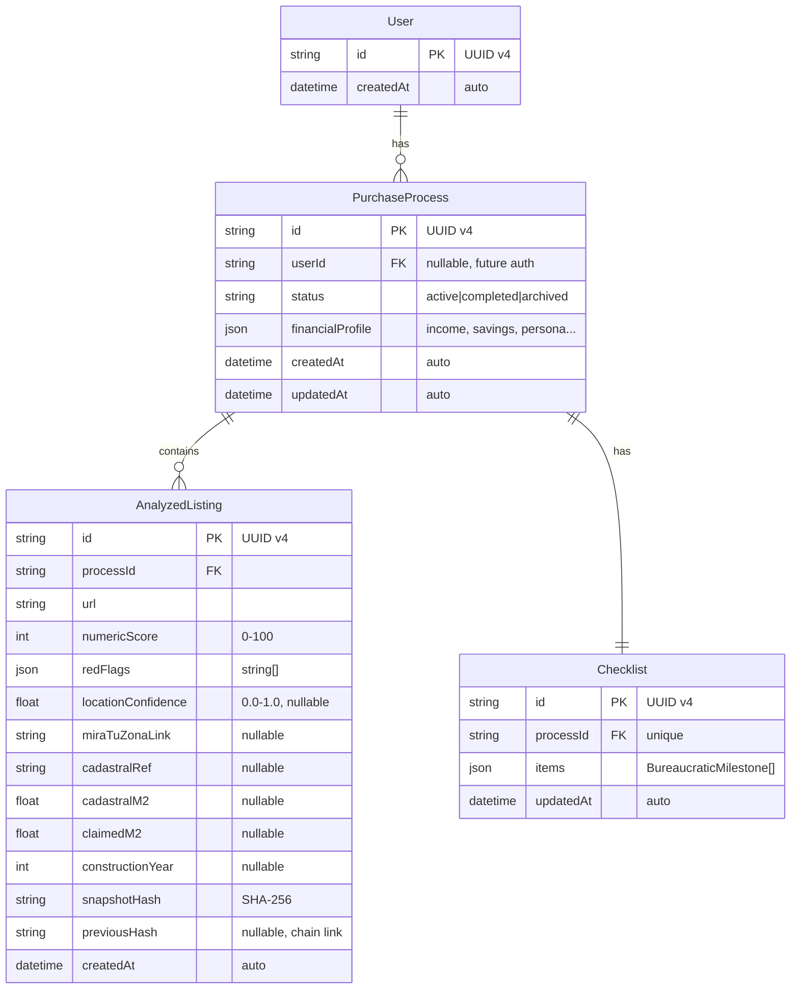

## Índice

0. [Ficha del proyecto](#0-ficha-del-proyecto)
1. [Descripción general del producto](#1-descripción-general-del-producto)
2. [Arquitectura del sistema](#2-arquitectura-del-sistema)
3. [Modelo de datos](#3-modelo-de-datos)
4. [Especificación de la API](#4-especificación-de-la-api)
5. [Historias de usuario](#5-historias-de-usuario)
6. [Tickets de trabajo](#6-tickets-de-trabajo)
7. [Pull requests](#7-pull-requests)

---

## 0. Ficha del proyecto

### **0.1. Tu nombre completo:**

Daniel G.

### **0.2. Nombre del proyecto:**

Realista

### **0.3. Descripción breve del proyecto:**

Asistente educativo con IA para compradores primerizos de vivienda en España. Analiza anuncios inmobiliarios con LLM para destapar lenguaje manipulador y omisiones, cruza datos con el Catastro, calcula los gastos ocultos de compra (que ningún banco te explica), y simula estrategias de amortización vs inversión basadas en tu perfil personal. PWA mobile-first, sin consejo financiero — solo transparencia.

### **0.4. URL del proyecto:**

> TBD — Pendiente de despliegue

### 0.5. URL o archivo comprimido del repositorio

> TBD

---

## 1. Descripción general del producto

### **1.1. Objetivo:**

Acompañar al comprador primerizo de vivienda en España con tres herramientas que cubren sus principales puntos ciegos:

1. **Listing Lens** — Analiza anuncios inmobiliarios con IA (OpenRouter) para detectar lo que el anuncio no te cuenta: lenguaje ambiguo, metros inflados, ubicación imprecisa, ausencia de certificado energético. Cruza la ubicación estimada con el Catastro para verificar los datos declarados.

2. **Mortgage Compass** — Calcula los gastos ocultos de compra (ITP/IVA, notaría, registro, gestoría, tasación) — ese 10-12% adicional que nadie te explica. Construye un perfil financiero personal y muestra estrategias de amortización voluntaria (sin amortizar, ligera, moderada, agresiva) comparadas con una alternativa de inversión a largo plazo. Todo con narrativa educativa, nunca prescriptiva.

3. **Dashboard** — Panel de seguimiento con historial de anuncios analizados, instantánea financiera y acceso rápido a todas las herramientas. Detección de cambios al re-analizar un anuncio (diff de snapshots).

**Público objetivo:** Compradores primerizos de vivienda en España que quieren entender lo que compran y lo que pagan, sin depender exclusivamente de lo que les cuentan inmobiliarias y bancos.

### **1.2. Características y funcionalidades principales:**

| Funcionalidad | Descripción | Prioridad |
|---------------|-------------|-----------|
| Listing Lens | Pegar URL de anuncio → análisis LLM + cruce catastral → puntuación de transparencia + banderas rojas | 🥇 Must-Have |
| Mortgage Compass | Perfil financiero → gastos ocultos → simulador de amortización vs inversión → narrativa educativa | 🥇 Must-Have |
| Dashboard | Historial de análisis, perfil financiero, acceso a herramientas | 🥇 Must-Have |
| Cronograma interactivo | Línea temporal 60-90 días del proceso de compra (arras → escritura) | 🔶 Should-Have |
| Checklist documental | Documentos necesarios por etapa, seguimiento de progreso | 🔶 Should-Have |

### **1.3. Diseño y experiencia de usuario:**

> Pendiente de implementación. Se incluirán capturas cuando el frontend esté desarrollado.

Principios UX: mobile-first (375px+), PWA instalable, navegación por pestañas, sin wizard forzado — cada herramienta accesible independientemente.

### **1.4. Instrucciones de instalación:**

```bash
# Requisitos: Node.js 20+, PostgreSQL 16+, OpenRouter API key

git clone <repo-url>
cd realista
npm install
cp .env.example .env   # Configurar DATABASE_URL y OPENROUTER_API_KEY
npx prisma migrate dev
npm run dev              # Backend (3001) + Frontend (5173)
```

---

## 2. Arquitectura del Sistema

### **2.1. Diagrama de arquitectura:**

```
┌─────────────────────────────────────────────────────────────┐
│                     DOMINIO (sin dependencias)               │
│                                                              │
│  Agregados: User, PurchaseProcess, AnalyzedListing,         │
│             Checklist                                        │
│                                                              │
│  Puertos: ListingAnalyzerPort, MortgageCalculatorPort,      │
│           CadastroPort, NotificationPort                     │
│                                                              │
│  Value Objects: TransparencyScore, FinancialProfile,        │
│                 RedFlags, BureaucraticMilestone              │
└─────────────────────────────────────────────────────────────┘
                             │
┌────────────────────────────┼────────────────────────────────┐
│                 INFRAESTRUCTURA (adaptadores)                │
│                                                              │
│  OpenRouterAdapter  → LLM gateway (detección de manipulación)│
│  AvenaScoreAdapter  → @avena/score (fallback numérico)      │
│  CheerioAdapter     → HTML parsing server-side               │
│  CatastroAdapter    → API Sede Electrónica del Catastro      │
│  MiraTuZonaAdapter  → Enlace contextual por barrio           │
└─────────────────────────────────────────────────────────────┘

┌──────────┐     ┌──────────────────┐     ┌──────────────────┐
│  Usuario  │────▶│  Realista PWA     │────▶│  Backend API      │
│  (móvil)  │     │  (SvelteKit+PWA)  │     │  (Node.js/Express)│
└──────────┘     └──────────────────┘     └────────┬─────────┘
                                                    │
                    ┌───────────────────────────────┼──────────┐
                    │                               │          │
              ┌─────▼─────┐  ┌──────────▼──────┐  ┌─▼────────┐
              │ PostgreSQL │  │ OpenRouter (LLM) │  │ Catastro  │
              │ (datos)    │  │ @avena/score     │  │ (oficial)  │
              └───────────┘  └─────────────────┘  └──────────┘
```

**Patrón:** Arquitectura Hexagonal (Puertos y Adaptadores) + DDD táctico.

**Justificación:** El dominio contiene cero dependencias de frameworks. Express, Prisma, SvelteKit viven en la capa de infraestructura. Esto permite testear la lógica de negocio de forma aislada, cambiar la base de datos o el framework frontend sin tocar el dominio, y mantener una separación clara entre lo que hace el sistema y cómo lo hace.

**Beneficios:** Testabilidad, mantenibilidad, independencia de frameworks, alineación con DDD para el vocabulario del dominio inmobiliario español.

**Sacrificios:** Más boilerplate inicial. Para un MVP con 3 features, la estructura hexagonal añade directorios pero garantiza que el proyecto escale sin reescrituras.

### **2.2. Descripción de componentes principales:**

| Componente | Tecnología | Función |
|------------|-----------|---------|
| Frontend | SvelteKit + Vite + @vite-pwa/sveltekit | SPA mobile-first instalable. Server-side loaders proxy al backend |
| Backend | Node.js + Express + TypeScript | API REST con arquitectura hexagonal. Dominio sin dependencias |
| Base de datos | PostgreSQL + Prisma ORM | Persistencia relacional. Migraciones gestionadas por Prisma |
| Análisis IA | OpenRouter (LLM gateway) | System prompt estructurado para detectar banderas rojas en anuncios |
| Fallback scoring | @avena/score (MIT) | Motor de scoring numérico cuando el LLM no está disponible |
| HTML parsing | Cheerio | Extracción server-side del texto del anuncio. Fallback a subdominio `.m.` |
| Catastro | API Sede Electrónica del Catastro | Cruce de m² declarados vs oficiales, año de construcción |
| Testing | Vitest + Playwright | Unitarios + integración + E2E del flujo principal |

### **2.3. Descripción de alto nivel del proyecto y estructura de ficheros**

```
backend/
├── src/
│   ├── domain/           # Lógica de dominio pura (sin dependencias externas)
│   │   ├── aggregates/   # User, PurchaseProcess, AnalyzedListing, Checklist
│   │   ├── value-objects/# TransparencyScore, FinancialProfile, RedFlags...
│   │   ├── ports/        # Interfaces (ListingAnalyzerPort, CadastroPort...)
│   │   └── services/     # Casos de uso (AnalyzeListingUseCase...)
│   ├── adapters/         # Implementaciones de puertos
│   │   ├── openrouter/   # OpenRouterAdapter (análisis LLM)
│   │   ├── avena-score/  # AvenaScoreAdapter (fallback)
│   │   ├── cheerio/      # CheerioAdapter (parseo HTML)
│   │   ├── catastro/     # CatastroAdapter (API catastral)
│   │   └── miratuzona/   # MiraTuZonaAdapter (enlace contextual)
│   ├── api/              # Express routes, controllers, middleware
│   ├── infrastructure/   # Prisma schema, config, constants
│   └── index.ts
└── tests/                # Unitarios + integración

frontend/
├── src/
│   ├── routes/           # SvelteKit file-based routing
│   │   ├── +page.svelte  # Dashboard
│   │   ├── listing-lens/ # Análisis de anuncios
│   │   ├── mortgage-compass/ # Simulador hipotecario
│   │   ├── timeline/     # Cronograma interactivo
│   │   ├── checklist/    # Checklist documental
│   │   └── +layout.svelte
│   ├── lib/              # Stores, API client, utils
│   └── app.css
└── tests/

e2e/                      # Playwright end-to-end tests
specs/                    # Documentación SDD (spec-kit)
.specify/                 # Configuración spec-kit
```

**Patrón:** Arquitectura Hexagonal + DDD táctico. Separación backend/frontend con E2E cross-stack.

### **2.4. Infraestructura y despliegue**

> Pendiente de implementación.

**Plan previsto:**
- Backend: Railway o Render (Node.js + PostgreSQL)
- Frontend: Vercel o Netlify (PWA estática)
- CI/CD: GitHub Actions — lint → typecheck → tests unitarios → tests integración → build → E2E → deploy

### **2.5. Seguridad**

- Sin autenticación en MVP. Sesiones anónimas identificadas por UUID v4 generado en servidor.
- Rate limiting: máximo 20 análisis/día por sesión.
- No se almacena contenido de terceros (HTML de anuncios, texto extraído). Solo resultados de análisis.
- User-Agent honesto: `Realista/1.0 (analizador educativo)`.
- Secrets gestionados vía variables de entorno, nunca en código.
- Sin datos personales ni PII almacenados.
- Campo `userId` nullable preparado para futura autenticación sin migración de datos.

### **2.6. Tests**

> Pendiente de implementación.

**Estrategia prevista:**
- Vitest para unitarios (dominio, value objects, adaptadores) + integración (API + DB)
- Playwright para E2E (flujo: Listing Lens → Mortgage Compass → Dashboard)
- Objetivo: 80%+ cobertura en capa de dominio
- Feature-slice TDD: tests escritos antes de la implementación

---

## 3. Modelo de Datos

### **3.1. Diagrama del modelo de datos:**


```mermaid
erDiagram
    User ||--o{ PurchaseProcess : has
    PurchaseProcess ||--o{ AnalyzedListing : contains
    PurchaseProcess ||--|| Checklist : has

    User {
        string id PK "UUID v4"
        datetime createdAt "auto"
    }

    PurchaseProcess {
        string id PK "UUID v4"
        string userId FK "nullable, future auth"
        string status "active|completed|archived"
        json financialProfile "income, savings, persona..."
        datetime createdAt "auto"
        datetime updatedAt "auto"
    }

    AnalyzedListing {
        string id PK "UUID v4"
        string processId FK
        string url
        int numericScore "0-100"
        json redFlags "string[]"
        float locationConfidence "0.0-1.0, nullable"
        string miraTuZonaLink "nullable"
        string cadastralRef "nullable"
        float cadastralM2 "nullable"
        float claimedM2 "nullable"
        int constructionYear "nullable"
        string snapshotHash "SHA-256"
        string previousHash "nullable, chain link"
        datetime createdAt "auto"
    }

    Checklist {
        string id PK "UUID v4"
        string processId FK "unique"
        json items "BureaucraticMilestone[]"
        datetime updatedAt "auto"
    }
```

### **3.2. Descripción de entidades principales:**

**User**
- `id`: UUID v4, clave primaria
- `createdAt`: DateTime, autogenerado
- Sin email, contraseña ni datos personales en MVP
- Relación 1:N con PurchaseProcess

**PurchaseProcess**
- `id`: UUID v4, clave primaria
- `userId`: FK a User, nullable para soportar sesiones anónimas ahora y auth después
- `status`: String, valores: `active`, `completed`, `archived`
- `financialProfile`: JSON (propertyPrice, savings, monthlyIncome, existingDebts, region, interestRate, persona)
- Relación 1:N con AnalyzedListing, 1:1 con Checklist

**AnalyzedListing**
- `id`: UUID v4, clave primaria
- `processId`: FK a PurchaseProcess
- `numericScore`: Int 0-100, puntuación de transparencia del anuncio
- `redFlags`: JSON array de strings (categorías de banderas rojas)
- `cadastralM2` / `claimedM2`: comparativa de superficie declarada vs oficial
- `snapshotHash`: SHA-256 del contenido del análisis para detección de cambios
- `previousHash`: enlace al hash del snapshot anterior (cadena de trazabilidad)

**Checklist**
- `id`: UUID v4, clave primaria
- `processId`: FK única a PurchaseProcess
- `items`: JSON array de `BureaucraticMilestone` (stage, title, description, documentsNeeded, estimatedDays, completed)

---

## 4. Especificación de la API

### Endpoints principales

**POST /api/listings/analyze** — Analiza la URL de un anuncio inmobiliario.

```json
// Request
{ "url": "https://www.idealista.com/inmueble/12345678/" }

// Response 200
{
  "id": "uuid",
  "numericScore": 42,
  "redFlags": ["imprecise_location", "no_energy_certificate"],
  "locationConfidence": 0.78,
  "miraTuZonaLink": "https://miratuzona.com/zone/...",
  "cadastralRef": "9876543VK4797N",
  "cadastralM2": 78,
  "claimedM2": 85,
  "constructionYear": 1972,
  "snapshotHash": "sha256:...",
  "createdAt": "2026-06-04T12:00:00Z"
}
```

**POST /api/purchase-processes** — Crea un proceso de compra con perfil financiero.

```json
// Request
{
  "financialProfile": {
    "propertyPrice": 200000,
    "savings": 45000,
    "monthlyIncome": 3500,
    "existingDebts": 0,
    "region": "madrid",
    "persona": "moderate"
  }
}

// Response 201
{ "id": "uuid", "status": "active", "createdAt": "..." }
```

**GET /api/checklist/:processId** — Obtiene el checklist documental por etapa.

```json
// Response 200
{
  "id": "uuid",
  "items": [
    {
      "id": "item-uuid",
      "stage": "pre_arras",
      "title": "Nota simple del registro",
      "description": "Solicitar en el Registro de la Propiedad",
      "documentsNeeded": [],
      "estimatedDays": 3,
      "completed": false
    }
  ]
}
```

> Para la especificación completa, ver `specs/001-realista-mvp/contracts/api.md`

---

## 5. Historias de Usuario

**Historia de Usuario 1 — Listing Lens: Analizar un Anuncio Inmobiliario (P1)**

Como comprador primerizo, quiero pegar la URL de un anuncio y obtener un análisis de transparencia para saber qué me está ocultando el anuncio.

Criterios de aceptación:
1. Dada una URL de anuncio válida, cuando la envío, entonces veo una puntuación (0-100) y banderas rojas en <10s
2. Dado un anuncio con pistas de ubicación, cuando el análisis termina, entonces se muestra una estimación de ubicación y enlace a MiraTuZona
3. Dado que hay datos catastrales, cuando el análisis termina, entonces se comparan m² declarados vs oficiales
4. Dada una URL inaccesible, cuando la envío, entonces se ofrece pegar el texto del anuncio manualmente

**Historia de Usuario 2 — Mortgage Compass: Comprender Costes Reales y Opciones (P1)**

Como comprador primerizo, quiero introducir mis datos financieros y entender cuánto me cuesta realmente comprar y qué estrategia de hipoteca me conviene.

Criterios de aceptación:
1. Dado precio 200.000€, ahorros 45.000€ e ingresos 3.500€/mes, cuando envío los datos, entonces se desglosan los gastos ocultos (~18.200€) con indicador de diferencia
2. Dado que he completado el perfil, cuando respondo preguntas de tolerancia al riesgo, entonces se sugiere una duración de hipoteca
3. Dada una hipoteca a 30 años al 3,5%, cuando cargo el simulador, entonces veo 4 escenarios de amortización con años acortados e intereses ahorrados
4. Dados todos los escenarios, cuando se muestra la alternativa de inversión, entonces veo el valor estimado de la cartera a 30 años

**Historia de Usuario 3 — Dashboard: Seguimiento del Proceso (P2)**

Como comprador primerizo, quiero ver un resumen de mis análisis y mi situación financiera en un solo sitio para no perderme.

Criterios de aceptación:
1. Dado que he analizado 3 anuncios, cuando visito el dashboard, entonces los veo todos con puntuaciones y fechas
2. Dado un anuncio previamente analizado, cuando pulso "re-analizar", entonces se destacan las diferencias con la instantánea anterior
3. Dada una sesión nueva sin datos, cuando visito el dashboard, entonces veo un estado vacío con llamadas a probar las herramientas

---

## 6. Tickets de Trabajo

> Pendiente de implementación. Se generarán mediante `/speckit.tasks` y se cumplimentarán con el detalle requerido.

---

## 7. Pull Requests

> Pendiente de implementación. Se documentarán las PRs realizadas durante el desarrollo.
