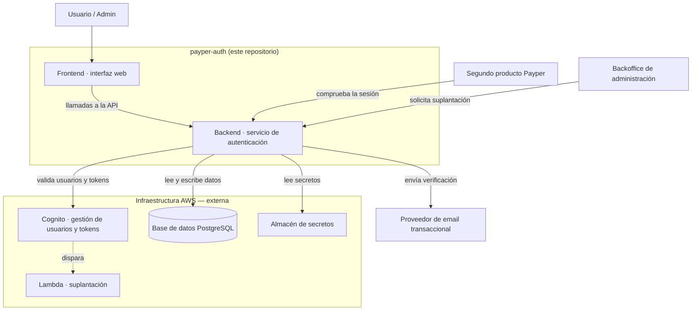
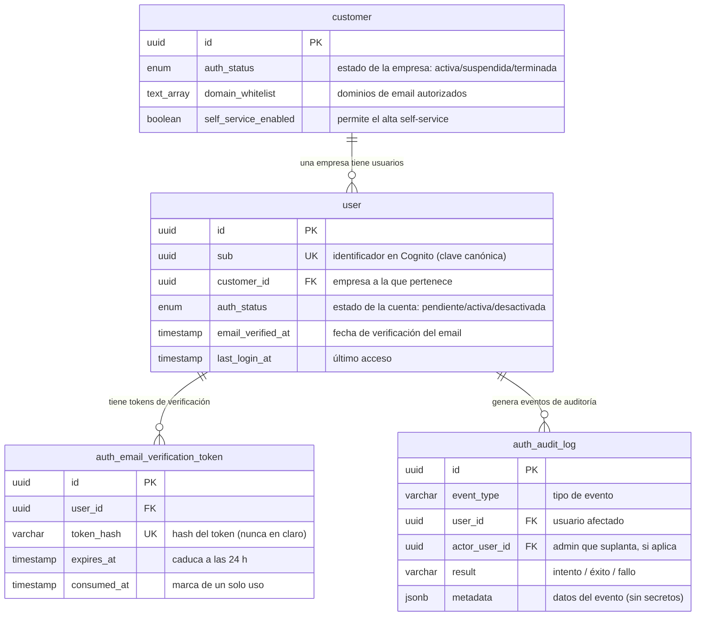

# payper-auth-mvp

> **Estado de esta entrega.** Este documento corresponde a la fase de **diseño y documentación** del proyecto. Todavía no hay código implementado, así que las secciones que dependen de la implementación (capturas de la interfaz, instrucciones de instalación, tests ejecutados y pull requests) figuran como _pendientes_. Los prompts usados en el proceso de creación están en [`prompts.md`](./prompts.md).

> **Aviso.** Este documento es **orientativo** y tiene fines ilustrativos: nombres, dominios, identificadores y detalles de infraestructura pueden estar simplificados o anonimizados. La documentación técnica completa y actualizada vive en el repositorio privado del código, que es la única fuente de verdad.

## Índice

0. [Ficha del proyecto](#0-ficha-del-proyecto)
1. [Descripción general del producto](#1-descripción-general-del-producto)
2. [Arquitectura del sistema](#2-arquitectura-del-sistema)
3. [Modelo de datos](#3-modelo-de-datos)
4. [Especificación de la API](#4-especificación-de-la-api)
5. [Historias de usuario](#5-historias-de-usuario)
6. [Tickets de trabajo](#6-tickets-de-trabajo)
7. [Pull requests](#7-pull-requests)

---

## 0. Ficha del proyecto

### 0.1. Tu nombre completo:
Alaiñe Iturria Aguinaga

### 0.2. Nombre del proyecto:
**payper-auth** — servicio de identidad de Payper (primera entrega, en entorno de desarrollo).

### 0.3. Descripción breve del proyecto:
**Payper-auth** es el servicio que centraliza el inicio de sesión y el registro de usuarios del ecosistema de productos de Payper. La identidad se apoya en AWS Cognito (el servicio de gestión de usuarios de Amazon), que ya existe y se mantiene; por encima se añade una capa propia —interfaz web y backend— que aporta la imagen de marca y las reglas de negocio de Payper. Esta primera entrega cubre el registro, el inicio de sesión, el reconocimiento de la sesión entre productos y la suplantación de usuarios para soporte.

### 0.4. URL del proyecto:
El repositorio es privado: https://github.com/bepayper/payper-auth-mvp

### 0.5. URL o archivo comprimido del repositorio
El repositorio es privado: https://github.com/bepayper/payper-auth-mvp

---

## 1. Descripción general del producto

### 1.1. Objetivo:
Hoy la identidad de los usuarios de Payper se gestiona con AWS Cognito a través de varios sistemas dispersos. El objetivo de payper-auth es poner delante una **puerta de entrada única y propia**, con la imagen de marca y las reglas de negocio de Payper, **sin sustituir Cognito**, que sigue funcionando por debajo como motor de autenticación.

Esta primera entrega resuelve tres necesidades concretas:

- Que un empleado de una empresa cliente pueda **registrarse y entrar por sí mismo**, sin que un administrador tenga que darlo de alta.
- Que, una vez dentro, su sesión sea **reconocida por los demás productos de Payper** sin tener que volver a introducir sus credenciales (lo que se conoce como inicio de sesión único o *SSO*).
- Que un **administrador de soporte pueda operar temporalmente "como" un usuario** para ayudarle, dejando siempre constancia de quién lo hizo.

Por tratarse de un servicio de autenticación, la prioridad es la seguridad. El mayor riesgo asumido es que parte del código lo genere una IA, por lo que cada flujo sensible se somete a una revisión humana reforzada.

### **1.2. Características y funcionalidades principales:**

> Enumera y describe las características y funcionalidades específicas que tiene el producto para satisfacer las necesidades identificadas.
_Pendiente de la fase de implementación: todavía no hay interfaz construida._

### **1.3. Diseño y experiencia de usuario:**

> Proporciona imágenes y/o videotutorial mostrando la experiencia del usuario desde que aterriza en la aplicación, pasando por todas las funcionalidades principales.
_Pendiente de la fase de implementación: todavía no hay interfaz construida._

### **1.4. Instrucciones de instalación:**
> Documenta de manera precisa las instrucciones para instalar y poner en marcha el proyecto en local (librerías, backend, frontend, servidor, base de datos, migraciones y semillas de datos, etc.)
_Pendiente de la fase de implementación: todavía no hay interfaz construida._

---

## 2. Arquitectura del Sistema

### 2.1. Diagrama de arquitectura:
La solución se organiza en tres piezas: una **interfaz web propia** (el frontend), un **servicio de backend** que concentra toda la lógica, y la **infraestructura de AWS** que ya existe y se consume desde fuera del repositorio.

El backend sigue una **arquitectura hexagonal**: su núcleo (las reglas de negocio) no depende de detalles técnicos como el framework web o el proveedor de nube, que viven en la periferia como piezas intercambiables. Se eligió este enfoque por tres motivos: permite apoyarse en la identidad que Payper ya tiene en lugar de reescribirla; concentra toda la confianza en el backend, de modo que el navegador nunca habla directamente con AWS; y aísla las partes más delicadas para poder probarlas por separado. A cambio se asumen algunas deudas conscientes —por ejemplo, un trade-off conocido en el manejo de cookies de sesión (mitigado con políticas de seguridad del navegador y revisión reforzada) o que la base de datos sea compartida con otros sistemas—.


```mermaid
graph TB
    U[Usuario / Admin]
    P2[Segundo producto Payper]
    DBI[Backoffice de administración]
    subgraph App["payper-auth (este repositorio)"]
        FE[Frontend · interfaz web]
        BE[Backend · servicio de autenticación]
    end
    subgraph Infra["Infraestructura AWS — externa"]
        COG[Cognito · gestión de usuarios y tokens]
        LAM[Lambda · suplantación]
        RDS[(Base de datos PostgreSQL)]
        SSM[Almacén de secretos]
    end
    MJ[Proveedor de email transaccional]
    U --> FE
    FE -->|llamadas a la API| BE
    P2 -->|comprueba la sesión| BE
    DBI -->|solicita suplantación| BE
    BE -->|valida usuarios y tokens| COG
    COG -.->|dispara| LAM
    BE -->|lee y escribe datos| RDS
    BE -->|lee secretos| SSM
    BE -->|envía verificación| MJ
```

### 2.2. Descripción de componentes principales:
- **Frontend** — La interfaz web (React + Vite) con las pantallas de registro, login y verificación. Es una aplicación independiente; solo lee datos del usuario para mostrarlos, nunca para decidir permisos.
- **Backend** — El servicio de autenticación (Node.js + TypeScript con el framework Fastify). Es el único componente que se comunica con Cognito y con la base de datos, y no guarda estado propio: la sesión vive en cookies y en Cognito.
- **Cognito** (AWS, ya existente) — Almacena los usuarios y emite los tokens de sesión. El backend confía en ellos validando su firma.
- **Base de datos PostgreSQL** (AWS, compartida) — El backend lee las tablas de empresas y usuarios y escribe los datos de identidad y el registro de auditoría. No modifica la estructura de la base de datos.
- **Función Lambda de suplantación** (AWS, ya existente) — Hace posible que un administrador asuma la sesión de un usuario. Se reutiliza tal cual.
- **Almacén de secretos y proveedor de email transaccional** — Guardan, respectivamente, las credenciales del servicio y el envío de los emails de verificación.

### 2.3. Descripción de alto nivel del proyecto y estructura de ficheros
Como se explicó en 2.1, el backend separa el núcleo de negocio de las piezas técnicas (arquitectura hexagonal). La estructura prevista del repositorio refleja esa separación (el árbol definitivo se concretará al implementar):

```
payper-auth/
├── backend/
│   └── src/
│       ├── core/            # núcleo: reglas de negocio y casos de uso (sin dependencias técnicas)
│       ├── adapters/
│       │   ├── inbound/     # entrada: rutas web y validaciones
│       │   └── outbound/    # salida: Cognito, base de datos, email, secretos
│       └── entrypoints/     # arranque del servicio
├── frontend/
│   └── src/
│       ├── pages/           # pantallas: login, registro, verificación
│       └── lib/             # lógica de cliente (llamadas a la API, validación, idioma)
├── docs/                    # documentación de diseño del proyecto
└── .claude/                 # utilidades del proceso de trabajo asistido por IA
```

### 2.4. Infraestructura y despliegue
La infraestructura de AWS (Cognito, las funciones Lambda, la base de datos y los secretos) **no vive en este repositorio**: se gestiona aparte, y el servicio la consume a través de un **contrato de integración**, es decir, la lista de identificadores, direcciones y secretos que la aplicación necesita y que **valida al arrancar** (si falta algo, no arranca).

Sobre dónde se ejecuta la aplicación: la primera entrega corre como un **único proceso en una máquina EC2 de AWS**, con el servidor web nginx sirviendo la interfaz y redirigiendo las llamadas de la API al backend en el mismo dominio (`auth.example.com`). Más adelante se prevé pasar a contenedores y, como horizonte, valorar un enfoque sin servidor; la arquitectura hexagonal permite ese cambio sin reescribir la lógica.

### 2.5. Seguridad
Como el riesgo principal del proyecto es el código de autenticación generado por IA, la seguridad se trata como prioridad. Las medidas principales son:

- Toda operación sensible ocurre **en el servidor**; el navegador nunca tiene credenciales de AWS ni decide permisos.
- Los tokens se **validan comprobando su firma** antes de confiar en ellos.
- Los mensajes de error de registro y login son **siempre iguales**, para no filtrar si un email existe o cuál es el estado de una cuenta.
- Los **secretos** se guardan en el almacén de AWS con permisos mínimos, nunca en el código.
- Los formularios están protegidos contra **CSRF** (peticiones falsificadas) y las direcciones de redirección se validan en el servidor.
- Las partes más delicadas del código (las que hablan con Cognito y las que gestionan las cookies y los tokens) pasan por una **revisión humana reforzada**.

### 2.6. Tests
_Pendiente de la fase de implementación._ La estrategia ya está definida: una pirámide de tests con énfasis en las pruebas unitarias del núcleo, un conjunto de **pruebas de seguridad obligatorias** sobre las partes críticas, y pruebas de integración del registro contra una base de datos temporal. Cobertura objetivo: backend ≥ 70 % y frontend ≥ 60 %.

---

## 3. Modelo de Datos

> El servicio **no es el dueño de la estructura de la base de datos** (la gestiona el equipo de migraciones del ecosistema). Aquí se documenta solo el subconjunto de tablas que esta entrega lee o escribe.

### 3.1. Diagrama del modelo de datos:


```mermaid
erDiagram
    customer ||--o{ user : "una empresa tiene usuarios"
    user ||--o{ auth_email_verification_token : "tiene tokens de verificación"
    user ||--o{ auth_audit_log : "genera eventos de auditoría"
    customer {
        uuid id PK
        enum auth_status "estado de la empresa: activa/suspendida/terminada"
        text_array domain_whitelist "dominios de email autorizados"
        boolean self_service_enabled "permite el alta self-service"
    }
    user {
        uuid id PK
        uuid sub UK "identificador en Cognito (clave canónica)"
        uuid customer_id FK "empresa a la que pertenece"
        enum auth_status "estado de la cuenta: pendiente/activa/desactivada"
        timestamp email_verified_at "fecha de verificación del email"
        timestamp last_login_at "último acceso"
    }
    auth_email_verification_token {
        uuid id PK
        uuid user_id FK
        varchar token_hash UK "hash del token (nunca en claro)"
        timestamp expires_at "caduca a las 24 h"
        timestamp consumed_at "marca de un solo uso"
    }
    auth_audit_log {
        uuid id PK
        varchar event_type "tipo de evento"
        uuid user_id FK "usuario afectado"
        uuid actor_user_id FK "admin que suplanta, si aplica"
        varchar result "intento / éxito / fallo"
        jsonb metadata "datos del evento (sin secretos)"
    }
```

### 3.2. Descripción de entidades principales:
- **`customer`** (empresa cliente, ya existe) — Representa a la organización. El servicio lee si está activa y qué dominios de email tiene autorizados (datos que escribe el backoffice) y actualiza su estado de autenticación.
- **`user`** (usuario, ya existe) — Su identificador en Cognito (`sub`) es la clave que usa todo el sistema; queda vacío momentáneamente durante el registro hasta que Cognito devuelve el usuario creado. El servicio escribe el estado de la cuenta, la fecha de verificación del email y la del último acceso.
- **`auth_email_verification_token`** (nueva) — Guarda los tokens de verificación de email. Se almacena su *hash*, nunca el valor real, y solo puede usarse una vez.
- **`auth_audit_log`** (nueva) — Registro de eventos de seguridad. El evento más sensible es el inicio de una suplantación; nunca contiene secretos.

---

## 4. Especificación de la API

Estos son tres de los endpoints principales, en formato OpenAPI 3.0. La API completa incluye además el cierre de sesión, la comprobación y el refresco de la sesión, y la suplantación.

```yaml
paths:
  # Registro: responde siempre igual (202) exista o no el email, para no filtrar información.
  /auth/register:
    post:
      requestBody: { email, password, customerContext }
      responses:
        '202': "Cuenta en proceso; revisa tu correo."
        '400': "Datos no válidos."
        '429': "Demasiados intentos."

  # Login: si las credenciales son correctas, establece la sesión mediante cookies.
  /auth/login:
    post:
      requestBody: { email, password, redirectUri? }
      responses:
        '200': "Sesión iniciada (cookies de sesión + destino de redirección validado)."
        '401': "Email o contraseña incorrectos (mismo mensaje en ambos casos)."
        '403': "Cuenta sin verificar o no disponible."

  # Verificación: consume el token del enlace del email (un solo uso).
  /auth/verify:
    post:
      requestBody: { token }
      responses:
        '200': "Cuenta verificada."
        '410': "El enlace ha caducado."
        '409': "El enlace ya se usó."
        '400': "Enlace no válido."
```

Convenciones de la API: los errores se devuelven con un **catálogo cerrado de códigos propios** (nunca se exponen los errores internos de Cognito), los formularios exigen un token **anti-CSRF** en la cabecera `X-CSRF-Token`, y las cookies de sesión las emite el backend en el dominio `.example.com`.

---

## 5. Historias de Usuario

### HU-01 — Registro self-service de usuario corporativo

**Como** usuario corporativo
**quiero** crear mi cuenta con mi email y contraseña en la pantalla de Auth
**para** acceder a los productos de Payper sin que un administrador me dé de alta.

- **Origen:** UC-01 · RF-REG-01, RF-REG-03
- **Prioridad:** 🔴 Must
- **Estado:** Backlog

**Criterios de aceptación:**
- **Escenario: alta con dominio autorizado**
  - Dado un customer con self-service activo y mi dominio en su whitelist
  - Cuando envío email + contraseña válida (política RF-REG-03)
  - Entonces se crea mi cuenta como `pending_verification` y recibo un email de verificación
  - Y la respuesta es un **202 genérico** ("revisa tu correo").
- **Escenario: no-divulgación (dominio no autorizado o email ya existente)**
  - Dado un dominio fuera de la whitelist **o** un email ya registrado
  - Cuando envío el formulario
  - Entonces obtengo **la misma** respuesta 202 genérica (mismo cuerpo y timing), sin revelar el motivo (RF-REG-01).
- **Escenario: contraseña débil**
  - Dado que la contraseña no cumple la política (RF-REG-03)
  - Cuando envío el formulario
  - Entonces se rechaza con un error de validación claro y **no** se crea cuenta.

---

### HU-02 — Login y establecimiento de sesión

**Como** usuario corporativo
**quiero** iniciar sesión con mi email y contraseña en la pantalla de Auth
**para** acceder a los productos de Payper con una sesión reconocida en `.example.com`.

- **Origen:** UC-02 · RF-LOG-01
- **Prioridad:** 🔴 Must
- **Estado:** Backlog

**Criterios de aceptación:**
- **Escenario: credenciales correctas y cuenta activa**
  - Dado un usuario `active` cuyo customer está `active`
  - Cuando envío email + contraseña correctos
  - Entonces se establece la sesión (cookies en `.example.com`) y se me redirige al `redirect_uri` validado
  - Y se registra `login` en `auth_audit_log`.
- **Escenario: no-divulgación de credenciales**
  - Dado un email inexistente **o** una contraseña incorrecta
  - Cuando envío el formulario
  - Entonces obtengo **el mismo 401 genérico** (mismo cuerpo y timing), sin distinguir cuál de los dos falló (RF-LOG-01)
  - Y se registra el intento fallido en `auth_audit_log`.
- **Escenario: cuenta sin verificar**
  - Dado un usuario con `auth_status = pending_verification` y credenciales correctas
  - Cuando inicio sesión
  - Entonces obtengo un **403 `verification_required`** con CTA para reenviar la verificación (único motivo accionable).
- **Escenario: cuenta o customer no disponible**
  - Dado un usuario `disabled` **o** un customer `suspended`/`terminated`
  - Cuando inicio sesión con credenciales correctas
  - Entonces obtengo un **403 genérico** sin revelar el motivo.
- **Escenario: open-redirect**
  - Dado un `redirect_uri` fuera de la allow-list de orígenes Payper
  - Cuando inicio sesión
  - Entonces **no** se me redirige a ese destino (se valida server-side).

---

### HU-03 — Verificación de email tras el registro

**Como** usuario corporativo recién registrado
**quiero** verificar mi email desde el enlace que recibo
**para** activar mi cuenta y poder iniciar sesión.

- **Origen:** UC-03 · RF-REG-02
- **Prioridad:** 🔴 Must
- **Estado:** Backlog

**Criterios de aceptación:**
- **Escenario: token válido**
  - Dado un token de verificación vigente, no consumido (TTL 24h)
  - Cuando abro el enlace `/verify?token=…`
  - Entonces mi cuenta pasa a `active`, se marca `email_verified_at` y el token queda consumido
  - Y veo confirmación de cuenta verificada.
- **Escenario: token caducado / usado / inválido**
  - Dado un token expirado, ya consumido o no reconocido
  - Cuando abro el enlace
  - Entonces obtengo el estado correspondiente (410 caducado / 409 usado / 400 inválido) con CTA para **reenviar** la verificación.
- **Escenario: reenvío con rate-limiting**
  - Dado que solicito reenviar la verificación
  - Cuando supero el límite por email+IP
  - Entonces se aplica rate-limiting y la respuesta es **genérica** (no revela si el email existe — coherente con el registro).
- **Escenario: un solo uso**
  - Dado un token ya consumido con éxito
  - Cuando intento reutilizarlo
  - Entonces se rechaza (409), sin reactivar nada.

---

## 6. Tickets de Trabajo

Tres tickets representativos: uno de backend, uno de frontend y uno de base de datos.

### T-001 — Endpoint `/auth/register` + saga BD↔Cognito  _(backend)_

> Deriva de **HU-01** (registro self-service)

- **Estado:** Backlog
- **Tipo:** backend
- **Estimación:** L
- **Depende de:** delta de esquema aplicado en `dev` (decisión cross-repo) · gate de verificación del trigger `userPoolPostConfirmation`

**Objetivo**
Implementar `POST /auth/register` con el gate de customer (activo + self-service + dominio en whitelist) y el alta como **saga compensada**: `INSERT user(customer_id, sub=NULL)` + COMMIT → `SignUp` (fuera de tx) → `UPDATE sub` + token de verificación + audit en tx corta → `DELETE` compensatorio si `SignUp` falla.

**Alcance**
- Incluye: endpoint, gate, saga, idempotencia por email, reconciliación del huérfano (`sub IS NULL`), `auth_audit_log(register)`.
- No incluye: pantalla de registro (frontend), envío del email (tarea aparte), verificación del email (HU-03).

**Definición de Hecho (DoD)**
- [ ] Implementado según la arquitectura y el modelo de datos (índices de idempotencia y reconciliación)
- [ ] `SignUp` escribe **solo** los 3 atributos legacy; **nunca** `custom:customer_id` (tenant por FK)
- [ ] Respuesta **202 genérica** idéntica (cuerpo + timing) para autorizado / dominio no autorizado / email ya existente (no-divulgación, RF-REG-01)
- [ ] Tests de integración (base de datos temporal): happy path, rollback compensatorio, huérfano, idempotencia
- [ ] No se loguean secretos/tokens
- [ ] Revisión humana reforzada (toca el adaptador de Cognito)

**Notas técnicas / referencias:** la carrera con `userPoolPostConfirmation` está **sujeta al gate de verificación del trigger** — no cerrar esta tarea hasta que ese gate esté resuelto. Tenant por FK, no por claim.

---

### T-002 — Pantalla de registro (UI Auth)  _(frontend)_

> Deriva de **HU-01** (registro self-service)

- **Estado:** Backlog
- **Tipo:** frontend
- **Estimación:** M
- **Depende de:** T-001 (contrato de `POST /auth/register`)

**Objetivo**
Pantalla de registro en la UI de Auth (React): formulario email + contraseña, **validación de la política de contraseña en cliente** (revalidada por el backend — no confiar en cliente), envío con CSRF, y UX de la respuesta sin divulgación.

**Alcance**
- Incluye: formulario, validación de contraseña en cliente, manejo de la respuesta **202 genérica** ("revisa tu correo") como **única pantalla** de salida, error de contraseña débil, CSRF (`X-CSRF-Token`), i18n (es) y a11y.
- No incluye: la verificación del email (pantalla de HU-03), el envío del email, el endpoint (T-001).

**Definición de Hecho (DoD)**
- [ ] Implementado según la arquitectura de frontend (pantallas, CSRF, i18n/a11y)
- [ ] El frontend **no infiere** nada del 202 (dominio no autorizado / email ya existe / éxito son indistinguibles) — no-divulgación
- [ ] Validación de contraseña como **fuente única** compartida; coherente con la del backend
- [ ] Tests unit de la lógica de cliente (validación, mapeo código-error→i18n) + componente
- [ ] Gate **a11y** verde (axe sobre la pantalla) + revisión manual de foco/`aria-live`
- [ ] Ningún secreto en el bundle

**Notas técnicas / referencias:** la UI no escribe cookies (las emite el backend). El mensaje de error llega como **código** del catálogo del backend y se traduce en cliente.

---

### T-101 — Solicitar y verificar el delta de esquema en `dev`  _(base de datos)_

> **Habilitadora** — dependencia compartida de **HU-01** (registro) y **HU-03** (verificación). Auth **no aplica DDL** (lo hace el equipo de migraciones).

- **Estado:** Backlog
- **Tipo:** datos · habilitadora
- **Estimación:** S
- **Depende de:** coordinación con el repositorio de migraciones del ecosistema (separado)

**Objetivo**
Solicitar al equipo de migraciones el **delta** que el corte vertical necesita y verificar que está **aplicado en `dev`** antes de desplegar el backend que lo consume.

**Alcance**
- Columnas: `user.auth_status`, `email_verified_at`, `last_login_at`; `customer.auth_status`, `domain_whitelist`, `self_service_enabled`.
- Tablas nuevas: `auth_email_verification_token`, `auth_audit_log`.
- Índices/constraints: idempotencia por email, huérfano `sub IS NULL`, token, auditoría.
- No incluye: aplicar el DDL (lo hace el equipo de migraciones), ni cerrar las decisiones de modelado abiertas.

**Definición de Hecho (DoD)**
- [ ] Delta solicitado y documentado contra el modelo de datos
- [ ] **Aplicado en `dev`** y verificado (la comprobación de readiness confirma que las tablas/columnas en alcance existen)
- [ ] Decisiones de modelado abiertas señaladas al equipo de backoffice

**Notas técnicas / referencias:** es **dependencia de release ordenada**: el delta debe estar en `dev` **antes** del primer deploy de Auth que lo use. Bloquea T-001 (saga) y la HU-03.

---

## 7. Pull Requests

> Documenta 3 de las Pull Requests realizadas durante la ejecución del proyecto

**Pull Request 1**

**Pull Request 2**

**Pull Request 3**

