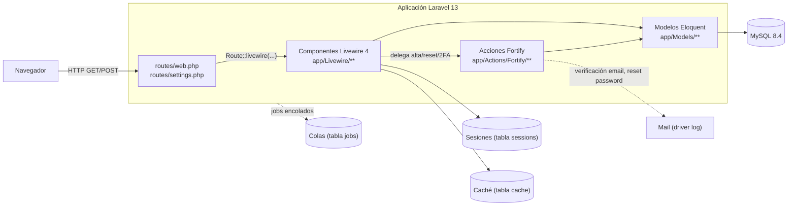
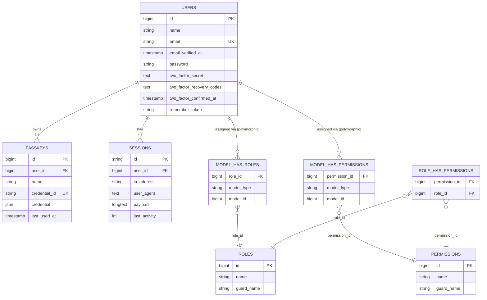

## Índice

0. [Ficha del proyecto](#0-ficha-del-proyecto)
1. [Descripción general del producto](#1-descripción-general-del-producto)
2. [Arquitectura del sistema](#2-arquitectura-del-sistema)
3. [Modelo de datos](#3-modelo-de-datos)
4. [Especificación de la API](#4-especificación-de-la-api)
5. [Historias de usuario](#5-historias-de-usuario)
6. [Tickets de trabajo](#6-tickets-de-trabajo)
7. [Pull requests](#7-pull-requests)

---

## 0. Ficha del proyecto

### **0.1. Tu nombre completo:**
Angel Rosso Pellisso

### **0.2. Nombre del proyecto:**
Arospe

### **0.3. Descripción breve del proyecto:**
Arospe es un dashboard de administración que centraliza la gestión de un ecommerce: usuarios, publicaciones del blog, productos y pedidos, todo desde un solo panel intuitivo

### **0.4. URL del proyecto:**

> Puede ser pública o privada, en cuyo caso deberás compartir los accesos de manera segura. Puedes enviarlos a [alvaro@lidr.co](mailto:alvaro@lidr.co) usando algún servicio como [onetimesecret](https://onetimesecret.com/).

### 0.5. URL o archivo comprimido del repositorio

> Puedes tenerlo alojado en público o en privado, en cuyo caso deberás compartir los accesos de manera segura. Puedes enviarlos a [alvaro@lidr.co](mailto:alvaro@lidr.co) usando algún servicio como [onetimesecret](https://onetimesecret.com/). También puedes compartir por correo un archivo zip con el contenido


---

## 1. Descripción general del producto

> Describe en detalle los siguientes aspectos del producto:

### **1.1. Objetivo:**

Arospe es un **backoffice de administración** para una operación de ecommerce: el panel interno desde el que un equipo gestiona los datos sobre los que corre una tienda (usuarios y sus permisos, un blog, el catálogo de productos, impuestos por región fiscal, transportistas y tarifas de envío, y clientes/pedidos), todo desde un único dashboard.

**Alcance deliberado — solo backoffice.** Arospe no incluye tienda pública, carrito ni checkout. Gestiona los datos que una tienda pública (futura y separada) consumiría; cuando el PRD menciona "el checkout" o "un cliente", lo hace para explicar *por qué* existe un dato administrativo, no porque esa pantalla forme parte de este proyecto.

**A quién va dirigido:** al equipo interno (administradores/editores) que necesita un panel único para dar de alta usuarios y roles, mantener el catálogo y sus reglas fiscales/logísticas, publicar contenido de blog y hacer seguimiento de clientes y pedidos, sin depender de acceso directo a la base de datos.

**Valor que aporta:** centraliza en una sola herramienta tareas que de otro modo estarían dispersas (gestión de usuarios, contenido, catálogo, fiscalidad, logística), con permisos granulares por módulo (vía roles dinámicos) en lugar de accesos todo-o-nada.

### **1.2. Características y funcionalidades principales:**

> Estado actual: en el código solo está implementada la capa de autenticación (Fortify: registro, login, verificación de email, 2FA, passkeys). El resto de funcionalidades descritas a continuación son el alcance funcional definido en el PRD (`docs/PRD/PRD.md`) y constituyen la hoja de ruta del backoffice.

- **Usuarios, Roles y Permisos** — CRUD completo de roles personalizados con permisos granulares por módulo (vía `spatie/laravel-permission`, ya instalado), sustituyendo el desplegable de rol fijo del prototipo. Es la base de la que dependen el resto de épicas.
- **Catálogo de Productos** — productos con categorías propias (CRUD completo, taxonomía distinta a la del blog) y **variantes configurables**: tipos de atributo (Talla, Color, Material…) definidos por el administrador, cada combinación con su propio SKU, precio, stock e imagen destacada opcional.
- **Regiones de venta e Impuestos** — un catálogo de regiones fiscales (país, y para España sus territorios especiales: Península, Baleares, Canarias, Ceuta, Melilla) donde cada entrada *es* a la vez la regla fiscal (tipo, descripción, código), con exactamente una región marcada como tarifa por defecto.
- **Envíos** — transportistas con activar/desactivar y reglas de tarifa por transportista según zona de envío + rango de peso + precio + plazo estimado (configuración manual, sin integración con API de transportista real).
- **Galería de medios compartida** — cada imagen subida se conserva en su formato original (`.png`/`.jpg`/`.jpeg`) y además genera variantes `.webp` y `.avif`, en almacenamiento local (`storage/app/public`).
- **Clientes y Pedidos** — entidades gestionadas desde el backoffice, independientes del sistema de Usuarios/Roles (los clientes no acceden al dashboard).
- **Blog** — categorías (CRUD) y etiquetas (CRUD + alta rápida desde el propio editor del post); un post tiene una categoría y varias etiquetas.
- **Internacionalización** — dos capas independientes: selector de idioma de la interfaz de administración (ES/EN) y "idiomas de tienda" gestionables por el admin, que aparecen como pestañas para traducir campos de contenido (producto, post, slugs/SEO, nombres de categoría/etiqueta).
- **Búsqueda global y notificaciones** — búsqueda funcional sobre usuarios, productos y posts; notificaciones para stock bajo/agotado, nuevo cliente, nuevo pedido y publicación de posts.

### **1.3. Diseño y experiencia de usuario:**

> Proporciona imágenes y/o videotutorial mostrando la experiencia del usuario desde que aterriza en la aplicación, pasando por todas las funcionalidades principales.

### **1.4. Instrucciones de instalación:**

**Prerrequisitos**

- PHP 8.3+ (solo si se ejecuta tooling fuera de Docker; Sail ya provee PHP)
- Composer
- Docker (Docker Desktop) — el entorno local corre sobre Laravel Sail
- Windows: **WSL2 obligatorio**; todos los comandos se ejecutan desde la shell de WSL2 (Ubuntu), no desde PowerShell/CMD. Docker Desktop debe estar iniciado y con la integración WSL2 habilitada para la distro usada.

**1. Clonar el repositorio**

```bash
git clone <repository-url>
cd arospe
```

**2. Crear el fichero `.env`**

Hay un `.env.example` en el repo que muestra las claves existentes, pero los valores reales (credenciales de base de datos, ajustes de app, etc.) deben solicitarse de forma privada — no inventar ni reutilizar valores de otro entorno.

**3. Instalar dependencias PHP**

```bash
composer install
```

**4. Levantar los servicios con Sail**

```bash
./vendor/bin/sail up -d
```

Esto arranca, según `compose.yaml`:

| Servicio | Imagen | Propósito |
| --- | --- | --- |
| `laravel.test` | `sail-8.5/app` (build de `docker/8.5`) | Contenedor de la app, PHP 8.5. Sirve la app (puerto `80`) y el servidor de desarrollo de Vite (puerto `5173`). |
| `mysql` | `mysql:8.4` | Base de datos principal (puerto `3306`). También aprovisiona una base de datos de test vía `docker/mysql/create-testing-database.sh`. |
| `redis` | `redis:alpine` | Redis (puerto `6379`) para caché, sesiones y colas. |

**5. Frontend**

```bash
./vendor/bin/sail npm install
./vendor/bin/sail npm run dev      # servidor Vite con hot reload
./vendor/bin/sail npm run build    # build de producción
```

**6. Base de datos: migraciones y semillas**

```bash
./vendor/bin/sail artisan migrate
./vendor/bin/sail artisan migrate --seed
./vendor/bin/sail artisan db:seed
```

Para reconstruir la base de datos desde cero:

```bash
./vendor/bin/sail artisan migrate:fresh --seed
```

**7. Ejecutar los tests**

```bash
./vendor/bin/sail artisan test
```

También existe un script de Composer que limpia config, comprueba formato, ejecuta análisis estático y luego el test suite:

```bash
composer test
```

Los tests de navegador (Pest browser plugin + Playwright) requieren, la primera vez, descargar los binarios de navegador (no se versionan en el repo):

```bash
npx playwright install
```

**8. Calidad de código**

```bash
./vendor/bin/sail composer lint          # formatea con Pint
./vendor/bin/sail composer lint:check    # comprueba estilo sin modificar
./vendor/bin/sail composer types:check   # análisis estático con Larastan
```

**9. Parar el entorno**

```bash
./vendor/bin/sail down
```

---

## 2. Arquitectura del Sistema

### **2.1. Diagrama de arquitectura:**

Arospe es un **monolito Laravel 13 + Livewire 4**, construido sobre el starter kit oficial de Livewire (`laravel/livewire-starter-kit`). No hay SPA independiente ni API REST: los componentes Livewire renderizan UI server-driven directamente sobre el request lifecycle de Laravel.


```mermaid
flowchart LR
    Browser["Navegador"]

    subgraph Laravel["Aplicación Laravel 13"]
        Routes["routes/web.php\nroutes/settings.php"]
        Livewire["Componentes Livewire 4\napp/Livewire/**"]
        Fortify["Acciones Fortify\napp/Actions/Fortify/**"]
        Models["Modelos Eloquent\napp/Models/**"]
    end

    DB[("MySQL 8.4")]
    Queue[("Colas (tabla jobs)")]
    Session[("Sesiones (tabla sessions)")]
    Cache[("Caché (tabla cache)")]
    Mail["Mail (driver log)"]

    Browser -->|"HTTP GET/POST"| Routes
    Routes -->|"Route::livewire(...)"| Livewire
    Livewire -->|"delega alta/reset/2FA"| Fortify
    Fortify --> Models
    Livewire --> Models
    Models --> DB
    Livewire --> Session
    Livewire --> Cache
    Fortify -.->|"verificación email, reset password"| Mail
    Laravel -.->|"jobs encolados"| Queue
```

**Patrón:** MVC clásico de Laravel, con Livewire sustituyendo la capa de "controlador + vista JS" por componentes de servidor con estado (full-stack reactivo sin escribir una API ni JavaScript de cliente para la lógica de negocio). Sesión, caché y colas usan el driver `database` (no hay servicios externos configurados todavía salvo el propio MySQL).

**Por qué esta arquitectura:** el proyecto es un backoffice interno (no una app pública de alto tráfico ni con necesidad de un cliente desacoplado), por lo que un monolito server-rendered reduce la complejidad operativa —no hay que versionar ni sincronizar un contrato de API entre backend y frontend— y acelera el desarrollo de CRUDs de administración, que es el grueso del alcance (ver [1.2](#12-características-y-funcionalidades-principales)).

**Beneficios:** menos piezas móviles (un solo repositorio, un solo despliegue), estado siempre en servidor (más fácil de validar/autorizar de forma centralizada), y reutilización directa de Eloquent/Blade/Livewire sin duplicar lógica de validación en un frontend separado.

**Costes/déficits:** no hay una API pública reutilizable por otros clientes (por ejemplo, una futura tienda pública tendría que construirse aparte o forzar la creación posterior de una API); la interactividad depende de round-trips al servidor por cada acción Livewire, lo que puede ser menos fluido que una SPA para interacciones muy ricas en cliente; y el acoplamiento UI-servidor dificulta escalar el frontend independientemente del backend.

### **2.2. Descripción de componentes principales:**

- **Rutas (`routes/web.php`, `routes/settings.php`)** — puntos de entrada HTTP. No existe `routes/api.php` todavía.
- **Componentes Livewire (`app/Livewire/**`)** — lógica de UI con estado, en clases PHP + vista Blade emparejada (convención *class-based*, no single-file component), agrupados por área (`Settings/`, `Actions/`...).
- **Acciones de Fortify (`app/Actions/Fortify/**`)** — implementaciones de los contratos de `laravel/fortify` para registro, reseteo de contraseña, etc.
- **Modelos Eloquent (`app/Models/**`)** — capa de datos; usan atributos PHP 8 (`#[Fillable]`, `#[Hidden]`) y un método `casts()` en vez de las propiedades clásicas `$fillable`/`$hidden`/`$casts`.
- **Autenticación — `laravel/fortify` (^1.37)**: registro, login, reset de contraseña, verificación de email y 2FA.
- **Passkeys — `@laravel/passkeys` / `laravel/passkeys`**: soporte WebAuthn, consumido desde `App\Livewire\Settings\Security`.
- **Autorización — `spatie/laravel-permission` (^8.3)**: roles y permisos; el trait `HasRoles` ya está adjunto a `User` (`assignRole()`, `hasRole()`, `hasPermissionTo()` son llamables), pero ningún rol/permiso está aún sembrado, asignado o comprobado en la app (sin seeders de roles, sin middleware `role:`/`permission:` registrado).
- **Base de datos — MySQL 8.4** (contenedor `mysql` en `compose.yaml`), también backend de sesiones, caché y colas (driver `database` para los tres).
- **Frontend — Vite ^8 + Tailwind CSS v4** (vía `@tailwindcss/vite`) + **Flux UI (Livewire Flux, free)** como librería de componentes visuales.
- **Entorno de desarrollo — Laravel Sail**, que orquesta los contenedores `laravel.test` (PHP 8.5 + Vite dev server), `mysql` y `redis` vía Docker Compose.
- **Calidad — Laravel Pint** (formateo), **Larastan** (análisis estático, nivel 7), **Pest 4** (+ plugin browser sobre Playwright) para tests.

### **2.3. Descripción de alto nivel del proyecto y estructura de ficheros**

Estructura real de `arospe/`, siguiendo la convención estándar de un proyecto Laravel:

```
app/
  Actions/Fortify/    Implementaciones de contratos de Fortify (CreateNewUser, ResetUserPassword...)
  Concerns/           Traits compartidos (p. ej. conjuntos de reglas de validación)
  Console/Commands/   Comandos Artisan
  Http/Controllers/   Solo el controlador base abstracto; sin controladores de dominio todavía
  Livewire/           Componentes Livewire, agrupados por área (Settings/, Actions/...)
  Models/             Modelos Eloquent (actualmente solo User)
  Providers/          Service providers (AppServiceProvider, FortifyServiceProvider)
config/               Configuración de Laravel y paquetes (fortify.php, permission.php...)
database/
  factories/
  migrations/
  seeders/
resources/
  views/
    components/       Componentes Blade
    layouts/          Shells de layout (auth/app)
    livewire/         Vistas de componentes Livewire y vistas Blade planas de auth
    partials/
routes/                web.php, settings.php (sin api.php todavía)
tests/
  Feature/             Espeja la estructura de app/ (Auth/, Settings/...)
  Unit/
docker/                Assets de Docker para Sail (p. ej. aprovisionamiento de BD de test)
docs/                  Documentación del proyecto (arquitectura, BD, convenciones, decisiones)
```

El proyecto sigue estrictamente la organización por capas de Laravel (no hay estructura por módulo/dominio todavía, dado que el único modelo real es `User`); la convención explícita del equipo es no crear carpetas base nuevas sin aprobación. El detalle de convenciones por carpeta está en `docs/conventions/base-standards.md`.

### **2.4. Infraestructura y despliegue**

> Detalla la infraestructura del proyecto, incluyendo un diagrama en el formato que creas conveniente, y explica el proceso de despliegue que se sigue

### **2.5. Seguridad**

> Enumera y describe las prácticas de seguridad principales que se han implementado en el proyecto, añadiendo ejemplos si procede

### **2.6. Tests**

Suite de test basada en **Pest 4** (`pestphp/pest` + `pest-plugin-laravel`), organizada en `tests/Feature/` (mayoría de los tests, espejando `app/`) y `tests/Unit/`.

- **Tests de backend (Feature/Unit)** — cubren, hoy, el flujo de autenticación de Fortify (registro, login, verificación de email, reset de contraseña, 2FA) y los componentes Livewire de `Settings`. Usan factories (`database/factories/`) en lugar de crear modelos a mano.
- **Tests de navegador (`tests/Browser/`)** — vía **Pest Browser Plugin** (`pest-plugin-browser` ^4.3), que dirige **Playwright** (^1.61) para pruebas end-to-end reales sobre navegador. El flujo de trabajo documentado va de historia de usuario → escenario Gherkin → test Pest (ver `docs/testing/frontend/`), con ejemplos ya escritos para login, borrado de passkeys y el reto de 2FA. Esta suite y su integración en CI **aún no están conectadas** (ver `docs/testing/frontend/playwright-setup.md`).
- **Filosofía de testing** — documentada en `docs/testing/philosophy.md` y `docs/testing/qa/` (pensamiento de riesgo, qué no testear, checklist de cobertura), pensada para evitar tests frágiles o redundantes.
- **Puertas de calidad, en este orden, antes de dar un cambio por terminado:**
  1. `php artisan test --compact --filter=<Nombre>` — el test más específico relacionado con el cambio.
  2. `vendor/bin/pint --dirty --format agent` — formateo automático (preset `laravel`).
  3. Larastan nivel 7 (`phpstan.neon`) sobre `app/`, `bootstrap/app.php`, `config/`, `database/`, `routes/`.
- **Comando agregado:** `composer test` limpia config, comprueba formato, corre análisis estático y ejecuta el test suite completo, en ese orden.

---

## 3. Modelo de Datos

### **3.1. Diagrama del modelo de datos:**

> El dominio de ecommerce del PRD (productos, pedidos, blog, impuestos, envíos...) todavía no está implementado en base de datos — el esquema actual solo cubre autenticación y autorización. Este diagrama se ampliará conforme se construyan esos módulos.


```mermaid
erDiagram
    USERS ||--o{ PASSKEYS : owns
    USERS ||--o{ SESSIONS : has
    USERS ||--o{ MODEL_HAS_ROLES : "assigned via (polymorphic)"
    USERS ||--o{ MODEL_HAS_PERMISSIONS : "assigned via (polymorphic)"
    MODEL_HAS_ROLES }o--|| ROLES : role_id
    MODEL_HAS_PERMISSIONS }o--|| PERMISSIONS : permission_id
    ROLE_HAS_PERMISSIONS }o--|| ROLES : role_id
    ROLE_HAS_PERMISSIONS }o--|| PERMISSIONS : permission_id

    USERS {
        bigint id PK
        string name
        string email UK
        timestamp email_verified_at
        string password
        text two_factor_secret
        text two_factor_recovery_codes
        timestamp two_factor_confirmed_at
        string remember_token
    }
    PASSKEYS {
        bigint id PK
        bigint user_id FK
        string name
        string credential_id UK
        json credential
        timestamp last_used_at
    }
    SESSIONS {
        string id PK
        bigint user_id FK
        string ip_address
        text user_agent
        longtext payload
        int last_activity
    }
    ROLES {
        bigint id PK
        string name
        string guard_name
    }
    PERMISSIONS {
        bigint id PK
        string name
        string guard_name
    }
    MODEL_HAS_ROLES {
        bigint role_id FK
        string model_type
        bigint model_id
    }
    MODEL_HAS_PERMISSIONS {
        bigint permission_id FK
        string model_type
        bigint model_id
    }
    ROLE_HAS_PERMISSIONS {
        bigint permission_id FK
        bigint role_id FK
    }
```

Las relaciones de `MODEL_HAS_ROLES`/`MODEL_HAS_PERMISSIONS` con `USERS` son **polimórficas** (`model_type` + `model_id`, provistas por `spatie/laravel-permission`) — `User` es hoy el único modelo morfable de la aplicación.

Tablas de infraestructura sin claves foráneas (no aparecen en el diagrama): `password_reset_tokens`, `cache`, `jobs`.

> **Planificado, no implementado todavía ([ADR 0001](arospe/docs/decisions/0001-uuid-primary-keys.md)):** `users.id` migrará de `bigint` autoincremental a **UUID v7** (vía el trait nativo `HasUuids` de Laravel 13) durante la Epic 1. Es una migración de ruptura con backfill de datos que arrastra en cascada a `passkeys.user_id`, `sessions.user_id` (retipados a `foreignUuid`) y a la clave polimórfica `model_id` de `model_has_roles`/`model_has_permissions` (renombrada a `model_uuid` y retipada a `uuid`). Todas las tablas de dominio futuras (productos, variantes y categorías de producto; categorías, etiquetas y posts de blog — Epics 2 y 4) nacerán directamente con PK UUID, sin esa complejidad de migración por ser tablas nuevas. El diagrama de arriba refleja el estado **real actual** (`bigint`), no el planificado.

### **3.2. Descripción de entidades principales:**

**`users`**

| Columna | Tipo | Notas |
| --- | --- | --- |
| `id` | bigint, PK | |
| `name` | string | |
| `email` | string | **unique** |
| `email_verified_at` | timestamp, nullable | se pone a `null` de nuevo al cambiar el email |
| `password` | string | hasheado (`cast`), oculto en serialización (`Hidden`) |
| `two_factor_secret` | text, nullable | encriptado, `Hidden` |
| `two_factor_recovery_codes` | text, nullable | JSON encriptado, `Hidden` |
| `two_factor_confirmed_at` | timestamp, nullable | |
| `remember_token` | string, nullable | `Hidden` |

Relaciones: `hasMany` → `passkeys` (vía `PasskeyAuthenticatable`); `hasMany` → `sessions` (informal, por `user_id`); `morphToMany` polimórfico → `roles`/`permissions` vía `HasRoles` (**ya adjunto** a `User` — `assignRole()`/`hasRole()`/`hasPermissionTo()` son llamables, aunque todavía no se usan en ningún punto de la aplicación).

**`passkeys`** — provista por `laravel/passkeys`

| Columna | Tipo | Notas |
| --- | --- | --- |
| `id` | bigint, PK | |
| `user_id` | bigint, **FK → `users.id`** | `cascadeOnDelete()` |
| `name` | string | etiqueta elegida por el usuario |
| `credential_id` | string | **unique**, ID de credencial WebAuthn |
| `credential` | json | payload completo de la credencial WebAuthn |
| `last_used_at` | timestamp, nullable | |

**`sessions`**

| Columna | Tipo | Notas |
| --- | --- | --- |
| `id` | string, PK | |
| `user_id` | bigint, FK → `users.id` | |
| `ip_address` | string | |
| `user_agent` | text | |
| `payload` | longtext | |
| `last_activity` | int | |

**`roles` / `permissions`** (`spatie/laravel-permission`)

| Columna | Tipo | Notas |
| --- | --- | --- |
| `id` | bigint, PK | |
| `name` | string | |
| `guard_name` | string | |

**`model_has_roles` / `model_has_permissions`** — tablas pivote polimórficas: `role_id`/`permission_id` (FK) + `model_type` + `model_id` (identifican el modelo asignado, hoy solo `User`).

**`role_has_permissions`** — tabla pivote con clave primaria compuesta: `permission_id` (FK) + `role_id` (FK).

Instaladas, migradas y con `HasRoles` **ya conectado** al modelo `User`, pero sin ningún rol/permiso sembrado, asignado ni comprobado en el resto de la aplicación todavía — no hay seeder de roles, ni middleware `role:`/`permission:` registrado en las rutas (ver `docs/architecture/authorization.md`).

---

## 4. Especificación de la API

> Si tu backend se comunica a través de API, describe los endpoints principales (máximo 3) en formato OpenAPI. Opcionalmente puedes añadir un ejemplo de petición y de respuesta para mayor claridad

---

## 5. Historias de Usuario

> Documenta 3 de las historias de usuario principales utilizadas durante el desarrollo, teniendo en cuenta las buenas prácticas de producto al respecto.

**Historia de Usuario 1**

**Historia de Usuario 2**

**Historia de Usuario 3**

---

## 6. Tickets de Trabajo

> Documenta 3 de los tickets de trabajo principales del desarrollo, uno de backend, uno de frontend, y uno de bases de datos. Da todo el detalle requerido para desarrollar la tarea de inicio a fin teniendo en cuenta las buenas prácticas al respecto. 

**Ticket 1**

**Ticket 2**

**Ticket 3**

---

## 7. Pull Requests

> Documenta 3 de las Pull Requests realizadas durante la ejecución del proyecto

**Pull Request 1**

[#269](https://github.com/LIDR-academy/AI4Devs-finalproject/pull/269)

**Pull Request 2**

**Pull Request 3**

