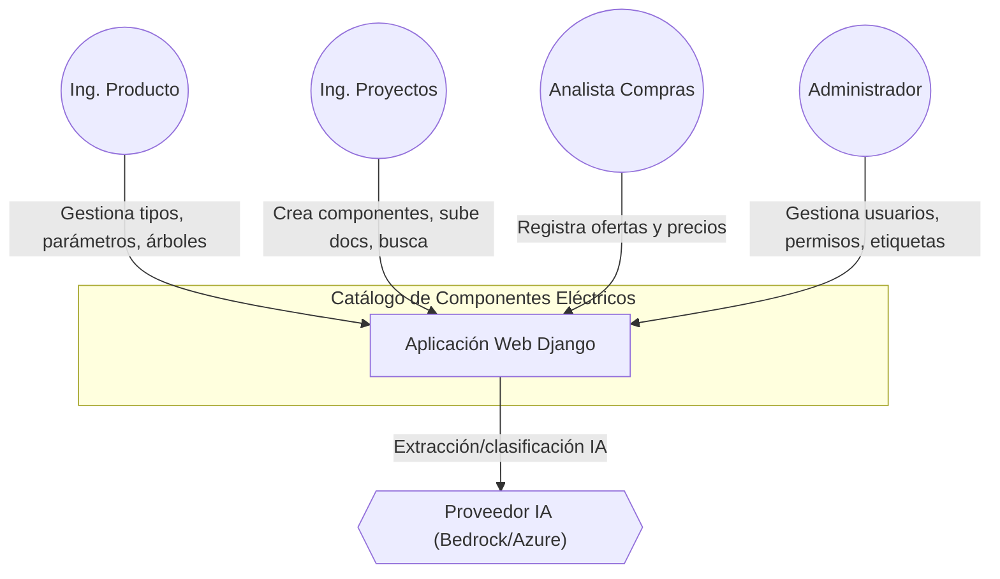
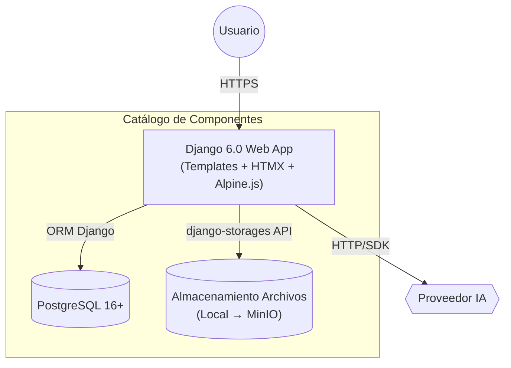
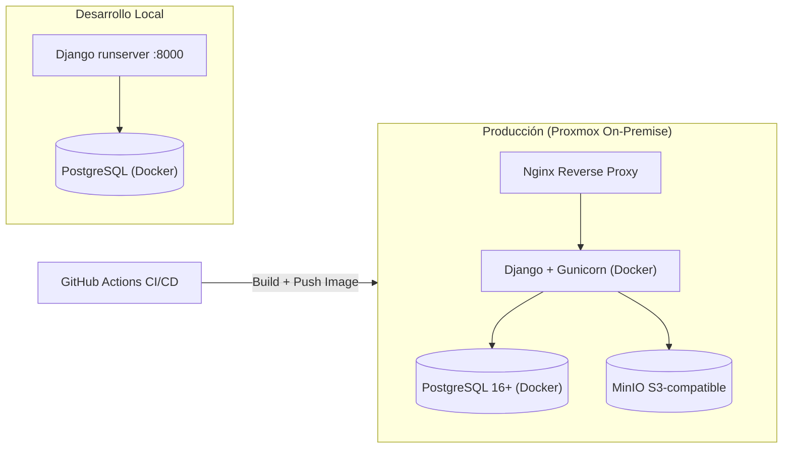
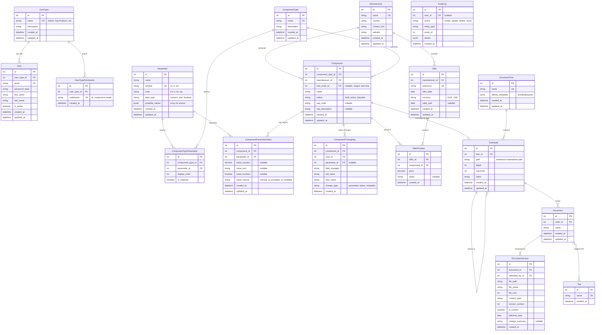

## Índice

0. [Ficha del proyecto](#0-ficha-del-proyecto)
1. [Descripción general del producto](#1-descripción-general-del-producto)
2. [Arquitectura del sistema](#2-arquitectura-del-sistema)
3. [Modelo de datos](#3-modelo-de-datos)
4. [Especificación de la API](#4-especificación-de-la-api)
5. [Historias de usuario](#5-historias-de-usuario)
6. [Tickets de trabajo](#6-tickets-de-trabajo)
7. [Pull requests](#7-pull-requests)

---

## 0. Ficha del proyecto

### **0.1. Tu nombre completo:**

Juan Andrés Chacón Matteo

### **0.2. Nombre del proyecto:**

Components DB — Catálogo Estructurado de Componentes Eléctricos

### **0.3. Descripción breve del proyecto:**

Catálogo centralizado para gestionar componentes eléctricos de equipos de calidad de energía. Permite registrar componentes con especificaciones técnicas parametrizadas, organizar documentación técnica en árboles jerárquicos, controlar ofertas y precios con trazabilidad, y buscar componentes por filtros paramétricos combinados. Incorpora IA para la extracción automática de parámetros desde datasheets de fabricantes.

### **0.4. URL del proyecto:**

> Repositorio privado. Acceso compartido con el TA.

https://github.com/jnchacon/components-db

### 0.5. URL o archivo comprimido del repositorio

https://github.com/jnchacon/components-db

---

## 1. Descripción general del producto

### **1.1. Objetivo:**

**Problema**: En una empresa fabricante de equipos eléctricos de calidad de energía, la información de los componentes utilizados (interruptores, condensadores, reactancias, resistencias, aisladores, contactores, seccionadores, etc.) está dispersa y desorganizada. No existe un catálogo centralizado con especificaciones técnicas buscables, documentación versionada ni trazabilidad de precios.

**Propuesta de valor**: Un catálogo estructurado y centralizado que permite gestionar componentes eléctricos con sus especificaciones técnicas, documentación jerárquica y precios trazables. La incorporación de IA automatiza la extracción de datos de datasheets, la creación de tipos desde normas y la clasificación de documentos.

**Usuarios objetivo**: 4 roles diferenciados dentro de la empresa:

| Rol | Objetivos | Pain Points actuales |
|-----|-----------|---------------------|
| **Administrador** | Controlar acceso y configuración del sistema | No hay sistema que gestione permisos por rol |
| **Ingeniero de Producto** | Definir la estructura del catálogo | Definir parámetros desde normas es tedioso y propenso a errores |
| **Ingeniero de Proyectos** | Encontrar y documentar componentes rápidamente | Buscar en PDFs y carpetas compartidas consume demasiado tiempo |
| **Analista de Compras** | Mantener precios actualizados y trazables | No hay trazabilidad de qué oferta originó cada precio |

### **1.2. Características y funcionalidades principales:**

1. **Gestión del Catálogo Base**: CRUD de Fabricantes, Tipos de Componente y Parámetros técnicos (nombre, símbolo, unidades, tipo de dato, valores posibles). Asociación M2M entre Tipos y Parámetros con orden de visualización y obligatoriedad.

2. **Gestión de Componentes**: Creación de componentes con formulario dinámico que carga parámetros según el tipo seleccionado (vía HTMX). Ciclo de vida con estados controlados: Borrador → Activo → Obsoleto. Changelog automático al modificar componentes activos.

3. **Árbol Documental**: Estructura jerárquica editable (django-treebeard con Materialized Path) para organizar documentación técnica. Operaciones: crear nodos, renombrar, mover (reparentar), eliminar con protección. Componentes se anclan como hojas (relación 1:1 con constraint bidireccional).

4. **Documentos y Etiquetas**: Subida de documentos técnicos con versionado (todas las versiones conservadas, marca de vigencia). Sistema de etiquetas con vocabulario controlado por el administrador. Herencia: un componente hereda los documentos de su nodo y ancestros.

5. **Ofertas y Precios**: Registro de ofertas comerciales con posiciones (componente + precio). Trazabilidad completa: de cada precio se puede rastrear la oferta que lo originó. Posibilidad de crear componentes en borrador directamente desde una oferta.

6. **Búsqueda Paramétrica**: Búsqueda de componentes filtrando por parámetros técnicos combinados (ej: Ur ≥ 24 kV AND Ir ≥ 2000 A). Filtros dinámicos según el tipo de componente seleccionado. Resultados en tabla con navegación al detalle.

7. **IA — Extracción de Parámetros (P1)**: Extracción automática de valores de parámetros desde datasheets de fabricantes. Los valores se presentan como sugerencias editables (aceptar/modificar/rechazar). Registro de origen de cada valor (manual vs. IA).

8. **Sistema de Permisos**: Modelo RBAC personalizado con matriz configurable Tipo de Usuario × Acciones. Permisos granulares por acción (`component.create`, `offer.edit`, `tree.move`).

### **1.3. Diseño y experiencia de usuario:**

> El proyecto se encuentra en fase de documentación técnica (Entrega 1). El diseño visual sigue el sistema de diseño corporativo de Arteche, documentado en `docs/SRS/10-design-system.md`, con paleta basada en Arteche Blue (#002F6C), Innovative Teal (#00B2A9), Sustainability Green (#78BE20) y tipografía Gotham.
>
> Las capturas de la interfaz funcional se incluirán en la Entrega 2 (código funcional) y en la Entrega Final.

### **1.4. Instrucciones de instalación:**

```bash
# 1. Clonar y crear virtualenv
git clone https://github.com/jnchacon/components-db.git
cd components-db
python3.14 -m venv .venv
source .venv/bin/activate

# 2. Instalar dependencias
pip install -r requirements/development.txt

# 3. Levantar PostgreSQL con Docker
docker compose -f docker/docker-compose.dev.yml up -d

# 4. Configurar entorno
cp .env.example .env
# Editar .env si es necesario (los defaults funcionan para desarrollo local)

# 5. Ejecutar migraciones
make migrate

# 6. Instalar pre-commit hooks
pre-commit install

# 7. Arrancar el servidor de desarrollo
make run
```

El servidor estará disponible en `http://localhost:8000`.

**Requisitos previos**: Python 3.14+, Docker y Docker Compose, Git.

---

## 2. Arquitectura del Sistema

### **2.1. Diagrama de arquitectura:**

El sistema sigue el patrón de **Monolito Modular Django**, la elección correcta para este proyecto porque:

- Equipo pequeño (1-2 desarrolladores) con expertise en Python/Django
- Escala modesta (<10 usuarios, cientos de componentes)
- Django ya impone una buena separación en apps
- Evita la complejidad operacional de microservicios
- Sin build pipeline de JS (no hay Vite, npm, ni bundler)

#### Diagrama de Contexto (C4 Level 1)


```mermaid
flowchart TD
  IngProducto((Ing. Producto))
  IngProyectos((Ing. Proyectos))
  AnalistaCompras((Analista Compras))
  Admin((Administrador))
  IAProvider{{"Proveedor IA (Bedrock/Azure)"}}

  subgraph System ["Catálogo de Componentes Eléctricos"]
    App["Aplicación Web Django"]
  end

  IngProducto -->|"Gestiona tipos, parámetros, árboles"| App
  IngProyectos -->|"Crea componentes, sube docs, busca"| App
  AnalistaCompras -->|"Registra ofertas y precios"| App
  Admin -->|"Gestiona usuarios, permisos, etiquetas"| App
  App -->|"Extracción/clasificación IA"| IAProvider
```

#### Diagrama de Contenedores (C4 Level 2)


```mermaid
flowchart TD
  User((Usuario))
  IAProvider{{"Proveedor IA"}}

  subgraph System ["Catálogo de Componentes"]
    WebApp["Django 6.0 Web App<br/>(Templates + HTMX + Alpine.js)"]
    DB[("PostgreSQL 16+")]
    FileStorage[("Almacenamiento Archivos<br/>(Local → MinIO)")]
  end

  User -->|"HTTPS"| WebApp
  WebApp -->|"ORM Django"| DB
  WebApp -->|"django-storages API"| FileStorage
  WebApp -->|"HTTP/SDK"| IAProvider
```

**Justificación de la arquitectura:**

- **SSR + HTMX**: toda la navegación es server-side rendering con HTMX para actualizaciones parciales. Alpine.js gestiona estado local del cliente (expansión de árboles, toggles). No hay SPA, no hay React.
- **HTMX resuelve el 90% de la interactividad** (formularios dependientes, búsqueda paramétrica, carga parcial de árboles).
- **Django 6.0 template partials** (`render(request, 'template.html#block', ctx)`) eliminan la necesidad de templates parciales separados.
- **SortableJS** añade drag-and-drop para el árbol documental.

### **2.2. Descripción de componentes principales:**

| Componente | Tecnología | Propósito |
|-----------|-----------|----------|
| **Backend** | Django 6.0 (Python 3.14) | Framework web, ORM, auth, template partials |
| **Frontend** | HTMX 2.0+ + Alpine.js 3.x + SortableJS | Interactividad sin build pipeline JS |
| **Base de datos** | PostgreSQL 16+ | Almacenamiento relacional con JSONB y pgvector (futuro) |
| **Almacenamiento** | django-storages (local → MinIO/S3) | Archivos técnicos con abstracción de backend |
| **Árboles** | django-treebeard (Materialized Path) | Gestión eficiente de jerarquías |
| **Configuración** | python-decouple | Variables de entorno con casting de tipos |
| **Testing** | pytest + pytest-django + factory-boy | Testing unitario, integración y E2E |
| **Linting** | Ruff | Linter + formatter Python |
| **CI/CD** | GitHub Actions | Pipeline lint → test → build |

### **2.3. Descripción de alto nivel del proyecto y estructura de ficheros**

El repositorio sigue el patrón **nested layout** recomendado por "Two Scoops of Django": un directorio `src/` contiene todo el código Django, separado de la documentación, configuración Docker, y scripts de utilidad.

```
components-db/
├── docs/                             # Documentación del proyecto
│   ├── PRD/                          # Product Requirements Document (12 fases)
│   └── SRS/                          # Software Requirements Specification (17 docs)
│
├── docker/                           # Configuración Docker
│   ├── Dockerfile                    # Imagen de producción
│   └── docker-compose.dev.yml        # Stack de desarrollo (PostgreSQL)
│
├── src/                              # Código fuente Django
│   ├── manage.py                     # Entry point de Django
│   ├── config/                       # Configuración (settings split por entorno)
│   │   └── settings/
│   │       ├── base.py               # Settings comunes (usa python-decouple)
│   │       ├── development.py        # DEBUG=True, email en consola
│   │       └── production.py         # HTTPS, HSTS, MinIO
│   │
│   ├── apps/                         # Django apps (1 por módulo funcional)
│   │   ├── accounts/                 # Autenticación y Permisos
│   │   ├── catalog/                  # Fabricantes, Tipos, Parámetros
│   │   ├── components/               # Componentes y valores técnicos
│   │   ├── trees/                    # Árbol Documental
│   │   ├── documents/                # Documentos y Etiquetas
│   │   ├── offers/                   # Ofertas y Precios
│   │   ├── search/                   # Búsqueda Paramétrica
│   │   └── ai/                       # IA (fases futuras)
│   │
│   ├── core/                         # Código compartido (audit, mixins)
│   ├── static/                       # CSS, JS, imágenes, fuentes
│   ├── templates/                    # Templates globales (base.html, errores)
│   └── fixtures/                     # Datos iniciales (JSON)
│
├── tests/                            # Tests de integración cross-app
├── requirements/                     # Dependencias Python (base/dev/prod)
├── Makefile                          # Atajos de desarrollo
└── pyproject.toml                    # Configuración Ruff + pytest
```

Cada app dentro de `apps/` sigue una estructura interna idéntica: `models.py`, `views.py`, `urls.py`, `forms.py`, `services.py`, `tests/`, `templates/<app_name>/`.

### **2.4. Infraestructura y despliegue**


```mermaid
flowchart LR
  subgraph Dev ["Desarrollo Local"]
    DevApp["Django runserver :8000"]
    DevDB[("PostgreSQL (Docker)")]
    DevApp --> DevDB
  end

  subgraph Prod ["Producción (Proxmox On-Premise)"]
    direction TB
    Nginx["Nginx Reverse Proxy"]
    ProdApp["Django + Gunicorn (Docker)"]
    ProdDB[("PostgreSQL 16+ (Docker)")]
    MinIO[("MinIO S3-compatible")]
    Nginx --> ProdApp
    ProdApp --> ProdDB
    ProdApp --> MinIO
  end

  GH["GitHub Actions CI/CD"] -->|"Build + Push Image"| Prod
```

| Entorno | Infraestructura | Deploy |
|---------|----------------|--------|
| **Desarrollo** | Local (virtualenv + PostgreSQL en Docker) | `make run` |
| **Producción** | Proxmox on-premise, Docker containers | Manual desde CI (trigger explícito) |

**Pipeline CI/CD** (GitHub Actions): `Lint (Ruff)` → `Test (pytest + PostgreSQL)` → `Build (Docker image)`.

### **2.5. Seguridad**

| Amenaza | Protección | Implementación |
|---------|-----------|---------------|
| **CSRF** | Token en cada POST | Django CSRF middleware + HTMX auto-envío |
| **XSS** | Escape automático | Django template engine escapa por defecto |
| **SQL Injection** | ORM parametrizado | Django ORM (nunca raw SQL con input del usuario) |
| **Clickjacking** | X-Frame-Options | `XFrameOptionsMiddleware` |
| **Autenticación** | Session-based con cookies seguras | `HttpOnly`, `Secure`, `SameSite=Lax` |
| **Contraseñas** | Hash PBKDF2 | Django auth (nunca en texto plano) |
| **HTTPS** | SSL redirect + HSTS | `SECURE_SSL_REDIRECT = True` en producción |
| **Autorización** | RBAC custom | `@require_permission('codename')` en cada vista |

### **2.6. Tests**

| Nivel | Herramientas | Cobertura objetivo | Qué valida |
|-------|-------------|-------------------|-----------|
| **Unit** | pytest + pytest-django | ≥ 80% en services | Servicios, modelos, utilidades |
| **Integration** | pytest-django + factory-boy | ≥ 60% global | Flujos cross-app, vistas HTTP |
| **E2E** | Playwright | Smoke tests (5 flujos) | Interactividad HTMX/Alpine.js en navegador |

Los E2E cubren: crear componente, búsqueda paramétrica, registrar oferta, árbol documental, y login + permisos.

> **Nota**: La suite de tests se implementará progresivamente durante la Entrega 2 y la Entrega Final.

---

## 3. Modelo de Datos

### **3.1. Diagrama del modelo de datos:**


```mermaid
erDiagram
    %% USUARIOS Y PERMISOS
    UserType ||--o{ User : "has role"
    UserType ||--o{ UserTypePermission : "grants"

    UserType {
        int id PK
        string name UK "Admin, Ing Producto, etc."
        string description
        datetime created_at
        datetime updated_at
    }

    UserTypePermission {
        int id PK
        int user_type_id FK
        string codename UK "ej: component.create"
        datetime created_at
    }

    User {
        int id PK
        int user_type_id FK
        string email UK
        string password_hash
        string first_name
        string last_name
        boolean is_active
        datetime created_at
        datetime updated_at
    }

    %% CATALOGO BASE
    Manufacturer ||--o{ Component : "produces"
    Manufacturer ||--o{ Offer : "submits"

    Manufacturer {
        int id PK
        string name UK
        string country
        string contact_info
        string website
        datetime created_at
        datetime updated_at
    }

    Parameter ||--o{ ComponentTypeParameter : "used in"
    Parameter ||--o{ ComponentParameterValue : "valued by"

    Parameter {
        int id PK
        string name
        string symbol UK "Ur, Ir, etc."
        string units "kV, A, Hz, kg"
        string data_type "numeric, text, boolean"
        jsonb possible_values "array for enums"
        datetime created_at
        datetime updated_at
    }

    ComponentType ||--o{ ComponentTypeParameter : "defines"
    ComponentType ||--o{ Component : "classifies"

    ComponentType {
        int id PK
        string name UK
        string description
        datetime created_at
        datetime updated_at
    }

    ComponentTypeParameter {
        int id PK
        int component_type_id FK
        int parameter_id FK
        int display_order
        boolean is_required
    }

    %% COMPONENTES Y VALORES
    Component ||--o{ ComponentParameterValue : "has values"
    Component ||--o{ ComponentChangelog : "tracks changes"
    Component ||--o{ OfferPosition : "priced in"
    Component ||--o| TreeNode : "anchored as leaf"

    Component {
        int id PK
        int component_type_id FK
        int manufacturer_id FK
        int tree_node_id FK "nullable, unique, leaf only"
        string name
        string status "draft, active, obsolete"
        string sap_code "nullable"
        string sap_description "nullable"
        datetime created_at
        datetime updated_at
    }

    ComponentParameterValue {
        int id PK
        int component_id FK
        int parameter_id FK
        decimal value_numeric "nullable"
        string value_text "nullable"
        boolean value_boolean "nullable"
        string value_source "manual, ai_accepted, ai_modified"
        datetime created_at
        datetime updated_at
    }

    ComponentChangelog {
        int id PK
        int component_id FK
        int user_id FK
        int parameter_id FK "nullable"
        string field_changed
        string old_value
        string new_value
        string change_type "parameter, status, metadata"
        datetime created_at
    }

    %% ARBOL DOCUMENTAL
    DocumentTree ||--o{ TreeNode : "contains"

    DocumentTree {
        int id PK
        string name UK
        jsonb affinity_metadata "domain/purpose"
        datetime created_at
        datetime updated_at
    }

    TreeNode ||--o{ TreeNode : "parent of"
    TreeNode ||--o{ Document : "stores"

    TreeNode {
        int id PK
        int tree_id FK
        string path "treebeard materialized path"
        int depth
        int numchild
        string name
        datetime created_at
        datetime updated_at
    }

    %% DOCUMENTOS Y ETIQUETAS
    Document ||--|{ DocumentVersion : "versioned by"
    Document }o--o{ Tag : "tagged with"

    Document {
        int id PK
        int node_id FK
        string name
        datetime created_at
        datetime updated_at
    }

    DocumentVersion {
        int id PK
        int document_id FK
        int uploaded_by_id FK
        string file_path
        string file_name
        int file_size
        string content_type
        int version_number
        boolean is_current
        date effective_date
        string change_summary "nullable"
        datetime created_at
    }

    Tag {
        int id PK
        string name UK
        datetime created_at
    }

    %% OFERTAS Y PRECIOS
    Offer ||--|{ OfferPosition : "contains"

    Offer {
        int id PK
        int manufacturer_id FK
        string reference UK
        date offer_date
        string currency "EUR, USD"
        date valid_until "nullable"
        datetime created_at
        datetime updated_at
    }

    OfferPosition {
        int id PK
        int offer_id FK
        int component_id FK
        decimal price
        string notes "nullable"
        datetime created_at
    }

    %% AUDITORIA
    AuditLog {
        int id PK
        int user_id FK "nullable"
        string action "create, update, delete, move"
        string entity_type
        int entity_id
        jsonb details
        datetime created_at
    }
```

### **3.2. Descripción de entidades principales:**

#### **Component** — Entidad central del catálogo

Representa un producto concreto de un fabricante (ej: "ABB SafeGear 24kV"). Es la hoja de un árbol documental.

| Campo | Tipo | Constraints | Descripción |
|-------|------|------------|-------------|
| id | int | PK, auto | Identificador único |
| component_type_id | int | FK → ComponentType, NOT NULL | Tipo de componente |
| manufacturer_id | int | FK → Manufacturer, NOT NULL | Fabricante |
| tree_node_id | int | FK → TreeNode, UNIQUE, nullable | Nodo hoja donde está anclado |
| name | varchar(300) | NOT NULL | Nombre/modelo del componente |
| status | varchar(20) | NOT NULL, DEFAULT 'draft' | Estado: `draft`, `active`, `obsolete` |
| sap_code | varchar(100) | nullable | Código SAP (texto libre) |
| sap_description | varchar(500) | nullable | Descripción SAP (texto libre) |

**Constraints de negocio**: `tree_node_id` solo puede apuntar a un nodo hoja (`numchild = 0`). Transiciones de estado controladas: draft → active → obsolete (no reversible).

#### **ComponentParameterValue** — Modelo EAV con columnas tipadas

Almacena el valor concreto de un parámetro para un componente. Usa **columnas tipadas** (`value_numeric`, `value_text`, `value_boolean`) en vez de un campo texto genérico, garantizando integridad, búsquedas sin CAST e índices nativos (ver [ADR-006](https://github.com/jnchacon/components-db/blob/main/docs/SRS/03c-adr-006-parameter-values.md)).

| Campo | Tipo | Constraints | Descripción |
|-------|------|------------|-------------|
| component_id | int | FK → Component, NOT NULL | Componente |
| parameter_id | int | FK → Parameter, NOT NULL | Parámetro |
| value_numeric | decimal(20,6) | nullable | Valor numérico |
| value_text | varchar(500) | nullable | Valor texto/enum |
| value_boolean | boolean | nullable | Valor booleano |
| value_source | varchar(20) | NOT NULL, DEFAULT 'manual' | Origen: `manual`, `ai_accepted`, `ai_modified` |

**Constraint**: UNIQUE(component_id, parameter_id). Validación: exactamente una columna `value_*` debe estar poblada.

#### **TreeNode** — Nodos del árbol documental

Gestiona la jerarquía con django-treebeard (Materialized Path). Los campos `path`, `depth` y `numchild` son gestionados internamente por treebeard.

| Campo | Tipo | Constraints | Descripción |
|-------|------|------------|-------------|
| tree_id | int | FK → DocumentTree, NOT NULL | Árbol al que pertenece |
| path | varchar(255) | UNIQUE, NOT NULL | Path materializado (auto) |
| depth | int | NOT NULL | Profundidad en la jerarquía (auto) |
| numchild | int | NOT NULL, DEFAULT 0 | Número de hijos directos (auto) |
| name | varchar(200) | NOT NULL | Nombre del nodo |

**Constraint de negocio**: un nodo no se puede eliminar si tiene hijos o documentos asociados.

#### **DocumentVersion** — Versionado de documentos

Cada versión representa una instancia física de un archivo. Al subir una nueva versión, la anterior se marca como no vigente.

| Campo | Tipo | Constraints | Descripción |
|-------|------|------------|-------------|
| document_id | int | FK → Document, NOT NULL | Documento lógico |
| file_path | varchar(500) | NOT NULL | Ruta en storage (django-storages) |
| version_number | int | NOT NULL | Secuencial por documento |
| is_current | boolean | NOT NULL, DEFAULT true | Versión vigente |
| effective_date | date | NOT NULL | Fecha de vigencia |

**Constraint**: UNIQUE(document_id, version_number).

> El diccionario completo de las 15 entidades con todos sus campos, constraints e índices está en [04b-data-dictionary.md](https://github.com/jnchacon/components-db/blob/main/docs/SRS/04b-data-dictionary.md) del repositorio.

---

## 4. Especificación de la API

> **Nota**: Este proyecto **no expone una API REST tradicional**. La comunicación es Server-Side Rendering (Django templates) con actualizaciones parciales vía HTMX. No hay endpoints JSON excepto uno para SortableJS (drag-and-drop).

| Tipo | Uso | Formato |
|------|-----|---------|
| **Página completa** | Navegación, CRUD, formularios | HTML completo (Django template) |
| **Parcial HTMX** | Actualización dinámica | Fragmento HTML (template partial) |
| **JSON** | Drag-and-drop del árbol | JSON |

Se documentan a continuación los 3 endpoints más representativos:

### Endpoint 1: Búsqueda paramétrica de componentes

```
GET /search/htmx/results/
```

**Tipo**: Parcial HTMX (devuelve fragmento HTML con tabla de resultados).

**Query parameters**:
- `component_type` (int, required): ID del tipo de componente
- `param_<id>_op` (string): operador del filtro (gte, lte, eq, contains)
- `param_<id>_val` (string): valor del filtro
- `manufacturer` (int, optional): filtro por fabricante
- `status` (string, optional): filtro por estado

**Ejemplo de petición** (generada por HTMX desde el formulario de filtros):
```
GET /search/htmx/results/?component_type=1&param_3_op=gte&param_3_val=24&param_5_op=gte&param_5_val=2000&status=active
```

**Respuesta**: Fragmento HTML con la tabla de resultados (componentes que cumplan Ur ≥ 24 kV y Ir ≥ 2000 A, activos).

### Endpoint 2: Campos de parámetros dinámicos (formulario de componente)

```
GET /components/htmx/parameter-fields/?component_type=<id>
```

**Tipo**: Parcial HTMX. Se dispara al cambiar el selector de tipo de componente.

**Respuesta**: Bloque HTML con los inputs de parámetros del tipo seleccionado (usando Django 6.0 template partials: `render(request, 'tpl.html#parameter-fields', ctx)`).

### Endpoint 3: Mover nodo del árbol (drag-and-drop)

```
POST /trees/nodes/move/
Content-Type: application/json
```

**Body** (JSON):
```json
{
  "node_id": 15,
  "new_parent_id": 8,
  "position": 2
}
```

**Respuesta exitosa**:
```json
{"status": "ok"}
```

**Respuesta de error** (ej: intentar mover nodo debajo de un nodo con componente anclado):
```json
{"error": "Cannot add children to a node with an anchored component"}
```

---

## 5. Historias de Usuario

### **Historia de Usuario 1: Crear Componente con Parámetros**

**Como** Ingeniero de Proyectos,
**quiero** crear un Componente asignándole un Tipo, ubicarlo en un Árbol Documental y completar sus valores de parámetros,
**para que** esté disponible en el catálogo con toda su información técnica estructurada.

**Criterios de aceptación**:
- El formulario carga dinámicamente los campos de parámetros al seleccionar el tipo (HTMX, sin recarga de página).
- Los parámetros marcados como obligatorios bloquean el guardado si están vacíos.
- El componente se crea en estado **Borrador**.
- Los valores de parámetros se validan según su tipo de dato (numérico, texto, booleano).
- Opcionalmente, el usuario puede activar la extracción IA de parámetros (valores sugeridos editables).

**Notas técnicas**: FR-020, FR-021, FR-022, FR-023. Caso de uso CU-01.

**Estimación**: 8 puntos (formulario dinámico HTMX + validación EAV + estados).

---

### **Historia de Usuario 2: Búsqueda Paramétrica de Componentes**

**Como** Ingeniero de Proyectos,
**quiero** buscar componentes filtrando por parámetros técnicos combinados (ej: Ur ≥ 24 kV y Ir ≥ 2000 A),
**para que** pueda encontrar rápidamente los componentes que cumplen las especificaciones que necesito.

**Criterios de aceptación**:
- Al seleccionar un Tipo de Componente, se muestran sus parámetros como filtros dinámicos.
- Los filtros numéricos soportan operadores: ≥, ≤, =, rango.
- Los filtros de texto soportan: contiene, igual.
- Múltiples filtros se combinan con AND.
- Los resultados se muestran en tabla con: nombre, fabricante, parámetros clave, estado, precio.
- Clic en un resultado navega al detalle completo (parámetros + documentos directos + heredados).
- Si no hay resultados, se muestra un mensaje indicativo.

**Notas técnicas**: FR-060 a FR-065. Caso de uso CU-02.

**Estimación**: 5 puntos (queries EAV + filtros dinámicos HTMX).

---

### **Historia de Usuario 3: Registrar Oferta con Posiciones**

**Como** Analista de Compras,
**quiero** registrar una Oferta de un fabricante con sus posiciones (componente + precio),
**para que** cada precio quede trazado a la oferta que lo originó.

**Criterios de aceptación**:
- Crear oferta con: referencia (única), fecha, fabricante, moneda (EUR/USD), validez.
- Añadir posiciones dinámicamente (HTMX inline): seleccionar componente existente + precio.
- Si el componente no existe, el sistema ofrece crearlo como Borrador.
- Al confirmar, los precios de los componentes se actualizan con trazabilidad.
- La referencia de oferta duplicada muestra error de validación.
- Listado de ofertas con filtros por fabricante, fecha y validez.

**Notas técnicas**: FR-050 a FR-055. Caso de uso CU-03.

**Estimación**: 5 puntos (inline formsets dinámicos HTMX + autocompletado).

---

## 6. Tickets de Trabajo

### **Ticket 1 — Backend: Implementar servicio de creación de Componentes**

| Campo | Valor |
|-------|-------|
| **ID** | COMP-001 |
| **Tipo** | Backend |
| **Historia** | US-04 (Crear Componente con Parámetros) |
| **Prioridad** | Must |
| **Estimación** | 3 puntos |
| **Rama** | `feature/component-create-service` |

**Descripción**: Implementar `ComponentService.create()` en `apps/components/services.py` siguiendo el patrón service-layer del proyecto (ver `docs/SRS/06b-service-layer-pattern.md`).

**Tareas**:
1. Crear el modelo `Component` en `apps/components/models.py` con los campos definidos en el data dictionary: `component_type_id` (FK), `manufacturer_id` (FK), `tree_node_id` (FK, nullable, unique), `name`, `status` (default 'draft'), `sap_code`, `sap_description`.
2. Crear el modelo `ComponentParameterValue` con columnas tipadas (`value_numeric`, `value_text`, `value_boolean`, `value_source`). Constraint UNIQUE(component_id, parameter_id).
3. Crear el modelo `ComponentChangelog` para historial de cambios.
4. Implementar `ComponentService.create(data, user)`:
   - Validar que el `ComponentType` existe.
   - Validar que el `Manufacturer` existe.
   - Crear el `Component` en estado `draft`.
   - Crear los `ComponentParameterValue` asociados, validando tipo de dato vs. columna tipada.
   - Registrar en `AuditLog`.
5. Implementar `ComponentService.update(component_id, data, user)`:
   - Si el componente está `active`, crear entradas en `ComponentChangelog` para cada parámetro modificado.
   - Actualizar valores de parámetros.
6. Implementar `ComponentService.transition_status(component_id, new_status, user)`:
   - Validar transiciones permitidas: draft → active → obsolete.
   - Rechazar transiciones inválidas.
   - Registrar en `ComponentChangelog` y `AuditLog`.
7. Generar migraciones: `make makemigrations`.
8. Escribir tests unitarios en `apps/components/tests/test_services.py`:
   - Test de creación exitosa con parámetros.
   - Test de validación de tipo de dato incorrecto.
   - Test de transición de estado válida e inválida.
   - Test de changelog automático al modificar componente activo.

**Criterios de aceptación**:
- `make test` pasa al 100%.
- `make lint` sin errores.
- Los 3 modelos se crean correctamente con migraciones.
- El servicio rechaza transiciones de estado inválidas.
- El changelog se genera automáticamente solo para componentes activos.

**Dependencias**: Requiere que existan los modelos `ComponentType`, `Parameter`, `Manufacturer` (app `catalog`) y `AuditLog` (app `core`).

---

### **Ticket 2 — Frontend: Formulario dinámico de Componente con HTMX**

| Campo | Valor |
|-------|-------|
| **ID** | COMP-002 |
| **Tipo** | Frontend |
| **Historia** | US-04 (Crear Componente con Parámetros) |
| **Prioridad** | Must |
| **Estimación** | 3 puntos |
| **Rama** | `feature/component-form-htmx` |

**Descripción**: Implementar el template del formulario de creación/edición de componente con carga dinámica de parámetros vía HTMX.

**Tareas**:
1. Crear `apps/components/templates/components/component_form.html` extendiendo `base.html`.
2. Implementar el selector de `ComponentType` con atributo HTMX:
   ```html
   <select name="component_type" 
           hx-get="/components/htmx/parameter-fields/"
           hx-target="#parameter-fields"
           hx-trigger="change">
   ```
3. Crear la vista parcial en `apps/components/views.py`:
   ```python
   def htmx_parameter_fields(request):
       component_type_id = request.GET.get('component_type')
       # Obtener parámetros del tipo, ordenados por display_order
       return render(request, 'components/component_form.html#parameter-fields', ctx)
   ```
4. Implementar el bloque `#parameter-fields` en el template usando Django 6.0 template partials:
   - Para parámetros `numeric`: input type="number" con step="any".
   - Para parámetros `text` con `possible_values`: select con opciones.
   - Para parámetros `text` sin `possible_values`: input type="text".
   - Para parámetros `boolean`: checkbox.
   - Marcar campos obligatorios (`is_required`) con indicador visual y atributo `required`.
5. Configurar URL en `apps/components/urls.py`:
   ```python
   path('htmx/parameter-fields/', views.htmx_parameter_fields, name='htmx-parameter-fields'),
   ```
6. Aplicar el Design System corporativo (skill `apply-design-system`): colores, tipografía Gotham, espaciado.
7. Test manual: cambiar tipo de componente → verificar que los campos se actualizan sin recarga.

**Criterios de aceptación**:
- Al seleccionar un tipo de componente, los campos de parámetros se cargan dinámicamente (sin recarga completa).
- Los campos obligatorios tienen indicador visual (asterisco).
- Los tipos de dato muestran el input HTML correcto.
- El formulario funciona correctamente con y sin JavaScript deshabilitado (degradación graceful: recarga completa como fallback).
- El template usa los tokens del Design System.

**Dependencias**: Ticket COMP-001 (modelos y servicio backend).

---

### **Ticket 3 — Base de datos: Modelo EAV con columnas tipadas para parámetros**

| Campo | Valor |
|-------|-------|
| **ID** | CATALOG-001 |
| **Tipo** | Base de datos |
| **Historia** | US-01 (Crear Tipos de Componente) |
| **Prioridad** | Must |
| **Estimación** | 2 puntos |
| **Rama** | `feature/catalog-parameter-models` |

**Descripción**: Implementar los modelos Django para el catálogo base (Parameter, ComponentType, ComponentTypeParameter) con las decisiones de diseño del ADR-006 (EAV con columnas tipadas).

**Tareas**:
1. Crear `apps/catalog/models.py` con:
   - **Parameter**: `name`, `symbol` (UNIQUE), `units`, `data_type` (choices: numeric/text/boolean), `possible_values` (JSONField, nullable). Implementar `clean()` que valide que `possible_values` solo se usa con `data_type='text'`.
   - **ComponentType**: `name` (UNIQUE), `description`.
   - **ComponentTypeParameter**: `component_type_id` (FK), `parameter_id` (FK), `display_order`, `is_required`. Constraint UNIQUE(component_type_id, parameter_id).
   - Todos extienden `TimestampMixin` de `core/mixins.py` para `created_at` y `updated_at`.
2. Crear `apps/catalog/admin.py` para registrar los 3 modelos en Django Admin (útil para desarrollo).
3. Generar migraciones: `python src/manage.py makemigrations catalog`.
4. Crear índices recomendados en la migración:
   - `Parameter.symbol` ya es UNIQUE (índice automático).
   - `ComponentTypeParameter(component_type_id, parameter_id)` UNIQUE.
5. Crear fixture `src/fixtures/sample_parameters.json` con 10 parámetros reales:
   - Ur (tensión nominal, numeric, kV)
   - Ir (corriente nominal, numeric, A)
   - freq (frecuencia, numeric, Hz)
   - BIL (nivel de aislamiento, numeric, kV)
   - peso (peso, numeric, kg)
   - medio_extincion (medio de extinción, text, ["SF6", "vacío", "aire"])
   - tipo_aislamiento (tipo aislamiento, text, ["sólido", "gas", "aceite"])
   - etc.
6. Escribir tests en `apps/catalog/tests/test_models.py`:
   - Test de `clean()` en Parameter: `possible_values` con `data_type='numeric'` → error.
   - Test de UNIQUE constraint en ComponentTypeParameter.
   - Test de `__str__` en los 3 modelos.

**Criterios de aceptación**:
- `make makemigrations` genera migraciones sin errores.
- `make migrate` aplica correctamente.
- `make test` pasa al 100%.
- Los constraints UNIQUE se respetan (test con IntegrityError).
- Los parámetros de ejemplo reflejan datos reales del dominio eléctrico.

---

## 7. Pull Requests

El proyecto cuenta con **6 Pull Requests** mergeadas a `main` hasta la fecha. A continuación se listan todas y se detallan 3 de ellas según lo indicado en la plantilla.

### Resumen de todas las PRs

| PR | Título | Rama | Fecha merge | Cambios | Tipo |
|----|--------|------|------------|---------|------|
| [#1](https://github.com/jnchacon/components-db/pull/1) | Inicialización del proyecto con PRD, skills y documentación | `feature/initial-setup-and-prd` | 2026-05-09 | +1893 / -1 / 23 archivos | Documentación + Tooling |
| [#2](https://github.com/jnchacon/components-db/pull/2) | Software Requirements Specification (SRS) | `crea-srs` | 2026-05-15 | 17 documentos SRS | Documentación técnica |
| [#3](https://github.com/jnchacon/components-db/pull/3) | Scaffold brand center y design system (Phase 01) | `feature/phase-01-scaffold` | 2026-05-22 | +2979 / -54 / 109 archivos | Código + Assets |
| [#4](https://github.com/jnchacon/components-db/pull/4) | Backlog interactivo con Kanban board | `feature/backlog-kanban` | 2026-05-22 | Board HTML interactivo | Tooling |
| [#5](https://github.com/jnchacon/components-db/pull/5) | Reestructuración del historial de conversaciones | `feature/restructure-conversations` | 2026-05-30 | Reorganización de `.user/` | Tooling |
| [#6](https://github.com/jnchacon/components-db/pull/6) | Dev environment y prerequisites de infraestructura | `feature/phase-01-scaffold-prerequisites` | 2026-06-02 | +781 / -7 / 19 archivos | Código + Infraestructura |

---

A continuación se detallan las 3 PRs más representativas del desarrollo:

### **Pull Request 1 (detalle): Inicialización del proyecto con PRD, skills y documentación**

| Campo | Valor |
|-------|-------|
| **URL** | https://github.com/jnchacon/components-db/pull/1 |
| **Rama** | `feature/initial-setup-and-prd` → `main` |
| **Estado** | Merged (2026-05-09) |
| **Cambios** | +1893 / -1 / 23 archivos |

**Descripción**: Primer PR del proyecto. Establece las bases documentales y operativas:

- **PRD completo**: 14 archivos en `docs/PRD/` con 12 fases de implementación, 9 historias de usuario para 4 roles, métricas de éxito y 12 non-goals.
- **Skills de agente**: herramientas personalizadas para automatizar el flujo de trabajo — `create-prd` (generación de PRDs modulares), `archive-conversation` (persistencia de historial), `define-idea` (brainstorming estructurado).
- **Historial de sesiones**: transcripciones de las 4 primeras sesiones de trabajo en `.user/conversation-history/`.

**Impacto**: Establece la "fuente de verdad" del producto. Todo el desarrollo posterior se basa en estos documentos.

---

### **Pull Request 2 (detalle): Scaffold brand center y design system (Phase 01)**

| Campo | Valor |
|-------|-------|
| **URL** | https://github.com/jnchacon/components-db/pull/3 |
| **Rama** | `feature/phase-01-scaffold` → `main` |
| **Estado** | Merged (2026-05-22) |
| **Cambios** | +2979 / -54 / 109 archivos |

**Descripción**: Implementación del scaffold de Phase 01:

- **Django 6.0 project**: Configuración con split settings (base.py, development.py, production.py) usando python-decouple.
- **Design System**: Documento `docs/SRS/10-design-system.md` con colores corporativos (Arteche Blue, Innovative Teal, Sustainability Green) y reglas de tipografía.
- **Brand assets**: Fuentes Gotham (.otf), logos SVG, backgrounds y fractales importados a `src/static/`.
- **Skill de diseño**: `apply-design-system` — agente que aplica automáticamente el branding corporativo.

**Impacto**: El proyecto Django es ejecutable. Los assets de marca están integrados para que todo el desarrollo visual siga el design system.

---

### **Pull Request 3 (detalle): Dev environment y prerequisites de infraestructura**

| Campo | Valor |
|-------|-------|
| **URL** | https://github.com/jnchacon/components-db/pull/6 |
| **Rama** | `feature/phase-01-scaffold-prerequisites` → `main` |
| **Estado** | Merged (2026-06-02) |
| **Cambios** | +781 / -7 / 19 archivos |

**Descripción**: Completa los prerrequisitos de infraestructura antes del desarrollo de módulos:

- **PostgreSQL local**: `docker/docker-compose.dev.yml` para instancia de desarrollo.
- **Calidad Python**: `pyproject.toml` con Ruff (lint + format) y pytest. Target Python 3.14.
- **Git hooks**: `.pre-commit-config.yaml` que ejecuta Ruff en cada commit.
- **Librerías JS estáticas**: HTMX 2.0, Alpine.js 3.x, SortableJS 1.15 descargadas como archivos locales (sin CDN, entorno on-premise).
- **CSS base**: `src/static/css/main.css` implementando tokens del design system.
- **Suite de tests**: `tests/conftest.py` con fixtures globales de pytest.
- **README.md**: Instrucciones de inicio rápido, estructura del proyecto, comandos Make.

**Impacto**: El entorno de desarrollo está 100% configurado. Un nuevo desarrollador puede clonar el repo y tener el proyecto corriendo en <5 minutos.
