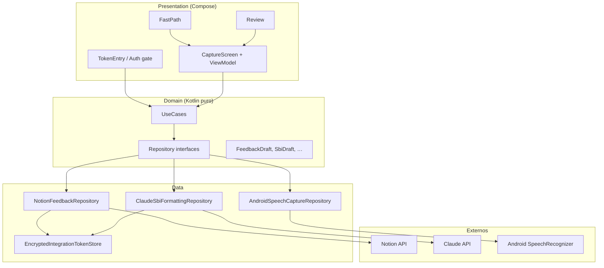
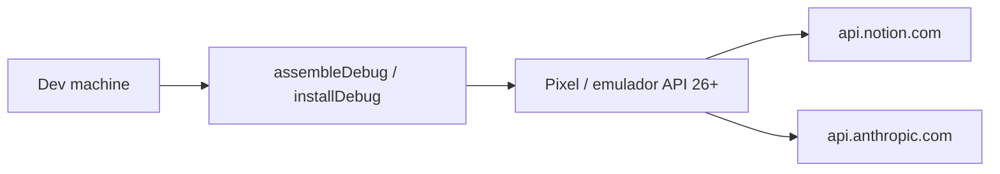
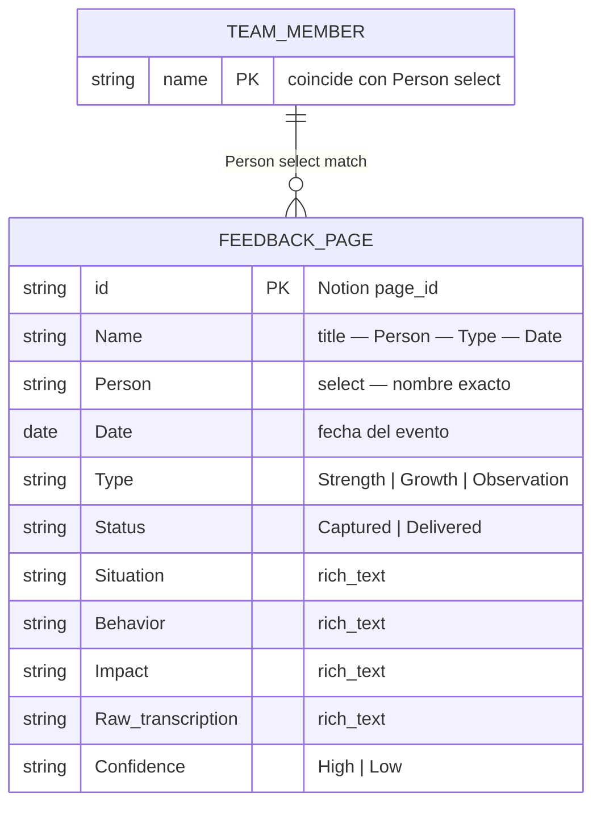

# LeadKit

## Índice

0. [Ficha del proyecto](#0-ficha-del-proyecto)
1. [Descripción general del producto](#1-descripción-general-del-producto)
2. [Arquitectura del sistema](#2-arquitectura-del-sistema)
3. [Modelo de datos](#3-modelo-de-datos)
4. [Especificación de la API](#4-especificación-de-la-api)
5. [Historias de usuario](#5-historias-de-usuario)
6. [Tickets de trabajo](#6-tickets-de-trabajo)
7. [Pull requests](#7-pull-requests)

---

## 0. Ficha del proyecto

### **0.1. Tu nombre completo:**

Ana Aguilar Alonso

### **0.2. Nombre del proyecto:**

LeadKit — Feedback in 20 Seconds

### **0.3. Descripción breve del proyecto:**

App Android nativa para Lead Engineers que captura feedback de reportes directos por voz en menos de 20 segundos, lo estructura en formato SBI (Situation / Behavior / Impact) con Claude, y lo guarda en una base de datos centralizada de Notion. Usuario único (la propia Lead); sin colaboración in-app.

> Documentación de producto y arquitectura: [`docs/README.md`](docs/README.md) · [`docs/Architecture.md`](docs/Architecture.md) · estado: [`docs/Progress.md`](docs/Progress.md)

### **0.4. URL del proyecto:**

> Repositorio privado: [https://github.com/anaaguilaralonso/LeadKit](https://github.com/anaaguilaralonso/LeadKit)

### 0.5. URL o archivo comprimido del repositorio

> Mismo repo GitHub (privado).

---

## 1. Descripción general del producto

### **1.1. Objetivo:**

Registrar feedback en Notion a mano tarda 2–3 minutos. Esa fricción hace que el feedback no se capture en el momento y los Year Reviews se reconstruyan de memoria (sesgo de recencia, patrones perdidos).

LeadKit reduce el ciclo **grabar → confirmar guardado** a **<20 segundos**, con objetivo de **>3×** más capturas/semana y **>60%** de feedbacks pasando de `Captured` a `Delivered`, sin pérdida silenciosa de datos.

### **1.2. Características y funcionalidades principales:**

| # | Funcionalidad | Detalle |
|---|---|---|
| 1 | Auth Notion + Claude | Token de integración Notion y API key de Claude; validación al pegar; almacenamiento en Android Keystore (`EncryptedSharedPreferences`) |
| 2 | Grabación por voz | Un toque, máximo 90 s, indicador visual de grabación (sobre `SpeechRecognizer`, no `MediaRecorder`) |
| 3 | Transcripción | Android Speech Recognition; transcript visible antes de formatear |
| 4 | Formato SBI (Claude) | JSON estructurado: `situation`, `behavior`, `impact`, `confidence` (`high`/`low`), `confidence_reason` |
| 5 | Confidence gate | Alta → FastPath (solo lectura). Baja → Review obligatoria (editable) |
| 6 | Selectores | Persona (lista local `team_members.json`) y tipo (Strength / Growth / Observation); no se guarda sin ambos |
| 7 | Guardado en Notion | Escritura a DB centralizada; errores tipados (401, 403, 429, red…); Retry; el SBI no se pierde si falla |
| 8 | Mark Delivered | Lista *Recent feedback* con Pending Captured; PATCH de Status `Captured` → `Delivered` |

**Fuera de alcance v1:** visualización de equipo in-app, detección de patrones, vista pre-1:1, Jira/Bitbucket, Year Review, clasificación automática de Type por IA.

### **1.3. Diseño y experiencia de usuario:**

Sistema de diseño propio (coral, tipografía reducida, escala 4pt): ver `docs/design-principles.md`. Componentes compartidos (`LeadKitPrimaryButton`, `LeadKitRecordingIndicator`, `LeadKitContextBadge`, etc.) y tema `LeadKitTheme`.

**Flujo UX principal:**

1. Primera apertura → pantalla de entrada de secretos (Notion + Claude).
2. Home / Capture → grabar → transcript → formateo Claude.
3. Confidence alta → FastPath (confirmación + persona/tipo + Save).
4. Confidence baja → Review (editar SBI + persona/tipo + Save).
5. Éxito → confirmación Saved → reset a Idle.
6. Lista *Recent feedback* (Pending Captured) → Mark Delivered.

**Capturas (estado actual en dispositivo):**

| Home + lista Pending | Review (confidence baja) | Review — SBI editable + Save |
|---|---|---|
|  |  |  |

### **1.4. Instrucciones de instalación:**

**Requisitos**

- macOS / Linux / Windows con JDK **17**
- Android Studio (o solo Android SDK + línea de comandos)
- Dispositivo o emulador con **API 26+** (`minSdk 26`, `targetSdk 35`)
- Token de **integración interna de Notion** con acceso a la DB Feedback
- **Claude API key**

**Pasos**

```bash
git clone git@github.com:anaaguilaralonso/LeadKit.git
cd LeadKit/android
./gradlew assembleDebug
./gradlew installDebug   # dispositivo USB con depuración USB
```

1. En Notion: crear/usar integración *LeadKit - Android App* (Read / Insert / Update) y compartir la DB Feedback.
2. Abrir la app → pegar token Notion y Claude API key (se validan y guardan en Keystore; no van en texto plano).
3. La lista de equipo vive en `android/app/src/main/assets/team_members.json` — los nombres deben coincidir **exactamente** con las opciones Select `Person` de Notion.

**Verificación**

```bash
cd android
./gradlew testDebugUnitTest
./gradlew ktlintCheck
./gradlew assembleDebug
```

No hay backend propio ni migraciones de BD: el “backend” es Notion + Claude.

---

## 2. Arquitectura del Sistema

### **2.1. Diagrama de arquitectura:**


```mermaid
flowchart TB
  subgraph presentation["Presentation (Compose)"]
    Auth["TokenEntry / Auth gate"]
    Capture["CaptureScreen + ViewModel"]
    Fast["FastPath"]
    Review["Review"]
  end

  subgraph domain["Domain (Kotlin puro)"]
    UC["UseCases"]
    RepoIF["Repository interfaces"]
    Models["FeedbackDraft, SbiDraft, …"]
  end

  subgraph data["Data"]
    NotionRepo["NotionFeedbackRepository"]
    ClaudeRepo["ClaudeSbiFormattingRepository"]
    SpeechRepo["AndroidSpeechCaptureRepository"]
    Keystore["EncryptedIntegrationTokenStore"]
  end

  subgraph external["Externos"]
    NotionAPI["Notion API"]
    ClaudeAPI["Claude API"]
    ASR["Android SpeechRecognizer"]
  end

  Auth --> UC
  Capture --> UC
  Fast --> Capture
  Review --> Capture
  UC --> RepoIF
  RepoIF --> NotionRepo
  RepoIF --> ClaudeRepo
  RepoIF --> SpeechRepo
  NotionRepo --> NotionAPI
  ClaudeRepo --> ClaudeAPI
  SpeechRepo --> ASR
  NotionRepo --> Keystore
  ClaudeRepo --> Keystore
```

**Patrón:** Clean Architecture + Repository + UseCase, capas `presentation → domain ← data`.

**Por qué:** Claude y Notion son dependencias volátiles; el dominio no conoce Retrofit ni Compose. Se puede retocar prompt/modelo o el cliente HTTP sin tocar UI.

**Trade-offs:** más archivos y TDD obligatorio (fakes > mocks). En v1 todo vive en un único módulo `:app` (multi-módulo `core` / `feature-*` documentado pero diferido) para evitar ceremonia Gradle prematura.

### **2.2. Descripción de componentes principales:**

| Componente | Tecnología | Rol |
|---|---|---|
| UI | Jetpack Compose + Material 3 + `LeadKitTheme` | Pantallas auth/capture/review |
| ViewModels | Kotlin Coroutines + `StateFlow` | Estado UI sellado, orquestación de UseCases |
| DI | Hilt | Wiring de repos, clientes HTTP, stores |
| Notion client | Retrofit + OkHttp + Gson | Auth, create page, update Status |
| Claude client | Retrofit + OkHttp | Messages API → SBI JSON |
| Speech | `SpeechRecognizer` + decorator auto-stop 90s | Captura + transcript |
| Security | `EncryptedSharedPreferences` (Keystore) | Tokens Notion y Claude |
| Tests | JUnit 4, MockWebServer, Turbine, Konsist, Compose UI Test | Unit + arch boundaries |

### **2.3. Descripción de alto nivel del proyecto y estructura de ficheros**

```
LeadKit/
├── android/                          # Proyecto Gradle
│   └── app/src/main/java/.../leadkit/
│       ├── auth/                     # Entrada de tokens + pantallas auth
│       ├── data/                     # dto, network, repository, security, speech, local
│       ├── domain/                   # model, repository (interfaces), usecase, validation
│       ├── di/                       # Módulos Hilt
│       ├── ui/                       # capture, components, theme, permission
│       ├── MainActivity.kt
│       └── LeadKitApplication.kt
├── docs/                             # PRD, Architecture, Progress, phases, design
├── openspec/                         # Cambios OpenSpec (propuestas / archivo)
├── AGENTS.md                         # Convenciones para agentes AI
└── README.md
```

Dentro de `:app`, los paquetes respetan Clean Architecture; Konsist (`ArchitectureTest`) falla el build si `domain` importa Android/data o si `presentation` importa `data`.

### **2.4. Infraestructura y despliegue**


```mermaid
flowchart LR
  Dev["Dev machine"] --> APK["assembleDebug / installDebug"]
  APK --> Device["Pixel / emulador API 26+"]
  Device --> Notion["api.notion.com"]
  Device --> Claude["api.anthropic.com"]
```

- **Sin servidor propio** en v1.
- Distribución: APK debug local (`installDebug`); release con minify/ProGuard preparado, sin publicación en store.
- Secrets: Keystore en dispositivo; `.env` local gitignored solo para uso manual/scripts (no es la fuente de verdad de la app).

### **2.5. Seguridad**

1. Tokens **nunca** en `SharedPreferences` en claro ni en logs.
2. Persistencia solo vía `EncryptedSharedPreferences` (Android Keystore).
3. Validación remota **antes** de persistir (401 → no se guarda el token).
4. Interceptores OkHttp inyectan `Authorization` / `x-api-key` desde el store; no se hardcodean.
5. ProGuard/R8 activo en release; reglas para Retrofit/Gson.
6. `CLEARTEXT` deshabilitado donde aplica; HTTPS a Notion/Claude.

### **2.6. Tests**

Ejemplos representativos (~41 clases de test unitario + instrumentados):

| Área | Qué cubre |
|---|---|
| `NotionAuthRepositoryImplTest` | 401 / red / no persistir token inválido (MockWebServer) |
| `SaveFeedbackUseCaseTest` | Persona + tipo obligatorios; éxito/fallo tipado |
| `NotionFeedbackRepositoryImplTest` | POST create page + PATCH markDelivered + mapeo 401/403/429 |
| `CaptureViewModelTest` | Enable Save, Saving/Saved, confidence routing |
| `ReviewContentTest` / FastPath Compose tests | Gate de campos vacíos, UI de confirmación |
| `ArchitectureTest` (Konsist) | Límites de capas |

TDD obligatorio en UseCases y Repositories: Red → Green → Refactor; fakes sobre mocks.

---

## 3. Modelo de Datos

El “modelo de persistencia” es el esquema de la **base Notion centralizada** (no Room/SQLite en v1). En dominio, el borrador se modela como `FeedbackDraft` / `SbiDraft`.

### **3.1. Diagrama del modelo de datos:**


```mermaid
erDiagram
  FEEDBACK_PAGE {
    string id PK "Notion page_id"
    string Name "title — Person — Type — Date"
    string Person "select — nombre exacto"
    date Date "fecha del evento"
    string Type "Strength | Growth | Observation"
    string Status "Captured | Delivered"
    string Situation "rich_text"
    string Behavior "rich_text"
    string Impact "rich_text"
    string Raw_transcription "rich_text"
    string Confidence "High | Low"
  }

  TEAM_MEMBER {
    string name PK "coincide con Person select"
  }

  TEAM_MEMBER ||--o{ FEEDBACK_PAGE : "Person select match"
```

### **3.2. Descripción de entidades principales:**

#### Feedback (página Notion)

| Propiedad | Tipo Notion | Dominio / notas | Restricciones |
|---|---|---|---|
| `id` | page id | `feedbackId` | PK asignado por Notion al crear |
| Name | Title | Título compuesto | Obligatorio en Notion |
| Person | Select | Nombre del reporte | Exact match con `team_members.json` |
| Date | Date | `LocalDate` al guardar | `start` ISO |
| Type | Select | Strength / Growth / Observation | Manual; no IA en v1 |
| Status | Select | Captured → Delivered | Solo esos dos estados en v1 |
| Situation / Behavior / Impact | Rich text | Bloques SBI | No vacíos al guardar desde Review |
| Raw transcription | Rich text | Transcript original | Auditoría / debug |
| Confidence | Select | High / Low | Self-assessment de Claude |

#### Team member (config local)

Archivo `assets/team_members.json` (8 nombres en el entorno actual). No es Relation de Notion: **Select por texto** (decisión cerrada v1).

#### Modelos de dominio (app)

- `FeedbackDraft` — payload de guardado (persona, tipo, SBI, transcript, confidence, fecha).
- `SbiDraft` / resultado de formateo — situation, behavior, impact, confidence, reason.
- `WriteFeedbackResult` — Success / InvalidToken / PermissionDenied / RateLimited / NoNetwork / UnknownFailure.
- `FeedbackStatus` — Captured | Delivered.

---

## 4. Especificación de la API

La app es cliente de APIs externas (no expone API propia). Tres endpoints principales:

### 4.1. Validar token Notion

```yaml
openapi: 3.0.3
info:
  title: Notion — Auth probe (usado por LeadKit)
  version: 1.0.0
paths:
  /v1/users/me:
    get:
      summary: Validar token de integración
      parameters:
        - in: header
          name: Authorization
          required: true
          schema: { type: string, example: "Bearer secret_…" }
        - in: header
          name: Notion-Version
          required: true
          schema: { type: string, example: "2022-06-28" }
      responses:
        "200":
          description: Token válido
          content:
            application/json:
              example: { "object": "user", "id": "…", "name": "…" }
        "401":
          description: Token inválido — LeadKit no persiste el secreto
```

### 4.2. Crear feedback (página)

```yaml
paths:
  /v1/pages:
    post:
      summary: Crear fila de feedback en la DB centralizada
      requestBody:
        required: true
        content:
          application/json:
            example:
              parent: { database_id: "10bfb2f9-e0ec-46d6-93c8-505eedb3e77a" }
              properties:
                Name: { title: [{ text: { content: "Marta — Strength — 2026-07-22" } }] }
                Person: { select: { name: "Marta" } }
                Date: { date: { start: "2026-07-22" } }
                Type: { select: { name: "Strength" } }
                Status: { select: { name: "Captured" } }
                Situation: { rich_text: [{ text: { content: "…" } }] }
                Behavior: { rich_text: [{ text: { content: "…" } }] }
                Impact: { rich_text: [{ text: { content: "…" } }] }
                Raw transcription: { rich_text: [{ text: { content: "…" } }] }
                Confidence: { select: { name: "High" } }
      responses:
        "200":
          description: Página creada
          content:
            application/json:
              example: { "id": "a1b2c3d4-…" }
```

### 4.3. Marcar Delivered + formateo Claude (referencia)

```yaml
paths:
  /v1/pages/{page_id}:
    patch:
      summary: Actualizar Status a Delivered
      parameters:
        - in: path
          name: page_id
          required: true
          schema: { type: string }
      requestBody:
        content:
          application/json:
            example:
              properties:
                Status: { select: { name: "Delivered" } }
      responses:
        "200": { description: Status actualizado }

  /v1/messages:
    post:
      summary: Claude — formatear transcript a SBI JSON
      servers: [{ url: https://api.anthropic.com }]
      parameters:
        - in: header
          name: x-api-key
          required: true
          schema: { type: string }
      requestBody:
        content:
          application/json:
            example:
              model: claude-sonnet-5
              max_tokens: 1024
              messages:
                - role: user
                  content: "<transcript + instrucciones SBI>"
      responses:
        "200":
          description: Respuesta con bloque text que contiene JSON SBI
```

---

## 5. Historias de Usuario

### Historia de Usuario 1 — Captura por voz en el momento

**Como** Lead Engineer,  
**quiero** grabar una nota de voz sobre un momento de feedback en el instante en que ocurre,  
**para** no depender de recordarlo más tarde.

**Criterios de aceptación (resumen):** un toque para start/stop; máximo 90 s; estado de grabación visible; sin pasos intermedios.

**Trazabilidad:** US-06 (KAN-15→18) · PRD P0 #1.

---

### Historia de Usuario 2 — SBI automático con revisión solo si hace falta

**Como** Lead Engineer,  
**quiero** que la transcripción se formatee a SBI y solo revisar/editar cuando la confianza sea baja,  
**para** no perder tiempo confirmando texto ya correcto.

**Criterios de aceptación (resumen):** Claude devuelve situation/behavior/impact + confidence; `high` → FastPath; `low` (u otro valor) → Review editable; no se puede saltar la review en baja confianza.

**Trazabilidad:** US-08 / US-09 (KAN-22→32) · PRD P0 #3.

---

### Historia de Usuario 3 — Guardar en Notion sin pérdida de datos

**Como** Lead Engineer,  
**quiero** guardar el feedback en Notion con persona y tipo, y saber si falló el guardado,  
**para** no asumir que se guardó cuando no fue así y poder reintentar sin perder el SBI.

**Criterios de aceptación (resumen):** Save solo con persona + tipo; errores tipados + Retry; texto SBI permanece en pantalla; fila con Status `Captured` en Notion.

**Trazabilidad:** US-13 / US-14 (KAN-43→47) · PRD P0 #4–6.

---

## 6. Tickets de Trabajo

> Tres tickets representativos: datos/setup, backend(data/API), frontend(UI).

### Ticket 1 — Bases de datos / setup (KAN-2)

**Título:** Notion integration + centralized Feedback DB (no migration)  
**Historia:** US-03  
**Estado:** Done  

**Objetivo:** Crear la integración Notion y la DB Feedback centralizada con el esquema definitivo (sin migrar DBs por persona).

**AC (resumen):**
- Integración *LeadKit - Android App* con Read / Insert / Update.
- DB Feedback con propiedades Name, Person, Date, Type, Status, Situation, Behavior, Impact, Raw transcription, Confidence.
- DB compartida con la integración.
- Sin migración de datos históricos.

**Notas:** Decisión de producto #1 — DB centralizada desde el día 1 para habilitar patrones en v2.

---

### Ticket 2 — Backend / data (KAN-51)

**Título:** US-16: Notion PATCH markDelivered (Status → Delivered)  
**Historia:** US-16  
**Estado:** Done  

**Objetivo:** Implementar `markDelivered(feedbackId)` vía `PATCH /v1/pages/{page_id}` cambiando solo Status a `Delivered`, reutilizando la taxonomía de errores del save.

**AC (resumen):**
- `NotionApi.updatePage` + DTO mínimo de Status.
- Mapeo 401 / 403 / 429 / IOException / other igual que `save`.
- Tests MockWebServer (éxito + errores).
- `./gradlew assembleDebug testDebugUnitTest ktlintCheck` OK.

**Fuera de alcance:** UI de lista Pending (US-17), polish de errores (US-18).

---

### Ticket 3 — Frontend (KAN-45)

**Título:** US-13: Enable Save + wire CaptureViewModel to SaveFeedbackUseCase  
**Historia:** US-13  
**Estado:** Done  

**Objetivo:** Habilitar Save en FastPath/Review cuando hay persona + tipo, invocar `SaveFeedbackUseCase`, mostrar estado `Saving`, y retirar el spike de escritura de prueba (KAN-11).

**AC (resumen):**
- Save enabled solo con `selectedPerson` + `selectedType` (Review: SBI no vacío).
- UI `Saving` en vuelo; SBI visible.
- Success handoff hacia confirmación (KAN-48).
- Tests Compose/ViewModel + build/lint verdes.

**Riesgos:** doble tap (ignorar mientras `Saving`); nested scroll (lección KAN-31).

---

## 7. Pull Requests

> Documentación de PRs / merges relevantes. (#1 y #2 son PRs formales en GitHub; el resto del flujo usó merges de ramas `KAN-*` a `master`.)

### Pull Request 1 — [#1](https://github.com/anaaguilaralonso/LeadKit/pull/1)

**Título:** feat(KAN-5): wire Notion token validation to Keystore and startup gate  
**Rama:** `KAN-5` → `master`  
**Qué introduce:** Validación `GET /v1/users/me` → persistencia en Keystore → gate de arranque (`MainViewModel` / `AuthenticatedPlaceholder`). UseCase `ValidateAndSaveNotionTokenUseCase` + tests.  
**Por qué importa:** Cierra el happy path de US-01; sin esto no hay auth usable en dispositivo.

---

### Pull Request 2 — [#2](https://github.com/anaaguilaralonso/LeadKit/pull/2)

**Título:** feat(KAN-6): auth error handling and code review hardening  
**Rama:** `KAN-6` → `master`  
**Qué introduce:** Errores tipados 401 vs red en auth; token no se persiste si falla; Konsist `ArchitectureTest`; tests instrumentados de Keystore; agente de code review Android.  
**Por qué importa:** Completa US-01 con manejo explícito de fallos (sin fallos silenciosos).

---

### Pull Request 3 — Merge `KAN-45` (Save real)

**Commit:** `4248a28` — `feat(capture): enable Save and wire SaveFeedbackUseCase (KAN-45)`  
**Rama:** `KAN-45` → `master`  
**Qué introduce:** Gate persona/tipo en FastPath/Review, estados `Saving`/`Saved`, wiring a `SaveFeedbackUseCase`, eliminación del spike `WriteTestEntryToNotionDbUseCase`.  
**Por qué importa:** Primer guardado real de feedback completo a Notion desde el flujo de captura — cierra el núcleo del MVP de escritura.

---

*Estado a 22 jul 2026: Phases 1–3 Done; Phase 4 en curso (lista Recent feedback + Mark Delivered en UI).*
