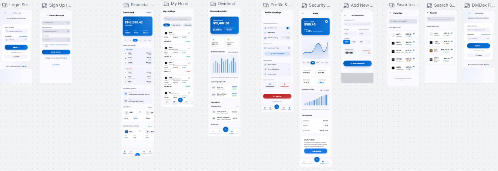
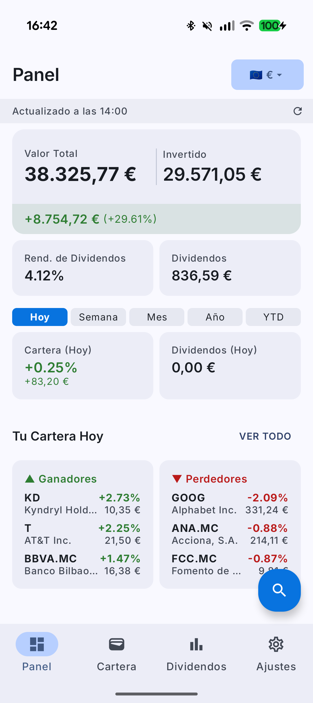
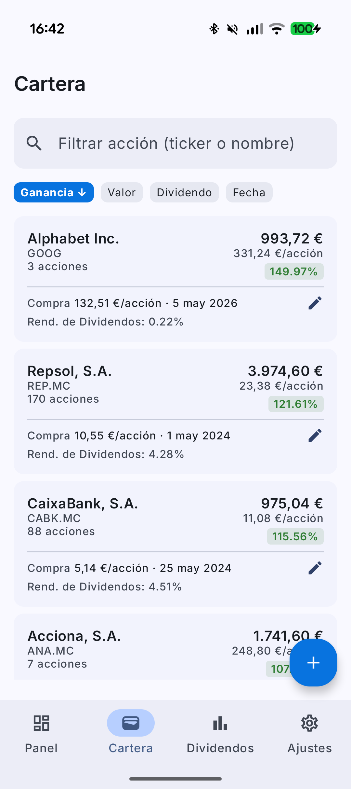
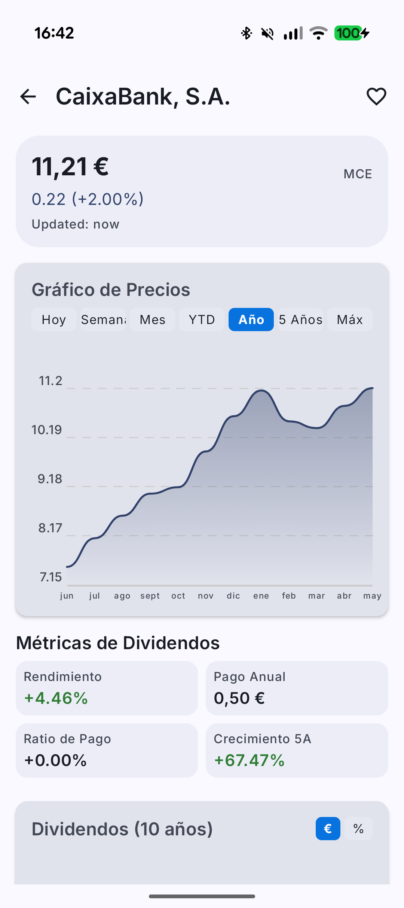
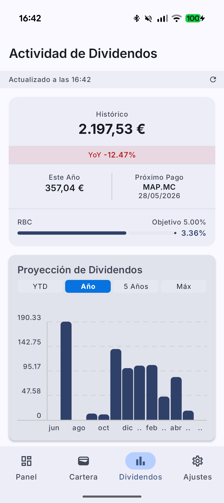
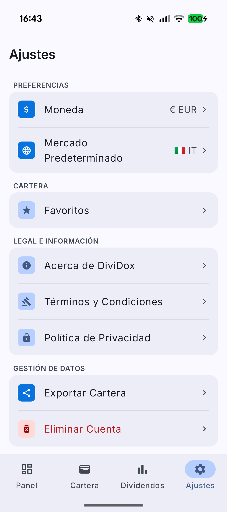
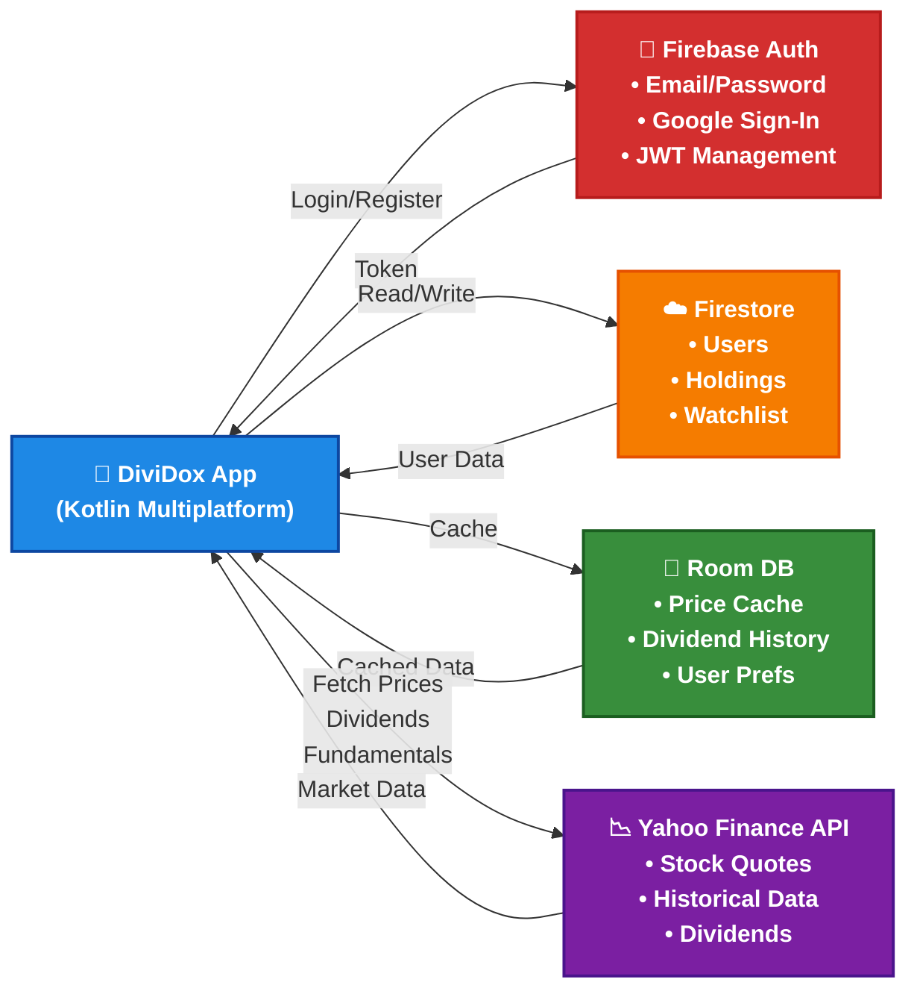
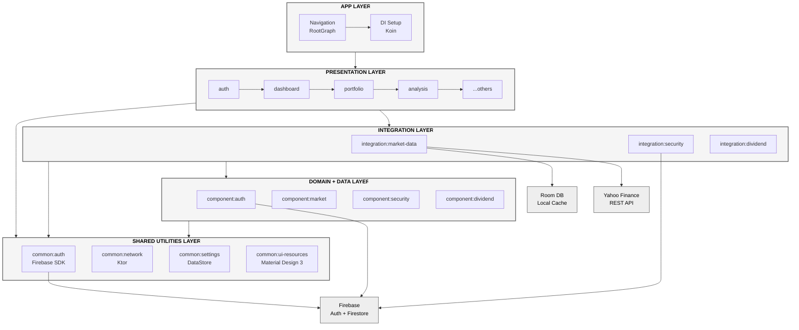
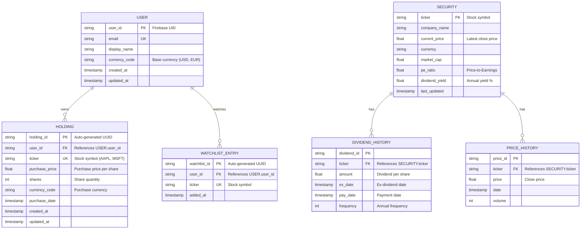
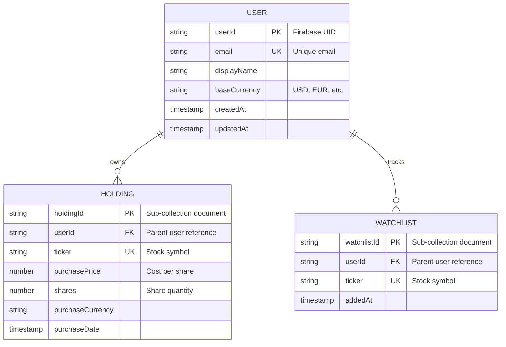

# DiviDox — Dividend Portfolio Tracker

## Index

0. [Project Information](#0-project-information)
1. [Product Overview](#1-product-overview)
2. [System Architecture](#2-system-architecture)
3. [Data Model](#3-data-model)
4. [API Specification](#4-api-specification)
5. [User Stories](#5-user-stories)
6. [Work Tickets](#6-work-tickets)

---

## 0. Project Information

### **0.1. Full Name:**
Javier Camarena Triguero

### **0.2. Project Name:**
DiviDox — Dividend Portfolio Tracker

### **0.3. Project Description:**
DiviDox is a cross-platform application (Android, iOS, Desktop) built with **Kotlin Multiplatform (KMP)** that enables individual investors to manage, analyze, and project their passive income from dividends. It provides detailed position tracking, historical dividend analysis, annual income projections, and performance comparisons.

### **0.4. Project URLs:**
**Code Repository:** https://github.com/javiercamarenatriguero/dividox (public)

**UI Prototype:** https://stitch.withgoogle.com/projects/10568397103146599411 (Stitch)

### **0.5. Tools Used:**
- **GitHub Projects (Dividox Board):** https://github.com/users/javiercamarenatriguero/projects/4 — Issue tracking, user story management, project workflow
- **Stitch (Google AI for UI):** AI-powered tool for cross-platform interface design and prototyping
- **Claude Code:** Code generation, architecture design, and documentation

---

## 1. Product Overview

### **1.1. Objective:**

**DiviDox** solves a critical problem for dividend investors: comprehensive visibility of passive income.

**What it solves:**
- Traditional brokerage portals don't provide portfolio-level dividend projections
- Lack of detailed historical analysis (payment trends, yield changes)
- Difficulty estimating annual passive income accurately
- No tracking of "watchlist" positions before purchasing

**User value:**
- Real-time visualization of expected annual dividend income
- Comparative yield analysis across holdings
- Future cash flow projections
- Historical payment trend analysis (5+ years)
- Cross-platform management (phone, tablet, desktop) from a single codebase

### **1.2. Key Features:**

1. **Portfolio Management**
   - Add/edit positions with purchase price, share quantity, currency, and date
   - View current value, unrealized gain/loss, gain %
   - Track daily portfolio changes

2. **Dividend Analysis**
   - Historical dividends per stock (5-10 years)
   - Annual dividend income projection at portfolio level
   - Auto-calculated yield
   - Next ex-dividend and payment dates

3. **Watchlist (Security Tracking)**
   - Add stocks to track without ownership
   - Compare yield, price, fundamentals before investing
   - Historical price and dividend data

4. **Authentication & Account**
   - Google and Email/Password login
   - Cloud sync via Firebase
   - Base currency management (USD, EUR, etc.)

5. **Technical & Fundamental Analysis**
   - Interactive price charts (1D, 1W, 1M, 1Y, YTD, ALL)
   - Fundamental metrics: P/E, Market Cap, Dividend Payout Ratio

### **1.3. User Experience Design:**

**Main Flow:**
1. **Splash Screen** — Welcome animation (2s)
2. **Auth Flow** — Google Sign-In / Email signup
3. **Dashboard** — Main view with portfolio summary, favorites, period selector
4. **Portfolio Screen** — Complete holdings list with gain/loss, converted currency
5. **Security Detail** — Analysis screen: price chart, metrics, dividends, fundamentals
6. **Favorites/Watchlist** — Manage favorite securities

**Design System:**
- **Material Design 3** with dynamic color palette (Material You)
- Adaptive dark/light mode
- Compose Multiplatform components for cross-platform consistency
- Visual prototype: https://stitch.withgoogle.com/projects/10568397103146599411

---

### **1.3.1. Design Prototype (Stitch - Interactive UI):**

**🎨 Complete Design System & All Screens:**

<div align="center">
  <a href="https://stitch.withgoogle.com/projects/10568397103146599411">
    
  </a>
  <p><strong>👉 Click image or <a href="https://stitch.withgoogle.com/projects/10568397103146599411">open live prototype</a> to explore interactive mockups</strong></p>
</div>

---

### **1.3.2. App Screenshots:**

| Screen | Description |
|--------|-------------|
|  | **Dashboard** — Portfolio overview with total value, today's metrics, favorites quick access, and period selector |
|  | **Portfolio** — Holdings list showing ticker, company name, current value, position size, and gain/loss % |
|  | **Analysis** — Detailed security view with price chart (multiple timeframes), fundamental metrics (P/E, Market Cap, Yield) |
|  | **Dividends** — Income projections, historical payment timeline, ex-dividend dates, frequency and yield comparison |
|  | **Settings** — Profile management, currency selection, biometric lock, notifications, data export & account deletion |

### **1.4. Installation Instructions:**

**Prerequisites:**
- JDK 17+ (Kotlin 2.0+)
- Android Studio 2024.2+ with Kotlin Multiplatform Plugin
- Xcode 15+ (for iOS)
- Firebase project created (Authentication + Firestore)

**Local Setup Steps:**

```bash
# 1. Clone repository
git clone https://github.com/javiercamarenatriguero/dividox.git
cd dividox

# 2. Configure Firebase
# - Create project in Firebase Console
# - Download google-services.json (Android)
# - Create GoogleService-Info.plist (iOS)
# - Place in composeApp/src/androidMain/res/google-services.json
#   and iosApp/iosApp/GoogleService-Info.plist

# 3. Configure Yahoo Finance API
# - Register on RapidAPI: https://rapidapi.com/
# - Get API key for "Yahoo Finance" endpoint
# - Add to local.properties: YAHOO_API_KEY=xxx

# 4. Build & Run Android
./gradlew :composeApp:assembleDebug
# Or from Android Studio: Run > Run 'composeApp'

# 5. Build & Run Desktop (JVM)
./gradlew :composeApp:run

# 6. Build & Run iOS
# Open iosApp/iosApp.xcworkspace in Xcode
# Select target "iosApp" and run on simulator/device
```

**Optional Seed Data:**
- App generates test holdings on first login
- Real market data from Yahoo Finance API

---

## 2. System Architecture

### **2.0. High-Level Integration Diagram:**


```mermaid
graph LR
    App["📱 DiviDox App<br/>(Kotlin Multiplatform)"]
    
    Auth["🔐 Firebase Auth<br/>• Email/Password<br/>• Google Sign-In<br/>• JWT Management"]
    
    Firestore["☁️ Firestore<br/>• Users<br/>• Holdings<br/>• Watchlist"]
    
    Room["💾 Room DB<br/>• Price Cache<br/>• Dividend History<br/>• User Prefs"]
    
    Yahoo["📉 Yahoo Finance API<br/>• Stock Quotes<br/>• Historical Data<br/>• Dividends"]
    
    App -->|Login/Register| Auth
    Auth -->|Token| App
    
    App -->|Read/Write| Firestore
    Firestore -->|User Data| App
    
    App -->|Cache| Room
    Room -->|Cached Data| App
    
    App -->|Fetch Prices<br/>Dividends<br/>Fundamentals| Yahoo
    Yahoo -->|Market Data| App

    style App fill:#1E88E5,stroke:#0D47A1,stroke-width:2px,color:#fff,font-weight:bold
    style Auth fill:#D32F2F,stroke:#B71C1C,stroke-width:2px,color:#fff,font-weight:bold
    style Firestore fill:#F57C00,stroke:#E65100,stroke-width:2px,color:#fff,font-weight:bold
    style Room fill:#388E3C,stroke:#1B5E20,stroke-width:2px,color:#fff,font-weight:bold
    style Yahoo fill:#7B1FA2,stroke:#4A148C,stroke-width:2px,color:#fff,font-weight:bold
```

**Data Flow Summary:**
- **Auth:** Firebase handles login & token refresh via `common:auth` module
- **Cloud Storage:** Firestore stores user data (holdings, watchlist) via `component:security` 
- **Local Cache:** Room DB caches market data (prices, dividends) via `component:market`
- **External Data:** Yahoo Finance API fetches real-time quotes and historical data via Ktor HTTP client

---

### **2.1. Layered Modular Architecture:**


```mermaid
graph TB
    subgraph App["APP LAYER"]
        Nav["Navigation<br/>RootGraph"] --> DI["DI Setup<br/>Koin"]
    end

    subgraph Features["PRESENTATION LAYER"]
        Auth["auth"] --> Dashboard["dashboard"] --> Portfolio["portfolio"] --> Analysis["analysis"] --> Other["...others"]
    end

    subgraph Integration["INTEGRATION LAYER"]
        IMD["integration:market-data"]
        IS["integration:security"]
        ID["integration:dividend"]
    end

    subgraph Components["DOMAIN + DATA LAYER"]
        CA["component:auth"]
        CM["component:market"]
        CS["component:security"]
        CD["component:dividend"]
    end

    subgraph Common["SHARED UTILITIES LAYER"]
        CAuth["common:auth<br/>Firebase SDK"]
        CNet["common:network<br/>Ktor"]
        CSet["common:settings<br/>DataStore"]
        CUI["common:ui-resources<br/>Material Design 3"]
    end

    Firebase["Firebase<br/>Auth + Firestore"]
    Room["Room DB<br/>Local Cache"]
    Yahoo["Yahoo Finance<br/>REST API"]

    App --> Features
    Features --> Integration
    Features --> Common
    Integration --> Components
    Integration --> Common
    Components --> Common

    CAuth --> Firebase
    IMD --> Yahoo
    IMD --> Room
    IS --> Firebase
    CA --> Firebase

    style App fill:#f5f5f5,stroke:#616161,stroke-width:2px,color:#000,font-weight:bold
    style Features fill:#f5f5f5,stroke:#616161,stroke-width:2px,color:#000,font-weight:bold
    style Components fill:#f5f5f5,stroke:#616161,stroke-width:2px,color:#000,font-weight:bold
    style Integration fill:#f5f5f5,stroke:#616161,stroke-width:2px,color:#000,font-weight:bold
    style Common fill:#f5f5f5,stroke:#616161,stroke-width:2px,color:#000,font-weight:bold
    style Firebase fill:#eeeeee,stroke:#424242,stroke-width:1px,color:#000
    style Room fill:#eeeeee,stroke:#424242,stroke-width:1px,color:#000
    style Yahoo fill:#eeeeee,stroke:#424242,stroke-width:1px,color:#000
```

**Layer Responsibilities:**

| Layer | Purpose | Examples |
|-------|---------|----------|
| **App** | Entry point, navigation routing, dependency injection | `:composeApp` with RootGraph & Koin |
| **Features** | UI screens only (pure presentation) | `:feature:auth`, `:feature:dashboard`, `:feature:portfolio` |
| **Integration** | Shared business logic & data access | `:integration:market-data`, `:integration:security`, `:integration:dividend` |
| **Components** | Domain models & data repositories | `:component:auth`, `:component:market`, `:component:security` |
| **Common** | Cross-platform utilities | `:common:auth` (Firebase), `:common:network` (Ktor), `:common:ui-resources` |
| **External** | Third-party services | Firebase (Auth, Firestore), Room DB (local cache), Yahoo Finance API |

**Pattern: Clean Architecture + Kotlin Multiplatform (KMP) Modules**

**Why this architecture:**
- **Clear separation of concerns:** App layer handles navigation & DI; Feature layers expose only screens (dumb UI); Component layers contain domain & data logic
- **Feature isolation:** Each `:feature:*` is a screen UI module that depends on domain/data (`:component:*`), but features never depend on each other
- **Domain-first design:** Business logic lives in `:component:*` (domain + data), reusable by multiple features
- **Cross-platform:** Kotlin Multiplatform allows writing domain + data once (`:component:*`, `:common:*`) and reusing across Android/iOS/Desktop
- **Testability:** Domain logic in `:component:*` is pure Kotlin with no Android/iOS deps → easy unit testing

### **2.2. Main Components:**

#### **App Layer (:composeApp)**

| Component | Technology | Responsibility |
|---|---|---|
| **Navigation** | Compose Navigation 3 + Kotlin Serialization | Type-safe routing (RootNavGraph, nested graphs per feature) |
| **DI Setup** | Koin startKoin() | Initialize all modules, register singletons, factories |

#### **Feature Layer (:feature:*) — Screens Only**

| Component | Technology | Responsibility |
|---|---|---|
| **Presentation (UI)** | Compose Multiplatform + Material Design 3 | Screen rendering, MVI state management, user input |
| **MVI Contract** | Sealed interfaces | State (immutable data class), Event (user actions), Effect (side effects) |
| **ViewModel** | Android lifecycle-viewmodel-compose | Orchestrate use cases, manage state, emit effects |

#### **Component Layer (:component:*) — Domain + Data**

| Component | Technology | Responsibility |
|---|---|---|
| **Domain Layer** | Pure Kotlin (no Android/iOS deps) | Business logic (use cases, models, interfaces) |
| **Data Layer** | Repositories (impl of domain interfaces) | External API access, local storage, sync logic |
| **Data Sources** | expect/actual (platform-specific) | Platform-native access (Firebase, Room, Keychain, etc) |

#### **Integration Layer (:integration:*) — Shared Integrations**

| Component | Technology | Responsibility |
|---|---|---|
| **Market Data** | Yahoo Finance API (via Ktor) | Fetch historical prices, fundamentals, dividends; cache strategy |
| **Security Data** | Firestore + Room | Holdings, portfolio calculations, watchlist |
| **Dividend Calculations** | Pure Kotlin functions | Projections, CAGR, yield computations |

#### **Common Layer (:common:*) — Reusable Utilities**

| Component | Technology | Responsibility |
|---|---|---|
| **Auth** | Firebase Auth + Google Sign-In | Session management, tokens, expect/actual platform SDKs |
| **Network** | Ktor HTTP Client | HTTP configuration, interceptors, error handling |
| **UI Resources** | Material Design 3 theme | Colors, typography, shapes, components (ButtonDefaults, etc) |
| **Settings** | EncryptedSharedPreferences / Datastore | User preferences, encrypted local storage |
| **Local Storage** | Room DB (Android/iOS) + File I/O (Desktop) | Price cache, holdings, preferences (expect/actual) |

### **2.3. Project Structure & Module Layers:**

```
dividox/
├── composeApp/                        # APP LAYER
│   ├── src/commonMain/
│   │   ├── kotlin/com/akole/dividox/
│   │   │   ├── di/                    # DI setup (Koin)
│   │   │   └── navigation/            # Navigation graphs & routes
│   │   ├── androidMain/               # Android entry point
│   │   ├── iosMain/                   # iOS entry point
│   │   └── jvmMain/                   # Desktop entry point
│
├── feature/                           # PRESENTATION LAYER (Screens only)
│   ├── auth/                          # Authentication screens
│   ├── dashboard/                     # Dashboard screens
│   ├── portfolio/                     # Portfolio screens
│   ├── analysis/                      # Security analysis screens
│   ├── dividends/                     # Dividend activity screens
│   ├── search/                        # Search & discovery screens
│   ├── settings/                      # Settings screens
│   └── favorites/                     # Favorites/watchlist screens
│
├── component/                         # DOMAIN + DATA LAYER
│   ├── auth/                          # Auth domain + data (DVX-TK-011)
│   │   └── src/commonMain/kotlin/component/auth/
│   │       ├── domain/                # Use cases, models, interfaces
│   │       ├── data/                  # Repositories, data sources
│   │       ├── androidMain/           # Android expect/actual
│   │       ├── iosMain/               # iOS expect/actual
│   │       ├── jvmMain/               # Desktop expect/actual
│   │       └── di/                    # Koin module
│   │
│   ├── market/                        # Market data domain + data (DVX-TK-015)
│   │   └── src/commonMain/kotlin/component/market/
│   │       ├── domain/
│   │       ├── data/
│   │       ├── [platform mains]/
│   │       └── di/
│   │
│   ├── security/                      # Holdings & portfolio
│   │   └── src/commonMain/kotlin/component/security/
│   │       ├── domain/
│   │       ├── data/
│   │       └── di/
│   │
│   └── dividend/                      # Dividend calculations
│       └── src/commonMain/kotlin/component/dividend/
│           ├── domain/
│           ├── data/
│           └── di/
│
├── common/                            # SHARED LAYER (Utilities)
│   ├── auth/                          # Firebase Auth SDK
│   ├── network/                       # Ktor HTTP client
│   ├── ui-resources/                  # Material Design 3 theme
│   ├── settings/                      # Preferences storage
│   └── mvi/                           # MVI base classes
│
├── docs/                              # Documentation
│   ├── adr/                           # Architecture Decision Records
│   ├── prd/                           # Product Requirements Documents
│   └── tickets/                       # Work tickets reference
│
└── settings.gradle.kts                # Module registration
```

**Module Dependencies (Layered & Unidirectional):**

```
composeApp (App Layer)
  ↓ depends on
feature:* (Presentation Layer) —→ only expose Screens, no domain logic
  ↓ depends on
component:* (Domain + Data Layer) —→ domain logic, repositories, use cases
  ↓ depends on
common:* (Shared Layer) —→ utilities, Firebase, Ktor, etc
integration:* (optional, for shared integrations)
  ↓ depends on
External (Firebase, Yahoo Finance)
```

**Isolation Rules:**
- `:feature:*` modules **do NOT depend on each other** (no auth → dashboard imports)
- `:component:*` modules **can depend on other components** (e.g., portfolio → market data)
- `:common:*` modules **have no internal dependencies** (utilities only)
- `:integration:*` modules **are shared and reusable** by multiple components

### **2.4. Infrastructure & Deployment:**

**Backend (Firebase + REST APIs):**
```
┌─────────────────┐
│ Firebase Console │
├─────────────────┤
│ • Authentication│ ← Google Sign-In, Email auth
│ • Firestore DB  │ ← Holdings, portfolios, settings
│ • Storage       │ ← User avatars (v2+)
└─────────────────┘
         ▲
         │ (SDK)
    ┌────┴────┐
    │ DiviDox │
    │  App    │
    └────┬────┘
         │ (REST)
    ┌─────────────────┐
    │ Yahoo Finance   │
    │ (RapidAPI)      │ ← Prices, dividend history
    └─────────────────┘
```

**Build Targets (Multiplatform):**
- **Android:** API 24+ (Gradle compilation, Play Store publish)
- **iOS:** iOS 14+ (Xcode compilation, App Store publish)
- **Desktop:** macOS/Windows/Linux (JAR or installer distribution)

**Delivery 1 Deployment (MVP):**
- ✅ Successful compilation for all targets
- ✅ Firebase project configured (auth + Firestore)
- ✅ CI/CD with GitHub Actions (gradle build + detekt)
- 📋 Play Store / App Store: pending (Delivery 2)

### **2.5. Security:**

1. **Authentication:**
   - Firebase Auth manages JWT tokens (auto-refresh)
   - Google Sign-In via Credential Manager (Android) / GoogleSignIn SDK (iOS)
   - Session storage: EncryptedSharedPreferences (Android), Keychain (iOS), AES-256-GCM (JVM)

2. **Credential Storage:**
   - Passwords never stored locally (Firebase manages tokens)
   - Session tokens encrypted with AES-256-GCM
   - IV (Initialization Vector) randomly generated, never fixed

3. **Communication:**
   - HTTPS mandatory (Ktor + Certificate Pinning in v2+)
   - Yahoo Finance API keys stored on backend (not in APK)

4. **Input Validation:**
   - Form input sanitization (email, numbers)
   - Server-side rate limiting on APIs

### **2.6. Testing:**

**Unit Tests (Domain layer / Presentation layer):**
All the MVI components and domain/data classes should be covered by Unit Tests.
- ViewModels
- UseCases
- Repositories
- DataSources
- Mappers
- Algorithms
- Converters: Currency, Dividends calculation...

**Integration Tests:**
- Firebase Authentication emulator (local testing)
- Firestore emulator (test data, no prod touch)

---

## 3. Data Model

### **3.1. Entity Relationship Diagram:**


```mermaid
erDiagram
    USER ||--o{ HOLDING : "owns"
    USER ||--o{ WATCHLIST_ENTRY : "watches"
    USER {
        string user_id PK "Firebase UID"
        string email UK
        string display_name
        string currency_code "Base currency (USD, EUR)"
        timestamp created_at
        timestamp updated_at
    }
    
    HOLDING {
        string holding_id PK "Auto-generated UUID"
        string user_id FK "References USER.user_id"
        string ticker UK "Stock symbol (AAPL, MSFT)"
        float purchase_price "Purchase price per share"
        int shares "Share quantity"
        string currency_code "Purchase currency"
        timestamp purchase_date
        timestamp created_at
        timestamp updated_at
    }
    
    WATCHLIST_ENTRY {
        string watchlist_id PK "Auto-generated UUID"
        string user_id FK "References USER.user_id"
        string ticker UK "Stock symbol"
        timestamp added_at
    }
    
    SECURITY {
        string ticker PK "Stock symbol"
        string company_name
        float current_price "Latest close price"
        string currency
        float market_cap
        float pe_ratio "Price-to-Earnings"
        float dividend_yield "Annual yield %"
        timestamp last_updated
    }
    
    SECURITY ||--o{ DIVIDEND_HISTORY : "has"
    DIVIDEND_HISTORY {
        string dividend_id PK
        string ticker FK "References SECURITY.ticker"
        float amount "Dividend per share"
        timestamp ex_date "Ex-dividend date"
        timestamp pay_date "Payment date"
        int frequency "Annual frequency"
    }
    
    SECURITY ||--o{ PRICE_HISTORY : "has"
    PRICE_HISTORY {
        string price_id PK
        string ticker FK "References SECURITY.ticker"
        float price "Close price"
        timestamp date
        int volume
    }
```

### **3.2. Main Entities:**

#### **USER**
Authenticated DiviDox user.

| Attribute | Type | Constraints | Description |
|-----------|------|-------------|------------|
| `user_id` | String | PK, NOT NULL | Firebase UID |
| `email` | String | UNIQUE, NOT NULL | Login email |
| `display_name` | String | - | Display name |
| `currency_code` | String | NOT NULL | Base currency for conversions (USD, EUR, GBP) |
| `created_at` | Timestamp | NOT NULL | Registration date |
| `updated_at` | Timestamp | NOT NULL | Last update |

---

#### **HOLDING**
User's equity position.

| Attribute | Type | Constraints | Description |
|-----------|------|-------------|------------|
| `holding_id` | String | PK, NOT NULL | Auto-generated UUID |
| `user_id` | String | FK, NOT NULL | Owner |
| `ticker` | String | UNIQUE (per user), NOT NULL | Stock symbol (AAPL, MSFT) |
| `purchase_price` | Float | NOT NULL | Cost per share |
| `shares` | Integer | NOT NULL, > 0 | Share quantity |
| `currency_code` | String | NOT NULL | Purchase currency |
| `purchase_date` | Timestamp | NOT NULL | Purchase date |
| `created_at` | Timestamp | NOT NULL | Creation timestamp |
| `updated_at` | Timestamp | NOT NULL | Last edit timestamp |

---

#### **WATCHLIST_ENTRY**
Securities tracked without ownership.

| Attribute | Type | Constraints | Description |
|-----------|------|-------------|------------|
| `watchlist_id` | String | PK, NOT NULL | Auto-generated UUID |
| `user_id` | String | FK, UNIQUE (per user+ticker) | Owner |
| `ticker` | String | NOT NULL | Stock symbol |
| `added_at` | Timestamp | NOT NULL | Addition date |

---

#### **SECURITY**
Market data cache (local + Firestore).

| Attribute | Type | Constraints | Description |
|-----------|------|-------------|------------|
| `ticker` | String | PK, NOT NULL | AAPL, MSFT, GOOGL, etc. |
| `company_name` | String | - | Apple Inc. |
| `current_price` | Float | NOT NULL | Last close price |
| `currency` | String | NOT NULL | Quote currency (USD) |
| `market_cap` | Float | - | Market capitalization |
| `pe_ratio` | Float | - | Price-to-Earnings ratio |
| `dividend_yield` | Float | - | Annual yield (%) |
| `last_updated` | Timestamp | NOT NULL | Last Yahoo Finance fetch |

---

#### **DIVIDEND_HISTORY**
Historical dividend payments (5-10 years).

| Attribute | Type | Constraints | Description |
|-----------|------|-------------|------------|
| `dividend_id` | String | PK, NOT NULL | Auto-generated UUID |
| `ticker` | String | FK, NOT NULL | Security reference |
| `amount` | Float | NOT NULL | Dividend per share |
| `ex_date` | Timestamp | NOT NULL | Ex-dividend date |
| `pay_date` | Timestamp | NOT NULL | Payment date |
| `frequency` | Integer | NOT NULL | Annual frequency (1, 2, 4, 12) |

---

#### **PRICE_HISTORY**
Daily price time series.

| Attribute | Type | Constraints | Description |
|-----------|------|-------------|------------|
| `price_id` | String | PK, NOT NULL | Auto-generated UUID |
| `ticker` | String | FK, NOT NULL | Security reference |
| `price` | Float | NOT NULL | Close price |
| `date` | Timestamp | UNIQUE (ticker, date), NOT NULL | Quote date |
| `volume` | Integer | - | Transaction volume |

**Composite Index:** (ticker, date) for fast period queries

---

**Storage:**
- **Firestore** (cloud): USER, HOLDING, WATCHLIST_ENTRY
- **Room Database** (local cache): SECURITY, DIVIDEND_HISTORY, PRICE_HISTORY
- Sync: Nightly or on-demand Firestore → Room

---

## 4. API Specification

DiviDox is primarily a client application. Firebase handles auth + Firestore (proprietary API). External integration is **Yahoo Finance REST API** via RapidAPI.

### **4.1. Yahoo Finance API — Market Data**

**Endpoint 1: Get Latest Quote**
```
GET https://yh-finance.p.rapidapi.com/stock/{ticker}/quote
Headers:
  x-rapidapi-key: {API_KEY}
  x-rapidapi-host: yh-finance.p.rapidapi.com
```

**Request:**
```http
GET /stock/AAPL/quote HTTP/1.1
Host: yh-finance.p.rapidapi.com
```

**Response (200 OK):**
```json
{
  "quote": {
    "symbol": "AAPL",
    "longName": "Apple Inc.",
    "regularMarketPrice": 182.52,
    "regularMarketChange": 1.52,
    "regularMarketChangePercent": 0.84,
    "marketCap": 2800000000000,
    "trailingPE": 29.5,
    "trailingAnnualDividendRate": 0.92,
    "trailingAnnualDividendYield": 0.005,
    "currency": "USD"
  }
}
```

---

**Endpoint 2: Get Historical Data**
```
GET https://yh-finance.p.rapidapi.com/stock/{ticker}/historical-data
Params: interval=1mo (monthly aggregation)
```

**Request:**
```http
GET /stock/AAPL/historical-data?interval=1mo HTTP/1.1
Host: yh-finance.p.rapidapi.com
```

**Response (200 OK):**
```json
{
  "items": [
    {
      "date": "2025-05-15",
      "adjclose": 185.20,
      "close": 185.20,
      "high": 186.50,
      "low": 184.80,
      "open": 185.00,
      "volume": 45000000,
      "dividend": 0.23
    }
  ]
}
```

---

**Endpoint 3: Get Dividend Calendar**
```
GET https://yh-finance.p.rapidapi.com/stock/{ticker}/div-dates
```

**Response (200 OK):**
```json
{
  "upcoming": [
    {
      "exDate": "2025-08-08",
      "payDate": "2025-08-21",
      "amount": 0.24,
      "frequency": "quarterly"
    }
  ],
  "past": [
    {
      "exDate": "2025-05-10",
      "payDate": "2025-05-23",
      "amount": 0.24
    }
  ]
}
```

---

### **4.2. Firebase Firestore — Backend (Proprietary)**

**Main Documents:**

```
/users/{userId}
  - email: string
  - displayName: string
  - baseCurrency: string (USD|EUR)
  - createdAt: timestamp
  - updatedAt: timestamp

/users/{userId}/holdings/{holdingId}
  - ticker: string (AAPL)
  - purchasePrice: number
  - shares: number
  - purchaseCurrency: string
  - purchaseDate: timestamp

/users/{userId}/watchlist/{watchlistId}
  - ticker: string
  - addedAt: timestamp
```

**Firestore Data Model (ERD):**


```mermaid
erDiagram
    USER ||--o{ HOLDING : "owns"
    USER ||--o{ WATCHLIST : "tracks"
    
    USER {
        string userId PK "Firebase UID"
        string email UK "Unique email"
        string displayName
        string baseCurrency "USD, EUR, etc."
        timestamp createdAt
        timestamp updatedAt
    }
    
    HOLDING {
        string holdingId PK "Sub-collection document"
        string userId FK "Parent user reference"
        string ticker UK "Stock symbol"
        number purchasePrice "Cost per share"
        number shares "Share quantity"
        string purchaseCurrency
        timestamp purchaseDate
    }
    
    WATCHLIST {
        string watchlistId PK "Sub-collection document"
        string userId FK "Parent user reference"
        string ticker UK "Stock symbol"
        timestamp addedAt
    }
```

---

## 5. User Stories

For detailed user stories, see [docs/user-stories.md](docs/user-stories.md).

**Key Stories in Delivery 1:**

- **DVX-US-001** — Secure authentication with Google Sign-In
- **DVX-US-006** — View portfolio summary in Dashboard
- **DVX-US-010** — Analyze historical dividend data of a security

Each story includes acceptance criteria, test cases, and story points.

---

## 6. Work Tickets

For detailed work tickets and technical specifications, see [docs/tickets/](docs/tickets/).

**Complete Work Tickets Roadmap (33 tickets):**

| Phase | Ticket ID | Module | Title |
|-------|-----------|--------|-------|
| **Setup** | TK-001 | infra | Initial Setup |
| | TK-002 | infra | Skills Assessment |
| | TK-003 | infra | Symlinks Configuration |
| | TK-004 | infra | Pipeline Setup |
| | TK-005 | infra | Pipeline Rename |
| **Foundation** | TK-006 | gradle | Koin Upgrade |
| | TK-007 | design | Design System Font |
| | TK-008 | docs | Documentation |
| | TK-009 | planning | Ticket Planning |
| | TK-010 | foundation | Session State Foundation |
| **Delivery 1 (Core)** | **TK-011** | **:component:auth** | **Firebase Auth + Google Sign-In** |
| | **TK-012** | **:component:auth** | **Session Lifecycle** |
| | TK-013 | :feature:auth | Feature Auth |
| | **TK-015** | **:integration:market-data** | **Yahoo Finance API + Room Cache** |
| | TK-014 | :component:security | Portfolio Component |
| | TK-016 | :component:security | Watchlist Component |
| | **TK-018** | **:feature:dashboard** | **Dashboard Screen + BottomNav** |
| **Delivery 2 (Features)** | TK-017 | :integration:security | Security Integration |
| | TK-019 | :feature:portfolio | Portfolio Screen |
| | TK-020 | :feature:portfolio | Add/Edit Holdings |
| | TK-021 | :component:dividend | Dividend Component |
| | TK-022 | :integration:dividend | Dividend Integration |
| | TK-023 | :feature:dividends | Dividend Activity Screen |
| | TK-024 | :feature:analysis | Analysis Screen |
| | TK-025 | :feature:favorites | Favorites Feature |
| | TK-026 | :feature:search | Search Feature |
| **Polish & Advanced** | TK-028 | :feature:auth | Biometric Authentication |
| | TK-029 | :feature:settings | Settings Screen |
| | TK-030 | :feature:settings | Export Portfolio |
| | TK-031 | :feature:settings | Delete Account |
| | TK-032 | :feature:settings | About/Terms/Privacy |
| | TK-033 | :feature:notifications | Push Notifications |
| | TK-035 | :feature:dashboard | Market Indices Carousel |

**Highlighted Delivery 1 Tickets (MVP):** TK-011, TK-012, TK-015, TK-018

Each ticket includes:
- Detailed subtasks & acceptance criteria
- Testing requirements & DoD checklist
- Estimated effort (T-shirt sizing)
- Dependencies & relationships

---

## Architecture Decision Records (ADRs)

Critical architectural decisions are documented in [docs/adr/](docs/adr/).

**Key ADRs:**
- ADR-001: Firebase as Authentication Backend
- ADR-002: Clean Architecture + Module Split
- ADR-007: Yahoo Finance as Market Data Source
- ADR-010: MVI Pattern for Presentation Layer
- ADR-013: User Session Lifecycle

---

## Product Requirements Documents (PRDs)

Feature specifications are documented in [docs/prd/](docs/prd/).

**Delivery 1 PRDs:**
- PRD-01: Authentication
- PRD-02: Dashboard
- PRD-03: My Holdings (Portfolio)
- PRD-04: Dividend Activity
- PRD-05: Security Analysis

---

## 7. CI/CD Pipeline & Automation

### **7.1. GitHub Actions Workflows**

DiviDox uses automated CI/CD pipelines to ensure code quality, security, and deployment readiness:

```
┌─────────────────────────────────────────────────────────────────┐
│                  GitHub Actions Workflows                       │
├─────────────────────────────────────────────────────────────────┤
│                                                                 │
│  1. BUILD (on push/PR)                                          │
│     ✓ Compile for Android, iOS, Desktop                         │
│     ✓ Run detekt (code quality)                                 │
│     ✓ Upload artifacts                                          │
│                                                                 │
│  2. TEST (on every commit)                                      │
│     ✓ Run unit tests                                            │
│     ✓ Generate coverage report (70%+ required)                  │
│     ✓ Comment coverage on PR                                    │
│                                                                 │
│  3. SECURITY (on PR)                                            │
│     ✓ Scan for secrets (gitleaks)                               │
│     ✓ Check dependencies (OWASP)                                │
│     ✓ Run spotbugs                                              │
│     ✓ Block merge if critical issues                            │
│                                                                 │
│  4. DEPLOY (manual dispatch)                                    │
│     ✓ Build production APK (signed)                             │
│     ✓ Deploy to Firebase App Distribution                       │
│     ✓ Notify testers                                            │
│                                                                 │
└─────────────────────────────────────────────────────────────────┘
```

### **7.2. Workflow Integration with GitHub**

**Pull Request Flow:**
```
Developer Push
    ↓
[BUILD] Compile all platforms
    ↓ (fail/pass)
[TEST] Run unit tests + coverage
    ↓ (fail/pass)
[SECURITY] Scan code + dependencies
    ↓ (fail/pass)
✅ PR Checks Pass → Ready to merge
    ↓
Code Review Approval
    ↓
Merge to main
    ↓
[DEPLOY] Firebase App Distribution (optional)
    ↓
Testing & Release
```

### **7.3. What We Can Do**

#### **1. Automated Builds (Every Commit)**
- Compile for Android (APK), iOS (.app), Desktop (JAR)
- Fail fast if compilation errors
- Upload artifacts for manual testing

#### **2. Pull Request Checks (Before Merge)**
- ✅ Code compiles successfully
- ✅ Unit tests pass (90%+ coverage required)
- ✅ No code quality issues (detekt)
- ✅ No security vulnerabilities (gitleaks, OWASP)
- ✅ No critical bugs (spotbugs)

#### **3. Deploy to Firebase (Manual)**
- Build production-signed APK
- Upload to Firebase App Distribution
- Distribute to testers instantly
- Notify team via Slack
- Track download/crash metrics

#### **4. Automated Merge & Release**
- Merge approved PRs to main automatically
- Tag releases (v1.0.0, v1.1.0, etc.)
- Generate release notes from commit messages
- Publish to GitHub Releases

### **7.4. Setting Up CI/CD**

**Prerequisites:**
- GitHub repository (this one ✓)
- Firebase project (for App Distribution)
- Slack webhook (optional, for notifications)

**Steps:**
1. Create `.github/workflows/` directory
2. Add YAML workflow files (build.yml, test.yml, security.yml, deploy.yml)
3. Configure GitHub Secrets: `FIREBASE_TOKEN`, `SLACK_WEBHOOK`, etc.
4. Enable branch protection rules on `main` (require PR checks)
5. Test workflows on feature branch before merge

**Example: PR Workflow**
```yaml
# .github/workflows/build.yml
name: Build

on: [push, pull_request]

jobs:
  build:
    runs-on: ubuntu-latest
    steps:
      - uses: actions/checkout@v3
      - uses: actions/setup-java@v3
        with:
          java-version: '17'
      - run: ./gradlew compileDebug detekt
      - run: ./gradlew test
      - uses: actions/upload-artifact@v3
        if: always()
        with:
          name: build-artifacts
          path: |
            composeApp/build/outputs/apk/debug/
```

**Deploy to Firebase:**
```yaml
# .github/workflows/deploy.yml (manual dispatch)
name: Deploy to Firebase

on: workflow_dispatch

jobs:
  deploy:
    runs-on: ubuntu-latest
    steps:
      - uses: actions/checkout@v3
      - uses: actions/setup-java@v3
      - run: ./gradlew :composeApp:assembleDebug
      - uses: wzieba/Firebase-Distribution-Github-Action@v1
        with:
          serviceCredentialsFileContent: ${{ secrets.FIREBASE_CREDENTIAL_JSON }}
          file: composeApp/build/outputs/apk/debug/app-debug.apk
```

For complete configuration, see [prompts.md — Prompt 6.1: CI/CD & GitHub Actions](prompts.md#prompt-61-cicd--github-actions)

---

## License

This project is part of the AI4Devs final practice. All code and documentation are provided for educational purposes.

