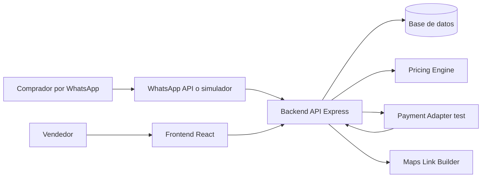
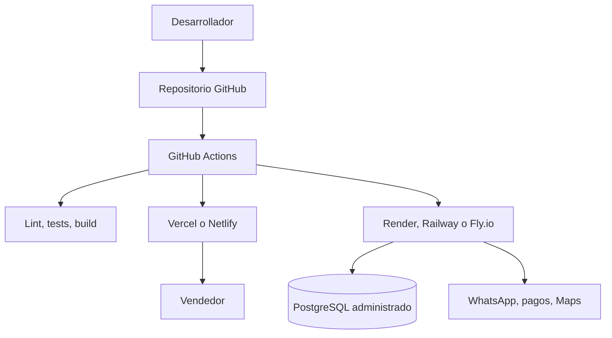
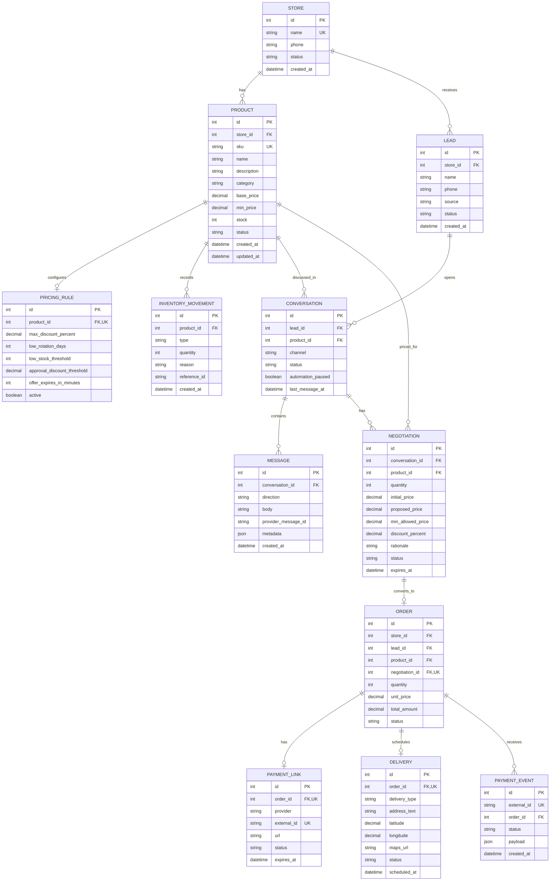

# ComercIA Marketplace Assistant

## 0. Ficha del proyecto

### 0.1. Tu nombre completo:

Sergio Camilo Diaz Fuentes

### 0.2. Nombre del proyecto:

ComercIA Marketplace Assistant

### 0.3. Descripción breve del proyecto:

ComercIA Marketplace Assistant es una aplicacion web para vendedores de marketplaces que atienden compradores por WhatsApp. El producto ayuda a convertir conversaciones en ventas cerradas mediante un flujo asistido: recibir un lead, identificar el producto, revisar stock y reglas comerciales, calcular una oferta segura, generar una orden con link de pago y coordinar la entrega con un enlace de Google Maps.

El diferencial del producto es que la negociacion no queda en manos de respuestas improvisadas. El sistema usa reglas parametrizables de margen minimo, stock, rotacion y descuentos maximos para sugerir precios sin romper limites comerciales. La IA puede apoyar la redaccion de respuestas, pero las reglas criticas se validan en backend.

### 0.4. URL del proyecto:

Estado Entrega 1: pendiente de publicacion publica.

URLs locales previstas para el MVP:

- Frontend local: `http://localhost:5173`
- Backend local: `http://localhost:3000`
- Health check backend: `http://localhost:3000/health`

Si el repositorio o despliegue queda privado, los accesos se compartiran de manera segura con el equipo evaluador, por ejemplo mediante OneTimeSecret y envio a `alvaro@lidr.co`.

### 0.5. URL o archivo comprimido del repositorio

Repositorio local de trabajo:

```text
F:\aspis\SergioCursos\AI4Devs-finalproject
```

Estado Entrega 1: documentacion preparada en este repositorio.  
Estado Entrega 2: codigo funcional separado en `entrega2/`.

Si se publica como repositorio privado, se compartiran accesos de forma segura. Alternativamente, se puede enviar un archivo `.zip` con el contenido del proyecto.

## 1. Descripción general del producto

### 1.1. Objetivo:

El objetivo de ComercIA Marketplace Assistant es ayudar a vendedores de marketplaces a responder mas rapido, negociar con criterios consistentes y cerrar ventas sin perder control sobre margen, inventario y pagos.

El producto soluciona estos problemas:

- Conversaciones de WhatsApp dispersas y sin trazabilidad.
- Descuentos calculados manualmente sin considerar margen minimo ni stock.
- Falta de registro de ofertas, pagos y entregas.
- Demoras al enviar links de pago y coordinar puntos de entrega.
- Riesgo de vender productos sin stock o con descuentos no autorizados.

Usuarios principales:

- Vendedores independientes de marketplaces.
- Equipos comerciales pequenos que atienden leads por WhatsApp.
- Operadores que coordinan pagos y entregas despues de una negociacion.

Valor que aporta:

- Reduce tiempo de respuesta.
- Estandariza negociaciones.
- Protege margen minimo.
- Registra el flujo completo de venta.
- Cierra el proceso con pago y entrega coordinada.

### 1.2. Características y funcionalidades principales:

1. Gestion de productos e inventario

   Permite registrar productos con SKU, categoria, precio base, precio minimo, stock y estado. Los cambios de inventario deben registrarse como movimientos para conservar auditoria.

2. Reglas de negociacion

   Cada producto puede tener reglas de descuento maximo, umbral de stock bajo, dias para baja rotacion, umbral de aprobacion humana y tiempo de expiracion de oferta.

3. Simulador o webhook de WhatsApp

   El MVP recibe mensajes entrantes mediante un endpoint simulador compatible con una futura integracion con WhatsApp Business Cloud API. Cada mensaje crea o actualiza un lead, una conversacion y un mensaje inbound.

4. Motor de negociacion

   Calcula una oferta segura segun precio base, precio minimo, stock disponible, rotacion y descuento solicitado. El motor nunca debe proponer un precio por debajo del margen minimo.

5. Conversaciones y respuestas sugeridas

   El sistema registra mensajes inbound, outbound y system. Tambien genera una respuesta comercial sugerida que el vendedor puede enviar o ajustar.

6. Ordenes y link de pago

   Una oferta aceptada se convierte en orden pendiente de pago. El sistema genera un link de pago en modo test o simulado y lo registra en la conversacion.

7. Webhook de confirmacion de pago

   El backend recibe confirmacion de pago, cambia la orden a `paid`, actualiza el link de pago y descuenta inventario de forma idempotente.

8. Coordinacion de entrega con Maps

   Para una orden pagada, el vendedor puede definir direccion, coordenadas y fecha de entrega. El sistema genera un enlace de Google Maps y lo registra como mensaje para el comprador.

9. Trazabilidad y auditoria

   Las acciones relevantes quedan reflejadas en entidades persistidas: mensajes, negociaciones, ordenes, pagos, movimientos de inventario y entregas.

### 1.3. Diseño y experiencia de usuario:

Experiencia esperada del usuario vendedor:

1. El vendedor entra al panel de ComercIA.
2. Revisa el producto disponible, stock y regla de descuento.
3. Simula o recibe un mensaje de WhatsApp de un comprador interesado.
4. Abre la conversacion creada por el sistema.
5. Genera una oferta sugerida.
6. Revisa precio propuesto, descuento aplicado y motivo de la decision.
7. Acepta la oferta para crear una orden.
8. Genera el link de pago.
9. Simula o recibe confirmacion de pago.
10. Coordina entrega con direccion y coordenadas.
11. Comparte el enlace de Maps con el comprador.

Evidencia visual:

- Entrega 1: pendiente de capturas porque esta entrega corresponde a documentacion tecnica.
- Entrega 2: el MVP funcional queda en `entrega2/` y permite capturar el flujo desde `http://localhost:5173`.
- Entrega final: se agregara URL publica y/o video breve mostrando lead, oferta, pago y entrega.

### 1.4. Instrucciones de instalación:

Para la Entrega 1, este repositorio contiene la documentacion principal:

```powershell
cd F:\aspis\SergioCursos\AI4Devs-finalproject
```

Para ejecutar el MVP funcional separado de Entrega 2:

```powershell
cd F:\aspis\SergioCursos\AI4Devs-finalproject\entrega2
npm install
Copy-Item backend/.env.example backend/.env
npm run db:migrate
npm run db:seed
```

Levantar backend:

```powershell
npm run dev:backend
```

Levantar frontend en otra terminal:

```powershell
npm run dev:frontend
```

Ejecutar tests y build:

```powershell
npm test
npm run build
```

Variables principales:

| Variable | Uso |
|---|---|
| `DATABASE_PATH` | Ruta del archivo SQLite local del backend |
| `PORT` | Puerto del backend |
| `FRONTEND_URL` | Origen permitido para CORS |
| `PAYMENT_BASE_URL` | URL base para links de pago simulados |
| `VITE_API_URL` | URL del backend consumida por el frontend |

## 2. Arquitectura del Sistema

### 2.1. Diagrama de arquitectura:


```mermaid
flowchart LR
  Buyer[Comprador por WhatsApp] --> WhatsApp[WhatsApp API o simulador]
  WhatsApp --> Backend[Backend API Express]
  Seller[Vendedor] --> Frontend[Frontend React]
  Frontend --> Backend
  Backend --> DB[(Base de datos)]
  Backend --> Pricing[Pricing Engine]
  Backend --> Payments[Payment Adapter test]
  Backend --> Maps[Maps Link Builder]
  Payments --> Backend
```

Patron elegido:

- Arquitectura web cliente-servidor.
- Backend organizado por responsabilidades: API, dominio, validaciones, persistencia e integraciones.
- Integraciones externas aisladas mediante adaptadores o simuladores.
- Motor de negociacion separado como logica de dominio testeable.

Justificacion:

- Permite demostrar el flujo E2E con bajo acoplamiento.
- Facilita reemplazar simuladores por proveedores reales.
- Mantiene reglas comerciales en backend, no en frontend.
- Hace posible testear el motor de precios sin depender de WhatsApp ni pagos reales.

Beneficios:

- Simplicidad para un MVP de curso.
- Flujo completo ejecutable en local.
- Buen punto de partida para migrar a servicios reales.
- Menor riesgo de que una respuesta generada por IA rompa reglas de negocio.

Sacrificios o deficits:

- Las integraciones externas no son productivas en Entrega 1.
- El MVP inicial no incluye autenticacion completa.
- El despliegue publico queda pendiente para la entrega final.
- El sistema analitico avanzado queda fuera del primer alcance.

### 2.2. Descripción de componentes principales:

| Componente | Tecnologia | Responsabilidad |
|---|---|---|
| Frontend | React + TypeScript + Vite | Panel operativo para vendedor, conversaciones, oferta, pago y entrega |
| Backend API | Node.js + Express + TypeScript | Exponer endpoints REST, validar datos y coordinar el flujo comercial |
| Base de datos | SQLite local en Entrega 2, PostgreSQL previsto para final | Persistir productos, leads, mensajes, negociaciones, ordenes, pagos y entregas |
| Pricing Engine | TypeScript | Calcular precio propuesto, descuento, expiracion y motivo de oferta |
| WhatsApp Adapter | Simulador REST en MVP | Recibir mensajes entrantes y crear conversaciones |
| Payment Adapter | Proveedor simulado/test | Generar link de pago y procesar webhook de confirmacion |
| Maps Adapter | Generador de URL | Construir enlaces de Google Maps con latitud y longitud |
| Tests | Vitest + Supertest, Playwright previsto | Validar reglas de dominio, integracion API y flujo E2E |

### 2.3. Descripción de alto nivel del proyecto y estructura de ficheros

Estructura principal:

```text
AI4Devs-finalproject/
  readme.md
  prompts.md
  .env.example
  docs/
    entrega1/
      pr-entrega1.md
  entrega2/
    README.md
    package.json
    backend/
      src/
        app.ts
        server.ts
        config.ts
        db/
        domain/
        lib/
      tests/
      package.json
      .env.example
    frontend/
      src/
        App.tsx
        api.ts
        types.ts
        styles.css
      package.json
      .env.example
    docs/
      pr-entrega2.md
      checklist-validacion.md
```

Proposito de carpetas:

| Carpeta/archivo | Proposito |
|---|---|
| `readme.md` | Plantilla principal del proyecto final |
| `prompts.md` | Registro de prompts, herramientas usadas y ajustes humanos |
| `docs/entrega1/` | Evidencia y descripcion de PR de documentacion |
| `entrega2/` | Implementacion funcional aislada para no mezclarla con Entrega 1 |
| `entrega2/backend/src/domain/` | Logica de negocio testeable, especialmente negociacion y Maps |
| `entrega2/backend/src/db/` | Migracion, seed y acceso local a base de datos |
| `entrega2/backend/src/lib/` | Validaciones, errores y utilidades de API |
| `entrega2/backend/tests/` | Tests unitarios e integracion |
| `entrega2/frontend/src/` | Interfaz de usuario del flujo comercial |

### 2.4. Infraestructura y despliegue

Infraestructura prevista:


```mermaid
flowchart TB
  Dev[Desarrollador] --> GitHub[Repositorio GitHub]
  GitHub --> Actions[GitHub Actions]
  Actions --> Tests[Lint, tests, build]
  Actions --> FrontDeploy[Vercel o Netlify]
  Actions --> BackDeploy[Render, Railway o Fly.io]
  BackDeploy --> ManagedDB[(PostgreSQL administrado)]
  FrontDeploy --> User[Vendedor]
  BackDeploy --> APIs[WhatsApp, pagos, Maps]
```

Proceso de despliegue previsto:

1. Crear rama de feature.
2. Abrir pull request.
3. Ejecutar pipeline con instalacion, tests y build.
4. Desplegar frontend en Vercel o Netlify.
5. Desplegar backend en Render, Railway o Fly.io.
6. Configurar base PostgreSQL administrada.
7. Registrar secretos en el proveedor de despliegue.
8. Publicar URL final en el README y formulario.

Secretos esperados:

- `DATABASE_URL`
- `JWT_SECRET`
- `WHATSAPP_VERIFY_TOKEN`
- `WHATSAPP_ACCESS_TOKEN`
- `PAYMENT_PROVIDER_SECRET`
- `PAYMENT_WEBHOOK_SECRET`
- `GOOGLE_MAPS_API_KEY`
- `FRONTEND_URL`

### 2.5. Seguridad

Practicas principales definidas:

1. No versionar secretos reales

   El repositorio incluye `.env.example`, pero los valores reales deben configurarse en variables de entorno locales o secretos del proveedor.

2. Validacion de entrada

   Los endpoints deben validar payloads de productos, mensajes, pagos y entregas antes de procesarlos. En el MVP de Entrega 2 se usa validacion con esquemas.

3. Reglas comerciales en backend

   El frontend no decide el precio final. El backend recalcula y valida descuento, margen minimo y stock.

4. Proteccion de margen minimo

   El motor de negociacion no permite precios por debajo del minimo configurado.

5. Webhooks idempotentes

   Los eventos de pago deben guardar identificador externo para evitar descontar inventario dos veces.

6. Auditoria funcional

   Mensajes, negociaciones, ordenes, pagos y movimientos de inventario quedan registrados para trazabilidad.

7. CORS restringido

   El backend debe aceptar peticiones solo desde el frontend configurado.

8. Aprobacion humana

   Descuentos altos o conversaciones sensibles pueden pasar a revision humana antes de enviar respuesta.

### 2.6. Tests

Tests definidos para el proyecto:

- Unitarios del `PricingEngine`.
- Integracion de webhook de WhatsApp.
- Integracion de negociacion y orden.
- Integracion de webhook de pago.
- Integracion de entrega con Maps.
- E2E previsto con Playwright para cubrir lead -> oferta -> pago -> entrega.

Tests ya preparados en la implementacion de Entrega 2:

| Test | Tipo | Cubre |
|---|---|---|
| `pricingEngine.test.ts` | Unitario | Margen minimo, stock bajo, aprobacion humana |
| `flow.test.ts` | Integracion | Lead, oferta, orden, pago y entrega |

Comando:

```powershell
cd F:\aspis\SergioCursos\AI4Devs-finalproject\entrega2
npm test
```

## 3. Modelo de Datos

### 3.1. Diagrama del modelo de datos:


```mermaid
erDiagram
  STORE ||--o{ PRODUCT : has
  PRODUCT ||--o| PRICING_RULE : configures
  PRODUCT ||--o{ INVENTORY_MOVEMENT : records
  STORE ||--o{ LEAD : receives
  LEAD ||--o{ CONVERSATION : opens
  PRODUCT ||--o{ CONVERSATION : discussed_in
  CONVERSATION ||--o{ MESSAGE : contains
  CONVERSATION ||--o{ NEGOTIATION : has
  PRODUCT ||--o{ NEGOTIATION : priced_for
  NEGOTIATION ||--o| ORDER : converts_to
  ORDER ||--o| PAYMENT_LINK : has
  ORDER ||--o| DELIVERY : schedules
  ORDER ||--o{ PAYMENT_EVENT : receives

  STORE {
    int id PK
    string name UK
    string phone
    string status
    datetime created_at
  }

  PRODUCT {
    int id PK
    int store_id FK
    string sku UK
    string name
    string description
    string category
    decimal base_price
    decimal min_price
    int stock
    string status
    datetime created_at
    datetime updated_at
  }

  PRICING_RULE {
    int id PK
    int product_id FK,UK
    decimal max_discount_percent
    int low_rotation_days
    int low_stock_threshold
    decimal approval_discount_threshold
    int offer_expires_in_minutes
    boolean active
  }

  INVENTORY_MOVEMENT {
    int id PK
    int product_id FK
    string type
    int quantity
    string reason
    string reference_id
    datetime created_at
  }

  LEAD {
    int id PK
    int store_id FK
    string name
    string phone
    string source
    string status
    datetime created_at
  }

  CONVERSATION {
    int id PK
    int lead_id FK
    int product_id FK
    string channel
    string status
    boolean automation_paused
    datetime last_message_at
  }

  MESSAGE {
    int id PK
    int conversation_id FK
    string direction
    string body
    string provider_message_id
    json metadata
    datetime created_at
  }

  NEGOTIATION {
    int id PK
    int conversation_id FK
    int product_id FK
    int quantity
    decimal initial_price
    decimal proposed_price
    decimal min_allowed_price
    decimal discount_percent
    string rationale
    string status
    datetime expires_at
  }

  ORDER {
    int id PK
    int store_id FK
    int lead_id FK
    int product_id FK
    int negotiation_id FK,UK
    int quantity
    decimal unit_price
    decimal total_amount
    string status
  }

  PAYMENT_LINK {
    int id PK
    int order_id FK,UK
    string provider
    string external_id UK
    string url
    string status
    datetime expires_at
  }

  PAYMENT_EVENT {
    int id PK
    string external_id UK
    int order_id FK
    string status
    json payload
    datetime created_at
  }

  DELIVERY {
    int id PK
    int order_id FK,UK
    string delivery_type
    string address_text
    decimal latitude
    decimal longitude
    string maps_url
    string status
    datetime scheduled_at
  }
```

### 3.2. Descripción de entidades principales:

**Store**

| Campo | Tipo | Restricciones | Descripcion |
|---|---|---|---|
| `id` | int | PK, autoincrement | Identificador de tienda |
| `name` | string | unique, not null | Nombre comercial |
| `phone` | string | nullable | Telefono principal o WhatsApp |
| `status` | string | not null | Estado de la tienda |
| `created_at` | datetime | not null | Fecha de creacion |

Relaciones: una tienda tiene muchos productos, leads y ordenes.

**Product**

| Campo | Tipo | Restricciones | Descripcion |
|---|---|---|---|
| `id` | int | PK, autoincrement | Identificador del producto |
| `store_id` | int | FK, not null | Tienda propietaria |
| `sku` | string | unique, not null | Codigo usado para identificar producto |
| `name` | string | not null | Nombre visible |
| `description` | string | nullable | Descripcion comercial |
| `category` | string | not null | Categoria |
| `base_price` | decimal | not null, > 0 | Precio inicial |
| `min_price` | decimal | not null, > 0 | Precio minimo permitido |
| `stock` | int | not null, >= 0 | Unidades disponibles |
| `status` | string | not null | Estado del producto |
| `created_at` | datetime | not null | Fecha de creacion |
| `updated_at` | datetime | not null | Ultima actualizacion |

Relaciones: pertenece a una tienda; tiene una regla de precio; tiene muchos movimientos, conversaciones, negociaciones y ordenes.

**PricingRule**

| Campo | Tipo | Restricciones | Descripcion |
|---|---|---|---|
| `id` | int | PK, autoincrement | Identificador de regla |
| `product_id` | int | FK, unique, not null | Producto configurado |
| `max_discount_percent` | decimal | not null | Descuento maximo permitido |
| `low_rotation_days` | int | not null | Dias para considerar baja rotacion |
| `low_stock_threshold` | int | not null | Umbral de stock bajo |
| `approval_discount_threshold` | decimal | not null | Descuento que requiere aprobacion |
| `offer_expires_in_minutes` | int | not null | Duracion de oferta |
| `active` | boolean | not null | Indica si la regla aplica |

Relaciones: pertenece a un producto. Relacion 1:1.

**InventoryMovement**

| Campo | Tipo | Restricciones | Descripcion |
|---|---|---|---|
| `id` | int | PK, autoincrement | Identificador |
| `product_id` | int | FK, not null | Producto afectado |
| `type` | string | not null | `initial`, `restock`, `reservation`, `sale`, `adjustment` |
| `quantity` | int | not null | Cantidad positiva o negativa |
| `reason` | string | not null | Motivo del movimiento |
| `reference_id` | string | nullable | Orden o evento relacionado |
| `created_at` | datetime | not null | Fecha de registro |

Relaciones: muchos movimientos pertenecen a un producto.

**Lead**

| Campo | Tipo | Restricciones | Descripcion |
|---|---|---|---|
| `id` | int | PK, autoincrement | Identificador del comprador |
| `store_id` | int | FK, not null | Tienda donde entra el lead |
| `name` | string | not null | Nombre del comprador |
| `phone` | string | not null, unique compuesto con `store_id` | Telefono WhatsApp |
| `source` | string | not null | Canal de origen |
| `status` | string | not null | Estado comercial |
| `created_at` | datetime | not null | Fecha de creacion |

Relaciones: pertenece a una tienda; tiene muchas conversaciones y ordenes.

**Conversation**

| Campo | Tipo | Restricciones | Descripcion |
|---|---|---|---|
| `id` | int | PK, autoincrement | Identificador de conversacion |
| `lead_id` | int | FK, not null | Comprador |
| `product_id` | int | FK, not null | Producto principal |
| `channel` | string | not null | Canal, por ejemplo `whatsapp` |
| `status` | string | not null | `open`, `human_review`, `waiting_payment`, `paid`, `delivery_scheduled`, `closed` |
| `automation_paused` | boolean | not null | Indica si la automatizacion esta pausada |
| `last_message_at` | datetime | not null | Ultimo mensaje |

Relaciones: pertenece a un lead y a un producto; tiene muchos mensajes y negociaciones.

**Message**

| Campo | Tipo | Restricciones | Descripcion |
|---|---|---|---|
| `id` | int | PK, autoincrement | Identificador |
| `conversation_id` | int | FK, not null | Conversacion |
| `direction` | string | not null | `inbound`, `outbound`, `system` |
| `body` | string | not null | Contenido del mensaje |
| `provider_message_id` | string | nullable | ID externo de WhatsApp |
| `metadata` | json | nullable | Payload original o datos auxiliares |
| `created_at` | datetime | not null | Fecha de registro |

Relaciones: muchos mensajes pertenecen a una conversacion.

**Negotiation**

| Campo | Tipo | Restricciones | Descripcion |
|---|---|---|---|
| `id` | int | PK, autoincrement | Identificador |
| `conversation_id` | int | FK, not null | Conversacion |
| `product_id` | int | FK, not null | Producto |
| `quantity` | int | not null, > 0 | Cantidad negociada |
| `initial_price` | decimal | not null | Precio base |
| `proposed_price` | decimal | not null | Precio sugerido |
| `min_allowed_price` | decimal | not null | Precio minimo permitido |
| `discount_percent` | decimal | not null | Descuento aplicado |
| `rationale` | string | not null | Motivo de la decision |
| `status` | string | not null | `proposed`, `human_review`, `accepted`, `rejected`, `expired` |
| `expires_at` | datetime | not null | Expiracion de oferta |

Relaciones: pertenece a una conversacion y producto; puede convertirse en una orden.

**Order**

| Campo | Tipo | Restricciones | Descripcion |
|---|---|---|---|
| `id` | int | PK, autoincrement | Identificador de orden |
| `store_id` | int | FK, not null | Tienda |
| `lead_id` | int | FK, not null | Comprador |
| `product_id` | int | FK, not null | Producto |
| `negotiation_id` | int | FK, unique, not null | Negociacion aceptada |
| `quantity` | int | not null | Cantidad |
| `unit_price` | decimal | not null | Precio unitario acordado |
| `total_amount` | decimal | not null | Total |
| `status` | string | not null | `pending_payment`, `paid`, `cancelled` |

Relaciones: pertenece a tienda, lead, producto y negociacion; tiene un link de pago y una entrega.

**PaymentLink**

| Campo | Tipo | Restricciones | Descripcion |
|---|---|---|---|
| `id` | int | PK, autoincrement | Identificador |
| `order_id` | int | FK, unique, not null | Orden |
| `provider` | string | not null | Proveedor simulado o real |
| `external_id` | string | unique, not null | ID usado por proveedor |
| `url` | string | not null | Link enviado al comprador |
| `status` | string | not null | `pending`, `paid`, `failed`, `expired` |
| `expires_at` | datetime | not null | Expiracion |

Relaciones: un link pertenece a una orden.

**PaymentEvent**

| Campo | Tipo | Restricciones | Descripcion |
|---|---|---|---|
| `id` | int | PK, autoincrement | Identificador |
| `external_id` | string | unique, not null | Evento externo idempotente |
| `order_id` | int | FK, not null | Orden afectada |
| `status` | string | not null | Estado recibido |
| `payload` | json | nullable | Payload original |
| `created_at` | datetime | not null | Fecha de recepcion |

Relaciones: muchos eventos pueden relacionarse con una orden, pero `external_id` evita duplicados.

**Delivery**

| Campo | Tipo | Restricciones | Descripcion |
|---|---|---|---|
| `id` | int | PK, autoincrement | Identificador |
| `order_id` | int | FK, unique, not null | Orden pagada |
| `delivery_type` | string | not null | `meetup` o `home` |
| `address_text` | string | not null | Direccion o punto de encuentro |
| `latitude` | decimal | not null | Latitud |
| `longitude` | decimal | not null | Longitud |
| `maps_url` | string | not null | URL de Google Maps |
| `status` | string | not null | `scheduled`, `completed`, `cancelled` |
| `scheduled_at` | datetime | not null | Fecha programada |

Relaciones: una entrega pertenece a una orden pagada.

## 4. Especificación de la API

### Endpoint 1 - Recibir mensaje de WhatsApp

```yaml
openapi: 3.0.3
paths:
  /webhooks/whatsapp:
    post:
      summary: Recibir mensaje entrante de WhatsApp o simulador
      tags:
        - Conversations
      requestBody:
        required: true
        content:
          application/json:
            schema:
              type: object
              required:
                - name
                - phone
                - productSku
                - message
              properties:
                name:
                  type: string
                  example: Laura Perez
                phone:
                  type: string
                  example: "+573001231231"
                productSku:
                  type: string
                  example: AUD-BT-001
                message:
                  type: string
                  example: Hola, lo vi en Marketplace. Tiene descuento?
                quantity:
                  type: integer
                  example: 1
                requestedDiscountPercent:
                  type: number
                  example: 10
      responses:
        "201":
          description: Conversacion creada o actualizada
          content:
            application/json:
              schema:
                $ref: "#/components/schemas/Conversation"
        "404":
          description: Producto no encontrado
```

### Endpoint 2 - Calcular oferta sugerida

```yaml
openapi: 3.0.3
paths:
  /conversations/{id}/suggest-reply:
    post:
      summary: Calcular oferta segura y generar respuesta sugerida
      tags:
        - Negotiations
      parameters:
        - in: path
          name: id
          required: true
          schema:
            type: integer
      requestBody:
        required: false
        content:
          application/json:
            schema:
              type: object
              properties:
                requestedDiscountPercent:
                  type: number
                  example: 12
                quantity:
                  type: integer
                  example: 1
      responses:
        "201":
          description: Negociacion creada
          content:
            application/json:
              schema:
                type: object
                properties:
                  negotiation:
                    $ref: "#/components/schemas/Negotiation"
                  reply:
                    type: string
                    example: Hola Laura, tengo disponible el producto...
        "400":
          description: Producto sin regla activa o datos invalidos
```

### Endpoint 3 - Crear entrega con Maps

```yaml
openapi: 3.0.3
paths:
  /orders/{id}/delivery:
    post:
      summary: Programar entrega para una orden pagada
      tags:
        - Deliveries
      parameters:
        - in: path
          name: id
          required: true
          schema:
            type: integer
      requestBody:
        required: true
        content:
          application/json:
            schema:
              type: object
              required:
                - addressText
                - latitude
                - longitude
                - scheduledAt
              properties:
                deliveryType:
                  type: string
                  enum:
                    - meetup
                    - home
                  example: meetup
                addressText:
                  type: string
                  example: Centro Comercial Andino, Bogota
                latitude:
                  type: number
                  example: 4.6671
                longitude:
                  type: number
                  example: -74.0534
                scheduledAt:
                  type: string
                  format: date-time
      responses:
        "201":
          description: Entrega creada y Maps URL generada
          content:
            application/json:
              schema:
                $ref: "#/components/schemas/Delivery"
        "400":
          description: La orden no esta pagada
```

## 5. Historias de Usuario

### Historia de Usuario 1

**Titulo:** Configurar productos, stock y reglas comerciales  
**Como:** vendedor de marketplace  
**Quiero:** registrar productos, stock, precio base, precio minimo y reglas de descuento  
**Para:** que el asistente pueda negociar sin salirse de mis limites comerciales.

**Prioridad:** Must Have  
**Valor de negocio:** habilita todo el flujo comercial porque define que se vende, cuanto hay disponible y hasta donde se puede negociar.

**Criterios de aceptacion:**

- Dado un vendedor autenticado, cuando crea un producto con nombre, SKU, precio base y stock inicial, entonces el sistema guarda el producto.
- Dado un producto existente, cuando se actualiza stock, entonces se registra un movimiento de inventario.
- Dado un producto con precio minimo, cuando se calcula una oferta, entonces el precio final nunca queda por debajo de ese minimo.
- Dado un producto sin stock, cuando llega un lead interesado, entonces el sistema no debe ofrecer pago inmediato.

**Reglas de negocio:**

- El stock no puede ser negativo.
- El precio base debe ser mayor que cero.
- El precio minimo debe ser menor o igual al precio base.
- Las reglas de producto prevalecen sobre reglas genericas futuras.

### Historia de Usuario 2

**Titulo:** Registrar leads y conversaciones desde WhatsApp  
**Como:** vendedor  
**Quiero:** que los mensajes recibidos por WhatsApp creen leads y conversaciones  
**Para:** responder compradores sin perder contexto comercial.

**Prioridad:** Must Have  
**Valor de negocio:** convierte mensajes dispersos en oportunidades trazables.

**Criterios de aceptacion:**

- Dado un mensaje entrante con SKU de producto, cuando se recibe por webhook o simulador, entonces se crea o actualiza el lead.
- Dado un comprador con conversacion abierta, cuando envia otro mensaje, entonces se agrega a la misma conversacion.
- Dado un mensaje con producto inexistente, cuando se procesa, entonces el backend responde error controlado.
- Dado un vendedor, cuando consulta conversaciones, entonces ve comprador, producto, estado y mensajes.

**Reglas de negocio:**

- Los mensajes deben conservar direccion `inbound`, `outbound` o `system`.
- Una conversacion activa pertenece a un lead y a un producto principal.
- Payloads externos deben conservarse como metadata para depuracion.

### Historia de Usuario 3

**Titulo:** Negociar, cobrar y coordinar entrega  
**Como:** vendedor  
**Quiero:** generar una oferta segura, convertirla en orden, confirmar pago y crear entrega con Maps  
**Para:** cerrar una venta completa desde la conversacion.

**Prioridad:** Must Have  
**Valor de negocio:** cubre el flujo E2E principal del producto.

**Criterios de aceptacion:**

- Dado un producto con stock y regla activa, cuando se solicita oferta, entonces el sistema calcula precio y motivo.
- Dado una oferta vigente, cuando el comprador acepta, entonces se crea una orden pendiente de pago.
- Dado una orden pendiente, cuando se genera pago, entonces se crea un link de pago.
- Dado un webhook de pago valido, cuando confirma pago, entonces la orden pasa a `paid` y se descuenta inventario.
- Dado una orden pagada, cuando se programa entrega, entonces se genera un enlace de Google Maps.

**Reglas de negocio:**

- La oferta debe expirar.
- Una orden usa snapshot del precio aceptado.
- El inventario se descuenta solo al confirmar pago.
- Los eventos de pago duplicados no deben duplicar descuentos.
- No se permite entrega para orden no pagada.

## 6. Tickets de Trabajo

### Ticket 1

**Tipo:** Backend  
**Titulo:** Implementar motor de negociacion y endpoint de oferta sugerida  
**Historia relacionada:** Historia de Usuario 3

**Objetivo:** calcular ofertas seguras segun producto, stock, rotacion y reglas comerciales.

**Alcance tecnico:**

- Crear servicio `PricingEngine`.
- Validar precio base, precio minimo y stock.
- Calcular descuento permitido.
- Proteger margen minimo.
- Marcar ofertas que requieren aprobacion humana.
- Crear endpoint `POST /conversations/{id}/suggest-reply`.
- Persistir entidad `Negotiation`.
- Registrar mensaje `system` con la oferta sugerida.

**Criterios de aceptacion:**

- Producto con stock bajo restringe descuento.
- Producto con baja rotacion puede usar descuento maximo permitido.
- Ninguna oferta queda por debajo del precio minimo.
- La respuesta incluye precio propuesto, descuento y rationale.
- Existen tests unitarios del motor.

**Dependencias:**

- Producto y regla de precio existentes.
- Conversacion existente.
- Modelo de negociacion.

**Riesgos:**

- Calculos inconsistentes si el frontend tambien intenta decidir precio.
- Perdida de margen si no se valida el minimo en backend.

### Ticket 2

**Tipo:** Frontend  
**Titulo:** Crear panel operativo del flujo WhatsApp -> oferta -> pago -> entrega  
**Historia relacionada:** Historia de Usuario 2 y 3

**Objetivo:** permitir que el vendedor ejecute el flujo principal desde una interfaz simple y usable.

**Alcance tecnico:**

- Crear vista principal del producto demo.
- Crear formulario para simular lead de WhatsApp.
- Mostrar lista de conversaciones.
- Mostrar hilo de mensajes.
- Agregar acciones: sugerir oferta, aceptar oferta, generar pago, confirmar pago y coordinar entrega.
- Mostrar precio sugerido, rationale, estado de orden, link de pago y link de Maps.

**Criterios de aceptacion:**

- El usuario puede crear un lead desde la UI.
- La conversacion aparece sin recargar manualmente.
- El usuario puede generar oferta y ver el resultado.
- El usuario puede crear orden y link de pago.
- El usuario puede confirmar pago simulado.
- El usuario puede generar entrega y abrir Maps.

**Dependencias:**

- API backend disponible.
- Producto seed creado.
- Endpoints de conversacion, negociacion, pago y entrega.

**Riesgos:**

- Estados visuales inconsistentes si no se refrescan datos despues de cada accion.
- URLs de backend hardcodeadas si no se usa `VITE_API_URL`.

### Ticket 3

**Tipo:** Base de datos  
**Titulo:** Crear modelo persistente para flujo comercial E2E  
**Historia relacionada:** Historia de Usuario 1, 2 y 3

**Objetivo:** definir y crear las entidades necesarias para soportar productos, leads, conversaciones, ofertas, ordenes, pagos y entregas.

**Alcance tecnico:**

- Crear tablas `stores`, `products`, `pricing_rules`, `inventory_movements`.
- Crear tablas `leads`, `conversations`, `messages`.
- Crear tablas `negotiations`, `orders`, `payment_links`, `payment_events`, `deliveries`.
- Definir claves primarias, foraneas y restricciones unique.
- Crear migracion o script de inicializacion.
- Crear seed de producto y regla demo.

**Criterios de aceptacion:**

- La base se crea desde cero con un comando.
- El seed genera un producto vendible y una regla activa.
- Un lead puede tener conversaciones.
- Una negociacion puede convertirse en una orden.
- Un pago confirmado cambia orden y descuenta inventario.
- Una entrega solo se asocia a una orden.

**Dependencias:**

- Definicion del modelo de datos.
- Contrato de API.
- Reglas de negocio de inventario y pagos.

**Riesgos:**

- Falta de idempotencia en pagos.
- Inventario negativo si no hay validaciones transaccionales.
- Duplicidad de leads si no existe unique por tienda y telefono.

## 7. Pull Requests

### Pull Request 1

**Titulo:** Entrega 1: documentacion tecnica de ComercIA Marketplace Assistant  
**Rama sugerida:** `feature-entrega1-RO`  
**Estado:** preparado para entrega documental.

**Descripcion:**

Agrega la documentacion tecnica inicial del proyecto final con ficha de producto, objetivo, funcionalidades, arquitectura, modelo de datos, API principal, historias de usuario, tickets y plan de despliegue.

**Cambios incluidos:**

- `readme.md` ajustado a la plantilla oficial 0-7.
- `prompts.md` con prompts clave y ajustes humanos.
- `docs/entrega1/pr-entrega1.md` con descripcion sugerida del PR.

**Impacto:**

No agrega codigo funcional. Deja la base de producto y tecnica para implementar el MVP.

### Pull Request 2

**Titulo:** Entrega 2: MVP ejecutable de ComercIA Marketplace Assistant  
**Rama sugerida:** `feature-entrega2-RO`  
**Estado:** preparado en carpeta separada `entrega2/`.

**Descripcion:**

Agrega el primer MVP ejecutable del flujo principal: lead por WhatsApp simulado, oferta segura, orden, link de pago, confirmacion de pago y entrega con Maps.

**Cambios incluidos:**

- Backend Express + TypeScript.
- SQLite local para ejecucion rapida.
- Frontend React + Vite.
- Tests unitarios e integracion.
- Documentacion de validacion en `entrega2/docs/`.

**Impacto:**

Introduce codigo funcional separado de Entrega 1 para evitar mezclar documentacion inicial con implementacion.

### Pull Request 3

**Titulo:** Entrega final: ComercIA desplegado con flujo E2E completo  
**Rama sugerida:** `finalproject-RO`  
**Estado:** iniciado en carpeta separada `entrega3/`.

**Descripcion:**

Consolida documentacion, codigo funcional, tests, configuracion de Railway, PostgreSQL, Meta WhatsApp Cloud API, variables de entorno y evidencia visual del sistema funcionando.

**Cambios esperados:**

- Backend preparado para Railway con PostgreSQL mediante `DATABASE_URL`.
- Frontend preparado para Railway con `VITE_API_URL`.
- Webhook Meta WhatsApp en `GET/POST /webhooks/whatsapp`.
- Variables de entorno documentadas en `entrega3/backend/railway.env.example` y `entrega3/frontend/railway.env.example`.
- Integracion de proveedor de pago en modo test o simulador documentado.
- URL publica y capturas/video del flujo principal al terminar el despliegue.
- Release opcional `v1.0-final-RO`.

**Impacto:**

Entrega final evaluable con sistema accesible y flujo completo de venta asistida.
