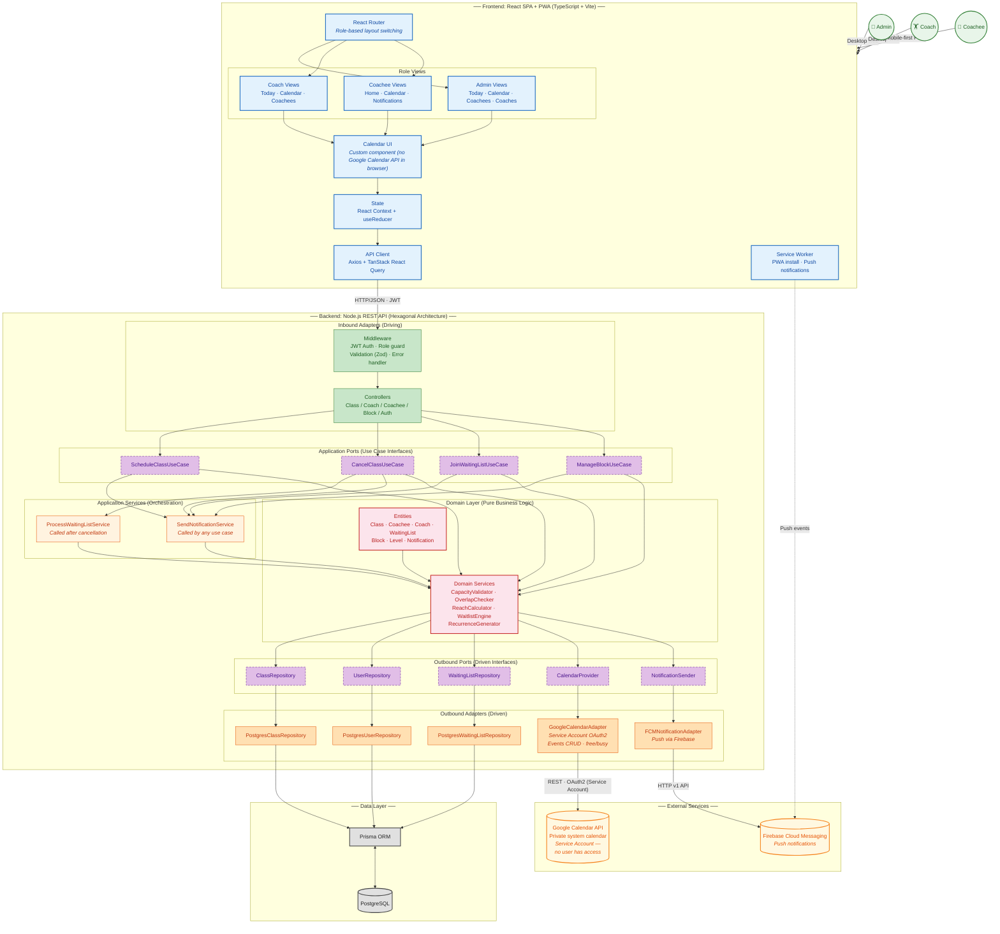
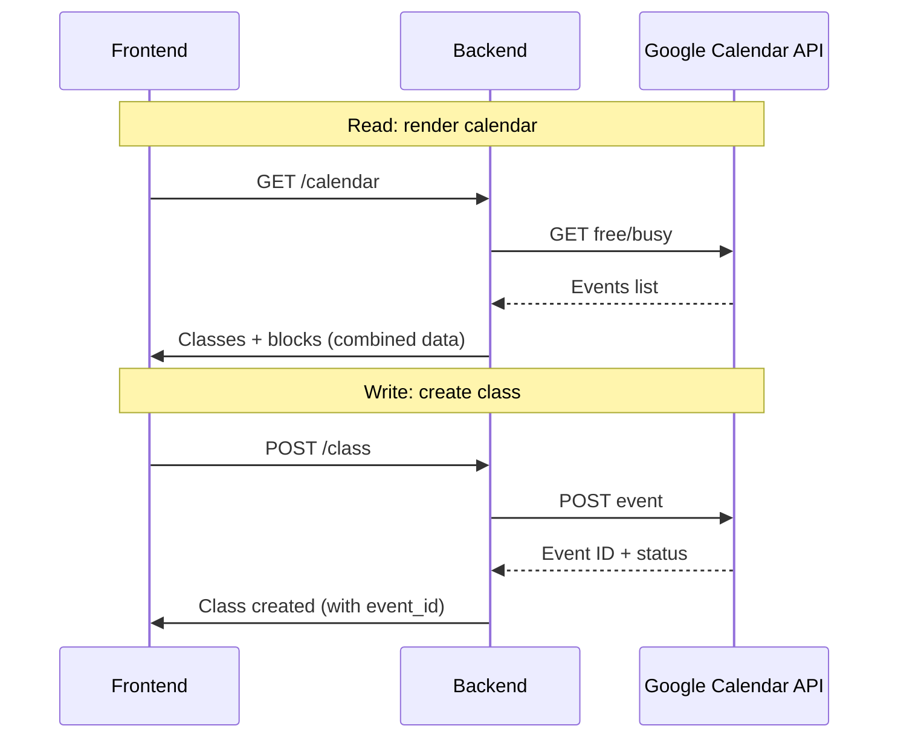
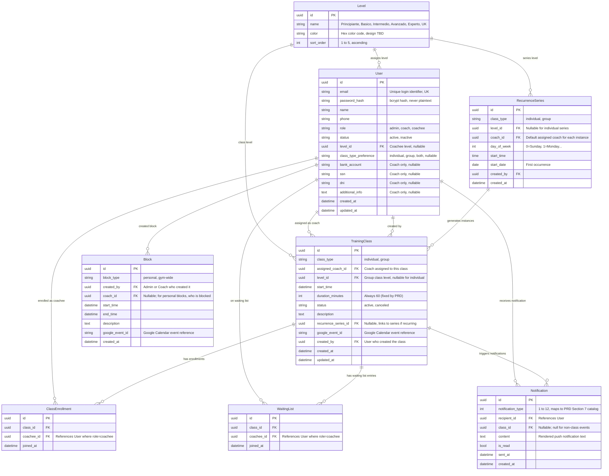

## Índice

0. [Ficha del proyecto](#0-ficha-del-proyecto)
1. [Descripción general del producto](#1-descripción-general-del-producto)
2. [Arquitectura del sistema](#2-arquitectura-del-sistema)
3. [Modelo de datos](#3-modelo-de-datos)
4. [Especificación de la API](#4-especificación-de-la-api)
5. [Historias de usuario](#5-historias-de-usuario)
6. [Tickets de trabajo](#6-tickets-de-trabajo)
7. [Pull requests](#7-pull-requests)

---

## 0. Ficha del proyecto

### **0.1. Tu nombre completo:**
Sara Vicente Jimenez

### **0.2. Nombre del proyecto:**
Coacher

### **0.3. Descripción breve del proyecto:**
Una plataforma para entrenadores personales autonomos que les ayude a gestionar sus calendarios y que permita a sus clientes manejar sus clases de forma autonoma.

### **0.4. URL del proyecto:**
TBD — no deployed yet.

### **0.5. URL o archivo comprimido del repositorio**
TBD — no remote repository configured yet.

---

## 1. Descripción general del producto

### **1.1. Objetivo:**

Coacher is a single, web-based solution for personal trainers and their teams to manage scheduling, class capacity, client levels, waiting lists, and push notifications for a physical gym with strict space and time constraints. It provides a mobile-first experience for coachees (clients) while giving coaches and admins a desktop-capable dashboard for full operational control.

The platform solves the problem of fragmented scheduling tools (e.g., spreadsheets, messaging apps) by centralising class creation, attendance tracking, level-based visibility, waiting list orchestration, and coach staffing into one system. Google Calendar serves as the internal scheduling engine — accessed exclusively server-side via a private Service Account — so no human user ever interacts with the Calendar API directly.

**Value proposition:**
- **Coaches/Admins** gain a unified view of all classes, blocks, and coachees with automated conflict detection and waiting list processing.
- **Coachees** get a mobile-friendly PWA to view their schedule, join group classes, manage waiting lists, and receive real-time push notifications.
- **The business** eliminates double-bookings, maximises gym capacity (2 individual + 1 group class per hour), and reduces manual coordination overhead.

### **1.2. Características y funcionalidades principales:**

| Feature | Description |
|---|---|
| **Role-based UI** | Single SPA with conditional rendering — Admin, Coach, and Coachee each see only what they need. |
| **Class creation** | Coaches/Admins create individual (1 coachee) or group (3-4 coachees) classes with level, coach assignment, description, and optional weekly recurrence. |
| **Calendar** | Custom UI component rendering all classes and blocks. Colour-coded visibility: blue (own), green (joinable), gray (busy/blocked). Never calls Google Calendar API from the browser. |
| **Level system** | 5 tiers (Principiante, Básico, Intermedio, Avanzado, Experto). Classes are within a coachee's "reach" if they match their level ±1. |
| **Waiting lists** | Max 4 per class. Simultaneous notification to all waitlisted coachees when a spot opens. First-come, first-served, no hold time. |
| **Push notifications** | 12 notification types covering class creation, cancellation, waiting list events, level changes, and coach reassignment. Delivered via Firebase Cloud Messaging. |
| **Time blocks** | Personal blocks (coach's own calendar) and gym-wide blocks (Admin only, blocks all classes). |
| **Coachee dashboard** | Mobile-first home screen showing next class, upcoming joinable group classes (10-day window), and active waiting lists. |
| **PWA support** | "Add to Home Screen" installability via Service Worker. |
| **Google Calendar backend** | All scheduling events synchronised with a private Google Calendar via Service Account — the single source of truth for availability. |

### **1.3. Diseño y experiencia de usuario:**

No design assets available. The intended UX flows are:

**Admin/Coach (desktop responsive):**
- Left sidebar navigation: Today, Calendar, Coachees, Coaches (Admin only).
- **Today page:** Vertical timeline of the day's classes with colour distinction between individual/group/canceled.
- **Calendar page:** Full week/month view with "Add Class" button → modal form (class type, coach, coachees, level, date, recurrence). Available slots surfaced via backend (Google Calendar free/busy).
- **Coachees/Coaches pages:** Filterable tables with status toggles, level filters, and add/edit modals.

**Coachee (mobile-first PWA):**
- Bottom navigation: Home, Calendar, Notifications (bell icon).
- **Home:** Next class card at top, followed by joinable group classes (green cards with "Join" button).
- **Calendar (1-week window):** Colour-coded slots — blue (own class, tap to cancel), green (joinable group), gray (busy block from other coachees, tap to join waiting list).
- **Notifications:** Full chronological history of push notifications.

### **1.4. Instrucciones de instalación:**

Not applicable yet — the project is in the design/documentation phase. Once implemented, the intended setup will use Docker Compose (`api` + `db` + `frontend` services) with Prisma migrations and seed scripts. See Section 2.4 for planned infrastructure.

---

## 2. Arquitectura del Sistema

### **2.1. Diagrama de arquitectura:**

The architecture follows the **C4 Model (Context + Container)** combined with a **Hexagonal (Ports & Adapters)** diagram for the backend. C4 communicates the full ecosystem (people, frontend, backend, Google Calendar, FCM) in a single view, while the hexagonal diagram shows how the Clean Architecture mandate from the PRD is fulfilled.

**Why this architecture:**
- **Google Calendar as system of record** requires a replaceable adapter — if they migrate to Outlook Calendar, only the adapter changes.
- **Complex business rules** (gym capacity, waiting lists, level reach, overlap validation) live in the domain layer, testable without infrastructure.
- **Role-based conditional UI** in a single frontend avoids code duplication.
- **Mobile-first + PWA** for coachees means concerns are separated at the component level.

**Benefits:**
- Replaceable `CalendarProvider` port — Google Calendar can be swapped without touching domain logic.
- No bidirectional sync risk — Service Account with private calendar means no external edits.
- Domain services (`CapacityValidator`, `OverlapChecker`, `ReachCalculator`) are pure functions, testable in milliseconds.
- Notifications as a port — adding email/SMS channels requires no business logic changes.

**Trade-offs:**
- Google Calendar API adds latency to every scheduling operation.
- Service Account credential management (key rotation, quota monitoring) is additional infrastructure overhead.
- Cognitive overhead for developers unfamiliar with Hexagonal Architecture.
- E2E tests require mocks for Google Calendar and FCM.


```mermaid
flowchart TB
    %% ── Styles ──
    classDef person fill:#e8f5e9,stroke:#2e7d32,stroke-width:2px,color:#1b5e20
    classDef frontend fill:#e3f2fd,stroke:#1565c0,stroke-width:2px,color:#0d47a1
    classDef inbound fill:#c8e6c9,stroke:#2e7d32,stroke-width:1px,color:#1b5e20
    classDef app fill:#fff3e0,stroke:#e65100,stroke-width:1px,color:#bf360c
    classDef domain fill:#fce4ec,stroke:#c62828,stroke-width:2px,color:#b71c1c
    classDef port fill:#e1bee7,stroke:#6a1b9a,stroke-width:1px,stroke-dasharray:6 3,color:#4a148c
    classDef outbound fill:#ffe0b2,stroke:#e65100,stroke-width:1px,color:#bf360c
    classDef infra fill:#e0e0e0,stroke:#424242,stroke-width:2px,color:#212121
    classDef external fill:#fff8e1,stroke:#f57f17,stroke-width:2px,color:#e65100

    %% ═══════════════════ LEVEL 1: PERSONAS ═══════════════════
    Admin(("👑 Admin")):::person
    Coach(("🏋️ Coach")):::person
    Coachee(("📱 Coachee")):::person

    %% ═══════════════════ LEVEL 2: FRONTEND ═══════════════════
    subgraph Frontend["── Frontend: React SPA + PWA (TypeScript + Vite) ──"]
        direction TB
        Router["React Router<br/><i>Role-based layout switching</i>"]:::frontend

        subgraph Views["Role Views"]
            AdminUI["Admin Views<br/>Today · Calendar · Coachees · Coaches"]:::frontend
            CoachUI["Coach Views<br/>Today · Calendar · Coachees"]:::frontend
            CoacheeUI["Coachee Views<br/>Home · Calendar · Notifications"]:::frontend
        end

        CalendarUI["Calendar UI<br/><i>Custom component (no Google Calendar API in browser)</i>"]:::frontend
        State["State<br/>React Context + useReducer"]:::frontend
        ApiClient["API Client<br/>Axios + TanStack React Query"]:::frontend
        SW["Service Worker<br/>PWA install · Push notifications"]:::frontend

        Router --> AdminUI
        Router --> CoachUI
        Router --> CoacheeUI
        AdminUI --> CalendarUI
        CoachUI --> CalendarUI
        CoacheeUI --> CalendarUI
        CalendarUI --> State
        State --> ApiClient
    end

    %% ═══════════════════ LEVEL 2: BACKEND — HEXAGONAL ═══════════════════
    subgraph Backend["── Backend: Node.js REST API (Hexagonal Architecture) ──"]

        %% ── Inbound adapters ──
        subgraph Inbound["Inbound Adapters (Driving)"]
            MW["Middleware<br/>JWT Auth · Role guard<br/>Validation (Zod) · Error handler"]:::inbound
            Controllers["Controllers<br/>Class / Coach / Coachee / Block / Auth"]:::inbound
            MW --> Controllers
        end

        %% ── Application ports & services ──
        subgraph AppPorts["Application Ports (Use Case Interfaces)"]
            ScheduleClass["ScheduleClassUseCase"]:::port
            CancelClass["CancelClassUseCase"]:::port
            JoinWaitlist["JoinWaitingListUseCase"]:::port
            ManageBlock["ManageBlockUseCase"]:::port
        end

        Controllers --> ScheduleClass
        Controllers --> CancelClass
        Controllers --> JoinWaitlist
        Controllers --> ManageBlock

        subgraph AppServices["Application Services (Orchestration)"]
            ProcessWaitlist["ProcessWaitingListService<br/><i>Called after cancellation</i>"]:::app
            NotifySvc["SendNotificationService<br/><i>Called by any use case</i>"]:::app
        end

        CancelClass --> ProcessWaitlist
        ScheduleClass --> NotifySvc
        CancelClass --> NotifySvc
        JoinWaitlist --> NotifySvc
        ManageBlock --> NotifySvc

        %% ── Domain ──
        subgraph Domain["Domain Layer (Pure Business Logic)"]
            Entities["Entities<br/>Class · Coachee · Coach · WaitingList<br/>Block · Level · Notification"]:::domain
            Services["Domain Services<br/>CapacityValidator · OverlapChecker<br/>ReachCalculator · WaitlistEngine<br/>RecurrenceGenerator"]:::domain
            Entities --> Services
        end

        ScheduleClass --> Services
        CancelClass --> Services
        JoinWaitlist --> Services
        ProcessWaitlist --> Services
        ManageBlock --> Services
        NotifySvc --> Services

        %% ── Outbound ports ──
        subgraph OutPorts["Outbound Ports (Driven Interfaces)"]
            ClassRepoPort["ClassRepository"]:::port
            UserRepoPort["UserRepository"]:::port
            WaitlistRepoPort["WaitingListRepository"]:::port
            CalendarPort["CalendarProvider"]:::port
            NotificationPort["NotificationSender"]:::port
        end

        Services --> ClassRepoPort
        Services --> UserRepoPort
        Services --> WaitlistRepoPort
        Services --> CalendarPort
        Services --> NotificationPort

        %% ── Outbound adapters ──
        subgraph Outbound["Outbound Adapters (Driven)"]
            ClassRepo["PostgresClassRepository"]:::outbound
            UserRepo["PostgresUserRepository"]:::outbound
            WaitlistRepo["PostgresWaitingListRepository"]:::outbound
            CalendarAdapter["GoogleCalendarAdapter<br/><i>Service Account OAuth2<br/>Events CRUD · free/busy</i>"]:::outbound
            NotifAdapter["FCMNotificationAdapter<br/><i>Push via Firebase</i>"]:::outbound
        end

        ClassRepoPort --> ClassRepo
        UserRepoPort --> UserRepo
        WaitlistRepoPort --> WaitlistRepo
        CalendarPort --> CalendarAdapter
        NotificationPort --> NotifAdapter
    end

    %% ═══════════════════ INFRASTRUCTURE ═══════════════════
    subgraph Data["── Data Layer ──"]
        direction LR
        ORM["Prisma ORM"]:::infra
        DB[("PostgreSQL")]:::infra
        ORM <--> DB
    end

    subgraph External["── External Services ──"]
        GCAL[("Google Calendar API<br/>Private system calendar<br/><i>Service Account —<br/>no user has access</i>")]:::external
        FCM[("Firebase Cloud Messaging<br/><i>Push notifications</i>")]:::external
    end

    %% ═══════════════════ RELATIONSHIPS ═══════════════════
    Admin    -->|"Desktop web"| Frontend
    Coach    -->|"Desktop web"| Frontend
    Coachee  -->|"Mobile-first PWA"| Frontend

    ApiClient -->|"HTTP/JSON · JWT"| MW

    ClassRepo --> ORM
    UserRepo --> ORM
    WaitlistRepo --> ORM

    CalendarAdapter -->|"REST · OAuth2 (Service Account)"| GCAL
    NotifAdapter -->|"HTTP v1 API"| FCM

    SW -.->|"Push events"| FCM
```

**Calendar Data Flow:**


```mermaid
sequenceDiagram
    participant F as Frontend
    participant B as Backend
    participant GC as Google Calendar API

    Note over F,GC: Read: render calendar
    F->>B: GET /calendar
    B->>GC: GET free/busy
    GC-->>B: Events list
    B->>F: Classes + blocks (combined data)

    Note over F,GC: Write: create class
    F->>B: POST /class
    B->>GC: POST event
    GC-->>B: Event ID + status
    B->>F: Class created (with event_id)
```

### **2.2. Descripción de componentes principales:**

| Component | Layer | Role |
|---|---|---|
| **Frontend SPA** | Interface | React 18 + TypeScript + Vite SPA with role-based rendering (Admin/Coach/Coachee); mobile-first for coachees |
| **Calendar UI** | Interface | Custom React calendar component — never calls Google Calendar API directly |
| **PWA Layer** | Interface | Service Worker (Workbox via vite-plugin-pwa) for "Add to Home Screen" + push notifications |
| **Backend API** | Application | Node.js 22 + Express REST API with Hexagonal Architecture; all business logic server-side |
| **Domain Layer** | Domain | Pure entities and domain services (CapacityValidator, OverlapChecker, ReachCalculator, WaitlistEngine, RecurrenceGenerator) with zero external dependencies |
| **Database** | Persistence | PostgreSQL 16 via Prisma ORM — users, enrollments, waiting lists, notifications, Google Calendar event references |
| **Google Calendar Adapter** | Infrastructure (outbound) | Replaceable adapter via `CalendarProvider` port; Service Account OAuth2, events CRUD, free/busy queries |
| **Notification Adapter** | Infrastructure (outbound) | Firebase Admin SDK for push notifications to all 3 roles |
| **Auth** | Infrastructure (cross) | Stateless JWT (15 min access / 7 day refresh) with server-side RBAC middleware |

### **2.3. Descripción de alto nivel del proyecto y estructura de ficheros**

The project follows a **monorepo structure** with separate `frontend/` and `backend/` directories, each with its own responsibilities. This layout enforces the Hexagonal Architecture by isolating domain logic, application services, and infrastructure adapters.

```
personal-training-platform/
├── spec/                        # SDD specs (.spec.md) — acceptance criteria per feature
├── docs/                        # Documentation: PRD, architecture, API spec, data model
├── frontend/                    # React SPA (Vite + TypeScript)
│   ├── src/
│   │   ├── pages/               # One folder per role (admin/, coach/, coachee/)
│   │   ├── components/          # Shared UI (calendar, forms, modals)
│   │   ├── api/                 # React Query hooks + Axios client
│   │   ├── context/             # React Context providers (auth, role)
│   │   └── types/               # Shared TypeScript types
│   ├── e2e/                     # Playwright E2E tests
│   └── public/                  # PWA manifest, service worker, icons
├── backend/
│   ├── src/
│   │   ├── domain/              # Pure entities + domain services (no deps)
│   │   ├── application/         # Use cases / application services (orchestration)
│   │   ├── infrastructure/      # Adapters (controllers, repos, calendar, notifications)
│   │   └── config/              # DI container, env config
│   └── prisma/
│       ├── schema.prisma        # Data model definition
│       └── migrations/          # Auto-generated by Prisma
├── docker-compose.yml           # api + db + frontend for local development
├── biome.json                   # Single lint/format config (Biomejs)
├── vitest.workspace.ts          # Shared test config
└── .github/
    └── workflows/
        └── ci.yml               # Lint → typecheck → test → build → deploy
```

### **2.4. Infraestructura y despliegue**

**Local development:**
- Docker Compose with 3 services: `api` (Node.js), `db` (PostgreSQL 16), `frontend` (Vite dev server).
- Environment variables via `.env` (template documented in `.env.example`).
- Google Calendar API accessed via a test Service Account (separate Firebase project for local dev).

**Production (Render):**
- **Backend:** Deployed as a Render Web Service (Node.js). Health check endpoint (`GET /health`).
- **Database:** Managed PostgreSQL (Neon / Supabase / Render) with automated backups, SSL, point-in-time recovery.
- **Frontend:** Vite build deployed as a Static Site or served by the same Web Service.
- **CI/CD:** GitHub Actions pipeline: `biome check` → `tsc --noEmit` → `vitest run` → build → deploy on every PR and push to `main`.

**Key production considerations:**
- All secrets injected via environment variables (no committed `.env`).
- Rate limiting via `express-rate-limit` (100 req/min global, 10 req/min on `/auth/login`).
- CORS restricted to production frontend origin.
- TLS 1.3 for all traffic.
- Security headers via `helmet` middleware (HSTS, CSP, X-Frame-Options, etc.).

### **2.5. Seguridad**

Security controls are grounded in the **OWASP Top 10 (2025)** and tailored to a multi-role scheduling application holding PII (coachee contact data, coach financial details) with Google Calendar as the single source of truth.

| Area | Control |
|---|---|
| **Authentication** | Stateless JWT (15 min access token, 7 day refresh token). bcrypt cost 12 for passwords. Rate-limited login (10 req/min per IP). |
| **Authorization** | Server-side RBAC middleware on every endpoint. Coachee cannot schedule classes or view coach financial data even via direct API calls. |
| **Input validation** | Zod schemas on every request body before domain logic. Prisma parameterised queries (no SQL injection). React JSX escaping (XSS prevention). |
| **API security** | All endpoints authenticated except `POST /auth/login` and `GET /health`. CORS restricted to single origin. No sensitive data in URLs. API versioned under `/api/v1/`. |
| **Data at rest** | Coach financial data (bank account, SSN, DNI) encrypted with AES-256-GCM before storage. PostgreSQL encrypted at rest on managed hosting. |
| **Data in transit** | TLS 1.3 for all client-server and server-to-API traffic. No unencrypted outbound calls. |
| **Secrets management** | All secrets via environment variables. Service Account key rotation policy (annual or on suspected leak). |
| **Security headers** | HSTS (2 years), X-Content-Type-Options: nosniff, X-Frame-Options: DENY, Content-Security-Policy (restricted to self + FCM), Referrer-Policy, Permissions-Policy. |
| **Logging** | Structured JSON logging (pino). Security events logged: auth attempts, class creation/cancellation, waiting list joins/leaves, role changes, financial data access. No secrets in logs. |
| **Anomaly alerts** | >5 failed logins from one IP in 5min; rapid booking/cancellation cycles (>10/min); Google Calendar error rate >5%. |
| **Error handling** | Consistent `{ error: { code, message, ref } }` envelope. Stack traces never exposed. Domain errors are 4xx (not 500). External dependency failures return 503. |

### **2.6. Tests**

| Category | Tool | Scope |
|---|---|---|
| **Unit / Integration** | Vitest | Domain services tested in isolation (CapacityValidator, OverlapChecker, ReachCalculator, WaitlistEngine). Repository tests with test database. Controller tests with Supertest. |
| **E2E** | Playwright | Critical flows: class creation, waiting list join/leave, cancellation, notifications. Runs against Docker Compose environment with mocked external services (Google Calendar, FCM). |
| **CI pipeline** | GitHub Actions | `biome check` → `tsc --noEmit` → `vitest run` → build on every PR and push to `main`. E2E runs on demand or before production merge. |

---

## 3. Modelo de Datos

### **3.1. Diagrama del modelo de datos:**


```mermaid
erDiagram
    User {
        uuid id PK
        string email "Unique login identifier, UK"
        string password_hash "bcrypt hash, never plaintext"
        string name
        string phone
        string role "admin, coach, coachee"
        string status "active, inactive"
        uuid level_id FK "Coachee level, nullable"
        string class_type_preference "individual, group, both, nullable"
        string bank_account "Coach only, nullable"
        string ssn "Coach only, nullable"
        string dni "Coach only, nullable"
        text additional_info "Coach only, nullable"
        datetime created_at
        datetime updated_at
    }
    Level {
        uuid id PK
        string name "Principiante, Basico, Intermedio, Avanzado, Experto, UK"
        string color "Hex color code, design TBD"
        int sort_order "1 to 5, ascending"
    }
    TrainingClass {
        uuid id PK
        string class_type "individual, group"
        uuid assigned_coach_id FK "Coach assigned to this class"
        uuid level_id FK "Group class level, nullable for individual"
        datetime start_time
        int duration_minutes "Always 60 (fixed by PRD)"
        string status "active, canceled"
        text description
        uuid recurrence_series_id FK "Nullable, links to series if recurring"
        string google_event_id "Google Calendar event reference"
        uuid created_by FK "User who created the class"
        datetime created_at
        datetime updated_at
    }
    ClassEnrollment {
        uuid id PK
        uuid class_id FK
        uuid coachee_id FK "References User where role=coachee"
        datetime joined_at
    }
    WaitingList {
        uuid id PK
        uuid class_id FK
        uuid coachee_id FK "References User where role=coachee"
        datetime joined_at
    }
    RecurrenceSeries {
        uuid id PK
        string class_type "individual, group"
        uuid level_id FK "Nullable for individual series"
        uuid coach_id FK "Default assigned coach for each instance"
        int day_of_week "0=Sunday, 1=Monday..."
        time start_time
        date start_date "First occurrence"
        uuid created_by FK
        datetime created_at
    }
    Block {
        uuid id PK
        string block_type "personal, gym-wide"
        uuid created_by FK "Admin or Coach who created it"
        uuid coach_id FK "Nullable; for personal blocks, who is blocked"
        datetime start_time
        datetime end_time
        text description
        string google_event_id "Google Calendar event reference"
        datetime created_at
    }
    Notification {
        uuid id PK
        int notification_type "1 to 12, maps to PRD Section 7 catalog"
        uuid recipient_id FK "References User"
        uuid class_id FK "Nullable; null for non-class events"
        text content "Rendered push notification text"
        bool is_read
        datetime sent_at
        datetime created_at
    }

    Level ||--o{ User : "assigns level"
    Level ||--o{ TrainingClass : "class level"
    Level ||--o{ RecurrenceSeries : "series level"
    User ||--o{ TrainingClass : "assigned as coach"
    User ||--o{ TrainingClass : "created by"
    User ||--o{ ClassEnrollment : "enrolled as coachee"
    User ||--o{ WaitingList : "on waiting list"
    User ||--o{ Block : "created block"
    User ||--o{ Notification : "receives notification"
    TrainingClass ||--o{ ClassEnrollment : "has enrollments"
    TrainingClass ||--o{ WaitingList : "has waiting list entries"
    TrainingClass ||--o{ Notification : "triggers notifications"
    RecurrenceSeries ||--o{ TrainingClass : "generates instances"
```

### **3.2. Descripción de entidades principales:**

#### User
| Attribute | Type | Constraints | Description |
|---|---|---|---|
| `id` | uuid | PK | Primary key |
| `email` | string | UK, NOT NULL | Unique login identifier |
| `password_hash` | string | NOT NULL | bcrypt hash (cost 12), never plaintext |
| `name` | string | NOT NULL | Full name |
| `phone` | string | nullable | Contact phone |
| `role` | string | NOT NULL | Enum: `admin`, `coach`, `coachee` |
| `status` | string | NOT NULL, default `active` | Enum: `active`, `inactive` |
| `level_id` | uuid | FK → Level, nullable | Coachee's assigned level |
| `class_type_preference` | string | nullable | Coachee preference: `individual`, `group`, `both` |
| `bank_account` | string | nullable, Coach only | AES-256-GCM encrypted |
| `ssn` | string | nullable, Coach only | AES-256-GCM encrypted |
| `dni` | string | nullable, Coach only | AES-256-GCM encrypted |
| `additional_info` | text | nullable, Coach only | Free text notes |
| `created_at` | datetime | NOT NULL | Auto-set on creation |
| `updated_at` | datetime | NOT NULL | Auto-updated |

#### Level
| Attribute | Type | Constraints | Description |
|---|---|---|---|
| `id` | uuid | PK | Primary key |
| `name` | string | UK, NOT NULL | `Principiante`, `Básico`, `Intermedio`, `Avanzado`, `Experto` |
| `color` | string | NOT NULL | Hex color code (design TBD) |
| `sort_order` | int | NOT NULL, UNIQUE | 1 (Principiante) to 5 (Experto) |

#### TrainingClass
| Attribute | Type | Constraints | Description |
|---|---|---|---|
| `id` | uuid | PK | Primary key |
| `class_type` | string | NOT NULL | Enum: `individual`, `group` |
| `assigned_coach_id` | uuid | FK → User, NOT NULL | Coach delivering the class |
| `level_id` | uuid | FK → Level, nullable | Required for group, null for individual |
| `start_time` | datetime | NOT NULL | ISO 8601 |
| `duration_minutes` | int | NOT NULL, default 60 | Fixed by PRD |
| `status` | string | NOT NULL, default `active` | Enum: `active`, `canceled` |
| `description` | text | nullable | Visible to all users who can see the class |
| `recurrence_series_id` | uuid | FK → RecurrenceSeries, nullable | Links to series if recurring |
| `google_event_id` | string | nullable | Google Calendar event reference |
| `created_by` | uuid | FK → User, NOT NULL | Who created the class |
| `created_at` | datetime | NOT NULL |
| `updated_at` | datetime | NOT NULL |

#### ClassEnrollment
| Attribute | Type | Constraints | Description |
|---|---|---|---|
| `id` | uuid | PK | Primary key |
| `class_id` | uuid | FK → TrainingClass, NOT NULL | Enrolled class |
| `coachee_id` | uuid | FK → User (role=coachee), NOT NULL | Enrolled coachee |
| `joined_at` | datetime | NOT NULL | When the coachee joined |

- **UK:** `(class_id, coachee_id)` — a coachee cannot be enrolled twice in the same class.

#### WaitingList
| Attribute | Type | Constraints | Description |
|---|---|---|---|
| `id` | uuid | PK | Primary key |
| `class_id` | uuid | FK → TrainingClass, NOT NULL | Class with waiting list |
| `coachee_id` | uuid | FK → User (role=coachee), NOT NULL | Coachee on the list |
| `joined_at` | datetime | NOT NULL | When the coachee joined |

- **UK:** `(class_id, coachee_id)` — a coachee cannot be on the same waiting list twice.
- **Max 4 rows per class_id** enforced by domain service (WaitlistEngine).

#### RecurrenceSeries
| Attribute | Type | Constraints | Description |
|---|---|---|---|
| `id` | uuid | PK | Primary key |
| `class_type` | string | NOT NULL | `individual`, `group` |
| `level_id` | uuid | FK → Level, nullable | Nullable for individual series |
| `coach_id` | uuid | FK → User, NOT NULL | Default assigned coach for each instance |
| `day_of_week` | int | NOT NULL | 0=Sunday … 6=Saturday |
| `start_time` | time | NOT NULL | Time of day for each occurrence |
| `start_date` | date | NOT NULL | First occurrence date |
| `created_by` | uuid | FK → User, NOT NULL | Who created the series |
| `created_at` | datetime | NOT NULL |

#### Block
| Attribute | Type | Constraints | Description |
|---|---|---|---|
| `id` | uuid | PK | Primary key |
| `block_type` | string | NOT NULL | Enum: `personal`, `gym-wide` |
| `created_by` | uuid | FK → User, NOT NULL | Admin or Coach who created it |
| `coach_id` | uuid | FK → User, nullable | For personal blocks: who is blocked |
| `start_time` | datetime | NOT NULL | Block start |
| `end_time` | datetime | NOT NULL | Block end |
| `description` | text | nullable | Free text |
| `google_event_id` | string | nullable | Google Calendar event reference |
| `created_at` | datetime | NOT NULL |

#### Notification
| Attribute | Type | Constraints | Description |
|---|---|---|---|
| `id` | uuid | PK | Primary key |
| `notification_type` | int | NOT NULL | 1–12, maps to PRD Section 7 catalog |
| `recipient_id` | uuid | FK → User, NOT NULL | Who receives the notification |
| `class_id` | uuid | FK → TrainingClass, nullable | Null for non-class events |
| `content` | text | NOT NULL | Rendered push notification text |
| `is_read` | bool | NOT NULL, default false | Read status |
| `sent_at` | datetime | NOT NULL | When the notification was sent |
| `created_at` | datetime | NOT NULL |

---

## 4. Especificación de la API

All endpoints are mounted under `/api/v1/`. Every endpoint except `POST /auth/login` and `GET /health` requires a valid JWT in the `Authorization: Bearer` header.

**Standard error envelope:**
```json
{
  "error": {
    "code": "ERROR_CODE",
    "message": "Human-readable description.",
    "ref": "uuid-ref-id"
  }
}
```

### POST /auth/login

Authenticates a user with email and password. Returns access and refresh tokens plus basic user profile.

**Request:**
```json
{
  "email": "coach@example.com",
  "password": "securepassword123"
}
```

**Success Response (200):**
```json
{
  "accessToken": "eyJhbGciOiJIUzI1NiIs...",
  "refreshToken": "opaque-refresh-token",
  "user": {
    "id": "uuid",
    "email": "coach@example.com",
    "name": "Alex Trainer",
    "role": "coach",
    "status": "active"
  }
}
```

**Error Responses:**
- `400 VALIDATION_ERROR` — malformed email or missing fields.
- `401 UNAUTHORIZED` — invalid credentials (consistent message, no email enumeration).
- `403 FORBIDDEN` — user status is `inactive`.
- `429 TOO_MANY_REQUESTS` — rate limit (10 req/min per IP) exceeded.

**Business Rules:**
- Rate-limited to 10 req/min per IP.
- Inactive users denied access.
- Password verified with bcrypt cost factor 12.

### POST /classes

Creates a new class (individual or group) or a weekly recurring series. Validates gym capacity, overlap, level reach, and coachee assignment rules before persisting. Creates a corresponding event in Google Calendar via the Service Account adapter.

**Request:**
```json
{
  "classType": "group",
  "assignedCoachId": "uuid",
  "coacheeIds": ["uuid-1", "uuid-2", "uuid-3"],
  "levelId": "uuid",
  "startDateTime": "2026-07-06T10:00:00Z",
  "description": "Intermediate strength training",
  "recurrence": {
    "enabled": true,
    "dayOfWeek": 1,
    "startDate": "2026-07-06"
  }
}
```

**Success Response (201):**
```json
{
  "id": "uuid",
  "classType": "group",
  "assignedCoach": { "id": "uuid", "name": "Alex Trainer" },
  "level": { "id": "uuid", "name": "Intermedio", "color": "#FF9900" },
  "startTime": "2026-07-06T10:00:00Z",
  "durationMinutes": 60,
  "status": "active",
  "description": "Intermediate strength training",
  "enrolledCoachees": [
    { "id": "uuid", "name": "Jane Doe" },
    { "id": "uuid", "name": "John Smith" },
    { "id": "uuid", "name": "Emily Jones" }
  ],
  "recurrence": {
    "seriesId": "uuid",
    "enabled": true
  }
}
```

**Error Responses:**
- `400 VALIDATION_ERROR` — schema validation failure.
- `403 FORBIDDEN` — Coachee role cannot create classes.
- `409 CAPACITY_EXCEEDED` — gym capacity would be exceeded.
- `409 OVERLAP_DETECTED` — coachee or coach has overlapping schedule.
- `409 LEVEL_MISMATCH` — one or more coachees outside class level reach.
- `503 SERVICE_UNAVAILABLE` — Google Calendar API error.

**Business Rules:**
- Gym capacity: max 2 individual + 1 group simultaneously.
- Duration fixed at 60 minutes.
- Level reach: coachee level must match class level ±1.
- Weekly recurrence generates instances for the same day/time.
- Notification #2 sent to coachees in reach (group class with open spots).
- Notification #8 sent to assigned coachee (individual class).
- Google Calendar event title contains only class type and level (no PII).

### GET /classes

Lists classes within a date range with role-based visibility. Admin/Coach see all classes; Coachee sees only enrolled classes, joinable group classes (with visibility flags), and gray busy blocks.

**Query Parameters:**
- `start` (required, ISO 8601) — start of date range.
- `end` (required, ISO 8601) — end of date range.
- `classType` (optional) — `individual`, `group`.
- `coachId` (optional, uuid) — filter by assigned coach.
- `page` (optional, int, default 1).
- `limit` (optional, int, default 20).

**Success Response (200):**
```json
{
  "data": [
    {
      "id": "uuid",
      "classType": "group",
      "assignedCoach": { "id": "uuid", "name": "Alex Trainer" },
      "level": { "id": "uuid", "name": "Intermedio", "color": "#FF9900", "sortOrder": 3 },
      "startTime": "2026-07-06T10:00:00Z",
      "durationMinutes": 60,
      "status": "active",
      "description": "Intermediate strength training",
      "enrolledCoachees": [
        { "id": "uuid", "name": "Jane Doe" }
      ],
      "enrollmentCount": 1,
      "capacity": 4,
      "hasWaitingList": false,
      "waitingListCount": 0,
      "isRecurring": true,
      "recurrenceSeriesId": "uuid",
      "visibility": "green"
    }
  ],
  "meta": { "page": 1, "limit": 20, "total": 42, "totalPages": 3 }
}
```

**Error Responses:**
- `400 VALIDATION_ERROR` — missing or invalid date range.

**Business Rules:**
- Coachee visibility: own classes = blue, joinable in-reach group classes with open spots = green, all others = gray.
- Individual classes of other coachees shown as gray busy blocks (no detail).
- Duration always 60 minutes.

---

## 5. Historias de Usuario

### Historia de Usuario 1: Coach schedules a group class with weekly recurrence

**As a** Coach/Admin,
**I want** to create a group class by selecting the level, assigned coach, date, time, and enabling weekly recurrence,
**So that** the class appears on the calendar every week at the same time without manual re-creation.

**Acceptance Criteria:**
- The "Add Class" modal includes fields: class type, assigned coach, coachees (min 3, max 4), level, date, description, and recurrence toggle.
- When recurrence is enabled, the class repeats weekly from the selected date with no automatic end date.
- Gym capacity is validated: at most 2 individual + 1 group class can run simultaneously.
- All enrolled coachees receive a push notification when the class is created (group with open spots → notification #2).
- If the creating coach assigns a different coach, the assigned coach receives notification #12.
- The Google Calendar event is created with only class type and level in the title (no PII).

### Historia de Usuario 2: Coachee joins a group class within their level reach

**As a** Coachee,
**I want** to see group classes within my level reach on the calendar and join those with open spots,
**So that** I can attend sessions appropriate to my skill level.

**Acceptance Criteria:**
- The calendar (1-week mobile window) shows group classes within the coachee's reach in green with a "Join" button.
- Classes outside reach appear as gray busy blocks (no detail, no join option).
- Tapping "Join" enrolls the coachee if capacity is not full (max 4).
- If the class is full, the "Join" button is replaced with "Join waiting list".
- The system validates level reach (coachee level matches class level ±1) and overlap (coachee cannot be in two classes at the same time).
- The Coach is not notified when a coachee joins a group class (no notification rule for this event).

### Historia de Usuario 3: Coachee manages a waiting list

**As a** Coachee,
**I want** to join a waiting list when a class is full, receive a notification when a spot opens, and claim it on a first-come basis,
**So that** I don't miss opportunities to attend popular classes.

**Acceptance Criteria:**
- **Group class:** When a group class is full (4/4), eligible coachees can tap "Join waiting list".
- **Individual class:** Coachees can tap a gray busy time slot on the calendar to join a waiting list for that specific slot.
- Maximum waiting list size is 4 coachees per class.
- When a spot opens, **all** waitlisted coachees receive a push notification simultaneously (notification #1).
- The spot is claimed first-come, first-served with no hold time.
- Coachees can see all their active waiting lists on the home screen.
- Coachees can leave any waiting list at any time (notification #10 sent to the leaver; Coach is not notified).

---

## 6. Tickets de Trabajo

### Ticket 1 (Backend): Implement class creation endpoint

**Description:** Implement the `POST /api/v1/classes` endpoint with full business rule validation and Google Calendar integration.

**Technical Details:**
- **Route:** `POST /api/v1/classes`
- **Auth:** Admin or Coach role (RBAC middleware guard).
- **Validation:** Zod schema for request body — validate `classType`, `coacheeIds` count (exactly 1 for individual, 3-4 for group), `levelId` required for group, `assignedCoachId` required.
- **Domain services to invoke:**
  - `CapacityValidator` — max 2 individual + 1 group per hour.
  - `OverlapChecker` — coachee and coach cannot have overlapping schedule.
  - `ReachCalculator` — each coachee's level must be within ±1 of class level.
  - `RecurrenceGenerator` — if `recurrence.enabled`, create recurring instances.
- **Google Calendar:** Call `GoogleCalendarAdapter.createEvent()` with event title containing only class type and level.
- **Notifications:** Trigger `SendNotificationService` for notification #2 (group with open spots), #8 (individual assignment), #12 (coach reassignment).
- **Database:** Insert rows into `TrainingClass` and `ClassEnrollment` tables. If recurring, insert into `RecurrenceSeries` and generate instances.
- **Error handling:** Return 409 for business rule violations, 503 for Google Calendar API failure.

**Acceptance Criteria:**
- Admin or Coach can create a class with valid data → 201 with class object.
- Coachee role → 403 Forbidden.
- Invalid coachee count → 400 Validation Error.
- Capacity exceeded → 409 Capacity Exceeded.
- Overlap detected → 409 Overlap Detected.
- Level mismatch → 409 Level Mismatch.
- Google Calendar API down → 503 Service Unavailable.
- Recurring class creates weekly instances starting from the selected date.

**Testing:**
- Unit tests for each domain service in isolation (Vitest).
- Integration test with Supertest for the full endpoint (mock Google Calendar adapter).
- Test each 409 error code with specific fixture data.

---

### Ticket 2 (Frontend): Build custom calendar component with role-based visibility

**Description:** Implement the calendar page as a custom React component that renders classes and blocks by role. The calendar must never call Google Calendar API directly — all data comes from the backend.

**Technical Details:**
- **Component location:** `frontend/src/components/Calendar.tsx`
- **Data source:** React Query hook (`useClasses`) calling `GET /api/v1/classes?start=...&end=...`.
- **Role-based rendering:**
  - **Admin/Coach:** Full calendar showing all classes and blocks. "Add Class" button in toolbar.
  - **Coachee:** 1-week mobile-optimised view. Colour-coded: blue (own), green (joinable group), gray (busy/blocked).
- **Interactions:**
  - Tap green class → "Join" button → calls `POST /api/v1/classes/:id/enrollment`.
  - Tap gray busy block → "Join waiting list for this time slot" → calls `POST /api/v1/classes/:id/waiting-list`.
  - Tap blue own class → "Cancel attendance" → calls `DELETE /api/v1/classes/:id/enrollment`.
  - "Add Class" (Admin/Coach) → opens modal with fields per class type.
- **State management:** React Context for auth/role; `useReducer` for calendar state (selected date, view mode).
- **Styling:** TailwindCSS v4 utility classes. Responsive breakpoints for mobile vs desktop.
- **Performance:** TanStack React Query caching with background refetch. Paginate data in weekly/monthly chunks.

**Acceptance Criteria:**
- Calendar renders classes within the selected date range (default: current week).
- Admin sees all classes; Coachee sees only role-appropriate visibility.
- Green class tap shows "Join" button (or "Join waiting list" if full).
- Gray block tap shows "Join waiting list" option.
- "Add Class" modal validates class type rules before submission.
- Mobile view shows 1-week scrollable calendar, desktop shows expanded view.

**Testing:**
- React Testing Library unit tests for each visibility scenario.
- Playwright E2E test: log in as coachee, view calendar, join a class.

---

### Ticket 3 (Database): Define Prisma schema and create initial migration

**Description:** Define the complete Prisma schema for all entities, create the initial migration, and write a seed script for the 5 levels.

**Technical Details:**
- **File:** `backend/prisma/schema.prisma`
- **Entities:** `User`, `Level`, `TrainingClass`, `ClassEnrollment`, `WaitingList`, `RecurrenceSeries`, `Block`, `Notification`.
- **Key schema decisions:**
  - UUIDs for all primary keys (`@default(uuid())`).
  - Unique constraints: `User.email`, `Level.name`, `ClassEnrollment(classId, coacheeId)`, `WaitingList(classId, coacheeId)`.
  - Indexes: `TrainingClass.start_time`, `TrainingClass.assigned_coach_id`, `Notification.recipient_id`.
  - Enums: `UserRole` (`ADMIN`, `COACH`, `COACHEE`), `UserStatus` (`ACTIVE`, `INACTIVE`), `ClassType` (`INDIVIDUAL`, `GROUP`), `ClassStatus` (`ACTIVE`, `CANCELED`), `BlockType` (`PERSONAL`, `GYM_WIDE`).
  - Relations: `User` has many-to-many with `TrainingClass` through `ClassEnrollment` and `WaitingList`. `TrainingClass` belongs to `User` as assigned coach.
  - `password_hash`, `bank_account`, `ssn`, `dni` use `String` type (encryption handled at application layer).
- **Migration:** `prisma migrate dev --name init`
- **Seed:** `prisma/seed.ts` — inserts the 5 levels (Principiante → Experto) with sort_order and placeholder color codes.
- **Post-migration checks:** Run `prisma validate` and `prisma generate` to verify client generation.

**Acceptance Criteria:**
- All 8 tables created with correct columns, types, and constraints.
- Foreign keys properly reference parent tables.
- Unique constraints prevent duplicate emails and duplicate enrollments.
- Seed script inserts 5 levels and no other data.
- Prisma client generates without errors.
- Migration can be rolled back (`prisma migrate dev --name init` → `prisma migrate reset`).

**Testing:**
- Run `prisma validate` to check schema correctness.
- Run `prisma db push` against test database and verify all tables exist.
- Run seed script and verify levels are inserted.
- Write a Vitest integration test that inserts a user and a class, then queries them.

---

## 7. Pull Requests

### Pull Request 1: System Architecture and Tech Stack Definition

**Branch:** `feature-entrega1-SVJ`

**Commits:**
- `2fc3502` feat: system architecture draft
- `bc928ce` feat: add tech stack info to system-architecture
- `1c1e4fe` refactor: reorganize files
- `914849d` feat: system architecture

**Description:** This PR introduced the complete system architecture document using the C4 Model and Hexagonal Architecture (Ports & Adapters). It defined the tech stack decisions including React 18 + TypeScript + Vite for the frontend, Node.js 22 + Express for the backend, PostgreSQL 16 with Prisma ORM, Google Calendar API via Service Account, Firebase Cloud Messaging for push notifications, and Biomejs for linting/formatting. It also established the project directory structure, development methodology (SDD with Speckit), and infrastructure plan (Docker Compose for local dev, Render for production, GitHub Actions for CI/CD).

### Pull Request 2: Product Requirements Document

**Branch:** `feature-entrega1-SVJ`

**Commits:**
- `9f10c3b` feat: prompts and first PRD draft
- `e0bcdec` update: improve PRD and add reference images
- `f6c38ef` feat: PRD draft
- `77e9a12` fix: improve PRD
- `a75cf39` fix: improve PRD

**Description:** This PR delivered the comprehensive PRD covering the full scope of the Personal Training Management Platform. It defined 3 user roles (Admin, Coach, Coachee) with detailed permissions, 5 skill levels with reach rules, class types and capacity constraints (max 2 individual + 1 group per hour), waiting list mechanics (max 4, simultaneous notification, first-come first-served), 12 push notification types, weekly recurrence support, and a glossary of key terms. The document was iteratively refined to close open questions around block types, waiting list mechanics, coach-coachee assignment, and Google Calendar integration patterns.

### Pull Request 3: Security Controls and Data Model

**Branch:** `feature-entrega1-SVJ`

**Commits:**
- `7fd2b35` feat: security
- `5e580b9` feat: add security section in system-architecture
- `61e1750` feat: add data model section
- `273255b` draft: data model
- `260cbe0` fix: data model diagram and remove old drafts

**Description:** This PR added two critical sections. The security section covers OWASP Top 10 (2025) mitigations including JWT auth (15 min access, 7 day refresh), bcrypt cost 12, server-side RBAC, Zod validation, Prisma parameterised queries, AES-256-GCM encryption for coach financial data, CSP headers, rate limiting, and security event logging. The data model section documented all 8 entities (User, Level, TrainingClass, ClassEnrollment, WaitingList, RecurrenceSeries, Block, Notification) with a Mermaid ER diagram showing PKs, FKs, unique constraints, and relationships, plus a detailed attribute table for each entity.

---

## 8. AI Prompts Used

All prompts used during the development of this project are documented in the `prompts/` directory:
- `prompts/prompt-PDR.md` — Original PRD prompt
- `prompts/autogenerated/PRD-prompt.md` — Executed with ChatPRD.ai
- `prompts/autogenerated/system-architecture-prompt.md` — Architecture generation
- `prompts/autogenerated/security-section-prompt.md` — Security controls
- `prompts/autogenerated/data-model-prompt.md` — Data model and ER diagram
- `prompts/autogenerated/api-prompt.md` — API specifications
- `prompts/prompts.md` — Full log of prompts and AI tools used (Claude Sonnet, DeepSeek V4, ChatPRD)
