## Índice

0. [Ficha del proyecto](#0-ficha-del-proyecto)
1. [Descripción general del producto](#1-descripción-general-del-producto)
2. [Arquitectura del sistema](#2-arquitectura-del-sistema)
3. [Modelo de datos](#3-modelo-de-datos)
4. [Especificación de la API](#4-especificación-de-la-api)
5. [Historias de usuario](#5-historias-de-usuario)
6. [Tickets de trabajo](#6-tickets-de-trabajo)
7. [Pull requests](#7-pull-requests)

---

## 0. Ficha del proyecto

### **0.1. Tu nombre completo:**

Luís María de Frutos Redondo

### **0.2. Nombre del proyecto:**

MyTreeLibrary

### **0.3. Descripción breve del proyecto:**

MyTreeLibrary es una solución digital para crear y gestionar tu colección personal de árboles singulares, almacenando fotografías, localización geográfica y datos relevantes de cada ejemplar. Diseñada para aficionados, permite compartir información públicamente y fomentar una comunidad colaborativa. La plataforma se complementa con el uso de la IA para la identificación de árboles a partir de imágenes.

### **0.4. URL del proyecto:**

https://github.com/ldefrutos1/AI4Devs-finalproject

### 0.5. URL o archivo comprimido del repositorio

https://github.com/ldefrutos1/AI4Devs-finalproject


---

## 1. Descripción general del producto

### **1.1. Objetivo:**

#### Propósito
Desarrollar una plataforma web que permita registrar, organizar y consultar fotografías, ubicaciones y datos relevantes de árboles de tu ciudad, facilitando al usuario la creación de una biblioteca personal digital y la posibilidad de compartir esa información de forma pública.

#### Valor aportado (qué soluciona)
La solución combina la catalogación personal con la posibilidad de compartir y crear comunidad en torno a una misma afición.

Además, la plataforma incorpora el uso de inteligencia artificial como apoyo a la identificación de especies a partir de fotografías, lo que enriquece la experiencia de uso y facilita el aprendizaje.

#### Destinatarios de la solución

La solución está dirigida a aficionados a la naturaleza en general y puede resultar de especial utilidad para docentes y monitores de tiempo libre.


### **1.2. Características y funcionalidades principales:**

#### Registro y publicación de árboles
La plataforma debe permitir registrar árboles mediante fichas con información relevante, fotografías y ubicación, posibilitando su publicación para consulta pública.

#### Consulta pública y visualización geográfica
El sistema debe permitir la consulta pública de árboles publicados, mostrando su información asociada y su localización sobre mapa de forma clara e intuitiva.

#### Notificaciones
La solución debe ofrecer un sistema de notificaciones para comunicar novedades a usuarios suscritos, sin necesidad de que estos dispongan de cuenta en la plataforma.

#### Integración con IA
El producto debe incluir integración con IA como apoyo a la identificación orientativa de árboles a partir de fotografías y como canal de interacción conversacional con el usuario.

#### Diagrama de Casos de Uso del sistema


*Fuentes:* [resumen de casos de uso](docs/use-cases/use-case-summary.md) · [modelo PlantUML](docs/use-cases/use-case-model.puml)

### **1.3. Diseño y experiencia de usuario:**

> Proporciona imágenes y/o videotutorial mostrando la experiencia del usuario desde que aterriza en la aplicación, pasando por todas las funcionalidades principales.

### **1.4. Instrucciones de instalación:**

**Infraestructura de apoyo:** en [infra/compose/](infra/compose/) hay un `docker-compose.yml` que levanta PostgreSQL 16 + PostGIS (BD `mtl`, esquemas `catalog`, `media`, `notification`, `ai` y BD `keycloak`), MongoDB 7, Redis 7, MinIO, Kafka (KRaft) con topic `catalog.arbol.evento`, y Keycloak 26 en modo desarrollo. 
#### Pasos: 
- Copiar `infra/compose/.env.example` a `infra/compose/.env` (en Windows `copy .env.example .env`; en Unix `cp .env.example .env`), 
- Ejecutar `docker compose up -d` desde `infra/compose/`. 
#### Detalle y puertos: [infra/compose/README.md](infra/compose/README.md).

> Instrucciones de **microservicios, gateway, frontend, migraciones Flyway y semillas** *— pendientes de la fase de implementación* cuando existan proyectos bajo `services/` y `frontend/`.

---

## 2. Arquitectura del Sistema

### **2.1. Diagrama de arquitectura:**

La aplicación se desarrollará en microservicios con Spring en la parte de backend y Vue como tecnología frontend. Aunque es una arquitectura sobredimensionada para el alcance real del sistema, ya que sería suficiente con un back monolítico comunicándose con API REST y JWT con el front y un módulo especial para la comunicación IA, se ha seleccionado esta implementación por motivos didácticos, con el fin de aprender la tecnología.

#### Patrón y Stack tecnológico

- **Arquitectura:** Microservicios 
- **Seguridad:** OIDC y JWT

**Stack tecnológico principal:**

- **Backend:** Spring Boot 4 y Maven
- **Frontend:** Vue 3
- **Identidad:** Keycloak para OIDC y JWT
- **Eventos de dominio:** Kafka
- **Base de datos SQL:** PostgreSQL
- **Base de datos NoSQL:** MongoDB
- **Caché:** Redis
- **Almacenamiento de imágenes:** Compatible S3

#### C1 — Diagrama de contexto del sistema (nivel 1)


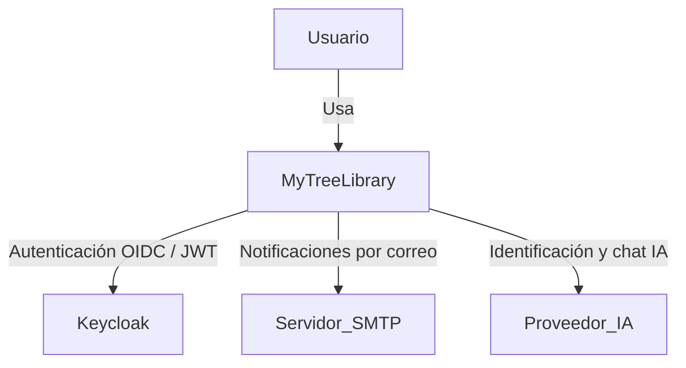
```mermaid
flowchart TB
  U[Usuario]
  S[MyTreeLibrary]
  KC[Keycloak]
  SMTP[Servidor_SMTP]
  PIA[Proveedor_IA]
  U -->|Usa| S
  S -->|Autenticación OIDC / JWT| KC
  S -->|Notificaciones por correo| SMTP
  S -->|Identificación y chat IA| PIA
```

#### C2 — Diagrama de contenedores (nivel 2)


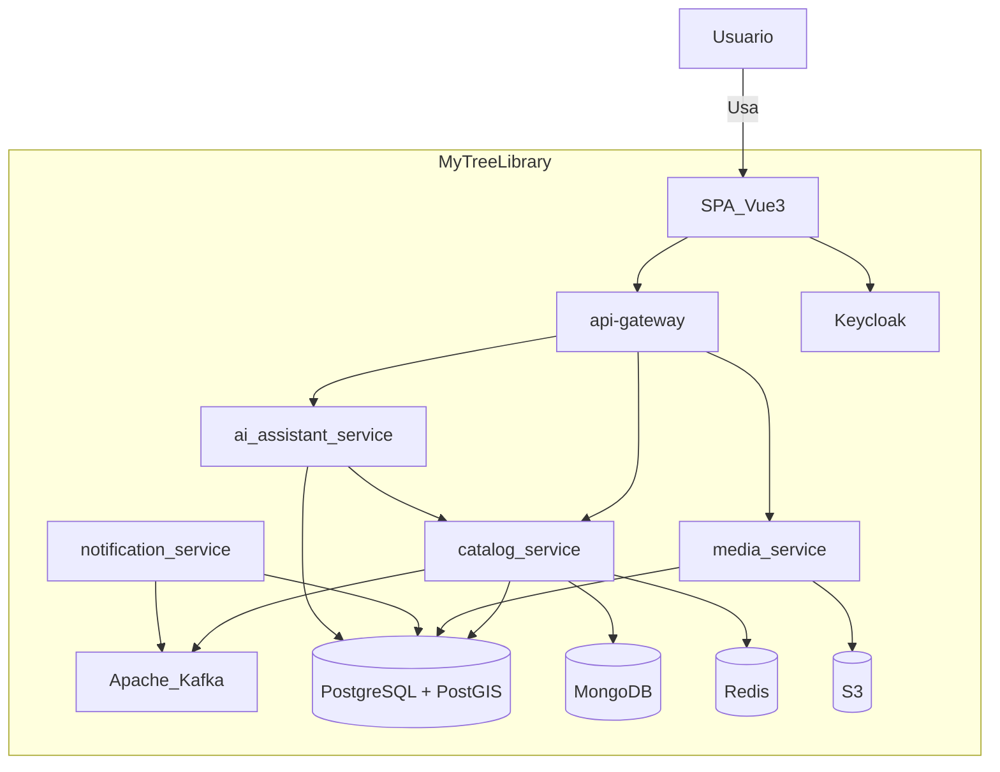
```mermaid
flowchart TB
  subgraph mtl [MyTreeLibrary]
    SPA[SPA_Vue3]
    GW[api-gateway]
    KC[Keycloak]
    CAT[catalog_service]
    MED[media_service]
    NOT[notification_service]
    AIS[ai_assistant_service]
    K[Apache_Kafka]
    PG[(PostgreSQL + PostGIS)]
    MG[(MongoDB)]
    RD[(Redis)]
    OBJ[(S3)]
  end
  U[Usuario] -->|Usa| SPA
  SPA --> GW
  SPA --> KC
  GW --> CAT
  GW --> MED
  GW --> AIS
  CAT --> PG
  CAT --> RD
  CAT --> K
  CAT --> MG
  MED --> PG
  MED --> OBJ
  NOT --> PG
  NOT --> K
  AIS --> PG
  AIS --> CAT


```

*Keycloak suele desplegarse como IdP aparte; aquí se muestra en el mismo diagrama por dependencia de autenticación de la SPA y del gateway.*

**C2 (detalle) — un servidor PostgreSQL con PostGIS, cuatro esquemas, un esquema por servicio:**

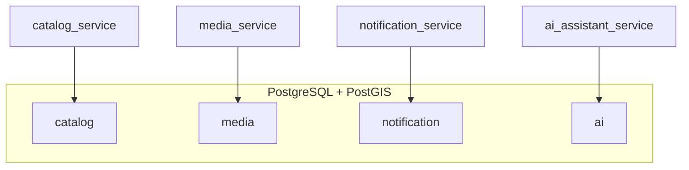
```mermaid
flowchart TB
  CAT[catalog_service]
  MED[media_service]
  NS[notification_service]
  AIS[ai_assistant_service]
  subgraph PG [PostgreSQL + PostGIS]
    direction LR
    SCH_C[catalog]
    SCH_M[media]
    SCH_N[notification]
    SCH_I[ai]
  end
  CAT --> SCH_C
  MED --> SCH_M
  NS --> SCH_N
  AIS --> SCH_I
```


**Flujo de notificación tras evento `catalog.arbol.evento` (Kafka):**

En el MVP, el evento con **fines de notificación por correo a suscriptores** se publica **solo tras la alta (creación)** de una ficha de árbol (regla **R7** en [data-model.md](docs/data-model/data-model.md)); las **modificaciones** de ficha **no** disparan este flujo. Contrato del mensaje: [docs/events/kafka-events.md](docs/events/kafka-events.md).

**Comunicaciones principales:** el usuario interactúa con la SPA; la SPA obtiene tokens en Keycloak y llama al API Gateway; el gateway enruta a los microservicios; **catalog-service** publica en Kafka eventos como `catalog.arbol.evento`; **notification-service** consume Kafka y envía correo vía SMTP externo; **ai-assistant-service** invoca al proveedor de IA externo.

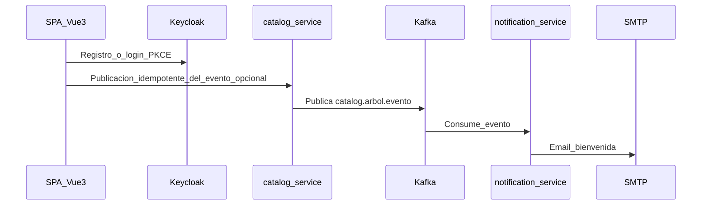
```mermaid
sequenceDiagram
  participant SPA as SPA_Vue3
  participant KC as Keycloak
  participant CAT as catalog_service
  participant K as Kafka
  participant N as notification_service
  participant Mail as SMTP
  SPA->>KC: Registro_o_login_PKCE
  SPA->>CAT: Publicacion_idempotente_del_evento_opcional
  CAT->>K: Publica catalog.arbol.evento
  K->>N: Consume_evento
  N->>Mail: Email_bienvenida
```


**Flujo de consulta IA (datos de especie vía catalog-service):**

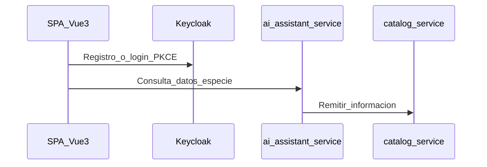
```mermaid
sequenceDiagram
  participant SPA as SPA_Vue3
  participant KC as Keycloak
  participant AIS as ai_assistant_service
  participant CAT as catalog_service
  SPA->>KC: Registro_o_login_PKCE
  SPA->>AIS: Consulta_datos_especie
  AIS->>CAT: Remitir_informacion
```


**Flujo de registro de árbol y subida de imagen:**

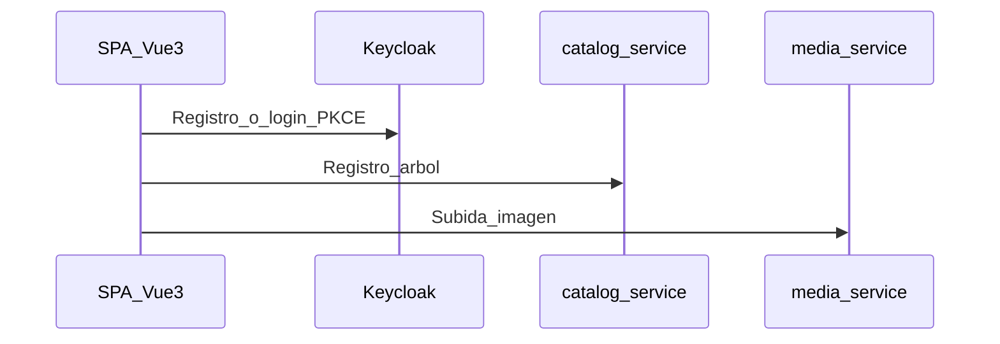
```mermaid
sequenceDiagram
  participant SPA as SPA_Vue3
  participant KC as Keycloak
  participant CAT as catalog_service
  participant MED as media_service
  SPA->>KC: Registro_o_login_PKCE
  SPA->>CAT: Registro_arbol
  SPA->>MED: Subida_imagen
```

### **2.2. Descripción de componentes principales:**

| Componente | Tecnología | Responsabilidad |
|------------|------------|-----------------|
| SPA | Vue 3, Vite, TypeScript | UI: biblioteca, mapa, IA, flujos OIDC con Keycloak |
| API Gateway | Spring Cloud Gateway, **Spring Boot 4** | Enrutado `/api/catalog`, `/api/media`, `/api/notifications`, `/api/ai`; preparado para validación JWT (Keycloak); actuator y métricas |
| catalog-service | **Spring Boot 4**, JPA, Flyway, PostgreSQL, PostGIS, Redis, Kafka producer | Árboles, coordenadas, publicación; **PostgreSQL** (esquema **catalog**) y **MongoDB** (enriquecimientos y proyección mínima para búsqueda); caché de mapa; eventos de dominio |
| media-service | **Spring Boot 4**, JPA, Flyway, AWS SDK v2 (S3) | Metadatos solo en esquema **`media`**; objetos en bucket MinIO/S3; URLs prefirmadas |
| notification-service | **Spring Boot 4**, JPA, Flyway, Spring Kafka, JavaMail | Consume `catalog.arbol.evento`; datos solo en esquema **`notification`**; envío SMTP |
| ai-assistant-service | **Spring Boot 4**, Spring WebClient (o equivalente), Spring Data JPA | Orquestación hacia proveedor IA; datos de auditoria en esquema **`ai`** (p. ej. **AUDITORIA_USO_IA**); delegación de datos de catálogo en **catalog-service** |
| Keycloak | Keycloak 26 | Realm, clientes, roles, emisión de JWT |
| Kafka | Apache Kafka (KRaft en dev) | Topics p. ej. `catalog.arbol.evento` |
| PostgreSQL | 16 | **Un servidor** en dev; **cuatro esquemas** (`catalog`, `media`, `notification`, `ai`); extensión **PostGIS** en el esquema **catalog** para datos geoespaciales |
| MongoDB | 7 | Colecciones de enriquecimiento y notas; proyección mínima para búsqueda sin SQL (véase [mongo.md](docs/data-model/mongo.md)) |
| Redis | 7 | Caché |
| MinIO | S3 API | Imágenes en desarrollo |

### **2.3. Descripción de alto nivel del proyecto y estructura de ficheros**

Estructura de repositorio **prevista** para la fase de implementación (monorepo típico):

```
proyecto/
├── frontend/                 # SPA Vue 3 (Vite)
├── services/                 # Gateway + microservicios Spring Boot (un directorio por despliegue)
│   ├── api-gateway/
│   ├── catalog-service/
│   ├── media-service/
│   ├── notification-service/
│   └── ai-assistant-service/
├── platform/
│   └── observability/        # Configuración de telemetría/trazas/logs (OTel, Prometheus, Grafana…)
├── infra/                    # Orquestación local y nube
│   ├── compose/              # Docker Compose (infra de apoyo); ver README.md en esa carpeta
│   └── k8s/                  # Manifiestos / Helm (según despliegue)
├── docs/
│   ├── adr/                  # Architecture Decision Records
│   ├── api/                  # OpenAPI (contrato del gateway)
│   ├── data-model/           # Modelo de datos (reglas, Mongo, readme §3)
│   ├── events/               # Contrato de eventos Kafka
│   └── use-cases/            # Casos de uso
└── readme.md
```

### **2.4. Infraestructura y despliegue**

**Desarrollo:** Docker Compose (o equivalente) con **un** PostgreSQL con extensión **PostGIS** (cuatro esquemas de aplicación: `catalog`, `media`, `notification`, `ai`), MongoDB, Redis, MinIO, Kafka y Keycloak; los microservicios pueden ejecutarse en el host o como contenedores.

**Despliegue (alto nivel):** orquestación (p. ej. Kubernetes), secretos externos, Keycloak y Kafka en HA según entorno, bases gestionadas y almacenamiento de objetos S3 en nube.

**Decisiones documentadas:** descubrimiento de servicios y configuración **sin Eureka ni Spring Cloud Config** (asumidas por Compose/Kubernetes) — [ADR-0001](docs/adr/0001-discovery-y-configuracion-por-orquestador.md). Claves primarias **numéricas** en SQL frente a UUID en el MVP — [ADR-0002](docs/adr/0002-claves-primarias-numericas-frente-a-uuid.md).

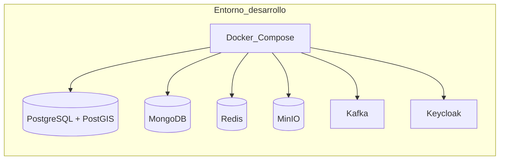
```mermaid
flowchart LR
  subgraph dev [Entorno_desarrollo]
    DC[Docker_Compose]
    PGd[(PostgreSQL + PostGIS)]
    MGd[(MongoDB)]
    Rd[(Redis)]
    S3d[(MinIO)]
    Kd[Kafka]
    KCd[Keycloak]
  end
  DC --> PGd
  DC --> MGd
  DC --> Rd
  DC --> S3d
  DC --> Kd
  DC --> KCd
```

### **2.5. Seguridad**

| Práctica | Descripción |
|----------|-------------|
| Autenticación OIDC | Keycloak como IdP; SPA con **Authorization Code + PKCE**; JWT firmados; `issuer-uri` alineado con el realm |
| Autorización | Roles de realm `COLABORADOR` y `ADMIN`; políticas en recursos sensibles |
| Gateway | Validación de JWT (habilitar `spring-security-oauth2-resource-server` en el gateway cuando el realm esté configurado); cabeceras de correlación para auditoría |
| Almacenamiento de objetos | Buckets privados; **URLs prefirmadas** de corta duración; sin credenciales en el cliente |
| Datos personales | Suscripciones por email con **token hash** para baja; minimización de logs |
| Transporte | TLS en producción; CORS restringido al origen del SPA |
| Observabilidad | Health/metrics Prometheus; trazas distribuidas (p. ej. OpenTelemetry) en despliegue |

**Normativa ampliada en código asistido:** reglas Cursor `.cursor/rules/api-security.mdc` (JWT, roles `COLABORADOR`/`ADMIN`, rutas públicas, correlación, PII en logs). El contrato HTTP canónico para implementación y pruebas de contrato está en [docs/api/openapi.yaml](docs/api/openapi.yaml).

### **2.6. Tests**

Estrategia prevista: pruebas unitarias de dominio; **integración** con **Testcontainers** (PostgreSQL con PostGIS, MongoDB, Kafka) donde aporte valor; **contrato de API** en [docs/api/openapi.yaml](docs/api/openapi.yaml) como referencia para pruebas de contrato y revisiones; tests de capa web y de aceptación sobre flujos críticos (catalogo, notificaciones, IA).

---

## 3. Modelo de Datos

**Documentación relacionada:** [Notas de negocio y reglas](docs/data-model/data-model.md) · [Modelo técnico MongoDB (colecciones, validación, índices)](docs/data-model/mongo.md) · [OpenAPI](docs/api/openapi.yaml) · [Eventos Kafka](docs/events/kafka-events.md)

### **3.1. Modelo lógico de entidades (referencia)**

Vista unificada de entidades principales y relaciones; los tipos indican el modelo físico previsto alineado con §3.2.

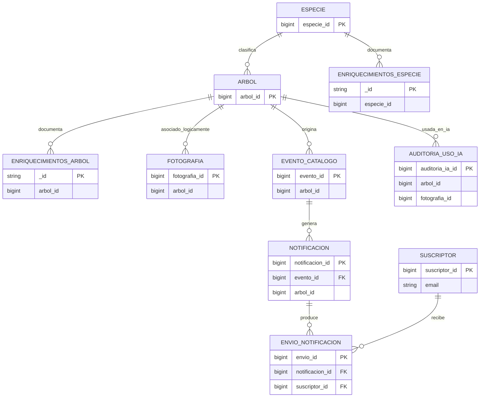
```mermaid
erDiagram
    ARBOL {
        bigint arbol_id PK
    }

    ESPECIE {
        bigint especie_id PK
    }
    
    ENRIQUECIMIENTOS_ESPECIE {
        string _id PK
        bigint especie_id
    }

    ENRIQUECIMIENTOS_ARBOL {
        string _id PK
        bigint arbol_id
    }

    FOTOGRAFIA {
        bigint fotografia_id PK
        bigint arbol_id
    }

    EVENTO_CATALOGO {
        bigint evento_id PK
        bigint arbol_id
    }

    NOTIFICACION {
        bigint notificacion_id PK
        bigint evento_id FK
        bigint arbol_id
    }

    SUSCRIPTOR {
        bigint suscriptor_id PK
        string email
    }

    ENVIO_NOTIFICACION {
        bigint envio_id PK
        bigint notificacion_id FK
        bigint suscriptor_id FK
    }

    AUDITORIA_USO_IA {
        bigint auditoria_ia_id PK
        bigint arbol_id
        bigint fotografia_id
    }

    ARBOL ||--o{ FOTOGRAFIA : asociado_logicamente
    ARBOL ||--o{ EVENTO_CATALOGO : origina
    ARBOL ||--o{ AUDITORIA_USO_IA : usada_en_ia
    EVENTO_CATALOGO ||--o{ NOTIFICACION : genera
    ARBOL ||--o{ ENRIQUECIMIENTOS_ARBOL : documenta
    ESPECIE ||--o{ ENRIQUECIMIENTOS_ESPECIE : documenta
    ESPECIE ||--o{ ARBOL : clasifica
    NOTIFICACION ||--o{ ENVIO_NOTIFICACION : produce
    SUSCRIPTOR ||--o{ ENVIO_NOTIFICACION : recibe

```

### **3.2. Diagrama de persistencia (implementación)**

** PostgreSQL catalog_service:**
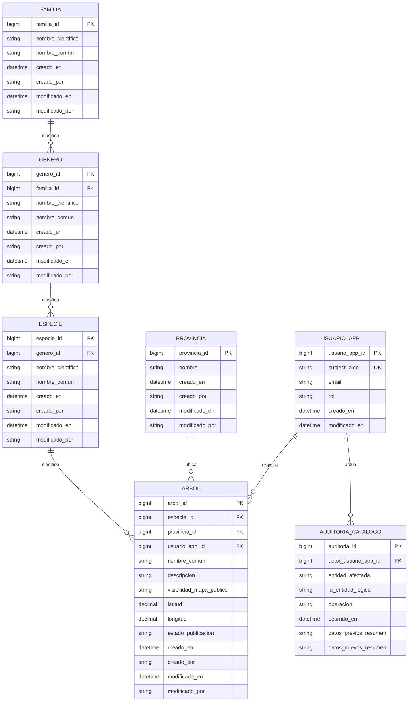
```mermaid
erDiagram
    USUARIO_APP {
        bigint usuario_app_id PK
        string subject_oidc UK
        string email
        string rol
        datetime creado_en
        datetime modificado_en
    }

    FAMILIA {
        bigint familia_id PK
        string nombre_cientifico
        string nombre_comun
        datetime creado_en
        string creado_por
        datetime modificado_en
        string modificado_por
    }

    GENERO {
        bigint genero_id PK
        bigint familia_id FK
        string nombre_cientifico
        string nombre_comun
        datetime creado_en
        string creado_por
        datetime modificado_en
        string modificado_por
    }

    ESPECIE {
        bigint especie_id PK
        bigint genero_id FK
        string nombre_cientifico
        string nombre_comun
        datetime creado_en
        string creado_por
        datetime modificado_en
        string modificado_por
    }

    PROVINCIA {
        bigint provincia_id PK
        string nombre
        datetime creado_en
        string creado_por
        datetime modificado_en
        string modificado_por
    }

    ARBOL {
        bigint arbol_id PK
        bigint especie_id FK
        bigint provincia_id FK
        bigint usuario_app_id FK
        string nombre_comun
        string descripcion
        string visibilidad_mapa_publico
        decimal latitud
        decimal longitud
        string estado_publicacion
        datetime creado_en
        string creado_por
        datetime modificado_en
        string modificado_por
    }

    AUDITORIA_CATALOGO {
        bigint auditoria_id PK
        bigint actor_usuario_app_id FK
        string entidad_afectada
        string id_entidad_logico
        string operacion
        datetime ocurrido_en
        string datos_previos_resumen
        string datos_nuevos_resumen
    }

    FAMILIA ||--o{ GENERO : clasifica
    GENERO ||--o{ ESPECIE : clasifica
    ESPECIE ||--o{ ARBOL : clasifica
    PROVINCIA ||--o{ ARBOL : ubica
    USUARIO_APP ||--o{ ARBOL : registra
    USUARIO_APP ||--o{ AUDITORIA_CATALOGO : actua
```

** Mongo catalog_service:**

*Proyección mínima opcional (p. ej. `ESPECIE` / `ARBOL` con ids y nombres): facilita búsquedas en Mongo por nombre de especie u otros criterios sin join obligatorio con SQL; el maestro completo permanece en PostgreSQL. Núcleo flexible: colecciones `enriquecimientos_especie` y `enriquecimientos_arbol` — [mongo.md](docs/data-model/mongo.md).*

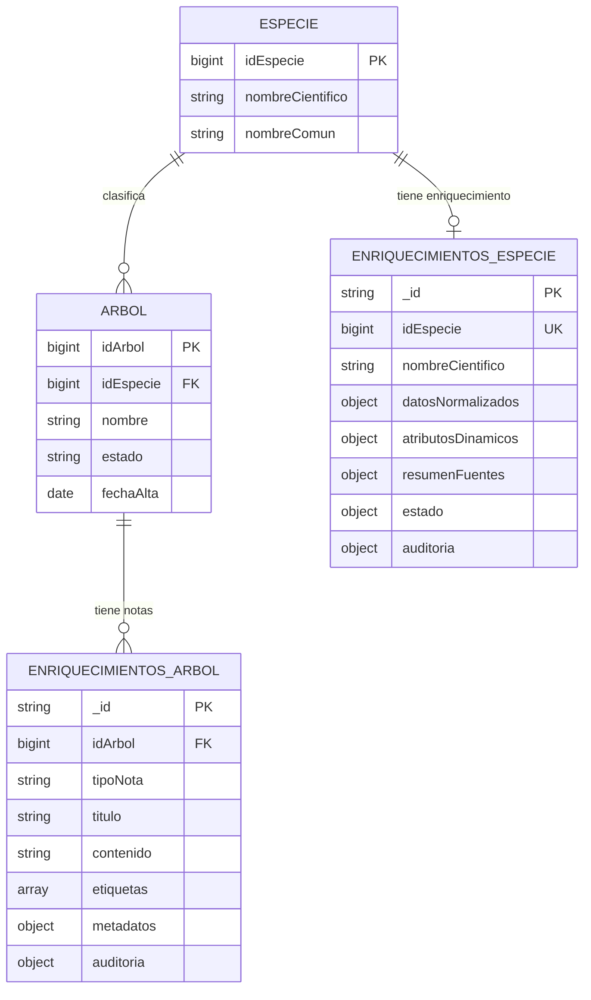
```mermaid
erDiagram
    ESPECIE ||--o{ ARBOL : "clasifica"
    ESPECIE ||--o| ENRIQUECIMIENTOS_ESPECIE : "tiene enriquecimiento"
    ARBOL ||--o{ ENRIQUECIMIENTOS_ARBOL : "tiene notas"

    ESPECIE {
        bigint idEspecie PK
        string nombreCientifico
        string nombreComun
    }

    ARBOL {
        bigint idArbol PK
        bigint idEspecie FK
        string nombre
        string estado
        date fechaAlta
    }

    ENRIQUECIMIENTOS_ESPECIE {
        string _id PK
        bigint idEspecie UK
        string nombreCientifico
        object datosNormalizados
        object atributosDinamicos
        object resumenFuentes
        object estado
        object auditoria
    }

    ENRIQUECIMIENTOS_ARBOL {
        string _id PK
        bigint idArbol FK
        string tipoNota
        string titulo
        string contenido
        array etiquetas
        object metadatos
        object auditoria
    }
```    

** PostgreSQL media_service:**
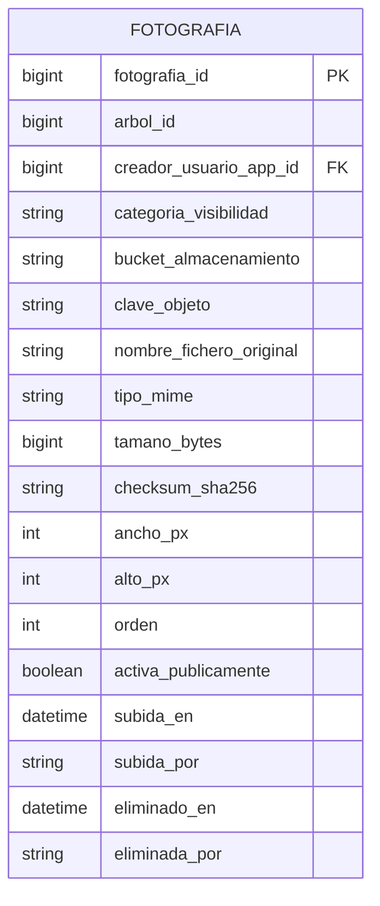
```mermaid
erDiagram
    FOTOGRAFIA {
        bigint fotografia_id PK
        bigint arbol_id
        bigint creador_usuario_app_id FK
        string categoria_visibilidad
        string bucket_almacenamiento
        string clave_objeto
        string nombre_fichero_original
        string tipo_mime
        bigint tamano_bytes
        string checksum_sha256
        int ancho_px
        int alto_px
        int orden
        boolean activa_publicamente
        datetime subida_en
        string subida_por
        datetime eliminado_en
        string eliminada_por
    }

```
** PostgreSQL notification_service:**
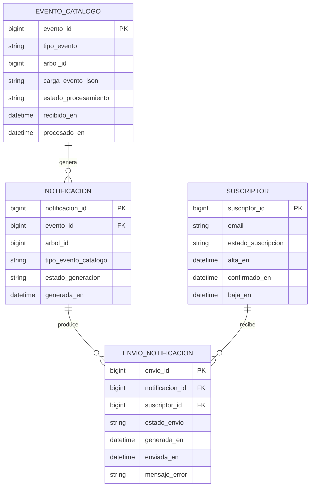
```mermaid
erDiagram
    SUSCRIPTOR {
        bigint suscriptor_id PK
        string email
        string estado_suscripcion
        datetime alta_en
        datetime confirmado_en
        datetime baja_en
    }

    EVENTO_CATALOGO {
        bigint evento_id PK
        string tipo_evento
        bigint arbol_id
        string carga_evento_json
        string estado_procesamiento
        datetime recibido_en
        datetime procesado_en
    }

    NOTIFICACION {
        bigint notificacion_id PK
        bigint evento_id FK
        bigint arbol_id
        string tipo_evento_catalogo
        string estado_generacion
        datetime generada_en
    }

    ENVIO_NOTIFICACION {
        bigint envio_id PK
        bigint notificacion_id FK
        bigint suscriptor_id FK
        string estado_envio
        datetime generada_en
        datetime enviada_en
        string mensaje_error
    }

    EVENTO_CATALOGO ||--o{ NOTIFICACION : genera
    NOTIFICACION ||--o{ ENVIO_NOTIFICACION : produce
    SUSCRIPTOR ||--o{ ENVIO_NOTIFICACION : recibe
```

** PostgreSQL ai_assistant_service (esquema `ai`):**
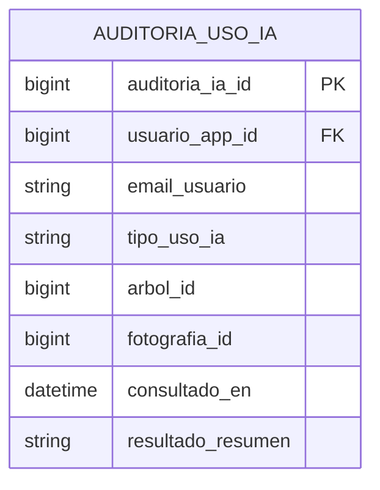
```mermaid
erDiagram
    AUDITORIA_USO_IA {
        bigint auditoria_ia_id PK
        bigint usuario_app_id FK
        string email_usuario
        string tipo_uso_ia
        bigint arbol_id
        bigint fotografia_id
        datetime consultado_en
        string resultado_resumen
    }
```
   

### **3.3. Descripción de entidades principales (orientación física)**

Las entidades físicas se reparten por servicio y almacén como en §3.2: **PostgreSQL** en **un servidor** con esquemas `catalog`, `media`, `notification` y `ai` (este último para **ai-assistant-service**); **MongoDB** bajo **catalog-service** según [mongo.md](docs/data-model/mongo.md).

**Usuario de aplicación:** `USUARIO_APP` usa **PK numérica** `usuario_app_id` (alineado con [ADR-0002](docs/adr/0002-claves-primarias-numericas-frente-a-uuid.md)); el identificador estable del proveedor OIDC (`sub`) se guarda en **`subject_oidc`** con unicidad, no como clave primaria. Las FK en otros esquemas/servicios (`usuario_app_id`, `creador_usuario_app_id`, etc.) referencian ese entero; No habrá FK cruzadas entre esquemas; cada microservicio tiene un esquema de Base de Datos independiente.

---

## 4. Especificación de la API

**Contrato canónico (OpenAPI 3):** [docs/api/openapi.yaml](docs/api/openapi.yaml) — rutas bajo el API Gateway (`/api/catalog`, `/api/media`, `/api/notifications`, `/api/ai`), seguridad JWT donde aplica, listados paginados (`page`, `size`) y errores en **RFC 9457** (`application/problem+json`).

**Convenciones de diseño:** `.cursor/rules/api-design.mdc` y `.cursor/rules/api-contract.mdc` (cambios de API deben reflejarse en el OpenAPI).

**Eventos asíncronos** (notificaciones, etc.): [docs/events/kafka-events.md](docs/events/kafka-events.md).

---

## 5. Historias de Usuario

Modelo de análisis (actores, casos de uso, diagrama PlantUML): [docs/use-cases/use-case-summary.md](docs/use-cases/use-case-summary.md).

> Documenta 3 de las historias de usuario principales utilizadas durante el desarrollo, teniendo en cuenta las buenas prácticas de producto al respecto.

**Historia de Usuario 1**

**Historia de Usuario 2**

**Historia de Usuario 3**

---

## 6. Tickets de Trabajo

> Documenta 3 de los tickets de trabajo principales del desarrollo, uno de backend, uno de frontend, y uno de bases de datos. Da todo el detalle requerido para desarrollar la tarea de inicio a fin teniendo en cuenta las buenas prácticas al respecto. 

**Ticket 1**

**Ticket 2**

**Ticket 3**

---

## 7. Pull Requests

> Documenta 3 de las Pull Requests realizadas durante la ejecución del proyecto

**Pull Request 1**

**Pull Request 2**

**Pull Request 3**

