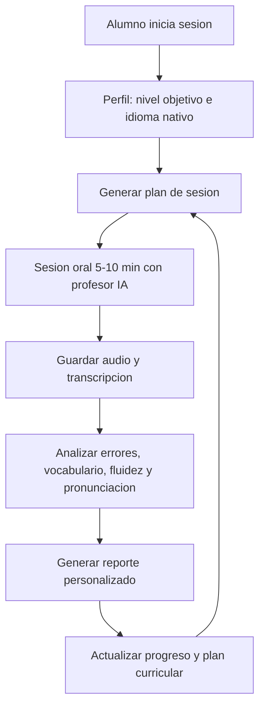
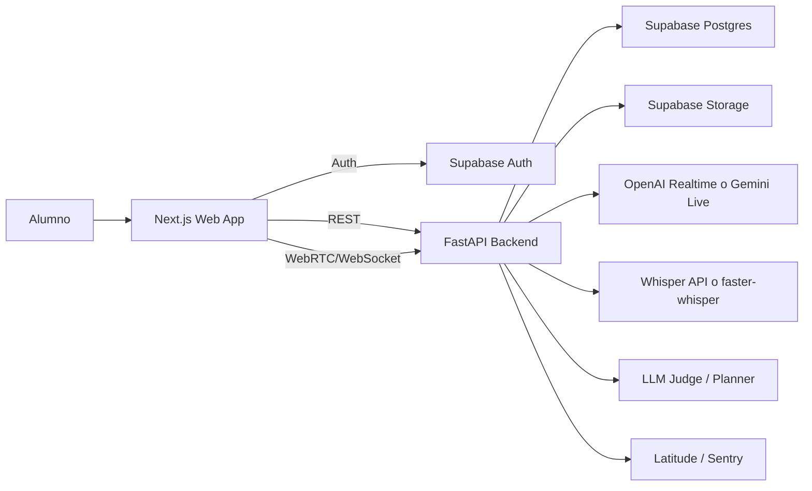
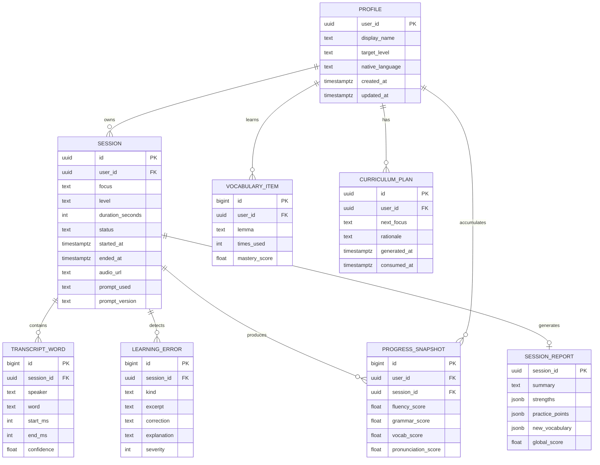

## Indice

0. [Ficha del proyecto](#0-ficha-del-proyecto)
1. [Descripcion general del producto](#1-descripcion-general-del-producto)
2. [Arquitectura del sistema](#2-arquitectura-del-sistema)
3. [Modelo de datos](#3-modelo-de-datos)
4. [Especificacion de la API](#4-especificacion-de-la-api)
5. [Historias de usuario](#5-historias-de-usuario)
6. [Tickets de trabajo](#6-tickets-de-trabajo)
7. [Pull requests](#7-pull-requests)

---

## 0. Ficha del proyecto

### **0.1. Tu nombre completo:**

Juan Carlos Orrego.

### **0.2. Nombre del proyecto:**

Habla.

### **0.3. Descripcion breve del proyecto:**

Habla es una aplicacion web para practicar ingles conversacional con IA mediante sesiones cortas de voz, feedback personalizado y un plan adaptativo que evoluciona despues de cada sesion. El diferencial del producto es combinar conversacion oral de baja latencia con un loop pedagogico longitudinal: cada practica genera transcripcion, analisis, reporte y foco para la siguiente sesion.

### **0.4. URL del proyecto:**

URL prevista: `https://habla.tuklon.ai`.

La Entrega 1 no incluye despliegue funcional. La URL publica se completara durante la Entrega 2 o la entrega final.

### **0.5. URL o archivo comprimido del repositorio**

Repositorio publico del proyecto: <https://github.com/jcorrego/habla-ai-coach>

Pull request de Entrega 1: <https://github.com/jcorrego/habla-ai-coach/pull/1>

---

## 1. Descripcion general del producto

### **1.1. Objetivo:**

Construir una aplicacion E2E que permita a un alumno adulto practicar ingles por voz con un profesor IA y recibir un reporte personalizado que alimente automaticamente la siguiente sesion.

El problema principal es que muchas herramientas de practica conversacional ofrecen conversacion abierta, pero no convierten cada interaccion en aprendizaje estructurado. El alumno habla, recibe feedback puntual y vuelve a empezar casi desde cero. Habla busca cerrar ese ciclo: cada sesion deja evidencia, metricas y una decision concreta sobre que practicar despues.

### **1.2. Caracteristicas y funcionalidades principales:**

- Registro y login del alumno.
- Perfil inicial con idioma nativo y nivel objetivo CEFR.
- Preparacion automatica de una sesion oral de 5 a 10 minutos.
- Conversacion por voz con un profesor IA de baja latencia.
- Persistencia de sesion, prompt usado, audio o referencia de audio y estado.
- Transcripcion completa con marcas temporales.
- Analisis post-sesion de gramatica, vocabulario, fluidez y pronunciacion.
- Reporte con fortalezas, puntos de mejora, vocabulario nuevo y score global.
- Dashboard basico de progreso.
- Plan adaptativo para que la siguiente sesion practique los huecos detectados.

### **1.3. Diseno y experiencia de usuario:**

La experiencia debe sentirse como una herramienta de aprendizaje tranquila y directa. La primera pantalla autenticada lleva al alumno al siguiente paso natural: empezar la proxima sesion o revisar el ultimo reporte.

Flujo principal del MVP:


```mermaid
flowchart TD
    A["Alumno inicia sesion"] --> B["Perfil: nivel objetivo e idioma nativo"]
    B --> C["Generar plan de sesion"]
    C --> D["Sesion oral 5-10 min con profesor IA"]
    D --> E["Guardar audio y transcripcion"]
    E --> F["Analizar errores, vocabulario, fluidez y pronunciacion"]
    F --> G["Generar reporte personalizado"]
    G --> H["Actualizar progreso y plan curricular"]
    H --> C
```

Principios UX:

- Sesiones cortas y enfocadas.
- Sin configuraciones complejas antes de practicar.
- Ingles durante la conversacion; feedback bilingue despues.
- Reportes accionables, no explicaciones largas.
- Dashboard orientado a tendencias y errores recurrentes.

### **1.4. Instrucciones de instalacion:**

Esta entrega corresponde a documentacion tecnica y todavia no incluye una aplicacion ejecutable. La Entrega 2 incorporara instrucciones completas para frontend, backend, base de datos, migraciones, variables de entorno y ejecucion local.

Stack propuesto:

| Capa | Tecnologia |
|---|---|
| Frontend | Next.js, React, TypeScript, Vercel |
| Backend | FastAPI, Python, Railway o Fly.io |
| Base de datos | Supabase Postgres |
| Auth | Supabase Auth |
| Conversacion de voz | OpenAI Realtime API o Gemini Live API |
| Transcripcion | Whisper API o faster-whisper |
| Observabilidad | Latitude, Sentry, Vercel Analytics |
| CI/CD | GitHub Actions, Vercel previews |
| Dominio | `habla.tuklon.ai` |

---

## 2. Arquitectura del Sistema

### **2.1. Diagrama de arquitectura:**


```mermaid
flowchart LR
    U["Alumno"] --> FE["Next.js Web App"]
    FE -->|Auth| SA["Supabase Auth"]
    FE -->|REST| API["FastAPI Backend"]
    FE -->|WebRTC/WebSocket| API
    API --> DB["Supabase Postgres"]
    API --> ST["Supabase Storage"]
    API --> VOICE["OpenAI Realtime o Gemini Live"]
    API --> WH["Whisper API o faster-whisper"]
    API --> LLM["LLM Judge / Planner"]
    API --> OBS["Latitude / Sentry"]
```

Habla usa una arquitectura web desacoplada: frontend Next.js, backend FastAPI y Supabase como plataforma de autenticacion, base de datos y storage. El backend actua como orquestador entre navegador, persistencia y proveedores de IA.

La decision clave es usar un `VoiceProviderGateway` para no acoplar el producto a un proveedor concreto. OpenAI Realtime y Gemini Live son candidatos principales para MVP; PersonaPlex se mantiene como linea de investigacion por su promesa de conversacion full-duplex y baja latencia.

### **2.2. Descripcion de componentes principales:**

| Componente | Tecnologia | Responsabilidad |
|---|---|---|
| Web App | Next.js, React, TypeScript | Login, onboarding, sesion oral, reporte, historial y dashboard. |
| API Backend | FastAPI, Python | Orquestar sesiones, validar usuarios, generar prompts, coordinar proveedores y exponer API. |
| Auth | Supabase Auth | Gestionar identidad del alumno. |
| DB | Supabase Postgres | Persistir perfil, sesiones, transcripciones, errores, reportes y progreso. |
| Storage | Supabase Storage | Guardar audio o artefactos asociados a sesiones. |
| Voice Gateway | OpenAI Realtime o Gemini Live | Conversacion oral de baja latencia con soporte de interrupciones. |
| Analysis Pipeline | Whisper/faster-whisper + LLM | Transcribir, analizar errores y generar reportes. |
| Observabilidad | Latitude, Sentry | Trazas de prompts, errores, latencia, coste y calidad. |

### **2.3. Descripcion de alto nivel del proyecto y estructura de ficheros**

Estructura prevista para Entrega 2:

```text
.
├── apps/
│   ├── web/                  # Frontend Next.js
│   └── api/                  # Backend FastAPI
├── packages/
│   └── shared/               # Tipos y contratos compartidos
├── supabase/
│   ├── migrations/           # Migraciones SQL
│   └── seed.sql              # Datos semilla
├── docs/                     # Documentacion tecnica
└── README.md                 # Guia del repositorio del proyecto
```

La documentacion tecnica de Entrega 1 esta en el repositorio del proyecto bajo `docs/`:

- `docs/01-prd.md`
- `docs/02-arquitectura.md`
- `docs/03-modelo-datos.md`
- `docs/04-historias-y-tickets.md`
- `docs/05-plan-entrega.md`
- `docs/06-investigacion-voz.md`

### **2.4. Infraestructura y despliegue**

| Componente | Plataforma propuesta |
|---|---|
| Frontend | Vercel |
| Backend | Railway o Fly.io |
| DB/Auth/Storage | Supabase |
| Dominio | `habla.tuklon.ai` |
| CI | GitHub Actions |

Pipeline previsto:

1. Pull request ejecuta lint, typecheck y tests.
2. Vercel crea preview del frontend.
3. Backend ejecuta tests unitarios y de integracion.
4. Merge a `main` despliega a staging o produccion.
5. Secrets se configuran en Vercel, Railway/Fly y GitHub Actions, no en el repositorio.

### **2.5. Seguridad**

- El frontend nunca recibe claves de proveedores IA.
- Todas las rutas privadas validan token Supabase.
- Las queries filtran por `user_id`.
- Supabase RLS impide acceso cruzado a perfiles, sesiones y reportes.
- Audio y transcripciones se tratan como datos sensibles.
- Los logs no guardan audio completo ni transcripciones completas.
- Los prompts registrados en herramientas de observabilidad deben anonimizar datos personales cuando sea posible.

### **2.6. Tests**

La Entrega 1 no incluye suite automatizada porque todavia no hay implementacion. La estrategia de calidad definida para Entrega 2 incluye:

- Tests unitarios backend para `PromptBuilder`, `CurriculumPlanner`, scoring y validaciones.
- Tests de integracion backend para endpoints de sesion, reporte y progreso.
- Tests unitarios frontend para componentes de reporte, dashboard y estados de sesion.
- Prueba E2E del flujo principal con mocks controlados del proveedor IA.

---

## 3. Modelo de Datos

### **3.1. Diagrama del modelo de datos:**


```mermaid
erDiagram
    PROFILE ||--o{ SESSION : owns
    SESSION ||--o{ TRANSCRIPT_WORD : contains
    SESSION ||--o{ LEARNING_ERROR : detects
    PROFILE ||--o{ VOCABULARY_ITEM : learns
    SESSION ||--o{ PROGRESS_SNAPSHOT : produces
    PROFILE ||--o{ PROGRESS_SNAPSHOT : accumulates
    PROFILE ||--o{ CURRICULUM_PLAN : has
    SESSION ||--o| SESSION_REPORT : generates

    PROFILE {
      uuid user_id PK
      text display_name
      text target_level
      text native_language
      timestamptz created_at
      timestamptz updated_at
    }

    SESSION {
      uuid id PK
      uuid user_id FK
      text focus
      text level
      int duration_seconds
      text status
      timestamptz started_at
      timestamptz ended_at
      text audio_url
      text prompt_used
      text prompt_version
    }

    TRANSCRIPT_WORD {
      bigint id PK
      uuid session_id FK
      text speaker
      text word
      int start_ms
      int end_ms
      float confidence
    }

    LEARNING_ERROR {
      bigint id PK
      uuid session_id FK
      text kind
      text excerpt
      text correction
      text explanation
      int severity
    }

    VOCABULARY_ITEM {
      bigint id PK
      uuid user_id FK
      text lemma
      int times_used
      float mastery_score
    }

    PROGRESS_SNAPSHOT {
      bigint id PK
      uuid user_id FK
      uuid session_id FK
      float fluency_score
      float grammar_score
      float vocab_score
      float pronunciation_score
    }

    CURRICULUM_PLAN {
      uuid id PK
      uuid user_id FK
      text next_focus
      text rationale
      timestamptz generated_at
      timestamptz consumed_at
    }

    SESSION_REPORT {
      uuid session_id PK
      text summary
      jsonb strengths
      jsonb practice_points
      jsonb new_vocabulary
      float global_score
    }
```

### **3.2. Descripcion de entidades principales:**

| Entidad | Proposito | Claves y restricciones relevantes |
|---|---|---|
| `profile` | Perfil del alumno y preferencias iniciales. | `user_id` es PK y FK a `auth.users`; `target_level` usa CEFR. |
| `session` | Unidad central de practica oral. | FK a `profile`; estado controlado: `prepared`, `in_progress`, `processing`, `reported`, `failed`. |
| `transcript_word` | Transcripcion granular palabra a palabra. | FK a `session`; incluye `speaker`, tiempos y confianza. |
| `learning_error` | Error o punto de mejora detectado. | FK a `session`; clasifica `grammar`, `pronunciation`, `vocab` o `fluency`. |
| `vocabulary_item` | Vocabulario longitudinal por usuario. | FK a `profile`; `unique(user_id, lemma)`. |
| `progress_snapshot` | Scores por sesion para medir evolucion. | FK a `profile` y `session`; scores entre 0 y 100. |
| `curriculum_plan` | Foco recomendado para la siguiente sesion. | FK a `profile`; `consumed_at` permite controlar el plan activo. |
| `session_report` | Reporte final de una sesion. | PK/FK `session_id`; contiene resumen, fortalezas y puntos de practica. |

---

## 4. Especificacion de la API

```yaml
openapi: 3.0.3
info:
  title: Habla API
  version: 0.1.0
paths:
  /sessions/prepare:
    post:
      summary: Prepara una nueva sesion oral
      security:
        - bearerAuth: []
      requestBody:
        required: false
        content:
          application/json:
            schema:
              type: object
              properties:
                preferred_focus:
                  type: string
                  example: "Past tense in work conversations"
      responses:
        "201":
          description: Sesion preparada
          content:
            application/json:
              schema:
                type: object
                required: [session_id, status, focus, level, prompt_version]
                properties:
                  session_id:
                    type: string
                    format: uuid
                  status:
                    type: string
                    enum: [prepared]
                  focus:
                    type: string
                  level:
                    type: string
                    enum: [A1, A2, B1, B2, C1, C2]
                  prompt_version:
                    type: string
  /sessions/{session_id}/finish:
    post:
      summary: Finaliza una sesion y dispara el analisis
      security:
        - bearerAuth: []
      parameters:
        - name: session_id
          in: path
          required: true
          schema:
            type: string
            format: uuid
      requestBody:
        required: false
        content:
          application/json:
            schema:
              type: object
              properties:
                audio_url:
                  type: string
                  format: uri
      responses:
        "202":
          description: Analisis iniciado
          content:
            application/json:
              schema:
                type: object
                required: [session_id, status]
                properties:
                  session_id:
                    type: string
                    format: uuid
                  status:
                    type: string
                    enum: [processing]
  /progress:
    get:
      summary: Devuelve metricas longitudinales del alumno
      security:
        - bearerAuth: []
      responses:
        "200":
          description: Progreso agregado
          content:
            application/json:
              schema:
                type: object
                required: [sessions_count, latest_scores, recurring_errors]
                properties:
                  sessions_count:
                    type: integer
                  latest_scores:
                    type: object
                    properties:
                      fluency:
                        type: number
                      grammar:
                        type: number
                      vocabulary:
                        type: number
                      pronunciation:
                        type: number
                  recurring_errors:
                    type: array
                    items:
                      type: object
                      properties:
                        kind:
                          type: string
                        excerpt:
                          type: string
                        count:
                          type: integer
components:
  securitySchemes:
    bearerAuth:
      type: http
      scheme: bearer
      bearerFormat: JWT
```

---

## 5. Historias de Usuario

**Historia de Usuario 1: Iniciar una sesion de practica**

Como alumno, quiero pulsar "empezar sesion" para que el sistema genere una practica oral y conecte con un profesor IA, para practicar ingles sin tener que planificar el tema.

Criterios de aceptacion:

- El backend crea una sesion en estado `prepared`.
- El prompt usa perfil, nivel objetivo y plan curricular activo.
- Al iniciar, la sesion pasa a `in_progress`.
- La primera intervencion del profesor IA se reproduce en menos de 3 segundos.
- La sesion registra `prompt_used`, `prompt_version`, `focus`, `level` y `user_id`.

**Historia de Usuario 2: Terminar sesion y obtener reporte**

Como alumno, quiero ver al terminar la sesion que hice bien y que practicar, para saber en que enfocarme.

Criterios de aceptacion:

- El alumno puede finalizar la sesion desde la interfaz.
- La sesion pasa a `processing`.
- Se genera transcripcion completa.
- Se detectan errores de gramatica, vocabulario, fluidez y pronunciacion.
- En menos de 60 segundos aparece un reporte con fortalezas, puntos de practica, vocabulario nuevo y score global.

**Historia de Usuario 3: Enfocar la siguiente sesion en mis huecos**

Como alumno, quiero que la siguiente sesion practique lo que mas necesito, para no repetir lo que ya domino.

Criterios de aceptacion:

- El sistema lee errores y snapshots recientes del alumno.
- El `CurriculumPlanner` genera `next_focus` y `rationale`.
- El plan se guarda en `curriculum_plan`.
- La siguiente sesion consume el plan activo.
- El alumno puede ver el foco sugerido antes de empezar.

---

## 6. Tickets de Trabajo

**Ticket 1: Backend - Preparar sesion**

| Campo | Detalle |
|---|---|
| ID | T-02 |
| Area | Backend |
| Objetivo | Implementar `POST /sessions/prepare`. |
| Descripcion | Validar usuario autenticado, leer perfil y plan curricular activo, construir prompt de sesion, crear registro `session` en estado `prepared` y devolver metadata al frontend. |
| Criterios de aceptacion | Requiere JWT valido; crea sesion asociada al usuario; guarda `prompt_used` y `prompt_version`; no expone secretos; devuelve `session_id`, `focus`, `level` y `status`. |
| Estimacion | 5 puntos |

**Ticket 2: Frontend - UI de inicio de sesion**

| Campo | Detalle |
|---|---|
| ID | T-04 |
| Area | Frontend |
| Objetivo | Crear pantalla para iniciar practica oral. |
| Descripcion | Mostrar foco propuesto, nivel objetivo, CTA de inicio y estados de carga/error. Consumir `POST /sessions/prepare` y navegar a la pantalla de sesion. |
| Criterios de aceptacion | Pantalla protegida; CTA accesible; muestra feedback de carga; maneja errores de API; no permite iniciar dos sesiones simultaneas accidentalmente. |
| Estimacion | 3 puntos |

**Ticket 3: Base de datos - Persistir sesion y progreso**

| Campo | Detalle |
|---|---|
| ID | T-12 |
| Area | Base de datos |
| Objetivo | Crear tablas y relaciones para guardar sesiones y snapshots de progreso. |
| Descripcion | Implementar migraciones para `session`, `progress_snapshot` e indices principales; habilitar RLS para acceso por `user_id`. |
| Criterios de aceptacion | Migraciones reproducibles; FK correctas; checks de estado y scores; indices por usuario/fecha; politicas RLS validando aislamiento de usuario. |
| Estimacion | 3 puntos |

---

## 7. Pull Requests

**Pull Request 1**

Entrega 1: documentacion tecnica de Habla.

- URL: <https://github.com/jcorrego/habla-ai-coach/pull/1>
- Rama: `feature-entrega1-jc`
- Base: `main`
- Alcance: PRD, arquitectura, modelo de datos, especificacion inicial de API, historias, tickets, plan de entrega e investigacion de voz.

**Pull Request 2**

Pendiente para Entrega 2.

- Rama prevista: `feature-entrega2-jc`
- Alcance previsto: MVP funcional con frontend, backend, Supabase, flujo de sesion, transcripcion y reporte basico.

**Pull Request 3**

Pendiente para entrega final.

- Rama prevista: `finalproject-jc`
- Alcance previsto: version desplegada, pruebas, observabilidad, documentacion final, prompts completos y evidencia de ejecucion.
