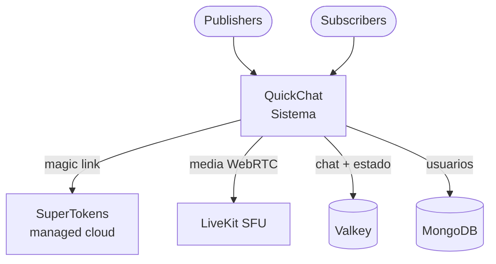
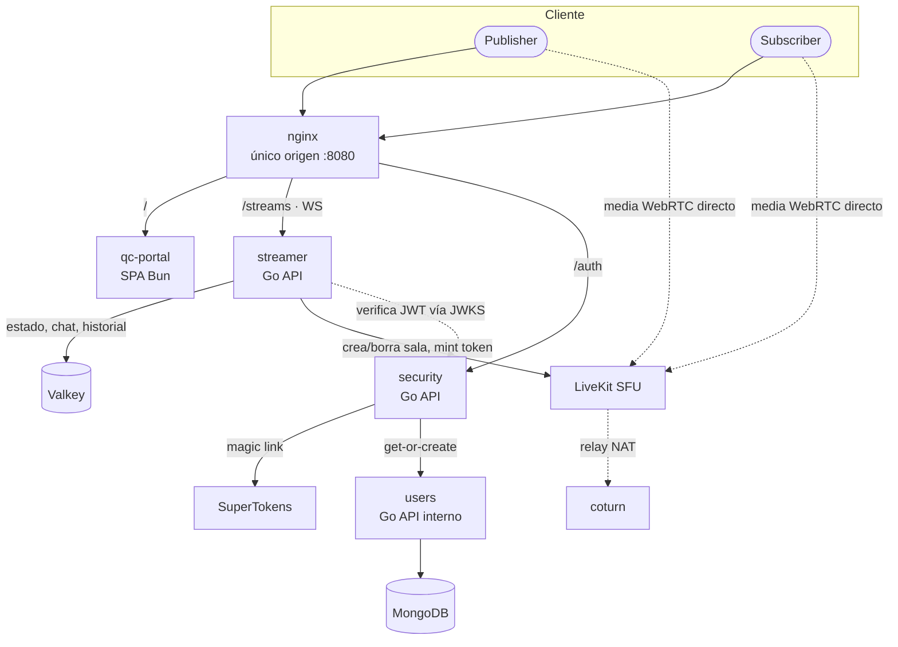
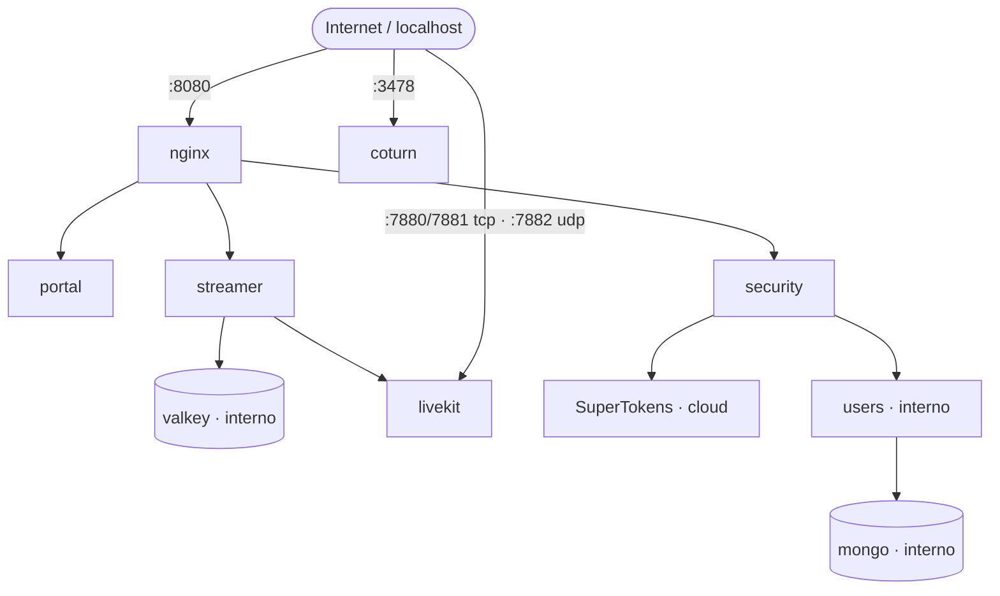
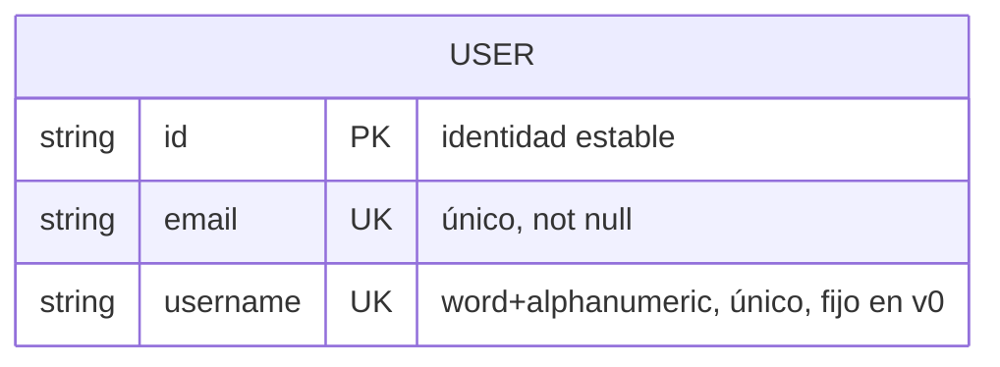
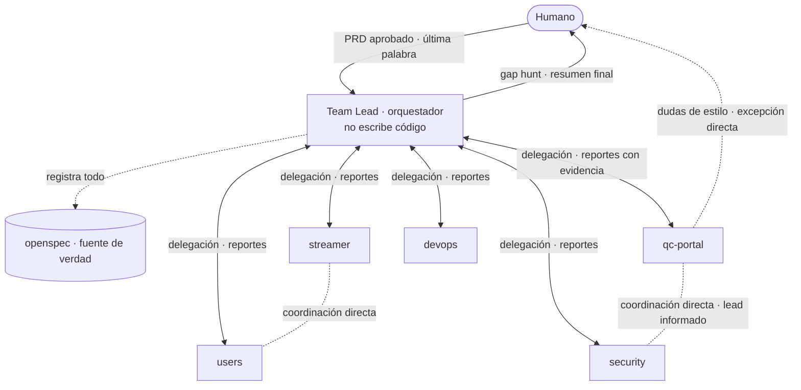
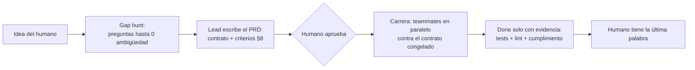

## Índice

0. [Ficha del proyecto](#0-ficha-del-proyecto)
1. [Descripción general del producto](#1-descripción-general-del-producto)
2. [Arquitectura del sistema](#2-arquitectura-del-sistema)
3. [Modelo de datos](#3-modelo-de-datos)
4. [Especificación de la API](#4-especificación-de-la-api)
5. [Historias de usuario](#5-historias-de-usuario)
6. [Tickets de trabajo](#6-tickets-de-trabajo)
7. [Pull requests](#7-pull-requests)
8. [Metodología: equipo de agentes](#8-metodología-equipo-de-agentes)

---

## 0. Ficha del proyecto

### **0.1. Tu nombre completo:**
Adrian Chavarria

### **0.2. Nombre del proyecto:**
quickchat

### **0.3. Descripción breve del proyecto:**
QuickChat es una plataforma de streaming en vivo con chat en tiempo real, al estilo Twitch. Un usuario emite (publisher) y otros usuarios ven y chatean en la sala (subscribers).

### **0.4. URL del proyecto:**
Entorno local vía `docker compose`, servido en un único origen: `http://localhost:8080`. Despliegue público: pendiente.

### 0.5. URL o archivo comprimido del repositorio
Monorepo local. Un servicio por carpeta bajo `dev/` (ver §2.3).

**Stack por servicio:**

| Servicio | Rol | Stack |
|---|---|---|
| `qc-portal` | SPA (Login, Streamings, Rooms) | TypeScript, Vite, VanJS, Bun, Tailwind v4 |
| `security` | Autoridad de identidad y tokens (magic link) | Go, SuperTokens Go SDK |
| `streamer` | Salas, chat WS, ciclo de vida del stream, tokens LiveKit | Go, coder/websocket, LiveKit server SDK |
| `users` | Persistencia de identidad (idempotente) | Go, MongoDB |
| `devops` | Runtime: compose, nginx, entorno | Docker Compose, nginx |

Externos: **SuperTokens** (managed cloud), **LiveKit SFU**, **Valkey**, **MongoDB**, **coturn** (TURN de desarrollo).

---

## 1. Descripción general del producto

### **1.1. Objetivo:**

Permitir que cualquier usuario comparta una experiencia en vivo de forma inmediata y que otros la vean y participen mediante chat en tiempo real, sin fricción de configuración ni curva de aprendizaje.

- **Valor que aporta:** emitir en directo en pocos clics y consumir streams en vivo con interacción inmediata vía chat.
- **Qué soluciona:** la complejidad de las plataformas de streaming tradicionales (cuentas elaboradas, OBS, configuración previa) para casos de uso casuales o efímeros.
- **Para quién:** creadores ocasionales que quieren transmitir un momento puntual (publishers) y espectadores que quieren ver y conversar en vivo (subscribers).

### **1.2. Características y funcionalidades principales:**

El alcance del producto se limita a cinco funcionalidades; todo lo que no esté en esta lista queda fuera.

1. **Registro e inicio de sesión sin contraseña.** Autenticación mediante magic link (SuperTokens managed cloud). En el primer login se crea el perfil del usuario en MongoDB con un username aleatorio y fijo.
2. **Listado de streams en vivo.** El usuario ve qué emisiones están activas ahora. Un stream existe en Valkey ⇔ está en vivo. Público (no requiere login).
3. **Emitir en directo (go live).** El propietario autenticado crea una sala y publica vídeo/audio vía WebRTC al SFU de LiveKit. Un publisher por sala.
4. **Ver un stream en vivo.** El subscriber abre una sala y consume el medio vía WebRTC desde LiveKit. Público; empieza muteado (autoplay policy) con tap-to-unmute.
5. **Chat en tiempo real dentro del stream.** Mensajería estilo Twitch sobre WebSocket, con fan-out e historial efímero en Valkey (cap 1M por sala, drop-oldest) y paginación por cursor al hacer scroll. El historial vive con la sala y muere con ella. Leer es público; escribir requiere login.

### **1.3. Diseño y experiencia de usuario:**

La UX se rige por `code-constitution/CONSTITUTION.style.md` (ley visual, vinculante solo para `qc-portal`). Principios: **calma deliberada**, sin urgencia visual.

- **Solo tokens** de diseño: sin colores ni tamaños arbitrarios.
- **Contraste AA**, estados de foco siempre visibles, HTML semántico.
- **0 radius**, sin sombras ni gradientes, bordes hairline.
- **Movimiento calmo** (100–200 ms), respeta `prefers-reduced-motion`.
- Acciones protegidas **visibles pero bloqueadas** (nunca ocultas): p. ej. "Sign in to chat" en lugar de esconder el composer.

Flujos principales: magic-link (email → "revisa tu bandeja" → landing consume el enlace → redirect), start-flow (título + descripción → confirmar → sala), sala (cámara 2/3 + chat 1/3 en desktop; 1/2 + 1/2 en móvil; toggle de chat), pre-join del publisher (preview → **Go live** explícito, nunca auto-publicación).

### **1.4. Instrucciones de instalación:**

Todo el sistema corre con Docker Compose desde `dev/devops/`.

```bash
# 1. Credenciales de SuperTokens (managed cloud, provistas por el humano).
#    Nunca se commitean: .env está git-ignored.
cd dev/devops
cp .env.example .env
# editar .env: SUPERTOKENS_CONNECTION_URI, SUPERTOKENS_API_KEY

# 2. Levantar el stack completo
docker compose up -d --build

# 3. Abrir el portal (único origen publicado)
open http://localhost:8080
```

Requisitos: Docker Desktop. El medio (WebRTC) se verifica en Chrome/Brave/Safari; Firefox es una limitación conocida de v0.

---

## 2. Arquitectura del Sistema

### **2.1. Diagrama de arquitectura:**

Se sigue el modelo **C4** (System → Containers). Los diagramas C4 originales en ASCII están en `architecture/v0.0/`; abajo la versión as-built en Mermaid.

**Contexto (System):**


```mermaid
graph TD
    pub([Publishers]) --> QC
    sub([Subscribers]) --> QC
    QC[QuickChat<br/>Sistema]
    QC -->|magic link| ST[SuperTokens<br/>managed cloud]
    QC -->|media WebRTC| LK[LiveKit SFU]
    QC -->|chat + estado| VK[(Valkey)]
    QC -->|usuarios| MG[(MongoDB)]
```

**Contenedores (as-built):**


```mermaid
graph TD
    subgraph Cliente
      pub([Publisher]);  sub([Subscriber])
    end
    NG[nginx<br/>único origen :8080]
    pub --> NG
    sub --> NG
    pub -. media WebRTC directo .-> LK
    sub -. media WebRTC directo .-> LK

    NG -->|/| PORTAL[qc-portal<br/>SPA Bun]
    NG -->|/streams · WS| STREAMER[streamer<br/>Go API]
    NG -->|/auth| SECURITY[security<br/>Go API]

    STREAMER -->|estado, chat, historial| VK[(Valkey)]
    STREAMER -->|crea/borra sala, mint token| LK[LiveKit SFU]
    STREAMER -.->|verifica JWT vía JWKS| SECURITY
    SECURITY -->|magic link| ST[SuperTokens]
    SECURITY -->|get-or-create| USERS[users<br/>Go API interno]
    USERS --> MG[(MongoDB)]
    LK -.->|relay NAT| TURN[coturn]
```

**Patrón:** conjunto pequeño de **servicios con responsabilidad única** detrás de una SPA, con **nginx** como único origen público. Desacopla el camino de medios en tiempo real (WebRTC) del camino de control/persistencia y aísla la emisión de credenciales.

**Beneficios:**
- **Un único origen** (`:8080`): nginx enruta `/`→portal, `/streams`+WS→streamer, `/auth`→security. Sin CORS entre servicios de aplicación.
- El medio **nunca toca los servicios Go**: el navegador habla WebRTC directo con LiveKit.
- **Verificación de JWT stateless**: streamer valida los tokens de security localmente vía JWKS, sin llamada por petición.
- **Chat efímero** en Valkey: pub/sub para fan-out, sin escritura a Mongo en el camino de chat.

**Sacrificios:**
- Tres servicios Go es generoso para el alcance; podrían colapsarse.
- Historial de chat efímero: al terminar la sala se pierde (asumido, modelo Twitch).
- v0 es dev-mode/local (LiveKit dev, TURN plano, sin TLS, sin persistencia): SPOF aceptable para el proyecto; hardening de producción diferido.

### **2.2. Descripción de componentes principales:**

**Contenedores propios:**

- **qc-portal** `[TS + Vite + VanJS + Bun]` — SPA. Módulos: `auth` (magic link vía `supertokens-web-js`, sesión, `authed-fetch`), `streams` (lista + start-flow), `room`/`media` (WebRTC contra LiveKit), `chat` (WS contra streamer). Sirve estáticos con `Bun.serve` + fallback SPA + `/healthz`.
- **streamer** `[Go]` — dueño de salas y chat, **y minter de tokens LiveKit**. Paquetes: `stream`/`valkey` (estado), `hub`/`chat` (WS + fan-out), `media`/`livekit` (mint de tokens, borrado de sala, reaper), `auth` (verificador JWKS/JWT local), `httpapi` (front door).
- **security** `[Go]` — única autoridad de identidad. Integra SuperTokens Passwordless + Session, expone `/auth/*` y **JWKS**, estampa claims `userId`/`username`, y llama a `users` en el primer login. No firma tokens de LiveKit.
- **users** `[Go + MongoDB]` — `POST /internal/users/get-or-create` idempotente. Solo alcanzable dentro de la red de compose. Genera username word+alphanumeric único, fijo en v0.

**Sistemas externos:**

- **LiveKit SFU** — WebRTC autoalojado (dev mode). Recibe el stream del publisher y lo distribuye. Fuente de verdad de "qué está en vivo".
- **SuperTokens** — passwordless (magic link), managed cloud: aloja el core, su base de datos y el envío del email.
- **Valkey** — store caliente: pub/sub de chat, log capado de mensajes por sala, estado efímero de streams, slot de stream activo por usuario.
- **MongoDB** — store durable. Solo el registro de usuario.
- **coturn** — TURN de desarrollo para el ~10–15 % de espectadores tras NAT simétrico.

### **2.3. Descripción de alto nivel del proyecto y estructura de ficheros**

Monorepo con un servicio por carpeta bajo `dev/`. Cada servicio Go y el portal se construyen de forma independiente. La orquestación (PRDs, openspec, constituciones) vive fuera del código.

```
AI4Devs-finalproject/
  CLAUDE.md                 # brief del team lead (orquestador)
  code-constitution/        # CONSTITUTION.md + .go / .ts / .style (ley del equipo)
  prds/                     # 1 PRD por feature (contrato + criterios de aceptación)
  openspec/                 # verdad de orquestación (cambios + archivo)
  architecture/v0.0/        # diagramas C4 (origen ASCII)
  dev/
    qc-portal/              # SPA: src/{auth,streams,room,media,chat,router}
    streamer/               # Go: internal/{stream,hub,chat,media,livekit,auth,httpapi}
    security/               # Go: internal/{auth,users,config,server}
    users/                  # Go: internal/{user,mongostore,api,config}
    devops/                 # docker-compose.yml, nginx.conf, livekit.yaml, coturn.conf
```

Cada carpeta `dev/<servicio>` tiene su propio `CLAUDE.md` (brief) y su propia instancia de openspec.

### **2.4. Infraestructura y despliegue**

**Topología as-built (v0):** todo bajo `docker compose` en una red bridge `quickchat`. **nginx** es el único origen de plano de aplicación publicado; LiveKit y coturn publican puertos aparte porque WebRTC no atraviesa un proxy HTTP.


```mermaid
graph TD
    net([Internet / localhost]) -->|:8080| NG[nginx]
    NG --> PORTAL[portal]
    NG --> STREAMER[streamer]
    NG --> SECURITY[security]
    STREAMER --> VK[(valkey · interno)]
    STREAMER --> LK
    SECURITY --> ST[SuperTokens · cloud]
    SECURITY --> USERS[users · interno]
    USERS --> MG[(mongo · interno)]
    net -->|:7880/7881 tcp · :7882 udp| LK[livekit]
    net -->|:3478| TURN[coturn]
```

**Puertos y red:**
- `8080` (nginx) — único puerto de aplicación; enruta portal / streamer / security.
- LiveKit — `7880` (WS signaling), `7881/tcp` (fallback), `7882/udp` (medios).
- coturn — `3478` (TURN, camino fiable de medios en Docker Desktop macOS).
- `mongo` y `valkey` — **solo internos**, sin puerto al host (aislamiento verificado).

**Gating de arranque:** mongo healthy → users; valkey healthy → streamer; streamer+portal healthy → nginx. streamer no depende de security al arrancar (JWKS con reintento tolerante).

**Secretos:** `.env` git-ignored; las credenciales de SuperTokens las provee el humano y no aparecen en ninguna imagen, compose ni fichero commiteado (grep-verificado).

**Camino de escalado (no construido):** Valkey gestionado, cascada de SFUs LiveKit, extraer el WS de chat con pub/sub sharded por `roomId`, TLS real y TURN de producción, persistencia. Todo diferido como features futuras de devops.

### **2.5. Seguridad**

- **Emisión de credenciales dividida por responsabilidad.** `security` es la única autoridad de **identidad**: firma la sesión (JWT SuperTokens con claims `userId`/`username`) y publica su JWKS. `streamer` es el único minter de **tokens de sala LiveKit** (la API secret de LiveKit vive solo en su entorno). El portal nunca ve ninguna secret.
- **Verificación local de JWT (stateless).** streamer valida el Bearer contra el JWKS de security (cacheado al arrancar + refresco en background), sin llamada por petición. Tokens manipulados/expirados se rechazan.
- **Least privilege en medios.** Los tokens LiveKit se emiten por propiedad: owner → publish + subscribe; cualquier otro → subscribe-only. Es lo único que impide que un espectador emita (verificado por LiveKit, no por la UI).
- **Autenticación passwordless.** No se almacenan contraseñas; SuperTokens gestiona magic links. Auth por header (`Authorization: Bearer`), no cookies; el WS lleva el token en el frame `join`.
- **Aislamiento de `users`.** El servicio de usuarios no se publica al host; la identidad viaja solo por claims JWT.
- **Acciones protegidas visibles pero bloqueadas.** Crear stream y chatear requieren login (`401` / `auth_required`); listar, ver y leer chat son públicos.
- **Riesgos aceptados en v0 (documentados):** sin rate limiting, sin moderación; dev-mode LiveKit/TURN sin TLS. Recogidos como candidatos siguientes.

### **2.6. Tests — plan de pruebas por criterios de aceptación**

El plan de pruebas **es** el §8 de cada PRD. Cada feature se cierra solo con evidencia: `bun test` (portal), `go test -race ./...` + `go vet` + linter (Go), y un test E2E manual del camino completo. Estado global: **todos los criterios PASS**; verificado en la corrida en vivo (login magic-link + emisión end-to-end a través del origen único).

**Niveles:**
- **Unitario:** minteo de tokens (publisher lleva `canPublish`, viewer no); verificador JWKS/JWT (token válido→claims; firma incorrecta/expirado/malformado→rechazo; no re-fetch por petición; recupera de fetch inicial fallido; worker de refresco para en `ctx.Done()`); capping de mensajes; idempotencia de get-or-create; validación de límites en HTTP/WS.
- **Integración:** get-or-create Mongo tras `integration` build tag (idempotencia + índices únicos); round-trips con fakes escritos a mano.
- **E2E (manual, aceptable para el alcance):** dos navegadores — uno emite, otro ve y chatea. Cubre auth → token → WebRTC → chat WS.

**home-stream-lifecycle-v0** (commit `da7da22`)

| # | Criterio | Estado | Verificado por |
|---|---|---|---|
| 1 | Home vacío muestra empty-state + botón Start | PASS | bun test |
| 2 | Crear stream (con/sin descripción) redirige a `/stream/{id}` y aparece en Home | PASS | bun test · E2E |
| 3 | Título vacío bloqueado en cliente y `400` en servidor | PASS | bun test · go test |
| 4 | Descripción > 100 chars bloqueada cliente + servidor | PASS | bun test · go test |
| 5 | Cancel no crea nada | PASS | bun test |
| 6 | End stream borra (Valkey + Home) y redirige; end de ya-terminado sin error | PASS | go test · E2E |
| 7 | `docker compose up` levanta Valkey + streamer end-to-end | PASS | E2E devops |
| 8 | Suites completas verdes con evidencia | PASS | bun · go -race · vet · lint |
| 9 | Reporte de portal declara cumplimiento de la ley de estilo | PASS | reporte |

**room-chat-v0** (commit `476a671`)

| # | Criterio | Estado | Verificado por |
|---|---|---|---|
| 1 | Crear stream requiere username; aparece en header y en `GET /streams` | PASS | bun · go |
| 2 | Creator (key en memoria) chatea como username con label STREAMER; resto con id generado | PASS | go test · E2E |
| 3 | Recarga del creator → viewer anónimo (documentado) | PASS | E2E |
| 4 | Dos navegadores ven mensajes en vivo | PASS | E2E |
| 5 | Historial: últimos 200 + scroll-up pagina hasta agotar, orden correcto | PASS | bun · go |
| 6 | Cap con `CHAT_MAX_MESSAGES` bajo: drop-oldest, sigue aceptando | PASS | go test |
| 7 | Mensaje vacío / > 500 chars bloqueado cliente + servidor (error frame) | PASS | bun · go |
| 8 | End stream borra los mensajes del room | PASS | go test |
| 9 | Layout 2/3+1/3 (wide) y 1/2+1/2 (narrow); toggle; End funciona | PASS | bun · E2E |
| 10 | Knobs por env verificados en compose | PASS | E2E devops |
| 11 | Suites verdes (WS race-tested) con evidencia | PASS | bun · go -race |
| 12 | Portal declara cumplimiento de estilo | PASS | reporte |

**stream-media-v0** (commit `449e404`)

| # | Criterio | Estado | Verificado por |
|---|---|---|---|
| 1 | `docker compose up` levanta Valkey + streamer + LiveKit end-to-end | PASS | E2E devops |
| 2 | Creator: preview → Go live → medio llega a un segundo navegador | PASS | E2E |
| 3 | Viewer sin key: token subscribe-only; publish rechazado por LiveKit (test) | PASS | go test |
| 4 | Key inválida → token viewer silencioso; `404` sala inexistente; no crea sala LiveKit fantasma | PASS | go test |
| 5 | Mute mic / camera off en vivo (desde el viewer) | PASS | E2E |
| 6 | Recarga del creator → vuelve como viewer; nadie publica (test a nivel token) | PASS | go test |
| 7 | End stream desconecta a todos, borra sala LiveKit + semántica de borrado v0 | PASS | go test · E2E |
| 8 | Chat y medio independientes: caer uno no tira el otro | PASS | E2E |
| 9 | Viewer antes del publisher ve offline-state; transiciona a vídeo y vuelve | PASS | E2E |
| 10 | La LiveKit secret no aparece en portal, respuestas ni logs (grep) | PASS | evidencia streamer |
| 11 | Suites verdes; lógica de grants con unit tests | PASS | bun · go -race |
| 12 | Portal declara cumplimiento de estilo | PASS | reporte |

**security-v0** (commits `3ebf2bd` · `2c25403` · `35866e6` · `cda8875` · `c80122b`)

| # | Criterio | Estado | Verificado por |
|---|---|---|---|
| 1 | Loop completo: email → magic link real → sesión; primer login crea user Mongo (`created:true` una vez); sign-out → anónimo | PASS | E2E · go test |
| 2 | Anónimo: lista/ve/lee; no crea (`401`) ni chatea (`auth_required`); gates visibles | PASS | go test · E2E |
| 3 | Usuario autenticado crea stream (sin campo username); segundo create en vivo → `409` | PASS | go test |
| 4 | Owner: publica, chatea con label STREAMER, termina — **recarga conserva todo** (edge de creator-reload eliminado) | PASS | go test · E2E |
| 5 | No-owner autenticado: chatea sin label, token subscribe-only, `403` al borrar | PASS | go test |
| 6 | streamer verifica JWT localmente (sin llamada por petición, JWKS stub); tokens manipulados/expirados rechazados | PASS | go -race (internal/auth) |
| 7 | `users` inalcanzable desde fuera; identidad solo por claims; sin secretos en respuestas/logs/commits (grep) | PASS | evidencia · aislamiento |
| 8 | **Regression sweep**: las 3 features previas siguen cumpliendo su §8 bajo las nuevas reglas de auth | PASS | suites + E2E |
| 9 | Suites verdes en security, users, streamer, portal con evidencia | PASS | bun · go -race · vet · lint |
| 10 | Portal declara cumplimiento de estilo (auditoría de tokens/foco/AA/motion/semántica) | PASS | reporte |

---

## 3. Modelo de Datos

QuickChat tiene un único store **durable** (MongoDB, solo usuarios). El resto del estado es **efímero** en Valkey (muere con la sala / el contenedor).

### **3.1. Diagrama del modelo de datos:**


```mermaid
erDiagram
    USER {
        string id PK "identidad estable"
        string email UK "único, not null"
        string username UK "word+alphanumeric, único, fijo en v0"
    }
```

MongoDB persiste solo `USER`. Índices únicos en `email` y `username`. La creación es idempotente por email: dos llamadas concurrentes de primer login resuelven vía el índice único (el perdedor re-lee y devuelve el registro ganador).

### **3.2. Descripción de entidades principales:**

**MongoDB — `users` (durable):**

| Atributo | Tipo | Restricciones | Descripción |
|---|---|---|---|
| `id` | string | PK | Identidad estable; viaja en el claim JWT `userId`. |
| `email` | string | unique, not null | Email verificado por SuperTokens. |
| `username` | string | unique, not null | Generado word+alphanumeric; fijo (sin endpoint de edición en v0). |

> El campo `created` (bool) del contrato `get-or-create` es un indicador de respuesta (¿se creó en esta llamada?), no un atributo persistido.

**Valkey — estado efímero (privado de `streamer`, nunca expuesto):**

| Estructura | Tipo Valkey | Contenido |
|---|---|---|
| `streams` | SET | Ids de streams en vivo (existe ⇔ en vivo). |
| `stream:{id}` | HASH | `title`, `description`, `username` (del owner), `ownerUserId`. |
| Log de mensajes por sala | LIST (capada) | `{ id, sender, role, text, ts }`; cap `CHAT_MAX_MESSAGES=1M`, drop-oldest; borrado al terminar la sala. |
| Slot de stream activo por usuario | KEY | Refuerza "un stream activo por usuario" (`409` en el segundo). |

---

## 4. Especificación de la API

Todo el plano de aplicación se sirve bajo el origen único `http://localhost:8080` (nginx). Cuerpos de error: `{ "error": string }`. Auth: `Authorization: Bearer <access token>` (HTTP) o `{ "type": "join", "token": "..." }` (WS).

Tres endpoints representativos (contrato completo en los PRDs §6):

```yaml
openapi: 3.0.0
info: { title: QuickChat API (as-built v0), version: "0" }
paths:
  /streams:
    post:
      summary: Crear un stream (ir en vivo). AUTH REQUERIDA.
      security: [ { bearerAuth: [] } ]
      requestBody:
        content: { application/json: { schema:
          { type: object, required: [title],
            properties: { title: {type: string}, description: {type: string, maxLength: 100} } } } }
      responses:
        "201": { description: Creado, content: { application/json: { schema:
          { type: object, properties:
            { id: {type: string}, username: {type: string},
              title: {type: string}, description: {type: string} } } } } }   # sin creatorKey (retirado)
        "400": { description: Validación }
        "401": { description: Sesión ausente/ inválida }
        "409": { description: El usuario ya tiene un stream activo }

  /streams/{id}/media-token:
    post:
      summary: Emitir token de sala LiveKit. AUTH OPCIONAL (rol por propiedad).
      parameters: [ { name: id, in: path, required: true, schema: {type: string} } ]
      requestBody: { content: { application/json: { schema: { type: object } } } }   # {}
      responses:
        "200": { description: OK, content: { application/json: { schema:
          { type: object, properties:
            { token: {type: string}, url: {type: string},
              identity: {type: string}, role: {type: string, enum: [streamer, viewer]} } } } } }
        "404": { description: El stream no existe }

  /internal/users/get-or-create:      # INTERNO: solo dentro de la red de compose
    post:
      summary: Idempotente por email. Llamado solo por security.
      requestBody:
        content: { application/json: { schema:
          { type: object, required: [email], properties: { email: {type: string} } } } }
      responses:
        "200": { description: OK, content: { application/json: { schema:
          { type: object, properties:
            { id: {type: string}, email: {type: string},
              username: {type: string}, created: {type: boolean} } } } } }
```

**Otros endpoints del contrato:** `GET /streams` (público, lista), `DELETE /streams/{id}` (auth, owner-only, `403`/`404`), `GET /streams/{id}/messages?before=&limit=` (público, cursor), WS de chat (`join`/`welcome`/`message`/`error`), y los `/auth/*` + `/auth/jwt/jwks.json` de SuperTokens en `security`.

**Ejemplo — crear stream:**

```
POST /streams
Authorization: Bearer eyJhbGci...
{ "title": "Cocinando en vivo", "description": "pasta fresca" }

201 Created
{ "id": "k3f9x", "username": "falcon-x92k", "title": "Cocinando en vivo", "description": "pasta fresca" }
```

---

## 5. Historias de Usuario

**Historia de Usuario 1 — Emitir en directo (go live)**
> Como creador autenticado, quiero abrir mi sala, previsualizar cámara y micro, y pulsar **Go live** de forma explícita, para empezar a emitir sin publicar por accidente.
>
> **Criterios:** pre-join con preview local; publicación solo tras acción explícita; un publisher por sala; permiso de publicación concedido server-side por token (nunca por el cliente); la recarga conserva la propiedad. *(ver stream-media-v0 §8.2/§8.6, security-v0 §8.4)*

**Historia de Usuario 2 — Chatear en tiempo real**
> Como participante en una sala, quiero enviar y recibir mensajes en vivo y ver el historial reciente al entrar, para conversar mientras veo el stream.
>
> **Criterios:** WS para vivo, HTTP paginado para historial; label STREAMER estampado por el servidor en los mensajes del owner; escribir requiere login (anónimo lee, con gate calmo "Sign in to chat"); mensajes vacíos o > 500 chars rechazados. *(ver room-chat-v0 §8, security-v0 §8.2)*

**Historia de Usuario 3 — Iniciar sesión sin contraseña**
> Como usuario, quiero entrar con un enlace mágico enviado a mi email, sin gestionar contraseñas, y que mi cuenta se cree sola la primera vez.
>
> **Criterios:** email → magic link real → sesión; primer login crea el usuario en Mongo con username aleatorio (`created:true` una vez); sign-out vuelve a estado anónimo; identidad por claims JWT. *(ver security-v0 §8.1)*

---

## 6. Tickets de Trabajo

**Ticket 1 — Backend (streamer): endpoint de token LiveKit con grants por propiedad**
> Implementar `POST /streams/{id}/media-token` (auth opcional). Si la sala no existe → `404`. Owner autenticado → token con publish + subscribe, `identity` = username; cualquier otro (autenticado no-owner o anónimo) → token subscribe-only. La API secret de LiveKit vive solo en el entorno de streamer y no cruza la frontera ni aparece en logs. TTL corto documentado en openspec. Devolver `url` browser-facing desde env.
>
> **DoD:** unit tests de grants (publisher lleva `canPublish`, viewer no); `go test -race` + `go vet` + linter verdes; grep de la secret en evidencia. *(stream-media-v0 §5.1/§6)*

**Ticket 2 — Frontend (qc-portal): layout de sala + flujo Go live**
> Maquetar `/stream/{id}`: cámara 2/3 + chat 1/3 (desktop), 1/2 + 1/2 (móvil), con toggle de chat que expande la cámara. Header con username, título, descripción. Para el owner: pre-join (preview) → **Go live** explícito, controles mute/camera-off; End stream. Viewer: empieza muteado con tap-to-unmute; offline-state calmo. Chat y medio independientes (caer uno no tira el otro).
>
> **DoD:** `bun test` + `tsc --noEmit` estricto + `biome check` verdes; reporte declara cumplimiento de `CONSTITUTION.style.md` (solo tokens, 0 radius, foco visible, AA, motion calmo, semántica). *(room-chat-v0 §5.2, stream-media-v0 §5.2)*

**Ticket 3 — Base de datos (users): persistencia idempotente de identidad**
> Implementar `POST /internal/users/get-or-create` sobre MongoDB. Índices únicos en `email` y `username`. Primer avistamiento → insert (`created:true`); repetido → mismo `id`/`username` (`created:false`). Concurrencia de primer login resuelta vía el índice único (el perdedor captura duplicado, re-lee, devuelve el ganador). Username word+alphanumeric único; sin endpoint de edición. Servicio solo interno, nunca publicado al host.
>
> **DoD:** unit tests de idempotencia + colisión/regeneración con fake; integración Mongo tras build tag `integration`; `go test -race` + `go vet` + linter verdes. *(security-v0 §5.2)*

---

## 7. Pull Requests

El proyecto se entregó en **4 iteraciones**, cada una con contrato congelado y cerrada solo con evidencia. No se usaron PRs de GitHub; la unidad de entrega fue el commit de "ship" por scope. Abajo, cada iteración como su PR-equivalente.

**Pull Request 1 — home-stream-lifecycle-v0**
> Home + ciclo de vida del stream (crear/listar/terminar), streams anónimos en Valkey. Scopes: qc-portal, streamer, devops.
> Ship `da7da22` · archivado `4c8fd47`.

**Pull Request 2 — room-chat-v0**
> Chat en vivo por WebSocket, historial paginado en Valkey (cap 1M drop-oldest), identidad del creator vía `creatorKey`, layout de sala 2/3+1/3. Scopes: qc-portal, streamer, devops.
> Ship `476a671` · archivado `50185e7`.

**Pull Request 3 — stream-media-v0**
> Vídeo/audio real vía LiveKit SFU (WebRTC); streamer mint de tokens con grants por `creatorKey`; End stream desconecta y borra la sala LiveKit. Scopes: qc-portal, streamer, devops.
> Ship `449e404` · archivado `bfeda05`.

**Pull Request 4 — security-v0 (carrera all-hands)** + users-persistence-v0
> Identidad real: magic link (SuperTokens managed cloud), verificación local de JWT vía JWKS, propiedad por `userId`, retiro total de `creatorKey`, gate de crear/chatear, y regression sweep de las 3 features previas. Los 5 scopes.
> Ships por scope: security `3ebf2bd` · streamer `2c25403` · qc-portal `35866e6` · users `cda8875` · devops `c80122b` · archivado `f8057c7`.

---

## 8. Metodología: equipo de agentes

QuickChat se construyó con un **equipo de agentes de IA** (Claude Code) orquestado, no por un único desarrollador. Es la parte distintiva del proyecto.

**El equipo:**

| Agente | Rol | Frontera dura |
|---|---|---|
| **team lead** | Orquesta vía openspec; nunca escribe código | No toca ningún `dev/*` |
| `qc-portal` | Frontend | Solo `dev/qc-portal` |
| `security` | Auth + tokens | Solo `dev/security` |
| `streamer` | Salas, chat, media | Solo `dev/streamer` |
| `users` | Persistencia de identidad | Solo `dev/users` |
| `devops` | Runtime/compose | Read-only sobre el código |

**Interacción humano ↔ equipo:**

El humano habla casi siempre con el **lead**; el lead delega y consolida. Los teammates pueden coordinar entre sí directamente, pero todo llega al lead para quedar registrado. Única excepción: `qc-portal` puede preguntar dudas de estilo al humano de forma directa.


```mermaid
graph TD
    H([Humano])
    L[Team Lead · orquestador<br/>no escribe código]
    OS[(openspec · fuente de verdad)]

    H -->|PRD aprobado · última palabra| L
    L -->|gap hunt · resumen final| H
    L <-->|delegación · reportes con evidencia| P[qc-portal]
    L <-->|delegación · reportes| S[security]
    L <-->|delegación · reportes| ST[streamer]
    L <-->|delegación · reportes| U[users]
    L <-->|delegación · reportes| D[devops]
    L -.->|registra todo| OS

    P -. "coordinación directa · lead informado" .- S
    ST -. coordinación directa .- U
    P -.->|dudas de estilo · excepción directa| H
```

**Ley del equipo** (`code-constitution/`): una constitución común más una por lenguaje (`.go`, `.ts`) y una de estilo visual (`.style`, vinculante solo para el portal). Son de obligado cumplimiento: sin tests saltados, sin scope creep, sin afirmaciones sin evidencia.

**Ciclo por feature (PRD → carrera):**


```mermaid
graph LR
    A[Idea del humano] --> B[Gap hunt:<br/>preguntas hasta 0 ambigüedad]
    B --> C[Lead escribe el PRD:<br/>contrato + criterios §8]
    C --> D{Humano aprueba}
    D --> E[Carrera: teammates en paralelo<br/>contra el contrato congelado]
    E --> F[Done solo con evidencia:<br/>tests + lint + cumplimiento]
    F --> G[Humano tiene la última palabra]
```

1. **Gap hunt.** El lead interroga la idea con preguntas numeradas hasta eliminar la ambigüedad (contratos, edge cases, división de scope).
2. **PRD como ley.** El lead redacta el PRD: alcance, no-goals, **contrato de wire** (ley), requisitos de estilo, criterios de aceptación (§8) y plan de delegación. Cada teammate implementa contra el mismo contrato congelado.
3. **La carrera.** Aprobado el PRD, el equipo corre en paralelo hasta el final sin aprobaciones intermedias. Cada teammate corre su propio ciclo openspec (proposal → spec → tasks → código).
4. **Done con evidencia.** Una feature sigue *pending* hasta que cada scope reporta hecho con pruebas (tests, lint, y declaración de cumplimiento de estilo en el caso del portal). El humano tiene la palabra final sobre "shipped".

**Fuente de verdad:** toda la orquestación vive en **openspec** (`openspec/` en la raíz y una instancia por scope). Si no está en openspec, no ocurrió. Los PRDs (`prds/`) son el contrato y el plan de pruebas.

**Se entregó en 4 iteraciones:** ciclo de vida del stream → chat de sala → medios LiveKit → auth SuperTokens (que retiró el `creatorKey` temporal y forzó un regression sweep de todos los criterios previos).
