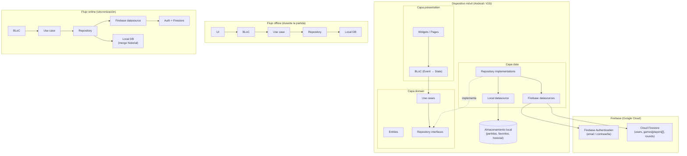
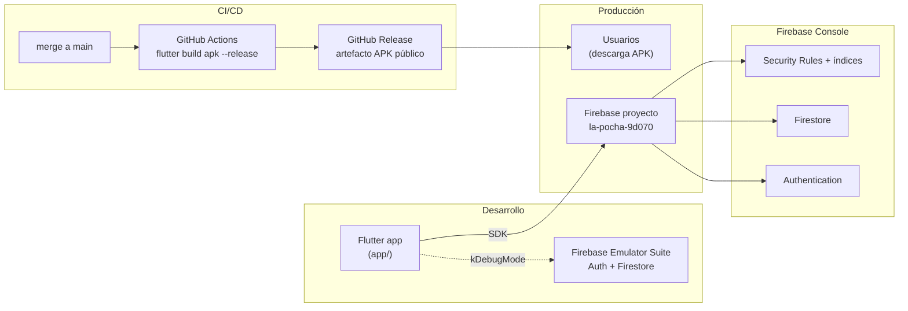
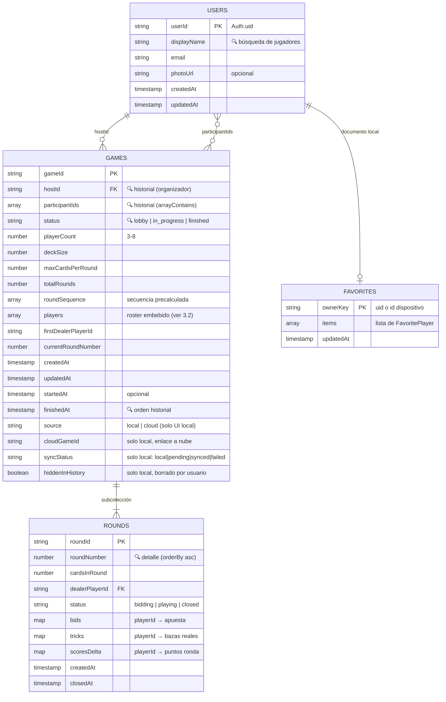

## Índice

0. [Ficha del proyecto](#0-ficha-del-proyecto)
1. [Descripción general del producto](#1-descripción-general-del-producto)
2. [Arquitectura del sistema](#2-arquitectura-del-sistema)
3. [Modelo de datos](#3-modelo-de-datos)
4. [Especificación de la API](#4-especificación-de-la-api)
5. [Historias de usuario](#5-historias-de-usuario)
6. [Tickets de trabajo](#6-tickets-de-trabajo)
7. [Pull requests](#7-pull-requests)

---

## 0. Ficha del proyecto

### **0.1. Tu nombre completo:**
  Juan Miguel Grau Sánchez

### **0.2. Nombre del proyecto:**
La Pocha Tracker

### **0.3. Descripción breve del proyecto:**
App móvil Flutter para llevar el marcador del juego de cartas español La Pocha. 
Gestiona la secuencia de rondas, calcula puntos automáticamente y valida la restricción del repartidor. 
Funciona offline y permite sincronizar el historial de partidas en la nube entre jugadores registrados.

### **0.4. URL del proyecto:**

> Puede ser pública o privada, en cuyo caso deberás compartir los accesos de manera segura. Puedes enviarlos a [alvaro@lidr.co](mailto:alvaro@lidr.co) usando algún servicio como [onetimesecret](https://onetimesecret.com/).

### 0.5. URL o archivo comprimido del repositorio

<https://github.com/juanmigrau/AI4Devs-finalproject/tree/finalproject-entrega1-JMGS>


---

## 1. Descripción general del producto

**La Pocha** es una aplicación móvil (Flutter, Android e iOS) que digitaliza el marcador del juego de cartas español homónimo. Sustituye el papel y el lápiz por un flujo guiado que calcula puntos automáticamente, valida la restricción del repartidor y conserva un historial consultable. El problema que aborda es doble: llevar la puntuación a mano es lento y propenso a errores de cálculo, y al terminar la partida no queda un registro fiable de cómo evolucionó. La app mantiene la agilidad del juego físico mientras centraliza el estado de la partida en un único dispositivo.

### Propuesta de valor principal

- **Para el organizador:** elimina el cálculo manual de puntos y valida la restricción del repartidor en tiempo real, reduciendo conflictos y errores.
- **Para todos los jugadores:** el estado de la partida (apuestas, bazas disponibles, ranking) es visible y legible sin interpretar un papel lleno de tachones.
- **Para jugadores registrados:** historial de partidas compartido automáticamente en la nube entre participantes, sin pasos adicionales al finalizar.

### **1.1. Objetivo**

Digitalizar la experiencia de marcador de La Pocha para grupos de 3 a 8 jugadores que se reúnen de forma habitual u ocasional. El MVP prioriza velocidad de uso durante la partida (offline en el dispositivo host), corrección de errores en la ronda actual y sincronización opcional vía Firebase al cerrar la partida.

### **1.2. Características y funcionalidades principales (MVP)**

- Creación y configuración de partida (3–8 jugadores, cartas y secuencia de rondas automáticas).
- Flujo completo de ronda: apuestas rotativas → juego → bazas reales → cálculo de puntos y ranking.
- Validación en tiempo real de la restricción del repartidor; bloqueo si las apuestas son inválidas.
- Corrección de datos en la ronda actual y opción de repetir ronda completa.
- Jugadores por nombre libre, búsqueda de usuarios registrados y lista de favoritos local.
- Historial unificado (local y nube) con detalle ronda a ronda y función «repetir partida».
- Registro opcional (email/contraseña); subida automática al finalizar y distribución a participantes registrados.

### Flujo E2E prioritario

El organizador crea una partida nueva, define jugadores (nombre libre y/o usuarios registrados) y designa el primer repartidor. La app genera la secuencia de rondas; en cada una recoge apuestas en orden (repartidor al final), muestra bazas disponibles y número prohibido, y tras el juego físico registra las bazas reales para calcular el resultado. Al terminar la última ronda se muestra el ranking final; si el organizador tiene cuenta, la partida se sube a la nube y los jugadores registrados la ven en su historial sin acción adicional.

### **1.3. Diseño y experiencia de usuario:**

> Proporciona imágenes y/o videotutorial mostrando la experiencia del usuario desde que aterriza en la aplicación, pasando por todas las funcionalidades principales.

### **1.4. Instrucciones de instalación:**
> Documenta de manera precisa las instrucciones para instalar y poner en marcha el proyecto en local (librerías, backend, frontend, servidor, base de datos, migraciones y semillas de datos, etc.)

---

## 2. Arquitectura del Sistema

### **2.1. Diagrama de arquitectura**

La aplicación sigue **Clean Architecture** con gestión de estado mediante el patrón **BLoC** (`flutter_bloc`). Un único dispositivo actúa como host durante la partida; todo el marcador funciona offline y la conectividad solo interviene al sincronizar con la nube (registro, login y subida de partidas finalizadas).


```mermaid
flowchart TB
    subgraph device["Dispositivo móvil (Android / iOS)"]
        subgraph presentation["Capa presentation"]
            UI["Widgets / Pages"]
            BLoC["BLoC (Event → State)"]
        end

        subgraph domain["Capa domain"]
            UC["Use cases"]
            ENT["Entities"]
            REPO_IF["Repository interfaces"]
        end

        subgraph data["Capa data"]
            REPO_IMPL["Repository implementations"]
            LOCAL_DS["Local datasource"]
            FIRE_DS["Firebase datasources"]
        end

        LOCAL_DB[("Almacenamiento local\n(partidas, favoritos, historial)")]

        UI --> BLoC
        BLoC --> UC
        UC --> REPO_IF
        REPO_IMPL -. implementa .-> REPO_IF
        REPO_IMPL --> LOCAL_DS
        REPO_IMPL --> FIRE_DS
        LOCAL_DS --> LOCAL_DB
    end

    subgraph firebase["Firebase (Google Cloud)"]
        AUTH["Firebase Authentication\n(email / contraseña)"]
        FS["Cloud Firestore\n(users, games[players[]], rounds)"]
    end

    FIRE_DS --> AUTH
    FIRE_DS --> FS

    subgraph offline["Flujo offline (durante la partida)"]
        direction LR
        O1["UI"] --> O2["BLoC"] --> O3["Use case"] --> O4["Repository"] --> O5["Local DB"]
    end

    subgraph online["Flujo online (sincronización)"]
        direction LR
        N1["BLoC"] --> N2["Use case"] --> N3["Repository"] --> N4["Firebase datasource"]
        N4 --> N5["Auth + Firestore"]
        N3 --> N6["Local DB\n(merge historial)"]
    end
```

**Escenario offline.** El organizador crea y juega la partida completa sin conexión. Los eventos de la UI llegan al BLoC, que delega en use cases de dominio (cálculo de rondas, validación del repartidor, puntuaciones). Los repositorios persisten y leen exclusivamente del almacenamiento local: partida en curso, favoritos e historial propio.

**Escenario online.** Con conectividad y usuario autenticado, al finalizar la partida el repositorio escribe en Firestore el documento `games/{gameId}` (con el roster `players[]` embebido) y la subcolección `rounds`, y actualiza el historial local. El login y la búsqueda de usuarios registrados pasan por Firebase Authentication y la colección `users`. Los participantes registrados reciben la partida en su historial mediante lecturas de Firestore gobernadas por Security Rules.

**Por qué Clean Architecture.** Separa la lógica de negocio (dominio puro: secuencia de rondas, restricción del repartidor, cálculo de puntos) de Flutter y de Firebase. La capa `presentation` no importa SDKs de Firebase; los cambios en Firestore o en la persistencia local no obligan a reescribir widgets ni BLoCs. Facilita el TDD sobre use cases y repositorios mockeados.

**Por qué BLoC.** Modela flujos con muchos estados intermedios (apuestas rotativas, validación en tiempo real, correcciones en ronda actual) de forma predecible: eventos inmutables, estados explícitos y pruebas con `bloc_test`. `BlocListener` concentra efectos secundarios (navegación, mensajes) y `BlocBuilder` limita los rebuilds de la UI.

**Beneficios.** Testabilidad por capas, soporte offline-first alineado con el PRD, y contrato de datos documentado en `firebase-data-access.yml` sin capa REST intermedia.

**Sacrificios.** Más carpetas y archivos por feature que en un enfoque monolítico; curva de aprendizaje de BLoC frente a `setState`; la sincronización local↔nube exige diseño explícito en la capa `data` (no hay backend propio que lo resuelva).

### **2.2. Descripción de componentes principales**

| Componente | Tecnología | Responsabilidad |
|------------|------------|-----------------|
| **App Flutter** | Flutter (Dart ^3.12), Material/Cupertino | Cliente único para Android e iOS; host de la partida en un solo dispositivo. |
| **Presentation** | `flutter_bloc`, `equatable`, widgets Flutter | Pantallas, componentes reutilizables, BLoCs (`*Event`, `*State`), navegación (`go_router` cuando aplique). |
| **Domain** | Dart puro | Entidades (`Game`, `Round`, `Player`, `User`), use cases (`CreateGame`, `SubmitBids`, `SyncFinishedGame`…), interfaces de repositorio. Sin dependencias de Flutter ni Firebase. |
| **Data — local** | Datasource + local storage (technology to be confirmed in Entrega 2) | Partidas en curso, historial local, favoritos; fuente de verdad durante el juego offline. |
| **Data — remota** | FlutterFire: `firebase_core`, `cloud_firestore`, `firebase_auth` | Autenticación, perfiles `users/{uid}`, partidas `games/{gameId}` con roster `players[]` embebido y subcolección `rounds`. |
| **Repositorios** | Implementaciones en `data/repositories/` | Orquestan local y remoto: leen/escriben local siempre; suben a Firestore al cerrar partida si hay sesión; mapean DTOs ↔ entidades de dominio. |
| **Firebase Authentication** | Email y contraseña | Registro opcional, login, `authStateChanges` para guards de navegación y subida automática al finalizar. |
| **Cloud Firestore** | Base de datos documental | Persistencia en nube e historial compartido entre jugadores registrados vinculados a la partida. |
| **Firebase CLI / FlutterFire** | `firebase-tools`, `flutterfire configure` | Proyecto `la-pocha-9d070`, `firebase_options.dart`, despliegue de reglas e índices. |
| **Inyección de dependencias** | Constructor / `get_it` o `Provider` en raíz | BLoCs reciben use cases; use cases reciben interfaces de repositorio; no se inyectan datasources en presentation. |

### **2.3. Descripción de alto nivel del proyecto y estructura de ficheros**

El código de la app vive en `app/`. Bajo `lib/` cada **feature** agrupa las tres capas de Clean Architecture; la carpeta `core/` concentra elementos transversales.

```text
app/lib/
├── main.dart                 # Punto de entrada, Firebase init, DI raíz
├── firebase_options.dart     # Config generada por FlutterFire (no editar a mano)
├── core/
│   ├── router/               # go_router, rutas y guards de auth
│   ├── theme/                # Tema claro/oscuro, tokens visuales
│   ├── di/                   # Registro de dependencias (get_it)
│   ├── error/                # Failures y mapeo de excepciones
│   └── utils/                # Helpers puros compartidos
└── features/
    ├── auth/
    │   ├── presentation/       # LoginPage, RegisterPage, AuthBloc
    │   ├── domain/           # AuthRepository (abstract), SignIn, SignUp…
    │   └── data/             # AuthFirestoreDatasource, AuthRepositoryImpl
    ├── game/
    │   ├── presentation/     # Flujo de partida y rondas, GameBloc, RoundBloc
    │   ├── domain/           # Entidades Game/Round, use cases de marcador
    │   └── data/             # local storage (Entrega 2) + Firestore datasources, mappers
    ├── players/
    │   ├── presentation/     # Selección de jugadores, favoritos
    │   ├── domain/
    │   └── data/
    ├── history/
    │   ├── presentation/     # Lista unificada local/nube, detalle, repetir partida
    │   ├── domain/
    │   └── data/
    └── favorites/
        ├── presentation/
        ├── domain/           # Solo persistencia local (PRD)
        └── data/
```

| Carpeta | Descripción |
|---------|-------------|
| `core/` | Infraestructura compartida: routing, tema, DI y errores; sin lógica de negocio de features. |
| `features/<feature>/presentation/` | UI y BLoC; escucha use cases vía eventos; no importa `cloud_firestore` ni `firebase_auth`. |
| `features/<feature>/domain/` | Reglas de negocio y contratos; testeable sin emulador ni dispositivo. |
| `features/<feature>/data/` | Única capa con SDK Firebase y acceso a local storage (technology to be confirmed in Entrega 2); modelos DTO y mappers. |

Convención de nombres: `game_bloc.dart`, `game_event.dart`, `game_state.dart`, `game_repository.dart` (interfaz en domain, impl en data).

### **2.4. Infraestructura y despliegue**


```mermaid
flowchart LR
    subgraph dev["Desarrollo"]
        DEV_APP["Flutter app\n(app/)"]
        EMU["Firebase Emulator Suite\nAuth + Firestore"]
        DEV_APP -.->|kDebugMode| EMU
    end

    subgraph ci["CI/CD"]
        MAIN["merge a main"]
        GHA["GitHub Actions\nflutter build apk --release"]
        RELEASE["GitHub Release\nartefacto APK público"]
        MAIN --> GHA --> RELEASE
    end

    subgraph prod["Producción"]
        FB_PROD["Firebase proyecto\nla-pocha-9d070"]
        USERS["Usuarios\n(descarga APK)"]
        RELEASE --> USERS
        DEV_APP -->|SDK| FB_PROD
    end

    subgraph fb_console["Firebase Console"]
        AUTH_P["Authentication"]
        FS_P["Firestore"]
        RULES["Security Rules + índices"]
    end

    FB_PROD --> AUTH_P
    FB_PROD --> FS_P
    FB_PROD --> RULES
```

**Infraestructura Firebase**

- **Proyecto:** `la-pocha-9d070` (Android, iOS y web registrados en consola).
- **Authentication:** proveedor email/contraseña para registro opcional.
- **Firestore:** colecciones `users`, `games` (roster `players[]` embebido en el documento) y subcolección `rounds` bajo cada partida (ver §3 y `ai-specs/specs/data-model.md`).
- **Configuración en repo:** `app/firebase.json`, `.firebaserc`, `firestore.rules`, `firestore.indexes.json` (reglas e índices se despliegan con Firebase CLI).
- **Emuladores:** desarrollo local con `firebase emulators:start --only auth,firestore` para no escribir en producción.

**Despliegue de la app Flutter**

La distribución del MVP es un **APK de release** publicado en **GitHub Releases**, no en tiendas de aplicaciones.

1. **Preparación local (desarrollo):** `cd app && flutter pub get`; `flutterfire configure` si cambia el proyecto Firebase; `flutter analyze` y `flutter test`.
2. **CI/CD:** al hacer **merge a `main`**, un workflow de **GitHub Actions** ejecuta `flutter build apk --release` y sube el APK como artefacto de un **GitHub Release** con URL pública de descarga.
3. **Instalación:** los usuarios descargan el APK desde la página de Releases del repositorio e instalan la app en Android (habilitando «orígenes desconocidos» si el dispositivo lo requiere).
4. **Firebase backend:** `firebase deploy --only firestore:rules,firestore:indexes` tras cambios de esquema o permisos (manual o pipeline acordado por el equipo).

No hay servidor Node/Express ni base de datos relacional: el backend es Firebase gestionado.

### **2.5. Seguridad**

| Área | Práctica |
|------|----------|
| **Firebase Authentication** | Identidad centralizada; `userId == Auth.uid` en perfiles Firestore; cierre de sesión y refresco de token en capa `data`, no solo en UI. |
| **Firestore Security Rules** | Fuente de verdad de permisos: lectura/escritura según `request.auth.uid`, rol de host (`hostId`) y pertenencia (`participantIds`) en `games`, más acceso a la subcolección `rounds`. Las reglas se versionan en `firestore.rules` y se prueban con el emulador de reglas. |
| **Capa presentation** | No se confía en ocultar botones como única protección; toda operación sensible debe fallar en servidor si las reglas lo impiden. |
| **Datos locales** | Partidas y favoritos en almacenamiento del dispositivo (sandbox de la app). Sin credenciales de Firebase embebidas más allá de `firebase_options.dart` (config pública de cliente). |
| **Secretos** | No commitear cuentas de servicio ni claves privadas; `flutterfire configure` para opciones por plataforma; archivos sensibles (`firebase_options.dart`, keystores) según `.gitignore` y política del equipo. |
| **Transporte** | TLS gestionado por los SDK de Firebase; sin API REST propia que mantener. |
| **Tests** | Tests automatizados contra emuladores, nunca contra producción con datos reales de usuarios. |

Ejemplo de intención de regla (ilustrativo): solo el host autenticado puede crear `games/{gameId}` con `hostId == request.auth.uid`; un jugador registrado solo lee partidas donde su `uid` figura en `participantIds` o coincide con `hostId` (derivado del array embebido `players[]` al subir).

### **2.6. Tests**

Estrategia alineada con TDD y `mobile-standards.mdc`:

| Nivel | Qué se prueba | Herramientas | Ejemplos en La Pocha |
|-------|----------------|--------------|----------------------|
| **Unitarios (domain)** | Lógica pura sin I/O | `flutter test`, `package:test` | Secuencia de rondas (ascenso, plateau, descenso); cálculo de puntos; validación de restricción del repartidor; generación de bazas disponibles. |
| **Unitarios (data)** | Mappers y repositorios con datasources mockeados | `mockito` / `mocktail`, `fake_cloud_firestore` | `GameRepositoryImpl` persiste local y delega subida a Firestore; mapeo `Game` ↔ documento Firestore. |
| **Integración (BLoC + repository)** | Flujo evento → estado con dependencias dobladas | `bloc_test` | `GameBloc`: cerrar apuestas bloqueadas si viola restricción; `HistoryBloc`: fusionar listado local y nube. |
| **Widget** | Renderizado e interacción aislada | `flutter_test`, `pumpWidget` | Formulario de apuestas, indicador de bazas restantes, lista de historial con icono local/nube. |
| **E2E (flujo principal)** | Camino completo del PRD | `integration_test/`, emuladores Firebase | Organizador crea partida de 4 jugadores → 22 rondas con puntuaciones correctas → resultado final → subida a Firestore si hay cuenta → jugador vinculado ve historial. |

**Comandos habituales**

```bash
cd app
flutter test                    # unitarios + widget + bloc_test
flutter test integration_test/  # E2E (Auth/Firestore en emulador)
flutter analyze
```

Los BLoCs se prueban con use cases mockeados, no con Firebase real. Los flujos E2E que tocan Auth o Firestore usan **Firebase Emulator Suite** en `kDebugMode`.

---

## 3. Modelo de Datos

El modelo sigue un enfoque **offline-first**: toda partida, ronda y favorito existe primero en el almacenamiento local del dispositivo; Firestore solo recibe copias de partidas **finalizadas** cuando el organizador tiene sesión y conectividad. El esquema local **replica** la estructura de Firestore para simplificar mapeos en la capa `data`. El roster de jugadores se modela como array **`players[]` embebido** en el documento `games` (no hay subcolección `players`).

**Convención de consultas:** en el diagrama y las tablas, los campos marcados con **🔍** se usan en filtros u ordenación (historial por usuario, detalle de partida).

### **3.1. Diagrama del modelo de datos:**


```mermaid
erDiagram
    USERS ||--o{ GAMES : "hostId"
    USERS }o--o{ GAMES : "participantIds"
    GAMES ||--|{ ROUNDS : "subcolección"
    USERS ||--o| FAVORITES : "documento local"

    USERS {
        string userId PK "Auth.uid"
        string displayName "🔍 búsqueda de jugadores"
        string email
        string photoUrl "opcional"
        timestamp createdAt
        timestamp updatedAt
    }

    GAMES {
        string gameId PK
        string hostId FK "🔍 historial (organizador)"
        array participantIds "🔍 historial (arrayContains)"
        string status "🔍 lobby | in_progress | finished"
        number playerCount "3-8"
        number deckSize
        number maxCardsPerRound
        number totalRounds
        array roundSequence "secuencia precalculada"
        array players "roster embebido (ver 3.2)"
        string firstDealerPlayerId
        number currentRoundNumber
        timestamp createdAt
        timestamp updatedAt
        timestamp startedAt "opcional"
        timestamp finishedAt "🔍 orden historial"
        string source "local | cloud (solo UI local)"
        string cloudGameId "solo local, enlace a nube"
        string syncStatus "solo local: local|pending|synced|failed"
        boolean hiddenInHistory "solo local, borrado por usuario"
    }

    ROUNDS {
        string roundId PK
        number roundNumber "🔍 detalle (orderBy asc)"
        number cardsInRound
        string dealerPlayerId FK
        string status "bidding | playing | closed"
        map bids "playerId → apuesta"
        map tricks "playerId → bazas reales"
        map scoresDelta "playerId → puntos ronda"
        timestamp createdAt
        timestamp closedAt
    }

    FAVORITES {
        string ownerKey PK "uid o id dispositivo"
        array items "lista de FavoritePlayer"
        timestamp updatedAt
    }
```

**Rutas Firestore (nube):** `users/{userId}`, `games/{gameId}`, `games/{gameId}/rounds/{roundId}`.

**Rutas locales (dispositivo):** mismas entidades `games` y `rounds` (anidadas o por `gameId`), más `favorites/{ownerKey}`. La colección `users` en local solo cachea perfiles consultados para búsqueda; el perfil canónico del usuario autenticado vive en Firestore.

**Estructura embebida `players[]` dentro de `games`:**

| Campo | Tipo | Descripción |
|-------|------|-------------|
| `id` | string | Identificador del jugador en la partida (`playerId`) |
| `displayName` | string | Nombre visible en mesa |
| `userId` | string? | `null` si es invitado; `users/{uid}` si está registrado |
| `isGuest` | boolean | `true` si se añadió por nombre libre |
| `seatOrder` | number | Orden en mesa (0…n−1) |
| `totalScore` | number | Puntuación acumulada al cierre de la partida |
| `joinedAt` | timestamp | Alta en el roster |

**Estructura embebida `items[]` dentro de `favorites`:**

| Campo | Tipo | Descripción |
|-------|------|-------------|
| `id` | string | UUID del favorito |
| `displayName` | string | Nombre para reutilizar en futuras partidas |
| `userId` | string? | Opcional, si el favorito es usuario registrado |
| `createdAt` | timestamp | Fecha de alta en favoritos |

### **3.2. Descripción de entidades principales:**

#### `users` — Perfiles de usuario registrado

**Ruta Firestore:** `users/{userId}` · **ID de documento:** `userId == Firebase Auth uid`.

| Campo | Tipo | Descripción |
|-------|------|-------------|
| `displayName` | string | Nombre visible al buscar jugadores registrados en una partida |
| `email` | string | Email de la cuenta (reflejo del proveedor Auth) |
| `photoUrl` | string? | URL de avatar opcional |
| `createdAt` | timestamp | Alta del perfil en Firestore |
| `updatedAt` | timestamp | Última actualización del perfil |

**Relaciones:**

- **1:N** con `games` como anfitrión (`games.hostId`).
- **N:M** lógica con `games` vía `games.participantIds` cuando el usuario participa como jugador registrado.
- **1:1** local con `favorites/{ownerKey}` cuando `ownerKey == userId`.

**Restricciones y validación:**

- Solo el propio `userId` autenticado puede crear o actualizar su documento (Security Rules).
- `displayName` obligatorio y no vacío.
- Un documento por usuario autenticado.

**Índices y consultas (🔍):**

| Campo(s) | Uso |
|----------|-----|
| `displayName` | Búsqueda de usuarios registrados al añadir jugadores (prefijo o filtro en cliente; índice simple si se usa `where` + `orderBy`) |

---

#### `games` — Sesiones de partida (local y nube)

**Ruta Firestore:** `games/{gameId}` · **Ruta local:** documento equivalente en almacenamiento del dispositivo.

Representa una partida completa: configuración, roster embebido, estado y metadatos de sincronización. Las partidas en curso y el historial local existen **siempre** en el dispositivo antes de cualquier escritura en Firestore.

| Campo | Tipo | Descripción |
|-------|------|-------------|
| `hostId` | string? | 🔍 `userId` del organizador que creó la partida; `null` en partidas locales sin cuenta |
| `participantIds` | array\<string\> | 🔍 IDs de usuarios **registrados** que participan; se rellena al subir a Firestore para consultas de historial compartido (`arrayContains`) |
| `status` | string | 🔍 `lobby`, `in_progress`, `finished` |
| `playerCount` | number | Número de jugadores configurado (3–8, según PRD) |
| `deckSize` | number | Cartas del mazo (30, 40, 48 o 49 según jugadores) |
| `maxCardsPerRound` | number | Máximo de cartas por ronda (M del PRD) |
| `totalRounds` | number | Total de rondas de la secuencia (p. ej. 22 con 4 jugadores) |
| `roundSequence` | array\<number\> | Secuencia precalculada (ascenso, plateau, descenso) |
| `players` | array\<map\> | Roster embebido; ver tabla en §3.1 |
| `firstDealerPlayerId` | string | `playerId` del primer repartidor |
| `currentRoundNumber` | number | Ronda activa durante `in_progress` |
| `createdAt` | timestamp | Creación de la partida |
| `updatedAt` | timestamp | Última modificación |
| `startedAt` | timestamp? | Paso de `lobby` a `in_progress` |
| `finishedAt` | timestamp? | 🔍 Cierre de la última ronda; orden del historial |
| `source` | string | Solo local: `local` o `cloud` (icono en listado unificado) |
| `cloudGameId` | string? | Solo local: ID del documento en Firestore tras subida exitosa |
| `syncStatus` | string? | Solo local: `local`, `pending`, `synced`, `failed` |
| `hiddenInHistory` | boolean | Solo local: `true` si el usuario eliminó la partida de **su** historial |

**Relaciones:**

- **N:1** → `users` vía `hostId` (organizador).
- **N:M** → `users` vía `participantIds` (jugadores registrados vinculados).
- **1:N** → subcolección `rounds` (detalle ronda a ronda; no array embebido).
- Cada elemento de `players[]` puede referenciar opcionalmente `users/{userId}`.

**Restricciones y validación:**

- `playerCount` entre 3 y 8 (MVP).
- `players.length` debe coincidir con `playerCount` antes de iniciar la partida.
- Sin `userId` duplicado dentro del mismo `players[]`.
- `roundSequence` generada automáticamente según reglas del PRD (patrón ascendente, plateau de M cartas durante `playerCount` rondas, descenso).
- Solo partidas con `status == finished` aparecen en el historial.
- **Borrado por usuario:** en local se marca `hiddenInHistory: true` o se elimina el documento local; en nube **no** se borra el documento para otros participantes (PRD: eliminación solo del historial propio).
- Al subir a Firestore: `hostId == Auth.uid`, `participantIds` calculado desde `players[].userId` no nulos.

**Índices y consultas (🔍):**

| Colección | Campo(s) | Uso |
|-----------|----------|-----|
| `games` | `hostId` + `finishedAt` desc | Historial del organizador |
| `games` | `participantIds` `array-contains` + `finishedAt` desc | Historial del participante registrado |
| `games` | `status` + `finishedAt` desc | Filtrar partidas finalizadas |
| `games` | `gameId` (documento) | Detalle de partida |

---

#### `games/{gameId}/rounds` — Detalle de cada ronda

**Ruta:** subcolección bajo el documento padre `games/{gameId}` (Firestore y local).

Cada ronda almacena apuestas, bazas reales y puntuación parcial. **No** se modela como array dentro de `games` para permitir consultas ordenadas y escrituras granulares durante la partida.

| Campo | Tipo | Descripción |
|-------|------|-------------|
| `roundNumber` | number | 🔍 Orden secuencial (1…`totalRounds`); clave de ordenación en detalle |
| `cardsInRound` | number | Cartas repartidas en esta ronda (valor de `roundSequence`) |
| `dealerPlayerId` | string | `playerId` del repartidor de la ronda |
| `status` | string | `bidding`, `playing`, `closed` |
| `bids` | map\<string, number\> | Apuesta por jugador (`playerId` → bazas apostadas) |
| `tricks` | map\<string, number\> | Bazas reales por jugador tras el juego físico |
| `scoresDelta` | map\<string, number\> | Puntos ganados o perdidos en la ronda por jugador |
| `createdAt` | timestamp | Apertura de la ronda |
| `closedAt` | timestamp? | Cierre tras calcular `scoresDelta` |

**Relaciones:**

- **N:1** → documento padre `games/{gameId}`.
- `dealerPlayerId`, claves de `bids`, `tricks` y `scoresDelta` referencian `players[].id` del juego padre.

**Restricciones y validación:**

- `roundNumber` único por partida.
- Suma de `bids` debe igualar `cardsInRound` al cerrar apuestas.
- Restricción del repartidor: la apuesta del repartidor no puede hacer que la suma de apuestas iguale `cardsInRound` (validación en dominio antes de cerrar).
- Correcciones solo en la ronda con `status != closed` o en la ronda actual según PRD.
- Al cerrar ronda: actualizar `players[].totalScore` en el documento padre `games`.

**Índices y consultas (🔍):**

| Colección | Campo(s) | Uso |
|-----------|----------|-----|
| `games/{gameId}/rounds` | `roundNumber` asc | Detalle de partida ronda a ronda |
| `games/{gameId}/rounds` | `roundId` (documento) | Lectura de ronda concreta |

---

#### `favorites` — Jugadores favoritos (solo local)

**Ruta local:** `favorites/{ownerKey}` · **Firestore:** no se sincroniza en el MVP (PRD: lista de favoritos almacenada en local).

Un **documento por usuario** (o por identidad de dispositivo si no hay cuenta). Contiene la lista completa de jugadores frecuentes para reutilizar al crear partidas.

| Campo | Tipo | Descripción |
|-------|------|-------------|
| `ownerKey` | string | PK: `Auth.uid` si hay sesión; identificador de dispositivo si es invitado |
| `items` | array\<map\> | Lista de favoritos; ver estructura en §3.1 |
| `updatedAt` | timestamp | Última modificación de la lista |

**Relaciones:**

- **N:1** lógica → `users` cuando `ownerKey` coincide con `userId` autenticado.
- Cada `items[].userId` opcional referencia `users/{userId}` para pre-rellenar jugadores registrados.

**Restricciones y validación:**

- Sin duplicados: mismo `userId` o mismo `displayName` (insensible a mayúsculas) no puede repetirse en `items`.
- CRUD completo sin conexión (salvo búsqueda de usuario registrado al añadir).
- Sin límite de favoritos en MVP.

**Índices y consultas:**

- Acceso por clave de documento `ownerKey` (lectura/escritura directa); no requiere índices compuestos en Firestore.

---

#### Resumen de relaciones y principios de diseño

| Principio | Aplicación |
|-----------|------------|
| **Offline-first** | `games`, `rounds` y `favorites` se persisten en local en cuanto se crean; Firestore recibe la partida al finalizar si hay sesión. |
| **Historial compartido** | `participantIds` en `games` permite que jugadores registrados vean partidas sin consultas extra; el roster completo está en `players[]` del mismo documento. |
| **Borrado per-user** | `hiddenInHistory` (local) u ocultación en consulta; el documento en nube permanece para el resto de participantes. |
| **Rondas desacopladas** | Subcolección `rounds`, no array embebido en `games`, para ordenación y tamaño de documento acotado. |
| **IDs estables** | `userId == Auth.uid`; `gameId`, `roundId` y `playerId` generados como UUID en local y reutilizados al subir. |

---

## 4. Especificación de la API

> Si tu backend se comunica a través de API, describe los endpoints principales (máximo 3) en formato OpenAPI. Opcionalmente puedes añadir un ejemplo de petición y de respuesta para mayor claridad

---

## 5. Historias de Usuario

> Documenta 3 de las historias de usuario principales utilizadas durante el desarrollo, teniendo en cuenta las buenas prácticas de producto al respecto.

**Historia de Usuario 1**

**Historia de Usuario 2**

**Historia de Usuario 3**

---

## 6. Tickets de Trabajo

> Documenta 3 de los tickets de trabajo principales del desarrollo, uno de backend, uno de frontend, y uno de bases de datos. Da todo el detalle requerido para desarrollar la tarea de inicio a fin teniendo en cuenta las buenas prácticas al respecto. 

**Ticket 1**

**Ticket 2**

**Ticket 3**

---

## 7. Pull Requests

> Documenta 3 de las Pull Requests realizadas durante la ejecución del proyecto

**Pull Request 1**

**Pull Request 2**

**Pull Request 3**

