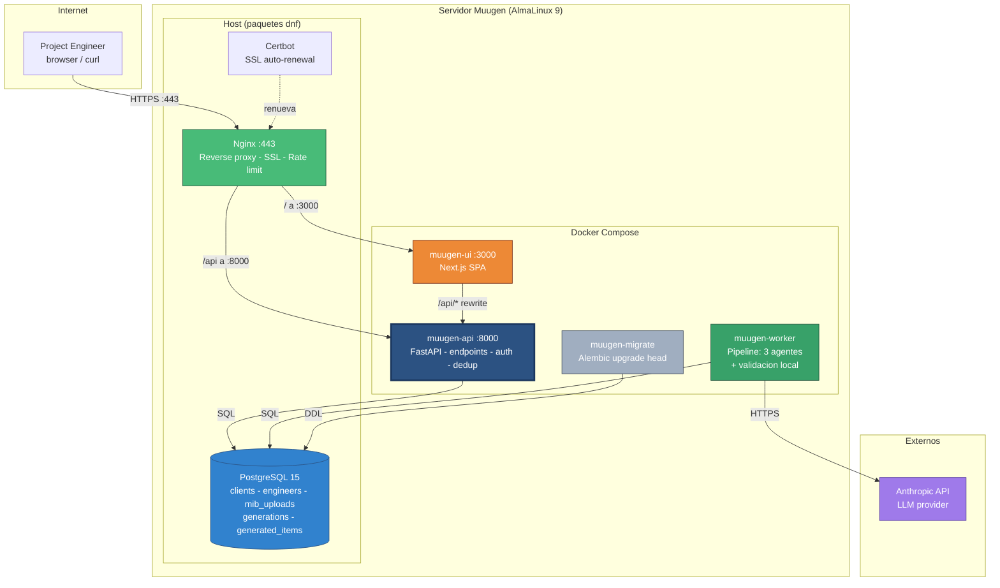
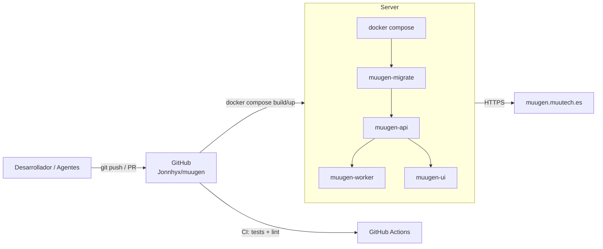
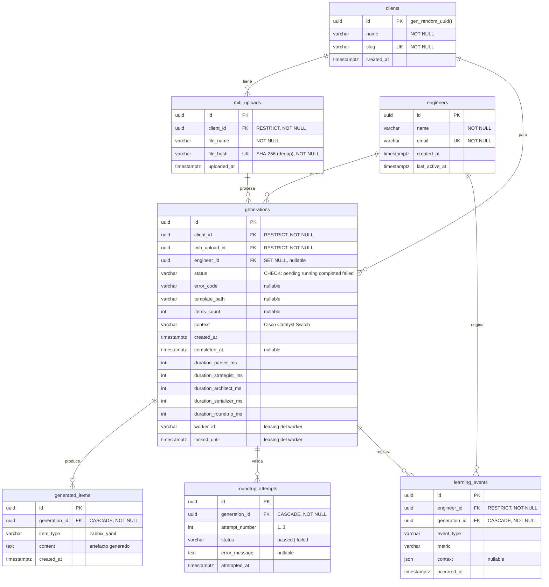
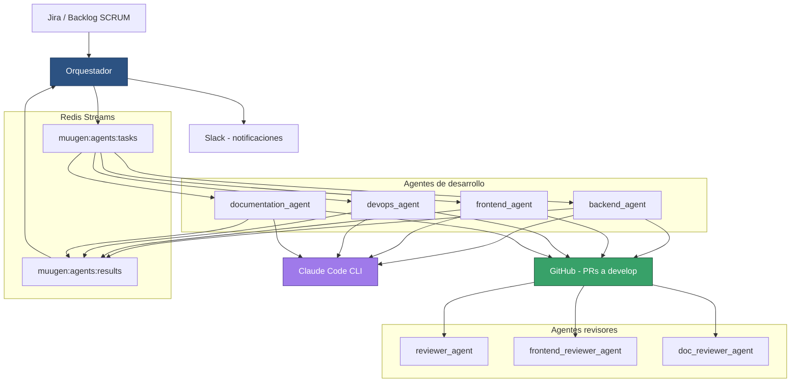

## Índice

0. [Ficha del proyecto](#0-ficha-del-proyecto)
1. [Descripción general del producto](#1-descripción-general-del-producto)
2. [Arquitectura del sistema](#2-arquitectura-del-sistema)
3. [Modelo de datos](#3-modelo-de-datos)
4. [Especificación de la API](#4-especificación-de-la-api)
5. [Historias de usuario](#5-historias-de-usuario)
6. [Tickets de trabajo](#6-tickets-de-trabajo)
7. [Pull requests](#7-pull-requests)
8. [Anexo: Metodología de desarrollo asistido por IA](#anexo-metodología-de-desarrollo-asistido-por-ia)

---

## 0. Ficha del proyecto

### 0.1. Tu nombre completo:
Jonatan Pérez Rodríguez

### 0.2. Nombre del proyecto:
Muugen

### 0.3. Descripción breve del proyecto:
Muugen es un generador automático de plantillas de monitorización para Zabbix 6 a partir de ficheros MIB (SNMP). El usuario sube un MIB y un contexto de dispositivo (p. ej. "Cisco Catalyst Switch") y el sistema, mediante un pipeline de IA multi-agente, devuelve una plantilla YAML lista para importar en Zabbix. Automatiza una tarea que los ingenieros de monitorización realizan hoy manualmente y que consume horas por dispositivo.

### 0.4. URL del proyecto:
https://muugen.muutech.es

> El acceso requiere autenticación. Se facilitará una credencial temporal de evaluación mediante onetimesecret.

### 0.5. URL o archivo comprimido del repositorio:
La entrega se realiza en este repositorio (plantilla AI4Devs-finalproject). El código fuente del producto reside en: https://github.com/Jonnhyx/muugen

> El desarrollo se realizó mediante un sistema multi-agente autónomo, documentado en el [Anexo](#anexo-metodología-de-desarrollo-asistido-por-ia) y en https://github.com/Jonnhyx/Multi-Agent-AI-Ecosystem

---

## 1. Descripción general del producto

### 1.1. Objetivo

Muugen automatiza la creación de plantillas de monitorización para **Zabbix 6** a partir de ficheros **MIB** (Management Information Base, el catálogo de métricas que expone un dispositivo de red vía SNMP).

**El problema que resuelve:** cuando una empresa de monitorización necesita vigilar un dispositivo nuevo (un switch, un firewall, un SAI…), un ingeniero debe analizar manualmente el fichero MIB del fabricante —que puede contener cientos de OIDs (identificadores de métricas)—, decidir cuáles son relevantes, y crear a mano cada item de monitorización en Zabbix. Este proceso lleva **entre 4 y 6 horas por dispositivo** y requiere conocimiento experto tanto del protocolo SNMP como de las buenas prácticas de monitorización.

**La solución:** el ingeniero sube el MIB e indica el tipo de dispositivo (p. ej. "Cisco Catalyst Switch") y el cliente. Muugen, mediante un pipeline de tres agentes de IA, parsea el MIB, selecciona las métricas relevantes según el tipo de dispositivo, y genera una plantilla **YAML lista para importar en Zabbix** — en unos **2 minutos** en lugar de horas.

**Para quién:** es una herramienta interna B2B para los *Project Engineers* de una empresa de monitorización (Muutech). No la usan los clientes finales; la usan los ingenieros para acelerar su trabajo de configuración.

**Valor cuantificado:** reducción de ~90% del tiempo por dispositivo (de 4-6 h a ~30 min), lo que a escala de 20 clientes × 15 dispositivos supone un ahorro estimado de ~1.350 horas/año.

### 1.2. Características y funcionalidades principales

El flujo E2E del MVP es: **subir MIB → generar plantilla → descargar YAML**. Las funcionalidades que lo soportan:

- **Pipeline de 3 agentes de IA.** Un *Parser* (pysmi) extrae los OIDs del MIB de forma determinista; un *Estratega* selecciona qué métricas son relevantes según el tipo de dispositivo, combinando una base de conocimiento de perfiles con un LLM; y un *Arquitecto Zabbix* mapea las métricas a items y value maps de Zabbix 6. Cada etapa se comunica mediante contratos Pydantic v2 inmutables (`CanonicalOID` → `SelectionReport` → `ZabbixTemplate`), haciendo el pipeline auditable.
- **Base de conocimiento de 15 perfiles de dispositivo** (`profiles.yaml`) — router, switch, firewall, SAI, ATS, PDU, NAS, cabina SAN, balanceador, AP WiFi, cámara IP, sensor ambiental, impresora, servidor y genérico — derivada del catálogo oficial de plantillas de Zabbix. El emparejamiento del contexto usa fuzzy matching (`rapidfuzz`) **y análisis del contenido del MIB** (los nombres de sus OIDs), lo que desambigua casos como "transfer switch" frente al perfil de red `switch`. La selección del estratega está guiada por intención y limitada a 40 items.
- **Procesamiento asíncrono.** `POST /api/generate` responde de inmediato con un `generation_id`; el procesamiento corre en un **worker** dedicado en segundo plano, y el estado (`pending → running → completed/failed`) se consulta por polling (`GET /api/generations/{id}`).
- **Validación local + self-healing.** El YAML se valida contra el esquema de exportación de Zabbix 6 sin necesidad de un Zabbix desplegado; si falla, el LLM corrige los errores hasta 3 intentos.
- **LLM pluggable** con tres backends por configuración (`LLM_PROVIDER`): `anthropic` (producción), `cli` (Claude Code CLI, desarrollo) y `mock` (CI/offline, sin coste).
- **Web UI (Next.js)** de tres pantallas: formulario, progreso en vivo y resultado con descarga.
- **Autenticación en la aplicación:** los navegadores inician sesión (`POST /api/auth/login`) y reciben una cookie de sesión firmada y con expiración (HMAC-SHA256); los clientes API/CLI usan token Bearer. Nginx se limita a TLS, rate limiting y proxy — no almacena secretos.
- **Persistencia y trazabilidad** (PostgreSQL): registro de qué ingeniero generó qué, para qué cliente; detección de MIBs duplicados por hash SHA-256; migraciones gestionadas por un servicio dedicado (Alembic).
- **Resolución de imports cruzados:** el endpoint acepta MIBs acompañantes (`deps`) para resolver dependencias entre MIBs, con un conjunto de MIBs base empaquetado en la imagen.

*Visión futura (no incluida en el MVP):* el roadmap contempla validación round-trip contra un Zabbix real, generación de triggers y reglas de descubrimiento (LLD), dashboards de Grafana, soporte de protocolos industriales OT (Modbus, OPC-UA, S7) vía Node-RED, y auto-despliegue end-to-end.

### 1.3. Diseño y experiencia de usuario

El flujo principal de la aplicación se muestra en el siguiente vídeo:

📹 **Demo del flujo E2E:** https://drive.google.com/file/d/1Iej9XMdK1GQpok03vs-QdDQhmnQYewtr/view

La experiencia del usuario se compone del inicio de sesión y tres pantallas que cubren el flujo completo:

1. **Formulario de generación.** Tras iniciar sesión, el ingeniero aterriza en un formulario donde sube el fichero MIB (arrastrar o seleccionar), indica el tipo de dispositivo en texto libre (p. ej. "Cisco Catalyst Switch"), selecciona o crea el cliente, e indica su nombre de ingeniero. Lanza la generación con un clic.

2. **Pantalla de progreso.** Mientras el pipeline procesa en segundo plano, la UI refleja en vivo las etapas (parser → estratega → arquitecto → serializador → validación), actualizándose por polling cada pocos segundos, con el tiempo transcurrido.

3. **Pantalla de resultado.** Al completarse, muestra el resumen de la generación: cliente, ingeniero, número de items generados y el estado de la validación local. Ofrece descargar el YAML o previsualizarlo.

### 1.4. Instrucciones de instalación

El código fuente reside en https://github.com/Jonnhyx/muugen. El proyecto se compone de un backend (FastAPI, Python 3.11+), un frontend (Next.js, Node ≥24) y una base de datos PostgreSQL 15.

**Opción A — Docker Compose (recomendada para evaluación).** Levanta todo el stack (migraciones, API, worker y UI) con un solo comando:

```bash
git clone https://github.com/Jonnhyx/muugen.git
cd muugen
cp infra/.env.example infra/.env   # rellenar las variables (ver tabla abajo)
docker compose up -d
```

El servicio `muugen-migrate` aplica las migraciones de base de datos (Alembic) automáticamente antes de arrancar el resto; es idempotente. La API queda en `:8000` y la UI en `:3000`.

Para desarrollo sin coste de API, puede arrancarse con `LLM_PROVIDER=mock` (no requiere clave de Anthropic).

**Opción B — Backend en local (desarrollo).**

```bash
cd api
make install          # instala el paquete y dependencias de desarrollo
make test             # ejecuta la suite de tests (umbral de cobertura: 75%)
make lint             # ruff + mypy
alembic upgrade head  # aplica migraciones (requiere PostgreSQL en marcha)
```

**Variables de entorno principales** (copiar `infra/.env.example` a `infra/.env`):

| Variable | Descripción |
|---|---|
| `DATABASE_URL` | URL async de PostgreSQL (SQLAlchemy + asyncpg) |
| `MUUGEN_AUTH_TOKEN` | Token Bearer de la API (`openssl rand -hex 32`) |
| `MUUGEN_SESSION_SECRET` | Secreto de firma de la cookie de sesión (la app no arranca sin él) |
| `ANTHROPIC_API_KEY` | Clave de Anthropic para las llamadas al LLM |
| `LLM_PROVIDER` | `anthropic` (def.), `cli` (dev) o `mock` (CI/offline) |
| `DOMAIN` / `CERTBOT_EMAIL` | Dominio y email para Nginx + Certbot (despliegue) |

El despliegue completo en servidor (AlmaLinux 9, Nginx, Certbot, fail2ban) está documentado en `infra/README.md`, provisionado por el script idempotente `infra/setup-server.sh`.

---

## 2. Arquitectura del Sistema

### 2.1. Diagrama de arquitectura

Muugen sigue una **arquitectura de pipeline multi-agente** sobre un backend de servicios contenerizados. El sistema se organiza en capas desacopladas: una capa de presentación (UI), una capa de API que acepta peticiones y delega el trabajo pesado, un worker que ejecuta el pipeline de generación en segundo plano, y una capa de persistencia. El pipeline en sí sigue un patrón de **agentes encadenados** (Parser → Estratega → Arquitecto) que se comunican mediante contratos inmutables.


```mermaid
graph TB
    subgraph Internet
        Engineer[Project Engineer<br/>browser / curl]
    end

    subgraph "Servidor Muugen (AlmaLinux 9)"
        subgraph "Host (paquetes dnf)"
            Nginx[Nginx :443<br/>Reverse proxy - SSL - Rate limit]
            Postgres[(PostgreSQL 15<br/>clients - engineers - mib_uploads<br/>generations - generated_items)]
            Certbot[Certbot<br/>SSL auto-renewal]
        end

        subgraph "Docker Compose"
            Migrate[muugen-migrate<br/>Alembic upgrade head]
            API[muugen-api :8000<br/>FastAPI - endpoints - auth - dedup]
            Worker[muugen-worker<br/>Pipeline: 3 agentes<br/>+ validacion local]
            UI[muugen-ui :3000<br/>Next.js SPA]
        end
    end

    subgraph "Externos"
        Anthropic[Anthropic API<br/>LLM provider]
    end

    Engineer -->|HTTPS :443| Nginx
    Nginx -->|/ a :3000| UI
    Nginx -->|/api a :8000| API
    UI -->|/api/* rewrite| API
    API -->|SQL| Postgres
    Worker -->|SQL| Postgres
    Worker -->|HTTPS| Anthropic
    Migrate -->|DDL| Postgres
    Certbot -.->|renueva| Nginx

    style API fill:#2c5282,stroke:#1a365d,stroke-width:3px,color:#fff
    style Worker fill:#38a169,stroke:#22543d,color:#fff
    style Nginx fill:#48bb78,stroke:#22543d,color:#fff
    style Postgres fill:#3182ce,stroke:#2c5282,color:#fff
    style UI fill:#ed8936,stroke:#7b341e,color:#fff
    style Migrate fill:#a0aec0,stroke:#4a5568,color:#fff
    style Anthropic fill:#9f7aea,stroke:#553c9a,color:#fff
```

**Patrón arquitectónico:** pipeline de agentes desacoplados sobre servicios contenerizados, con procesamiento asíncrono (la API acepta la petición y responde de inmediato; el worker ejecuta el pipeline en segundo plano y el cliente consulta el estado por polling).

**Por qué esta arquitectura:**
- **Desacoplar API y procesamiento** evita que peticiones de larga duración (el pipeline tarda 60-90 s, con llamadas al LLM y self-healing) bloqueen el servidor web o choquen con timeouts de Nginx/navegador.
- **Pipeline de agentes con contratos Pydantic inmutables** (`CanonicalOID` → `SelectionReport` → `ZabbixTemplate`) hace el flujo auditable y permite testear cada etapa de forma aislada.
- **LLM detrás de una abstracción** (`LLMProvider`) permite cambiar de proveedor sin tocar los agentes — clave para alternar entre Anthropic (producción), CLI (desarrollo) y mock (CI sin coste).
- **Infraestructura base en el host** (Nginx, PostgreSQL, Certbot) y **aplicación en contenedores** separa lo estable de lo desplegable.

**Beneficios:** operación simple (`docker compose up`), capacidad de evolucionar cada componente por separado, y testabilidad alta del núcleo.

**Sacrificios:** el procesamiento en background usa un mecanismo de *leasing* en base de datos (`worker_id`, `locked_until`) para recuperar tareas interrumpidas, pero un único servidor sigue siendo un punto único de fallo (aceptado para el alcance de herramienta interna, mitigado con backups).

### 2.2. Descripción de componentes principales

| Componente | Tecnología | Responsabilidad |
|---|---|---|
| **muugen-ui** | Next.js (Node ≥24) | SPA con login y 3 pantallas (formulario, progreso, resultado); hace proxy de `/api/*` a la API vía rewrites |
| **muugen-api** | Python 3.11 · FastAPI · Pydantic v2 | Endpoints HTTP, autenticación (sesión firmada + Bearer), validación de entrada, upsert de cliente/ingeniero, dedup por hash |
| **muugen-worker** | Python 3.11 | Ejecuta el pipeline de 3 agentes (Parser → Estratega → Arquitecto), serialización YAML y validación local con self-healing; leasing de tareas en BD |
| **muugen-migrate** | Python 3.11 · Alembic | Aplica migraciones de BD de forma idempotente antes de arrancar el resto |
| **Nginx** (host) | Nginx | Reverse proxy, terminación SSL y rate limiting (la autenticación es responsabilidad exclusiva de la aplicación) |
| **PostgreSQL 15** (host) | PostgreSQL | Persistencia: clientes, ingenieros, MIBs, generaciones, items, intentos de validación y eventos de aprendizaje |
| **Certbot** (host) | Certbot / Let's Encrypt | Gestión y renovación automática de certificados SSL |

**Núcleo del pipeline (dentro del worker):**

| Agente / módulo | Tecnología | Función |
|---|---|---|
| **MIB Parser** | pysmi | Parsea el MIB a `List[CanonicalOID]` (OID, sintaxis, acceso, descripción) |
| **Estratega** | KB YAML + `rapidfuzz` + LLM | Empareja el contexto (y el contenido del MIB) con un perfil, y selecciona los OIDs relevantes por intención |
| **Arquitecto Zabbix** | LLM | Mapea los OIDs seleccionados a items y value maps de Zabbix 6 |
| **Serializer** | ruamel.yaml | Convierte el `ZabbixTemplate` a YAML exportable |
| **LocalTemplateValidator** | Validación de esquema + LLM | Valida contra el export de Zabbix 6 y aplica self-healing (3 intentos) |
| **LLMProvider** | Protocol pattern | Abstracción del LLM: `AnthropicProvider`, `CliProvider`, `MockProvider` |

### 2.3. Descripción de alto nivel del proyecto y estructura de ficheros

```text
.
├── api/
│   ├── src/muugen/
│   │   ├── parsers/       # MIB parser (pysmi) -> CanonicalOID[]
│   │   ├── agents/        # Estratega y Arquitecto (lógica de los agentes)
│   │   ├── kb/            # Perfiles de dispositivo (YAML) + matcher
│   │   ├── llm/           # Abstracción LLMProvider (anthropic / cli / mock) + factory
│   │   ├── validators/    # Validación local + self-healing
│   │   ├── serializers/   # Serialización a YAML de Zabbix
│   │   ├── worker/        # Runner del pipeline en background + leasing
│   │   ├── api/           # Routers FastAPI, modelos de respuesta, middleware
│   │   └── models/        # ORM (SQLAlchemy 2.0) y contratos inter-agente
│   ├── tests/             # Suite pytest (unit + integración)
│   ├── alembic/           # 9 migraciones incrementales
│   └── pyproject.toml
├── ui/                    # Frontend Next.js (login + 3 pantallas)
├── infra/                 # Provisión del servidor (AlmaLinux 9)
│   ├── setup-server.sh    # Script de provisión idempotente
│   ├── nginx/             # Config Nginx de producción (SSL, rate limiting)
│   └── postgres/          # SQL de inicialización
├── docs/                  # Documentación: referencia API, tutoriales, desviaciones post-MVP
├── scripts/seed.py        # Semilla de datos de prueba (solo dev)
└── docker-compose.yml     # Orquestación de los 4 servicios
```

**Patrón:** el backend sigue una arquitectura por capas con el pipeline de agentes como núcleo. Cada agente respeta el principio **Open/Closed**: añadir un nuevo parser, arquitecto o proveedor de LLM no modifica el código existente, solo añade una clase que cumple el contrato correspondiente.

### 2.4. Infraestructura y despliegue

La infraestructura combina **paquetes del host** (lo estable: Nginx, PostgreSQL, Certbot, instalados vía `dnf` en AlmaLinux 9) con **servicios contenerizados** (los cuatro servicios Docker). El servidor se provisiona con un script idempotente (`infra/setup-server.sh`) que instala dependencias, configura Nginx con SSL, inicializa PostgreSQL y prepara fail2ban.


```mermaid
graph LR
    Dev[Desarrollador / Agentes] -->|git push / PR| Repo[GitHub<br/>Jonnhyx/muugen]
    Repo -->|CI: tests + lint| CI[GitHub Actions]
    Repo -->|docker compose build/up| Server[Servidor AlmaLinux 9]

    subgraph Server
        Compose[docker compose]
        Compose --> M[muugen-migrate]
        M --> A[muugen-api]
        A --> W[muugen-worker]
        A --> U[muugen-ui]
    end

    Server -->|HTTPS| Public[muugen.muutech.es]
```

**Proceso de despliegue:** las migraciones corren automáticamente vía `muugen-migrate` en cada `docker compose up` (idempotente). El orden de arranque está garantizado por `depends_on` con `condition: service_healthy`. El acceso público se sirve por `muugen.muutech.es` con SSL gestionado por Certbot.

### 2.5. Seguridad

- **Autenticación en la capa de aplicación** (endurecida tras una auditoría de seguridad interna): la aplicación es el único validador de credenciales. Los navegadores se autentican vía `POST /api/auth/login` y reciben una **cookie de sesión firmada** (`HttpOnly`), que porta un token con expiración (~12 h) firmado con HMAC-SHA256 (`MUUGEN_SESSION_SECRET`) — nunca el token de API en crudo. Los clientes API/CLI usan `Authorization: Bearer <token>`.
- **Nginx sin secretos:** el reverse proxy solo termina TLS, aplica rate limiting y hace proxy de `/api/*`. No guarda copia del token (se eliminó el pre-check de Nginx para evitar un segundo secreto que mantener sincronizado).
- **Validación de arranque fail-fast:** la aplicación rehúsa arrancar si `MUUGEN_SESSION_SECRET` no está definido o mantiene el valor placeholder.
- **TLS** con certificados Let's Encrypt (Certbot) y renovación automática.
- **Gestión de secretos por entorno:** ficheros `.env` nunca commiteados; token generado con `openssl rand -hex 32`.
- **Contenedores sin privilegios** (usuario `muugen`, no root) y **fail2ban** en el host.
- **Validación de entrada estricta** con Pydantic (límite de tamaño de MIB, campos obligatorios → `422`).

### 2.6. Tests

El proyecto cuenta con una suite de **pytest** (tests unitarios y de integración) con un umbral de cobertura del **75%** (cobertura real ~85%), ejecutada en CI (GitHub Actions) en cada push. Algunos ejemplos representativos:

- **Tests del parser:** verifican que un MIB de ejemplo se parsea a la lista esperada de `CanonicalOID`, incluyendo la degradación correcta ante imports no resolubles.
- **Tests del estratega:** comprueban el emparejamiento de contexto a perfil y el filtrado de OIDs alucinados (que el agente descarte OIDs que no existen en el MIB — salvaguarda anti-alucinación).
- **Tests del validador local + self-healing:** verifican que un YAML conforme pasa, que uno no conforme dispara el loop de corrección, y que tras agotar los 3 intentos se devuelve el mejor resultado con el estado adecuado.
- **Tests del runner:** ejercitan el flujo del worker de principio a fin con los agentes mockeados, verificando la escritura del YAML y la deduplicación.
- **Tests del CliProvider:** cubren la invocación del CLI, el mapeo de errores (binario ausente, rate-limit, timeout) y la limpieza de la salida.
- **Modo `mock` del LLM:** permite ejecutar la suite y validar el pipeline completo sin coste de API ni red.

*Sobre el test E2E automatizado y el pipeline de CD: ambos se resolverán mediante la integración de Muugen en la plataforma corporativa de pruebas E2E (Cypress) y en los workflows de despliegue de Muutech, evitando duplicar en este repositorio infraestructura que quedaría obsoleta en la integración. La decisión, su justificación y las alternativas están documentadas en [`docs/entrega2-evidencias.md`](docs/entrega2-evidencias.md), §6.*

---

## 3. Modelo de Datos

### 3.1. Diagrama del modelo de datos

El esquema de Muugen se compone de **siete entidades**. Las generaciones son la entidad central: vinculan un cliente, un MIB subido y (opcionalmente) un ingeniero con el resultado de una ejecución del pipeline. Los intentos de validación/self-healing se registran en `roundtrip_attempts`, y `learning_events` captura eventos de retroalimentación para la mejora futura de la base de conocimiento.


```mermaid
erDiagram
    clients ||--o{ mib_uploads : "tiene"
    clients ||--o{ generations : "para"
    engineers ||--o{ generations : "genera"
    engineers ||--o{ learning_events : "origina"
    mib_uploads ||--o{ generations : "procesa"
    generations ||--o{ generated_items : "produce"
    generations ||--o{ roundtrip_attempts : "valida"
    generations ||--o{ learning_events : "registra"

    clients {
        uuid id PK "gen_random_uuid()"
        varchar name "NOT NULL"
        varchar slug UK "NOT NULL"
        timestamptz created_at
    }

    engineers {
        uuid id PK
        varchar name "NOT NULL"
        varchar email UK "NOT NULL"
        timestamptz created_at
        timestamptz last_active_at
    }

    mib_uploads {
        uuid id PK
        uuid client_id FK "RESTRICT, NOT NULL"
        varchar file_name "NOT NULL"
        varchar file_hash UK "SHA-256 (dedup), NOT NULL"
        timestamptz uploaded_at
    }

    generations {
        uuid id PK
        uuid client_id FK "RESTRICT, NOT NULL"
        uuid mib_upload_id FK "RESTRICT, NOT NULL"
        uuid engineer_id FK "SET NULL, nullable"
        varchar status "CHECK: pending running completed failed"
        varchar error_code "nullable"
        varchar template_path "nullable"
        int items_count "nullable"
        varchar context "Cisco Catalyst Switch"
        timestamptz created_at
        timestamptz completed_at "nullable"
        int duration_parser_ms
        int duration_strategist_ms
        int duration_architect_ms
        int duration_serializer_ms
        int duration_roundtrip_ms
        varchar worker_id "leasing del worker"
        timestamptz locked_until "leasing del worker"
    }

    generated_items {
        uuid id PK
        uuid generation_id FK "CASCADE, NOT NULL"
        varchar item_type "zabbix_yaml"
        text content "artefacto generado"
        timestamptz created_at
    }

    roundtrip_attempts {
        uuid id PK
        uuid generation_id FK "CASCADE, NOT NULL"
        int attempt_number "1..3"
        varchar status "passed | failed"
        text error_message "nullable"
        timestamptz attempted_at
    }

    learning_events {
        uuid id PK
        uuid engineer_id FK "RESTRICT, NOT NULL"
        uuid generation_id FK "CASCADE, NOT NULL"
        varchar event_type
        varchar metric
        json context "nullable"
        timestamptz occurred_at
    }
```

### 3.2. Descripción de entidades principales

**`clients`** — Clientes de Muutech para los que se generan templates.
- `id` (UUID, PK, generado con `gen_random_uuid()`)
- `name` (varchar 255, NOT NULL) — nombre legible, p. ej. "Acme Corp"
- `slug` (varchar 255, **UNIQUE**, NOT NULL) — identificador URL-safe usado como clave de negocio
- `created_at` (timestamptz, NOT NULL)
- *Alta implícita:* se crea por upsert al usarse en `POST /api/generate`; no hay endpoint de creación explícita.

**`engineers`** — Ingenieros que usan la herramienta (trazabilidad).
- `id` (UUID, PK) · `name` (varchar, NOT NULL) · `email` (varchar, **UNIQUE**, NOT NULL)
- `created_at`, `last_active_at` (timestamptz)
- *Alta implícita* vía el campo `engineer` de `POST /api/generate`.

**`mib_uploads`** — Ficheros MIB subidos, con su hash para deduplicación.
- `id` (UUID, PK) · `client_id` (FK → `clients`, `ON DELETE RESTRICT`, NOT NULL)
- `file_name` (varchar 500, NOT NULL)
- `file_hash` (varchar 64, **UNIQUE**, NOT NULL) — SHA-256 del contenido; dos ficheros idénticos con distinto nombre son el mismo MIB
- `uploaded_at` (timestamptz)

**`generations`** — Entidad central: una ejecución del pipeline y su resultado.
- `id` (UUID, PK)
- `client_id` (FK → `clients`, RESTRICT, NOT NULL) · `mib_upload_id` (FK → `mib_uploads`, RESTRICT, NOT NULL)
- `engineer_id` (FK → `engineers`, **nullable**, `ON DELETE SET NULL` — compatibilidad con filas anteriores a la trazabilidad por ingeniero)
- `status` (varchar, NOT NULL, **CHECK a nivel de BD**: `pending | running | completed | failed`)
- `context` (varchar) — texto del usuario, p. ej. "Cisco Catalyst Switch"
- `error_code` (varchar, nullable) — código de error si `status = failed`
- `template_path` (varchar, nullable) — ruta del YAML generado · `items_count` (int, nullable)
- Duración por etapa: `duration_parser_ms`, `duration_strategist_ms`, `duration_architect_ms`, `duration_serializer_ms`, `duration_roundtrip_ms` — alimentan la pantalla de progreso
- **Leasing del worker:** `worker_id` (varchar) y `locked_until` (timestamptz) permiten reclamar la generación y recuperar tareas atascadas
- `created_at`, `completed_at` (timestamptz)
- Índice compuesto `(status, created_at)` para el polling y la recuperación de tareas.

**`generated_items`** — Artefactos producidos por cada generación.
- `id` (UUID, PK) · `generation_id` (FK → `generations`, **`ON DELETE CASCADE`**, NOT NULL)
- `item_type` (varchar) — tipo de artefacto (en el MVP: `zabbix_yaml`) · `content` (text)
- Diseño genérico deliberado: permite añadir tipos futuros (triggers, dashboards Grafana, flows Node-RED) sin migrar el esquema.

**`roundtrip_attempts`** — Registro de cada intento de validación local / self-healing.
- `id` (UUID, PK) · `generation_id` (FK, CASCADE, NOT NULL)
- `attempt_number` (int, 1..3) · `status` (`passed`/`failed`) · `error_message` (text, nullable) · `attempted_at`
- Estas métricas permiten detectar errores sistemáticos: si muchos éxitos llegan en el intento 2-3, hay un patrón que corregir en el agente arquitecto.

**`learning_events`** — Eventos de retroalimentación para la evolución de la base de conocimiento.
- `id` (UUID, PK) · `engineer_id` (FK, RESTRICT, NOT NULL) · `generation_id` (FK, CASCADE, NOT NULL)
- `event_type` (varchar) · `metric` (varchar) · `context` (JSON, nullable) · `occurred_at`

**Notas de diseño:** todas las PK son UUID generados en servidor. El estado de las generaciones está protegido por una **restricción CHECK en base de datos** (no solo en la aplicación). Las migraciones se gestionan con Alembic (**9 migraciones incrementales**) y se aplican automáticamente al desplegar mediante el servicio `muugen-migrate`.

---

## 4. Especificación de la API

La API de Muugen es REST sobre HTTPS. Todos los endpoints (salvo `/health` y `/api/auth/login`) requieren autenticación: token **Bearer** para clientes API/CLI, o **cookie de sesión firmada** para navegadores. Se documentan los tres endpoints del flujo E2E principal; la referencia completa (auth, listados, regeneración, clientes e ingenieros) está en [`docs/api-examples.md`](https://github.com/Jonnhyx/muugen/blob/main/docs/api-examples.md).

```yaml
openapi: 3.0.3
info:
  title: Muugen API
  version: "1.0"
components:
  securitySchemes:
    bearerAuth:
      type: http
      scheme: bearer
    sessionCookie:
      type: apiKey
      in: cookie
      name: muugen_session

paths:
  /api/generate:
    post:
      summary: Lanza la generación de un template a partir de un MIB
      description: >
        Acepta multipart (fichero) o JSON (ruta a un MIB ya presente en el servidor).
        Responde 202 de inmediato; el pipeline corre en el worker en segundo plano y
        el estado se consulta por polling en GET /api/generations/{id}.
        Si el MIB ya fue procesado (dedup por SHA-256), responde 200 con
        status=duplicate_found y el template previo, sin regenerar.
      security: [{ bearerAuth: [] }, { sessionCookie: [] }]
      requestBody:
        content:
          multipart/form-data:
            schema:
              type: object
              required: [file, client, engineer]
              properties:
                file:     { type: string, format: binary, description: "Fichero MIB principal (máx. 10 MB)" }
                deps:     { type: array, items: { type: string, format: binary }, description: "MIBs base/importadas para resolver IMPORTs (0..N)" }
                client:   { type: string, description: "Slug del cliente (alta implícita)", example: "acme-corp" }
                engineer: { type: string, description: "Nombre del ingeniero (alta implícita)", example: "Ana García" }
                context:  { type: string, description: "Tipo de dispositivo en texto libre", example: "Cisco Catalyst Switch" }
                type:     { type: string, default: "mib" }
      responses:
        "202":
          description: Generación aceptada; procesamiento en background
          content:
            application/json:
              example:
                generation_id: "52032555-d314-4db5-9fd2-fc43efb2da25"
                status: "pending"
                template_path: null
                download_url: null
                items_generated: 0
                duration_ms: 87
        "200":
          description: MIB duplicado (SHA-256 ya procesado) — se ofrece el template existente
          content:
            application/json:
              example:
                generation_id: "0b0f0000-0000-0000-0000-000000000000"
                status: "duplicate_found"
                download_url: "/api/generations/0b0f0000-0000-0000-0000-000000000000/template"
                items_generated: 24
        "401": { description: Falta o es inválido el Bearer/cookie }
        "413": { description: "PAYLOAD_TOO_LARGE — fichero o dep > 10 MB" }
        "422": { description: "MISSING_ENGINEER — falta el campo engineer" }
        "501": { description: "NOT_IMPLEMENTED — type distinto de mib" }

  /api/generations/{id}:
    get:
      summary: Detalle y estado de una generación (fuente del polling de la UI)
      security: [{ bearerAuth: [] }, { sessionCookie: [] }]
      parameters:
        - { name: id, in: path, required: true, schema: { type: string, format: uuid } }
      responses:
        "200":
          description: Estado, items generados, intentos de validación y tiempos por etapa
          content:
            application/json:
              example:
                generation_id: "52032555-d314-4db5-9fd2-fc43efb2da25"
                status: "completed"
                client: "acme-corp"
                context: "Cisco Catalyst Switch"
                created_at: "2026-06-28T08:17:52Z"
                completed_at: "2026-06-28T08:19:10Z"
                items_count: 24
                error_code: null
                items:
                  - { key: "net.if.in[ifInOctets.1]", name: "Inbound traffic", value_type: "UNSIGNED", category: "network" }
                roundtrip_attempts:
                  - { attempt_number: 1, status: "passed", error_message: null }
                validation_passed: true
                validation_attempts: 1
                healing_applied: false
                duration_parser_ms: 1200
                duration_strategist_ms: 30500
                duration_architect_ms: 28900
                duration_serializer_ms: 40
                duration_roundtrip_ms: 300
        "404": { description: "NOT_FOUND — la generación no existe" }

  /api/download/{id}:
    get:
      summary: Descarga el YAML del template generado
      description: Stream del fichero YAML listo para importar en Zabbix 6.0. Solo para generaciones completed.
      security: [{ bearerAuth: [] }, { sessionCookie: [] }]
      parameters:
        - { name: id, in: path, required: true, schema: { type: string, format: uuid } }
      responses:
        "200":
          description: Fichero YAML del template
          content:
            application/x-yaml:
              schema: { type: string, format: binary }
        "404": { description: La generación no existe o aún no ha terminado }
```

**Ejemplo del flujo completo por línea de comandos:**

```bash
# 1. Lanzar la generación (responde 202 con el generation_id)
curl -sS -X POST "$BASE/api/generate" \
  -H "Authorization: Bearer $MUUGEN_AUTH_TOKEN" \
  -F "file=@CISCO-PROCESS-MIB.mib" \
  -F "deps=@CISCO-SMI" \
  -F "client=acme-corp" \
  -F "engineer=Ana García" \
  -F "context=Cisco Catalyst Switch"

# 2. Polling del estado hasta completed/failed
curl -sS "$BASE/api/generations/{id}" -H "Authorization: Bearer $MUUGEN_AUTH_TOKEN"

# 3. Descargar el template
curl -sS "$BASE/api/download/{id}" -H "Authorization: Bearer $MUUGEN_AUTH_TOKEN" -o template.yaml
```

---

## 5. Historias de Usuario

El backlog completo del MVP se compone de 27 tickets, cada uno con su historia de usuario, criterios de aceptación (happy path + edge cases), prioridad MoSCoW y estimación en puntos de historia. Se documentan a continuación **tres historias representativas del flujo E2E** con detalle completo, seguidas del mapa completo de historias. El backlog íntegro está en [`docs/mvp/Muugen-Backlog-MVP.md`](https://github.com/Jonnhyx/muugen/blob/main/docs/mvp/Muugen-Backlog-MVP.md).

---

**Historia de Usuario 1 — Formulario de generación (MUU-015)**

> Como **Project Engineer**, quiero **una interfaz web simple donde subir el MIB, escribir el contexto del dispositivo, seleccionar el cliente e identificarme como ingeniero**, para **iniciar la generación sin tener que usar curl ni recordar el formato exacto del request**.

*Prioridad:* Must have · *Estimación:* 5 puntos · *Asignación:* Frontend

*Criterios de aceptación (Happy Path):*
- El usuario puede arrastrar el fichero MIB a la dropzone (o clic para seleccionar); el fichero seleccionado muestra nombre, tamaño y opción de eliminar.
- El campo "Tipo de dispositivo" muestra sugerencias al teclear; los combobox de "Cliente" e "Ingeniero" cargan desde la API, permiten crear nuevos escribiéndolos (alta implícita) y el ingeniero se recuerda entre sesiones (localStorage).
- El botón "Generar" queda deshabilitado hasta que los campos requeridos estén poblados; al enviar, muestra spinner, y tras el `202` navega a la pantalla de progreso con el `generation_id`.
- Los errores de validación se muestran inline en el campo correspondiente.

*Criterios de aceptación (Edge cases):*
- Fichero > 10 MB → error inline antes de enviar. Extensión inusual (.txt) → warning pero se permite (algunos MIBs no llevan `.my`).
- Backend inaccesible → mensaje amigable; `401` → redirección a login; `422 MISSING_ENGINEER` → marca el campo como requerido.

---

**Historia de Usuario 2 — Selección inteligente de métricas (MUU-008)**

> Como **Project Engineer**, quiero **que Muugen seleccione inteligentemente las métricas relevantes del MIB según el tipo de dispositivo**, para **obtener un template focalizado en lo importante en lugar de un dump de los 500+ OIDs del MIB completo**.

*Prioridad:* Must have · *Estimación:* 8 puntos · *Asignación:* Backend

*Criterios de aceptación (Happy Path):*
- Para un MIB de switch típico, la selección cubre al menos el 80% de las métricas `must_have` del perfil, y cada OID seleccionado incluye un `rationale` específico (no genérico).
- `missing_coverage` lista correctamente las métricas must-have no cubiertas.
- Si el LLM responde JSON inválido, se reintenta hasta 3 veces antes de fallar; los logs registran perfil resuelto, items seleccionados, cobertura faltante y duración.

*Criterios de aceptación (Edge cases):*
- Si el LLM selecciona un OID que no existe en el MIB (alucinación), se **filtra y se registra un warning** — salvaguarda anti-alucinación.
- Si ningún OID cubre los must-have → `selected=[]` con `missing_coverage` poblado (no inventa).
- MIBs muy grandes (1000+ OIDs) se truncan a los más relevantes antes de pasar al LLM; si el LLM tarda más del timeout, se aborta con `LLM_TIMEOUT`.

---

**Historia de Usuario 3 — Validación local con self-healing (MUU-026)**

> Como **Project Engineer**, quiero **que Muugen verifique que el YAML generado es un export Zabbix 6 estructuralmente válido y, si no lo es, lo corrija automáticamente hasta 3 veces antes de entregármelo**, para **recibir templates fiables sin que Muugen dependa de tener un Zabbix desplegado**.

*Prioridad:* Must have · *Estimación:* 5 puntos · *Asignación:* Backend

*Criterios de aceptación (Happy Path):*
- `validate()` detecta: YAML no parseable, estructura no conforme al export de Zabbix 6, keys duplicadas y referencias colgantes (value maps, master items) — cada uno con error legible.
- Un YAML válido al primer intento devuelve `validated=true, attempts=1, healing_applied=false` y **no llama al LLM** (no malgastar tokens).
- Si la validación falla, el prompt de corrección incluye los errores concretos; se corrige y revalida hasta 3 intentos, registrando cada uno; el resultado se expone en `GET /generations/{id}`.
- No requiere ninguna conexión de red a un Zabbix; la validación es determinista.

*Criterios de aceptación (Edge cases):*
- Corrección del LLM que no parsea → cuenta como intento fallido y se reintenta.
- Tras 3 intentos sin éxito → `validated=false`, se entrega la mejor versión disponible con `VALIDATION_FAILED_AFTER_RETRIES`.
- Errores múltiples se corrigen en el mismo prompt (no uno por intento).

---

### Mapa completo de historias del MVP

| ID | Historia (resumen) | Prioridad | Pts |
|---|---|---|---|
| MUU-001 | Como Dev Team, quiero un repo inicializado con estructura, calidad y CI básico, para desarrollar con convenciones desde el primer commit | Must | 3 |
| MUU-002 | Como DevOps, quiero AlmaLinux con Nginx + PostgreSQL + Certbot nativos, para la infraestructura base de los containers | Must | 5 |
| MUU-003 | Como Backend Dev, quiero el schema PostgreSQL vía Alembic, para persistir generaciones, ingenieros, clientes, MIBs e items | Must | 4 |
| MUU-004 | Como Backend Dev, quiero los contratos Pydantic entre agentes (CanonicalOID, SelectionReport, ZabbixTemplate), para type-safety del pipeline | Must | 3 |
| MUU-005 | Como Project Engineer, quiero que Muugen parsee el MIB y extraiga todos los OIDs con metadatos, para disponer del input estructurado del pipeline | Must | 8 |
| MUU-006 | Como Project Engineer, quiero que Muugen identifique el perfil del dispositivo según mi contexto, para priorizar las métricas correctas | Must | 5 |
| MUU-007 | Como Backend Dev, quiero una interfaz LLMProvider con implementación Anthropic, para no acoplar los agentes a un proveedor | Must | 5 |
| MUU-008 | Como Project Engineer, quiero selección inteligente de métricas según dispositivo, para un template focalizado *(detallada arriba)* | Must | 8 |
| MUU-009 | Como Project Engineer, quiero que Muugen genere la estructura Zabbix completa (items, value maps, descripciones, tags), para un template importable sin edición | Must | 8 |
| MUU-010 | Como Project Engineer, quiero un YAML importable en Zabbix 6.0 sin errores, para no ajustar a mano antes del import | Must | 5 |
| MUU-011 | Como Project Engineer, quiero `POST /generate` autenticado que responda al instante y procese en segundo plano, para generar sin timeouts | Must | 5 |
| MUU-012 | Como Project Engineer, quiero endpoints de salud, historial y descarga, para monitorear y reusar trabajo previo | Must | 3 |
| MUU-013 | Como Project Engineer, quiero que Muugen detecte MIBs ya procesados y me ofrezca el template existente o regenerar, para no repetir trabajo | Must | 3 |
| MUU-014 | Round-trip real contra Zabbix dev — **diferido a v1.1** (ADR-013) | v1.1 | (8) |
| MUU-015 | Como Project Engineer, quiero una interfaz web para subir MIB + contexto + cliente + ingeniero *(detallada arriba)* | Must | 5 |
| MUU-016 | Como Project Engineer, quiero ver el progreso de la generación en tiempo real, para saber que el sistema trabaja | Should | 3 |
| MUU-017 | Como Project Engineer, quiero una pantalla de resultado con resumen, cobertura y descarga/visualización del YAML, para revisar antes de importar | Must | 3 |
| MUU-018 | Como DevOps, quiero Dockerfiles optimizados para api y ui, para desplegar con imágenes versionadas y reproducibles | Must | 5 |
| MUU-019 | Como DevOps, quiero un docker-compose unificado con env por servicio, para arrancar todo el stack con un comando | Must | 3 |
| MUU-020 | Como DevOps, quiero Nginx como reverse proxy con SSL, para proteger el acceso a Muugen | Must | 3 |
| MUU-021 | Como QA, quiero tests E2E del flujo completo (upload → YAML descargado), para garantizar la calidad de cada release | Must | 5 |
| MUU-022 | Como onboarding/mantenedor, quiero README + OpenAPI + ejemplos curl, para usar Muugen sin leer el código | Must | 2 |
| MUU-023 | Como Project Engineer, quiero que el desplegable de clientes se rellene con los existentes y el alta sea implícita, para no gestionar altas aparte | Must | 3 |
| MUU-024 | Como Product Manager, quiero que cada generación registre qué ingeniero la hizo, para la trazabilidad del PRD | Must | 3 |
| MUU-025 | Como Mantenedor/DevOps, quiero logging JSON estructurado con correlación por generación, para diagnosticar incidencias | Should | 3 |
| MUU-026 | Como Project Engineer, quiero validación local del YAML + auto-corrección hasta 3 intentos *(detallada arriba)* | Must | 5 |
| MUU-027 | Schema de aprendizaje y roundtrip_attempts — **diferido a v1.1** | v1.1 | (3) |

**Total:** 108 puntos de historia en el sprint del MVP (+11 diferidos a v1.1).

---

## 6. Tickets de Trabajo

Todos los tickets del backlog siguen una estructura común de 10 puntos: título, descripción detallada (user story + problema técnico + alcance), criterios de aceptación (happy path y edge cases), prioridad MoSCoW, estimación justificada, asignación, etiquetas, riesgos/dependencias, referencias e historial de cambios. El índice completo de los 27 tickets está en la Sección 5; el detalle íntegro, en [`docs/mvp/Muugen-Backlog-MVP.md`](https://github.com/Jonnhyx/muugen/blob/main/docs/mvp/Muugen-Backlog-MVP.md). Se documentan aquí tres tickets representativos: uno de backend, uno de frontend y uno de base de datos.

---

### Ticket 1 — Backend · MUU-011

**Título:** [Backend] FastAPI: `POST /generate` asíncrono (202 + procesamiento en background) + Auth

**User Story:** Como Project Engineer, quiero un endpoint REST `POST /generate` autenticado que registre la generación, responda inmediatamente y ejecute el pipeline en segundo plano, para iniciar generaciones desde la UI o vía curl sin que el navegador o Nginx corten la conexión por timeout.

**Problema técnico:** es el endpoint principal del producto. El pipeline (parser → estratega → architect → serializer → validación) puede tardar minutos con self-healing, así que el modelo síncrono muere por timeouts (ADR-014). El endpoint valida, persiste el estado inicial y delega el pipeline; el resultado se consulta por polling.

**Alcance:** app FastAPI + autenticación + ruta `POST /generate` con dos modos de input (JSON con `path` o multipart con `file`); validación Pydantic con `engineer` obligatorio; upsert implícito de `client` y `engineer`; respuesta `202 {generation_id, status:"pending"}` en < 1 s; progresión de estados `pending → running → completed | failed`; recuperación post-restart (sin filas zombi); códigos de error específicos y logging estructurado con `generation_id`.

**Criterios de aceptación (Happy Path):**
- `POST /generate` (JSON o multipart) retorna **202** con `{generation_id, status}` en < 1 s; requiere autenticación (401 si falta o es inválida).
- Registro en BD con `status=pending` al aceptar; el pipeline lo pasa a `running` y termina en `completed`/`failed`; el polling de `GET /generations/{id}` refleja la progresión y el resultado.
- Pipeline completo: dedup → parser → estratega → architect → serializer → validación local. Latencia < 120 s para MIBs típicos. Cobertura de tests > 80 %.

**Criterios de aceptación (Edge cases):**
- `engineer` ausente → **422 `MISSING_ENGINEER`** · `type` ≠ "mib" → **501** · `path` inexistente → **400 `MIB_NOT_FOUND`** · fichero > 10 MB → **413**.
- Dedup con MIB previo → respuesta síncrona `duplicate_found` sin encolar pipeline.
- Parser falla → `failed` con `MIB_PARSE_FAILED`; LLM sin respuesta tras reintentos → `LLM_UNAVAILABLE`; BD caída al aceptar → **503**.
- Reinicio con generación en `running` → recuperable mediante el leasing del worker (`worker_id`, `locked_until`).

**Prioridad:** Must have · **Estimación:** 5 pts (la orquestación es estándar; la complejidad está en los casos de error y transiciones de estado) · **Asignación:** Backend (FastAPI).

**Riesgos:** el procesamiento en background debe actualizar SIEMPRE el registro ante excepción (manejo envolvente con `status=failed`), o quedan generaciones bloqueadas. **Dependencias:** bloqueado por MUU-003/004/005/008/009/010; bloqueante para MUU-012/013/015/021/026.

---

### Ticket 2 — Frontend · MUU-016

**Título:** [Frontend] UI: Pantalla 2 — Progreso de generación

**User Story:** Como Project Engineer, quiero ver una pantalla con el progreso de la generación en tiempo real (qué fase se está ejecutando), para saber que el sistema está trabajando y poder estimar cuánto falta.

**Problema técnico:** una generación tarda 60-90 segundos. Sin feedback visual, el usuario percibe que el sistema está colgado. Con el modelo asíncrono, esta pantalla es el consumidor natural del polling de `GET /generations/{id}`.

**Alcance:** componente de progreso con timeline de 5 etapas (Parser, Estratega, Architect, Serializer, Validación local); indicador de etapa actual (spinner) y completadas (check), derivado de los campos `duration_*_ms`; cronómetro de tiempo transcurrido; polling cada 2 s mientras `status ∈ {pending, running}`; navegación automática a la pantalla de resultado al terminar.

**Criterios de aceptación (Happy Path):**
- El componente recibe `generation_id` (desde la navegación post-202) y hace polling cada 2 s.
- Las 5 etapas se muestran como pendiente/en curso/completada según los `duration_*_ms` poblados; cronómetro visible.
- `status=completed` → navegar al resultado tras 1 s con mensaje de éxito; `status=failed` → mensaje de error y navegación con detalle.
- Fallos transitorios del polling → "Reintentando conexión…" (sin fallo inmediato). Cobertura > 70 %.

**Criterios de aceptación (Edge cases):**
- Generación > 5 min → warning "tardando más de lo habitual" sin dejar de hacer polling.
- Recarga de página → reanuda el polling (el id viaja en la URL). 404 (id inválido) → error y vuelta al formulario.
- Si hay intentos de validación > 1 → mostrar "Aplicando self-healing (intento N/3)". Cerrar la pestaña no cancela la generación.

**Prioridad:** Should have · **Estimación:** 3 pts (timeline con polling; la complejidad está en sincronizar el estado sin parpadeos) · **Asignación:** Frontend.

**Riesgos:** el polling cada 2 s con muchos usuarios generaría carga (no aplica al volumen del MVP). **Dependencias:** bloqueado por MUU-012 y MUU-015.

---

### Ticket 3 — Base de datos · MUU-003

**Título:** [DB] Diseño e implementación del schema PostgreSQL inicial

**User Story:** Como Backend Developer, quiero el schema de PostgreSQL implementado vía Alembic con las tablas necesarias para el MVP, para persistir generaciones, ingenieros, clientes, MIBs e items desde el primer commit.

**Problema técnico:** sin schema no se puede persistir nada. Se necesitan índices correctos para las queries de trazabilidad ("¿qué generaciones hizo Oscar para Acme Corp?") y de dedup ("¿este MIB ya existe por hash?"). Las migraciones se gestionan con Alembic para la evolución futura. *(Cambio de alcance en auditoría: las tablas de aprendizaje salieron de este ticket hacia MUU-027.)*

**Alcance:** configuración de Alembic; migración inicial con `clients`, `engineers`, `mib_uploads`, `generations`, `generated_items`; constraints (`UNIQUE` en `clients.slug`, `engineers.email`, `mib_uploads.file_hash`); foreign keys con `ON DELETE` apropiado (CASCADE para items, RESTRICT/SET NULL según entidad); índices de trazabilidad, dedup y estado; script de seed para desarrollo; tests de CRUD con pytest-asyncio.

**Criterios de aceptación (Happy Path):**
- `alembic upgrade head` aplica la migración sin errores y `alembic downgrade base` la revierte por completo.
- Constraints e índices creados: unicidad de slug/email/hash; índices por cliente y estado.
- `generations.status` soporta los estados del modelo asíncrono (protegidos por CHECK a nivel de BD).
- `scripts/seed.py` inserta datos de prueba (solo desarrollo); tests unitarios cubren el CRUD de cada tabla.

**Criterios de aceptación (Edge cases):**
- Aplicar la migración dos veces no causa errores (idempotencia gestionada por Alembic).
- Eliminar un `client` con generaciones asociadas falla (RESTRICT); `file_hash` o `email` duplicados fallan (UNIQUE).
- El `slug` de clientes se normaliza (lowercase, sin espacios) en código.

**Prioridad:** Must have · **Estimación:** 4 pts (la complejidad está en acertar los `ON DELETE` y los índices de las queries futuras) · **Asignación:** Backend (SQLAlchemy 2.0 + Alembic).

**Riesgos:** cambios posteriores de tipos de columna exigen migraciones correctivas — de hecho, el schema evolucionó con **9 migraciones incrementales** durante el desarrollo (worker leasing, identidad de ingeniero, duraciones por etapa…), validando la elección de Alembic. **Dependencias:** bloqueado por MUU-001 y MUU-002; bloqueante para prácticamente todo el backend.

---

## 7. Pull Requests

El desarrollo completo se realizó mediante Pull Requests: los agentes de desarrollo abrían un PR por ticket contra `develop` (con el código y su documentación en PRs separados), un agente revisor lo evaluaba, y el criterio humano intervenía en el diagnóstico de fallos, las decisiones de diseño y el merge. El repositorio acumula **más de 50 PRs** trazables a tickets SCRUM. Se documentan tres representativos.

---

**Pull Request 1 — #45 · feat(SCRUM-31): Validación local de templates + self-healing**

- **Rama:** `feat/SCRUM-31-backend-validacion-local-de-templates-self-healing` → `develop`
- **Ticket:** SCRUM-31 (MUU-026) — implementa el ADR-013
- **Alcance:** 7 ficheros, +787/−3 líneas

**Qué cambia:** introduce el `LocalTemplateValidator`, la pieza que garantiza la calidad del output sin depender de un Zabbix desplegado. `validate()` comprueba la conformidad del YAML con el esquema de export de Zabbix 6 (estructura, versión, unicidad de keys, referencias internas de value maps); `validate_and_heal()` aplica el loop de self-healing: ante errores de validación, inyecta los errores concretos al LLM para que corrija, hasta 3 intentos. Se cablea en el runner del worker tras el serializador y expone el resultado en `GET /generations/{id}`. Incluye 431 líneas de tests del validador.

**Por qué:** el round-trip contra un Zabbix real se difirió a v1.1 (ADR-013) por ser una dependencia de infraestructura desproporcionada para el MVP; la validación local captura la mayoría de los errores estructurales sin infraestructura, manteniendo el self-healing como diferenciador del producto.

**Impacto:** toda generación entrega un YAML estructuralmente garantizado o, tras 3 intentos fallidos, el mejor resultado disponible con error explícito. Suite: 520 tests en verde, cobertura 85,7 %.

**Nota de proceso (criterio humano):** el agente de desarrollo implementó correctamente el código de producción, pero la fase de auto-corrección de tests se agotaba por timeout. El diagnóstico manual reveló dos causas ajenas al código de producción: 3 tests del runner ejercitaban el validador real con un mock del LLM sin `return_value` (un `AsyncMock` mal configurado), y 2 asserts comparaban ignorando que un YAML bien formado termina en newline. Se corrigieron los tests (no el código), documentándolo en el mensaje del commit para el revisor. Es un ejemplo del patrón de trabajo del proyecto: el agente implementa, el humano diagnostica lo que el agente no alcanza.

---

**Pull Request 2 — #51 · feat(SCRUM-32): CliProvider — LLM vía Claude Code CLI para desarrollo**

- **Rama:** `feat/SCRUM-32-cliprovider-llm-via-claude-code-cli-para-desarroll` → `develop`
- **Ticket:** SCRUM-32 — extiende el ADR-003 (LLM pluggable)
- **Alcance:** 6 ficheros, +388/−20 líneas

**Qué cambia:** añade el tercer backend de LLM: `CliProvider`, que invoca el CLI de Claude Code (`claude -p`) como subproceso asíncrono con timeout, limpieza de la salida y mapeo de errores del CLI (binario ausente, rate-limit, timeout) a las excepciones del contrato `LLMProvider`. De paso, extrae la selección de proveedor a un `factory.py` dedicado (antes vivía dentro de `anthropic_provider.py`) y añade 264 líneas de tests del proveedor.

**Por qué:** permite desarrollar y probar la calidad real de generación **sin coste de API**, usando la suscripción de Claude Code en entorno de desarrollo. En producción se usa `LLM_PROVIDER=anthropic` (cuenta de empresa); el CLI queda confinado a desarrollo.

**Impacto:** el switch completo de proveedores queda en una variable de entorno: `anthropic` (producción) / `cli` (desarrollo, ~100-145 s por llamada) / `mock` (CI y validación del pipeline, sin coste ni red). La refactorización del factory deja la incorporación de futuros proveedores como una rama más.

---

**Pull Request 3 — #56 · Integración del MVP: `develop` → `main`**

- **Rama:** `develop` → `main`
- **Ticket:** hito de integración del MVP completo (precedido por #54, `bugfix/mvp`, con las iteraciones de corrección de la integración)
- **Alcance:** 193 ficheros, +58.415 líneas

**Qué cambia:** promociona a `main` el MVP completo tras la estabilización en `develop`: el backend FastAPI con el pipeline de 3 agentes, el worker con leasing, las 9 migraciones de base de datos, la UI Next.js con las tres pantallas y login, la abstracción de los tres proveedores de LLM, la validación local con self-healing, la infraestructura (Docker, Nginx, provisión del servidor) y el conjunto de documentación (`docs/`: referencia de API, tutoriales, análisis de desviaciones post-MVP).

**Por qué:** `main` refleja el estado desplegable del producto; la integración se hizo tras validar el flujo E2E completo en el servidor de producción (generación real de un template desde un MIB, de subida a descarga).

**Impacto:** primera versión de `main` con el flujo E2E operativo de principio a fin — la base sobre la que se realiza esta entrega.

**Nota de proceso (criterio humano):** el PR de estabilización previo (#54) superaba el tamaño revisable por el agente revisor automático (101 ficheros agotaban su presupuesto de turnos), lo que llevó a ajustar los límites del revisor y a validar manualmente la integración — otro ejemplo de los límites prácticos de la revisión autónoma y de cuándo debe intervenir el humano.

---

## Anexo: Metodología de desarrollo asistido por IA

> **Nota:** esta sección documenta *cómo se construyó* Muugen, no forma parte del producto. El sistema de agentes descrito es una herramienta de desarrollo independiente de la aplicación.

El MVP de Muugen no se desarrolló escribiendo código manualmente con asistencia puntual de IA, sino mediante un **ecosistema multi-agente autónomo** que ejecutó los tickets del backlog de forma semi-autónoma, con supervisión y criterio humano en los puntos críticos.

- **Repositorio del sistema de agentes:** https://github.com/Jonnhyx/Multi-Agent-AI-Ecosystem *(privado; acceso facilitado al evaluador)*
- **Explicación detallada del funcionamiento, fallos reales e intervenciones humanas:** [`docs/sistema-agentes.md`](docs/sistema-agentes.md)
- **Producto desarrollado:** https://github.com/Jonnhyx/muugen

### Arquitectura del sistema de agentes

El sistema corre en un servidor de desarrollo independiente, separado del servidor del producto. Se compone de un **orquestador** que lee tickets de Jira y distribuye trabajo, **siete agentes especializados** por rol, y **Redis Streams** como canal de comunicación. Cada agente de desarrollo invoca **Claude Code CLI** en modo agéntico para implementar, y abre Pull Requests que agentes revisores evalúan.


```mermaid
graph TB
    Jira[Jira / Backlog SCRUM]
    Orchestrator[Orquestador]

    subgraph "Redis Streams"
        TasksStream[muugen:agents:tasks]
        ResultsStream[muugen:agents:results]
    end

    subgraph "Agentes de desarrollo"
        Backend[backend_agent]
        Frontend[frontend_agent]
        DevOps[devops_agent]
        Docs[documentation_agent]
    end

    subgraph "Agentes revisores"
        Reviewer[reviewer_agent]
        FReviewer[frontend_reviewer_agent]
        DReviewer[doc_reviewer_agent]
    end

    CLI[Claude Code CLI]
    GitHub[GitHub - PRs a develop]
    Slack[Slack - notificaciones]

    Jira --> Orchestrator
    Orchestrator --> TasksStream
    TasksStream --> Backend & Frontend & DevOps & Docs
    Backend & Frontend & DevOps & Docs --> CLI
    Backend & Frontend & DevOps & Docs --> GitHub
    GitHub --> Reviewer & FReviewer & DReviewer
    Backend & Frontend & DevOps & Docs --> ResultsStream
    ResultsStream --> Orchestrator
    Orchestrator --> Slack

    style Orchestrator fill:#2c5282,stroke:#1a365d,color:#fff
    style CLI fill:#9f7aea,stroke:#553c9a,color:#fff
    style GitHub fill:#38a169,stroke:#22543d,color:#fff
```

### Flujo de ejecución de un ticket

1. El **orquestador** toma un ticket del backlog (SCRUM-NN en Jira) y publica la tarea en `muugen:agents:tasks`.
2. El **agente especializado** correspondiente crea un workspace efímero, e invoca Claude Code CLI en modo agéntico para implementar el ticket con sus tests.
3. El agente ejecuta la suite de tests (con una fase de auto-corrección acotada si fallan) y abre un **Pull Request** contra `develop`, con título y descripción trazables al ticket.
4. Un **agente revisor** clona el PR, lo analiza y aprueba o solicita cambios; los PRs de documentación tienen su propio revisor.
5. El resultado vuelve por `muugen:agents:results`; el orquestador actualiza el estado y notifica por Slack.

Más de **50 Pull Requests** del repositorio de Muugen fueron abiertos por este sistema, cada uno trazable a su ticket (ver Sección 7).

### Supervisión y criterio humano

El sistema es semi-autónomo por diseño: los agentes implementan, pero el criterio humano interviene donde la automatización no llega. Los casos reales están documentados en [`docs/sistema-agentes.md`](docs/sistema-agentes.md); los patrones principales:

- **Diagnóstico de causa raíz** cuando la auto-corrección de los agentes se agota: p. ej., tests que fallaban por un `AsyncMock` sin `return_value` o por un *trailing newline* en comparaciones estrictas — el agente implementó bien el código de producción, pero identificar que el fallo estaba en los tests requirió análisis humano (PR #45).
- **Decisiones de arquitectura** que no se delegan: la abstracción de proveedores de LLM (`anthropic`/`cli`/`mock`), el modelo de validación local frente a round-trip (ADR-013), el diseño del propio sistema de agentes.
- **Límites de la revisión autónoma:** un PR de integración de 101 ficheros agotaba el presupuesto de turnos del agente revisor; se ajustaron sus límites y la integración se validó manualmente (PR #54/#56).
- **Operación del sistema:** corrección de bugs del propio ecosistema (detección de rate-limit del CLI que no reconocía todas las variantes del mensaje, re-autenticación de sesiones caducadas, purga de colas).

Este equilibrio — ejecución autónoma para el trabajo sistemático, juicio humano para el diagnóstico, el diseño y la calidad — es la tesis del proyecto: la IA multiplica la velocidad, pero el criterio de ingeniería sigue siendo humano.