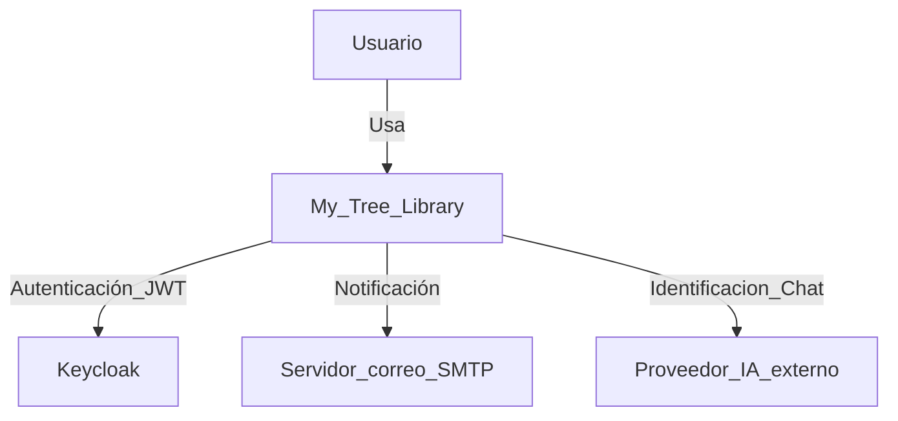
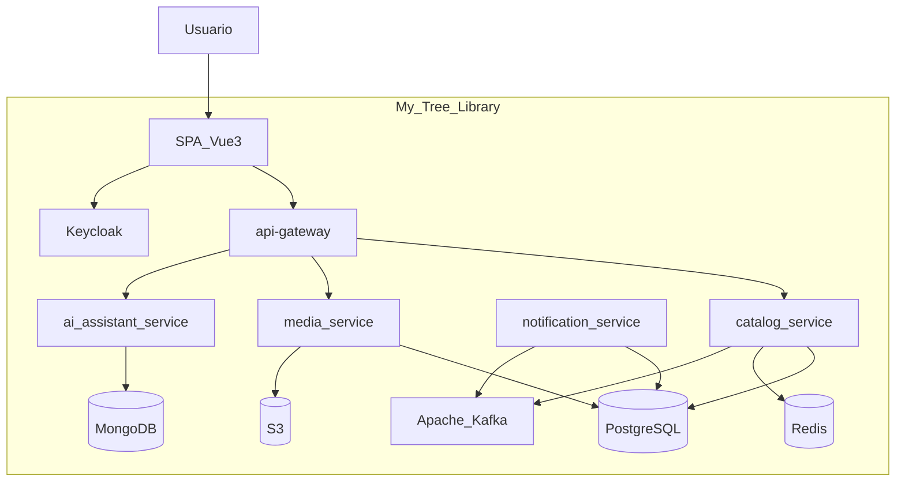
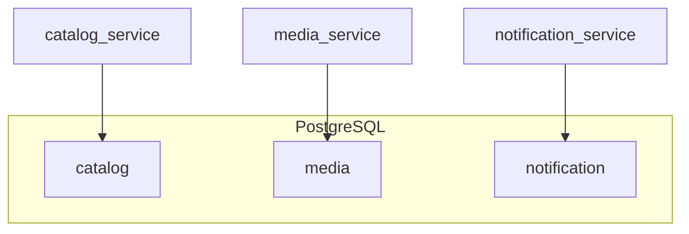
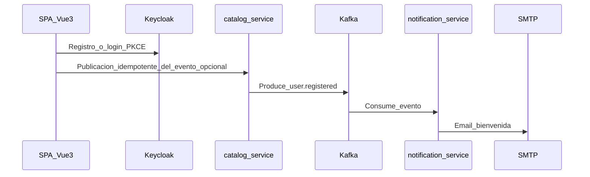
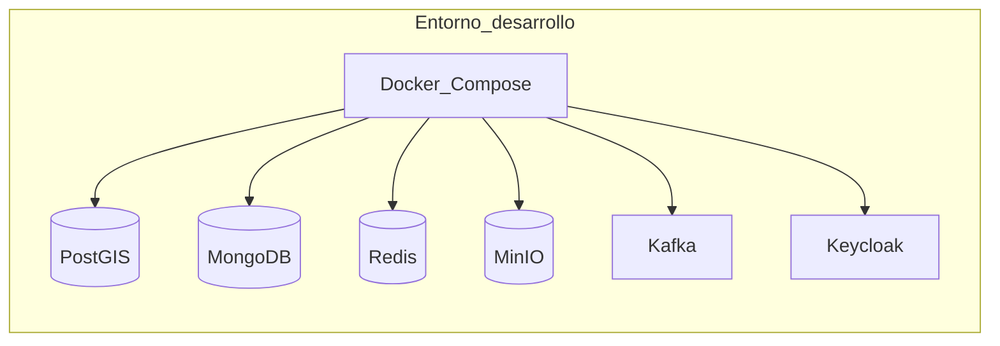
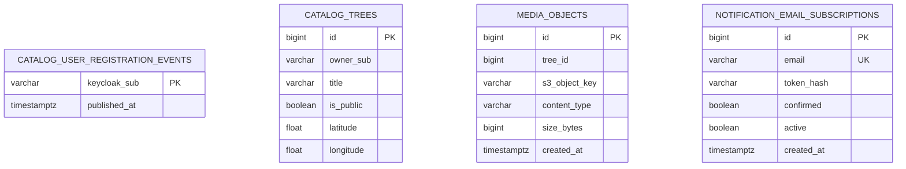

## Índice

0. [Ficha del proyecto](#0-ficha-del-proyecto)
1. [Descripción general del producto](#1-descripción-general-del-producto)
2. [Arquitectura del sistema](#2-arquitectura-del-sistema)
3. [Modelo de datos](#3-modelo-de-datos)
4. [Especificación de la API](#4-especificación-de-la-api)
5. [Historias de usuario](#5-historias-de-usuario)
6. [Tickets de trabajo](#6-tickets-de-trabajo)
7. [Pull requests](#7-pull-requests)

---

## 0. Ficha del proyecto

### **0.1. Tu nombre completo:**

Luís María de Frutos Redondo

### **0.2. Nombre del proyecto:**

My Tree Library

### **0.3. Descripción breve del proyecto:**

My Tree Library es una solución digital para crear y gestionar tu colección personal de árboles singulares, almacenando fotografías, localización geográfica y datos relevantes de cada ejemplar. Diseñada para aficionados, permite compartir información públicamente y fomentar una comunidad colaborativa. La plataforma se complementa con el uso de la IA para la identificación de árboles a partir de imágenes.

### **0.4. URL del proyecto:**

> Puede ser pública o privada, en cuyo caso deberás compartir los accesos de manera segura. Puedes enviarlos a [alvaro@lidr.co](mailto:alvaro@lidr.co) usando algún servicio como [onetimesecret](https://onetimesecret.com/).

### 0.5. URL o archivo comprimido del repositorio

> Puedes tenerlo alojado en público o en privado, en cuyo caso deberás compartir los accesos de manera segura. Puedes enviarlos a [alvaro@lidr.co](mailto:alvaro@lidr.co) usando algún servicio como [onetimesecret](https://onetimesecret.com/). También puedes compartir por correo un archivo zip con el contenido


---

## 1. Descripción general del producto

### **1.1. Objetivo:**

#### Propósito
Desarrollar una plataforma web que permita registrar, organizar y consultar fotografías, ubicaciones y datos relevantes de árboles singulares, facilitando al usuario la creación de una biblioteca personal digital y la posibilidad de compartir esa información de forma pública.

#### Valor aportado (qué soluciona)
La solución combina la catalogación personal con la posibilidad de compartir y crear comunidad en torno a una misma afición.

Además, la plataforma incorpora el uso de inteligencia artificial como apoyo a la identificación de especies a partir de fotografías, lo que enriquece la experiencia de uso, facilita el aprendizaje.

#### Destinatarios de la solución

La solución está dirigida a aficionados a la naturaleza en general y puede resultar de especial utilidad para docentes y monitores de tiempo libre.

### **1.2. Características y funcionalidades principales:**

#### Registro y publicación de árboles
La plataforma debe permitir registrar árboles mediante fichas con información relevante, fotografías y ubicación, posibilitando su publicación para consulta pública.

#### Consulta pública y visualización geográfica
El sistema debe permitir la consulta pública de árboles publicados, mostrando su información asociada y su localización sobre mapa de forma clara e intuitiva.

#### Notificaciones
La solución debe ofrecer un sistema de notificaciones para comunicar novedades a usuarios suscritos, sin necesidad de que estos dispongan de cuenta en la plataforma.

#### Integración con IA
El producto debe incluir integración con IA como apoyo a la identificación orientativa de árboles a partir de fotografías y como canal de interacción conversacional con el usuario.

#### Diagrama de Casos de Uso del sistema


*Fuentes:* [resumen de casos de uso](docs/use-cases/use-case-summary.md) · [modelo PlantUML](docs/use-cases/use-case-model.puml)


### **1.3. Diseño y experiencia de usuario:**

> Proporciona imágenes y/o videotutorial mostrando la experiencia del usuario desde que aterriza en la aplicación, pasando por todas las funcionalidades principales.

### **1.4. Instrucciones de instalación:**

> Documenta de manera precisa las instrucciones para instalar y poner en marcha el proyecto en local (librerías, backend, frontend, servidor, base de datos, migraciones y semillas de datos, etc.) *— pendiente de la fase de implementación.*

---

## 2. Arquitectura del Sistema

### **2.1. Diagrama de arquitectura:**

Se adopta el modelo **C4** para describir la arquitectura en niveles. En esta fase solo se define el **nivel 1 (C1: diagrama de contexto del sistema)** y el **nivel 2 (C2: diagrama de contenedores)**. El **nivel 3 (componentes dentro de cada contenedor)** se detallará cuando se implemente cada microservicio.

**Patrón y stack previstos:** microservicios por **contextos delimitados** (DDD ligero); **Spring Boot 4** en el backend, **Vue 3** en el frontend; **Keycloak** para OIDC y **JWT**; **Kafka** para el evento de alta de usuario hacia notificaciones; **PostgreSQL** en **un servidor** con **tres esquemas** de aplicación (`catalog`, `media`, `notification`) y **PostGIS** para geodatos del catálogo; **MongoDB** (datos flexibles de IA), **Redis** (caché), almacenamiento **compatible S3** (p. ej. MinIO en desarrollo).

#### C1 — Diagrama de contexto del sistema (nivel 1)

Muestra **My Tree Library** como **una única caja** (sistema de software) y sus relaciones con **personas** y **sistemas externos**, sin entrar en microservicios ni bases de datos.


```mermaid
flowchart TB
  U[Usuario]
  S[My_Tree_Library]
  KC[Keycloak]
  SMTP[Servidor_correo_SMTP]
  PIA[Proveedor_IA_externo]
  U -->|Usa| S
  S -->|Autenticación_JWT| KC
  S -->|Notificación| SMTP
  S -->|Identificacion_Chat| PIA
```

#### C2 — Diagrama de contenedores (nivel 2)

Despliega el interior del sistema **My Tree Library** en **contenedores** (aplicaciones ejecutables o almacenes de datos): SPA, gateway, microservicios, broker de mensajes, bases de datos y almacenamiento de objetos. Keycloak se incluye como contenedor **operado junto al producto** (alternativa válida en C4: tratarlo como sistema externo en C1 si el IdP es gestionado fuera del equipo).


```mermaid
flowchart TB
  subgraph mtl [My_Tree_Library]
    SPA[SPA_Vue3]
    GW[api-gateway]
    KC[Keycloak]
    CAT[catalog_service]
    MED[media_service]
    NOT[notification_service]
    AIS[ai_assistant_service]
    K[Apache_Kafka]
    PG[(PostgreSQL)]
    MG[(MongoDB)]
    RD[(Redis)]
    OBJ[(S3)]
  end
  U[Usuario] --> SPA
  SPA --> GW
  SPA --> KC
  GW --> CAT
  GW --> MED
  GW --> AIS
  CAT --> PG
  CAT --> RD
  CAT --> K
  MED --> PG
  MED --> OBJ
  NOT --> PG
  NOT --> K
  AIS --> MG
```

**Persistencia en PostgreSQL (buenas prácticas):** se aplica el principio **«una base de datos lógica por servicio»** (cada microservicio es **dueño exclusivo** de sus datos). Por **simplicidad en desarrollo** hay **un solo servidor PostgreSQL**, pero **tres esquemas distintos**, uno por servicio: **`catalog`**, **`media`**, **`notification`**. Cada servicio solo migra y accede a **su** esquema; **no** se usan claves foráneas ni lecturas SQL cruzadas entre esquemas. Las referencias entre contextos (p. ej. identificador de árbol en metadatos de una foto) son **identificadores lógicos** validados por **API REST** o **eventos Kafka**, no por integridad referencial entre esquemas. En producción, cada esquema puede trasladarse a una instancia de base propia sin rediseñar el límite del dominio.

**C2 (detalle) — un servidor PostgreSQL, tres esquemas, un servicio por esquema:**


```mermaid
flowchart TB
  CAT[catalog_service]
  MED[media_service]
  NS[notification_service]
  subgraph PG [PostgreSQL]
    direction LR
    SCH_C[catalog]
    SCH_M[media]
    SCH_N[notification]
  end
  CAT --> SCH_C
  MED --> SCH_M
  NS --> SCH_N
```

**Comunicaciones principales:** el usuario interactúa con la SPA; la SPA obtiene tokens en Keycloak y llama al API Gateway; el gateway enruta a los microservicios; **catalog-service** publica en Kafka eventos como `user.registered`; **notification-service** consume Kafka y envía correo vía SMTP externo; **ai-assistant-service** persiste conversaciones en MongoDB e invoca al proveedor de IA externo.

**Flujo de evento `user.registered` (alta de usuario, referencia):**


```mermaid
sequenceDiagram
  participant SPA as SPA_Vue3
  participant KC as Keycloak
  participant CAT as catalog_service
  participant K as Kafka
  participant N as notification_service
  participant Mail as SMTP
  SPA->>KC: Registro_o_login_PKCE
  SPA->>CAT: Publicacion_idempotente_del_evento_opcional
  CAT->>K: Produce_user.registered
  K->>N: Consume_evento
  N->>Mail: Email_bienvenida
```

La publicación del evento puede ser **idempotente** en backend (p. ej. registro por `sub` de Keycloak) antes de Kafka, o mediante integración avanzada con Keycloak (SPI / webhook).

**Beneficios:** escalado por servicio, límites de dominio claros, notificaciones desacopladas por mensajería.

**Sacrificios:** más operación y observabilidad distribuida; consistencia eventual en notificaciones; gobierno de contratos (API y eventos).

### **2.2. Descripción de componentes principales:**

| Componente | Tecnología | Responsabilidad |
|------------|------------|-----------------|
| SPA | Vue 3, Vite, TypeScript | UI: biblioteca, mapa, IA, flujos OIDC con Keycloak |
| API Gateway | Spring Cloud Gateway, **Spring Boot 4** | Enrutado `/api/catalog`, `/api/media`, `/api/ai`; preparado para validación JWT (Keycloak); actuator y métricas |
| catalog-service | **Spring Boot 4**, JPA, Flyway, PostGIS, Redis, Kafka producer | Árboles, coordenadas, publicación; datos solo en esquema **`catalog`**; caché de mapa; eventos de dominio |
| media-service | **Spring Boot 4**, JPA, Flyway, AWS SDK v2 (S3) | Metadatos solo en esquema **`media`**; objetos en bucket MinIO/S3; URLs prefirmadas |
| notification-service | **Spring Boot 4**, JPA, Flyway, Spring Kafka, JavaMail | Consume `user.registered`; datos solo en esquema **`notification`**; envío SMTP |
| ai-assistant-service | **Spring Boot 4**, Spring Data MongoDB | Sesiones de chat, mensajes, pistas de identificación orientativa |
| Keycloak | Keycloak 26 | Realm, clientes, roles, emisión de JWT |
| Kafka | Apache Kafka (KRaft en dev) | Topics p. ej. `user.registered` |
| PostgreSQL + PostGIS | 16 | **Un servidor** en dev; **tres esquemas** (`catalog`, `media`, `notification`); PostGIS usada en el esquema de catálogo |
| MongoDB | 7 | Documentos de IA flexibles |
| Redis | 7 | Caché (p. ej. vistas de mapa / listados públicos) |
| MinIO | S3 API | Imágenes en desarrollo |

### **2.3. Descripción de alto nivel del proyecto y estructura de ficheros**

Estructura de repositorio **prevista** para la fase de implementación (monorepo típico):

```
proyecto/
├── frontend/                 # SPA Vue 3 (Vite)
├── services/
│   ├── api-gateway/
│   ├── catalog-service/
│   ├── media-service/
│   ├── notification-service/
│   └── ai-assistant-service/
├── docs/adr/                 # Architecture Decision Records
├── docs/data-model/          # Modelo conceptual / datos
├── docs/use-cases/           # Casos de uso
├── infra/                    # Docker Compose, manifests, etc.
└── readme.md
```

Patrón: **API Gateway + servicios de dominio**. **PostgreSQL:** un solo servidor en desarrollo con **tres esquemas** (`catalog`, `media`, `notification`), cada uno propiedad de un servicio, alineado con **database per service** a nivel lógico; en producción cada esquema puede vivir en su propia instancia de base.

### **2.4. Infraestructura y despliegue**

**Desarrollo:** Docker Compose (o equivalente) con **un** PostgreSQL/PostGIS (tres esquemas de aplicación), MongoDB, Redis, MinIO, Kafka y Keycloak; los microservicios pueden ejecutarse en el host o como contenedores.

**Despliegue (alto nivel):** orquestación (p. ej. Kubernetes), secretos externos, Keycloak y Kafka en HA según entorno, bases gestionadas y almacenamiento de objetos S3 en nube.

**Decisiones documentadas:** descubrimiento de servicios y configuración **sin Eureka ni Spring Cloud Config** (asumidas por Compose/Kubernetes) — [ADR-0001](docs/adr/0001-discovery-y-configuracion-por-orquestador.md).


```mermaid
flowchart LR
  subgraph dev [Entorno_desarrollo]
    DC[Docker_Compose]
    PGd[(PostGIS)]
    MGd[(MongoDB)]
    Rd[(Redis)]
    S3d[(MinIO)]
    Kd[Kafka]
    KCd[Keycloak]
  end
  DC --> PGd
  DC --> MGd
  DC --> Rd
  DC --> S3d
  DC --> Kd
  DC --> KCd
```

### **2.5. Seguridad**

| Práctica | Descripción |
|----------|-------------|
| Autenticación OIDC | Keycloak como IdP; SPA con **Authorization Code + PKCE**; JWT firmados; `issuer-uri` alineado con el realm |
| Autorización | Roles de realm `USER` y `ADMIN`; políticas en recursos sensibles (moderación, borrado masivo) |
| Gateway | Validación de JWT (habilitar `spring-security-oauth2-resource-server` en el gateway cuando el realm esté configurado); cabeceras de correlación para auditoría |
| Almacenamiento de objetos | Buckets privados; **URLs prefirmadas** de corta duración; sin credenciales en el cliente |
| Datos personales | Suscripciones por email con **token hash** para baja; minimización de logs |
| Transporte | TLS en producción; CORS restringido al origen del SPA |
| Observabilidad | Health/metrics Prometheus; trazas distribuidas (p. ej. OpenTelemetry) en despliegue |

### **2.6. Tests**

Estrategia prevista: pruebas unitarias de dominio; **integración** con **Testcontainers** (PostgreSQL, MongoDB, Kafka) donde aporte valor; contratos de API (OpenAPI) entre equipos; tests de capa web y de aceptación sobre flujos críticos (catalogo, notificaciones, IA).

---

## 3. Modelo de Datos

### **3.1. Modelo conceptual (negocio)**

Describe el dominio **sin** fijar almacén físico. Documento de referencia: [docs/data-model/modelo-conceptual.md](docs/data-model/modelo-conceptual.md). Diagramas canónicos: [conceptual-diagram.puml](docs/data-model/conceptual-diagram.puml) (PlantUML) · [conceptual-diagram.mmd](docs/data-model/conceptual-diagram.mmd) (Mermaid).

**Entidades:** **USUARIO** (cuenta Colaborador/Administrador), cadena taxonómica **FAMILIA → GÉNERO → ESPECIE** (cada eslabón **N:1** hacia el nivel superior), **PROVINCIA**, **ÁRBOL** (vinculado a **ESPECIE** y **PROVINCIA**), **CARACTERÍSTICA** (1:N con árbol), **FOTOGRAFÍA** (1:N con árbol; autor **USUARIO**; visibilidad PUBLIC/PRIVATE/RESTRICTED), **SUSCRIPTOR** (correo, sin cuenta de plataforma), **NOTIFICACIÓN** (enlace a suscriptor y árbol), **AUDITORÍA**. Las **sesiones de IA** (UC-05/UC-06) se modelan fuera de este ER (p. ej. colección de sesiones en MongoDB según arquitectura).

### **3.2. Diagrama de persistencia prevista (implementación)**

**PostgreSQL (un servidor; esquemas `catalog`, `media`, `notification`):**


```mermaid
erDiagram
  CATALOG_USER_REGISTRATION_EVENTS {
    varchar keycloak_sub PK
    timestamptz published_at
  }
  CATALOG_TREES {
    bigint id PK
    varchar owner_sub
    varchar title
    boolean is_public
    float latitude
    float longitude
  }
  MEDIA_OBJECTS {
    bigint id PK
    bigint tree_id
    varchar s3_object_key
    varchar content_type
    bigint size_bytes
    timestamptz created_at
  }
  NOTIFICATION_EMAIL_SUBSCRIPTIONS {
    bigint id PK
    varchar email UK
    varchar token_hash
    boolean confirmed
    boolean active
    timestamptz created_at
  }
```

*Nota:* `tree_id` en `media` es referencia **lógica** al árbol en `catalog` (sin FK entre esquemas). El esquema `catalog` en implementación deberá reflejar además los maestros **familia / género / especie**, **provincia**, **características**, **auditoría** y demás entidades del [modelo conceptual](docs/data-model/modelo-conceptual.md) (nombres de tabla orientativos).

**MongoDB (colección `chat_sessions`):** documento por sesión con `userSub`, mensajes embebidos (`role`, `content`, `at`) y subdocumento opcional `identificationHint` (`candidateSpecies`, `confidence`).

**Kafka — contrato del evento `user.registered` (borrador):** carga útil JSON recomendada: `eventType` (`"user.registered"`), `userId` (sub de Keycloak), `email`, `occurredAt` (ISO-8601), `correlationId` (UUID opcional). Evolución del esquema mediante **JSON Schema** o **Avro** acordado en el equipo.

### **3.3. Descripción de entidades principales (orientación física)**

**Esquema `catalog` — `user_registration_events`:** idempotencia al publicar el evento de alta (`keycloak_sub` PK, `published_at`).

**Esquema `catalog` — `trees` (concepto ÁRBOL):** ficha de ejemplar (`owner_sub` → **USUARIO**; `title` / nombre local; `is_public` ↔ visibilidad en mapa; coordenadas WGS84/PostGIS; referencias lógicas a taxón y provincia según modelo conceptual).

**Esquema `media` — `media_objects` (metadatos de FOTOGRAFÍA):** `tree_id` lógico al árbol; categoría de visibilidad; `s3_object_key` en bucket; sin BLOB en BD.

**Esquema `notification` — `email_subscriptions` (concepto SUSCRIPTOR):** correo; `token_hash`; `confirmed` / `active`.

**MongoDB — `chat_sessions`:** historial conversacional y pistas de identificación no estructuradas para la IA (fuera del ER conceptual unificado).

---

## 4. Especificación de la API

> Si tu backend se comunica a través de API, describe los endpoints principales (máximo 3) en formato OpenAPI. Opcionalmente puedes añadir un ejemplo de petición y de respuesta para mayor claridad

---

## 5. Historias de Usuario

Modelo de análisis (actores, casos de uso, diagrama PlantUML): [docs/use-cases/use-case-summary.md](docs/use-cases/use-case-summary.md).

> Documenta 3 de las historias de usuario principales utilizadas durante el desarrollo, teniendo en cuenta las buenas prácticas de producto al respecto.

**Historia de Usuario 1**

**Historia de Usuario 2**

**Historia de Usuario 3**

---

## 6. Tickets de Trabajo

> Documenta 3 de los tickets de trabajo principales del desarrollo, uno de backend, uno de frontend, y uno de bases de datos. Da todo el detalle requerido para desarrollar la tarea de inicio a fin teniendo en cuenta las buenas prácticas al respecto. 

**Ticket 1**

**Ticket 2**

**Ticket 3**

---

## 7. Pull Requests

> Documenta 3 de las Pull Requests realizadas durante la ejecución del proyecto

**Pull Request 1**

**Pull Request 2**

**Pull Request 3**

