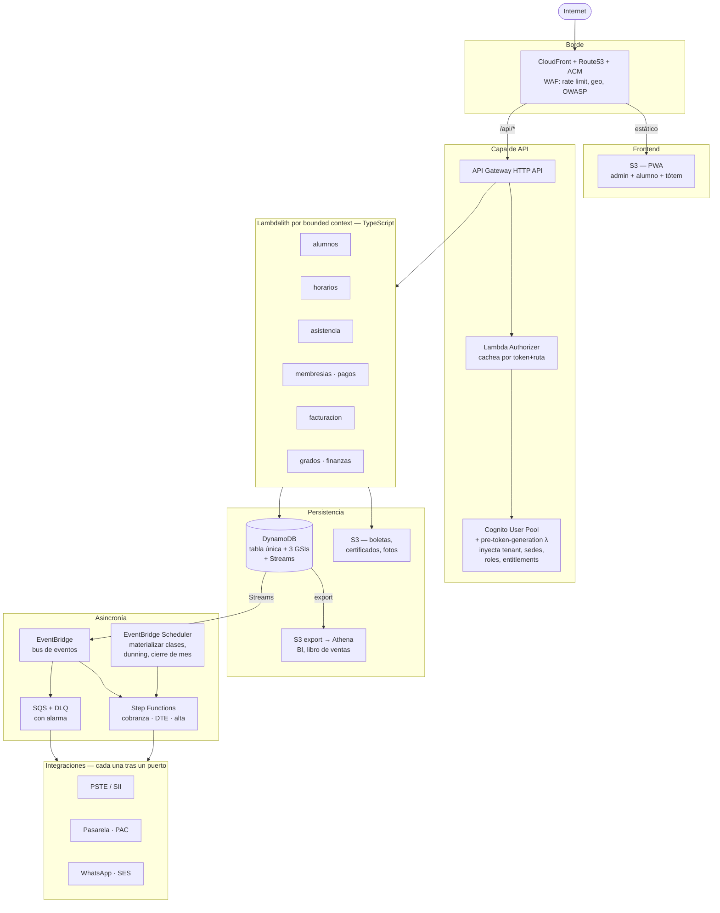
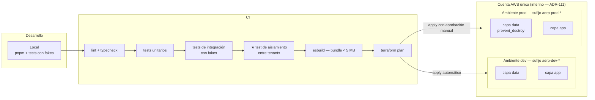
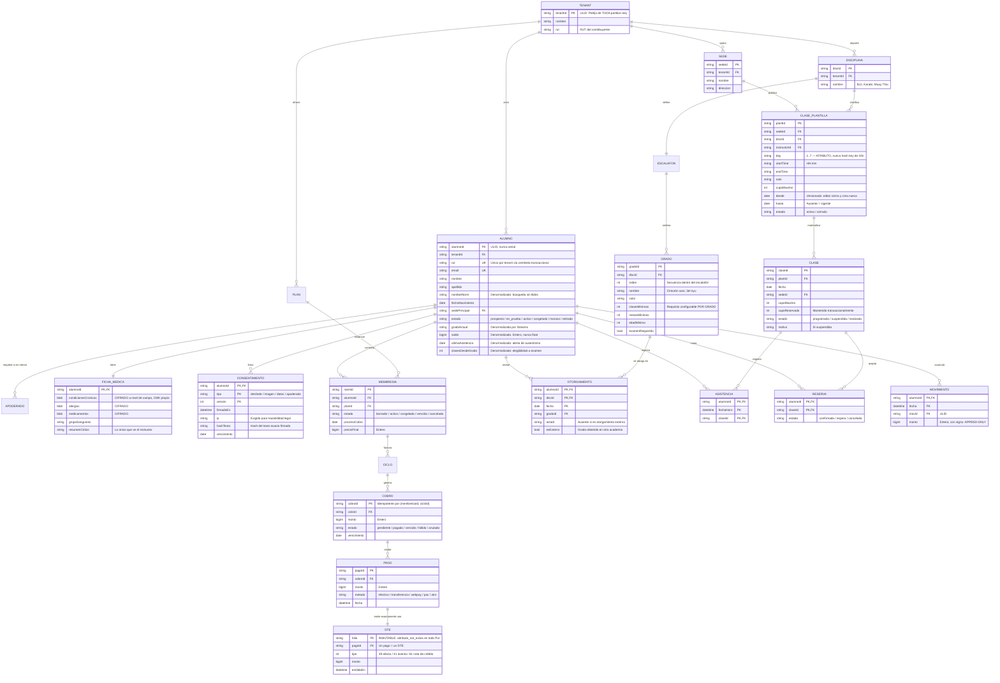

# AERP — Academy Enterprise Resource Planning

> **Estado del proyecto a la fecha de esta ficha (julio 2026): fase de
> especificación y diseño.** Este repositorio contiene la especificación
> completa —PRD, dominio, épicas, 11 ADRs, modelo de datos y auditoría del IaC
> previo— y **no contiene código de aplicación**.
>
> Existen dos repositorios hermanos con andamiaje: **`AERP-FUNCTIONS`** (monorepo
> pnpm con CI maduro y cuatro Lambdas de Cognito) y **`AERP-IAC`** (Terraform con
> OIDC para GitHub Actions). **Ninguno implementa todavía el dominio AERP**: el
> monorepo es un scaffold heredado de otro proyecto —las palabras `tenant`,
> `alumno` y `sede` no aparecen en su código— y el Terraform aún no crea la tabla
> DynamoDB, el Cognito ni las claves KMS que exigen los ADRs. El detalle
> verificado está en `docs/10-indice-repositorios.md`.
>
> Las secciones que exigen un sistema en ejecución (1.3 diseño y UX, 1.4
> instalación, 2.3 estructura de ficheros real, 2.6 tests ejecutados y 7 pull
> requests) están marcadas como **pendientes**, con el detalle de lo que está
> especificado y de lo que falta. Se prefirió declararlo antes que rellenarlas
> con material que no corresponde a un artefacto existente.

## Índice

0. [Ficha del proyecto](#0-ficha-del-proyecto)
1. [Descripción general del producto](#1-descripción-general-del-producto)
2. [Arquitectura del sistema](#2-arquitectura-del-sistema)
3. [Modelo de datos](#3-modelo-de-datos)
4. [Especificación de la API](#4-especificación-de-la-api)
5. [Historias de usuario](#5-historias-de-usuario)
6. [Tickets de trabajo](#6-tickets-de-trabajo)
7. [Pull requests](#7-pull-requests)

---

## 0. Ficha del proyecto

### **0.1. Tu nombre completo:**

<!-- COMPLETAR: nombre y apellidos -->
`Luis Jose Quiroz Ramos`

### **0.2. Nombre del proyecto:**

**AERP — Academy Enterprise Resource Planning**

### **0.3. Descripción breve del proyecto:**

SaaS B2B multi-tenant de gestión integral para academias deportivas y de artes
marciales en Chile. Cubre alumnos y fichas médicas, planes y membresías,
cobranza recurrente, emisión de boleta electrónica chilena (DTE/SII), horarios
multi-sede, control de asistencia, sistema de grados y exámenes, notificaciones
y reportería.

Su diferenciador es la combinación de cinco elementos que ningún competidor
reúne: **sistema de grados + DTE del SII + cobro recurrente automático (PAC) +
WhatsApp + cumplimiento legal chileno**, en español y en pesos.

### **0.4. URL del proyecto:**

<!-- COMPLETAR cuando exista el despliegue -->
`[pendiente — no hay despliegue todavía]`

### 0.5. URL o archivo comprimido del repositorio

**Repositorio de la especificación (fuente de verdad del diseño):**
https://github.com/luiijoquiroz/AERP

El proyecto se organiza en cuatro repositorios hermanos, todos privados:

- [`AERP`](https://github.com/luiijoquiroz/AERP) — especificación: PRD, dominio, épicas, ADRs, modelo de datos, roadmap.
- [`AERP-IAC`](https://github.com/luiijoquiroz/AERP-IAC) — Terraform (infraestructura AWS).
- [`AERP-FUNCTIONS`](https://github.com/luiijoquiroz/AERP-FUNCTIONS) — monorepo de Lambdas TypeScript.
- [`AERP-WEB`](https://github.com/luiijoquiroz/AERP-WEB) — frontends (PWA admin + alumno + tótem).

> Repositorios **privados**: dar acceso al TA por su handle de GitHub o correo
> para la revisión. Los accesos sensibles pueden compartirse de forma segura a
> [alvaro@lidr.co](mailto:alvaro@lidr.co) vía [onetimesecret](https://onetimesecret.com/).

---

## 1. Descripción general del producto

### **1.1. Objetivo:**

**El problema.** Las academias deportivas y de artes marciales operan con una
mezcla de Excel, WhatsApp y memoria del instructor. Eso produce cuatro
pérdidas medibles:

1. **Fuga de ingresos** — no saben con precisión quién debe; la cobranza depende
   de que alguien recuerde perseguir al alumno.
2. **Fuga de alumnos** — alguien deja de venir tres semanas y nadie lo nota
   hasta que ya se fue.
3. **Carga administrativa** — horas semanales en boletas, listas y cuadraturas.
4. **Riesgo legal** — boletas irregulares ante el SII, y fichas médicas o
   consentimientos en papel (o inexistentes) cuando ocurre una lesión.

**El valor que aporta.** AERP automatiza la cobranza y la emisión de boletas,
detecta al alumno que se está yendo antes de que se vaya, y formaliza el
cumplimiento legal de la academia. El software de gimnasios existente ataca
parcialmente los puntos 1 y 3, pero ignora por completo el corazón del negocio
marcial: **el sistema de grados**.

**Para quién (ICP).** Academias de artes marciales (BJJ, karate, judo,
taekwondo, muay thai, MMA) en Chile, con **80 a 600 alumnos activos** y **1 a 4
sedes**, cuyo dueño enseña y además administra. Explícitamente fuera del ICP
inicial: gimnasios fitness, entrenadores independientes con menos de 30 alumnos
y cadenas de más de 2.000 alumnos.

**Usuarios.** Comprador económico: el dueño o maestro. Usuarios diarios:
administrador de sede, recepción e instructores. Usuarios finales: alumnos y
apoderados. Usuario indirecto con poder de veto: el contador del cliente.

**Objetivos medibles (~9 meses).** Cada uno con el reloj que realmente determina
cuándo se cumple:

| # | Objetivo | Resultado clave | Reloj dominante |
|---|---|---|---|
| O-6 | Costo de infraestructura proporcional | Costo fijo ≈ USD 0/mes | Diseño (resuelto) |
| O-1 | Validar que el dolor es real y pagable | 15-20 entrevistas; 3 design partners pagando | Agenda humana |
| O-7 | Cumplimiento como producto | Catastro legal validado; partners con páginas legales publicadas | Validación legal |
| O-3 | Operar sin planilla paralela | 1 academia con un mes cerrado en el sistema | Build + 1 mes calendario |
| O-2 | Reducir la morosidad | −30% en 90 días en los design partners | 90 días de datos |
| O-5 | Activar el diferenciador | Un ciclo completo de exámenes con actas y certificados | Calendario del partner |
| O-4 | Cumplimiento tributario sin incidentes | 3 meses consecutivos sin error de emisión | Certificación SII + 90 días |

### **1.2. Características y funcionalidades principales:**

El producto es modular: cada módulo se activa por cliente mediante
**entitlements** (lo que contrató) y **feature flags** (rollout técnico), que son
dos conceptos y dos tablas distintas.

#### Núcleo prioritario (en construcción — Fase 1a)

| Módulo | Funcionalidad |
|---|---|
| **Gestión de alumnos** | Alta en menos de 2 minutos. RUT validado con dígito verificador, detección de duplicados por RUT y email, apoderado obligatorio si es menor de 18, estados y ciclo de vida (prospecto → en prueba → activo → congelado/moroso → retirado) con transiciones automáticas por regla, búsqueda tolerante a tildes, historial deportivo en línea de tiempo |
| **Ficha médica y consentimientos** | Lesiones, cirugías, condiciones crónicas, alergias, medicamentos, grupo sanguíneo y previsión. **Cifrada a nivel de campo con clave KMS propia y separada.** Consentimientos con firma digital versionados con fecha, IP y hash del texto firmado. El instructor ve solo el resumen crítico, nunca el historial. Todo acceso queda auditado |
| **Gestión de horarios** | Plantillas recurrentes con vigencia (editar cierra la versión anterior, nunca sobrescribe, para preservar el histórico de asistencia). Detección de conflictos de sala e instructor. Excepciones: feriados, suspensión puntual con notificación automática, reemplazo de instructor. **Publicación como fuente única de verdad**: API pública, widget embebible para el sitio del cliente, página pública por sede, vista para TV en recepción y exportación iCal |
| **Disciplinas y escalafones** | Secuencia de grados por disciplina con nombre, color y orden; sub-niveles; requisitos configurables por grado (clases mínimas, meses mínimos, edad mínima, grado previo) |
| **Asistencia** | Check-in en menos de 3 segundos por QR, **funcional sin conexión** con sincronización posterior. Alerta de morosidad o consentimiento vencido. Reportes de ocupación por franja horaria y alerta de ausentismo |
| **Importación** | Wizard de configuración inicial. Importador CSV/Excel con mapeo de columnas, vista previa, validación fila por fila y **rollback completo** de una importación |
| **Reportes** | Export incremental a S3 + Athena desde el día 1. Asistencia, ocupación, alumnos activos, ausentismo y avance de grados |

#### Módulos posteriores (especificados, bloqueados por decisiones abiertas)

| Módulo | Funcionalidad | Bloqueado por |
|---|---|---|
| **Planes y membresías** | Catálogo (mensual ilimitado, por N clases, familiar, matrícula), precio por sede y disciplina en CLP o UF, descuentos. Motor de cobros mensual **idempotente** con dry run y dunning configurable. Congelamiento que extiende vigencia | D-04, D-07 |
| **Pagos** | Presencial con apertura y cierre de caja por turno. Pago en línea con link enviable por WhatsApp y webhook idempotente. **PAC/PAT**: mandato firmado, cargo mensual, manejo de rechazos | D-02, D-03 |
| **Facturación electrónica** | Boleta afecta (39) o exenta (41), emisión automática al confirmarse el pago, nota de crédito (61) para anulaciones, libro de ventas, gestión de folios CAF con alerta bajo el 20%. **Un pago = un DTE**, con test explícito | D-01 |
| **Grados y exámenes** *(diferenciador principal)* | Barra de progreso por requisito con fecha estimada de elegibilidad. Ciclo de examen: el sistema propone elegibles, el instructor confirma, se cobra el arancel, se registra el resultado. **El acta cerrada otorga grados automáticamente y es inmutable.** Diplomas PDF con código de verificación público | — |
| **Notificaciones** | Email, WhatsApp Business, push web. Plantillas por tenant, opt-out por canal y por tipo, ventana horaria permitida. **Contador y límite de conversaciones de WhatsApp por tenant** (control de margen) | — |
| **Portal del alumno** | PWA: horario, reserva de clase, estado de cuenta, pago en línea, boletas, progreso hacia el próximo grado. El apoderado ve a sus N hijos desde una cuenta. **Todo el sistema funciona aunque el alumno nunca entre al portal** | — |
| **Finanzas y dashboard** | Gastos por centro de costo, estado de resultados por sede, flujo de caja proyectado, MRR, ARPU, churn, morosidad con aging y **lista accionable de alumnos en riesgo** | — |

### **1.3. Diseño y experiencia de usuario:**

> ⚠️ **Pendiente — no existe interfaz todavía.** No se incluyen capturas ni
> videotutorial porque no hay aplicación desplegada; adjuntar material simulado
> sería representar como producto algo que no lo es.

Lo que sí está definido a nivel de especificación y condiciona el diseño:

- **PWA única** (admin + portal del alumno + tótem de check-in), responsive, sin
  instalación obligatoria y sin app nativa en v1 (ADR-107).
- **Accesibilidad WCAG 2.1 AA** en el portal del alumno, como requisito no
  funcional.
- **Restricciones de UX medibles**, tratadas como criterios de aceptación:
  alta de alumno en < 2 minutos *medida con cronómetro real*, check-in en
  < 3 segundos y funcional sin conexión.
- **Tótem offline** con IndexedDB y sincronización al recuperar red.
- **Selector global de sede** con opción "Todas", transversal a toda la app.
- **Regla de producto que domina el diseño:** el sistema debe funcionar
  completo aunque el alumno nunca abra el portal. La adopción del alumno final
  es deseable, no un requisito de funcionamiento.

### **1.4. Instrucciones de instalación:**

> ⚠️ **Pendiente — no hay scaffold todavía.** No existe `package.json` ni código
> de aplicación, de modo que no hay procedimiento de instalación verificable.

Procedimiento previsto una vez exista el scaffold, derivado de los ADR-104 y
ADR-108:

```bash
# Requisitos: Node.js LTS, pnpm, Terraform, credenciales AWS

pnpm install

# Infraestructura por capas, con estado separado por capa y por ambiente
terraform -chdir=infra/envs/dev init
terraform -chdir=infra/envs/dev plan
terraform -chdir=infra/envs/dev apply

pnpm test          # unitarios de dominio + integración con fakes
pnpm lint
```

**No hay migraciones ni semillas de esquema:** DynamoDB no tiene esquema. Los
cambios de forma de los ítems se manejan con versionado del ítem y lectura
tolerante; la infraestructura se versiona en Terraform.

---

## 2. Arquitectura del Sistema

### **2.1. Diagrama de arquitectura:**


```mermaid
flowchart TD
    Internet([Internet])

    subgraph Edge["Borde"]
        CF["CloudFront + Route53 + ACM<br/>WAF: rate limit, geo, OWASP"]
    end

    subgraph Front["Frontend"]
        S3PWA["S3 — PWA<br/>admin + alumno + tótem"]
    end

    subgraph API["Capa de API"]
        APIGW["API Gateway HTTP API"]
        AUTHZ["Lambda Authorizer<br/>cachea por token+ruta"]
        COG["Cognito User Pool<br/>+ pre-token-generation λ<br/>inyecta tenant, sedes,<br/>roles, entitlements"]
    end

    subgraph Dominio["Lambdalith por bounded context — TypeScript"]
        L1["alumnos"]
        L2["horarios"]
        L3["asistencia"]
        L4["membresias · pagos"]
        L5["facturacion"]
        L6["grados · finanzas"]
    end

    subgraph Datos["Persistencia"]
        DDB[("DynamoDB<br/>tabla única + 3 GSIs<br/>+ Streams")]
        S3DOC["S3 — boletas,<br/>certificados, fotos"]
        ATH["S3 export → Athena<br/>BI, libro de ventas"]
    end

    subgraph Async["Asincronía"]
        EB["EventBridge<br/>bus de eventos"]
        SQS["SQS + DLQ<br/>con alarma"]
        SF["Step Functions<br/>cobranza · DTE · alta"]
        SCH["EventBridge Scheduler<br/>materializar clases,<br/>dunning, cierre de mes"]
    end

    subgraph Ext["Integraciones — cada una tras un puerto"]
        SII["PSTE / SII"]
        PAY["Pasarela · PAC"]
        WA["WhatsApp · SES"]
    end

    Internet --> CF
    CF -->|estático| S3PWA
    CF -->|/api/*| APIGW
    APIGW --> AUTHZ
    AUTHZ --> COG
    APIGW --> Dominio
    Dominio --> DDB
    Dominio --> S3DOC
    DDB -->|Streams| EB
    DDB -->|export| ATH
    EB --> SQS
    EB --> SF
    SCH --> SF
    SQS --> Ext
    SF --> Ext
```

**Patrón arquitectónico.** Serverless orientado a eventos, con **arquitectura
hexagonal** en el dominio (puertos y adaptadores) y un **Lambdalith por bounded
context**: una función por contexto con router interno, no una Lambda por
endpoint.

**Por qué se eligió.** La restricción dura del proyecto es *costo de
infraestructura proporcional al uso, sin piso fijo* (objetivo O-6), porque en
fase de validación con 3 design partners un costo fijo mensual de USD 100-150
antes del primer cliente es material. La v0.2 de la arquitectura proponía Aurora
Serverless v2; se descartó (ADR-101) porque el resume desde 0 ACU toma ~15 s, de
modo que en producción hay que mantener un piso de ACU 24/7, más RDS Proxy, más
NAT Gateway para las Lambdas en VPC.

**Beneficios principales:**

- **Costo fijo prácticamente cero.** Todo escala con el uso. A la escala de v1
  (500 tenants, 150.000 alumnos, 20.000 check-ins/día) el consumo estimado es
  del orden de USD 5/mes en DynamoDB.
- **Sin VPC en ninguna Lambda de dominio** → sin NAT Gateway, sin cold start por
  creación de ENI, sin gestión de subredes.
- **Carga operacional mínima**, coherente con un equipo reducido: no hay
  servidores, ni conexiones, ni migraciones de esquema que administrar.
- **Multi-AZ por diseño**, sin componentes con estado propio.

**Sacrificios y déficits asumidos, explícitamente:**

- **Se pierde el filtrado combinable en la base.** Se compensa cargando el
  universo del tenant (≤600 alumnos ≈ 120 KB, una página de Query) y filtrando
  en memoria en la Lambda. **Deja de funcionar sobre ~2.000 alumnos por tenant**,
  punto en el que hay que reevaluar (R-13).
- **Se pierde SQL ad-hoc sobre la base operativa.** La válvula de escape es
  Athena sobre el export a S3, activo desde el día 1. Es un riesgo anticipado,
  no una sorpresa (R-08).
- **Curva de aprendizaje del single-table design.** Es el riesgo con mayor
  probabilidad del proyecto (R-06): el intento previo produjo 14 GSIs por
  modelar entidades en vez de patrones de acceso.
- **DynamoDB Streams es at-least-once.** Sin control del `sequenceNumber`
  procesado, los contadores agregados se inflan en silencio. Es el bug más
  probable del diseño (R-07).
- **Una sola cuenta AWS** como interino: sin límite real de blast radius, con
  cinco mitigaciones obligatorias y separación antes del primer cliente que
  paga (ADR-111).
- **Latencia desde Chile a `us-east-1`** es mayor que a São Paulo. Mitigada por
  CloudFront para lo estático; las llamadas de API sí la sufren. Hay revisión
  programada cuando abra la región de Chile (ADR-110).

### **2.2. Descripción de componentes principales:**

| Componente | Tecnología | Responsabilidad |
|---|---|---|
| **PWA** | TypeScript, servida desde S3 tras CloudFront con OAC | Interfaz única: administración, portal del alumno y tótem de check-in. IndexedDB para operar offline |
| **CDN y borde** | CloudFront, Route 53, ACM, WAF | Entrega estática, TLS, rate limit, reglas OWASP |
| **API** | API Gateway HTTP API | Punto de entrada de `/api/*` |
| **Autenticación** | Cognito User Pool único multi-tenant | Identidad. **Roles vía Grupos**, nunca vía atributos custom (son inmutables e imborrables una vez creados). MFA obligatorio para `owner` y `admin_tenant` |
| **`pre_token_generation`** | Lambda | **Pieza central del modelo de seguridad**: inyecta `tenant_id`, `sedes[]`, `roles[]` y `entitlements[]` como claims del JWT |
| **Authorizer** | Lambda | Valida el token y resuelve permisos finos; cachea por `(token, ruta)` |
| **Lambdas de dominio** | TypeScript, AWS SDK v3, esbuild, Powertools for AWS Lambda | Un Lambdalith por bounded context: alumnos, horarios, asistencia, membresías, pagos, facturación, grados, finanzas. Powertools aporta logging estructurado, tracing X-Ray, métricas e **idempotencia** |
| **Base de datos** | DynamoDB, tabla única, 3 GSIs sobrecargados, Streams `NEW_AND_OLD_IMAGES`, PITR | Todo el estado operativo |
| **Objetos** | S3 + CloudFront | Boletas PDF, certificados, comprobantes, fotos, videos. Objetos inmutables |
| **Analítica** | S3 export + Athena | Libro de ventas, BI, reportes ad-hoc, exportación del cliente (anti lock-in) |
| **Eventos** | EventBridge, alimentado por DynamoDB Streams | Bus de eventos de dominio. **Elimina la necesidad de outbox**: la escritura y el evento provienen del mismo commit |
| **Colas** | SQS con DLQ obligatoria y alarma CloudWatch | Notificaciones e indexación. Una DLQ sin alarma es una DLQ inútil |
| **Orquestación** | Step Functions | Sagas con compensación: alta de alumno, cobranza mensual, emisión de DTE. **Lambda no hace trabajo largo** |
| **Programación** | EventBridge Scheduler | Materializar clases, dunning, alertas de ausentismo, cierre de mes |
| **Secretos y cifrado** | Secrets Manager, KMS con CMK propia | Certificado digital tributario en Secrets Manager, nunca en S3 ni en variable de entorno. **CMK distinta para la ficha médica** |
| **IaC** | Terraform, por capas y con directorio por ambiente | `bootstrap` → `network` → `data` → `app`, con estado separado por capa |

### **2.3. Descripción de alto nivel del proyecto y estructura de ficheros**

> ⚠️ **La estructura de dominio no existe todavía.** Lo siguiente es la
> estructura prevista, derivada de los ADR-104 y ADR-108.
>
> **Lo que sí existe hoy**, repartido en tres repositorios hermanos:
> `AERP/` (este: `CLAUDE.md`, `docs/`, la ficha y los prompts);
> `AERP-FUNCTIONS/` (monorepo pnpm funcional —`functions/*` + `packages/shared`,
> CI con gitleaks y matriz de afectados, dos funciones con arquitectura
> hexagonal real— pero con el dominio de otro proyecto y sin compilar);
> y `AERP-IAC/` (113 líneas de HCL: proveedores y OIDC, no aplicable tal cual).
> Estado verificado en `docs/10-indice-repositorios.md`.

```
aerp/
├── CLAUDE.md                    # Instrucciones del proyecto (único, canónico)
├── ficha-proyecto.md            # Este documento
├── prompts.md                   # Prompts relevantes del desarrollo
├── docs/                        # Especificación completa (ver más abajo)
├── infra/                       # Terraform, por capas y por ambiente
│   ├── modules/                 # Módulos reutilizables
│   └── envs/
│       ├── dev/                 # Estado propio, sufijo de ambiente
│       └── prod/
├── packages/
│   ├── domain/                  # Núcleo hexagonal: entidades, reglas, puertos
│   │   ├── alumno/              #   ...sin dependencias de infraestructura
│   │   ├── horario/
│   │   ├── membresia/
│   │   └── grado/
│   ├── adapters/                # Implementaciones de los puertos
│   │   ├── dynamodb/            #   Repositorios (el dominio no importa el SDK)
│   │   ├── sii/                 #   + fake para tests
│   │   ├── pasarela/            #   + fake para tests
│   │   └── whatsapp/            #   + fake para tests
│   └── shared/                  # Tipos, errores, utilidades
├── services/                    # Un Lambdalith por bounded context
│   ├── alumnos/
│   ├── horarios/
│   ├── asistencia/
│   ├── facturacion/
│   └── authorizer/
├── web/                         # PWA única
└── tests/
    ├── unit/                    # Lógica de dominio
    ├── integration/             # Con fakes de SII, pasarela y WhatsApp
    └── isolation/               # Test de cruce entre tenants (obligatorio en CI)
```

**Patrón que obedece.** Arquitectura hexagonal (puertos y adaptadores) sobre una
organización por *bounded context* de DDD:

- `packages/domain/` **no conoce DynamoDB ni AWS**. El patrón repositorio es
  obligatorio, y es precisamente lo que mantiene abierta la puerta a otro motor
  de persistencia para un subdominio futuro.
- `packages/adapters/` implementa los puertos. **Cada adaptador externo tiene un
  fake**, lo que permite testear sin tocar el SII ni la pasarela de pago.
- `services/` es la capa de entrega: un Lambdalith por contexto, con router
  interno. La unidad de despliegue es el módulo, no el endpoint.

**Documentación** (`docs/`): `00-prd-ejecutivo.md` (objetivos, riesgos, hitos),
`01-prd.md`, `02-dominio.md` (lenguaje ubicuo y agregados), `03-epicas.md`
(21 épicas con criterios de aceptación), `04-arquitectura.md` (11 ADRs),
`05-roadmap.md`, `06-decisiones-abiertas.md`, `07-analisis-iac-actual.md`
(auditoría del Terraform previo, 19 hallazgos), `08-modelo-datos-dynamodb.md`
(26 patrones de acceso) y `09-catastro-legal.md`.

### **2.4. Infraestructura y despliegue**


```mermaid
flowchart LR
    subgraph Dev["Desarrollo"]
        LOC["Local<br/>pnpm + tests con fakes"]
    end

    subgraph CI["CI"]
        LINT["lint + typecheck"]
        UT["tests unitarios"]
        IT["tests de integración<br/>con fakes"]
        ISO["★ test de aislamiento<br/>entre tenants"]
        BUILD["esbuild — bundle < 5 MB"]
        TFPLAN["terraform plan"]
    end

    subgraph AWS["Cuenta AWS única (interino — ADR-111)"]
        subgraph DEVENV["Ambiente dev — sufijo aerp-dev-*"]
            DDEV["capa data"]
            ADEV["capa app"]
        end
        subgraph PRODENV["Ambiente prod — sufijo aerp-prod-*"]
            DPROD["capa data<br/>prevent_destroy"]
            APROD["capa app"]
        end
    end

    LOC --> LINT --> UT --> IT --> ISO --> BUILD --> TFPLAN
    TFPLAN -->|apply automático| DEVENV
    TFPLAN -->|apply con aprobación manual| PRODENV
```

**Capas de Terraform**, con estado separado por capa y por ambiente:

```
bootstrap  →  network  →  data  →  app
```

La separación existe para que **un `apply` de la capa de aplicación no pueda
tocar la capa de datos**. El backend es S3 **con bloqueo de estado**: sin
locking, dos `apply` concurrentes corrompen el estado.

**Reglas de despliegue no negociables:**

- **Directorio por ambiente, no workspaces**, para poder divergir configuración.
- **Todo nombre de recurso lleva sufijo de ambiente**, sin excepción. Con una
  sola cuenta AWS, ese sufijo es la única barrera entre dev y prod.
- **Ningún ARN, account ID, región ni User Pool ID hardcodeado.** La región es
  variable de Terraform en todas partes, para que la revisión programada del
  ADR-110 (región de Chile) no sea un refactor.
- `prevent_destroy` y `deletion_protection` en todo recurso con estado.
- **PITR habilitado en todos los ambientes**, no solo producción.
- Roles IAM distintos por ambiente, con `Condition` sobre tags de recurso.
- Presupuesto y alerta de costo por tag de ambiente.

**Estado actual de la infraestructura.** Existe Terraform previo con tablas
DynamoDB y un Cognito User Pool, auditado en `07-analisis-iac-actual.md` con 19
hallazgos. Requiere remediación antes de continuar; en particular, **el User
Pool debe recrearse ahora**, mientras solo contiene usuarios de prueba, porque
los atributos custom de Cognito son inmutables e imborrables una vez creados
(R-10).

### **2.5. Seguridad**

**1. Aislamiento multi-tenant en tres capas.** Es el requisito de seguridad
central del producto.

- El `tenant_id` **viaja en el JWT, nunca en el body**. Se inyecta como claim vía
  `pre_token_generation` y se rechaza cualquier `tenant_id` que venga del cliente.
- Toda partition key empieza con `T#<tenantId>#`, construido desde el claim.
- Reforzado con condición IAM `dynamodb:LeadingKeys` en el rol de ejecución, de
  modo que el aislamiento **no dependa solo de que el código sea correcto**.
- Prefijo por tenant en S3 y partición por `tenant_id` en Athena.
- **Test obligatorio en CI:** un actor del tenant A intenta leer datos del
  tenant B y debe fallar en las tres capas.

Única excepción documentada: el ítem `EMAIL#<email>` de resolución de login, que
no puede llevar prefijo de tenant porque en el login todavía no se sabe a qué
tenant pertenece el usuario. Se accede solo desde la Lambda de autenticación,
con un rol IAM propio restringido a ese prefijo.

**2. Datos sensibles de salud (Ley 21.719).** La ficha médica contiene datos de
salud, y de **menores de edad**.

- Cifrada **a nivel de campo** en el ítem `#MEDICA`, con una **CMK distinta** a
  la del resto de la tabla: acceder a la tabla no implica acceder al dato clínico.
- Acceso restringido por rol: el instructor ve solo el resumen crítico
  (alergias y condiciones críticas), nunca el historial completo.
- **Todo acceso queda registrado** en almacenamiento append-only con Object Lock
  o equivalente, retención de 5 años para eventos financieros.
- Nunca se loggea su contenido. La ficha médica **no se exporta** en los CSV.
- Consentimientos versionados con fecha, IP y **hash del texto firmado**, de modo
  que sea demostrable qué texto exacto se aceptó.

**3. Integridad del dinero.**

- Montos como **enteros**, nunca float.
- Todo movimiento en un único `TransactWriteItems`: movimiento append-only +
  `ADD` al saldo + centinela de idempotencia. El saldo se mantiene, jamás se
  recalcula al vuelo.
- **Idempotencia estricta**: si un webhook de pago llega dos veces, la condición
  `attribute_not_exists` del centinela falla y la transacción completa se
  revierte. Un pago = un movimiento = un DTE.
- Los DTE son **inmutables**: todo `Put` lleva `attribute_not_exists`. Una
  anulación es una nota de crédito nueva, jamás una edición.

**4. Identidad.** Cognito con roles vía Grupos; MFA obligatorio para `owner` y
`admin_tenant`; `deletion_protection = ACTIVE` en el user pool sin excepción;
Lambda Authorizer con caché por `(token, ruta)`.

**5. Gestión de secretos.** El certificado digital tributario vive en Secrets
Manager con rotación y acceso restringido al rol de la Lambda de emisión.
Nunca en S3, nunca en variable de entorno, nunca en logs.

**6. Borde.** WAF sobre CloudFront con rate limiting, restricciones geográficas
y reglas OWASP.

**7. Decisión deliberada de no implementar biometría (ADR-109).** El
reconocimiento facial en el check-in queda como entitlement apagado por defecto:
el toggle se diseña en v1, **la funcionalidad no se implementa**. El
razonamiento es que un feature flag no reduce la exposición legal, solo reduce
cuántos clientes la usan — activar para un solo tenant obliga a construir el
aparato completo de cumplimiento. El check-in de v1 es por QR. Se habilita solo
cuando estén los siete requisitos legales, entre ellos DPIA documentada,
consentimiento explícito y separado, y alternativa no biométrica siempre
disponible.

**8. Trazabilidad general.** Nada de borrado físico en entidades de negocio:
soft delete más auditoría. Bitácora inmutable con quién, qué, cuándo, desde
dónde y valor anterior/nuevo.

### **2.6. Tests**

> ⚠️ **Pendiente — no hay tests ejecutados**, porque no hay código. Lo siguiente
> es la estrategia especificada, que forma parte de la Definition of Done.

**Estrategia por capa:**

| Tipo | Alcance |
|---|---|
| **Unitarios** | Lógica de dominio pura: validación de RUT con dígito verificador, cálculo de elegibilidad para examen, reglas de transición de estado del alumno, extensión de vigencia por congelamiento |
| **Integración** | Todo lo que toca un sistema externo, siempre **contra un fake**: SII, pasarela de pago, WhatsApp. Ningún adaptador externo se testea contra el proveedor real en CI |
| **Aislamiento** | Test obligatorio en CI que intenta cruzar tenants y **debe fallar**, verificado en las tres capas (código, IAM, S3) |

**Tests concretos que la especificación exige explícitamente:**

1. **Cruce entre tenants** — un actor del tenant A intenta leer un alumno del
   tenant B; debe fallar. Es criterio de aceptación de HU-00.1 y parte de la DoD
   de toda historia.
2. **Idempotencia del cobro** — ejecutar la cobranza mensual dos veces **no**
   duplica cobros.
3. **Un pago = un DTE** — verificado con **reintento forzado del webhook**, no
   solo con una llamada feliz. Es el test que protege contra el riesgo crítico
   R-01.
4. **Inmutabilidad del DTE** — un `Put` sobre un folio existente debe fallar; la
   anulación genera nota de crédito y la boleta original permanece intacta.
5. **Unicidad de RUT** — dos altas concurrentes con el mismo RUT: una debe
   fallar entera (el centinela va en la misma transacción).
6. **Idempotencia del consumidor de Streams** — reprocesar el mismo
   `sequenceNumber` no debe inflar los contadores agregados (R-07).
7. **Reserva con cupo lleno** — la transacción falla y el alumno entra a lista de
   espera, sin que `cupoReservado` supere `cupoMaximo`.
8. **Restauración de backup probada**, al menos una vez y mensualmente en
   régimen. Un backup no probado no es un backup.

**Reglas de revisión automatizables**, derivadas de R-06: ningún PR introduce un
`Scan`, ni un GSI sin un patrón de acceso numerado en `08-modelo-datos-dynamodb.md`.

---

## 3. Modelo de Datos

### **3.1. Diagrama del modelo de datos:**

> **Nota importante sobre la lectura de este diagrama.** La persistencia física
> es **DynamoDB single-table**, no relacional: no hay tablas por entidad ni
> claves foráneas con integridad referencial declarativa. El diagrama siguiente
> representa el **modelo de dominio lógico** y sus relaciones, que es lo que el
> código expresa a través del patrón repositorio. La materialización física en
> claves está en §3.2.


```mermaid
erDiagram
    TENANT ||--o{ SEDE : "opera"
    TENANT ||--o{ DISCIPLINA : "imparte"
    TENANT ||--o{ ALUMNO : "aisla"
    TENANT ||--o{ PLAN : "ofrece"

    DISCIPLINA ||--|| ESCALAFON : "define"
    ESCALAFON ||--o{ GRADO : "ordena"

    ALUMNO ||--o{ APODERADO : "requiere si es menor"
    ALUMNO ||--|| FICHA_MEDICA : "tiene"
    ALUMNO ||--o{ CONSENTIMIENTO : "firma"
    ALUMNO ||--o{ MEMBRESIA : "contrata"
    ALUMNO ||--o{ OTORGAMIENTO : "recibe"
    ALUMNO ||--o{ ASISTENCIA : "registra"
    ALUMNO ||--o{ RESERVA : "toma"
    ALUMNO ||--o{ MOVIMIENTO : "acumula"

    GRADO ||--o{ OTORGAMIENTO : "se otorga en"

    PLAN ||--o{ MEMBRESIA : "instancia"
    MEMBRESIA ||--o{ CICLO : "factura"
    CICLO ||--o{ COBRO : "genera"
    COBRO ||--o{ PAGO : "recibe"
    PAGO ||--|| DTE : "emite exactamente uno"

    SEDE ||--o{ CLASE_PLANTILLA : "publica"
    CLASE_PLANTILLA ||--o{ CLASE : "materializa"
    CLASE ||--o{ ASISTENCIA : "registra"
    CLASE ||--o{ RESERVA : "acepta"
    DISCIPLINA ||--o{ CLASE_PLANTILLA : "clasifica"

    TENANT {
        string tenantId PK "ULID. Prefijo de TODA partition key"
        string nombre
        string rut "RUT del contribuyente"
    }
    SEDE {
        string sedeId PK
        string tenantId FK
        string nombre
        string direccion
    }
    DISCIPLINA {
        string discId PK
        string tenantId FK
        string nombre "BJJ, Karate, Muay Thai"
    }
    GRADO {
        string gradoId PK
        string discId FK
        int orden "Secuencia dentro del escalafón"
        string nombre "Cinturón azul, 3er kyu"
        string color
        int clasesMinimas "Requisito configurable POR GRADO"
        int mesesMinimos
        int edadMinima
        bool examenRequerido
    }
    ALUMNO {
        string alumnoId PK "ULID, nunca serial"
        string tenantId FK
        string rut UK "Único por tenant vía centinela transaccional"
        string email UK
        string nombre
        string apellido
        string nombreNorm "Denormalizado: búsqueda sin tildes"
        date fechaNacimiento
        string sedePrincipal FK
        string estado "prospecto / en_prueba / activo / congelado / moroso / retirado"
        string gradoActual "Denormalizado por Streams"
        bigint saldo "Denormalizado. Entero, nunca float"
        date ultimaAsistencia "Denormalizado: alerta de ausentismo"
        int clasesDesdeGrado "Denormalizado: elegibilidad a examen"
    }
    FICHA_MEDICA {
        string alumnoId PK,FK
        blob condicionesCronicas "CIFRADO a nivel de campo, CMK propia"
        blob alergias "CIFRADO"
        blob medicamentos "CIFRADO"
        string grupoSanguineo
        string resumenCritico "Lo único que ve el instructor"
    }
    CONSENTIMIENTO {
        string alumnoId PK,FK
        string tipo PK "deslinde / imagen / datos / apoderado"
        int version PK
        datetime firmadoEn
        string ip "Exigido para trazabilidad legal"
        string hashTexto "Hash del texto exacto firmado"
        date vencimiento
    }
    MEMBRESIA {
        string memId PK
        string alumnoId FK
        string planId FK
        string estado "borrador / activa / congelada / vencida / cancelada"
        date proximoCobro
        bigint precioFinal "Entero"
    }
    COBRO {
        string cobroId PK "Idempotente por (membresiaId, cicloId)"
        string cicloId FK
        bigint monto "Entero"
        string estado "pendiente / pagado / vencido / fallido / anulado"
        date vencimiento
    }
    PAGO {
        string pagoId PK
        string cobroId FK
        bigint monto "Entero"
        string metodo "efectivo / transferencia / webpay / pac / otro"
        datetime fecha
    }
    DTE {
        string folio PK "INMUTABLE: attribute_not_exists en todo Put"
        string pagoId FK "Un pago = un DTE"
        int tipo "39 afecta  /  41 exenta  /  61 nota de crédito"
        bigint monto
        datetime emitidoEn
    }
    CLASE_PLANTILLA {
        string plantId PK
        string sedeId FK
        string discId FK
        string instructorId FK
        string day "1..7 — ATRIBUTO, nunca hash key de GSI"
        string startTime "HH:mm"
        string endTime
        string sala
        int cupoMaximo
        date desde "Versionado: editar cierra y crea nueva"
        date hasta "Ausente = vigente"
        string estado "activa / cerrada"
    }
    CLASE {
        string claseId PK
        string plantId FK
        date fecha
        string sedeId FK
        int cupoMaximo
        int cupoReservado "Mantenido transaccionalmente"
        string estado "programada / suspendida / realizada"
        string motivo "Si suspendida"
    }
    ASISTENCIA {
        string alumnoId PK,FK
        datetime fechaHora PK
        string claseId PK,FK
    }
    RESERVA {
        string alumnoId PK,FK
        string claseId PK,FK
        string estado "confirmada / espera / cancelada"
    }
    OTORGAMIENTO {
        string alumnoId PK,FK
        string discId PK,FK
        date fecha PK
        string gradoId FK
        string actaId "Ausente si es otorgamiento externo"
        bool esExterno "Grado obtenido en otra academia"
    }
    MOVIMIENTO {
        string alumnoId PK,FK
        datetime fecha PK
        string movId PK "ULID"
        bigint monto "Entero, con signo. APPEND-ONLY"
    }
```

### **3.2. Descripción de entidades principales:**

#### Materialización física — single-table design

La tabla es `aerp-<env>-main`, con `PK` (hash) y `SK` (range), y **exactamente
3 GSIs**. Los ítems de un mismo agregado comparten `PK`, de modo que obtener un
alumno completo —perfil, membresías, grados, saldo— es **un solo Query**.

**Ítems bajo el agregado Alumno:**

| PK | SK | Contenido |
|---|---|---|
| `T#<t>#AL#<id>` | `#PERFIL` | Datos personales + campos denormalizados |
| `T#<t>#AL#<id>` | `#MEDICA` | Ficha médica, cifrada a nivel de campo |
| `T#<t>#AL#<id>` | `#SALDO` | Saldo actual, mantenido |
| `T#<t>#AL#<id>` | `CONS#<tipo>#<version>` | Consentimiento firmado |
| `T#<t>#AL#<id>` | `APOD#<id>` | Apoderado |
| `T#<t>#AL#<id>` | `MEM#<id>` | Membresía |
| `T#<t>#AL#<id>` | `GR#<discId>#<fecha>` | Otorgamiento de grado |
| `T#<t>#AL#<id>` | `AS#<iso8601>#<claseId>` | Asistencia |
| `T#<t>#AL#<id>` | `RES#<claseId>` | Reserva |
| `T#<t>#AL#<id>` | `MOV#<iso8601>#<id>` | Movimiento de cuenta, append-only |

**Otros agregados:** `T#<t>#S#<sedeId>` (sede y plantillas de horario),
`T#<t>#CLASE#<fecha>#<sedeId>` (clases materializadas),
`T#<t>#DISC#<id>` (disciplina y escalafón), `T#<t>#DTE#<folio>` (inmutable),
`T#<t>#UNIQ#RUT#<rut>` (centinela de unicidad), `T#<t>#IDEM#<hash>`
(idempotencia, TTL 24 h), `T#<t>#AUD#<fecha>` (auditoría, TTL 5 años).

**Los tres GSIs**, todos **dispersos** (un ítem sin `GSI1PK` simplemente no está
en GSI1, lo que mantiene los índices pequeños):

| GSI | Proyección | GSIxPK | GSIxSK | Resuelve |
|---|---|---|---|---|
| **GSI1** | `INCLUDE` | `T#<t>#AL#S#<sedeId>` | `<estado>#<apellido>#<nombre>` | Listar y filtrar alumnos por sede y estado |
| | | `T#<t>#MEM#<estado>` | `<proximoCobro>#<memId>` | **Corazón de la cobranza**: membresías que vencen |
| | | `T#<t>#COB#<estado>` | `<vencimiento>#<cobroId>` | Morosidad con aging |
| | | `T#<t>#INS#<instructorId>` | `<fecha>#<hh:mm>` | Agenda del instructor |
| **GSI2** | `INCLUDE` | `T#<t>#PAGO#<yyyy-mm>` | `<iso8601>#<pagoId>` | Series temporales: cierre de caja |
| | | `T#<t>#DTE#<yyyy-mm>` | `<iso8601>#<folio>` | Libro de ventas |
| **GSI3** | `KEYS_ONLY` | `T#<t>#RUT#<rut>` | `AL#<alumnoId>` | Lookup por RUT |
| | | `T#<t>#CLASE#<claseId>` | `AS#AL#<alumnoId>` | Inverso: asistentes de una clase |

#### Entidades principales

**ALUMNO** — raíz de agregado. `alumnoId` es ULID (nunca serial, para no
filtrar volumen de negocio). `rut` es **único por tenant**, y como DynamoDB no
tiene `UNIQUE`, la unicidad se garantiza con un **ítem centinela dentro de la
misma transacción del alta**: si el RUT ya existe, el alta falla entera.
Restricciones: si es menor de 18, el apoderado es obligatorio. El estado sigue
un ciclo de vida con transiciones automáticas por regla (por ejemplo, 30 días de
deuda → `moroso`).

Los campos `estado`, `gradoActual`, `saldo`, `ultimaAsistencia`,
`clasesDesdeGrado`, `nombreNorm` y `apellidoNorm` están **denormalizados y los
mantiene el consumidor de DynamoDB Streams**, nunca el código de escritura
directa. Esta denormalización es la pieza que hace viable el modelo: permite
resolver un filtro combinable como *"alumnos activos de la sede Ñuñoa, cinturón
azul, con deuda, sin asistir hace más de 20 días"* con un Query sobre GSI1 que
devuelve ≤600 ítems (≈120 KB, una página, ~15 RRU) y un filtro en memoria en la
Lambda.

**FICHA_MEDICA** — relación 1:1 con Alumno, en el ítem `#MEDICA`. Los campos
clínicos van **cifrados a nivel de campo con una CMK distinta** a la del resto
de la tabla. Solo los roles `admin_sede` e `instructor` acceden, y el instructor
únicamente al `resumenCritico`. Todo acceso se registra en auditoría append-only.

**CONSENTIMIENTO** — clave compuesta `(alumnoId, tipo, version)`. Nunca se
sobrescribe: firmar de nuevo crea una versión. Guarda `ip` y `hashTexto` para
que sea demostrable **qué texto exacto** se aceptó y cuándo.

**MEMBRESIA** — raíz de agregado propia. Un alumno puede tener varias
simultáneas (BJJ + Muay Thai). El congelamiento **extiende** la vigencia por los
días congelados.

**COBRO** — **idempotente por `(membresia_id, ciclo_id)`**: ejecutar la cobranza
mensual dos veces no duplica cobros. Un cobro puede tener N intentos de pago,
con reintentos según la política de dunning configurable por tenant.

**DTE** — **inmutable**. Todo `Put` sobre `T#<t>#DTE#<folio>` lleva
`ConditionExpression: attribute_not_exists(PK)`. Se emite cuando el pago se
confirma, no cuando se genera el cobro. Anular genera una **nota de crédito
(tipo 61)**, jamás una edición o un borrado.

**CLASE_PLANTILLA** — **nunca se edita destructivamente**: al cambiarla se cierra
la vigencia actual (`estado='cerrada'`, `hasta=<fecha>`) y se inserta una nueva
versión. Esto preserva el histórico de asistencia. El atributo `day` tiene
cardinalidad 7 y por eso **jamás se usa como hash key de GSI** (generaría
particiones calientes; fue uno de los errores del intento previo).

**CLASE** — instancia materializada por un job programado con N semanas de
anticipación. Las excepciones (feriado, suspensión, reemplazo de instructor) se
aplican **sobre la Clase, nunca sobre la plantilla**. `cupoReservado` se mantiene
transaccionalmente.

**RESERVA** — se crea con `TransactWriteItems`: `Put` con
`attribute_not_exists(SK)` + `Update` condicional de `cupoReservado` con
`cupoReservado < cupoMaximo`. Si el cupo está lleno, la transacción falla y el
alumno entra a lista de espera. La clase del paquete se descuenta **al asistir**,
no al reservar.

**MOVIMIENTO** — **append-only**, con el patrón ledger: el saldo se mantiene con
`ADD` atómico, nunca se recalcula al vuelo. Montos como enteros con signo.

---

## 4. Especificación de la API

> Diseño especificado, **aún no implementado**. Los tres endpoints elegidos
> corresponden al núcleo prioritario: alta de alumno, publicación de horario y
> check-in.

```yaml
openapi: 3.0.3
info:
  title: AERP API
  version: 0.1.0
  description: >
    API multi-tenant. El tenant NUNCA viaja en el body ni en la ruta: se resuelve
    desde el claim `tenant_id` del JWT emitido por Cognito. Cualquier tenant_id
    presente en el payload se rechaza con 400.
servers:
  - url: https://api.aerp.cl

components:
  securitySchemes:
    cognitoJWT:
      type: http
      scheme: bearer
      bearerFormat: JWT
      description: >
        JWT de Cognito. La Lambda `pre_token_generation` inyecta los claims
        `tenant_id`, `sedes[]`, `roles[]` y `entitlements[]`.

paths:
  /alumnos:
    post:
      summary: Dar de alta un alumno
      description: >
        Crea el alumno en una única TransactWriteItems junto con el centinela de
        unicidad de RUT. Si el RUT ya existe en el tenant, el alta falla entera.
        Emite el evento de dominio `AlumnoInscrito`.
      security: [{ cognitoJWT: [] }]
      requestBody:
        required: true
        content:
          application/json:
            schema:
              type: object
              required: [nombre, apellido, rut, fechaNacimiento, sedePrincipal]
              properties:
                nombre:          { type: string }
                apellido:        { type: string }
                rut:
                  type: string
                  example: "12.345.678-5"
                  description: Validado con dígito verificador
                fechaNacimiento: { type: string, format: date }
                email:           { type: string, format: email }
                telefono:        { type: string }
                sedePrincipal:   { type: string, description: ULID de la sede }
                apoderado:
                  type: object
                  description: Obligatorio si el alumno es menor de 18 años
                  properties:
                    nombre:     { type: string }
                    rut:        { type: string }
                    telefono:   { type: string }
                    parentesco: { type: string }
      responses:
        "201":
          description: Alumno creado
          content:
            application/json:
              schema:
                type: object
                properties:
                  alumnoId: { type: string, example: "01J8XK2P9QRSTUVWXYZ0123456" }
                  estado:   { type: string, example: "prospecto" }
        "409":
          description: Ya existe un alumno con ese RUT en el tenant
        "422":
          description: RUT con dígito verificador inválido, o menor sin apoderado

  /publico/sedes/{sedeId}/horario:
    get:
      summary: Horario público de una sede
      description: >
        Endpoint SIN autenticación: alimenta el widget embebible del sitio web
        del cliente, la página pública y la vista de TV en recepción. Es la
        fuente única de verdad del horario. Cacheado en CloudFront e invalidado
        por el evento `HorarioActualizado`; un cambio se refleja en menos de 60 s.
      parameters:
        - name: sedeId
          in: path
          required: true
          schema: { type: string }
        - name: disciplina
          in: query
          required: false
          schema: { type: string }
        - name: formato
          in: query
          required: false
          schema: { type: string, enum: [json, ical], default: json }
      responses:
        "200":
          description: Horario vigente
          content:
            application/json:
              schema:
                type: object
                properties:
                  sede: { type: string, example: "Ñuñoa" }
                  clases:
                    type: array
                    items:
                      type: object
                      properties:
                        dia:         { type: string, example: "LUN" }
                        horaInicio:  { type: string, example: "19:00" }
                        horaFin:     { type: string, example: "20:30" }
                        disciplina:  { type: string, example: "BJJ" }
                        nivel:       { type: string, example: "Adultos" }
                        sala:        { type: string, example: "Sala 1" }
                        instructor:  { type: string }
                        cupoMaximo:  { type: integer }
        "404": { description: Sede no encontrada o no publicada }

  /clases/{claseId}/checkin:
    post:
      summary: Registrar asistencia
      description: >
        Objetivo de latencia extremo a extremo: menos de 3 segundos. Soporta
        operación offline: el tótem acumula en IndexedDB y reenvía al recuperar
        red, por lo que el endpoint DEBE ser idempotente por
        (claseId, alumnoId). Emite `AsistenciaRegistrada`, que actualiza los
        contadores denormalizados `ultimaAsistencia` y `clasesDesdeGrado`.
      security: [{ cognitoJWT: [] }]
      parameters:
        - name: claseId
          in: path
          required: true
          schema: { type: string }
      requestBody:
        required: true
        content:
          application/json:
            schema:
              type: object
              required: [alumnoId]
              properties:
                alumnoId:  { type: string }
                metodo:    { type: string, enum: [qr, codigo, busqueda, lista] }
                offlineTs:
                  type: string
                  format: date-time
                  description: Timestamp real del check-in si se registró sin conexión
      responses:
        "201":
          description: Asistencia registrada
          content:
            application/json:
              schema:
                type: object
                properties:
                  registrada: { type: boolean }
                  alertas:
                    type: array
                    description: >
                      No bloquean por defecto. Que la alerta impida o solo avise
                      es configurable por tenant.
                    items:
                      type: object
                      properties:
                        tipo:    { type: string, enum: [moroso, consentimiento_vencido] }
                        mensaje: { type: string }
                        bloquea: { type: boolean }
                  progreso:
                    type: object
                    properties:
                      clasesDesdeGrado: { type: integer, example: 34 }
                      clasesRequeridas: { type: integer, example: 60 }
        "200": { description: Ya existía el check-in (reintento idempotente) }
        "409": { description: El alumno no está inscrito y la política lo impide }
```

**Ejemplo de petición y respuesta — check-in:**

```http
POST /clases/01J8XK2P9Q.../checkin
Authorization: Bearer eyJhbGciOi...
Content-Type: application/json

{ "alumnoId": "01J8XK2P9QRSTUVWXYZ0123456", "metodo": "qr" }
```

```json
{
  "registrada": true,
  "alertas": [
    { "tipo": "moroso", "mensaje": "Deuda vencida hace 12 días", "bloquea": false }
  ],
  "progreso": { "clasesDesdeGrado": 34, "clasesRequeridas": 60 }
}
```

---

## 5. Historias de Usuario

Las tres corresponden al núcleo prioritario de la Fase 1a.

### **Historia de Usuario 1 — Alta de alumno**

> **Como** recepcionista, **quiero** registrar un alumno nuevo en menos de dos
> minutos, **para** no hacer esperar a quien viene a inscribirse.

**Contexto de valor.** El momento de la inscripción es el de mayor fricción y el
de mayor riesgo de abandono: si el trámite es lento, la recepción vuelve al
cuaderno y el sistema pierde su fuente de datos.

**Criterios de aceptación**

- **Dado** que estoy en el formulario de alta, **cuando** ingreso nombre, RUT,
  fecha de nacimiento, email, teléfono, dirección, contacto de emergencia y sede
  principal, **entonces** el alumno queda creado en estado `prospecto`.
- **Dado** que ingreso un RUT, **cuando** el dígito verificador no es válido,
  **entonces** el sistema lo rechaza antes de enviar el formulario.
- **Dado** que el alumno es **menor de 18 años**, **cuando** intento guardar sin
  datos de apoderado, **entonces** el sistema lo impide e indica que el
  apoderado y su parentesco son obligatorios.
- **Dado** que ingreso un RUT o email ya existente en la academia, **cuando**
  intento guardar, **entonces** el sistema advierte del duplicado y ofrece abrir
  la ficha existente en lugar de crear una nueva.
- **Dado** que dos recepcionistas dan de alta el mismo RUT simultáneamente,
  **cuando** ambas guardan, **entonces** exactamente una tiene éxito y la otra
  recibe error de duplicado, sin dejar datos parciales.
- **Dado** que el alta se completa, **entonces** se emite el evento de dominio
  `AlumnoInscrito` y la acción queda en la bitácora de auditoría.

**Definición de terminado adicional:** el tiempo se mide **con cronómetro real**
sobre un usuario de recepción, no estimado. Meta: < 2 minutos.

**Prioridad:** P0 · **Épica:** E-01 · **Estimación:** 5 puntos

---

### **Historia de Usuario 2 — Ficha médica y consentimientos**

> **Como** instructor, **quiero** conocer las condiciones médicas críticas de
> mis alumnos, **para** no exponerlos a una lesión.

**Contexto de valor.** Es el riesgo que más preocupa al dueño de una academia
—una lesión sin consentimiento firmado— y la puerta de entrada al objetivo de
cumplimiento (O-7). Es además el módulo con mayor exigencia legal del producto:
la Ley 21.719 trata los datos de salud como sensibles, y aquí hay menores.

**Criterios de aceptación**

- **Dado** que soy instructor y abro la ficha de un alumno de mi clase,
  **cuando** consulto su información médica, **entonces** veo **solo el resumen
  crítico** (alergias y condiciones críticas) y **no** el historial completo.
- **Dado** que soy `admin_sede`, **cuando** accedo a la ficha médica completa,
  **entonces** puedo verla y el acceso queda registrado.
- **Dado** que **cualquier** usuario accede a un dato médico, **entonces** queda
  un registro de auditoría con quién, qué, cuándo y desde dónde, en
  almacenamiento append-only.
- **Dado** que un consentimiento está vencido o falta, **cuando** se consulta la
  ficha o el alumno hace check-in, **entonces** el sistema lo alerta.
- **Dado** que un apoderado firma digitalmente, **entonces** el consentimiento
  queda versionado con fecha, IP y **hash del texto firmado**, y firmar de nuevo
  crea una versión nueva sin sobrescribir la anterior.
- **Dado** que se exporta el listado de alumnos a CSV, **entonces** la ficha
  médica **no** se incluye, independientemente del rol.
- **Dado** que el dato médico se persiste, **entonces** está cifrado a nivel de
  campo con una CMK distinta a la del resto de la tabla, y su contenido **nunca**
  aparece en logs.

**Prioridad:** P0 · **Épica:** E-01 (HU-01.2) · **Estimación:** 13 puntos

---

### **Historia de Usuario 3 — Publicación del horario**

> **Como** dueño, **quiero** cambiar el horario en un solo lugar, **para** que
> nunca más el sitio web contradiga a la pizarra.

**Contexto de valor.** Es el módulo con retorno visible más rápido: resuelve una
molestia diaria y concreta desde el primer día, lo que ayuda a que la academia
perciba valor antes de que estén listos los módulos de dinero.

**Criterios de aceptación**

- **Dado** que modifico una clase en el horario, **cuando** guardo, **entonces**
  el cambio se refleja en **todos** los canales —página pública, widget del sitio
  web, vista de TV y suscripción iCal— en menos de 60 segundos.
- **Dado** que edito una plantilla vigente, **entonces** el sistema **cierra la
  versión anterior y crea una nueva**, sin sobrescribir, preservando el
  histórico de asistencia asociado.
- **Dado** que programo una clase en una sala ya ocupada en esa franja, o asigno
  a un instructor que ya tiene otra clase a la misma hora, **entonces** el
  sistema detecta el conflicto y me lo advierte antes de guardar.
- **Dado** que suspendo una clase puntual con un motivo, **entonces** se
  notifica automáticamente solo a los alumnos inscritos en ella.
- **Dado** que un visitante consulta la página pública de la sede, **entonces**
  ve el horario vigente **sin autenticarse** y sin exponer ningún dato personal
  de alumnos.
- **Dado** que es feriado según el calendario chileno precargado, **entonces**
  las clases de ese día aparecen suspendidas por defecto.

**Prioridad:** P0 · **Épica:** E-05 · **Estimación:** 8 puntos

---

## 6. Tickets de Trabajo

### **Ticket 1 — Backend**

**`[BE] Alta de alumno con unicidad de RUT transaccional y emisión de evento`**

**Tipo:** Feature · **Épica:** E-01 · **Prioridad:** P0 · **Estimación:** 5 puntos

**Descripción.** Implementar el caso de uso de alta de alumno en el Lambdalith
`services/alumnos`, exponiendo `POST /alumnos`. La complejidad real no está en
persistir el registro sino en **garantizar la unicidad del RUT sin `UNIQUE`**:
DynamoDB no tiene restricciones de unicidad, de modo que se resuelve con un ítem
centinela dentro de la misma transacción.

**Contexto técnico.** `docs/08-modelo-datos-dynamodb.md` §5.

**Tareas**

1. Definir el modelo de dominio `Alumno` en `packages/domain/alumno/`, **sin
   ninguna dependencia del SDK de AWS**.
2. Implementar el validador de RUT chileno con dígito verificador (módulo 11)
   como función pura del dominio.
3. Implementar la regla: si `fechaNacimiento` implica menos de 18 años, el
   apoderado es obligatorio.
4. Definir el puerto `AlumnoRepository` en el dominio y su implementación
   DynamoDB en `packages/adapters/dynamodb/`.
5. Implementar el alta como `TransactWriteItems` de tres ítems:
   - `Put` del `#PERFIL` con `attribute_not_exists(PK)`,
   - `Put` del centinela `T#<t>#UNIQ#RUT#<rut>` con `attribute_not_exists(PK)`,
   - `Put` del ítem de proyección a GSI3 para lookup por RUT.
6. Construir la PK **desde el claim `tenant_id` del JWT**. Si el body trae
   `tenant_id`, responder 400.
7. Normalizar `nombreNorm` y `apellidoNorm` sin tildes para la búsqueda (P-04).
8. Emitir `AlumnoInscrito` y registrar la acción en la bitácora de auditoría.
9. Mapear errores: `ConditionalCheckFailed` del centinela → **409**;
   RUT inválido o menor sin apoderado → **422**.

**Criterios de aceptación**

- [ ] Un alta con RUT nuevo devuelve 201 con `alumnoId` (ULID) y estado `prospecto`.
- [ ] Un alta con RUT existente en el mismo tenant devuelve 409 **y no deja
      ítems huérfanos**: la transacción se revierte entera.
- [ ] Dos altas concurrentes con el mismo RUT: exactamente una tiene éxito.
- [ ] El mismo RUT **sí** puede existir en dos tenants distintos.
- [ ] Un `tenant_id` en el body se rechaza con 400.
- [ ] Se emite `AlumnoInscrito` exactamente una vez por alta exitosa.

**Definición de terminado**

- [ ] Tests unitarios del validador de RUT, incluyendo casos límite (`K`, ceros
      a la izquierda, formato con y sin puntos).
- [ ] Test de integración del alta duplicada concurrente.
- [ ] **Test de aislamiento entre tenants**, corriendo en CI.
- [ ] Sin `Scan`. Sin GSI nuevo (usa GSI3, patrón P-03 ya documentado).
- [ ] El dominio no importa el SDK de DynamoDB.
- [ ] Detrás de feature flag.

---

### **Ticket 2 — Frontend**

**`[FE] Formulario de alta de alumno con ficha médica y firma de consentimientos`**

**Tipo:** Feature · **Épica:** E-01 · **Prioridad:** P0 · **Estimación:** 8 puntos

**Descripción.** Construir el flujo de alta en la PWA, optimizado para el
objetivo medible de **completar el alta en menos de 2 minutos** en el mesón de
recepción. El flujo cubre datos personales, apoderado condicional, ficha médica
y firma de consentimientos.

**Tareas**

1. Formulario en pasos: *Datos personales → Apoderado (condicional) → Ficha
   médica → Consentimientos*, con indicador de avance.
2. **Validación de RUT en cliente** con el mismo algoritmo del backend, con
   feedback inmediato y formateo automático al escribir.
3. Mostrar el bloque de apoderado **automáticamente** al detectar que la fecha
   de nacimiento implica menos de 18 años.
4. **Detección de duplicados en línea**: al perder el foco el campo RUT o email,
   consultar y, si existe, ofrecer abrir la ficha existente.
5. Componente de **firma digital** (canvas táctil) para los consentimientos,
   mostrando el texto completo que se está firmando.
6. Captura de foto opcional desde la cámara del dispositivo.
7. **Persistencia local del borrador**: si la página se recarga o se pierde la
   red a medio formulario, no se pierde lo escrito.
8. Manejo de errores del backend: 409 duplicado y 422 validación, con mensajes
   en lenguaje del usuario, nunca el error crudo.
9. Accesibilidad **WCAG 2.1 AA**: navegación completa por teclado, etiquetas
   asociadas, errores anunciados por lector de pantalla, contraste suficiente.

**Criterios de aceptación**

- [ ] Un usuario de recepción completa el alta en **menos de 2 minutos, medido
      con cronómetro real**, no estimado.
- [ ] El bloque de apoderado aparece solo y es obligatorio para menores de 18.
- [ ] Un RUT inválido se marca antes de poder enviar.
- [ ] Un RUT duplicado ofrece abrir la ficha existente en vez de crear otra.
- [ ] El consentimiento firmado muestra el texto exacto que se firma.
- [ ] El formulario es operable completo por teclado.
- [ ] Recargar la página a medio llenar no pierde los datos ingresados.

**Definición de terminado**

- [ ] Los campos de ficha médica **nunca** se registran en logs del cliente ni
      en herramientas de analítica o monitoreo de sesión.
- [ ] Prueba de usabilidad con al menos un usuario real de recepción.
- [ ] Detrás de feature flag.

---

### **Ticket 3 — Base de datos e infraestructura**

**`[DB] Tabla single-table con 3 GSIs, Streams, CMK de datos sensibles y auditoría`**

**Tipo:** Infraestructura · **Épica:** E-00 · **Prioridad:** P0 · **Estimación:** 8 puntos
**Bloquea:** Ticket 1 y Ticket 2, y toda la Fase 1a

**Descripción.** Crear en Terraform la capa de datos: la tabla única
`aerp-<env>-main` con sus tres GSIs, Streams habilitado, las claves KMS y el
almacenamiento de auditoría. **Corrige el intento previo**, auditado en
`07-analisis-iac-actual.md`, que tenía 14 GSIs con proyección `ALL` por haber
modelado entidades en vez de patrones de acceso.

**Tareas**

1. Módulo Terraform de la tabla:
   ```hcl
   billing_mode                = "PAY_PER_REQUEST"
   hash_key                    = "PK"
   range_key                   = "SK"
   stream_enabled              = true
   stream_view_type            = "NEW_AND_OLD_IMAGES"
   point_in_time_recovery      { enabled = true }   # TODOS los ambientes
   ttl                         { attribute_name = "ttl", enabled = true }
   deletion_protection_enabled = true
   lifecycle                   { prevent_destroy = true }
   ```
2. Declarar **únicamente los 8 atributos de clave** (`PK`, `SK`, `GSI1PK`,
   `GSI1SK`, `GSI2PK`, `GSI2SK`, `GSI3PK`, `GSI3SK`). Ningún otro campo se
   declara: DynamoDB no tiene esquema.
3. Crear los 3 GSIs con las proyecciones exactas: GSI1 `INCLUDE` (campos de
   vista de lista), GSI2 `INCLUDE`, GSI3 `KEYS_ONLY`. **`ALL` está prohibido.**
4. Crear **dos CMK de KMS separadas**: una para la tabla y S3, otra **exclusiva
   para la ficha médica**, con política de acceso propia y rotación habilitada.
5. Crear el almacenamiento de auditoría append-only con Object Lock o
   equivalente, retención de 5 años.
6. Configurar el export incremental a S3 para Athena, **operativo desde el día 1**.
7. Rol IAM de las Lambdas de dominio con condición
   `dynamodb:LeadingKeys = ["T#${tenant_id}#*"]`.
8. Rol IAM **separado y restringido** para la Lambda de autenticación, único
   autorizado sobre el prefijo `EMAIL#`.
9. Backend de Terraform en S3 **con bloqueo de estado** — verificar que exista;
   sin locking, dos `apply` concurrentes corrompen el estado.
10. Sufijo de ambiente en **todos** los nombres de recurso. Ninguna región,
    ARN, account ID ni User Pool ID hardcodeado.

**Criterios de aceptación**

- [ ] `terraform plan` limpio en `dev` y `prod`.
- [ ] La tabla tiene **exactamente 3 GSIs**, ninguno con proyección `ALL`.
- [ ] Ningún GSI tiene hash key de cardinalidad baja (día, booleano, cinturón).
- [ ] Streams activo con `NEW_AND_OLD_IMAGES` (lo exigen la denormalización y
      los contadores agregados).
- [ ] La ficha médica usa una CMK **distinta** a la del resto de la tabla.
- [ ] Un rol con `LeadingKeys` del tenant A **no puede** leer ítems del tenant B,
      verificado con una llamada real, no por inspección de la política.
- [ ] PITR habilitado en dev y en prod.
- [ ] TTL activo y verificado en los ítems de idempotencia y auditoría.

**Definición de terminado**

- [ ] Runbook de restauración desde PITR escrito **y probado al menos una vez**.
- [ ] Los 26 patrones de acceso de `08-modelo-datos-dynamodb.md` se pueden
      resolver con estos 3 GSIs, verificado uno por uno.
- [ ] Revisión humana del módulo Terraform: es la capa que, mal hecha, no se
      corrige después sin migración de datos.

---

## 7. Pull Requests

> ⚠️ **Pendiente — no existen pull requests.** El repositorio está en fase de
> especificación y no tiene código de aplicación ni historial de desarrollo
> todavía. Documentar PRs aquí implicaría inventar artefactos inexistentes.

**Flujo de trabajo definido para cuando comience la implementación**, derivado de
la Definition of Done (`docs/00-prd-ejecutivo.md` §7.1) y del riesgo R-15
(*la generación de código asistida por IA supera la capacidad de revisión
humana*):

- **Una épica por rama**, en el orden del roadmap. No se abre la siguiente sin
  cerrar los criterios de aceptación de la anterior.
- **Toda PR debe acreditar**: tests unitarios de dominio; test de aislamiento
  entre tenants en verde; ningún `Scan` introducido; ningún GSI sin patrón de
  acceso numerado; eventos de dominio emitidos; feature flag presente; DLQ con
  alarma en toda cola nueva; documentación de `docs/` actualizada.
- **Revisión humana línea por línea, obligatoria y no delegable**, en todo lo que
  toque `TransactWriteItems`, un GSI nuevo, dinero o ficha médica. Es la
  mitigación central de R-15: acelerar la escritura sin acelerar la revisión
  empeora el objetivo de cero errores de emisión (O-4), no lo mejora.
- **Las tres primeras PR previstas** corresponden a los tres tickets de la
  sección 6, en ese orden de dependencia: infraestructura de datos → alta de
  alumno en backend → formulario de alta en frontend.
