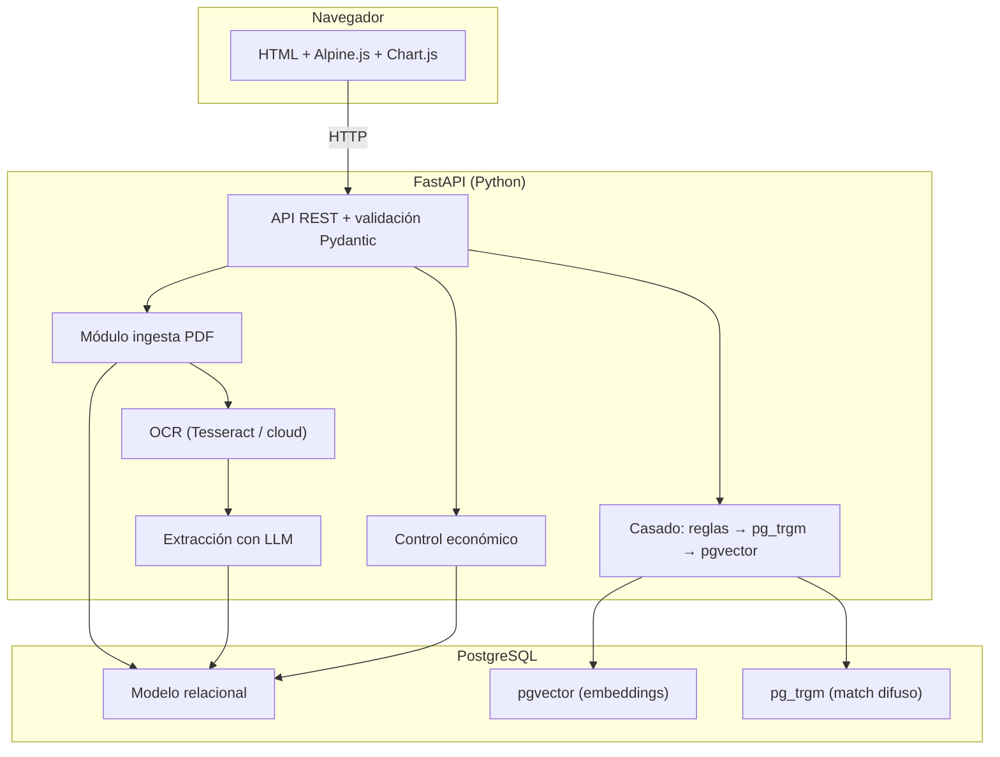
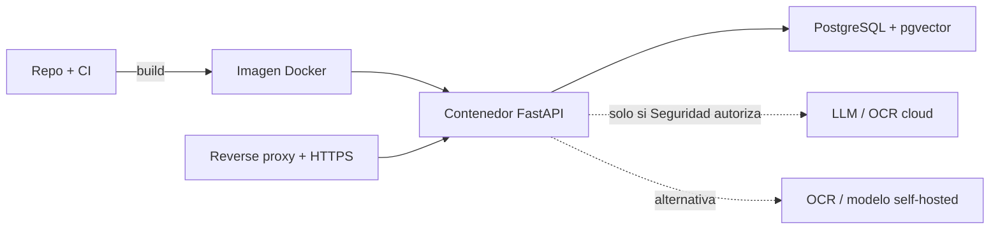
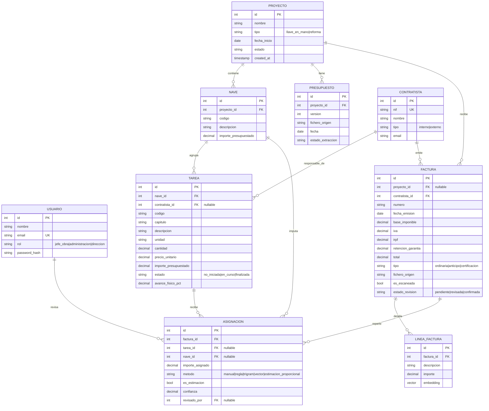

# Gestor de presupuestos y facturas de obra

## Índice

0. [Ficha del proyecto](#0-ficha-del-proyecto)
1. [Descripción general del producto](#1-descripción-general-del-producto)
2. [Arquitectura del sistema](#2-arquitectura-del-sistema)
3. [Modelo de datos](#3-modelo-de-datos)
4. [Especificación de la API](#4-especificación-de-la-api)
5. [Historias de usuario](#5-historias-de-usuario)
6. [Tickets de trabajo](#6-tickets-de-trabajo)
7. [Pull requests](#7-pull-requests)

---

## 0. Ficha del proyecto

### **0.1. Tu nombre completo:**

Fernando Fabián Artal

### **0.2. Nombre del proyecto:**

Gestor de presupuestos y facturas de obra

### **0.3. Descripción breve del proyecto:**

Aplicación interna para el seguimiento de proyectos de obra en explotaciones ganaderas (llave en mano y reformas). Lee presupuestos en PDF, extrae las tareas, crea el proyecto, ingiere las facturas de los contratistas y compara el gasto real con el presupuestado. Separa siempre el control económico del avance físico de la obra.

### **0.4. URL del proyecto:**

 — Aún sin desplegar. Rellenar cuando exista entorno._

### 0.5. URL o archivo comprimido del repositorio

 — Rellenar con la URL del repo o el zip._

---

## 1. Descripción general del producto

### **1.1. Objetivo:**

Controlamos el gasto de obra con poco esfuerzo manual. Hoy el presupuesto va en PDF y las facturas llegan sueltas de cada contratista; cruzar ambos a mano es lento y poco fiable.

El producto resuelve tres cosas:

- **Ahorra trabajo de captura.** Lee el presupuesto en PDF y crea el proyecto con su lista de tareas, sin teclear.
- **Da control económico fiable.** Compara presupuesto contra gasto real, con el detalle que cada contratista permita.
- **Separa dinero de ejecución.** Una tarea puede estar pagada al 100% y sin terminar. El avance físico lo marca una persona; el gasto lo lleva el sistema.

Lo usan el jefe de obra, administración y dirección de Exafan.

### **1.2. Características y funcionalidades principales:**

- **Ingesta de presupuestos.** Sube un PDF nativo, el sistema extrae naves y tareas (código, capítulo, descripción, unidad, cantidad, precio unitario, importe, responsable) y crea el proyecto.
- **Ingesta de facturas.** Sube facturas o léelas de una carpeta compartida. Si vienen escaneadas, pasan por OCR.
- **Pantalla de revisión humana.** Cuando el OCR o el LLM dudan, una persona confirma o corrige antes de guardar. No es opcional.
- **Enlace factura ↔ contratista.** Vínculo fiable y directo por NIF. Es el que de verdad cuadra.
- **Reparto estimado a nave/tarea.** El contratista factura por todo su trabajo, sin desglose por tarea. El sistema reparte proporcional al presupuesto y lo etiqueta siempre como estimación, nunca como dato medido.
- **Control económico.** Desvío presupuesto vs gasto real por contratista y por nave, con gráficos.
- **Seguimiento de estado.** No iniciada / en curso / finalizada, más porcentaje de avance físico, independiente del gasto.
- **Alertas.** Desvío sobre presupuesto, sobrecoste, tarea sin facturas.

### **1.3. Diseño y experiencia de usuario:**

Flujo previsto:

1. El jefe de obra sube el presupuesto en PDF.
2. El sistema lo lee y muestra las tareas detectadas para validar.
3. Se crea el proyecto con naves y tareas.
4. Administración sube facturas o las lee de la carpeta compartida.
5. Si el OCR duda, la pantalla de revisión pide confirmar antes de guardar.
6. El sistema enlaza cada factura con su contratista y reparte el importe (estimado) a nave/tarea.
7. Dirección consulta el control económico: desvío por contratista y por nave.

### **1.4. Instrucciones de instalación:**

---

## 2. Arquitectura del Sistema

### **2.1. Diagrama de arquitectura:**


```mermaid
flowchart TB
    subgraph Cliente["Navegador"]
        UI["HTML + Alpine.js + Chart.js"]
    end

    subgraph App["FastAPI (Python)"]
        API["API REST + validación Pydantic"]
        ING["Módulo ingesta PDF"]
        OCR["OCR (Tesseract / cloud)"]
        LLM["Extracción con LLM"]
        MATCH["Casado: reglas → pg_trgm → pgvector"]
        ECON["Control económico"]
    end

    subgraph Datos["PostgreSQL"]
        REL["Modelo relacional"]
        VEC["pgvector (embeddings)"]
        TRG["pg_trgm (match difuso)"]
    end

    UI -->|HTTP| API
    API --> ING --> OCR --> LLM
    API --> MATCH
    API --> ECON
    ING --> REL
    LLM --> REL
    MATCH --> VEC
    MATCH --> TRG
    ECON --> REL
```

**Patrón.** Monolito modular servido por FastAPI: un solo despliegue, front ligero servido desde el propio backend, una única base de datos que hace lo relacional y lo vectorial.

**Por qué esta arquitectura.**

- El trabajo duro (leer PDF, OCR, extracción con LLM, embeddings) vive en Python, que tiene el ecosistema más maduro para esto.
- Los datos son relacionales de verdad: proyecto → naves → tareas → facturas → importes → estados exige integridad referencial y sumas que cuadren.
- Lo vectorial es un medio, no el fin: cabe en Postgres con `pgvector`. Un proyecto tiene decenas de tareas, no millones; no hace falta base vectorial dedicada.

**Beneficios.** Un solo lenguaje donde importa, un solo despliegue, menos infraestructura, arranque rápido del MVP.

**Sacrificios.** El monolito escala peor si el volumen o la parte de IA crecen mucho; en ese caso migraríamos a un microservicio de IA aislado (Opción C del stack). El front sin build limita interfaces muy complejas, aunque cubre de sobra la pantalla de revisión.

### **2.2. Descripción de componentes principales:**

- **Front — HTML + Alpine.js + Chart.js.** Reactividad con atributos en el HTML, sin bundler. Chart.js para gráficos de desvío. Tabulator opcional si las tablas de revisión crecen.
- **Backend — FastAPI (Python).** API tipada. Pydantic valida los datos extraídos casi gratis.
- **Librerías de documento — PyMuPDF / pdfplumber.** Lectura de PDF nativos (presupuestos), fiable.
- **OCR — Tesseract local o servicio cloud.** Solo para facturas escaneadas. Baja fiabilidad, obliga a revisión humana.
- **Extracción — LLM vía API.** Convierte texto suelto de la factura o el presupuesto en campos estructurados.
- **Casado — reglas + `pg_trgm` + `pgvector`.** Vectores para el "se parece", reglas para el "cuadra".
- **Base de datos — PostgreSQL.** Modelo relacional, embeddings (`pgvector`) y match difuso (`pg_trgm`) en la misma base.

### **2.3. Descripción de alto nivel del proyecto y estructura de ficheros**

```
app/
├── main.py            # Arranque FastAPI, sirve front y monta routers
├── config.py          # Variables de entorno y ajustes
├── db.py              # Conexión y sesión de Postgres
├── models/            # Modelos SQLAlchemy (proyecto, nave, tarea, factura...)
├── schemas/           # Esquemas Pydantic (validación entrada/salida)
├── routers/           # Endpoints por dominio (proyectos, facturas, control)
├── services/
│   ├── ingesta.py     # Lectura de PDF y orquestación de extracción
│   ├── ocr.py         # OCR de escaneados
│   ├── extraccion.py  # Llamadas al LLM y parseo a campos
│   ├── casado.py      # Reglas + pg_trgm + pgvector
│   └── economico.py   # Cálculo de desvíos
├── seed.py            # Semillas anonimizadas
└── static/            # HTML + Alpine.js + Chart.js
migrations/            # Migraciones Alembic
tests/                 # Tests unitarios e integración
```

Sigue una separación por capas: routers (entrada) → services (lógica) → models (datos). Facilita testear la lógica sin tocar la API.

### **2.4. Infraestructura y despliegue**

_ Propuesta; sin desplegar todavía._


```mermaid
flowchart LR
    Dev["Repo + CI"] -->|build| IMG["Imagen Docker"]
    IMG --> APP["Contenedor FastAPI"]
    APP --> DB["PostgreSQL + pgvector"]
    APP -.->|solo si Seguridad autoriza| CLOUD["LLM / OCR cloud"]
    APP -.->|alternativa| SELF["OCR / modelo self-hosted"]
    PROXY["Reverse proxy + HTTPS"] --> APP
```

Despliegue previsto: `docker compose` con dos servicios (app y Postgres) tras un reverse proxy con HTTPS. Si Seguridad no autoriza cloud, se añade un servicio de OCR/modelo self-hosted. Secretos en variables de entorno, nunca en el repo ni en la URL.

### **2.5. Seguridad**

**[SENSIBLE]** — Las facturas llevan NIF, nombres y cuentas: son datos personales y financieros.

- **No sacar datos a terceros sin permiso.** Enviar facturas a OCR/LLM cloud es sacar datos personales fuera. Requiere autorización de **ai.seguridad@exafan.com** y cláusula contractual de que el proveedor **no entrena** con esos datos **[NO-ENTRENAR]**.
- **Alternativa si no se autoriza.** OCR y modelos self-hosted (Tesseract local, modelo abierto en nuestra infra). Menos calidad y más mantenimiento, pero los datos no salen.
- **Validación en el backend, siempre.** La validación del front (no guardar hasta verificar) es comodidad, no seguridad. Se repite en el servidor con Pydantic.
- **Revisión humana obligatoria.** El OCR de escaneados fallará; ninguna factura se guarda sin confirmar cuando la extracción duda.
- **Datos de prueba anonimizados.** No subir facturas reales sin anonimizar. Marcar dudosos con **[VERIFICAR]**.
- **Control de acceso por rol.** Jefe de obra, administración y dirección con permisos distintos. Contraseñas con hash (argon2/bcrypt), HTTPS obligatorio.

### **2.6. Tests**

_ Batería prevista; marcar como hecho lo que se implemente._

- **Extracción de presupuesto.** Con un PDF nativo de ejemplo (anonimizado): el número de tareas y la suma de importes cuadran con el total.
- **Control económico.** Presupuestado vs asignado por contratista y por nave; las sumas cierran.
- **Casado por contratista.** Enlace por NIF: la factura cae en el contratista correcto.
- **Reparto estimado.** El importe repartido a naves suma el total de la factura y va marcado como estimación.
- **Validación backend.** Pydantic rechaza payloads mal formados aunque el front los deje pasar.
- **Integración de ingesta.** Endpoint de subida con PDF de prueba: crea proyecto, naves y tareas.

---

## 3. Modelo de Datos

### **3.1. Diagrama del modelo de datos:**


```mermaid
erDiagram
    USUARIO ||--o{ ASIGNACION : revisa
    PROYECTO ||--o{ NAVE : contiene
    PROYECTO ||--o{ PRESUPUESTO : tiene
    PROYECTO ||--o{ FACTURA : recibe
    NAVE ||--o{ TAREA : agrupa
    CONTRATISTA ||--o{ TAREA : responsable_de
    CONTRATISTA ||--o{ FACTURA : emite
    FACTURA ||--o{ LINEA_FACTURA : detalla
    FACTURA ||--o{ ASIGNACION : reparte
    TAREA ||--o{ ASIGNACION : recibe
    NAVE ||--o{ ASIGNACION : imputa

    USUARIO {
        int id PK
        string nombre
        string email UK
        string rol "jefe_obra|administracion|direccion"
        string password_hash
    }
    PROYECTO {
        int id PK
        string nombre
        string tipo "llave_en_mano|reforma"
        date fecha_inicio
        string estado
        timestamp created_at
    }
    PRESUPUESTO {
        int id PK
        int proyecto_id FK
        int version
        string fichero_origen
        date fecha
        string estado_extraccion
    }
    NAVE {
        int id PK
        int proyecto_id FK
        string codigo
        string descripcion
        decimal importe_presupuestado
    }
    CONTRATISTA {
        int id PK
        string nif UK
        string nombre
        string tipo "interno|externo"
        string email
    }
    TAREA {
        int id PK
        int nave_id FK
        int contratista_id FK "nullable"
        string codigo
        string capitulo
        string descripcion
        string unidad
        decimal cantidad
        decimal precio_unitario
        decimal importe_presupuestado
        string estado "no_iniciada|en_curso|finalizada"
        decimal avance_fisico_pct
    }
    FACTURA {
        int id PK
        int proyecto_id FK "nullable"
        int contratista_id FK
        string numero
        date fecha_emision
        decimal base_imponible
        decimal iva
        decimal irpf
        decimal retencion_garantia
        decimal total
        string tipo "ordinaria|anticipo|certificacion"
        string fichero_origen
        bool es_escaneada
        string estado_revision "pendiente|revisada|confirmada"
    }
    LINEA_FACTURA {
        int id PK
        int factura_id FK
        string descripcion
        decimal importe
        vector embedding
    }
    ASIGNACION {
        int id PK
        int factura_id FK
        int tarea_id FK "nullable"
        int nave_id FK "nullable"
        decimal importe_asignado
        string metodo "manual|regla|trigram|vector|estimacion_proporcional"
        bool es_estimacion
        decimal confianza
        int revisado_por FK "nullable"
    }
```

### **3.2. Descripción de entidades principales:**

- **USUARIO.** Quien usa la app. `rol` define permisos (jefe de obra, administración, dirección). `email` único, contraseña con hash.
- **PROYECTO.** Una obra. Cabecera de todo. `tipo` distingue llave en mano de reforma.
- **PRESUPUESTO.** El PDF de origen y su versión. Permite gestionar revisiones sin perder el histórico. Enlaza con el proyecto.
- **NAVE.** Unidad de desglose del presupuesto. El presupuesto viene desglosado por nave; es el nivel de control fiable hacia abajo. Guarda su importe presupuestado.
- **CONTRATISTA.** Equipo interno o subcontrata externa. `nif` único: es la clave del enlace fiable con las facturas.
- **TAREA.** Partida del presupuesto, colgada de una nave. Campos del presupuesto más `estado` (económico/administrativo) y `avance_fisico_pct` (ejecución real). Los dos van separados a propósito: pagado no es ejecutado.
- **FACTURA.** Documento del contratista. Siempre enlaza con un contratista (por NIF). Guarda base, IVA, IRPF, retención de garantía y `tipo` (ordinaria, anticipo, certificación). `estado_revision` controla la revisión humana; `es_escaneada` avisa de baja fiabilidad.
- **LINEA_FACTURA.** Detalle de la factura, si lo hay. `embedding` alimenta el casado semántico con `pgvector`.
- **ASIGNACION.** Tabla puente del casado. Reparte el importe de una factura a nave o tarea. `es_estimacion` marca cuándo el reparto es proporcional al presupuesto (no medido). `metodo` y `confianza` registran cómo se hizo el enlace y `revisado_por` quién lo confirmó.

> **Nota de negocio [VERIFICAR].** El contratista factura por todo su trabajo, sin desglose por nave ni tarea. El único enlace fiable es factura ↔ contratista (NIF). El reparto a nave/tarea es estimación proporcional al presupuesto y así se etiqueta siempre. Si se consigue exigir certificación medida por nave, ese reparto pasa a ser dato real; hasta entonces, es estimación.

---

## 4. Especificación de la API

_Tres endpoints principales en formato OpenAPI (resumido)._

```yaml
openapi: 3.0.3
info:
  title: Gestor de presupuestos y facturas de obra
  version: 0.1.0
paths:
  /proyectos/importar-presupuesto:
    post:
      summary: Sube un presupuesto en PDF y crea el proyecto con sus tareas
      requestBody:
        required: true
        content:
          multipart/form-data:
            schema:
              type: object
              properties:
                fichero:
                  type: string
                  format: binary
      responses:
        "201":
          description: Proyecto creado con tareas extraídas (pendientes de validar)
          content:
            application/json:
              schema:
                type: object
                properties:
                  proyecto_id: { type: integer }
                  naves_detectadas: { type: integer }
                  tareas_detectadas: { type: integer }
                  requiere_revision: { type: boolean }

  /facturas:
    post:
      summary: Sube una factura; aplica OCR si es escaneada y propone el casado
      requestBody:
        required: true
        content:
          multipart/form-data:
            schema:
              type: object
              properties:
                fichero:
                  type: string
                  format: binary
                proyecto_id:
                  type: integer
      responses:
        "201":
          description: Factura registrada, pendiente de revisión si el OCR duda
          content:
            application/json:
              schema:
                type: object
                properties:
                  factura_id: { type: integer }
                  contratista_nif: { type: string }
                  estado_revision: { type: string }

  /proyectos/{id}/control-economico:
    get:
      summary: Desvío presupuesto vs gasto real por contratista y por nave
      parameters:
        - name: id
          in: path
          required: true
          schema: { type: integer }
      responses:
        "200":
          description: Resumen económico
          content:
            application/json:
              schema:
                type: object
                properties:
                  por_contratista:
                    type: array
                    items:
                      type: object
                      properties:
                        nif: { type: string }
                        presupuestado: { type: number }
                        facturado: { type: number }
                        desvio: { type: number }
                  por_nave:
                    type: array
                    items:
                      type: object
                      properties:
                        nave: { type: string }
                        presupuestado: { type: number }
                        gasto_estimado: { type: number }
                        es_estimacion: { type: boolean }
```

**Ejemplo — respuesta de `GET /proyectos/12/control-economico`:**

```json
{
  "por_contratista": [
    { "nif": "B00000000", "presupuestado": 120000, "facturado": 98000, "desvio": -22000 }
  ],
  "por_nave": [
    { "nave": "Nave 1", "presupuestado": 60000, "gasto_estimado": 49000, "es_estimacion": true }
  ]
}
```

> El desvío por contratista es dato medido. El desvío por nave es estimación mientras no haya certificación medida por nave (`es_estimacion: true`).

---

## 5. Historias de Usuario

**Historia de Usuario 1 — Ingesta de presupuesto**

Como **jefe de obra**, quiero **subir el presupuesto en PDF y que el sistema cree el proyecto con sus naves y tareas**, para **no teclear cada partida a mano**.

Criterios de aceptación:
- Subo un PDF nativo y veo las tareas detectadas antes de guardar.
- El sistema muestra código, capítulo, descripción, unidad, cantidad, precio unitario e importe por tarea.
- La suma de importes cuadra con el total del presupuesto; si no, me avisa.
- Puedo corregir un campo antes de confirmar la creación del proyecto.

**Historia de Usuario 2 — Revisión de factura con OCR**

Como **administrativo**, quiero **revisar lo que el sistema ha leído de una factura antes de guardarla**, para **corregir los errores del OCR y no meter datos mal**.

Criterios de aceptación:
- Al subir una factura escaneada, el sistema marca los campos con baja confianza.
- Veo el enlace propuesto factura ↔ contratista por NIF y puedo corregirlo.
- No se guarda nada hasta que confirmo.
- El backend vuelve a validar los datos aunque yo los haya confirmado en el front.

**Historia de Usuario 3 — Control económico para dirección**

Como **dirección**, quiero **ver el desvío entre presupuesto y gasto real por contratista y por nave**, para **gestionar la obra con datos y no de oído**.

Criterios de aceptación:
- Veo un gráfico de presupuesto vs gasto real por contratista.
- El detalle por nave aparece claramente marcado como estimación cuando no hay certificación medida.
- Puedo filtrar por proyecto.
- Distingo el gasto (económico) del avance físico de cada tarea.

---

## 6. Tickets de Trabajo

**Ticket 1 — Backend: ingesta de presupuesto en PDF**

- **Descripción.** Implementar `POST /proyectos/importar-presupuesto`: leer el PDF nativo con PyMuPDF/pdfplumber, extraer naves y tareas con el LLM, validar con Pydantic y persistir el proyecto en estado "pendiente de revisión".
- **Tareas.** Router y esquema; servicio de lectura de PDF; llamada al LLM con prompt de extracción; mapeo a modelos; control de que las sumas cuadran.
- **Criterios de aceptación.** Con un PDF de ejemplo anonimizado, crea proyecto con el nº correcto de naves y tareas; la suma de importes cuadra; devuelve `requiere_revision`.
- **Definición de hecho.** Test de integración verde; validación Pydantic; sin datos reales en el repo.

**Ticket 2 — Frontend: pantalla de revisión humana**

- **Descripción.** Pantalla en HTML + Alpine.js para revisar lo extraído de un presupuesto o factura antes de guardar. Resalta campos de baja confianza y permite editar.
- **Tareas.** Vista con tabla editable (Tabulator si hace falta); marca visual de confianza baja; botón de confirmar que llama al backend; estado reactivo con Alpine.
- **Criterios de aceptación.** No permite guardar con campos obligatorios vacíos; muestra el enlace propuesto por NIF; al confirmar, envía al backend y refleja el resultado.
- **Definición de hecho.** Se sirve desde FastAPI; probada con datos de ejemplo; recuerda que la validación real está en el backend.

**Ticket 3 — Base de datos: esquema y control económico**

- **Descripción.** Migraciones del modelo relacional (proyecto, nave, contratista, tarea, factura, línea, asignación) y habilitar `pgvector` y `pg_trgm`.
- **Tareas.** Migraciones Alembic; extensiones; índices por NIF y por proyecto; columna `embedding` en línea de factura; semillas anonimizadas.
- **Criterios de aceptación.** `alembic upgrade head` crea todo; extensiones activas; consulta de desvío por contratista y por nave devuelve datos coherentes con las semillas.
- **Definición de hecho.** Integridad referencial probada; el reparto estimado suma el total de la factura; documentado en el readme.

---

## 7. Pull Requests

_El desarrollo aún no ha arrancado._

