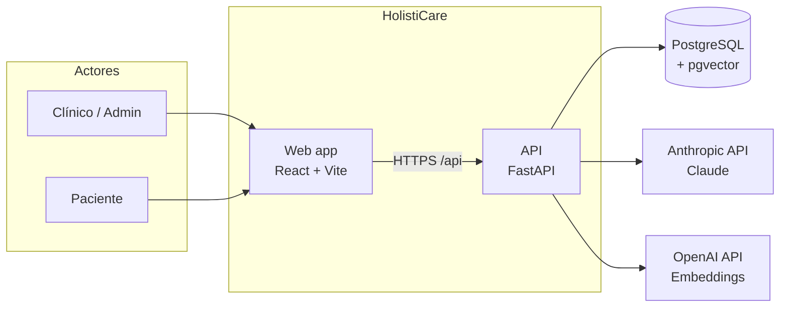
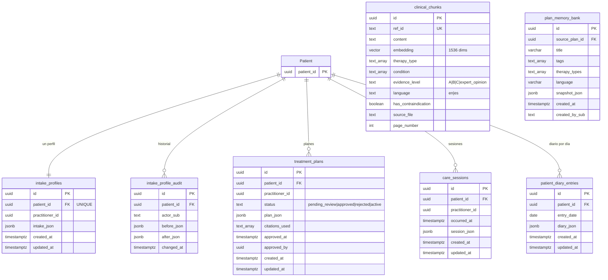

## Índice

0. [Ficha del proyecto](#0-ficha-del-proyecto)
1. [Descripción general del producto](#1-descripción-general-del-producto)
2. [Arquitectura del sistema](#2-arquitectura-del-sistema)
3. [Modelo de datos](#3-modelo-de-datos)
4. [Especificación de la API](#4-especificación-de-la-api)
5. [Historias de usuario](#5-historias-de-usuario)
6. [Tickets de trabajo](#6-tickets-de-trabajo)
7. [Pull requests](#7-pull-requests)

---

## 0. Ficha del proyecto

### **0.1. Tu nombre completo:**

Andres Viveros Wacher

### **0.2. Nombre del proyecto:**

HolistiCare

### **0.3. Descripción breve del proyecto:**

Plataforma de apoyo a la decisión clínica con IA para rehabilitación holística e integrativa. Ayuda a practicantes a construir perfiles estructurados de pacientes, generar borradores de planes de tratamiento multi-semana con RAG, registrar sesiones, capturar diarios de síntomas entre consultas y analizar tendencias de outcomes. Todo output de IA requiere revisión y aprobación explícita del practicante antes de activarse.

Proyecto final del Máster AI4Devs (marzo 2026) y primer entregable de consultoría para clínicas de medicina holística e integrativa en México.

### **0.4. URL del proyecto:**

Repositorio de código fuente (público): [https://github.com/andresviverosw/holisticare](https://github.com/andresviverosw/holisticare)

Entorno local de desarrollo (MVP):

- Frontend: `http://localhost:5173`
- API (documentación OpenAPI): `http://localhost:8000/docs`

> Despliegue en producción pendiente para el piloto clínico. La topología recomendada para el MVP es híbrida: VPS (Hetzner o Fly.io) + Postgres gestionado con pgvector (Neon/Supabase) + frontend en Cloudflare Pages.

### 0.5. URL o archivo comprimido del repositorio

[https://github.com/andresviverosw/holisticare](https://github.com/andresviverosw/holisticare)

---

## 1. Descripción general del producto

### **1.1. Objetivo:**

**Propósito:** HolistiCare es una plataforma de apoyo a la decisión clínica (Clinical Decision Support) orientada a practicantes de rehabilitación holística — fisioterapeutas, naturópatas, médicos de medicina integrativa — que atienden pacientes ambulatorios en México.

**Problema que resuelve:** Los pacientes de rehabilitación holística reciben atención a través de múltiples modalidades (acupuntura, hidroterapia, fitoterapia, fisioterapia, terapia psicoemocional, entre otras). En muchas clínicas el seguimiento del progreso permanece fragmentado y la adaptación del tratamiento se basa principalmente en la intuición clínica. Esto genera tres brechas principales:

- Baja continuidad entre sesiones
- Personalización limitada a lo largo del tiempo
- Medición débil de outcomes e impacto terapéutico

Los practicantes de medicina naturopática y Nueva Medicina Germánica (NMG) en México operan sin herramientas digitales diseñadas para su paradigma clínico: documentan en papel, pierden continuidad entre sesiones, no miden outcomes de forma sistemática y construyen planes desde la experiencia individual sin respaldo de evidencia estructurada.

**Valor que aporta:**

- **Valor clínico:** Expediente estructurado, notas de sesión asistidas por IA, planes sugeridos con RAG basados en evidencia (siempre con aprobación del practicante), detección de contraindicaciones.
- **Valor para el paciente:** Diario de síntomas y bienestar mobile-friendly entre sesiones; visualización de progreso longitudinal con instrumentos validados (NRS, PSQI, PHQ-9, entre otros).
- **Valor operativo:** Resumen clínico al abrir una consulta; detección de plateaus; correlación de terapias con outcomes.
- **Valor de negocio:** Expediente trazable bajo NOM-024-SSA3-2012; primer producto de una línea vertical para el sector de medicina alternativa y complementaria (MAC) en México.

**Usuarios objetivo:**

- **Primarios:** Clínicos de rehabilitación holística (fisioterapeutas, naturópatas, médicos de medicina integrativa)
- **Secundarios:** Pacientes ambulatorios de rehabilitación
- **Terciarios:** Administradores y directores de clínica

### **1.2. Características y funcionalidades principales:**

**Alcance del MVP (6 features):**

1. **Intake y perfil de paciente** con señalización de riesgos por LLM (`generic_holistic_v0`)
2. **Generador de planes de tratamiento con IA (RAG)** con compuerta de aprobación del practicante
3. **Registro de sesiones** (datos estructurados + texto libre + asistencia de notas por LLM)
4. **Diario de síntomas y bienestar del paciente** (mobile-friendly)
5. **Dashboard de analítica de progreso** (tendencias, detección de plateaus)
6. **Modelo de predicción de outcomes** para trayectoria de recuperación

**Funcionalidades implementadas o en curso (según backlog del MVP):**

| Área | Funcionalidad | Descripción |
|------|---------------|-------------|
| Intake | Formulario estructurado | Captura de queja principal, condiciones, metas, contraindicaciones, medicamentos, alergias y outcomes de línea base |
| Intake | Banderas de riesgo | Análisis de riesgo a partir del intake con explicaciones para el clínico |
| Intake | UUID automático | Asignación de UUID v4 para pacientes nuevos y lista de pacientes recientes |
| Planes IA | Generación RAG | Borrador multi-semana con citaciones REF-ID y estado `pending_review` |
| Planes IA | Aprobación/rechazo | El practicante aprueba o rechaza antes de activar el plan |
| Planes IA | Biblioteca de plantillas | Memory bank de planes aprobados reutilizables (US-PLAN-004) |
| RAG | Ingesta de corpus | PDF y HTML → chunking → embeddings → índice vectorial |
| RAG | Nutrición | Evidencia nutricional con guías de comer/evitar según perfil |
| Sesiones | Log estructurado | Intervenciones y observaciones por visita |
| Sesiones | Asistencia de notas | Sugerencia de completado de nota desde inputs estructurados |
| Diario | Check-in diario | Dolor, sueño, ánimo, función; notas libres en español |
| Analítica | Tendencias | Series temporales de outcomes core |
| Analítica | Plateaus | Detección automática de estancamiento o empeoramiento |
| Predicción | Trayectoria | Estimación de recuperación y sugerencias de ajuste |

**Instrumentos de outcome soportados:**

- NRS o VAS (dolor)
- SF-12 (calidad de vida)
- PSQI (sueño)
- PHQ-9 / GAD-7 (salud mental)
- Índice de Barthel (independencia funcional)
- Específicos por condición: DASH, WOMAC, ODI

**Principio de gobernanza clínica:** Ningún plan generado por IA puede activarse sin aprobación explícita del practicante certificado. HolistiCare es apoyo a la decisión clínica, no un dispositivo de diagnóstico autónomo.

### **1.3. Diseño y experiencia de usuario:**

**Principios de UX:**

- Español como idioma principal de la interfaz y del contenido clínico libre
- Flujo centrado en el practicante: la IA es asistente, no sustituto
- Transparencia: citaciones REF-ID visibles en revisión de planes
- Formularios estructurados en lugar de JSON manual para reducir errores
- Mobile-friendly para el diario del paciente y revisión rápida en consulta (PWA planificada)

**Módulos actuales de la UI (MVP web):**

| Ruta | Módulo | Descripción |
|------|--------|-------------|
| `/login` | Autenticación | Dev login o token JWT manual |
| `/dashboard` | Dashboard | Intake estructurado, generación de plan IA, biblioteca de plantillas |
| `/plan/:planId` | Revisión de plan | Inspección de semanas, citaciones, aprobación/rechazo |
| `/plan/:planId/sources` | Fuentes | Contenido completo de chunks citados |
| `/chunks` | Base de conocimiento | Navegación del corpus clínico indexado |

**Flujo principal del practicante:**

1. Inicia sesión en la aplicación web
2. En el Dashboard, crea un paciente nuevo (UUID v4 automático) o carga uno existente
3. Completa el intake estructurado y opcionalmente lo guarda
4. Configura modalidades disponibles e idioma del plan
5. Genera un borrador de plan con IA
6. Revisa el plan (nota de confianza, metadatos de retrieval, semanas, contraindicaciones, citaciones)
7. Aprueba o rechaza el plan; si aprueba, puede guardarlo en la biblioteca de plantillas
8. Consulta fuentes de evidencia vinculadas al plan

**Flujo del paciente (diario):**

1. Envía check-ins diarios de dolor, sueño, ánimo y función
2. Puede añadir notas libres en español
3. El clínico visualiza tendencias y banderas de plateau en el dashboard analítico

> **Nota para la entrega:** Capturas de pantalla y videotutorial de la experiencia de usuario se añadirán en la siguiente fase de entrega, una vez consolidado el piloto clínico. Los flujos descritos corresponden al estado actual documentado en `docs/07-user-guide.md` del repositorio de código fuente.

### **1.4. Instrucciones de instalación:**

**Prerrequisitos:**

- Docker Desktop (en ejecución)
- Python 3.10+
- Node.js LTS y npm
- PowerShell 7+ (recomendado en Windows)

**Configuración inicial (primera vez):**

```powershell
# Desde la raíz del repositorio holisticare
Copy-Item ".env.example" ".env" -Force
# Completar las claves requeridas en .env (ANTHROPIC_API_KEY, OPENAI_API_KEY, SECRET_KEY, etc.)

python -m venv .venv
.\.venv\Scripts\python -m pip install --upgrade pip
.\.venv\Scripts\python -m pip install -r "backend\requirements.txt"

cd frontend
npm install
cd ..
```

**Iniciar servicios con Docker Compose:**

```powershell
docker compose up -d --build
docker compose ps
```

Servicios esperados:

- `holisticare_db` — PostgreSQL + pgvector
- `holisticare_backend` — FastAPI
- `holisticare_frontend` — React + Vite

**Ingesta del corpus clínico (mock o real):**

```powershell
docker compose exec backend python -m scripts.ingest --source data/mock
```

**Acceso a la aplicación:**

- Frontend: `http://localhost:5173`
- API docs: `http://localhost:8000/docs`

**Autenticación de desarrollo:**

Por defecto `ALLOW_DEV_AUTH=false`. Para habilitar el botón "Entrar (desarrollo)" en la UI, añadir a `.env`:

```env
ALLOW_DEV_AUTH=true
```

Reiniciar el backend: `docker compose up -d backend`. No usar en producción.

**Ejecutar tests (suite local sin Docker ni API keys):**

```powershell
python -m pytest -q
```

Dentro del contenedor backend:

```powershell
docker compose exec backend pytest tests/ -v
```

**Verificación de salud:**

- `GET /health` debe responder `200`
- Smoke de API: `npm run smoke:api` (desde la raíz del repo)

---

## 2. Arquitectura del Sistema

### **2.1. Diagrama de arquitectura:**

HolistiCare sigue una arquitectura de **tres capas con pipeline RAG embebido** en el backend. No es microservicios en el MVP: un único servicio FastAPI orquesta la lógica de negocio, el pipeline de IA y la persistencia. El frontend es una SPA estática desacoplada.

**Patrón:** Monolito modular con separación clara API → servicios → RAG pipeline → base de datos. Se eligió por ser un proyecto unipersonal con alcance MVP acotado: reduce complejidad operativa, permite entrega iterativa por sprints y mantiene trazabilidad clínica en un solo datastore.

**Beneficios:**

- Un solo despliegue Docker Compose para desarrollo y piloto
- PostgreSQL unificado para datos transaccionales y vectores (pgvector)
- Trazabilidad end-to-end de intake → retrieval → plan → aprobación

**Sacrificios:**

- Sin alta disponibilidad ni autoescalado en MVP
- El reranker (cross-encoder) puede ser cuello de botella de latencia
- Acoplamiento de carga OLTP y búsqueda vectorial en la misma base de datos

**Diagrama de contexto (C4 Nivel 1):**


```mermaid
flowchart LR
  subgraph Actores
    CL[Clínico / Admin]
    PT[Paciente]
  end

  subgraph HolistiCare
    FE[Web app\nReact + Vite]
    API[API\nFastAPI]
  end

  DB[(PostgreSQL\n+ pgvector)]
  AN[Anthropic API\nClaude]
  OA[OpenAI API\nEmbeddings]

  CL --> FE
  PT --> FE
  FE -->|HTTPS /api| API
  API --> DB
  API --> AN
  API --> OA
```

**Pipeline RAG (5 capas):**

1. **Ingesta offline:** PDF → chunking (400–600 tokens, solapamiento 50–100) → embeddings → índice vectorial con metadatos (tipo de terapia, condición, nivel de evidencia, idioma)
2. **Construcción de query:** Resumen del perfil por LLM + expansión multi-query (3–4 ángulos)
3. **Retrieval y reranking:** Top candidatos → rerank → top 8–10 chunks al generador
4. **Prompt y generación:** Prompt con citaciones REF-ID, verificación de contraindicaciones
5. **Output estructurado y gobernanza:** JSON del plan persistido con referencias y registro de aprobación del practicante

### **2.2. Descripción de componentes principales:**

| Componente | Responsabilidad | Tecnología |
|------------|-----------------|------------|
| Frontend | SPA: intake, generación de plan, revisión, navegación de chunks, manejo de JWT | React, Vite, Tailwind CSS |
| API Backend | REST API, autenticación JWT, orquestación de servicios y pipeline RAG | FastAPI, Python |
| Pipeline RAG | Retrieval, rerank y generación de planes (módulos en `app/rag/`) | LangChain / LlamaIndex, Python |
| Base de datos relacional | Perfiles, planes, sesiones, diario, auditoría | PostgreSQL |
| Índice vectorial | Chunks clínicos y búsqueda por similitud | pgvector (tabla `data_clinical_chunks` / `clinical_chunks`) |
| Servicios de modelo | Embeddings y generación de texto | OpenAI (text-embedding-3-small), Anthropic (Claude Sonnet) |
| Reranker (opcional) | Reordenamiento de candidatos recuperados | Cohere Rerank o cross-encoder local |
| ML (feature 6) | Predicción de trayectoria de recuperación | scikit-learn / XGBoost |

**Servicios de dominio en el backend:**

- `intake_service` — persistencia y recuperación de perfiles
- `plan_persistence` — generación, aprobación y fuentes de planes
- `diary_service` — check-ins diarios del paciente
- `session_service` — registro de sesiones clínicas
- `analytics_service` — tendencias, plateaus, trayectoria y recomendaciones
- `ingestion_service` — ingesta de documentos al índice vectorial
- `plan_memory_bank_service` — biblioteca de plantillas aprobadas

### **2.3. Descripción de alto nivel del proyecto y estructura de ficheros**

**Estructura del repositorio:**

```text
holisticare/
├── backend/
│   ├── app/
│   │   ├── api/          # Rutas REST (auth, rag)
│   │   ├── core/         # Config, DB, seguridad
│   │   ├── rag/          # Pipeline RAG (ingestion, retrieval, generation)
│   │   ├── schemas/      # Contratos Pydantic (intake_v0, diary_v0, session_v0)
│   │   └── services/     # Lógica de dominio
│   ├── scripts/          # Ingesta, smoke tests, ensayos de piloto
│   └── tests/            # pytest (API, RAG, seguridad)
├── frontend/
│   └── src/
│       ├── pages/        # Dashboard, PlanReview, Login, Chunks
│       ├── services/     # Cliente API (axios)
│       └── utils/        # intakeBuilder, uuidV4, recentPatients
├── infra/
│   └── init.sql          # Esquema PostgreSQL + pgvector
├── docs/                 # Documentación por fases (01–10)
├── docker-compose.yml
├── .env.example
└── README.md
```

**Patrón arquitectónico:** Monorepo con backend y frontend separados, comunicación vía REST + JWT. El pipeline RAG vive como módulos Python dentro del backend, no como microservicio independiente.

### **2.4. Infraestructura y despliegue**

**Stack tecnológico:**

| Capa | Tecnología |
|------|-----------|
| LLM | Claude API (claude-sonnet) |
| Embeddings | OpenAI text-embedding-3-small |
| RAG y orquestación | LangChain o LlamaIndex |
| Vector store | PostgreSQL + pgvector |
| Reranker (opcional) | Cohere Rerank |
| Backend | Python + FastAPI |
| Frontend | React + Tailwind CSS + Vite |
| ML | scikit-learn / XGBoost |
| Auth y privacidad | JWT + cifrado en reposo |
| Despliegue | Docker + GCP o AWS (MVP); topología híbrida recomendada: Hetzner/Fly.io + Neon/Supabase + Cloudflare Pages |

**Entorno de desarrollo:**

```text
[Desarrollador] → Docker Compose → [frontend:5173] + [backend:8000] + [PostgreSQL+pgvector:5432]
                                              ↓
                                    [Anthropic API] + [OpenAI API]
```

**Proceso de despliegue (MVP):**

1. Construir artefactos (`docker compose build`)
2. Ejecutar quality gates (pytest, lint, security-audit, ai-quality-smoke en CI)
3. Desplegar en staging (Docker Compose en VPS o PaaS)
4. Validar smoke tests (`demo-smoke-checklist.md`, `ai_quality_smoke.py`)
5. Aprobar despliegue a producción
6. Verificación post-deploy (`GET /health`, ingesta de corpus, generación de plan de prueba)

**CI/CD:** GitHub Actions (`.github/workflows/ci.yml`) con jobs `backend-tests`, `frontend-checks`, `security-audit` y `ai-quality-smoke`.

### **2.5. Seguridad**

**Prácticas implementadas:**

| Control | Descripción |
|---------|-------------|
| Autenticación JWT | Tokens Bearer con roles (`clinician`, `admin`, `patient`); `SECRET_KEY` en variables de entorno |
| Autorización por ruta | `require_roles` en endpoints sensibles; edición de intake solo para `admin` |
| Dev auth deshabilitado por defecto | `ALLOW_DEV_AUTH=false` en producción; `POST /auth/dev-login` no registrado sin opt-in |
| Cifrado en tránsito | HTTPS entre cliente y API en producción |
| Cifrado en reposo | Depende del proveedor de hosting de PostgreSQL |
| SQL parametrizado | Consultas de chunks con SQL estático parametrizado (`chunk_query.py`) |
| Auditoría de intake | Tabla `intake_profile_audit` con before/after y actor |
| Trazabilidad de planes | `citations_used`, `approved_by`, `approved_at` en `treatment_plans` |
| Aprobación humana obligatoria | Planes en `pending_review` hasta aprobación explícita |
| Escaneo de dependencias | `pip-audit`, `bandit`, `npm audit` en CI (bloqueante por defecto) |
| Anonymización antes de APIs externas | Requerido por LFPDPPP para transferencia internacional a Claude/OpenAI |

**Marco regulatorio (México):**

- **NOM-024-SSA3-2012:** Expediente electrónico con identificador único, trazabilidad de modificaciones, firma/aprobación del practicante
- **LFPDPPP:** Consentimiento informado, derechos ARCO, DPA con proveedores de nube, minimización de datos

### **2.6. Tests**

**Estrategia de pruebas:**

| Nivel | Alcance | Herramienta |
|-------|---------|-------------|
| Unitario | Validación Pydantic, parsers, utilidades frontend | pytest, Vitest |
| Integración / API | Contratos HTTP sin LLM/DB real (mocks) | pytest + TestClient |
| Calidad IA | Faithfulness, citaciones, insufficient_evidence | `ai_quality_smoke.py` |
| Seguridad | Dependencias y análisis estático | pip-audit, bandit, npm audit |
| E2E | Flujos de plan con datos sintéticos | Scripts de smoke y ensayo de piloto |

**Ejemplos de tests realizados:**

- `test_plan_generate_api.py` — contrato de `POST /rag/plan/generate` (422 en validación, persistencia, aprobación)
- `test_diary_api.py` — upsert diario por `(patient_id, entry_date)`
- `test_chunk_query_security.py` — SQL parametrizado en listado de chunks
- `test_auth_dev_login.py` — autenticación de desarrollo
- `ai_quality_smoke.py` — gate determinístico de calidad de planes generados

**Comando de suite local:**

```powershell
python -m pytest -q
```

---

## 3. Modelo de Datos

### **3.1. Diagrama del modelo de datos:**

> No existe tabla física `patients`; `patient_id` (UUID) es la clave transversal. El nodo `Patient` es lógico para claridad.


```mermaid
erDiagram
  Patient {
    uuid patient_id PK
  }

  intake_profiles {
    uuid id PK
    uuid patient_id FK "UNIQUE"
    uuid practitioner_id
    jsonb intake_json
    timestamptz created_at
    timestamptz updated_at
  }

  intake_profile_audit {
    uuid id PK
    uuid patient_id FK
    text actor_sub
    jsonb before_json
    jsonb after_json
    timestamptz changed_at
  }

  treatment_plans {
    uuid id PK
    uuid patient_id FK
    uuid practitioner_id
    text status "pending_review|approved|rejected|active"
    jsonb plan_json
    text_array citations_used
    timestamptz approved_at
    uuid approved_by
    timestamptz created_at
    timestamptz updated_at
  }

  care_sessions {
    uuid id PK
    uuid patient_id FK
    uuid practitioner_id
    timestamptz occurred_at
    jsonb session_json
    timestamptz created_at
    timestamptz updated_at
  }

  patient_diary_entries {
    uuid id PK
    uuid patient_id FK
    date entry_date
    jsonb diary_json
    timestamptz created_at
    timestamptz updated_at
  }

  clinical_chunks {
    uuid id PK
    text ref_id UK
    text content
    vector embedding "1536 dims"
    text_array therapy_type
    text_array condition
    text evidence_level "A|B|C|expert_opinion"
    text language "en|es"
    boolean has_contraindication
    text source_file
    int page_number
  }

  plan_memory_bank {
    uuid id PK
    uuid source_plan_id FK
    varchar title
    text_array tags
    text_array therapy_types
    varchar language
    jsonb snapshot_json
    timestamptz created_at
    text created_by_sub
  }

  Patient ||--|| intake_profiles : "un perfil"
  Patient ||--o{ intake_profile_audit : "historial"
  Patient ||--o{ treatment_plans : "planes"
  Patient ||--o{ care_sessions : "sesiones"
  Patient ||--o{ patient_diary_entries : "diario por día"
```

**Nota:** `clinical_chunks` no tiene FK a `patient_id`; la vinculación con el paciente ocurre en tiempo de consulta vía el pipeline RAG.

### **3.2. Descripción de entidades principales:**

#### `intake_profiles`

| Atributo | Tipo | Restricciones | Descripción |
|----------|------|---------------|-------------|
| `id` | UUID | PK, NOT NULL | Identificador del registro |
| `patient_id` | UUID | UNIQUE, NOT NULL | Clave del paciente |
| `practitioner_id` | UUID | NULL | Clínico responsable |
| `intake_json` | JSONB | NOT NULL | Perfil `generic_holistic_v0` (queja, condiciones, metas, contraindicaciones, etc.) |
| `created_at` | TIMESTAMPTZ | DEFAULT NOW() | Fecha de creación |
| `updated_at` | TIMESTAMPTZ | DEFAULT NOW() | Última actualización |

#### `treatment_plans`

| Atributo | Tipo | Restricciones | Descripción |
|----------|------|---------------|-------------|
| `id` | UUID | PK | Identificador del plan |
| `patient_id` | UUID | NOT NULL, FK lógica | Paciente asociado |
| `practitioner_id` | UUID | NULL | Clínico que generó el plan |
| `status` | TEXT | CHECK: `pending_review`, `approved`, `rejected`, `active` | Estado de gobernanza |
| `plan_json` | JSONB | NOT NULL | Plan estructurado multi-semana |
| `citations_used` | TEXT[] | NULL | REF-IDs de chunks citados |
| `approved_at` | TIMESTAMPTZ | NULL | Timestamp de aprobación |
| `approved_by` | UUID | NULL | Practiante que aprobó |
| `created_at` | TIMESTAMPTZ | DEFAULT NOW() | Creación |
| `updated_at` | TIMESTAMPTZ | DEFAULT NOW() | Actualización |

#### `patient_diary_entries`

| Atributo | Tipo | Restricciones | Descripción |
|----------|------|---------------|-------------|
| `id` | UUID | PK | Identificador del registro |
| `patient_id` | UUID | NOT NULL | Paciente |
| `entry_date` | DATE | NOT NULL | Día del check-in |
| `diary_json` | JSONB | NOT NULL | Dolor, sueño, ánimo, función, notas libres |
| — | — | UNIQUE (`patient_id`, `entry_date`) | Un registro por paciente por día |

#### `care_sessions`

| Atributo | Tipo | Restricciones | Descripción |
|----------|------|---------------|-------------|
| `id` | UUID | PK | Identificador de sesión |
| `patient_id` | UUID | NOT NULL | Paciente |
| `practitioner_id` | UUID | NULL | Clínico |
| `occurred_at` | TIMESTAMPTZ | NOT NULL | Fecha/hora de la visita |
| `session_json` | JSONB | NOT NULL | Intervenciones y observaciones estructuradas |

#### `clinical_chunks`

| Atributo | Tipo | Restricciones | Descripción |
|----------|------|---------------|-------------|
| `id` | UUID | PK | Identificador del chunk |
| `ref_id` | TEXT | UNIQUE, NOT NULL | ID de cita REF para trazabilidad |
| `content` | TEXT | NOT NULL | Texto del fragmento clínico |
| `embedding` | VECTOR(1536) | NULL | Vector de embedding OpenAI |
| `therapy_type` | TEXT[] | NULL | Modalidades asociadas |
| `condition` | TEXT[] | NULL | Condiciones asociadas |
| `evidence_level` | TEXT | CHECK: A, B, C, expert_opinion | Nivel de evidencia |
| `language` | TEXT | CHECK: en, es | Idioma del chunk |
| `has_contraindication` | BOOLEAN | DEFAULT FALSE | Marca de contraindicación |

#### `intake_profile_audit`

Registro append-only de cambios al intake: `before_json`, `after_json`, `actor_sub`, `changed_at`.

#### `plan_memory_bank`

Plantillas de planes aprobados desidentificados para reutilización (US-PLAN-004): `title`, `tags`, `snapshot_json`, `created_by_sub`.

---

## 4. Especificación de la API

> La API REST completa está documentada en `http://localhost:8000/docs` (OpenAPI generado por FastAPI). A continuación se describen los **3 endpoints principales** del MVP.

### `POST /rag/intake`

**Descripción:** Persiste o actualiza el perfil de intake estructurado de un paciente.

**Autenticación:** Bearer JWT (rol `clinician` o `admin`)

**Request body:**

```json
{
  "patient_id": "550e8400-e29b-41d4-a716-446655440000",
  "practitioner_id": "660e8400-e29b-41d4-a716-446655440001",
  "intake_json": {
    "profile_version": "generic_holistic_v0",
    "chief_complaint": "Dolor lumbar mecánico de 6 meses de evolución.",
    "conditions": ["lumbalgia subaguda"],
    "goals": ["Reducir dolor", "Recuperar movilidad"],
    "contraindications": [],
    "current_medications": [],
    "allergies": [],
    "baseline_outcomes": { "pain_nrs_0_10": 7 }
  }
}
```

**Response `200`:**

```json
{
  "patient_id": "550e8400-e29b-41d4-a716-446655440000",
  "status": "saved"
}
```

**Errores:** `401` no autenticado, `422` validación de esquema, `403` sin permisos

---

### `POST /rag/plan/generate`

**Descripción:** Genera un borrador de plan de tratamiento multi-semana usando el pipeline RAG. El plan se persiste con estado `pending_review`.

**Autenticación:** Bearer JWT (rol `clinician`)

**Request body:**

```json
{
  "patient_id": "550e8400-e29b-41d4-a716-446655440000",
  "intake_json": {
    "profile_version": "generic_holistic_v0",
    "chief_complaint": "Dolor lumbar mecánico.",
    "conditions": ["lumbalgia subaguda"],
    "goals": ["Reducir dolor"]
  },
  "available_therapies": ["fisioterapia", "acupuntura"],
  "preferred_language": "es"
}
```

**Response `200` (plan generado):**

```json
{
  "plan_id": "770e8400-e29b-41d4-a716-446655440002",
  "status": "pending_review",
  "insufficient_evidence": false,
  "weeks": [
    {
      "week_number": 1,
      "goals": ["Reducir dolor basal"],
      "therapies": ["fisioterapia", "acupuntura"]
    }
  ],
  "citations_used": ["REF-001", "REF-014"],
  "requires_practitioner_review": true
}
```

**Response alternativa (evidencia insuficiente):** `insufficient_evidence: true` con plan stub explícito, sin fabricación de recomendaciones.

**Errores:** `401`, `422`, `502`/`503` fallo de proveedor LLM

---

### `POST /rag/diary`

**Descripción:** Registra o actualiza (upsert) el check-in diario de un paciente.

**Autenticación:** Bearer JWT (rol `patient` o `clinician` con acceso al sujeto)

**Request body:**

```json
{
  "patient_id": "550e8400-e29b-41d4-a716-446655440000",
  "entry_date": "2026-03-15",
  "diary_json": {
    "pain_nrs_0_10": 5,
    "sleep_quality_1_5": 3,
    "mood_1_5": 4,
    "function_1_5": 3,
    "free_text_es": "Menos rigidez por la mañana."
  }
}
```

**Response `200`:**

```json
{
  "patient_id": "550e8400-e29b-41d4-a716-446655440000",
  "entry_date": "2026-03-15",
  "status": "saved"
}
```

**Errores:** `401`, `403` acceso denegado al paciente, `422` validación

---

## 5. Historias de Usuario

### **Historia de Usuario 1 — Generación de plan de tratamiento con IA**

**ID:** US-PLAN-001

**Como** clínico de rehabilitación holística,
**quiero** generar un borrador de plan de tratamiento multi-semana a partir del perfil y metas del paciente,
**para** obtener un punto de partida de alta calidad más rápido, respaldado por evidencia clínica.

**Criterios de aceptación:**

- Dado que completo un intake válido (`generic_holistic_v0`) con al menos una condición y una meta, cuando solicito generar un plan con modalidades disponibles, entonces el sistema devuelve un borrador estructurado multi-semana.
- Dado que el pipeline RAG recupera evidencia suficiente, cuando se genera el plan, entonces cada recomendación incluye citaciones REF-ID trazables.
- Dado que el contexto recuperado es insuficiente, cuando se genera el plan, entonces el sistema devuelve `insufficient_evidence: true` sin fabricar recomendaciones.
- Dado un plan generado, cuando lo reviso, entonces su estado es `pending_review` y `requires_practitioner_review: true`.

**Prioridad:** Must | **Estado:** Done (backend Sprint 1)

---

### **Historia de Usuario 2 — Aprobación de planes por el practicante**

**ID:** US-PLAN-003

**Como** clínico,
**quiero** aprobar o rechazar planes generados por IA antes de que se activen,
**para** mantener el control clínico y cumplir con el requisito de aprobación humana obligatoria.

**Criterios de aceptación:**

- Dado un plan en estado `pending_review`, cuando lo apruebo con notas opcionales del practicante, entonces el estado cambia a `approved` y se registra `approved_at` y `approved_by`.
- Dado un plan en estado `pending_review`, cuando lo rechazo, entonces el estado cambia a `rejected`.
- Dado un usuario no autenticado, cuando intenta aprobar un plan, entonces recibe error `401`.
- Dado un plan aprobado, cuando lo guardo en la biblioteca, entonces queda disponible como plantilla reutilizable (US-PLAN-004).

**Prioridad:** Must | **Estado:** Done (backend Sprint 1 + Sprint 10)

---

### **Historia de Usuario 3 — Diario de síntomas del paciente**

**ID:** US-DIARY-001

**Como** paciente,
**quiero** enviar check-ins diarios de dolor, sueño, ánimo y función,
**para** que mi progreso entre sesiones sea visible para el practicante.

**Criterios de aceptación:**

- Dado que envío un check-in con fecha válida, cuando el registro se guarda, entonces queda persistido por `(patient_id, entry_date)`.
- Dado que ya existe un check-in para el mismo día, cuando envío otro, entonces se actualiza (upsert) sin duplicar.
- Dado que añado notas libres en español, cuando consulto el historial, entonces el texto se conserva en `free_text_es`.
- Dado un clínico autorizado, cuando consulta el historial del paciente, entonces recibe las entradas en orden cronológico inverso.

**Prioridad:** Must | **Estado:** Done (backend Sprint 4)

---

## 6. Tickets de Trabajo

### **Ticket 1 — Backend: Pipeline RAG y endpoint de generación de planes**

**Tipo:** Backend
**Historia vinculada:** US-PLAN-001, US-PLAN-002
**Sprint:** Sprint 1

**Descripción:**
Implementar `POST /rag/plan/generate` que acepte un intake `generic_holistic_v0`, ejecute el pipeline RAG (QueryBuilder → VectorRetriever → Reranker → PlanGenerator) y devuelva un plan JSON estructurado con citaciones y estado `pending_review`.

**Criterios de done:**

- [ ] Endpoint valida `available_therapies` no vacío y `profile_version: generic_holistic_v0`
- [ ] Pipeline devuelve plan stub con `insufficient_evidence: true` cuando no hay chunks rerankeados
- [ ] Plan persistido en `treatment_plans` con `citations_used`
- [ ] Tests en `test_plan_generate_api.py` cubren 422, persistencia y mock del pipeline
- [ ] Latencia objetivo documentada: < 8 segundos en condiciones normales

**Notas de seguridad:**
- No enviar datos personales identificables a APIs externas sin anonymización (LFPDPPP)
- `requires_practitioner_review: true` en todo output generado

**Estimación:** L (1 semana)

---

### **Ticket 2 — Frontend: Formulario estructurado de intake en Dashboard**

**Tipo:** Frontend
**Historia vinculada:** US-INT-004, US-INT-005
**Sprint:** Sprint 9 (UUID) + iteración de intake

**Descripción:**
Reemplazar la edición manual de JSON en el Dashboard por un formulario estructurado que construya `intake_json` válido, con generación automática de UUID v4 para pacientes nuevos, lista de pacientes recientes y validación antes de guardar/generar.

**Criterios de done:**

- [ ] Campos separados para queja principal, condiciones, metas, contraindicaciones, medicamentos, alergias
- [ ] Botón "Nuevo paciente" asigna UUID v4 via `crypto.randomUUID()`
- [ ] Validación de UUID v4 antes de save/load/generate
- [ ] Panel "Avanzado" con preview JSON de solo lectura
- [ ] Tests Vitest en `uuidV4.test.js` y `recentPatients.test.js`

**Estimación:** M (3–5 días)

---

### **Ticket 3 — Base de datos: Esquema transaccional + pgvector**

**Tipo:** Bases de datos
**Historia vinculada:** US-INT-001, US-PLAN-001, US-RAG-001
**Sprint:** Infraestructura inicial

**Descripción:**
Definir y aplicar el esquema PostgreSQL en `infra/init.sql` con tablas transaccionales (`intake_profiles`, `treatment_plans`, `care_sessions`, `patient_diary_entries`, `intake_profile_audit`, `plan_memory_bank`) y tabla vectorial `clinical_chunks` con extensión pgvector e índices de similitud coseno.

**Criterios de done:**

- [ ] `CREATE EXTENSION vector` y `uuid-ossp`
- [ ] Constraints CHECK en `treatment_plans.status` y `clinical_chunks.evidence_level`
- [ ] UNIQUE en `intake_profiles.patient_id` y `patient_diary_entries (patient_id, entry_date)`
- [ ] Índice IVFFlat en `clinical_chunks.embedding`
- [ ] Índices GIN en `therapy_type` y `condition`
- [ ] Documentar que `init.sql` solo corre en volumen nuevo (migraciones manuales para volúmenes existentes)

**Notas de seguridad:**
- Credenciales de PostgreSQL solo en variables de entorno (`.env`)
- Backups documentados en runbook de ops

**Estimación:** S (2–3 días)

---

## 7. Pull Requests

> Las PRs siguientes corresponden al desarrollo en el repositorio de código fuente [holisticare](https://github.com/andresviverosw/holisticare), organizado por sprints. Se documentan aquí como evidencia del ciclo de desarrollo asistido por IA.

### **Pull Request 1 — Sprint 1: Generación de planes RAG (US-PLAN-001)**

**Rama:** `feature/sprint-01-plan-generate`
**Alcance:** Backend

**Cambios principales:**

- Implementación de `POST /rag/plan/generate` con validación `generic_holistic_v0`
- Wiring del pipeline RAG (QueryBuilder, VectorRetriever, Reranker, PlanGenerator)
- Persistencia en `treatment_plans` y endpoints de aprobación/fuentes
- Tests de contrato API sin dependencias externas (mocks)
- Documentación en `docs/sprint-01.md`

**Criterios de merge:**

- Suite pytest verde
- Plan generado siempre en `pending_review`
- Path de `insufficient_evidence` sin alucinación

---

### **Pull Request 2 — Sprint 4: Diario de paciente (US-DIARY-001)**

**Rama:** `feature/sprint-04-diary`
**Alcance:** Backend

**Cambios principales:**

- `POST /rag/diary` con upsert por `(patient_id, entry_date)`
- `GET /rag/diary/patient/{patient_id}` con control de acceso por rol
- Esquema `PatientDiaryCheckinV0` con soporte de notas en español
- Tests en `test_diary_api.py`

**Criterios de merge:**

- Un registro por paciente por día (constraint UNIQUE)
- Autorización verificada para rol `patient` y `clinician`

---

### **Pull Request 3 — Sprint 9: UUID automático y pacientes recientes (US-INT-005)**

**Rama:** `feature/sprint-09-patient-uuid`
**Alcance:** Frontend

**Cambios principales:**

- Utilidades `uuidV4.js` y `recentPatients.js`
- Botones "Nuevo paciente", "Copiar ID" y chips de pacientes recientes en Dashboard
- Validación de UUID v4 antes de operaciones de intake/plan
- Tests Vitest y documentación en `docs/sprint-09.md`

**Criterios de merge:**

- UUID generado con `crypto.randomUUID()` (RFC-4122 v4)
- Lista de recientes persistida en `localStorage` (máx. 10 entradas)
- Lint y build de frontend sin errores
