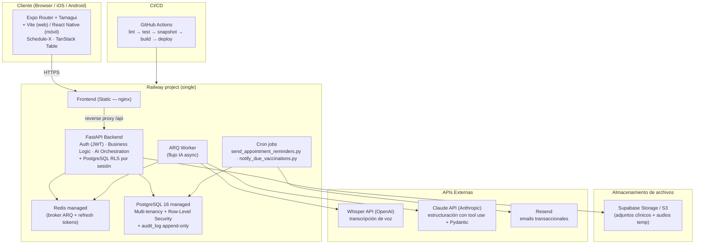
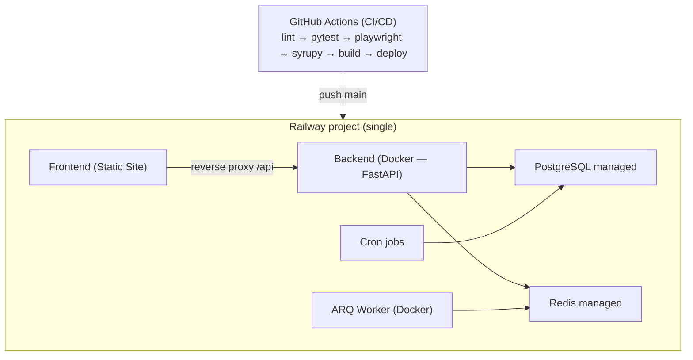
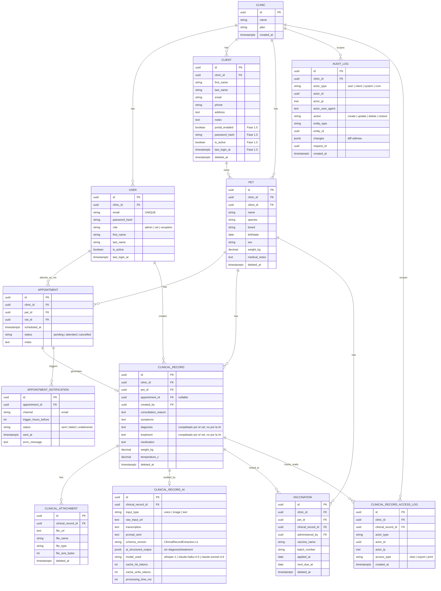

## Índice

0. [Ficha del proyecto](#0-ficha-del-proyecto)
1. [Descripción general del producto](#1-descripción-general-del-producto)
2. [Arquitectura del sistema](#2-arquitectura-del-sistema)
3. [Modelo de datos](#3-modelo-de-datos)
4. [Especificación de la API](#4-especificación-de-la-api)
5. [Historias de usuario](#5-historias-de-usuario)
6. [Tickets de trabajo](#6-tickets-de-trabajo)
7. [Pull requests](#7-pull-requests)

---

## 0. Ficha del proyecto

### **0.1. Tu nombre completo:**

Franco Borgato, Mateo Costes

### **0.2. Nombre del proyecto:**

Veterinary Intelligence Platform

### **0.3. Descripción breve del proyecto:**

Plataforma web SaaS multi-tenant para la gestión integral de clínicas veterinarias pequeñas (1–5 veterinarios). El diferenciador central es la **asistencia de IA para estructurar historias clínicas**: el veterinario dicta una nota de voz, sube una imagen diagnóstica o ingresa texto libre, y el sistema transcribe y completa automáticamente los campos predefinidos del registro clínico (motivo, síntomas, peso, temperatura, medicación referida). El profesional revisa y confirma antes de guardar. **La IA del MVP no genera diagnósticos ni tratamientos sugeridos** — esa capacidad queda diferida a una etapa posterior con validación regulatoria.

El sistema cubre además gestión de clientes y mascotas, agenda multi-veterinario con detección de solapamientos, vacunación con recordatorios de vencimiento, notificaciones automáticas de turno por email, reportes exportables y auditoría completa de cambios sobre datos clínicos.

### **0.4. URL del proyecto:**

> Producto aún no desplegado en producción — el proyecto se encuentra en fase de documentación técnica y planificación. No hay URL pública del MVP.

### 0.5. URL o archivo comprimido del repositorio

https://github.com/mateocostes/Veterinary-Intelligence-Platform

Branch principal: `main`. Toda la documentación técnica de esta entrega vive en la rama `docs` (commit `aeeacff` al momento de la entrega).

---

## 1. Descripción general del producto

### **1.1. Objetivo:**

El producto resuelve un problema cuantificable de las clínicas veterinarias pequeñas: **la documentación clínica manual consume ~10 minutos por consulta**, tiempo que el veterinario no puede dedicar al paciente. La plataforma reduce ese tiempo a **menos de 3 minutos por consulta** estructurando automáticamente la historia clínica a partir de lo que el profesional dicta.

**Valor por stakeholder:**

- **Veterinario:** dicta una nota de voz mientras atiende; recibe los campos pre-completados con la información transcrita; revisa, edita lo que necesite y guarda con un click. Reduce la fricción administrativa.
- **Recepcionista:** gestiona agenda multi-profesional sin solapamientos; el sistema dispara recordatorios automáticos de turno sin llamadas manuales.
- **Administrador (dueño de la clínica, que suele también ejercer como veterinario):** ve reportes operativos y financieros; audita cambios sobre historias clínicas; controla quién accedió a qué información (cumplimiento Ley 25.326).
- **Dueño de mascota:** recibe recordatorios automáticos por email; en Fase 1.5 accederá a un portal propio para consultar historial y autogestionar turnos.

**Para quién:** clínicas veterinarias pequeñas argentinas de 1–5 veterinarios, donde el dueño suele también ejercer como profesional clínico, con eventual recepcionista, y con acceso a internet estable durante las consultas.

### **1.2. Características y funcionalidades principales:**

| Feature | Descripción |
|---|---|
| **Historia Clínica Asistida por IA** | Transcripción de voz (Whisper API `whisper-1`) + **estructuración** del contenido en los campos predefinidos de la historia clínica (Claude API con tool use + schema Pydantic; modelo seleccionado por subtarea entre `claude-haiku-4-5` y `claude-sonnet-4-6`). **Prompt caching activado desde el día uno**. La IA NO genera diagnósticos ni tratamientos sugeridos en el MVP — esa capacidad se difiere a una etapa posterior. El veterinario valida y edita antes de guardar. Toda la interacción IA queda auditada en `clinical_records_ai`. |
| **Gestión de Clientes y Mascotas** | CRUD completo de clientes y pacientes. Perfil unificado que integra historial clínico, vacunas y próximos turnos. Búsqueda por nombre de mascota o dueño con respuesta en < 1 segundo. |
| **Agenda y Turnos** | Vista diaria y semanal filtrable por veterinario (Schedule-X). Detección de solapamiento de turnos. Estados: Pendiente / Atendido / Cancelado. Transición directa turno → creación de historia clínica. |
| **Notificaciones Automáticas** | Recordatorios de turno por email (Resend) a 48h y 24h del turno, disparados desde un cron de Railway que corre cada 15 min. Registro del estado de cada envío en `appointment_notifications`. |
| **Vacunación y Recordatorios** | Registro de vacunas aplicadas con próxima fecha. Listado de vencimientos próximos en los 30 días siguientes (configurable), filtrables por especie y veterinario. Cron diario `notify_due_vaccinations.py` que notifica a la clínica. |
| **Reportes y Exportación** | Consultas por período, ingresos, mascotas atendidas y vacunas aplicadas. Exportación en PDF y Excel. Reportes financieros sólo para Administrador. |
| **Auditoría y Trazabilidad** | Registro automático e inmutable de todas las mutaciones sobre datos clínicos/de negocio (`audit_log` con event listener de SQLAlchemy) y de los accesos individuales a historias clínicas (`clinical_record_access_log`). Append-only enforced en motor (`REVOKE UPDATE, DELETE` al rol `app_runtime`). Visible para el Administrador con filtro por entidad y por usuario. |

> **Features diferidos.**
> - **Portal del Cliente (Fase 1.5):** autenticación independiente para dueños de mascotas (JWT propio con `client_id`); permite ver historial clínico filtrable por veterinario y solicitar/cancelar turnos propios; sin acceso a notas internas ni datos de auditoría IA.
> - **Soporte Offline (Fase 2):** Service Workers + IndexedDB con caché local de turnos del día e historiales frecuentes y cola de mutaciones sincronizada al reconectar.
> - **Generación de diagnósticos sugeridos con IA (Fase 2):** requiere validación clínica y regulatoria independiente antes de habilitarse.
> - **Observabilidad completa (Fase 2):** Sentry + Pydantic Logfire / OpenTelemetry + PostHog. MVP se sostiene con logging estructurado de FastAPI.

### **1.3. Diseño y experiencia de usuario:**

> El proyecto se encuentra en fase de documentación y planificación. El diseño de interfaz y los flujos de usuario aún no han sido implementados. Los wireframes y capturas de pantalla estarán disponibles una vez iniciado el desarrollo del frontend (Fase 1).

Los flujos principales definidos son:

- **Flujo de consulta con IA:** Veterinario abre ficha de mascota → graba nota de voz → espera transcripción (indicador de carga) → recibe formulario pre-completado con los campos extraídos del audio (motivo, síntomas, peso, temperatura, medicación) → los campos `diagnóstico` y `tratamiento` quedan vacíos para que el profesional los complete → guarda con un click.
- **Flujo de agenda:** Vista de calendario (Schedule-X) → click en slot disponible → selección de mascota y veterinario → confirmación con detección de solapamiento → recordatorios automáticos por email a 48h y 24h.
- **Flujo de auditoría:** Administrador entra al detalle de una historia clínica → panel "Historial de cambios" muestra timestamp + usuario + diff campo por campo de cada modificación → panel "Registro de accesos" muestra quién vio la historia y cuándo.

> **Flujos diferidos:** Portal del Cliente (Fase 1.5) — login independiente, listado de mascotas propias, historial cronológico filtrable por veterinario, solicitud de turno.

### **1.4. Instrucciones de instalación:**

> El proyecto está en fase de documentación. El scaffolding de código aún no ha sido generado. Las instrucciones definitivas estarán disponibles una vez completada la Fase 1 del desarrollo. La planificación contempla:

- `docker-compose.yml` para levantar el entorno de desarrollo local (PostgreSQL 16, Redis, Backend FastAPI, Frontend Expo + Vite, ARQ Worker)
- Variables de entorno en `.env.example` (API keys de OpenAI, Anthropic, Resend, configuración de S3/Supabase, `JWT_SECRET`)
- Migraciones de base de datos via Alembic (`alembic upgrade head`) — incluyen la activación de Row-Level Security y los GRANTs append-only sobre `audit_log` / `clinical_record_access_log`
- Datos semilla para desarrollo local (clínica de prueba, usuarios staff, mascotas, turnos)
- Suite de tests bloqueante en CI: `pytest` para unitarios/integración, `playwright` para E2E del flujo crítico de IA, `syrupy` para snapshot tests del prompt enviado a Claude

---

## 2. Arquitectura del Sistema

### **2.1. Diagrama de arquitectura:**

La arquitectura sigue un patrón de tres capas desacopladas: frontend SPA, backend API REST y base de datos relacional. Los servicios de IA se consumen como APIs externas. El almacenamiento de archivos es independiente de la base de datos. **Todos los servicios viven en un único proyecto de Railway** para simplificar la operación y eliminar CORS interno entre frontend y backend.


```mermaid
flowchart TD
  subgraph Client["Cliente (Browser / iOS / Android)"]
    FE["Expo Router + Tamagui<br/>+ Vite (web) / React Native (móvil)<br/>Schedule-X · TanStack Table"]
  end

  subgraph Railway["Railway project (single)"]
    STATIC["Frontend (Static — nginx)"]
    API["FastAPI Backend<br/>Auth (JWT) · Business Logic · AI Orchestration<br/>+ PostgreSQL RLS por sesión"]
    ARQ["ARQ Worker<br/>(flujo IA async)"]
    CRON["Cron jobs<br/>send_appointment_reminders.py · notify_due_vaccinations.py"]
    RED["Redis managed<br/>(broker ARQ + refresh tokens)"]
    PG["PostgreSQL 16 managed<br/>Multi-tenancy + Row-Level Security<br/>+ audit_log append-only"]
  end

  subgraph Storage["Almacenamiento de archivos"]
    S3["Supabase Storage / S3<br/>(adjuntos clínicos + audios temp)"]
  end

  subgraph External["APIs Externas"]
    WHISPER["Whisper API (OpenAI)<br/>transcripción de voz"]
    CLAUDE["Claude API (Anthropic)<br/>estructuración con tool use + Pydantic"]
    RESEND["Resend<br/>emails transaccionales"]
  end

  subgraph Deploy["CI/CD"]
    GHA["GitHub Actions<br/>lint → test → snapshot → build → deploy"]
  end

  FE -->|HTTPS| STATIC
  STATIC -->|reverse proxy /api| API
  API --> PG
  API --> S3
  API --> RED
  ARQ --> RED
  ARQ --> WHISPER
  ARQ --> CLAUDE
  CRON --> PG
  CRON --> RESEND
  GHA --> Railway
```

*Figure 1: Diagrama de arquitectura general del sistema*

**Patrón elegido:** Arquitectura de tres capas (Presentation / Application / Data) con orquestación async desacoplada (ARQ) para tareas de larga duración y cron jobs de Railway para tareas programadas. Multi-tenancy con **defensa en profundidad**: filtro por `clinic_id` en queries SQLAlchemy + PostgreSQL Row-Level Security como segunda capa en motor.

**Justificación:**
- **FastAPI + PostgreSQL** proveen un backend tipado, de alta performance y con soporte async nativo. La integración con Pydantic v2 hace que el schema de extracción de IA (`ClinicalRecordExtraction`) sirva simultáneamente como tool_use schema para Claude y como shape del JSONB en `clinical_records_ai`.
- **Expo (Expo Router + Tamagui)** con build web vía React Native Web permite compartir la UI entre web y móvil (iOS/Android) desde el primer componente — el día que se libere la app móvil no hay un branch separado, sólo se agrega el target correspondiente al mismo monorepo.
- **ARQ** desacopla el procesamiento de IA (latencia variable de 5–30s en Whisper) de la respuesta HTTP. Async-nativo, mismo Redis que ya se necesita para refresh tokens — sin agregar Celery (que arrastra worker pesado, mala compatibilidad async y operación compleja).
- **PostgreSQL Row-Level Security** se habilita en todas las tablas con `clinic_id` como defensa de segundo nivel: si una query SQLAlchemy omite el filtro por `clinic_id`, el motor de DB devuelve cero filas en lugar de filtrar entre clínicas. La fuga de datos clínicos entre tenants se vuelve imposible a nivel de motor.
- **Railway-solo** (todo en un proyecto) elimina la fricción operativa de dos clouds (Vercel + Railway): sin CORS, sin duplicación de envs, sin observabilidad fragmentada. Para un equipo de 2 founders, simplifica drásticamente el día a día.

**Trade-offs:**
- **Single-cloud:** atado a Railway. Mitigación: todo corre en Docker, migrar a otro proveedor es factible (la portabilidad del stack lo permite).
- **ARQ es menos maduro que Celery:** menos plugins, menos documentación. Mitigación: para el alcance del MVP (1 worker, ~750 consultas/mes) ARQ alcanza sobradamente.
- **RLS agrega complejidad de setup:** requiere dos usuarios de DB (`app_runtime` con RLS forzado, `app_admin` con `BYPASSRLS` para Alembic) y `SET LOCAL` por request. Mitigación: el costo se paga una sola vez en la dependencia FastAPI que abre la sesión; el resto del código no se entera.
- **Soporte offline diferido a Fase 2:** las clínicas con internet inestable pueden tener una experiencia degradada. Mitigación: el MVP asume conectividad estable; la indicación visual de offline se evalúa para Fase 1.

### **2.2. Descripción de componentes principales:**

| Componente | Tecnología | Responsabilidad |
|---|---|---|
| **Frontend SPA** | React 18 + TypeScript, Expo Router + Tamagui, Vite (web build), Zustand, TanStack Query, Tailwind CSS, shadcn/ui | Interfaz de usuario web + móvil compartida, gestión de estado local y de servidor, grabación de audio (MediaRecorder API en web / expo-av en nativo) |
| **Frontend — agenda** | Schedule-X | Vista de agenda con drag & drop, vistas día/semana/mes, recursos por veterinario y detección de overlap |
| **Frontend — data grids** | TanStack Table v8 + `@tanstack/react-virtual` | Listados densos (mascotas, vacunas próximas, historial) con sorting, filtering, paginación y virtualización |
| **Backend API** | Python 3.12, FastAPI, Pydantic v2 | REST API con validación, autorización por rol (JWT), orquestación de servicios IA, generación de reportes |
| **ORM / Migraciones** | SQLAlchemy 2.0 (async), Alembic | Acceso a base de datos tipado y async; migraciones versionadas. Las migraciones corren con `app_admin` (`BYPASSRLS`); las queries de la app corren con `app_runtime` (RLS forzado). |
| **Worker asíncrono** | ARQ + Redis | Procesamiento del flujo IA (transcripción Whisper + estructuración Claude) sin bloquear la respuesta HTTP |
| **Tareas programadas** | Cron de Railway | Recordatorios de turno (cada 15 min) y alertas de vacunación (diario), evitando un broker dedicado a notificaciones |
| **Base de datos** | PostgreSQL 16 | Datos relacionales con multi-tenancy via `clinic_id` + **Row-Level Security** (defensa en profundidad), soft delete en entidades clínicas, JSONB para output estructurado de la IA, audit_log append-only |
| **Object Storage** | Supabase Storage / AWS S3 | Almacenamiento de archivos adjuntos (imágenes, PDFs, audios) con URLs firmadas de acceso temporal (≤ 1h) |
| **Whisper API** | OpenAI (`whisper-1`) | Transcripción de audio a texto; procesado de forma asíncrona via ARQ |
| **Claude API** | Anthropic — modelo por subtarea: `claude-haiku-4-5` para inputs cortos, `claude-sonnet-4-6` para inputs largos o multimodales | **Estructuración** de la historia clínica via tool use + schema Pydantic `ClinicalRecordExtraction`. NO genera diagnósticos. Prompt caching activo (`cache_control: ephemeral`) desde el día 1. |
| **Resend** | Resend | Envío de emails: recordatorios de turno y recuperación de contraseña (la activación del portal del cliente se incorpora en Fase 1.5) |

### **2.3. Descripción de alto nivel del proyecto y estructura de ficheros**

El proyecto sigue una organización monorepo con separación clara entre frontend y backend:

```
/
├── frontend/                 # Expo + React Native Web SPA
│   └── src/
│       ├── app/              # Router global (Expo Router), providers
│       ├── features/         # Módulos por dominio (feature-based)
│       │   ├── auth/
│       │   ├── clients/
│       │   ├── pets/
│       │   ├── clinical-records/
│       │   ├── appointments/
│       │   ├── vaccinations/
│       │   ├── ai-assistant/
│       │   ├── reports/
│       │   ├── audit/        # Paneles de auditoría para Admin
│       │   └── client-portal/   # Fase 1.5
│       ├── shared/           # Componentes (Tamagui + shadcn/ui), hooks y utils reutilizables
│       ├── services/         # Clientes HTTP por módulo (portables a iOS/Android sin cambios)
│       └── store/            # Stores de Zustand (portables a iOS/Android sin cambios)
│
├── backend/                  # FastAPI application
│   └── app/
│       ├── core/             # Config, seguridad, dependencias (incluyendo SET LOCAL app.clinic_id)
│       ├── api/v1/endpoints/ # Un archivo por módulo (auth, users, pets, ai, audit, etc.)
│       ├── models/           # Modelos SQLAlchemy con AuditableMixin
│       ├── schemas/          # Schemas Pydantic (request/response + ClinicalRecordExtraction)
│       ├── crud/             # Operaciones de base de datos
│       ├── services/         # Lógica de negocio (ai_service, notification_service, audit_logger)
│       │   └── ai/           # AIProvider (strategy), AnthropicProvider, WhisperTranscriber, ModelSelector
│       ├── worker/           # ARQ worker (settings + tasks async del flujo IA)
│       │   └── tasks/ai.py   # transcribe_and_generate
│       └── jobs/             # Scripts de cron de Railway
│           ├── send_appointment_reminders.py  # cada 15 min
│           └── notify_due_vaccinations.py     # diario, 08:00
│
├── docs/                     # Documentación técnica completa
│   ├── idea-inicial.md
│   ├── prd.md
│   ├── architecture.md
│   ├── data-model.md
│   ├── user-stories.md
│   ├── info.md               # Profundización de cada herramienta del stack
│   └── prompts/prompts.md    # Log cronológico de prompts por sesión
│
├── entrega1/                 # Esta entrega del curso
│   ├── readme.md
│   └── prompts.md
│
├── ia-agents/                # Agentes/skills/rules custom para asistencia de IA durante desarrollo
├── docker-compose.yml        # Entorno de desarrollo local
└── CLAUDE.md                 # Contexto del proyecto para asistentes de IA
```

Patrón de arquitectura: **feature-based** en el frontend (cada módulo de dominio contiene sus componentes, hooks, types y lógica), **layered** en el backend (api → services → crud → models). Esta organización permite portabilidad a móvil sin reescritura: las capas `services/` y `store/` se comparten directamente entre web y móvil gracias a Expo.

### **2.4. Infraestructura y despliegue**

Todos los servicios viven en un único proyecto de **Railway** para simplificar la operación, eliminar CORS interno y consolidar billing, logs y métricas en un solo dashboard.


```mermaid
flowchart TD
  GHA["GitHub Actions (CI/CD)<br/>lint → pytest → playwright → syrupy → build → deploy"]
  subgraph RAILWAY["Railway project (single)"]
    STATIC["Frontend (Static Site)"]
    BACKEND["Backend (Docker — FastAPI)"]
    WORKER["ARQ Worker (Docker)"]
    CRON["Cron jobs"]
    PG["PostgreSQL managed"]
    REDIS["Redis managed"]
  end

  GHA -->|push main| RAILWAY
  STATIC -->|reverse proxy /api| BACKEND
  BACKEND --> PG
  BACKEND --> REDIS
  WORKER --> REDIS
  CRON --> PG
```

*Figure 2: Pipeline de infraestructura y despliegue*

| Servicio | Plataforma | Trigger |
|---|---|---|
| Frontend (Static Site) | Railway | Deploy automático desde rama `main` |
| Backend (FastAPI) | Railway (Docker) | Deploy automático desde rama `main` |
| ARQ Worker | Railway (Docker, mismo proyecto) | Deploy automático desde rama `main` |
| Cron Jobs | Railway (cron schedules en panel) | Disparados según schedule (cada 15 min / diario) |
| PostgreSQL | Railway managed | Gestionado por el proveedor |
| Redis | Railway managed | Gestionado por el proveedor |

| Entorno | Branch | Propósito |
|---|---|---|
| Development | `dev` | Desarrollo local con Docker Compose |
| Staging | `staging` | Validación antes de producción |
| Production | `main` | Clínicas reales |

Las variables de entorno (API keys, DATABASE_URL, etc.) se configuran en el panel de Railway — nunca en el repositorio. Los secrets se rotan periódicamente.

**Costo estimado mensual (MVP de 3 clínicas piloto, ~750 consultas IA/mes):** ~U$ 55–70/mes (Railway $45 + Whisper $4.50 + Claude $2.50 con caching + S3 $2 + Resend free + dominio $1.25).

### **2.5. Seguridad**

- **HTTPS obligatorio:** TLS gestionado por Railway en todos los servicios del proyecto (frontend estático, backend, worker).
- **Autenticación JWT con refresh tokens:** Access token de corta duración firmado con HMAC; refresh tokens almacenados en Redis con rotación. Payload del JWT: `{ user_id, clinic_id, role: "admin"|"vet"|"reception", exp }`.
- **Multi-tenancy con defensa en profundidad:** Filtro por `clinic_id` en cada query SQLAlchemy **+ PostgreSQL Row-Level Security**. La sesión SQLAlchemy ejecuta `SET LOCAL app.clinic_id = ...` al abrirse; las policies de cada tabla filtran por `current_setting('app.clinic_id')::uuid`. El usuario `app_runtime` que usa la API tiene `FORCE ROW LEVEL SECURITY`. **Suite de tests de aislamiento es bloqueante en CI.**
- **Portal del cliente aislado** *(Fase 1.5)*: JWT separado con `client_id` autenticado contra tabla `clients`, no `users`. El middleware `ClientPortalAuth` bajo prefijo `/api/v1/client-portal/` es independiente.
- **Headers de seguridad:** CSP, X-Frame-Options, HSTS configurados como middleware en FastAPI.
- **Rate limiting:** En endpoints sensibles — login (5 req/min por IP), endpoints IA (10 req/min por clínica).
- **Cifrado en reposo:** PostgreSQL con encryption at rest (Railway managed); S3/Supabase con cifrado de objetos.
- **URLs de archivos firmadas:** Expiración máxima de 1 hora para archivos adjuntos.
- **Soft delete:** Los registros clínicos nunca se eliminan físicamente; `deleted_at` para trazabilidad completa.
- **Auditoría completa:**
  - `audit_log` registra todas las mutaciones (CREATE/UPDATE/DELETE/RESTORE) sobre tablas tenant-scoped vía event listener de SQLAlchemy. Almacena `actor_id`, `actor_ip`, `actor_user_agent`, `entity_type`, `entity_id`, `changes` (JSONB con diff old/new), `request_id` para correlación.
  - `clinical_record_access_log` registra cada lectura individual de una historia clínica.
  - **Append-only enforced en DB:** `REVOKE UPDATE, DELETE ON audit_log, clinical_record_access_log FROM app_runtime`. La integridad histórica no depende de la disciplina del developer.
  - Retención de 7 años; anonimización (no borrado) ante derecho al olvido.
  - Acceso restringido al rol `admin` bajo `/api/v1/audit/*`.
- **Auditoría de IA:** Toda interacción con Whisper y Claude se almacena en `clinical_records_ai` (input original, transcripción, prompt completo, schema usado, output estructurado, modelo, cache hit/miss tokens, tiempo de procesamiento). Tabla append-only.
- **Secrets:** Rotados periódicamente; nunca en código fuente.

### **2.6. Tests**

| Tipo | Tecnología | Cobertura |
|---|---|---|
| **Unitarios + integración** | pytest + pytest-asyncio | ≥ 80% en `app/api/v1/`; ejecuta < 5 min |
| **E2E del flujo crítico** | Playwright | Login → crear turno → grabar audio → ver historia clínica pre-completada → confirmar y guardar |
| **Snapshot del prompt IA** | syrupy | Bloquea el merge cuando el system prompt o el schema enviado a Claude cambian sin actualizar el snapshot — detecta regresiones silenciosas en la calidad de la extracción |
| **Aislamiento multi-tenant** | pytest (suite custom) | **Bloqueante en CI.** Crea dos clínicas con datos y verifica que ningún endpoint con JWT de la clínica A retorne filas de B; misma verificación entre dos clientes del portal en Fase 1.5 |
| **Append-only de auditoría** | pytest | Verifica que un intento de `UPDATE` o `DELETE` sobre `audit_log` desde el rol `app_runtime` retorna error de permisos de Postgres |
| **Frontend** | Vitest + React Native Testing Library | Componentes Tamagui + hooks de TanStack Query |
| **Accesibilidad** | Lighthouse / axe-core | WCAG 2.1 nivel AA en formulario clínico, agenda, búsqueda |

CI pipeline: `lint → pytest → playwright → syrupy → build → deploy a Railway`, completo en < 10 minutos desde el merge a `main`.

---

## 3. Modelo de Datos

### **3.1. Diagrama del modelo de datos:**


```mermaid
erDiagram
  CLINIC ||--o{ USER : has
  CLINIC ||--o{ CLIENT : has
  CLINIC ||--o{ PET : has
  CLIENT ||--o{ PET : owns
  PET ||--o{ APPOINTMENT : has
  PET ||--o{ CLINICAL_RECORD : has
  PET ||--o{ VACCINATION : has
  USER ||--o{ APPOINTMENT : attends_as_vet
  USER ||--o{ CLINICAL_RECORD : creates
  APPOINTMENT ||--o| CLINICAL_RECORD : generates
  APPOINTMENT ||--o{ APPOINTMENT_NOTIFICATION : triggers
  CLINICAL_RECORD ||--o{ CLINICAL_ATTACHMENT : has
  CLINICAL_RECORD ||--o| CLINICAL_RECORD_AI : audited_by
  CLINICAL_RECORD ||--o{ VACCINATION : linked_to
  CLINIC ||--o{ AUDIT_LOG : scopes
  CLINIC ||--o{ CLINICAL_RECORD_ACCESS_LOG : scopes
  CLINICAL_RECORD ||--o{ CLINICAL_RECORD_ACCESS_LOG : tracks_reads

  CLINIC {
    uuid id PK
    string name
    string plan
    timestamptz created_at
  }

  USER {
    uuid id PK
    uuid clinic_id FK
    string email "UNIQUE"
    string password_hash
    string role "admin | vet | reception"
    string first_name
    string last_name
    boolean is_active
    timestamptz last_login_at
  }

  CLIENT {
    uuid id PK
    uuid clinic_id FK
    string first_name
    string last_name
    string email
    string phone
    text address
    text notes
    boolean portal_enabled "Fase 1.5"
    string password_hash "Fase 1.5"
    boolean is_active "Fase 1.5"
    timestamptz last_login_at "Fase 1.5"
    timestamptz deleted_at
  }

  PET {
    uuid id PK
    uuid clinic_id FK
    uuid client_id FK
    string name
    string species
    string breed
    date birthdate
    string sex
    decimal weight_kg
    text medical_notes
    timestamptz deleted_at
  }

  APPOINTMENT {
    uuid id PK
    uuid clinic_id FK
    uuid pet_id FK
    uuid vet_id FK
    timestamptz scheduled_at
    string status "pending | attended | cancelled"
    text notes
  }

  APPOINTMENT_NOTIFICATION {
    uuid id PK
    uuid appointment_id FK
    string channel "email"
    int trigger_hours_before
    string status "sent | failed | undelivered"
    timestamptz sent_at
    text error_message
  }

  CLINICAL_RECORD {
    uuid id PK
    uuid clinic_id FK
    uuid pet_id FK
    uuid appointment_id FK "nullable"
    uuid created_by FK
    text consultation_reason
    text symptoms
    text diagnosis "completado por el vet, no por la IA"
    text treatment "completado por el vet, no por la IA"
    text medication
    decimal weight_kg
    decimal temperature_c
    timestamptz deleted_at
  }

  CLINICAL_ATTACHMENT {
    uuid id PK
    uuid clinical_record_id FK
    text file_url
    string file_name
    string file_type
    int file_size_bytes
    timestamptz deleted_at
  }

  CLINICAL_RECORD_AI {
    uuid id PK
    uuid clinical_record_id FK
    string input_type "voice | image | text"
    text raw_input_url
    text transcription
    text prompt_sent
    string schema_version "ClinicalRecordExtraction.v1"
    jsonb ai_structured_output "sin diagnosis/treatment"
    string model_used "whisper-1 | claude-haiku-4-5 | claude-sonnet-4-6"
    int cache_hit_tokens
    int cache_write_tokens
    int processing_time_ms
  }

  VACCINATION {
    uuid id PK
    uuid clinic_id FK
    uuid pet_id FK
    uuid clinical_record_id FK
    uuid administered_by FK
    string vaccine_name
    string batch_number
    date applied_at
    date next_due_at
    timestamptz deleted_at
  }

  AUDIT_LOG {
    uuid id PK
    uuid clinic_id FK
    string actor_type "user | client | system | cron"
    uuid actor_id
    inet actor_ip
    text actor_user_agent
    string action "create | update | delete | restore"
    string entity_type
    uuid entity_id
    jsonb changes "diff old/new"
    uuid request_id
    timestamptz created_at
  }

  CLINICAL_RECORD_ACCESS_LOG {
    uuid id PK
    uuid clinic_id FK
    uuid clinical_record_id FK
    string actor_type
    uuid actor_id
    inet actor_ip
    string access_type "view | export | print"
    timestamptz created_at
  }
```

*Figure 3: Diagrama ER del modelo de datos del MVP (Fase 1) + extensión Fase 1.5 (campos de Portal del Cliente en `clients`)*

### **3.2. Descripción de entidades principales:**

**Convenciones globales:** UUID como PK en todos los modelos; `created_at` y `updated_at` en todas las tablas; soft delete con `deleted_at` en modelos clínicos y de negocio; `clinic_id` presente en todas las entidades para multi-tenancy (con RLS habilitado en cada tabla); montos en centavos (INTEGER) para evitar errores de punto flotante.

#### `clinics`
Entidad raíz del multi-tenancy. Cada clínica es un tenant aislado.
**Campos clave:** `id` (UUID, PK), `name` (NOT NULL), `plan` (`free`/`pro`/`clinic`), `created_at`.

#### `users`
Personal de la clínica (Admin, Veterinario, Recepcionista). Authn con JWT propio.
**Campos clave:** `id` (UUID, PK), `clinic_id` (FK, NOT NULL), `email` (NOT NULL, UNIQUE), `password_hash` (bcrypt), `role` (NOT NULL).
**Índices:** `(clinic_id)`, `(email)`.

#### `clients`
Dueños de mascotas. *El acceso opcional al portal de autogestión y los campos asociados se incorporan en Fase 1.5.*
**Campos clave (Fase 1):** `id` (UUID, PK), `clinic_id` (FK, NOT NULL), `email` (NULL en Fase 1; pasa a NOT NULL al habilitar el portal en Fase 1.5).
**Campos adicionales (Fase 1.5 — Portal del Cliente):** `portal_enabled` (DEFAULT false), `password_hash` (NULL hasta activación), `is_active` (DEFAULT true), `last_login_at`.
**Nota:** El campo `notes` (notas internas de la clínica) no es visible desde el portal del cliente.
**Índices:** `(clinic_id)`, `(clinic_id, last_name)`, `(clinic_id, email)`.

#### `pets`
Mascotas / pacientes. Cada mascota pertenece a un cliente y a una clínica.
**Campos clave:** `id`, `clinic_id` (FK), `client_id` (FK), `name`, `species`, `breed`, `birthdate`, `weight_kg`, `deleted_at`.
**Índices:** `(clinic_id)`, `(client_id)`, `(clinic_id, name)`.

#### `appointments`
Turnos. Cada turno se asocia a una mascota y a un veterinario específico.
**Campos clave:** `id`, `clinic_id`, `pet_id`, `vet_id` (FK → users), `scheduled_at`, `status` (`pending`/`attended`/`cancelled`).
**Constraint:** índice único parcial sobre `(vet_id, scheduled_at)` donde `status = 'pending'` para prevenir solapamientos.
**Índices:** `(clinic_id, scheduled_at)`, `(vet_id, scheduled_at)`, `(pet_id)`, `(status)`.

#### `clinical_records`
Consultas médicas. Núcleo del sistema. Nunca se eliminan físicamente (soft delete).
**Campos clave:** `id`, `pet_id` (FK), `appointment_id` (FK, NULL — puede ser consulta directa sin turno previo), `created_by` (FK → users), `consultation_reason` (NOT NULL), `symptoms`, `diagnosis`, `treatment`, `medication`, `weight_kg`, `temperature_c`, `deleted_at`.
**Índices:** `(pet_id, created_at DESC)`, `(clinic_id)`.

#### `clinical_records_ai`
Auditoría completa del flujo de **estructuración** IA. Tabla append-only, no visible para el veterinario en la UI normal.
**Campos clave:** `clinical_record_id` (FK), `input_type` (voice/image/text), `raw_input_url` (archivo original en S3), `transcription` (output de Whisper), `prompt_sent` (prompt completo + schema), `schema_version`, `ai_structured_output` (JSONB con los campos extraídos según schema Pydantic — **sin** `diagnosis` ni `treatment` en el MVP), `model_used` (whisper-1, claude-haiku-4-5 o claude-sonnet-4-6 según subtarea), `cache_hit_tokens`, `cache_write_tokens`, `processing_time_ms`.
**Índices:** `(clinical_record_id)`, `(model_used, created_at)` para análisis de costo/calidad por modelo.

#### `audit_log`
Auditoría de mutaciones (CREATE/UPDATE/DELETE/RESTORE) sobre todas las tablas tenant-scoped. **Append-only enforced en DB** (`REVOKE UPDATE, DELETE` al rol `app_runtime`).
**Campos clave:** `clinic_id` (con RLS), `actor_type` (`user`/`client`/`system`/`cron`), `actor_id`, `actor_ip`, `actor_user_agent`, `action`, `entity_type`, `entity_id`, `changes` (JSONB con diff old/new), `request_id`.
**Índices:** `(clinic_id, entity_type, entity_id, created_at DESC)`, `(clinic_id, actor_id, created_at DESC)`.

#### `clinical_record_access_log`
Auditoría de lecturas individuales de historias clínicas (cumplimiento Ley 25.326). Append-only.
**Campos clave:** `clinical_record_id` (FK), `actor_type`, `actor_id`, `actor_ip`, `access_type` (`view`/`export`/`print`).

#### `vaccinations`, `clinical_attachments`, `appointment_notifications`
Entidades complementarias. Detalle completo en [docs/data-model.md](../docs/data-model.md).

> **Entidades de Fase 2** *(schema definido para no requerir cambios estructurales al implementarse):* `services` (servicios cobrables), `payments` (pagos contra servicios), `inventory_items` (stock de medicamentos).

---

## 4. Especificación de la API

Endpoints más representativos del flujo diferenciador del producto (asistencia IA para historias clínicas).

```yaml
openapi: 3.1.0
info:
  title: Veterinary Intelligence Platform API
  version: v1
  description: |
    REST API multi-tenant para gestión clínica veterinaria con IA.
    Todos los endpoints requieren JWT con `clinic_id` en el payload.
    Multi-tenancy adicional reforzada con PostgreSQL Row-Level Security.
servers:
  - url: https://app.veterinaria.ar/api/v1
    description: Production (Railway)

paths:
  /ai/transcribe:
    post:
      summary: Encolar transcripción de audio
      description: |
        Recibe un archivo de audio, lo sube a S3 temporal y encola una tarea ARQ
        que llamará a Whisper API. Retorna un task_id que el frontend usa para hacer polling.
      security: [{ bearerAuth: [] }]
      requestBody:
        required: true
        content:
          multipart/form-data:
            schema:
              type: object
              properties:
                audio:
                  type: string
                  format: binary
                  description: Archivo MP3, MP4, WAV, M4A o WebM (máx. 20 MB)
                pet_id:
                  type: string
                  format: uuid
              required: [audio, pet_id]
      responses:
        '202':
          description: Tarea encolada
          content:
            application/json:
              schema:
                type: object
                properties:
                  task_id: { type: string, format: uuid }
                  status: { type: string, enum: [queued] }
        '400': { description: Audio inválido o > 20 MB }
        '401': { description: JWT inválido o ausente }
        '403': { description: Rol distinto de `vet` o `admin` }

  /ai/extract-record:
    post:
      summary: Estructurar contenido en los campos de la historia clínica
      description: |
        Recibe la transcripción (o texto libre / descripción de imagen) y la estructura
        en los campos predefinidos usando Claude con tool use + schema Pydantic
        (`ClinicalRecordExtraction`). NO genera diagnósticos ni tratamientos sugeridos.
        Prompt caching activo: el system prompt + schema se cachean entre llamadas.
      security: [{ bearerAuth: [] }]
      requestBody:
        required: true
        content:
          application/json:
            schema:
              type: object
              properties:
                transcript: { type: string }
                pet_id: { type: string, format: uuid }
                input_type: { type: string, enum: [voice, image, text] }
              required: [transcript, pet_id, input_type]
      responses:
        '200':
          description: Campos extraídos
          content:
            application/json:
              schema:
                type: object
                properties:
                  extraction:
                    type: object
                    properties:
                      consultation_reason: { type: string, nullable: true }
                      symptoms: { type: string, nullable: true }
                      weight_kg: { type: number, nullable: true }
                      temperature_c: { type: number, nullable: true }
                      medication_taken: { type: string, nullable: true }
                      schema_version: { type: string, example: "v1" }
                  diagnosis: { type: string, nullable: true, description: "Siempre null en MVP — completar manualmente" }
                  treatment: { type: string, nullable: true, description: "Siempre null en MVP — completar manualmente" }
                  ai_audit_id: { type: string, format: uuid, description: "ID en clinical_records_ai" }
                  model_used: { type: string }
                  cache_hit_tokens: { type: integer }
        '422': { description: Output de Claude no cumple el schema Pydantic }
        '504': { description: Timeout > 30s — fallback a entrada manual }

  /clinical-records:
    post:
      summary: Crear historia clínica
      description: |
        Persiste la historia clínica validada por el veterinario (luego de editar el pre-fill IA).
        Inserción atómica en `clinical_records` + `clinical_records_ai`. Event listener de
        SQLAlchemy registra automáticamente el insert en `audit_log`.
      security: [{ bearerAuth: [] }]
      requestBody:
        required: true
        content:
          application/json:
            schema:
              type: object
              properties:
                pet_id: { type: string, format: uuid }
                appointment_id: { type: string, format: uuid, nullable: true }
                consultation_reason: { type: string }
                symptoms: { type: string }
                diagnosis: { type: string }
                treatment: { type: string }
                medication: { type: string }
                weight_kg: { type: number }
                temperature_c: { type: number }
                ai_audit_id: { type: string, format: uuid, nullable: true, description: "Vincula con clinical_records_ai si se usó IA" }
              required: [pet_id, consultation_reason]
      responses:
        '201': { description: Creada }
        '403': { description: Rol distinto de `vet` o `admin` }

components:
  securitySchemes:
    bearerAuth:
      type: http
      scheme: bearer
      bearerFormat: JWT
```

---

## 5. Historias de Usuario

**Historia de Usuario 1 — Historia Clínica Asistida por IA (US-013)**

Como Veterinario, quiero grabar una nota de voz durante o después de la consulta y que la app **complete los campos predefinidos de la historia clínica** a partir de lo dictado, para reducir el tiempo de escritura administrativa.

**Criterios de aceptación:**
- Puedo iniciar y detener la grabación desde la app (sin aplicación externa)
- Veo un indicador de estado de carga mientras se procesa el audio
- Recibo los campos pre-completados con la información extraída del audio: motivo de consulta, síntomas, peso, temperatura, medicación referida
- Los campos `diagnóstico` y `tratamiento` quedan **vacíos** para que yo los complete — la IA no genera diagnósticos ni sugerencias terapéuticas en esta etapa
- La UI muestra explícitamente el alcance: "El asistente completa los campos a partir de lo dictado. No sugiere diagnósticos ni tratamientos"
- Puedo editar cualquier campo antes de guardar
- Si el procesamiento falla (timeout > 30s), puedo completar el formulario manualmente sin perder lo ingresado
- El registro queda guardado junto con el audio original y la extracción IA para auditoría

---

**Historia de Usuario 2 — Agenda multi-veterinario sin solapamientos (US-017)**

Como Recepcionista o Veterinario, quiero crear un turno asignado a una mascota y un veterinario específico, para organizar la agenda de la clínica sin solapamientos.

**Criterios de aceptación:**
- Debo seleccionar: mascota (con búsqueda por nombre), veterinario, fecha, hora y motivo
- El sistema detecta solapamiento: si el veterinario ya tiene un turno en ese horario, muestra error claro con el horario conflictivo (HTTP 409)
- El turno creado queda en estado "Pendiente" y aparece inmediatamente en la agenda (Schedule-X)
- Se genera automáticamente una notificación de recordatorio por email para el dueño (48h y 24h antes), disparada por el cron `send_appointment_reminders.py` que corre cada 15 min

---

**Historia de Usuario 3 — Auditoría de cambios en historia clínica (US-039)**

Como Administrador, quiero ver el historial completo de cambios sobre una historia clínica, para entender quién modificó qué y cuándo ante cualquier consulta o reclamo.

**Criterios de aceptación:**
- Accedo desde el detalle de la historia clínica a un panel "Historial de cambios"
- Cada entrada muestra: timestamp, quién (nombre + rol), acción (create/update/delete), y para updates el diff campo por campo (valor anterior → valor nuevo)
- Puedo filtrar por usuario y por rango de fechas
- Los usuarios `vet` y `reception` no ven este panel; el endpoint subyacente (`GET /api/v1/audit/clinical-records/{id}`) retorna HTTP 403
- Los datos vienen de `audit_log`, que es append-only enforced en DB — ningún registro de cambio puede ser modificado o eliminado

---

## 6. Tickets de Trabajo

> Documenta 3 de los tickets de trabajo principales del desarrollo, uno de backend, uno de frontend, y uno de bases de datos. Da todo el detalle requerido para desarrollar la tarea de inicio a fin teniendo en cuenta las buenas prácticas al respecto.

Los tres tickets seleccionados cubren el flujo diferenciador del MVP: la historia clínica asistida por IA. Son los más representativos de la arquitectura del sistema, abarcan las tres capas solicitadas (backend, frontend, base de datos) y sus criterios de aceptación son verificables de forma autónoma por un agente de IA.

---

### Ticket 1 — Backend · `US-013-BE` · Talla: M

**Título:** Endpoint de transcripción de voz con pipeline IA asíncrono

**Historia de usuario:** Como Veterinario, quiero grabar una nota de voz durante o después de la consulta y que la app complete automáticamente los campos de la historia clínica con lo que dicté, para reducir el tiempo de escritura administrativa.

**Descripción técnica:**

Implementar `POST /ai/transcribe-voice` que recibe el archivo de audio grabado desde el frontend, lo sube a S3/Supabase Storage como archivo temporal y encola una tarea ARQ devolviendo `{"task_id": "<uuid>", "status": "pending"}` (HTTP 202). El resultado se recupera con `GET /ai/tasks/{task_id}`.

La tarea ARQ ejecuta el siguiente pipeline en secuencia:

1. **Transcripción:** llama a Whisper API (`whisper-1`) con el audio recuperado de S3.
2. **Limpieza:** pasa la transcripción a `claude-haiku-4-5` para normalizar abreviaciones y corregir errores tipográficos.
3. **Extracción estructurada:** invoca Claude (`claude-sonnet-4-6`) con tool use + schema Pydantic `ClinicalRecordExtraction`. El system prompt tiene `cache_control: {"type": "ephemeral"}` para activar prompt caching. El schema tiene los campos `reason`, `symptoms`, `weight`, `temperature`, `referred_medication` como `Optional[str]`; los campos `diagnosis` y `treatment` son siempre `None` (nunca se populan en el MVP).
4. **Auditoría:** inserta una fila en `clinical_records_ai` con `input_type`, `transcription`, `full_prompt`, `schema_used`, `structured_output`, `model`, `cache_hit`, `cache_tokens_read`, `processing_time_ms`, `status`.

Timeout de 30 s: si el pipeline supera ese límite, el task retorna `status: "failed"`. El archivo temporal en S3 se elimina tras el procesamiento (exitoso o fallido).

**Stack involucrado:** FastAPI · ARQ + Redis · Whisper API (`whisper-1`) · Claude API (`claude-haiku-4-5` + `claude-sonnet-4-6`) · Pydantic v2 · Supabase Storage / S3 · pytest + syrupy

**Criterios de aceptación (BDD):**

*Escenario 1 — Happy path:*
- **Dado que** el veterinario autenticado (rol `vet` o `admin`) envía `POST /ai/transcribe-voice` con un audio válido (WebM, WAV, M4A, MP3, MP4, ≤ 20 MB)
- **Cuando** el endpoint encola la tarea ARQ y el worker la procesa en menos de 30 s
- **Entonces** `POST` responde HTTP 202 con `{"task_id": "<uuid>", "status": "pending"}`; al consultar `GET /ai/tasks/{task_id}` el sistema devuelve `status: "completed"` con `structured_output` conteniendo `reason`, `symptoms`, `weight`, `temperature`, `referred_medication` extraídos del audio, y `diagnosis` y `treatment` como `null`; la tabla `clinical_records_ai` contiene una fila con todos los campos de auditoría

*Escenario 2 — Audio sin datos clínicos reconocibles:*
- **Dado que** el audio contiene solo ruido o contenido sin información clínica estructurable
- **Cuando** el worker procesa la transcripción con Claude tool use
- **Entonces** el task devuelve `status: "completed"` con todos los campos clínicos como `null` o cadenas vacías; no se lanza excepción; `clinical_records_ai` registra el output vacío con el prompt y modelo usados

*Escenario 3 — Timeout del worker (> 30 s):*
- **Dado que** el procesamiento del audio supera el límite de 30 s
- **Cuando** el cliente consulta `GET /ai/tasks/{task_id}`
- **Entonces** el sistema devuelve `status: "failed"` con `error: "Processing timeout — please fill the form manually"`; la tarea no reintenta automáticamente; `clinical_records_ai` registra `status: "timeout"` con el tiempo transcurrido

**INVEST:** I✅ N✅ V✅ E✅ S✅ T✅

**Estimación y justificación (M):** Complejidad moderada por el pipeline de 3 pasos (Whisper → haiku → sonnet), la lógica de timeout en ARQ y el setup del prompt caching. Sin incertidumbre técnica mayor — todos los componentes están definidos; la integración es punto por punto. Estimado 3–4 días.

**Dependencias:** US-013-DB (tabla `clinical_records_ai` debe existir para el paso de auditoría) · US-013-AI (schema `ClinicalRecordExtraction` y prompt del sistema)

---

### Ticket 2 — Frontend · `US-013-FE` · Talla: M

**Título:** Grabación de voz en app con polling y pre-llenado de campos clínicos

**Historia de usuario:** Como Veterinario, quiero grabar una nota de voz durante o después de la consulta y que la app complete automáticamente los campos de la historia clínica con lo que dicté, para reducir el tiempo de escritura administrativa.

**Descripción técnica:**

Implementar dos componentes y un hook custom dentro de `frontend/src/features/ai-assistant/`:

**`VoiceRecorder`** — componente que abstrae la grabación de audio en web (MediaRecorder API) y en nativo (expo-av), con estados `idle → recording → processing → done | error`. Expone `onAudioReady(blob: Blob)` que el padre llama al detener la grabación.

**`useAIPolling(taskId: string)`** — hook TanStack Query que hace polling a `GET /ai/tasks/{task_id}` cada 2 s, se detiene al recibir `status: "completed"` o `status: "failed"`, y dispara un fallback automático a los 35 s. Devuelve `{ data, isLoading, isError, timedOut }`.

**`ClinicalRecordForm`** — formulario existente (o nuevo si aún no existe) que consume el resultado del hook para pre-llenar los 5 campos clínicos (`reason`, `symptoms`, `weight`, `temperature`, `referred_medication`). Los campos `diagnosis` y `treatment` no se pre-llenan. Todos los campos son editables antes de guardar. Muestra el disclaimer: *"El asistente completa los campos a partir de lo dictado. No sugiere diagnósticos ni tratamientos."* visible en todo momento mientras hay un resultado IA activo.

Validación de los campos con Zod antes de enviar el formulario a `POST /clinical-records`. Si el polling retorna `timedOut: true` o `isError: true`, muestra el mensaje de fallback y habilita la entrada manual completa.

**Stack involucrado:** Expo Router · Tamagui · TanStack Query · Zustand · Zod · MediaRecorder API (web) / expo-av (nativo)

**Criterios de aceptación (BDD):**

*Escenario 1 — Happy path:*
- **Dado que** el veterinario pulsa "Grabar", dicta la nota clínica y pulsa "Detener"
- **Cuando** el audio se envía a `POST /ai/transcribe-voice` y el polling recibe `status: "completed"` dentro de los 30 s
- **Entonces** los campos `motivo`, `síntomas`, `peso`, `temperatura` y `medicación referida` se pre-llenan con el output estructurado; los campos `diagnóstico` y `tratamiento` permanecen vacíos; el disclaimer es visible; todos los campos son editables antes de guardar

*Escenario 2 — Campos parcialmente extraídos:*
- **Dado que** el audio contiene solo motivo y síntomas sin peso ni temperatura
- **Cuando** el polling recibe el resultado
- **Entonces** los campos `peso` y `temperatura` muestran su placeholder vacío (no "null"); el veterinario puede completarlos manualmente sin que el formulario los marque como error requerido

*Escenario 3 — Timeout o error de procesamiento:*
- **Dado que** el polling supera los 35 s o recibe `status: "failed"`
- **Cuando** el componente detecta el fallo
- **Entonces** se muestra el mensaje "No se pudo procesar el audio. Podés completar el formulario manualmente." y el formulario queda habilitado para entrada manual sin datos pre-llenados; el botón de grabación queda disponible para reintentar

**INVEST:** I✅ N✅ V✅ E✅ S✅ T✅

**Estimación y justificación (M):** Complejidad moderada por la abstracción MediaRecorder/expo-av (comportamientos distintos en web y nativo) y la lógica del hook de polling con estados diferenciados (loading / completed / failed / timedOut). El formulario clínico en sí es straightforward. Estimado 3–4 días.

**Dependencias:** US-013-BE (endpoint `POST /ai/transcribe-voice` y `GET /ai/tasks/{task_id}` disponibles o mockeados)

---

### Ticket 3 — Base de datos · `US-039-DB` · Talla: M

**Título:** Tabla `audit_log` append-only con REVOKE y listener SQLAlchemy automático

**Historia de usuario:** Como Administrador, quiero ver el historial completo de cambios sobre una historia clínica, para entender quién modificó qué y cuándo ante cualquier consulta o reclamo.

**Descripción técnica:**

Crear la migración Alembic `003_audit_log.py` que establece la tabla `audit_log` y su infraestructura de seguridad:

**Schema de la tabla:**
```sql
CREATE TABLE audit_log (
    id          UUID PRIMARY KEY DEFAULT gen_random_uuid(),
    clinic_id   UUID NOT NULL REFERENCES clinics(id),
    table_name  TEXT NOT NULL,
    record_id   UUID NOT NULL,
    action      TEXT NOT NULL CHECK (action IN ('create','update','delete','soft_delete')),
    changed_by_user_id UUID REFERENCES users(id),
    changes     JSONB,           -- {"field": {"before": ..., "after": ...}}
    changed_at  TIMESTAMPTZ NOT NULL DEFAULT now()
);
```

**Append-only enforced en motor:**
```sql
REVOKE UPDATE, DELETE ON audit_log FROM app_runtime;
```
El rol `app_runtime` (usado por la API en producción) solo puede INSERT. Ningún código de aplicación — ni un bug, ni una vulnerabilidad — puede modificar o eliminar un registro de auditoría.

**Índices para queries de auditoría:**
```sql
CREATE INDEX ix_audit_log_record
    ON audit_log (clinic_id, table_name, record_id, changed_at DESC);
CREATE INDEX ix_audit_log_user
    ON audit_log (clinic_id, changed_by_user_id, changed_at DESC);
```

**Listener SQLAlchemy (`backend/app/services/audit_logger.py`):**

```python
from sqlalchemy import event
from sqlalchemy.orm import Session

AUDITED_MODELS = {ClinicalRecord, Appointment, Pet, Client, User, Vaccination}

@event.listens_for(Session, "after_flush")
def auto_audit(session: Session, flush_context):
    for obj in (*session.new, *session.dirty, *session.deleted):
        if type(obj) not in AUDITED_MODELS:
            continue
        action = _detect_action(obj, session)
        changes = _build_diff(obj, session)
        session.execute(
            insert(AuditLog).values(
                clinic_id=obj.clinic_id,
                table_name=obj.__tablename__,
                record_id=obj.id,
                action=action,
                changed_by_user_id=get_current_user_id(),
                changes=changes,
            )
        )
```

El listener es transparente para el resto del código: ningún endpoint necesita llamarlo explícitamente.

**Política de retención:** 7 años. La purga de registros vencidos solo puede ejecutarla el rol `app_admin` (con `BYPASSRLS`), mediante script documentado en `backend/scripts/purge_audit_log.py`.

**Stack involucrado:** PostgreSQL 16 · Alembic · SQLAlchemy 2.0 (async) · pytest (tests de append-only y aislamiento)

**Criterios de aceptación (BDD):**

*Escenario 1 — Happy path (mutación registrada automáticamente):*
- **Dado que** el listener SQLAlchemy está activo y el rol `app_runtime` actualiza una historia clínica (PATCH `/clinical-records/{id}`)
- **Cuando** la sesión hace flush
- **Entonces** se inserta automáticamente una fila en `audit_log` con `table_name: "clinical_records"`, el `record_id` correcto, `action: "update"`, el `changed_by_user_id` del contexto de sesión y el diff campo por campo en el JSONB `changes`; ningún endpoint necesita llamar explícitamente al listener

*Escenario 2 — Append-only garantizado:*
- **Dado que** existen filas en `audit_log` y el rol en uso es `app_runtime`
- **Cuando** se ejecuta `UPDATE audit_log SET action = 'x' WHERE id = :id` o `DELETE FROM audit_log WHERE id = :id`
- **Entonces** PostgreSQL lanza `ERROR: permission denied for table audit_log` y la operación se revierte; la fila original permanece intacta; este test es bloqueante en CI

*Escenario 3 — Query usa índice compuesto (rendimiento):*
- **Dado que** `audit_log` tiene 100.000 filas distribuidas entre múltiples clínicas
- **Cuando** se ejecuta `GET /api/v1/audit/clinical-records/{id}/mutations` con filtros de fecha
- **Entonces** el query plan muestra `Index Scan` sobre `ix_audit_log_record` y la latencia del endpoint es < 200 ms en el percentil 95

**INVEST:** I✅ N✅ V✅ E✅ S✅ T✅

**Estimación y justificación (M):** Complejidad moderada por tres razones: (1) el REVOKE requiere configuración de dos roles Postgres (`app_runtime` / `app_admin`) coordinada con la migración de RLS de US-001-DB; (2) el listener SQLAlchemy necesita detectar correctamente `new` / `dirty` / `deleted` y construir el diff de forma genérica para todos los modelos auditables; (3) los tests de append-only deben verificar el comportamiento directamente en el motor Postgres, no solo en la capa ORM. Estimado 3–4 días.

**Dependencias:** US-001-DB (roles `app_runtime` y `app_admin` deben existir en la BD) · `AuditableMixin` en los modelos SQLAlchemy

---

## 7. Pull Requests

> El proyecto se encuentra en fase de documentación técnica. Las PRs documentadas a continuación corresponden a la rama `docs` donde vive toda la documentación de esta entrega. Las PRs de scaffolding de código (backend, frontend) están planificadas para iniciarse al cerrar Fase 1.

**Pull Request 1 — Documentación técnica inicial (commit `cdc103f`)**

- **Branch:** `docs` → `main` *(pendiente de mergear; se mantiene en docs hasta validación con tutores)*
- **Commit:** `cdc103f docs: add technical documentation and project structure`
- **Contenido:** Setup inicial del repo. Creación de `docs/` con `idea-inicial.md` (concepto + roles + stack), `prd.md` (PRD completo de 15 secciones con 9 diagramas Mermaid), `architecture.md` (stack, estructura, infra, flujo IA), `data-model.md` (ERD + tablas), `user-stories.md` (historias por módulo).
- **Cambios:** +5500 líneas de documentación.

**Pull Request 2 — Portal del cliente + entrega1 + ia-agents (commit `2dd272d`)**

- **Branch:** `docs` → `main` *(pendiente)*
- **Commit:** `2dd272d docs: add client portal, entrega1 artifacts and ia-agents`
- **Contenido:** Incorporación del Portal del Cliente al modelo (luego diferido a Fase 1.5), creación de los artefactos de esta entrega (`entrega1/readme.md`, `entrega1/prompts.md`) y de la carpeta `ia-agents/` con agentes/skills/rules custom para asistencia de IA durante el desarrollo.

**Pull Request 3 — Revisión arquitectónica para alcance MVP + estándares 2026 (commit `aeeacff`)**

- **Branch:** `docs` → `main` *(pendiente)*
- **Commit:** `aeeacff docs: revise architecture for MVP scope and 2026 standards`
- **Resumen:** PR de mayor impacto en la documentación. Aplica las siguientes decisiones consensuadas tras la revisión arquitectónica:
  - **Scope:** Soporte offline diferido a Fase 2; Portal del Cliente diferido a Fase 1.5; observabilidad (Sentry/Logfire/PostHog) diferida a Fase 2.
  - **Simplificación de infraestructura:** Celery + Redis → ARQ + cron de Railway; Vercel + Railway → Railway-solo; Schedule-X + TanStack Table en lugar de construir agenda/grids desde cero.
  - **Alcance IA:** la IA del MVP **estructura** (no genera diagnósticos); Claude tool use + Pydantic schema; prompt caching desde el día 1; selección de modelo por subtarea (`whisper-1`, `claude-haiku-4-5`, `claude-sonnet-4-6`).
  - **Estándares 2026:** PostgreSQL Row-Level Security como defensa en profundidad; Playwright E2E + syrupy snapshot del prompt; Expo + Tamagui / React Native Web para shared web/mobile UI desde el día 1.
- **Cambios:** 11 archivos, +1994 / −409 líneas. Incluye `docs/info.md` (nuevo, profundización de cada herramienta + adopción de cambios) y `conversacion.md` (transcripción de la sesión).
