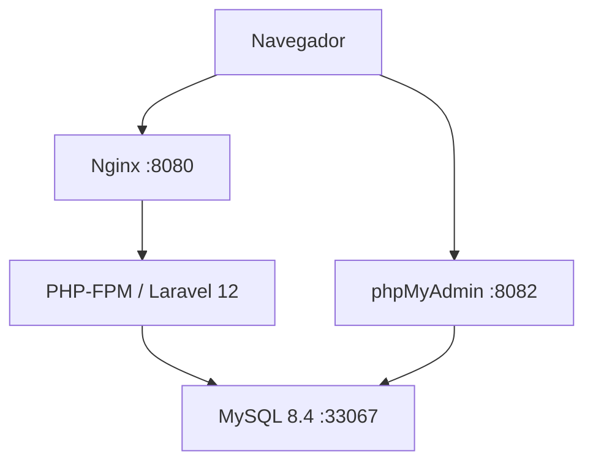
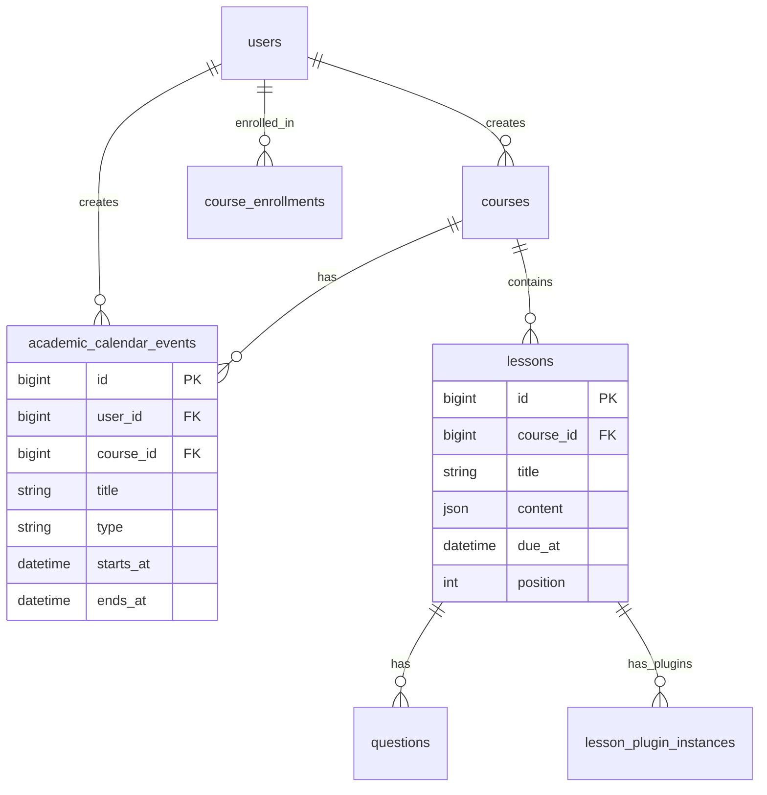

## Índice

0. [Ficha del proyecto](#0-ficha-del-proyecto)
1. [Descripción general del producto](#1-descripción-general-del-producto)
2. [Arquitectura del Sistema](#2-arquitectura-del-sistema)
3. [Modelo de Datos](#3-modelo-de-datos)
4. [Especificación de la API](#4-especificación-de-la-api)
5. [Historias de Usuario](#5-historias-de-usuario)
6. [Tickets de Trabajo](#6-tickets-de-trabajo)
7. [Pull Requests](#7-pull-requests)
8. [Documentación de prompts](#8-documentación-de-prompts)
9. [Capturas de pantalla](#9-capturas-de-pantalla)

---

## 0. Ficha del proyecto

**Autor:** Angel Burgos Ruiz

**Nombre del proyecto:** LMS-CMS (Plataforma LMS Interactiva Open Source)

**Descripción breve:**
Sistema de gestión de aprendizaje (LMS) de código abierto construido con Laravel 12. Permite a instituciones educativas, empresas y formadores crear, gestionar y distribuir cursos online con contenido interactivo mediante un sistema de plugins drag & drop, evaluaciones dinámicas, gestión de matriculaciones, calendario académico, perfil de usuario e interfaz bilingüe (ES/EN).

**URL del proyecto:** `http://localhost:8080` 

**Repositorio de código:** `https://github.com/Angel-31/codigofinal/tree/angel-burgos-r`

**Documentación de prompts:** [prompts.md](./prompts.md)

---

## 1. Descripción general del producto

### 1.1. Objetivo

Ofrecer una plataforma LMS moderna, modular y de código abierto que permita la creación y consumo de cursos con contenido enriquecido mediante plugins, evaluaciones interactivas, roles diferenciados (profesor/estudiante), gestión de matriculaciones, seguimiento de progreso, calendario académico y experiencia de usuario localizada.

### 1.2. Características y funcionalidades principales

- **Gestión de cursos:** Creación, edición, publicación y organización de cursos con lecciones ordenadas.
- **Sistema de plugins drag & drop:** Bloques interactivos (texto, imagen, vídeo, código, quiz rápido, matching, fill-blanks, foro, subida de archivos, H5P) con editor visual, reordenamiento y preview.
- **Evaluaciones dinámicas:** Cuestionarios con opciones múltiples configurables, corrección automática y puntuación.
- **Gestión de matriculaciones:** Panel drag & drop para asignar/eliminar usuarios en cursos.
- **Calendario académico:** Vista mensual con eventos de lecciones (`due_at`), matriculaciones y eventos personalizados del profesor; layout Moodle para docente en `/calendar`.
- **Eventos académicos (profesor):** Crear, editar y eliminar eventos en `/calendar/events/*` (solo rol teacher).
- **Internacionalización (i18n):** Interfaz en castellano e inglés vía sesión (`/locale/{es|en}`) y archivos `lang/*/lms.php`.
- **Navegación lateral unificada:** Inicio, Mis cursos, Calendario (+ Salir) en todas las páginas autenticadas; enlace «Nuevo evento» solo en `/calendar` para profesor.
- **Perfil de usuario:** Edición de nombre, email y avatar.
- **Seguimiento de progreso:** Registro de lecciones completadas por estudiante.
- **Dashboards diferenciados:** Vista de profesor y estudiante.
- **Subida de archivos multimedia:** Vídeos locales con límites configurados (128 MB).

### 1.3. Diseño y experiencia de usuario

Flujo principal:
1. Usuario accede a `/login` o `/register` (selector de idioma disponible).
2. Profesor crea curso → añade lecciones → gestiona plugins → matricula alumnos → publica curso → consulta calendario y crea eventos.
3. Estudiante accede al curso → visualiza lección con plugins → responde quiz/interactúa.
4. Sistema calcula puntuación y registra progreso.

### 1.4. Instrucciones de instalación

**Requisitos:** Docker y Docker Compose

**Instalación con Docker:**
```bash
git clone <repositorio>
cd codigofinal/lms-cms-laravel12
cp .env.example .env
docker compose up -d
docker compose exec app composer install
docker compose exec app php artisan key:generate
docker compose exec app php artisan migrate --seed
docker compose exec app php artisan storage:link
```

**Acceso:**
- Aplicación: `http://localhost:8080`
- phpMyAdmin: `http://localhost:8082`

**Credenciales de prueba (tras seed):**
- Profesor: `teacher@example.com` / `password123`
- Estudiante: `student@example.com` / `password123`

**Cambio de idioma:** `http://localhost:8080/locale/es` o `/locale/en`

**Instalación local (sin Docker):**
```bash
composer install
cp .env.example .env
php artisan key:generate
php artisan migrate --seed
php artisan storage:link
php artisan serve
```
Requiere: PHP 8.3+, Composer, MySQL 8.4.

---

## 2. Arquitectura del Sistema

### 2.1. Diagrama de arquitectura


```mermaid
graph TD
    Browser[Navegador] --> Nginx[Nginx :8080]
    Nginx --> PhpFpm[PHP-FPM / Laravel 12]
    PhpFpm --> MySQL[MySQL 8.4 :33067]
    Browser --> PMA[phpMyAdmin :8082]
    PMA --> MySQL
```

**Patrón:** MVC (Model-View-Controller) con Laravel 12.

### 2.2. Componentes principales

| Capa | Tecnología |
|------|-----------|
| Frontend | Blade + CSS (`public/css/lms.css`, `calendar*.css`) + JS (`public/js/lms.js`) |
| Backend | Laravel 12 (PHP 8.3) |
| i18n | `lang/en/lms.php`, `lang/es/lms.php`, middleware `SetLocale` |
| Base de datos | MySQL 8.4 |
| Servidor web | Nginx 1.27 (Docker) |

### 2.3. Estructura del proyecto

```text
lms-cms-laravel12/
├── app/
│   ├── Http/
│   │   ├── Controllers/           12 controladores
│   │   │   AuthController, CalendarController, CalendarEventController,
│   │   │   CourseController, DashboardController, EnrollmentController,
│   │   │   LessonController, LocaleController, PluginController,
│   │   │   PluginInteractionController, ProfileController, QuizController
│   │   └── Middleware/            EnsureRole, SetLocale
│   ├── Models/                    15 modelos Eloquent
│   ├── Services/                  CalendarService.php
│   └── Support/                   CalendarEvent.php (DTO)
├── bootstrap/app.php              Registro middleware web + alias role
├── database/
│   ├── migrations/                15 migraciones
│   └── seeders/                   DatabaseSeeder, LmsDemoSeeder, PluginDefinitionSeeder
├── docker/
│   ├── nginx/default.conf         client_max_body_size 128M
│   └── php/uploads.ini            upload_max_filesize 128M
├── lang/
│   ├── en/lms.php
│   └── es/lms.php
├── public/
│   ├── css/                       lms.css, calendar.css, calendar-teacher.css,
│   │                              calendar-event-form.css
│   └── js/lms.js
├── resources/views/
│   ├── layouts/                   app, stitch, calendar-moodle
│   │   └── partials/              sidebar-nav, language-switcher, i18n-js,
│   │                              calendar-moodle-topbar
│   ├── auth/                      login, register
│   ├── dashboard/                 student, teacher
│   ├── courses/                   index, show, enrollments
│   ├── lessons/                   show, edit
│   ├── calendar/                  index, teacher, _body, events/*
│   ├── profile/                   edit
│   └── plugins/                   partials de bloques
├── routes/web.php
├── tests/
│   ├── Feature/                   LmsFlowTest, LocaleTest, CalendarTest, CalendarEventTest
│   └── Unit/                      LessonCastTest
├── docker-compose.yml
└── Dockerfile
```

### 2.4. Infraestructura y despliegue

**Docker Compose** con 4 servicios:

| Servicio | Imagen | Puerto |
|----------|--------|--------|
| app | PHP 8.3 FPM Alpine (build local) | — |
| web | nginx:1.27-alpine | 8080 |
| db | mysql:8.4 | 33067 |
| phpmyadmin | phpmyadmin:5-apache | 8082 |

### 2.5. Seguridad

- Hash de contraseñas (bcrypt)
- Middleware `EnsureRole` (`role:teacher` / `role:student`)
- Middleware `SetLocale` (solo `en` | `es`)
- Protección CSRF en formularios
- Validación de inputs en controladores
- Rutas de eventos de calendario restringidas a profesor

### 2.6. Tests

| Test | Descripción |
|------|-------------|
| `LmsFlowTest` | Flujo registro → curso → lección → quiz |
| `LocaleTest` | Cambio de idioma y textos del sidebar |
| `CalendarTest` | Acceso calendario, layout teacher/student, enlace «Nuevo evento» |
| `CalendarEventTest` | CRUD eventos académicos (profesor) |
| `LessonCastTest` | Casting JSON de contenido de lección |

Ejecución en Docker:
```bash
docker compose exec app php artisan test
```

---

## 3. Modelo de Datos

### 3.1. Diagrama del modelo (extracto)


```mermaid
erDiagram
    users ||--o{ courses : creates
    users ||--o{ academic_calendar_events : creates
    users ||--o{ course_enrollments : enrolled_in
    courses ||--o{ lessons : contains
    courses ||--o{ academic_calendar_events : has
    lessons ||--o{ questions : has
    lessons ||--o{ lesson_plugin_instances : has_plugins

    academic_calendar_events {
        bigint id PK
        bigint user_id FK
        bigint course_id FK
        string title
        string type
        datetime starts_at
        datetime ends_at
    }

    lessons {
        bigint id PK
        bigint course_id FK
        string title
        json content
        datetime due_at
        int position
    }
```

### 3.2. Entidades principales

| Entidad | Descripción |
|---------|-------------|
| **users** | Usuarios con rol `teacher` o `student` |
| **courses** | Cursos con estado draft/published |
| **lessons** | Lecciones ordenadas; `due_at` para calendario |
| **questions** | Preguntas de quiz (opciones JSON, mín. 2) |
| **quiz_results** | Puntuación por lección y usuario |
| **progress** | Lecciones completadas |
| **course_enrollments** | Matriculaciones con rol |
| **academic_calendar_events** | Eventos personalizados del profesor |
| **plugin_definitions** … **lesson_layout_snapshots** | Sistema de plugins (ver migraciones 2026_05_07_*) |

---

## 4. Especificación de la API

Rutas web en `routes/web.php` (no API REST separada).

### Rutas públicas / locale

| Método | Ruta | Acción |
|--------|------|--------|
| GET | `/locale/{locale}` | Cambiar idioma (es/en) |
| GET/POST | `/login`, `/register` | Autenticación |

### Rutas autenticadas (cualquier rol)

| Método | Ruta | Acción |
|--------|------|--------|
| GET | `/dashboard` | Dashboard según rol |
| GET | `/calendar` | Calendario (vista teacher o student) |
| GET/PATCH | `/profile/edit`, `/profile` | Perfil de usuario |
| GET | `/courses` | Listado de cursos |
| POST | `/logout` | Cerrar sesión |

### Rutas de profesor (`role:teacher`)

| Método | Ruta | Acción |
|--------|------|--------|
| GET | `/calendar/events/create` | Formulario nuevo evento |
| POST | `/calendar/events` | Guardar evento |
| GET/PUT/DELETE | `/calendar/events/edit?id=` | Editar / actualizar / eliminar evento |
| POST | `/courses` | Crear curso |
| GET | `/courses/{course}` | Detalle de curso |
| POST | `/courses/{course}/publish` | Publicar |
| GET | `/courses/{course}/enrollments` | Panel matriculaciones |
| GET/POST/DELETE | `/courses/{course}/enrollments/*` | APIs JSON matriculación |
| POST | `/lessons` | Crear lección |
| GET | `/lessons/{lesson}/edit` | Editor lección + plugins + quiz |
| GET/POST/PATCH/DELETE | `/plugins/*`, `/lessons/{lesson}/plugins/*` | Sistema de plugins |

### Rutas de estudiante (`role:student`)

| Método | Ruta | Acción |
|--------|------|--------|
| GET | `/lessons/{lesson}` | Ver lección |
| POST | `/quiz/submit` | Enviar quiz |
| POST | `/plugins/instances/{instance}/interact` | Interacción plugin |
| POST | `/plugins/instances/{instance}/submit` | Envío evaluable |

---

## 5. Historias de Usuario

**HU-1:** Como profesor quiero crear cursos para organizar mi contenido educativo.

**HU-2:** Como profesor quiero añadir lecciones a un curso para estructurar el material.

**HU-3:** Como profesor quiero publicar un curso para que los estudiantes accedan.

**HU-4:** Como profesor quiero añadir plugins interactivos con drag & drop.

**HU-5:** Como profesor quiero gestionar preguntas del quiz dinámicamente.

**HU-6:** Como profesor quiero asignar usuarios a un curso mediante drag & drop.

**HU-7:** Como estudiante quiero ver cursos publicados.

**HU-8:** Como estudiante quiero visualizar lecciones con plugins interactivos.

**HU-9:** Como estudiante quiero responder cuestionarios y recibir puntuación.

**HU-10:** Como estudiante quiero ver mi progreso.

**HU-11:** Como profesor quiero ver un calendario académico mensual y crear eventos propios para planificar el curso.

**HU-12:** Como usuario quiero cambiar el idioma de la interfaz (ES/EN) y ver la navegación traducida (Inicio, Mis cursos, Calendario).

### 5.1 Priorización MoSCoW (extracto)

**Must-Have:** autenticación, CRUD cursos/lecciones, matriculación, consumo estudiante, evaluación.

**Should-Have:** editor plugins avanzado, calendario académico, i18n completo, perfil de usuario.

---

## 6. Tickets de Trabajo

**Ticket 1 — Autenticación y roles**

**Ticket 2 — CRUD de cursos y lecciones**

**Ticket 3 — Sistema de evaluaciones (quiz dinámico)**

**Ticket 4 — Sistema de plugins drag & drop**

**Ticket 5 — Gestión de matriculaciones**

**Ticket 6 — Infraestructura Docker y uploads**

**Ticket 7 — Calendario académico**
- `CalendarService` + eventos desde lecciones, matriculaciones y `academic_calendar_events`
- Vistas `calendar/index`, `calendar/teacher`, layout `calendar-moodle`
- CRUD eventos: `CalendarEventController`, migración y modelo `AcademicCalendarEvent`
- Campo `lessons.due_at` y datos en `LmsDemoSeeder`
- Tests `CalendarTest`, `CalendarEventTest`

**Ticket 8 — Internacionalización y navegación**
- `lang/en/lms.php`, `lang/es/lms.php`, `SetLocale`, `LocaleController`
- Partial `sidebar-nav` unificado; `language-switcher`, `i18n-js` + `window.lmsT()` en `lms.js`
- Enlace «Nuevo evento» condicionado a ruta `calendar` y rol teacher
- Test `LocaleTest`

---

## 7. Pull Requests

**PR 1 — Autenticación y roles**

**PR 2 — Gestión de cursos y lecciones**

**PR 3 — Evaluaciones y progreso**

**PR 4 — Sistema de plugins interactivos**

**PR 5 — Gestión de matriculaciones**

**PR 6 — Dockerización y CI**

**PR 7 — Calendario académico y eventos del profesor**

**PR 8 — i18n ES/EN y sidebar de navegación unificado**

---

## 8. Documentación de prompts

Los prompts utilizados con asistentes de código (máx. 3 por sección del ciclo de vida) y el listado detallado de archivos tocados en `codigofinal/lms-cms-laravel12` están en **[prompts.md](./prompts.md)** (secciones 1–9).

---

## 9. Capturas de pantalla

Capturas tomadas de la aplicación en ejecución (`http://localhost:8080`, idioma ES, datos de `LmsDemoSeeder`). Archivos en [`docs/screenshots/`](docs/screenshots/).

### Acceso

Pantalla de inicio de sesión con selector de idioma EN/ES.


### Rol profesor

| Vista | Descripción |
|-------|-------------|
| Dashboard | Panel principal con cursos, línea de tiempo y formulario de creación |
| Mis cursos | Listado y gestión de cursos publicados |
| Calendario | Vista mensual (layout Moodle 5), eventos académicos y botón «+ Nuevo evento» en el sidebar |
| Nuevo evento | Formulario de alta de evento académico (`/calendar/events/create`) |


### Rol estudiante

| Vista | Descripción |
|-------|-------------|
| Dashboard | Cursos matriculados y acceso rápido |
| Calendario | Vista mensual con layout estándar LMS (sin layout Moodle) |


> El enlace **«+ Nuevo evento»** solo aparece en `/calendar` cuando el usuario tiene rol `teacher`. En el formulario de creación de evento no se muestra en el sidebar.
