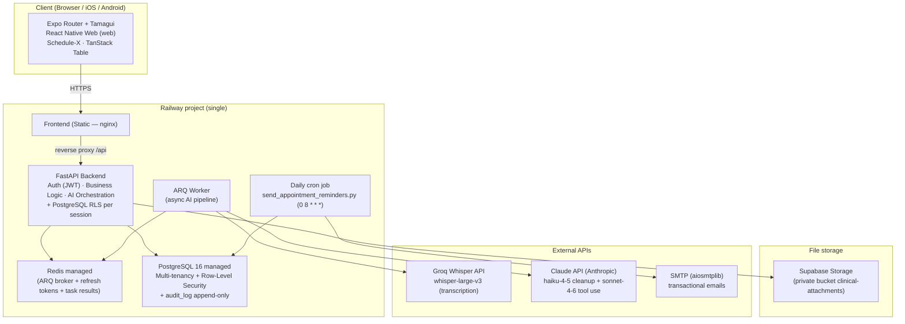
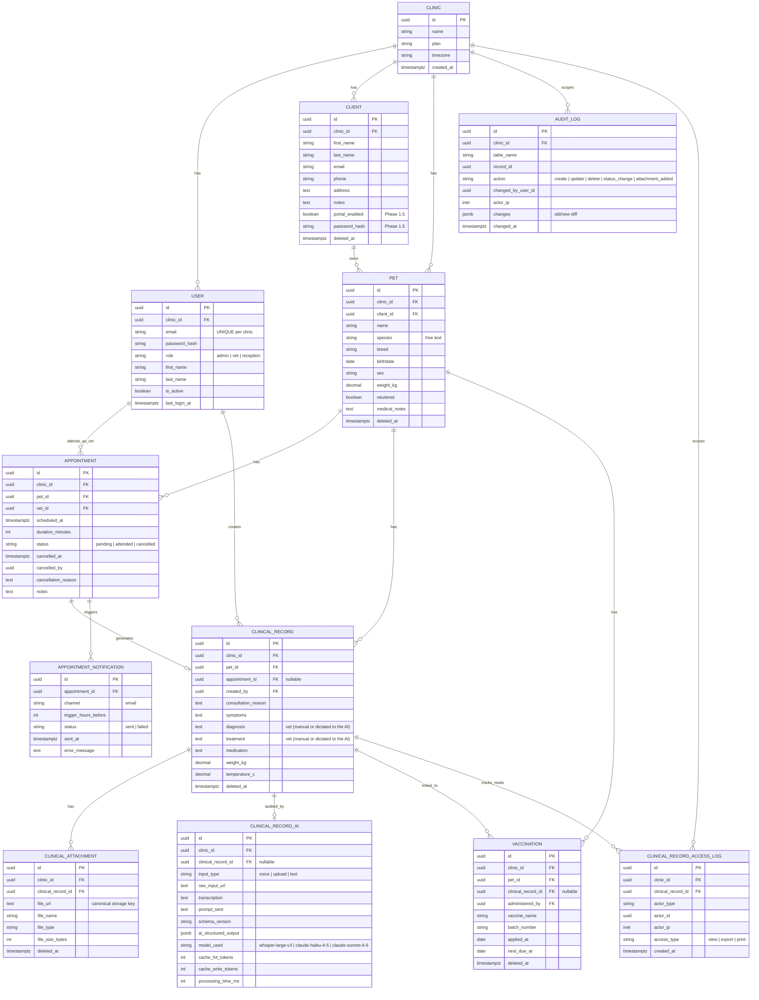

## Index

0. [Project sheet](#0-project-sheet)
1. [Product overview](#1-product-overview)
2. [System architecture](#2-system-architecture)
3. [Data model](#3-data-model)
4. [API specification](#4-api-specification)
5. [User stories](#5-user-stories)
6. [Work tickets](#6-work-tickets)
7. [Pull requests](#7-pull-requests)

---

## 0. Project sheet

### **0.1. Your full name:**

Franco Borgato, Mateo Costes

### **0.2. Project name:**

Veterinary Intelligence Platform

### **0.3. Short project description:**

Multi-tenant web SaaS platform for the comprehensive management of small veterinary clinics (1–5 veterinarians). The core differentiator is **AI assistance for structuring clinical records**: the veterinarian records a voice note (or uploads an audio file) and the system transcribes and automatically fills in the predefined fields of the clinical record (reason, symptoms, weight, temperature, referred medication and —when the professional dictates them explicitly— diagnosis and treatment). The professional reviews and confirms before saving. **The AI never invents diagnoses or treatments**: it only structures what the veterinarian actually dictated.

The system also covers staff user management, clients and pets, a multi-veterinarian agenda with overlap detection (Schedule-X), the pet's complete clinical profile, clinical history with attachments (images/PDF), vaccination records, automatic appointment reminders by email and an immutable audit of changes and accesses to clinical data.

> **Current status (June 2026):** the project moved from the documentation phase to a **functional MVP**. There is a backend (FastAPI), frontend (Expo + Tamagui) and database (PostgreSQL 16 with RLS) implemented and runnable locally. 24 pull requests were completed onto the `dev` branch (US-001 to US-014, US-017 to US-023 and US-DASH). The differentiating AI flow (voice → clinical fields) is operational end-to-end.

### **0.4. Project URL:**

> Product not yet deployed to production (no public URL). The MVP is **runnable locally** with Docker Compose + the `backend/start.ps1` and `frontend/start.ps1` scripts (frontend at `http://localhost:8081`, backend at `http://localhost:8000`). The Railway deployment is documented but pending configuration.

### 0.5. Repository URL or compressed file

https://github.com/mateocostes/Veterinary-Intelligence-Platform

Main branch: `main`. Active MVP development lives on the **`dev`** branch (24 merged PRs, `feat/us-XXX → dev`). The technical documentation lives in `docs/`.

---

## 1. Product overview

### **1.1. Objective:**

The product solves a quantifiable problem of small veterinary clinics: **manual clinical documentation takes ~10 minutes per consultation**, time the veterinarian cannot dedicate to the patient. The platform reduces that time by automatically structuring the clinical record from what the professional dictates.

**Value per stakeholder:**

- **Veterinarian:** records a voice note while attending; receives the fields pre-filled with the transcribed information; reviews, edits what is needed and saves with one click. Reduces administrative friction.
- **Receptionist:** manages a multi-professional agenda without overlaps; the system triggers automatic appointment reminders without manual calls.
- **Administrator (clinic owner, who usually also practices as a veterinarian):** manages the clinic's staff; sees the complete clinical profile of each pet; audits changes to clinical records; controls who accessed what information (Law 25.326 compliance).
- **Pet owner:** receives automatic email reminders; in Phase 1.5 will access their own portal to consult history and self-manage appointments.

**For whom:** small Argentine veterinary clinics of 1–5 veterinarians, where the owner usually also practices as a clinical professional, with an eventual receptionist, and with stable internet access during consultations.

### **1.2. Main features and functionalities:**

| Feature | Status | Description |
|---|---|---|
| **Authentication and multi-tenancy** | ✅ Implemented | Clinic registration (atomically creates Clinic + admin User), login with JWT + refresh tokens in Redis, password recovery by email, staff user management (Admin/Vet/Reception) with RBAC. Isolation between clinics with `clinic_id` + PostgreSQL Row-Level Security. |
| **AI-Assisted Clinical Record** | ✅ Implemented | Voice recording (web MediaRecorder) or audio file upload → transcription with **Groq Whisper (`whisper-large-v3`)** → cleanup with **`claude-haiku-4-5`** → **structuring** into the predefined fields with **`claude-sonnet-4-6`** (tool use + Pydantic `ClinicalRecordExtraction` schema, **prompt caching** active). The AI extracts reason, symptoms, weight, temperature, referred medication and —only if the vet dictates them explicitly— diagnosis and treatment; **it never invents them**. Asynchronous pipeline via ARQ with polling and manual fallback. Every AI interaction is audited in `clinical_records_ai` (append-only). |
| **Client and Pet Management** | ✅ Implemented | CRUD for clients and pets. Unified clinical profile of the pet (basic data + latest consultations + vaccines + upcoming appointments). Global search by pet or owner name with an enriched result (pet + owner + next appointment). |
| **Agenda and Appointments** | ✅ Implemented | Daily and weekly view filterable by veterinarian (Schedule-X, Spanish, anchored to Monday). Overlap detection (HTTP 409). Reschedule / cancel (logical cancellation that frees the slot). Mark attended (`pending → attended`) and start/register the consultation from the appointment; view/edit the already loaded consultation (one per appointment). |
| **Clinical attachments** | ✅ Implemented | Upload of images/PDF (≤ 20 MB, max 10) to a consultation, validating the whole batch before uploading. Storage in **Supabase Storage** (private bucket `clinical-attachments`, short-lived signed URLs). Thumbnail grid, opening in a new tab and deletion (audited soft delete). |
| **Vaccination** | ✅ Implemented | Record of applied vaccines with the next due date, optionally linked to a consultation. |
| **Automatic Notifications** | ✅ Implemented | Appointment reminder by email via **SMTP (`aiosmtplib`)**, triggered by a **daily Railway cron (`0 8 * * *`)** that notifies tomorrow's appointments (one reminder, idempotent). Status of each send visible in the agenda for admin/reception. |
| **Audit and Traceability** | ✅ Implemented | Automatic and immutable recording of mutations (`audit_log`, via SQLAlchemy `after_flush` event listener) and of individual accesses to clinical records (`clinical_record_access_log`). Append-only enforced at the engine level (`REVOKE UPDATE, DELETE` on the `app_runtime` role). |
| **Reports** | 🟡 Partial | Operational/financial and audit report endpoints in the backend; reports UI pending. |

> **Deferred features.**
> - **Client Portal (Phase 1.5):** independent authentication for pet owners; view history filterable by veterinarian and request/cancel their own appointments. The reminder emails already link to an informational public landing (`/appointments/{id}`); the real action is Phase 1.5.
> - **Offline Support (Phase 2):** Service Workers + IndexedDB with local cache and a mutation queue.
> - **AI-generated suggested diagnoses (Phase 2):** the MVP's AI only structures what is dictated; generating its own diagnoses requires independent clinical and regulatory validation.
> - **Full observability (Phase 2):** Sentry + Pydantic Logfire / OpenTelemetry + PostHog. The MVP relies on FastAPI structured logging.

### **1.3. Design and user experience:**

The interface is implemented over the **"Clinical Serenity"** design system (extracted from the Stitch project `VetCare Digital Hub`), codified as semantic brand tokens in `frontend/tamagui.config.ts` (`$brandPrimary` medical teal `#0d9488`, `$surface`, `$onSurface`, `$inputBorder`, `$radiusCard`…) and documented in `docs/design-system.md`. The app mounts `TamaguiProvider` with `defaultTheme="light"`. Each component consumes **only** these tokens (rule R11), never raw hex.

Main flows implemented:

- **Dashboard per role:** navigation cards with role-based visibility (admin/vet/reception), dynamic greeting and a global search bar.
- **AI consultation flow:** appointment → "Mark attended" → "Register consultation" → record/upload audio → processing indicator → form pre-filled with the extracted fields → edit → save (with the option to attach files).
- **Agenda flow:** Schedule-X day/week calendar → filter by veterinarian → "New appointment" (pet search + vet selection, overlap detection) → click a pending appointment to reschedule/cancel.
- **Pet profile:** basic data + clinical history (paginated accordion) + vaccines + upcoming appointments.

> **Screenshots:** the UI is functional and manually verified in the browser throughout development (see `docs/changelog/US-*.md`). Formal screenshots will be added in the next documentation iteration.

### **1.4. Installation instructions:**

**Local infrastructure (Docker):**
```powershell
docker-compose up -d postgres redis     # PostgreSQL 16 + Redis 7 (both healthy)
```

**Backend (FastAPI):**
```powershell
.\backend\start.ps1    # creates venv + installs deps + applies migrations + uvicorn (reads .env from the root)
# ARQ Worker (for the AI flow):
.\.venv\Scripts\python.exe -m arq app.worker.settings.WorkerSettings
```

**Frontend (Expo web):**
```powershell
.\frontend\start.ps1   # installs deps if missing + expo start --web (http://localhost:8081)
```

**Environment variables (`.env` in the root, see `.env.example`):** `DATABASE_URL` / `DATABASE_URL_SYNC`, `JWT_SECRET`, `SMTP_*` (host/port/user/password/from), `GROQ_API_KEY` (Whisper), `ANTHROPIC_API_KEY` (Claude), `SUPABASE_URL` / `SUPABASE_KEY` (attachments). The migrations (Alembic `0001`–`0011`) create the schema, enable Row-Level Security and apply the append-only GRANTs on `audit_log` / `clinical_record_access_log` / `clinical_records_ai`.

**Tests:**
```powershell
# Backend
Set-Location backend; python -m pytest
# Frontend
Set-Location frontend; npx jest
# E2E
Set-Location e2e; npx playwright test --project=chromium
```

---

## 2. System Architecture

### **2.1. Architecture diagram:**

The architecture follows a three decoupled-layer pattern: frontend (Expo + React Native Web), REST API backend (FastAPI) and relational database (PostgreSQL). The AI and email services are consumed as external APIs. File storage is independent of the database. **All services are planned in a single Railway project** to simplify operations and eliminate internal CORS.


```mermaid
flowchart TD
  subgraph Client["Client (Browser / iOS / Android)"]
    FE["Expo Router + Tamagui<br/>React Native Web (web)<br/>Schedule-X · TanStack Table"]
  end

  subgraph Railway["Railway project (single)"]
    STATIC["Frontend (Static — nginx)"]
    API["FastAPI Backend<br/>Auth (JWT) · Business Logic · AI Orchestration<br/>+ PostgreSQL RLS per session"]
    ARQ["ARQ Worker<br/>(async AI pipeline)"]
    CRON["Daily cron job<br/>send_appointment_reminders.py (0 8 * * *)"]
    RED["Redis managed<br/>(ARQ broker + refresh tokens + task results)"]
    PG["PostgreSQL 16 managed<br/>Multi-tenancy + Row-Level Security<br/>+ audit_log append-only"]
  end

  subgraph Storage["File storage"]
    S3["Supabase Storage<br/>(private bucket clinical-attachments)"]
  end

  subgraph External["External APIs"]
    WHISPER["Groq Whisper API<br/>whisper-large-v3 (transcription)"]
    CLAUDE["Claude API (Anthropic)<br/>haiku-4-5 cleanup + sonnet-4-6 tool use"]
    SMTP["SMTP (aiosmtplib)<br/>transactional emails"]
  end

  FE -->|HTTPS| STATIC
  STATIC -->|reverse proxy /api| API
  API --> PG
  API --> S3
  API --> RED
  ARQ --> RED
  ARQ --> WHISPER
  ARQ --> CLAUDE
  CRON --> PG
  CRON --> SMTP
```

*Figure 1: General system architecture diagram*

**Chosen pattern:** Three-layer architecture (Presentation / Application / Data) with decoupled async orchestration (ARQ) for the AI pipeline and a daily Railway cron for reminders. Multi-tenancy with **defense in depth**: filter by `clinic_id` in SQLAlchemy queries + PostgreSQL Row-Level Security as a second layer at the engine.

**Justification:**
- **FastAPI + PostgreSQL** provide a typed, async-native, high-performance backend. Pydantic v2 makes the extraction schema (`ClinicalRecordExtraction`) serve simultaneously as the tool_use schema for Claude and as the shape of the JSONB in `clinical_records_ai`.
- **Expo (Expo Router + Tamagui)** with a web build via React Native Web shares the UI between web and mobile from the very first component — the `services/` and `store/` layers are ported without a rewrite.
- **ARQ** decouples the AI pipeline (variable Whisper latency + 2 Claude calls) from the HTTP response. Async-native, the same Redis already used for refresh tokens — without adding Celery.
- **PostgreSQL Row-Level Security** on each table with `clinic_id`: if a query omits the filter, the engine returns zero rows instead of leaking across clinics. Clinical data leakage between tenants becomes impossible at the engine level.
- **Railway-only** eliminates the operational friction of two clouds (no CORS, no env duplication).

**Trade-offs and implementation decisions:**
- **Groq Whisper instead of OpenAI `whisper-1`:** Groq was adopted (`whisper-large-v3`, via the OpenAI SDK with a `base_url` override) for its free tier without a card, sufficient for MVP development. Changing providers is config.
- **SMTP (`aiosmtplib`) instead of Resend:** migrated in US-004 to deliver to any recipient without verifying a domain (Gmail App Password in dev; SES/Mailgun/Brevo in prod). Config-only to change providers.
- **RLS adds setup complexity:** two DB users (`app_runtime` with forced RLS, `app_admin` with `BYPASSRLS` for Alembic) + `set_config('app.clinic_id', …, true)` per request (`set_config` is used, not `SET LOCAL`, because Postgres does not accept bound parameters in `SET`).
- **Offline support deferred to Phase 2:** the MVP assumes stable connectivity.

### **2.2. Description of main components:**

| Component | Technology | Responsibility |
|---|---|---|
| **Frontend** | React 18 + TypeScript, Expo Router + Tamagui, Zustand, TanStack Query, axios | Web UI (and shared mobile), local/server state, audio recording (web MediaRecorder) |
| **Frontend — agenda** | Schedule-X v2 | Day/week view, weekly navigation (anchored to Monday), filter by veterinarian, click an appointment → reschedule/cancel |
| **Frontend — data grids** | TanStack Table v8 | Listings (users, clients, pets) with sorting and filtering |
| **Backend API** | Python 3.12, FastAPI, Pydantic v2 | REST API with validation, role-based RBAC (JWT), orchestration of AI services |
| **ORM / Migrations** | SQLAlchemy 2.0 (async), Alembic | Typed async access; migrations `0001`–`0011`. Migrations with `app_admin`; app queries with `app_runtime` (forced RLS) |
| **Async worker** | ARQ + Redis | AI pipeline (Groq Whisper → Haiku cleanup → Sonnet extraction → DB audit) without blocking the HTTP response. Creates its own session with `set_config` for RLS |
| **Scheduled task** | Daily Railway cron | `python -m app.jobs.send_appointment_reminders` (`0 8 * * *`); also invokable via an internal endpoint with an API key |
| **Database** | PostgreSQL 16 | Multi-tenancy `clinic_id` + RLS, soft delete, JSONB for AI output, append-only audit tables |
| **Object Storage** | Supabase Storage (Strategy `supabase`\|`s3`) | Clinical attachments in the private bucket `clinical-attachments` with signed URLs (≤ 1h). Injectable and mockable `StorageService` facade |
| **Transcription** | Groq (`whisper-large-v3`) | Audio → text, processed asynchronously via ARQ |
| **AI structuring** | Anthropic — `claude-haiku-4-5` (cleanup) + `claude-sonnet-4-6` (tool use + Vision in the future) | Clinical record structuring via tool use + Pydantic schema. Prompt caching (`cache_control: ephemeral`). Does not invent diagnoses |
| **Email** | SMTP via `aiosmtplib` | Appointment reminders and password recovery (multipart text+HTML, 30s timeout, failures swallowed anti-enumeration) |

### **2.3. High-level project description and file structure**

Monorepo organization with frontend/backend separation:

```
/
├── frontend/                 # Expo + React Native Web
│   └── src/
│       ├── app/              # Router (Expo Router): (app) protected, (auth), public routes
│       ├── features/         # Domain modules (auth, users, clients, pets,
│       │                     #   clinical-records, appointments, vaccinations,
│       │                     #   ai-assistant, dashboard, …)
│       ├── shared/           # Reusable Tamagui components, hooks and utils
│       ├── services/         # HTTP clients per module (axios + JWT/refresh interceptor)
│       └── store/            # Zustand stores (persist web/native)
│
├── backend/                  # FastAPI application
│   └── app/
│       ├── core/             # Config, security, deps (set_config app.clinic_id for RLS)
│       ├── api/v1/endpoints/ # auth, users, clients, pets, appointments,
│       │                     #   clinical_records, vaccinations, search, ai,
│       │                     #   reports, audit, internal
│       ├── models/           # SQLAlchemy 2.0 with Timestamp/SoftDelete/Tenant mixins
│       ├── schemas/          # Pydantic (request/response + ClinicalRecordExtraction)
│       ├── crud/             # Database operations
│       ├── services/         # ai_service, notification_service, audit_logger, storage
│       ├── worker/           # ARQ worker (settings + AI pipeline tasks)
│       ├── jobs/             # send_appointment_reminders (daily cron)
│       └── alembic/          # Migrations 0001–0011
│
├── e2e/                      # Playwright (auth, agenda, AI flow)
├── docs/                     # Technical documentation + changelog/US-XXX.md + prompts
├── entrega1/ · entrega2/     # Course delivery artifacts
├── ia-agents/                # Custom agents/skills/rules for AI assistance
├── docker-compose.yml        # Local development environment
└── CLAUDE.md                 # Project context for AI assistants
```

Pattern: **feature-based** on the frontend, **layered** on the backend (api → services/crud → models). The `services/` and `store/` layers are shared directly between web and mobile thanks to Expo.

### **2.4. Infrastructure and deployment**

All services are planned in a single **Railway** project. The deployment is documented (`backend/railway.cron.json` defines the daily cron) but not yet configured; development and validation happen locally (Docker Compose).


```mermaid
flowchart TD
  GHA["GitHub Actions (CI)<br/>lint → pytest → typecheck (frontend)"]
  subgraph RAILWAY["Railway project (single)"]
    STATIC["Frontend (Static Site)"]
    BACKEND["Backend (Docker — FastAPI)"]
    WORKER["ARQ Worker (Docker)"]
    CRON["Daily cron (0 8 * * *)"]
    PG["PostgreSQL managed"]
    REDIS["Redis managed"]
  end

  GHA -->|push main| RAILWAY
  STATIC -->|reverse proxy /api| BACKEND
  BACKEND --> PG
  BACKEND --> REDIS
  WORKER --> REDIS
  CRON --> PG
```

*Figure 2: Infrastructure and deployment pipeline (planned)*

| Environment | Branch | Purpose |
|---|---|---|
| Development | `dev` | Active development (local Docker Compose); 24 PRs `feat/us-XXX → dev` |
| Production | `main` | Real clinics (deployment pending) |

> **Note on the git/board flow:** each US is developed on `feat/us-XXX` from `dev`, with one commit per ticket (`feat(db|be|fe):`) and a PR to `dev` (`Closes #N`). The GitHub Project board moves through Todo → In Progress → In Review → Done. Since the PR targets `dev` (not `main`), the `Closes #N` does not auto-close on merge to `dev`: moving to Done is manual.

**Estimated monthly cost (few-user MVP):** ~US$ 55–70/month on Railway-only (transcription uses Groq's free tier; Claude with prompt caching is marginal at this volume).

### **2.5. Security**

- **Mandatory HTTPS** (TLS managed by Railway in prod).
- **JWT authentication with refresh tokens:** short-lived access token signed with HMAC; refresh tokens in Redis with rotation. Payload: `{ user_id, clinic_id, role, exp }`. Reverse index `user_refresh:{user_id}` to revoke all of a user's sessions on password recovery.
- **Multi-tenancy with defense in depth:** filter by `clinic_id` in every query **+ PostgreSQL Row-Level Security**. The session runs `SELECT set_config('app.clinic_id', :cid, true)` on opening; the policies filter by `current_setting('app.clinic_id')::uuid`. The `app_runtime` user has `FORCE ROW LEVEL SECURITY`.
- **Anti-enumeration:** `forgot-password` always responds 200; login runs bcrypt against a dummy hash if the user does not exist (closes the timing oracle); cross accesses to another clinic's resources return 404, not 403.
- **Rate limiting / security headers:** planned as FastAPI middleware.
- **Encryption at rest** (managed Postgres + Storage) and **signed file URLs** (≤ 1h) for attachments.
- **Soft delete:** clinical records are never physically deleted. Exception: appointments are cancelled as a state change (`status='cancelled'` + `cancelled_at`/`cancelled_by`/`cancellation_reason`), not with `deleted_at`, to free the slot.
- **Full audit:**
  - `audit_log` records all mutations (create/update/delete/restore + explicit actions like `status_change`, `attachment_added`) on tenant-scoped tables, via the SQLAlchemy `after_flush` event listener. Old/new diff in JSONB.
  - `clinical_record_access_log` records each individual read of a clinical record.
  - **Append-only enforced in DB:** `REVOKE UPDATE, DELETE … FROM app_runtime`.
- **AI audit:** every interaction with Whisper and Claude is stored in `clinical_records_ai` (input, transcription, full prompt, schema, structured output, model, cache tokens, time). Append-only table.

### **2.6. Tests**

| Type | Technology | Coverage |
|---|---|---|
| **Unit + integration (backend)** | pytest + pytest-asyncio (aiosqlite engine, rollback per test, `AsyncClient`) | Endpoints, CRUD, RLS, migrations, append-only. Suite > 570 tests at the close of US-010 |
| **AI prompt snapshot** | syrupy | Blocks the merge if the system prompt or the schema sent to Claude changes without updating the snapshot |
| **Multi-tenant isolation + append-only** | pytest (custom suite) | Verifies isolation between clinics and that `UPDATE`/`DELETE` on `audit_log` from `app_runtime` fails with a Postgres permission error |
| **Frontend** | Jest + React Native Testing Library (mocking Tamagui/Expo Router/Zustand/TanStack Query) | Components, hooks, forms, input masks. Suite > 400 tests |
| **E2E of the critical flow** | Playwright (chromium) | Registration, login (role-based redirection + persistence), agenda (view/toggle/filter/create appointment), AI flow |

---

## 3. Data Model

### **3.1. Data model diagram:**

All entities are implemented via Alembic migrations `0001`–`0011`, with `clinic_id` + forced RLS on tenant-scoped tables.


```mermaid
erDiagram
  CLINIC ||--o{ USER : has
  CLINIC ||--o{ CLIENT : has
  CLINIC ||--o{ PET : has
  CLIENT ||--o{ PET : owns
  PET ||--o{ APPOINTMENT : has
  PET ||--o{ CLINICAL_RECORD : has
  PET ||--o{ VACCINATION : has
  USER ||--o{ APPOINTMENT : attends_as_vet
  USER ||--o{ CLINICAL_RECORD : creates
  APPOINTMENT ||--o| CLINICAL_RECORD : generates
  APPOINTMENT ||--o{ APPOINTMENT_NOTIFICATION : triggers
  CLINICAL_RECORD ||--o{ CLINICAL_ATTACHMENT : has
  CLINICAL_RECORD ||--o| CLINICAL_RECORD_AI : audited_by
  CLINICAL_RECORD ||--o{ VACCINATION : linked_to
  CLINIC ||--o{ AUDIT_LOG : scopes
  CLINIC ||--o{ CLINICAL_RECORD_ACCESS_LOG : scopes
  CLINICAL_RECORD ||--o{ CLINICAL_RECORD_ACCESS_LOG : tracks_reads

  CLINIC {
    uuid id PK
    string name
    string plan
    string timezone
    timestamptz created_at
  }

  USER {
    uuid id PK
    uuid clinic_id FK
    string email "UNIQUE per clinic"
    string password_hash
    string role "admin | vet | reception"
    string first_name
    string last_name
    boolean is_active
    timestamptz last_login_at
  }

  CLIENT {
    uuid id PK
    uuid clinic_id FK
    string first_name
    string last_name
    string email
    string phone
    text address
    text notes
    boolean portal_enabled "Phase 1.5"
    string password_hash "Phase 1.5"
    timestamptz deleted_at
  }

  PET {
    uuid id PK
    uuid clinic_id FK
    uuid client_id FK
    string name
    string species "free text"
    string breed
    date birthdate
    string sex
    decimal weight_kg
    boolean neutered
    text medical_notes
    timestamptz deleted_at
  }

  APPOINTMENT {
    uuid id PK
    uuid clinic_id FK
    uuid pet_id FK
    uuid vet_id FK
    timestamptz scheduled_at
    int duration_minutes
    string status "pending | attended | cancelled"
    timestamptz cancelled_at
    uuid cancelled_by
    text cancellation_reason
    text notes
  }

  APPOINTMENT_NOTIFICATION {
    uuid id PK
    uuid appointment_id FK
    string channel "email"
    int trigger_hours_before
    string status "sent | failed"
    timestamptz sent_at
    text error_message
  }

  CLINICAL_RECORD {
    uuid id PK
    uuid clinic_id FK
    uuid pet_id FK
    uuid appointment_id FK "nullable"
    uuid created_by FK
    text consultation_reason
    text symptoms
    text diagnosis "vet (manual or dictated to the AI)"
    text treatment "vet (manual or dictated to the AI)"
    text medication
    decimal weight_kg
    decimal temperature_c
    timestamptz deleted_at
  }

  CLINICAL_ATTACHMENT {
    uuid id PK
    uuid clinic_id FK
    uuid clinical_record_id FK
    text file_url "canonical storage key"
    string file_name
    string file_type
    int file_size_bytes
    timestamptz deleted_at
  }

  CLINICAL_RECORD_AI {
    uuid id PK
    uuid clinic_id FK
    uuid clinical_record_id FK "nullable"
    string input_type "voice | upload | text"
    text raw_input_url
    text transcription
    text prompt_sent
    string schema_version
    jsonb ai_structured_output
    string model_used "whisper-large-v3 | claude-haiku-4-5 | claude-sonnet-4-6"
    int cache_hit_tokens
    int cache_write_tokens
    int processing_time_ms
  }

  VACCINATION {
    uuid id PK
    uuid clinic_id FK
    uuid pet_id FK
    uuid clinical_record_id FK "nullable"
    uuid administered_by FK
    string vaccine_name
    string batch_number
    date applied_at
    date next_due_at
    timestamptz deleted_at
  }

  AUDIT_LOG {
    uuid id PK
    uuid clinic_id FK
    string table_name
    uuid record_id
    string action "create | update | delete | status_change | attachment_added"
    uuid changed_by_user_id
    inet actor_ip
    jsonb changes "old/new diff"
    timestamptz changed_at
  }

  CLINICAL_RECORD_ACCESS_LOG {
    uuid id PK
    uuid clinic_id FK
    uuid clinical_record_id FK
    string actor_type
    uuid actor_id
    inet actor_ip
    string access_type "view | export | print"
    timestamptz created_at
  }
```

*Figure 3: ER diagram of the implemented MVP data model (Phase 1) + Client Portal fields in `clients` reserved for Phase 1.5*

### **3.2. Description of main entities:**

**Global conventions:** UUID as PK; `created_at`/`updated_at` on all tables; soft delete with `deleted_at` on clinical and business models (except `appointments`, which uses a state change); `clinic_id` with RLS enabled on each tenant-scoped table.

- **`clinics`** — multi-tenancy root entity. Includes `timezone` (IANA) to localize the reminder time.
- **`users`** — staff (Admin/Vet/Reception) with their own JWT; unique email per clinic; `last_login_at`.
- **`clients`** — pet owners. The Portal fields (`portal_enabled`, `password_hash`…) are reserved for Phase 1.5.
- **`pets`** — patients; `species` is free text (selector with an "Other" option); `neutered` boolean.
- **`appointments`** — appointments; index for overlap detection; logical cancellation (`status='cancelled'` + associated fields) that frees the slot (`has_overlap` and the listing filter `status != 'cancelled'`).
- **`clinical_records`** — system core; soft delete; editable (audited), one active record per appointment (409 guard).
- **`clinical_records_ai`** — append-only audit of the AI pipeline (input, transcription, prompt, schema, output, model, cache tokens, time).
- **`clinical_attachments`** — attachments (tenant-scoped + RLS); `file_url` is the canonical storage key; the signed URL is resolved per response.
- **`vaccinations`** — applied vaccines with the next date; optional link to a consultation.
- **`appointment_notifications`** — without `clinic_id` (isolation via `appointment_id`); partial UNIQUE index `(appointment_id, trigger_hours_before) WHERE status='sent'` for idempotency.
- **`audit_log` / `clinical_record_access_log`** — append-only enforced at the engine (`REVOKE UPDATE, DELETE`); 7-year retention + anonymization on right-to-be-forgotten.

> **Phase 2 entities** (not implemented): `services`, `payments`, `inventory_items`.

---

## 4. API Specification

Implemented endpoints (representative selection). All require a JWT with `clinic_id` except the public ones (`/auth/*`, appointment landing) and the internal one (API key). Multi-tenancy reinforced with RLS.

**Authentication** — `POST /auth/register`, `POST /auth/login`, `POST /auth/refresh`, `POST /auth/logout`, `POST /auth/forgot-password`, `POST /auth/reset-password`.

**Staff / Clients / Pets** — `GET/POST/PATCH/DELETE /users`, `GET/POST/PUT/DELETE /clients`, `GET /pets`, `GET /pets/{id}` (aggregated profile), `POST /clients/{client_id}/pets`, `GET /search?q=`.

**Agenda** — `GET /appointments?date=&view=day|week&vet_id=`, `POST /appointments` (409 on overlap), `PATCH /appointments/{id}` (reschedule), `DELETE /appointments/{id}` (logical cancel), `PATCH /appointments/{id}/status` (mark attended), `GET /appointments/{id}/notifications`.

**Clinical record** — `GET /pets/{id}/clinical-records` (paginated), `POST /clinical-records`, `GET /clinical-records/{id}`, `PATCH /clinical-records/{id}`, `DELETE /clinical-records/{id}`, `GET /clinical-records/by-appointment/{appointment_id}`, `POST/GET /clinical-records/{id}/attachments`, `DELETE /clinical-records/{id}/attachments/{attachment_id}`.

**Vaccination** — `POST/GET /pets/{pet_id}/vaccinations`.

**AI Assistant** (differentiating flow):

```yaml
openapi: 3.1.0
info:
  title: Veterinary Intelligence Platform API
  version: v1
paths:
  /ai/transcribe-voice:
    post:
      summary: Enqueue transcription of a voice recording
      description: |
        Receives the recorded audio, validates format/size (≤ 20 MB) and enqueues an ARQ task
        (Groq Whisper → Claude Haiku cleanup → Claude Sonnet tool use). Returns a task_id
        for polling. Role vet/admin.
      security: [{ bearerAuth: [] }]
      responses:
        '202': { description: "Task enqueued — { task_id, status: pending }" }
        '413': { description: "Audio > 20 MB" }
        '403': { description: "Role other than vet or admin" }

  /ai/transcribe-upload:
    post:
      summary: Upload an external audio file for AI pre-fill
      description: |
        Same as the transcribe-voice pipeline but accepts an uploaded file
        (MP3/MP4/WAV/M4A/WebM/AAC; validates MIME with fallback to extension).
        input_type="upload" in clinical_records_ai.
      security: [{ bearerAuth: [] }]
      responses:
        '202': { description: "Task enqueued" }
        '413': { description: "File > 20 MB" }
        '422': { description: "Unsupported format / empty file / invalid pet_id" }

  /ai/tasks/{task_id}:
    get:
      summary: Poll the AI pipeline result
      security: [{ bearerAuth: [] }]
      responses:
        '200':
          description: Task status
          content:
            application/json:
              schema:
                type: object
                properties:
                  status: { type: string, enum: [pending, completed, failed] }
                  structured_output:
                    type: object
                    properties:
                      consultation_reason: { type: string, nullable: true }
                      symptoms: { type: string, nullable: true }
                      weight_kg: { type: number, nullable: true }
                      temperature_c: { type: number, nullable: true }
                      referred_medication: { type: string, nullable: true }
                      diagnosis: { type: string, nullable: true, description: "Only if the vet dictates it explicitly; never invented" }
                      treatment: { type: string, nullable: true, description: "Only if the vet dictates it explicitly; never invented" }
                  model_used: { type: string }
                  error: { type: string, nullable: true }

  /clinical-records:
    post:
      summary: Create clinical record
      description: |
        Persists the record validated by the veterinarian. If it carries an appointment_id and the
        appointment is 'pending', it transitions it to 'attended' (idempotent). The SQLAlchemy listener
        records the insert in audit_log automatically. 409 if the appointment already has an active record.
      security: [{ bearerAuth: [] }]
      responses:
        '201': { description: Created }
        '409': { description: "The appointment already has an active clinical record" }
        '403': { description: "Role other than vet or admin" }

components:
  securitySchemes:
    bearerAuth: { type: http, scheme: bearer, bearerFormat: JWT }
```

---

## 5. User Stories

**User Story 1 — AI-Assisted Clinical Record (US-013, implemented)**

As a Veterinarian, I want to record a voice note during or after the consultation and have the app **fill in the predefined fields of the clinical record** from what is dictated, in order to reduce administrative writing time.

**Acceptance criteria (verified):**
- I start/stop the recording from the app (web MediaRecorder); I see a processing indicator.
- I receive pre-filled: reason, symptoms, weight, temperature and referred medication.
- Diagnosis and treatment are filled in **only if I dictated them explicitly**; the AI never invents them (it distinguishes `referred_medication` —what the owner already gave— from `treatment` —what the vet indicates—).
- I can edit any field before saving; if processing fails (timeout > 30s) I complete the form manually.
- The record and the AI interaction are audited in `clinical_records_ai`.

---

**User Story 2 — Multi-veterinarian agenda without overlaps (US-017/018/019, implemented)**

As a Receptionist or Veterinarian, I want to create, reschedule and cancel appointments assigned to a pet and a veterinarian, in order to organize the agenda without overlaps.

**Acceptance criteria (verified):**
- I select a pet (search by name), veterinarian, date and time; the system detects overlap (HTTP 409).
- The appointment appears in the Schedule-X agenda (day/week, filterable by vet, in Spanish, anchored to Monday).
- Clicking a pending appointment opens reschedule (re-validates availability) or cancel (optional reason). Cancellation frees the slot (re-bookable).

---

**User Story 3 — Attach images and files to a consultation (US-010, implemented)**

As a Veterinarian, I want to attach images or PDFs to a consultation and see them when reopening it, in order to document studies and evidence.

**Acceptance criteria (verified):**
- I attach files (JPEG/PNG/PDF, ≤ 20 MB, max 10); the batch is fully validated before uploading anything (no orphan files).
- Files are stored in Supabase Storage (private bucket) and served with a short-lived signed URL.
- On reopening the consultation I see the thumbnail grid; clicking opens the file in a new tab. Per-attachment deletion (audited soft delete).

---

## 6. Work Tickets

Three representative tickets of the implemented MVP (backend, frontend and database), with their real commits onto `dev`.

---

### Ticket 1 — Backend · `US-013-BE` (#323) · Size: M · commit `5a4a45e`

**Title:** Voice transcription endpoint with asynchronous AI pipeline

**Technical description:** `POST /ai/transcribe-voice` receives the audio, validates format/size and enqueues an ARQ task returning `{ task_id, status: "pending" }` (202); the result is retrieved with `GET /ai/tasks/{task_id}`. The ARQ task runs, in sequence: (1) transcription with **Groq Whisper `whisper-large-v3`** (OpenAI SDK with a `base_url` override); (2) cleanup with **`claude-haiku-4-5`**; (3) structured extraction with **`claude-sonnet-4-6`** (tool use + Pydantic `ClinicalRecordExtraction` schema, `cache_control: ephemeral`); (4) audit: inserts a row in `clinical_records_ai`. The worker creates its own session with `set_config('app.clinic_id', …, true)` to respect RLS without a JWT context.

**Stack:** FastAPI · ARQ + Redis · Groq Whisper · Claude (haiku-4-5 + sonnet-4-6) · Pydantic v2 · pytest + syrupy.

**Acceptance criteria (BDD):**
- *Happy path:* vet/admin sends valid audio → 202 + task_id; `GET /ai/tasks/{id}` → `status: "completed"` with the extracted fields; row in `clinical_records_ai`.
- *Audio without clinical data:* `completed` with `null`/empty fields; no exception; empty output audited.
- *Timeout (> 30s):* `status: "failed"` with a manual fallback message; no automatic retry.

**Real implementation notes:** it was necessary to bump the `anthropic` SDK from `0.34.2` to `0.111.0` and correct the model IDs (`claude-haiku-4-5-20251001`, `claude-sonnet-4-6`); an explicit `api_key` was passed to the Anthropic client because the worker did not inherit the environment. The prompt was adjusted to extract diagnosis/treatment when the vet dictates them (without forcing them to `None`).

**INVEST:** I✅ N✅ V✅ E✅ S✅ T✅ · Dependencies: US-013-DB (#325), US-013-AI (#326).

---

### Ticket 2 — Frontend · `US-013-FE` (#324) · Size: M · commit `39d5ea9`

**Title:** Voice recording with polling and clinical field pre-fill

**Technical description:** inside `frontend/src/features/ai-assistant/`: `VoiceRecorder.tsx` (web-only MediaRecorder with a `Platform.OS` guard, record/stop/processing states, spinner, disclaimer and error with fallback); `useVoiceTranscription.ts` (hook with polling every 2s, 30s timeout and mapping of the 6 fields to the form); integration in `ClinicalRecordFormModal.tsx` (create mode only). Validation with Zod before `POST /clinical-records`.

**Stack:** Expo Router · Tamagui (Clinical Serenity tokens) · TanStack Query · Zustand · Zod · MediaRecorder.

**Acceptance criteria (BDD):**
- *Happy path:* record → stop → `completed` < 30s → reason/symptoms/weight/temperature/medication are pre-filled (and diagnosis/treatment if they were dictated); disclaimer visible; everything editable.
- *Partial extraction:* the non-extracted fields stay with an empty placeholder (not "null"), completable without marking an error.
- *Timeout/error:* fallback message and the form enabled for manual entry; record button available to retry.

**Real notes:** during testing, accessibility prop warnings leaked to the DOM were fixed (`accessibilityRole`/`accessibilityState` native-only) and query invalidation on save (`useCreateClinicalRecord` now also invalidates `["appointments"]` and the by-appointment query).

**INVEST:** I✅ N✅ V✅ E✅ S✅ T✅ · Dependencies: US-013-BE.

---

### Ticket 3 — Database · `US-009-DB` (within #315) · Size: M · commit `9b9ed5f`

**Title:** Append-only `audit_log` table with REVOKE and an automatic SQLAlchemy listener

**Technical description:** migration `0005_clinical_records_and_audit_log.py` that creates `clinical_records` and `audit_log` (indexes + forced RLS + grants, including `REVOKE UPDATE, DELETE ON audit_log FROM app_runtime`) and registers the generic listener `setup_audit_listener` (`after_flush`, anti-recursion, snapshot on `create` / diff on `update`). The listener is transparent: no endpoint calls it explicitly. Specific actions (`status_change`, `attachment_added`) are annotated by suppressing the generic row via `session.info["audit_skip"]`.

**Stack:** PostgreSQL 16 · Alembic · SQLAlchemy 2.0 async · pytest.

**Acceptance criteria (BDD):**
- *Audited mutation:* when flushing an update on `clinical_records`, a row is inserted in `audit_log` with `table_name`, `record_id`, `action`, `changed_by_user_id` and JSONB diff; without an explicit call.
- *Append-only guaranteed:* `UPDATE`/`DELETE` on `audit_log` from `app_runtime` → `permission denied`; blocking test.
- *Performance:* the audit queries use a composite index.

**Real notes:** during QA it was found that `audit_log.actor_ip` was typed `String(45)` in the model but the migration creates it as `INET` in Postgres → every tenant-scoped write returned 500 (not caught by SQLite); fix: `INET().with_variant(String(45), "sqlite")` (commit `3e9ddd1`).

**INVEST:** I✅ N✅ V✅ E✅ S✅ T✅ · Dependencies: `app_runtime`/`app_admin` roles (US-001-DB).

---

## 7. Pull Requests

MVP development was done with one PR per User Story onto the `dev` branch (24 PRs, `feat/us-XXX → dev`, one commit per ticket). Below, three representative PRs of the differentiating flow; the full list is below.

**Pull Request 1 — US-013 AI Assistant: voice → clinical fields (PR #415)**

- **Branch:** `feat/us-013` → `dev` *(merged, commit `60fdf33`)*
- **Content:** complete end-to-end AI pipeline. DB (`0011_clinical_records_ai` append-only), AI (`ClinicalRecordExtraction` schema + system prompt + syrupy snapshots), BE (`POST /ai/transcribe-voice`, `GET /ai/tasks/{id}`, ARQ task Groq Whisper → Haiku → Sonnet), FE (`VoiceRecorder` + `useVoiceTranscription` + integration into the modal). Includes the prompt adjustment to extract diagnosis/treatment when the vet dictates them.

**Pull Request 2 — US-018 Daily/weekly agenda (PR #396)**

- **Branch:** `feat/us-018` → `dev` *(merged, commit `752a28a`)*
- **Content:** `GET /appointments?date=&view=&vet_id=` (without N+1) + screen `(app)/agenda.tsx` with Schedule-X v2 (Spanish, weekly navigation anchored to Monday, filter by vet, "New appointment" button). Integrates the global search as a pet selector. Includes `frontend/.npmrc` (`legacy-peer-deps=true`) to resolve the `@schedule-x/react` ERESOLVE in CI.

**Pull Request 3 — US-010 Clinical attachments (PR #414)**

- **Branch:** `feat/us-010` → `dev` *(merged, commit `85301a6`)*
- **Content:** `clinical_attachments` (tenant-scoped + RLS), real `StorageService` (Strategy supabase/s3, mockable DI), `POST/GET /clinical-records/{id}/attachments` (validates the batch before uploading, signed URL per response), FE with `AttachmentPicker` + thumbnail grid + opening in a new tab. Fix of the audit listener to honor `audit_skip` also in the create branch. PR #418 (`fix/clinical-attachments-ux`) polished the UX (delete without opening, refresh history on create, auto-close).

---

**Complete list of PRs merged to `dev`:**

| PR | US | Feature |
|---|---|---|
| #388 | US-001 | Clinic registration (INFRA + DB + RLS + BE + FE) |
| #389 | US-002 | Login with JWT + role-based redirection |
| #390 | US-003 | Staff user management (RBAC) |
| #391 | US-005 | Register client |
| #392 | US-004 | Password recovery (Resend → SMTP `aiosmtplib` migration) |
| #393 | US-006 | Register pet |
| #394 | US-017 | Create appointment (overlap detection) |
| #395 | US-007 | Enriched global search |
| #396 | US-018 | Daily/weekly agenda (Schedule-X) |
| #397 | US-009 | Register consultation + automatic `audit_log` |
| #398 | US-023 | Register applied vaccine |
| #399 | US-019 | Reschedule / cancel appointment |
| #400 | US-008 | Complete clinical profile of the pet |
| #401 | US-011 | Paginated clinical history + `clinical_record_access_log` |
| #405 | US-020 | Mark appointment attended and start consultation |
| #406 | US-020b | View/edit an appointment's consultation (without duplicating, 409) |
| #407 | US-021 | Daily email reminder (cron + SMTP) |
| #408 | US-022 | Effective appointment notification status |
| #413 | US-DASH | Role-based dashboard + client/pet listings |
| #414 | US-010 | Clinical attachments (Supabase Storage) |
| #415 | US-013 | AI Assistant: voice → clinical fields |
| #416 | US-014 | External audio upload for AI pre-fill |
| #417 | US-012 | Edit/delete own consultation |
| #418 | — | Clinical record attachments UX fix |

> Moving the board to Done is manual: since the PRs target `dev` (not `main`, the default branch), the `Closes #N` only auto-closes when integrating `dev → main`.
