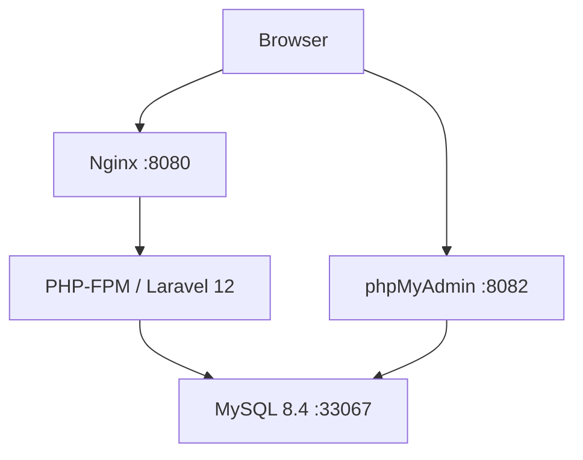
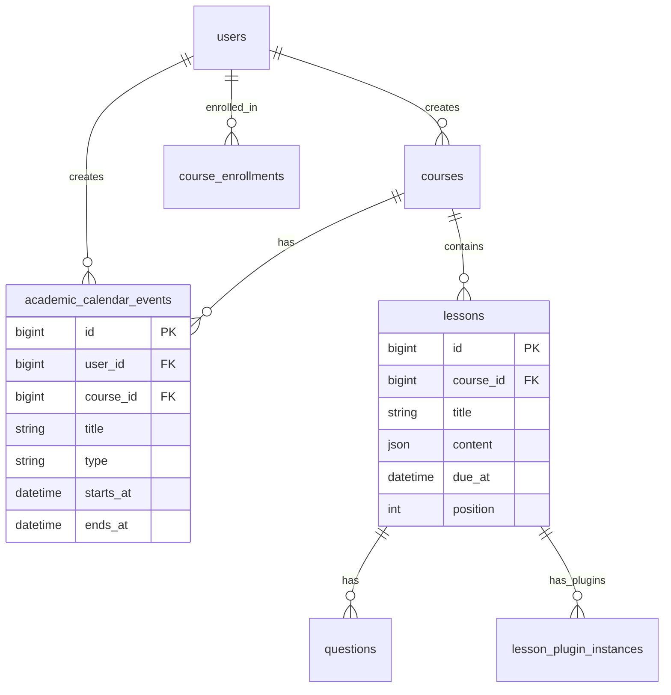
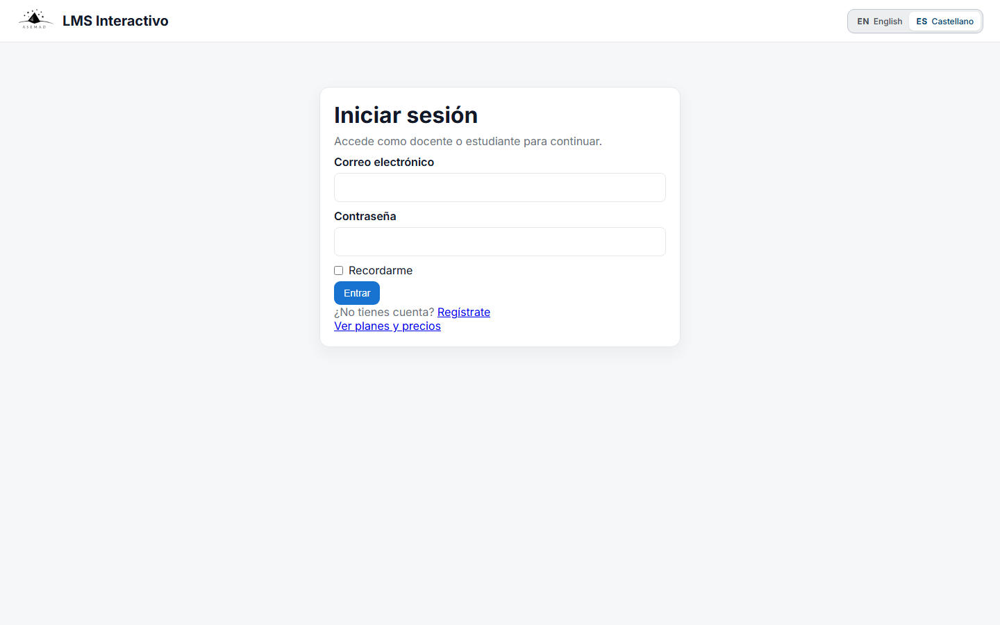

## Table of Contents

0. [Project Profile](#0-project-profile)
1. [Product Overview](#1-product-overview)
2. [System Architecture](#2-system-architecture)
3. [Data Model](#3-data-model)
4. [API Specification](#4-api-specification)
5. [User Stories](#5-user-stories)
6. [Work Tickets](#6-work-tickets)
7. [Pull Requests](#7-pull-requests)
8. [Prompt Documentation](#8-prompt-documentation)
9. [Screenshots](#9-screenshots)
10. [Security and OWASP Top 10](#10-security-and-owasp-top-10)

**SaaS business plan:** [PLAN_NEGOCIO.md](./PLAN_NEGOCIO.md) · **Technical roadmap:** [ROADMAP_SAAS.md](https://github.com/BurgosAngel/codigofinal/blob/angel-burgos-r/codigofinal/lms-cms-laravel12/docs/ROADMAP_SAAS.md)

**Delivery 2 branch:** `feature-entrega2-ABR` · **Reference conversation:** [README structure analysis for lms-cms-laravel12](./agent-transcripts/362d8b59-41b4-47ce-89fa-5fe5f7a83cbb.md)

---

## 0. Project Profile

**Author:** Angel Burgos Ruiz

**Project name:** LMS-CMS (Interactive Open Source LMS Platform)

**Brief description:**
Open-source learning management system (LMS) built with Laravel 12. Enables educational institutions, companies, and trainers to create, manage, and distribute online courses with interactive content through a drag & drop plugin system, dynamic assessments, enrollment management, academic calendar, user profile, and bilingual interface (ES/EN).

**Project URL:** `http://localhost:8080`(Docker)

**Code repository:** [BurgosAngel/codigofinal](https://github.com/BurgosAngel/codigofinal) (branch `angel-burgos-r`, application at `codigofinal/lms-cms-laravel12`)

**Prompt documentation:** [prompts.md](./prompts.md)

**SaaS business plan:** [PLAN_NEGOCIO.md](./PLAN_NEGOCIO.md)

**Delivery 2 branch:** `feature-entrega2-ABR`

**Reference conversation (README analysis):** [agent-transcripts/362d8b59-41b4-47ce-89fa-5fe5f7a83cbb.md](./agent-transcripts/362d8b59-41b4-47ce-89fa-5fe5f7a83cbb.md)

---

## 1. Product Overview

### 1.0. SaaS Vision (business plan)

**SaaS** platform aimed at bootcamps, tech companies, and independent educators to **create, share, and monetize technology courses** with **integrated AI** (per-lesson tutor, analytics, API for external LMS). The current technical MVP covers **Phase 1** of the roadmap; commercial plans at `/pricing`.

| Plan | Price | Status |
|------|-------|--------|
| Basic (students) | €4.99/month | Defined in app |
| Pro (creators) | €29/month | Defined in app |
| Enterprise | €299–999/month | Defined in app |

Detailed roadmap: [ROADMAP_SAAS.md](https://github.com/BurgosAngel/codigofinal/blob/angel-burgos-r/codigofinal/lms-cms-laravel12/docs/ROADMAP_SAAS.md).

### 1.1. Objective

Provide a modern, modular, open-source LMS platform that enables the creation and consumption of courses with rich content through plugins, interactive assessments, differentiated roles (teacher/student), enrollment management, progress tracking, academic calendar, and localized user experience.

### 1.2. Main features and functionality

- **Course management:** Create, edit, publish, and organize courses with ordered lessons.
- **Drag & drop plugin system:** Interactive blocks (text, image, video, code, quick quiz, matching, fill-blanks, forum, file upload, H5P) with visual editor, reordering, and preview.
- **Dynamic assessments:** Quizzes with configurable multiple-choice options, automatic grading, and scoring.
- **Enrollment management:** Drag & drop panel to assign/remove users in courses.
- **Academic calendar:** Monthly view with lesson events (`due_at`), enrollments, and custom teacher events; Moodle layout for teachers at `/calendar`.
- **Academic events (teacher):** Create, edit, and delete events at `/calendar/events/*` (teacher role only).
- **Internationalization (i18n):** Interface in Spanish and English via session (`/locale/{es|en}`) and `lang/*/lms.php` files.
- **Unified sidebar navigation:** Home, My Courses, Calendar (+ Log out) on all authenticated pages; «New event» link only on `/calendar` for teachers.
- **User profile:** Edit name, email, and avatar.
- **Progress tracking:** Record of lessons completed per student.
- **Differentiated dashboards:** Teacher and student views.
- **Multimedia file uploads:** Local videos with configured limits (128 MB).

### 1.3. Design and user experience

Main flow:
1. User accesses `/login` or `/register` (language selector available).
2. Teacher creates course → adds lessons → manages plugins → enrolls students → publishes course → views calendar and creates events.
3. Student accesses course → views lesson with plugins → answers quiz/interacts.
4. System calculates score and records progress.

### 1.4. Installation instructions

**Requirements:** Docker and Docker Compose

**Installation with Docker:**
```bash
git clone -b angel-burgos-r https://github.com/BurgosAngel/codigofinal.git
cd codigofinal/lms-cms-laravel12
cp .env.example .env
docker compose up -d
docker compose exec app composer install
docker compose exec app php artisan key:generate
docker compose exec app php artisan migrate --seed
docker compose exec app php artisan storage:link
```

**Access:**
- Application: `http://localhost:8080`
- phpMyAdmin: `http://localhost:8082`

**Test credentials (after seed):**
- Teacher: `teacher@example.com` / `password123`
- Student: `student@example.com` / `password123`

**Language switch:** `http://localhost:8080/locale/es` or `/locale/en`

**Local installation (without Docker):**
```bash
composer install
cp .env.example .env
php artisan key:generate
php artisan migrate --seed
php artisan storage:link
php artisan serve
```
Requires: PHP 8.3+, Composer, MySQL 8.4.

---

## 2. System Architecture

### 2.1. Architecture diagram


```mermaid
graph TD
    Browser[Browser] --> Nginx[Nginx :8080]
    Nginx --> PhpFpm[PHP-FPM / Laravel 12]
    PhpFpm --> MySQL[MySQL 8.4 :33067]
    Browser --> PMA[phpMyAdmin :8082]
    PMA --> MySQL
```

**Pattern:** MVC (Model-View-Controller) with Laravel 12.

### 2.2. Main components

| Layer | Technology |
|-------|------------|
| Frontend | Blade + CSS (`public/css/lms.css`, `calendar*.css`) + JS (`public/js/lms.js`) |
| Backend | Laravel 12 (PHP 8.3) |
| i18n | `lang/en/lms.php`, `lang/es/lms.php`, middleware `SetLocale` |
| Database | MySQL 8.4 |
| Web server | Nginx 1.27 (Docker) |

### 2.3. Project structure

```text
lms-cms-laravel12/
├── app/
│   ├── Http/
│   │   ├── Controllers/           12 controllers
│   │   │   AuthController, CalendarController, CalendarEventController,
│   │   │   CourseController, DashboardController, EnrollmentController,
│   │   │   LessonController, LocaleController, PluginController,
│   │   │   PluginInteractionController, ProfileController, QuizController
│   │   └── Middleware/            EnsureRole, SetLocale
│   ├── Models/                    15 Eloquent models
│   ├── Services/                  CalendarService.php
│   └── Support/                   CalendarEvent.php (DTO)
├── bootstrap/app.php              Web middleware registration + role alias
├── database/
│   ├── migrations/                15 migrations
│   └── seeders/                   DatabaseSeeder, LmsDemoSeeder, PluginDefinitionSeeder
├── docker/
│   ├── nginx/default.conf         client_max_body_size 128M
│   └── php/uploads.ini            upload_max_filesize 128M
├── lang/
│   ├── en/lms.php
│   └── es/lms.php
├── public/
│   ├── css/                       lms.css, calendar.css, calendar-teacher.css,
│   │                              calendar-event-form.css
│   └── js/lms.js
├── resources/views/
│   ├── layouts/                   app, stitch, calendar-moodle
│   │   └── partials/              sidebar-nav, language-switcher, i18n-js,
│   │                              calendar-moodle-topbar
│   ├── auth/                      login, register
│   ├── dashboard/                 student, teacher
│   ├── courses/                   index, show, enrollments
│   ├── lessons/                   show, edit
│   ├── calendar/                  index, teacher, _body, events/*
│   ├── profile/                   edit
│   └── plugins/                   block partials
├── routes/web.php
├── tests/
│   ├── Feature/                   LmsFlowTest, LocaleTest, CalendarTest, CalendarEventTest
│   └── Unit/                      LessonCastTest
├── docker-compose.yml
└── Dockerfile
```

### 2.4. Infrastructure and deployment

**Docker Compose** with 4 services:

| Service | Image | Port |
|---------|-------|------|
| app | PHP 8.3 FPM Alpine (local build) | — |
| web | nginx:1.27-alpine | 8080 |
| db | mysql:8.4 | 33067 |
| phpmyadmin | phpmyadmin:5-apache | 8082 |

### 2.5. Security

- Password hashing (bcrypt)
- Middleware `EnsureRole` (`role:teacher` / `role:student`)
- Middleware `SetLocale` (only `en` | `es`)
- CSRF protection on forms
- Input validation in controllers
- Calendar event routes restricted to teachers

### 2.6. Tests

| Test | Description |
|------|-------------|
| `LmsFlowTest` | Flow: registration → course → lesson → quiz |
| `LocaleTest` | Language switch and sidebar text |
| `CalendarTest` | Calendar access, teacher/student layout, «New event» link |
| `CalendarEventTest` | Academic event CRUD (teacher) |
| `LessonCastTest` | JSON casting of lesson content |

Run in Docker:
```bash
docker compose exec app php artisan test
```

---

## 3. Data Model

### 3.1. Model diagram (excerpt)


```mermaid
erDiagram
    users ||--o{ courses : creates
    users ||--o{ academic_calendar_events : creates
    users ||--o{ course_enrollments : enrolled_in
    courses ||--o{ lessons : contains
    courses ||--o{ academic_calendar_events : has
    lessons ||--o{ questions : has
    lessons ||--o{ lesson_plugin_instances : has_plugins

    academic_calendar_events {
        bigint id PK
        bigint user_id FK
        bigint course_id FK
        string title
        string type
        datetime starts_at
        datetime ends_at
    }

    lessons {
        bigint id PK
        bigint course_id FK
        string title
        json content
        datetime due_at
        int position
    }
```

### 3.2. Main entities

| Entity | Description |
|--------|-------------|
| **users** | Users with `teacher` or `student` role |
| **courses** | Courses with draft/published status |
| **lessons** | Ordered lessons; `due_at` for calendar |
| **questions** | Quiz questions (JSON options, min. 2) |
| **quiz_results** | Score per lesson and user |
| **progress** | Completed lessons |
| **course_enrollments** | Enrollments with role |
| **academic_calendar_events** | Custom teacher events |
| **plugin_definitions** … **lesson_layout_snapshots** | Plugin system (see migrations 2026_05_07_*) |

---

## 4. API Specification

Web routes in `routes/web.php` (no separate REST API).

### Public / locale routes

| Method | Route | Action |
|--------|-------|--------|
| GET | `/locale/{locale}` | Change language (es/en) |
| GET/POST | `/login`, `/register` | Authentication |

### Authenticated routes (any role)

| Method | Route | Action |
|--------|-------|--------|
| GET | `/dashboard` | Dashboard by role |
| GET | `/calendar` | Calendar (teacher or student view) |
| GET/PATCH | `/profile/edit`, `/profile` | User profile |
| GET | `/courses` | Course listing |
| POST | `/logout` | Log out |

### Teacher routes (`role:teacher`)

| Method | Route | Action |
|--------|-------|--------|
| GET | `/calendar/events/create` | New event form |
| POST | `/calendar/events` | Save event |
| GET/PUT/DELETE | `/calendar/events/edit?id=` | Edit / update / delete event |
| POST | `/courses` | Create course |
| GET | `/courses/{course}` | Course detail |
| POST | `/courses/{course}/publish` | Publish |
| GET | `/courses/{course}/enrollments` | Enrollment panel |
| GET/POST/DELETE | `/courses/{course}/enrollments/*` | JSON enrollment APIs |
| POST | `/lessons` | Create lesson |
| GET | `/lessons/{lesson}/edit` | Lesson editor + plugins + quiz |
| GET/POST/PATCH/DELETE | `/plugins/*`, `/lessons/{lesson}/plugins/*` | Plugin system |

### Student routes (`role:student`)

| Method | Route | Action |
|--------|-------|--------|
| GET | `/lessons/{lesson}` | View lesson |
| POST | `/quiz/submit` | Submit quiz |
| POST | `/plugins/instances/{instance}/interact` | Plugin interaction |
| POST | `/plugins/instances/{instance}/submit` | Gradable submission |

---

## 5. User Stories

**HU-1:** As a teacher, I want to create courses to organize my educational content.

**HU-2:** As a teacher, I want to add lessons to a course to structure the material.

**HU-3:** As a teacher, I want to publish a course so students can access it.

**HU-4:** As a teacher, I want to add interactive plugins with drag & drop.

**HU-5:** As a teacher, I want to manage quiz questions dynamically.

**HU-6:** As a teacher, I want to assign users to a course via drag & drop.

**HU-7:** As a student, I want to view published courses.

**HU-8:** As a student, I want to view lessons with interactive plugins.

**HU-9:** As a student, I want to answer quizzes and receive a score.

**HU-10:** As a student, I want to view my progress.

**HU-11:** As a teacher, I want to view a monthly academic calendar and create my own events to plan the course.

**HU-12:** As a user, I want to change the interface language (ES/EN) and see translated navigation (Home, My Courses, Calendar).

### 5.1 MoSCoW prioritization (excerpt)

**Must-Have:** authentication, course/lesson CRUD, enrollment, student consumption, assessment.

**Should-Have:** advanced plugin editor, academic calendar, full i18n, user profile.

---

## 6. Work Tickets

**Ticket 1 — Authentication and roles**

**Ticket 2 — Course and lesson CRUD**

**Ticket 3 — Assessment system (dynamic quiz)**

**Ticket 4 — Drag & drop plugin system**

**Ticket 5 — Enrollment management**

**Ticket 6 — Docker infrastructure and uploads**

**Ticket 7 — Academic calendar**
- `CalendarService` + events from lessons, enrollments, and `academic_calendar_events`
- Views `calendar/index`, `calendar/teacher`, layout `calendar-moodle`
- Event CRUD: `CalendarEventController`, migration and `AcademicCalendarEvent` model
- `lessons.due_at` field and data in `LmsDemoSeeder`
- Tests `CalendarTest`, `CalendarEventTest`

**Ticket 8 — Internationalization and navigation**
- `lang/en/lms.php`, `lang/es/lms.php`, `SetLocale`, `LocaleController`
- Unified `sidebar-nav` partial; `language-switcher`, `i18n-js` + `window.lmsT()` in `lms.js`
- «New event» link conditioned on `calendar` route and teacher role
- Test `LocaleTest`

---

## 7. Pull Requests

**PR 1 — Authentication and roles**

**PR 2 — Course and lesson management**

**PR 3 — Assessments and progress**

**PR 4 — Interactive plugin system**

**PR 5 — Enrollment management**

**PR 6 — Dockerization and CI**

**PR 7 — Academic calendar and teacher events**

**PR 8 — ES/EN i18n and unified navigation sidebar**

---

## 8. Prompt Documentation

Prompts used with code assistants (max. 3 per lifecycle section) and the detailed list of files touched in [BurgosAngel/codigofinal](https://github.com/BurgosAngel/codigofinal) are in **[prompts.md](./prompts.md)** (sections 1–9).

### Delivery 2 (`feature-entrega2-ABR`)

Artifacts generated in the conversation [README structure analysis for lms-cms-laravel12](./agent-transcripts/362d8b59-41b4-47ce-89fa-5fe5f7a83cbb.md):

| Artifact | Description |
|----------|-------------|
| [readme.md](./readme.md) | Product documentation aligned with the code in [BurgosAngel/codigofinal](https://github.com/BurgosAngel/codigofinal) (architecture, data model, API, user stories, tickets) |
| [prompts.md](./prompts.md) | Prompts by lifecycle phase and main files used |
| [PLAN_NEGOCIO.md](./PLAN_NEGOCIO.md) | SaaS business plan (plans, target, projection) |
| [seguridad.md](./seguridad.md) | Security by user story and OWASP Top 10 analysis |
| [ROADMAP_SAAS.md](https://github.com/BurgosAngel/codigofinal/blob/angel-burgos-r/codigofinal/lms-cms-laravel12/docs/ROADMAP_SAAS.md) | Technical roadmap aligned with the business plan |

Transcript index: [agent-transcripts/index.md](./agent-transcripts/index.md).

---

## 9. Screenshots

Screenshots taken from the running application (`http://localhost:8080`, ES language, `LmsDemoSeeder` data). Files in [`docs/screenshots/`](docs/screenshots/).

### Access

Login screen with EN/ES language selector.



### Teacher role

| View | Description |
|------|-------------|
| Dashboard | Main panel with courses, timeline, and creation form |
| My Courses | Listing and management of published courses |
| Calendar | Monthly view (Moodle 5 layout), academic events, and «+ New event» button in the sidebar |
| New event | Academic event creation form (`/calendar/events/create`) |


### Student role

| View | Description |
|------|-------------|
| Dashboard | Enrolled courses and quick access |
| Calendar | Monthly view with standard LMS layout (no Moodle layout) |


> The **«+ New event»** link only appears on `/calendar` when the user has the `teacher` role. It is not shown in the sidebar on the event creation form.

---

## 10. Security and OWASP Top 10

Project security documentation is split into two levels:

| Document | Content |
|----------|---------|
| [seguridad.md](./seguridad.md#security-by-user-story) | Acceptance criteria and non-functional requirements per user story (HU-1 … HU-12); see also [User Stories](#5-user-stories) |
| [seguridad.md § OWASP Analysis](./seguridad.md#owasp-top-10-vulnerability-analysis) | Priority vulnerabilities detected in the code, with concrete examples and proposed fixes |

### Priority vulnerabilities (summary)

| # | OWASP | Vulnerability | Severity |
|---|-------|---------------|----------|
| 1 | A03 Injection | Stored XSS in lesson HTML content (`{!! !!}`) | Critical |
| 2 | A01 Broken Access Control | Uploaded files accessible without enrollment verification | High |
| 3 | A03 / A10 | Malicious embedded content via unallowlisted embed URLs in plugins (iframe) | High |
| 4 | A04 / A08 | Unlimited quiz resubmission without integrity controls | Medium-High |
| 5 | A01 Broken Access Control | Enrollment with arbitrary `teacher` role on another user's course | Medium |

> Cross-cutting controls (authentication, global roles, TLS, CSRF) are documented in section [2.5. Security](#25-security) and are out of scope for the per-user-story analysis.
