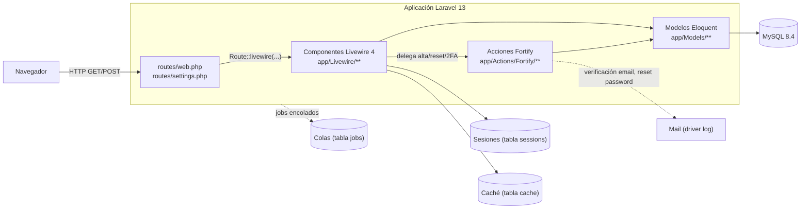
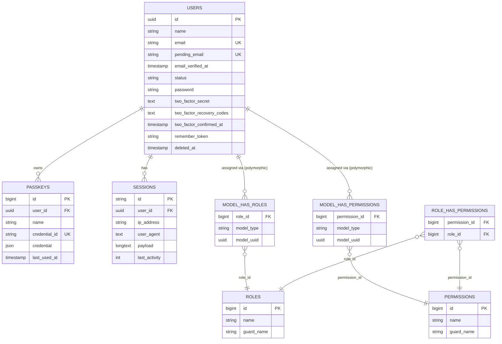

## Índice

0. [Ficha del proyecto](#0-ficha-del-proyecto)
1. [Descripción general del producto](#1-descripción-general-del-producto)
2. [Arquitectura del sistema](#2-arquitectura-del-sistema)
3. [Modelo de datos](#3-modelo-de-datos)
4. [Especificación de la API](#4-especificación-de-la-api)
5. [Historias de usuario](#5-historias-de-usuario)
6. [Tickets de trabajo](#6-tickets-de-trabajo)
7. [Pull requests](#7-pull-requests)

---

## 0. Ficha del proyecto

### **0.1. Tu nombre completo:**
Angel Rosso Pellisso

### **0.2. Nombre del proyecto:**
Arospe

### **0.3. Descripción breve del proyecto:**
Arospe es un dashboard de administración que centraliza la gestión de un ecommerce: usuarios, publicaciones del blog, productos y pedidos, todo desde un solo panel intuitivo

### **0.4. URL del proyecto:**

> Puede ser pública o privada, en cuyo caso deberás compartir los accesos de manera segura. Puedes enviarlos a [alvaro@lidr.co](mailto:alvaro@lidr.co) usando algún servicio como [onetimesecret](https://onetimesecret.com/).

### 0.5. URL o archivo comprimido del repositorio

> Puedes tenerlo alojado en público o en privado, en cuyo caso deberás compartir los accesos de manera segura. Puedes enviarlos a [alvaro@lidr.co](mailto:alvaro@lidr.co) usando algún servicio como [onetimesecret](https://onetimesecret.com/). También puedes compartir por correo un archivo zip con el contenido


---

## 1. Descripción general del producto

> Describe en detalle los siguientes aspectos del producto:

### **1.1. Objetivo:**

Arospe es un **backoffice de administración** para una operación de ecommerce: el panel interno desde el que un equipo gestiona los datos sobre los que corre una tienda (usuarios y sus permisos, un blog, el catálogo de productos, impuestos por región fiscal, transportistas y tarifas de envío, y clientes/pedidos), todo desde un único dashboard.

**Alcance deliberado — solo backoffice.** Arospe no incluye tienda pública, carrito ni checkout. Gestiona los datos que una tienda pública (futura y separada) consumiría; cuando el PRD menciona "el checkout" o "un cliente", lo hace para explicar *por qué* existe un dato administrativo, no porque esa pantalla forme parte de este proyecto.

**A quién va dirigido:** al equipo interno (administradores/editores) que necesita un panel único para dar de alta usuarios y roles, mantener el catálogo y sus reglas fiscales/logísticas, publicar contenido de blog y hacer seguimiento de clientes y pedidos, sin depender de acceso directo a la base de datos.

**Valor que aporta:** centraliza en una sola herramienta tareas que de otro modo estarían dispersas (gestión de usuarios, contenido, catálogo, fiscalidad, logística), con permisos granulares por módulo (vía roles dinámicos) en lugar de accesos todo-o-nada.

### **1.2. Características y funcionalidades principales:**

> Estado actual: en el código están implementadas la capa de autenticación (Fortify: registro, login, verificación de email, 2FA, passkeys), la **capa de backend/infraestructura** de Usuarios, Roles y Permisos (`RolePermissionSeeder` siembra 2 roles —`Super Admin` y `Administrator`— y un catálogo de 38 permisos, los middleware `role`/`permission`/`role_or_permission` están registrados en `bootstrap/app.php`, y el `Super Admin` dispone de un bypass de permisos vía `Gate::before`) y el **ciclo de vida de la cuenta**: la columna `users.status` (`activo`/`inactivo`/`suspendido`, vía el enum `App\Enums\UserStatus`), la invariante de **no autoactivación** (ninguna cuenta llega a `activo` por su propia acción sin probar su email: registro, invitación y confirmación de cambio de correo convergen en un único listener `ActivateVerifiedUser`) y el mecanismo de **cambio de email pendiente** (un cambio de dirección nunca reescribe `users.email` en el momento: se aparca en `users.pending_email` y solo se aplica al usar el enlace firmado de 60 minutos enviado a la nueva dirección).
>
> A eso se suma ya el **backend completo de la pantalla de Usuarios**: la ruta `/users` es la **primera protegida por un permiso del catálogo** (`can:users.view`), el componente Livewire `App\Livewire\Users\Index` lista los usuarios con su rol y estado y resuelve el alta, la edición y el borrado, y `App\Policies\UserPolicy` —la primera *policy* de la aplicación— decide quién puede hacer qué sobre cada cuenta (incluida la regla de que promover, degradar, borrar, suspender o cambiarle el email a un `Administrator` exige el permiso `roles.manage-administrators`). Un usuario creado por un administrador nace con contraseña aleatoria inutilizable y recibe una **invitación** para fijar la suya; al completarla queda verificado y activo por el mismo listener de siempre.
>
> Se suma también el **borrado lógico** de usuarios: borrar una cuenta ya no destruye la fila, la marca como borrada (`users.deleted_at`, vía el trait `SoftDeletes`), de modo que se conservan sus referencias históricas — passkeys, sesiones y asignaciones de rol siguen físicamente ahí. En la misma operación, y dentro de una única transacción, el correo se ofusca a un marcador determinista (`deleted+{id}@deleted.invalid`, sobre el TLD reservado `.invalid`), se limpian `email_verified_at` y `pending_email`, y se revocan los tokens de `password_reset_tokens` ligados a la dirección real anterior. Así la dirección queda **inmediatamente libre** para un alta nueva sin arrastrar enlaces vivos del titular anterior. La cuenta borrada desaparece de las consultas por defecto —listado, *route-model binding* y, sobre todo, **todas** las vías de inicio de sesión (contraseña, sesión en curso, cookie de "recuérdame", enlace de reseteo y passkey)—, y `UserPolicy::delete()` rechaza volver a borrar una cuenta ya borrada, para que el marcador no pueda reescribirse.
>
> La pantalla de Usuarios tiene ya su **interfaz real** (`resources/views/livewire/users.blade.php`), y no un marcador de posición: cabecera con el recuento en vivo (total y activos) y botón primario "Nuevo usuario"; tabla de usuarios con avatar de iniciales, nombre sobre correo, aviso discreto cuando hay un **cambio de correo pendiente**, rol (o un guion cuando la cuenta no tiene ninguno) y **badge de estado** con color propio (`Activo`/`Inactivo`/`Suspendido`); acciones de editar y borrar por fila, que aparecen **deshabilitadas —con su explicación al pasar el ratón— cuando la `UserPolicy` no permite esa acción sobre esa cuenta concreta**, en lugar de fallar al pulsarlas; modal de alta/edición con nombre, correo, selector de rol —que nunca ofrece `Super Admin`— y selector de estado, con los errores de validación en línea; modal de confirmación de borrado que nombra la cuenta afectada; y un estado vacío explícito. Todo con Flux UI + Tailwind v4, en modo claro y oscuro, con los textos en inglés vía `__()` a la espera del selector de idioma de la Epic 5. La entrada "Usuarios" del menú lateral es de momento **estática y visible para cualquier usuario autenticado**: es una fuga cosmética, no de acceso, porque la ruta sigue exigiendo `can:users.view` y el componente vuelve a autorizar en cada acción.
>
> Con la última historia cerrada, `users.status` deja de ser una etiqueta descriptiva y pasa a ser un **control de autenticación**: una cuenta `inactiva` o `suspendida` ya **no obtiene sesión por ninguna vía**, y se le dice únicamente que la cuenta no está activa, sin revelar nunca *cuál* de los dos estados aplica. Como no existe un único punto por el que pasen todas las formas de iniciar sesión, la comprobación vive en **tres** sitios complementarios: `Fortify::authenticateUsing()` (`App\Actions\Fortify\AuthenticateUser`) cubre correo+contraseña **y** las cuentas con 2FA —a las que rechaza *antes* de ofrecerles siquiera el paso del código, sin dejar ningún reto pendiente en sesión—; `Passkeys::authorizeLoginUsing()` cubre el acceso por passkey, que tiene su propio controlador y no pasa por la tubería de Fortify; y el listener `RejectNonActiveUserLogin`, registrado sobre los eventos `Login` **y** `Authenticated`, cubre la cookie de "recuérdame" y el caso de una cuenta suspendida *entre* el paso de contraseña y el del código 2FA. Devolver el estado a `activo` restaura el acceso en el **siguiente intento**, sin ningún paso administrativo adicional ni caché que limpiar. Dos límites deliberados: una sesión ya abierta **no** se corta, y un usuario recién registrado sigue entrando aunque nazca `inactivo`, porque registrarse no es iniciar sesión.
>
> Las dos últimas historias endurecen la **identidad de los dos niveles de privilegio**. El rol `Super Admin` deja de ser una fila ordinaria de `roles` y pasa a ser un **punto fijo del sistema**: categóricamente no se puede borrar, renombrar, repermisionar ni asignar desde ninguna pantalla, y no aparece en ningún listado de roles. Todo ello vive en `App\Models\Role` —el único modelo de rol que el código de aplicación puede usar, verificado por un test de arquitectura— en tres capas complementarias: guardias sobre los eventos del modelo, sobrescrituras de los métodos que tocan las tablas pivote (que no disparan ningún evento) y una `RolePolicy` para las pantallas que aún están por construir. En paralelo, la pregunta "¿es este el rol `Administrator`?" —que antes se respondía con la cadena literal `'Administrator'` escrita en **cinco** sitios distintos— pasa a tener **una sola** respuesta: `App\Models\Role::isAdministratorRole()`, que compara de forma exacta y sensible a mayúsculas contra el único literal, alojado en `App\Enums\RoleName`. A diferencia del nombre del `Super Admin`, el del `Administrator` **no es configurable, y es a propósito**: está fijado por decisión de producto, así que el enum *es* la fuente de verdad y añadir una clave de configuración crearía justo la vía de override que esa decisión descarta.
>
> Y, sobre todo, **la autorización de nivel `Administrator` deja de vivir en la pantalla y pasa a vivir en la acción**: `App\Actions\Users\CreateUser` y `UpdateUser` autorizan la operación completa por su cuenta, antes de cualquier escritura. Hasta ahora la regla era una propiedad de *un* llamador —el componente Livewire—, de modo que cualquier futuro endpoint de API, comando de consola o job en cola habría quedado **sin ninguna protección**. `UpdateUser`, además, deduce internamente el guardia de autoedición en lugar de aceptarlo como parámetro (un booleano que aporta quien llama no es un guardia: es un bypass de un solo argumento) y **rechaza de forma tajante** cualquier modificación de un usuario que ostente el rol `Super Admin`, con un `throw` directo y no a través del `Gate` —porque el bypass `Gate::before` del propio `Super Admin` decide *antes* que cualquier policy y anularía la regla justo para el actor al que debe atar—. Dos consecuencias asumidas y documentadas: un `Super Admin` que antes podía editar a otro `Super Admin` desde el panel ahora recibe un rechazo, y la acción de **borrar** todavía **no** tiene el guardia equivalente (sigue siendo solo de nivel policy). Detalle completo en [`arospe/docs/architecture/authorization.md`](arospe/docs/architecture/authorization.md).
>
> Lo que **todavía no existe**: el CRUD de roles y la asignación de permisos desde el panel, un flujo de **restauración** de cuentas borradas (`restore()` existe en el modelo, pero ninguna pantalla lo invoca todavía y una cuenta restaurada conservaría el correo ofuscado), y el cierre inmediato de las sesiones ya abiertas de un usuario al que se desactiva o suspende. El resto de funcionalidades descritas a continuación son el alcance funcional definido en el PRD (`docs/PRD/PRD.md`) y constituyen la hoja de ruta del backoffice.

- **Usuarios, Roles y Permisos** — CRUD completo de roles personalizados con permisos granulares por módulo (vía `spatie/laravel-permission`, ya instalado), sustituyendo el desplegable de rol fijo del prototipo. Es la base de la que dependen el resto de épicas.
- **Catálogo de Productos** — productos con categorías propias (CRUD completo, taxonomía distinta a la del blog) y **variantes configurables**: tipos de atributo (Talla, Color, Material…) definidos por el administrador, cada combinación con su propio SKU, precio, stock e imagen destacada opcional.
- **Regiones de venta e Impuestos** — un catálogo de regiones fiscales (país, y para España sus territorios especiales: Península, Baleares, Canarias, Ceuta, Melilla) donde cada entrada *es* a la vez la regla fiscal (tipo, descripción, código), con exactamente una región marcada como tarifa por defecto.
- **Envíos** — transportistas con activar/desactivar y reglas de tarifa por transportista según zona de envío + rango de peso + precio + plazo estimado (configuración manual, sin integración con API de transportista real).
- **Galería de medios compartida** — cada imagen subida se conserva en su formato original (`.png`/`.jpg`/`.jpeg`) y además genera variantes `.webp` y `.avif`, en almacenamiento local (`storage/app/public`).
- **Clientes y Pedidos** — entidades gestionadas desde el backoffice, independientes del sistema de Usuarios/Roles (los clientes no acceden al dashboard).
- **Blog** — categorías (CRUD) y etiquetas (CRUD + alta rápida desde el propio editor del post); un post tiene una categoría y varias etiquetas.
- **Internacionalización** — dos capas independientes: selector de idioma de la interfaz de administración (ES/EN) y "idiomas de tienda" gestionables por el admin, que aparecen como pestañas para traducir campos de contenido (producto, post, slugs/SEO, nombres de categoría/etiqueta).
- **Búsqueda global y notificaciones** — búsqueda funcional sobre usuarios, productos y posts; notificaciones para stock bajo/agotado, nuevo cliente, nuevo pedido y publicación de posts.

### **1.3. Diseño y experiencia de usuario:**

> Proporciona imágenes y/o videotutorial mostrando la experiencia del usuario desde que aterriza en la aplicación, pasando por todas las funcionalidades principales.

### **1.4. Instrucciones de instalación:**

**Prerrequisitos**

- PHP 8.3+ (solo si se ejecuta tooling fuera de Docker; Sail ya provee PHP)
- Composer
- Docker (Docker Desktop) — el entorno local corre sobre Laravel Sail
- Windows: **WSL2 obligatorio**; todos los comandos se ejecutan desde la shell de WSL2 (Ubuntu), no desde PowerShell/CMD. Docker Desktop debe estar iniciado y con la integración WSL2 habilitada para la distro usada.

**1. Clonar el repositorio**

```bash
git clone <repository-url>
cd arospe
```

**2. Crear el fichero `.env`**

Hay un `.env.example` en el repo que muestra las claves existentes, pero los valores reales (credenciales de base de datos, ajustes de app, etc.) deben solicitarse de forma privada — no inventar ni reutilizar valores de otro entorno.

**3. Instalar dependencias PHP**

```bash
composer install
```

**4. Levantar los servicios con Sail**

```bash
./vendor/bin/sail up -d
```

Esto arranca, según `compose.yaml`:

| Servicio | Imagen | Propósito |
| --- | --- | --- |
| `laravel.test` | `sail-8.5/app` (build de `docker/8.5`) | Contenedor de la app, PHP 8.5. Sirve la app (puerto `80`) y el servidor de desarrollo de Vite (puerto `5173`). |
| `mysql` | `mysql:8.4` | Base de datos principal (puerto `3306`). También aprovisiona una base de datos de test vía `docker/mysql/create-testing-database.sh`. |
| `redis` | `redis:alpine` | Redis (puerto `6379`) para caché, sesiones y colas. |

**5. Frontend**

```bash
./vendor/bin/sail npm install
./vendor/bin/sail npm run dev      # servidor Vite con hot reload
./vendor/bin/sail npm run build    # build de producción
```

**6. Base de datos: migraciones y semillas**

```bash
./vendor/bin/sail artisan migrate
./vendor/bin/sail artisan migrate --seed
./vendor/bin/sail artisan db:seed
```

Para reconstruir la base de datos desde cero:

```bash
./vendor/bin/sail artisan migrate:fresh --seed
```

**El seed no es opcional.** `database/seeders/RolePermissionSeeder.php` es la **única** fuente de los roles y del catálogo de permisos contra los que autoriza la aplicación: sin él la app no funciona correctamente (ver la nota de despliegue en [`arospe/docs/architecture/overview.md`](arospe/docs/architecture/overview.md)). En cualquier despliegue —producción incluida— es un paso **obligatorio**, y conviene usar la forma explícita en lugar de un `db:seed` genérico, para que ningún seeder de fixtures añadido después pueda llegar a producción:

```bash
./vendor/bin/sail artisan db:seed --class=RolePermissionSeeder
```

El seeder es idempotente: re-ejecutarlo no duplica nada y restaura permisos revocados manualmente al rol `Administrator`.

**Variable de entorno opcional `SUPER_ADMIN_EMAIL`.** Define el email del usuario al que `RolePermissionSeeder` asigna el rol `Super Admin` (ver `.env.example` para la descripción completa). Si se deja sin definir, el rol se siembra sin asignar a nadie. Si coincide con un usuario existente **verificado**, ese usuario recibe el rol. Si no coincide con ningún usuario, el seeder **aprovisiona** una cuenta nueva con contraseña aleatoria y envía un enlace de reseteo para que el operador la reclame vía "He olvidado mi contraseña". Si coincide con un usuario existente **sin verificar**, o si el valor no es una dirección de email bien formada, el seeder **aborta** ese bootstrap de forma ruidosa y no concede el rol a nadie (el resto del seed sí continúa). El valor se normaliza a minúsculas, así que `Admin@Example.com` y `admin@example.com` son la misma dirección.

**7. Ejecutar los tests**

```bash
./vendor/bin/sail artisan test
```

También existe un script de Composer que limpia config, comprueba formato, ejecuta análisis estático y luego el test suite:

```bash
composer test
```

Los tests de navegador (Pest browser plugin + Playwright) requieren, la primera vez, descargar los binarios de navegador (no se versionan en el repo):

```bash
npx playwright install
```

**8. Calidad de código**

```bash
./vendor/bin/sail composer lint          # formatea con Pint
./vendor/bin/sail composer lint:check    # comprueba estilo sin modificar
./vendor/bin/sail composer types:check   # análisis estático con Larastan
```

**9. Parar el entorno**

```bash
./vendor/bin/sail down
```

---

## 2. Arquitectura del Sistema

### **2.1. Diagrama de arquitectura:**

Arospe es un **monolito Laravel 13 + Livewire 4**, construido sobre el starter kit oficial de Livewire (`laravel/livewire-starter-kit`). No hay SPA independiente ni API REST: los componentes Livewire renderizan UI server-driven directamente sobre el request lifecycle de Laravel.


```mermaid
flowchart LR
    Browser["Navegador"]

    subgraph Laravel["Aplicación Laravel 13"]
        Routes["routes/web.php\nroutes/settings.php"]
        Livewire["Componentes Livewire 4\napp/Livewire/**"]
        Fortify["Acciones Fortify\napp/Actions/Fortify/**"]
        Models["Modelos Eloquent\napp/Models/**"]
    end

    DB[("MySQL 8.4")]
    Queue[("Colas (tabla jobs)")]
    Session[("Sesiones (tabla sessions)")]
    Cache[("Caché (tabla cache)")]
    Mail["Mail (driver log)"]

    Browser -->|"HTTP GET/POST"| Routes
    Routes -->|"Route::livewire(...)"| Livewire
    Livewire -->|"delega alta/reset/2FA"| Fortify
    Fortify --> Models
    Livewire --> Models
    Models --> DB
    Livewire --> Session
    Livewire --> Cache
    Fortify -.->|"verificación email, reset password"| Mail
    Laravel -.->|"jobs encolados"| Queue
```

**Patrón:** MVC clásico de Laravel, con Livewire sustituyendo la capa de "controlador + vista JS" por componentes de servidor con estado (full-stack reactivo sin escribir una API ni JavaScript de cliente para la lógica de negocio). Sesión, caché y colas usan el driver `database` (no hay servicios externos configurados todavía salvo el propio MySQL).

**Por qué esta arquitectura:** el proyecto es un backoffice interno (no una app pública de alto tráfico ni con necesidad de un cliente desacoplado), por lo que un monolito server-rendered reduce la complejidad operativa —no hay que versionar ni sincronizar un contrato de API entre backend y frontend— y acelera el desarrollo de CRUDs de administración, que es el grueso del alcance (ver [1.2](#12-características-y-funcionalidades-principales)).

**Beneficios:** menos piezas móviles (un solo repositorio, un solo despliegue), estado siempre en servidor (más fácil de validar/autorizar de forma centralizada), y reutilización directa de Eloquent/Blade/Livewire sin duplicar lógica de validación en un frontend separado.

**Costes/déficits:** no hay una API pública reutilizable por otros clientes (por ejemplo, una futura tienda pública tendría que construirse aparte o forzar la creación posterior de una API); la interactividad depende de round-trips al servidor por cada acción Livewire, lo que puede ser menos fluido que una SPA para interacciones muy ricas en cliente; y el acoplamiento UI-servidor dificulta escalar el frontend independientemente del backend.

### **2.2. Descripción de componentes principales:**

- **Rutas (`routes/web.php`, `routes/settings.php`)** — puntos de entrada HTTP. No existe `routes/api.php` todavía. Todas las rutas de `settings/*` cuelgan de un grupo `auth`, salvo una excepción deliberada: `email-change.confirm`, cuya lista completa de middleware es `signed` + `throttle:6,1` (lo que prueba el enlace es el control del buzón, no una sesión iniciada). `users.index` (`GET /users`) es la primera ruta protegida por un permiso, y lo hace con `can:users.view` —no con el `permission:` de Spatie— por un motivo técnico explicado en [2.5](#25-seguridad).
- **Componentes Livewire (`app/Livewire/**`)** — lógica de UI con estado, en clases PHP + vista Blade emparejada (convención *class-based*, no single-file component), agrupados por área (`Settings/`, `Users/`, `Actions/`...).
- **Acciones (`app/Actions/**`)** — una carpeta por concern: `Fortify/` implementa los contratos de `laravel/fortify` (registro, reseteo de contraseña) y aloja además `AuthenticateUser`, el *callback* de `Fortify::authenticateUsing()` que sustituye a `$guard->attempt()` para comprobar el estado de la cuenta; `Users/` contiene las acciones de dominio propias (`RequestEmailChange`, `ConfirmEmailChange`, `CreateUser`, `UpdateUser`). Son clases invocables de un solo propósito, inyectadas por método en el componente o controlador que las usa, y son las que poseen la lógica de escritura: el componente Livewire valida y delega, la acción autoriza y persiste. Esa última parte es una regla del proyecto y no un detalle: **una regla de autorización pertenece a la acción, no a uno de sus llamadores**. `CreateUser` y `UpdateUser` autorizan la operación completa antes de la primera escritura, de modo que un futuro endpoint de API, comando de consola o job en cola hereda la protección en lugar de tener que recordarla. El componente sigue autorizando también, pero como defensa en profundidad, nunca como única capa — y nunca como una **segunda implementación** de la misma regla.
- **Controladores (`app/Http/Controllers/**`)** — `ConfirmEmailChangeController` es el primer controlador de dominio del repo. La convención que fija: un controlador solo aparece cuando hay una preocupación específica de HTTP (binding de parámetros de ruta, construir la respuesta de redirección) delante de una acción de `app/Actions/`; la lógica de dominio se queda en la acción.
- **Policies (`app/Policies/`)** — `UserPolicy` es la primera *policy* de la aplicación y responde a la pregunta que un permiso no puede: no "¿puede este actor editar usuarios?" sino "¿puede editar **a este** usuario?". `RolePolicy` es la segunda, aún sin pantalla que la invoque: existe para que el CRUD de roles tenga contra qué autorizar y para que el rechazo del rol `Super Admin` sea efectivo también ahí. Laravel 13 las descubre automáticamente por nombre (`App\Policies\UserPolicy` ↔ `App\Models\User`), así que no hay `AuthServiceProvider` ni registro manual.
- **Enums, listeners y notificaciones (`app/Enums/`, `app/Listeners/`, `app/Notifications/`)** — `UserStatus` (estado de cuenta), `ActivateVerifiedUser` (único punto de activación, registrado en `AppServiceProvider`), `RejectNonActiveUserLogin` (rechazo de sesión para cuentas no activas, registrado sobre los eventos `Login` y `Authenticated`), `PendingEmailVerification` (el correo con el enlace firmado) y `UserInvitation` (la invitación a un usuario creado por un administrador).
- **Traducciones (`lang/en/`, `lang/es/`)** — copia de la aplicación separada del código: etiquetas de estado de usuario, mensaje de rechazo de inicio de sesión por estado (`users.login.not_active`), textos del flujo de cambio de correo, resumen de la pantalla de usuarios y copia de la invitación.
- **Modelos Eloquent (`app/Models/**`)** — capa de datos; usan atributos PHP 8 (`#[Fillable]`, `#[Hidden]`) y un método `casts()` en vez de las propiedades clásicas `$fillable`/`$hidden`/`$casts`. La *omisión* de una columna en `#[Fillable]` es la propia protección contra asignación masiva: `status` y `pending_email` solo se escriben con `forceFill()` desde una acción concreta. Junto a `User` vive `Role`, subclase del modelo de rol de `spatie/laravel-permission` sobre la **misma** tabla `roles` (sin migración ni columna nueva): es el único modelo de rol que el código de aplicación puede usar, porque es el que lleva las invariantes del `Super Admin` y la identidad centralizada del nivel `Administrator`.
- **Autenticación — `laravel/fortify` (^1.37)**: registro, login, reset de contraseña, verificación de email y 2FA.
- **Passkeys — `@laravel/passkeys` / `laravel/passkeys`**: soporte WebAuthn, consumido desde `App\Livewire\Settings\Security`.
- **Autorización — `spatie/laravel-permission` (^8.3)**: roles y permisos; el trait `HasRoles` está adjunto a `User` y la base de autorización **ya está operativa y en uso real**: `database/seeders/RolePermissionSeeder.php` siembra 2 roles (`Super Admin` y `Administrator`, guard `web`) y un catálogo de 38 permisos (9 módulos × 4 acciones CRUD, más `roles.manage` y `roles.manage-administrators`); los middleware `role`, `permission` y `role_or_permission` están registrados como alias en `bootstrap/app.php`; `App\Providers\AppServiceProvider` instala el bypass del `Super Admin` vía `Gate::before`; y sobre esa base ya existen la primera ruta protegida por permiso (`users.index`) y la primera *policy* (`UserPolicy`). Detalle completo en [`arospe/docs/architecture/authorization.md`](arospe/docs/architecture/authorization.md).
- **Base de datos — MySQL 8.4** (contenedor `mysql` en `compose.yaml`), también backend de sesiones, caché y colas (driver `database` para los tres).
- **Frontend — Vite ^8 + Tailwind CSS v4** (vía `@tailwindcss/vite`) + **Flux UI (Livewire Flux, free)** como librería de componentes visuales.
- **Entorno de desarrollo — Laravel Sail**, que orquesta los contenedores `laravel.test` (PHP 8.5 + Vite dev server), `mysql` y `redis` vía Docker Compose.
- **Calidad — Laravel Pint** (formateo), **Larastan** (análisis estático, nivel 7), **Pest 4** (+ plugin browser sobre Playwright) para tests.

### **2.3. Descripción de alto nivel del proyecto y estructura de ficheros**

Estructura real de `arospe/`, siguiendo la convención estándar de un proyecto Laravel:

```
app/
  Actions/Fortify/    Implementaciones de contratos de Fortify (CreateNewUser, ResetUserPassword...)
  Actions/Users/      Acciones de dominio de Usuarios (RequestEmailChange, ConfirmEmailChange, CreateUser, UpdateUser)
  Concerns/           Traits compartidos (p. ej. conjuntos de reglas de validación)
  Console/Commands/   Comandos Artisan
  Enums/              Enums respaldados por string (UserStatus)
  Http/Controllers/   Controlador base abstracto + controladores de dominio (frontera HTTP ante una acción)
  Listeners/          Listeners de eventos (ActivateVerifiedUser)
  Livewire/           Componentes Livewire, agrupados por área (Settings/, Users/, Actions/...)
  Models/             Modelos Eloquent (User; Role, subclase del modelo de rol del paquete)
  Notifications/      Notificaciones (PendingEmailVerification, UserInvitation)
  Policies/           Policies de modelo (UserPolicy), autodescubiertas por nombre
  Providers/          Service providers (AppServiceProvider, FortifyServiceProvider)
config/               Configuración de Laravel y paquetes (fortify.php, permission.php...)
database/
  factories/
  migrations/
  seeders/          DatabaseSeeder + RolePermissionSeeder (roles, catálogo de permisos, bootstrap del Super Admin)
lang/                 Ficheros de traducción, una carpeta por idioma (en/, es/)
resources/
  views/
    components/       Componentes Blade
    layouts/          Shells de layout (auth/app)
    livewire/         Vistas de componentes Livewire y vistas Blade planas de auth
    partials/
routes/                web.php, settings.php (sin api.php todavía)
tests/
  Feature/             Espeja la estructura de app/ (Auth/, Settings/, Models/, Authorization/, Seeders/, Policies/, Users/)
  Unit/                También espeja app/ (Enums/, Listeners/, Models/)
docker/                Assets de Docker para Sail (p. ej. aprovisionamiento de BD de test)
docs/                  Documentación del proyecto (arquitectura, BD, convenciones, decisiones)
```

El proyecto sigue estrictamente la organización por capas de Laravel (no hay estructura por módulo/dominio todavía, dado que el único modelo real es `User`); la convención explícita del equipo es no crear carpetas base nuevas sin aprobación. El detalle de convenciones por carpeta está en `docs/conventions/base-standards.md`.

### **2.4. Infraestructura y despliegue**

> Detalla la infraestructura del proyecto, incluyendo un diagrama en el formato que creas conveniente, y explica el proceso de despliegue que se sigue

### **2.5. Seguridad**

**Autenticación (`laravel/fortify`).** Registro, login, verificación de email y reseteo de contraseña delegados en Fortify, con acciones propias en `app/Actions/Fortify/` y reglas de validación centralizadas en traits (`app/Concerns/PasswordValidationRules.php`, `ProfileValidationRules.php`) para que ninguna ruta de entrada se quede con una política más laxa que las demás. Sobre esa base:

- **2FA (TOTP)** con confirmación explícita: el usuario no queda protegido hasta enviar un código válido; si el flujo se abandona a medias, `App\Livewire\Settings\Security::mount()` limpia proactivamente el estado semi-activado. Los códigos de recuperación viven encriptados en la BD (`two_factor_secret` y `two_factor_recovery_codes` son `Hidden` y encriptados).
- **Passkeys (WebAuthn)** vía `laravel/passkeys`, gestionadas desde el mismo componente `Security`.
- **Reconfirmación de contraseña** (`password.confirm`) obligatoria en la pantalla que gestiona 2FA y passkeys, además de `auth` y `verified`.
- **Emails canónicamente en minúsculas**, en tres capas: `lowercase_usernames` en `config/fortify.php`, normalización *antes* de `validate()` en `App\Livewire\Settings\Profile` (para que la regla de unicidad vea el valor que realmente se va a guardar) y normalización como primera sentencia de `App\Actions\Users\RequestEmailChange`. `User` expone además un accessor de solo lectura que devuelve el email en minúsculas.
- **Política de contraseñas endurecida solo en producción** (`AppServiceProvider`: mínimo 12 caracteres, mayúsculas/minúsculas, números, símbolos y comprobación `uncompromised()` contra filtraciones conocidas).

**El estado de la cuenta como control de acceso.** `users.status` no es una etiqueta: una cuenta que no esté `activa` no obtiene sesión. Y como ninguna comprobación única alcanza todas las vías de acceso, el bloqueo se implementa en **tres** puntos —`Fortify::authenticateUsing()` para contraseña y 2FA, `Passkeys::authorizeLoginUsing()` para passkeys, y el listener `RejectNonActiveUserLogin` sobre `Login` y `Authenticated` para la cookie de "recuérdame" y la suspensión a mitad del reto 2FA—. Tres decisiones de diseño lo sostienen:

- **Primero las credenciales, después el estado.** Una contraseña incorrecta toma la ruta de fallo genérica de Fortify sin tocar, con el mismo mensaje byte a byte que produciría una cuenta activa. El mensaje "la cuenta no está activa" solo lo ve quien ya ha demostrado tener credenciales válidas, y **nunca dice cuál** de los dos estados no activos aplica: `users.login.not_active` es una sola clave para `inactivo` y `suspendido`. La divulgación es deliberada y está exigida por el PRD; estas dos propiedades son lo que la mantiene acotada.
- **El *callback* pasa por el `UserProvider` del guard, no por un `User::where()` propio.** Sustituir `$guard->attempt()` traslada al *callback* todo lo que `attempt()` hacía de camino al usuario, y dos de esas cosas son controles de seguridad: el rehasheo de la contraseña al iniciar sesión, y —sobre todo— el scope de borrado lógico, que vive íntegramente en la consulta del proveedor. Una búsqueda escrita a mano habría seguido pasando todos los tests de estado mientras readmitía en silencio a las cuentas borradas.
- **Rechazar en el evento `Login` por sí solo no funciona.** `SessionGuard::login()` dispara `Login` y en la línea siguiente llama a `setUser()`, que resucita la sesión que el *listener* acababa de cerrar. Por eso el listener está registrado también sobre `Authenticated`, que se dispara ya *dentro* de `setUser()`: el primer manejador marca la petición y el segundo ejecuta el cierre que sí persiste. Ese segundo enganche es justamente el que cubre a un usuario suspendido *entre* el paso de contraseña y el del código 2FA, porque el controlador del reto resuelve al usuario desde la sesión y no vuelve a consultar el *callback*.

**Ciclo de vida de la cuenta y cambio de correo verificado.** Ninguna cuenta llega a `activo` **por su propia acción** sin probar el control de su buzón: el registro parte de `inactivo` (valor por defecto de la columna) y la única transición automática a `activo` ocurre en un solo sitio, `App\Listeners\ActivateVerifiedUser`, al que llegan por igual la verificación de email de Fortify, el flujo de invitación/reset y la confirmación de un cambio de correo. Ese listener nunca reactiva una cuenta `suspendida`, y —desde que `inactivo` deniega el acceso— tampoco reactiva a quien un administrador haya desactivado: solo promueve a `activo` a quien **nunca** había verificado su correo antes. Sobre esa base, un cambio de dirección de correo —propio o hecho por un administrador sobre otra cuenta— **nunca reescribe `users.email` en el momento**:

- La nueva dirección se aparca en `users.pending_email` y se envía un enlace **firmado, ligado a esa dirección concreta (`sha1`), de un solo uso y con 60 minutos de caducidad**, solo a la dirección nueva; jamás a la antigua.
- Solo al usar el enlace se escribe `users.email` y se marca `email_verified_at`. Reproducir, manipular, caducar, sustituir o cancelar un enlace deja la cuenta exactamente como estaba.
- La solicitud está limitada a **3 peticiones por hora y usuario destino** (`RateLimiter` dentro de la acción, compartido por la pantalla de perfil y el futuro editor de administración), y la ruta de confirmación lleva su propio `throttle:6,1`.
- `bootstrap/app.php` reordena globalmente el middleware para que `ValidateSignature` se ejecute **antes** que `SubstituteBindings`: sin eso, manipular el segmento `{user}` daría 404 (fallo de binding) mientras que manipular cualquier otro daría 403, lo que sería un oráculo para averiguar si un identificador de usuario existe.
- Todas las ramas de rechazo muestran **exactamente el mismo mensaje**, para no revelar *cuál* comprobación falló (en particular, que la dirección ya pertenece a otra cuenta).

Esto cierra la vía de suplantación registrada en `docs/errors-log.md`: hasta esta tarea, cualquier usuario autenticado podía apuntar su cuenta a una dirección que no controlaba. Ahora **`users.email` junto con un `email_verified_at` no nulo** sí prueba el control del buzón, que es exactamente el par del que depende la búsqueda del bootstrap del `Super Admin`.

**Modelo de autorización (`spatie/laravel-permission`).** Roles y permisos sembrados por `RolePermissionSeeder` con una convención de nombres canónica `<módulo>.<acción>`; el rol `Administrator` recibe 37 de los 38 permisos (todos menos `roles.manage-administrators`) y el rol `Super Admin` recibe **cero** permisos explícitos: autoriza exclusivamente por el bypass `Gate::before` instalado en `AppServiceProvider`. Ese bypass tiene un alcance deliberadamente acotado y documentado:

- La closure devuelve `true` o `null`, **nunca `false`**, para no denegar en bloque a los demás usuarios antes de consultar sus permisos reales.
- Comprueba el rol con el guard `web` explícito, de modo que un rol homónimo creado en otro guard no puede conceder el bypass.
- Solo cubre las comprobaciones que pasan por el Gate (`can()`, `authorize()`, `@can`, middleware `permission:` y `role_or_permission:`). **No** cubre `hasRole()`, `hasPermissionTo()` ni el middleware `role:`, que consultan el modelo directamente. De ahí la convención dura del proyecto: **gatear siempre por permiso, nunca por nombre de rol**.

**Autorización por registro concreto (`UserPolicy`).** Un permiso responde "¿puede este actor editar usuarios?"; hay decisiones que exigen responder "¿puede editar **a este** usuario?". `App\Policies\UserPolicy` es la primera *policy* del proyecto y concentra esas reglas: un usuario con el rol `Super Admin` no es editable ni borrable por nadie desde la pantalla; una cuenta ya borrada no puede volver a borrarse (para que la ofuscación no reescriba el marcador); y promover a `Administrator`, degradar a un `Administrator`, borrarlo, suspenderlo o cambiarle el correo exigen además el permiso `roles.manage-administrators` (que ningún rol posee: solo lo ejerce el `Super Admin` por el bypass). La autorización queda así en tres capas complementarias: el middleware de la ruta comprueba el **permiso** de página (`can:users.view`); dentro del componente, un `Gate::authorize()` —primera sentencia de cada método que modifica— consulta la **policy** sobre el registro concreto; y la propia **acción** vuelve a autorizar la operación completa, de modo que la protección no depende de que el llamador sea el panel. Ninguna de las tres sobra, por el motivo que explica el punto siguiente. Al pintar el listado, el componente consulta además esa **misma** policy por fila (`Gate::allows('update' | 'delete', $usuario)`) para deshabilitar las acciones que el actor no puede ejercer: es una ayuda de interfaz, nunca una capa de seguridad más —reutiliza el mismo método de la policy para que el estado deshabilitado coincida con lo que ocurriría al pulsar, y los métodos que modifican siguen reautorizando por su cuenta.

Esa coincidencia tiene hoy **una única excepción conocida y aceptada**: para un actor `Super Admin` que mira a un usuario que también ostenta `Super Admin`, la fila se pinta habilitada (el bypass `Gate::before` concede el permiso) mientras que `UpdateUser` rechaza el guardado con su `throw` directo, que vive deliberadamente fuera del `Gate`. La desviación va siempre en el sentido *habilitado y luego rechazado*, nunca al revés, así que cuesta un clic confuso pero no filtra ninguna acción. Cerrarla exigiría enseñar a la ayuda de interfaz una regla que a propósito no pasa por el `Gate`.

**Doble capa de autorización en Livewire, por necesidad y no por celo.** Cada acción de un componente Livewire (`save()`, `deleteUser()`…) viaja como `POST /livewire/update`, **no** como una petición a la ruta del componente, y Livewire solo vuelve a aplicar los middleware de ruta que figuran en una lista blanca fija (`PersistentMiddleware`). Esa lista incluye el `Authorize` de Laravel (`can:`) pero **no** el `permission:` de Spatie —ni `verified`, ni `password.confirm`, ni `throttle:`—. Por eso `/users` se protege con `can:users.view` y no con `permission:users.view`: escribirlo del modo aparentemente equivalente dejaría cada guardado sin autorizar en la capa de ruta. Y por eso, además, el componente reautoriza por su cuenta en cada método: la ruta protege la carga de la página, no las acciones.

**Prácticas derivadas del proceso de auditoría.** El flujo de trabajo del proyecto incluye una fase de auditoría de seguridad (`appsec-auditor`) cuyos hallazgos con valor duradero se convierten en reglas escritas en [`arospe/docs/security/README.md`](arospe/docs/security/README.md). Algunas de las que ya están aplicadas en el código:

- **Exigir `email_verified_at` antes de conceder un rol privilegiado por email configurado.** Como el registro es abierto y cualquier usuario autenticado puede cambiar su email desde su perfil, la mera existencia de una fila con la dirección de `SUPER_ADMIN_EMAIL` no prueba nada: alguien podría *ocupar* esa dirección por adelantado y recibir el rol en el siguiente seed. La verificación forma parte de la propia condición de búsqueda (`->whereNotNull('email_verified_at')`), y si la dirección está ocupada por una cuenta sin verificar el bootstrap aborta sin conceder el rol a nadie.
- **Aislamiento por entorno de los datos de fixture.** `DatabaseSeeder` crea la cuenta `test@example.com` solo bajo una **lista blanca** explícita de entornos (`app()->environment(['local', 'testing'])`), no bajo un "todo lo que no sea producción": `db:seed` sí se ejecuta en producción (no está entre los comandos que bloquea `DB::prohibitDestructiveCommands`), y entornos como `staging`, `demo` o `qa` suelen ser alcanzables desde internet.
- **Flush explícito de la caché de permisos, y también *después* del commit.** El seeder corre bajo `WithoutModelEvents`, que suprime el flush automático de Spatie; además, la caché de permisos vive en el store `database` compartido por todos los workers con un TTL de 24 h, así que un flush hecho solo *dentro* de la transacción deja una ventana en la que otro worker puede cachear el estado previo al commit. Por eso hay dos llamadas a `forgetCachedPermissions()` y ninguna sustituye a la otra.
- **Abortar sin lanzar excepción dentro de la transacción**: un bootstrap de privilegio que falla degrada a "sin concesión", nunca a "sin catálogo de permisos".
- **Trazabilidad de la concesión de privilegios**: toda concesión, aprovisionamiento o rechazo del rol `Super Admin` se escribe en el log de aplicación (con `email`, `user_id` y un `outcome` legible por máquina), no solo por consola — y nunca incluye la contraseña generada, que jamás se imprime, registra ni almacena en claro.
- **Normalizar antes de firmar/hashear, nunca después.** Cuando un enlace queda ligado a un valor mediante `sha1()`, el valor persistido y el hasheado deben ser la misma cadena normalizada; hacerlo al revés no lanza ninguna excepción: simplemente todos los enlaces de una petición con mayúsculas quedan silenciosamente rechazados.
- **Una comprobación previa no es una protección contra carreras.** `ConfirmEmailChange` bloquea la fila (`lockForUpdate()`), revalida la disponibilidad de la dirección y, aun así, deja la última palabra al índice único de la base de datos (SQLSTATE `23000`), porque dos usuarios confirmando a la vez bloquean filas *distintas* y ninguno frena al otro.
- **Un permiso debe cubrir todo atributo que logre su efecto, no solo la operación que le da nombre.** La auditoría de la pantalla de Usuarios encontró que el guardia de nivel `Administrator` protegía únicamente el cambio de *rol*, mientras que `status` y `email` alcanzaban el mismo resultado sin pasar por ningún guardia: un administrador sin `roles.manage-administrators` podía suspender a otro `Administrator` —dejándolo fuera igual que si lo hubiera borrado— o apoderarse de su cuenta apuntando su correo a una dirección propia. Se cerró con la habilidad `UserPolicy::updateSensitiveAttributes()`, que exige el mismo permiso que promover, degradar o borrar.
- **Una regla que debe atar también al `Super Admin` no puede pasar por el `Gate`.** El bypass `Gate::before` decide **antes** que cualquier método de policy, así que una comprobación escrita como `Gate::authorize()` es, para ese actor, una concesión garantizada — precisamente para el actor al que una invariante categórica suele existir para atar. Por eso los dos rechazos del nivel `Super Admin` dentro de `CreateUser` / `UpdateUser` son un `throw new AuthorizationException(...)` directo. El error simétrico, encontrado en la misma auditoría, es comprobar solo el valor **que se envía** y nunca el estado **actual** del objetivo: `UpdateUser` rechazaba asignar el rol `Super Admin` pero permitía *quitárselo* a quien ya lo tenía, y como `syncRoles()` reemplaza el conjunto entero de roles, eso era un bloqueo irrecuperable de la plataforma.
- **La autorización que consulta una relación debe recargarla *por encima* de la primera comprobación que la lee.** `hasRole()` lee la colección de roles ya cargada en la instancia si la hay, así que el estado de hidratación que trae el llamador es entrada influida por el atacante: pasar una instancia hidratada con un `->with('roles')` obsoleto evadía la exclusión de objetivos `Super Admin` de la policy. `$user->load('roles')` es hoy la primera sentencia literal de `UpdateUser::__invoke()`, por encima incluso del `Gate::authorize()`. El camino obsoleto falla **en abierto** y en silencio: un rol ausente es indistinguible de un rol que el objetivo realmente no tiene.
- **Identificadores que el servidor deriva viajan bloqueados (`#[Locked]`).** El usuario que se está editando o borrando se guarda en propiedades marcadas `#[Locked]`, de modo que el cliente no puede intercambiar el objetivo entre el momento en que se abre el modal y el momento en que se actúa: sin eso, la identidad autorizada y la identidad escrita podrían no ser la misma.
- **La normalización del correo ocurre antes de validar, no dentro de la acción.** Si solo se normalizara al persistir, la regla de unicidad vería `MARTA@X.COM` mientras se guarda `marta@x.com`; en la conexión SQLite de los tests son valores distintos y un duplicado con otra caja de letras se colaría.
- **Liberar un identificador nunca es una operación de una sola tabla.** Al borrar un usuario se ofusca su correo para que la dirección vuelva a estar disponible, pero `password_reset_tokens` se indexa por la **cadena** del correo y sin clave foránea: el enlace de reseteo del titular anterior seguía validando para quien registrase esa dirección después, dentro de la ventana de 60 minutos — una toma de control de la cuenta nueva. Se cerró revocando esos tokens en la misma transacción que ofusca, y con la caja de letras normalizada **explícitamente** en la consulta en lugar de confiar en la *collation* de la conexión (un control de seguridad no puede depender de un valor por defecto de configuración). Registrado en `arospe/docs/errors-log.md`.
- **`{{ }}` escapa HTML, no JavaScript: dentro de una directiva `wire:` hay que usar `@js()`.** El valor de un `wire:click` se reescribe a `x-on:click` y acaba compilado con `new AsyncFunction`, y el navegador decodifica las entidades del atributo antes de que Livewire lo lea — así que el `&#039;` que produce Blade vuelve a ser una comilla capaz de cerrar el literal y ejecutar código. Las acciones por fila de la pantalla de Usuarios pasan sus argumentos por `@js(...)`, que codifica las comillas como `\uXXXX` dentro del literal JS. La regla es incondicional: nunca poner comillas propias alrededor de un valor interpolado en un atributo `wire:*`/`x-*`, ni siquiera cuando hoy sea un UUID generado por el servidor.
- **Una propiedad pública sin `wire:model` sigue siendo escribible por el cliente si no lleva `#[Locked]`.** El *payload* de actualización de Livewire puede fijar cualquier propiedad pública no bloqueada, sin que exista ningún enlace en el DOM. Por eso el nombre que muestra el modal de borrado (`$deletingUserName`) y la dirección pendiente que muestra el modal de edición (`$editingPendingEmail`) están bloqueados y se leen del modelo (`User::findOrFail()`), no de la lista `$users` que renderiza la tabla.
- **El scope global de `SoftDeletes` es, por sí solo, el rechazo de inicio de sesión.** Ninguna línea de `app/` comprueba si una cuenta está borrada: el rechazo lo produce `EloquentUserProvider` al resolver toda credencial por `newQuery()`, que aplica el scope. De ahí la regla: quitar ese scope para un `User` (`withTrashed()`, un *provider* propio, una vía de login que no pase por el proveedor de usuarios) es escribir un bypass de autenticación salvo que se reponga la comprobación a mano.
- **Cuando una columna deja de ser descriptiva y empieza a denegar acceso, hay que reauditar como concesión de privilegio toda escritura sobre ella** —incluidas las que ya se revisaron y aprobaron cuando era cosmética—. Al convertir `users.status` en control de autenticación, el listener que promueve `inactivo` → `activo` pasó a ser el único código capaz de levantar el bloqueo de un administrador, y su guardia resultó estar escrita contra la mitad equivocada del problema: cubría `suspendido`, pero para `inactivo` no era un guardia sino el disparador. Como el evento que lo activa se dispara desde una ruta deliberadamente sin sesión (la confirmación de cambio de correo), un usuario desactivado podía reactivarse a sí mismo con solo un enlace pendiente aún vigente. La regla derivada: preguntar qué **deniega** un estado y quién puede deshacerlo, no cómo se llama; un mismo valor de enum que significa dos cosas ("nunca probó su buzón" y "un administrador lo apagó") no se puede guardar comprobando solo el valor.
- **En un *listener* que corre después de `save()`, el valor previo es `getPrevious()`, nunca `getOriginal()`.** `Model::save()` termina en `finishSave()`, que llama a `syncOriginal()` tras **cada** guardado con éxito, así que para cuando el listener corre `getOriginal()` ya contiene el valor recién escrito. La primera corrección propuesta en la auditoría usaba `getOriginal()` y solo se descubrió errónea al ejecutar los tests: falla cerrada, es decir, habría desactivado en silencio todas las activaciones legítimas. Registrado en `arospe/docs/errors-log.md`.

El detalle completo de cada regla, con el razonamiento y los ejemplos ✅/❌ extraídos del código real, está en [`arospe/docs/security/README.md`](arospe/docs/security/README.md).

### **2.6. Tests**

Suite de test basada en **Pest 4** (`pestphp/pest` + `pest-plugin-laravel`), organizada en `tests/Feature/` (mayoría de los tests, espejando `app/`) y `tests/Unit/`.

- **Tests de backend (Feature/Unit)** — cubren, hoy, el flujo de autenticación de Fortify (registro, login, verificación de email, reset de contraseña, 2FA) y los componentes Livewire de `Settings`. Usan factories (`database/factories/`) en lugar de crear modelos a mano.
- **Suite del ciclo de vida de la cuenta** — `tests/Feature/Settings/EmailChangeTest.php` recorre el cambio de correo pendiente de punta a punta: mecánica del enlace firmado (reproducción, manipulación, caducidad, sustitución, cancelación), el *throttle* por usuario, las colisiones de unicidad en las dos columnas, la carrera resuelta dentro de la transacción de confirmación y los avisos mostrados al volver al perfil. `tests/Unit/Enums/` y `tests/Unit/Listeners/` fijan el enum de estado y las ramas del listener de activación: inactivo **nunca verificado** → activo, inactivo **ya verificado antes** (desactivación administrativa) intacto, suspendido intacto y activo sin efecto.
- **Suite del bloqueo de inicio de sesión por estado** — reparte la cobertura por vía de acceso, porque cada una entra por un punto de aplicación distinto. `tests/Feature/Auth/AuthenticationTest.php` cubre correo+contraseña (rechazo con credenciales correctas para `inactivo` y `suspendido`, comprobando que **no queda fila en `sessions`**; restauración del acceso al volver a `activo`; el mensaje de contraseña incorrecta idéntico byte a byte cualquiera que sea el estado; el conteo de los intentos bloqueados en el limitador; y la conservación del rehasheo de contraseña). `tests/Feature/Auth/TwoFactorChallengeTest.php` comprueba que una cuenta no activa se rechaza **antes** del reto —con `assertSessionMissing('login.id')`, que es la aserción que prueba realmente el orden— y que un código válido tampoco sirve si el estado cambió a mitad. `tests/Feature/Auth/PasskeyAuthenticationTest.php` ejercita el *callback* `authorizeLoginUsing` registrado, en lugar de fabricar una ceremonia WebAuthn falsa. Y el nuevo `tests/Feature/Auth/RememberMeAuthenticationTest.php` captura la cookie de "recuérdame", vacía la sesión de servidor, suspende la cuenta y comprueba que volver con solo esa cookie no concede acceso.
- **Suites de la base de autorización** — `tests/Feature/Seeders/` verifica el sembrado (2 roles, 38 permisos, guard `web`, idempotencia del re-seed, doble flush de caché y las cinco ramas del bootstrap de `SUPER_ADMIN_EMAIL`: no-op, formato inválido, cuenta verificada, ocupante sin verificar y aprovisionamiento). `tests/Feature/Authorization/` fija el comportamiento del bypass del `Super Admin` y de los middleware: qué comprobaciones llegan al Gate y cuáles no, que la closure devuelve `null` (no `false`) para el resto de usuarios, y que un rol homónimo en otro guard no concede el bypass.
- **Suites de la pantalla de Usuarios** — `tests/Feature/Policies/UserPolicyTest.php` prueba cada habilidad de `UserPolicy` por separado, en ambos sentidos (permitida y denegada) y también invocando `promoteToAdministrator` a nivel de clase, que es la forma que usa el alta y la única que detectaría una firma no anulable. `tests/Feature/Users/` cubre el componente: el listado y su orden determinista, los contadores por consulta, el alta con invitación, la unicidad del correo ignorando **el registro editado** (y no al actor), el cambio de correo que solo aparca la dirección, el guardia de autoedición que impide el autobloqueo, y la autorización comprobada por las **dos** vías —`Livewire::test()`, que salta el middleware de ruta, y una petición HTTP real a `route('users.index')`, que lo ejerce—, porque ninguna de las dos prueba lo que prueba la otra.
- **Suite del borrado lógico** — `tests/Feature/Models/UserSoftDeleteTest.php` fija la mecánica completa: la fila sobrevive y `withTrashed()` la recupera, el nombre y los roles quedan intactos, el correo queda ofuscado y su dirección (y la pendiente) vuelven a estar disponibles para un alta nueva, las passkeys no se borran en cascada, los `password_reset_tokens` de la dirección anterior se revocan, y borrar una instancia **no persistida** no inserta ninguna fila fantasma. `tests/Feature/Auth/AuthenticationTest.php` prueba que una cuenta borrada no inicia sesión con sus credenciales anteriores y el nuevo `tests/Feature/Auth/PasskeyAuthenticationTest.php` que su passkey ya no resuelve titular —la relación exacta de la que depende el login por passkey—, y `tests/Feature/Models/UserRouteBindingTest.php` que su identificador da 404.
- **Suite de renderizado de la pantalla de Usuarios** — `tests/Feature/Users/IndexRenderingTest.php` cubre lo que aporta la vista: el listado con nombre, correo, rol y estado; el recuento en vivo de la cabecera; la etiqueta de cada *badge* de estado (con dataset por cada caso del enum); el estado vacío; la fila de un usuario **sin rol**; el marcador de correo pendiente en sus **dos** sentidos (presente cuando lo hay y ausente cuando no, porque un marcador incondicional aprobaría solo el caso positivo); el aviso explicativo del modal de edición; el selector de rol omitiendo `Super Admin`; y los mensajes de validación en línea con el modal abierto.
- **Tests de navegador (`tests/Browser/`)** — vía **Pest Browser Plugin** (`pest-plugin-browser` ^4.3), que dirige **Playwright** (^1.61) para pruebas end-to-end reales sobre navegador. El flujo de trabajo documentado va de historia de usuario → escenario Gherkin → test Pest (ver `docs/testing/frontend/`), con ejemplos ya escritos para login, borrado de passkeys y el reto de 2FA. La suite **ya está conectada**: `phpunit.xml` declara el conjunto `Browser`, `tests/Pest.php` le aplica `RefreshDatabase` igual que a `Feature`, las capturas de pantalla quedan fuera del repositorio, y ya contiene dos ficheros reales: `tests/Browser/Auth/LoginSmokeTest.php` y `tests/Browser/UsersIndexTest.php`, que cubre lo que solo el navegador puede probar de la pantalla de Usuarios —que la acción de editar abre el modal **con los datos de esa fila** (el fallo silencioso más caro), que cancelar el alta no crea ningún usuario, que confirmar el borrado quita la fila y descartarlo la mantiene, y que ni la carga ni ninguna apertura/cierre de modal produce errores de JavaScript—. CI la ejecuta en cada push/PR, **solo sobre Chromium**; la cobertura multinavegador sigue pendiente (ver `docs/testing/frontend/playwright-setup.md`).
- **Filosofía de testing** — documentada en `docs/testing/philosophy.md` y `docs/testing/qa/` (pensamiento de riesgo, qué no testear, checklist de cobertura), pensada para evitar tests frágiles o redundantes.
- **Puertas de calidad, en este orden, antes de dar un cambio por terminado:**
  1. `php artisan test --compact --filter=<Nombre>` — el test más específico relacionado con el cambio.
  2. `vendor/bin/pint --dirty --format agent` — formateo automático (preset `laravel`).
  3. Larastan nivel 7 (`phpstan.neon`) sobre `app/`, `bootstrap/app.php`, `config/`, `database/`, `routes/`.
- **Comando agregado:** `composer test` limpia config, comprueba formato, corre análisis estático y ejecuta el test suite completo, en ese orden.

---

## 3. Modelo de Datos

### **3.1. Diagrama del modelo de datos:**

> El dominio de ecommerce del PRD (productos, pedidos, blog, impuestos, envíos...) todavía no está implementado en base de datos — el esquema actual solo cubre autenticación, autorización y el ciclo de vida de la cuenta (`users.status`, `users.pending_email`, `users.deleted_at`). Este diagrama se ampliará conforme se construyan esos módulos.


```mermaid
erDiagram
    USERS ||--o{ PASSKEYS : owns
    USERS ||--o{ SESSIONS : has
    USERS ||--o{ MODEL_HAS_ROLES : "assigned via (polymorphic)"
    USERS ||--o{ MODEL_HAS_PERMISSIONS : "assigned via (polymorphic)"
    MODEL_HAS_ROLES }o--|| ROLES : role_id
    MODEL_HAS_PERMISSIONS }o--|| PERMISSIONS : permission_id
    ROLE_HAS_PERMISSIONS }o--|| ROLES : role_id
    ROLE_HAS_PERMISSIONS }o--|| PERMISSIONS : permission_id

    USERS {
        uuid id PK
        string name
        string email UK
        string pending_email UK
        timestamp email_verified_at
        string status
        string password
        text two_factor_secret
        text two_factor_recovery_codes
        timestamp two_factor_confirmed_at
        string remember_token
        timestamp deleted_at
    }
    PASSKEYS {
        bigint id PK
        uuid user_id FK
        string name
        string credential_id UK
        json credential
        timestamp last_used_at
    }
    SESSIONS {
        string id PK
        uuid user_id FK
        string ip_address
        text user_agent
        longtext payload
        int last_activity
    }
    ROLES {
        bigint id PK
        string name
        string guard_name
    }
    PERMISSIONS {
        bigint id PK
        string name
        string guard_name
    }
    MODEL_HAS_ROLES {
        bigint role_id FK
        string model_type
        uuid model_uuid
    }
    MODEL_HAS_PERMISSIONS {
        bigint permission_id FK
        string model_type
        uuid model_uuid
    }
    ROLE_HAS_PERMISSIONS {
        bigint permission_id FK
        bigint role_id FK
    }
```

Las relaciones de `MODEL_HAS_ROLES`/`MODEL_HAS_PERMISSIONS` con `USERS` son **polimórficas** (`model_type` + `model_uuid`, provistas por `spatie/laravel-permission`) — `User` es hoy el único modelo morfable de la aplicación. La columna de la clave morfológica es `model_uuid` (tipada como `uuid`), renombrada desde el `model_id` (bigint) por defecto del paquete al pasar `users.id` a UUID.

Tablas de infraestructura sin claves foráneas (no aparecen en el diagrama): `password_reset_tokens`, `cache`, `jobs`.

> **Ya implementado ([ADR 0001](arospe/docs/decisions/0001-uuid-primary-keys.md)):** `users.id` **ya es** un **UUID v7** (vía el trait nativo `HasUuids` de Laravel 13), migrado desde el `bigint` autoincremental original durante la Epic 1. Fue una migración de ruptura con backfill de datos, resuelta en 5 migraciones de alteración (`2026_07_22_100001..100005_*.php`) que arrastraron en cascada a `passkeys.user_id`, `sessions.user_id` (retipados a `uuid`) y a la clave polimórfica `model_id` de `model_has_roles`/`model_has_permissions` (renombrada a `model_uuid` y retipada a `uuid`). El diagrama de arriba refleja ese estado **real actual**.
>
> **Sigue pendiente:** las otras seis entidades con PK UUID del ADR 0001 (productos, variantes y categorías de producto — Epic 2; categorías, etiquetas y posts de blog — Epic 4) **todavía no existen en código**. Nacerán directamente con PK UUID, sin la complejidad de migración anterior por ser tablas nuevas.

### **3.2. Descripción de entidades principales:**

**`users`**

| Columna | Tipo | Notas |
| --- | --- | --- |
| `id` | uuid (v7), PK | `CHAR(36)`, generado por `HasUuids` — ver [ADR 0001](arospe/docs/decisions/0001-uuid-primary-keys.md) |
| `name` | string | |
| `email` | string | **unique**; canónicamente en minúsculas. Un *cambio* de esta columna solo se aplica al usar su enlace de verificación |
| `pending_email` | string, nullable | **unique**; dirección a la espera de confirmación. **No** es asignable en masa: solo se escribe con `forceFill()` desde `RequestEmailChange`/`ConfirmEmailChange` |
| `email_verified_at` | timestamp, nullable | prueba del control del buzón. **Ya no** se pone a `null` al cambiar el email: la dirección no se mueve hasta estar verificada |
| `status` | `VARCHAR(20)`, por defecto `inactive` | casteado a `App\Enums\UserStatus` (`active`/`inactive`/`suspended`). **No** es asignable en masa. Es un **control de autenticación**: solo `active` obtiene sesión, por cualquier vía (ver [2.5](#25-seguridad)). Sin índice: la tabla es de 10²–10³ filas y un índice costaría una escritura en cada alta/edición; el bloqueo de acceso no lo cambia, porque lee `status` de una fila ya recuperada por el índice único de `email` |
| `password` | string | hasheado (`cast`), oculto en serialización (`Hidden`) |
| `two_factor_secret` | text, nullable | encriptado, `Hidden` |
| `two_factor_recovery_codes` | text, nullable | JSON encriptado, `Hidden` |
| `two_factor_confirmed_at` | timestamp, nullable | |
| `remember_token` | string, nullable | `Hidden` |
| `deleted_at` | timestamp, nullable | marca de **borrado lógico** (`SoftDeletes`), añadida `after('updated_at')`. Sin índice: `deleted_at IS NULL` casa con la mayoría de las filas, así que el optimizador haría *scan* igualmente y el índice solo costaría escrituras; si algún día hace falta, la forma correcta es el compuesto `(deleted_at, status)`, nunca `deleted_at` a secas |

Relaciones: `hasMany` → `passkeys` (vía `PasskeyAuthenticatable`); `hasMany` → `sessions` (informal, por `user_id`); `morphToMany` polimórfico → `roles`/`permissions` vía `HasRoles` (**ya adjunto** a `User`, con roles y permisos sembrados y en uso real — ver [`arospe/docs/architecture/authorization.md`](arospe/docs/architecture/authorization.md)).

`users.pending_email` es `unique` y nullable a propósito: tanto MySQL como SQLite permiten `NULL`s ilimitados en un índice único, así que la restricción solo ata a las filas que realmente tienen un cambio en curso, convirtiendo "dos cuentas no pueden esperar la misma dirección" en una invariante de base de datos y no solo de validación.

**Borrado lógico.** `User` es hoy el único modelo con `SoftDeletes`: borrar emite un `UPDATE` que sella `deleted_at`, nunca un `DELETE`, así que la FK `cascadeOnDelete()` de `passkeys` no llega a dispararse y las filas de `model_has_roles` tampoco se desasignan. `App\Models\User::delete()` está sobrescrito para, en la misma transacción, ofuscar el correo a `deleted+{id}@deleted.invalid`, poner a `null` `email_verified_at` y `pending_email`, y borrar los `password_reset_tokens` de la dirección real anterior — esa tabla se indexa por la **cadena** del correo y no tiene FK a `users`, así que liberar la dirección sin revocar el token le habría regalado un enlace de reseteo válido a quien registrase después esa dirección. Dos decisiones deliberadas de esquema: no se indexa `deleted_at` (ver la tabla) y **no se toca el índice único de `email`** — un compuesto `(email, deleted_at)` se descartó por inseguro en MySQL, donde `NULL <> NULL` a efectos de unicidad dejaría de restringir precisamente a los usuarios activos. Como el proyecto no tiene tabla de auditoría, la dirección original se pierde de forma irreversible: liberarla para reutilización se eligió conscientemente frente a conservarla.

> **Deuda conocida:** `users` arrastra un índice `users_uuid_unique` **redundante** sobre `id` (verificado con `php artisan db:table users`), heredado de la conversión a UUID: la migración que renombró la columna a `id` y la promovió a PRIMARY no llegó a eliminar el índice único que la columna transitoria tenía. No rompe nada, pero cuesta una escritura de índice `CHAR(36)` en cada alta. Pendiente de una tarea de limpieza; documentado en `arospe/docs/errors-log.md`.

**`passkeys`** — provista por `laravel/passkeys`

| Columna | Tipo | Notas |
| --- | --- | --- |
| `id` | bigint, PK | la PK propia de la passkey sigue siendo `bigint`; solo cambió la FK |
| `user_id` | uuid, **FK → `users.id`** | `CHAR(36)`, `cascadeOnDelete()` |
| `name` | string | etiqueta elegida por el usuario |
| `credential_id` | string | **unique**, ID de credencial WebAuthn |
| `credential` | json | payload completo de la credencial WebAuthn |
| `last_used_at` | timestamp, nullable | |

**`sessions`**

| Columna | Tipo | Notas |
| --- | --- | --- |
| `id` | string, PK | |
| `user_id` | uuid, FK → `users.id` | `CHAR(36)` |
| `ip_address` | string | |
| `user_agent` | text | |
| `payload` | longtext | |
| `last_activity` | int | |

**`roles` / `permissions`** (`spatie/laravel-permission`)

| Columna | Tipo | Notas |
| --- | --- | --- |
| `id` | bigint, PK | |
| `name` | string | |
| `guard_name` | string | |

**`model_has_roles` / `model_has_permissions`** — tablas pivote polimórficas: `role_id`/`permission_id` (FK) + `model_type` + `model_uuid` (identifican el modelo asignado, hoy solo `User`; renombrada desde el `model_id` por defecto del paquete y retipada a `uuid`).

**`role_has_permissions`** — tabla pivote con clave primaria compuesta: `permission_id` (FK) + `role_id` (FK).

Instaladas, migradas, con `HasRoles` **ya conectado** al modelo `User` y **ya sembradas**: [`database/seeders/RolePermissionSeeder.php`](arospe/database/seeders/RolePermissionSeeder.php) crea 2 roles (`Super Admin` y `Administrator`, ambos en el guard `web`) y un catálogo de 38 permisos (9 módulos × 4 acciones CRUD, más `roles.manage` y `roles.manage-administrators`). Los middleware `role`, `permission` y `role_or_permission` de Spatie están registrados como alias en `bootstrap/app.php`. El detalle completo — catálogo de permisos, reparto de grants por rol, bypass del `Super Admin` vía `Gate::before` y bootstrap por `SUPER_ADMIN_EMAIL` — está en [`arospe/docs/architecture/authorization.md`](arospe/docs/architecture/authorization.md).

---

## 4. Especificación de la API

> Si tu backend se comunica a través de API, describe los endpoints principales (máximo 3) en formato OpenAPI. Opcionalmente puedes añadir un ejemplo de petición y de respuesta para mayor claridad

---

## 5. Historias de Usuario

> Documenta 3 de las historias de usuario principales utilizadas durante el desarrollo, teniendo en cuenta las buenas prácticas de producto al respecto.

**Historia de Usuario 1**

**Historia de Usuario 2**

**Historia de Usuario 3**

---

## 6. Tickets de Trabajo

> Documenta 3 de los tickets de trabajo principales del desarrollo, uno de backend, uno de frontend, y uno de bases de datos. Da todo el detalle requerido para desarrollar la tarea de inicio a fin teniendo en cuenta las buenas prácticas al respecto. 

**Ticket 1**

**Ticket 2**

**Ticket 3**

---

## 7. Pull Requests

> Documenta 3 de las Pull Requests realizadas durante la ejecución del proyecto

**Pull Request 1**

[#269](https://github.com/LIDR-academy/AI4Devs-finalproject/pull/269)

**Pull Request 2**

**Pull Request 3**

