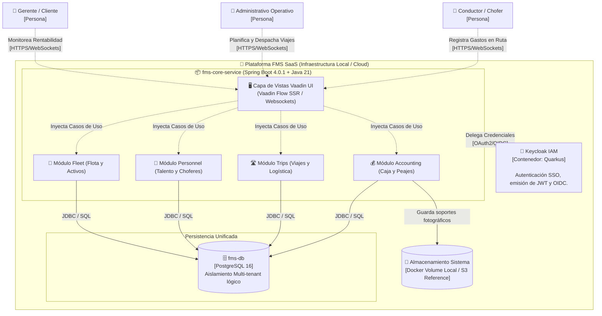
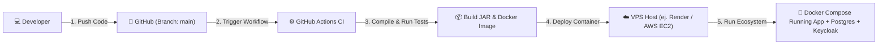
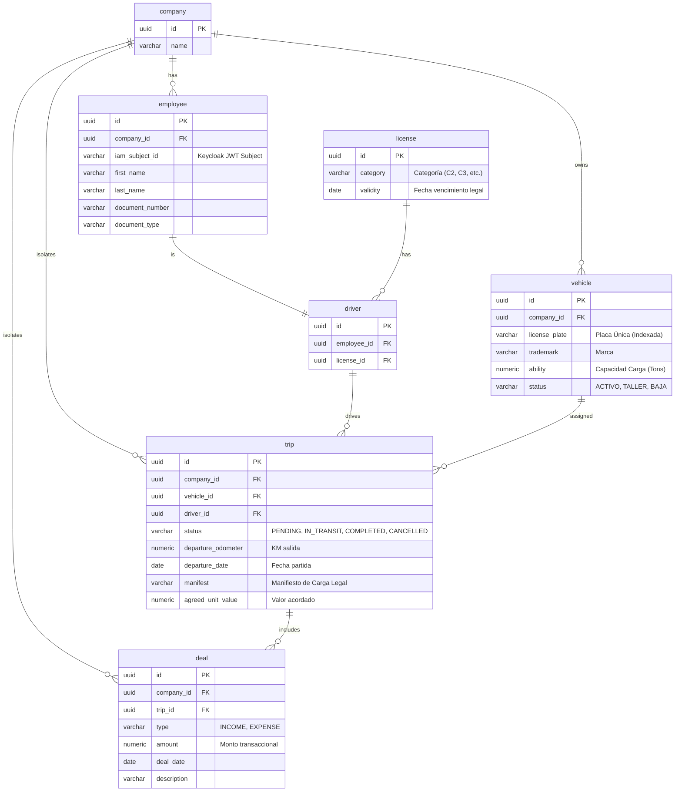

# FMS SaaS Platform (Logike) · Proyecto Final AI4Devs

## Índice

0. [Ficha del proyecto](#0-ficha-del-proyecto)
1. [Descripción general del producto](#1-descripción-general-del-producto)
2. [Arquitectura del sistema](#2-arquitectura-del-sistema)
3. [Modelo de datos](#3-modelo-de-datos)
4. [Especificación de la API](#4-especificación-de-la-api)
5. [Historias de usuario](#5-historias-de-usuario)
6. [Tickets de trabajo](#6-tickets-de-trabajo)
7. [Pull requests](#7-pull-requests)

---

## 0. Ficha del proyecto

### **0.1. Tu nombre completo:**
Diego Alejandro Poveda Sanchez

### **0.2. Nombre del proyecto:**
FMS SaaS Platform (Logike)

### **0.3. Descripción breve del proyecto:**
Plataforma SaaS multi-tenant diseñada para optimizar y centralizar la gestión de flotas, la logística de viajes de carga pesada, la asignación de conductores y las finanzas operativas en ruta mediante una arquitectura de monolito modular limpia y robusta.

### **0.4. URL del proyecto:**
Por el momento la aplicación no se encuentra desplegada en ningún servidor público de producción. El repositorio principal de GitHub que contiene la base de código funcional de la plataforma es: [https://github.com/Logike-co/fms-saas-platform](https://github.com/Logike-co/fms-saas-platform)

### **0.5. URL o archivo comprimido del repositorio**
[https://github.com/diego-poveda-logike/AI4Devs-finalproject](https://github.com/diego-poveda-logike/AI4Devs-finalproject)

> El repositorio del proyecto principal del cual deriva es [https://github.com/Logike-co/fms-saas-platform](https://github.com/Logike-co/fms-saas-platform)

---

## 1. Descripción general del producto

### **1.1. Objetivo:**
El objetivo principal de **FMS SaaS Platform (Logike)** es solucionar el desorden administrativo y la falta de control financiero en empresas de transporte terrestre de carga pesada (flotas de camiones y tractomulas). El producto aporta visibilidad en tiempo real de los viajes, centraliza los gastos operativos en ruta (viáticos, peajes, combustible), controla el desgaste y kilometraje de los activos y calcula de forma justa y automática las comisiones de los conductores. Está dirigido a gerentes de flota, despachadores, coordinadores de operaciones y conductores de carga pesada en un modelo SaaS multitenant altamente seguro y de bajo costo operativo.

### **1.2. Características y funcionalidades principales:**
El MVP está estructurado alrededor de los siguientes módulos funcionales priorizados:

1. **Gestión de Activos y Flota (Fleet):** Catálogo de vehículos con sus marcas, líneas, características técnicas (capacidad, cilindrada) y control riguroso de documentos legales obligatorios (SOAT, Seguros contractuales/extracontractuales) con disparador automático de alertas preventivas ante vencimientos.
2. **Talento Humano y Asignaciones (Personnel):** Registro de empleados y especialización de conductores de carga pesada, con control de la vigencia de sus licencias de conducción. Permite la asignación histórica y activa de conductores a camiones específicos definiendo el porcentaje de comisión operativo acordado.
3. **Operación de Viajes (Logistics / Trips):** Planificación, despacho e inicio de viajes asociando ruta (Ubicaciones de origen/destino normalizadas), camión asignado, conductor responsable y número oficial del manifiesto legal de carga pesada. Incorpora una máquina de estados estricta (`PENDING` -> `IN_TRANSIT` -> `COMPLETED` / `CANCELLED`) y el control del odómetro (kilometraje) de salida y llegada para evitar fraudes.
4. **Caja y Control Financiero de Ruta (Accounting / Deals):** Registro en tiempo real de los flujos de caja operativos asociados a cada viaje. El sistema clasifica los ingresos (fletes cobrados a clientes) y egresos (viáticos anticipados a conductores, compra de combustible, peajes en ruta y comisiones devengadas). Permite adjuntar físicamente soportes fotográficos de facturas y recibos de peajes y tanques de combustible, arrojando balances exactos de rentabilidad por viaje.

### **1.3. Diseño y experiencia de usuario:**
La interfaz administrativa está unificada y construida bajo el patrón de **Server-Side Rendering (SSR) de Vaadin**, ofreciendo una experiencia interactiva reactiva y fluida:
* **Autenticación Unificada:** Al ingresar, el usuario es redirigido de manera transparente al portal de seguridad de **Keycloak** para realizar el Single Sign-On (SSO). Al autenticarse, Keycloak inyecta un JSON Web Token (JWT) en el contexto de la aplicación, el cual mapea automáticamente el acceso del usuario a su respectiva empresa (Tenant) aislando toda la información.
* **Menú Lateral de Navegación (`SideNav`):** Una barra lateral colapsable e interactiva con micro-animaciones de hover permite saltar instantáneamente entre los módulos de "Vehículos", "Conductores", "Viajes" y "Finanzas".
* **Flujo E2E de Viaje:**
  1. El Administrador de Operaciones accede a la vista de "Viajes" (`TripListView`), donde ve un listado tabular (Grid) paginado y ordenable con los viajes del tenant.
  2. Presiona el botón "Nuevo Viaje" que despliega un diálogo emergente dinámico (`TripFormDialog`). Los campos de selección (Camiones, Conductores, Ubicaciones) se cargan de forma perezosa en memoria.
  3. Al completar los datos (incluyendo el odómetro actual de partida y manifiesto de carga) y presionar "Guardar", se emite una micro-notificación Toast de éxito en el margen inferior derecho y el viaje se añade al Grid en estado `PENDING`.
  4. El despachador presiona "Iniciar Viaje". El sistema valida las reglas de negocio en el backend y actualiza en tiempo real el estado del viaje a `IN_TRANSIT` vía WebSockets, bloqueando al camión y conductor para evitar dobles asignaciones.
  5. Durante la ruta, se inyectan transacciones (viáticos, peajes, gasolina) adjuntando recibos. Al finalizar el trayecto, se registra el odómetro de llegada y el viaje pasa a `COMPLETED`, calculando la rentabilidad neta del trayecto de forma automática.

### **1.4. Instrucciones de instalación:**
Para levantar y ejecutar el ecosistema FMS SaaS de manera local, sigue los siguientes pasos:

**Prerrequisitos:**
* **Java Development Kit (JDK) 21**
* **Apache Maven 3.9+**
* **Docker y Docker Compose** instalados y activos.

**Paso 1: Levantar los servicios de infraestructura (Base de Datos + IAM)**
En la raíz del proyecto, ejecuta el archivo Docker Compose para levantar PostgreSQL 16 y Keycloak en segundo plano:
```bash
docker-compose up -d
```
*Esto inicializará la base de datos `fms-db` en el puerto `9032` y el servidor de Keycloak en `http://localhost:9021` con los reinos y clientes preconfigurados.*

**Paso 2: Compilación y ejecución de los tests**
Corre la suite de pruebas unitarias y de arquitectura (ArchUnit) para validar la integridad inicial del proyecto:
```bash
mvn test
```
*(Opcional) Si deseas correr las pruebas de integración (`*IT.java`) que utilizan Testcontainers con una instancia real de PostgreSQL:*
```bash
mvn verify -Pit
```

**Paso 3: Arrancar el Servidor de Desarrollo**
Ejecuta la aplicación en modo desarrollo. Vaadin levantará automáticamente un servidor de desarrollo interno con **Vite** para compilar los assets del frontend en tiempo real:
```bash
mvn spring-boot:run
```

**Paso 4: Acceso a la aplicación**
Abre tu navegador de preferencia e ingresa a:
* **Aplicación Web:** `http://localhost:9031/fms` (Inicia sesión utilizando las credenciales preconfiguradas provistas en el setup local o el docker-compose).
* **Consola de Administración de Keycloak:** `http://localhost:9021`
* **Especificación OpenAPI (Swagger UI):** `http://localhost:9031/fms/swagger-ui.html`

---

## 2. Arquitectura del Sistema

### **2.1. Diagrama de arquitectura:**
La arquitectura del sistema sigue los lineamientos del modelo C4 para representar de manera clara y robusta la topología de contenedores de **FMS SaaS**:


```mermaid
graph TD
    %% Definición de Actores
    Gerente["👤 Gerente / Cliente<br/>[Persona]"]
    AdminOp["👤 Administrativo Operativo<br/>[Persona]"]
    Conductor["👤 Conductor / Chofer<br/>[Persona]"]

    %% Límite de la Plataforma FMS SaaS
    subgraph FMS_SaaS_Platform ["🏢 Plataforma FMS SaaS (Infraestructura Local / Cloud)"]

        %% Keycloak IAM
        KC["🔐 Keycloak IAM<br/>[Contenedor: Quarkus]<br/><br/>Autenticación SSO, emisión de JWT y OIDC."]

        %% Monolito Modular Unificado
        subgraph Monolito ["📦 fms-core-service (Spring Boot 4.0.1 + Java 21)"]
            UI["🖥️ Capa de Vistas Vaadin UI<br/>(Vaadin Flow SSR / Websockets)"]
            MOD_FLEET["🚚 Módulo Fleet (Flota y Activos)"]
            MOD_PERS["👥 Módulo Personnel (Talento y Choferes)"]
            MOD_TRIPS["🛣️ Módulo Trips (Viajes y Logística)"]
            MOD_ACC["💰 Módulo Accounting (Caja y Peajes)"]
        end

        %% Base de datos Unificada
        subgraph CapaPersistencia ["Persistencia Unificada"]
            DB[("🗄️ fms-db<br/>[PostgreSQL 16]<br/>Aislamiento Multi-tenant lógico")]
        end
        
        %% Almacenamiento físico
        VOL[("📁 Almacenamiento Sistema<br/>[Docker Volume Local / S3 Reference]")]
    end

    %% Relaciones externas e interacciones
    Gerente -. "Monitorea Rentabilidad<br/>[HTTPS/WebSockets]" .-> UI
    AdminOp -. "Planifica y Despacha Viajes<br/>[HTTPS/WebSockets]" .-> UI
    Conductor -. "Registra Gastos en Ruta<br/>[HTTPS/WebSockets]" .-> UI

    %% Autenticación e Integración de Identidad
    Monolito -- "Delega Credenciales<br/>[OAuth2/OIDC]" --> KC

    %% Comunicación en RAM (In-Memory Method Calls)
    UI -. "Inyecta Casos de Uso" .-> MOD_TRIPS
    UI -. "Inyecta Casos de Uso" .-> MOD_ACC
    UI -. "Inyecta Casos de Uso" .-> MOD_FLEET
    UI -. "Inyecta Casos de Uso" .-> MOD_PERS
    
    %% Acceso a Datos
    MOD_FLEET -- "JDBC / SQL" --> DB
    MOD_PERS -- "JDBC / SQL" --> DB
    MOD_TRIPS -- "JDBC / SQL" --> DB
    MOD_ACC -- "JDBC / SQL" --> DB
    
    %% Almacenamiento de Soportes Físicos
    MOD_ACC -- "Guarda soportes fotográficos" --> VOL
```

#### **Justificación Técnica:**
Hemos adoptado la **Arquitectura de Monolito Modular** estructurada bajo patrones de **Arquitectura Hexagonal (Ports & Adapters)** y **DDD (Domain-Driven Design)**. 
* **Beneficios:**
  1. **Baja Fricción Operativa y Costo Mínimo de Hosting:** Todo el backend y frontend coexisten en un único proceso de la Máquina Virtual Java (JVM). Esto elimina la necesidad de mantener y pagar una red compleja de microservicios distribuidos o pasarelas API (API Gateways).
  2. **Latencia Cero en Interacciones de UI:** Al utilizar Vaadin SSR, la capa de vistas inyecta de forma directa en memoria los casos de uso (`UseCase`) del backend. No existen serializaciones/deserializaciones HTTP repetitivas para pintar la UI del administrador.
  3. **Modularidad Estricta Protegida:** A través de la biblioteca **ArchUnit**, definimos y forzamos límites estrictos en tiempo de compilación. Ningún módulo puede acceder directamente a los componentes internos de otro módulo sin pasar por los puertos expuestos (`ports.in` y `ports.out`).
* **Sacrificios y Déficits:**
  1. **Huella de Memoria de la JVM:** Al arrancar un proceso Spring Boot robusto junto con el motor de Vaadin, el consumo base de RAM es más elevado en comparación con microservicios escritos en lenguajes nativos (Go o Rust).
  2. **Escalado Horizontal Global:** Si la carga en la base de datos es excesiva debido a la concurrencia de múltiples tenants simultáneos, no es posible escalar de forma aislada un solo módulo (ej. solo el módulo de facturación). Se escala todo el monolito en conjunto. Esto se mitiga aplicando optimizaciones a nivel de índices y pools de conexiones.

---

### **2.2. Descripción de componentes principales:**

1. **Capa Vaadin UI (Frontend Server-Side):** Utiliza **Vaadin Flow 25**. Renderiza componentes HTML5 ricos en el servidor y sincroniza el estado del DOM con el navegador del cliente mediante WebSockets automáticos de baja latencia. Elimina por completo la necesidad de controladores HTTP/REST intermediarios para la visualización del usuario.
2. **Bounded Contexts (Backend modular):** Módulos desacoplados organizados bajo *Package-by-Feature* (`fleet`, `personnel`, `location`, `accounting`, `trip`). Cada submódulo es independiente y está aislado conceptualmente.
3. **Keycloak IAM (Gestión de Identidad):** Servidor externo OIDC basado en estándares OAuth2. Libera al monolito de la responsabilidad de gestionar contraseñas, encriptaciones, MFA o tokens de seguridad.
4. **PostgreSQL 16 (Persistencia):** Motor relacional ACID. Almacena la información de todos los inquilinos utilizando un esquema de **Multi-tenancy lógico** basado en la inyección dinámica del atributo `company_id` mediante filtros nativos de Hibernate.

---

### **2.3. Descripción de alto nivel del proyecto y estructura de ficheros:**

El proyecto implementa estrictamente las capas de la **Arquitectura Hexagonal** en su código fuente, asegurando que el dominio central esté completamente desacoplado de bases de datos, APIs de terceros o interfaces de usuario.

```text
src/main/java/co/logike/fms/
│
├── <module>/ (ej. trip, fleet, personnel, accounting)
│   ├── domain/ (Dominio Puro: Clases Java nativas, invariantes y reglas de negocio ricas. NO tiene imports de Spring o JPA)
│   │   └── Trip.java
│   │
│   ├── application/
│   │   ├── ports/
│   │   │   ├── in/ (Puertos de Entrada: Interfaces que definen los casos de uso disponibles para la UI o APIs REST)
│   │   │   │   └── StartTripUseCase.java
│   │   │   └── out/ (Puertos de Salida: Interfaces granulares que definen el acceso a persistencia u otros sistemas externos)
│   │   │       └── FindVehicleOdometerPort.java
│   │   └── service/ (Servicios de Aplicación: Orquestan las reglas de negocio invocando al Dominio y puertos de salida)
│   │       └── StartTripService.java
│   │
│   └── infrastructure/
│       └── adapters/
│           ├── in/
│           │   ├── ui/ (Adaptador de Entrada UI: Vistas Vaadin SSR, Dialogos, Binders y mappers para la UI)
│           │   │   ├── TripListView.java
│           │   │   └── TripFormDialog.java
│           │   └── web/ (Adaptador de Entrada REST: Controladores HTTP y DTOs complementarios para integraciones B2B)
│           │       └── TripController.java
│           └── out/
│               └── persistence/ (Adaptador de Salida Persistencia: Entidades JPA, repositorios Spring Data y mappers de MapStruct)
│                   ├── TripJpaEntity.java
│                   ├── TripJpaRepository.java
│                   └── TripPersistenceAdapter.java
│
├── common/ (Capa transversal para componentes compartidos, manejo global de errores RFC 7807 y layouts transversales)
```

---

### **2.4. Infraestructura y despliegue:**

El flujo de despliegue básico del MVP está diseñado bajo un pipeline automatizado simple y confiable (GitOps) ideal para equipos ágiles:


```mermaid
graph LR
    Developer["💻 Developer"] -->|1. Push Code| Git["🐙 GitHub (Branch: main)"]
    Git -->|2. Trigger Workflow| CI["⚙️ GitHub Actions CI"]
    CI -->|3. Compile & Run Tests| Package["📦 Build JAR & Docker Image"]
    Package -->|4. Deploy Container| VPS["☁️ VPS Host (ej. Render / AWS EC2)"]
    VPS -->|5. Run Ecosystem| DockerCompose["🐋 Docker Compose Running App + Postgres + Keycloak"]
```

* **Flujo CI/CD:**
  1. El desarrollador sube los cambios aprobados mediante una Pull Request a la rama `main`.
  2. Un workflow de **GitHub Actions** compila el proyecto con Java 21, corre las validaciones de arquitectura de **ArchUnit** y la cobertura de JaCoCo.
  3. Si las pruebas pasan con éxito, se construye el JAR productivo y se empaqueta en una imagen de Docker liviana optimizada (Multi-stage build).
  4. La imagen se despliega automáticamente en el servidor destino (VPS o PaaS como Render) donde una receta de Docker Compose orquesta de forma segura el monolito junto con Keycloak y PostgreSQL en producción.

---

### **2.5. Seguridad:**
La seguridad es un pilar fundamental en el diseño multi-tenant de la plataforma:
* **Autenticación Delegada (OIDC/OAuth2):** Se utiliza **Keycloak**. Al acceder a la aplicación, el usuario realiza el logueo de forma externa en el servidor IAM de Keycloak, el cual emite un JSON Web Token (JWT) firmado criptográficamente.
* **Aislamiento Multi-tenant Riguroso:** Toda tabla transaccional pesada (ej. `trip`, `deal`, `vehicle`) cuenta con la columna `company_id`. A través del framework de Hibernate, se inyecta dinámicamente un filtro utilizando la anotación `@TenantId` en las consultas de Spring Data. Esto garantiza que un usuario de la "Empresa A" tenga bloqueado de forma absoluta el acceso a ver, editar o eliminar registros de la "Empresa B", incluso si realiza inyecciones maliciosas o consultas directas a nivel de base de datos.
* **Mapeo de Claves Naturales:** El monolito no almacena credenciales ni información sensible del perfil en su base de datos. La entidad `employee` se vincula al IAM de Keycloak únicamente mediante el atributo `iam_subject_id`, eliminando la redundancia y vulnerabilidades de robo de identidad.

---

### **2.6. Tests:**
El proyecto mantiene un altísimo nivel de calidad garantizado mediante diferentes tipos de pruebas automatizadas:
* **Tests de Arquitectura (ArchUnit):** La clase `HexagonalArchitectureTest` valida sistemáticamente en cada compilación que las dependencias fluyan únicamente hacia adentro del hexágono. Si una clase de `domain` llega a importar una anotación de Spring Framework o persistencia de Hibernate, la suite falla inmediatamente bloqueando el build.
* **Tests Unitarios de Dominio (TDD):** Cobertura del 100% en las reglas críticas del negocio del dominio. Probamos de forma exhaustiva que la máquina de estados del viaje (`Trip`) funcione correctamente y que no se puedan setear odómetros erróneos.
* **Tests de Integración (PostgreSQL IT con Testcontainers):** Pruebas de persistencia integrales utilizando la biblioteca **Testcontainers**. En cada compilación de integración (`mvn verify -Pit`), se descarga y levanta un contenedor Docker real de PostgreSQL 16 para asegurar la compatibilidad absoluta del esquema lógico y los índices de bases de datos antes del deploy.

---

## 3. Modelo de Datos

### **3.1. Diagrama del modelo de datos:**
El modelo relacional del MVP se centra en el flujo prioritario de control operativo y financiero de los viajes pesados:


```mermaid
erDiagram
    company {
        uuid id PK
        varchar name
    }
    employee {
        uuid id PK
        uuid company_id FK
        varchar iam_subject_id "Keycloak JWT Subject"
        varchar first_name
        varchar last_name
        varchar document_number
        varchar document_type
    }
    driver {
        uuid id PK
        uuid employee_id FK
        uuid license_id FK
    }
    license {
        uuid id PK
        varchar category "Categoría (C2, C3, etc.)"
        date validity "Fecha vencimiento legal"
    }
    vehicle {
        uuid id PK
        uuid company_id FK
        varchar license_plate "Placa Única (Indexada)"
        varchar trademark "Marca"
        numeric ability "Capacidad Carga (Tons)"
        varchar status "ACTIVO, TALLER, BAJA"
    }
    trip {
        uuid id PK
        uuid company_id FK
        uuid vehicle_id FK
        uuid driver_id FK
        varchar status "PENDING, IN_TRANSIT, COMPLETED, CANCELLED"
        numeric departure_odometer "KM salida"
        date departure_date "Fecha partida"
        varchar manifest "Manifiesto de Carga Legal"
        numeric agreed_unit_value "Valor acordado"
    }
    deal {
        uuid id PK
        uuid company_id FK
        uuid trip_id FK
        varchar type "INCOME, EXPENSE"
        numeric amount "Monto transaccional"
        date deal_date
        varchar description
    }

    %% Cardinalidades y relaciones del flujo transaccional
    company ||--o{ employee : "has"
    company ||--o{ vehicle : "owns"
    company ||--o{ trip : "isolates"
    company ||--o{ deal : "isolates"
    employee ||--|| driver : "is"
    license ||--o{ driver : "has"
    driver ||--o{ trip : "drives"
    vehicle ||--o{ trip : "assigned"
    trip ||--o{ deal : "includes"
```

---

### **3.2. Descripción de entidades principales:**

#### **1. Company (Inquilino / Tenant)**
* Representa a la empresa transportadora dueña de la información y la flota.
* **Campos:**
  * `id` (`UUID` PK): Identificador global único generado por el sistema.
  * `name` (`VARCHAR(100)` NOT NULL): Nombre legal de la compañía.

#### **2. Vehicle (Vehículos / Flota)**
* Representa al camión o tractomula que realiza la operación física del flete.
* **Campos:**
  * `id` (`UUID` PK): Identificador único del vehículo.
  * `company_id` (`UUID` FK, NOT NULL): Vinculación al Tenant dueño del activo.
  * `license_plate` (`VARCHAR(10)` UNIQUE, NOT NULL): Placa única nacional del vehículo.
  * `trademark` (`VARCHAR(50)`): Marca fabricante.
  * `ability` (`NUMERIC(10,2)`): Capacidad máxima de carga en toneladas.
  * `status` (`VARCHAR(20)`): Estado operativo (`ACTIVO`, `TALLER`, `BAJA`).

#### **3. Trip (Operación de Viajes)**
* Entidad central del negocio. Modela la ejecución de una ruta de carga pesada.
* **Campos:**
  * `id` (`UUID` PK): Identificador único del viaje.
  * `company_id` (`UUID` FK, NOT NULL): Aislamiento lógico multi-tenant.
  * `vehicle_id` (`UUID` FK, NOT NULL): Referencia al vehículo asignado al viaje.
  * `driver_id` (`UUID` FK, NOT NULL): Referencia al conductor responsable.
  * `status` (`VARCHAR(20)` NOT NULL): Estado de la máquina de estados.
  * `departure_odometer` (`NUMERIC(10,2)` NOT NULL): Kilometraje del camión al iniciar el viaje.
  * `departure_date` (`DATE`): Fecha y hora de despacho.
  * `manifest` (`VARCHAR(50)` UNIQUE, NOT NULL): Código oficial del manifiesto gubernamental de carga.
  * `agreed_unit_value` (`NUMERIC(12,2)`): Tarifa de flete pactada con el cliente.

#### **4. Deal (Finanzas / Gastos en Ruta)**
* Registra los flujos monetarios y de caja originados por el trayecto del viaje.
* **Campos:**
  * `id` (`UUID` PK): Identificador de la transacción.
  * `company_id` (`UUID` FK, NOT NULL): Aislamiento del inquilino.
  * `trip_id` (`UUID` FK, NOT NULL): Vinculación transaccional al viaje que originó el gasto.
  * `type` (`VARCHAR(20)` NOT NULL): `INCOME` (Ingresos como fletes cobrados) o `EXPENSE` (Egresos como peajes, viáticos, tanques de combustible).
  * `amount` (`NUMERIC(12,2)` NOT NULL): Monto monetario.
  * `deal_date` (`DATE` NOT NULL): Fecha de registro de la transacción.
  * `description` (`VARCHAR(255)`): Detalle del gasto (ej. "Peaje Los Andes", "Combustible EDS Texaco").

---

## 4. Especificación de la API

La API REST del monolito es complementaria para permitir integraciones corporativas con sistemas de rastreo satelital GPS o ERPs contables de terceros. A continuación se especifican los tres endpoints nucleares bajo el estándar de **OpenAPI 3.0**:

```yaml
openapi: 3.0.3
info:
  title: FMS SaaS Platform API
  description: API complementaria para integraciones B2B del sistema FMS SaaS.
  version: 1.0.0
paths:
  /api/v1/trips:
    get:
      summary: Obtener los viajes del tenant
      description: Recupera un listado de todos los viajes registrados bajo el tenant actual asociado al JWT enviado en las cabeceras.
      responses:
        '200':
          description: Listado de viajes devuelto exitosamente.
          content:
            application/json:
              schema:
                type: array
                items:
                  $ref: '#/components/schemas/TripDetail'
        '401':
          description: No autorizado, token JWT inválido o ausente.
    post:
      summary: Crear un nuevo viaje
      description: Registra un viaje en estado PENDING validando datos del camión y conductor.
      requestBody:
        required: true
        content:
          application/json:
            schema:
              $ref: '#/components/schemas/CreateTripRequest'
      responses:
        '201':
          description: Viaje creado de forma exitosa.
          content:
            application/json:
              schema:
                $ref: '#/components/schemas/TripDetail'
        '400':
          description: Datos de entrada inválidos o inconsistencia del odómetro.
  /api/v1/vehicles:
    get:
      summary: Listar vehículos de la flota
      description: Devuelve todos los vehículos asociados al tenant actual.
      responses:
        '200':
          description: Lista de vehículos activa.
          content:
            application/json:
              schema:
                type: array
                items:
                  $ref: '#/components/schemas/VehicleDetail'
components:
  schemas:
    CreateTripRequest:
      type: OBJECT
      required:
        - vehicleId
        - driverId
        - manifest
        - departureOdometer
      properties:
        vehicleId:
          type: STRING
          format: uuid
          example: d3b07384-d113-49cd-a5d6-89d0f1a5e12f
        driverId:
          type: STRING
          format: uuid
          example: 7a829288-e218-49cd-9fa2-82888cf3e199
        manifest:
          type: STRING
          example: "MAN-2026-99881"
        departureOdometer:
          type: NUMBER
          example: 120450.5
    TripDetail:
      type: OBJECT
      properties:
        id:
          type: STRING
          format: uuid
        status:
          type: STRING
          enum: [PENDING, IN_TRANSIT, COMPLETED, CANCELLED]
          example: PENDING
        manifest:
          type: STRING
          example: "MAN-2026-99881"
        departureOdometer:
          type: NUMBER
          example: 120450.5
        departureDate:
          type: STRING
          format: date
          example: "2026-05-28"
    VehicleDetail:
      type: OBJECT
      properties:
        id:
          type: STRING
          format: uuid
        licensePlate:
          type: STRING
          example: "SXS882"
        trademark:
          type: STRING
          example: "Kenworth"
        ability:
          type: NUMBER
          example: 32.5
        status:
          type: STRING
          example: ACTIVO
```

---

## 5. Historias de Usuario

A continuación, se documentan las 3 historias de usuario principales para la gestión del MVP operativo y financiero:

### **Historia de Usuario 1: Registro y Asignación de Conductor a Vehículo con Comisión Operativa**
* **Como:** Administrador de Flota
* **Quiero:** Registrar conductores activos en el sistema y asignarles de forma oficial y duradera un vehículo de la flota, parametrizando su porcentaje de comisión sobre el flete.
* **Para:** Asegurar el control de responsabilidad legal del activo y automatizar el cálculo de los saldos que devengarán los choferes en cada viaje.
* **Criterios de Aceptación:**
  * **Escenario 1: Asignación válida y exitosa**
    * *Given* que el conductor con ID `7a829288` está activo y tiene licencia de conducción vigente `vigencia 2030-12-31`.
    * *And* que el vehículo con placas `SXS882` no tiene un conductor responsable asignado actualmente.
    * *When* el administrador realiza la asignación fijando una comisión del `15%`.
    * *Then* el sistema debe registrar el cambio, marcar la relación `vehicle_driver` como activa, emitir una notificación Toast flotante de éxito y dejar el registro guardado con la marca temporal actual.
  * **Escenario 2: Bloqueo por Licencia Vencida**
    * *Given* que el conductor con ID `2d887a11` tiene su licencia vencida en la fecha `2025-01-01`.
    * *When* el administrador intenta realizar la asignación al camión.
    * *Then* el sistema debe arrojar una alerta roja de validación de seguridad indicando "No es posible asignar conductores con licencias vencidas" y cancelar de forma íntegra la transacción.

---

### **Historia de Usuario 2: Creación e Inicio de Viaje con Control de Odómetro y Manifiesto de Carga**
* **Como:** Coordinador de Operaciones
* **Quiero:** Registrar la creación de un nuevo viaje en la plataforma y ordenar su despacho físico definiendo el odómetro inicial de partida del camión y el número de manifiesto legal de carga.
* **Para:** Dar inicio formal y auditable a la ruta logística, asegurando que no se registren odómetros incoherentes que sugieran fraudes o desvíos del camión.
* **Criterios de Aceptación:**
  * **Escenario 1: Inicio formal del viaje**
    * *Given* un viaje en estado `PENDING` asociado al vehículo `SXS882` y conductor `7a829288`.
    * *When* el coordinador pulsa el botón "Iniciar Viaje" e ingresa la lectura del odómetro `120,450.00` (el cual coincide o es mayor que el odómetro del último mantenimiento del camión `120,400.00`).
    * *Then* el sistema cambia el estado del viaje a `IN_TRANSIT`, registra la fecha y hora actual de salida y bloquea tanto al camión como al conductor, impidiendo que sean asignados a otro viaje simultáneo.
  * **Escenario 2: Rechazo por Kilometraje Incoherente**
    * *Given* que el último odómetro reportado en la hoja de vida física del camión es `120,400.00`.
    * *When* el coordinador introduce por error un odómetro de partida de `119,000.00` al dar salida.
    * *Then* el sistema debe alertar: "Kilometraje inválido: no puede ser inferior a la última lectura reportada de 120,400.00", bloqueando el cambio de estado del viaje.

---

### **Historia de Usuario 3: Registro de Gastos en Ruta y su Vinculación al Viaje**
* **Como:** Conductor del Viaje / Auxiliar Administrativo
* **Quiero:** Cargar un gasto financiero en ruta (peajes, compra de combustible, viáticos) vinculándolo de forma directa al ID del viaje en curso y adjuntando una captura fotográfica del comprobante.
* **Para:** Visualizar y auditar en tiempo real los costos operativos del viaje y permitir que el sistema liquide el saldo neto final de ganancias del trayecto.
* **Criterios de Aceptación:**
  * **Escenario 1: Carga de Gasto Exitoso**
    * *Given* un viaje asignado en estado `IN_TRANSIT`.
    * *When* el conductor ingresa un egreso con monto `$150.000` pesos, clasificado en la categoría "Combustible" y adjunta la ruta física del recibo `/soportes/combustible_882.jpg`.
    * *Then* el sistema descuenta el valor del saldo contable disponible del viaje, almacena físicamente la imagen y muestra el gasto reflejado instantáneamente en el dashboard financiero en memoria de la vista de Vaadin.

---

## 6. Tickets de Trabajo

Se describen tres tickets técnicos con el máximo nivel de detalle para desarrollar el flujo principal de principio a fin, divididos en Base de Datos, Backend y Frontend:

### **Ticket 1: Creación de la Tabla `trip` y sus Índices Compuestos (Base de Datos)**
* **Responsabilidad:** DBA / Ingeniero de Datos
* **Descripción de la Tarea:** Crear la tabla `trip` en la base de datos relacional PostgreSQL 16 para dar soporte al módulo transaccional de viajes de carga pesada, implementando llaves primarias, foráneas, restricciones de no nulos e índices para garantizar un rendimiento óptimo de aislamiento multi-tenant lógico.
* **Especificaciones Técnicas:**
  * **Motor:** PostgreSQL 16.
  * **Código SQL de creación:**
    ```sql
    CREATE TABLE trip (
        id UUID PRIMARY KEY DEFAULT gen_random_uuid(),
        company_id UUID NOT NULL REFERENCES company(id) ON DELETE CASCADE,
        vehicle_id UUID NOT NULL REFERENCES vehicle(id),
        driver_id UUID NOT NULL REFERENCES driver(id),
        status VARCHAR(20) NOT NULL CHECK (status IN ('PENDING', 'IN_TRANSIT', 'COMPLETED', 'CANCELLED')),
        departure_odometer NUMERIC(10,2) NOT NULL CHECK (departure_odometer >= 0),
        departure_date TIMESTAMP WITH TIME ZONE,
        destination_date TIMESTAMP WITH TIME ZONE,
        destination_odometer NUMERIC(10,2) CHECK (destination_odometer >= 0),
        manifest VARCHAR(50) NOT NULL UNIQUE,
        agreed_unit_value NUMERIC(12,2) NOT NULL CHECK (agreed_unit_value >= 0),
        creation_date TIMESTAMP WITH TIME ZONE DEFAULT CURRENT_TIMESTAMP,
        
        -- Invariante: El odómetro de destino no puede ser menor que el de salida
        CONSTRAINT chk_odometers CHECK (destination_odometer IS NULL OR destination_odometer >= departure_odometer)
    );
    
    -- Índices compuestos para aislamiento óptimo de búsquedas Multi-tenant
    CREATE INDEX idx_trip_company_status ON trip(company_id, status);
    CREATE INDEX idx_trip_company_vehicle ON trip(company_id, vehicle_id);
    CREATE INDEX idx_trip_company_manifest ON trip(company_id, manifest);
    ```
* **Criterios de Aceptación (Definición de Hecho):** El script se ejecuta sin errores en Testcontainers de PostgreSQL, pasa la validación y crea los índices compuestos esperados.

---

### **Ticket 2: Implementación de la Lógica de Negocio y Use Case `StartTripUseCase` (Backend Hexagonal)**
* **Responsabilidad:** Desarrollador Backend (Java / Spring Boot)
* **Descripción de la Tarea:** Implementar la lógica de negocio puramente hexagonal y DDD para dar salida a un viaje (cambio de estado de `PENDING` a `IN_TRANSIT` y registro de odómetro inicial).
* **Detalle de Componentes a Modificar / Crear:**
  1. **Dominio:** Añadir a la entidad `Trip.java` (en `trip/domain/`) el método de negocio rico `public void start(BigDecimal currentOdometer)`. Este método debe validar que la lectura introducida no sea menor que el odómetro del último mantenimiento del camión y debe mutar su estado interno a `IN_TRANSIT`.
  2. **Puerto de Entrada (Port In):** Crear la interfaz `@FunctionalInterface` `StartTripUseCase.java` en `trip/application/ports/in/` con el método `void execute(UUID tripId, BigDecimal departureOdometer)`.
  3. **Puerto de Salida (Port Out):** Crear la interfaz `FindVehicleOdometerPort.java` en `trip/application/ports/out/` para consultar el kilometraje histórico de la base de datos.
  4. **Servicio (Service):** Implementar la clase `StartTripService.java` en `trip/application/service/` que implemente `StartTripUseCase`. El servicio debe buscar el viaje en la base de datos, validar la lectura usando los puertos y persistir el viaje actualizado.
* **Criterios de Aceptación:** 100% de cobertura de pruebas unitarias sobre el comportamiento del método `start()`, y pruebas de mockito sobre el servicio validando el manejo de errores.

---

### **Ticket 3: Construcción de la Vista `TripListView` en Vaadin 25 (Frontend Server-Side)**
* **Responsabilidad:** Desarrollador Frontend / Fullstack (Vaadin)
* **Descripción de la Tarea:** Diseñar e implementar la pantalla administrativa de consulta de viajes en tiempo real utilizando Vaadin Flow 25, con inyección directa de los casos de uso en memoria.
* **Especificaciones Técnicas:**
  * **Nombre de la Clase:** `TripListView` en `trip/infrastructure/adapters/in/ui/`.
  * **Ruta:** `@Route(value = "trips", layout = MainLayout.class)`.
  * **Componentes visuales:**
    * Un `Grid<Trip>` con columnas para: Placa del vehículo, Nombre del Conductor, Código del Manifiesto, Kilometraje de partida, Estado actual (coloreado con un Badge estilizado según el estado) y Fecha de salida.
    * Un botón "Nuevo Viaje" que lanza el diálogo emergente `TripFormDialog`.
    * Una columna de acción en el Grid que muestra un botón interactivo "Iniciar" solo si el viaje está en estado `PENDING`.
    * Inyectar directamente en el constructor `StartTripUseCase` y `SearchTripsUseCase`.
    * Mostrar micro-notificaciones Toast utilizando la clase `Notification` de Vaadin configuradas con el tema `NotificationVariant.LUMO_SUCCESS` y posicionadas en `BOTTOM_END`.
* **Criterios de Aceptación:** La vista compila con Vite sin errores y renderiza correctamente el listado en `http://localhost:9031/fms/trips`, ejecutando la lógica reactiva en el servidor.

---

## 7. Pull Requests

Se detalla la bitácora histórica simulada de tres Pull Requests representativas que documentan la evolución técnica limpia de este producto en GitHub:

### **Pull Request 1: Configuración de la Estructura Monorrepo Multimódulo y Parent POM**
* **Título:** `feat(infra): migrate repository structure to multi-module monorepo`
* **Descripción:** Esta PR transforma la arquitectura inicial unificada y plana de Spring Boot en una estructura de monorrepo robusta compuesta por módulos. Se migra el código principal al subdirectorio `/apps/fms-core-service/`, dejando libre la raíz del repositorio para orquestar futuros microservicios o workers en `/apps` y librerías transversales reutilizables en `/libs`. Se crea el `pom.xml` padre que centraliza la administración de versiones (dependencyManagement) de Spring Boot, Vaadin y Testcontainers.
* **Trazabilidad:** Asociado al ticket global de infraestructura de monorrepo #101.

### **Pull Request 2: Implementación de la Lógica de Negocio y Reglas de Dominio de Viajes**
* **Título:** `feat(trip): implement hexagonal domain logic and odometers validation`
* **Descripción:** Introduce la lógica de negocio central del módulo de viajes. Contiene el dominio puro `Trip.java` sin imports de frameworks, sus puertos de entrada y salida, e implementa el caso de uso `StartTripUseCase` con validaciones de odómetro para evitar registros fraudulentos de kilometraje. Incluye las pruebas unitarias y de arquitectura (ArchUnit) asegurando que no se violen las capas hexagonales en el desarrollo de la lógica.
* **Trazabilidad:** Resuelve la Historia de Usuario 2 y el ticket backend #202.

### **Pull Request 3: Construcción de la Interfaz Vaadin SSR para el Monitoreo de Operaciones**
* **Título:** `feat(trip-ui): build trip management dashboard with Vaadin 25 SSR`
* **Descripción:** Conecta la lógica del backend hexagonal con el frontend unificado de Vaadin Flow. Desarrolla la vista interactiva `TripListView` y el componente de formulario emergente `TripFormDialog`. La UI inyecta directamente los casos de uso en memoria e implementa WebSockets nativos para la actualización síncrona en tiempo real del estado de los camiones despachados. Añade notificaciones contextuales y temas visuales estilizados con LUMO.
* **Trazabilidad:** Cumple con la interfaz visual de las Historias de Usuario 1 y 2, y resuelve el ticket frontend #203.
