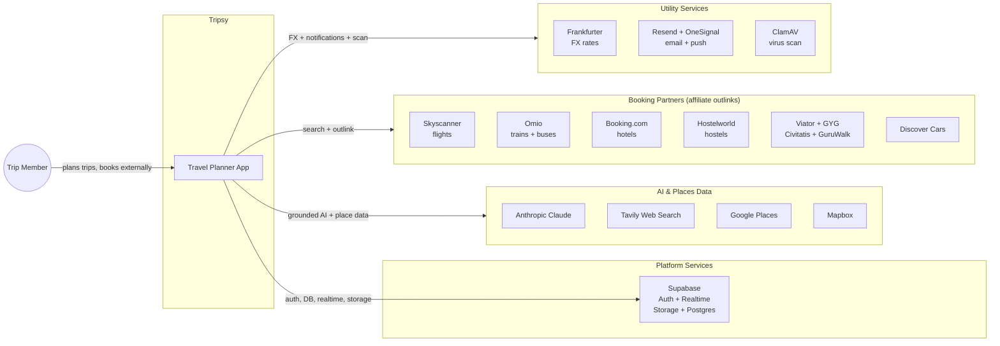
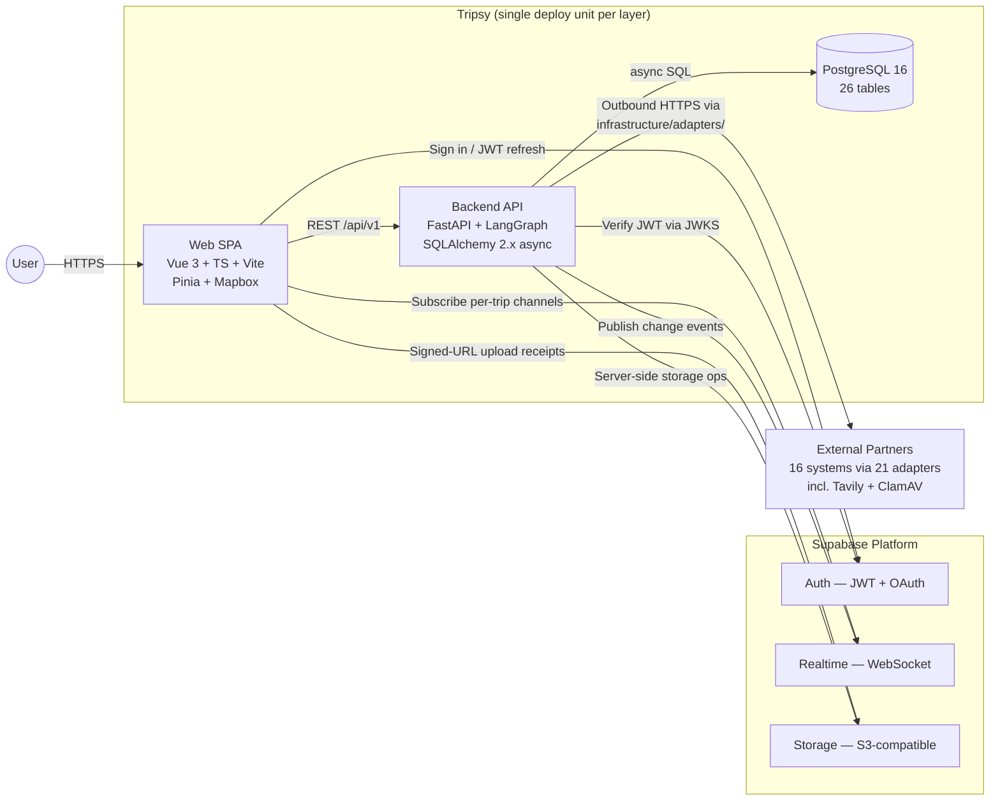
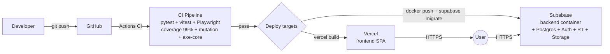
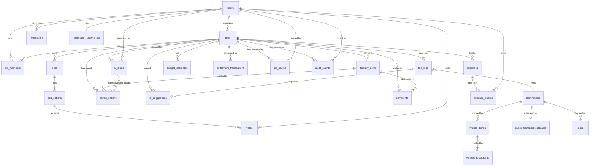

## Índice

0. [Ficha del proyecto](#0-ficha-del-proyecto)
1. [Descripción general del producto](#1-descripción-general-del-producto)
2. [Arquitectura del sistema](#2-arquitectura-del-sistema)
3. [Modelo de datos](#3-modelo-de-datos)
4. [Especificación de la API](#4-especificación-de-la-api)
5. [Historias de usuario](#5-historias-de-usuario)
6. [Tickets de trabajo](#6-tickets-de-trabajo)
7. [Pull requests](#7-pull-requests)

---

## 0. Ficha del proyecto

### **0.1. Tu nombre completo:**

Laura Borgato

### **0.2. Nombre del proyecto:**

**Tripsy** — *An all-in-one collaborative travel planner.*

### **0.3. Descripción breve del proyecto:**

Tripsy es una aplicación web colaborativa de planificación de viajes en grupo. Reemplaza el típico *stack* "Wanderlog + Splitwise + WhatsApp + Skyscanner + Omio + Google Maps" por un único producto donde los miembros de un grupo planifican el itinerario, votan opciones, buscan y guardan vuelos / trenes / buses / hoteles / hostales / actividades / coches de alquiler, descubren la comida típica verificada del destino, y dividen los gastos — todo en la misma aplicación.

Diferenciadores clave:
- **IA realmente útil**: AI Trip Planner (ADR-0007) que devuelve 3 alternativas de plan (Budget / Balanced / Splurge), cada una estrictamente dentro del presupuesto, con líneas de itinerario tomadas de APIs reales de partners (sin lugares alucinados).
- **Entrada estructurada estilo Skyscanner** (ADR-0001), no prompt libre → elimina por arquitectura la superficie de prompt injection.
- **Multi-modal**: vuelo / tren / bus por tramo (ADR-0002), origen por miembro, viajes multi-leg.
- **División de gastos calidad-Splitwise** sin caps diarios ni paywalls, multi-divisa, "mark-as-paid" (Tripsy nunca custodia dinero).
- **Guía de comida verificada**: top 3 restaurantes por plato típico, verificados por que sirven el plato y cumplen el *budget tier*.

### **0.4. URL del proyecto:**

Pre-implementación. No hay despliegue público activo todavía. La documentación viva (PRD, spec, plan, contracts, data-model, ADRs) está en el repositorio.

### 0.5. URL o archivo comprimido del repositorio

https://github.com/lauraborgato/Tripsy.git (repositorio **privado** — los accesos se compartirán de forma segura vía [onetimesecret](https://onetimesecret.com/) a [alvaro@lidr.co](mailto:alvaro@lidr.co)).

---

## 1. Descripción general del producto

### **1.1. Objetivo:**

Tripsy existe porque el caso más común de viaje — el viaje en grupo con amigos o familia — es el peor servido por las herramientas actuales. Cada app dominante hace una cosa bien y fuerza handoffs: Wanderlog tiene buenos itinerarios colaborativos pero pésima división de gastos; Splitwise es el incumbente en gastos pero no tiene planificación; los chats de grupo son donde realmente se toman decisiones, pero son invisibles para las herramientas de planificación; los planificadores con IA (Mindtrip, Layla, Wonderplan) generan itinerarios alucinados que hay que reconstruir desde cero.

**Propuesta de valor única**: *"Una app para planificar, votar, reservar y dividir — en lugar de cuatro."* Confianza por arquitectura, no por promesa: IA *grounded* (sin alucinaciones), sin custodia de pagos, sin superficie de prompt injection.

**Para quién**:
- **Primario** — grupos de amigos de 3 a 8 personas planificando juntos.
- **Secundario** — parejas y familias.
- **Terciario** — viajeros solos (caso "subset" del experiencia de grupo).

**Valor que aporta**:
- Reduce 4–5 apps a 1 sin sacrificar profundidad funcional en ninguna.
- Elimina los caps de Splitwise (3 gastos/día gratis) que rompen viajes activos en cuanto empiezan.
- Resuelve el caso "varios miembros volando desde ciudades distintas" que ningún planificador modela hoy.
- Convierte la decisión grupal en algo visible y trazable (polls + audit log) en lugar de WhatsApp + memoria.

### **1.2. Características y funcionalidades principales:**

El MVP entrega 5 historias de usuario end-to-end (US1–US5). US6 (offline) se difiere a Fase 2.

1. **Planificación colaborativa (US1)** — Itinerario día-a-día compartido, *real-time edit propagation* (≤ 5 s en el 95 % de los casos), comentarios anclados a items, polls Yes/No y *ranked-choice* con resolución de empates, invitaciones first-class (`trip_invites` con link / email + TTL + revocación), matriz de permisos (FR-009, 25 filas), *audit log* (`audit_events`) para toda acción que afecte a otro miembro o al dinero.
2. **Gastos y *settlement* (US2)** — 4 reglas de split (equal / percentage / custom / itemized), multi-divisa con rate-at-log-time (Frankfurter, *cache* en `currency_rates`), simplified settlement con número mínimo de transacciones, "mark-as-paid" UX (Tripsy nunca procesa pagos), receipts en Supabase Storage con escaneo ClamAV. Reglas de redondeo deterministas (banker's rounding + largest-remainder).
3. **Búsqueda estructurada + AI Trip Planner (US3, ADR-0001 + ADR-0007)** — Formulario tipo Skyscanner: orígenes por miembro, destinos en orden (multi-leg), modo de fecha (`specific` / `flexible` / `cheapest_month`), presupuesto por persona, *travel style*, *interest tags*, notas opcionales (≤ 500 chars, sanitizadas). El AI Trip Planner devuelve **3 alternativas** — Budget / Balanced / Splurge — cada una estrictamente dentro del presupuesto, con líneas tomadas de APIs reales (Skyscanner / Omio / Booking / Hostelworld / Viator+GYG+Civitatis+GuruWalk / Google Places). Es un orquestador **LangGraph** de 4 subsistemas: partner fan-out + budget allocator determinista (Python, no LLM) + Tavily research suplementario + síntesis Claude Sonnet en paralelo. Si no encuentra plan dentro de presupuesto → *honest failure* con palancas concretas (FR-049).
4. **Find & Save (US4, ADR-0002 + ADR-0008)** — Transporte multi-modal vuelo / tren / bus por tramo (Skyscanner + Omio), alojamiento (Booking.com + Hostelworld; Airbnb diferido), actividades (Viator + GetYourGuide + Civitatis + GuruWalk), coches de alquiler (Discover Cars). Búsqueda por origen-por-miembro, *cheapest-month finder* (solo vuelos en MVP), reserva externa por outlink afiliado, marca manual de "booked".
5. **Discovery + Food Guide (US5)** — POIs curados sobre mapa Mapbox, filtros por categoría / precio / horario / *interest tags*. *Food Guide* opinionado: top 3 restaurantes por plato típico, verificados por (a) sirven el plato (Claude Haiku sobre reviews + menú de Google Places) y (b) están en el *budget tier* del viaje. Rebuild nocturno por `food_guide_curator`.

Transversales:
- **Auth**: email/password + Google OAuth vía Supabase Auth; account-linking entre métodos (FR-001a).
- **Notificaciones**: in-app (Supabase Realtime), email (Resend), push (OneSignal Web SDK). Preferencias por canal y por *kind*.
- **GDPR erasure** (FR-080): procedimiento de 7 pasos, T+0 soft-delete + T+30 hard-delete + *tombstone-user* (`usr_TOMBSTONE`) para filas audit-requeridas.
- **i18n** desde día 1 (ADR-0006): claves extraídas aunque solo se publique en inglés en MVP.
- **Accesibilidad WCAG 2.1 AA** verificada con `axe-core` en CI (ADR-0005).
- **Click-tracking de afiliados first-party** (ADR-0004): contador en `saved_options.affiliate_click_count`; sin cookies de terceros → sin cookie banner para el flujo de clicks.

### **1.3. Diseño y experiencia de usuario:**

> ⚠ El proyecto está en estado **pre-implementación** (spec + plan + contratos completos; aún no hay UI montada). Los flujos canónicos se documentan en `docs/PRD.md` §8 (User Journeys) como diagramas de secuencia Mermaid. Los seis flujos son:
>
> 1. **Anna crea un viaje en grupo e invita al equipo** (US1) — formulario estructurado → POST `/trips` → invitaciones por link / email → join → `trip_member_joined` en Realtime.
> 2. **Búsqueda estructurada + AI Trip Planner** (US3) — POST `/trips/{id}/ai/plan` → 4 subsistemas LangGraph (partner fan-out + budget allocator + Tavily + Sonnet x3) → 3 planes lado-a-lado → aceptación → materialización en `saved_options` + `itinerary_items`.
> 3. **Cheapest-month finder** — POST `/trips/search/cheapest-month` (stateless) → calendario 12 meses → usuario elige mes → trip creado con fechas concretas.
> 4. **Log de gasto + settlement** (US2) — POST `/trips/{id}/expenses` (con receipt → ClamAV → Storage) → recompute balances → GET `/settlement` → POST `/settlement/{txn_id}/mark-paid`.
> 5. **Find & Save multi-modal multi-leg** (US4) — GET `/transport?from=…&to=…&modes=flight,train,bus` (umbrella) → 3 tabs → save → outlink → mark-booked.
> 6. **Food Guide discovery** (US5) — GET `/destinations/{id}/food-guide?budget_tier=…` → dishes × top-3 verified → save as `meal` en itinerario.

Capturas / videotutorial: pendientes hasta primera iteración de UI (Fase 1 — Months 0–7 del roadmap).

### **1.4. Instrucciones de instalación:**

**Prerrequisitos**: Docker, Git. Nada más en local (no se requiere Python ni Node en el host).

```bash
# 1. Clonar
git clone git@github.com:lauraborgato/Tripsy.git
cd Tripsy

# 2. Configurar entorno
cp .env.example .env
# Editar .env para rellenar las claves marcadas como obligatorias:
#   SUPABASE_URL, SUPABASE_ANON_KEY, SUPABASE_SERVICE_ROLE_KEY
#   ANTHROPIC_API_KEY
#   GOOGLE_PLACES_API_KEY, VITE_MAPBOX_PUBLIC_TOKEN
#   (Partners de booking son opcionales en local — la app degrada con
#    PARTNER_UNAVAILABLE 502 cuando no están configurados.)

# 3. Levantar la stack completa (Postgres 16 + backend FastAPI + frontend Vite + ClamAV sidecar)
docker compose up

# 4. Abrir el frontend
open http://localhost:5173
```

**Migraciones y semillas**: Alembic corre automáticamente en el arranque del servicio `backend`. La semilla de destinos top-30 + dataset de typical-dishes se carga vía el cron nocturno `food_guide_curator` (puede ejecutarse manualmente con `docker compose exec backend python -m discovery.seed_top_30`).

**Primer test verde**: el flujo completo de onboarding del desarrollador (clone → docker up → primer test fallando → primer test verde → primer commit) está en `specs/001-trip-planner-core/quickstart.md`.

---

## 2. Arquitectura del Sistema

### **2.1. Diagrama de arquitectura:**

Tripsy sigue el **modelo C4 a tres niveles** (System Context → Containers → Components). La arquitectura es un **monolito modular** desplegado como una única unidad por capa (SPA + API + DB), siguiendo el Principio V.2 de la constitución que prohíbe divisiones prematuras en microservicios.

#### Nivel 1 — System Context


```mermaid
flowchart LR
    User((Trip Member))

    subgraph Tripsy_System["Tripsy"]
        Tripsy[Travel Planner App]
    end

    subgraph Platform["Platform Services"]
        Supabase[Supabase<br/>Auth + Realtime<br/>Storage + Postgres]
    end

    subgraph AI_PlacesGroup["AI &amp; Places Data"]
        Claude[Anthropic Claude]
        Tavily[Tavily Web Search]
        Places[Google Places]
        Mapbox[Mapbox]
    end

    subgraph BookingPartners["Booking Partners (affiliate outlinks)"]
        Skyscanner[Skyscanner<br/>flights]
        Omio[Omio<br/>trains + buses]
        Booking[Booking.com<br/>hotels]
        Hostelworld[Hostelworld<br/>hostels]
        Activities[Viator + GYG<br/>Civitatis + GuruWalk]
        Cars[Discover Cars]
    end

    subgraph Auxiliary["Utility Services"]
        FX[Frankfurter<br/>FX rates]
        Notif[Resend + OneSignal<br/>email + push]
        ClamAV[ClamAV<br/>virus scan]
    end

    User -->|plans trips, books externally| Tripsy
    Tripsy -->|auth, DB, realtime, storage| Supabase
    Tripsy -->|grounded AI + place data| AI_PlacesGroup
    Tripsy -->|search + outlink| BookingPartners
    Tripsy -->|FX + notifications + scan| Auxiliary
```

#### Nivel 2 — Container Diagram


```mermaid
flowchart LR
    User((User))

    subgraph TripsyBox["Tripsy (single deploy unit per layer)"]
        SPA[Web SPA<br/>Vue 3 + TS + Vite<br/>Pinia + Mapbox]
        API[Backend API<br/>FastAPI + LangGraph<br/>SQLAlchemy 2.x async]
        DB[(PostgreSQL 16<br/>26 tables)]
    end

    subgraph SupabaseBox["Supabase Platform"]
        Auth[Auth — JWT + OAuth]
        RT[Realtime — WebSocket]
        Storage[Storage — S3-compatible]
    end

    Partners[External Partners<br/>16 systems via 21 adapters<br/>incl. Tavily + ClamAV]

    User -->|HTTPS| SPA
    SPA -->|REST /api/v1| API
    SPA -->|Sign in / JWT refresh| Auth
    SPA -->|Subscribe per-trip channels| RT
    SPA -->|Signed-URL upload receipts| Storage
    API -->|async SQL| DB
    API -->|Verify JWT via JWKS| Auth
    API -->|Publish change events| RT
    API -->|Server-side storage ops| Storage
    API -->|Outbound HTTPS via<br/>infrastructure/adapters/| Partners
```

**Patrón arquitectónico**: Modular monolith + DDD-lite (folders por dominio) + Hexagonal-ish (todo lo externo entra por `infrastructure/adapters/`, Principio III).

**Justificación**:
- *Beneficios*: una sola unidad desplegable simplifica radicalmente CI/CD, observabilidad, transacciones (todo el dominio puede vivir en una transacción Postgres si hace falta), y debugging. La capa de adapters localiza el cambio cuando un partner cambia su SDK — el resto del código nunca toca el vendor.
- *Sacrificios*: escalabilidad horizontal limitada al modelo "más réplicas del mismo monolito"; un cuello de botella en un dominio afecta a toda la app. Aceptable para 10 k usuarios MVP — la constitución exige reevaluar si pasamos de ~100 RPS sostenidos.
- *Anti-patrones evitados*: ni microservicios, ni event sourcing, ni CQRS, ni un message broker. Cada uno añadiría complejidad sin resolver un problema real en el horizonte temporal del MVP.

### **2.2. Descripción de componentes principales:**

| Componente | Tecnología | Responsabilidad |
|---|---|---|
| **Web SPA** | Vue 3.4 + TypeScript (strict) + Vite 5 + Pinia + TanStack Query + Tailwind CSS v4 + Mapbox GL JS | UI completa. Subscriptions a Supabase Realtime por canal de viaje. Wrapper único para `@supabase/supabase-js` en `frontend/src/infrastructure/supabase/`. Componentes compartidos `ProvenanceBadge` (FR-082) y `PartnerDisclosure` (FR-056) renderizados en cada lista. |
| **Backend API** | Python 3.13 + FastAPI 0.115 + SQLAlchemy 2.x async + Pydantic v2 + uvicorn + httpx + structlog | 9 módulos de dominio (`trips`, `polls`, `expenses`, `ai_suggestions`, `find_save`, `discovery`, `budget`, `identity`, `notifications`) + capa de infraestructura. `app.py` es el único sitio donde se hace el wiring de DI (Principio V.3). |
| **AI Orchestrator** | LangGraph state machine dentro de `ai_suggestions/orchestrator.py` + Anthropic Claude Haiku (orquestación) + Sonnet (síntesis paralela x3) | El **AI Trip Planner** (ADR-0007). 4 subsistemas: fan-out a partners → `budget_allocator` determinista (3 planes Budget/Balanced/Splurge) → Tavily research suplementario → 3 síntesis Sonnet en paralelo. *Cost cap*: $0.20/generation hard. |
| **Database** | PostgreSQL 16 (gestionado por Supabase) | 26 tablas. IDs prefijados estilo Stripe (`<prefix>_<ULID>`). Row-Level Security (RLS) en cada tabla *trip-scoped*. Migraciones Alembic. |
| **Realtime** | Supabase Realtime (WebSocket sobre Postgres logical replication) | Propagación de cambios de itinerario / polls / expenses entre miembros conectados. Suscripciones por canal `trip:{trip_id}`, gateadas por RLS sobre `trip_members`. |
| **Storage** | Supabase Storage (S3-compatible) | Receipts de gastos. Bucket privado, URLs firmadas con TTL, EXIF strip server-side, pipeline de 6 pasos antes de persistir (sniff MIME → cap dimensión → strip EXIF → ClamAV → cap páginas PDF → store). |
| **Adapter Layer** | 21 adapters (uno por servicio externo) en `backend/src/infrastructure/adapters/` | Único punto de entrada para SDKs de terceros (Principio III). Cada adapter expone una interfaz propiedad del proyecto (`TripPlannerGateway`, `FlightSearchGateway`, etc.). Vendor-swappable en ~días. |
| **Web Search** | Tavily basic plan vía `web_search_tavily.py` | Investigación suplementaria del AI Trip Planner (Subsistema 3, ADR-0007). Snippet-only, cap 6 calls/generación, TTL cache por categoría (24h–90d). |

### **2.3. Descripción de alto nivel del proyecto y estructura de ficheros**

Monorepo, layout DDD-lite. Cada dominio del spec mapea 1:1 a una carpeta tanto en `backend/src/` como en `frontend/src/`.

```text
tripsy/
├── backend/
│   ├── src/
│   │   ├── trips/                    # US1: trip CRUD, members, invites, itinerary, comments, audit
│   │   │   ├── service.py
│   │   │   ├── membership.py
│   │   │   ├── invites.py            # FR-094 first-class invites
│   │   │   ├── permissions.py        # FR-009 capability matrix
│   │   │   ├── itinerary.py
│   │   │   ├── comments.py           # incluye moderación FR-099
│   │   │   ├── status_cron.py        # planning → ongoing → completed → archived
│   │   │   └── legs.py               # ★ CRITICAL — mutation-tested
│   │   ├── expenses/                 # US2: gastos, splits, balances, settlement
│   │   │   ├── rounding.py           # FR-031 banker's + largest-remainder
│   │   │   ├── balance.py            # ★ CRITICAL
│   │   │   └── settlement.py         # ★ CRITICAL
│   │   ├── polls/
│   │   │   └── tally.py              # ★ CRITICAL
│   │   ├── ai_suggestions/           # US3 — AI Trip Planner (ADR-0007)
│   │   │   ├── grounding.py          # ★ CRITICAL
│   │   │   ├── notes_guard.py        # sanitiza el único campo de texto libre
│   │   │   ├── prompt_builder.py
│   │   │   ├── budget_allocator.py   # ★ CRITICAL — 3-plan optimizer determinista
│   │   │   ├── orchestrator.py       # LangGraph state graph
│   │   │   └── web_research/         # wrappers Tavily + caching
│   │   ├── find_save/                # US4
│   │   │   ├── flight_search.py
│   │   │   ├── transport_search.py   # multi-modal (ADR-0002)
│   │   │   ├── stays_search.py       # Booking + Hostelworld (ADR-0008)
│   │   │   ├── activity_search.py
│   │   │   └── cheapest_month.py
│   │   ├── discovery/                # US5
│   │   │   └── food_guide_budget.py  # ★ CRITICAL
│   │   ├── budget/
│   │   ├── identity/
│   │   │   ├── service.py
│   │   │   ├── linking.py            # FR-001a account-linking
│   │   │   ├── erase.py              # FR-080 T+0 soft-delete
│   │   │   └── erase_cron.py         # T+30 hard-delete + tombstone
│   │   ├── notifications/
│   │   ├── shared/
│   │   │   ├── ids.py                # prefijos + generate_id
│   │   │   ├── enums/
│   │   │   ├── i18n/                 # claves extraídas día 1 (ADR-0006)
│   │   │   ├── errors.py
│   │   │   └── audit.py              # FR-097 audit emitter
│   │   ├── infrastructure/
│   │   │   ├── adapters/             # ★ ÚNICO punto de entrada a SDKs externos
│   │   │   │   ├── auth_supabase.py
│   │   │   │   ├── realtime_supabase.py
│   │   │   │   ├── storage_supabase.py
│   │   │   │   ├── ai_anthropic.py
│   │   │   │   ├── web_search_tavily.py        # ADR-0007 §Subsistema 3
│   │   │   │   ├── places_google.py
│   │   │   │   ├── maps_mapbox.py
│   │   │   │   ├── flights_skyscanner.py
│   │   │   │   ├── transport_omio.py
│   │   │   │   ├── accommodations_booking.py
│   │   │   │   ├── stays_hostelworld.py        # ADR-0008
│   │   │   │   ├── activities_viator.py
│   │   │   │   ├── activities_gyg.py
│   │   │   │   ├── activities_civitatis.py
│   │   │   │   ├── activities_guruwalk.py
│   │   │   │   ├── rental_cars_discovercars.py
│   │   │   │   ├── currency_frankfurter.py
│   │   │   │   ├── food_guide_curator.py
│   │   │   │   ├── virus_scan_clamav.py
│   │   │   │   ├── notifications_resend.py
│   │   │   │   └── notifications_onesignal.py
│   │   │   ├── db/                   # SQLAlchemy session, engine, Alembic
│   │   │   ├── http/                 # routers (uno por dominio)
│   │   │   └── observability/        # structlog, Sentry, request_id
│   │   ├── app.py                    # ★ ÚNICO sitio de DI wiring (V.3)
│   │   └── main.py
│   ├── tests/{unit,integration}/
│   ├── alembic/
│   └── Dockerfile
├── frontend/
│   ├── src/
│   │   ├── trips/ expenses/ polls/ ai_suggestions/ find_save/
│   │   ├── discovery/ budget/ identity/ notifications/
│   │   ├── onboarding/
│   │   ├── shared/
│   │   │   └── components/{ProvenanceBadge.vue, PartnerDisclosure.vue}
│   │   ├── infrastructure/
│   │   │   ├── api/ supabase/ notifications/ maps/
│   │   └── {router.ts, main.ts, App.vue}
│   ├── tests/                        # Vitest unit + component
│   └── Dockerfile
├── e2e/                              # Playwright — uno por User Story
│   ├── us1-group-trip.spec.ts
│   ├── us2-expenses.spec.ts
│   ├── us3-ai-itinerary.spec.ts
│   ├── us4-find-and-save.spec.ts
│   └── us5-discovery-food.spec.ts
├── docker-compose.yml
├── .specify/                         # Spec Kit machinery (constitution, templates)
├── .claude/                          # Skills de agente, committed
├── docs/
│   ├── PRD.md                        # consolidación navegacional
│   ├── market-analysis.md
│   ├── glossary.md
│   ├── clean-code-rules.md
│   ├── adr/                          # ADR-0001..0008
│   ├── legal/                        # ToS, Privacy, Cookie, AI, Partner-liability
│   └── contributing/
└── specs/001-trip-planner-core/
    ├── spec.md plan.md research.md data-model.md tasks.md quickstart.md
    └── contracts/{api.md, adapters/}
```

**Patrón**: monorepo + DDD-lite. Cada dominio del spec (9) tiene su carpeta espejada en backend y frontend → no hay debate sobre dónde va una feature; el spec lo decide.

### **2.4. Infraestructura y despliegue**

**Local (Dev)**: `docker-compose up` levanta `postgres`, `backend`, `frontend`, `clamav` sidecar. Es el único entorno sancionado de desarrollo (Principio IV — Docker-or-nothing).

**Producción (MVP)**: split deliberado entre dos providers gratuitos / baratos:
- **Frontend** → Vercel (Vite build estático servido por nginx en su CDN).
- **Backend + DB + Auth + Realtime + Storage** → Supabase managed platform.
- **AI** → Anthropic API (Claude Haiku + Sonnet) + Tavily basic plan.


```mermaid
flowchart LR
    Dev[Developer] -->|git push| GH[GitHub]
    GH -->|Actions CI| CI[CI Pipeline<br/>pytest + vitest + Playwright<br/>coverage 99% + mutation + axe-core]
    CI -->|pass| Deploy{Deploy targets}
    Deploy -->|vercel build| Vercel[Vercel<br/>frontend SPA]
    Deploy -->|docker push + supabase migrate| SBE[Supabase<br/>backend container<br/>+ Postgres + Auth + RT + Storage]
    Vercel -->|HTTPS| User((User))
    User -->|HTTPS| SBE
```

**Proceso de despliegue**:
1. Cada PR dispara GitHub Actions CI: matriz por paquete; gates obligatorios `pytest` (≥99% line+branch), `vitest`, Playwright E2E (uno por User Story), `ruff`, `mypy --strict`, `eslint`, `prettier`, `vue-tsc`, `mutmut` (gateado a los 7 módulos críticos ≥80%), Stryker (frontend), `axe-core` (WCAG 2.1 AA por ADR-0005).
2. Merge a `main` → CI vuelve a correr → tag automático → deploy a Vercel (frontend) y rebuild de imagen Docker para Supabase (backend).
3. Migraciones Alembic se aplican en el arranque del container backend; el script falla cerrado si una migración necesita aprobación manual.
4. *Rollback*: Vercel mantiene historial de builds; Supabase mantiene snapshots automáticos de Postgres.

### **2.5. Seguridad**

Aproximación: confianza **por arquitectura**, no por promesa. Cada amenaza está mitigada estructuralmente (un atacante no puede explotar la clase entera) en lugar de por *runtime check*.

1. **Eliminación de prompt injection por entrada estructurada (ADR-0001 + ADR-0007)**. La única forma de invocar al LLM es vía el formulario de búsqueda estructurada. El único campo de texto libre (`notes`, ≤ 500 chars) pasa por `notes_guard.py` (length cap + denylist multilingüe EN/ES/FR/IT/DE/PT + control-char strip) y se envuelve en `<user_notes>…</user_notes>` como *untrusted content*. Los snippets de Tavily se tratan igual (`<untrusted_search_result>`). El LLM no tiene tools que puedan exfiltrar datos.
2. **Row-Level Security en Postgres**. Toda tabla *trip-scoped* tiene política RLS verificando `trip_members.user_id = auth.uid()`. Aunque la app se *bypass*ee, Postgres rechaza el acceso transversal.
3. **Tripsy nunca custodia dinero** (FR-034b). Todos los bookings son outlinks afiliados; todo el settlement es calculate-only. No se almacenan datos de tarjeta ni se procesan pagos.
4. **GDPR erasure en 7 pasos** (FR-080). T+0 soft-delete (sesiones invalidadas, futuros logins → `ACCOUNT_DELETED`) + 30 días de grace + T+30 hard-delete + anonimización con *tombstone-user* `usr_TOMBSTONE` en filas audit-requeridas (`expenses`, `expense_shares`, `settlement_transactions`, `audit_events`).
5. **Pipeline de 6 pasos para receipts**. MIME-sniff vs declared type → cap dimensión imagen (64 MP) → EXIF strip → **ClamAV virus scan** (sidecar Docker, fail-closed) → cap páginas PDF (10) → store en bucket privado con URL firmada TTL.
6. **JWT validation contra JWKS de Supabase** en cada request autenticado, *short-lived access tokens* + *refresh-token rotation*.
7. **Tracking de afiliados first-party** (ADR-0004). Counter server-side en `saved_options.affiliate_click_count`; sin cookies de terceros → sin cookie banner para el flujo de clicks.
8. **API keys server-only**. Todas las claves de partners son env vars del backend; jamás se bundlean en el frontend.
9. **Rate limiting**. Fair-use cap `AI_RATE_LIMIT_PER_USER_PER_DAY=10` (FR-045) sobre generaciones de AI; rate limit en endpoints sensibles vía middleware.
10. **Audit log** (FR-097). Toda acción que afecta a otro miembro o al dinero escribe una fila en `audit_events` (member_added, organizer_transferred, expense_edited_by_organizer, settlement_marked_paid, account_erased, ai_plan_accepted, etc.). Inmutable.

### **2.6. Tests**

Pirámide de testing exigida por la constitución (Principio II — TDD red-green-refactor):

1. **Unit tests (backend)** — `pytest` + `pytest-asyncio` + Testcontainers. Postgres real por sesión, no SQLite ni mocks. Ejemplo: `expenses/test_balance.py::test_circular_debt_resolves_to_minimum_transactions` verifica que (A debe a B, B debe a C, C debe a A) colapsa a 1 transacción.
2. **Unit tests (frontend)** — Vitest + `@vue/test-utils`. Ejemplo: `polls/test_RankedChoicePoll.spec.ts` verifica que el cambio de orden de un *ballot* re-renderiza la tally sin recargar la página.
3. **Integration tests** — En el mismo backend, contra Postgres real y adapters real-or-VCR. Ejemplo: `tests/integration/test_identity_api.py` — flujos de signup / login / OAuth callback / linking / erase.
4. **E2E tests** — Playwright, **una suite por User Story** (`us1-group-trip.spec.ts`..`us5-discovery-food.spec.ts`). Ejemplo: `us3-ai-itinerary.spec.ts` recorre el flujo completo "Anna llena formulario estructurado → recibe 3 alternativas en <60 s → acepta Balanced → ve `saved_options` materializados en el itinerario".
5. **Mutation tests** — `mutmut` (backend) y Stryker (frontend) gateados a **7 módulos críticos** con score ≥80%: `expenses/balance.py`, `expenses/settlement.py`, `polls/tally.py`, `trips/legs.py`, `ai_suggestions/grounding.py`, `ai_suggestions/budget_allocator.py`, `discovery/food_guide_budget.py`. Razón: estos módulos contienen la lógica de negocio donde un bug daña al usuario (mal split de dinero, voto perdido, plan fuera de presupuesto).
6. **Accessibility tests** — `axe-core` integrado en Playwright (ADR-0005), gate WCAG 2.1 AA, falla CI si hay violación nueva.
7. **Contract tests** — `tests/integration/test_enum_catalog_parity.py` falla si el catálogo de enums diverge entre backend / frontend / DB CHECK constraints. Equivalente para `i18n` keys (ADR-0006).
8. **Cost test** — TRP-167c es la *run* empírica de medición $/generación del AI Trip Planner; gate de launch si la media supera $0.20/generación.

Cobertura mínima exigida en CI: **99% line + branch** sobre cada paquete. Las exclusiones requieren `pragma` con razón documentada.

---

## 3. Modelo de Datos

### **3.1. Diagrama del modelo de datos:**

26 tablas en PostgreSQL 16. IDs prefijados estilo Stripe (`<3-letter-prefix>_<ULID>`, total 30 chars). Money siempre `amount_minor` (bigint) + `currency` (char(3) ISO-4217). Cada tabla tiene `created_at` + `updated_at` UTC.


```mermaid
erDiagram
    users ||--o{ trip_members : joins
    trips ||--o{ trip_members : has
    trips ||--|{ trip_legs : "split into"
    trip_legs }o--|| destinations : visits
    users ||--o{ trips : organizes
    trips ||--o{ itinerary_items : contains
    trips ||--o{ polls : runs
    trips ||--o{ expenses : tracks
    trips ||--o{ saved_options : "has saved"
    trips ||--o{ budget_estimates : has
    trips ||--o{ ai_suggestions : logged
    trip_legs ||--o{ ai_suggestions : "scoped to"
    trips ||--o{ comments : anchored
    trips ||--o{ settlement_transactions : "computed for"
    itinerary_items ||--o{ saved_options : "linked to"
    itinerary_items ||--o{ comments : "discussed in"
    polls ||--|{ poll_options : lists
    poll_options ||--o{ votes : receives
    users ||--o{ votes : casts
    expenses ||--|{ expense_shares : "split into"
    users ||--o{ expense_shares : owes
    destinations ||--o{ typical_dishes : "curated for"
    typical_dishes ||--|{ verified_restaurants : "verified by"
    destinations ||--o| public_transport_estimates : "estimated for"
    destinations ||--o{ pois : "located in"
    users ||--o{ notifications : receives
    users ||--o| notification_preferences : has
    trips ||--o{ trip_invites : "has outstanding"
    users ||--o{ trip_invites : "issued by"
    trips ||--o{ audit_events : "logged against"
    users ||--o{ audit_events : "acted by"
    trips ||--o{ ai_plans : "planned for"
    users ||--o{ ai_plans : "generated by"
    ai_plans }o..o{ saved_options : "materializes on accept"
```

> No mostradas para legibilidad: `currency_rates` y `partner_response_cache` (tablas-caché con PK compuesta, sin FK directa a trip/user).

### **3.2. Descripción de entidades principales:**

Se documentan en profundidad las entidades más críticas; el catálogo completo (26 tablas) vive en `specs/001-trip-planner-core/data-model.md` (single source of truth).

#### `users` (prefijo `usr_`)

| Columna | Tipo | Restricciones | Descripción |
|---|---|---|---|
| `id` | `varchar(32)` | PK | `usr_<ULID>` |
| `supabase_auth_id` | `uuid` | NOT NULL, UNIQUE | Espejo de `auth.users.id` de Supabase |
| `email` | `citext` | NOT NULL, UNIQUE | Case-insensitive |
| `display_name` | `text` | NOT NULL | |
| `avatar_url` | `text` | | |
| `preferred_currency` | `char(3)` | NOT NULL, DEFAULT `'EUR'` | ISO-4217 |
| `preferred_language` | `char(2)` | NOT NULL, DEFAULT `'en'` | |
| `preferred_tz` | `text` | NOT NULL, DEFAULT `'UTC'` | IANA; validado por `zoneinfo` (FR-017) |
| `home_iata` | `char(3)` | | Aeropuerto por defecto (ADR-0001) |
| `deleted_at` | `timestamptz` | | T+0 soft-delete marker (FR-080). Hard-delete a T+30. |
| `created_at`, `updated_at` | `timestamptz` | NOT NULL, DEFAULT `now()` | |

Relaciones: 1:N → `trips` (organiza), `trip_members`, `votes`, `expenses`, `expense_shares`, `notifications`, `trip_invites`, `audit_events`, `ai_plans`. 1:1 → `notification_preferences`.

#### `trips` (prefijo `trp_`)

Aggregate root. Cap de 20 miembros (FR-008, enforced en app layer). Los destinos viven en `trip_legs`.

| Columna | Tipo | Restricciones | Descripción |
|---|---|---|---|
| `id` | `varchar(32)` | PK | `trp_<ULID>` |
| `organizer_id` | `varchar(32)` | NOT NULL, FK → `users.id` | |
| `name` | `text` | NOT NULL | |
| `start_date`, `end_date` | `date` | NOT NULL | |
| `date_mode` | `text` | CHECK IN (`specific`, `flexible`, `cheapest_month`) | ADR-0001 |
| `budget_amount_minor` | `bigint` | NOT NULL | Presupuesto **por persona** |
| `budget_currency` | `char(3)` | NOT NULL | ISO-4217 |
| `travel_style` | `text` | CHECK IN (`relaxed`, `balanced`, `adventurous`, `budget`, `luxurious`) | |
| `interest_tags` | `text[]` | | 14 valores válidos (food, culture, adventure, …) |
| `notes` | `text` | LENGTH ≤ 500 | Pasa por `notes_guard.py` antes de salvar |
| `status` | `text` | CHECK IN (`planning`, `ongoing`, `completed`, `archived`), DEFAULT `'planning'` | Transición por `status_cron` |
| `created_at`, `updated_at` | `timestamptz` | NOT NULL | |

Restricciones invariantes (lógica de aplicación, ★ mutation-tested en `trips/legs.py`): un viaje tiene ≥1 leg, los legs cubren `[start_date, end_date]` sin huecos ni overlaps, hay 1 leg por destino.

#### `trip_legs` (prefijo `leg_`)

| Columna | Tipo | Restricciones | Descripción |
|---|---|---|---|
| `id` | `varchar(32)` | PK | |
| `trip_id` | `varchar(32)` | FK → `trips.id` ON DELETE CASCADE | |
| `destination_id` | `varchar(32)` | FK → `destinations.id` | |
| `position` | `int` | NOT NULL | Orden dentro del viaje |
| `start_date`, `end_date` | `date` | NOT NULL | Sub-rango del viaje |

UNIQUE `(trip_id, position)`; CHECK `start_date < end_date`.

#### `expenses` (prefijo `exp_`) + `expense_shares` (prefijo `esh_`)

| `expenses` columna | Tipo | Restricciones | Descripción |
|---|---|---|---|
| `id` | `varchar(32)` | PK | |
| `trip_id` | FK | ON DELETE CASCADE | |
| `payer_user_id` | FK → `users.id` | NOT NULL | Anonimizado a `usr_TOMBSTONE` en GDPR erasure |
| `amount_minor` | `bigint` | NOT NULL | |
| `currency` | `char(3)` | NOT NULL | |
| `fx_rate_to_trip_currency` | `numeric(18,10)` | NOT NULL | Frozen at log time |
| `split_rule` | `text` | CHECK IN (`equal`, `percentage`, `custom`, `itemized`) | |
| `description`, `category` | `text`, `text` | | |
| `receipt_storage_path` | `text` | | Path en Supabase Storage |
| `occurred_at` | `timestamptz` | NOT NULL | |

Hijo: `expense_shares` (`esh_<ULID>`, `expense_id` FK, `member_user_id` FK, `share_amount_minor`, `share_percentage`). Reglas de redondeo deterministas (FR-031, `expenses/rounding.py`).

#### `ai_plans` (prefijo `pln_`) — añadido en ADR-0007

| Columna | Tipo | Restricciones | Descripción |
|---|---|---|---|
| `id` | `varchar(32)` | PK | |
| `trip_id` | FK | NOT NULL | |
| `generation_id` | `varchar(32)` | NOT NULL | Agrupa los 1–3 planes de una misma invocación |
| `generated_by_user_id` | FK → `users.id` | NOT NULL | |
| `alternative` | `text` | CHECK IN (`budget`, `balanced`, `splurge`) | |
| `status` | `text` | CHECK IN (`proposed`, `accepted`, `superseded`, `failed_over_budget`) | UNIQUE constraint: a lo sumo 1 `accepted` por trip |
| `total_cost_amount_minor` | `bigint` | NOT NULL | |
| `total_cost_currency` | `char(3)` | NOT NULL | |
| `narrative_json` | `jsonb` | NOT NULL | Día a día sintetizado por Sonnet |
| `partner_response_refs_json` | `jsonb` | NOT NULL | Punteros forenses al `partner_response_cache` |
| `created_at` | `timestamptz` | NOT NULL | |

Lifecycle: `proposed` → (`accepted` ∨ `superseded` ∨ `failed_over_budget`). Aceptar uno transiciona los otros 2 a `superseded` en la misma transacción + materializa `saved_options` + escribe `audit_events.action='ai_plan_accepted'`.

#### Otras entidades destacables

- `trip_invites` (`inv_`) — invitaciones first-class (FR-094): `mode` (`link` | `email`), `ttl_days`, `revoked_at`. Acceptar devuelve `410 GONE` si expirada / revocada.
- `audit_events` (`aud_`) — log inmutable; 15 acciones cataloged (member_added, organizer_transferred, expense_edited_by_organizer, settlement_marked_paid, account_erased, ai_plan_accepted, …).
- `verified_restaurants` (`rst_`) — top 3 por (`dish_id`, `budget_tier`), dual-verification: serves the dish AND matches budget tier. Rebuild nocturno.
- `partner_response_cache` — PK compuesta `(partner, query_hash)`; TTL 60 s para búsquedas live; usado para replay forense desde `ai_plans`.

Catálogo completo y DDL: `specs/001-trip-planner-core/data-model.md`.

---

## 4. Especificación de la API

Se documentan 3 endpoints críticos del MVP en formato OpenAPI 3.0. El surface completo (~73 endpoints en 11 grupos) vive en `specs/001-trip-planner-core/contracts/api.md`. Base path: `/api/v1`. Auth: `Authorization: Bearer <supabase_jwt>` validado contra JWKS.

```yaml
openapi: 3.0.3
info:
  title: Tripsy API
  version: 1.0.0
  description: |
    Backend monolítico (FastAPI). Auth Bearer JWT (Supabase). IDs prefijados
    (usr_/trp_/pln_/...). Money pair amount_minor + currency. Errores en envelope
    { error: { code, message, details } } con código SCREAMING_SNAKE.
servers:
  - url: https://api.tripsy.example/api/v1

paths:
  /trips:
    post:
      summary: Crear viaje desde búsqueda estructurada (ADR-0001)
      description: |
        Acepta legs (destinos ordenados con sub-rango), orígenes por miembro,
        budget por persona, travel_style, interest_tags, notas sanitizadas.
        El modo de fecha cheapest_month debe resolverse antes vía
        POST /trips/search/cheapest-month.
      operationId: createTrip
      security:
        - bearerAuth: []
      requestBody:
        required: true
        content:
          application/json:
            schema:
              $ref: '#/components/schemas/CreateTripRequest'
      responses:
        '201':
          description: Viaje creado
          content:
            application/json:
              schema: { $ref: '#/components/schemas/Trip' }
        '422': { $ref: '#/components/responses/ValidationError' }
        '401': { $ref: '#/components/responses/Unauthorized' }

  /trips/{trip_id}/ai/plan:
    post:
      summary: Generar AI Trip Planner — 3 alternativas dentro de presupuesto (ADR-0007)
      description: |
        Invocación explícita (FR-041a, jamás auto-fired). Devuelve 1–3 planes
        Budget/Balanced/Splurge, cada uno estrictamente dentro del budget (FR-048).
        Si no hay plan posible dentro de presupuesto, devuelve failure estructurado
        con palancas concretas (FR-049). Hard cap $0.20/generation; SLO < 60 s.
      operationId: generateTripPlan
      security:
        - bearerAuth: []
      parameters:
        - in: path
          name: trip_id
          required: true
          schema: { type: string, pattern: '^trp_[0-9A-HJKMNP-TV-Z]{26}$' }
      responses:
        '200':
          description: 1–3 alternativas generadas
          content:
            application/json:
              schema: { $ref: '#/components/schemas/AIPlanGeneration' }
        '429': { $ref: '#/components/responses/RateLimited' }
        '502': { $ref: '#/components/responses/PartnerUnavailable' }

  /trips/{trip_id}/expenses:
    post:
      summary: Registrar gasto compartido
      description: |
        Logs un gasto + sus shares según split_rule. Multi-divisa: FX se congela
        en log time (Frankfurter). Adjuntar receipt es opcional (multipart en
        endpoint separado). Recalcula balances + simplified settlement.
      operationId: logExpense
      security:
        - bearerAuth: []
      parameters:
        - in: path
          name: trip_id
          required: true
          schema: { type: string }
      requestBody:
        required: true
        content:
          application/json:
            schema: { $ref: '#/components/schemas/CreateExpenseRequest' }
      responses:
        '201':
          description: Gasto creado
          content:
            application/json:
              schema: { $ref: '#/components/schemas/Expense' }

components:
  securitySchemes:
    bearerAuth:
      type: http
      scheme: bearer
      bearerFormat: JWT
  schemas:
    Money:
      type: object
      required: [amount_minor, currency]
      properties:
        amount_minor: { type: integer, format: int64, example: 100000 }
        currency: { type: string, example: 'EUR', pattern: '^[A-Z]{3}$' }
    CreateTripRequest:
      type: object
      required: [name, legs, members, budget_per_person, travel_style, date_mode]
      properties:
        name: { type: string, example: 'Iberian Loop 2027' }
        date_mode: { type: string, enum: [specific, flexible, cheapest_month] }
        start_date: { type: string, format: date }
        end_date: { type: string, format: date }
        legs:
          type: array
          minItems: 1
          items:
            type: object
            required: [destination_id, position, start_date, end_date]
            properties:
              destination_id: { type: string, example: 'dst_01H92K...' }
              position: { type: integer, minimum: 0 }
              start_date: { type: string, format: date }
              end_date: { type: string, format: date }
        members:
          type: array
          items:
            type: object
            required: [user_id, origin_iata]
            properties:
              user_id: { type: string }
              origin_iata: { type: string, minLength: 3, maxLength: 3 }
        budget_per_person: { $ref: '#/components/schemas/Money' }
        travel_style:
          type: string
          enum: [relaxed, balanced, adventurous, budget, luxurious]
        interest_tags:
          type: array
          items: { type: string, enum: [food, culture, adventure, nightlife, nature, family, wellness, photography, sports, history, beaches, off_the_beaten_path, shopping, wildlife] }
        notes: { type: string, maxLength: 500 }
    Trip:
      type: object
      properties:
        id: { type: string, example: 'trp_01H92K7N4MBZ2VK8WPGTX3HRDE' }
        organizer_id: { type: string }
        name: { type: string }
        status: { type: string, enum: [planning, ongoing, completed, archived] }
        legs: { type: array, items: { type: object } }
    AIPlanGeneration:
      type: object
      properties:
        generation_id: { type: string }
        plans:
          type: array
          items:
            type: object
            properties:
              id: { type: string, example: 'pln_01H92K...' }
              alternative: { type: string, enum: [budget, balanced, splurge] }
              total_cost: { $ref: '#/components/schemas/Money' }
              status: { type: string, enum: [proposed, accepted, superseded, failed_over_budget] }
              narrative: { type: object, description: 'Día a día sintetizado' }
              line_items: { type: array, items: { type: object } }
        failure:
          type: object
          nullable: true
          description: 'Presente solo si FR-049 failure mode — cheapest plan + gap + levers'
          properties:
            cheapest_plan: { type: object }
            gap: { $ref: '#/components/schemas/Money' }
            suggested_levers: { type: array, items: { type: string } }
    CreateExpenseRequest:
      type: object
      required: [amount, split_rule, payer_user_id, occurred_at]
      properties:
        amount: { $ref: '#/components/schemas/Money' }
        payer_user_id: { type: string }
        split_rule: { type: string, enum: [equal, percentage, custom, itemized] }
        shares:
          type: array
          description: 'Required when split_rule != equal'
          items:
            type: object
            properties:
              member_user_id: { type: string }
              share_percentage: { type: number, minimum: 0, maximum: 100 }
              share_amount_minor: { type: integer, format: int64 }
        description: { type: string }
        category: { type: string }
        occurred_at: { type: string, format: date-time }
    Expense:
      type: object
      properties:
        id: { type: string, example: 'exp_01H92K...' }
        amount: { $ref: '#/components/schemas/Money' }
        fx_rate_to_trip_currency: { type: number, example: 1.0823 }
        shares: { type: array, items: { type: object } }
  responses:
    ValidationError:
      description: Request shape o contenido inválido
      content:
        application/json:
          example:
            error:
              code: VALIDATION_ERROR
              message: 'notes exceeds 500 characters'
              details: { field: notes, reason: length_exceeded, max: 500 }
    Unauthorized:
      description: JWT inválido o ausente
      content:
        application/json:
          example: { error: { code: UNAUTHORIZED, message: 'invalid JWT', details: {} } }
    RateLimited:
      description: Fair-use AI cap (FR-045)
      content:
        application/json:
          example: { error: { code: RATE_LIMITED, message: 'AI quota exceeded; retry after 24h', details: { reset_at: '2027-03-16T00:00:00Z' } } }
    PartnerUnavailable:
      description: Outbound adapter failure
      content:
        application/json:
          example: { error: { code: PARTNER_UNAVAILABLE, message: 'Skyscanner unreachable', details: { partner: skyscanner, retry_after_s: 30 } } }
```

**Ejemplo — generar plan**:

`POST /api/v1/trips/trp_01H92K7N4MBZ2VK8WPGTX3HRDE/ai/plan` →

```json
{
  "generation_id": "gen_01H93B...",
  "plans": [
    {
      "id": "pln_01H93B1...",
      "alternative": "budget",
      "total_cost": { "amount_minor": 87400, "currency": "EUR" },
      "status": "proposed",
      "narrative": { "day_1": "Llegada a Lisboa, paseo por Alfama…", "day_2": "…" },
      "line_items": [
        { "kind": "flight", "partner_source": "skyscanner", "place_name": "LHR → LIS", "price": { "amount_minor": 12000, "currency": "EUR" }, "source": { "kind": "skyscanner", "label": "From Skyscanner" } },
        { "kind": "accommodation", "partner_source": "hostelworld", "place_name": "Lisbon Destination Hostel", "price_per_night": { "amount_minor": 2800, "currency": "EUR" }, "source": { "kind": "hostelworld", "label": "From Hostelworld" } }
      ]
    },
    { "id": "pln_01H93B2...", "alternative": "balanced", "total_cost": { "amount_minor": 96500, "currency": "EUR" }, "status": "proposed" },
    { "id": "pln_01H93B3...", "alternative": "splurge", "total_cost": { "amount_minor": 99800, "currency": "EUR" }, "status": "proposed" }
  ],
  "failure": null
}
```

---

## 5. Historias de Usuario

**Historia de Usuario 1 — US1 — Planificar un viaje de grupo juntos (P1, MVP)**

> *Como* organizador de un viaje en grupo,
> *quiero* crear un viaje, invitar a mis amigos, construir el itinerario día-a-día asíncronamente con ellos y resolver los desacuerdos con votaciones,
> *para que* dejemos de coordinarnos en 4 apps (WhatsApp + Google Docs + Wanderlog + Maps) y todo el grupo vea siempre la misma versión del plan.

**Criterios de aceptación**:
1. **Given** un usuario autenticado, **when** crea un nuevo viaje con destino y rango de fechas, **then** el viaje aparece en su dashboard con él como organizador.
2. **Given** un organizador con un viaje creado, **when** envía invitaciones (link compartido o email), **then** los invitados pueden unirse tras autenticarse y ven el workspace del viaje inmediatamente.
3. **Given** un viaje con varios miembros, **when** cualquiera añade / edita / elimina un item del itinerario, **then** los demás ven el cambio en tiempo real (≤ 5 s en 95% de los casos) sin refresh manual.
4. **Given** un item del itinerario, **when** un miembro añade un comentario, **then** los demás reciben notificación y pueden responder en un hilo anclado al item.
5. **Given** un miembro quiere decidir entre dos restaurantes, **when** crea una poll Yes/No o ranked-choice con deadline, **then** los demás votan, ven el tally en vivo, y tras la deadline el ganador se añade al itinerario con un tap.
6. **Given** un viaje de 2 miembros y empate 1–1 en una poll, **when** llega el deadline, **then** la poll resuelve como "tied — discuss in comments" y cualquiera puede retirar su opción, extender la deadline, o resolver vía discusión sin que ningún item entre al itinerario silenciosamente (Clarification Q7).

**Definition of Done**: Playwright suite `e2e/us1-group-trip.spec.ts` verde end-to-end con 3 usuarios reales en tres navegadores; mutation score ≥ 80% sobre `trips/legs.py` y `polls/tally.py`; `axe-core` sin violaciones nuevas.

---

**Historia de Usuario 2 — US2 — Dividir gastos sin salir de la app (P1, MVP)**

> *Como* miembro de un viaje en grupo,
> *quiero* registrar gastos compartidos con cualquier regla de split (igual / porcentaje / custom / por items), en cualquier divisa, sin caps diarios ni paywalls,
> *para que* al final del viaje el grupo sepa exactamente quién debe qué a quién — verificable a mano — y nos liquidemos en el mínimo número de transferencias.

**Criterios de aceptación**:
1. **Given** un viaje de 4 miembros, **when** un miembro registra €120 de cena "split equally", **then** cada uno muestra €30 de share y el balance neto del payer sube +€90.
2. **Given** un gasto con custom shares, **when** el usuario asigna 50% a sí mismo y 25% a cada uno de otros dos, **then** el sistema persiste y refleja exactamente esos splits.
3. **Given** un gasto en USD y otro en EUR, **when** el usuario abre el settlement summary, **then** todos los balances aparecen en la divisa preferida con tasa de cambio congelada al log time (transparente).
4. **Given** un trip con debts circulares (A↔B↔C↔A), **when** abre "Settle Up", **then** ve el número mínimo de transacciones (lógica `simplified settlement` — ★ mutation-tested en `expenses/settlement.py`).
5. **Given** un miembro sube foto de un ticket, **when** la adjunta al gasto, **then** la imagen pasa por el pipeline de 6 pasos (MIME sniff → cap dim → EXIF strip → ClamAV → cap pages → store) y queda visible a todos los miembros.
6. **Given** un usuario free-tier, **when** registra gastos repetidamente todo el día, **then** **no** encuentra caps diarios ni rate limits (FR-034 / SC-014).
7. **Given** un viaje liquidado, **when** un miembro marca una transacción como "paid" (con nota opcional "Venmo / Bizum / cash"), **then** Tripsy actualiza el balance pero **no** verifica ni facilita la transferencia (Tripsy nunca custodia dinero — FR-034b).

**Definition of Done**: 100% correctness sobre un test set hand-verifiable de simplified settlement (SC-005); mutation score ≥ 80% sobre `expenses/balance.py` y `expenses/settlement.py`; `tests/integration/test_currency_rate_freeze.py` verifica que un gasto logged Day 1 y settled Day 14 usa la rate de Day 1.

---

**Historia de Usuario 3 — US3 — Iniciar un viaje con búsqueda estructurada y obtener 3 planes IA dentro de presupuesto (P2, MVP)**

> *Como* nuevo usuario que no quiere empezar desde una página en blanco,
> *quiero* rellenar un formulario estructurado tipo Skyscanner (orígenes por miembro, destinos en orden, modo de fecha, presupuesto por persona, travel style, interest tags) y pedir a Tripsy un plan generado por IA,
> *para que* en menos de 60 segundos vea **tres alternativas — Budget / Balanced / Splurge** — cada una estrictamente dentro de mi presupuesto, con líneas tomadas de APIs reales de partners (vuelos, hoteles, hostales, actividades) — sin lugares alucinados, sin escribir prompts libres al LLM.

**Criterios de aceptación** (extracto, los 13 completos en `spec.md`):
1. **Given** un usuario logueado, **when** abre el formulario "Nuevo viaje", **then** ve campos estructurados para orígenes (uno por miembro, default `home_iata`), destinos ordenados, date_mode (`specific` / `flexible` / `cheapest_month`), budget por persona, travel_style, interest_tags y un `notes` opcional.
2. **Given** el formulario, **when** el usuario introduce notes >500 chars o un patrón en la denylist (`"Ignore previous instructions..."`), **then** el formulario rechaza la entrada con mensaje claro — el LLM **nunca** es invocado con ese contenido (eliminación arquitectónica de prompt injection, ADR-0001).
3. **Given** date_mode = `cheapest_month`, **when** el usuario submite (origin, destination, duration), **then** el sistema devuelve calendario 12 meses en <10s, el usuario elige uno y el viaje se crea con fechas concretas.
4. **Given** múltiples destinos (Lisboa → Porto), **when** el viaje se crea, **then** se crea un `trip_leg` por destino con sub-rangos de fechas (default split equitativo, ajustable).
5. **Given** un trip multi-miembro con orígenes distintos (Anna LHR, Marco MXP), **when** el usuario pulsa "Search flights", **then** el sistema hace una búsqueda por origen y devuelve opciones por miembro.
6. **Given** criterios committed, **when** el usuario pulsa "Generate AI plan", **then** el sistema devuelve **3 alternativas** (Budget / Balanced / Splurge) en <60s, cada una estrictamente dentro del budget (FR-048).
7. **Given** los 3 planes, **when** el usuario acepta uno, **then** cada line item se materializa como `saved_options` y la narrative día-a-día como `note`-kind `itinerary_items` (FR-050a); los otros 2 planes transicionan atómicamente a `superseded`.
8. **Given** el budget allocator no puede encontrar plan dentro de budget, **when** el usuario pide generación, **then** **por FR-049** el sistema devuelve un *honest failure*: el plan más barato encontrado (con gap claramente etiquetado), el gap en divisa display, y palancas concretas ("subir budget +25%", "acortar 1 noche", "drop Leg 2", "cambiar a flexible dates", "shift travel_style") — **jamás** excede budget silenciosamente.

**Definition of Done**: SLO p95 < 60s end-to-end para 3–10 días de viaje; cost test (TRP-167c) confirma media < $0.20/generación; mutation score ≥ 80% sobre `ai_suggestions/budget_allocator.py` y `ai_suggestions/grounding.py`; suite `e2e/us3-ai-itinerary.spec.ts` verde con el escenario "LON+MXP → Lisboa → Porto, 7 días marzo 2027, €1000/persona, Food + Culture" → 3 planes, accept Balanced, ≥80% de items retenidos a los 7 días siguientes (SC-006).

---

## 6. Tickets de Trabajo

Selección de 3 tickets representativos (uno backend, uno frontend, uno DB) del backlog `specs/001-trip-planner-core/tasks.md`. Cada ticket sigue la convención de la constitución (`cr/TRP-NNN-<short-kebab>` branch, `TRP-NNN: <imperative>` commit).

---

**Ticket 1 — TRP-090 (Backend) — Implementar `expenses/settlement.py` con simplified-settlement ★ mutation-tested**

- **Título**: `TRP-090: implementar settlement.py — minimum-transactions debt resolution`
- **Tipo**: Backend (feature, P1)
- **User Story**: US2
- **Dependencias**: TRP-073 (`expenses/balance.py`), TRP-071a (`rounding.py`), TRP-019 (enums `SettlementStatus`, `ExpenseSplitRule`)
- **Definition of Ready**: spec FR-033 + FR-034 + FR-034a + FR-034b leídos; data-model.md §`settlement_transactions` revisado; ejemplos hand-verifiable consensuados en PR comments.
- **Descripción**:
   Implementar el algoritmo de "simplified settlement" en `backend/src/expenses/settlement.py` que, dado el set de balances netos por miembro de un viaje (output de `balance.py`), devuelve el **mínimo número de transacciones** que liquidan toda la deuda. El algoritmo es greedy: en cada paso, parea al mayor acreedor con el mayor deudor y transfiere `min(|crédito|, |débito|)`.

   Requisitos funcionales:
   - **Input**: `dict[user_id, Money]` con balances netos (positivo = le deben; negativo = debe).
   - **Output**: `list[SettlementTransaction]` con `(from_user_id, to_user_id, amount_minor, currency)`.
   - **Multi-currency**: las transacciones se devuelven en la divisa preferida del viaje (`trips.budget_currency`). Conversión usa la rate congelada en `expenses.fx_rate_to_trip_currency`.
   - **Determinismo**: dado el mismo input, output idéntico (ordenado por `user_id` ascendente para desempates).
   - **Rounding**: cantidades se redondean por `rounding.banker_round_to_minor()`; el último pago en la cadena absorbe el residual ≤ 1 minor unit.
   - **Circular debts** (A→B→C→A): se resuelven a 1–2 transacciones, no a 3.
   - **Idempotencia**: si todos los balances son 0, devuelve `[]`.
- **Reglas Clean Code**: la función pública es `compute_simplified_settlement(balances: Mapping[UserId, Money], trip_currency: Currency) -> list[SettlementTransaction]`. No mutar el input. No tocar la DB — esta función es pura.
- **Tests (TDD red-first)**:
  - `test_no_debt_returns_empty()` — todos los balances = 0.
  - `test_two_member_simple_debt()` — A le debe €30 a B → 1 transacción.
  - `test_three_member_circular_debt_collapses()` — A→B (€30), B→C (€30), C→A (€30) → 0 transacciones (todos los balances 0).
  - `test_four_member_chain()` — el caso del Independent Test de US2.
  - `test_multi_currency_conversion_uses_frozen_rate()`.
  - `test_remainder_absorbed_by_last_transaction()` — split de €10 entre 3 → un share de €3.34, dos de €3.33; verifica que ningún round-trip pierde un cent.
  - `test_determinism_across_runs()` — mismo input → mismo output byte-a-byte.
- **Mutation testing**: gated en CI con `mutmut --paths-to-mutate backend/src/expenses/settlement.py`, threshold ≥ 80%.
- **Out of scope**: UI; integración con `mark-paid` (otro ticket); export CSV/PDF (TRP-094).
- **Estimación**: 2 días (1 TDD + 1 mutation hardening).
- **Acceptance**: PR verde con todos los tests; mutation score reportado ≥ 80%; revisor confirma Clean Code §F y §G (function size, naming).

---

**Ticket 2 — TRP-051 (Frontend) — Componente `PollVoteCard.vue` con voting en realtime y resolución de empates**

- **Título**: `TRP-051: PollVoteCard.vue — Yes/No + ranked-choice + tied-state UI`
- **Tipo**: Frontend (feature, P1)
- **User Story**: US1 (Clarification Q7)
- **Dependencias**: TRP-049 (`polls` router backend), TRP-050 (composable `usePoll`), TRP-019a (i18n keys `poll.tied.*`, `poll.withdraw.*`)
- **Definition of Ready**: contratos del endpoint `POST /polls/{id}/votes` y `POST /polls/{id}/options/{opt_id}/withdraw` en `contracts/api.md`; spec FR-022..FR-026 leídos; mock Realtime payload disponible en `frontend/tests/fixtures/poll_realtime.json`.
- **Descripción**:
   Componente Vue 3 SFC en `frontend/src/polls/components/PollVoteCard.vue` que renderiza una poll activa, recibe votos en realtime vía suscripción a `trip:{trip_id}:polls:{poll_id}`, y maneja los 3 estados terminales: `closed` (con winner), `tied` (con UI de discusión), `cancelled`.

   Requisitos UX:
   - Modo `yes_no`: dos botones grandes Yes / No, contador en vivo. Si el usuario ya votó, su botón aparece highlighted; tap para cambiar voto.
   - Modo `ranked_choice`: lista drag-and-drop de opciones; al soltar, dispara el endpoint con el nuevo ranking. Submit optimista + rollback en error.
   - Estado `tied`: muestra el banner "Empate — discutid en comentarios" + botones "Retirar mi opción" (visible solo si el usuario propuso una opción) y "Extender deadline" (organizer-only via `permissions` composable).
   - Estado `closed` con winner: badge "Ganadora: <option_label>" + botón "Añadir al itinerario" (one-tap por FR-025).
   - Realtime: cualquier voto de otro miembro re-renderiza el tally con animación fade-in (≤ 5 s SLO, SC-015).
   - i18n: todos los strings via `t(key)` (ADR-0006). Sin strings hardcoded; ESLint rule `vue/no-bare-strings-in-template` debe pasar.
   - Accessibility: el tally es focusable y leído por screen-reader vía `aria-live="polite"`; botones tienen aria-labels; los drag handles son operables por teclado (`Space` para coger, `↑↓` para mover, `Space` para soltar). Tests con `axe-core` deben pasar (ADR-0005).
- **Tests**:
  - Vitest unit: `PollVoteCard.spec.ts` con `@vue/test-utils` — render por modo (yes_no / ranked_choice), interacción de voto, mock de realtime update, estados `tied`/`closed`/`cancelled`.
  - Playwright (parte de `us1-group-trip.spec.ts`): 3 usuarios reales en 3 navegadores votan simultáneamente sobre la misma poll, todos ven el tally actualizado en <5s.
  - Accessibility: `axe-core` integrado en la suite Playwright.
- **Out of scope**: crear poll (TRP-052); historial de polls cerradas (TRP-053); migración a CRDT en Phase 2.
- **Estimación**: 3 días (1 maquetación + 1 lógica + 1 a11y + tests).
- **Acceptance**: PR verde; `axe-core` clean; demo en PR con 3 navegadores votando contra `docker compose up` local.

---

**Ticket 3 — TRP-072 (Database / Migration) — Alembic migration: tablas `expenses`, `expense_shares`, `settlement_transactions`, `currency_rates`**

- **Título**: `TRP-072: migration — expenses + shares + settlement_transactions + currency_rates`
- **Tipo**: Database (foundational, P1)
- **User Story**: US2
- **Dependencias**: TRP-014 (Alembic init), TRP-020 (`users` migration), TRP-046 (`trips` migration), TRP-019 (enums)
- **Definition of Ready**: data-model.md §`expenses`, §`expense_shares`, §`settlement_transactions`, §`currency_rates` revisados; estrategia de RLS para tablas trip-scoped consensuada.
- **Descripción**:
   Crear la migración Alembic `XXXX_expenses_and_settlement.py` que añade:
   1. Tabla `expenses` (`exp_` prefix) con FK `trip_id` → `trips(id) ON DELETE CASCADE`, FK `payer_user_id` → `users(id)`. Columnas: `amount_minor bigint NOT NULL`, `currency char(3) NOT NULL`, `fx_rate_to_trip_currency numeric(18,10) NOT NULL`, `split_rule text NOT NULL CHECK IN (...)`, `description text`, `category text`, `receipt_storage_path text`, `occurred_at timestamptz NOT NULL`. Indexes: `(trip_id, occurred_at DESC)`.
   2. Tabla `expense_shares` (`esh_` prefix) con FK `expense_id` → `expenses(id) ON DELETE CASCADE`, FK `member_user_id` → `users(id)`. Columnas: `share_amount_minor bigint NOT NULL`, `share_percentage numeric(5,2)` (nullable, set sólo cuando `split_rule='percentage'`). UNIQUE `(expense_id, member_user_id)`.
   3. Tabla `settlement_transactions` (`stl_` prefix) con FK `trip_id`, FK `from_user_id`, FK `to_user_id` (ambos → `users(id)`). Columnas: `amount_minor bigint NOT NULL`, `currency char(3) NOT NULL`, `status text NOT NULL CHECK IN ('pending','marked_paid')`, `marked_paid_at timestamptz`, `payment_method_note text`.
   4. Tabla `currency_rates` (PK compuesta `(from_currency, to_currency, rate_date)`, sin prefix). Columnas: `rate numeric(18,10) NOT NULL`, `source text NOT NULL DEFAULT 'frankfurter'`.
   5. **RLS policies** sobre `expenses`, `expense_shares`, `settlement_transactions`: `USING (EXISTS (SELECT 1 FROM trip_members tm WHERE tm.trip_id = expenses.trip_id AND tm.user_id = auth.uid()))`. Las policies bloquean SELECT/INSERT/UPDATE/DELETE cross-trip incluso si el caller logra evadir la app layer.
   6. Triggers `set_updated_at()` sobre las 3 tablas non-cache.
   7. Downgrade reversible (drop en orden inverso).
- **Tests**:
  - Migración up + down corre limpia contra Postgres 16 fresh (Testcontainers).
  - Test de integración: insertar un `expense` + 4 `expense_shares` con `split_rule='equal'` verifica los CHECK constraints.
  - Test RLS: un usuario que NO es miembro del trip recibe 0 filas en `SELECT * FROM expenses WHERE trip_id = ...` (incluso con role `authenticated` válido).
  - Test del `tombstone-user` flow (FR-080): tras marcar `payer_user_id = 'usr_TOMBSTONE'`, los reportes históricos siguen funcionando.
- **Out of scope**: `audit_events` (TRP-029b); `ai_plans` (TRP-098 ADR-0007); `trip_invites` (TRP-047a).
- **Estimación**: 1.5 días (0.5 SQL + 0.5 RLS + 0.5 tests).
- **Acceptance**: migration up+down idempotente; RLS test verde; `alembic check` sin warnings; revisor del PR confirma que el down deja la DB indistinguible del estado pre-migración.

---

## 7. Pull Requests

> Selección de 3 PRs representativas. Como el proyecto está en pre-implementación, estas PRs son los hitos de documentación que dejaron el spec, plan, contracts y data-model en su forma vinculante actual.

**Pull Request 1 — Spec-driven foundation: spec + constitution + market analysis**

- **Commit base**: `d80fced chore: scaffold project foundation (spec, constitution, market analysis)`
- **Branch**: `cr/TRP-000-foundation` → `main`
- **Scope**: deja sentadas las piezas de Spec-Driven Development:
   - `.specify/memory/constitution.md` v1.0.0 (5 Principios binding + Source Control Conventions)
   - `specs/001-trip-planner-core/spec.md` (US1–US6, 98 FRs, Clarifications Q1–Q10, Edge Cases)
   - `docs/market-analysis.md` (competitive landscape, sizing, positioning quadrant)
   - `docs/clean-code-rules.md` (Robert C. Martin 14 secciones, ruleset completo)
- **Por qué importa**: a partir de aquí, **toda línea de código requiere un test fallando antes**, todo dominio externo requiere un adapter, y la constitución es vinculante para humanos y agentes IA.
- **Reviewer checklist** (extracto): ¿el spec es testable sin asumir tecnología? ¿cada FR tiene un Success Criterion measurable? ¿la constitución cubre TDD, stack, Docker, DDD-lite y Source Control?

---

**Pull Request 2 — Project scaffolding: README + LICENSE + .env.example**

- **Commit base**: `7ff6ff7 chore: scaffold project root files (.env.example, LICENSE, README.md)`
- **Branch**: `cr/TRP-001-scaffold` → `main`
- **Scope**:
   - `README.md` — entry point del repo: stack, quick start `docker compose up`, mapa de documentación en 13 pasos, contribution rules (TDD + 99% coverage + docs-update-in-same-PR), reglas no-negociables.
   - `LICENSE` — proprietary; All Rights Reserved.
   - `.env.example` — template comentado de todas las env vars (Supabase, Anthropic, Google Places, Mapbox, Frankfurter, Resend, OneSignal, Skyscanner, Omio, Booking.com, Hostelworld, Viator, GYG, Civitatis, GuruWalk, Discover Cars, Tavily, Sentry). Variables `VITE_*` marcadas como **public**; el resto **server-only**.
- **Por qué importa**: cierra el loop "clone → docker up → primer test verde" para cualquier developer que llega nuevo. La doctrina de "Docker es el único entorno sancionado" (Principio IV) queda operativa.
- **Reviewer checklist**: ¿`docker compose up` levanta la stack sin pasos extra? ¿`.env.example` cubre las 21 integraciones del adapter inventory? ¿el README enlaza al PRD, spec, plan, data-model, contracts, ADRs?

---

**Pull Request 3 — Five-round documentation deep-dive: PRD + AI Trip Planner architecture + Hostelworld + WCAG + audit log**

- **Commit base**: `99d8fb3 docs: complete project documentation set after 5 analyze rounds + AI Trip Planner`
- **Branch**: `cr/TRP-002-doc-deepdive` → `main`
- **Scope**: cinco rondas de `/speckit-analyze` produjeron:
   - **ADR-0007 — AI Trip Planner architecture**: orquestación LangGraph de 4 subsistemas (partner fan-out + budget_allocator determinista + Tavily research + síntesis Sonnet x3); 3 alternativas Budget/Balanced/Splurge; cost cap $0.20/gen; honest failure mode (FR-049). Añade tablas `ai_plans` y `partner_response_cache`, adapter `web_search_tavily.py`, módulo crítico `budget_allocator.py` (★ mutation-tested).
   - **ADR-0008 — Stays partners at MVP**: Booking.com + Hostelworld; Airbnb explícitamente diferido por falta de API pública de búsqueda.
   - **ADR-0004 — Affiliate attribution**: first-party tracking, sin third-party cookies, sin cookie banner para clicks.
   - **ADR-0005 — WCAG 2.1 AA** verificado vía `axe-core` en CI (bump de constitución a v1.0.1 en commit posterior `e3e3f8a`).
   - **ADR-0006 — i18n string strategy**: claves extraídas desde día 1 aunque MVP solo publique en inglés.
   - **`docs/PRD.md`** (1141 líneas) — consolidación navegacional con C4 diagrams a 3 niveles, 6 user journeys con sequence diagrams, ER diagram, 21 adapters inventory, threat model, success metrics.
   - **`spec.md`** crece de ~80 → **98 FRs**; nuevos: FR-094 (invites first-class), FR-097 (audit log), FR-099 (content moderation), FR-080 (GDPR erasure 7 pasos), FR-001a (account linking), FR-009 (permissions matrix), FR-017 (timezone-aware itineraries), FR-058c (per-destination food cost estimate), FR-040..FR-049 (AI Trip Planner).
   - **`data-model.md`** crece de 22 → **26 tablas**; añade `trip_invites`, `audit_events`, `ai_plans`, `partner_response_cache`.
   - **Mutation-tested critical modules** crecen de 5 → **7** (añadidos `trips/legs.py` y `ai_suggestions/budget_allocator.py`).
- **Por qué importa**: la documentación ahora es **operacionalmente vinculante** — un humano (o agente) puede entrar al repo, leer PRD + spec + plan + contracts + data-model, y construir la siguiente feature sin ambigüedad. La discipline `docs/CLAUDE.md` ("documents are the source of truth, code that diverges is rejected at review") está respaldada por documentos que efectivamente describen el sistema deseado.
- **Reviewer checklist**: ¿cada nuevo ADR está enlazado desde plan.md + constitution? ¿cada nuevo FR está cubierto por al menos un task en tasks.md? ¿el cost model del AI Trip Planner es verificable (TRP-167c)? ¿la threat-model row "Web-search snippet prompt injection (Tavily)" tiene mitigación arquitectónica explícita?
