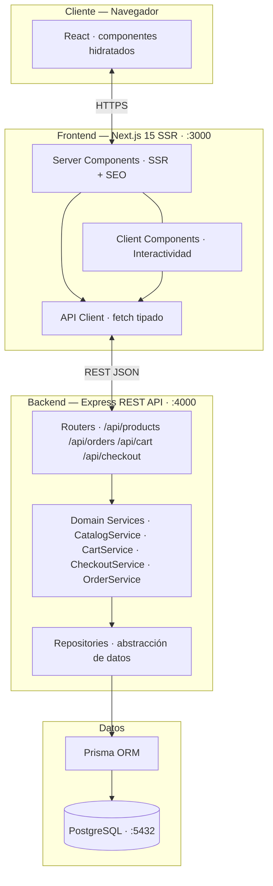
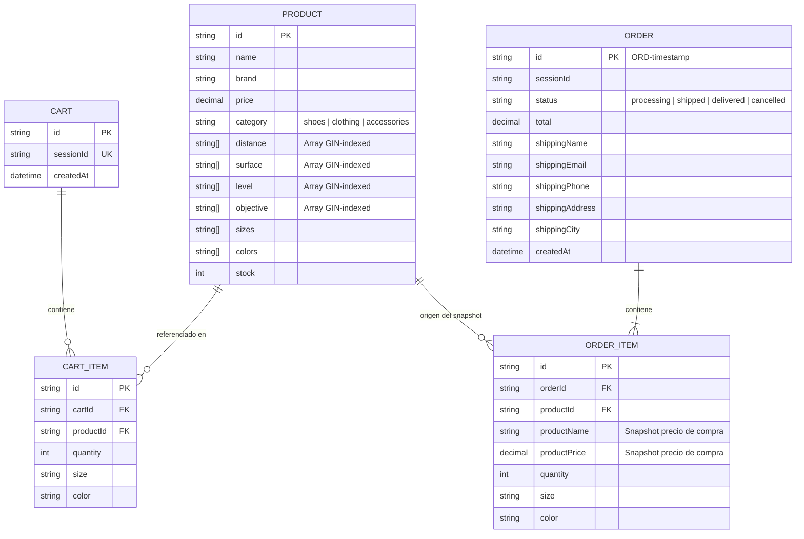

## Índice

0. [Ficha del proyecto](#0-ficha-del-proyecto)
1. [Descripción general del producto](#1-descripción-general-del-producto)
2. [Arquitectura del sistema](#2-arquitectura-del-sistema)
3. [Modelo de datos](#3-modelo-de-datos)
4. [Especificación de la API](#4-especificación-de-la-api)
5. [Historias de usuario](#5-historias-de-usuario)
6. [Tickets de trabajo](#6-tickets-de-trabajo)
7. [Pull requests](#7-pull-requests)

---

## 0. Ficha del proyecto

### **0.1. Tu nombre completo:**

Xavier Venteo

### **0.2. Nombre del proyecto:**

RunMarket

### **0.3. Descripción breve del proyecto:**

eCommerce especializado en productos deportivos para running. Permite a corredores principiantes, populares y avanzados encontrar zapatillas, ropa técnica y accesorios adaptados a su perfil mediante filtros propios de la disciplina: distancia objetivo, tipo de superficie, nivel del corredor y objetivo de entrenamiento.

### **0.4. URL del proyecto:**

> Pendiente de documentar.

### 0.5. URL o archivo comprimido del repositorio

[xavierventeo/AI4Devs-finalproject](https://github.com/xavierventeo/AI4Devs-finalproject/tree/feature-entrega1-XVB)


---

## 1. Descripción general del producto

### **1.1. Objetivo:**

**RunMarket** es un eCommerce especializado en productos deportivos para running. Permite a corredores principiantes, populares y avanzados encontrar zapatillas, ropa técnica y accesorios adaptados a su perfil mediante filtros propios de la disciplina: distancia objetivo, tipo de superficie, nivel del corredor y objetivo de entrenamiento.

El problema que resuelve es de orientación y relevancia: los eCommerce generalistas no ofrecen filtros específicos de running, lo que obliga al corredor a navegar catálogos irrelevantes sin criterios técnicos. RunMarket reduce esa fricción colocando al corredor y su perfil en el centro del catálogo.

**Propuesta de valor:** el único eCommerce donde el catálogo se adapta al corredor, no al revés.

> Documentación completa de producto (Lean Canvas, casos de uso, decisiones de diseño): [docs/PRD.md](docs/PRD.md)

### **1.2. Características y funcionalidades principales:**

El MVP cubre el ciclo completo de descubrimiento y compra:

1. **Catálogo de productos** — zapatillas, ropa técnica y accesorios para running
2. **Búsqueda y filtrado multidimensional** — por categoría, distancia, superficie, nivel y objetivo de entrenamiento; filtros combinables con actualización dinámica
3. **Ficha de producto** — descripción técnica, atributos running como etiquetas de color, selector de talla/color, stepper de cantidad y trust signals (envío, devolución, garantía)
4. **Gestión de carrito** — añadir, modificar cantidad y eliminar; resumen con subtotal, envío y total; persiste en sesión
5. **Checkout simulado** — flujo en 2 pasos (datos de envío + método de pago); sin procesamiento real de pagos ni autenticación requerida
6. **Confirmación de pedido** — número de pedido generado y resumen de compra
7. **Gestión básica de pedidos** — historial con estados: pendiente, procesando, enviado, entregado

> Casos de uso detallados con diagramas de flujo: [docs/PRD.md#casos-de-uso-principales](docs/PRD.md)

### **1.3. Diseño y experiencia de usuario:**

Prototipo interactivo: [eCommerce para productos deportivos — Figma Make](https://www.figma.com/make/0wtedXb5138odnAOgHlMiA/Ecommerce-para-productos-deportivos)

Las capturas de pantalla se encuentran en [`docs/prototypes/`](docs/prototypes/).

---

**Home — Catálogo con filtros** · *Caso de uso 1*


Catálogo con panel lateral de filtros running. Punto de entrada y diferencial principal del producto.

---

**Ficha de producto** · *Caso de uso 2*


Detalle técnico del producto con atributos running, selector de talla/color y botón de añadir al carrito.

---

**Carrito** · *Caso de uso 3*


Resumen de selección con subtotal, envío y acceso al checkout.

---

**Checkout — Datos de envío** · *Caso de uso 3*


Formulario de envío, paso 1 del proceso de compra simulado.

---

**Checkout — Método de pago** · *Caso de uso 3*


Formulario de tarjeta simulada, paso 2 del proceso de compra.

---

**Confirmación de pedido** · *Caso de uso 3*


Pantalla de éxito con número de pedido generado.

---

**Mis pedidos**


Historial de pedidos con estado y detalle de productos.

### **1.4. Instrucciones de instalación:**

**Requisitos previos:** Node.js 20+, npm 10+, Docker y Docker Compose.

**1. Clonar el repositorio**

```bash
git clone https://github.com/xavierventeo/AI4Devs-finalproject.git
cd AI4Devs-finalproject
git checkout feature-entrega2-XVB
```

**2. Configurar variables de entorno**

Desde la raíz del repo (`AI4Devs-finalproject/`). El proyecto usa un único fichero `.env`, compartido por backend y Docker Compose.

```bash
cp .env.example .env
```

**3. Instalar dependencias**

Desde la raíz del repo. Monorepo con npm workspaces: una sola instalación resuelve `frontend/` y `backend/`.

```bash
npm install
```

**4. Levantar la base de datos**

Desde la raíz del repo (ahí está `docker-compose.yml`).

```bash
docker compose up -d
```

Esto arranca PostgreSQL 16 en el puerto definido por `DB_PORT` (por defecto `5432`).

**5. Aplicar migraciones y cargar datos de prueba**

Desde la raíz del repo.

```bash
cd backend
npx prisma migrate deploy
npm run db:seed
cd ..
```

**6. Arrancar el backend**

Desde la raíz del repo.

```bash
npm run dev --workspace=backend
```

API disponible en `http://localhost:4000`. 
Comprueba que está activa en `http://localhost:4000/api/health`.

**7. Arrancar el frontend**

Desde la raíz del repo, en otra terminal.

```bash
npm run dev --workspace=frontend
```

Aplicación disponible en `http://localhost:3000`.

---

## 2. Arquitectura del Sistema

> Documentación completa de arquitectura: [docs/ARCHITECTURE.md](docs/ARCHITECTURE.md)

### **2.1. Diagrama de arquitectura:**

RunMarket sigue una arquitectura de **frontend SSR desacoplado + API REST + base de datos relacional**. La separación en tres capas independientes permite testing unitario aislado en cada nivel y escala natural en versiones posteriores.


```mermaid
graph TB
    subgraph Browser["Cliente — Navegador"]
        UI["React · componentes hidratados"]
    end

    subgraph FE["Frontend — Next.js 15 SSR · :3000"]
        SC["Server Components · SSR + SEO"]
        CC["Client Components · Interactividad"]
        APICL["API Client · fetch tipado"]
    end

    subgraph BE["Backend — Express REST API · :4000"]
        ROUTER["Routers · /api/products /api/orders /api/cart /api/checkout"]
        SVC["Domain Services · CatalogService · CartService · CheckoutService · OrderService"]
        REPO["Repositories · abstracción de datos"]
    end

    subgraph DATA["Datos"]
        ORM["Prisma ORM"]
        PG[("PostgreSQL · :5432")]
    end

    UI <-->|HTTPS| SC
    SC --- CC
    SC --> APICL
    CC --> APICL
    APICL <-->|"REST JSON"| ROUTER
    ROUTER --> SVC
    SVC --> REPO
    REPO --> ORM
    ORM --> PG
```

**Patrón:** [Layered Architecture](https://martinfowler.com/bliki/PresentationDomainDataLayering.html) con Repository Pattern en el backend (Router → Controller → Service → Repository). SSR selectivo en el frontend: solo catálogo y ficha de producto se renderizan en servidor (valor SEO); carrito, checkout y pedidos son Client Components.

### **2.2. Descripción de componentes principales:**

| Componente | Tecnología | Responsabilidad |
|---|---|---|
| **Frontend** | Next.js 15 · React 18 · TypeScript · Tailwind CSS · shadcn/ui | Renderizado SSR de catálogo y fichas de producto; interactividad client-side para carrito y checkout |
| **Backend API** | Node.js 20 · Express 4 · TypeScript · Zod | API REST con lógica de negocio organizada en Services; validación de entrada con Zod |
| **ORM** | Prisma 5 | Abstracción type-safe de acceso a PostgreSQL; gestión de migraciones y seeds |
| **Base de datos** | PostgreSQL 16 | Persistencia relacional del catálogo, pedidos e ítems de pedido |
| **Tests unitarios** | Vitest + RTL (FE) · Jest + Supertest (BE) | Cobertura de componentes, services y endpoints de forma aislada |
| **Tests E2E** | Playwright | Validación de flujos completos: filtrado → ficha → carrito → checkout → confirmación |

### **2.3. Descripción de alto nivel del proyecto y estructura de ficheros**

El proyecto se organiza como **monorepo con npm workspaces** en tres paquetes independientes:

```
runmarket/
├── frontend/          ← Next.js 15 (SSR · puerto 3000)
│   └── src/
│       ├── app/       ← App Router: rutas SSR y Client pages
│       ├── components/← Catálogo, Producto, Carrito, Checkout
│       ├── lib/       ← API client tipado hacia el backend
│       └── types/     ← Tipos compartidos (Product, Order, CartItem)
│
├── backend/           ← Express REST API (puerto 4000)
│   ├── src/
│   │   ├── routes/    ← Definición de endpoints REST
│   │   ├── controllers/← Capa HTTP: validación y respuesta
│   │   ├── services/  ← Lógica de negocio (CatalogService, OrderService…)
│   │   ├── repositories/← Acceso a datos via Prisma
│   │   └── middleware/← CORS, error handler, logger
│   └── prisma/        ← Schema, migraciones y seed de datos
│
└── e2e/               ← Playwright E2E tests
    └── tests/         ← catalog.spec · product.spec · purchase.spec
```

El backend sigue el patrón **Repository + Service Layer**: los Services contienen la lógica de negocio pura (sin dependencias HTTP ni de base de datos directas), lo que permite testearlos de forma aislada con mocks de Repository.

### **2.4. Infraestructura y despliegue**

El despliegue del MVP academico se plantea con una infraestructura de coste 0 EUR/mes, suficiente para que los profesores puedan consultar la aplicacion completa durante la evaluacion:

| Capa | Servicio | Plan | Responsabilidad |
|---|---|---|---|
| Frontend | Vercel | Hobby | Publica la aplicacion Next.js 15 con SSR y assets estaticos |
| Backend | Render | Free Web Service | Publica la API REST Express |
| Base de datos | Supabase | Free PostgreSQL | Aloja PostgreSQL para catalogo, carrito y pedidos |
| Repositorio | GitHub | Free | Fuente de codigo y disparador de despliegues automaticos |

La pipeline del MVP es deliberadamente sencilla: al vincular el repositorio, Vercel despliega automaticamente el frontend y Render despliega automaticamente el backend en cada push. Supabase no despliega codigo; la base de datos se prepara de forma puntual con Prisma:

```bash
cd backend
npx prisma migrate deploy
npx prisma db seed
```

Esta decision evita sobreingenieria para la entrega y mantiene la arquitectura desacoplada definida en el sistema: frontend SSR, API REST independiente y PostgreSQL gestionado. La principal limitacion es que Render Free puede dormirse tras inactividad y Supabase Free puede pausarse si no se usa durante un periodo prolongado.

> Propuesta completa de infraestructura: [docs/INFRASTRUCTURE.md](docs/INFRASTRUCTURE.md)  
> Pipeline de despliegue del MVP: [docs/DEPLOYMENT.md](docs/DEPLOYMENT.md)

### **2.5. Seguridad**

Las reglas de seguridad no negociables del proyecto están definidas en [`CLAUDE.md`](CLAUDE.md) y se verifican mediante una revisión OWASP Top 10 obligatoria antes de cerrar cada historia de usuario (`HIGH`/`CRITICAL` bloquean el cierre). Prácticas implementadas:

- **Precio y stock nunca se confían del cliente.** El `price` de cada `OrderItem` se toma siempre del `Product` leído de PostgreSQL en el momento del checkout; cualquier campo `price`/`total` que llegue en el body se ignora. El descuento de stock al confirmar un pedido usa una actualización condicional atómica (`tx.product.updateMany({ where: { stock: { gte: cantidad } }, data: { stock: { decrement: cantidad } } })`) para evitar oversell por condición de carrera entre confirmaciones simultáneas (`backend/src/repositories/order.repository.ts`).

- **Validación estricta en los boundaries de la API.** Todos los schemas Zod expuestos a la red usan `.strict()` (`cart.schema.ts`, `checkout.schema.ts`, `product-filter.schema.ts`): cualquier campo no declarado en el body se rechaza con `400` en lugar de pasar silenciosamente a la capa de negocio.

- **`sessionId` impredecible y gestionado server-side.** Se genera con `crypto.randomUUID()` en `session.middleware.ts` (nunca `Math.random()` ni timestamps) y se transmite al cliente como cookie `HttpOnly; SameSite=Strict; Path=/` (más `Secure` fuera de `NODE_ENV=development`). El frontend nunca lo lee ni lo persiste en `localStorage`.

- **CORS sin wildcard fuera de desarrollo.** `cors.ts` lee el origen permitido de `CORS_ORIGIN`; en producción, si la variable no está definida, el servidor falla al arrancar en lugar de caer de vuelta a un origen abierto.

- **Rate limiting diferenciado por sensibilidad del endpoint.** `express-rate-limit` aplica 100 req/min al catálogo (`generalLimiter`) y 20 req/min a los endpoints de mutación —`POST /api/cart`, `PUT /api/cart/:productId`, `POST /api/checkout`— vía `mutationLimiter`, mitigando abuso y oversell por fuerza bruta.

- **Respuestas de error sin detalles internos.** `error-handler.ts` mapea cada error de dominio (`NotFoundError`, `ValidationError`, `StockError`) a un `{ error: string }` genérico con el código HTTP correspondiente; cualquier excepción no controlada cae en un `500` genérico. El stack trace solo se escribe en el logger del servidor (`console.error`), nunca en el body de la respuesta.

- **Logging sin PII.** El middleware de logging (`logger.ts`, Morgan) usa un formato custom que solo registra método, URL, status y tiempo de respuesta — nunca el body de la petición — y omite explícitamente las peticiones a `/api/checkout`, donde viajan datos de envío y pago simulado.

- **Sin almacenamiento de datos de pago en el cliente.** `PaymentData` solo vive en el estado local del componente `CheckoutPage` durante el flujo de 3 pasos y se descarta al completar o abandonar; `CartContext` y `localStorage` (clave `runmarket_cart`) solo contienen ítems de carrito, nunca datos de tarjeta ni el `sessionId`.

- **Sanitización de filtros de URL contra enums cerrados.** Los query params del catálogo (`?distance=marathon&surface=trail`) se validan en `app/page.tsx` contra las listas cerradas del dominio (`VALID_DISTANCES`, `VALID_SURFACES`, `VALID_LEVELS`, `VALID_OBJECTIVES`, `VALID_CATEGORIES` en `lib/product-utils.ts`) antes de reenviarse a la API; un valor desconocido se descarta silenciosamente.

- **Sin `dangerouslySetInnerHTML`.** Todo contenido dinámico (descripciones y nombres de producto) se renderiza como texto plano vía JSX, que escapa automáticamente — verificado: 0 usos en el código del proyecto.

- **`npm audit` como parte de la revisión OWASP.** Cada cierre de historia de usuario incluye una revisión de dependencias nuevas; las vulnerabilidades preexistentes en `devDependencies` de testing se documentan como aceptadas y fuera de alcance en lugar de ignorarse silenciosamente.

### **2.6. Tests**

El proyecto sigue TDD obligatorio en toda implementación (test que falla → código mínimo → refactor en verde, regla de [`CLAUDE.md`](CLAUDE.md)). Cada capa se prueba de forma aislada:

| Capa | Herramientas | Estrategia | Resultado actual |
|---|---|---|---|
| Backend | Jest + Supertest | Repository: mock de `PrismaClient`, verifica las queries/mutaciones exactas. Service: mock del repositorio (`jest.fn()`), lógica de negocio aislada (validación de stock, totales, errores de dominio). Controller: mock del service + Supertest, contrato HTTP (status codes, forma del body, cookies, rechazo de schemas Zod inválidos). `prisma/seed.test.ts` es la única suite de integración contra PostgreSQL real (no mockada), gateada con `describe.skip` si `DATABASE_URL` no apunta a una BD real | **171/171**, 17/17 suites |
| Frontend | Vitest + React Testing Library | Componentes, páginas y contexts: estados de UI (loading/empty/error), interacción de usuario, contratos de los hooks de contexto | **300/300**, 30 ficheros |
| E2E | Playwright (Chromium) | Caja negra contra frontend + backend + PostgreSQL reales, sin mocks ni seeding desde el propio spec | **6/6** (`catalog.spec.ts`, `product.spec.ts`, `purchase.spec.ts`) |

> Detalle de la suite E2E: [`docs/E2E-TESTING.md`](docs/E2E-TESTING.md)

**Algunos tests representativos:**

- **`prisma/seed.test.ts` — único test de integración contra PostgreSQL real.** Ejecuta el seed contra la base de datos del `docker-compose` y comprueba: inserta exactamente 13 productos (incluida la fixture `prod-013` con stock 0 para los escenarios de "Agotado"), es idempotente al ejecutarse dos veces, y todos los productos tienen atributos de filtrado (`distance`/`surface`) no vacíos.

- **`order.repository.test.ts` — descuento atómico de stock.** Con `tx.product` mockado, verifica que `createOrderFromCart` llama a `updateMany({ where: { stock: { gte: cantidad } }, data: { stock: { decrement: cantidad } } })` por cada ítem del carrito y lanza `StockError` cuando `updateMany` devuelve `count: 0` — sin necesidad de levantar PostgreSQL para probar la condición de carrera.

- **`cart.controller.test.ts` — contrato de `POST /api/cart`.** Vía Supertest sobre una app Express en memoria: body válido → `200` con el carrito actualizado; campo extra en el body → `400` (verifica que el schema Zod es `.strict()`); stock insuficiente → `409` con `available`; comprueba que la respuesta nunca incluye `stack` ni mensajes internos de Prisma.

- **`cart-context.test.tsx` — estado global del carrito.** Con RTL, simula `addItem` exitoso y fallido: en éxito actualiza `items`/`itemCount`/totales desde la respuesta del servidor; en fallo, `error` se popula y el estado previo no se muta — protege la regla de que el frontend nunca decide cantidades ni precios por su cuenta.

- **`checkout-page.test.tsx` — flujo de 3 pasos.** Cubre navegación entre pasos, persistencia de la confirmación en `sessionStorage`, recuperación ante JSON corrupto y el guard que redirige a `/cart` si el carrito está vacío y no hay pedido confirmado.

- **`purchase.spec.ts` (E2E) — ciclo de compra real.** Recorre catálogo → ficha de producto → carrito → checkout → confirmación contra el sistema vivo (sin mocks), comprobando que el pedido se crea, el carrito queda vacío y el número de pedido se muestra — única capa que ejerce las transacciones reales de Prisma/PostgreSQL descritas arriba.

---

## 3. Modelo de Datos

> Documentación completa del modelo de datos, decisiones de diseño y esquema Prisma: [docs/DATA-MODEL.md](docs/DATA-MODEL.md)

### **3.1. Diagrama del modelo de datos:**

El modelo cubre las cinco entidades del MVP: catálogo de productos, carrito de sesión y ciclo de pedido. Los atributos de filtrado running (`distance`, `surface`, `level`, `objective`) se modelan como **arrays nativos de PostgreSQL** indexados con GIN, evitando cuatro tablas de junction innecesarias para un conjunto de valores pequeño y cerrado.


```mermaid
erDiagram
    PRODUCT {
        string   id          PK
        string   name
        string   brand
        decimal  price
        string   category       "shoes | clothing | accessories"
        string[] distance       "Array GIN-indexed"
        string[] surface        "Array GIN-indexed"
        string[] level          "Array GIN-indexed"
        string[] objective      "Array GIN-indexed"
        string[] sizes
        string[] colors
        int      stock
    }

    CART {
        string   id          PK
        string   sessionId   UK
        datetime createdAt
    }

    CART_ITEM {
        string   id          PK
        string   cartId      FK
        string   productId   FK
        int      quantity
        string   size
        string   color
    }

    ORDER {
        string   id          PK  "ORD-timestamp"
        string   sessionId
        string   status          "processing | shipped | delivered | cancelled"
        decimal  total
        string   shippingName
        string   shippingEmail
        string   shippingPhone
        string   shippingAddress
        string   shippingCity
        datetime createdAt
    }

    ORDER_ITEM {
        string   id           PK
        string   orderId      FK
        string   productId    FK
        string   productName     "Snapshot precio de compra"
        decimal  productPrice    "Snapshot precio de compra"
        int      quantity
        string   size
        string   color
    }

    CART        ||--o{ CART_ITEM  : "contiene"
    PRODUCT     ||--o{ CART_ITEM  : "referenciado en"
    ORDER       ||--|{ ORDER_ITEM : "contiene"
    PRODUCT     ||--o{ ORDER_ITEM : "origen del snapshot"
```

### **3.2. Descripción de entidades principales:**

| Entidad | Rol | Restricciones clave |
|---|---|---|
| **PRODUCT** | Catálogo de productos de running. Atributos de filtrado como arrays GIN-indexed para consultas eficientes. | `price` como `Decimal` (no Float); `stock ≥ 0`; `category` enum cerrado |
| **CART** | Carrito activo de una sesión de navegador. Se vacía al completar el checkout. | `sessionId` unique — un carrito por sesión |
| **CART_ITEM** | Línea de ítem del carrito. Usa precio actual del producto (no snapshot). | Unique constraint por `(cartId, productId, size, color)` |
| **ORDER** | Pedido generado tras checkout. Almacena dirección de envío como campos planos (sin entidad ADDRESS en MVP). | `subtotal + shipping = total`; `id` formato `ORD-{timestamp}` |
| **ORDER_ITEM** | Línea de ítem del pedido con **snapshot** de nombre, marca y precio del producto en el momento de compra. Garantiza inmutabilidad del historial. | `productPrice` fijado en checkout; no se actualiza si cambia el producto |

---

## 4. Especificación de la API

El backend expone una API REST documentada en **OpenAPI 3.0.3**, generada programáticamente con [`zod-to-openapi`](https://github.com/asteasolutions/zod-to-openapi) a partir de los mismos schemas Zod que validan las peticiones (`backend/src/docs/openapi.ts`), de modo que la especificación no puede desincronizarse de la validación real. Con el backend en local, el spec interactivo está disponible en `http://localhost:4000/api/docs` (Swagger UI) y `http://localhost:4000/api/docs.json` (JSON crudo).

A continuación se describen los 3 endpoints principales, que cubren el recorrido completo de compra: consultar catálogo filtrado → añadir al carrito → confirmar pedido.

### 4.1. `GET /api/products` — Catálogo con filtros de running

```yaml
/api/products:
  get:
    tags: [Productos]
    summary: Listado de productos con filtros opcionales
    parameters:
      - name: distance
        in: query
        schema:
          type: array
          items: { type: string, enum: [5K, 10K, half-marathon, marathon, ultra] }
        style: form
        explode: true
      - name: surface
        in: query
        schema:
          type: array
          items: { type: string, enum: [road, trail, track, mixed] }
        style: form
        explode: true
      - name: level
        in: query
        schema:
          type: array
          items: { type: string, enum: [beginner, intermediate, advanced] }
        style: form
        explode: true
      - name: objective
        in: query
        schema:
          type: array
          items: { type: string, enum: [training, competition, recovery, daily] }
        style: form
        explode: true
    responses:
      '200':
        description: Lista de productos
        content:
          application/json:
            schema:
              type: array
              items: { $ref: '#/components/schemas/Product' }
      '400':
        description: Parámetros de filtro inválidos
        content:
          application/json:
            schema: { $ref: '#/components/schemas/Error' }
```

**Ejemplo de petición:**

```http
GET /api/products?distance=marathon&surface=road
```

**Ejemplo de respuesta `200 OK`:**

```json
[
  {
    "id": "clx1z2a3b4c5d6e7f8g9h0",
    "name": "Nike Pegasus 41",
    "brand": "Nike",
    "price": 129.99,
    "image": "/images/pegasus-41.jpg",
    "category": "zapatillas",
    "subcategory": "neutras",
    "description": "Zapatilla de running versátil para asfalto.",
    "features": ["Amortiguación React", "Upper transpirable"],
    "distance": ["marathon", "half-marathon"],
    "surface": ["road"],
    "level": ["intermediate"],
    "objective": ["training"],
    "sizes": ["38", "39", "40", "41", "42"],
    "colors": ["negro", "blanco"],
    "stock": 25
  }
]
```

### 4.2. `POST /api/cart` — Añadir un producto al carrito

```yaml
/api/cart:
  post:
    tags: [Carrito]
    summary: Añadir un producto al carrito
    description: >
      El sessionId se gestiona mediante cookie HTTP-only (SameSite=Strict).
      Si no existe sesión activa se crea automáticamente.
    requestBody:
      required: true
      content:
        application/json:
          schema: { $ref: '#/components/schemas/AddToCartInput' }
    responses:
      '200':
        description: Carrito actualizado
        content:
          application/json:
            schema: { $ref: '#/components/schemas/CartResponse' }
      '400':
        description: Datos de entrada inválidos
      '404':
        description: Producto no encontrado
      '409':
        description: Stock insuficiente
      '429':
        description: Demasiadas peticiones
```

**Ejemplo de petición:**

```json
POST /api/cart
{
  "productId": "clx1z2a3b4c5d6e7f8g9h0",
  "quantity": 2,
  "size": "42",
  "color": "negro"
}
```

**Ejemplo de respuesta `200 OK`:**

```json
{
  "sessionId": "550e8400-e29b-41d4-a716-446655440000",
  "items": [
    {
      "productId": "clx1z2a3b4c5d6e7f8g9h0",
      "productName": "Nike Pegasus 41",
      "productBrand": "Nike",
      "productPrice": 129.99,
      "image": "/images/pegasus-41.jpg",
      "stock": 25,
      "quantity": 2,
      "size": "42",
      "color": "negro"
    }
  ],
  "subtotal": 259.98,
  "shipping": 0,
  "total": 259.98
}
```

### 4.3. `POST /api/checkout` — Confirmar pedido (checkout simulado)

```yaml
/api/checkout:
  post:
    tags: [Checkout]
    summary: Confirmar pedido (checkout simulado)
    description: >
      Crea un pedido a partir del carrito de la sesión activa. Revalida el
      stock de todos los ítems dentro de una transacción Prisma y lo descuenta
      atómicamente. El precio de cada ítem se lee siempre del producto en BD;
      cualquier precio/total enviado por el cliente se ignora.
    requestBody:
      required: true
      content:
        application/json:
          schema: { $ref: '#/components/schemas/CheckoutInput' }
    responses:
      '201':
        description: Pedido creado
        content:
          application/json:
            schema: { $ref: '#/components/schemas/OrderResponse' }
      '400':
        description: Datos de envío inválidos o carrito vacío
      '404':
        description: Algún producto del carrito ya no existe
      '409':
        description: Stock insuficiente para algún ítem del carrito
      '429':
        description: Demasiadas peticiones
```

**Ejemplo de petición:**

```json
POST /api/checkout
{
  "name": "Ana García",
  "email": "ana.garcia@example.com",
  "phone": "+34 600 123 456",
  "address": "Calle Mayor 10, 2ºB",
  "city": "Madrid",
  "postalCode": "28013",
  "country": "España"
}
```

**Ejemplo de respuesta `201 Created`:**

```json
{
  "id": "ORD-1750000000000",
  "status": "processing",
  "date": "2026-06-21T10:00:00.000Z",
  "subtotal": 259.98,
  "shipping": 0,
  "total": 259.98,
  "shippingName": "Ana García",
  "shippingEmail": "ana.garcia@example.com",
  "shippingPhone": "+34 600 123 456",
  "shippingAddress": "Calle Mayor 10, 2ºB",
  "shippingCity": "Madrid",
  "shippingPostalCode": "28013",
  "shippingCountry": "España",
  "items": [
    {
      "productId": "clx1z2a3b4c5d6e7f8g9h0",
      "productName": "Nike Pegasus 41",
      "productBrand": "Nike",
      "productPrice": 129.99,
      "quantity": 2,
      "size": "42",
      "color": "negro"
    }
  ]
}
```

> Especificación completa (7 endpoints: health, products, cart, checkout, orders) generada con `zod-to-openapi`: [`backend/src/docs/openapi.ts`](backend/src/docs/openapi.ts).

---

## 5. Historias de Usuario

> Set completo de historias (15 US) con criterios de aceptación, estimación y prioridad organizadas por caso de uso: [docs/USER-STORIES.md](docs/USER-STORIES.md)

### Backlog MVP — Secuencia de implementación recomendada

| Orden | ID | Título | Caso de uso | Talla | Justificación de la posición |
|---|---|---|---|---|---|
| 1 | US-001 | Ver el catálogo de productos | CU1 | M | Base de toda la experiencia; sin catálogo no hay entrada al producto |
| 2 | US-002 | Filtrar el catálogo por atributos de running | CU1 | M | Propuesta de valor diferencial; valida el núcleo del producto desde el inicio |
| 3 | US-005 | Consultar la ficha técnica de un producto | CU2 | M | Destino de navegación desde el catálogo; principal punto de conversión |
| 4 | US-006 | Seleccionar talla y color del producto | CU2 | S | Prerrequisito directo de US-007; sin variante válida no hay añadido al carrito |
| 5 | US-007 | Añadir un producto al carrito | CU2 | M | Conecta el descubrimiento con la compra; primer paso transaccional |
| 6 | US-008 | Revisar y modificar el carrito | CU3 | M | Punto de entrada al checkout; el corredor revisa y confirma su selección |
| 7 | US-009 | Introducir datos de envío | CU3 | M | Paso 1 del checkout; sin dirección no hay pedido |
| 8 | US-010 | Seleccionar método de pago simulado | CU3 | M | Paso 2 del checkout; completa los datos necesarios para generar el pedido |
| 9 | US-011 | Revisar y confirmar el pedido | CU3 | S | Paso 3 del checkout; crea el pedido y vacía el carrito |
| 10 | US-012 | Ver la confirmación del pedido | CU3 | S | Cierra el ciclo de compra; sin confirmación el corredor no sabe si la compra fue exitosa |

---

### Muestra de historias representativas

---

### US-002 — Filtrar productos por atributos de running

**Caso de uso asociado:** CU1 — Búsqueda filtrada de productos para running

**Historia de usuario:**
Como corredor, quiero filtrar el catálogo por distancia, superficie, nivel y objetivo de entrenamiento, para encontrar únicamente los productos adaptados a mi perfil sin navegar un catálogo irrelevante.

**Criterios de aceptación:**
- [ ] El corredor selecciona uno o más valores en distancia, superficie, nivel u objetivo; el catálogo se actualiza mostrando solo los productos que cumplen todos los criterios activos (AND entre dimensiones, OR dentro de cada dimensión)
- [ ] El contador de productos se actualiza en tiempo real al cambiar filtros
- [ ] Si no hay resultados, se muestra "No se encontraron productos" con enlace a "Limpiar filtros"
- [ ] Los filtros no bloquean combinaciones: si no hay resultados, la UI lo comunica sin estado de error técnico

**Datos o entidades implicadas:** `Product.distance[]`, `Product.surface[]`, `Product.level[]`, `Product.objective[]` — arrays GIN-indexed en PostgreSQL, filtrado via `CatalogService.getProducts(filters)`

**Estimación:** M · **Prioridad:** Imprescindible para el MVP

---

### US-005 — Consultar ficha técnica de un producto

**Caso de uso asociado:** CU2 — Consulta de ficha de producto y decisión de compra

**Historia de usuario:**
Como corredor, quiero ver la ficha completa de un producto con sus atributos técnicos de running, para decidir si se adapta a mi perfil antes de añadirlo al carrito.

**Criterios de aceptación:**
- [ ] Se muestran imagen, nombre, marca, precio, descripción técnica, atributos running como etiquetas coloreadas (nivel azul, distancia verde, superficie ámbar) y lista de características con check verde
- [ ] Si el producto está agotado (`stock === 0`), el botón "Añadir al carrito" se muestra deshabilitado con texto "Agotado"
- [ ] Producto inexistente: mensaje "Producto no encontrado" con enlace al catálogo
- [ ] La página se renderiza con SSR e incluye metadata `og:title` y `og:description` para SEO

**Datos o entidades implicadas:** `Product`: name, brand, price, image, description, features[], distance[], surface[], level[], stock

**Estimación:** M · **Prioridad:** Imprescindible para el MVP

---

### US-008 — Revisar y modificar el carrito de compra

**Caso de uso asociado:** CU3 — Proceso de compra: carrito y checkout simulado

**Historia de usuario:**
Como corredor, quiero revisar los productos añadidos al carrito y modificar cantidades o eliminar artículos, para confirmar mi selección antes de proceder al pago.

**Criterios de aceptación:**
- [ ] Se muestran todos los productos con imagen, nombre, talla, color, precio unitario, stepper de cantidad y botón eliminar; el panel lateral muestra subtotal, envío y total en tiempo real
- [ ] Envío gratuito a partir de 50€; por debajo, se muestra el coste (4,99€) con nudge "¡Añade X€ más para envío gratis!"
- [ ] Carrito vacío: estado vacío con CTA "Ver catálogo"; botón de checkout deshabilitado
- [ ] El carrito persiste durante la sesión del navegador

**Datos o entidades implicadas:** `Cart.items[]`, `CartItem`: product, quantity, size, color — `CartService.updateItem()`, `CartService.removeItem()`

**Estimación:** M · **Prioridad:** Imprescindible para el MVP

---

## 6. Tickets de Trabajo

> Documenta 3 de los tickets de trabajo principales del desarrollo, uno de backend, uno de frontend, y uno de bases de datos. Da todo el detalle requerido para desarrollar la tarea de inicio a fin teniendo en cuenta las buenas prácticas al respecto. 

**Ticket 1 — Backend: US-007-TASK-04 — `CartController` + ruta `POST /api/cart`**

| Campo | Detalle |
|---|---|
| **ID** | US-007-TASK-04 |
| **US** | US-007 — Añadir un producto al carrito |
| **Capa** | Backend |
| **Depende de** | US-007-TASK-02 (`CartService.addItem`), US-007-TASK-03 (middleware de sesión) |
| **Criterio cubierto** | Añadido exitoso, upsert de cantidad, stock insuficiente, producto agotado no añadible |
| **Detalle completo** | [`docs/backlog/archive/US-007.md`](docs/backlog/archive/US-007.md) |

**Descripción**

`backend/src/controllers/cart.controller.ts` expone `POST /api/cart`. El body se valida con un schema Zod `.strict()` (rechaza campos no declarados, conforme a la regla de `CLAUDE.md` sobre boundaries de la API):

```typescript
const AddToCartSchema = z.object({
  productId: z.string().uuid(),
  quantity:  z.number().int().min(1),
  size:      z.string().optional(),
  color:     z.string().optional(),
}).strict();
```

El `sessionId` se lee de `req.sessionId` (adjuntado por el middleware de sesión de TASK-03, que lo genera con `crypto.randomUUID()` si no existe cookie — nunca con `Math.random()` ni IDs predecibles). El controller delega en `cartService.addItem(sessionId, item)` y mapea sus errores a códigos HTTP: `404` (`NotFoundError`, producto inexistente), `409` (`StockError`, con `available: N`), `500` genérico para el resto (sin stack traces ni detalles de Prisma, vía `error-handler.ts`). Si se generó un `sessionId` nuevo, la respuesta incluye `Set-Cookie`. El endpoint tiene un límite de rate limiting más restrictivo que el catálogo (`express-rate-limit`, regla no negociable de `CLAUDE.md`) y queda documentado en `src/docs/openapi.ts`.

**Tests TDD:** 7 tests Supertest sobre una app Express en memoria con `CartService` mockado: `200` con carrito actualizado, `400` con body inválido, `400` con campo extra (verifica `.strict()`), `404` producto inexistente, `409` stock insuficiente con `available`, `Set-Cookie` emitido sin sesión previa, y verificación de que un error 500 no expone `stack` ni mensajes de Prisma en el body. Test en rojo antes del código de producción.

**Seguridad:** precio nunca leído del cliente (el total se recalcula en `CartService` desde el `Product` de BD); Zod `.strict()` en el boundary; respuestas de error genéricas; rate limiting en la mutación.

---

**Ticket 2 — Frontend: US-007-TASK-05 — `CartContext`, estado global del carrito**

| Campo | Detalle |
|---|---|
| **ID** | US-007-TASK-05 |
| **US** | US-007 — Añadir un producto al carrito |
| **Capa** | Frontend |
| **Depende de** | — |
| **Criterio cubierto** | El badge del header se actualiza con la nueva cantidad total; persistencia de sesión del carrito |
| **Detalle completo** | [`docs/backlog/archive/US-007.md`](docs/backlog/archive/US-007.md) |

**Descripción**

`frontend/src/contexts/cart-context.tsx` — React Context (`'use client'`) montado en `app/layout.tsx`, accesible desde toda la aplicación:

```typescript
interface CartContextValue {
  items: CartItemUI[];
  itemCount: number;       // suma de quantity, para el badge del header
  subtotal: number; shipping: number; total: number;
  addItem(productId: string, quantity: number, size?: string, color?: string): Promise<void>;
  isLoading: boolean;
  error: string | null;
}
```

Al montarse, `CartProvider` hidrata el carrito con `GET /api/cart/:sessionId` leyendo el `sessionId` de la cookie del navegador (gestionada por el servidor — **nunca** se guarda en `localStorage`, regla no negociable de `CLAUDE.md`). `addItem` llama a `POST /api/cart` vía `api-client.ts` y, en éxito, sustituye el estado local por la respuesta del servidor (fuente de verdad de precios/stock). Los ítems del carrito (no el `sessionId` ni datos de pago) se cachean en `localStorage` bajo `runmarket_cart` como caché optimista para evitar parpadeo en recargas.

**Tests TDD:** RTL en `cart-context.test.tsx` cubriendo: `addItem` actualiza `items`/`itemCount`/totales tras una respuesta exitosa, `isLoading` se activa durante la petición, `error` se popula y los ítems no cambian si `POST /api/cart` falla, hidratación inicial desde `GET /api/cart/:sessionId` al montar, y persistencia/lectura de `runmarket_cart` en `localStorage` (sin incluir `sessionId`).

---

**Ticket 3 — Base de datos: US-000-TASK-03 — Esquema Prisma**

| Campo | Detalle |
|---|---|
| **ID** | US-000-TASK-03 |
| **US** | US-000 — Setup técnico del proyecto |
| **Capa** | Backend |
| **Depende de** | US-000-TASK-02 (scaffolding del proyecto backend) |
| **Criterio cubierto** | Prerequisito de CA-2 — define el esquema que hace posible la migración |
| **Detalle completo** | [`docs/backlog/archive/US-000.md`](docs/backlog/archive/US-000.md) |

**Descripción**

Definición del esquema Prisma completo con todas las entidades del modelo de datos según `docs/DATA-MODEL.md`. Ficheros producidos:

- `backend/prisma/schema.prisma` con datasource apuntando a `env("DATABASE_URL")` y generator `prisma-client-js`.
- Enums `Category { shoes clothing accessories }` y `OrderStatus { processing shipped delivered cancelled }`.
- Modelos `Product`, `Cart`, `CartItem`, `Order`, `OrderItem` con todos los campos, relaciones e **índices GIN** para los arrays de filtrado running (`distance`, `surface`, `level`, `objective`).

Los atributos multivaluados de filtrado running se modelan como **arrays nativos de PostgreSQL** indexados con GIN, evitando cuatro tablas de junction innecesarias para un conjunto de valores pequeño y cerrado. El campo `price` usa `Decimal @db.Decimal(10, 2)` en lugar de `Float` para evitar errores de redondeo en cálculos monetarios.

---

## 7. Pull Requests

> Documenta 3 de las Pull Requests realizadas durante la ejecución del proyecto

**Pull Request 1 — [US-000: Technical Setup](https://github.com/xavierventeo/AI4Devs-finalproject/pull/1)**
https://github.com/xavierventeo/AI4Devs-finalproject/pull/1

Scaffolding completo del monorepo: workspace npm con `frontend/` (Next.js 15 + TypeScript + Tailwind v4 + shadcn/ui + Vitest) y `backend/` (Express 4 + Prisma 5 + Zod + Jest + Supertest). Incluye Docker Compose para PostgreSQL 16, esquema Prisma con 5 entidades e índices GIN, seed de 12 productos, middlewares de seguridad (CORS, rate-limit, error handler) y health endpoint. Revisión OWASP superada (3 CVEs HIGH corregidos actualizando Next.js a 15.5.19).

**Pull Request 2 — [US-001: Ver el catálogo de productos](https://github.com/xavierventeo/AI4Devs-finalproject/pull/2)**
https://github.com/xavierventeo/AI4Devs-finalproject/pull/2

Endpoint `GET /api/products` con arquitectura limpia (`ProductRepository` → `CatalogService` → `ProductsController`) y `CatalogPage` (Server Component SSR) con `ProductGrid` responsiva, `ResultsCounter`, estado vacío y estado de error con botón Reintentar. `ProductCard` con imagen, nombre, marca, precio en euros y badge de nivel. 65 tests en verde (32 backend + 33 frontend). Revisión OWASP sin hallazgos HIGH/CRITICAL.

**Pull Request 3 — [US-007: Añadir un producto al carrito](https://github.com/xavierventeo/AI4Devs-finalproject/pull/6)**
https://github.com/xavierventeo/AI4Devs-finalproject/pull/6

Implementa `POST /api/cart` completo (`CartRepository` → `CartService` → `CartController`) con middleware de sesión (`crypto.randomUUID`, cookie `HttpOnly; SameSite=Strict; Secure` fuera de desarrollo) y `CartContext` React como fuente de verdad global del carrito, persistido en `localStorage` sin PII. Conecta el botón de añadir al carrito de la ficha de producto al endpoint real, con toasts de éxito/error y badge de cantidad en el Header. 225 tests en verde (91 backend + 134 frontend). 7/7 tareas con TDD, revisión OWASP aprobada (0 HIGH/CRITICAL).
