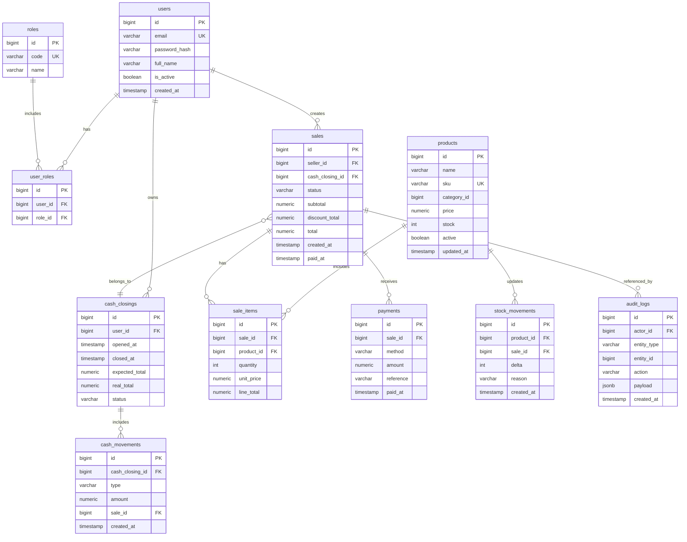

# Manus POS - Entrega 1 (MVP)

## Índice

1. [Ficha del proyecto](#1-ficha-del-proyecto)
2. [Descripción general del producto](#2-descripción-general-del-producto)
3. [Problema que resuelve](#3-problema-que-resuelve)
4. [Usuarios objetivo](#4-usuarios-objetivo)
5. [Alcance del MVP](#5-alcance-del-mvp)
6. [Flujo E2E prioritario](#6-flujo-e2e-prioritario)
7. [Historias de usuario](#7-historias-de-usuario)
8. [Tickets de trabajo derivados](#8-tickets-de-trabajo-derivados)
9. [Criterios de aceptación](#9-criterios-de-aceptación)
10. [Trazabilidad historia → ticket → artefacto](#10-trazabilidad-historia--ticket--artefacto)
11. [Arquitectura lógica](#11-arquitectura-lógica)
12. [Arquitectura técnica](#12-arquitectura-técnica)
13. [Modelo de datos principal](#13-modelo-de-datos-principal)
14. [Endpoints / API principales](#14-endpoints--api-principales)
15. [Estrategia de testing](#15-estrategia-de-testing)
16. [Estrategia de despliegue](#16-estrategia-de-despliegue)
17. [Estrategia de uso de IA](#17-estrategia-de-uso-de-ia)
18. [Plan por entregas](#18-plan-por-entregas)
19. [Notas OpenSpec](#19-notas-openspec)

---

## 1. Ficha del proyecto

### 1.1. Nombre del proyecto
Manus POS

### 1.2. Responsable
IVAN JESUS CASTRO RUIZ

### 1.3. Versión
Entrega 1 (MVP)

### 1.4. URL del proyecto
[\[URL pública pendiente\]](https://www.apptiendamanus.space/)

### 1.5. Repositorio
[Repositorio Manus POS pendiente]

### 1.6. Rama de trabajo
`feature-entrega1-IJCR`

---

## 2. Descripción general del producto

Manus POS es una plataforma de punto de venta para tiendas minoristas.  
El objetivo es demostrar un ciclo de venta presencial completo y confiable: buscar producto, vender, cobrar, guardar registro y reflejar impacto en inventario y caja.

Usuarios clave:
- Cajero: ejecuta ventas desde el POS.
- Administrador: valida inventario, catálogo y caja diaria.
- Dueño / super administrador: controla roles, permisos y operación general.

---

## 3. Problema que resuelve

- Ventas lentas o con errores de captura.
- Stock desactualizado después de cada venta.
- Difícil conciliación entre ventas y caja.
- Accesos sin separación de responsabilidades.

Manus POS propone un flujo E2E acotado y controlado que deja trazabilidad clara.

---

## 4. Usuarios objetivo

- **Cajero**: realiza venta presencial rápido y con control de stock.
- **Administrador**: mantiene el inventario y monitorea caja por turno.
- **Dueño / Super admin**: gestiona usuarios, permisos y configuración general.

---

## 5. Alcance del MVP

### Incluye en Entrega 1
- Login con autenticación y rol.
- Búsqueda y filtrado de productos en POS.
- Carrito: agregar, editar cantidad y remover ítems.
- Cobro y registro de venta.
- Actualización de inventario tras venta.
- Consulta de turno/caja actual.
- Documentación completa de producto, arquitectura, datos y pruebas.

### Queda fuera de Entrega 1
- Integración real con pasarela externa.
- Facturación electrónica completa.
- Multi-país en ejecución (solo preparación).
- Despliegue productivo real.
- Cambios de infraestructura avanzada o alta escalabilidad.

---

## 6. Flujo E2E prioritario

1. Login → acceso seguro con rol.
2. POS → carga catálogo y filtros.
3. Buscador/filtrado → selección rápida de SKU o nombre.
4. Carrito → ajuste de cantidad y validación de stock.
5. Cobro → captura de monto y método de pago.
6. Registro de venta → cabecera y líneas.
7. Inventario → decremento real de stock.
8. Caja/turno → acumulado visible en turno activo.

---

## 7. Historias de usuario

### Must-Have
1. Como cajero, quiero iniciar sesión para acceder de forma segura al POS.
2. Como cajero, quiero buscar y filtrar productos para agregarlos rápidamente al carrito.
3. Como cajero, quiero cobrar una venta para registrar la transacción correctamente.
4. Como administrador, quiero que el inventario se actualice después de una venta para mantener el stock correcto.
5. Como administrador, quiero consultar el turno actual/caja para validar las ventas y pagos registrados.

### Should-Have
1. Como cajero, quiero que el POS sea responsive para usarlo desde PC, tablet o terminal táctil.
2. Como dueño, quiero que la arquitectura quede preparada para internacionalización futura, especialmente español/inglés y operación multi-país.

---

## 8. Tickets de trabajo derivados

1. `MANUS-1` — Autenticación y autorización por roles.
2. `MANUS-2` — Pantalla POS con búsqueda, filtros y responsive.
3. `MANUS-3` — Lógica de carrito y cálculo de totales.
4. `MANUS-4` — Registro de venta con detalle y estado.
5. `MANUS-5` — Descuento de inventario al confirmar venta.
6. `MANUS-6` — Turno/caja actual con movimientos y cierres.
7. `MANUS-7` — Pruebas unitarias e integración del flujo E2E.

---

## 9. Criterios de aceptación

- El login solo permite ingreso con credenciales válidas y rol permitido.
- El POS responde filtros por texto/categoría/estado sin bloqueo.
- Un stock insuficiente bloquea la línea de venta y muestra mensaje claro.
- Al confirmar venta se registra:
  - venta cabecera,
  - detalle,
  - pago(s),
  - movimiento de caja.
- El inventario se actualiza inmediatamente para los productos vendidos.
- El turno actual refleja total ventas y total por método.
- UI usable desde PC y tablet.
- Documentación de Entrega 1 completa con placeholders explícitos:
  - `[URL pública pendiente]`
  - `[PR Entrega 1 pendiente]`
  - `[Repositorio Manus POS pendiente]`

---

## 10. Trazabilidad historia → ticket → artefacto

| Historia | Ticket(s) | Artefacto |
|---|---|---|
| Inicio de sesión seguro | MANUS-1 | `readme.md`, sección 5–7, casos de auth en test |
| Búsqueda y filtrado | MANUS-2, MANUS-3 | `readme.md`, sección 6, sección 14 |
| Cobro y registro | MANUS-3, MANUS-4 | `readme.md`, endpoints, plan de pruebas |
| Actualizar inventario | MANUS-5 | `readme.md`, sección 13, criterios de aceptación |
| Consultar turno/caja | MANUS-6 | `readme.md`, sección 14, sección 15 |
| POS responsive | MANUS-2 | `prompts.md` (prompts frontend), criterios de aceptación |
| i18n futuro | MANUS-1 | sección 17, sección 18 |

---

## 11. Arquitectura lógica

```text
[Cliente web POS]
   -> [Frontend web]
      -> [API REST]
         -> [Servicios de dominio]
            -> [PostgreSQL]
               -> [auditoría y reportes]
```

- El frontend orquesta vista y UX.
- La API valida reglas de negocio (auth, permisos, stock, turno).
- La base de datos guarda trazabilidad de venta, pagos y movimientos.

---

## 12. Arquitectura técnica

- **Frontend:** SPA web (stack definido por plantilla) con UI responsive.
- **Backend:** API REST JSON.
- **Base de datos:** PostgreSQL.
- **Auth:** tokens/autenticación por sesión según stack base.
- **Roles:** `cajero`, `administrador`, `super_admin`.
- **Dominios**: productos, ventas, pagos, inventario, caja/turno, usuarios.

---

## 13. Modelo de datos principal


```mermaid
erDiagram
    users ||--o{ user_roles : has
    roles ||--o{ user_roles : includes
    users ||--o{ sales : creates
    users ||--o{ cash_closings : owns
    products ||--o{ sale_items : includes
    sales ||--o{ sale_items : has
    sales ||--o{ payments : receives
    sales }o--|| cash_closings : belongs_to
    products ||--o{ stock_movements : updates
    cash_closings ||--o{ cash_movements : includes
    sales ||--o{ audit_logs : referenced_by

    users {
      bigint id PK
      varchar email UK
      varchar password_hash
      varchar full_name
      boolean is_active
      timestamp created_at
    }
    roles {
      bigint id PK
      varchar code UK
      varchar name
    }
    user_roles {
      bigint id PK
      bigint user_id FK
      bigint role_id FK
    }
    products {
      bigint id PK
      varchar name
      varchar sku UK
      bigint category_id
      numeric price
      int stock
      boolean active
      timestamp updated_at
    }
    sales {
      bigint id PK
      bigint seller_id FK
      bigint cash_closing_id FK
      varchar status
      numeric subtotal
      numeric discount_total
      numeric total
      timestamp created_at
      timestamp paid_at
    }
    sale_items {
      bigint id PK
      bigint sale_id FK
      bigint product_id FK
      int quantity
      numeric unit_price
      numeric line_total
    }
    payments {
      bigint id PK
      bigint sale_id FK
      varchar method
      numeric amount
      varchar reference
      timestamp paid_at
    }
    stock_movements {
      bigint id PK
      bigint product_id FK
      bigint sale_id FK
      int delta
      varchar reason
      timestamp created_at
    }
    cash_closings {
      bigint id PK
      bigint user_id FK
      timestamp opened_at
      timestamp closed_at
      numeric expected_total
      numeric real_total
      varchar status
    }
    cash_movements {
      bigint id PK
      bigint cash_closing_id FK
      varchar type
      numeric amount
      bigint sale_id FK
      timestamp created_at
    }
    audit_logs {
      bigint id PK
      bigint actor_id FK
      varchar entity_type
      bigint entity_id
      varchar action
      jsonb payload
      timestamp created_at
    }
```

---

## 14. Endpoints / API principales

### 14.1 Autenticación
- `POST /auth/login`  
  Body: `email`, `password`.  
  Respuesta: `access_token`, `refresh_token`, `roles`, `user`.

### 14.2 Catálogo con búsqueda y filtros
- `GET /products?query=&categoryId=&stockMin=&active=`  
  Respuesta paginada para POS.

### 14.3 Venta
- `POST /sales`  
  Body: `items[]`, `cashierId`, `paymentMethod`, `cashReceived`, `cashClosingId`.  
  Respuesta: `saleId`, `total`, `status`.
- `POST /sales/{id}/payments`  
  Body: `method`, `amount`, `reference`.

### 14.4 Turno / Caja
- `GET /cash-closings/current`  
  Respuesta: total ventas, total por método, total de descuentos.
- `POST /cash-closings/{id}/close`  
  Cierre de caja del turno.

---

## 15. Estrategia de testing

- **Unitarias:** auth, validaciones de rol, cálculo de subtotales y totales.
- **Integración:** flujo de venta completo y consistencia de stock.
- **E2E (mínimo 1):** Login → buscar producto → agregar al carrito → cobrar → crear venta → verificar inventario y caja.
- **Pruebas de humo QA:** autenticación, login por rol, consulta de turno, consulta de inventario.

---

## 16. Estrategia de despliegue

1. Entorno QA o demo definido por plantilla.
2. Variables de entorno para secretos y URL de API.
3. Migraciones de base de datos iniciales del MVP.
4. Despliegue de frontend y backend con logs básicos.
5. Smoke test de flujo E2E priorizado.
6. Publicación de URL en [URL pública pendiente].

---

## 17. Estrategia de uso de IA

- Soporte de ChatGPT/Codex en:
  - redacción de documentación técnica,
  - propuesta de endpoints y datos,
  - diseño de pruebas,
  - revisión de consistencia entre historia y ticket.
- El resultado generado por IA se corrige con criterio técnico humano.
- No se delega lógica crítica sin revisión.

---

## 18. Plan por entregas

### Entrega 1 (actual)
- Documentación completa de MVP y flujo E2E.
- Definición de arquitectura, datos y endpoints base.
- Trazabilidad y criterios de aceptación listos.
- Tickets de trabajo priorizados.

### Entrega 2
- Implementar login, POS, carrito, registro de venta.
- Integración backend/frontend de inventario y caja.
- Pruebas de integración y ajuste de QA.

### Entrega Final
- Ajustes de robustez, reportes, internacionalización ES/EN.
- Cierre de caja completo y controles operativos.
- QA final con evidencia de desempeño y estabilidad.

---

## 19. Notas OpenSpec

No existe estructura OpenSpec en el repositorio para esta rama.
Se usa OpenSpec como metodología de especificación y trazabilidad de cambios.

Cuando exista estructura, crear un cambio documental:
- `documentar-entrega1-manus-pos`
- alcance documental: ficha, MVP, arquitectura, datos, historias, tickets, prompts y uso de IA.
- fuera de alcance: cambios funcionales de código y despliegue real.
- criterios de aceptación: `readme.md` y `prompts.md` completos con placeholders claros.

