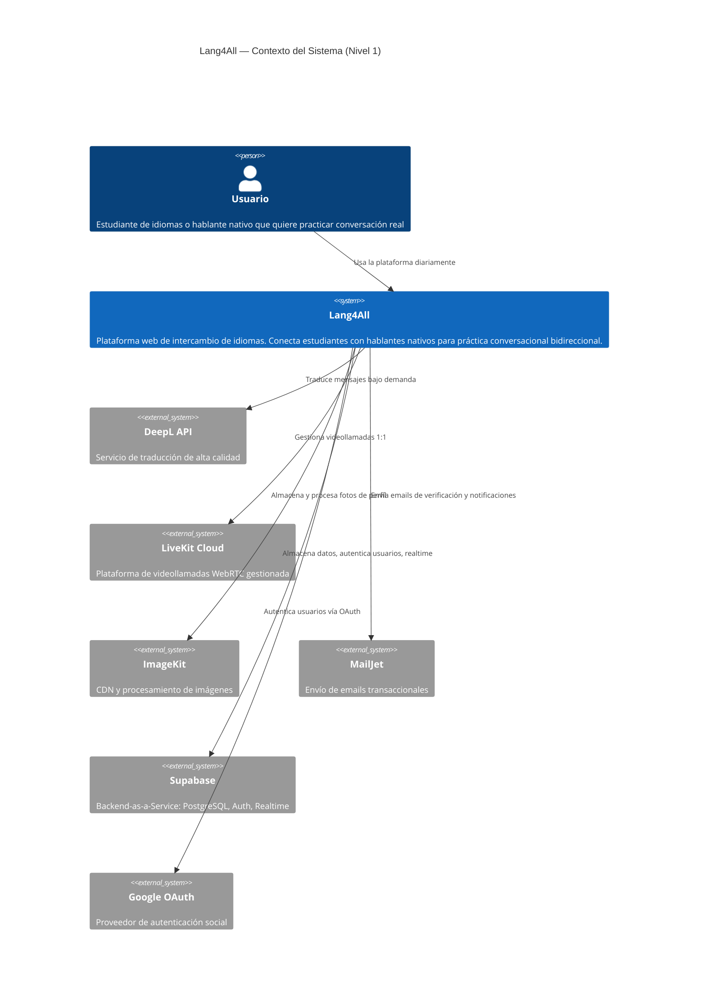
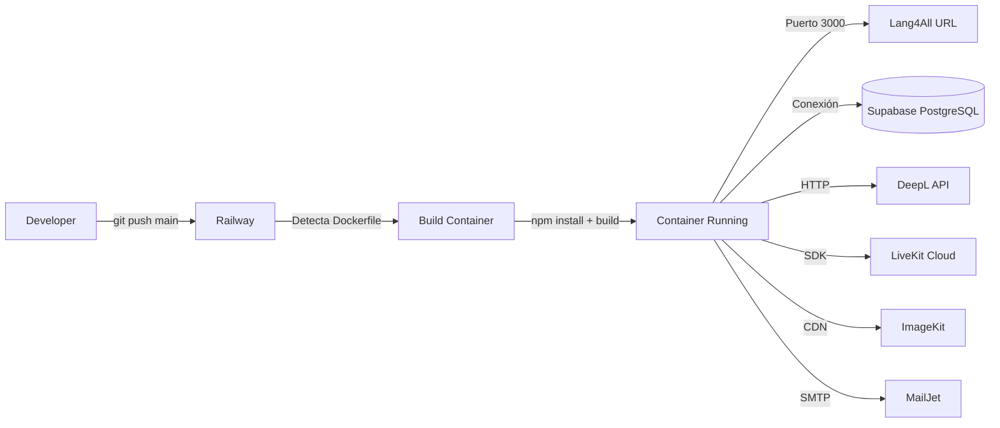

## Índice

0. [Ficha del proyecto](#0-ficha-del-proyecto)
1. [Descripción general del producto](#1-descripción-general-del-producto)
2. [Arquitectura del sistema](#2-arquitectura-del-sistema)
3. [Modelo de datos](#3-modelo-de-datos)
4. [Especificación de la API](#4-especificación-de-la-api)
5. [Historias de usuario](#5-historias-de-usuario)
6. [Tickets de trabajo](#6-tickets-de-trabajo)
7. [Pull requests](#7-pull-requests)

---

## 0. Ficha del proyecto

### **0.1. Tu nombre completo:** Eduardo Aguilar Tirado

### **0.2. Nombre del proyecto:** Lang4All

### **0.3. Descripción breve del proyecto:** Plataforma de aprendizaje de idiomas que conecta a estudiantes con hablantes nativos.

### **0.4. URL del proyecto:**

Por ahora no está desplegado.

### 0.5. URL o archivo comprimido del repositorio

https://github.com/edu-aguilar/Lang4All

---

## 1. Descripción general del producto

### **1.1. Objetivo:**

Lang4All es una plataforma web de intercambio de idiomas que conecta a estudiantes con hablantes nativos para mantener conversaciones reales y bidireccionales a través de chat, videollamada y herramientas de apoyo lingüístico integrado (traducción y corrección).

**Problema que resuelve:** Las apps tradicionales de idiomas (Duolingo, Babbel) enseñan vocabulario y gramática de forma teórica, pero no desarrollan fluidez conversacional real. Lang4All cierra esa brecha permitiendo practicar directamente con hablantes nativos desde el navegador, sin necesidad de descargar una app.

**Público objetivo:** Personas que están aprendiendo un idioma y quieren pasar del estudio teórico a la práctica conversacional real. Principalmente adultos jóvenes (18-35 años) interesados en conocer otras culturas mientras aprenden.

**Valor del producto:** Conecta el mundo a través de idiomas, eliminando barreras geográficas y culturales. El aprendizaje es bidireccional: cada usuario es tanto estudiante como profesor.

### **1.2. Características y funcionalidades principales:**

| #   | Funcionalidad                    | Descripción                                                                                      |
| --- | -------------------------------- | ------------------------------------------------------------------------------------------------ |
| F1  | Registro y onboarding            | Creación de cuenta con email/Google, selección de idioma nativo e idioma(s) a aprender.          |
| F2  | Perfil de usuario                | Foto, nombre, idiomas, nivel, intereses y breve descripción personal.                            |
| F3  | Búsqueda y filtros de compañeros | Buscar usuarios por idioma a aprender, idioma nativo e intereses.                                |
| F4  | Match y solicitud de conexión    | Enviar / recibir solicitudes de conexión para iniciar conversación.                              |
| F5  | Chat de texto en tiempo real     | Mensajería instantánea uno a uno con delivery y read receipts.                                   |
| F6  | Traducción integrada             | Botón "Traducir" en cada mensaje para ver su significado en el idioma del usuario.               |
| F7  | Corrección de mensajes           | El compañero puede marcar y corregir un mensaje; la corrección queda visible en la conversación. |
| F8  | Videollamada / Audiollamada      | Llamadas uno a uno desde el navegador mediante WebRTC (LiveKit).                                 |
| F9  | Notificaciones en tiempo real    | Notificaciones de nuevos mensajes, solicitudes de conexión y llamadas entrantes.                 |
| F10 | Reporte y bloqueo de usuarios    | Moderación básica: reportar y bloquear a un usuario.                                             |

### **1.3. Diseño y experiencia de usuario:**

El flujo principal del usuario es el siguiente:

1. **Landing page** → El visitante conoce la propuesta de valor y pulsa "Empezar".
2. **Registro** → Crea cuenta con email o Google, selecciona idioma nativo y target.
3. **Onboarding** → Completa perfil: foto (ImageKit), biografía, intereses, nivel de idioma (A1-C2 agrupado en Beginner/Standard/Advanced).
4. **Búsqueda** → Navega perfiles de compañeros filtrados por idioma e intereses.
5. **Conexión** → Envía solicitud de conexión; el otro usuario acepta o rechaza.
6. **Chat** → Mensajes en tiempo real (Supabase Realtime), con opciones de traducción (DeepL) y corrección de mensajes.
7. **Videollamada** → Llamada WebRTC uno a uno desde el chat (LiveKit), con opción de solo audio.

### **1.4. Instrucciones de instalación:**

**Requisitos previos:**

- Node.js >= 20
- Docker (opcional)
- Cuentas en: Supabase, DeepL, LiveKit, ImageKit, MailJet

---

## 2. Arquitectura del Sistema

### **2.1. Diagrama de arquitectura:**

La arquitectura sigue un patrón de **capas (layered architecture)** con separación clara entre Frontend, Backend y Capa de Datos, más integración con servicios externos gestionados.

**Nivel 1 — Contexto del Sistema:**


```mermaid
C4Context
    title Lang4All — Contexto del Sistema (Nivel 1)

    Person(user, "Usuario", "Estudiante de idiomas o hablante nativo que quiere practicar conversación real")

    System(lang4all, "Lang4All", "Plataforma web de intercambio de idiomas. Conecta estudiantes con hablantes nativos para práctica conversacional bidireccional.")

    System_Ext(deepl, "DeepL API", "Servicio de traducción de alta calidad")
    System_Ext(livekit, "LiveKit Cloud", "Plataforma de videollamadas WebRTC gestionada")
    System_Ext(imagekit, "ImageKit", "CDN y procesamiento de imágenes")
    System_Ext(mailjet, "MailJet", "Envío de emails transaccionales")
    System_Ext(supabase, "Supabase", "Backend-as-a-Service: PostgreSQL, Auth, Realtime")
    System_Ext(google, "Google OAuth", "Proveedor de autenticación social")

    Rel(user, lang4all, "Usa la plataforma diariamente")
    Rel(lang4all, supabase, "Almacena datos, autentica usuarios, realtime")
    Rel(lang4all, deepl, "Traduce mensajes bajo demanda")
    Rel(lang4all, livekit, "Gestiona videollamadas 1:1")
    Rel(lang4all, imagekit, "Almacena y procesa fotos de perfil")
    Rel(lang4all, mailjet, "Envía emails de verificación y notificaciones")
    Rel(lang4all, google, "Autentica usuarios vía OAuth")
```

**Nivel 2 — Contenedores:**

```mermaid
C4Container
    title Lang4All — Contenedores (Nivel 2)

    Person(user, "Usuario", "Estudiante de idiomas")

    Container_Boundary(frontend, "Frontend — React")
        Container(react_app, "React App", "React + Vite + TypeScript", "SPA que renderiza la interfaz: chat, perfiles, videollamada, búsqueda")

    Container_Boundary(backend, "Backend — Node.js")
        Container(express_api, "Express API", "Node.js + Express + TypeScript", "API REST que gestiona lógica de negocio: usuarios, conexiones, mensajes, traducciones, llamadas")

    Container_Boundary(data, "Capa de Datos — Supabase")
        ContainerDb(postgres, "PostgreSQL", "Supabase Database", "Almacena usuarios, mensajes, conexiones, idiomas, intereses, traducciones cache")
        Container(supabase_auth, "Supabase Auth", "GoTrue", "Gestiona registro, login, JWT, OAuth (Google)")
        Container(supabase_realtime, "Supabase Realtime", "WebSocket", "Canal de mensajes en tiempo real y notificaciones push del chat")

    Container_Boundary(external, "Servicios Externos")
        Container(livekit_cloud, "LiveKit Cloud", "WebRTC", "Servidor de videollamadas 1:1 con STUN/TURN gestionado")
        Container(deepl_api, "DeepL API", "REST", "Traducción de mensajes bajo demanda")
        Container(imagekit_cdn, "ImageKit", "CDN + Transform", "Almacenamiento, redimension y CDN de fotos de perfil")
        Container(mailjet_svc, "MailJet", "SMTP + API", "Envío de emails: verificación, recuperación de contraseña")

    Rel(user, react_app, "Interactúa vía navegador")
    Rel(react_app, express_api, "HTTP/JSON (REST)")
    Rel(react_app, supabase_auth, "SDK JS (Auth)")
    Rel(react_app, supabase_realtime, "WebSocket (Chat)")

    Rel(express_api, postgres, "Prisma ORM")
    Rel(express_api, deepl_api, "HTTP REST")
    Rel(express_api, livekit_cloud, "LiveKit Server SDK")
    Rel(express_api, imagekit_cdn, "Upload API")
    Rel(express_api, mailjet_svc, "HTTP API")

    Rel(supabase_auth, postgres, "Auth data (users table)")
    Rel(supabase_realtime, postgres, "CDC / Realtime subscriptions")
```

**Justificación de la arquitectura:**

- **Beneficios:** Separación clara de responsabilidades, escalabilidad independiente por capa, integración sencilla con servicios managed (Supabase, LiveKit, DeepL) que reducen infraestructura a gestionar.
- **Sacrificios:** Dependencia de múltiples proveedores externos. Si alguno cae,相应的功能queda afectada. Se mitiga con mensajes de error claros y la posibilidad de cambiar de proveedor en el futuro.

### **2.2. Descripción de componentes principales:**

**Nivel 3 — Componentes del Backend (Express API):**

```mermaid
C4Component
    title Lang4All — Componentes del Backend (Nivel 3)

    Container_Ext(react_app, "React App", "Frontend")
    ContainerDb_Ext(postgres, "PostgreSQL", "Base de datos")
    Container_Ext(deepl_api, "DeepL API", "Traducción")
    Container_Ext(livekit_cloud, "LiveKit Cloud", "Videollamadas")
    Container_Ext(supabase_auth, "Supabase Auth", "Autenticación")

    Component_Boundary(api_boundary, "Express API Server")
        Component(auth_middleware, "Auth Middleware", "JWT Verification", "Valida tokens de Supabase Auth y extrae usuario del request")
        Component(auth_routes, "Auth Routes", "POST /auth/register, /auth/login, /auth/google", "Registro con email, login, OAuth con Google")
        Component(user_routes, "User Routes", "GET /users/me, PUT /users/me, GET /users/search", "Perfil propio, edición, búsqueda de compañeros por idioma/intereses")
        Component(connection_routes, "Connection Routes", "POST /connections, PUT /connections/:id", "Enviar solicitud, aceptar, rechazar conexiones")
        Component(message_routes, "Message Routes", "POST /messages, GET /messages/:connectionId", "Enviar/recibir mensajes, correcciones de mensajes")
        Component(translation_routes, "Translation Routes", "POST /translations", "Proxy a DeepL API con cache en BD")
        Component(call_routes, "Call Routes", "POST /calls/token", "Genera tokens de LiveKit para videollamadas 1:1")
        Component(report_routes, "Report Routes", "POST /reports, POST /users/:id/block", "Reportar usuarios, bloquear, moderación")
        Component(ws_emitter, "Realtime Emitter", "Supabase Realtime Client", "Emite eventos de nuevos mensajes y notificaciones al canal WebSocket")

    Rel(react_app, auth_routes, "HTTP")
    Rel(react_app, user_routes, "HTTP")
    Rel(react_app, connection_routes, "HTTP")
    Rel(react_app, message_routes, "HTTP")
    Rel(react_app, translation_routes, "HTTP")
    Rel(react_app, call_routes, "HTTP")
    Rel(react_app, report_routes, "HTTP")

    Rel(auth_routes, supabase_auth, "SDK Auth")
    Rel(auth_routes, auth_middleware, "Valida JWT")
    Rel(user_routes, postgres, "Prisma Query")
    Rel(connection_routes, postgres, "Prisma Query")
    Rel(message_routes, postgres, "Prisma Query")
    Rel(message_routes, ws_emitter, "Emite evento new_message")
    Rel(translation_routes, deepl_api, "HTTP REST")
    Rel(translation_routes, postgres, "Cache check")
    Rel(call_routes, livekit_cloud, "Server SDK")
    Rel(report_routes, postgres, "Prisma Query")
```

**Stack tecnológico:**

| Capa            | Tecnología                     | Proveedor / Hosting  |
| --------------- | ------------------------------ | -------------------- |
| Frontend        | React + Vite + TypeScript      | Railway (Dockerfile) |
| Backend         | Node.js + Express + TypeScript | Railway (Dockerfile) |
| ORM             | Prisma                         | —                    |
| Base de datos   | PostgreSQL                     | Supabase (free tier) |
| Auth            | Supabase Auth (GoTrue)         | Supabase             |
| Realtime (chat) | Supabase Realtime              | Supabase             |
| Videollamadas   | LiveKit Cloud                  | LiveKit              |
| Traducción      | DeepL API                      | DeepL                |
| Imágenes        | ImageKit                       | ImageKit             |
| Email           | MailJet                        | MailJet              |
| Deploy          | Docker en Railway              | Railway              |
| Auth social     | Google OAuth                   | Google Cloud         |

### **2.3. Descripción de alto nivel del proyecto y estructura de ficheros:**

```
lang4all/
├── prisma/
│   ├── migrations/          # Migraciones de Prisma (historial de cambios en BD)
│   ├── schema.prisma        # Definición del modelo de datos
│   └── seed.ts              # Script de seeding (idiomas e intereses precargados)
├── src/
│   ├── config/              # Configuración de servicios externos (DeepL, LiveKit, ImageKit, MailJet)
│   ├── middleware/           # Middleware de autenticación (JWT), validación, errores
│   ├── routes/              # Definición de endpoints REST (auth, users, connections, messages, etc.)
│   ├── controllers/         # Lógica de negocio de cada endpoint
│   ├── services/            # Integración con servicios externos (DeepL, LiveKit, ImageKit, MailJet)
│   └── index.ts             # Punto de entrada del servidor Express
├── public/                  # Assets estáticos del frontend
├── docker/
│   └── Dockerfile           # Configuración de container para Railway
├── .env.example             # Plantilla de variables de entorno
├── lang4all-product-documentation.md  # Documentación completa del producto
└── README.md                # Este fichero
```

**Patrón:** Arquitectura en capas (layered) con separación en `routes → controllers → services`, siguiendo el patrón MVC adaptado a API REST.

### **2.4. Infraestructura y despliegue:**


```mermaid
flowchart LR
    A[Developer] -->|git push main| B[Railway]
    B -->|Detecta Dockerfile| C[Build Container]
    C -->|npm install + build| D[Container Running]
    D -->|Puerto 3000| E[Lang4All URL]
    D -->|Conexión| F[(Supabase PostgreSQL)]
    D -->|HTTP| G[DeepL API]
    D -->|SDK| H[LiveKit Cloud]
    D -->|CDN| I[ImageKit]
    D -->|SMTP| J[MailJet]
```

**Proceso de despliegue:**

1. El desarrollador hace `git push` a la rama `main`.
2. Railway detecta el `Dockerfile` y ejecuta el build.
3. Se instalan dependencias, se compila el proyecto y se levanta el contenedor.
4. La aplicación queda disponible en la URL asignada por Railway.
5. Las migraciones de Prisma se ejecutan manualmente o como script de pre-deploy.

### **2.5. Seguridad:**

| Práctica               | Implementación                                                                              |
| ---------------------- | ------------------------------------------------------------------------------------------- |
| **Autenticación**      | JWT gestionado por Supabase Auth. Tokens con expiración. OAuth con Google como alternativa. |
| **Contraseñas**        | Hash con bcrypt (cost factor ≥ 10). Mínimo 8 caracteres.                                    |
| **Transporte**         | HTTPS obligatorio en producción.                                                            |
| **XSS**                | Sanitización de entrada en todos los endpoints. Express helmet para headers de seguridad.   |
| **SQL Injection**      | Prisma ORM genera queries parametrizadas automáticamente.                                   |
| **CORS**               | Configurado para aceptar solo el dominio del frontend en producción.                        |
| **Row Level Security** | Supabase RLS configurado para que cada usuario solo acceda a sus propios datos.             |
| **Moderación**         | Sistema de reportes y bloqueo de usuarios.                                                  |

### **2.6. Tests:**

No se han generado tests aún.

---

## 3. Modelo de Datos

### **3.1. Diagrama del modelo de datos:**


```mermaid
erDiagram
    USERS ||--o{ USER_LANGES : "tiene idiomas"
    USERS ||--o{ USER_INTERESTS : "tiene intereses"
    USERS ||--o{ CONNECTIONS_REQ : "envía solicitud"
    USERS ||--o{ CONNECTIONS_REC : "recibe solicitud"
    USERS ||--o{ MESSAGES : "envía mensajes"
    USERS ||--o{ MSG_CORRECTIONS : "realiza correcciones"
    USERS ||--o{ REPORTS : "genera reportes"
    USERS ||--o{ BLOCKED_USERS : "bloquea usuarios"

    LANGUAGES ||--o{ USER_LANGES : "asociado a"
    INTERESTS ||--o{ USER_INTERESTS : "asociado a"

    CONNECTIONS ||--o{ MESSAGES : "contiene"
    MESSAGES ||--o{ MSG_CORRECTIONS : "tiene correcciones"

    USERS {
        uuid id PK "Supabase Auth UUID"
        string email UK "Email del usuario"
        string name "Nombre completo"
        string avatar_url "URL foto (ImageKit)"
        text bio "Biografía (max 500 chars)"
        enum proficiency_level "beginner | standard | advanced"
        boolean is_active "Cuenta activa"
        timestamp created_at "Fecha de registro"
        timestamp updated_at "Última actualización"
    }

    LANGUAGES {
        int id PK "Auto-increment"
        string code UK "ISO 639-1 (ej: es, en, de)"
        string name "Nombre en español (ej: Español)"
        string native_name "Nombre nativo (ej: Español)"
        boolean is_active "Visible en la plataforma"
    }

    USER_LANGES {
        uuid user_id FK "Referencia a users.id"
        int language_id FK "Referencia a languages.id"
        enum type "native | target"
    }

    INTERESTS {
        int id PK "Auto-increment"
        string name UK "Nombre del interés (ej: Música)"
        string icon "Emoji o class CSS"
        boolean is_active "Visible en la plataforma"
    }

    USER_INTERESTS {
        uuid user_id FK "Referencia a users.id"
        int interest_id FK "Referencia a interests.id"
    }

    CONNECTIONS {
        uuid id PK "UUID único"
        uuid requester_id FK "Usuario que envía la solicitud"
        uuid receiver_id FK "Usuario que recibe la solicitud"
        enum status "pending | accepted | rejected"
        text request_message "Mensaje opcional de presentación"
        timestamp created_at "Fecha de creación"
        timestamp updated_at "Fecha de última actualización"
    }

    MESSAGES {
        uuid id PK "UUID único"
        uuid connection_id FK "Referencia a connections.id"
        uuid sender_id FK "Usuario que envía el mensaje"
        text content "Contenido del mensaje"
        enum message_type "text | system"
        timestamp created_at "Fecha de envío"
        timestamp read_at "Fecha de lectura (NULL si no leído)"
    }

    MSG_CORRECTIONS {
        uuid id PK "UUID único"
        uuid message_id FK "Mensaje corregido"
        uuid corrector_id FK "Usuario que corrige"
        text corrected_text "Versión corregida del mensaje"
        text note "Nota explicativa opcional"
        timestamp created_at "Fecha de corrección"
        timestamp updated_at "Última actualización"
    }

    TRANSLATIONS {
        uuid id PK "UUID único"
        string source_text_hash UK "Hash SHA-256(source_text + source_lang + target_lang)"
        text source_text "Texto original"
        string source_language "Código idioma origen"
        string target_language "Código idioma destino"
        text translated_text "Texto traducido (DeepL)"
        timestamp created_at "Fecha de traducción"
        timestamp expires_at "Fecha de expiración (30 días)"
    }

    REPORTS {
        uuid id PK "UUID único"
        uuid reporter_id FK "Usuario que reporta"
        uuid reported_id FK "Usuario reportado"
        enum reason "inappropriate | spam | harassment | fake_profile | other"
        text description "Descripción del motivo"
        enum status "pending | reviewed | resolved"
        timestamp created_at "Fecha del reporte"
    }

    BLOCKED_USERS {
        uuid id PK "UUID único"
        uuid blocker_id FK "Usuario que bloquea"
        uuid blocked_id FK "Usuario bloqueado"
        timestamp created_at "Fecha del bloqueo"
    }
```

### **3.2. Descripción de entidades principales:**

| Tabla               | Atributos                                                                                                                                                                                            | PK / FK                                          | Restricciones                                                                              | Regla de negocio                                                                                             |
| ------------------- | ---------------------------------------------------------------------------------------------------------------------------------------------------------------------------------------------------- | ------------------------------------------------ | ------------------------------------------------------------------------------------------ | ------------------------------------------------------------------------------------------------------------ |
| **users**           | `id` (uuid), `email` (string), `name` (string), `avatar_url` (string), `bio` (text), `proficiency_level` (enum), `is_active` (boolean), `created_at` (timestamp), `updated_at` (timestamp)           | PK: `id`                                         | `email` UNIQUE, `is_active` NOT NULL DEFAULT true                                          | `id` sincronizado con Supabase Auth. Un usuario tiene 1 idioma nativo y N idiomas target.                    |
| **languages**       | `id` (int), `code` (string), `name` (string), `native_name` (string), `is_active` (boolean)                                                                                                          | PK: `id`                                         | `code` UNIQUE, `is_active` NOT NULL DEFAULT true                                           | Seed con ~30 idiomas comunes. El usuario solo selecciona de esta lista.                                      |
| **user_languages**  | `user_id` (uuid), `language_id` (int), `type` (enum: native/target)                                                                                                                                  | PK: compuesto (`user_id`, `language_id`, `type`) | FK → users, FK → languages                                                                 | Un usuario tiene exactamente 1 registro con `type=native` y N registros con `type=target`.                   |
| **interests**       | `id` (int), `name` (string), `icon` (string), `is_active` (boolean)                                                                                                                                  | PK: `id`                                         | `name` UNIQUE, `is_active` NOT NULL DEFAULT true                                           | Seed con ~15 intereses comunes.                                                                              |
| **user_interests**  | `user_id` (uuid), `interest_id` (int)                                                                                                                                                                | PK: compuesto (`user_id`, `interest_id`)         | FK → users, FK → interests                                                                 | Un usuario selecciona entre 1 y 5 intereses.                                                                 |
| **connections**     | `id` (uuid), `requester_id` (uuid), `receiver_id` (uuid), `status` (enum: pending/accepted/rejected), `request_message` (text), `created_at` (timestamp), `updated_at` (timestamp)                   | PK: `id`                                         | FK → users (×2), UNIQUE (`requester_id`, `receiver_id`), `status` NOT NULL DEFAULT pending | `requester_id ≠ receiver_id`. No pueden existir 2 conexiones entre los mismos usuarios.                      |
| **messages**        | `id` (uuid), `connection_id` (uuid), `sender_id` (uuid), `content` (text), `message_type` (enum: text/system), `created_at` (timestamp), `read_at` (timestamp)                                       | PK: `id`                                         | FK → connections, FK → users, `message_type` NOT NULL DEFAULT text                         | Solo se permite enviar mensajes si la conexión tiene `status=accepted`.                                      |
| **msg_corrections** | `id` (uuid), `message_id` (uuid), `corrector_id` (uuid), `corrected_text` (text), `note` (text), `created_at` (timestamp), `updated_at` (timestamp)                                                  | PK: `id`                                         | FK → messages, FK → users                                                                  | Un mensaje puede tener una sola corrección (la más reciente sobreescribe). Solo el compañero puede corregir. |
| **translations**    | `id` (uuid), `source_text_hash` (string), `source_text` (text), `source_language` (string), `target_language` (string), `translated_text` (text), `created_at` (timestamp), `expires_at` (timestamp) | PK: `id`                                         | `source_text_hash` UNIQUE                                                                  | Clave única = SHA-256(source_text + source_lang + target_lang). Expira a los 30 días.                        |
| **reports**         | `id` (uuid), `reporter_id` (uuid), `reported_id` (uuid), `reason` (enum), `description` (text), `status` (enum: pending/reviewed/resolved), `created_at` (timestamp)                                 | PK: `id`                                         | FK → users (×2), `status` NOT NULL DEFAULT pending                                         | Un usuario puede reportar a otro una sola vez por el mismo motivo.                                           |
| **blocked_users**   | `id` (uuid), `blocker_id` (uuid), `blocked_id` (uuid), `created_at` (timestamp)                                                                                                                      | PK: `id`                                         | FK → users (×2), UNIQUE (`blocker_id`, `blocked_id`)                                       | Un usuario bloqueado no puede enviar mensajes ni ver el perfil del bloqueador.                               |

**Índices recomendados:**

| Tabla            | Índice                        | Tipo      | Motivo                            |
| ---------------- | ----------------------------- | --------- | --------------------------------- |
| `users`          | `idx_users_email`             | UNIQUE    | Búsqueda rápida por email (login) |
| `user_languages` | `idx_user_lang_composite`     | COMPOSITE | Búsqueda de compañeros por idioma |
| `connections`    | `idx_conn_requester_receiver` | UNIQUE    | Evitar conexiones duplicadas      |
| `messages`       | `idx_messages_connection_id`  | INDEX     | Carga de historial de chat        |
| `messages`       | `idx_messages_created_at`     | INDEX     | Ordenación cronológica            |
| `translations`   | `idx_translations_hash`       | UNIQUE    | Lookup rápido de cache            |
| `reports`        | `idx_reports_status`          | INDEX     | Panel de moderación               |

---

## 4. Especificación de la API

> Si tu backend se comunica a través de API, describe los endpoints principales (máximo 3) en formato OpenAPI. Opcionalmente puedes añadir un ejemplo de petición y de respuesta para mayor claridad

---

## 5. Historias de Usuario

### **Historia de Usuario 1: Registro con selección de idiomas**

> **Como** visitante,
> **quiero** registrarme indicando mi idioma nativo y el idioma que quiero aprender,
> **para que** la plataforma pueda mostrarme compañeros compatibles desde el primer momento.

**Criterios de Aceptación:**

1. **Registro exitoso con email**
   - **Given** un visitante en la página de registro
   - **When** completa todos los campos (nombre, email, contraseña), selecciona su idioma nativo y al menos un idioma a aprender, y pulsa "Crear cuenta"
   - **Then** el sistema crea su cuenta, envía un email de verificación y redirige al dashboard con un mensaje de bienvenida

2. **Registro con Google OAuth**
   - **Given** un visitante en la página de registro
   - **When** pulsa "Continuar con Google" y autoriza los permisos
   - **Then** el sistema crea su cuenta con los datos de Google, le solicita seleccionar idioma nativo y target (modal), y al completar redirige al dashboard

3. **Validación de campos obligatorios**
   - **Given** un visitante en la página de registro
   - **When** intenta enviar el formulario sin completar el campo de idioma a aprender
   - **Then** el sistema muestra un mensaje de error "Debes seleccionar al menos un idioma que quieras aprender" y no crea la cuenta

4. **Email ya registrado**
   - **Given** un visitante con un email que ya existe en el sistema
   - **When** intenta registrarse con ese email
   - **Then** el sistema muestra un error "Este email ya está registrado. ¿Quieres iniciar sesión?" y no crea la cuenta

5. **Contraseña mínima de seguridad**
   - **Given** un visitante en la página de registro
   - **When** introduce una contraseña de menos de 8 caracteres
   - **Then** el botón "Crear cuenta" permanece deshabilitado y se muestra la indicación "Mínimo 8 caracteres"

6. **Email de verificación no enviado**
   - **Given** un usuario que acaba de completar el registro con email
   - **When** el servicio de email (MailJet) no responde o falla
   - **Then** el sistema muestra un aviso "No pudimos enviarte el email de verificación. Puedes reenviarlo desde tu perfil" y permite el acceso a la plataforma

7. **Selector de idiomas disponibles**
   - **Given** un visitante en la página de registro
   - **When** abre el selector de idioma nativo o idioma a aprender
   - **Then** solo puede elegir de la lista predefinida de idiomas soportados por la plataforma

---

### **Historia de Usuario 2: Enviar y recibir mensajes de texto en tiempo real**

> **Como** usuario conectado con un compañero,
> **quiero** enviar y recibir mensajes de texto en tiempo real,
> **para que** podamos mantener una conversación fluida y natural.

**Criterios de Aceptación:**

1. **Envío y recepción instantánea**
   - **Given** dos usuarios con una conexión activa y el chat abierto
   - **When** el Usuario A escribe un mensaje y pulsa "Enviar"
   - **Then** el mensaje aparece inmediatamente en la conversación del Usuario A con estado "✓" (enviado), y en menos de 500 ms aparece en la pantalla del Usuario B con estado "✓✓" (recibido)

2. **Indicador "escribiendo..."**
   - **Given** dos usuarios con una conexión activa y el chat abierto
   - **When** el Usuario A comienza a escribir en el campo de texto
   - **Then** el Usuario B ve un indicador "escribiendo..." en la conversación, que desaparece cuando el Usuario A deja de escribir por más de 3 segundos o envía el mensaje

3. **Mensaje vacío no permitido**
   - **Given** un usuario autenticado con el chat abierto
   - **When** intenta enviar un mensaje con solo espacios en blanco
   - **Then** el botón "Enviar" permanece deshabilitado y no se envía ningún mensaje

4. **Longitud máxima del mensaje**
   - **Given** un usuario escribiendo un mensaje en el chat
   - **When** el texto supera los 2,000 caracteres
   - **Then** el campo de texto no permite escribir más y se muestra un contador "X/2000"

5. **Caracteres especiales y emoji**
   - **Given** un usuario escribiendo un mensaje en el chat
   - **When** incluye emoji, acentos o caracteres especiales (UTF-8 completo)
   - **Then** el sistema los envía y muestra correctamente en ambos lados de la conversación

6. **Historial de mensajes con scroll**
   - **Given** dos usuarios con una conexión activa y una conversación con más de 50 mensajes
   - **When** uno de ellos abre el chat
   - **Then** se muestran los últimos 50 mensajes; al hacer scroll hacia arriba se cargan los 50 siguientes de forma progresiva

7. **Error de red al enviar mensaje**
   - **Given** un usuario enviando un mensaje
   - **When** la conexión de red falla durante el envío
   - **Then** el sistema muestra un icono de error junto al mensaje y un botón "Reintentar"; reintenta automáticamente una vez al recuperar la conexión

8. **Mensaje offline en cola**
   - **Given** un usuario sin conexión a internet
   - **When** escribe y pulsa "Enviar"
   - **Then** el mensaje se guarda localmente con estado "Pendiente" y se envía automáticamente cuando se recupere la conexión

---

### **Historia de Usuario 3: Iniciar y recibir videollamada / audiollamada**

> **Como** usuario que quiere practicar su pronunciación,
> **quiero** iniciar una videollamada o audiollamada con mi compañero,
> **para que** pueda tener una conversación oral en tiempo real directamente desde el navegador.

**Criterios de Aceptación:**

1. **Inicio de videollamada**
   - **Given** dos usuarios con una conexión activa y el chat abierto
   - **When** el Usuario A pulsa el icono de "Videollamada"
   - **Then** el sistema solicita permiso de cámara y micrófono al Usuario A, envía una notificación de llamada entrante al Usuario B, y cuando el Usuario B acepta, se establece la conexión WebRTC con video bidireccional

2. **Degradación a solo audio**
   - **Given** una videollamada activa entre dos usuarios
   - **When** la conexión detecta un ancho de banda insuficiente (tasa de frames < 10 FPS durante 5 segundos)
   - **Then** el sistema desactiva automáticamente el video de ambos lados y muestra el mensaje "Se desactivó el video por calidad de conexión" con la opción de reactivar manualmente

3. **Finalización de llamada**
   - **Given** una videollamada o audiollamada activa
   - **When** cualquiera de los dos usuarios pulsa "Colgar"
   - **Then** la llamada termina para ambos, la UI vuelve al chat y se muestra un mensaje del sistema "Llamada finalizada — duración: XX:XX"

4. **Permiso de cámara/micrófono denegado**
   - **Given** un usuario que intenta iniciar una videollamada
   - **When** declina o bloquea el permiso de cámara o micrófono en el navegador
   - **Then** el sistema muestra un modal con instrucciones "Para usar videollamadas, habilita el acceso a cámara y micrófono en la configuración de tu navegador" y ofrece iniciar llamada de solo audio

5. **Usuario en otra llamada**
   - **Given** un usuario A que intenta iniciar una videollamada con el usuario B
   - **When** el usuario B ya está en una llamada con otro usuario
   - **Then** el sistema muestra un aviso "Este usuario está en otra llamada. Inténtalo más tarde"

6. **Duración sin límite**
   - **Given** dos usuarios en una videollamada activa
   - **When** la llamada supera cualquier duración
   - **Then** la llamada continúa sin interrupción (no hay límite de duración en MVP)

7. **Opción de llamada de solo audio**
   - **Given** un usuario que inicia una llamada con su compañero
   - **When** antes de unirse a la videollamada, elige la opción "Solo audio"
   - **Then** se establece una llamada de solo audio (sin video) entre ambos usuarios

8. **Servicio de videollamadas no disponible**
   - **Given** un usuario que intenta iniciar una videollamada
   - **When** LiveKit Cloud no responde o está caído
   - **Then** el sistema muestra "Servicio de videollamadas no disponible temporalmente. Inténtalo más tarde"

---

## 6. Tickets de Trabajo

> Documenta 3 de los tickets de trabajo principales del desarrollo, uno de backend, uno de frontend, y uno de bases de datos. Da todo el detalle requerido para desarrollar la tarea de inicio a fin teniendo en cuenta las buenas prácticas al respecto.

**Ticket 1**

**Ticket 2**

**Ticket 3**

---

## 7. Pull Requests

> Documenta 3 de las Pull Requests realizadas durante la ejecución del proyecto

**Pull Request 1**

**Pull Request 2**

**Pull Request 3**
