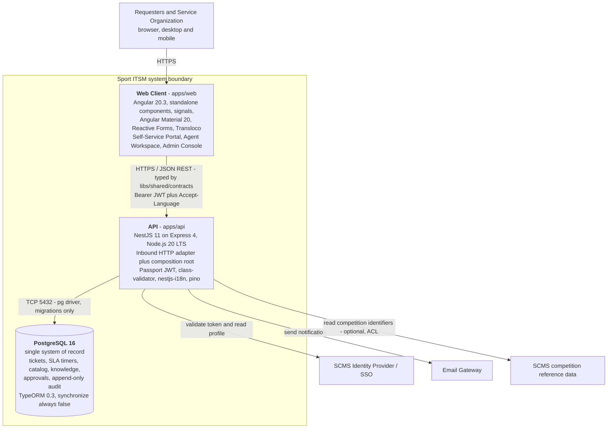
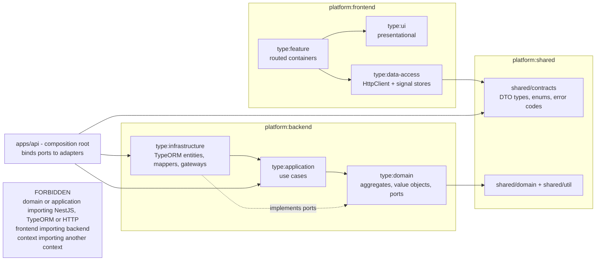
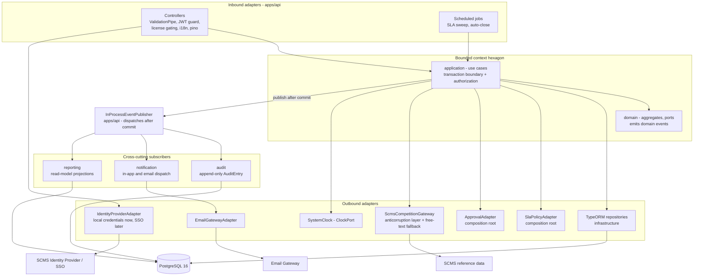

## Índice

0. [Ficha del proyecto](#0-ficha-del-proyecto)
1. [Descripción general del producto](#1-descripción-general-del-producto)
2. [Arquitectura del sistema](#2-arquitectura-del-sistema)
3. [Modelo de datos](#3-modelo-de-datos)
4. [Especificación de la API](#4-especificación-de-la-api)
5. [Historias de usuario](#5-historias-de-usuario)
6. [Tickets de trabajo](#6-tickets-de-trabajo)
7. [Pull requests](#7-pull-requests)

---

## 0. Ficha del proyecto

### **0.1. Tu nombre completo:**

Iván Gómez Rodríguez

### **0.2. Nombre del proyecto:**

Sport IT Service Management

### **0.3. Descripción breve del proyecto:**

Sport ITSM is an IT Service Management platform dedicated to supporting the Sports Competition Management System. It provides a centralized environment for managing incidents, service requests, problems, changes, releases, assets, and operational processes related to the competition platform, ensuring service availability, traceability, and continuous improvement throughout the application lifecycle.

```text
Sports Competition Management System (SCMS)
                 │
                 │ Support & Operations
                 ▼
             Sport ITSM
                 │
      ┌──────────┼──────────┐
      │          │          │
      ├── Incident Management
      ├── Service Request Management
      ├── Problem Management
      ├── Change Management
      ├── Release Management
      ├── Knowledge Base
      ├── Asset & Configuration Management
      └── SLA & Reporting
```

### **0.4. URL del proyecto:**

> Puede ser pública o privada, en cuyo caso deberás compartir los accesos de manera segura. Puedes enviarlos a [alvaro@lidr.co](mailto:alvaro@lidr.co) usando algún servicio como [onetimesecret](https://onetimesecret.com/).

### 0.5. URL o archivo comprimido del repositorio

> Puedes tenerlo alojado en público o en privado, en cuyo caso deberás compartir los accesos de manera segura. Puedes enviarlos a [alvaro@lidr.co](mailto:alvaro@lidr.co) usando algún servicio como [onetimesecret](https://onetimesecret.com/). También puedes compartir por correo un archivo zip con el contenido

---

## 1. Descripción general del producto

> Describe en detalle los siguientes aspectos del producto:

### **1.1. Objetivo:**

> Propósito del producto. Qué valor aporta, qué soluciona, y para quién.

**Product purpose**

The product is **Sport ITSM**, a full **IT Service Management (ITSM) platform** dedicated to supporting the **Sports Competition Management System (SCMS)** — an application for managing competitions (tournaments, leagues, and group/division formats). It provides a centralized environment to manage **Incidents, Service Requests, Problems, Changes, Releases, Assets, and operational processes** related to the SCMS platform, ensuring **service availability, traceability, and continuous improvement** across the application lifecycle. The Service Desk acts as the **Single Point of Contact (SPOC)** for the platform's users — players, team managers, tournament organizers, and match officials — while the engineering and operations organization uses the platform to govern platform Changes, Releases, and Assets, all under Service Level Agreements (SLAs).

> **Scope:** Sport ITSM supports the _SCMS platform_, not the sporting operation itself. In-application sport decisions (reschedules, roster changes, result disputes) are made by organizers and officials **inside** SCMS and are out of scope; they reach Sport ITSM only when they surface as a platform defect or an entitled service request. Competition entities (Tournament, Match, Standings…) are therefore the **affected subject** of a ticket, never tickets in their own right. Conversely, **Changes and Releases of the SCMS platform itself** (new versions, features, configuration, hotfixes) are fully **in scope** and governed by the platform.

**Problem it solves**

Competition platforms concentrate user demand into critical live windows — registration deadlines, match days, and finals — when any application failure (standings not updating, brackets not rendering, scores not saving, payments not processed) directly disrupts an event in progress, and when uncontrolled platform changes can trigger those very failures. Without a structured service management function, issues arrive through fragmented channels with no consistent ticket lifecycle, no prioritization of competition-impacting failures, no controlled path for platform changes and releases, and no measurable SLA accountability. Sport ITSM replaces this with a **standardized, auditable, and metric-driven service operation** — spanning support (Incident, Request, Problem) and platform evolution (Change, Release, Asset & Configuration) — that protects service availability when it matters most, aligned with ITIL-based practices.

**Value delivered**

- **Operational consistency:** every interaction follows a controlled lifecycle (logging → categorization → prioritization → assignment → resolution → closure).
- **Event protection:** Major Incident handling and tiered escalation prioritize failures during live competition windows (match days / finals) to minimize time-to-restore.
- **Controlled platform evolution:** Change Management and Release & Deployment Management deliver SCMS changes with risk assessment, approval, and CMDB impact analysis, reducing change-induced Incidents.
- **Accountability:** SLA timers, escalation rules, and audit trails make response and resolution commitments measurable and enforceable.
- **Efficiency:** automated categorization, assignment, and Knowledge-Base self-service deflection reduce manual effort and Mean Time to Resolution (MTTR).
- **Experience:** a Self-Service Portal gives players, organizers, and officials transparency over their tickets and status.
- **Traceability & decision support:** an end-to-end audit trail plus real-time KPIs and dashboards (FCR, MTTR, SLA Compliance, Change Success Rate, CSAT, backlog) drive continual service improvement.

**Target audience (personas)**

- **Player / Competitor:** end user reporting application issues or requesting account services.
- **Team Manager / Captain:** raises team-level support for a team's participation.
- **Tournament Organizer / Admin:** power user configuring competitions; higher entitlement tier.
- **Referee / Match Official:** reports scoring and result-entry issues.
- **League Administrator:** oversees multiple competitions; acts as escalation contact.
- **Service Desk Agent (L1):** first-line operator who logs, triages, and resolves or routes tickets.
- **Application Support Analyst (L2/L3):** platform specialists / engineering resolver group handling escalated work.
- **Change / Release Manager:** governs platform Changes and coordinates SCMS Releases and deployments.
- **Service Owner / Service Manager:** accountable for SCMS service quality, SLAs, and continuous improvement.
- **System Administrator:** configures catalog, workflows, SLAs, CMDB, and access control.

### **1.2. Características y funcionalidades principales:**

> Enumera y describe las características y funcionalidades específicas que tiene el producto para satisfacer las necesidades identificadas.

Sport ITSM delivers the following core capabilities, spanning end-user support and platform operations for the SCMS platform:

**1. Ticket Management (Incident & Service Request)** End-to-end ticket lifecycle management with categorization, prioritization (Impact × Urgency → Priority matrix), status tracking, work notes, and closure codes. Handles **Incidents** (platform defects — e.g., standings not updating, bracket not rendering, scores not saving) and **Service Request** fulfillment as distinct but unified workflows. Each ticket records the **affected competition subject** (Tournament, League, Group, Bracket, Fixture, Standings, Registration, Roster, Team, Player Account) without treating it as the ticket itself.

**2. Omnichannel Intake** Capture of tickets from multiple channels — Self-Service Portal, email-to-ticket, in-app help, and phone-logged entries — normalized into a single ticket model with a unique reference number.

**3. Self-Service Portal & Knowledge Base** End-user portal for players, organizers, and officials to submit tickets, track status, and search Knowledge Articles (how-tos, known issues, workarounds). Knowledge-centered deflection reduces ticket volume and improves First Contact Resolution (FCR).

**4. Service Catalog Management** A structured catalog of platform-support Service Offerings with request forms, eligibility rules, and predefined fulfillment workflows — e.g., account creation, role/entitlement and organizer-access provisioning, password reset / account recovery, data export (fixtures, standings, rosters, results), and billing/registration-payment support.

**5. Workflow & Automation Engine** Configurable business rules for automated categorization, routing, and assignment to the correct Resolver Group or Assignment Queue, including skill-based and round-robin assignment and task orchestration.

**6. SLA Management & Escalation** Definition of SLA/OLA targets (response and resolution) per service and priority, with **event-aware policies** that tighten targets during live competition windows (match days / finals). Automated SLA timers, breach warnings, and tiered (functional and hierarchical) escalation enforce service commitments.

**7. Major Incident Management** Dedicated handling for high-impact failures that disrupt an event in progress (e.g., a scoring outage on finals day), with accelerated escalation, coordinated resolver engagement, and stakeholder communication to minimize time-to-restore.

**8. Assignment & Queue Management** Support groups, queues, and workload distribution that route tickets to the appropriate team and provide agents with prioritized work lists.

**9. Problem Management** Linking of recurring Incidents to a Problem record, Root Cause Analysis (RCA), Known Error (KEDB) tracking, and Workaround publication to reduce repeat platform Incidents.

**10. Change Management** Controlled lifecycle for modifications to the SCMS platform (standard, normal, and emergency changes) with risk and impact assessment, CAB-style approval via the Approval Engine, scheduling around competition windows, and change calendars to avoid conflicts with live events.

**11. Release & Deployment Management** Planning, packaging, and coordinated deployment of SCMS versions, with release calendars, rollout/rollback plans, and linkage of releases to the Changes and Configuration Items they deliver.

**12. Asset & Configuration Management (CMDB)** A Configuration Management Database tracking the SCMS platform's Configuration Items (services, environments, components) and their relationships, enabling impact analysis for Incidents, Problems, Changes, and Releases.

**13. Notification Framework** Event-driven notifications (email, push, in-app) to requesters and agents on status changes, assignments, approvals, and SLA breaches, integrated with the platform's participant notification channels.

**14. Approval Engine** Configurable multi-level approval workflows for entitled Service Requests and for Changes/Releases (e.g., organizer-access provisioning, change authorization), with delegation and audit trails.

**15. Reporting, Dashboards & Analytics** Operational and management dashboards exposing key KPIs — FCR, MTTR, MTTA, SLA Compliance Rate, Reopen Rate, Backlog Volume, CSAT, Agent Productivity — plus domain metrics such as time-to-restore for competition-impacting Incidents, Major Incident rate during live windows, Change Success Rate, and release lead time.

**16. Identity & Access Management (RBAC)** Role-based access control aligned with platform personas (Player, Team Manager, Organizer, Official, Agent, Analyst, Change/Release Manager, Service Manager, Administrator), integrated with the platform's identity provider / SSO and enforcing least-privilege access.

**17. Audit Trail & Activity History** Immutable history of all ticket, change, and release transitions, field changes, and user actions to guarantee traceability and compliance across the SCMS application lifecycle.

### **1.3. Diseño y experiencia de usuario:**

> Proporciona imágenes y/o videotutorial mostrando la experiencia del usuario desde que aterriza en la aplicación, pasando por todas las funcionalidades principales.

### **1.4. Instrucciones de instalación:**

> Documenta de manera precisa las instrucciones para instalar y poner en marcha el proyecto en local (librerías, backend, frontend, servidor, base de datos, migraciones y semillas de datos, etc.)

---

## 2. Arquitectura del Sistema

### **2.1. Diagrama de arquitectura:**

> Usa el formato que consideres más adecuado para representar los componentes principales de la aplicación y las tecnologías utilizadas. Explica si sigue algún patrón predefinido, justifica por qué se ha elegido esta arquitectura, y destaca los beneficios principales que aportan al proyecto y justifican su uso, así como sacrificios o déficits que implica.

Sport ITSM is a **modular monolith** built as a single **Nx monorepo** that applies **Domain-Driven Design** (strategic and tactical) and **Hexagonal Architecture (Ports & Adapters)** across both platforms. The diagrams below go from the general to the concrete. The full architecture document — C4 context, context map, tactical model, end-to-end sequences and ADRs — lives in [`docs/ARCHITECTURE.md`](docs/ARCHITECTURE.md).

#### Containers and technologies


```mermaid
flowchart TB
    USER["Requesters and Service Organization<br/>browser, desktop and mobile"]

    subgraph boundary["Sport ITSM system boundary"]
        WEB["<b>Web Client</b> - apps/web<br/>Angular 20.3, standalone components, signals,<br/>Angular Material 20, Reactive Forms, Transloco<br/>Self-Service Portal, Agent Workspace, Admin Console"]
        API["<b>API</b> - apps/api<br/>NestJS 11 on Express 4, Node.js 20 LTS<br/>Inbound HTTP adapter plus composition root<br/>Passport JWT, class-validator, nestjs-i18n, pino"]
        DB[("<b>PostgreSQL 16</b><br/>single system of record<br/>tickets, SLA timers, catalog, knowledge,<br/>approvals, append-only audit<br/>TypeORM 0.3, synchronize always false")]
    end

    IDP["SCMS Identity Provider / SSO"]
    MAIL["Email Gateway"]
    SCMS["SCMS competition reference data"]

    USER -->|"HTTPS"| WEB
    WEB -->|"HTTPS / JSON REST - typed by libs/shared/contracts<br/>Bearer JWT plus Accept-Language"| API
    API -->|"TCP 5432 - pg driver, migrations only"| DB
    API -->|"validate token and read profile"| IDP
    API -->|"send notification"| MAIL
    API -->|"read competition identifiers - optional, ACL"| SCMS
```

There is deliberately **no message broker, no cache tier and no separate reporting store**: one API process, one database, one client.

#### Layering and the dependency rule

Every bounded context (`incident`, `service-request`, `sla`, `service-catalog`, `knowledge`, `identity-access`, …) is materialized as a set of Nx libraries tagged on three axes — `platform:` / `scope:` / `type:` — and `@nx/enforce-module-boundaries` makes the rule below **mechanical rather than aspirational**.


```mermaid
flowchart LR
    subgraph FE["platform:frontend"]
        F_FEAT["type:feature<br/>routed containers"]
        F_UI["type:ui<br/>presentational"]
        F_DA["type:data-access<br/>HttpClient + signal stores"]
    end

    subgraph SH["platform:shared"]
        CONTRACTS["shared/contracts<br/>DTO types, enums, error codes"]
        SDOM["shared/domain + shared/util"]
    end

    subgraph BE["platform:backend"]
        B_INFRA["type:infrastructure<br/>TypeORM entities, mappers, gateways"]
        B_APP["type:application<br/>use cases"]
        B_DOM["type:domain<br/>aggregates, value objects, ports"]
    end

    APP_API["apps/api - composition root<br/>binds ports to adapters"]

    F_FEAT --> F_UI
    F_FEAT --> F_DA
    F_DA --> CONTRACTS
    B_INFRA --> B_APP
    B_APP --> B_DOM
    B_DOM --> SDOM
    B_INFRA -.->|"implements ports"| B_DOM
    APP_API --> B_INFRA
    APP_API --> B_APP
    APP_API --> CONTRACTS

    FORBIDDEN["FORBIDDEN<br/>domain or application importing NestJS, TypeORM or HTTP<br/>frontend importing backend<br/>context importing another context"]
```

Dependencies point **inward only**: `infrastructure → application → domain`, never the reverse. Domain and application layers contain zero framework, ORM, HTTP or I/O code. Cross-context collaboration (e.g. Incident needing SLA, Approval, Notification or Audit) never becomes an import: the consuming context declares an outbound **port** in its own language and `apps/api` supplies the adapter, so no context-to-context edge ever exists in the Nx graph.

#### Patterns applied and why

| Pattern | Where it applies | Why it was chosen |
| --- | --- | --- |
| **Domain-Driven Design** | One bounded context per ITSM capability | ITSM is a domain with a precise, standardized ubiquitous language (Incident, Problem, Change, SLA, CI, CAB). Modeling it explicitly is what keeps _"a match reschedule is not a ticket"_ enforceable instead of a convention. |
| **Hexagonal (Ports & Adapters)** | Backend, per context | The business rules that matter (Impact × Urgency → Priority, SLA target recalculation, lifecycle transitions) are testable with zero infrastructure, and PostgreSQL/TypeORM/NestJS become replaceable details. |
| **Modular monolith** | Whole system | Fifteen contexts could suggest microservices; delivery is portfolio-scale. One process gives single-transaction consistency and near-zero operational cost, while the Nx boundaries preserve the option to extract a context later. |
| **Nx monorepo + tag boundaries** | Whole system | The architecture is enforced by `pnpm nx lint` in CI, not by review discipline. An illegal dependency fails the build. |
| **Shared typed contracts** | `libs/shared/contracts` | The single permitted coupling between frontend and backend. A breaking API change fails the frontend build immediately — the intended safety property. |
| **Signals-first Angular** | Frontend | Standalone components, `OnPush` everywhere, functional interceptors and signal stores; no NgModules, no external state library. |
| **Event-driven cross-cutting** | Audit, Notification, Reporting | Mutating operations commit first and publish domain events after; a notification outage can never block ticket intake. |

#### Benefits

- **Testability.** Business rules live in framework-free TypeScript. The most valuable tests need no database, no HTTP and no Angular TestBed.
- **Enforced boundaries.** Architectural erosion is caught by the linter, which matters most on a long-lived platform with many capabilities.
- **Evolvability.** Adding `problem`, `change` or `release` in phase 2 is additive: the Incident aggregate already reserves link semantics for them as opaque identifiers.
- **Coherence FE/BE.** One repository, one TypeScript version, one lint/format setup, `nx affected` for changed-only CI, and types that cannot drift between client and server.
- **Replaceable infrastructure.** ORM, identity provider or email gateway are adapters behind ports; swapping one does not touch business logic.

#### Sacrifices and deficits

Honest accounting of what this architecture costs:

- **Ceremony.** A trivial CRUD feature still needs a port, an adapter, a use case, a DTO, a mapper and a contract type. For a small product this is over-engineering; it pays off only because the ITSM domain is genuinely large.
- **Mapping code.** Domain aggregates and TypeORM entities are separate types, so mappers must be written and maintained.
- **A composition root that grows.** Every cross-context collaboration adds one adapter class in `apps/api`. Coupling is not eliminated — it is concentrated in a visible, reviewable place.
- **Single deployable.** Contexts cannot be scaled or released independently; the whole API deploys together, and a defect in one context can affect the process.
- **Eventual consistency in the cross-cutting path.** Audit and notification writes sit outside the ticket transaction. Mitigated with an in-process dispatcher with retry and audit-completeness assertions in acceptance tests, but it is a real trade-off against strict transactional auditing.
- **Learning curve.** DDD + hexagonal + Nx tags is a steep onboarding cost, and the discipline degrades quickly if boundary violations are silenced instead of fixed.

> **Status:** this is the **target architecture**. The Nx workspace (`apps/`, `libs/`) has not been scaffolded yet, so the boundary rules above have not been verified with `pnpm nx lint` / `pnpm nx graph`.

### **2.2. Descripción de componentes principales:**

> Describe los componentes más importantes, incluyendo la tecnología utilizada

The system is composed of two deployables — the Angular **Web Client** and the NestJS **API** — plus one PostgreSQL system of record. Everything else is an Nx library: each bounded context contributes a **backend hexagon** (`domain` / `application` / `infrastructure`) and, where it has a UI, a **frontend slice** (`feature` / `ui` / `data-access`). The components below are described by responsibility and technology; their allowed dependencies are the ones already shown in §2.1.

#### 2.2.1 Web Client — `apps/web`

The client is an **Angular 20.3** application: standalone components only, signals for state, `OnPush` everywhere, Reactive Forms, Angular Material 20 + CDK, Transloco for i18n. It is a **pure presentation layer**: it holds no authorization decision, derives no Priority and computes no SLA target — it renders what the API decided (NFR-SEC-02).

| Component | Responsibility | Technology |
| --- | --- | --- |
| **Application shell** (`apps/web`) | Bootstrap via `bootstrapApplication` + `provide*` functions, lazy routing, global error handler, theming, cross-context page composition | Angular 20.3, `provideRouter`, `provideHttpClient`, Angular Material theming (SCSS) |
| **Self-Service Portal** | Requester surface: knowledge search first, log an Incident, request a published catalog offering, track own tickets and SLA status, comment, confirm or reject a resolution, submit CSAT | `knowledge/feature`, `incident/feature`, `service-catalog/feature`, `service-request/feature`, `approval/feature` |
| **Agent Workspace** | Supply-side surface: prioritized work list, triage, categorization, the competition-in-progress flag with mandatory justification, work notes, assignment, resolution | `incident/feature`, `service-request/feature`, `knowledge/feature`, SLA countdown rendered by `incident/ui` |
| **Admin Console** | Configuration-as-data surface: taxonomy, Impact × Urgency matrix, SLA policies, catalog offerings, workflows, notification templates, roles and resolver groups | `service-catalog/feature`, `identity-access/feature` + configuration feature libs |
| **Management dashboards** | Operational and management KPI views (FCR, MTTA, MTTR, SLA compliance, backlog) | `reporting/feature` + `reporting/ui` |
| **`type:feature` libs** | Routed containers: orchestrate the store, drive Reactive Forms, own explicit loading / error / empty states | Angular standalone components, signals, Reactive Forms |
| **`type:ui` libs** | Presentational building blocks with zero injected services (`PriorityBadge`, `SlaCountdown`, `StateChip`, `WorkNoteList`, `CompetitionSubjectPicker`) | Angular `input()` / `output()`, `OnPush`, Material + CDK a11y (`FocusTrap`, `LiveAnnouncer`) for WCAG 2.1 AA |
| **`type:data-access` libs** | The **only** outbound edge of the client: typed API services plus injectable signal stores exposing `asReadonly()` / `computed()` | `HttpClient` typed exclusively by `libs/shared/contracts`, Angular signals (no NgRx) |
| **Functional interceptors** | `jwtInterceptor` (Bearer token), `localeInterceptor` (`Accept-Language`), `httpErrorInterceptor` (contract error code → Transloco key) | Angular functional interceptors (`withInterceptors`), Transloco |
| **Route guards** | `authGuard` / `roleGuard` — usability only; never the security boundary | Angular functional guards |

#### 2.2.2 API — `apps/api`

`apps/api` is simultaneously the **inbound HTTP adapter** and the **composition root**: it is the only project allowed to see more than one bounded context, because it is where ports are bound to adapters (ADR-002, ADR-003).

| Component | Responsibility | Technology |
| --- | --- | --- |
| **Controllers** | Thin inbound adapter: route, validate, delegate to a use case, map the result to a contract response. No business logic. | NestJS 11 on Express 4, `@nestjs/swagger` decorators |
| **Global `ValidationPipe`** | Reject unvalidated or unexpected payloads (`whitelist`, `forbidNonWhitelisted`, `transform`) | `class-validator` + `class-transformer` |
| **Auth guards & strategy** | Verify the JWT, resolve the actor and their roles for the use-case authorization check | Passport JWT (`passport-jwt`, `@nestjs/jwt`), `bcrypt` for local credentials |
| **License gating** | `@LicenseFeature()` decorator restricting access to gated capabilities | Custom NestJS decorator + guard |
| **Exception filter** | Map domain errors to a stable, contract-declared error-code envelope (codes are contract, text is not) | NestJS exception filter + `nestjs-i18n` |
| **i18n** | Localize API messages and email templates from `Accept-Language` | `nestjs-i18n` 10 |
| **Logging** | Structured logs with request correlation; no `console.log` | `nestjs-pino` |
| **Health probes** | `/health/live`, `/health/ready` — unprefixed, so Sport ITSM outages are detectable independently of user reports (NFR-CFG-03) | `@nestjs/terminus` |
| **API documentation** | OpenAPI at `/api/docs`, **development only** | `@nestjs/swagger` |
| **Composition root modules** | Bind each port token to its adapter (`{ provide: INCIDENT_REPOSITORY, useClass: TypeOrmIncidentRepository }`), and host the **cross-context adapters** (`SlaPolicyAdapter`, `ApprovalAdapter`, `NotificationAdapter`, `AuditAdapter`) | NestJS DI, `Symbol` injection tokens declared beside each port |
| **Scheduled jobs** | Second inbound adapter: SLA warning/breach sweep and auto-close after the confirmation period | NestJS scheduling over the same application use cases |

#### 2.2.3 Bounded-context libraries

Each context owns its hexagon. Phase 1 scaffolds the MVP contexts; `problem`, `change`, `release` and `asset-config` are **phase 2** (PRD §14.4) and are deliberately not generated yet.

| Context | Phase | Core responsibility | Key model elements |
| --- | --- | --- | --- |
| `incident` | 1 | Incident and Major Incident lifecycle, Impact × Urgency prioritization, agent-set competition-impact flag, work notes, escalation | `Incident` (root), `TicketReference`, `Priority`, `CompetitionImpactFlag`, `CompetitionSubject`, `PriorityCalculator` |
| `service-request` | 1 | Fulfillment of entitled catalog offerings, approval routing, fulfillment tasks | `ServiceRequest` (root) with `FulfillmentTask` entities |
| `sla` | 1 | SLA policy resolution, timer state, pause/resume, warnings, breaches, recalculation on Priority change | `SlaPolicy`, `SlaInstance`; no UI of its own — surfaced inside ticket views |
| `service-catalog` | 1 | Services and Service Offerings, request forms, eligibility rules, publication lifecycle | `Service`, `ServiceOffering` |
| `knowledge` | 1 | Knowledge Articles, authoring lifecycle, audience visibility, full-text search | `KnowledgeArticle` |
| `identity-access` | 0/1 | Authentication, RBAC, least privilege, resolver groups and queues | `User`, `Role`, `ResolverGroup`, `IdentityProviderPort` |
| `approval` | 1 | Configurable approval stages, resolvable approvers, immutable decisions | `ApprovalRequest`, `ApprovalDecision` |
| `notification` | 1 | Event-driven dispatch to requesters, agents, approvers and Major Incident stakeholders | `NotificationDispatch` + templates |
| `audit` | 0 | Append-only activity history; no update or delete capability exists at all | `AuditEntry` |
| `reporting` | 1 | Denormalized read models for operational and management dashboards | read models only, no aggregate |
| `problem`, `change`, `release`, `asset-config` | 2 | RCA/KEDB, change authorization and scheduling, release & deployment, CMDB impact analysis | `Problem`/`KnownError`, `Change`, `Release`, `ConfigurationItem`/`CiRelationship` |

Inside every context the three backend libraries have fixed roles, and the technology allowed in each is what the boundary rules enforce:

| Library | Responsibility | Technology allowed |
| --- | --- | --- |
| `<context>/domain` | Aggregates, entities, value objects, domain services, domain events and **outbound port interfaces** | **Pure TypeScript 5.9 only** — no NestJS, no TypeORM, no HTTP, not even `new Date()` (time arrives through `ClockPort`) |
| `<context>/application` | Use cases: orchestration, transaction boundary and the authorization check expressed in domain terms | TypeScript + `libs/shared/contracts` (types only); still no framework |
| `<context>/infrastructure` | Outbound adapters: TypeORM repositories, persistence entities, explicit mappers, external gateways | TypeORM 0.3, `pg`, NestJS DI |

#### 2.2.4 Shared libraries

| Library | Responsibility | Technology |
| --- | --- | --- |
| `libs/shared/contracts` | The **single typed API surface** shared by both platforms: request/response DTO shapes, enums and error codes. Types only — no logic, no framework, no validation decorators (ADR-007) | TypeScript 5.9 |
| `libs/shared/domain` | Shared kernel primitives used by three or more contexts: `Identity`, `TicketReference`, `ImpactLevel`, `UrgencyLevel`, `Priority`, `DomainEvent`, `StateModel`, `ClockPort` | Pure TypeScript |
| `libs/shared/util` | Pure, dependency-free helpers | Pure TypeScript |

#### 2.2.5 Persistence

**PostgreSQL 16** is the single system of record for every context: tickets, SLA timer timestamps, catalog, knowledge, approvals and the append-only audit trail. Access goes exclusively through **TypeORM 0.3** repositories in `type:infrastructure`, where persistence entities are **separate classes** from domain aggregates with an explicit mapper (ADR-005). `synchronize` is always `false`; the schema evolves only through **migrations** (`pnpm typeorm migration:generate|run|revert -d apps/api/src/data-source.ts`), auto-run only in development. No business rule lives in a trigger or stored procedure. All instants are stored in UTC so SLA timers survive restarts and remain time-zone correct.

#### 2.2.6 Cross-cutting components


```mermaid
flowchart TB
    subgraph inbound["Inbound adapters - apps/api"]
        CTL["Controllers<br/>ValidationPipe, JWT guard,<br/>license gating, i18n, pino"]
        JOB["Scheduled jobs<br/>SLA sweep, auto-close"]
    end

    subgraph core["Bounded context hexagon"]
        UC["application - use cases<br/>transaction boundary + authorization"]
        DOM["domain - aggregates, ports<br/>emits domain events"]
    end

    BUS["InProcessEventPublisher<br/>apps/api - dispatches after commit"]

    subgraph xcut["Cross-cutting subscribers"]
        AUD["audit<br/>append-only AuditEntry"]
        NOT["notification<br/>in-app and email dispatch"]
        RPT["reporting<br/>read-model projections"]
    end

    subgraph outbound["Outbound adapters"]
        REPO["TypeORM repositories<br/>infrastructure"]
        SLAAD["SlaPolicyAdapter<br/>composition root"]
        APRAD["ApprovalAdapter<br/>composition root"]
        ACL["ScmsCompetitionGateway<br/>anticorruption layer + free-text fallback"]
        IDPAD["IdentityProviderAdapter<br/>local credentials now, SSO later"]
        MAILAD["EmailGatewayAdapter"]
        CLK["SystemClock - ClockPort"]
    end

    DB[("PostgreSQL 16")]
    SCMS["SCMS reference data"]
    IDP["SCMS Identity Provider / SSO"]
    MAIL["Email Gateway"]

    CTL --> UC
    JOB --> UC
    UC --> DOM
    UC --> REPO
    UC --> SLAAD
    UC --> APRAD
    UC --> ACL
    UC --> CLK
    UC -->|"publish after commit"| BUS
    BUS --> AUD
    BUS --> NOT
    BUS --> RPT
    REPO --> DB
    AUD --> DB
    RPT --> DB
    NOT --> MAILAD
    MAILAD --> MAIL
    ACL --> SCMS
    IDPAD --> IDP
    CTL --> IDPAD
```

| Component | Responsibility | Technology / placement |
| --- | --- | --- |
| **Domain-event dispatcher** | Single in-process publisher; use cases commit the aggregate first and publish afterwards, so a failing subscriber can never roll back ticket intake (NFR-AVL-03) | `EventPublisherPort` in each context's domain, `InProcessEventPublisher` in `apps/api`; no broker in the MVP |
| **Audit component** | Records an immutable entry for every state transition, field change, assignment, comment, approval, notification and rule execution. Immutability is structural: `AuditRepositoryPort` exposes no update or delete method | `audit` context, TypeORM append-only table |
| **Notification component** | Templated, localizable in-app and email notifications to requesters, agents, approvers and Major Incident stakeholders; every dispatch is recorded against its source record | `notification` context + email gateway adapter, `nestjs-i18n` templates |
| **SLA timer engine** | Attaches a policy at creation, recalculates targets from the original creation time on Priority change, pauses/resumes on configured pending states, raises warnings and breach records, triggers escalation | `sla` context; timer state persisted as UTC timestamps in PostgreSQL, swept by a scheduled job — never in-memory counters |
| **Configuration as data** | Taxonomy, Impact × Urgency matrix, SLA policies, state models, approval chains and notification templates are persisted aggregates edited from the Admin Console, not code | Owning contexts + Admin Console |
| **Observability** | Structured request-correlated logs and liveness/readiness probes | `nestjs-pino`, `@nestjs/terminus` |

#### 2.2.7 External integrations

Every integration is a **port with an adapter**, so none of them is a hard runtime prerequisite for logging a ticket.

| Integration | Purpose | Component |
| --- | --- | --- |
| **SCMS competition reference data** | Read-only lookup of competition identifiers and labels so a ticket can name its affected subject. Sport ITSM consumes no competition calendar and derives no time-based policy from it | `CompetitionSubjectLookupPort` + `ScmsCompetitionGateway` **anticorruption layer**, with a free-text fallback adapter (PRD R10) |
| **SCMS Identity Provider / SSO** | Authentication and profile/entitlement attributes | `IdentityProviderPort` in `identity-access/domain`; local-credential adapter first, SSO adapter later (FR-IAM-04) |
| **Email gateway** | Outbound notification delivery | Adapter behind the `notification` context's outbound port (SMTP/HTTPS) |

> **Status:** as in §2.1, these components describe the **target architecture**. No Nx workspace, `apps/` or `libs/` exists in the repository yet, so no component listed above has been scaffolded or verified with `pnpm nx lint` / `pnpm nx graph`.

### **2.3. Descripción de alto nivel del proyecto y estructura de ficheros**

> Representa la estructura del proyecto y explica brevemente el propósito de las carpetas principales, así como si obedece a algún patrón o arquitectura específica.

Sport ITSM is delivered as a **single Nx 21.6 monorepo**, managed with **pnpm** as the only package manager, holding the whole system: the NestJS **API** (`apps/api`), the Angular **Web Client** (`apps/web`), their two Cypress + Cucumber acceptance suites, and every bounded-context library under `libs/`. It is a **modular monolith**: one deployable API process, one deployable web client and one PostgreSQL system of record, with the modularity enforced logically by the workspace structure rather than physically by network hops.

The layout is a direct projection of the architecture described in §2.1 and §2.2. Each ITSM capability is a **bounded context** with its own folder under `libs/`, and inside that folder the **hexagonal layers** are separate Nx libraries: `domain` (pure model and ports), `application` (use cases), `infrastructure` (outbound adapters) on the backend side, and `feature` / `ui` / `data-access` on the frontend side. `libs/shared/` holds the shared kernel and the typed contracts that are the only permitted coupling between the two platforms. In this repository the **folder structure *is* the architecture**: a file's path determines the tags of the project it belongs to, and those tags determine what it is allowed to import. A standalone version of this section lives in [`docs/PROJECT-STRUCTURE.md`](docs/PROJECT-STRUCTURE.md).

#### 2.3.1 Directory tree

```text
AI4Devs-finalproject/
├─ nx.json                          # Nx workspace config: plugins, named inputs, target defaults, release
├─ package.json                     # single root manifest - pinned deps for both platforms
├─ pnpm-workspace.yaml              # pnpm workspace definition (pnpm is the only supported package manager)
├─ pnpm-lock.yaml                   # the only lockfile allowed in the repository
├─ tsconfig.base.json               # TypeScript 5.9 strict + path aliases (@sport-itsm/<lib>) for every library
├─ eslint.config.mjs                # ESLint 9 flat config - hosts @nx/enforce-module-boundaries (the boundary matrix)
├─ .prettierrc                      # Prettier 3 - single quotes, semicolons; formatting is never hand-made
├─ jest.preset.js                   # shared Jest 29 preset
├─ .gitignore
│
├─ apps/
│  ├─ api/                          # platform:backend  scope:shared  type:app
│  │  ├─ src/
│  │  │  ├─ main.ts                 # bootstrap: global prefix /api, ValidationPipe, pino, i18n, Swagger (dev only)
│  │  │  ├─ data-source.ts          # TypeORM DataSource used by the migration CLI (synchronize: false)
│  │  │  ├─ app/
│  │  │  │  ├─ app.module.ts        # root module: imports every context composition module
│  │  │  │  ├─ incident/            # composition root slice for the incident context
│  │  │  │  │  ├─ incident.module.ts            # binds ports to adapters: { provide: INCIDENT_REPOSITORY, useClass: … }
│  │  │  │  │  ├─ incident.controller.ts        # thin inbound HTTP adapter - no business logic
│  │  │  │  │  ├─ dto/
│  │  │  │  │  │  ├─ log-incident.dto.ts        # class-validator DTO implementing the contract type
│  │  │  │  │  │  └─ set-competition-impact.dto.ts
│  │  │  │  │  └─ adapters/
│  │  │  │  │     ├─ sla-policy.adapter.ts      # cross-context adapter: incident's SlaPolicyPort -> sla/application
│  │  │  │  │     ├─ approval.adapter.ts
│  │  │  │  │     └─ audit.adapter.ts
│  │  │  │  ├─ sla/
│  │  │  │  │  ├─ sla.module.ts
│  │  │  │  │  └─ jobs/sla-sweep.job.ts         # second inbound adapter: warning/breach sweep, auto-close
│  │  │  │  ├─ service-request/  knowledge/  service-catalog/  identity-access/
│  │  │  │  ├─ approval/  notification/  audit/  reporting/
│  │  │  │  └─ events/
│  │  │  │     └─ in-process-event-publisher.ts # single post-commit domain-event dispatcher
│  │  │  ├─ common/
│  │  │  │  ├─ filters/domain-error.filter.ts   # domain error -> contract error-code envelope
│  │  │  │  ├─ guards/jwt-auth.guard.ts
│  │  │  │  ├─ guards/license-feature.guard.ts
│  │  │  │  ├─ decorators/license-feature.decorator.ts
│  │  │  │  └─ auth/jwt.strategy.ts             # Passport JWT
│  │  │  ├─ config/
│  │  │  │  ├─ configuration.ts                 # @nestjs/config factory - no raw process.env in feature code
│  │  │  │  └─ env.validation.ts                # validated environment schema
│  │  │  ├─ health/
│  │  │  │  ├─ health.controller.ts             # /health/live and /health/ready - NOT under /api
│  │  │  │  └─ health.module.ts
│  │  │  ├─ i18n/
│  │  │  │  ├─ en/{errors,notifications}.json
│  │  │  │  └─ es/{errors,notifications}.json
│  │  │  └─ migrations/
│  │  │     ├─ 1712345678901-CreateIdentityAccessTables.ts
│  │  │     └─ 1712345679002-CreateIncidentTables.ts
│  │  ├─ jest.config.ts
│  │  ├─ project.json                           # Nx targets + the three tags
│  │  └─ tsconfig.{json,app.json,spec.json}
│  │
│  ├─ api-e2e/                       # platform:backend  scope:shared  type:e2e
│  │  ├─ src/
│  │  │  ├─ features/log-incident.feature       # Gherkin, traced to PRD acceptance criteria
│  │  │  ├─ step-definitions/log-incident.steps.ts
│  │  │  └─ support/
│  │  ├─ cypress.config.ts
│  │  └─ project.json
│  │
│  ├─ web/                           # platform:frontend scope:shared  type:app
│  │  ├─ src/
│  │  │  ├─ main.ts                             # bootstrapApplication(AppComponent, appConfig)
│  │  │  ├─ index.html
│  │  │  ├─ styles.scss                         # Angular Material theme + design tokens
│  │  │  └─ app/
│  │  │     ├─ app.component.ts                 # shell
│  │  │     ├─ app.config.ts                    # provideRouter, provideHttpClient(withInterceptors), Transloco, ErrorHandler
│  │  │     ├─ app.routes.ts                    # lazy loadChildren into each context's feature lib
│  │  │     ├─ interceptors/
│  │  │     │  ├─ jwt.interceptor.ts            # Bearer token
│  │  │     │  ├─ locale.interceptor.ts         # Accept-Language
│  │  │     │  └─ http-error.interceptor.ts     # contract error code -> Transloco key
│  │  │     └─ guards/{auth.guard.ts,role.guard.ts}   # usability only, never the security boundary
│  │  ├─ jest.config.ts
│  │  └─ project.json
│  │
│  └─ web-e2e/                       # platform:frontend scope:shared  type:e2e
│     └─ src/{features,step-definitions,support}/
│
├─ libs/
│  ├─ shared/
│  │  ├─ contracts/                  # platform:shared scope:shared type:contracts - types only (ADR-007)
│  │  │  └─ src/
│  │  │     ├─ index.ts                          # public barrel
│  │  │     └─ lib/
│  │  │        ├─ incident/{log-incident.request.ts,incident-detail.response.ts,incident.enums.ts}
│  │  │        ├─ sla/…  service-request/…  knowledge/…
│  │  │        └─ errors/error-code.ts           # stable error codes shared FE+BE
│  │  ├─ domain/                     # platform:shared scope:shared type:domain - shared kernel primitives
│  │  │  └─ src/lib/{identity.ts,ticket-reference.vo.ts,priority.vo.ts,domain-event.ts,state-model.ts,clock.port.ts}
│  │  └─ util/                       # platform:shared scope:shared type:util - pure helpers
│  │
│  ├─ incident/                      # one folder per bounded context
│  │  ├─ domain/                     # platform:backend scope:incident type:domain   (PURE TypeScript)
│  │  │  └─ src/
│  │  │     ├─ index.ts
│  │  │     └─ lib/
│  │  │        ├─ model/
│  │  │        │  ├─ incident.aggregate.ts       # aggregate root
│  │  │        │  ├─ incident.aggregate.spec.ts
│  │  │        │  ├─ work-note.ts                # domain entity (NOT *.entity.ts - see 2.3.3)
│  │  │        │  └─ incident-state.ts
│  │  │        ├─ value-objects/{competition-impact-flag.vo.ts,competition-subject.vo.ts,origin-channel.vo.ts}
│  │  │        ├─ services/priority-calculator.ts        # domain service over the Impact x Urgency matrix
│  │  │        ├─ events/{incident-logged.event.ts,priority-changed.event.ts,incident-resolved.event.ts}
│  │  │        ├─ ports/
│  │  │        │  ├─ incident-repository.port.ts # interface + Symbol injection token
│  │  │        │  ├─ sla-policy.port.ts          # outbound port in incident's OWN language
│  │  │        │  └─ event-publisher.port.ts
│  │  │        └─ errors/incident.errors.ts      # typed domain errors
│  │  ├─ application/                # platform:backend scope:incident type:application
│  │  │  └─ src/lib/
│  │  │     ├─ use-cases/
│  │  │     │  ├─ log-incident.use-case.ts
│  │  │     │  ├─ log-incident.use-case.spec.ts  # unit test with zero infrastructure
│  │  │     │  ├─ triage-incident.use-case.ts
│  │  │     │  └─ set-competition-impact-flag.use-case.ts
│  │  │     ├─ authorization/incident.policies.ts        # authorization expressed in domain terms
│  │  │     └─ mappers/incident-response.mapper.ts       # aggregate -> contract response
│  │  ├─ infrastructure/             # platform:backend scope:incident type:infrastructure
│  │  │  └─ src/lib/
│  │  │     ├─ persistence/
│  │  │     │  ├─ entities/{incident.entity.ts,work-note.entity.ts}   # TypeORM persistence entities
│  │  │     │  ├─ mappers/incident.mapper.ts                          # entity <-> aggregate (ADR-005)
│  │  │     │  └─ typeorm-incident.repository.ts                      # implements IncidentRepositoryPort
│  │  │     └─ gateways/scms-competition.gateway.ts                   # anticorruption layer + free-text fallback
│  │  ├─ feature/                    # platform:frontend scope:incident type:feature
│  │  │  └─ src/lib/
│  │  │     ├─ incident.routes.ts                # lazy route definitions consumed by apps/web
│  │  │     └─ pages/
│  │  │        ├─ incident-list/{incident-list.page.ts,.html,.scss,.spec.ts}
│  │  │        ├─ incident-detail/…
│  │  │        └─ log-incident/…                 # Reactive Form container
│  │  ├─ ui/                         # platform:frontend scope:incident type:ui
│  │  │  └─ src/lib/
│  │  │     ├─ priority-badge/{priority-badge.component.ts,.html,.scss,.spec.ts}
│  │  │     ├─ sla-countdown/…
│  │  │     └─ work-note-list/…                  # OnPush, input()/output(), zero injected services
│  │  └─ data-access/                # platform:frontend scope:incident type:data-access
│  │     └─ src/lib/
│  │        ├─ incident-api.service.ts           # the only place HttpClient is injected
│  │        ├─ incident.store.ts                 # signal store, exposes asReadonly()/computed()
│  │        └─ incident.store.spec.ts
│  │
│  ├─ service-request/               # same six libs
│  ├─ sla/                           # domain, application, infrastructure (no UI of its own)
│  ├─ service-catalog/  knowledge/   # six libs each
│  ├─ identity-access/               # domain, application, infrastructure, feature, data-access
│  ├─ approval/  notification/  audit/  reporting/    # generic supporting contexts (ADR-001)
│  └─ problem/  change/  release/  asset-config/      # PHASE 2 - deliberately not scaffolded yet
│
├─ docs/
│  ├─ PRD.md                         # product requirements (behavioral authority for the MVP)
│  ├─ ARCHITECTURE.md                # target architecture: C4, context map, hexagon, ADR-001..009
│  ├─ COMPONENTS.md                  # main components (companion to §2.2)
│  ├─ PROJECT-STRUCTURE.md           # companion to this section
│  └─ adr/                           # ADRs promoted to individual files when scaffolding starts
│
├─ openspec/                         # canonical product behavior - propose -> implement -> archive
│  ├─ specs/<capability>/spec.md     # e.g. incident-management, sla-management, service-catalog
│  └─ changes/<change-id>/{proposal.md,tasks.md,design.md,specs/<capability>/spec.md}
│
├─ .claude/
│  ├─ agents/{sport-itsm-architect.md,sport-itsm-product-owner.md}
│  └─ skills/{sport-itsm-architecture,sport-itsm-backend,sport-itsm-frontend,
│             sport-itsm-engineering-principles,service-desk-expert,feature-docs,…}/
│
├─ CLAUDE.md                         # operational context for AI agents working in this repo
├─ readme.md                         # this document
└─ prompts.md
```

#### 2.3.2 Purpose of each main folder

| Path | Purpose |
| --- | --- |
| Root config files | One workspace-wide configuration for both platforms: `nx.json` (task graph, caching), `package.json` + `pnpm-workspace.yaml` + `pnpm-lock.yaml` (single dependency set, pinned majors), `tsconfig.base.json` (strict TypeScript and the `@sport-itsm/*` path aliases that make libraries importable), `eslint.config.mjs` (where the architecture is actually enforced) and `.prettierrc`. |
| `apps/api` | The NestJS deployable: **inbound HTTP adapter** (controllers, DTOs, guards, filters) **and composition root** (binds every port token to a concrete adapter, hosts the cross-context adapters and the in-process event publisher). Also owns the TypeORM data source, migrations, i18n resources and health probes. |
| `apps/api-e2e` | Cypress 15 + Cucumber acceptance tests for the API, written as Gherkin traced to PRD acceptance criteria. |
| `apps/web` | The Angular deployable **shell**: bootstrap and `provide*` configuration, lazy routing into feature libs, functional interceptors, route guards, theming and cross-context page composition. It holds no business logic. |
| `apps/web-e2e` | Cypress 15 + Cucumber acceptance tests for the UI. |
| `libs/<context>/domain` | The pure heart of a bounded context: aggregates, entities, value objects, domain services, domain events and **outbound port interfaces**. No framework, no ORM, no HTTP, not even `new Date()`. |
| `libs/<context>/application` | Use cases: orchestration, transaction boundary and the authorization check expressed in domain terms. May import `shared/contracts` (types only); still framework-free. |
| `libs/<context>/infrastructure` | Outbound adapters: TypeORM repositories, persistence entities, explicit mappers and external gateways. |
| `libs/<context>/feature` | Angular routed containers for the context: orchestrate the store, drive Reactive Forms, own explicit loading / error / empty states. |
| `libs/<context>/ui` | Presentational Angular components with `OnPush` and zero injected services. |
| `libs/<context>/data-access` | The only outbound edge of the client: typed API services and signal stores. |
| `libs/shared/contracts` | The single typed API surface shared by frontend and backend — DTO shapes, enums and error codes. Types only. |
| `libs/shared/domain` | Shared kernel primitives genuinely used by three or more contexts (`Identity`, `TicketReference`, `Priority`, `DomainEvent`, `StateModel`, `ClockPort`). Deliberately kept small. |
| `libs/shared/util` | Pure, dependency-free helpers. |
| `docs/` | Engineering documentation: PRD, architecture, components, project structure, and `docs/adr/` for Architecture Decision Records. |
| `openspec/` | The canonical source of **product behavior** — capability specs and in-flight change proposals with their spec deltas. Never architecture, never stack. |
| `.claude/` | The AI operating model: **agents** (Product Owner, Software Architect) and **skills** (architecture, backend, frontend, engineering principles, ITSM domain, documentation standard). |

#### 2.3.3 Naming and file conventions

| Convention | Rule |
| --- | --- |
| **File names** | `kebab-case.ts` everywhere, on both platforms — the default produced by the Nx, Nest and Angular generators. Directory names are kebab-case too, and match the context / library name. |
| **Public API** | Every library exposes exactly one barrel, `src/index.ts`. Cross-project imports go through the barrel and the `@sport-itsm/*` path alias; deep-importing past a barrel is a boundary violation. |
| **Project names and tags** | An Nx project is named `<context>-<type>` (`incident-domain`, `incident-data-access`) and lives at `libs/<context>/<type>/`. Its `project.json` carries exactly three tags: `platform:`, `scope:`, `type:`. |
| **Domain model** | Aggregate roots are `*.aggregate.ts`, value objects `*.vo.ts`, domain events `*.event.ts`, ports `*.port.ts`, typed errors `*.errors.ts`. Plain domain entities inside an aggregate use their bare noun (`work-note.ts`). |
| **`*.entity.ts` is reserved for persistence** | Only TypeORM persistence entities in `libs/<context>/infrastructure/**/persistence/entities/` use the `*.entity.ts` suffix. The suffix therefore signals "this class is an ORM artifact, not the domain model" — the visible expression of ADR-005 (aggregates and entities are separate classes joined by an explicit `*.mapper.ts`). |
| **Use cases** | One use case per file, `*.use-case.ts`, named with the domain verb (`log-incident.use-case.ts`, `set-competition-impact-flag.use-case.ts`). |
| **NestJS artifacts** | `*.controller.ts`, `*.module.ts`, `*.dto.ts`, `*.guard.ts`, `*.filter.ts`, `*.strategy.ts`, `*.decorator.ts`, and `*.adapter.ts` for the composition-root adapters that implement a port. |
| **Angular artifacts** | `*.page.ts` for routed containers in `feature`, `*.component.ts` for presentational components in `ui`, `*.service.ts` and `*.store.ts` in `data-access`, `*.interceptor.ts` / `*.guard.ts` in the shell, `*.routes.ts` for route definitions. Templates and styles sit beside the class as `*.html` / `*.scss`. |
| **Tests** | Jest specs live **next to the code they test** as `*.spec.ts`. Acceptance tests are Gherkin `*.feature` files in `apps/*-e2e/src/features/` with `*.steps.ts` step definitions. |
| **Migrations** | Generated into `apps/api/src/migrations/` by the TypeORM CLI as `<timestamp>-<PascalCaseName>.ts`; the name describes the schema change (`1712345679002-CreateIncidentTables.ts`). Migrations are the only mechanism for schema evolution. |
| **Ubiquitous language** | Identifiers use the exact ITSM terms of their bounded context (Incident, Service Request, Resolver Group, SLA, Configuration Item). No abbreviations invented locally. |

#### 2.3.4 The pattern the structure obeys

The tree is not an arbitrary organization: it is the **Nx monorepo + DDD bounded contexts + Hexagonal layering** triple, made mechanical.

1. **The first level under `libs/` is a bounded context.** Each ITSM capability owns a folder and a ubiquitous language. Nothing cross-cutting is allowed to live above it except the deliberately minimal `libs/shared/`.
2. **The second level is a hexagonal layer.** `domain` / `application` / `infrastructure` are the backend hexagon; `feature` / `ui` / `data-access` are the frontend slice. A file's layer is therefore visible from its path, and so is the set of imports it is permitted.
3. **Every project carries three tags** — `platform:` (`backend` / `frontend` / `shared`), `scope:` (`<context>` / `shared`) and `type:` (`domain`, `application`, `infrastructure`, `feature`, `ui`, `data-access`, `contracts`, `util`, plus `app` and `e2e` for the four applications, ADR-002). Libraries are created only with Nx generators and explicit `--tags`, so structure and tags never drift.
4. **`@nx/enforce-module-boundaries` in `eslint.config.mjs` turns the three axes into build-time rules.** The `type:` matrix implements the inward-only dependency rule (`infrastructure → application → domain`, never the reverse); the `scope:` rule implements context isolation (a context may depend only on itself and `scope:shared`); the `platform:` rule keeps frontend and backend from ever importing each other. An illegal import fails `pnpm nx lint`.
5. **`apps/api` is the only escape hatch, and it is a designed one.** Tagged `scope:shared`, `type:app`, it is the composition root: the single place that sees more than one context, because that is where a context's outbound port is bound to an adapter delegating to another context's application layer (ADR-003). No library may depend on an app, so the privilege cannot spread.

The consequence worth stating plainly: **in this repository the folder structure is the architecture.** Moving a file to a different folder changes what it is allowed to depend on, and the linter — not a reviewer — decides whether that is legal.

#### 2.3.5 Documentation, specification and agent folders

- **`openspec/`** is the canonical source of **product behavior**. `openspec/specs/<capability>/spec.md` holds the current agreed behavior per ITSM capability; `openspec/changes/<change-id>/` holds in-flight proposals with `proposal.md`, `tasks.md`, an optional `design.md` (the only place where stack detail is allowed) and spec deltas marked `## ADDED / MODIFIED / REMOVED Requirements`. Specs are technology-agnostic; the workflow is `propose → implement → archive`.
- **`docs/`** is the engineering counterpart: the PRD, the architecture document, the component reference, the project-structure document, and `docs/adr/` where the structural decisions currently embedded in `ARCHITECTURE.md` §10 are promoted to individual ADR files once scaffolding starts.
- **`.claude/`** holds the AI operating model: **agents** (`sport-itsm-product-owner`, `sport-itsm-architect`) are roles, and **skills** are the layered, reusable guardrails they consume — business (`service-desk-expert`), system (`sport-itsm-architecture`), craft (`sport-itsm-engineering-principles`), stack (`sport-itsm-backend`, `sport-itsm-frontend`) and documentation (`feature-docs`). `CLAUDE.md` at the root is the entry point that ties them together.

#### 2.3.6 Governance commands

| Purpose | Command |
| --- | --- |
| Install | `pnpm install` |
| Serve | `pnpm nx serve api` / `pnpm nx serve web` |
| Unit tests | `pnpm nx test <project>` |
| Lint, including boundary checks | `pnpm nx lint <project>` |
| Acceptance | `pnpm nx e2e api-e2e` / `pnpm nx e2e web-e2e` |
| Changed-only CI gate | `pnpm nx affected -t lint test build` |
| Inspect the dependency graph | `pnpm nx graph` |
| Schema evolution | `pnpm typeorm migration:generate\|run\|revert -d apps/api/src/data-source.ts` |

> **Status:** as in §2.1 and §2.2, this is the **target structure**. The repository currently contains only `docs/`, `.claude/`, `CLAUDE.md`, `readme.md` and `prompts.md`; there is no Nx workspace, no `package.json`, no `apps/`, no `libs/` and no `openspec/` directory yet. Every path above is prescriptive design intent that scaffolding must produce, and none of the boundary rules has been verified with `pnpm nx lint` / `pnpm nx graph`.

### **2.4. Infraestructura y despliegue**

> Detalla la infraestructura del proyecto, incluyendo un diagrama en el formato que creas conveniente, y explica el proceso de despliegue que se sigue

### **2.5. Seguridad**

> Enumera y describe las prácticas de seguridad principales que se han implementado en el proyecto, añadiendo ejemplos si procede

### **2.6. Tests**

> Describe brevemente algunos de los tests realizados

---

## 3. Modelo de Datos

### **3.1. Diagrama del modelo de datos:**

> Recomendamos usar mermaid para el modelo de datos, y utilizar todos los parámetros que permite la sintaxis para dar el máximo detalle, por ejemplo las claves primarias y foráneas.

### **3.2. Descripción de entidades principales:**

> Recuerda incluir el máximo detalle de cada entidad, como el nombre y tipo de cada atributo, descripción breve si procede, claves primarias y foráneas, relaciones y tipo de relación, restricciones (unique, not null…), etc.

---

## 4. Especificación de la API

> Si tu backend se comunica a través de API, describe los endpoints principales (máximo 3) en formato OpenAPI. Opcionalmente puedes añadir un ejemplo de petición y de respuesta para mayor claridad

---

## 5. Historias de Usuario

> Documenta 3 de las historias de usuario principales utilizadas durante el desarrollo, teniendo en cuenta las buenas prácticas de producto al respecto.

**Historia de Usuario 1**

**Historia de Usuario 2**

**Historia de Usuario 3**

---

## 6. Tickets de Trabajo

> Documenta 3 de los tickets de trabajo principales del desarrollo, uno de backend, uno de frontend, y uno de bases de datos. Da todo el detalle requerido para desarrollar la tarea de inicio a fin teniendo en cuenta las buenas prácticas al respecto.

**Ticket 1**

**Ticket 2**

**Ticket 3**

---

## 7. Pull Requests

> Documenta 3 de las Pull Requests realizadas durante la ejecución del proyecto

**Pull Request 1**

**Pull Request 2**

**Pull Request 3**
