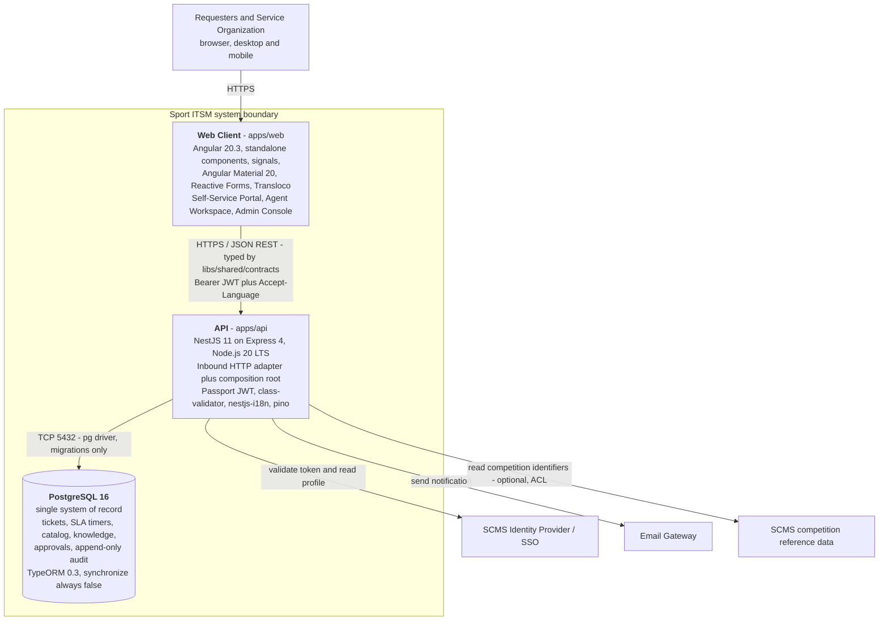
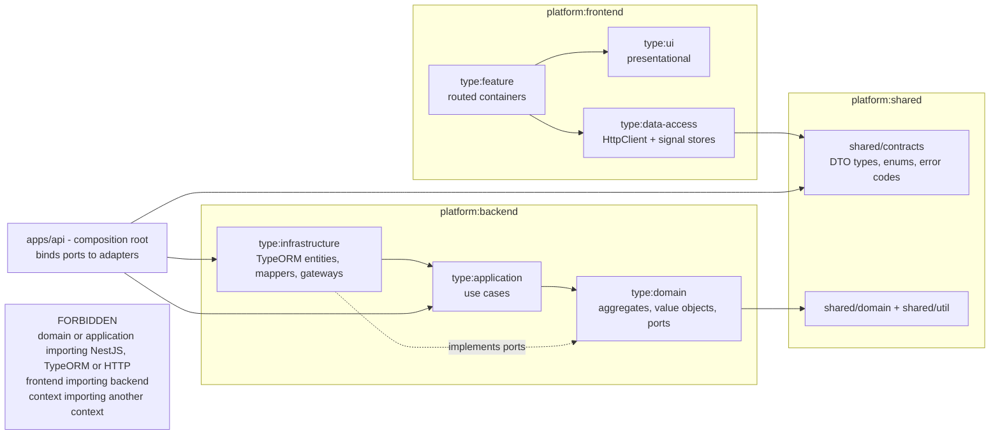

## Índice

0. [Ficha del proyecto](#0-ficha-del-proyecto)
1. [Descripción general del producto](#1-descripción-general-del-producto)
2. [Arquitectura del sistema](#2-arquitectura-del-sistema)
3. [Modelo de datos](#3-modelo-de-datos)
4. [Especificación de la API](#4-especificación-de-la-api)
5. [Historias de usuario](#5-historias-de-usuario)
6. [Tickets de trabajo](#6-tickets-de-trabajo)
7. [Pull requests](#7-pull-requests)

---

## 0. Ficha del proyecto

### **0.1. Tu nombre completo:**

Iván Gómez Rodríguez

### **0.2. Nombre del proyecto:**

Sport IT Service Management

### **0.3. Descripción breve del proyecto:**

Sport ITSM is an IT Service Management platform dedicated to supporting the Sports Competition Management System. It provides a centralized environment for managing incidents, service requests, problems, changes, releases, assets, and operational processes related to the competition platform, ensuring service availability, traceability, and continuous improvement throughout the application lifecycle.

```text
Sports Competition Management System (SCMS)
                 │
                 │ Support & Operations
                 ▼
             Sport ITSM
                 │
      ┌──────────┼──────────┐
      │          │          │
      ├── Incident Management
      ├── Service Request Management
      ├── Problem Management
      ├── Change Management
      ├── Release Management
      ├── Knowledge Base
      ├── Asset & Configuration Management
      └── SLA & Reporting
```

### **0.4. URL del proyecto:**

> Puede ser pública o privada, en cuyo caso deberás compartir los accesos de manera segura. Puedes enviarlos a [alvaro@lidr.co](mailto:alvaro@lidr.co) usando algún servicio como [onetimesecret](https://onetimesecret.com/).

### 0.5. URL o archivo comprimido del repositorio

> Puedes tenerlo alojado en público o en privado, en cuyo caso deberás compartir los accesos de manera segura. Puedes enviarlos a [alvaro@lidr.co](mailto:alvaro@lidr.co) usando algún servicio como [onetimesecret](https://onetimesecret.com/). También puedes compartir por correo un archivo zip con el contenido

---

## 1. Descripción general del producto

> Describe en detalle los siguientes aspectos del producto:

### **1.1. Objetivo:**

> Propósito del producto. Qué valor aporta, qué soluciona, y para quién.

**Product purpose**

The product is **Sport ITSM**, a full **IT Service Management (ITSM) platform** dedicated to supporting the **Sports Competition Management System (SCMS)** — an application for managing competitions (tournaments, leagues, and group/division formats). It provides a centralized environment to manage **Incidents, Service Requests, Problems, Changes, Releases, Assets, and operational processes** related to the SCMS platform, ensuring **service availability, traceability, and continuous improvement** across the application lifecycle. The Service Desk acts as the **Single Point of Contact (SPOC)** for the platform's users — players, team managers, tournament organizers, and match officials — while the engineering and operations organization uses the platform to govern platform Changes, Releases, and Assets, all under Service Level Agreements (SLAs).

> **Scope:** Sport ITSM supports the _SCMS platform_, not the sporting operation itself. In-application sport decisions (reschedules, roster changes, result disputes) are made by organizers and officials **inside** SCMS and are out of scope; they reach Sport ITSM only when they surface as a platform defect or an entitled service request. Competition entities (Tournament, Match, Standings…) are therefore the **affected subject** of a ticket, never tickets in their own right. Conversely, **Changes and Releases of the SCMS platform itself** (new versions, features, configuration, hotfixes) are fully **in scope** and governed by the platform.

**Problem it solves**

Competition platforms concentrate user demand into critical live windows — registration deadlines, match days, and finals — when any application failure (standings not updating, brackets not rendering, scores not saving, payments not processed) directly disrupts an event in progress, and when uncontrolled platform changes can trigger those very failures. Without a structured service management function, issues arrive through fragmented channels with no consistent ticket lifecycle, no prioritization of competition-impacting failures, no controlled path for platform changes and releases, and no measurable SLA accountability. Sport ITSM replaces this with a **standardized, auditable, and metric-driven service operation** — spanning support (Incident, Request, Problem) and platform evolution (Change, Release, Asset & Configuration) — that protects service availability when it matters most, aligned with ITIL-based practices.

**Value delivered**

- **Operational consistency:** every interaction follows a controlled lifecycle (logging → categorization → prioritization → assignment → resolution → closure).
- **Event protection:** Major Incident handling and tiered escalation prioritize failures during live competition windows (match days / finals) to minimize time-to-restore.
- **Controlled platform evolution:** Change Management and Release & Deployment Management deliver SCMS changes with risk assessment, approval, and CMDB impact analysis, reducing change-induced Incidents.
- **Accountability:** SLA timers, escalation rules, and audit trails make response and resolution commitments measurable and enforceable.
- **Efficiency:** automated categorization, assignment, and Knowledge-Base self-service deflection reduce manual effort and Mean Time to Resolution (MTTR).
- **Experience:** a Self-Service Portal gives players, organizers, and officials transparency over their tickets and status.
- **Traceability & decision support:** an end-to-end audit trail plus real-time KPIs and dashboards (FCR, MTTR, SLA Compliance, Change Success Rate, CSAT, backlog) drive continual service improvement.

**Target audience (personas)**

- **Player / Competitor:** end user reporting application issues or requesting account services.
- **Team Manager / Captain:** raises team-level support for a team's participation.
- **Tournament Organizer / Admin:** power user configuring competitions; higher entitlement tier.
- **Referee / Match Official:** reports scoring and result-entry issues.
- **League Administrator:** oversees multiple competitions; acts as escalation contact.
- **Service Desk Agent (L1):** first-line operator who logs, triages, and resolves or routes tickets.
- **Application Support Analyst (L2/L3):** platform specialists / engineering resolver group handling escalated work.
- **Change / Release Manager:** governs platform Changes and coordinates SCMS Releases and deployments.
- **Service Owner / Service Manager:** accountable for SCMS service quality, SLAs, and continuous improvement.
- **System Administrator:** configures catalog, workflows, SLAs, CMDB, and access control.

### **1.2. Características y funcionalidades principales:**

> Enumera y describe las características y funcionalidades específicas que tiene el producto para satisfacer las necesidades identificadas.

Sport ITSM delivers the following core capabilities, spanning end-user support and platform operations for the SCMS platform:

**1. Ticket Management (Incident & Service Request)** End-to-end ticket lifecycle management with categorization, prioritization (Impact × Urgency → Priority matrix), status tracking, work notes, and closure codes. Handles **Incidents** (platform defects — e.g., standings not updating, bracket not rendering, scores not saving) and **Service Request** fulfillment as distinct but unified workflows. Each ticket records the **affected competition subject** (Tournament, League, Group, Bracket, Fixture, Standings, Registration, Roster, Team, Player Account) without treating it as the ticket itself.

**2. Omnichannel Intake** Capture of tickets from multiple channels — Self-Service Portal, email-to-ticket, in-app help, and phone-logged entries — normalized into a single ticket model with a unique reference number.

**3. Self-Service Portal & Knowledge Base** End-user portal for players, organizers, and officials to submit tickets, track status, and search Knowledge Articles (how-tos, known issues, workarounds). Knowledge-centered deflection reduces ticket volume and improves First Contact Resolution (FCR).

**4. Service Catalog Management** A structured catalog of platform-support Service Offerings with request forms, eligibility rules, and predefined fulfillment workflows — e.g., account creation, role/entitlement and organizer-access provisioning, password reset / account recovery, data export (fixtures, standings, rosters, results), and billing/registration-payment support.

**5. Workflow & Automation Engine** Configurable business rules for automated categorization, routing, and assignment to the correct Resolver Group or Assignment Queue, including skill-based and round-robin assignment and task orchestration.

**6. SLA Management & Escalation** Definition of SLA/OLA targets (response and resolution) per service and priority, with **event-aware policies** that tighten targets during live competition windows (match days / finals). Automated SLA timers, breach warnings, and tiered (functional and hierarchical) escalation enforce service commitments.

**7. Major Incident Management** Dedicated handling for high-impact failures that disrupt an event in progress (e.g., a scoring outage on finals day), with accelerated escalation, coordinated resolver engagement, and stakeholder communication to minimize time-to-restore.

**8. Assignment & Queue Management** Support groups, queues, and workload distribution that route tickets to the appropriate team and provide agents with prioritized work lists.

**9. Problem Management** Linking of recurring Incidents to a Problem record, Root Cause Analysis (RCA), Known Error (KEDB) tracking, and Workaround publication to reduce repeat platform Incidents.

**10. Change Management** Controlled lifecycle for modifications to the SCMS platform (standard, normal, and emergency changes) with risk and impact assessment, CAB-style approval via the Approval Engine, scheduling around competition windows, and change calendars to avoid conflicts with live events.

**11. Release & Deployment Management** Planning, packaging, and coordinated deployment of SCMS versions, with release calendars, rollout/rollback plans, and linkage of releases to the Changes and Configuration Items they deliver.

**12. Asset & Configuration Management (CMDB)** A Configuration Management Database tracking the SCMS platform's Configuration Items (services, environments, components) and their relationships, enabling impact analysis for Incidents, Problems, Changes, and Releases.

**13. Notification Framework** Event-driven notifications (email, push, in-app) to requesters and agents on status changes, assignments, approvals, and SLA breaches, integrated with the platform's participant notification channels.

**14. Approval Engine** Configurable multi-level approval workflows for entitled Service Requests and for Changes/Releases (e.g., organizer-access provisioning, change authorization), with delegation and audit trails.

**15. Reporting, Dashboards & Analytics** Operational and management dashboards exposing key KPIs — FCR, MTTR, MTTA, SLA Compliance Rate, Reopen Rate, Backlog Volume, CSAT, Agent Productivity — plus domain metrics such as time-to-restore for competition-impacting Incidents, Major Incident rate during live windows, Change Success Rate, and release lead time.

**16. Identity & Access Management (RBAC)** Role-based access control aligned with platform personas (Player, Team Manager, Organizer, Official, Agent, Analyst, Change/Release Manager, Service Manager, Administrator), integrated with the platform's identity provider / SSO and enforcing least-privilege access.

**17. Audit Trail & Activity History** Immutable history of all ticket, change, and release transitions, field changes, and user actions to guarantee traceability and compliance across the SCMS application lifecycle.

### **1.3. Diseño y experiencia de usuario:**

> Proporciona imágenes y/o videotutorial mostrando la experiencia del usuario desde que aterriza en la aplicación, pasando por todas las funcionalidades principales.

### **1.4. Instrucciones de instalación:**

> Documenta de manera precisa las instrucciones para instalar y poner en marcha el proyecto en local (librerías, backend, frontend, servidor, base de datos, migraciones y semillas de datos, etc.)

---

## 2. Arquitectura del Sistema

### **2.1. Diagrama de arquitectura:**

> Usa el formato que consideres más adecuado para representar los componentes principales de la aplicación y las tecnologías utilizadas. Explica si sigue algún patrón predefinido, justifica por qué se ha elegido esta arquitectura, y destaca los beneficios principales que aportan al proyecto y justifican su uso, así como sacrificios o déficits que implica.

Sport ITSM is a **modular monolith** built as a single **Nx monorepo** that applies **Domain-Driven Design** (strategic and tactical) and **Hexagonal Architecture (Ports & Adapters)** across both platforms. The diagrams below go from the general to the concrete. The full architecture document — C4 context, context map, tactical model, end-to-end sequences and ADRs — lives in [`docs/ARCHITECTURE.md`](docs/ARCHITECTURE.md).

#### Containers and technologies


```mermaid
flowchart TB
    USER["Requesters and Service Organization<br/>browser, desktop and mobile"]

    subgraph boundary["Sport ITSM system boundary"]
        WEB["<b>Web Client</b> - apps/web<br/>Angular 20.3, standalone components, signals,<br/>Angular Material 20, Reactive Forms, Transloco<br/>Self-Service Portal, Agent Workspace, Admin Console"]
        API["<b>API</b> - apps/api<br/>NestJS 11 on Express 4, Node.js 20 LTS<br/>Inbound HTTP adapter plus composition root<br/>Passport JWT, class-validator, nestjs-i18n, pino"]
        DB[("<b>PostgreSQL 16</b><br/>single system of record<br/>tickets, SLA timers, catalog, knowledge,<br/>approvals, append-only audit<br/>TypeORM 0.3, synchronize always false")]
    end

    IDP["SCMS Identity Provider / SSO"]
    MAIL["Email Gateway"]
    SCMS["SCMS competition reference data"]

    USER -->|"HTTPS"| WEB
    WEB -->|"HTTPS / JSON REST - typed by libs/shared/contracts<br/>Bearer JWT plus Accept-Language"| API
    API -->|"TCP 5432 - pg driver, migrations only"| DB
    API -->|"validate token and read profile"| IDP
    API -->|"send notification"| MAIL
    API -->|"read competition identifiers - optional, ACL"| SCMS
```

There is deliberately **no message broker, no cache tier and no separate reporting store**: one API process, one database, one client.

#### Layering and the dependency rule

Every bounded context (`incident`, `service-request`, `sla`, `service-catalog`, `knowledge`, `identity-access`, …) is materialized as a set of Nx libraries tagged on three axes — `platform:` / `scope:` / `type:` — and `@nx/enforce-module-boundaries` makes the rule below **mechanical rather than aspirational**.


```mermaid
flowchart LR
    subgraph FE["platform:frontend"]
        F_FEAT["type:feature<br/>routed containers"]
        F_UI["type:ui<br/>presentational"]
        F_DA["type:data-access<br/>HttpClient + signal stores"]
    end

    subgraph SH["platform:shared"]
        CONTRACTS["shared/contracts<br/>DTO types, enums, error codes"]
        SDOM["shared/domain + shared/util"]
    end

    subgraph BE["platform:backend"]
        B_INFRA["type:infrastructure<br/>TypeORM entities, mappers, gateways"]
        B_APP["type:application<br/>use cases"]
        B_DOM["type:domain<br/>aggregates, value objects, ports"]
    end

    APP_API["apps/api - composition root<br/>binds ports to adapters"]

    F_FEAT --> F_UI
    F_FEAT --> F_DA
    F_DA --> CONTRACTS
    B_INFRA --> B_APP
    B_APP --> B_DOM
    B_DOM --> SDOM
    B_INFRA -.->|"implements ports"| B_DOM
    APP_API --> B_INFRA
    APP_API --> B_APP
    APP_API --> CONTRACTS

    FORBIDDEN["FORBIDDEN<br/>domain or application importing NestJS, TypeORM or HTTP<br/>frontend importing backend<br/>context importing another context"]
```

Dependencies point **inward only**: `infrastructure → application → domain`, never the reverse. Domain and application layers contain zero framework, ORM, HTTP or I/O code. Cross-context collaboration (e.g. Incident needing SLA, Approval, Notification or Audit) never becomes an import: the consuming context declares an outbound **port** in its own language and `apps/api` supplies the adapter, so no context-to-context edge ever exists in the Nx graph.

#### Patterns applied and why

| Pattern | Where it applies | Why it was chosen |
| --- | --- | --- |
| **Domain-Driven Design** | One bounded context per ITSM capability | ITSM is a domain with a precise, standardized ubiquitous language (Incident, Problem, Change, SLA, CI, CAB). Modeling it explicitly is what keeps _"a match reschedule is not a ticket"_ enforceable instead of a convention. |
| **Hexagonal (Ports & Adapters)** | Backend, per context | The business rules that matter (Impact × Urgency → Priority, SLA target recalculation, lifecycle transitions) are testable with zero infrastructure, and PostgreSQL/TypeORM/NestJS become replaceable details. |
| **Modular monolith** | Whole system | Fifteen contexts could suggest microservices; delivery is portfolio-scale. One process gives single-transaction consistency and near-zero operational cost, while the Nx boundaries preserve the option to extract a context later. |
| **Nx monorepo + tag boundaries** | Whole system | The architecture is enforced by `pnpm nx lint` in CI, not by review discipline. An illegal dependency fails the build. |
| **Shared typed contracts** | `libs/shared/contracts` | The single permitted coupling between frontend and backend. A breaking API change fails the frontend build immediately — the intended safety property. |
| **Signals-first Angular** | Frontend | Standalone components, `OnPush` everywhere, functional interceptors and signal stores; no NgModules, no external state library. |
| **Event-driven cross-cutting** | Audit, Notification, Reporting | Mutating operations commit first and publish domain events after; a notification outage can never block ticket intake. |

#### Benefits

- **Testability.** Business rules live in framework-free TypeScript. The most valuable tests need no database, no HTTP and no Angular TestBed.
- **Enforced boundaries.** Architectural erosion is caught by the linter, which matters most on a long-lived platform with many capabilities.
- **Evolvability.** Adding `problem`, `change` or `release` in phase 2 is additive: the Incident aggregate already reserves link semantics for them as opaque identifiers.
- **Coherence FE/BE.** One repository, one TypeScript version, one lint/format setup, `nx affected` for changed-only CI, and types that cannot drift between client and server.
- **Replaceable infrastructure.** ORM, identity provider or email gateway are adapters behind ports; swapping one does not touch business logic.

#### Sacrifices and deficits

Honest accounting of what this architecture costs:

- **Ceremony.** A trivial CRUD feature still needs a port, an adapter, a use case, a DTO, a mapper and a contract type. For a small product this is over-engineering; it pays off only because the ITSM domain is genuinely large.
- **Mapping code.** Domain aggregates and TypeORM entities are separate types, so mappers must be written and maintained.
- **A composition root that grows.** Every cross-context collaboration adds one adapter class in `apps/api`. Coupling is not eliminated — it is concentrated in a visible, reviewable place.
- **Single deployable.** Contexts cannot be scaled or released independently; the whole API deploys together, and a defect in one context can affect the process.
- **Eventual consistency in the cross-cutting path.** Audit and notification writes sit outside the ticket transaction. Mitigated with an in-process dispatcher with retry and audit-completeness assertions in acceptance tests, but it is a real trade-off against strict transactional auditing.
- **Learning curve.** DDD + hexagonal + Nx tags is a steep onboarding cost, and the discipline degrades quickly if boundary violations are silenced instead of fixed.

> **Status:** this is the **target architecture**. The Nx workspace (`apps/`, `libs/`) has not been scaffolded yet, so the boundary rules above have not been verified with `pnpm nx lint` / `pnpm nx graph`.

### **2.2. Descripción de componentes principales:**

> Describe los componentes más importantes, incluyendo la tecnología utilizada

### **2.3. Descripción de alto nivel del proyecto y estructura de ficheros**

> Representa la estructura del proyecto y explica brevemente el propósito de las carpetas principales, así como si obedece a algún patrón o arquitectura específica.

### **2.4. Infraestructura y despliegue**

> Detalla la infraestructura del proyecto, incluyendo un diagrama en el formato que creas conveniente, y explica el proceso de despliegue que se sigue

### **2.5. Seguridad**

> Enumera y describe las prácticas de seguridad principales que se han implementado en el proyecto, añadiendo ejemplos si procede

### **2.6. Tests**

> Describe brevemente algunos de los tests realizados

---

## 3. Modelo de Datos

### **3.1. Diagrama del modelo de datos:**

> Recomendamos usar mermaid para el modelo de datos, y utilizar todos los parámetros que permite la sintaxis para dar el máximo detalle, por ejemplo las claves primarias y foráneas.

### **3.2. Descripción de entidades principales:**

> Recuerda incluir el máximo detalle de cada entidad, como el nombre y tipo de cada atributo, descripción breve si procede, claves primarias y foráneas, relaciones y tipo de relación, restricciones (unique, not null…), etc.

---

## 4. Especificación de la API

> Si tu backend se comunica a través de API, describe los endpoints principales (máximo 3) en formato OpenAPI. Opcionalmente puedes añadir un ejemplo de petición y de respuesta para mayor claridad

---

## 5. Historias de Usuario

> Documenta 3 de las historias de usuario principales utilizadas durante el desarrollo, teniendo en cuenta las buenas prácticas de producto al respecto.

**Historia de Usuario 1**

**Historia de Usuario 2**

**Historia de Usuario 3**

---

## 6. Tickets de Trabajo

> Documenta 3 de los tickets de trabajo principales del desarrollo, uno de backend, uno de frontend, y uno de bases de datos. Da todo el detalle requerido para desarrollar la tarea de inicio a fin teniendo en cuenta las buenas prácticas al respecto.

**Ticket 1**

**Ticket 2**

**Ticket 3**

---

## 7. Pull Requests

> Documenta 3 de las Pull Requests realizadas durante la ejecución del proyecto

**Pull Request 1**

**Pull Request 2**

**Pull Request 3**
