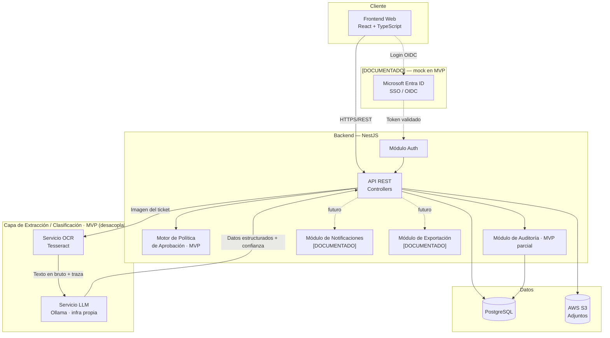
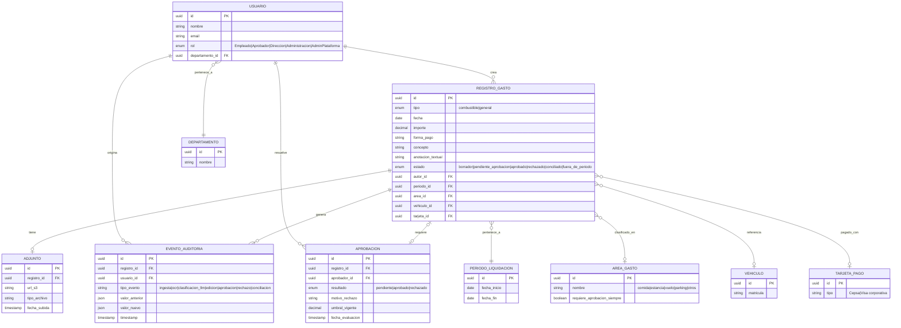

# GastOS — Plataforma de Gestión de Gastos Internos 

> Proyecto Final AI4Devs — Entrega 1: Documentación técnica.

**Leyenda usada en este documento:**
- **[MVP]** → se documenta y **se implementa** en este proyecto.
- **[DOCUMENTADO]** → forma parte de la especificación completa del RFP y se documenta aquí para dar contexto de producto completo, pero **no se implementa** en el alcance de este proyecto (queda fuera, como referencia de lo que existiría en una versión completa).

## Índice

0. [Ficha del proyecto](#0-ficha-del-proyecto)
1. [Descripción general del producto](#1-descripción-general-del-producto)
2. [Arquitectura del sistema](#2-arquitectura-del-sistema)
3. [Modelo de datos](#3-modelo-de-datos)
4. [Especificación de la API](#4-especificación-de-la-api)
5. [Historias de usuario](#5-historias-de-usuario)
6. [Tickets de trabajo](#6-tickets-de-trabajo)
7. [Pull requests](#7-pull-requests)

---

## 0. Ficha del proyecto

### **0.1. Tu nombre completo:**
Carmen Margarita Carro Martinez Pinillo

### **0.2. Nombre del proyecto:**
GastOS

### **0.3. Descripción breve del proyecto:**
GastOS es una plataforma interna que sustituye la gestión manual de gastos (dietas, estancias, desplazamientos, combustible) basada en plantillas Excel, por un flujo digital con captura automatizada de tickets (OCR + LLM), revisión humana (HITL), evaluación de política de aprobación y conciliación, con trazabilidad completa e informes operativos y de dirección.

### **0.4. URL del proyecto:**
`[pendiente — se completará cuando exista un entorno desplegado, en Entrega 2/3]`

### 0.5. URL o archivo comprimido del repositorio
`[pendiente — el repositorio aún no ha sido creado]`

---

## 1. Descripción general del producto

### **1.1. Objetivo:**

La Empresa gestiona hoy el gasto interno (dietas, estancias, desplazamientos, combustible de flota) mediante plantillas Excel cumplimentadas manualmente por cada empleado. Esto genera falta de trazabilidad, riesgo de pérdida de justificantes, control solo reactivo y ninguna visibilidad agregada sin consolidar ficheros a mano.

GastOS automatiza la captura, clasificación, revisión y aprobación del gasto, y centraliza el archivo de justificantes con retención garantizada para auditoría, aportando valor a tres perfiles:

- **Empleados/Conductores:** capturan un gasto en segundos subiendo una foto del ticket, sin rellenar formularios largos.
- **Aprobadores (Administración) y Dirección:** disponen de un flujo de aprobación estructurado y trazable, en lugar de creación y revisión manual de Excel.
- **Administración/Contabilidad y Administrador de plataforma:** obtienen informes operativos y de dirección fiables, y un archivo centralizado con retención auditable.

### **1.2. Características y funcionalidades principales:**

| Funcionalidad | Estado en este proyecto | Referencia RFP |
|---|---|---|
| Módulo **Gastos generales** (captura, OCR+LLM, HITL, aprobación, conciliación) | **[MVP]** | 3.1, 3.2.2, 3.4 |
| Módulo **Combustible** (repostaje, km, tarjeta Cepsa/Visa) | **[DOCUMENTADO]** | 3.1, 3.2.1 |
| Vía de entrada "sin ticket" (entrada manual + anotación textual obligatoria) | **[MVP]** (como parte de la revisión HITL) | 3.3 |
| Extracción automática: OCR (Tesseract) + clasificación LLM (Ollama) | **[MVP]** | 3.4, 5.2 |
| Revisión HITL con registro de cada edición | **[MVP]** | 3.4 |
| Motor de política de aprobación (umbral parametrizable, "vuelo" siempre) | **[MVP]** | 3.5 |
| Flujo de aprobación/rechazo con motivo | **[MVP]** | 3.4, 3.5 |
| Roles y permisos completos (5 roles) | **[DOCUMENTADO]** — MVP cubre solo Empleado y Aprobador | 3.9 |
| Períodos de liquidación configurables + detección "fuera de período" | **[DOCUMENTADO]** | 3.6.1 |
| Notificaciones (urgentes vs. ordinarias) | **[DOCUMENTADO]** | 3.6.2, 3.7 |
| Auditoría inmutable completa (todas las operaciones) | **[MVP parcial]** — trazas de las 3 historias implementadas; el resto de eventos quedan documentados | 3.8 |
| Informe de detalle operativo + exportación a Excel por plantilla | **[DOCUMENTADO]** | 3.10.1 |
| Informes agregados (nivel umbral / desglose) | **[DOCUMENTADO]** | 3.10.2 |
| SSO con Microsoft Entra ID | **[DOCUMENTADO]** — MVP usa un mock de sesión, ver nota en 1.4 | 5.1 |
| Retención documental ≥5 años | **[DOCUMENTADO]** | 5.4 |
| Fase 2 completa (responsable de equipo, gráficos, comparativos, presupuestos, alertas, agrupación de registros) | **[DOCUMENTADO]** — fuera de alcance de este proyecto | Sección 4 |

> Esta tabla es la única fuente de verdad sobre qué se construye realmente. El resto de secciones (historias, tickets, API, modelo de datos) documentan el producto completo, pero desarrollan en detalle únicamente las 3 historias Must-Have marcadas como **[MVP]** en la sección 5.

### **1.3. Diseño y experiencia de usuario:**

`[PENDIENTE — Entrega 2]`. Al ser esta una entrega de documentación, aún no existen capturas ni código de interfaz. El flujo de pantallas previsto para el MVP es:

1. **Login** (mock de sesión en MVP; SSO Entra ID en versión completa).
2. **Selección de módulo** → el usuario elige "Gastos generales" (único módulo implementado).
3. **Captura** → subir imagen del ticket, o marcar "sin ticket" e introducir datos manualmente (anotación obligatoria en ese caso).
4. **Revisión HITL** → pantalla con los campos propuestos por OCR+LLM, editables; el usuario confirma.
5. **Confirmación** → el registro pasa a evaluación de política; si no requiere aprobación, queda conciliado directamente.
6. **Bandeja de aprobación** (solo rol Aprobador) → lista de registros pendientes, con acción de aprobar o rechazar (motivo obligatorio en rechazo).

En Entrega 2 se sustituirá este apartado por capturas de pantalla reales y/o un vídeo corto del flujo funcionando.

### **1.4. Instrucciones de instalación:**

`[PROVISIONAL — no validado, ya que el código aún no existe en esta entrega. Se confirmará y corregirá en Entrega 2]`.

**Stack:** Backend NestJS (Node/TypeScript) · Frontend React + TypeScript · PostgreSQL · AWS S3 (adjuntos) · Tesseract (OCR) · Ollama (LLM, infraestructura propia) · Microsoft Entra ID (SSO, documentado, mock en MVP).

```bash
# 1. Clonar el repositorio (monorepo)
git clone <url-del-repositorio>
cd gastos-app

# 2. Backend
cd backend
npm install
cp .env.example .env        # completar variables, ver tabla abajo
npx prisma migrate dev      # o el ORM elegido (TypeORM/Prisma)
npm run start:dev

# 3. Frontend (en otra terminal)
cd frontend
npm install
cp .env.example .env
npm run dev

# 4. Servicios de IA en local
#    - Tesseract: apt-get install tesseract-ocr (o vía contenedor Docker)
#    - Ollama: instalar, ejecutar `ollama serve` y descargar el modelo elegido
```

**Variables de entorno principales** (sin valores reales — solo referencia, nunca se versionan secretos):

| Variable | Descripción |
|---|---|
| `DATABASE_URL` | Cadena de conexión a PostgreSQL |
| `AWS_S3_BUCKET` / `AWS_REGION` | Almacenamiento de adjuntos |
| `OLLAMA_BASE_URL` | URL del servicio Ollama local |
| `OCR_SERVICE_URL` | Endpoint del servicio Tesseract |
| `APPROVAL_THRESHOLD_DEFAULT` | Umbral de importe por defecto para requerir aprobación |
| `AZURE_AD_CLIENT_ID` / `AZURE_AD_TENANT_ID` | *(documentado, no usado en MVP)* — integración Entra ID futura |

> **[SENSIBLE]** Ningún dato real de tickets, empleados o tarjetas debe usarse en entornos de desarrollo o pruebas con servicios externos de IA. Para probar el pipeline OCR+LLM usar tickets sintéticos o anonimizados; cualquier uso de datos reales fuera de la infraestructura propia requiere aprobación previa de `ai.seguridad@fake.com`.

---

## 2. Arquitectura del Sistema

### **2.1. Diagrama de arquitectura:**


```mermaid
graph TB
    subgraph Cliente
        FE["Frontend Web<br/>React + TypeScript"]
    end

    subgraph Identidad["[DOCUMENTADO] — mock en MVP"]
        ENTRA["Microsoft Entra ID<br/>SSO / OIDC"]
    end

    subgraph Backend["Backend — NestJS"]
        API["API REST<br/>Controllers"]
        AUTHM["Módulo Auth"]
        POLICY["Motor de Política<br/>de Aprobación · MVP"]
        AUDIT["Módulo de Auditoría · MVP parcial"]
        NOTIF["Módulo de Notificaciones<br/>[DOCUMENTADO]"]
        EXPORT["Módulo de Exportación<br/>[DOCUMENTADO]"]
    end

    subgraph IA["Capa de Extracción / Clasificación · MVP (desacoplable)"]
        OCR["Servicio OCR<br/>Tesseract"]
        LLM["Servicio LLM<br/>Ollama · infra propia"]
    end

    subgraph Datos
        DB[("PostgreSQL")]
        S3[("AWS S3<br/>Adjuntos")]
    end

    FE -- HTTPS/REST --> API
    FE -. Login OIDC .-> ENTRA
    ENTRA -. Token validado .-> AUTHM
    AUTHM --> API
    API --> POLICY
    API --> AUDIT
    API -. futuro .-> NOTIF
    API -. futuro .-> EXPORT
    API -- Imagen del ticket --> OCR
    OCR -- Texto en bruto + traza --> LLM
    LLM -- Datos estructurados + confianza --> API
    API --> DB
    API --> S3
    AUDIT --> DB
```

**Patrón elegido:** monolito modular (módulos NestJS con límites claros) con la capa de extracción (OCR/LLM) tratada como servicios desacoplados detrás de una interfaz interna, no como librerías embebidas. Esto cumple el requisito 5.2 del RFP ("la arquitectura debe permitir sustituir cualquier capa sin rediseño del conjunto").

- **Por qué este patrón:** con un presupuesto de ~30h y un equipo de una persona, una arquitectura de microservicios completa añadiría sobrecarga operativa (despliegue, red, observabilidad distribuida) sin beneficio real a esta escala. Un monolito modular da velocidad de desarrollo y mantiene los límites de dominio (auth, política de aprobación, auditoría, extracción) como módulos independientes, facilitando una futura extracción a servicios si el proyecto creciera.
- **Beneficios:** rapidez de implementación, despliegue único y simple, coherencia transaccional al escribir registro + traza de auditoría en la misma unidad de trabajo.
- **Déficits asumidos:** no hay escalado independiente por módulo (aceptable para una herramienta interna de un solo departamento); el acoplamiento al mismo proceso Node exige cuidado para no romper el aislamiento entre módulos.

### **2.2. Descripción de componentes principales:**

| Componente | Tecnología | Estado |
|---|---|---|
| Frontend | React + TypeScript | MVP |
| API Backend | NestJS (Node/TypeScript) | MVP |
| Motor de política de aprobación | Módulo NestJS (lógica de dominio) | MVP |
| Módulo de auditoría | Interceptors de NestJS + tabla de eventos | MVP parcial |
| Servicio OCR | Tesseract (proceso/contenedor separado) | MVP |
| Servicio LLM | Ollama, infraestructura propia | MVP |
| Base de datos | PostgreSQL | MVP |
| Almacenamiento de adjuntos | AWS S3 | MVP |
| Identidad | Microsoft Entra ID (SSO/OIDC) | Documentado (mock en MVP) |
| Notificaciones | Servicio de notificaciones (email / canal urgente diferenciado) | Documentado |
| Exportación de informes | Generación Excel (`exceljs`) por plantilla de módulo | Documentado |

### **2.3. Descripción de alto nivel del proyecto y estructura de ficheros**

Estructura de **monorepo** con carpetas `backend/` y `frontend/` independientes en el mismo repositorio:

```
gastos-app/
├── backend/
│   ├── src/
│   │   ├── modules/
│   │   │   ├── auth/                # SSO / sesión (mock en MVP)
│   │   │   ├── expenses/            # Registro de gasto general (MVP)
│   │   │   ├── extraction/          # Orquestación OCR + LLM (MVP)
│   │   │   ├── approval-policy/     # Motor de política de aprobación (MVP)
│   │   │   ├── audit/               # Trazas de auditoría (MVP parcial)
│   │   │   ├── fuel/                # Módulo Combustible (documentado, no implementado)
│   │   │   ├── notifications/       # Documentado, no implementado
│   │   │   └── reports/             # Documentado, no implementado
│   │   └── main.ts
│   ├── test/
│   └── package.json
├── frontend/
│   ├── src/
│   │   ├── pages/                   # Captura, Revisión HITL, Bandeja de aprobación
│   │   ├── components/
│   │   └── services/                # Cliente API
│   └── package.json
├── docs/
│   └── diagrams/                    # Fuente Mermaid versionada
├── readme.md
└── prompts.md
```

---

## 3. Modelo de datos

Modelo de datos completo del dominio (documentado). Las entidades marcadas se usan activamente en las 3 historias MVP; el resto se modela para dar coherencia al dominio completo del RFP.


```mermaid
erDiagram
    USUARIO ||--o{ REGISTRO_GASTO : crea
    USUARIO }o--|| DEPARTAMENTO : pertenece_a
    USUARIO ||--o{ APROBACION : resuelve
    USUARIO ||--o{ EVENTO_AUDITORIA : origina
    REGISTRO_GASTO ||--o| ADJUNTO : tiene
    REGISTRO_GASTO ||--o{ EVENTO_AUDITORIA : genera
    REGISTRO_GASTO |o--o| APROBACION : requiere
    REGISTRO_GASTO }o--|| PERIODO_LIQUIDACION : pertenece_a
    REGISTRO_GASTO }o--o| AREA_GASTO : clasificado_en
    REGISTRO_GASTO }o--o| VEHICULO : referencia
    REGISTRO_GASTO }o--o| TARJETA_PAGO : pagado_con

    USUARIO {
        uuid id PK
        string nombre
        string email
        enum rol "Empleado|Aprobador|Direccion|Administracion|AdminPlataforma"
        uuid departamento_id FK
    }
    DEPARTAMENTO {
        uuid id PK
        string nombre
    }
    REGISTRO_GASTO {
        uuid id PK
        enum tipo "combustible|general"
        date fecha
        decimal importe
        string forma_pago
        string concepto
        string anotacion_textual
        enum estado "borrador|pendiente_aprobacion|aprobado|rechazado|conciliado|fuera_de_periodo"
        uuid autor_id FK
        uuid periodo_id FK
        uuid area_id FK
        uuid vehiculo_id FK
        uuid tarjeta_id FK
    }
    AREA_GASTO {
        uuid id PK
        string nombre "comida|estancia|vuelo|parking|otros"
        boolean requiere_aprobacion_siempre
    }
    VEHICULO {
        uuid id PK
        string matricula
    }
    TARJETA_PAGO {
        uuid id PK
        string tipo "Cepsa|Visa corporativa"
    }
    PERIODO_LIQUIDACION {
        uuid id PK
        date fecha_inicio
        date fecha_fin
    }
    ADJUNTO {
        uuid id PK
        uuid registro_id FK
        string url_s3
        string tipo_archivo
        timestamp fecha_subida
    }
    APROBACION {
        uuid id PK
        uuid registro_id FK
        uuid aprobador_id FK
        enum resultado "pendiente|aprobado|rechazado"
        string motivo_rechazo
        decimal umbral_vigente
        timestamp fecha_evaluacion
    }
    EVENTO_AUDITORIA {
        uuid id PK
        uuid registro_id FK
        uuid usuario_id FK
        string tipo_evento "ingesta|ocr|clasificacion_llm|edicion|aprobacion|rechazo|conciliacion"
        json valor_anterior
        json valor_nuevo
        timestamp timestamp
    }
```

**Uso en el MVP:** `USUARIO` (roles Empleado y Aprobador), `REGISTRO_GASTO` (solo `tipo = general`), `AREA_GASTO`, `ADJUNTO`, `APROBACION`, `EVENTO_AUDITORIA`.
**Solo documentadas (no requeridas por las 3 historias MVP):** `DEPARTAMENTO`, `VEHICULO`, `TARJETA_PAGO`, `PERIODO_LIQUIDACION` (relevantes para Combustible, informes y notificaciones — fuera de alcance de esta entrega).

---

## 4. Especificación de la API

| Método | Endpoint | Descripción | Estado |
|---|---|---|---|
| `POST` | `/expenses` | Crea un registro de gasto general (con o sin ticket) | **MVP** (HU-01) |
| `POST` | `/expenses/:id/attachment` | Sube la imagen del ticket, dispara OCR + LLM | **MVP** (HU-01) |
| `GET` | `/expenses/:id/extraction` | Consulta los campos propuestos por OCR/LLM para revisión | **MVP** (HU-02) |
| `PATCH` | `/expenses/:id` | Confirma/edita campos en revisión HITL (registra auditoría por campo) | **MVP** (HU-02) |
| `POST` | `/expenses/:id/submit` | Envía el registro a evaluación de política de aprobación | **MVP** (HU-03) |
| `GET` | `/approvals` | Lista los registros pendientes de aprobación del usuario actual | **MVP** (HU-03) |
| `POST` | `/approvals/:id/approve` | Aprueba un registro (bloquea autoaprobación) | **MVP** (HU-03) |
| `POST` | `/approvals/:id/reject` | Rechaza un registro con motivo obligatorio | **MVP** (HU-03) |
| `GET` | `/expenses/:id/audit` | Consulta la traza de auditoría de un registro | **MVP parcial** |
| `POST` | `/fuel-expenses` | Crea un registro de combustible | Documentado |
| `GET` | `/settlement-periods` | Consulta/gestiona períodos de liquidación | Documentado |
| `GET` | `/reports/detail` | Informe de detalle operativo con filtros y exportación Excel | Documentado |
| `GET` | `/reports/aggregate` | Informes agregados (nivel umbral / desglose) | Documentado |
| `GET` | `/auth/login` | Redirección SSO Entra ID | Documentado (mock en MVP) |

---

## 5. Historias de usuario

> Backlog completo del dominio, documentado por trazabilidad. Solo **HU-01, HU-02 y HU-03** se implementan en este proyecto.

### HU-01 — Captura y extracción automática de gasto general **[MVP]**
*Ref. RFP: 3.2.2, 3.3, 3.4, 5.2*

**Como** Empleado, **quiero** subir la imagen de un ticket de gasto general (o indicar que no tengo ticket), **para** que el sistema proponga los datos estructurados automáticamente y no tener que rellenarlos todos a mano.

**Criterios de aceptación (BDD):**
```gherkin
Dado que el usuario ha seleccionado el módulo "Gastos generales"
Cuando sube una imagen de ticket (foto o PDF)
Entonces el sistema aplica OCR y clasificación LLM
Y propone fecha, concepto, importe y forma de pago para revisión
Y genera una traza de auditoría independiente para la ingesta, el OCR y la clasificación LLM

Dado que el usuario no dispone de ticket
Cuando marca la opción "sin ticket"
Entonces el sistema exige una anotación textual obligatoria antes de continuar
```

### HU-02 — Revisión HITL y confirmación del registro **[MVP]**
*Ref. RFP: 3.4*

**Como** Empleado, **quiero** revisar y corregir los datos propuestos antes de confirmarlos, **para** asegurarme de que el registro final es correcto.

**Criterios de aceptación (BDD):**
```gherkin
Dado que existen campos propuestos por OCR/LLM para un registro
Cuando el usuario edita uno o varios campos
Entonces cada edición queda registrada (campo, valor anterior, valor nuevo, usuario, timestamp)

Dado que el usuario ha revisado y confirmado el registro
Cuando pulsa "Confirmar"
Entonces el registro pasa a evaluación de política de aprobación
```

### HU-03 — Evaluación de política y aprobación/rechazo **[MVP]**
*Ref. RFP: 3.4, 3.5*

**Como** Aprobador (Administración), **quiero** que el sistema me muestre solo los registros que realmente requieren mi aprobación y poder aprobarlos o rechazarlos con motivo, **para** mantener el control sin revisar manualmente todo el gasto.

**Criterios de aceptación (BDD):**
```gherkin
Dado un registro de área "vuelo"
Cuando se evalúa la política de aprobación
Entonces requiere aprobación siempre, independientemente del importe

Dado un registro que no es "vuelo" y su importe es menor que el umbral configurado
Cuando se evalúa la política de aprobación
Entonces se concilia directamente sin aprobación

Dado un registro pendiente de aprobación
Cuando el Aprobador lo rechaza
Entonces debe indicar un motivo obligatorio
Y el registro vuelve al autor para corrección

Dado un registro creado por el propio Aprobador
Cuando requiere aprobación
Entonces el sistema impide que el mismo Aprobador lo apruebe
```

---

### Historias documentadas (fuera del alcance de implementación de este proyecto)

| ID | Historia | Ref. RFP |
|---|---|---|
| HU-04 | Como Empleado, registro un repostaje de combustible (vehículo, km, tarjeta, ticket opcional) | 3.2.1 |
| HU-05 | Como Administrador, configuro períodos de liquidación y el sistema detecta registros fuera de período | 3.6.1 |
| HU-06 | Como usuario, recibo notificaciones urgentes (distinguibles por canal) frente a ordinarias | 3.6.2, 3.7 |
| HU-07 | Como Administración, genero el informe de detalle operativo con filtros y lo exporto a Excel respetando el formato de plantilla original | 3.10.1 |
| HU-08 | Como Dirección, consulto informes agregados en dos niveles (umbral → desglose) según mi rol | 3.10.2 |
| HU-09 | Como Administrador de plataforma, gestiono el catálogo de áreas de gasto y el umbral de aprobación | 3.9 |
| HU-10 | Como usuario, inicio sesión mediante SSO corporativo (Microsoft Entra ID) | 5.1 |

---

## 6. Tickets de trabajo

> Desglose técnico únicamente de las 3 historias MVP.

| Ticket | Historia | Tipo | Descripción |
|---|---|---|---|
| TCK-01 | HU-01 | Backend | Endpoint de ingesta: recibe imagen, la almacena en S3 y crea el registro en estado inicial |
| TCK-02 | HU-01 | Backend | Orquestación del servicio OCR (Tesseract) + traza de auditoría de la extracción en bruto |
| TCK-03 | HU-01 | Backend | Integración con servicio LLM (Ollama) para clasificar/estructurar los datos, con confianza por campo |
| TCK-04 | HU-01 | Frontend | Pantalla de captura: selección de módulo, subida de imagen o entrada manual con anotación obligatoria |
| TCK-05 | HU-02 | Frontend | Pantalla de revisión HITL: campos editables, resaltando lo propuesto por IA vs. lo corregido |
| TCK-06 | HU-02 | Backend | Endpoint de confirmación: persiste el registro final y una entrada de auditoría por cada campo editado |
| TCK-07 | HU-03 | Backend | Motor de evaluación de política: regla "vuelo siempre", umbral parametrizable, bloqueo de autoaprobación |
| TCK-08 | HU-03 | Backend | Endpoints de aprobación/rechazo (motivo obligatorio en rechazo) y transición a estado conciliado |
| TCK-09 | HU-03 | Frontend | Bandeja de aprobación: lista de pendientes, acciones de aprobar/rechazar |

### Matriz de trazabilidad

| Épica | Historia | Tickets | PR |
|---|---|---|---|
| Captura y extracción | HU-01 | TCK-01, TCK-02, TCK-03, TCK-04 | *(pendiente, ver sección 7)* |
| Revisión humana | HU-02 | TCK-05, TCK-06 | *(pendiente)* |
| Aprobación | HU-03 | TCK-07, TCK-08, TCK-09 | *(pendiente)* |

---

