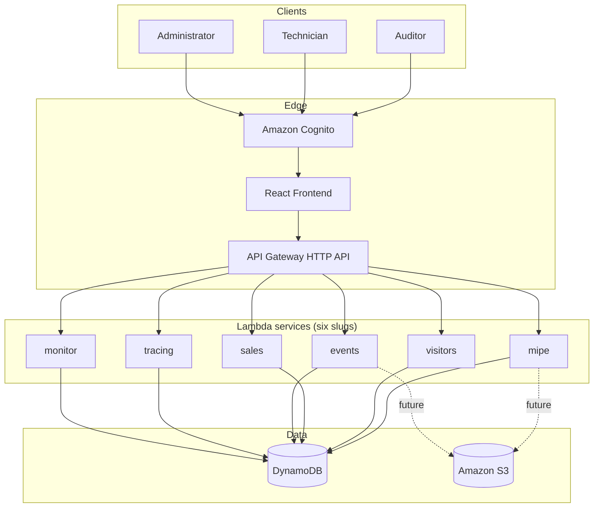
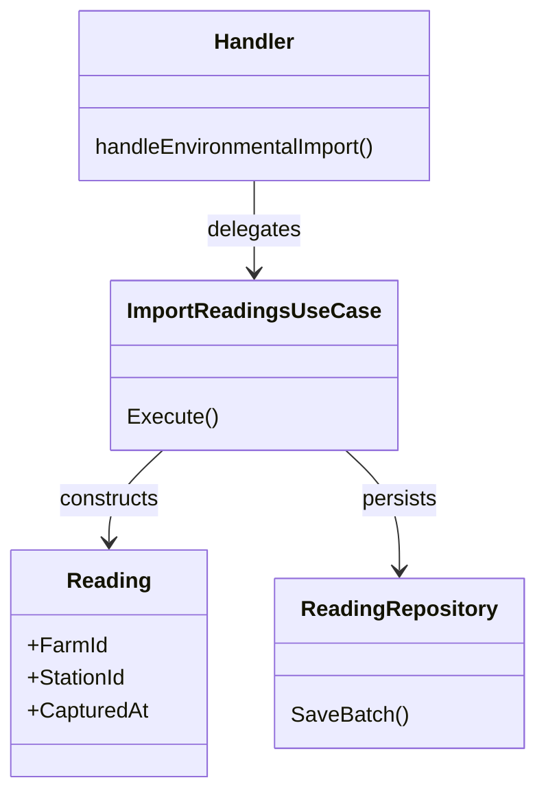
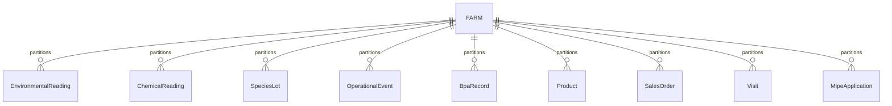

# Project Summary

> This document is a replica of [`README-1.md`](https://github.com/icsanabriar/acualuz-c4/tree/feat/setup-cursor/docs/deliveries/README-1.md).

> Source of truth: every fact in this document is taken from files under [`docs/`](https://github.com/icsanabriar/acualuz-c4/tree/feat/setup-cursor/docs).

> Sections without supporting information in `@docs` are explicitly marked as `Not documented in @docs.`

## Index

- [0. Project Information](#0-project-information)
  - [0.1. Full Name](#01-full-name)
  - [0.2. Project Name](#02-project-name)
  - [0.3. Project Description](#03-project-description)
  - [0.4. Project URLs](#04-project-urls)
  - [0.5. Tools Used](#05-tools-used)
- [1. Product Overview](#1-product-overview)
  - [1.1. Objective](#11-objective)
  - [1.2. Main Features and Functionalities](#12-main-features-and-functionalities)
  - [1.3. User Experience Design](#13-user-experience-design)
  - [1.4. Installation Instructions](#14-installation-instructions)
- [2. System Architecture](#2-system-architecture)
  - [2.1. Architecture Diagram](#21-architecture-diagram)
  - [2.2. Description of Main Components](#22-description-of-main-components)
  - [2.3. High-Level Project Description and File Structure](#23-high-level-project-description-and-file-structure)
  - [2.4. Infrastructure & Deployment](#24-infrastructure--deployment)
  - [2.5. Security](#25-security)
  - [2.6. Testing](#26-testing)
- [3. Data Model](#3-data-model)
  - [3.1. Data Model Diagram](#31-data-model-diagram)
  - [3.2. Description of Main Entities](#32-description-of-main-entities)
- [4. API Specification](#4-api-specification)
- [5. User Stories](#5-user-stories)
- [6. Work Tickets](#6-work-tickets)
- [7. Pull Requests](#7-pull-requests)

---

## 0. Project Information

### 0.1. Full Name

Iván Camilo Sanabria Rincón

### 0.2. Project Name

Acualuz — Online Aquaponic Farm Management Platform (architecture source of truth: `acualuz-c4`).

Source: 
- [docs/product/prd.md](https://github.com/icsanabriar/acualuz-c4/blob/feat/setup-cursor/docs/product/prd.md)
- [docs/architecture/current-state.md](https://github.com/icsanabriar/acualuz-c4/blob/feat/setup-cursor/docs/architecture/current-state.md)

### 0.3. Project Description

Acualuz v1 is an online aquaponic farm management platform for Colombia that unifies monitoring, traceability, operational events, sales, visitors, and MIPE (Integrated Pest Management) under Cognito-authenticated React experiences and a shared HTTP API Gateway. The MVP scope spans nine use cases (`UC-001`–`UC-009`) and eighteen tickets (`T-001`–`T-018`) implemented across six Lambda-backed backend repositories plus one React frontend. 

This `acualuz-c4` repository is the **architecture source of truth** and contains only C4 models, Structurizr DSL, ADRs, architecture documents, and repository-boundary contracts — no runnable application code lives here.

Source: 
- [docs/product/prd.md](https://github.com/icsanabriar/acualuz-c4/blob/feat/setup-cursor/docs/product/prd.md)
- [docs/architecture/repo-boundaries.md](https://github.com/icsanabriar/acualuz-c4/blob/feat/setup-cursor/docs/architecture/repo-boundaries.md)
- [docs/architecture/current-state.md](https://github.com/icsanabriar/acualuz-c4/blob/feat/setup-cursor/docs/architecture/current-state.md)

### 0.4. Project URLs

| Resource | URL |
|---|---|
| Architecture repository | https://github.com/icsanabriar/acualuz-c4 |
| `docs` | https://github.com/icsanabriar/acualuz-c4/tree/feat/setup-cursor/docs |
| PRD | https://github.com/icsanabriar/acualuz-c4/blob/feat/setup-cursor/docs/product/prd.md |
| Target architecture | https://github.com/icsanabriar/acualuz-c4/blob/feat/setup-cursor/docs/architecture/target-architecture.md |
| Backend design | https://github.com/icsanabriar/acualuz-c4/blob/feat/setup-cursor/docs/architecture/backend-design.md |
| Frontend design | https://github.com/icsanabriar/acualuz-c4/blob/feat/setup-cursor/docs/architecture/frontend-design.md |
| Data model | https://github.com/icsanabriar/acualuz-c4/blob/feat/setup-cursor/docs/data/data-model.md |
| Event catalog | https://github.com/icsanabriar/acualuz-c4/blob/feat/setup-cursor/docs/data/events.md |
| Data strategy | https://github.com/icsanabriar/acualuz-c4/blob/feat/setup-cursor/docs/data/data-strategy.md |
| AWS cost estimate | https://github.com/icsanabriar/acualuz-c4/blob/feat/setup-cursor/docs/architecture/aws-cost.md |
| Repository boundaries | https://github.com/icsanabriar/acualuz-c4/blob/feat/setup-cursor/docs/architecture/repo-boundaries.md |
| C4 Structurizr DSL | https://github.com/icsanabriar/acualuz-c4/blob/feat/setup-cursor/docs/dsl/architecture.dsl |
| ADR registry | https://github.com/icsanabriar/acualuz-c4/blob/feat/setup-cursor/docs/adr/decisions.md |
| JIRA traceability | https://github.com/icsanabriar/acualuz-c4/blob/feat/setup-cursor/docs/product/jira-traceability.md |
| JIRA project | https://acualuz.atlassian.net/jira/software/projects/SCRUM/boards/1 |

The platform is split across seven repositories (`acualuz-c4`, six `acualuz-<slug>` backends, and `acualuz-frontend`). Only the `acualuz-c4` URL is documented in `@docs`; the remote URLs for the six backend repositories and the frontend repository are referenced by name but not enumerated in `@docs`.

Source: 
- [docs/architecture/repo-boundaries.md](https://github.com/icsanabriar/acualuz-c4/blob/feat/setup-cursor/docs/architecture/repo-boundaries.md)
- [docs/product/jira-traceability.md](https://github.com/icsanabriar/acualuz-c4/blob/feat/setup-cursor/docs/product/jira-traceability.md)

### 0.5. Tools Used

| Layer | Technology / Service | Source |
|---|---|---|
| Authentication | Amazon Cognito (User Pool, JWT validation per Lambda) | [target-architecture.md](https://github.com/icsanabriar/acualuz-c4/blob/feat/setup-cursor/docs/architecture/target-architecture.md), [backend-design.md](https://github.com/icsanabriar/acualuz-c4/blob/feat/setup-cursor/docs/architecture/backend-design.md) |
| API edge | Amazon API Gateway (HTTP API) | [target-architecture.md](https://github.com/icsanabriar/acualuz-c4/blob/feat/setup-cursor/docs/architecture/target-architecture.md), [backend-design.md](https://github.com/icsanabriar/acualuz-c4/blob/feat/setup-cursor/docs/architecture/backend-design.md) |
| Backend compute | AWS Lambda — 22 functions, Go, 128 MB memory, 10 s timeout, ≤ 15 MB artifact | [backend-design.md](https://github.com/icsanabriar/acualuz-c4/blob/feat/setup-cursor/docs/architecture/backend-design.md), [aws-cost.md](https://github.com/icsanabriar/acualuz-c4/blob/feat/setup-cursor/docs/architecture/aws-cost.md) |
| Database | Amazon DynamoDB (single-table per service, on-demand billing) | [data-model.md](https://github.com/icsanabriar/acualuz-c4/blob/feat/setup-cursor/docs/data/data-model.md), [aws-cost.md](https://github.com/icsanabriar/acualuz-c4/blob/feat/setup-cursor/docs/architecture/aws-cost.md) |
| Object storage | Amazon S3 (design placeholder for attachments / ICA reports; no buckets provisioned in MVP) | [data-strategy.md](https://github.com/icsanabriar/acualuz-c4/blob/feat/setup-cursor/docs/data/data-strategy.md), [aws-cost.md](https://github.com/icsanabriar/acualuz-c4/blob/feat/setup-cursor/docs/architecture/aws-cost.md) |
| Observability | Amazon CloudWatch (basic logging per Lambda) | [aws-cost.md](https://github.com/icsanabriar/acualuz-c4/blob/feat/setup-cursor/docs/architecture/aws-cost.md) |
| Event fabric (future) | Amazon EventBridge (env placeholder only in MVP) | [aws-cost.md](https://github.com/icsanabriar/acualuz-c4/blob/feat/setup-cursor/docs/architecture/aws-cost.md), [backend-design.md](https://github.com/icsanabriar/acualuz-c4/blob/feat/setup-cursor/docs/architecture/backend-design.md) |
| Frontend | React (single application — `acualuz-frontend`) | [frontend-design.md](https://github.com/icsanabriar/acualuz-c4/blob/feat/setup-cursor/docs/architecture/frontend-design.md) |
| Frontend state | React Query (server cache), Zustand or React context (shared UI state) | [frontend-design.md](https://github.com/icsanabriar/acualuz-c4/blob/feat/setup-cursor/docs/architecture/frontend-design.md) |
| Frontend auth | Cognito-hosted UI / Amplify SDK; httpOnly Secure SameSite refresh cookie | [frontend-design.md](https://github.com/icsanabriar/acualuz-c4/blob/feat/setup-cursor/docs/architecture/frontend-design.md) |
| Modeling | C4 model expressed in Structurizr DSL | [architecture.dsl](https://github.com/icsanabriar/acualuz-c4/blob/feat/setup-cursor/docs/dsl/architecture.dsl), [target-architecture.md](https://github.com/icsanabriar/acualuz-c4/blob/feat/setup-cursor/docs/architecture/target-architecture.md) |
| Diagrams in docs | Mermaid (`sequenceDiagram`, `flowchart`, `classDiagram`, `erDiagram`) | [prd.md](https://github.com/icsanabriar/acualuz-c4/blob/feat/setup-cursor/docs/product/prd.md), [data-model.md](https://github.com/icsanabriar/acualuz-c4/blob/feat/setup-cursor/docs/data/data-model.md) |
| Project tracking | JIRA — site `acualuz.atlassian.net`, project `acualuz-tech` (key `SCRUM`) | [jira-traceability.md](https://github.com/icsanabriar/acualuz-c4/blob/feat/setup-cursor/docs/product/jira-traceability.md) |

---

## 1. Product Overview

### 1.1. Objective

Help small-to-medium Colombian aquaponic and fish farms digitize water-quality telemetry, multi-species lot traceability (fish, plant, and land-animal lots on a single `SpeciesLot` entity), ICA-oriented operational evidence, visitor biosecurity, gate sales, and MIPE applications without operating bespoke infrastructure. The platform unifies six bounded contexts under a single Cognito-authenticated React UI and one HTTP API Gateway, keeping AWS spend within the approved low-cost stack so subscription pricing remains viable for Colombian SMB farms.

Source: 
- [docs/product/prd.md](https://github.com/icsanabriar/acualuz-c4/blob/feat/setup-cursor/docs/product/prd.md) 
- [docs/product/lean-canvas.md](https://github.com/icsanabriar/acualuz-c4/blob/feat/setup-cursor/docs/product/lean-canvas.md)

### 1.2. Main Features and Functionalities

| # | Function | Service domain | Description |
|---|----------|----------------|-------------|
| 1 | Environmental + chemical ingestion | `monitor` | Batch/CSV environmental capture, manual KIT chemistry, integrity alert surfacing (`UC-001`). |
| 2 | Multi-species lot lifecycle + KPIs | `tracing` | Register fish, plant, and animal lots on the consolidated `SpeciesLot` entity; advance per-species lifecycle stages; aggregate per-lot and cross-species production KPIs (`UC-002`, `UC-007`, `UC-008`, `UC-009`). |
| 3 | Operational + BPA logging | `events` | Daily operational events with optional ICA BPA evidence rows (`UC-003`). |
| 4 | Catalog + orders | `sales` | Maintain catalog SKUs and capture on-farm orders (`UC-004`). |
| 5 | Visitor registration + audit trail | `visitors` | Capture visitor identity/purpose and expose auditor history (`UC-005`). |
| 6 | MIPE applications + schedule | `mipe` | Log biopreparat applications and surface upcoming tasks (`UC-006`). |
| 7 | Shared authentication | Platform | Cognito JWT validation on each Lambda. |
| 8 | API routing fabric | Platform | Twenty-two documented MVP routes across six services via HTTP API Gateway. |

Source: 
- [docs/product/prd.md](https://github.com/icsanabriar/acualuz-c4/blob/feat/setup-cursor/docs/product/prd.md)
- [docs/architecture/backend-design.md](https://github.com/icsanabriar/acualuz-c4/blob/feat/setup-cursor/docs/architecture/backend-design.md)
- [docs/product/mvp-use-cases.md](https://github.com/icsanabriar/acualuz-c4/blob/feat/setup-cursor/docs/product/mvp-use-cases.md)

### 1.3. User Experience Design

- **Operator language:** Spanish for production UI copy; structural headings and engineering documentation remain in English (repository standard).
- **Form factor:** Mobile-first / small-screen-first for field operators using Android phones in the farm.
- **Accessibility expectations:** Logical focus order and visible labels on every form field; kiosk-friendly visit registration with accessible focus order on tap.
- **Routing:** React Router with a protected-route guard that wraps every module and redirects unauthenticated users to the Cognito flow.
- **State management:** React Query for server cache (mutations invalidate per-`<service>.ts` query keys); local component state for form drafts; a small Zustand (or context) store for shared filters such as species + lifecycle stage on the cross-species dashboard.
- **Optimistic updates:** Applied only to lifecycle-stage advances (PATCH plant/animal stage), rolled back on `422` (invalid stage transition). Registration `POST`s wait for server confirmation because the server assigns the initial stage and the lot ID.
- **Modules:** One folder per canonical service slug (`monitor`, `tracing`, `events`, `sales`, `visitors`, `mipe`); the `tracing` folder hosts `fish/`, `plant/`, `animal/` sub-folders plus a shared `kpi/` sub-folder for the cross-species dashboard.
- **Sample Spanish copy:** "Importar lecturas ambientales", "Registrar química del agua", "Alertas de integridad", "Registrar evento operativo", "Evidencia BPA", "Catálogo de productos", "Nuevo pedido", "Registrar visita", "Historial de visitas", "Registrar aplicación MIPE", "Calendario de aplicaciones".

Source: 
- [docs/architecture/frontend-design.md](https://github.com/icsanabriar/acualuz-c4/blob/feat/setup-cursor/docs/architecture/frontend-design.md)

### 1.4. Installation Instructions

Not documented in @docs.

`acualuz-c4` is explicitly described as the architecture source of truth and "must never contain runnable application code" — there is no install or build procedure recorded for this repository, and `@docs` does not enumerate setup steps for the six backend repositories (`acualuz-monitor`, `acualuz-tracing`, `acualuz-events`, `acualuz-sales`, `acualuz-visitors`, `acualuz-mipe`) or for `acualuz-frontend`. Documented environment variables for the backend repositories (e.g. `DYNAMODB_TABLE_<SERVICE>`, `COGNITO_USER_POOL_ID`, `COGNITO_CLIENT_ID`, optional `EVENT_BUS_NAME`) are listed in [backend-design.md](https://github.com/icsanabriar/acualuz-c4/blob/feat/setup-cursor/docs/architecture/backend-design.md), but no provisioning, deployment, or local-run steps are documented in `@docs`.

---

## 2. System Architecture

### 2.1. Architecture Diagram

The Mermaid `flowchart` below reproduces the high-level system design from the PRD: operators authenticate with Cognito, interact through the React frontend, call a single API Gateway HTTP API that fans out to six Lambda-backed services, with shared DynamoDB and Amazon S3 (S3 reserved for future attachments / ICA exports).


```mermaid
flowchart TB
  subgraph Clients
    Admin[Administrator]
    Tech[Technician]
    Auditor[Auditor]
  end
  subgraph Edge
    Cognito[Amazon Cognito]
    FE[React Frontend]
    APIGW[API Gateway HTTP API]
  end
  subgraph Services["Lambda services (six slugs)"]
    Monitor[monitor]
    Tracing[tracing]
    EventsSvc[events]
    Sales[sales]
    Visitors[visitors]
    Mipe[mipe]
  end
  subgraph Data
    DDB[(DynamoDB)]
    S3[(Amazon S3)]
  end
  Admin --> Cognito
  Tech --> Cognito
  Auditor --> Cognito
  Cognito --> FE
  FE --> APIGW
  APIGW --> Monitor
  APIGW --> Tracing
  APIGW --> EventsSvc
  APIGW --> Sales
  APIGW --> Visitors
  APIGW --> Mipe
  Monitor --> DDB
  Tracing --> DDB
  EventsSvc --> DDB
  Sales --> DDB
  Visitors --> DDB
  Mipe --> DDB
  EventsSvc -. future .-> S3
  Mipe -. future .-> S3
```

A class-style component view for the highest-priority Lambda (`monitor-environmental-import`, UC-001) is also included in the PRD, illustrating clean-architecture layering Handler → Use Case → Domain → Repository.


```mermaid
classDiagram
  class Handler {
    handleEnvironmentalImport()
  }
  class ImportReadingsUseCase {
    Execute()
  }
  class Reading {
    +FarmId
    +StationId
    +CapturedAt
  }
  class ReadingRepository {
    SaveBatch()
  }
  Handler --> ImportReadingsUseCase : delegates
  ImportReadingsUseCase --> Reading : constructs
  ImportReadingsUseCase --> ReadingRepository : persists
```

Source: 
- [docs/product/prd.md](https://github.com/icsanabriar/acualuz-c4/blob/feat/setup-cursor/docs/product/prd.md)
- [docs/architecture/target-architecture.md](https://github.com/icsanabriar/acualuz-c4/blob/feat/setup-cursor/docs/architecture/target-architecture.md)
- [docs/dsl/architecture.dsl](https://github.com/icsanabriar/acualuz-c4/blob/feat/setup-cursor/docs/dsl/architecture.dsl)

### 2.2. Description of Main Components

| Container | Service slug | Technology | Status | Notes |
|-----------|-------------|------------|--------|-------|
| Authentication Service | — | Amazon Cognito | Planned | User pool / auth; all internal actors authenticate via HTTPS. |
| Frontend Web/App | — | React | Planned | UI; talks to Cognito and API Gateway only (no direct component links in DSL). |
| API Gateway | — | API Gateway HTTP API | Planned | Sole HTTP entry to Lambda components. |
| Monitoring Functions | `monitor` | AWS Lambda | Planned | Environmental import, chemical (KIT) import, reading validator. |
| Traceability Functions | `tracing` | AWS Lambda | Planned | Fish, plant, and animal lot registration plus cross-species performance KPIs on the consolidated `SpeciesLot` entity. Four C3 components: `fishRegister`, `plantRegister`, `animalRegister`, `performance`. |
| Operational Events Functions | `events` | AWS Lambda | Planned | Events, supplies, zone/lot traceability, calendar, BPA (DynamoDB + S3 report paths). |
| Sales Functions | `sales` | AWS Lambda | Planned | Products, orders, payments, customer history. |
| Visitor Management Functions | `visitors` | AWS Lambda | Planned | Visit registration and history. |
| Integrated Pest Management Functions | `mipe` | AWS Lambda | Planned | Pest calendar, MIPE tracking, alerts; tracking uses DynamoDB and S3 for ICA reports. |
| Database | — | Amazon DynamoDB | Planned | Shared operational store for service data; on-demand billing per workspace cost rule. |
| File Storage | — | Amazon S3 | Planned | Attachments, ICA reports, imports; no buckets provisioned this iteration. |

Key C4 design decisions:

- Single API Gateway HTTP API is the only ingress for authenticated farm traffic; no direct `frontend` → `component` relationships in the DSL.
- Multi-species tracking stays inside the existing `tracing` container and `acualuz-tracing` repository (1:1 service-to-container mapping).
- `fishRegister`, `plantRegister`, and `animalRegister` remain three sibling C3 components after the iteration-3 storage consolidation because each species register is a distinct use case (UC-002, UC-007, UC-008) with its own request shape, validation rules, and event payload.
- `performance` is the cross-species KPI surface that queries a single SK prefix family on the consolidated `SpeciesLot` entity.

Source: 
- [docs/architecture/current-state.md](https://github.com/icsanabriar/acualuz-c4/blob/feat/setup-cursor/docs/architecture/current-state.md)
- [docs/architecture/target-architecture.md](https://github.com/icsanabriar/acualuz-c4/blob/feat/setup-cursor/docs/architecture/target-architecture.md)
- [docs/dsl/architecture.dsl](https://github.com/icsanabriar/acualuz-c4/blob/feat/setup-cursor/docs/dsl/architecture.dsl)

### 2.3. High-Level Project Description and File Structure

The platform spans **seven repositories**: this architecture repository (`acualuz-c4`) plus one repository per canonical service slug and one for the frontend.

| Service slug | Repository | API prefix | Capabilities owned |
|---|---|---|---|
| `monitor` | `acualuz-monitor` | `/api/monitor/` | Environmental batch ingestion, chemical readings, integrity alerts |
| `tracing` | `acualuz-tracing` | `/api/tracing/` | Fish/plant/animal lot lifecycle on the consolidated `SpeciesLot` entity; per-species and cross-species KPI reads |
| `events` | `acualuz-events` | `/api/events/` | Operational event log, BPA evidence records, future ICA report artifacts in S3 |
| `sales` | `acualuz-sales` | `/api/sales/` | Product catalog, customer orders, payment records |
| `visitors` | `acualuz-visitors` | `/api/visitors/` | Visitor registration, visit history for audits |
| `mipe` | `acualuz-mipe` | `/api/mipe/` | MIPE application logging, pest schedule reads, ICA pest reports in S3 |

The frontend repository is `acualuz-frontend` (React, Cognito-authenticated, Spanish operator UX).

File layout of the architecture repository:

```text
acualuz-c4/
└── docs/
    ├── adr/                  # Architecture Decision Records (001..007 + decisions.md)
    ├── architecture/         # current-state, target-architecture, backend-design,
    │                         # frontend-design, repo-boundaries, aws-cost
    ├── data/                 # data-model, data-strategy, events
    ├── dsl/                  # Structurizr DSL: architecture.dsl
    ├── product/              # PRD, lean-canvas, mvp-use-cases, mvp-tickets,
    │                         # use-case-diagrams, jira-traceability
    ├── review/               # doc-checklist, prd-checklist, iteration-state
    └── prompts.md            # Append-only operational log of user prompts
```

Documented backend Go package structure (one `cmd/<lambda>` per use case; shared `internal/{handler,usecase,domain,repository}`):

```text
acualuz-monitor/
├── cmd/
│   ├── monitor-environmental-import/
│   ├── monitor-chemical-import/
│   └── monitor-list-alerts/
└── internal/{handler,usecase,domain,repository}
    + pkg/auth

acualuz-tracing/
├── cmd/
│   ├── tracing-create-fish-lot/
│   ├── tracing-get-kpis/
│   ├── tracing-create-plant-lot/
│   ├── tracing-advance-plant-lot-stage/
│   ├── tracing-get-plant-lot-kpis/
│   ├── tracing-create-animal-lot/
│   ├── tracing-advance-animal-lot-stage/
│   ├── tracing-get-animal-lot-kpis/
│   ├── tracing-get-production-kpis/
│   └── tracing-list-lots/
└── internal/{handler,usecase,domain,repository}

acualuz-events/, acualuz-sales/, acualuz-visitors/, acualuz-mipe/
├── cmd/<one folder per Lambda>
└── internal/{handler,usecase,domain,repository}
```

Documented frontend structure (`acualuz-frontend`):

```text
acualuz-frontend/
└── src/
    ├── modules/
    │   ├── monitor/
    │   ├── tracing/   (fish/, plant/, animal/, kpi/ sub-folders)
    │   ├── events/
    │   ├── sales/
    │   ├── visitors/
    │   └── mipe/
    ├── api/
    │   ├── monitor.ts
    │   ├── tracing.ts
    │   ├── events.ts
    │   ├── sales.ts
    │   ├── visitors.ts
    │   ├── mipe.ts
    │   └── httpClient.ts
    ├── auth/
    ├── components/
    └── router/
```

Source: 
- [docs/architecture/repo-boundaries.md](https://github.com/icsanabriar/acualuz-c4/blob/feat/setup-cursor/docs/architecture/repo-boundaries.md)
- [docs/architecture/backend-design.md](https://github.com/icsanabriar/acualuz-c4/blob/feat/setup-cursor/docs/architecture/backend-design.md)
- [docs/architecture/frontend-design.md](https://github.com/icsanabriar/acualuz-c4/blob/feat/setup-cursor/docs/architecture/frontend-design.md)

### 2.4. Infrastructure & Deployment

- **Compute target:** 22 AWS Lambda functions (Go), one Lambda per use case, all triggered through a single API Gateway HTTP API. Default 128 MB memory, 10 s timeout, ≤ 15 MB deployed artifact size.
- **Persistence target:** Amazon DynamoDB on-demand billing across six logical tables, one per service. The `tracing` table holds the consolidated `SpeciesLot` entity keyed by SK `<SPECIES_SLUG>#<lotId>`.
- **Object storage target:** Amazon S3 — reserved for future attachments, ICA reports, and exports. **No operational S3 buckets are provisioned in the MVP**; `data-strategy.md` records "None this iteration" for S3 lifecycle policies.
- **Authentication target:** Amazon Cognito User Pool; every product route requires a Cognito JWT validated by the Lambda. The frontend uses the Cognito-hosted UI or Amplify SDK and stores the access token in memory; refresh prefers an httpOnly Secure SameSite cookie issued by the Cognito flow.
- **Observability target:** CloudWatch Logs (basic logging per Lambda); X-Ray, enhanced monitoring, and multi-AZ are intentionally disabled per the cost governance checklist.
- **Cost posture:** Estimated **~USD 5.87 / month** for a single pilot farm; no single line item exceeds USD 5/month at MVP load. Detailed estimate:

| Service | Assumptions | Est. monthly USD |
|---|---|---|
| Amazon Cognito | ≤ 10k MAU pilot | 0.00 (free tier) |
| API Gateway HTTP API | 350k requests (22 routes) | 0.42 |
| AWS Lambda | 22 functions, 128 MB, 350k invocations, 400 ms avg | 0.95 |
| Amazon DynamoDB | On-demand, ~12M reads + ~3M writes across six tables | 3.50 |
| Amazon S3 | 5 GB Standard, infrequent PUTs | 0.50 |
| CloudWatch Logs | 1 GB ingest | 0.50 |
| Amazon EventBridge | Disabled in MVP (env placeholder only) | 0.00 |
| **Total** |  | **~5.87** |

- **Status of runtime artifacts:** All runtime components are marked **planned** in [current-state.md](https://github.com/icsanabriar/acualuz-c4/blob/feat/setup-cursor/docs/architecture/current-state.md) — the platform is modeled in Structurizr DSL but no AWS account layout, deployed stages, observability dashboards, or CI/CD pipelines are documented in `@docs`.
- **Deployment automation, CI/CD pipelines, environments, regions:** Not documented in @docs.

Source: 
- [docs/architecture/backend-design.md](https://github.com/icsanabriar/acualuz-c4/blob/feat/setup-cursor/docs/architecture/backend-design.md)
- [docs/architecture/aws-cost.md](https://github.com/icsanabriar/acualuz-c4/blob/feat/setup-cursor/docs/architecture/aws-cost.md)
- [docs/data/data-strategy.md](https://github.com/icsanabriar/acualuz-c4/blob/feat/setup-cursor/docs/data/data-strategy.md)
- [docs/architecture/current-state.md](https://github.com/icsanabriar/acualuz-c4/blob/feat/setup-cursor/docs/architecture/current-state.md)

### 2.5. Security

- **Authentication:** Every product API route requires a Cognito JWT. The Lambda validates the token on every invocation; `COGNITO_USER_POOL_ID` and `COGNITO_CLIENT_ID` are required environment variables across all services.
- **Public endpoints:** **None** — every row in `backend-design.md` `## API routes` has `Auth = Yes`. No public farm-data endpoints are exposed in this iteration; future platform health endpoints will be added under a dedicated section when introduced.
- **Frontend token handling:** Access token held in memory by the auth context for the active session; refresh prefers an httpOnly, Secure, SameSite cookie issued by the Cognito-hosted flow over `localStorage`-stored refresh tokens. A `localStorage` fallback would require an ADR with an explicit threat trade-off.
- **Token refresh:** The auth context refreshes the access token before expiry using the Cognito SDK's silent refresh; on refresh failure the protected-route guard returns the user to login.
- **Route protection:** Every route under the six frontend modules is wrapped by a guard that checks the in-memory access token and required role/group; unauthenticated requests redirect to login.
- **Cross-service isolation:** No backend repository may read another service's DynamoDB tables; backend Lambdas do not call each other directly — communication is HTTP through API Gateway (and, in the future, asynchronous via explicitly documented events). The frontend never calls DynamoDB, S3, or Lambda outside API Gateway.
- **PII / privacy posture (documented in the data strategy):**

| Field | Entity | Classification | Pseudonymization rule |
|---|---|---|---|
| `visitorName` | `Visit` | PII | Pseudonymize exports; store operational copy encrypted at rest |
| `visitorDocHash` | `Visit` | Sensitive | Hash only in operational tier; never export raw document numbers |
| `customerId` | `SalesOrder` | Sensitive | Replace with hashed surrogate in analytics tiers |
| `createdBy` | All entities | Sensitive | Map Cognito `sub` to hashed actor surrogate in monetization tier |
| `hostUserId` | `Visit` | Sensitive | Same as `createdBy` mapping |
| `stageHistoryJson.actorId` | `SpeciesLot` | Sensitive | Same Cognito-`sub`-to-hashed-actor mapping when exported beyond the operational tier |

- **Idempotency / safety:** Retryable operations (DynamoDB conditional writes, S3 uploads) must implement idempotency via conditional expressions or idempotency keys (clean-architecture rule). Several tickets (e.g. `T-005`) document idempotent retry via conditional write or idempotency key in the handler.
- **Threat model, key management, encryption at rest details, security audits:** Not documented in @docs.

Source: 
- [docs/architecture/frontend-design.md](https://github.com/icsanabriar/acualuz-c4/blob/feat/setup-cursor/docs/architecture/frontend-design.md)
- [docs/architecture/backend-design.md](https://github.com/icsanabriar/acualuz-c4/blob/feat/setup-cursor/docs/architecture/backend-design.md)
- [docs/architecture/repo-boundaries.md](https://github.com/icsanabriar/acualuz-c4/blob/feat/setup-cursor/docs/architecture/repo-boundaries.md)
- [docs/data/data-strategy.md](https://github.com/icsanabriar/acualuz-c4/blob/feat/setup-cursor/docs/data/data-strategy.md).

### 2.6. Testing

The testing strategy is documented as a supplementary architecture artifact at [docs/architecture/testing-strategy.md](https://github.com/icsanabriar/acualuz-c4/blob/feat/setup-cursor/docs/architecture/testing-strategy.md) (Status: Approved).

Highlights, all grounded strictly in the docs cited by the strategy:

- **Scope.** All 12 documented components (Cognito, React frontend, API Gateway HTTP, the six Go-Lambda backend services, DynamoDB, S3, and the domain events catalog) plus the 22 MVP routes / Lambdas and the iteration-3 `SpeciesLot` entity, sourced from [docs/architecture/current-state.md](https://github.com/icsanabriar/acualuz-c4/blob/feat/setup-cursor/docs/architecture/current-state.md), [docs/architecture/backend-design.md](https://github.com/icsanabriar/acualuz-c4/blob/feat/setup-cursor/docs/architecture/backend-design.md), [docs/architecture/frontend-design.md](https://github.com/icsanabriar/acualuz-c4/blob/feat/setup-cursor/docs/architecture/frontend-design.md), and [docs/data/data-model.md](https://github.com/icsanabriar/acualuz-c4/blob/feat/setup-cursor/docs/data/data-model.md).
- **Layers.** Unit / integration / regression / E2E / contract / security / performance / infrastructure with explicit BDD/Gherkin scenarios anchored to use cases UC-001–UC-009 and tickets T-001–T-018 from [docs/product/mvp-use-cases.md](https://github.com/icsanabriar/acualuz-c4/blob/feat/setup-cursor/docs/product/mvp-use-cases.md) and [docs/product/mvp-tickets.md](https://github.com/icsanabriar/acualuz-c4/blob/feat/setup-cursor/docs/product/mvp-tickets.md).
- **Coverage target.** Greater than 95 percent line + branch + function + statement across each of the seven implementation repositories (`acualuz-frontend` plus the six `acualuz-<service>` backends defined in [docs/architecture/repo-boundaries.md](https://github.com/icsanabriar/acualuz-c4/blob/feat/setup-cursor/docs/architecture/repo-boundaries.md)); the `acualuz-c4` documentation repository is exempt from runtime coverage and remains under `validate-doc` / `validate-prd`.
- **Pre-merge gates.** Lint, type check, unit (>95 percent), integration against local emulators, contract tests against the JSON Schema identifiers registered in [docs/architecture/backend-design.md](https://github.com/icsanabriar/acualuz-c4/blob/feat/setup-cursor/docs/architecture/backend-design.md), critical-path smoke E2E, security checks (dependency / secret / JWT), and CodeRabbit review with no unresolved blocking comments and complete docstring coverage on test helpers, fixtures, mocks, and non-obvious assertions.
- **AWS cost ceiling.** Testing activity is targeted at less than approximately USD 1 per month on top of the ~USD 5.87 MVP baseline documented in [docs/architecture/aws-cost.md](https://github.com/icsanabriar/acualuz-c4/blob/feat/setup-cursor/docs/architecture/aws-cost.md); local emulators (DynamoDB Local, mocked AWS SDK) are preferred over real AWS resources per rule `70-aws-cost.mdc`.
- **Documentation gaps.** The strategy enumerates 21 explicit documentation gaps (Go test framework, frontend test framework, E2E framework, CodeRabbit configuration, JSON Schema draft, IaC templates, gateway behavior, Cognito clock-skew, idempotency contracts, operational-event categories, allowed-product list, etc.) so testing does not invent undocumented behavior.

Source:
- [docs/architecture/testing-strategy.md](https://github.com/icsanabriar/acualuz-c4/blob/feat/setup-cursor/docs/architecture/testing-strategy.md)
- [docs/product/mvp-tickets.md](https://github.com/icsanabriar/acualuz-c4/blob/feat/setup-cursor/docs/product/mvp-tickets.md) (acceptance criteria backing per-ticket scenarios).

---

## 3. Data Model

### 3.1. Data Model Diagram

The PRD documents an entity-relationship view where every MVP entity is partitioned by `FARM#<farmId>`:


```mermaid
erDiagram
  FARM ||--o{ EnvironmentalReading : partitions
  FARM ||--o{ ChemicalReading : partitions
  FARM ||--o{ SpeciesLot : partitions
  FARM ||--o{ OperationalEvent : partitions
  FARM ||--o{ BpaRecord : partitions
  FARM ||--o{ Product : partitions
  FARM ||--o{ SalesOrder : partitions
  FARM ||--o{ Visit : partitions
  FARM ||--o{ MipeApplication : partitions
```

Source: 
- [docs/product/prd.md](https://github.com/icsanabriar/acualuz-c4/blob/feat/setup-cursor/docs/product/prd.md)
- [docs/data/data-model.md](https://github.com/icsanabriar/acualuz-c4/blob/feat/setup-cursor/docs/data/data-model.md)

### 3.2. Description of Main Entities

The MVP schema uses **nine DynamoDB entities** across the six canonical service tables. Each service owns a single-table layout keyed by `PK = FARM#<farmId>` with typed sort keys, plus a GSI1 for time-ordered or lookup-style queries. Iteration 3 consolidates the previous three sibling lot entities into a **single `SpeciesLot` entity** keyed by `SK = <SPECIES_SLUG>#<lotId>` with `SPECIES_SLUG` ∈ `{ FISH, PLANT, ANIMAL }`.

| Entity | Service | PK | SK | GSI1 | Key attributes |
|---|---|---|---|---|---|
| `EnvironmentalReading` | `monitor` | `FARM#<farmId>` | `ENV#<readingId>` | `STATION#<stationId>` / `TS#<iso8601>` | stationId, lotId, readingsJson, capturedAt |
| `ChemicalReading` | `monitor` | `FARM#<farmId>` | `CHEM#<readingId>` | `LOT#<lotId>` / `TS#<iso8601>` | lotId, ammoniaPpm, nitritePpm, nitratePpm, kitBrand |
| `SpeciesLot` | `tracing` | `FARM#<farmId>` | `<SPECIES_SLUG>#<lotId>` | `STATUS#<status>` / `OPENED#<iso8601>` | lotCode, speciesType (`FISH`/`PLANT`/`ANIMAL`), species, openedAt, status, stageHistoryJson, mortalityCount, feedKg, speciesAttributesJson |
| `OperationalEvent` | `events` | `FARM#<farmId>` | `EVENT#<eventId>` | `ZONE#<zoneId>` / `TS#<iso8601>` | zoneId, lotId, category, notes, linkedBpaId |
| `BpaRecord` | `events` | `FARM#<farmId>` | `BPA#<recordId>` | `CATEGORY#<icaCategory>` / `TS#<iso8601>` | icaCategory, referenceCode, evidenceUri, linkedEventId |
| `Product` | `sales` | `FARM#<farmId>` | `PRODUCT#<productId>` | `SKU#<sku>` / `FARM#<farmId>` | name, sku, unit, unitPrice, isPartnerOffer |
| `SalesOrder` | `sales` | `FARM#<farmId>` | `ORDER#<orderId>` | `CUSTOMER#<customerId>` / `TS#<iso8601>` | customerId, lineItemsJson, total, paymentMethod, paymentStatus |
| `Visit` | `visitors` | `FARM#<farmId>` | `VISIT#<visitId>` | `DATE#<yyyy-mm-dd>` / `TS#<iso8601>` | visitorDocHash, visitorName, purpose, hostUserId |
| `MipeApplication` | `mipe` | `FARM#<farmId>` | `MIPE#<applicationId>` | `COMPONENT#<componentId>` / `TS#<iso8601>` | componentId, productName, doseMl, operatorId, scheduledFor |

**`SpeciesLot` lifecycle vocabulary** (preserved verbatim from iteration 2; the use-case layer rejects any cross-species transition with HTTP 422):

| `speciesType` | Stage 1 | Stage 2 | Stage 3 |
|---|---|---|---|
| `FISH` (SK prefix `FISH#`) | `siembra` | `engorde` | `cosecha` |
| `PLANT` (SK prefix `PLANT#`) | `siembra` | `crecimiento` | `cosecha` |
| `ANIMAL` (SK prefix `ANIMAL#`) | `cria` | `engorde` | `sacrificio` |

**Species-specific attributes** are carried in the optional `speciesAttributesJson` blob:

| `speciesType` | `speciesAttributesJson` schema |
|---|---|
| `FISH` | `biomassKg: number` |
| `PLANT` | `variety: string, zoneId: string, areaSqm: number, harvestWeightKg: number` |
| `ANIMAL` | `breed: string, penId: string, headcount: number, weightKg: number` |

**Relationships, constraints, and assumptions documented in `@docs`:**

- Every MVP entity is **partitioned by `FARM#<farmId>`** for tenant isolation; a single-farm deployment can use a constant farm identifier.
- Each service owns **exactly one logical single-table bundle**; no service reads another service's DynamoDB tables (rule: bounded-context isolation per [repo-boundaries.md](https://github.com/icsanabriar/acualuz-c4/blob/feat/setup-cursor/docs/architecture/repo-boundaries.md)).
- The `SpeciesLot` `<SPECIES_SLUG>` segment is a **closed set** — adding/renaming a slug requires an ADR.
- `SpeciesLot.speciesType` must equal the `<SPECIES_SLUG>` in the row's SK; the use-case layer enforces this invariant on every write.
- `mortalityCount` and `feedKg` are top-level columns (applicable to fish and animals); the use-case layer rejects writes that set them for `PLANT` rows.
- The cross-species KPI aggregator (UC-009 / T-017) issues at most one `Query` per filtered species (or one `PK = FARM#<farmId>` query for unfiltered dashboards) on the consolidated entity, eliminating the iteration-2 three-way scan.
- All six tables use **on-demand billing**; the iteration-3 consolidation does not add tables, indexes, or row volume materially.
- Iteration-3 retired event names (`TRACING_LOT_CREATED`, `TRACING_PLANT_LOT_CREATED`, `TRACING_PLANT_LOT_STAGE_ADVANCED`, `TRACING_ANIMAL_LOT_CREATED`, `TRACING_ANIMAL_LOT_STAGE_ADVANCED`) are superseded by `TRACING_SPECIES_LOT_CREATED` and `TRACING_SPECIES_LOT_STAGE_ADVANCED`, both carrying a mandatory `speciesType` discriminator.

Source: 
- [docs/data/data-model.md](https://github.com/icsanabriar/acualuz-c4/blob/feat/setup-cursor/docs/data/data-model.md)
- [docs/data/events.md](https://github.com/icsanabriar/acualuz-c4/blob/feat/setup-cursor/docs/data/events.md)
- [docs/data/data-strategy.md](https://github.com/icsanabriar/acualuz-c4/blob/feat/setup-cursor/docs/data/data-strategy.md)

---

## 4. API Specification

The documented MVP API exposes **22 routes** across six services, all fronted by a single API Gateway HTTP API. Every route requires a Cognito JWT (`Auth = Yes`). Paths omit trailing slashes. Request/response identifiers below refer to the JSON Schema IDs registered in [backend-design.md](https://github.com/icsanabriar/acualuz-c4/blob/feat/setup-cursor/docs/architecture/backend-design.md).

| Method | Endpoint | Description | Request | Response | Auth Required | Source |
|---|---|---|---|---|---|---|
| POST | `/api/monitor/readings/environmental` | Ingest environmental sensor batch (emits `MONITOR_ENVIRONMENTAL_IMPORTED`) | `EnvironmentalIngestRequest` | `EnvironmentalIngestResponse` | Yes | [backend-design.md](https://github.com/icsanabriar/acualuz-c4/blob/feat/setup-cursor/docs/architecture/backend-design.md) |
| POST | `/api/monitor/readings/chemical` | Persist manual chemistry reading (emits `MONITOR_CHEMICAL_CREATED`) | `ChemicalReadingRequest` | `ChemicalReadingResponse` | Yes | [backend-design.md](https://github.com/icsanabriar/acualuz-c4/blob/feat/setup-cursor/docs/architecture/backend-design.md) |
| GET | `/api/monitor/alerts` | List integrity alerts for administrators | `EmptyBody` | `MonitorAlertListResponse` | Yes | [backend-design.md](https://github.com/icsanabriar/acualuz-c4/blob/feat/setup-cursor/docs/architecture/backend-design.md) |
| POST | `/api/tracing/fish-lots` | Register new fish lot (emits `TRACING_SPECIES_LOT_CREATED` with `speciesType = "FISH"`; SK `FISH#<lotId>`) | `CreateFishLotRequest` | `FishLotResponse` | Yes | [backend-design.md](https://github.com/icsanabriar/acualuz-c4/blob/feat/setup-cursor/docs/architecture/backend-design.md) |
| GET | `/api/tracing/kpis` | Aggregate fish-lot KPI metrics | `EmptyBody` | `TracingKpiResponse` | Yes | [backend-design.md](https://github.com/icsanabriar/acualuz-c4/blob/feat/setup-cursor/docs/architecture/backend-design.md) |
| POST | `/api/tracing/plant-lots` | Register new plant lot (emits `TRACING_SPECIES_LOT_CREATED` with `speciesType = "PLANT"`; SK `PLANT#<lotId>`) | `CreatePlantLotRequest` | `PlantLotResponse` | Yes | [backend-design.md](https://github.com/icsanabriar/acualuz-c4/blob/feat/setup-cursor/docs/architecture/backend-design.md) |
| PATCH | `/api/tracing/plant-lots/{lotId}/stage` | Advance plant lot lifecycle (`siembra` → `crecimiento` → `cosecha`); emits `TRACING_SPECIES_LOT_STAGE_ADVANCED` (`speciesType = "PLANT"`) | `AdvancePlantLotStageRequest` | `PlantLotResponse` | Yes | [backend-design.md](https://github.com/icsanabriar/acualuz-c4/blob/feat/setup-cursor/docs/architecture/backend-design.md) |
| GET | `/api/tracing/plant-lots/{lotId}/kpis` | Read yield-per-area and harvest-cycle KPIs for one plant lot | `EmptyBody` | `PlantLotKpiResponse` | Yes | [backend-design.md](https://github.com/icsanabriar/acualuz-c4/blob/feat/setup-cursor/docs/architecture/backend-design.md) |
| POST | `/api/tracing/animal-lots` | Register new land-animal lot (emits `TRACING_SPECIES_LOT_CREATED` with `speciesType = "ANIMAL"`; SK `ANIMAL#<lotId>`) | `CreateAnimalLotRequest` | `AnimalLotResponse` | Yes | [backend-design.md](https://github.com/icsanabriar/acualuz-c4/blob/feat/setup-cursor/docs/architecture/backend-design.md) |
| PATCH | `/api/tracing/animal-lots/{lotId}/stage` | Advance animal lot lifecycle (`cria` → `engorde` → `sacrificio`); emits `TRACING_SPECIES_LOT_STAGE_ADVANCED` (`speciesType = "ANIMAL"`) | `AdvanceAnimalLotStageRequest` | `AnimalLotResponse` | Yes | [backend-design.md](https://github.com/icsanabriar/acualuz-c4/blob/feat/setup-cursor/docs/architecture/backend-design.md) |
| GET | `/api/tracing/animal-lots/{lotId}/kpis` | Read feed-conversion, mortality, and weight-gain KPIs for one animal lot | `EmptyBody` | `AnimalLotKpiResponse` | Yes | [backend-design.md](https://github.com/icsanabriar/acualuz-c4/blob/feat/setup-cursor/docs/architecture/backend-design.md) |
| GET | `/api/tracing/kpis/production` | Cross-species production KPIs aggregated over fish, plant, and animal lots; filters by `speciesType` and `stage` | `EmptyBody` | `ProductionKpiResponse` | Yes | [backend-design.md](https://github.com/icsanabriar/acualuz-c4/blob/feat/setup-cursor/docs/architecture/backend-design.md) |
| GET | `/api/tracing/lots` | List lots filtered by species type and lifecycle stage (paginated) | `EmptyBody` | `LotListResponse` | Yes | [backend-design.md](https://github.com/icsanabriar/acualuz-c4/blob/feat/setup-cursor/docs/architecture/backend-design.md) |
| POST | `/api/events/operational` | Record operational farm event (emits `EVENTS_OPERATIONAL_EVENT_CREATED`) | `OperationalEventRequest` | `OperationalEventResponse` | Yes | [backend-design.md](https://github.com/icsanabriar/acualuz-c4/blob/feat/setup-cursor/docs/architecture/backend-design.md) |
| POST | `/api/events/bpa` | Store ICA BPA evidence row (emits `EVENTS_BPA_RECORD_CREATED`) | `BpaRecordRequest` | `BpaRecordResponse` | Yes | [backend-design.md](https://github.com/icsanabriar/acualuz-c4/blob/feat/setup-cursor/docs/architecture/backend-design.md) |
| GET | `/api/sales/products` | Paginated catalog listing | `EmptyBody` | `ProductListResponse` | Yes | [backend-design.md](https://github.com/icsanabriar/acualuz-c4/blob/feat/setup-cursor/docs/architecture/backend-design.md) |
| POST | `/api/sales/products` | Create or update catalog item (emits `SALES_PRODUCT_UPSERTED`) | `UpsertProductRequest` | `ProductResponse` | Yes | [backend-design.md](https://github.com/icsanabriar/acualuz-c4/blob/feat/setup-cursor/docs/architecture/backend-design.md) |
| POST | `/api/sales/orders` | Capture customer order (emits `SALES_ORDER_CREATED`) | `CreateOrderRequest` | `OrderResponse` | Yes | [backend-design.md](https://github.com/icsanabriar/acualuz-c4/blob/feat/setup-cursor/docs/architecture/backend-design.md) |
| POST | `/api/visitors/visits` | Register visitor entry (emits `VISITORS_VISIT_REGISTERED`) | `RegisterVisitRequest` | `VisitResponse` | Yes | [backend-design.md](https://github.com/icsanabriar/acualuz-c4/blob/feat/setup-cursor/docs/architecture/backend-design.md) |
| GET | `/api/visitors/visits` | Audit visit history | `EmptyBody` | `VisitListResponse` | Yes | [backend-design.md](https://github.com/icsanabriar/acualuz-c4/blob/feat/setup-cursor/docs/architecture/backend-design.md) |
| POST | `/api/mipe/applications` | Log MIPE biopreparat application (emits `MIPE_APPLICATION_RECORDED`) | `MipeApplicationRequest` | `MipeApplicationResponse` | Yes | [backend-design.md](https://github.com/icsanabriar/acualuz-c4/blob/feat/setup-cursor/docs/architecture/backend-design.md) |
| GET | `/api/mipe/schedule` | List upcoming MIPE applications | `EmptyBody` | `MipeScheduleResponse` | Yes | [backend-design.md](https://github.com/icsanabriar/acualuz-c4/blob/feat/setup-cursor/docs/architecture/backend-design.md) |

**Domain events emitted on mutating routes** (envelope: `eventName`, `schemaVersion`, `entityId`, `entityType`, `actorId`, `actorRole`, `timestamp`, `payload`):

| Event | Service | Trigger | Source |
|---|---|---|---|
| `MONITOR_ENVIRONMENTAL_IMPORTED` | `monitor` | Successful environmental batch ingest (UC-001 / T-001) | [events.md](https://github.com/icsanabriar/acualuz-c4/blob/feat/setup-cursor/docs/data/events.md) |
| `MONITOR_CHEMICAL_CREATED` | `monitor` | Manual chemistry reading saved (UC-001 / T-002) | [events.md](https://github.com/icsanabriar/acualuz-c4/blob/feat/setup-cursor/docs/data/events.md) |
| `TRACING_SPECIES_LOT_CREATED` | `tracing` | Fish/plant/animal lot registered (UC-002 / UC-007 / UC-008; T-003 / T-013 / T-015) | [events.md](https://github.com/icsanabriar/acualuz-c4/blob/feat/setup-cursor/docs/data/events.md) |
| `TRACING_SPECIES_LOT_STAGE_ADVANCED` | `tracing` | Plant- or animal-lot lifecycle stage transition (UC-007 / UC-008; T-014 / T-016) | [events.md](https://github.com/icsanabriar/acualuz-c4/blob/feat/setup-cursor/docs/data/events.md) |
| `EVENTS_OPERATIONAL_EVENT_CREATED` | `events` | Operational event saved (UC-003 / T-005) | [events.md](https://github.com/icsanabriar/acualuz-c4/blob/feat/setup-cursor/docs/data/events.md) |
| `EVENTS_BPA_RECORD_CREATED` | `events` | BPA evidence row saved (UC-003 / T-006) | [events.md](https://github.com/icsanabriar/acualuz-c4/blob/feat/setup-cursor/docs/data/events.md) |
| `SALES_PRODUCT_UPSERTED` | `sales` | Product catalog mutation (UC-004 / T-007) | [events.md](https://github.com/icsanabriar/acualuz-c4/blob/feat/setup-cursor/docs/data/events.md) |
| `SALES_ORDER_CREATED` | `sales` | Order captured (UC-004 / T-008) | [events.md](https://github.com/icsanabriar/acualuz-c4/blob/feat/setup-cursor/docs/data/events.md) |
| `VISITORS_VISIT_REGISTERED` | `visitors` | Visit stored (UC-005 / T-009) | [events.md](https://github.com/icsanabriar/acualuz-c4/blob/feat/setup-cursor/docs/data/events.md) |
| `MIPE_APPLICATION_RECORDED` | `mipe` | Application logged (UC-006 / T-011) | [events.md](https://github.com/icsanabriar/acualuz-c4/blob/feat/setup-cursor/docs/data/events.md) |

Full JSON Schemas, OpenAPI specifications, error envelopes, and request/response field definitions beyond the identifiers and envelope above: Not documented in @docs.

---

## 5. User Stories

`@docs` records nine **use cases** (`UC-001`–`UC-009`) that act as the user-story backlog for the MVP. Acceptance criteria for the underlying implementation are captured at the **ticket** level (see [Section 6](#6-work-tickets)). Effort and impact scores below are taken verbatim from [mvp-use-cases.md](https://github.com/icsanabriar/acualuz-c4/blob/feat/setup-cursor/docs/product/mvp-use-cases.md); priority is reported as `Impact × Effort` (e.g. `H × M`).

| ID | User Story | Acceptance Criteria | Priority | Source |
|---|---|---|---|---|
| UC-001 | As a Field Technician (`monitor`), I want to import environmental sensor batches and manual KIT chemistry readings so administrators can detect water-quality anomalies quickly. | The system accepts CSV / API batch upload for environmental sensors and a manual form for ammonia/nitrite/nitrate; the administrator reviews automated integrity alerts for out-of-range values. Detailed acceptance criteria live in tickets T-001 and T-002. | Impact H × Effort M | [mvp-use-cases.md](https://github.com/icsanabriar/acualuz-c4/blob/feat/setup-cursor/docs/product/mvp-use-cases.md) |
| UC-002 | As a Farm Administrator (`tracing`), I want to register fish lots and review FCR, mortality, and biomass KPIs so I keep regulatory-ready production records. | The system stores stocking, mortality, and feeding entries; the administrator opens the KPI dashboard filtered by active lots. Detailed acceptance criteria live in tickets T-003 and T-004. | Impact H × Effort M | [mvp-use-cases.md](https://github.com/icsanabriar/acualuz-c4/blob/feat/setup-cursor/docs/product/mvp-use-cases.md) |
| UC-003 | As a Field Technician (`events`), I want to log daily operational work and attach ICA-mandated BPA evidence so auditors can query a single history. | The technician records an operational event with date and zone; the technician optionally links a BPA checklist row; the auditor queries history by zone for the last inspection window. Detailed acceptance criteria live in tickets T-005 and T-006. | Impact H × Effort M | [mvp-use-cases.md](https://github.com/icsanabriar/acualuz-c4/blob/feat/setup-cursor/docs/product/mvp-use-cases.md) |
| UC-004 | As a Farm Administrator (`sales`), I want to publish a product catalog and capture customer orders so I monetize farm output at the gate. | The administrator maintains catalog SKUs with price and unit; creates orders with line items and payment method; reviews order status and payment history. Detailed acceptance criteria live in tickets T-007 and T-008. | Impact H × Effort M | [mvp-use-cases.md](https://github.com/icsanabriar/acualuz-c4/blob/feat/setup-cursor/docs/product/mvp-use-cases.md) |
| UC-005 | As a Visitor (front-desk flow owned by the Farm Administrator) (`visitors`), I want to register at the kiosk so the farm satisfies biosecurity programs. | The visitor completes registration with document and visit purpose; the system stores the visit with timestamp and host farm user; the auditor cross-checks visits against operational events. Detailed acceptance criteria live in tickets T-009 and T-010. | Impact M × Effort S | [mvp-use-cases.md](https://github.com/icsanabriar/acualuz-c4/blob/feat/setup-cursor/docs/product/mvp-use-cases.md) |
| UC-006 | As a Field Technician (`mipe`), I want to log biopreparat applications with dose, operator, and target crop zone so the farm has integrated pest-management evidence. | The technician selects the control calendar and records dose, product, and farm component identifiers; the administrator can later export the ICA pest-control report. Detailed acceptance criteria live in tickets T-011 and T-012. | Impact M × Effort M | [mvp-use-cases.md](https://github.com/icsanabriar/acualuz-c4/blob/feat/setup-cursor/docs/product/mvp-use-cases.md) |
| UC-007 | As a Farm Administrator (`tracing`), I want to register plant lots and advance their lifecycle (`siembra` → `crecimiento` → `cosecha`) so I review per-stage yield and harvest performance for aquaponic beds. | The administrator creates a plant lot with planting date, species, variety, and zone or aquaponic bed; the technician advances stages and records growth observations / harvest weight; the administrator opens the KPI dashboard filtered by plant lots. Detailed acceptance criteria live in tickets T-013 and T-014. | Impact H × Effort M | [mvp-use-cases.md](https://github.com/icsanabriar/acualuz-c4/blob/feat/setup-cursor/docs/product/mvp-use-cases.md) |
| UC-008 | As a Farm Administrator (`tracing`), I want to register land-animal lots and advance their lifecycle (`cria` → `engorde` → `sacrificio`) so I track feed-conversion, mortality, and weight-gain. | The administrator creates an animal lot with breeding start date, species, breed, and pen or barn; the technician advances stages and records weight / mortality / feed; the administrator opens the KPI dashboard filtered by animal lots. Detailed acceptance criteria live in tickets T-015 and T-016. | Impact M × Effort M | [mvp-use-cases.md](https://github.com/icsanabriar/acualuz-c4/blob/feat/setup-cursor/docs/product/mvp-use-cases.md) |
| UC-009 | As a Farm Administrator (`tracing`), I want to view a unified cross-species production dashboard so I can compare fish, plant, and animal lots side-by-side under a shared lifecycle vocabulary. | The administrator filters by species and lifecycle stage; the system aggregates KPIs per species type using the shared vocabulary and returns a uniform response per lot; drill-down shows species-specific KPIs and lifecycle history. Detailed acceptance criteria live in tickets T-017 and T-018. | Impact H × Effort M | [mvp-use-cases.md](https://github.com/icsanabriar/acualuz-c4/blob/feat/setup-cursor/docs/product/mvp-use-cases.md) |

---

## 6. Work Tickets

Eighteen MVP tickets (`T-001`–`T-018`) cover the nine use cases above. Every ticket is also tracked as a JIRA story under project `acualuz-tech` (key `SCRUM`); JIRA links are taken from [jira-traceability.md](https://github.com/icsanabriar/acualuz-c4/blob/feat/setup-cursor/docs/product/jira-traceability.md). Status across all tickets is reported as documented in the PRD and tickets backlog (in scope for the MVP; no per-ticket implementation status is recorded in `@docs`). "Related Files" lists the architecture artifacts each ticket touches; the actual implementation files live in the corresponding `acualuz-<slug>` repository (not in `@docs`).

| Ticket | Title | Description | Status | Related Files | Source |
|---|---|---|---|---|---|
| T-001 | Environmental batch ingestion API | Authenticated `POST /api/monitor/readings/environmental` Lambda to validate and persist environmental sensor batches; emits `MONITOR_ENVIRONMENTAL_IMPORTED`. Acceptance: request body validates required station/lot identifiers and timestamp ordering; failed rows return partial success envelope with per-row errors. Estimate 2 days. | In scope for MVP | [backend-design.md](https://github.com/icsanabriar/acualuz-c4/blob/feat/setup-cursor/docs/architecture/backend-design.md), [data-model.md](https://github.com/icsanabriar/acualuz-c4/blob/feat/setup-cursor/docs/data/data-model.md), [events.md](https://github.com/icsanabriar/acualuz-c4/blob/feat/setup-cursor/docs/data/events.md) | [mvp-tickets.md](https://github.com/icsanabriar/acualuz-c4/blob/feat/setup-cursor/docs/product/mvp-tickets.md) · [SCRUM-6](https://acualuz.atlassian.net/browse/SCRUM-6) |
| T-002 | Chemical reading capture and alert surfacing | `POST /api/monitor/readings/chemical` + `GET /api/monitor/alerts` with Cognito auth; chemical write emits `MONITOR_CHEMICAL_CREATED`; list endpoint returns integrity flags. Acceptance: chemical readings stored with unit metadata and audit fields; alerts query returns only monitor-scoped anomalies. Estimate 2 days. | In scope for MVP | [backend-design.md](https://github.com/icsanabriar/acualuz-c4/blob/feat/setup-cursor/docs/architecture/backend-design.md), [data-model.md](https://github.com/icsanabriar/acualuz-c4/blob/feat/setup-cursor/docs/data/data-model.md), [events.md](https://github.com/icsanabriar/acualuz-c4/blob/feat/setup-cursor/docs/data/events.md) | [mvp-tickets.md](https://github.com/icsanabriar/acualuz-c4/blob/feat/setup-cursor/docs/product/mvp-tickets.md) · [SCRUM-12](https://acualuz.atlassian.net/browse/SCRUM-12) |
| T-003 | Fish lot registration API | `POST /api/tracing/fish-lots` with clean-architecture layers; emits `TRACING_SPECIES_LOT_CREATED` (`speciesType = "FISH"`) on success against the consolidated `SpeciesLot` entity. Acceptance: includes species, stocking date, initial biomass; duplicate lot codes rejected with 409. Estimate 2 days. | In scope for MVP | [backend-design.md](https://github.com/icsanabriar/acualuz-c4/blob/feat/setup-cursor/docs/architecture/backend-design.md), [data-model.md](https://github.com/icsanabriar/acualuz-c4/blob/feat/setup-cursor/docs/data/data-model.md), [events.md](https://github.com/icsanabriar/acualuz-c4/blob/feat/setup-cursor/docs/data/events.md) | [mvp-tickets.md](https://github.com/icsanabriar/acualuz-c4/blob/feat/setup-cursor/docs/product/mvp-tickets.md) · [SCRUM-13](https://acualuz.atlassian.net/browse/SCRUM-13) |
| T-004 | KPI aggregation read model | `GET /api/tracing/kpis` summarizing FCR, mortality rate, and cumulative production for selected lots; read-only, Cognito-protected. Acceptance: query parameters support multi-lot filters; response schema identifiers registered. Estimate 2 days. | In scope for MVP | [backend-design.md](https://github.com/icsanabriar/acualuz-c4/blob/feat/setup-cursor/docs/architecture/backend-design.md), [data-model.md](https://github.com/icsanabriar/acualuz-c4/blob/feat/setup-cursor/docs/data/data-model.md) | [mvp-tickets.md](https://github.com/icsanabriar/acualuz-c4/blob/feat/setup-cursor/docs/product/mvp-tickets.md) · [SCRUM-14](https://acualuz.atlassian.net/browse/SCRUM-14) |
| T-005 | Operational event registration | `POST /api/events/operational` persisting operational events with zone/lot linkage; emits `EVENTS_OPERATIONAL_EVENT_CREATED`. Acceptance: event types enumerated in domain layer with validation; idempotent retry via conditional write or idempotency key. Estimate 2 days. | In scope for MVP | [backend-design.md](https://github.com/icsanabriar/acualuz-c4/blob/feat/setup-cursor/docs/architecture/backend-design.md), [data-model.md](https://github.com/icsanabriar/acualuz-c4/blob/feat/setup-cursor/docs/data/data-model.md), [events.md](https://github.com/icsanabriar/acualuz-c4/blob/feat/setup-cursor/docs/data/events.md) | [mvp-tickets.md](https://github.com/icsanabriar/acualuz-c4/blob/feat/setup-cursor/docs/product/mvp-tickets.md) · [SCRUM-15](https://acualuz.atlassian.net/browse/SCRUM-15) |
| T-006 | BPA evidence record API | `POST /api/events/bpa` for ICA BPA rows (optionally linked to operational events); emits `EVENTS_BPA_RECORD_CREATED`; future S3 attachment pointers. Acceptance: records include ICA category, date, responsible actor; standard JSON error envelope on validation failure. Estimate 2 days. | In scope for MVP | [backend-design.md](https://github.com/icsanabriar/acualuz-c4/blob/feat/setup-cursor/docs/architecture/backend-design.md), [data-model.md](https://github.com/icsanabriar/acualuz-c4/blob/feat/setup-cursor/docs/data/data-model.md), [data-strategy.md](https://github.com/icsanabriar/acualuz-c4/blob/feat/setup-cursor/docs/data/data-strategy.md), [events.md](https://github.com/icsanabriar/acualuz-c4/blob/feat/setup-cursor/docs/data/events.md) | [mvp-tickets.md](https://github.com/icsanabriar/acualuz-c4/blob/feat/setup-cursor/docs/product/mvp-tickets.md) · [SCRUM-16](https://acualuz.atlassian.net/browse/SCRUM-16) |
| T-007 | Product catalog endpoints | `GET /api/sales/products` and `POST /api/sales/products`; mutating route emits `SALES_PRODUCT_UPSERTED`. Acceptance: list supports pagination; create/update differentiates insert vs update without duplicate SKUs per farm tenant. Estimate 2 days. | In scope for MVP | [backend-design.md](https://github.com/icsanabriar/acualuz-c4/blob/feat/setup-cursor/docs/architecture/backend-design.md), [data-model.md](https://github.com/icsanabriar/acualuz-c4/blob/feat/setup-cursor/docs/data/data-model.md), [events.md](https://github.com/icsanabriar/acualuz-c4/blob/feat/setup-cursor/docs/data/events.md) | [mvp-tickets.md](https://github.com/icsanabriar/acualuz-c4/blob/feat/setup-cursor/docs/product/mvp-tickets.md) · [SCRUM-17](https://acualuz.atlassian.net/browse/SCRUM-17) |
| T-008 | Order capture and persistence | `POST /api/sales/orders` with line items, payment method placeholder, totals; emits `SALES_ORDER_CREATED`. Acceptance: orders reference existing products only; payment state defaults to pending settlement. Estimate 2 days. | In scope for MVP | [backend-design.md](https://github.com/icsanabriar/acualuz-c4/blob/feat/setup-cursor/docs/architecture/backend-design.md), [data-model.md](https://github.com/icsanabriar/acualuz-c4/blob/feat/setup-cursor/docs/data/data-model.md), [events.md](https://github.com/icsanabriar/acualuz-c4/blob/feat/setup-cursor/docs/data/events.md) | [mvp-tickets.md](https://github.com/icsanabriar/acualuz-c4/blob/feat/setup-cursor/docs/product/mvp-tickets.md) · [SCRUM-18](https://acualuz.atlassian.net/browse/SCRUM-18) |
| T-009 | Visitor self-registration flow backend | `POST /api/visitors/visits` capturing document, purpose, visit window; emits `VISITORS_VISIT_REGISTERED`. Acceptance: PII fields tagged per data-model privacy table; rate-limiting guidance documented for public vs authenticated variants. Estimate 1 day. | In scope for MVP | [backend-design.md](https://github.com/icsanabriar/acualuz-c4/blob/feat/setup-cursor/docs/architecture/backend-design.md), [data-model.md](https://github.com/icsanabriar/acualuz-c4/blob/feat/setup-cursor/docs/data/data-model.md), [data-strategy.md](https://github.com/icsanabriar/acualuz-c4/blob/feat/setup-cursor/docs/data/data-strategy.md), [events.md](https://github.com/icsanabriar/acualuz-c4/blob/feat/setup-cursor/docs/data/events.md) | [mvp-tickets.md](https://github.com/icsanabriar/acualuz-c4/blob/feat/setup-cursor/docs/product/mvp-tickets.md) · [SCRUM-19](https://acualuz.atlassian.net/browse/SCRUM-19) |
| T-010 | Visit history query for auditors | `GET /api/visitors/visits` with date filters (read-only) for cross-audit with events service. Acceptance: results include join keys compatible with events traceability queries; Cognito JWT required. Estimate 1 day. | In scope for MVP | [backend-design.md](https://github.com/icsanabriar/acualuz-c4/blob/feat/setup-cursor/docs/architecture/backend-design.md), [data-model.md](https://github.com/icsanabriar/acualuz-c4/blob/feat/setup-cursor/docs/data/data-model.md) | [mvp-tickets.md](https://github.com/icsanabriar/acualuz-c4/blob/feat/setup-cursor/docs/product/mvp-tickets.md) · [SCRUM-21](https://acualuz.atlassian.net/browse/SCRUM-21) |
| T-011 | MIPE application logging API | `POST /api/mipe/applications` storing biopreparat, dose, operator, and target component; emits `MIPE_APPLICATION_RECORDED`. Acceptance: validates allowed product list per farm placeholder; audit metadata included. Estimate 2 days. | In scope for MVP | [backend-design.md](https://github.com/icsanabriar/acualuz-c4/blob/feat/setup-cursor/docs/architecture/backend-design.md), [data-model.md](https://github.com/icsanabriar/acualuz-c4/blob/feat/setup-cursor/docs/data/data-model.md), [events.md](https://github.com/icsanabriar/acualuz-c4/blob/feat/setup-cursor/docs/data/events.md) | [mvp-tickets.md](https://github.com/icsanabriar/acualuz-c4/blob/feat/setup-cursor/docs/product/mvp-tickets.md) · [SCRUM-20](https://acualuz.atlassian.net/browse/SCRUM-20) |
| T-012 | MIPE schedule read and report stub | `GET /api/mipe/schedule` for upcoming applications (read-only); no mutating event. Acceptance: returns empty state when no schedule rows exist; documents future ICA report linkage to S3 without implementing export. Estimate 1 day. | In scope for MVP | [backend-design.md](https://github.com/icsanabriar/acualuz-c4/blob/feat/setup-cursor/docs/architecture/backend-design.md), [data-model.md](https://github.com/icsanabriar/acualuz-c4/blob/feat/setup-cursor/docs/data/data-model.md), [data-strategy.md](https://github.com/icsanabriar/acualuz-c4/blob/feat/setup-cursor/docs/data/data-strategy.md) | [mvp-tickets.md](https://github.com/icsanabriar/acualuz-c4/blob/feat/setup-cursor/docs/product/mvp-tickets.md) · [SCRUM-22](https://acualuz.atlassian.net/browse/SCRUM-22) |
| T-013 | Plant lot registration API | `POST /api/tracing/plant-lots` with clean-architecture layers; emits `TRACING_SPECIES_LOT_CREATED` (`speciesType = "PLANT"`) against the consolidated `SpeciesLot` entity. Acceptance: validates species, variety, plantedAt, zoneId; duplicate codes → 409; initial stage `siembra` set by the use-case layer (not the handler). Estimate 2 days. | In scope for MVP | [backend-design.md](https://github.com/icsanabriar/acualuz-c4/blob/feat/setup-cursor/docs/architecture/backend-design.md), [data-model.md](https://github.com/icsanabriar/acualuz-c4/blob/feat/setup-cursor/docs/data/data-model.md), [events.md](https://github.com/icsanabriar/acualuz-c4/blob/feat/setup-cursor/docs/data/events.md) | [mvp-tickets.md](https://github.com/icsanabriar/acualuz-c4/blob/feat/setup-cursor/docs/product/mvp-tickets.md) · [SCRUM-23](https://acualuz.atlassian.net/browse/SCRUM-23) |
| T-014 | Plant lot lifecycle transitions and yield read model | `PATCH /api/tracing/plant-lots/{lotId}/stage` advancing `siembra` → `crecimiento` → `cosecha`; emits `TRACING_SPECIES_LOT_STAGE_ADVANCED` (`speciesType = "PLANT"`); `GET /api/tracing/plant-lots/{lotId}/kpis` returning yield-per-area and harvest-cycle KPIs. Acceptance: invalid transitions → 422; KPI response includes yieldKgPerSqm, cycleDays, harvestWeightKg; response schema id registered. Estimate 2 days. | In scope for MVP | [backend-design.md](https://github.com/icsanabriar/acualuz-c4/blob/feat/setup-cursor/docs/architecture/backend-design.md), [data-model.md](https://github.com/icsanabriar/acualuz-c4/blob/feat/setup-cursor/docs/data/data-model.md), [events.md](https://github.com/icsanabriar/acualuz-c4/blob/feat/setup-cursor/docs/data/events.md) | [mvp-tickets.md](https://github.com/icsanabriar/acualuz-c4/blob/feat/setup-cursor/docs/product/mvp-tickets.md) · [SCRUM-24](https://acualuz.atlassian.net/browse/SCRUM-24) |
| T-015 | Animal lot registration API | `POST /api/tracing/animal-lots` with clean-architecture layers; emits `TRACING_SPECIES_LOT_CREATED` (`speciesType = "ANIMAL"`) against the consolidated `SpeciesLot` entity. Acceptance: validates species, breed, startedAt, pen/corralId; duplicate codes → 409; initial stage `cria` set by the use-case layer. Estimate 2 days. | In scope for MVP | [backend-design.md](https://github.com/icsanabriar/acualuz-c4/blob/feat/setup-cursor/docs/architecture/backend-design.md), [data-model.md](https://github.com/icsanabriar/acualuz-c4/blob/feat/setup-cursor/docs/data/data-model.md), [events.md](https://github.com/icsanabriar/acualuz-c4/blob/feat/setup-cursor/docs/data/events.md) | [mvp-tickets.md](https://github.com/icsanabriar/acualuz-c4/blob/feat/setup-cursor/docs/product/mvp-tickets.md) · [SCRUM-27](https://acualuz.atlassian.net/browse/SCRUM-27) |
| T-016 | Animal lot lifecycle transitions and KPI read model | `PATCH /api/tracing/animal-lots/{lotId}/stage` advancing `cria` → `engorde` → `sacrificio`; emits `TRACING_SPECIES_LOT_STAGE_ADVANCED` (`speciesType = "ANIMAL"`); `GET /api/tracing/animal-lots/{lotId}/kpis` returning feed-conversion / mortality / weight-gain KPIs. Acceptance: invalid transitions → 422; KPI response includes feedConversionRatio, mortalityRate, weightGainKgPerDay; response schema id registered. Estimate 2 days. | In scope for MVP | [backend-design.md](https://github.com/icsanabriar/acualuz-c4/blob/feat/setup-cursor/docs/architecture/backend-design.md), [data-model.md](https://github.com/icsanabriar/acualuz-c4/blob/feat/setup-cursor/docs/data/data-model.md), [events.md](https://github.com/icsanabriar/acualuz-c4/blob/feat/setup-cursor/docs/data/events.md) | [mvp-tickets.md](https://github.com/icsanabriar/acualuz-c4/blob/feat/setup-cursor/docs/product/mvp-tickets.md) · [SCRUM-28](https://acualuz.atlassian.net/browse/SCRUM-28) |
| T-017 | Cross-species KPI aggregator endpoint | `GET /api/tracing/kpis/production` aggregating KPIs across fish/plant/animal lots under a shared lifecycle vocabulary; reuses the existing `performance` C3 component. Acceptance: uniform response shape (lotId, speciesType, stage, kpis map); filters validate species type and lifecycle stage against the canonical vocabulary; read-only, Cognito-protected. Estimate 2 days. | In scope for MVP | [backend-design.md](https://github.com/icsanabriar/acualuz-c4/blob/feat/setup-cursor/docs/architecture/backend-design.md), [data-model.md](https://github.com/icsanabriar/acualuz-c4/blob/feat/setup-cursor/docs/data/data-model.md) | [mvp-tickets.md](https://github.com/icsanabriar/acualuz-c4/blob/feat/setup-cursor/docs/product/mvp-tickets.md) · [SCRUM-25](https://acualuz.atlassian.net/browse/SCRUM-25) |
| T-018 | Cross-species lifecycle filter and dashboard query | `GET /api/tracing/lots` returning a paginated list of lots filtered by species type and lifecycle stage for the dashboard. Acceptance: pagination + filters supported; empty match returns `HTTP 200`; response schema id registered. Estimate 1 day. | In scope for MVP | [backend-design.md](https://github.com/icsanabriar/acualuz-c4/blob/feat/setup-cursor/docs/architecture/backend-design.md), [data-model.md](https://github.com/icsanabriar/acualuz-c4/blob/feat/setup-cursor/docs/data/data-model.md) | [mvp-tickets.md](https://github.com/icsanabriar/acualuz-c4/blob/feat/setup-cursor/docs/product/mvp-tickets.md) · [SCRUM-26](https://acualuz.atlassian.net/browse/SCRUM-26) |

JIRA epics that group the 18 stories above: see [jira-traceability.md](https://github.com/icsanabriar/acualuz-c4/blob/feat/setup-cursor/docs/product/jira-traceability.md) — SCRUM-5 (`monitor`), SCRUM-7 (`tracing`), SCRUM-8 (`events`), SCRUM-9 (`sales`), SCRUM-10 (`visitors`), SCRUM-11 (`mipe`).

---

## 7. Pull Requests

Not documented in @docs.
