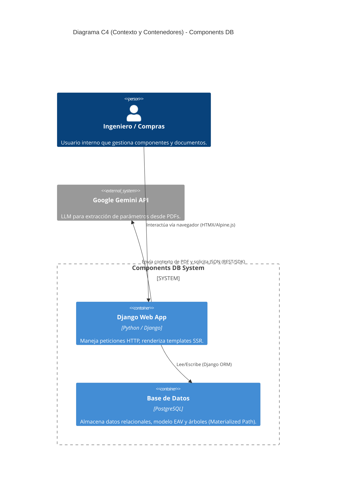
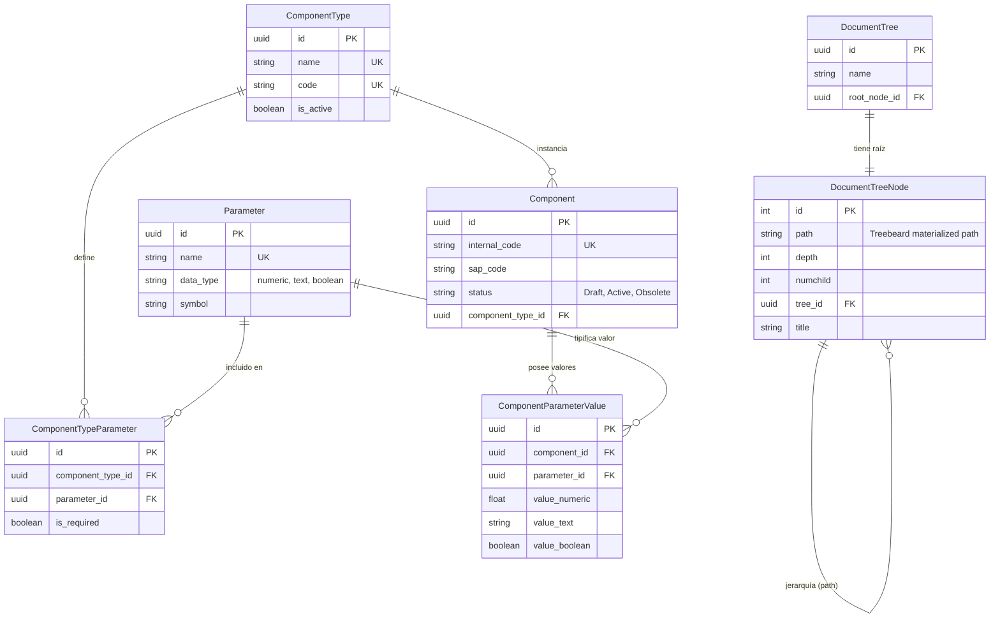

# Índice
- [0. Ficha del proyecto](#0-ficha-del-proyecto)
- [1. Descripción general del producto](#1-descripción-general-del-producto)
- [2. Arquitectura del sistema](#2-arquitectura-del-sistema)
- [3. Modelo de datos](#3-modelo-de-datos)
- [4. Especificación de la API](#4-especificación-de-la-api)
- [5. Historias de usuario](#5-historias-de-usuario)
- [6. Tickets de trabajo](#6-tickets-de-trabajo)
- [7. Pull requests](#7-pull-requests)

---

## 0. Ficha del proyecto

**0.1. Tu nombre completo:**  
Juan Andrés Chacón Matteo

**0.2. Nombre del proyecto:**  
Components DB — Catálogo Estructurado de Componentes Eléctricos

**0.3. Descripción breve del proyecto:**  
Un catálogo técnico centralizado para la gestión del ciclo de vida de componentes eléctricos utilizados en equipos de calidad de energía (power quality). Incorpora un modelo dinámico de parámetros (EAV), organización jerárquica de documentación técnica, búsqueda paramétrica avanzada y extracción de datos mediante IA a partir de catálogos en PDF (datasheets).

**0.4. URL del proyecto:**  
[Video Demostrativo del Proyecto (YouTube)](https://youtu.be/cKT7xfK0j88)  
*(Nota: Dado que el repositorio es privado y no está desplegado para acceso público, se ha autorizado proveer este video explicativo en lugar del acceso al proyecto).*

**0.5. URL o archivo comprimido del repositorio**  
https://github.com/jnchacon/components-db (Repositorio Privado - Acceso compartido con la TA).

---

## 1. Descripción general del producto

### 1.1. Objetivo:
Proporcionar una única fuente de verdad (Single Source of Truth) para la selección de componentes eléctricos, la gestión de su documentación técnica y la evaluación de proveedores en el Grupo Arteche. Esto resuelve el problema actual de la información fragmentada en Excel, carpetas compartidas y correos electrónicos, reduciendo tiempos de diseño y errores en la cadena de suministro.

### 1.2. Características y funcionalidades principales:
1. **Gestión del Catálogo y Parámetros (EAV híbrido):** Creación dinámica de parámetros tipados (numérico, texto, booleano) que se asignan a Tipos de Componentes, permitiendo gran flexibilidad.
2. **Ciclo de vida de Componentes:** Gestión de estados (Borrador → Activo → Obsoleto) con changelog (registro de auditoría) automático para mantener trazabilidad de los cambios.
3. **Árboles Documentales (Document Trees):** Organización jerárquica ilimitada de documentación técnica utilizando el patrón Materialized Path (`django-treebeard`).
4. **Gestión de Documentos y Etiquetas transversales:** Subida de documentos con control de versiones (una subida nueva no pisa la anterior, la versiona) y un sistema de clasificación por tags.
5. **Búsqueda Paramétrica Avanzada:** Filtros dinámicos generados en función del tipo de componente que permiten búsquedas precisas (ej. Ur >= 24kV) sin penalizar el rendimiento.
6. **Extracción de Parámetros con Inteligencia Artificial:** Integración de un pipeline que recibe un datasheet en PDF, extrae el texto (PyMuPDF) y usa un LLM (Google Gemini) para extraer automáticamente los valores técnicos con una UI de validación humana (split-screen).

### 1.3. Diseño y experiencia de usuario:
> **Nota:** Al ser un repositorio privado y sin despliegue público, se provee el siguiente **[video demostrativo (Ver en YouTube)](https://youtu.be/cKT7xfK0j88)** a la TA que cubre la experiencia de usuario completa, desde la navegación en el catálogo hasta la extracción con IA en tiempo real. 

El diseño se apoya en el **Design System corporativo de Arteche**, utilizando una paleta sobria (tonos azules, grises y teal) que transmite profesionalismo técnico. Se ha minimizado el recargo cognitivo utilizando HTMX para actualizaciones parciales del DOM (por ejemplo, al filtrar parámetros no se recarga toda la página) y Alpine.js para interacciones menores (modales, tooltips), logrando una experiencia tipo SPA sin su complejidad arquitectónica.

### 1.4. Instrucciones de instalación:
Para poner en marcha el proyecto en un entorno local (desarrollo):

```bash
# 1. Clonar el repositorio y acceder a la carpeta
git clone https://github.com/jnchacon/components-db.git
cd components-db

# 2. Crear y activar el entorno virtual (Python 3.14+)
python -m venv .venv
source .venv/bin/activate        # Linux/Mac
# .venv\Scripts\activate         # Windows

# 3. Instalar las dependencias de desarrollo
pip install -r requirements/development.txt

# 4. Levantar la base de datos PostgreSQL vía Docker Compose
docker compose -f docker/docker-compose.dev.yml up -d

# 5. Configurar las variables de entorno
cp .env.example .env
# IMPORTANTE: Abrir .env y configurar DJANGO_SECRET_KEY, DB_PASSWORD y GEMINI_API_KEY.

# 6. Ejecutar migraciones y popular la base de datos con semillas (seeders)
make migrate
make seed

# 7. Levantar el servidor de desarrollo de Django
make run
```
El sistema estará disponible en `http://localhost:8000`.

---

## 2. Arquitectura del Sistema

### 2.1. Diagrama de arquitectura:
El proyecto sigue una arquitectura de **Monolito Modular** y el patrón **Server-Side Rendering (SSR) con hidratación ligera**. 


```mermaid
C4Context
title Diagrama C4 (Contexto y Contenedores) - Components DB

Person(engineer, "Ingeniero / Compras", "Usuario interno que gestiona componentes y documentos.")
System_Boundary(c1, "Components DB System") {
    Container(web_app, "Django Web App", "Python / Django", "Maneja peticiones HTTP, renderiza templates SSR.")
    Container(db, "Base de Datos", "PostgreSQL", "Almacena datos relacionales, modelo EAV y árboles (Materialized Path).")
}
System_Ext(gemini, "Google Gemini API", "LLM para extracción de parámetros desde PDFs.")

Rel(engineer, web_app, "Interactúa vía navegador (HTMX/Alpine.js)")
Rel(web_app, db, "Lee/Escribe (Django ORM)")
Rel(web_app, gemini, "Envía contexto de PDF y solicita JSON (REST/SDK)")
```

**Justificación:** Se ha optado por Django puro con HTMX y Alpine.js porque elimina la barrera de mantener repositorios separados (Backend/Frontend), simplifica la autenticación (cookies nativas de Django) y acelera el desarrollo. HTMX permite la reactividad que los usuarios modernos exigen (como la búsqueda en vivo y subida de archivos sin recargar) sin el exceso de código de React/Vue. Las lógicas complejas se mantienen encapsuladas en un patrón de *Service Layer* dentro de Django, aislando las vistas de la mutación de datos.

### 2.2. Descripción de componentes principales:
- **Backend (Django 6.0):** Actúa como el core del sistema. Implementa un *Service Layer* para las transacciones complejas. Utiliza el módulo `django-treebeard` para manejar la jerarquía documental de forma eficiente en base de datos.
- **Frontend (HTMX + Alpine.js):** HTMX se encarga de interceptar los envíos de formularios y clicks para hacer peticiones AJAX, reemplazando parciales (partials HTML) del DOM de forma declarativa. Alpine.js maneja el estado local UI (ej. abrir/cerrar un dropdown).
- **Base de Datos (PostgreSQL 16):** Elegido por su robustez, soporte de operaciones JSON (si hicieran falta en el futuro) y buen rendimiento en queries complejas requeridas por el modelo EAV de los componentes.
- **AI Extraction Service (PyMuPDF + google-genai):** Un pipeline interno en Django que intercepta el PDF subido, extrae el texto puro y lo envía a Gemini con un system prompt estructurado para forzar una respuesta JSON basada en el esquema del componente.

### 2.3. Descripción de alto nivel del proyecto y estructura de ficheros
El proyecto se organiza bajo los estándares modernos de Python, separando el código fuente en `src/` y agrupando aplicaciones por dominio (monolito modular).

```text
components-db/
├── src/
│   ├── config/              # Configuraciones de Django (settings divididos, urls)
│   ├── apps/
│   │   ├── catalog/         # Lógica de Familias, Tipos y Fabricantes
│   │   ├── components/      # CRUD de Componentes y modelo EAV
│   │   ├── documents/       # Árboles documentales (Treebeard)
│   │   ├── ai/              # Pipeline de extracción de parámetros y validación
│   │   └── core/            # Logging, mixins y commands (seeders) transversales
│   ├── templates/           # Vistas SSR globales y base layout
│   └── static/              # CSS (Vanilla), imágenes, fuentes y vendors (HTMX)
├── tests/                   # Tests unitarios e integración (pytest)
├── docs/                    # PRDs, SRS, y Backlog en formato Kanban HTML
├── .agents/                 # Entorno de Meta-workflows LIDR Specboot y skills
└── pyproject.toml           # Configuración de Ruff, pytest y herramientas
```

### 2.4. Infraestructura y despliegue
El proyecto está paquetizado para poder ser desplegado en clústers o VPS corporativos (ej. Proxmox) utilizando Docker.
- Se ha configurado un `docker-compose` que levanta los servicios dependientes. 
- Django corre detrás de `Gunicorn` como servidor WSGI de producción, sirviendo archivos estáticos a través de un colector y siendo proxy-reverso mediante un Nginx corporativo.
- El despliegue de base de datos se maneja a través de volúmenes persistentes en Docker y copias de seguridad programadas de PostgreSQL.

### 2.5. Seguridad
- **Protección CSRF y XSS:** Al usar Django Templates y HTMX, el token CSRF va incluido en el encabezado de todas las peticiones asíncronas automáticamente. Django sanitiza por defecto las salidas HTML previniendo inyecciones XSS.
- **Control de Acceso basado en Roles (RBAC):** Uso del middleware y decoradores nativos de Django (`@login_required`, `@permission_required`) junto con una validación extra a nivel de *Service Layer* para mutaciones críticas.
- **Validación del lado del servidor (Source of Truth):** Aunque el frontend (HTMX) filtra entradas, la lógica de validación real (inmutabilidad del tipo de componente, unicidad del código SAP) reside en la capa de servicios del backend.

### 2.6. Tests
Se utiliza `pytest`, `pytest-django` y `factory-boy`.
- **Unit Tests:** Validación de los managers personalizados y funciones de formateo (ej. limpiadores de strings JSON de Gemini).
- **Integration Tests:** Verifican los flujos HTMX; por ejemplo, que al enviar el formulario `POST /ai/extract/` el sistema realmente haga un mock a la API de Google, parsee el JSON y retorne un template HTML parcial con los tags OOB (`hx-swap-oob`) correctos para actualizar la vista sin errores.

---

## 3. Modelo de Datos

### 3.1. Diagrama del modelo de datos:
El sistema contiene 15 entidades, siendo las más críticas las del patrón EAV y el Árbol Documental. A continuación, el esquema principal:


```mermaid
erDiagram
    ComponentType {
        uuid id PK
        string name "UK"
        string code "UK"
        boolean is_active
    }
    
    Parameter {
        uuid id PK
        string name "UK"
        string data_type "numeric, text, boolean"
        string symbol
    }

    ComponentTypeParameter {
        uuid id PK
        uuid component_type_id FK
        uuid parameter_id FK
        boolean is_required
    }

    Component {
        uuid id PK
        string internal_code "UK"
        string sap_code
        string status "Draft, Active, Obsolete"
        uuid component_type_id FK
    }

    ComponentParameterValue {
        uuid id PK
        uuid component_id FK
        uuid parameter_id FK
        float value_numeric
        string value_text
        boolean value_boolean
    }

    DocumentTree {
        uuid id PK
        string name
        uuid root_node_id FK
    }

    DocumentTreeNode {
        int id PK
        string path "Treebeard materialized path"
        int depth
        int numchild
        uuid tree_id FK
        string title
    }

    ComponentType ||--o{ ComponentTypeParameter : "define"
    Parameter ||--o{ ComponentTypeParameter : "incluido en"
    ComponentType ||--o{ Component : "instancia"
    Component ||--o{ ComponentParameterValue : "posee valores"
    Parameter ||--o{ ComponentParameterValue : "tipifica valor"
    DocumentTree ||--|| DocumentTreeNode : "tiene raíz"
    DocumentTreeNode ||--o{ DocumentTreeNode : "jerarquía (path)"
```

### 3.2. Descripción de entidades principales:
- **`Component`**: Representa una pieza física en el mundo real. Campos: `id` (UUID, PK), `internal_code` (Char, Unique), `status` (Choice), `component_type` (FK a ComponentType).
- **`ComponentParameterValue`**: Entidad del modelo EAV que guarda el valor concreto. Campos: `id` (PK), `component` (FK), `parameter` (FK). En lugar de usar JSON o un solo campo string, usa *columnas tipadas* (`value_numeric`, `value_text`, `value_boolean`) para permitir indexación nativa y búsquedas matemáticas (`>` o `<`) directas en PostgreSQL.
- **`DocumentTreeNode`**: Un nodo dentro de la jerarquía documental. Extiende de la clase base de `django-treebeard` (Materialized Path). Usa el campo `path` (String) para mantener la jerarquía (ej. `000100020003` denota nivel 3), facilitando lecturas ultra-rápidas del subárbol sin consultas recursivas complejas en base de datos.

---

## 4. Especificación de la API

Dado que el sistema renderiza HTML en el servidor vía **HTMX**, no existe una API REST que devuelva JSON para clientes genéricos. Las "rutas API" se comportan como endpoints internos que devuelven componentes de interfaz.

**1. Endpoint de Extracción IA**
- **Ruta:** `POST /htmx/ai/extract-parameters/<uuid:component_type_id>/`
- **Request (Multipart):** Un archivo `pdf_file`.
- **Comportamiento:** Procesa el PDF, consulta el esquema de parámetros esperados según el ID proporcionado, hace la llamada bloqueante a Gemini.
- **Respuesta (HTML):** Retorna fragmentos HTML combinados utilizando directivas `hx-swap-oob`. Un fragmento rellena los inputs del formulario de parámetros, y otro fragmento despliega una barra lateral con las "sugerencias detectadas por la IA" para revisión humana.

**2. Endpoint de Filtros Dinámicos (Búsqueda Paramétrica)**
- **Ruta:** `GET /htmx/components/filters/<uuid:component_type_id>/`
- **Respuesta (HTML):** Retorna un formulario HTML que itera sobre los `ComponentTypeParameter` del tipo elegido, renderizando inputs `<input type="number">` o `<select>` dependiendo de si el tipo de dato subyacente del parámetro es numérico o booleano.

**3. Endpoint de Mover Nodo de Árbol**
- **Ruta:** `POST /htmx/documents/node/<int:node_id>/move/`
- **Request (JSON):** `{"target_parent_id": 15}`
- **Respuesta:** En caso de éxito retorna el fragmento HTML del árbol re-renderizado para sustituir el contenedor principal de la vista documental, asegurando sincronía visual inmediata.

---

## 5. Historias de Usuario

**Historia de Usuario 1: Ciclo de vida de Componentes (US-04)**
- **Como** Ingeniero de Desarrollo.
- **Quiero** dar de alta un componente en estado "Borrador" y solo pasarlo a "Activo" cuando todos sus parámetros y documentos estén validados.
- **Para** asegurar que Producción o Compras no utilicen referencias técnicas incompletas.
- **Criterios de Aceptación:** 
  1. Al crear el componente, su estado por defecto es "Draft".
  2. En estado Draft se pueden editar los valores libremente sin generar changelog.
  3. Un botón permite transicionar a "Active".
  4. Una vez Activo, cualquier modificación a sus parámetros debe requerir confirmación y generar una entrada automática en el `AuditLog`.

**Historia de Usuario 2: Extracción con IA (US-08)**
- **Como** Ingeniero de Producto.
- **Quiero** poder subir el datasheet (PDF) de un fabricante y que el sistema detecte automáticamente los valores técnicos que corresponden al componente.
- **Para** no tener que copiar y pegar decenas de valores manualmente (Data Entry), ahorrando tiempo y evitando errores de tipeo.
- **Criterios de Aceptación:**
  1. La interfaz del formulario debe tener un botón para "Cargar desde PDF".
  2. El sistema procesa el PDF (hasta 15 páginas) y devuelve los campos sugeridos.
  3. Los campos autocompletados deben resaltarse visualmente.
  4. El usuario siempre tiene la última palabra: debe poder sobreescribir o rechazar una sugerencia antes de guardar.

**Historia de Usuario 3: Árbol Documental (US-02)**
- **Como** Documentalista Técnico.
- **Quiero** poder estructurar jerárquicamente carpetas/nodos documentales y moverlos de lugar con facilidad (Reparenting).
- **Para** organizar los documentos técnicos según normas o familias de producto que van evolucionando.
- **Criterios de Aceptación:**
  1. Interfaz visual que represente el árbol colapsable.
  2. Posibilidad de arrastrar y soltar un nodo sobre otro para convertirlo en su hijo.
  3. El sistema debe evitar bucles circulares (un nodo no puede ser padre de sí mismo).

---

## 6. Tickets de Trabajo

**Ticket 1 (Backend / DB): Búsqueda Paramétrica sobre EAV**
- **Descripción:** Implementar el motor de búsqueda avanzado para componentes. El usuario enviará `N` parámetros de filtro en el request. Como los valores están guardados en una tabla secundaria (`ComponentParameterValue`) en un formato vertical (EAV), no se puede hacer un simple `.filter()`.
- **Tareas:**
  1. Parsear los datos del GET request dinámicamente (`filter_numeric_min_UUID`).
  2. Construir objetos `Q` de Django combinando condiciones.
  3. Utilizar Subqueries o sentencias `Exists` para validar que el Componente posee múltiples valores que cumplen las condiciones concurrentemente sin crear productos cartesianos en la query.
- **Buenas Prácticas:** Se deben escribir tests parametrizados para probar las intersecciones complejas (ej. "Componente que tiene Ur >= 10 AND Ir < 500").

**Ticket 2 (Frontend / HTMX): Panel Lateral y OOB Swaps de IA**
- **Descripción:** Cuando la IA retorna los datos extraídos del PDF, la pantalla debe actualizar múltiples zonas desconectadas entre sí: los campos del formulario central, y un sidebar lateral que muestra las justificaciones y notas generadas por Gemini.
- **Tareas:**
  1. Crear el template base que reciba la respuesta de la extracción.
  2. Envolver el contenido del sidebar en un `<div hx-swap-oob="innerHTML:#ai-sidebar">`.
  3. Asegurar que Alpine.js re-inicialice (hydratation) los campos de input cuando HTMX inyecte el nuevo DOM.
- **Buenas Prácticas:** Mantener los id HTML completamente unívocos y delegar los eventos al `body` (`htmx:afterSwap`) si se requieren animaciones de éxito.

**Ticket 3 (Backend / IA Pipeline): Parseo robusto del LLM**
- **Descripción:** La API de Google Gemini es no-determinista y puede incluir bloques de formato Markdown (ej. ` ```json {..} ``` `) alrededor de la respuesta estructurada JSON que se le solicita, lo que rompe el parseador `json.loads` de Python.
- **Tareas:**
  1. Crear una clase `AIExtractionService`.
  2. Instanciar `PyMuPDF` y volcar el texto del PDF subido.
  3. Crear un System Prompt fuerte que exija el esquema estricto (pasando la lista de parámetros esperados).
  4. Crear un sanitizador (regex o string manipulation) que limpie el inicio/fin de la respuesta del LLM antes de deserializar a dict.
- **Buenas Prácticas:** Proveer de mecanismos Fallback. Si el parseo falla 2 veces consecutivas (retry), devolver un error controlado al frontend mediante un HTTP 422 para que HTMX pinte un Alert.

---

## 7. Pull Requests

**Pull Request 1: Implementación del Modelo EAV y CRUD (PR #18)**
- **Descripción:** Este PR sentó las bases de la aplicación de Componentes. Se implementó la arquitectura EAV con las columnas tipadas y el servicio responsable de crear/editar un componente asegurando la consistencia atómica (`transaction.atomic`). 
- **Impacto:** Permitió la creación dinámica de formularios de captura de datos, desvinculando por completo el código (clases Django) de la estructura del catálogo (que ahora es gobernada por los administradores en runtime).

**Pull Request 2: Motor de Árboles con django-treebeard (PR #19)**
- **Descripción:** Se introdujo la dependencia externa de treebeard para Materialized Paths. Se implementaron los endpoints HTMX para las operaciones CRUD del nodo y la validación que impide el borrado accidental de ramas que contengan documentos.
- **Impacto:** Resolvió la US-02 con una solución performante a nivel de base de datos para lectura (las lecturas de sub-ramas completas ahora toman ~2ms).

**Pull Request 3: Extracción de parámetros con Gemini (PR #23)**
- **Descripción:** Este PR conectó por primera vez la aplicación con un servicio LLM externo, estableciendo el SDK `google-genai` e introduciendo el concepto de validación "Human in the loop". Se implementó la lógica en el `AIExtractionService` y sus correspondientes tests unitarios usando mocks de la respuesta REST.
- **Impacto:** Redujo teóricamente el tiempo de *Data Entry* de los ingenieros de 10 minutos por componente a menos de 30 segundos, representando el MVP del valor diferencial del producto.
