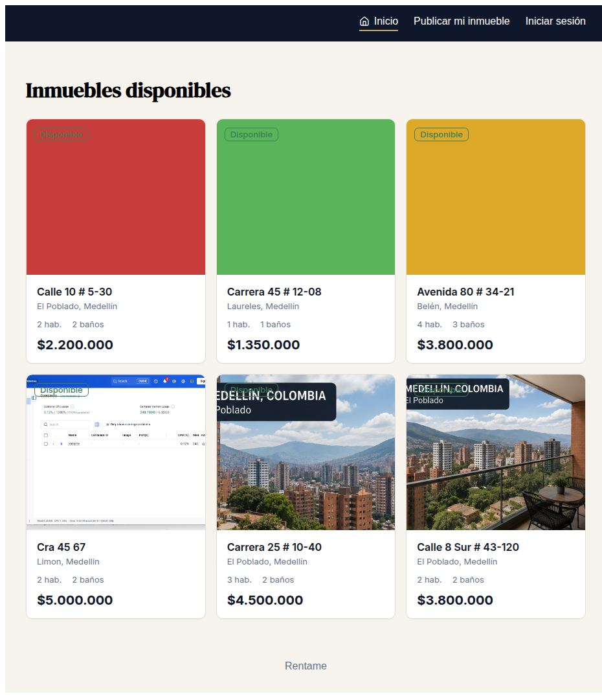
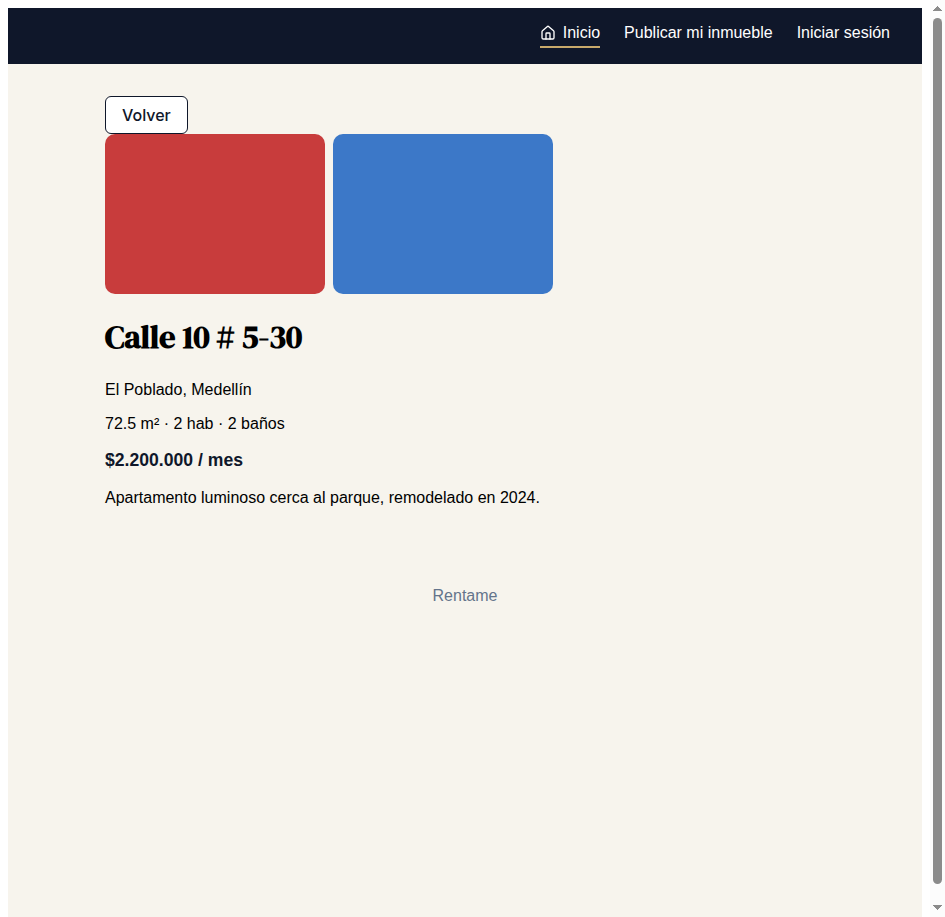
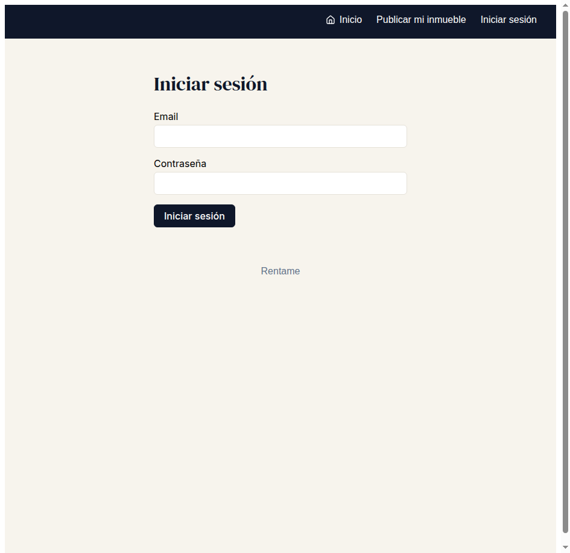
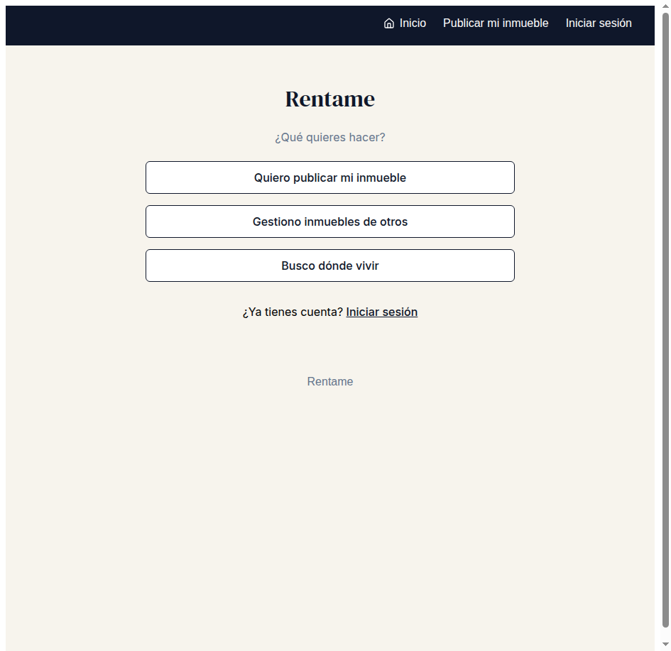
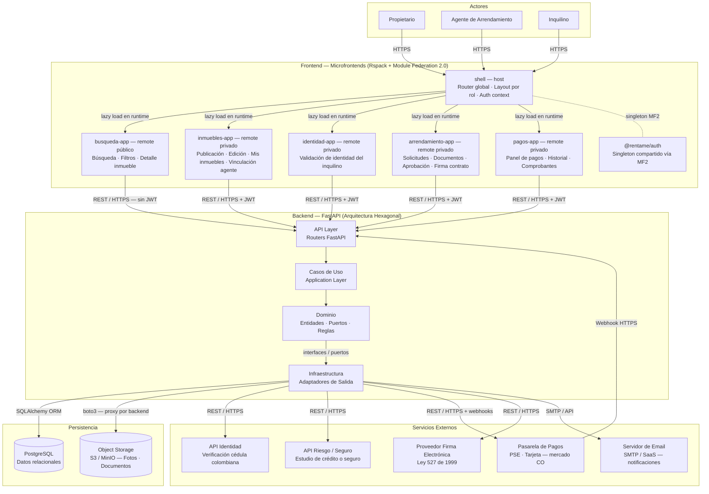
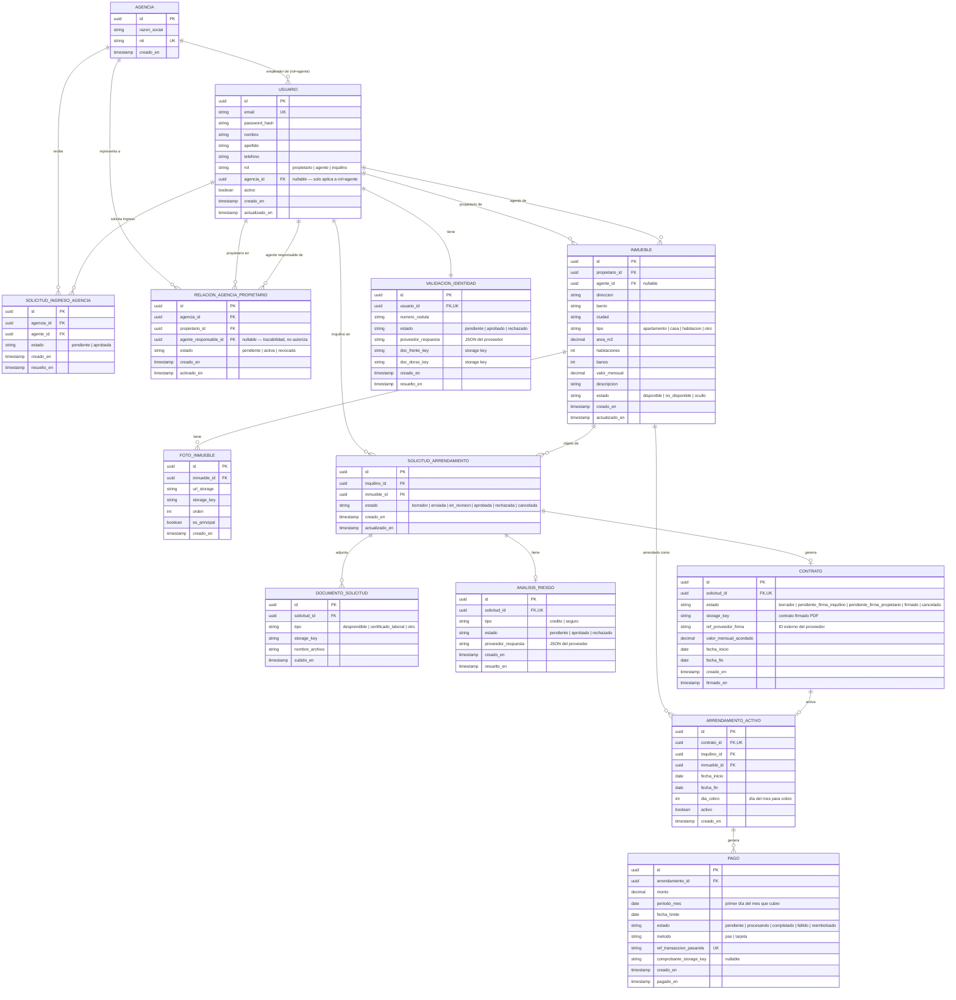

## Índice

0. [Ficha del proyecto](#0-ficha-del-proyecto)
1. [Descripción general del producto](#1-descripción-general-del-producto)
2. [Arquitectura del sistema](#2-arquitectura-del-sistema)
3. [Modelo de datos](#3-modelo-de-datos)
4. [Especificación de la API](#4-especificación-de-la-api)
5. [Historias de usuario](#5-historias-de-usuario)
6. [Tickets de trabajo](#6-tickets-de-trabajo)
7. [Pull requests](#7-pull-requests)

---

## 0. Ficha del proyecto

### **0.1. Tu nombre completo:**

Juan Manuel Aguirre

### **0.2. Nombre del proyecto:**

Plataforma de Arrendamiento Residencial de Larga Estadía

### **0.3. Descripción breve del proyecto:**

Plataforma que digitaliza de extremo a extremo el ciclo de arrendamiento residencial de larga estadía (mínimo 6 meses) en Colombia, con foco inicial en Medellín. Permite a propietarios y agentes publicar inmuebles, y a inquilinos buscarlos, validar su identidad, pasar el análisis de riesgo o seguro de arrendamiento, firmar el contrato digitalmente y pagar la renta mensual, todo sin presencialidad ni firma física. Detalle completo en el [PRD](docs/PRD-plataforma-arrendamiento-larga-estadia.md).

### **0.4. URL del proyecto:**

> Pendiente — el proyecto está en fase de diseño (PRD, historias de usuario y arquitectura técnica ya definidos, ver [docs/](docs/)); aún no existe un despliegue público.

### 0.5. URL o archivo comprimido del repositorio

https://github.com/juanma1000/rentame

---

## 1. Descripción general del producto

> Describe en detalle los siguientes aspectos del producto:

### **1.1. Objetivo:**

El arrendamiento residencial en Colombia es hoy un proceso fragmentado y mayoritariamente manual: los portales muestran disponibilidad desactualizada, la documentación del inquilino se envía por correo o WhatsApp, y el estudio de crédito se hace en plataformas externas ajenas a la publicación. El resultado es un proceso lento, opaco y presencial en el que un inquilino puede tardar horas o días en saber si un inmueble sigue disponible.

El objetivo de esta plataforma es digitalizar el ciclo completo de arrendamiento de larga estadía: que un propietario pueda publicar su inmueble, y que un inquilino pueda encontrarlo, validar su identidad, pasar el análisis de riesgo, firmar el contrato y pagar la mensualidad — todo dentro de la plataforma, sin visitas presenciales ni firmas físicas. A quien más le duele este problema hoy es al inquilino, que es también el usuario cuya experiencia guía las decisiones de producto.

Ver el detalle completo (problema, usuarios, métricas de éxito, restricciones y riesgos) en el [PRD](docs/PRD-plataforma-arrendamiento-larga-estadia.md).

### **1.2. Características y funcionalidades principales:**

El MVP cubre siete funcionalidades clave, cada una desarrollada en detalle como historia de usuario:

1. **Publicación de inmuebles** — propietarios ([HU-001](docs/user-stories/HU-001-publicacion-inmueble-propietario.md)) o agentes en su representación ([HU-002](docs/user-stories/HU-002-publicacion-inmueble-agente.md)) publican el inmueble con información, fotos y disponibilidad real. El estado cambia a "No disponible" automáticamente al completarse un arrendamiento.
2. **Búsqueda de inmuebles disponibles** ([HU-003](docs/user-stories/HU-003-busqueda-inmuebles-disponibles.md)) — búsqueda y filtrado en tiempo real, sin necesidad de registro, mostrando únicamente inmuebles realmente disponibles.
3. **Validación de identidad del inquilino** ([HU-004](docs/user-stories/HU-004-validacion-identidad-inquilino.md)) — verificación de cédula de ciudadanía colombiana vía API externa, requisito previo al proceso de arrendamiento.
4. **Análisis de riesgo o seguro de arrendamiento + firma de contrato** ([HU-005](docs/user-stories/HU-005-analisis-riesgo-seguro-arrendamiento.md)) — estudio de crédito o contratación de seguro, y firma electrónica del contrato con validez legal en Colombia (Ley 527 de 1999).
5. **Pago mensual de renta** ([HU-006](docs/user-stories/HU-006-pago-mensual-renta.md)) — cobro dentro de la plataforma mediante pasarela de pagos colombiana (PSE/tarjeta), con historial y comprobantes.
6. **Gestión de agencias** ([HU-007](docs/user-stories/HU-007-gestion-de-agencias.md)) — las agencias existen como entidad propia a la que pertenecen uno o más agentes, y se vinculan a propietarios mediante una relación con estados (pendiente/activa/revocada), sosteniendo el vínculo agencia-propietario aunque cambie el agente que atiende al cliente.
7. **Registro y autenticación** ([HU-008](docs/user-stories/HU-008-registro-y-autenticacion.md)) — creación de cuenta con email/contraseña y rol fijo (propietario/agente/inquilino) elegido en el registro; para agentes, el registro exige crear una agencia nueva o solicitar unirse a una existente.

El listado completo de historias de usuario, con criterios de aceptación y notas técnicas, está en [docs/user-stories/](docs/user-stories/).

### **1.3. Diseño y experiencia de usuario:**

Capturas del frontend real de este mismo proyecto, implementado en [Rentame](https://github.com/juanma1000/Rentame) — este repositorio contiene la documentación (PRD, historias de usuario, arquitectura) y Rentame el código fuente que la implementa, según la estructura de microfrontends descrita en la [arquitectura](docs/architecture/architecture.md#5-estructura-de-carpetas--frontend-microfrontends):

| Búsqueda pública de inmuebles | Detalle de inmueble |
|---|---|
|  |  |

| Inicio de sesión | Entrada al flujo de publicación |
|---|---|
|  |  |

### **1.4. Instrucciones de instalación:**

El stack completo (PostgreSQL, MinIO con el bucket inicializado, backend FastAPI y frontend) se levanta con un único comando, vía Docker Compose:

```bash
cp .env.example .env
docker compose up -d
```

- Backend (API FastAPI): `http://localhost:8000`
- Frontend: `http://localhost:3000`
- Consola de MinIO: `http://localhost:9001`

> Nota: este comando corresponde al repositorio de código fuente [Rentame](https://github.com/juanma1000/Rentame), que implementa la arquitectura definida en [docs/architecture/architecture.md](docs/architecture/architecture.md). Este repositorio (`AI4Devs-finalproject`) contiene la documentación del proyecto (PRD, historias de usuario, arquitectura); el `docker-compose.yml`, `backend/` y `frontend/` viven en Rentame.

---

## 2. Arquitectura del Sistema

### **2.1. Diagrama de arquitectura:**


```mermaid
graph TD
    subgraph Actores
        PRP[Propietario]
        AGT[Agente de Arrendamiento]
        INQ[Inquilino]
    end

    subgraph Frontend["Frontend — Microfrontends (Rspack + Module Federation 2.0)"]
        SHELL["shell — host\nRouter global · Layout por rol · Auth context"]
        BUSQAPP["busqueda-app — remote público\nBúsqueda · Filtros · Detalle inmueble"]
        INMAPP["inmuebles-app — remote privado\nPublicación · Edición · Mis inmuebles · Vinculación agente"]
        IDENTAPP["identidad-app — remote privado\nValidación de identidad del inquilino"]
        ARRAPP["arrendamiento-app — remote privado\nSolicitudes · Documentos · Aprobación · Firma contrato"]
        PAGAPP["pagos-app — remote privado\nPanel de pagos · Historial · Comprobantes"]
        AUTHPKG["@rentame/auth\nSingleton compartido vía MF2"]

        SHELL -->|lazy load en runtime| BUSQAPP
        SHELL -->|lazy load en runtime| INMAPP
        SHELL -->|lazy load en runtime| IDENTAPP
        SHELL -->|lazy load en runtime| ARRAPP
        SHELL -->|lazy load en runtime| PAGAPP
        SHELL -.-|singleton MF2| AUTHPKG
    end

    subgraph Backend["Backend — FastAPI (Arquitectura Hexagonal)"]
        API[API Layer\nRouters FastAPI]
        UC[Casos de Uso\nApplication Layer]
        DOM[Dominio\nEntidades · Puertos · Reglas]
        INFRA[Infraestructura\nAdaptadores de Salida]
    end

    subgraph Persistencia["Persistencia"]
        PG[(PostgreSQL\nDatos relacionales)]
        S3[(Object Storage\nS3 / MinIO — Fotos · Documentos)]
    end

    subgraph Externos["Servicios Externos"]
        IDENT[API Identidad\nVerificación cédula colombiana]
        RIESGO[API Riesgo / Seguro\nEstudio de crédito o seguro]
        PAGOS[Pasarela de Pagos\nPSE · Tarjeta — mercado CO]
        FIRMA[Proveedor Firma Electrónica\nLey 527 de 1999]
        EMAIL[Servidor de Email\nSMTP / SaaS — notificaciones]
    end

    PRP -->|HTTPS| SHELL
    AGT -->|HTTPS| SHELL
    INQ -->|HTTPS| SHELL

    BUSQAPP -->|REST / HTTPS — sin JWT| API
    INMAPP -->|REST / HTTPS + JWT| API
    IDENTAPP -->|REST / HTTPS + JWT| API
    ARRAPP -->|REST / HTTPS + JWT| API
    PAGAPP -->|REST / HTTPS + JWT| API

    API --> UC
    UC --> DOM
    DOM -->|interfaces / puertos| INFRA

    INFRA -->|SQLAlchemy ORM| PG
    INFRA -->|boto3 — proxy por backend| S3
    INFRA -->|REST / HTTPS| IDENT
    INFRA -->|REST / HTTPS| RIESGO
    INFRA -->|REST / HTTPS + webhooks| PAGOS
    INFRA -->|REST / HTTPS| FIRMA
    INFRA -->|SMTP / API| EMAIL

    PAGOS -->|Webhook HTTPS| API
```

El backend sigue **arquitectura hexagonal** (dominio → aplicación → infraestructura, con adaptadores de entrada y salida separados) y **slicing por dominio/feature** (`usuarios`, `inmuebles`, `agencias`, `identidad`, `arrendamiento`, `riesgo`, `pagos`). Esta decisión se justifica porque el proyecto depende de **cuatro integraciones externas cuyo proveedor concreto todavía no está seleccionado** (identidad, riesgo/seguro, pagos, firma electrónica — ver [puntos abiertos del PRD](docs/PRD-plataforma-arrendamiento-larga-estadia.md#puntos-abiertos-requieren-decisión-antes-de-diseño-técnico)): cada una se modela como un puerto abstracto (`IdentityVerificationPort`, `RiskAssessmentPort`, `PaymentGatewayPort`, `ElectronicSignaturePort`) para que el dominio y los casos de uso no dependan de un proveedor específico, y el adaptador concreto se conecte más adelante sin rediseñar nada.

El frontend adopta **microfrontends con Rspack + Module Federation 2.0**: un `shell` (host) que carga en runtime remotes independientes por dominio (`busqueda-app`, `inmuebles-app`, `identidad-app`, `arrendamiento-app`, `pagos-app`), más un paquete `@rentame/auth` compartido como singleton para el estado de sesión. Cada dominio de negocio tiene así su propio ciclo de desarrollo y despliegue, evitando redeployar toda la aplicación al evolucionar un remote como `pagos-app`.

**Beneficios:** permite avanzar en el desarrollo sin bloquear por decisiones de proveedor todavía pendientes; facilita testear cada dominio con adaptadores mock; aísla el impacto de cambiar de proveedor a un solo archivo de infraestructura; los remotes del frontend se despliegan y evolucionan de forma independiente por dominio.

**Costos/déficits:** más capas e indirection que un CRUD directo — mayor esfuerzo inicial de scaffolding para un equipo unipersonal; requiere disciplina para no filtrar detalles de infraestructura hacia el dominio; el setup de 6 proyectos Rspack (shell + 5 remotes) y la coordinación de contratos entre ellos añaden complejidad operativa frente a una SPA única.

Diagrama completo, tabla de componentes y las 5 diagramas de secuencia de los flujos críticos del MVP en [docs/architecture/architecture.md](docs/architecture/architecture.md).

### **2.2. Descripción de componentes principales:**

| Componente | Tecnología | Responsabilidad |
|---|---|---|
| shell (host) | React + Vite + Rspack + Module Federation 2.0 | Router global, layout por rol y contexto de autenticación (`@rentame/auth`). Carga en runtime los remotes de cada dominio; no contiene lógica de negocio propia. |
| Remotes (`busqueda-app`, `inmuebles-app`, `identidad-app`, `arrendamiento-app`, `pagos-app`) | React + Rspack (MF2) | Cada uno implementa la UI de un dominio, consume la API REST y se despliega de forma independiente. |
| @rentame/auth | Paquete compartido (singleton MF2) | `AuthProvider`, `useAuth` y `AuthGuard` — una única instancia de sesión en runtime, compartida por el shell y todos los remotes. |
| API Layer | FastAPI + Pydantic | Adaptadores de entrada HTTP: validan esquemas, extraen JWT, delegan al caso de uso. Sin lógica de negocio. |
| Application Layer | Python (casos de uso) | Orquesta el dominio y coordina puertos de salida sin depender de implementaciones concretas. |
| Dominio | Python puro | Entidades, value objects y puertos (interfaces). Reglas de negocio sin dependencia de frameworks. |
| Infraestructura | SQLAlchemy, boto3, clientes HTTP | Adaptadores de salida: repositorios, storage, clientes de APIs externas. Implementan los puertos del dominio. |
| PostgreSQL | PostgreSQL | Base de datos relacional principal para todos los datos transaccionales y de estado. |
| Object Storage | S3 / MinIO | Fotos de inmuebles y documentos del inquilino (cédula, desprendibles, contratos firmados). |
| APIs externas | Identidad, riesgo/seguro, pasarela de pagos, firma electrónica (proveedor por definir en cada caso) | Integraciones colombianas conectadas vía puertos abstractos — ver [decisiones clave](docs/architecture/architecture.md#6-decisiones-clave). |

### **2.3. Descripción de alto nivel del proyecto y estructura de ficheros**

**Backend (FastAPI)** — arquitectura hexagonal + slicing por dominio (`usuarios`, `inmuebles`, `agencias`, `identidad`, `arrendamiento`, `riesgo`, `pagos`), cada uno con sus capas `domain/`, `application/` e `infrastructure/` (con `api/`, `persistence/` y `external/` separados), más un módulo `shared/` transversal:

```
backend/
├── main.py
├── alembic/
├── shared/
│   ├── domain/ · application/ · infrastructure/
├── usuarios/        # registro, login, JWT, rol fijo por cuenta
├── agencias/        # entidad agencia, ingreso de agentes, vínculo agencia-propietario
├── inmuebles/       # publicación, búsqueda, fotos en S3
├── identidad/       # validación de cédula colombiana
├── arrendamiento/   # solicitudes, documentos, contrato y firma
├── riesgo/          # RiskAssessmentPort (crédito y/o seguro)
└── pagos/           # cobro mensual, webhooks de pasarela
```

**Frontend (Microfrontends)** — un `shell` host más un remote independiente por dominio, cada uno consumiendo el paquete compartido `@rentame/auth`:

```
frontend/
├── shell/                # host: router global, layout por rol, monta los remotes
├── busqueda-app/         # remote público: búsqueda, filtros, detalle de inmueble
├── inmuebles-app/        # remote privado: publicación, edición, vinculación de agente
├── identidad-app/        # remote privado: validación de identidad del inquilino
├── arrendamiento-app/    # remote privado: solicitudes, documentos, firma de contrato
├── pagos-app/            # remote privado: panel de pagos, historial, comprobantes
└── packages/
    └── auth/             # @rentame/auth — singleton compartido vía Module Federation
```

Árbol completo de carpetas, con el propósito de cada archivo, en [docs/architecture/architecture.md §4-5](docs/architecture/architecture.md#4-estructura-de-carpetas--backend-fastapi).

### **2.4. Infraestructura y despliegue**

> Pendiente — no se ha definido todavía la infraestructura de despliegue (hosting, CI/CD, contenedores en producción). La arquitectura asume PostgreSQL y almacenamiento S3-compatible (MinIO en local / AWS S3 en producción) como decisiones de base — ver [decisiones clave](docs/architecture/architecture.md#6-decisiones-clave). Esta sección se completará junto con la fase de implementación e infraestructura.

### **2.5. Seguridad**

Prácticas de seguridad ya contempladas en el diseño (antes de implementación):

- **Autenticación stateless con JWT de solo access token** (sin refresh token): al expirar, el usuario vuelve a autenticarse. El singleton `@rentame/auth` gestiona el ciclo de vida del token en todos los remotes del frontend.
- **Validación de esquemas en el borde de entrada**: todos los endpoints FastAPI validan el payload con Pydantic antes de llegar al caso de uso, evitando que datos malformados o maliciosos lleguen al dominio.
- **Aislamiento de proveedores externos vía puertos abstractos**: las credenciales y detalles de cada integración (identidad, riesgo, pagos, firma) viven únicamente en el adaptador de infraestructura correspondiente, nunca en el dominio ni en la capa de aplicación.
- **Cumplimiento de la Ley 1581 de 2012 (Habeas Data)**: el manejo de documentos sensibles del inquilino (cédula, desprendibles de pago) requiere cifrado en reposo en el object storage y controles de acceso estrictos — ver [riesgos de la arquitectura](docs/architecture/architecture.md#7-riesgos).
- **Idempotencia en webhooks de pagos**, basada en `ref_transaccion_pasarela`, para evitar registrar un mismo pago dos veces ante reintentos de la pasarela.
- **Validez legal de la firma electrónica** bajo la Ley 527 de 1999, delegada a un proveedor certificado en Colombia (proveedor concreto pendiente de selección).

### **2.6. Tests**

> Pendiente — no existe código implementado todavía, por lo que no hay tests que documentar. Se completará esta sección durante la fase de desarrollo (unitarios de dominio/casos de uso, de integración por dominio, y end-to-end de los flujos críticos del MVP).

---

## 3. Modelo de Datos

### **3.1. Diagrama del modelo de datos:**


```mermaid
erDiagram
    USUARIO {
        uuid id PK
        string email UK
        string password_hash
        string nombre
        string apellido
        string telefono
        string rol "propietario | agente | inquilino"
        uuid agencia_id FK "nullable — solo aplica a rol=agente"
        boolean activo
        timestamp creado_en
        timestamp actualizado_en
    }

    AGENCIA {
        uuid id PK
        string razon_social
        string nit UK
        timestamp creado_en
    }

    SOLICITUD_INGRESO_AGENCIA {
        uuid id PK
        uuid agencia_id FK
        uuid agente_id FK
        string estado "pendiente | aprobada"
        timestamp creado_en
        timestamp resuelto_en
    }

    RELACION_AGENCIA_PROPIETARIO {
        uuid id PK
        uuid agencia_id FK
        uuid propietario_id FK
        uuid agente_responsable_id FK "nullable — trazabilidad, no autoriza"
        string estado "pendiente | activa | revocada"
        timestamp creado_en
        timestamp activado_en
    }

    INMUEBLE {
        uuid id PK
        uuid propietario_id FK
        uuid agente_id FK "nullable"
        string direccion
        string barrio
        string ciudad
        string tipo "apartamento | casa | habitacion | otro"
        decimal area_m2
        int habitaciones
        int banos
        decimal valor_mensual
        string descripcion
        string estado "disponible | no_disponible | oculto"
        timestamp creado_en
        timestamp actualizado_en
    }

    FOTO_INMUEBLE {
        uuid id PK
        uuid inmueble_id FK
        string url_storage
        string storage_key
        int orden
        boolean es_principal
        timestamp creado_en
    }

    VALIDACION_IDENTIDAD {
        uuid id PK
        uuid usuario_id FK, UK
        string numero_cedula
        string estado "pendiente | aprobado | rechazado"
        string proveedor_respuesta "JSON del proveedor"
        string doc_frente_key "storage key"
        string doc_dorso_key "storage key"
        timestamp creado_en
        timestamp resuelto_en
    }

    SOLICITUD_ARRENDAMIENTO {
        uuid id PK
        uuid inquilino_id FK
        uuid inmueble_id FK
        string estado "borrador | enviada | en_revision | aprobada | rechazada | cancelada"
        timestamp creado_en
        timestamp actualizado_en
    }

    DOCUMENTO_SOLICITUD {
        uuid id PK
        uuid solicitud_id FK
        string tipo "desprendible | certificado_laboral | otro"
        string storage_key
        string nombre_archivo
        timestamp subido_en
    }

    ANALISIS_RIESGO {
        uuid id PK
        uuid solicitud_id FK, UK
        string tipo "credito | seguro"
        string estado "pendiente | aprobado | rechazado"
        string proveedor_respuesta "JSON del proveedor"
        timestamp creado_en
        timestamp resuelto_en
    }

    CONTRATO {
        uuid id PK
        uuid solicitud_id FK, UK
        string estado "borrador | pendiente_firma_inquilino | pendiente_firma_propietario | firmado | cancelado"
        string storage_key "contrato firmado PDF"
        string ref_proveedor_firma "ID externo del proveedor"
        decimal valor_mensual_acordado
        date fecha_inicio
        date fecha_fin
        timestamp creado_en
        timestamp firmado_en
    }

    ARRENDAMIENTO_ACTIVO {
        uuid id PK
        uuid contrato_id FK, UK
        uuid inquilino_id FK
        uuid inmueble_id FK
        date fecha_inicio
        date fecha_fin
        int dia_cobro "día del mes para cobro"
        boolean activo
        timestamp creado_en
    }

    PAGO {
        uuid id PK
        uuid arrendamiento_id FK
        decimal monto
        date periodo_mes "primer día del mes que cubre"
        date fecha_limite
        string estado "pendiente | procesando | completado | fallido | reembolsado"
        string metodo "pse | tarjeta"
        string ref_transaccion_pasarela UK
        string comprobante_storage_key "nullable"
        timestamp creado_en
        timestamp pagado_en
    }

    AGENCIA ||--o{ USUARIO : "empleador de (rol=agente)"
    AGENCIA ||--o{ SOLICITUD_INGRESO_AGENCIA : "recibe"
    USUARIO ||--o{ SOLICITUD_INGRESO_AGENCIA : "solicita ingreso"
    AGENCIA ||--o{ RELACION_AGENCIA_PROPIETARIO : "representa a"
    USUARIO ||--o{ RELACION_AGENCIA_PROPIETARIO : "propietario en"
    USUARIO ||--o{ RELACION_AGENCIA_PROPIETARIO : "agente responsable de"
    USUARIO ||--o{ INMUEBLE : "propietario de"
    USUARIO ||--o{ INMUEBLE : "agente de"
    USUARIO ||--|| VALIDACION_IDENTIDAD : "tiene"
    USUARIO ||--o{ SOLICITUD_ARRENDAMIENTO : "inquilino en"

    INMUEBLE ||--o{ FOTO_INMUEBLE : "tiene"
    INMUEBLE ||--o{ SOLICITUD_ARRENDAMIENTO : "objeto de"
    INMUEBLE ||--o{ ARRENDAMIENTO_ACTIVO : "arrendado como"

    SOLICITUD_ARRENDAMIENTO ||--o{ DOCUMENTO_SOLICITUD : "adjunta"
    SOLICITUD_ARRENDAMIENTO ||--o| ANALISIS_RIESGO : "tiene"
    SOLICITUD_ARRENDAMIENTO ||--o| CONTRATO : "genera"

    CONTRATO ||--o| ARRENDAMIENTO_ACTIVO : "activa"

    ARRENDAMIENTO_ACTIVO ||--o{ PAGO : "genera"
```

Fuente y descripción del modelo en [docs/architecture/architecture.md §2](docs/architecture/architecture.md#2-diagrama-de-base-de-datos).

### **3.2. Descripción de entidades principales:**

- **USUARIO**: cuenta con rol fijo (`propietario`, `agente`, `inquilino`) elegido en el registro. `email` único. Un agente referencia su `agencia_id` — soporta [HU-008](docs/user-stories/HU-008-registro-y-autenticacion.md).
- **AGENCIA**: entidad propia (persona jurídica, `nit` único) a la que pertenecen uno o más agentes — soporta [HU-007](docs/user-stories/HU-007-gestion-de-agencias.md).
- **SOLICITUD_INGRESO_AGENCIA**: solicitud de un agente para unirse a una agencia existente, con estado (`pendiente | aprobada`) que requiere aprobación de un miembro ya vinculado.
- **RELACION_AGENCIA_PROPIETARIO**: vínculo entre una agencia y los propietarios que representa, con estado (`pendiente | activa | revocada`) y un agente responsable de trazabilidad (nullable) — soporta [HU-002](docs/user-stories/HU-002-publicacion-inmueble-agente.md).
- **INMUEBLE**: propiedad publicada por un propietario (y opcionalmente gestionada por un agente, FK nullable). `estado` controla la disponibilidad (`disponible | no_disponible | oculto`) — soporta [HU-001](docs/user-stories/HU-001-publicacion-inmueble-propietario.md) y [HU-003](docs/user-stories/HU-003-busqueda-inmuebles-disponibles.md).
- **FOTO_INMUEBLE**: fotos del inmueble, referenciadas por `storage_key` en el object storage, con orden y foto principal.
- **VALIDACION_IDENTIDAD**: 1:1 con `USUARIO` (`FK, UK`) — la verificación de cédula se hace una única vez por cuenta ([HU-004](docs/user-stories/HU-004-validacion-identidad-inquilino.md)). Guarda la respuesta cruda del proveedor externo.
- **SOLICITUD_ARRENDAMIENTO**: entidad central que une a un inquilino con un inmueble y progresa por estados (`borrador → enviada → en_revision → aprobada/rechazada → cancelada`).
- **DOCUMENTO_SOLICITUD**: documentos adjuntos a una solicitud (desprendibles, certificado laboral) requeridos para el análisis de riesgo ([HU-005](docs/user-stories/HU-005-analisis-riesgo-seguro-arrendamiento.md)).
- **ANALISIS_RIESGO**: 1:1 con la solicitud (`FK, UK`). `tipo` distingue `credito` de `seguro` — refleja el punto abierto del PRD resuelto en arquitectura como puerto intercambiable (`RiskAssessmentPort`).
- **CONTRATO**: 1:1 con la solicitud aprobada (`FK, UK`). Referencia externa al proveedor de firma electrónica y `storage_key` del PDF firmado.
- **ARRENDAMIENTO_ACTIVO**: 1:1 con el contrato firmado (`FK, UK`); origina el cobro mensual. Contiene `dia_cobro` para la generación periódica de pagos.
- **PAGO**: cada mensualidad del arrendamiento activo. `ref_transaccion_pasarela` único, usado para idempotencia de webhooks ([HU-006](docs/user-stories/HU-006-pago-mensual-renta.md)).

---

## 4. Especificación de la API

> Backend vía API REST (FastAPI). Se documentan 3 endpoints representativos de los flujos principales del MVP; el resto de rutas siguen el mismo patrón (ver estructura de routers por dominio en [docs/architecture/architecture.md §4](docs/architecture/architecture.md#4-estructura-de-carpetas--backend-fastapi)).

```yaml
openapi: 3.0.3
info:
  title: Plataforma de Arrendamiento Residencial — API (extracto)
  version: 0.1.0
paths:
  /inmuebles:
    post:
      summary: Publicar un inmueble (HU-001 / HU-002)
      security:
        - bearerAuth: []
      requestBody:
        required: true
        content:
          application/json:
            schema:
              type: object
              required: [direccion, ciudad, tipo, area_m2, habitaciones, banos, valor_mensual]
              properties:
                direccion: { type: string, example: "Calle 10 # 43-12" }
                barrio: { type: string, example: "El Poblado" }
                ciudad: { type: string, example: "Medellín" }
                tipo: { type: string, enum: [apartamento, casa, habitacion, otro] }
                area_m2: { type: number, example: 65 }
                habitaciones: { type: integer, example: 2 }
                banos: { type: integer, example: 2 }
                valor_mensual: { type: number, example: 2000000 }
                descripcion: { type: string }
                propietario_id: { type: string, format: uuid, description: "Solo si publica un agente" }
      responses:
        "201":
          description: Inmueble creado con estado "disponible"
          content:
            application/json:
              example:
                id: "b3f1c2a0-1111-4a2b-9c3d-000000000001"
                estado: "disponible"
                direccion: "Calle 10 # 43-12"
                valor_mensual: 2000000

  /inmuebles:
    get:
      summary: Buscar inmuebles disponibles (HU-003)
      parameters:
        - in: query
          name: ciudad
          schema: { type: string }
        - in: query
          name: valor_max
          schema: { type: number }
        - in: query
          name: habitaciones_min
          schema: { type: integer }
        - in: query
          name: tipo
          schema: { type: string, enum: [apartamento, casa, habitacion, otro] }
      responses:
        "200":
          description: Listado de inmuebles con estado "disponible"
          content:
            application/json:
              example:
                - id: "b3f1c2a0-1111-4a2b-9c3d-000000000001"
                  direccion_general: "El Poblado, Medellín"
                  valor_mensual: 2000000
                  habitaciones: 2
                  banos: 2
                  foto_url: "https://storage.example.com/inmuebles/.../foto1.jpg"

  /identidad/validar:
    post:
      summary: Validar identidad del inquilino (HU-004)
      security:
        - bearerAuth: []
      requestBody:
        required: true
        content:
          multipart/form-data:
            schema:
              type: object
              required: [numero_cedula, img_frente, img_dorso]
              properties:
                numero_cedula: { type: string, example: "1017123456" }
                img_frente: { type: string, format: binary }
                img_dorso: { type: string, format: binary }
      responses:
        "200":
          description: Resultado de la validación
          content:
            application/json:
              example:
                estado: "aprobado"
        "422":
          description: Validación rechazada por el proveedor de identidad
          content:
            application/json:
              example:
                estado: "rechazado"
                motivo: "Documento ilegible"

components:
  securitySchemes:
    bearerAuth:
      type: http
      scheme: bearer
      bearerFormat: JWT
```

Diagramas de secuencia completos de cada flujo (publicación, búsqueda, identidad, riesgo + firma, pago) en [docs/architecture/architecture.md §3](docs/architecture/architecture.md#3-diagramas-de-secuencia).

---

## 5. Historias de Usuario

> Documentadas en detalle, con criterios de aceptación completos, en [docs/user-stories/](docs/user-stories/). Se destacan aquí 3 de las 8 historias del MVP, una por cada capacidad diferenciadora del producto: publicación, verificación de identidad y cobro.

**Historia de Usuario 1 — [HU-001: Publicación de inmueble por propietario](docs/user-stories/HU-001-publicacion-inmueble-propietario.md)**

Como propietario, quiero publicar mi inmueble con información completa, fotos y disponibilidad real, para recibir solicitudes de arrendamiento a través de la plataforma sin depender de una agencia ni de procesos presenciales.

Criterios de aceptación clave: formulario con dirección, ciudad/barrio, tipo, área, habitaciones, baños, valor mensual y descripción; carga de al menos 1 foto; estado "Disponible" inmediato; edición y despublicación temporal; cambio automático a "No disponible" al completarse un arrendamiento, sin acción manual del propietario.

Prioridad: Alta · Estimación: 13 (26h)

**Historia de Usuario 2 — [HU-004: Validación de identidad del inquilino](docs/user-stories/HU-004-validacion-identidad-inquilino.md)**

Como inquilino, quiero verificar mi identidad mediante mi cédula de ciudadanía colombiana a través de la plataforma, para poder avanzar en el proceso de arrendamiento de forma completamente digital, sin presentarme físicamente ni enviar documentos por canales externos.

Criterios de aceptación clave: solicita número de cédula + imagen del documento (frente y dorso); consume una API externa que devuelve aprobado/rechazado; si es aprobada, el perfil queda "Identidad verificada" y se hace una sola vez por cuenta; es prerrequisito bloqueante para iniciar una solicitud de arrendamiento formal.

Prioridad: Alta · Estimación: 08 (17h)

**Historia de Usuario 3 — [HU-006: Pago mensual de renta](docs/user-stories/HU-006-pago-mensual-renta.md)**

Como inquilino, quiero pagar la mensualidad de mi arriendo dentro de la plataforma mediante medios de pago electrónicos colombianos, para cumplir con mi obligación de arrendamiento de forma digital, con trazabilidad y sin usar efectivo ni transferencias manuales fuera del sistema.

Criterios de aceptación clave: panel con monto, fecha límite e historial; cobro habilitado solo para arrendamientos con contrato firmado; pago con PSE o tarjeta; registro de la transacción con referencia de la pasarela; notificación al propietario cuando el pago se procesa; comprobante descargable.

Prioridad: Alta · Estimación: 08 (17h)

---

## 6. Tickets de Trabajo

> Tickets de ejemplo para arrancar la implementación de HU-001 (publicación de inmueble), derivados de la historia de usuario y de la arquitectura ya definida. Al no existir código todavía, se plantean como los primeros tickets a ejecutar, no como trabajo ya realizado.

**Ticket 1 — Backend: Endpoint `POST /inmuebles` y caso de uso `PublicarInmueble`**

- **Contexto**: implementa el núcleo de [HU-001](docs/user-stories/HU-001-publicacion-inmueble-propietario.md), dentro del dominio `inmuebles/` descrito en la [arquitectura](docs/architecture/architecture.md#4-estructura-de-carpetas--backend-fastapi).
- **Descripción**: crear la entidad de dominio `Inmueble` (con `EstadoInmueble` enum: `disponible | no_disponible | oculto`), el puerto `InmuebleRepositoryPort`, el caso de uso `publicar_inmueble.py` (valida reglas de negocio: valor > 0, habitaciones/baños ≥ 0, mínimo 1 foto), el router FastAPI con el schema Pydantic `InmuebleCreateRequest`/`InmuebleResponse`, y el repositorio `InmuebleRepositoryPostgres`.
- **Criterios de aceptación**:
  - `POST /inmuebles` requiere JWT válido y crea el inmueble con `estado="disponible"`.
  - Rechaza con `422` si faltan campos obligatorios o los valores numéricos son inválidos.
  - Persiste correctamente en PostgreSQL con `propietario_id` extraído del JWT.
  - Devuelve `201` con el recurso creado, incluyendo `id` generado.
- **Fuera de alcance**: carga de fotos (ticket separado), variante de publicación por agente (HU-002).
- **Dependencias**: dominio `usuarios/` (JWT y `propietario_id`) debe existir primero.
- **Estimación**: 8h.

**Ticket 2 — Frontend: Formulario de publicación de inmueble (`PublicarInmueblePage`)**

- **Contexto**: interfaz para que el propietario publique su inmueble, consumiendo el endpoint del Ticket 1. Vive en la feature `inmuebles/` descrita en la [arquitectura](docs/architecture/architecture.md#5-estructura-de-carpetas--frontend-react).
- **Descripción**: construir `PublicarInmueblePage.tsx` con formulario (dirección, barrio, ciudad, tipo, área, habitaciones, baños, valor mensual, descripción), validación de campos en cliente antes de enviar, y `inmuebles.api.ts` con la función `publicar()` que llama a `POST /inmuebles` vía la instancia Axios compartida (`shared/api/axios.ts`, con interceptor JWT ya configurado).
- **Criterios de aceptación**:
  - El formulario no permite enviar con campos requeridos vacíos o valores numéricos inválidos.
  - Al publicar con éxito, redirige a la vista de detalle del inmueble creado.
  - Muestra errores de validación del backend (422) mapeados a los campos correspondientes.
  - Estado de carga (spinner) mientras la petición está en curso.
- **Fuera de alcance**: carga de fotos, listado "Mis inmuebles" (tickets separados).
- **Dependencias**: Ticket 1 (endpoint debe existir); `auth/` con sesión activa y JWT en el store.
- **Estimación**: 8h.

**Ticket 3 — Base de datos: Migración inicial del esquema núcleo (Alembic)**

- **Contexto**: primera migración de base de datos, cubriendo las entidades transversales necesarias para que los Tickets 1 y 2 funcionen de punta a punta. Esquema completo de referencia en el [diagrama de base de datos](docs/architecture/architecture.md#2-diagrama-de-base-de-datos).
- **Descripción**: crear la migración Alembic `0001_initial_schema.py` con las tablas `usuario`, `relacion_agente_propietario`, `inmueble` y `foto_inmueble`, con tipos, claves primarias (`uuid`), claves foráneas (`propietario_id`, `agente_id` nullable en `inmueble`), y restricciones `UNIQUE` (`usuario.email`, `relacion_agente_propietario.codigo_invitacion`).
- **Criterios de aceptación**:
  - `alembic upgrade head` crea el esquema completo sin errores sobre una base PostgreSQL vacía.
  - `alembic downgrade base` revierte limpiamente.
  - Las FKs tienen `ON DELETE` explícito y coherente con las reglas de negocio (p. ej. no borrar un usuario con inmuebles asociados).
  - Incluye índices en columnas de búsqueda frecuente (`inmueble.ciudad`, `inmueble.estado`).
- **Fuera de alcance**: tablas de `identidad`, `arrendamiento`, `riesgo` y `pagos` (migraciones posteriores, un dominio a la vez).
- **Dependencias**: ninguna — es el punto de partida del backend.
- **Estimación**: 5h.

---

## 7. Pull Requests

> Pendiente — el proyecto está todavía en fase de diseño (PRD, historias de usuario y arquitectura técnica); no se ha abierto código de implementación, por lo que no existen aún Pull Requests propias del desarrollo del producto que documentar. Esta sección se completará con las 3 PRs más representativas una vez comience la implementación (ver [tickets de trabajo](#6-tickets-de-trabajo) como punto de partida).
