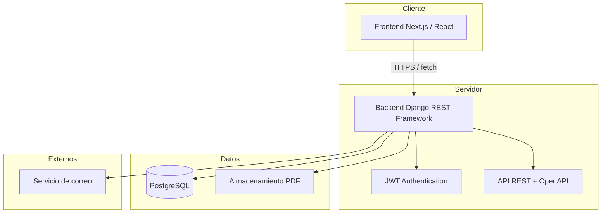
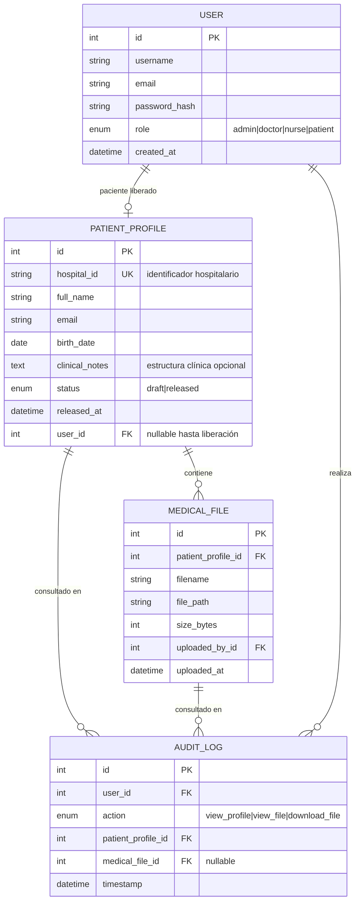

## Índice

0. [Ficha del proyecto](#0-ficha-del-proyecto)
1. [Descripción general del producto](#1-descripción-general-del-producto)
2. [Arquitectura del sistema](#2-arquitectura-del-sistema)
3. [Modelo de datos](#3-modelo-de-datos)
4. [Especificación de la API](#4-especificación-de-la-api)
5. [Historias de usuario](#5-historias-de-usuario)
6. [Tickets de trabajo](#6-tickets-de-trabajo)
7. [Pull requests](#7-pull-requests)

---

## 0. Ficha del proyecto

### **0.1. Tu nombre completo:**

Sebastian Ruiz Garcia

### **0.2. Nombre del proyecto:**

Plataforma médica "Zenta"

### **0.3. Descripción breve del proyecto:**

Aplicación web para hospital que permita gestionar, subir y consultar historial médico de pacientes de forma simple, segura y organizada.

### **0.4. URL del proyecto:**

> Puede ser pública o privada, en cuyo caso deberás compartir los accesos de manera segura. Puedes enviarlos a [alvaro@lidr.co](mailto:alvaro@lidr.co) usando algún servicio como [onetimesecret](https://onetimesecret.com/).

### 0.5. URL o archivo comprimido del repositorio

> Puedes tenerlo alojado en público o en privado, en cuyo caso deberás compartir los accesos de manera segura. Puedes enviarlos a [alvaro@lidr.co](mailto:alvaro@lidr.co) usando algún servicio como [onetimesecret](https://onetimesecret.com/). También puedes compartir por correo un archivo zip con el contenido


---

## 1. Descripción general del producto

> Describe en detalle los siguientes aspectos del producto:

> **Estado de esta sección:** completada **parcialmente** a partir del [PRD.md](./PRD.md). Lo pendiente se irá complementando conforme avancen las siguientes fases del proyecto (diseño UX, implementación del monorepo y despliegue local).

### **1.1. Objetivo:**

Crear una plataforma web donde personal autorizado del hospital pueda consultar perfiles de pacientes, subir archivos médicos, crear usuarios y liberar el perfil del paciente para que este pueda acceder posteriormente a su información médica desde la aplicación.

**Contexto adicional (PRD):** Zenta es una plataforma para un **único hospital** que centraliza la gestión del historial médico con control de acceso por rol, auditoría de consultas y alineación con buenas prácticas de privacidad (referencia LFPDPPP). El paciente solo accede a su información **después** de ser liberado por un médico o administrador.

### **1.2. Características y funcionalidades principales:**

> Enumera y describe las características y funcionalidades específicas que tiene el producto para satisfacer las necesidades identificadas.

**Funcionalidades definidas para el MVP:**

| Área | Descripción |
|---|---|
| **Autenticación** | Inicio de sesión con JWT para pacientes, enfermería, médicos y administradores. |
| **Perfiles médicos** | Alta con datos básicos obligatorios (nombre, identificador hospitalario, email, fecha de nacimiento) y estructura clínica opcional (antecedentes, alergias, diagnósticos, notas, medicación). |
| **Archivos médicos** | Carga, consulta y descarga de PDFs (máx. 50 MB por archivo, sin límite de cantidad). |
| **Liberación de paciente** | Acción exclusiva de médico/administrador: crea usuario paciente, envía credenciales por correo y marca el perfil como liberado (irreversible). |
| **Gestión de usuarios** | Listado de pacientes y listado de staff interno (admin, médico, enfermería) por separado. |
| **Permisos por rol** | RBAC estricto: enfermería consulta y sube archivos; médico/admin liberan y crean pacientes; paciente solo consulta su propio perfil. |
| **Auditoría** | Registro de quién consultó qué perfil o archivo y cuándo. |
| **Notificaciones** | Correo automático al paciente al liberar su perfil con usuario y contraseña. |

**Usuarios del sistema:** paciente, médico, enfermera/enfermero y administrador.

**Flujo principal:**

```
Alta de perfil → carga de PDFs → liberación → correo con credenciales → acceso del paciente
```

**Pendiente de complementar:** detalle de pantallas, flujos de error y funcionalidades fuera de alcance documentadas en el PRD (sección 15).

### **1.3. Diseño y experiencia de usuario:**

> Proporciona imágenes y/o videotutorial mostrando la experiencia del usuario desde que aterriza en la aplicación, pasando por todas las funcionalidades principales.

**Estado:** pendiente.

**Lo definido a nivel producto (sin diseño visual aún):**

- Experiencia web responsive (navegador y móvil), sin app nativa.
- Vistas diferenciadas por rol (paciente vs. staff clínico vs. administrador).
- Confirmación explícita antes de liberar un perfil (acción irreversible).
- Perfiles editables antes de la liberación; solo lectura después.

**Se complementará cuando:** exista diseño de interfaz, prototipos, capturas o videotutorial del frontend implementado.

### **1.4. Instrucciones de instalación:**
> Documenta de manera precisa las instrucciones para instalar y poner en marcha el proyecto en local (librerías, backend, frontend, servidor, base de datos, migraciones y semillas de datos, etc.)

**Estado:** pendiente.

**Stack previsto (PRD):**

| Capa | Tecnología |
|---|---|
| Repositorio | Monorepo (`frontend/`, `backend/`, `docker-compose.yml`, `.env.example`) |
| Frontend | Next.js, React, TypeScript, Tailwind CSS, React Hook Form, Zod, TanStack Query, Zustand |
| Backend | Python, Django, Django REST Framework, JWT, drf-spectacular |
| Base de datos | PostgreSQL vía Docker Compose con volúmenes persistentes |

**Se complementará cuando:** se implemente el monorepo, Docker Compose, migraciones, semillas de datos y el README operativo de ejecución local.

---

## 2. Arquitectura del Sistema

> **Estado de esta sección:** completada **parcialmente** a partir del [PRD.md](./PRD.md). Diagramas detallados, estructura real de carpetas, despliegue, seguridad implementada y tests se documentarán en fases posteriores del proyecto.

### **2.1. Diagrama de arquitectura:**
> Usa el formato que consideres más adecuado para representar los componentes principales de la aplicación y las tecnologías utilizadas. Explica si sigue algún patrón predefinido, justifica por qué se ha elegido esta arquitectura, y destaca los beneficios principales que aportan al proyecto y justifican su uso, así como sacrificios o déficits que implica.

**Vista conceptual prevista (MVP):**


```mermaid
flowchart TB
    subgraph Cliente
        FE[Frontend Next.js / React]
    end

    subgraph Servidor
        BE[Backend Django REST Framework]
        AUTH[JWT Authentication]
        API[API REST + OpenAPI]
    end

    subgraph Datos
        PG[(PostgreSQL)]
        FS[Almacenamiento PDF]
    end

    subgraph Externos
        MAIL[Servicio de correo]
    end

    FE -->|HTTPS / fetch| BE
    BE --> AUTH
    BE --> API
    BE --> PG
    BE --> FS
    BE --> MAIL
```

**Patrón:** arquitectura cliente-servidor en **monorepo**, con frontend desacoplado que consume API REST.

**Beneficios:** separación clara de capas, stack alineado al PRD, documentación OpenAPI automática, despliegue local reproducible con Docker Compose.

**Sacrificios:** sin multi-hospital en MVP; sin integración con HIS/EMR externos; correo y almacenamiento de archivos por definir en implementación.

**Pendiente:** diagrama de arquitectura definitivo, justificación ampliada y diagramas de despliegue (sección 2.4).

### **2.2. Descripción de componentes principales:**

> Describe los componentes más importantes, incluyendo la tecnología utilizada

| Componente | Tecnología | Responsabilidad |
|---|---|---|
| **Frontend** | Next.js, React, TypeScript, Tailwind CSS | UI por rol, formularios (React Hook Form + Zod), consumo de API (fetch + TanStack Query), estado local (Zustand) |
| **Backend API** | Django, Django REST Framework | Lógica de negocio, RBAC, JWT, endpoints REST, validaciones |
| **Documentación API** | drf-spectacular | OpenAPI / Swagger |
| **Base de datos** | PostgreSQL | Persistencia de usuarios, perfiles, archivos (metadatos) y auditoría |
| **Autenticación** | JWT | Sesiones stateless para todos los roles |
| **Almacenamiento de archivos** | Por definir en implementación | PDFs médicos con acceso protegido vía API |
| **Notificaciones** | Servicio de correo (por definir) | Envío de credenciales al liberar perfil |
| **Entorno local** | Docker Compose | PostgreSQL + servicios de aplicación |

**Pendiente:** detalle de módulos/apps Django, estructura de rutas Next.js y decisiones de almacenamiento de archivos.

### **2.3. Descripción de alto nivel del proyecto y estructura de ficheros**

> Representa la estructura del proyecto y explica brevemente el propósito de las carpetas principales, así como si obedece a algún patrón o arquitectura específica.

**Estructura prevista (monorepo):**

```
/
├── frontend/          # Aplicación Next.js (UI)
├── backend/           # API Django REST Framework
├── docker-compose.yml # Servicios locales (PostgreSQL, etc.)
├── .env.example       # Variables de entorno documentadas
├── PRD.md             # Documento de requisitos del producto
└── readme.md          # Documentación del proyecto
```

**Patrón:** monorepo con separación frontend/backend.

**Se complementará cuando:** se genere la estructura real del código, con carpetas, módulos y convenciones definitivas.

### **2.4. Infraestructura y despliegue**

> Detalla la infraestructura del proyecto, incluyendo un diagrama en el formato que creas conveniente, y explica el proceso de despliegue que se sigue

**Estado:** pendiente.

**Definido a nivel PRD:**

- Desarrollo local con Docker Compose y PostgreSQL con volúmenes persistentes.
- Variables de entorno para credenciales y configuración.
- HTTPS en entornos no locales / producción.

**Se complementará cuando:** se defina infraestructura de despliegue, pipeline CI/CD y entorno de producción.

### **2.5. Seguridad**

> Enumera y describe las prácticas de seguridad principales que se han implementado en el proyecto, añadiendo ejemplos si procede

**Estado:** requisitos definidos; implementación pendiente.

**Controles previstos (PRD):**

| Área | Control |
|---|---|
| Autenticación | JWT; contraseñas hasheadas; paciente bloqueado hasta liberación |
| Autorización | RBAC estricto validado en backend en cada operación |
| Datos sensibles | Paciente solo accede a su propio perfil; staff ve todos los pacientes |
| Archivos médicos | Solo PDF; máx. 50 MB; acceso vía API autenticada |
| Auditoría | Registro de consultas a perfiles y archivos |
| Transporte | HTTPS fuera de entorno local |
| CORS | Configuración restrictiva |
| Privacidad | Referencia LFPDPPP; NOM-024 solo como referencia general |

**Se complementará cuando:** se implementen los controles en código, con ejemplos concretos (middleware, permisos, logs de auditoría, etc.).

### **2.6. Tests**

> Describe brevemente algunos de los tests realizados

**Estado:** pendiente.

**Se complementará cuando:** se implementen tests de backend, frontend y/o integración durante el desarrollo.

---

## 3. Modelo de Datos

> **Estado de esta sección:** completada **parcialmente** a partir del [PRD.md](./PRD.md). El diagrama y las entidades aquí descritos son **conceptuales**; tipos de datos, restricciones SQL y diseño técnico definitivo se complementarán en la fase de diseño de base de datos e implementación.

### **3.1. Diagrama del modelo de datos:**

> Recomendamos usar mermaid para el modelo de datos, y utilizar todos los parámetros que permite la sintaxis para dar el máximo detalle, por ejemplo las claves primarias y foráneas.

**Diagrama conceptual (MVP):**


```mermaid
erDiagram
    USER ||--o| PATIENT_PROFILE : "paciente liberado"
    PATIENT_PROFILE ||--o{ MEDICAL_FILE : contiene
    PATIENT_PROFILE ||--o{ AUDIT_LOG : "consultado en"
    MEDICAL_FILE ||--o{ AUDIT_LOG : "consultado en"
    USER ||--o{ AUDIT_LOG : realiza

    USER {
        int id PK
        string username
        string email
        string password_hash
        enum role "admin|doctor|nurse|patient"
        datetime created_at
    }

    PATIENT_PROFILE {
        int id PK
        string hospital_id UK "identificador hospitalario"
        string full_name
        string email
        date birth_date
        text clinical_notes "estructura clínica opcional"
        enum status "draft|released"
        datetime released_at
        int user_id FK "nullable hasta liberación"
    }

    MEDICAL_FILE {
        int id PK
        int patient_profile_id FK
        string filename
        string file_path
        int size_bytes
        int uploaded_by_id FK
        datetime uploaded_at
    }

    AUDIT_LOG {
        int id PK
        int user_id FK
        enum action "view_profile|view_file|download_file"
        int patient_profile_id FK
        int medical_file_id FK "nullable"
        datetime timestamp
    }
```

**Pendiente:** diagrama técnico final con tipos exactos, índices, tablas auxiliares (p. ej. campos clínicos normalizados) y decisiones de almacenamiento de archivos.

### **3.2. Descripción de entidades principales:**

> Recuerda incluir el máximo detalle de cada entidad, como el nombre y tipo de cada atributo, descripción breve si procede, claves primarias y foráneas, relaciones y tipo de relación, restricciones (unique, not null…), etc.

#### Usuario (`USER`)

Representa credenciales de acceso al sistema. Roles: administrador, médico, enfermería o paciente.

| Atributo | Descripción |
|---|---|
| `id` | Identificador único (PK) |
| `username` / `email` | Credenciales de acceso |
| `password_hash` | Contraseña almacenada de forma segura |
| `role` | Rol del usuario (RBAC) |
| `created_at` | Fecha de creación |

**Reglas:** el usuario paciente se crea al **liberar** el perfil; médico solo crea pacientes; administrador crea staff.

#### Perfil médico (`PATIENT_PROFILE`)

Expediente clínico del paciente. Puede existir **sin** usuario de acceso hasta la liberación.

| Atributo | Obligatorio | Descripción |
|---|---|---|
| `hospital_id` | Sí | Identificador hospitalario (único) |
| `full_name` | Sí | Nombre completo |
| `email` | Sí | Contacto; destino del correo de liberación |
| `birth_date` | Sí | Fecha de nacimiento |
| `clinical_notes` | No | Estructura clínica resumida (antecedentes, alergias, diagnósticos, notas, medicación) |
| `status` | Sí | `draft` (editable) o `released` (solo lectura, irreversible) |
| `user_id` | No | FK a usuario paciente; null hasta liberación |

**Reglas:** editable solo en estado `draft`; al liberar pasa a `released` sin reversión.

#### Archivo médico (`MEDICAL_FILE`)

Documentos PDF asociados a un perfil.

| Atributo | Descripción |
|---|---|
| `patient_profile_id` | FK al perfil |
| `filename` | Nombre del archivo |
| `file_path` | Ruta o referencia de almacenamiento |
| `size_bytes` | Tamaño (máx. 50 MB) |
| `uploaded_by_id` | FK al usuario que subió el archivo |
| `uploaded_at` | Timestamp de carga |

**Reglas:** solo PDF; sin límite de cantidad; no modificable en perfiles liberados.

#### Registro de auditoría (`AUDIT_LOG`)

Trazabilidad de accesos a perfiles y archivos.

| Atributo | Descripción |
|---|---|
| `user_id` | FK al usuario que realizó la acción |
| `action` | Tipo de acción (consulta perfil, consulta/descarga archivo) |
| `patient_profile_id` | FK al perfil consultado |
| `medical_file_id` | FK al archivo (si aplica) |
| `timestamp` | Fecha y hora del acceso |

**Se complementará cuando:** se formalice el esquema Django/PostgreSQL, migraciones, semillas y restricciones técnicas definitivas.

---

## 4. Especificación de la API

> Si tu backend se comunica a través de API, describe los endpoints principales (máximo 3) en formato OpenAPI. Opcionalmente puedes añadir un ejemplo de petición y de respuesta para mayor claridad

> **Estado:** pendiente. Se complementará cuando se implemente el backend con Django REST Framework y documentación OpenAPI (drf-spectacular). Endpoints previstos a alto nivel: autenticación JWT, gestión de perfiles, liberación de pacientes y carga/consulta de archivos PDF.

## 5. Historias de Usuario

> Documenta 3 de las historias de usuario principales utilizadas durante el desarrollo, teniendo en cuenta las buenas prácticas de producto al respecto.

> **Estado de esta sección:** completada **parcialmente** a partir del [PRD.md](./PRD.md). Las historias siguientes están en formato resumido; los **criterios de aceptación detallados**, casos borde y definición de ready se complementarán en la fase de historias de usuario del proyecto.

**Historia de Usuario 1 — Alta de perfil médico**

**Como** médico o administrador,  
**quiero** crear un perfil médico con los datos básicos del paciente y, opcionalmente, estructura clínica y archivos PDF,  
**para** iniciar el expediente digital antes de habilitar el acceso del paciente.

**Alcance MVP (PRD):**
- Campos obligatorios: nombre, identificador hospitalario, email, fecha de nacimiento.
- Estructura clínica opcional (antecedentes, alergias, diagnósticos, notas, medicación).
- El perfil queda en estado editable (`draft`) hasta ser liberado.
- Enfermería, médico y administrador pueden subir PDFs mientras el perfil no esté liberado.

**Pendiente:** criterios de aceptación específicos, validaciones de formulario y casos de error.

---

**Historia de Usuario 2 — Liberación del perfil del paciente**

**Como** médico o administrador,  
**quiero** liberar el perfil de un paciente,  
**para** crear su acceso al portal, enviarle sus credenciales por correo y permitirle consultar su historial de forma segura.

**Alcance MVP (PRD):**
- Solo médico y administrador pueden ejecutar la liberación.
- Al liberar: se crea usuario con rol paciente, se envía correo con usuario y contraseña, el perfil pasa a solo lectura.
- La liberación es **irreversible**.
- El paciente no puede acceder antes de la liberación.

**Pendiente:** criterios de aceptación (confirmación en UI, manejo de fallo de correo, generación de contraseña — ver preguntas abiertas P-01 y P-06 del PRD).

---

**Historia de Usuario 3 — Consulta del historial por el paciente**

**Como** paciente liberado,  
**quiero** iniciar sesión y consultar mi perfil médico y archivos PDF asociados,  
**para** acceder a mi información clínica de forma simple y segura desde web o móvil.

**Alcance MVP (PRD):**
- Acceso únicamente al propio perfil (no ve otros pacientes).
- Solo lectura: no puede editar, subir ni eliminar información.
- Puede consultar datos básicos, estructura clínica (si existe) y archivos PDF del perfil.

**Pendiente:** criterios de aceptación (descarga vs. solo visualización de PDFs — ver pregunta abierta P-09 del PRD), diseño de pantallas y pruebas E2E.

---

## 6. Tickets de Trabajo

> Documenta 3 de los tickets de trabajo principales del desarrollo, uno de backend, uno de frontend, y uno de bases de datos. Da todo el detalle requerido para desarrollar la tarea de inicio a fin teniendo en cuenta las buenas prácticas al respecto.

> **Estado:** pendiente. Se complementará durante la fase de desarrollo e implementación del monorepo.

**Ticket 1**

**Ticket 2**

**Ticket 3**

---

## 7. Pull Requests

> Documenta 3 de las Pull Requests realizadas durante la ejecución del proyecto

> **Estado:** pendiente. Se complementará conforme se vayan realizando pull requests durante el desarrollo.

**Pull Request 1**

**Pull Request 2**

**Pull Request 3**

