## Índice

1. [Ficha del proyecto](#1-ficha-del-proyecto)
2. [Descripción general del producto](#2-descripción-general-del-producto)
3. [Arquitectura del sistema](#3-arquitectura-del-sistema)
4. [Modelo de datos](#4-modelo-de-datos)
5. [Especificación de la API](#5-especificación-de-la-api)
6. [Historias de usuario](#6-historias-de-usuario)
7. [Tickets de trabajo](#7-tickets-de-trabajo)
8. [Pull requests](#8-pull-requests)

---

## 1. Ficha del proyecto

### **1.1. Tu nombre completo:**

Luís María de Frutos Redondo

### **1.2. Nombre del proyecto:**

MyTreeLibrary

### **1.3. Descripción breve del proyecto:**

MyTreeLibrary es una solución digital para crear y gestionar tu colección personal de árboles singulares, almacenando fotografías, localización geográfica y datos relevantes de cada ejemplar. Diseñada para aficionados, permite compartir información públicamente y fomentar una comunidad colaborativa. En el MVP, la IA apoya la consulta de características de especie por administradores; la identificación por imagen y el chat se prevén en versiones posteriores.

### **1.4. URL del proyecto:**

[https://github.com/ldefrutos1/AI4Devs-finalproject](https://github.com/ldefrutos1/AI4Devs-finalproject)

### **1.5. URL o archivo comprimido del repositorio**

[https://github.com/ldefrutos1/AI4Devs-finalproject](https://github.com/ldefrutos1/AI4Devs-finalproject)

---

## 2. Descripción general del producto

### **2.1. Objetivo:**

#### Propósito

Desarrollar una plataforma web que permita registrar, organizar y consultar fotografías, ubicaciones y datos relevantes de árboles de tu ciudad, facilitando al usuario la creación de una biblioteca personal digital y la posibilidad de compartir esa información de forma pública.

**NOTA IMPORTANTE:** Se ha seleccionado una arquitectura de mircroservicios en Java con Spring y Vue con un **proposito didactico**, con el fin de aprender estas tecnologías.


#### Valor aportado (qué soluciona)

La solución combina la catalogación personal con la posibilidad de compartir y crear comunidad en torno a una afición compartida.

Además, la plataforma incorpora inteligencia artificial como apoyo a la consulta de características de especies (ADMIN en el MVP); en versiones posteriores se prevé la identificación orientativa a partir de fotografías y el chat asistido.

#### Destinatarios de la solución

La solución está dirigida a aficionados a la naturaleza en general y puede resultar de especial utilidad para docentes y monitores de tiempo libre.

### **2.2. Características y funcionalidades principales:**

#### Registro y publicación de árboles

El sistema permite registrar árboles mediante fichas con información relevante, fotografías y ubicación, posibilitando su publicación para consulta pública.

#### Edición y baja de fichas

Los usuarios autenticados con perfil de colaborador pueden dar de alta nuevas fichas de ejemplares; así como la edición o eliminación de aquellos registros creados por ellos mismos. El sistema permite edición de todos los ejemplares a los usuarios con perfil de administrador.

#### Consulta pública y visualización geográfica

El sistema implementa una consulta pública de árboles publicados mediante listado y detalle, mostrando en la ficha de detalle las fotografias de cada árbol y su localización sobre mapa de forma clara e intuitiva.

#### Notificaciones

La solución ofrece un sistema de notificaciones para comunicar novedades a usuarios suscritos, sin necesidad de que estos dispongan de cuenta en la plataforma.

#### Integración con IA

El producto se entegra con IA para obtener información de las características de cada especie; en próximas versiones se implementará la identificación orientativa de la especie a partir de fotografías y la funciónalidad de chat.

### **2.2.1 Diagrama de contexto del sistema (C1)**

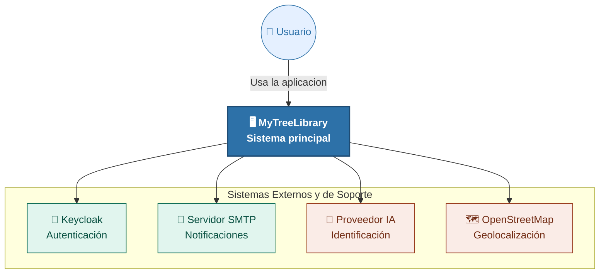
```mermaid
graph TD
    %% Definicion de estilos (CSS)
    classDef user fill:#E5F0FF,stroke:#2D71A8,stroke-width:1px,color:#2D71A8;
    classDef system fill:#2D71A8,stroke:#1E4B73,stroke-width:2px,color:#FFFFFF,font-weight:bold;
    classDef soporte fill:#E1F5EE,stroke:#0F6E56,stroke-width:1px,color:#085041;
    classDef externo fill:#FAECE7,stroke:#993C1D,stroke-width:1px,color:#712B13;

    %% Nodos
    U(("👤 Usuario")):::user
    S["🖥️ MyTreeLibrary<br/>Sistema principal"]:::system

    %% Agrupacion
    subgraph Dependencias [Sistemas Externos y de Soporte]
        direction TB
        KC["🔐 Keycloak<br/>Autenticación"]:::soporte
        SMTP["📧 Servidor SMTP<br/>Notificaciones"]:::soporte
        PIA["🧠 Proveedor IA<br/>Identificación"]:::externo
        MAP["🗺️ OpenStreetMap<br/>Geolocalización"]:::externo
    end

    %% Relaciones
    U -->|Usa la aplicacion| S
    S --> KC
    S --> SMTP
    S --> PIA
    S --> MAP
```


### **2.2.2 Diagrama de Casos de Uso del sistema**


*Fuentes:* [resumen de casos de uso](docs/use-cases/use-case-summary.md) · [modelo PlantUML](docs/use-cases/use-case-model.puml)

### **2.3. Diseño y experiencia de usuario:**

La aplicación implementa una navegación simple por roles con una **home de entrada** adaptada a cada perfil.

### Navegación de la aplicación

---

#### 🌐 Público &nbsp;·&nbsp; sin autenticación

```
🏠  Inicio                   /
🌳  Árboles                  /trees
    └─ Detalle               /trees/:id
✉️  Suscripción              /subscriptions/new
```

---

#### 👤 Colaborador &nbsp;·&nbsp; usuario autenticado

↳ *Incluye todas las páginas públicas*

```
➕  Alta de árbol            /trees/new
📋  Mis árboles              /my-trees
    └─ Edición de ficha      /trees/:id/edit
```

---

#### 🛡️ Admin &nbsp;·&nbsp; privilegios completos

↳ *Incluye todas las páginas de colaborador*

```
🗄️  Maestros                 /admin/masters
👥  Suscripciones            /admin/subscriptions
```

---

### Resumen de permisos

| Página | Público | Colaborador | Admin |
|---|:---:|:---:|:---:|
| Inicio `/` | ✅ | ✅ | ✅ |
| Árboles `/trees` | ✅ | ✅ | ✅ |
| Detalle `/trees/:id` | ✅ | ✅ | ✅ |
| Suscripción `/subscriptions/new` | ✅ | ✅ | ✅ |
| Alta de árbol `/trees/new` | — | ✅ | ✅ |
| Mis árboles `/my-trees` | — | ✅ | ✅ |
| Edición de ficha `/trees/:id/edit` | — | ✅ | ✅ |
| Maestros `/admin/masters` | — | — | ✅ |
| Suscripciones `/admin/subscriptions` | — | — | ✅ |


### **2.4. Instrucciones de instalación:**

#### Infraestructura de apoyo

En `[infra/compose/](infra/compose/)` hay un `docker-compose.yml` que levanta la infraestructura de soporte del proyecto:


| Servicio                | Detalle                                                         |
| ----------------------- | --------------------------------------------------------------- |
| PostgreSQL 16 + PostGIS | BD `mtl` con esquemas `catalog`, `media`, `notification` y `ai` |
| PostgreSQL / Keycloak   | BD `keycloak`                                                   |
| MongoDB                 | Versión 7                                                       |
| Redis                   | Versión 7                                                       |
| MinIO                   | Almacenamiento de objetos                                       |
| Kafka                   | Modo KRaft, con topic `catalog.arbol.evento`                    |
| Keycloak                | Versión 26 en modo desarrollo                                   |
| Mailpit                 | SMTP de prueba (captura correo; UI web); imagen `axllent/mailpit`; puertos en [infra/compose/README.md](infra/compose/README.md) |
| Prometheus              | Métricas; imagen `prom/prometheus:v3.2.1`; scrape de microservicios en el host (`/actuator/prometheus`); UI en puerto **9090** |
| Grafana                 | Dashboards; imagen `grafana/grafana:11.5.2`; datasource y dashboard provisionados desde [platform/observability/](platform/observability/README.md); UI en puerto **3000** |


> **Nota:** por defecto, Postgres del Compose se expone en el host en el **puerto `5433`**  
> mediante la variable `POSTGRES_PORT` definida en `.env`, para evitar conflictos con un PostgreSQL local en `5432`.

> **Redis y `catalog-service`:** con perfil **`dev`**, el catálogo usa caché Redis (`spring.cache.type=redis` en `application-dev.properties`). El contenedor **Redis** del Compose debe estar en marcha antes de arrancar **catalog-service** en `dev`.

#### Pasos:

- Copiar `infra/compose/.env.example` a `infra/compose/.env` (en Windows `copy .env.example .env`; en Unix `cp .env.example .env`), 
- Ejecutar `docker compose up -d` desde `infra/compose/` (incluye Prometheus y Grafana).
- Opcional, solo observabilidad: `docker compose pull prometheus grafana` y `docker compose up -d prometheus grafana` (requiere microservicios en el host en puertos **8080–8084** con perfil `dev` para que el scrape muestre targets **UP**).

#### Detalle y puertos: [infra/compose/README.md](infra/compose/README.md). Observabilidad: [platform/observability/README.md](platform/observability/README.md) · [ADR-0005](docs/adr/0005-microservices-observabilty-spring-boot.md).

#### Backend: microservicios y gateway

Los módulos Maven del backend están bajo `[services/](services/)`:


| Módulo                 | Descripción                |
| ---------------------- | -------------------------- |
| `api-gateway`          | Gateway de entrada         |
| `catalog-service`      | Servicio de catálogo       |
| `media-service`        | Servicio de media          |
| `notification-service` | Servicio de notificaciones |
| `ai-assistant-service` | Servicio de asistente IA   |


El POM agregador está en:

```txt
services/pom.xml
```

Puedes ejecutar Maven desde `services/`:

```bash
mvn ...
```

O desde la raíz del proyecto:

```bash
mvn -f services/pom.xml ...
```

#### Perfil de desarrollo

Tras tener la infraestructura en marcha, arranca cada servicio con el perfil `dev`.

> El perfil `dev` **no está fijado en `application.properties`**.

Puedes activarlo de cualquiera de estas formas:


| Método                   | Ejemplo                                                            |
| ------------------------ | ------------------------------------------------------------------ |
| Variable de entorno      | `SPRING_PROFILES_ACTIVE=dev`                                       |
| Argumento de Spring Boot | `--spring.profiles.active=dev`                                     |
| Maven                    | `-Dspring-boot.run.profiles=dev`                                   |

#### Arranque mínimo por flujo

Tras `docker compose up -d`, levanta **api-gateway** (8080) y, según lo que pruebes, los servicios en **`dev`**:

| Flujo | Compose (además de Postgres/Keycloak) | Servicios en host |
|-------|----------------------------------------|-------------------|
| Consulta pública | — | catalog |
| Alta / edición de árbol | Redis, Kafka | catalog (+ **media** si hay fotos) |
| Fotos (subida) | MinIO | media |
| Aviso por correo (alta de árbol) | Kafka, Mailpit | notification |
| Admin (maestros / suscripciones) | — | catalog; notification (suscripciones) |

Puertos y comandos: [services/README.md](services/README.md).

#### Más información

Consulta `[services/README.md](services/README.md)` para ver:

- comandos de arranque
- puertos
- configuración de Flyway
- ejecución de tests

#### Frontend

La carpeta `[frontend/](frontend/)` es la SPA Vue 3 (Vite) con OIDC (Keycloak), consulta pública, catálogo colaborador y pantallas de administración.

1. Copiar `frontend/.env.example` a `frontend/.env` (valores por defecto válidos para local).
2. Tener en marcha la infra de Compose y, como mínimo, **api-gateway** en **8080** (y los microservicios que vayas a usar; ver [services/README.md](services/README.md)).
3. Desde `frontend/`: `npm install` y `npm run dev` (UI en **http://localhost:5173**; el proxy de Vite reenvía `/api/*` al gateway).

Más detalle (usuarios de prueba Keycloak, verificación manual E2E): [frontend/README.md](frontend/README.md).

#### Datos iniciales en catálogo

Además del init de Postgres/Keycloak en Compose, **catalog-service** aplica semillas de maestros (familia, género, especie, provincia) mediante migraciones Flyway (`V2__seed_maestros_inicial.sql`, etc.); el esquema relacional está en `V1__baseline.sql`. El mantenimiento en aplicación por **ADMIN** (**HU-011**, UC-07) cubre solo la **taxonomía** (familia, género, especie); el catálogo de **provincias** permanece en semillas, sin pantalla de administración en el MVP.

---

## 3. Arquitectura del sistema

### **3.1. Diagrama de arquitectura:**

La aplicación está desarrollará en microservicios con Spring en la parte de backend y Vue como tecnología frontend. Aunque es una **arquitectura sobredimensionada** para el alcance real del sistema, se ha seleccionado esta implementación **por motivos didácticos**, con el fin de adquirir experiencia en estas tecnologías.

#### Patrón y Stack tecnológico

- **Arquitectura:** Microservicios 
- **Seguridad:** OIDC y JWT

**Stack tecnológico principal:**

- **Backend:** Spring Boot 4 y Maven
- **Frontend:** Vue 3
- **Identidad:** Keycloak para OIDC y JWT
- **Eventos de dominio:** Kafka
- **Base de datos SQL:** PostgreSQL
- **Base de datos NoSQL:** MongoDB
- **Caché:** Redis
- **Almacenamiento de imágenes:** Compatible S3 (MinIO)
- **Observabilidad:** Prometheus + Grafana; métricas vía Actuator/Micrometer en cada microservicio


#### C2 — Diagrama de contenedores (nivel 2)

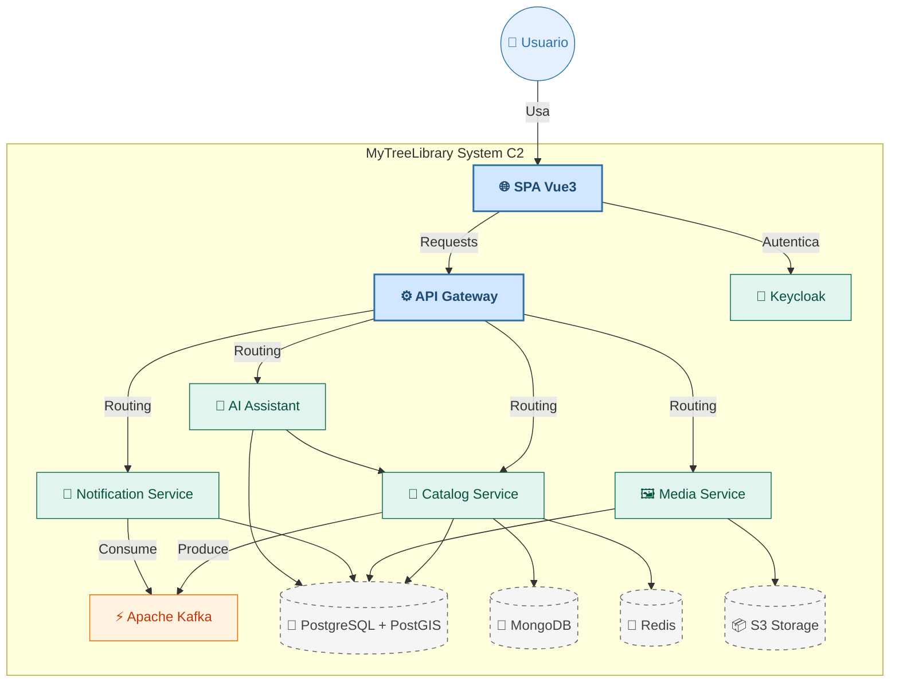
```mermaid
flowchart TB
    %% --- Estilos ---
    classDef user fill:#E5F0FF,stroke:#2D71A8,stroke-width:1px,color:#2D71A8;
    classDef web fill:#D1E7FF,stroke:#2D71A8,stroke-width:2px,color:#1E4B73,font-weight:bold;
    classDef service fill:#E1F5EE,stroke:#0F6E56,stroke-width:1px,color:#085041;
    classDef infra fill:#FFF3E0,stroke:#EF6C00,stroke-width:1px,color:#BF360C;
    classDef db fill:#F5F5F5,stroke:#616161,stroke-width:1px,color:#424242,stroke-dasharray: 5 5;

    %% --- Usuario ---
    U(("👤 Usuario")):::user

    %% --- Límite del Sistema ---
    subgraph MyTreeLibrary [MyTreeLibrary System C2]
        direction TB
        
        %% Frontend y Entrada
        SPA["🌐 SPA Vue3"]:::web
        GW["⚙️ API Gateway"]:::web
        
        %% Servicios
        KC["🔐 Keycloak"]:::service
        CAT["📂 Catalog Service"]:::service
        MED["🖼️ Media Service"]:::service
        NOT["📧 Notification Service"]:::service
        AIS["🧠 AI Assistant"]:::service
        
        %% Infraestructura y Datos
        K["⚡ Apache Kafka"]:::infra
        PG[("🐘 PostgreSQL + PostGIS")]:::db
        MG[("🍃 MongoDB")]:::db
        RD[("🚀 Redis")]:::db
        OBJ[("📦 S3 Storage")]:::db
    end

    %% --- Relaciones ---
    U -->|Usa| SPA
    SPA -->|Autentica| KC
    SPA -->|Requests| GW
    
    GW -->|Routing| CAT
    GW -->|Routing| MED
    GW -->|Routing| AIS
    GW -->|Routing| NOT
    
    CAT --> PG
    CAT --> RD
    CAT -->|Produce| K
    CAT --> MG
    
    MED --> PG
    MED --> OBJ
    
    NOT --> PG
    NOT -->|Consume| K
    
    AIS --> PG
    AIS --> CAT
```

**C2 (detalle) — un servidor PostgreSQL con PostGIS, cuatro esquemas, un esquema por servicio:**

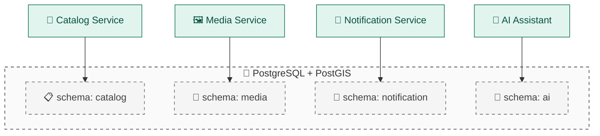
```mermaid
flowchart TB
    %% --- Estilos (Consistentes con los anteriores) ---
    classDef service fill:#E1F5EE,stroke:#0F6E56,stroke-width:1px,color:#085041;
    classDef db fill:#F5F5F5,stroke:#616161,stroke-width:1px,color:#424242,stroke-dasharray: 5 5;
    classDef cluster fill:#FAFAFA,stroke:#333,stroke-width:1px,stroke-dasharray: 5 5;

    %% --- Servicios (La capa de lógica) ---
    CAT["📂 Catalog Service"]:::service
    MED["🖼️ Media Service"]:::service
    NS["📧 Notification Service"]:::service
    AIS["🧠 AI Assistant"]:::service

    %% --- Subgraph PostgreSQL (La capa de almacenamiento) ---
    subgraph PG ["🐘 PostgreSQL + PostGIS"]
        direction LR
        SCH_C["📋 schema: catalog"]:::db
        SCH_M["📸 schema: media"]:::db
        SCH_N["🔔 schema: notification"]:::db
        SCH_I["🤖 schema: ai"]:::db
    end

    %% --- Relaciones (Unívocas) ---
    CAT --> SCH_C
    MED --> SCH_M
    NS --> SCH_N
    AIS --> SCH_I
```

### **3.1.1 Autenticación en Front (Vue):**

Descripción del flujo de autenticación para SPA en **Vue 3** con **OIDC Authorization Code + PKCE** (IdP: Keycloak).  
Objetivo: mantener rutas protegidas con sesión válida, renovar token de forma transparente y centralizar el manejo de `401` en cliente HTTP.

#### C3 — Componentes (nivel 3): autenticación en el contenedor SPA Vue

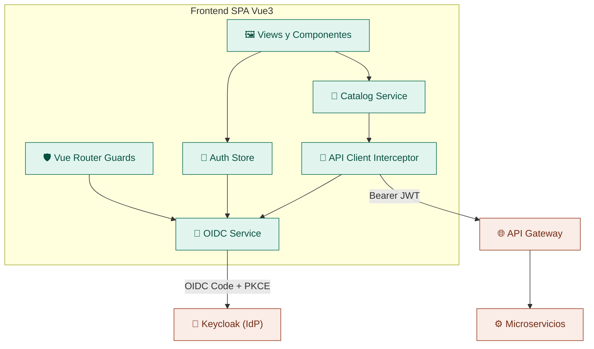
```mermaid
flowchart TB
    %% --- Estilos (Consistentes con la arquitectura anterior) ---
    classDef component fill:#E1F5EE,stroke:#0F6E56,stroke-width:1px,color:#085041;
    classDef external fill:#FAECE7,stroke:#993C1D,stroke-width:1px,color:#712B13;
    classDef subgraphStyle fill:#F9F9F9,stroke:#999,stroke-dasharray: 5 5;

    %% --- Subgraph Frontend ---
    subgraph SPA [Frontend SPA Vue3]
        direction TB
        Router["🛡️ Vue Router Guards"]:::component
        Views["🖼️ Views y Componentes"]:::component
        AuthStore["💾 Auth Store"]:::component
        Oidc["🔐 OIDC Service"]:::component
        Http["📡 API Client Interceptor"]:::component
        CatalogSvc["📂 Catalog Service"]:::component

        %% Relaciones internas
        Views --> AuthStore
        Views --> CatalogSvc
        CatalogSvc --> Http
        Http --> Oidc
        Router --> Oidc
        AuthStore --> Oidc
    end

    %% --- Componentes Externos ---
    IdP["🏢 Keycloak (IdP)"]:::external
    GW["🌐 API Gateway"]:::external
    Services["⚙️ Microservicios"]:::external

    %% --- Conexiones externas ---
    Oidc -->|OIDC Code + PKCE| IdP
    Http -->|Bearer JWT| GW
    GW --> Services
```


Responsabilidades clave:

- `**Router Guards**`: bloquean rutas con `requiresAuth` y comprueban `requiredRoles` (p. ej. `ADMIN` en `/admin/*`); consultan **directamente** el servicio OIDC (`getUser`, `signinSilent`, `login`), no el Auth Store.
- `**Auth Store / useAuth**`: estado reactivo de sesión (`currentUser`, `isAuthenticated`, roles) y listeners de eventos OIDC; lo consumen vistas y shell de navegación, no el guard.
- `**OIDC Service**` (`authService` en código): login, callback en `/auth/callback`, `signinSilent`, logout y renovación silenciosa automática (`automaticSilentRenew`).
- `**Cliente HTTP**` (`apiFetch` / `apiFetchBlob` en código): inyecta Bearer en rutas autenticadas; reintenta una vez tras `401` con `signinSilent`; si falla, redirige a login con `returnPath`.

Simplificaciones del diagrama C3 (no aparecen como cajas o flechas):

- `**Catalog Service**` representa la capa `services/*` (catálogo, media, notificaciones, etc.); el patrón es el mismo en todos.
- `**API Client Interceptor**` es la lógica de token y reintento en `apiFetch`, no un módulo aparte con ese nombre.
- Rutas **públicas** del contrato OpenAPI usan `publicApiFetch` hacia el gateway **sin** Bearer ni OIDC; el diagrama solo modela el camino autenticado (`Http` → `Oidc`).
- El intercambio de código tras el redirect de Keycloak lo ejecuta la vista `AuthCallbackView`, no el guard ni el store en el primer paso.

#### C4 — Comportamiento (dinámico): secuencia de autenticación y acceso protegido

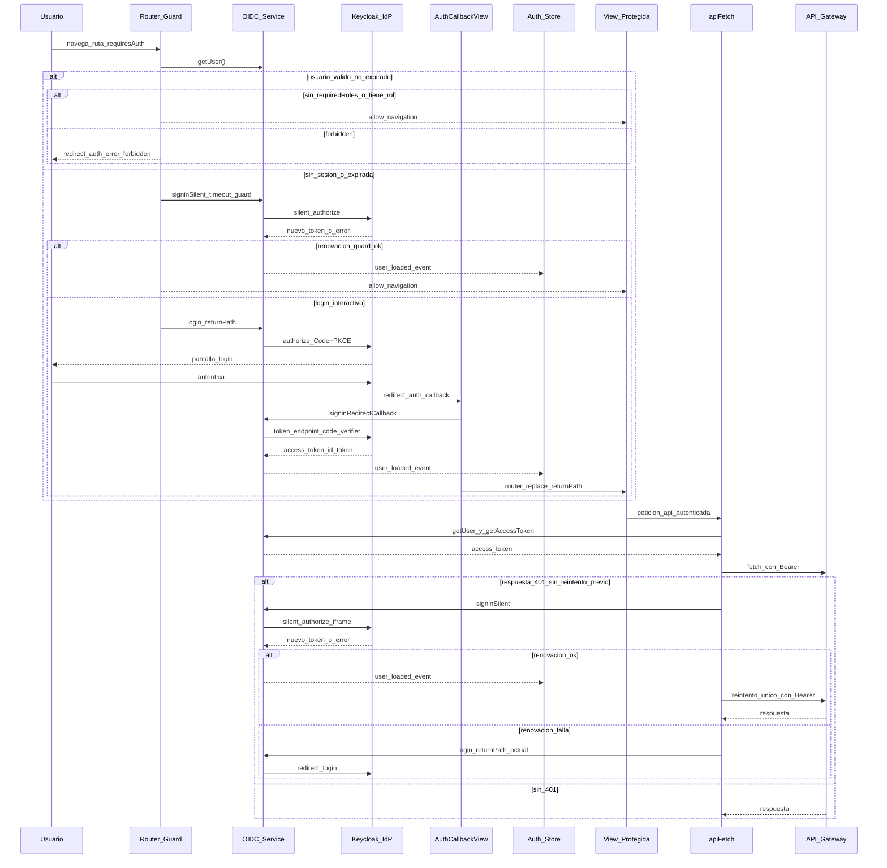
```mermaid
sequenceDiagram
  participant U as Usuario
  participant R as Router_Guard
  participant O as OIDC_Service
  participant K as Keycloak_IdP
  participant CB as AuthCallbackView
  participant A as Auth_Store
  participant V as View_Protegida
  participant H as apiFetch
  participant G as API_Gateway

  U->>R: navega_ruta_requiresAuth
  R->>O: getUser()

  alt usuario_valido_no_expirado
    alt sin_requiredRoles_o_tiene_rol
      R-->>V: allow_navigation
    else forbidden
      R-->>U: redirect_auth_error_forbidden
    end
  else sin_sesion_o_expirada
    R->>O: signinSilent_timeout_guard
    O->>K: silent_authorize
    K-->>O: nuevo_token_o_error
    alt renovacion_guard_ok
      O-->>A: user_loaded_event
      R-->>V: allow_navigation
    else login_interactivo
      R->>O: login_returnPath
      O->>K: authorize_Code+PKCE
      K-->>U: pantalla_login
      U->>K: autentica
      K-->>CB: redirect_auth_callback
      CB->>O: signinRedirectCallback
      O->>K: token_endpoint_code_verifier
      K-->>O: access_token_id_token
      O-->>A: user_loaded_event
      CB->>V: router_replace_returnPath
    end
  end

  V->>H: peticion_api_autenticada
  H->>O: getUser_y_getAccessToken
  O-->>H: access_token
  H->>G: fetch_con_Bearer

  alt respuesta_401_sin_reintento_previo
    H->>O: signinSilent
    O->>K: silent_authorize_iframe
    K-->>O: nuevo_token_o_error
    alt renovacion_ok
      O-->>A: user_loaded_event
      H->>G: reintento_unico_con_Bearer
      G-->>H: respuesta
    else renovacion_falla
      H->>O: login_returnPath_actual
      O->>K: redirect_login
    end
  else sin_401
    G-->>H: respuesta
  end
```

Notas del diagrama C4 (no dibujadas): error al leer sesión en el guard → `/auth/error?reason=session`; renovación proactiva del token (`automaticSilentRenew`) mediante eventos OIDC hacia el Auth Store, además de los `signinSilent` bajo demanda del guard y de `apiFetch`.

### **3.1.2 Kafka:**

En el **MVP**, Kafka separa el **alta de un árbol** del **correo a suscriptores** (regla **R7**): solo al crear una ficha con éxito; edición y baja no publican. Un topic (`catalog.arbol.evento`): **catalog-service** publica y **notification-service** consume. Contrato del mensaje: [docs/events/kafka-events.md](docs/events/kafka-events.md). Configuración local: [services/README.md](services/README.md) (Kafka).

#### C3 — Productor: **catalog-service**

Componentes de **catalog-service** frente a PostgreSQL (esquema `catalog`) y **Kafka** (infra compartida, fuera del servicio). El alta depende de la interfaz `ArbolCreadoEventPublisher`; la publicación real es `KafkaArbolCreadoEventPublisher` (capa de infraestructura). Con `mtl.catalog.kafka.enabled=false` (por defecto o tests), `NoOpArbolCreadoEventPublisher` no envía mensajes.

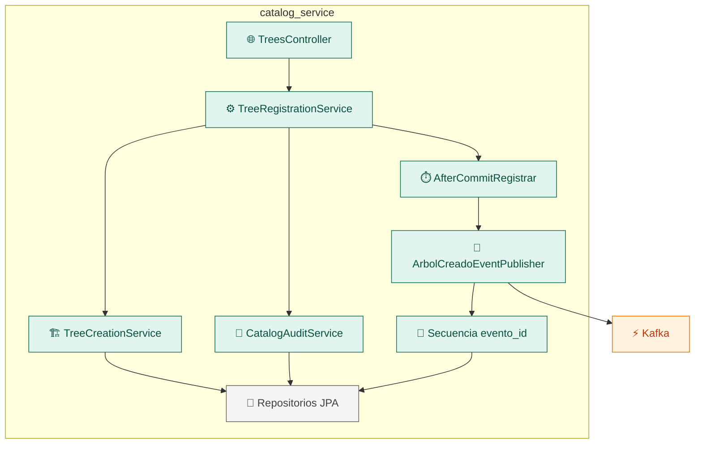
```mermaid
flowchart TB
    classDef service fill:#E1F5EE,stroke:#0F6E56,stroke-width:1px,color:#085041;
    classDef repo fill:#F5F5F5,stroke:#616161,stroke-width:1px,color:#424242;
    classDef infra fill:#FFF3E0,stroke:#EF6C00,stroke-width:1px,color:#BF360C;

    KafkaBroker["⚡ Kafka"]:::infra

    subgraph catalogSvc [catalog_service]
        direction TB
        TreesCtrl["🌐 TreesController"]:::service
        TreeReg["⚙️ TreeRegistrationService"]:::service
        TreeCre["🏗️ TreeCreationService"]:::service
        CatAud["📝 CatalogAuditService"]:::service
        AfterCommit["⏱️ AfterCommitRegistrar"]:::service
        KafkaPub["📢 ArbolCreadoEventPublisher"]:::service
        EventoSeq["🔢 Secuencia evento_id"]:::service
        JpaRepos["💾 Repositorios JPA"]:::repo

        TreesCtrl --> TreeReg
        TreeReg --> TreeCre
        TreeReg --> CatAud
        TreeReg --> AfterCommit
        AfterCommit --> KafkaPub
        KafkaPub --> EventoSeq
        TreeCre --> JpaRepos
        CatAud --> JpaRepos
        EventoSeq --> JpaRepos
    end

    KafkaPub --> KafkaBroker
```

#### C3 — Consumidor: **notification-service**

Componentes de **notification-service** frente a **Kafka** (externo) y PostgreSQL (esquema `notification`). El listener recibe el JSON; la ingestión valida y solo admite `ARBOL_CREADO`; el consumo guarda `evento_catalogo` por `evento_id` (una reentrega no repite el trabajo); el procesador crea notificaciones y envía correo SMTP a suscriptores **ACTIVA**. Con `mtl.notification.kafka.enabled=false` no se arranca el listener.

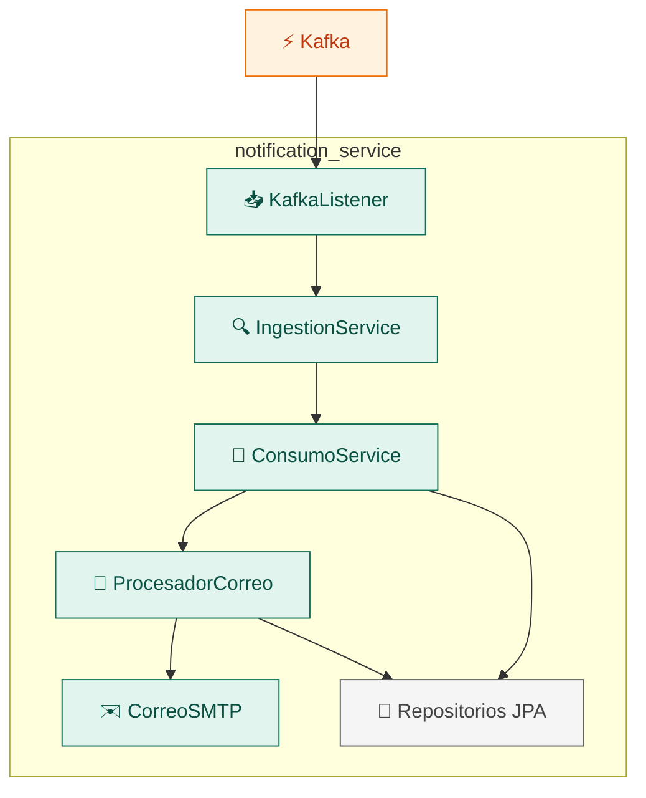
```mermaid
flowchart TB
    classDef service fill:#E1F5EE,stroke:#0F6E56,stroke-width:1px,color:#085041;
    classDef repo fill:#F5F5F5,stroke:#616161,stroke-width:1px,color:#424242;
    classDef infra fill:#FFF3E0,stroke:#EF6C00,stroke-width:1px,color:#BF360C;

    KafkaBroker["⚡ Kafka"]:::infra

    subgraph notifSvc [notification_service]
        direction TB
        Listener["📥 KafkaListener"]:::service
        Ingestion["🔍 IngestionService"]:::service
        Consumo["🔁 ConsumoService"]:::service
        Procesador["📧 ProcesadorCorreo"]:::service
        MailSender["✉️ CorreoSMTP"]:::service
        JpaRepos["💾 Repositorios JPA"]:::repo

        Listener --> Ingestion
        Ingestion --> Consumo
        Consumo --> Procesador
        Procesador --> MailSender
        Consumo --> JpaRepos
        Procesador --> JpaRepos
    end

    KafkaBroker --> Listener
```

#### Flujo de punta a punta (alta de árbol → correo)

Tras login en Keycloak, la SPA da de alta el árbol por el API Gateway; **catalog-service** persiste la ficha y publica en Kafka; **notification-service** consume y envía correo (SMTP; Mailpit en desarrollo).

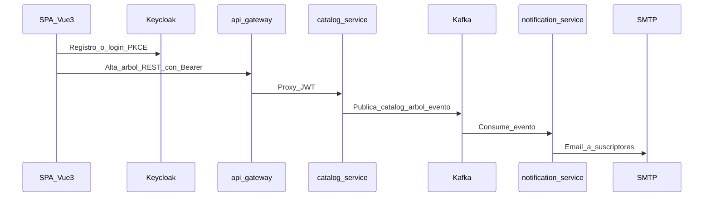
```mermaid
sequenceDiagram
  participant SPA as SPA_Vue3
  participant KC as Keycloak
  participant GW as api_gateway
  participant CAT as catalog_service
  participant K as Kafka
  participant N as notification_service
  participant Mail as SMTP
  SPA->>KC: Registro_o_login_PKCE
  SPA->>GW: Alta_arbol_REST_con_Bearer
  GW->>CAT: Proxy_JWT
  CAT->>K: Publica_catalog_arbol_evento
  K->>N: Consume_evento
  N->>Mail: Email_a_suscriptores
```

#### C4 — Secuencia de publicación (**ARBOL_CREADO**)

En una transacción se validan y guardan el árbol y la auditoría (**R3**); **tras el commit** se asigna `evento_id` y se publica en `catalog.arbol.evento` (formato en [kafka-events.md](docs/events/kafka-events.md)). La API responde **201** antes de Kafka; si la publicación falla, solo queda en logs — el consumidor debe ignorar mensajes duplicados (mismo `evento_id`).

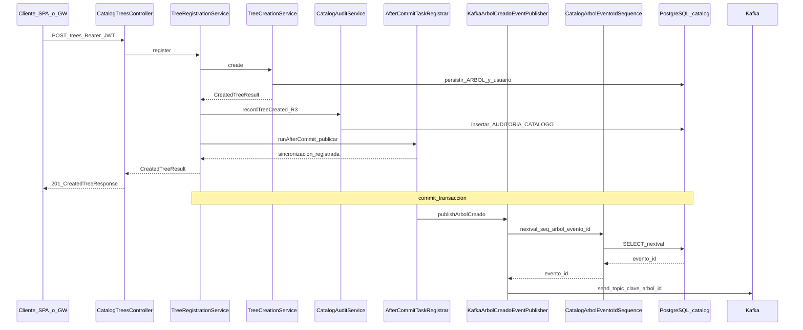
```mermaid
sequenceDiagram
  participant Client as Cliente_SPA_o_GW
  participant Ctrl as CatalogTreesController
  participant Reg as TreeRegistrationService
  participant Cre as TreeCreationService
  participant Aud as CatalogAuditService
  participant Tx as AfterCommitTaskRegistrar
  participant Pub as KafkaArbolCreadoEventPublisher
  participant Seq as CatalogArbolEventoIdSequence
  participant PG as PostgreSQL_catalog
  participant KB as Kafka

  Client->>Ctrl: POST_trees_Bearer_JWT
  Ctrl->>Reg: register
  Reg->>Cre: create
  Cre->>PG: persistir_ARBOL_y_usuario
  Cre-->>Reg: CreatedTreeResult
  Reg->>Aud: recordTreeCreated_R3
  Aud->>PG: insertar_AUDITORIA_CATALOGO
  Reg->>Tx: runAfterCommit_publicar
  Tx-->>Reg: sincronizacion_registrada
  Reg-->>Ctrl: CreatedTreeResult
  Ctrl-->>Client: 201_CreatedTreeResponse

  Note over Reg,PG: commit_transaccion
  Tx->>Pub: publishArbolCreado
  Pub->>Seq: nextval_seq_arbol_evento_id
  Seq->>PG: SELECT_nextval
  PG-->>Seq: evento_id
  Seq-->>Pub: evento_id
  Pub->>KB: send_topic_clave_arbol_id
```

#### C4 — Secuencia de consumo (**ARBOL_CREADO**)

El listener pasa el JSON a la ingestión; solo sigue si `tipo_evento` es `ARBOL_CREADO` ([kafka-events.md](docs/events/kafka-events.md)). La primera vez se inserta `evento_catalogo` por `evento_id`; si ya existe, no se repite. El procesador guarda notificación y envíos en `notification`, manda correo a suscriptores **ACTIVA** y deja el evento en **PROCESADO**.

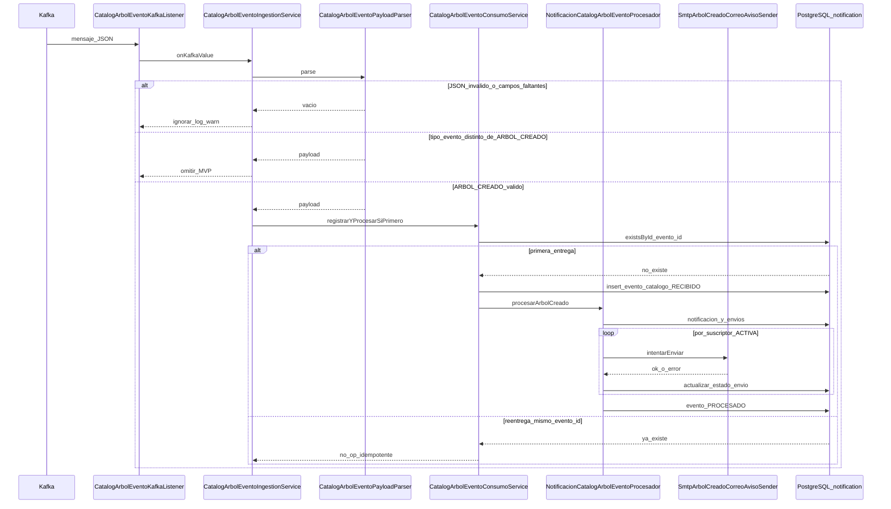
```mermaid
sequenceDiagram
  participant KB as Kafka
  participant Lst as CatalogArbolEventoKafkaListener
  participant Ing as CatalogArbolEventoIngestionService
  participant Parser as CatalogArbolEventoPayloadParser
  participant Con as CatalogArbolEventoConsumoService
  participant Proc as NotificacionCatalogArbolEventoProcesador
  participant Mail as SmtpArbolCreadoCorreoAvisoSender
  participant PG as PostgreSQL_notification

  KB->>Lst: mensaje_JSON
  Lst->>Ing: onKafkaValue
  Ing->>Parser: parse
  alt JSON_invalido_o_campos_faltantes
    Parser-->>Ing: vacio
    Ing-->>Lst: ignorar_log_warn
  else tipo_evento_distinto_de_ARBOL_CREADO
    Parser-->>Ing: payload
    Ing-->>Lst: omitir_MVP
  else ARBOL_CREADO_valido
    Parser-->>Ing: payload
    Ing->>Con: registrarYProcesarSiPrimero
    Con->>PG: existsById_evento_id
    alt primera_entrega
      PG-->>Con: no_existe
      Con->>PG: insert_evento_catalogo_RECIBIDO
      Con->>Proc: procesarArbolCreado
      Proc->>PG: notificacion_y_envios
      loop por_suscriptor_ACTIVA
        Proc->>Mail: intentarEnviar
        Mail-->>Proc: ok_o_error
        Proc->>PG: actualizar_estado_envio
      end
      Proc->>PG: evento_PROCESADO
    else reentrega_mismo_evento_id
      PG-->>Con: ya_existe
      Con-->>Ing: no_op_idempotente
    end
  end
```

### **3.1.3 Almacenamiento de fotografías**

Las fotografías se almacenan como **objetos** en un almacén **S3-compatible** (**MinIO**) y sus **metadatos** en PostgreSQL, esquema **`media`**, vía **media-service** detrás del **API Gateway**. La SPA obtiene primero una **URL prefirmada** (`POST /api/media/uploads/presign`) con JWT; el servicio valida reglas de negocio (MIME permitidos, tamaño máximo configurable y cupo de fotos por árbol) y devuelve la URL y la clave de objeto. El cliente sube el binario directamente al bucket y, a continuación, **confirma** la operación (`POST /api/media/photos/confirm`) para persistir metadatos: la **primera confirmación** por árbol queda como **foto principal**; el **orden** refleja la secuencia de confirmaciones (o el índice explícito enviado por la SPA si coincide con el esperado). La visibilidad efectiva de la imagen en consulta pública se **hereda de la ficha del árbol**; detalle funcional y criterios de aceptación: [HU-006](docs/backlog/HU-006-fotografias-asociadas-al-arbol.md); contrato HTTP: [docs/api/openapi.yaml](docs/api/openapi.yaml); guía técnica operativa (propiedades, secuencia, principal, EXIF): [docs/engineering/media-upload-hu006.md](docs/engineering/media-upload-hu006.md).

Para **consulta pública mínima** ([HU-014](docs/backlog/HU-014-consulta-de-fotografias-del-arbol.md), existe `GET /api/media/public/trees/{treeId}/primary-photo` (**sin JWT** en gateway): media-service comprueba que el árbol sea visible vía catálogo público y devuelve el binario de la foto principal si existe en el bucket. La SPA lo usa para la **miniatura** del listado de árboles publicados.

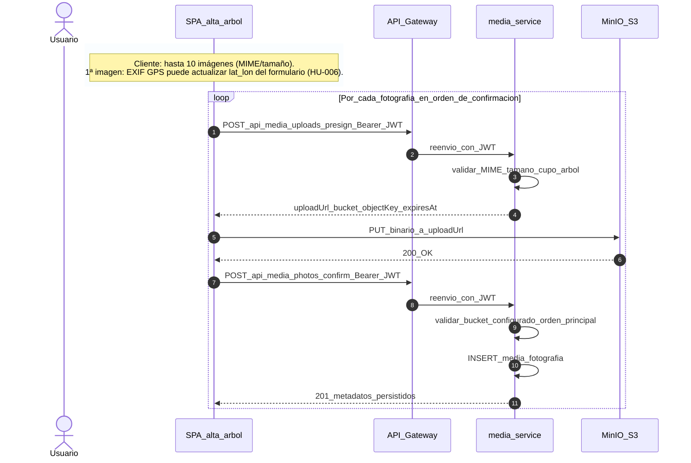
```mermaid
sequenceDiagram
  autonumber
  actor U as Usuario
  participant SPA as SPA_alta_arbol
  participant GW as API_Gateway
  participant MS as media_service
  participant M as MinIO_S3

  rect rgba(240, 248, 255, 0.35)
    Note over SPA: Cliente: hasta 10 imágenes (MIME/tamaño).<br/>1ª imagen: EXIF GPS puede actualizar lat_lon del formulario (HU-006).
  end

  loop Por_cada_fotografia_en_orden_de_confirmacion
    SPA->>GW: POST_api_media_uploads_presign_Bearer_JWT
    GW->>MS: reenvio_con_JWT
    MS->>MS: validar_MIME_tamano_cupo_arbol
    MS-->>SPA: uploadUrl_bucket_objectKey_expiresAt

    SPA->>M: PUT_binario_a_uploadUrl
    M-->>SPA: 200_OK

    SPA->>GW: POST_api_media_photos_confirm_Bearer_JWT
    GW->>MS: reenvio_con_JWT
    MS->>MS: validar_bucket_configurado_orden_principal
    MS->>MS: INSERT_media_fotografia
    MS-->>SPA: 201_metadatos_persistidos
  end
```


**Flujo de registro de árbol y subida de imagen:**

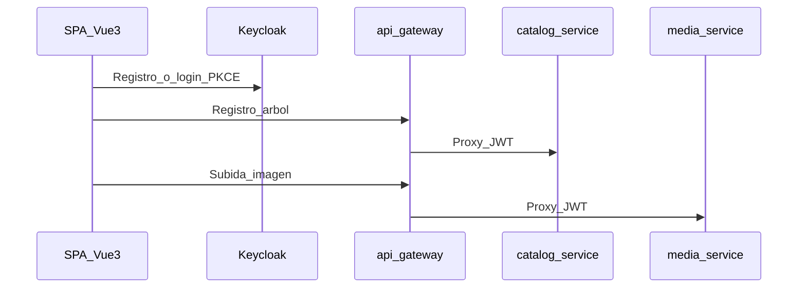
```mermaid
sequenceDiagram
  participant SPA as SPA_Vue3
  participant KC as Keycloak
  participant GW as api_gateway
  participant CAT as catalog_service
  participant MED as media_service
  SPA->>KC: Registro_o_login_PKCE
  SPA->>GW: Registro_arbol
  GW->>CAT: Proxy_JWT
  SPA->>GW: Subida_imagen
  GW->>MED: Proxy_JWT
```

### **3.1.4 Uso de IA: características de especie (MVP) e identificación/chat (futuro)**


**Flujo de consulta IA (datos de especie vía catalog-service):**

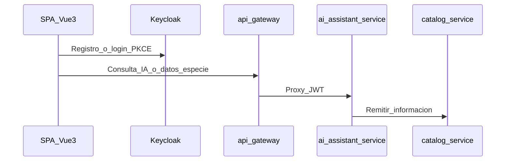
```mermaid
sequenceDiagram
  participant SPA as SPA_Vue3
  participant KC as Keycloak
  participant GW as api_gateway
  participant AIS as ai_assistant_service
  participant CAT as catalog_service
  SPA->>KC: Registro_o_login_PKCE
  SPA->>GW: Consulta_IA_o_datos_especie
  GW->>AIS: Proxy_JWT
  AIS->>CAT: Remitir_informacion
```


### **3.2. Descripción de componentes principales:**


| Componente           | Tecnología                                                                                                                                                                                                        | Responsabilidad                                                                                                                                                                                                                                                                                                                                                                  |
| -------------------- | ----------------------------------------------------------------------------------------------------------------------------------------------------------------------------------------------------------------- | -------------------------------------------------------------------------------------------------------------------------------------------------------------------------------------------------------------------------------------------------------------------------------------------------------------------------------------------------------------------------------- |
| SPA                  | Vue 3, Vite, TypeScript                                                                                                                                                                                           | UI: biblioteca, mapa, IA, flujos OIDC con Keycloak                                                                                                                                                                                                                                                                                                                               |
| API Gateway          | Spring Cloud Gateway (**WebFlux**), **Spring Boot 4**                                                                                                                                                             | Enrutado `/api/catalog`, `/api/media`, `/api/notifications`, `/api/ai`; **validación JWT** (OAuth2 Resource Server, Keycloak); actuator; token relay hacia microservicios (MVP)                                                                                                                                                                                                  |
| catalog-service      | **Spring Boot 4**, JPA, Flyway, PostgreSQL, Redis (Mongo según evolución); **productor Kafka** topic `catalog.arbol.evento` (`ARBOL_CREADO` tras alta; [TASK-HU-005-05](docs/backlog/HU-005-ticket-breakdown.md)) | Árboles, coordenadas numéricas (MVP sin geometría PostGIS en DDL); **PostgreSQL** (esquema **catalog**); publicación de eventos de dominio según [kafka-events.md](docs/events/kafka-events.md). **UC-04 / HU-008:** `GET`/`PUT`/`DELETE` en `/api/catalog/trees`, orquestación de baja hacia media ([services/README.md](services/README.md) § HU-008).                                                                                                                                                                                  |
| media-service        | **Spring Boot 4**, JPA, Flyway, AWS SDK v2 (S3)                                                                                                                                                                   | Metadatos solo en esquema `**media`**; objetos en bucket MinIO/S3; URLs prefirmadas                                                                                                                                                                                                                                                                                              |
| notification-service | **Spring Boot 4**, JPA, Flyway, Spring Kafka, JavaMail                                                                                                                                                            | Consume `catalog.arbol.evento`; datos solo en esquema `**notification`**; envío SMTP                                                                                                                                                                                                                                                                                             |
| ai-assistant-service | **Spring Boot 4**, Spring WebClient (o equivalente), Spring Data JPA                                                                                                                                              | Orquestación hacia proveedor IA; datos de auditoria en esquema `**ai`** (p. ej. **AUDITORIA_USO_IA**); delegación de datos de catálogo en **catalog-service**                                                                                                                                                                                                                    |
| Keycloak             | Keycloak 26                                                                                                                                                                                                       | Realm, clientes, roles, emisión de JWT                                                                                                                                                                                                                                                                                                                                           |
| Kafka                | Apache Kafka (KRaft en dev)                                                                                                                                                                                       | Topics p. ej. `catalog.arbol.evento`                                                                                                                                                                                                                                                                                                                                             |
| Mailpit              | Mailpit (imagen `axllent/mailpit`, Compose)                                                                                                                                                                       | SMTP de prueba en desarrollo local; bandeja en UI web; sin relay a dominios reales ([infra/compose/README.md](infra/compose/README.md))                                                                                                                                                                                                                                         |
| Prometheus           | Prometheus (imagen `prom/prometheus:v3.2.1`, Compose)                                                                                                                                                             | Recolección de métricas desde `/actuator/prometheus` de los microservicios en el host; UI **http://localhost:9090** ([platform/observability/README.md](platform/observability/README.md))                                                                                                                                                                                      |
| Grafana              | Grafana (imagen `grafana/grafana:11.5.2`, Compose)                                                                                                                                                                | Visualización; dashboard provisionado **MTL Microservices**; UI **http://localhost:3000** (credenciales `GRAFANA_ADMIN_*` en `.env`)                                                                                                                                                                                                                                            |
| PostgreSQL           | 16                                                                                                                                                                                                                | **Un servidor**; **cuatro esquemas** (`catalog`, `media`, `notification`, `ai`). En **catalog**, el DDL actual   usa **latitud/longitud** `NUMERIC` (sin columna PostGIS); la extensión PostGIS está prevista en el contenedor para iteraciones posteriores ([V1__baseline.sql](services/catalog-service/src/main/resources/db/migration/V1__baseline.sql)). |
| MongoDB              | 7                                                                                                                                                                                                                 | Colecciones de enriquecimiento y notas; proyección mínima para búsqueda sin SQL (véase [mongo.md](docs/data-model/mongo.md))                                                                                                                                                                                                                                                     |
| Redis                | 7                                                                                                                                                                                                                 | Caché                                                                                                                                                                                                                                                                                                                                                                            |
| MinIO                | S3 API                                                                                                                                                                                                            | Imágenes en desarrollo                                                                                                                                                                                                                                                                                                                                                           |


### **3.3. Descripción de alto nivel del proyecto y estructura de ficheros**

Estructura de repositorio **prevista** para la fase de implementación (monorepo):

```
proyecto/
├── frontend/                 # SPA Vue 3 (Vite)
├── services/                 # Gateway + microservicios Spring Boot (un directorio por despliegue)
│   ├── api-gateway/
│   ├── catalog-service/
│   ├── media-service/
│   ├── notification-service/
│   ├── ai-assistant-service/
│   └── system-e2e-tests/     # IT E2E HTTP contra el API Gateway (JWT real; ver README del módulo)
├── platform/
│   └── observability/        # Configuración de telemetría/trazas/logs (OTel, Prometheus, Grafana…)
├── infra/                    # Orquestación local y nube
│   ├── compose/              # Docker Compose (infra de apoyo); ver README.md en esa carpeta
│   └── k8s/                  # Manifiestos / Helm (según despliegue)
├── docs/
│   ├── adr/                  # Architecture Decision Records
│   ├── api/                  # OpenAPI (contrato del gateway)
│   ├── backlog/              # Historias y desgloses de tickets (HU-*)
│   ├── data-model/           # Modelo de datos (reglas, Mongo, readme §3)
│   ├── engineering/          # Guías: tests Java/Maven (`testing-java.md`), Flyway local (`flyway-dev-reset.md`), mapa canónico (`canonical-sources.md`)
│   ├── events/               # Contrato de eventos Kafka
│   ├── security/             # JWT, gateway, estrategia de validación
│   └── use-cases/            # Casos de uso
└── readme.md
```

### **3.4. Infraestructura y despliegue**

**Desarrollo:** Docker Compose (o equivalente) con **un** PostgreSQL con extensión **PostGIS** (cuatro esquemas de aplicación: `catalog`, `media`, `notification`, `ai`), MongoDB, Redis, MinIO, Kafka, Keycloak, **Mailpit** (SMTP de prueba para notificaciones en local), **Prometheus** (`prom/prometheus:v3.2.1`) y **Grafana** (`grafana/grafana:11.5.2`) para métricas y dashboards ([ADR-0005](docs/adr/0005-microservices-observabilty-spring-boot.md)); los microservicios Spring Boot suelen ejecutarse en el **host** (puertos 8080–8084) para que Prometheus haga scrape vía `host.docker.internal`, o como contenedores si se adaptan los targets.

**Despliegue Producción:** orquestación (Kubernetes), secretos externos, Keycloak y Kafka en HA según entorno, bases de datos gestionadas y almacenamiento de objetos S3 en nube.

**Decisiones documentadas:** descubrimiento de servicios y configuración **sin Eureka ni Spring Cloud Config** (asumidas por Compose/Kubernetes) — [ADR-0001](docs/adr/0001-discovery-y-configuracion-por-orquestador.md). Claves primarias **numéricas** en SQL frente a UUID — [ADR-0002](docs/adr/0002-claves-primarias-numericas-frente-a-uuid.md). Observabilidad sencilla (Actuator, Prometheus, Grafana, logs JSON) — [ADR-0005](docs/adr/0005-microservices-observabilty-spring-boot.md); guía operativa en [platform/observability/README.md](platform/observability/README.md).

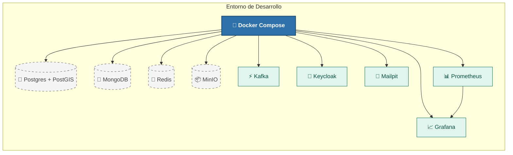
```mermaid
flowchart LR
    %% --- Estilos (Consistentes con toda la documentación) ---
    classDef orch fill:#2D71A8,stroke:#1E4B73,stroke-width:2px,color:#FFFFFF,font-weight:bold;
    classDef service fill:#E1F5EE,stroke:#0F6E56,stroke-width:1px,color:#085041;
    classDef db fill:#F5F5F5,stroke:#616161,stroke-width:1px,color:#424242,stroke-dasharray: 5 5;

    subgraph dev [Entorno de Desarrollo]
        direction TB
        DC["🐳 Docker Compose"]:::orch
        
        %% Servicios
        KCd["🔐 Keycloak"]:::service
        Kd["⚡ Kafka"]:::service
        MPd["📧 Mailpit"]:::service
        PRd["📊 Prometheus"]:::service
        GRd["📈 Grafana"]:::service
        
        %% Almacenamiento
        PGd[("🐘 Postgres + PostGIS")]:::db
        MGd[("🍃 MongoDB")]:::db
        Rd[("🚀 Redis")]:::db
        S3d[("📦 MinIO")]:::db
    end

    %% --- Relaciones ---
    DC --> PGd
    DC --> MGd
    DC --> Rd
    DC --> S3d
    DC --> Kd
    DC --> KCd
    DC --> MPd
    DC --> PRd
    DC --> GRd
    PRd --> GRd
```


### **3.5. Seguridad**


| Práctica                  | Descripción                                                                                                                                                                             |
| ------------------------- | --------------------------------------------------------------------------------------------------------------------------------------------------------------------------------------- |
| Autenticación OIDC        | Keycloak como IdP; SPA con **Authorization Code + PKCE**; JWT firmados; `issuer-uri` alineado con el realm                                                                              |
| Autorización              | Roles de realm `COLABORADOR` y `ADMIN`; políticas en recursos sensibles                                                                                                                 |
| Gateway                   | Validación de JWT en el gateway (`spring-boot-starter-oauth2-resource-server`); rutas públicas según OpenAPI; **cabeceras de correlación** en roadmap (propagación gateway → servicios) |
| Almacenamiento de objetos | Buckets privados; **URLs prefirmadas** de corta duración; sin credenciales en el cliente                                                                                                |
| Suscripciones y privacidad | En el **MVP** solo se solicita **correo electrónico** para el aviso por alta de ficha; **no** se piden otros datos personales (nombre, teléfono, documento, etc.). La baja operativa es por estado (**ACTIVA** / **CANCELADA**) gestionada por **ADMIN**; minimización de datos en logs y APIs según contrato y modelo. |
| Transporte                | TLS en producción; CORS restringido al origen del SPA                                                                                                                                   |
| Observabilidad            | Actuator + Prometheus scrape + Grafana ([platform/observability/README.md](platform/observability/README.md)) |


**Implementación y normativa:** [docs/security/jwt-gateway-strategy.md](docs/security/jwt-gateway-strategy.md) · `.cursor/rules/api-security.mdc` · [docs/api/openapi.yaml](docs/api/openapi.yaml) · Keycloak: [infra/compose/README.md](infra/compose/README.md).

### **3.6. Tests**

Estrategia prevista: pruebas unitarias de dominio; **integración** con **Testcontainers** (PostgreSQL con PostGIS, MongoDB, Kafka) donde aporte valor; **contrato de API** en [docs/api/openapi.yaml](docs/api/openapi.yaml) como referencia para pruebas de contrato y revisiones; tests de capa web y de aceptación sobre flujos críticos (catalogo, notificaciones, IA).

**Backend Java (`services/`):** convención `src/test/java` vs `src/testIT/java`, Surefire/Failsafe, checklist (p. ej. Gateway 5.x) e IDE — [docs/engineering/testing-java.md](docs/engineering/testing-java.md).

**End-to-end backend Java (`services/system-e2e-test`):** convención `src/test/java` vs `src/testIT/java`, Surefire/Failsafe, proyecto con test end to end del back; testea la capa completa de microservicios java.

---

## 4. Modelo de datos

**Documentación relacionada:** [Notas de negocio y reglas](docs/data-model/data-model.md) · [Modelo técnico MongoDB (colecciones, validación, índices)](docs/data-model/mongo.md) · [Eventos Kafka](docs/events/kafka-events.md)

### **4.1. Modelo lógico del sistema completo**

Vista unificada de las entidades principales del sistema y sus relaciones, independientemente del almacén o microservicio (§4.2). Las referencias entre dominios se expresan como **FK lógicas** sin una implementación de una restricción física real entre los distintos esquemas.

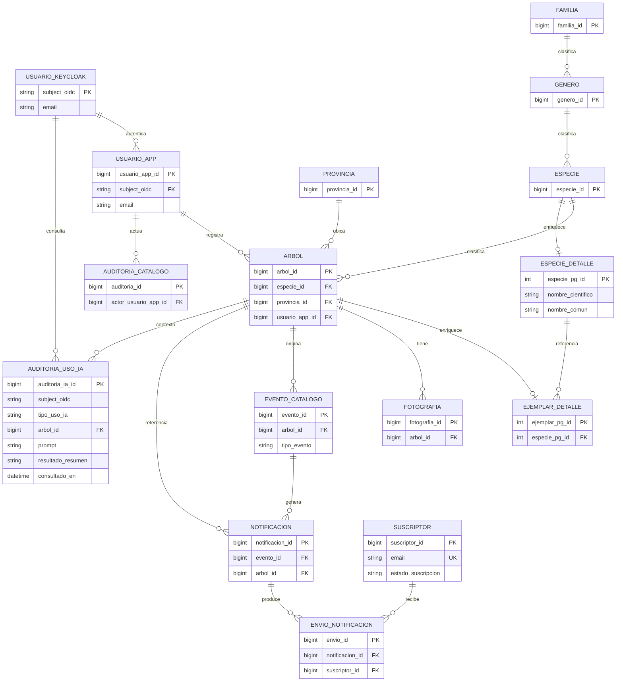
```mermaid
erDiagram
    USUARIO_KEYCLOAK {
        string subject_oidc PK
        string email
    }
    USUARIO_APP {
        bigint usuario_app_id PK
        string subject_oidc FK
        string email
    }
    FAMILIA {
        bigint familia_id PK
    }
    GENERO {
        bigint genero_id PK
    }
    ESPECIE {
        bigint especie_id PK
    }
    PROVINCIA {
        bigint provincia_id PK
    }
    ARBOL {
        bigint arbol_id PK
        bigint especie_id FK
        bigint provincia_id FK
        bigint usuario_app_id FK
    }
    ESPECIE_DETALLE {
        int especie_pg_id PK
        string nombre_cientifico
        string nombre_comun
    }
    EJEMPLAR_DETALLE {
        int ejemplar_pg_id PK
        int especie_pg_id FK
    }
    FOTOGRAFIA {
        bigint fotografia_id PK
        bigint arbol_id FK
    }
    EVENTO_CATALOGO {
        bigint evento_id PK
        bigint arbol_id FK
        string tipo_evento
    }
    NOTIFICACION {
        bigint notificacion_id PK
        bigint evento_id FK
        bigint arbol_id FK
    }
    SUSCRIPTOR {
        bigint suscriptor_id PK
        string email UK
        string estado_suscripcion
    }
    ENVIO_NOTIFICACION {
        bigint envio_id PK
        bigint notificacion_id FK
        bigint suscriptor_id FK
    }
    AUDITORIA_CATALOGO {
        bigint auditoria_id PK
        bigint  actor_usuario_app_id FK
    }
    AUDITORIA_USO_IA {
        bigint auditoria_ia_id PK
        string subject_oidc
        string tipo_uso_ia
        bigint arbol_id FK
        string prompt
        string resultado_resumen
        datetime consultado_en
    }
    FAMILIA ||--o{ GENERO : clasifica
    GENERO ||--o{ ESPECIE : clasifica
    ESPECIE ||--o{ ARBOL : clasifica
    PROVINCIA ||--o{ ARBOL : ubica
    USUARIO_KEYCLOAK ||--o{ USUARIO_APP : autentica
    USUARIO_KEYCLOAK ||--o{ AUDITORIA_USO_IA : consulta
    USUARIO_APP ||--o{ ARBOL : registra
    USUARIO_APP ||--o{ AUDITORIA_CATALOGO : actua
    ESPECIE ||--o| ESPECIE_DETALLE : enriquece
    ESPECIE_DETALLE ||--o{ EJEMPLAR_DETALLE : referencia
    ARBOL ||--o| EJEMPLAR_DETALLE : enriquece
    ARBOL ||--o{ FOTOGRAFIA : tiene
    ARBOL ||--o{ EVENTO_CATALOGO : origina
    ARBOL ||--o{ NOTIFICACION : referencia
    EVENTO_CATALOGO ||--o{ NOTIFICACION : genera
    NOTIFICACION ||--o{ ENVIO_NOTIFICACION : produce
    SUSCRIPTOR ||--o{ ENVIO_NOTIFICACION : recibe
    ARBOL ||--o{ AUDITORIA_USO_IA : contexto
```

### **4.2. Diagrama de persistencia (implementación)**

**Leyenda:** 
- `PK` = clave primaria; `FK` = clave foránea de negocio; `UK` = unicidad. 
- `creado_por` / `modificado_por` = campos usados para auditoría (sin sufijo `FK`). 
- Tipos PostgreSQL (`bigint`, `varchar`, `text`, `timestamptz`, `numeric`, `integer`, …).

#### **4.2.1 PostgreSQL: catalog_service:**

Esquema con los datos generales de cada árbol y auditoria del usuario que los registró.

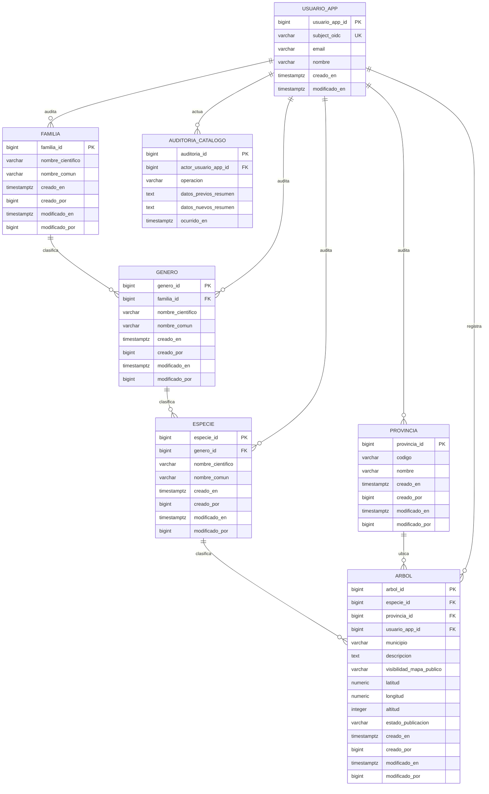
```mermaid
erDiagram
    USUARIO_APP {
        bigint usuario_app_id PK
        varchar subject_oidc UK
        varchar email
        varchar nombre
        timestamptz creado_en
        timestamptz modificado_en
    }
    FAMILIA {
        bigint familia_id PK
        varchar nombre_cientifico
        varchar nombre_comun
        timestamptz creado_en
        bigint creado_por
        timestamptz modificado_en
        bigint modificado_por
    }
    GENERO {
        bigint genero_id PK
        bigint familia_id FK
        varchar nombre_cientifico
        varchar nombre_comun
        timestamptz creado_en
        bigint creado_por
        timestamptz modificado_en
        bigint modificado_por
    }
    ESPECIE {
        bigint especie_id PK
        bigint genero_id FK
        varchar nombre_cientifico
        varchar nombre_comun
        timestamptz creado_en
        bigint creado_por
        timestamptz modificado_en
        bigint modificado_por
    }
    PROVINCIA {
        bigint provincia_id PK
        varchar codigo
        varchar nombre
        timestamptz creado_en
        bigint creado_por
        timestamptz modificado_en
        bigint modificado_por
    }
    ARBOL {
        bigint arbol_id PK
        bigint especie_id FK
        bigint provincia_id FK
        bigint usuario_app_id FK
        varchar municipio
        text descripcion
        varchar visibilidad_mapa_publico
        numeric latitud
        numeric longitud
        integer altitud
        varchar estado_publicacion
        timestamptz creado_en
        bigint creado_por
        timestamptz modificado_en
        bigint modificado_por
    }
    AUDITORIA_CATALOGO {
        bigint auditoria_id PK
        bigint actor_usuario_app_id FK
        varchar operacion
        text datos_previos_resumen
        text datos_nuevos_resumen
        timestamptz ocurrido_en
    }
    FAMILIA ||--o{ GENERO : clasifica
    GENERO ||--o{ ESPECIE : clasifica
    ESPECIE ||--o{ ARBOL : clasifica
    PROVINCIA ||--o{ ARBOL : ubica
    USUARIO_APP ||--o{ ARBOL : registra
    USUARIO_APP ||--o{ FAMILIA : audita
    USUARIO_APP ||--o{ GENERO : audita
    USUARIO_APP ||--o{ ESPECIE : audita
    USUARIO_APP ||--o{ PROVINCIA : audita
    USUARIO_APP ||--o{ AUDITORIA_CATALOGO : actua
```

Para el alta de árbol, los valores admitidos son:

- `estado_publicacion`: `BORRADOR` o `PUBLICADO`.
- `visibilidad_mapa_publico`: `PRIVADO` o `PUBLICO`.

#### **4.2.2 Mongo catalog_service:**

Base de datos NoSQL que permite almacenar información no estructurada de cada árbol.

*Tiene una proyección mínima de datos generales de  `ESPECIE` para facilitar búsquedas en Mongo por nombre de especie  sin join obligatorio con SQL; el maestro completo permanece en PostgreSQL.  [mongo.md](docs/data-model/mongo.md).*

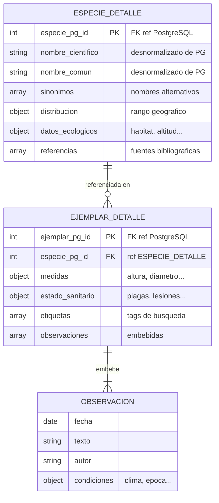
```mermaid
erDiagram

  ESPECIE_DETALLE ||--o{ EJEMPLAR_DETALLE : "referenciada en"

  ESPECIE_DETALLE {
    int    especie_pg_id       PK "FK ref PostgreSQL"
    string nombre_cientifico      "desnormalizado de PG"
    string nombre_comun           "desnormalizado de PG"
    array  sinonimos              "nombres alternativos"
    object distribucion           "rango geografico"
    object datos_ecologicos       "habitat, altitud..."
    array  referencias            "fuentes bibliograficas"
  }

  EJEMPLAR_DETALLE {
    int    ejemplar_pg_id      PK "FK ref PostgreSQL"
    int    especie_pg_id       FK "ref ESPECIE_DETALLE"
    object medidas                "altura, diametro..."
    object estado_sanitario       "plagas, lesiones..."
    array  etiquetas              "tags de busqueda"
    array  observaciones          "embebidas"
  }

  OBSERVACION {
    date   fecha
    string texto
    string autor
    object condiciones            "clima, epoca..."
  }

  EJEMPLAR_DETALLE ||--|{ OBSERVACION : "embebe"
```

#### **4.2.3 PostgreSQL media_service:**

Metadatos de fotografías en esquema `media`. `arbol_id` referencia lógicamente a `catalog.arbol` (sin FK entre esquemas).

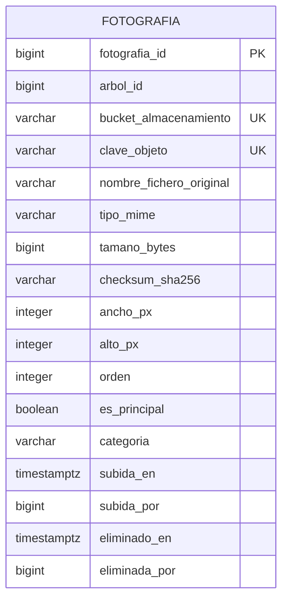
```mermaid
erDiagram
    %% UK compuesta uq_fotografia_objeto (bucket_almacenamiento, clave_objeto)
    FOTOGRAFIA {
        bigint fotografia_id PK
        bigint arbol_id
        varchar bucket_almacenamiento UK
        varchar clave_objeto UK
        varchar nombre_fichero_original
        varchar tipo_mime
        bigint tamano_bytes
        varchar checksum_sha256
        integer ancho_px
        integer alto_px
        integer orden
        boolean es_principal
        varchar categoria
        timestamptz subida_en
        bigint subida_por
        timestamptz eliminado_en
        bigint eliminada_por
    }
```

#### **4.2.4 PostgreSQL notification_service:**

Avisos de de nuevas altas en el sistema a los suscriptores.

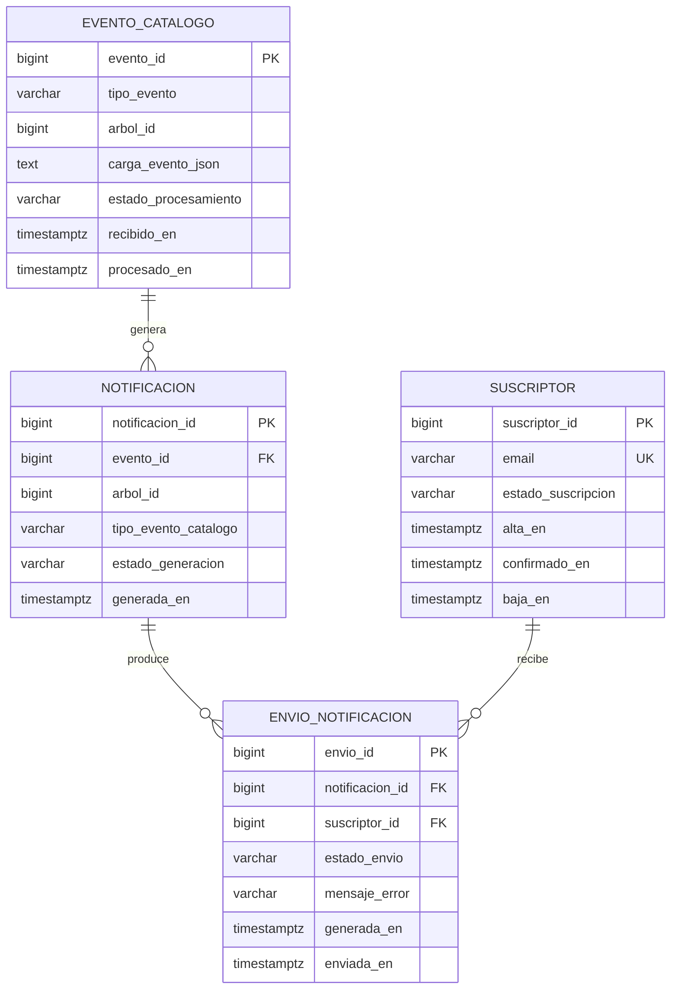
```mermaid
erDiagram
    %% UK email normalizado uq_suscriptor_email_normalizado lower(trim(email))
    SUSCRIPTOR {
        bigint suscriptor_id PK
        varchar email UK
        varchar estado_suscripcion
        timestamptz alta_en
        timestamptz confirmado_en
        timestamptz baja_en
    }
    EVENTO_CATALOGO {
        bigint evento_id PK
        varchar tipo_evento
        bigint arbol_id
        text carga_evento_json
        varchar estado_procesamiento
        timestamptz recibido_en
        timestamptz procesado_en
    }
    NOTIFICACION {
        bigint notificacion_id PK
        bigint evento_id FK
        bigint arbol_id
        varchar tipo_evento_catalogo
        varchar estado_generacion
        timestamptz generada_en
    }
    ENVIO_NOTIFICACION {
        bigint envio_id PK
        bigint notificacion_id FK
        bigint suscriptor_id FK
        varchar estado_envio
        varchar mensaje_error
        timestamptz generada_en
        timestamptz enviada_en
    }
    EVENTO_CATALOGO ||--o{ NOTIFICACION : genera
    NOTIFICACION ||--o{ ENVIO_NOTIFICACION : produce
    SUSCRIPTOR ||--o{ ENVIO_NOTIFICACION : recibe
```

#### **4.2.5 PostgreSQL ai_assistant_service (esquema `ai`):**

Modelo objetivo de **AUDITORIA_USO_IA** (esquema `ai` inicializado; tabla pendiente de migración Flyway). **`subject_oidc`** persiste el claim `sub` del JWT (Keycloak) en el momento de la consulta; **`arbol_id`** referencia lógicamente a `catalog.arbol`. Sin FK entre esquemas ni dependencia de `catalog.usuario_app`: la trazabilidad del actor se toma directamente del token. Coherente con §4.1 y R3.

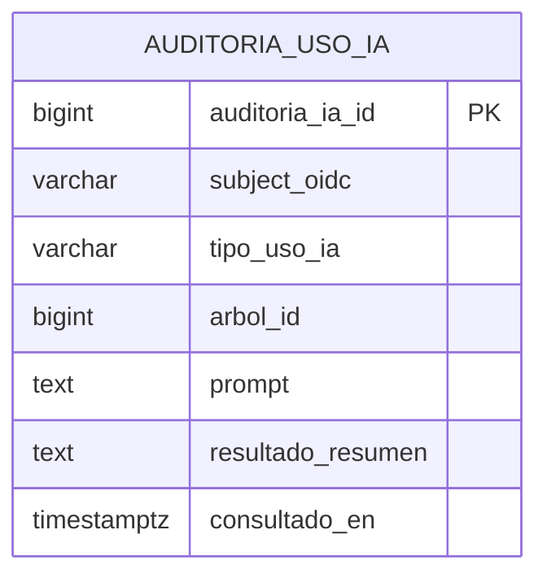
```mermaid
erDiagram
    AUDITORIA_USO_IA {
        bigint auditoria_ia_id PK
        varchar subject_oidc
        varchar tipo_uso_ia
        bigint arbol_id
        text prompt
        text resultado_resumen
        timestamptz consultado_en
    }
```

### **4.3. Descripción de entidades principales (orientación física)**

Las entidades físicas se reparten por servicio y almacén como se indica en §3.2: Un servidor **PostgreSQL** con cuatro esquemas `catalog`, `media`, `notification` y `ai`; Una Base e datos **MongoDB** usada por  **catalog-service**.

**Usuario de aplicación:** La audditoría de la aplicación se implementa en torno a al usuario proporcionado por el token generado por keycloak como proveedor OIDC. Para evitar duplicidades los diversos esquemas almacenan el identificador estable del proveedor (`sub`) que se guarda en el campo `**subject_oidc`**. En el caso de catalog-service este campo se guarda en una tabla USUARIO_APP con unicidad, no como clave primaria; esto permite trazabilidad sin duplicar la información; las FK de los campos de auditoria creado_por y modificado_por referencian a la clave primaria de esta tabla.

---

## 5. Especificación de la API

**Contrato canónico (OpenAPI 3):** [docs/api/openapi.yaml](docs/api/openapi.yaml) — rutas bajo el API Gateway (`/api/catalog`, `/api/media`, `/api/notifications`, `/api/ai`), seguridad JWT donde aplica, listados paginados (`page`, `size`) y errores en **RFC 9457** (`application/problem+json`).

**Convenciones de diseño:** de cara a homogeneizar el desarrollo. se han definido las siguientes reglas de Cursor `.cursor/rules/api-contract.mdc`, `.cursor/rules/api-design.mdc` y `.cursor/rules/api-security.mdc`.

**Eventos asíncronos** notificaciones asíncronas asociadas al alte de un ejemplar: [docs/events/kafka-events.md](docs/events/kafka-events.md).

---

## 6. Historias de usuario

A partir del Modelo de análisis (actores, casos de uso, diagrama PlantUML): [docs/use-cases/use-case-summary.md](docs/use-cases/use-case-summary.md) y de la definición del sistema (archivo actual) se ha generado el backlog con la relación de las historias de uauario a implementar [docs/backlog/backlog.md](docs/backlog/backlog.md).

La definición y refinamiento de cada una de las historias de usuario incluidas en el backlog, y sus correspondientes ticket de trabajo, se ha realizado mediante los siguientes prompts genéricos que se han guardado como skills de Cursor: `.cursor/skills/hu-refinement-mtl/SKILL.md` (generación/refinamiento de historias) y `.cursor/skills/hu-breakdown-mtl/SKILL.md` (desglose en tickets). Estos prompt generar el correspondiente archivo dentro de la carpeta backlog.

El proceso seguido es:
- 1.- Generación de la Historia de Usuario a partir del backlog con `hu-breakdown-mtl/SKILL.md`
- 2.- Análisis de  documento generado
- 3.- Aclaración, definición y/o corrección de los puntos detectados en los apratdos de Riesgos y Aclaraciones pendientes (refinamiento)
- 4.- Generación de los ticket de trabajo con `hu-refinement-mtl/SKILL.md`

Por operativa práctica, al comienzo de la historia se hacen unas comprobaciones iniciales que permiten detectar historias incompletas o mal formadas.   

**Ejemplo del proceso: Historia de Usuario — HU-008 (Edición y baja de mis árboles) **

**Prompt 1:**

Vamos a desarrollar la historia HU-008@.cursor/skills/hu-refinement-mtl

**Prompt 2:**

Vamos a revisar los puntos que quedan fuera de la historia. 1.- Añade en HU-006 el ticket para incluir la posibilidad de añadir y borrar fotografías desde la pantalla de edición de Mis arboles 2.- Incluye en  el Backlog una nueva historia histroias para abordar Proyección o enriquecimiento Mongo 3.- Incluye en la historia que estamos abordando la posibiliad de borrar árboles

**Prompt 3:**

El borrado se rá físico; cuando se borre un árbol se deben eliminar sus fotografías y su ampliación en Mongo; dado que aún no tenemos implementado en Mongo se necesitará un ticket solo para implementar esta acción que por ahora quedará como pendiente. Revisa si con estas aclaraciones podemos cerrar este punto y abordar los dos siguientes que serán Riesgos y Aclaraciones pendientes

**Prompt 4:**

Respecto al riesgo de Listado sin filtros vamos a añadir en la historia el filtro por especie y por fecha de creación: desde - hasta. Para el borrado de todas las fotos de un árbol vamos a incluir un nuevo endpoint en media-service que será consumido por el microservicio de vatalogo; dejalo anotado en esta historia como ticket que debe modificar los dos microservicios. Ante un fallo parcial del borrado en cascada se producirá un Rollback (no se usará un patrón sagas en el MVP). Dime si queda algo pendiente antes de abordar el desglose de la historia en ticket, no abordes este desglose hasta que yo te lo diga

**Prompt 5:**

1.- Path de borrado: DELETE /api/media/trees/{treeId}/photos 2.- Si un arbol tiene fotografías primero se invoca al servicio de borrado de todas lasa fotografías; si el servicio da error se para el proceso; si se han borrado todas las fotografías se elimina el arbol en PostgreSQL 3.- Fehcas en formato date a ser posible en UTC 4.- Para ADMIN se añade un filtro más para poder seleccionar los árboles dados de alta por un usuario determinado


---

## 7. Tickets de trabajo

Como se ha comentado en el punto anterior, para mantener formato homogéneo se usa un prompt genérico que se ha almacenado como skill`.cursor/skills/hu-breakdown-mtl/SKILL.md` (desglose en tickets). Este prompt gerera el correspondiente archivo md dentro de la carpeta backlog.

En la generación ed ticket de trabajo se incluye explicitamente una sección con las rules de Cursor que debe aplicar el agente de IA al implementarlos.


**Ejemplo del proceso: Ticket 1 — HU-008**

**Prompt 1:**

Vamos a generar los ticket de la historia; a partir de aquí incluye mis prompt utiliza la información que tienes en el contexto y a partir de la línea 1154 del readme (Ticket 1) solo incluye mi parte, no tu respuesta al prompt. Usa la información que hemos definido y /hu-refinement-mtl HU-008

**Prompt 2:**

Vamos con TASK-HU-008-01, Cierre OpenAPI catálogo y media (HU-008). Además de las operraciones que propone el ticket vamos a incluir además del endpoint de borrado de todas ls fotografías el endpoint del borrado de una fotografía (va también dentor de /api/media)

**Prompt 3** (TASK-HU-008-02 — Listado colaborador con filtros)

así está bien, implementa en endpoint del Listado de TASK-HU-008-02, si tienes alguna duda preguntame antes; recuerda las reglas que se deben seguir ya indicadas en @docs/backlog/HU-008-ticket-breakdown.md para la parte back


---

## 8. Pull requests

Las Pull requests del proyecto se generan a partir del template `pull_request_template`
> Documenta 3 de las Pull Requests realizadas durante la ejecución del proyecto

**Pull Request 1**
## Resumen

Implementa la **HU-004**: alta de suscripción por correo sin cuenta de colaborador, con API en **notification-service**, exposición vía **gateway**, contrato en **OpenAPI**, pantalla y flujo en **frontend** (formulario, validación, i18n, tests), y documentación de backlog / modelo de datos / onboarding Git.

## Cambios principales

- **Backend (`notification-service`)**: registro de suscriptores, migración `V2__suscriptor.sql`, seguridad Keycloak, controlador REST de altas públicas, manejo de errores tipo Problem Details, tests (servicio + WebMvc).
- **Gateway**: filtro global ante errores de conexión a downstream y utilidades asociadas (con tests).
- **Frontend**: vista `SubscribeByEmailView`, composable `usePublicSubscriptionForm`, servicio `publicSubscription`, ampliación de `apiClient` (p. ej. cuerpo sin JSON / conflictos), iconos y tiles del home, hero visitante con ilustración `tree_map_illustration_clean.svg`, estilos e i18n (`es.ts`), rutas y tests (Vitest).
- **Contrato y configuración**: `docs/api/openapi.yaml`, `frontend/.env.example` y README donde aplique.
- **Documentación**: HU-004 en backlog (historia + desglose de tickets), actualización de `backlog.md`, `data-model.md`, guía de ramas GitHub, revisión de enlaces a reglas (`frontend-vue3.mdc`, etc.).

## Cómo probar (orientativo)

1. **Backend**: arrancar stack local según `services/README.md`; verificar migración y endpoint de alta de suscripción público según OpenAPI.
2. **Frontend**: `npm run build` / tests en `frontend/`; flujo manual en `/suscripcion` (o ruta configurada) con correo válido y casos de error (409/conflicto si aplica).
3. **Gateway**: comprobar que las peticiones al notification-service y respuestas de error se propagan de forma coherente.

## Referencias

- Historia / desglose: `docs/backlog/HU-004-suscripcion-por-correo-sin-cuenta-colaborador.md`, `docs/backlog/HU-004-ticket-breakdown.md`

## Notas

- Renombrado de regla Cursor `fronted-vue3.mdc` → `frontend-vue3.mdc` y actualización de enlaces en docs y `AGENTS.md`.
- Commit: `a0ba685` — *Implementación HU-004 Alta suscripción*.

**Pull Request 2**

## Resumen

Cierra **HU-008** (UC-04): el colaborador puede **listar y filtrar** sus fichas, **editarlas** (`PUT`) y **eliminarlas** (`DELETE`) con cascada en media; **ADMIN** opera sobre cualquier ficha. Incluye galería en edición (**HU-006-14**) y cierre documental de la historia.

- Vertical completo: **catalog-service** + **media-service** + **frontend** (`/my-trees`, `/trees/:id/edit`).
- Sin notificación ni Kafka en edición/baja (**R7**).

## Alcance

- [x] Frontend
- [x] Backend
- [ ] Infraestructura
- [x] Documentación

## Cambios realizados

**Backend — catalog-service**
- `GET /api/catalog/trees` (filtros, paginación, scope COLABORADOR/ADMIN).
- `GET` / `PUT` / `DELETE` `/api/catalog/trees/{id}`.
- Orquestación de baja: media → SQL → hook Mongo **stub** (`NoOpTreeEnrichmentDeletionPort`).
- Cliente `RestMediaTreePhotosClient` (`mtl.media.base-url`).
- Auditoría R3, `JwtRealmRoles`, materialización `usuario_app`.

**Backend — media-service**
- `DELETE /api/media/trees/{treeId}/photos` (borrado masivo).
- `DELETE /api/media/photos/{photoId}` (galería en edición).

**Frontend**
- `MyTreesListView` (`/my-trees`) con filtros y peticiones cancelables.
- `EditTreeView` + `useEditTreeForm` (`/trees/:id/edit`): PUT, DELETE con confirmación, galería añadir/borrar foto.
- Servicios `collaboratorTreesService`, validación de archivos, `SpeciesAutocompleteInput`.

**Contrato y docs**
- [docs/api/openapi.yaml](docs/api/openapi.yaml) actualizado.
- HU-008 **cerrada** en backlog, historia, tickets, UC-04, [readme.md](readme.md), [services/README.md](services/README.md), checklist E2E en [frontend/README.md](frontend/README.md).
- **TASK-HU-008-11** (IT catalog↔media): **rechazado**; cobertura con tests unitarios/WebMvc + manual.

## Evidencias (opcional)

- _(Añadir capturas de Mis árboles, edición y diálogo de baja si el revisor lo pide.)_

## Plan de pruebas

- [ ] `frontend`: `npm run build`
- [ ] `frontend`: `npm run test`
- [ ] `services`: `mvn -f services/pom.xml -pl catalog-service,media-service test`
- [ ] Prueba manual en local ([frontend/README.md](frontend/README.md) § HU-008): listado/filtros, PUT, galería, DELETE con/sin fotos, media caído → árbol no borrado

## Checklist único de calidad (front/back)

- [x] No se rompe lógica de negocio ni navegación existente
- [x] Se mantienen nombres claros y responsabilidad única
- [x] No se introduce duplicación innecesaria (roles JWT centralizados en `JwtRealmRoles`)
- [x] Manejo básico de errores revisado (ProblemDetail, 403/404/502)
- [x] Tests añadidos/actualizados según impacto del cambio
- [x] Contratos y compatibilidad revisados (OpenAPI alineado)
- [x] Seguridad revisada (JWT, propiedad de ficha, relay a media)
- [x] **Frontend:** textos en `i18n`, flujos con confirmación en baja/borrado de foto
- [x] **Backend:** validaciones R1/R2, auditoría, tests por capa

## Riesgos / impacto

- **Riesgo:** borrado distribuido sin **rollback compensatorio** si falla SQL tras borrar fotos en media.
- **Mitigación:** documentado en HU-008 y `services/README.md`; aborto si falla media **antes** del SQL; mejora futura sin saga.

- **Riesgo:** borrado Mongo solo **stub** hasta **HU-015**.
- **Mitigación:** `NoOpTreeEnrichmentDeletionPort`; ticket **TASK-HU-015-01** pendiente.

- **Riesgo:** requiere **catalog** (8081) y **media** (8082) en `dev` para DELETE con fotos.
- **Mitigación:** `mtl.media.base-url` en `application-dev.properties`; checklist E2E documentada.

## Notas para review

- Revisar orden de cascada en `TreeDeletionService` (media → `commitPhysicalDelete`).
- Confirmar que **PUT**/**DELETE** no publican en Kafka (solo alta).
- **TASK-HU-008-11** rechazado a propósito; no esperar IT Failsafe catalog↔media en este PR.
- Rama: `fecture/actualizacion` → `main`.

**Pull Request 3**