## Índice

0. [Ficha del proyecto](#0-ficha-del-proyecto)
1. [Descripción general del producto](#1-descripción-general-del-producto)
2. [Arquitectura del sistema](#2-arquitectura-del-sistema)
3. [Modelo de datos](#3-modelo-de-datos)
4. [Especificación de la API](#4-especificación-de-la-api)
5. [Historias de usuario](#5-historias-de-usuario)
6. [Tickets de trabajo](#6-tickets-de-trabajo)
7. [Pull requests](#7-pull-requests)

---

## 0. Ficha del proyecto

- **0.1. Tu nombre completo:** Jaime Galíndez Sanjuan
- **0.2. Nombre del proyecto:** SIGNAL//BLACK
- **0.3. Descripción breve del proyecto:** Simulador narrativo de **análisis de inteligencia**. El jugador es un analista que trabaja un caso real bajo presión de tiempo: lee informes fragmentarios y ambiguos, extrae evidencia, construye su propio grafo de conocimiento, lanza operaciones de campo y, antes de que se agote el reloj, **emite una conclusión** cuyo desenlace depende de cuánto haya entendido. El sistema nunca le marca la respuesta.
- **0.4. URL del proyecto:** `[POR CONFIRMAR — entorno de pruebas / despliegue, disponible en Entrega 2]`
- **0.5. URL o archivo comprimido del repositorio:** Documentación (fork): `https://github.com/masta974/AI4Devs-finalproject` · Código: repositorio **privado** (se dará acceso al TA por GitHub handle).

---

## 1. Descripción general del producto

### 1.1. Objetivo

SIGNAL//BLACK resuelve un problema de **fantasía de juego poco explotada**: casi todos los juegos de espionaje convierten al jugador en un agente de acción. Aquí el jugador es lo contrario, un **analista de inteligencia** cuyo trabajo es *interpretar* información imperfecta y decidir bajo incertidumbre.

- **Para quién:** jugadores de simulación/narrativa e *investigation games* (público de títulos como *Return of the Obra Dinn*, *Her Story*, *The Case of the Golden Idol* o *Papers, Please*) que disfrutan razonando, no disparando.
- **Qué valor aporta:** una experiencia donde **interpretar importa más que recolectar**. El sistema no resuelve el caso por ti: tú construyes el significado conectando evidencias, y tus errores (perseguir pistas falsas, escalar de más) son parte del juego.
- **Propuesta diferencial:** información deliberadamente incompleta + un reloj que siempre se acerca + finales ambiguos. La verdad del caso vive **oculta en el servidor** y solo se revela a medida que el analista la gana.

> **Alcance de este documento (MVP académico).** Este proyecto documenta el *slice* jugable sobre el **Caso 001 · Black Dune**, no el producto comercial completo. El flujo E2E elegido crea valor completo de principio a fin (de "caso asignado" a "veredicto con desenlace").

### 1.2. Características y funcionalidades principales

El **flujo E2E prioritario** es *"Resolver el Caso 001 — Black Dune"*:

1. **Recibir y leer informes de inteligencia** en el visor de documentos.
2. **Extraer evidencia** marcando pasajes relevantes → el **grafo de conocimiento** crece (aparecen entidades, hechos y preguntas).
3. **Investigar respondiendo preguntas abiertas** → el grafo se profundiza y se **desbloquean acciones**.
4. **Lanzar operaciones de campo** (vigilancia, traza financiera, fuente HUMINT…) que consumen **equipos limitados** y **tiempo de mundo**, y devuelven nuevos informes.
5. **Emitir una conclusión (commit)** eligiendo una acción operativa bajo el reloj.
6. **Recibir un desenlace ramificado** derivado de *qué descubriste × qué acción tomaste*.

> **Principio de diseño (clave).** La aplicación solo da el **encuadre** del caso: el nodo de la *Cumbre* y la *hipótesis de ataque* de la agencia. Todo lo demás —cuentas, envíos, personas y sus relaciones— **lo construye el jugador** extrayéndolo de los documentos; **el sistema nunca rellena el grafo por sí mismo**. De ahí la necesidad de la **bandeja de entrada**: si el analista cierra un documento, puede recuperarlo para seguir extrayendo.

Funcionalidades de soporte: **acceso con idioma + login** (perfiles y partidas guardadas por usuario), **reloj de cuenta atrás** hacia la cumbre, **dossier de entidad** (vista de segundo nivel), **bandeja de entrada** de documentos releíbles, y **persistencia** de la investigación por usuario.

### 1.3. Diseño y experiencia de usuario

La interfaz es **diegética** (el jugador interactúa a través de las herramientas del propio analista) y sigue el principio rector **"claridad sobre densidad"**: tenso pero legible, inspirado en el ritmo de la serie *24*. Pantalla única "Analyst Desk" de 5 zonas:

- **Barra de tensión** (arriba): reloj, cuenta atrás a la cumbre y medidores de amenaza/exposición.
- **Carril de hilos** (izquierda): líneas de investigación abiertas.
- **Knowledge Board** (centro): el grafo dirigido de nodos tipados (entidad / hecho / pregunta / hipótesis) que crece con la investigación.
- **Panel de selección/acciones** (derecha): dossier del nodo seleccionado, acciones disponibles y bloqueadas (con su motivo).
- **Barra del asesor** (abajo): consejos de *método* (nunca de contenido).

> *(Al ser privado el repositorio de código, en la entrega final se anexarán capturas y/o un vídeo breve —2-3 min— del flujo principal.)*

### 1.4. Instrucciones de instalación

> *(Detalle completo en Entrega 2, al existir el backend. Estructura prevista del monorepo.)*

```
signal-black/
├── frontend/      # Angular 21 (SPA) — la interfaz "Analyst Desk"
└── backend/       # Spring Boot (Java) + PostgreSQL — API REST y motor de caso
```

- **Frontend:** `cd frontend && npm install && npm start` → `http://localhost:4200`.
- **Backend:** proyecto Spring Boot (IntelliJ); `./mvnw spring-boot:run` → `http://localhost:8080`.
- **Base de datos:** PostgreSQL (vía `docker compose up db`); el contenido del caso se *siembra* al arrancar.

### 1.5. Lean Canvas

| Bloque | Contenido |
|---|---|
| **Problema** | Los juegos de espías te hacen agente de acción; falta una fantasía de *analista* que premie interpretar información ambigua e incompleta. |
| **Segmentos de cliente** | Jugadores de *investigation/narrative games* (público de *Obra Dinn*, *Her Story*, *Papers Please*, *The Case of the Golden Idol*). |
| **Propuesta de valor única** | "Interpretar importa más que recolectar": tú construyes el significado, bajo un reloj que aprieta, con finales ambiguos. |
| **Solución** | Escritorio de analista: grafo de conocimiento que construyes tú, operaciones de campo, y un *commit* bajo presión. |
| **Canales** | Distribución digital (Steam, itch.io); demo jugable web. |
| **Flujos de ingreso** | Venta del juego base + casos episódicos (DLC). |
| **Estructura de costes** | Desarrollo, autoría de casos narrativos, infraestructura cloud. |
| **Métricas clave** | Conversión demo→compra, tiempo de juego por caso, tasa de finalización de casos. |
| **Ventaja injusta** | Biblioteca de casos autorados + motor propio de "verdad oculta vs. conocimiento del jugador". |

### 1.6. Casos de uso principales

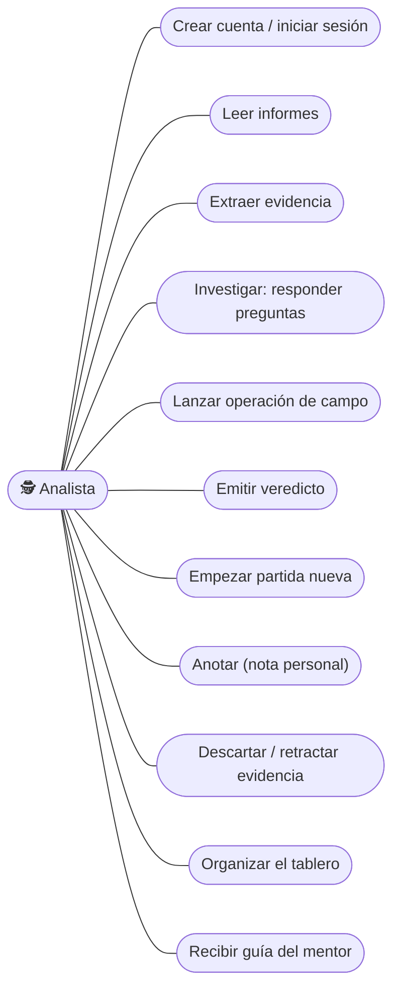
```mermaid
flowchart LR
    analyst(["🕵️ Analista"])
    uc1(["Leer informes"])
    uc2(["Extraer evidencia"])
    uc3(["Investigar: responder preguntas"])
    uc4(["Lanzar operación de campo"])
    uc5(["Emitir veredicto"])
    uc6(["Empezar partida nueva"])
    uc7(["Anotar (nota personal)"])
    uc8(["Descartar / retractar evidencia"])
    uc9(["Organizar el tablero"])
    uc10(["Recibir guía del mentor"])
    uc11(["Crear cuenta / iniciar sesión"])
    analyst --- uc11
    analyst --- uc1
    analyst --- uc2
    analyst --- uc3
    analyst --- uc4
    analyst --- uc5
    analyst --- uc6
    analyst --- uc7
    analyst --- uc8
    analyst --- uc9
    analyst --- uc10
```

> "Empezar partida nueva" (botón **New case** tras el desenlace) **reutiliza el flujo de "Abrir caso"** (crea una nueva `GameSession`), por lo que no lleva diagrama de secuencia propio. Está recogido también como criterio de aceptación de la **US-05**.

Se incluye un diagrama de secuencia por cada flujo con **interacción no trivial**. Los `GET` simples (leer un documento, listar partidas) se omiten por obvios.

**1. Acceso — registro y login:**

Usuario nuevo (crear cuenta):

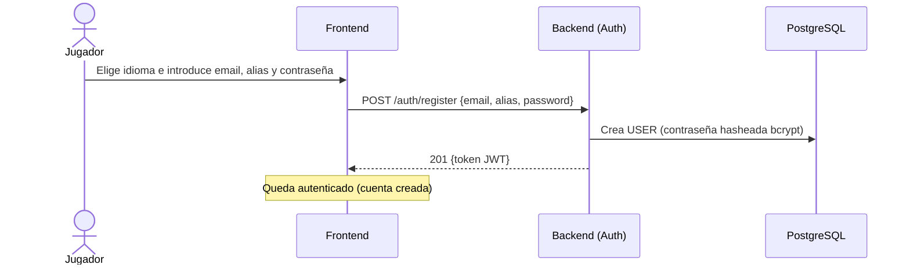
```mermaid
sequenceDiagram
    actor A as Jugador
    participant SPA as Frontend
    participant API as Backend (Auth)
    participant DB as PostgreSQL
    A->>SPA: Elige idioma e introduce email, alias y contraseña
    SPA->>API: POST /auth/register {email, alias, password}
    API->>DB: Crea USER (contraseña hasheada bcrypt)
    API-->>SPA: 201 {token JWT}
    Note over SPA: Queda autenticado (cuenta creada)
```

Usuario existente (login):

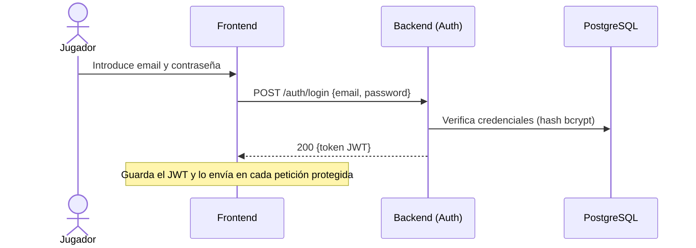
```mermaid
sequenceDiagram
    actor A as Jugador
    participant SPA as Frontend
    participant API as Backend (Auth)
    participant DB as PostgreSQL
    A->>SPA: Introduce email y contraseña
    SPA->>API: POST /auth/login {email, password}
    API->>DB: Verifica credenciales (hash bcrypt)
    API-->>SPA: 200 {token JWT}
    Note over SPA: Guarda el JWT y lo envía en cada petición protegida
```

**2. Abrir caso (crear sesión):**

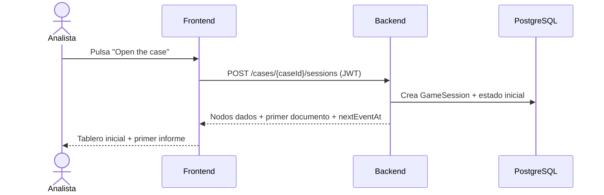
```mermaid
sequenceDiagram
    actor A as Analista
    participant SPA as Frontend
    participant API as Backend
    participant DB as PostgreSQL
    A->>SPA: Pulsa "Open the case"
    SPA->>API: POST /cases/{caseId}/sessions (JWT)
    API->>DB: Crea GameSession + estado inicial
    API-->>SPA: Nodos dados + primer documento + nextEventAt
    SPA-->>A: Tablero inicial + primer informe
```

**3. Extraer evidencia** (menú **instantáneo** en el cliente con opciones neutras, y un único viaje al servidor al elegir; el servidor resuelve contra la verdad oculta y devuelve solo el delta):

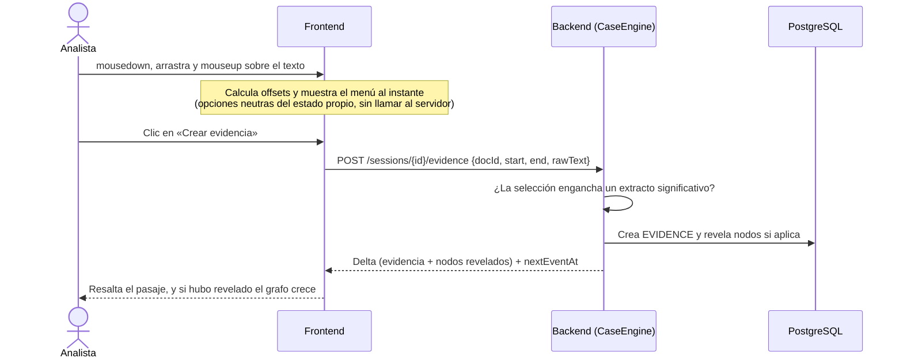
```mermaid
sequenceDiagram
    actor A as Analista
    participant SPA as Frontend
    participant API as Backend (CaseEngine)
    participant DB as PostgreSQL
    A->>SPA: mousedown, arrastra y mouseup sobre el texto
    Note over SPA: Calcula offsets y muestra el menú al instante<br/>(opciones neutras del estado propio, sin llamar al servidor)
    A->>SPA: Clic en «Crear evidencia»
    SPA->>API: POST /sessions/{id}/evidence {docId, start, end, rawText}
    API->>API: ¿La selección engancha un extracto significativo?
    API->>DB: Crea EVIDENCE y revela nodos si aplica
    API-->>SPA: Delta (evidencia + nodos revelados) + nextEventAt
    SPA-->>A: Resalta el pasaje, y si hubo revelado el grafo crece
```

**4. Responder pregunta y desbloquear acción:**

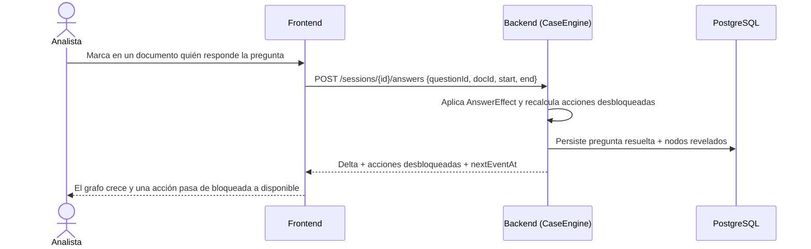
```mermaid
sequenceDiagram
    actor A as Analista
    participant SPA as Frontend
    participant API as Backend (CaseEngine)
    participant DB as PostgreSQL
    A->>SPA: Marca en un documento quién responde la pregunta
    SPA->>API: POST /sessions/{id}/answers {questionId, docId, start, end}
    API->>API: Aplica AnswerEffect y recalcula acciones desbloqueadas
    API->>DB: Persiste pregunta resuelta + nodos revelados
    API-->>SPA: Delta + acciones desbloqueadas + nextEventAt
    SPA-->>A: El grafo crece y una acción pasa de bloqueada a disponible
```

**5. Lanzar operación de campo** (recurso limitado + resultado diferido en el tiempo):

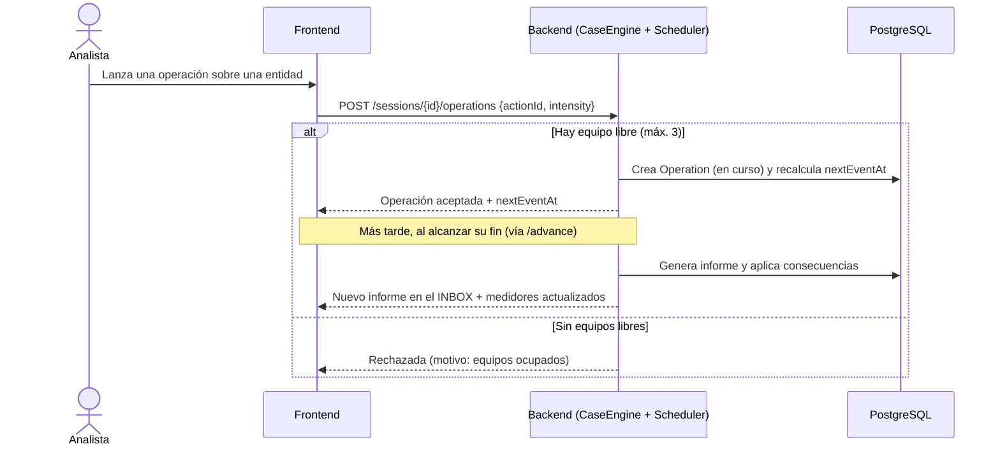
```mermaid
sequenceDiagram
    actor A as Analista
    participant SPA as Frontend
    participant API as Backend (CaseEngine + Scheduler)
    participant DB as PostgreSQL
    A->>SPA: Lanza una operación sobre una entidad
    SPA->>API: POST /sessions/{id}/operations {actionId, intensity}
    alt Hay equipo libre (máx. 3)
        API->>DB: Crea Operation (en curso) y recalcula nextEventAt
        API-->>SPA: Operación aceptada + nextEventAt
        Note over SPA,API: Más tarde, al alcanzar su fin (vía /advance)
        API->>DB: Genera informe y aplica consecuencias
        API-->>SPA: Nuevo informe en el INBOX + medidores actualizados
    else Sin equipos libres
        API-->>SPA: Rechazada (motivo: equipos ocupados)
    end
```

**6. Emitir veredicto (commit):**

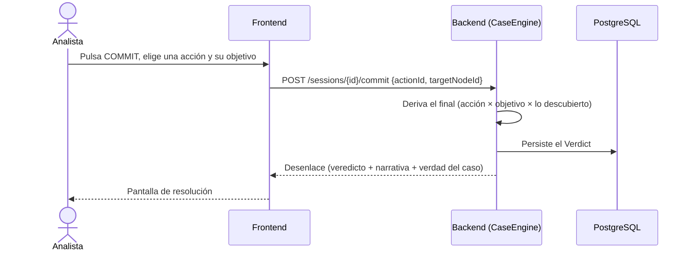
```mermaid
sequenceDiagram
    actor A as Analista
    participant SPA as Frontend
    participant API as Backend (CaseEngine)
    participant DB as PostgreSQL
    A->>SPA: Pulsa COMMIT, elige una acción y su objetivo
    SPA->>API: POST /sessions/{id}/commit {actionId, targetNodeId}
    API->>API: Deriva el final (acción × objetivo × lo descubierto)
    API->>DB: Persiste el Verdict
    API-->>SPA: Desenlace (veredicto + narrativa + verdad del caso)
    SPA-->>A: Pantalla de resolución
```

**7. Avance del reloj al horizonte** (el cliente avanza el tiempo en local hasta `nextEventAt` y solo entonces consulta):

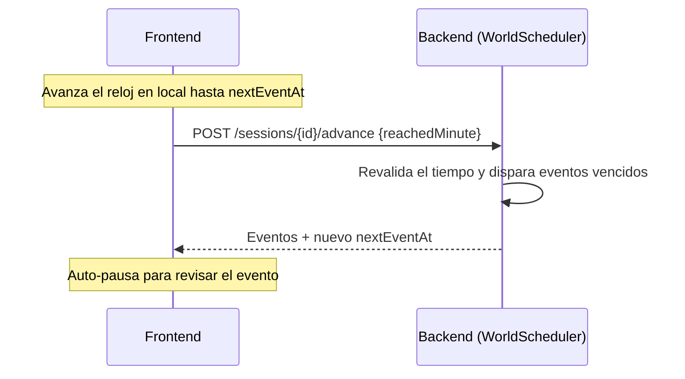
```mermaid
sequenceDiagram
    participant SPA as Frontend
    participant API as Backend (WorldScheduler)
    Note over SPA: Avanza el reloj en local hasta nextEventAt
    SPA->>API: POST /sessions/{id}/advance {reachedMinute}
    API->>API: Revalida el tiempo y dispara eventos vencidos
    API-->>SPA: Eventos + nuevo nextEventAt
    Note over SPA: Auto-pausa para revisar el evento
```

---

## 2. Arquitectura del sistema

### 2.1. Diagrama de arquitectura

**Decisión arquitectónica clave: servidor autoritativo.** El backend posee el **contenido del caso y la verdad oculta**, y resuelve todas las acciones de juego (extraer, responder, operar, emitir veredicto). El cliente es un **renderizador**: envía *intenciones* y recibe el **subgrafo revelado** + el estado. Así la verdad nunca viaja al cliente hasta que se gana, y la persistencia es natural.

**Nivel 1 — Contexto (C4):**

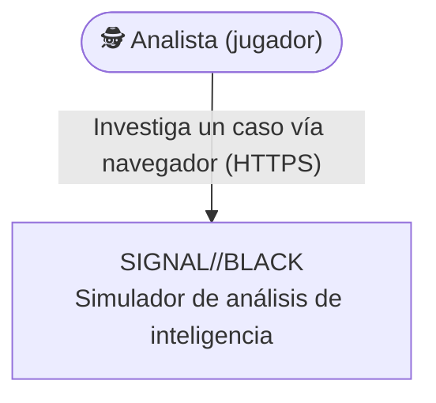
```mermaid
flowchart TB
    analyst(["🕵️ Analista (jugador)"])
    system["SIGNAL//BLACK<br/>Simulador de análisis de inteligencia"]
    analyst -- "Investiga un caso vía navegador (HTTPS)" --> system
```

**Nivel 2 — Contenedores (C4):**

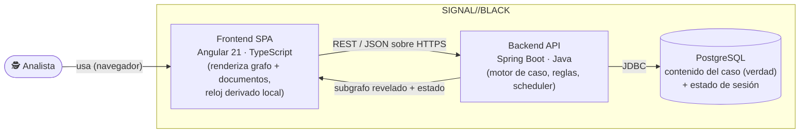
```mermaid
flowchart LR
    analyst(["🕵️ Analista"])
    subgraph sb["SIGNAL//BLACK"]
        spa["Frontend SPA<br/>Angular 21 · TypeScript<br/>(renderiza grafo + documentos,<br/>reloj derivado local)"]
        api["Backend API<br/>Spring Boot · Java<br/>(motor de caso, reglas, scheduler)"]
        db[("PostgreSQL<br/>contenido del caso (verdad)<br/>+ estado de sesión")]
    end
    analyst -- "usa (navegador)" --> spa
    spa -- "REST / JSON sobre HTTPS" --> api
    api -- "JDBC" --> db
    api -- "subgrafo revelado + estado" --> spa
```

**Nivel 3 — Componentes del backend (C4):**

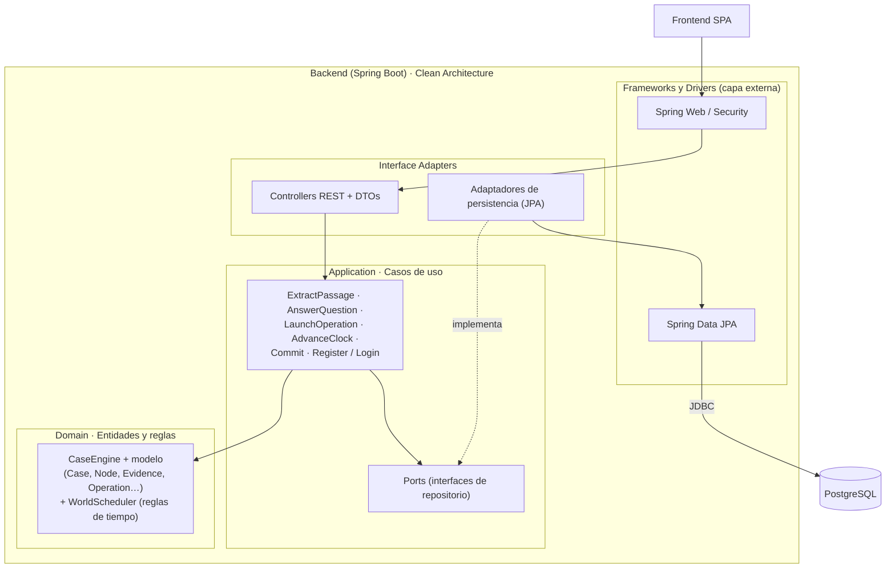
```mermaid
flowchart TB
    spa["Frontend SPA"]
    db[("PostgreSQL")]
    subgraph api["Backend (Spring Boot) · Clean Architecture"]
        direction TB
        subgraph fw["Frameworks y Drivers (capa externa)"]
            web["Spring Web / Security"]
            jpa["Spring Data JPA"]
        end
        subgraph ad["Interface Adapters"]
            ctrl["Controllers REST + DTOs"]
            repoimpl["Adaptadores de persistencia (JPA)"]
        end
        subgraph app["Application · Casos de uso"]
            uc["ExtractPassage · AnswerQuestion ·<br/>LaunchOperation · AdvanceClock ·<br/>Commit · Register / Login"]
            ports["Ports (interfaces de repositorio)"]
        end
        subgraph dom["Domain · Entidades y reglas"]
            engine["CaseEngine + modelo<br/>(Case, Node, Evidence, Operation…)<br/>+ WorldScheduler (reglas de tiempo)"]
        end
    end
    spa --> web --> ctrl --> uc --> engine
    uc --> ports
    repoimpl -. implementa .-> ports
    repoimpl --> jpa -- "JDBC" --> db
```

### 2.2. Descripción de componentes principales

- **Frontend SPA (Angular 21):** componentes *standalone* + *signals*. Renderiza las 5 zonas, el grafo (SVG) y los documentos. Mantiene un **reloj derivado** (calcula el tiempo de mundo en local a partir de un origen del servidor; ver §2.4) y envía intenciones a la API.

El **backend sigue Clean Architecture** (regla de dependencia: todo apunta hacia el dominio, que no conoce Spring ni JPA):

- **Domain (entidades y reglas):** corazón del sistema, *agnóstico de framework*. El **CaseEngine** aplica las reglas contra la **verdad oculta** (una extracción revela nodos, una respuesta aplica su `AnswerEffect` y desbloquea acciones, una operación se resuelve y genera un informe, el *commit* deriva el final) y el **WorldScheduler** calcula el **horizonte** (`nextEventAt`) y pone el mundo al día. Es la lógica portada y endurecida del prototipo `Desk2Engine`.
- **Application (casos de uso):** orquesta cada intención (ExtractPassage, AnswerQuestion, LaunchOperation, AdvanceClock, Commit, Register/Login) y define los **ports** (interfaces de repositorio) que el dominio necesita.
- **Interface Adapters:** los **Controllers REST** (+ DTOs) traducen HTTP ↔ casos de uso (sin lógica de juego), y los **adaptadores de persistencia** implementan los ports con Spring Data JPA.
- **Frameworks & Drivers:** Spring Web/Security, Spring Data JPA y la conexión a PostgreSQL — la capa más externa, sustituible sin tocar el dominio.
- **PostgreSQL:** dos dominios de datos (§3): contenido del caso (sembrado) y estado de sesión (mutable, persistido).

> **Nota técnica — documentos: caché en sesión + rehidratación.** Los documentos recibidos (INBOX) se **cachean en el cliente** durante la sesión, para que releerlos sea instantáneo sin llamar al servidor. El servidor sigue siendo la fuente de verdad: la pertenencia al inbox es estado de sesión persistido (`INBOX_ITEM`) y el contenido vive en `CASE_DOCUMENT`. Al **recargar o retomar** la partida, el cliente **rehidrata** desde el servidor (`GET /sessions/{id}` devuelve el inbox y, para el MVP, los cuerpos de los documentos ya recibidos). No es un caso de uso, es un detalle de implementación de **US-01** (releer) y **US-07** (retomar).

### 2.3. Descripción de alto nivel del proyecto y estructura de ficheros

Monorepo con dos aplicaciones desplegables independientes (`frontend/`, `backend/`). El frontend reutiliza la base del prototipo (`features/desk2`); el backend es un proyecto Spring nuevo organizado por capas de **Clean Architecture**. La documentación de la plantilla (`readme.md`, `prompts.md`) vive en la raíz.

```
backend/src/main/java/com/signalblack/
├── domain/          # entidades + reglas (CaseEngine, WorldScheduler, modelo) — sin framework
├── application/     # casos de uso + ports (interfaces de repositorio)
├── adapter/
│   ├── in/web/      # controllers REST + DTOs
│   └── out/persistence/   # adaptadores JPA que implementan los ports
└── config/          # arranque Spring Boot, seguridad y wiring de dependencias
```

### 2.4. Infraestructura y despliegue

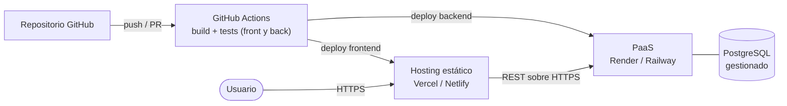
```mermaid
flowchart LR
    user(["Usuario"])
    repo["Repositorio GitHub"]
    ci["GitHub Actions<br/>build + tests (front y back)"]
    front["Hosting estático<br/>Vercel / Netlify"]
    back["PaaS<br/>Render / Railway"]
    db[("PostgreSQL<br/>gestionado")]
    repo -->|push / PR| ci
    ci -->|deploy frontend| front
    ci -->|deploy backend| back
    back --- db
    user -->|HTTPS| front
    front -->|REST sobre HTTPS| back
```

- **CI/CD:** GitHub Actions — *pipeline* que en cada PR ejecuta build + tests de frontend (Vitest) y backend (JUnit), y al integrar en `main` despliega.
- **Despliegue:** frontend como sitio estático (p. ej. Vercel/Netlify), backend + PostgreSQL en un PaaS (p. ej. Render/Railway). URL pública accesible para probar el flujo.
- **Gestión de secretos:** variables de entorno / *secrets* del proveedor y de GitHub Actions (credenciales de BD, etc.); nunca en el repositorio.

> *(El detalle del pipeline y el despliegue se cierra en la Entrega 2/final.)*

### 2.5. Seguridad

- **Autenticación:** registro/login con contraseña *hasheada* (bcrypt) y sesión por **JWT**; los endpoints de juego están protegidos y cada partida solo es accesible por su dueño. Datos personales mínimos (email + alias).
- Validación de entrada en los controllers; el servidor **no confía** en los datos del cliente (especialmente el tiempo: revalida el reloj contra su propio origen, §2.1/§2.4).
- Gestión de secretos fuera del código (§2.4); CORS restringido al origen del frontend; HTTPS en producción.

### 2.6. Tests

- **Unitarios:** el **dominio y los casos de uso se prueban sin Spring** (Clean Architecture lo hace posible): reglas del `CaseEngine` (revelado, desbloqueo, derivación de finales) y servicios de frontend.
- **Integración:** endpoints de la API contra una BD de test (Testcontainers/PostgreSQL).
- **E2E (≥1 del flujo principal):** Cypress recorriendo el flujo *"abrir caso → extraer → responder → commit → desenlace"*.

---

## 3. Modelo de datos

### 3.1. Diagrama del modelo de datos

Dos dominios: **contenido del caso** (la "verdad", sembrada y de solo lectura en juego) y **estado de sesión** (lo que el jugador descubre y hace, mutable y persistido).


```mermaid
erDiagram
    CASE ||--o{ CASE_DOCUMENT : contiene
    CASE ||--o{ TRUTH_NODE : define
    CASE ||--o{ TRUTH_EDGE : define
    CASE ||--o{ THREAD : organiza
    THREAD ||--o{ TRUTH_NODE : agrupa
    CASE ||--o{ COMMIT_ACTION : ofrece
    CASE ||--o{ CASE_ACTION : ofrece
    CASE ||--o{ RESOLUTION : tiene
    CASE ||--o{ CASE_EVENT : programa
    CASE_DOCUMENT ||--o{ DOCUMENT_EXTRACT : tiene
    CASE ||--o{ EVIDENCE_ANCHOR : define
    EVIDENCE_ANCHOR ||--o{ DOCUMENT_EXTRACT : "aparece en"
    EVIDENCE_ANCHOR }o--o{ TRUTH_NODE : revela
    DOCUMENT_EXTRACT ||--o{ EXTRACT_TEXT : localiza
    EVIDENCE_ANCHOR ||--o{ ANSWER_EFFECT : responde
    TRUTH_NODE ||--o| ANSWER_EFFECT : aplica
    ANSWER_EFFECT }o--o{ TRUTH_NODE : revela
    CASE_ACTION }o--|| TRUTH_NODE : "actúa sobre"
    CASE_ACTION ||--o{ ACTION_REQUIREMENT : requiere
    ACTION_REQUIREMENT }o--|| TRUTH_NODE : llave
    CASE ||--o{ GAME_SESSION : "se juega en"
    USER ||--o{ GAME_SESSION : posee
    GAME_SESSION ||--o{ REVEALED_NODE : descubre
    GAME_SESSION ||--o{ ANSWERED_QUESTION : responde
    GAME_SESSION ||--o{ INBOX_ITEM : recibe
    GAME_SESSION ||--o{ EVIDENCE : crea
    GAME_SESSION ||--o{ OPERATION : lanza
    GAME_SESSION ||--o| VERDICT : emite
    VERDICT }o--o| TRUTH_NODE : "actúa sobre"
    REVEALED_NODE }o--|| TRUTH_NODE : "instancia de"
    REVEALED_NODE ||--o{ REVEAL_SOURCE : "justificado por"
    OPERATION }o--|| TRUTH_NODE : "apunta a (entidad)"
    OPERATION }o--|| CASE_ACTION : "instancia de"
    EVIDENCE }o--|| CASE_DOCUMENT : "extraída de"
    EVIDENCE }o--o| EVIDENCE_ANCHOR : engancha
    GAME_SESSION ||--o{ NOTE : anota
    NOTE }o--o| TRUTH_NODE : sobre
    GAME_SESSION ||--o{ MENTOR_NOTE : aconseja

    CASE {
        uuid id PK
        varchar name "NOT NULL"
        timestamp world_epoch "inicio de mundo del caso"
        timestamp deadline_at "fecha límite del caso (evento final)"
    }
    CASE_DOCUMENT {
        uuid id PK
        uuid case_id FK
        varchar slug "NOT NULL"
        varchar type "financial|registry|humint|tender..."
        varchar classification
        date doc_date
        varchar mode "extraccion|pregunta"
    }
    CONTENT_TEXT {
        uuid id PK
        varchar owner_type "document|node|edge|anchor|action|commit_action|resolution|thread"
        uuid owner_id "id de la entidad dueña"
        varchar field "body|name|label|text|narrative|case_truth..."
        varchar lang "es|en"
        text value "texto traducido (plano, sin offsets)"
    }
    DOCUMENT_EXTRACT {
        uuid id PK
        uuid document_id FK
        uuid anchor_id FK "evidencia canónica a la que mapea"
    }
    EXTRACT_TEXT {
        uuid id PK
        uuid extract_id FK
        varchar lang "es|en"
        int start_offset "posición del pasaje en el body de ese idioma"
        int end_offset
        varchar anchor_text "el pasaje (= body[start:end]; para autoría/excerpt)"
    }
    EVIDENCE_ANCHOR {
        uuid id PK
        uuid case_id FK
        varchar meaning "significado canónico (interno, no se muestra)"
    }
    TRUTH_NODE {
        uuid id PK
        uuid case_id FK
        varchar type "entity|fact|question|hypothesis"
        varchar kind "person|org|event|threat"
        uuid thread_id FK "hilo (solo nodos type=question)"
        boolean hidden "DEFAULT true"
    }
    TRUTH_EDGE {
        uuid id PK
        uuid case_id FK
        uuid from_node FK
        uuid to_node FK
        varchar kind "ok|danger|open"
    }
    THREAD {
        uuid id PK
        uuid case_id FK
    }
    ANSWER_EFFECT {
        uuid id PK
        uuid question_node_id FK "el nodo-pregunta (TRUTH_NODE type=question)"
        uuid answer_anchor_id FK "el anchor cuyo fragmento responde la pregunta"
        jsonb reveals "nodos/aristas a revelar"
    }
    CASE_ACTION {
        uuid id PK
        uuid case_id FK
        varchar kind "operation|query"
        varchar op_kind "surveillance|fintrace|intercept|geo|source"
        uuid target_node_id FK "entidad sobre la que actúa"
    }
    ACTION_REQUIREMENT {
        uuid id PK
        uuid action_id FK
        uuid requires_node_id FK "nodo-pregunta llave que debe estar respondido"
    }
    COMMIT_ACTION {
        uuid id PK
        uuid case_id FK
        varchar cost "token (low|med|high)"
        varchar risk "token (low|med|high)"
        boolean requires_target "si la acción final apunta a una entidad (asaltar/detener)"
    }
    RESOLUTION {
        uuid id PK
        uuid case_id FK
        varchar verdict "clave del desenlace (ending key)"
    }
    CASE_EVENT {
        uuid id PK
        uuid case_id FK
        varchar trigger_kind "scheduled|reactive"
        int at_minute "minuto de mundo (si scheduled)"
        varchar condition "condición a cumplir (ventanas y reactivos)"
        jsonb effect "revela nodos, entrega documento, mueve medidores, abre ventana..."
    }
    USER {
        uuid id PK
        varchar email "UNIQUE NOT NULL"
        varchar alias
        varchar password_hash "NOT NULL — bcrypt"
        varchar preferred_lang "DEFAULT 'es'"
    }
    GAME_SESSION {
        uuid id PK
        uuid user_id FK
        uuid case_id FK
        varchar lang "es|en — inmutable, fijado al iniciar"
        varchar status "running|paused"
        varchar speed "pause|1x|4x|ff"
        int world_minute_now "DEFAULT 0"
        int next_event_at "horizonte"
        timestamp anchor_real_ts "ancla del reloj"
        varchar threat "low|elevated|severe"
        varchar exposure "low|medium|high"
        varchar political "low|medium|high|critical"
        int integrity "integridad de fuentes 0-100"
    }
    REVEALED_NODE {
        uuid id PK
        uuid session_id FK
        uuid truth_node_id FK
        varchar state "active|discarded (atenuado, no se borra)"
        int x "posición en el tablero (la coloca el jugador)"
        int y
        timestamp revealed_at
    }
    REVEAL_SOURCE {
        uuid id PK
        uuid revealed_node_id FK
        varchar source_type "evidence|operation|answer|event"
        uuid source_id "qué lo reveló (para el cascade al deshacer)"
    }
    ANSWERED_QUESTION {
        uuid id PK
        uuid session_id FK
        uuid question_node_id FK "nodo-pregunta respondido"
        timestamp answered_at
    }
    INBOX_ITEM {
        uuid id PK
        uuid session_id FK
        uuid document_id FK
        boolean read "DEFAULT false"
        timestamp received_at
    }
    EVIDENCE {
        uuid id PK
        uuid session_id FK
        uuid document_id FK
        uuid anchor_id FK "evidencia canónica enganchada (NOT NULL — marcar relleno no crea evidencia)"
        varchar title "etiqueta breve de la evidencia"
        int start_offset "offset en el cuerpo del documento"
        int end_offset
        text excerpt "NOT NULL"
        varchar status "unresolved|linked|contradicted|discarded"
        timestamp created_at
    }
    OPERATION {
        uuid id PK
        uuid session_id FK
        uuid action_id FK "CASE_ACTION que instancia"
        uuid target_node_id FK
        varchar type "surveillance|fintrace|intercept|geo|source"
        varchar intensity "low|medium|high"
        int start_min
        int duration_min
        varchar outcome "success|partial|failed|compromised"
    }
    VERDICT {
        uuid id PK
        uuid session_id FK
        uuid commit_action_id FK
        uuid target_node_id FK "entidad sobre la que actúas (tu sospecha; null si no aplica)"
        varchar ending "NOT NULL"
        timestamp committed_at
    }
    NOTE {
        uuid id PK
        uuid session_id FK
        uuid node_id FK "entidad asociada (opcional; null = nota suelta)"
        text body "NOT NULL"
        timestamp created_at
    }
    MENTOR_NOTE {
        uuid id PK
        uuid session_id FK
        varchar rule_id "regla de proceso que disparó (el texto se resuelve en UI)"
        int world_minute
        timestamp created_at
    }
```

### 3.2. Descripción de entidades principales

**Contenido del caso (verdad, solo lectura en juego):**

- **CASE** — el caso (`id`, `name`, `worldEpoch`, `deadlineAt`). Ej.: Black Dune (`deadlineAt` = la cumbre).
- **CASE_DOCUMENT** — informe de inteligencia, parte **invariante al idioma** (`slug`, `type`, `classification`, `date`, modo). Su `body` va en **`CONTENT_TEXT`** (`owner_type=document`, `field=body`), una fila por idioma.
- **DOCUMENT_EXTRACT** — vincula un documento con una **`EVIDENCE_ANCHOR`** (`anchor_id`); su pasaje marcable va en **`EXTRACT_TEXT`** (`lang`, **`start_offset`/`end_offset`** y `anchor_text`), una fila por idioma. El match compara los offsets de la selección con estos. Un mismo anchor puede tener extractos en **varios documentos**.
- **EVIDENCE_ANCHOR** — la **evidencia canónica**: la pieza significativa que el autor sabe que existe (su `label` mostrable va en `CONTENT_TEXT`; `meaning` es interno) y los `TruthNode` que **revela**. Es independiente del documento, por eso puede aparecer en más de uno.
- **TRUTH_NODE** — nodo del grafo de verdad (`type`: entity|fact|question|hypothesis, `kind`, arranca **oculto**); su `name` va en **`CONTENT_TEXT`** (`owner_type=node`) por idioma. Una **pregunta es un nodo `type=question`** (con su `thread_id`); una **hipótesis** es `type=hypothesis` — no hay entidades aparte.
- **TRUTH_EDGE** — relación dirigida entre nodos (`from`, `to`, `kind`: ok|danger|open); su `label` mostrable va en `CONTENT_TEXT`. Las aristas son **autoradas** y aparecen al revelarse sus dos extremos; el jugador **no las dibuja** (solo revela).
- **THREAD** — **línea de investigación** autorada (THE MONEY, THE COURIER…); su `label` va en `CONTENT_TEXT`. Cada **nodo-pregunta** pertenece a un hilo (`thread_id` en `TRUTH_NODE`). Su estado (live/hook/idle) se **deriva** de sus preguntas, y un `CASE_EVENT` puede activarle un **hook** (la tensión "24"). Varios hilos pueden **converger** en la misma verdad.
- **ANSWER_EFFECT** — cuelga de un **nodo-pregunta** (`question_node_id` → `TRUTH_NODE type=question`): su `answer_anchor_id` (el fragmento que la responde) y los nodos/aristas que **revela** al responderla.
- **CASE_ACTION** + **ACTION_REQUIREMENT** — operación/consulta autorada (`kind`, `op_kind`, entidad objetivo) y sus **llaves**: las preguntas que deben estar respondidas para desbloquearla. Disponible cuando **todas** sus `ACTION_REQUIREMENT` figuran en `ANSWERED_QUESTION`; lanzarla crea una `OPERATION`.
- **COMMIT_ACTION** / **RESOLUTION** — las **acciones finales** ofrecidas (algunas con `requires_target`: apuntan a una entidad) y los desenlaces posibles + la verdad del caso.
- **CASE_EVENT** — eventos del scheduler: **`scheduled`** (a `at_minute`) o **`reactive`** (al cumplirse una `condition`). Su `effect` revela nodos, entrega un documento, mueve medidores o **abre una ventana**. Las **ventanas** (oportunidades que expiran) son un `CASE_EVENT` con `condition` que debe cumplirse en su minuto (p. ej. tener vigilancia activa a las 21:00).

> **i18n (idioma del contenido).** Dos tablas cubren toda la localización: **`CONTENT_TEXT`** —genérica (`owner_type` + `owner_id` + `field` + `lang` + `value`)— guarda **todo el texto plano traducible** (cuerpos de documento, nombres de nodo, labels de aristas, texto de preguntas, labels de anchors, acciones de commit, resoluciones); y **`EXTRACT_TEXT`** —especial— para los pasajes marcables, que además necesitan **`start_offset`/`end_offset`** para el match. El servidor sirve solo el idioma de `GAME_SESSION.lang`.
>
> **Regla:** el **contenido autorado** (bilingüe) va en `CONTENT_TEXT`/`EXTRACT_TEXT`; el **texto que crea el jugador** (`title`/`excerpt` de evidencia, `body` de nota) va **inline**, porque la partida tiene un idioma único e inmutable. Tokens fijos (clasificación, coste/riesgo) se traducen en la capa UI (Transloco), no aquí.

**Estado de sesión (mutable, persistido):**

- **USER** — cuenta del jugador (`id`, `email`, `alias`, `passwordHash`, `preferredLang`). Cada partida pertenece a un usuario.
- **GAME_SESSION** — partida (`id`, `caseId`, `lang`, `status`, `speed`, `worldMinuteNow`, `nextEventAt`, `startedAt`). El **idioma se fija al iniciar y es inmutable**; así los offsets de evidencia nunca se rompen. Núcleo del reloj/scheduler (§2.4). Lleva los **medidores del mundo** (`threat`, `exposure`, `political`, `integrity`) que mueven operaciones y eventos, y que alimentan el final.
- **REVEALED_NODE** — un nodo visible en el tablero del jugador, con su **posición** (`x`,`y`) que él organiza (auto-layout inicial + arrastre que persiste) y un `state` (`active`/`discarded`). **`REVEAL_SOURCE`** registra **por qué** está visible (evidencia/operación/respuesta/evento). Al ignorar algo, por defecto el nodo se **descarta** (atenuado, se queda); solo se **borra** de verdad si la marca está "fresca" (sin operaciones dependientes ni tiempo avanzado). **ANSWERED_QUESTION** — preguntas que el jugador ha respondido.
- **INBOX_ITEM** — documentos recibidos/leídos.
- **EVIDENCE** — evidencia creada al marcar un pasaje que **engancha un anchor** (`anchorId` siempre presente; marcar relleno **no** crea evidencia). Campos: `title`, `excerpt`, `startOffset`/`endOffset`, `documentId`, `anchorId`, `status`. **Revela** nodos (entidades/hechos/preguntas) y **queda asociada a las entidades** que revela (al abrir una entidad, sus evidencias se obtienen vía `REVEAL_SOURCE`). Marcar la misma canónica en dos documentos → dos `EVIDENCE` con el mismo `anchorId`.
- **NOTE** — nota personal del jugador (`body`), opcionalmente asociada a una entidad (`node_id`); **no** crea nodos en el grafo. Se ve en el panel de notas y en la **ficha de la entidad** asociada.
- **MENTOR_NOTE** — log de un aviso del **mentor** (`rule_id` de la regla de proceso que disparó, `world_minute`). El **texto no va en el modelo**: es UI chrome localizada (Transloco, `mentor.note.<rule_id>`), igual que el resto de la interfaz; la API devuelve el `rule_id` y el cliente lo resuelve.
- **OPERATION** — operación de campo en curso/terminada (`actionId` —la `CASE_ACTION` que instancia—, `type`, `targetNodeId`, `intensity`, `startMin`, `durationMin`, `outcome`). Las **consultas de escritorio** (`CASE_ACTION.kind=query`) son también `OPERATION` pero **sin equipo**: devuelven un documento tras un retardo. Solo las de `kind=operation` consumen equipos (máx. 3).
- **VERDICT** — la **acción final** del jugador: la `COMMIT_ACTION` elegida + su `target_node_id` (la entidad/sospecha sobre la que actúa — asaltar un sitio, detener a alguien) → el `ending` se deriva de *(acción × objetivo × lo descubierto)*.

---

## 4. Especificación de la API

API REST/JSON. El servidor es autoritativo; cada respuesta de acción devuelve el **delta de estado** (nodos/aristas revelados, acciones desbloqueadas) y el **horizonte** `nextEventAt` recalculado. Además, **cualquier respuesta de acción** (marcar, responder, operar, avanzar, commit) puede incluir un **`mentorNote`** opcional con la **clave de regla** del aviso del mentor (`ruleId`); el cliente resuelve el texto localizado (UI/Transloco). P. ej. al marcar relleno.

| Método | Endpoint | Propósito |
|---|---|---|
| `POST` | `/api/auth/register` | Crear cuenta (email, alias, contraseña). |
| `POST` | `/api/auth/login` | Autenticar → devuelve JWT. |
| `GET` | `/api/me/sessions` | Listar las partidas guardadas del usuario autenticado. |
| `GET` | `/api/cases` | Listar los casos disponibles para jugar. |
| `POST` | `/api/cases/{caseId}/sessions` | Crear partida. Devuelve el estado inicial (nodos dados, primer documento, `nextEventAt`). |
| `GET` | `/api/sessions/{id}` | Estado completo revelado + origen del reloj (`worldMinuteNow`, `speed`, `status`, `nextEventAt`), medidores, y por cada nodo sus **acciones disponibles/bloqueadas**. |
| `GET` | `/api/sessions/{id}/documents/{docId}` | Cuerpo de un documento del inbox. |
| `POST` | `/api/sessions/{id}/evidence` | Crear evidencia desde una selección (`{docId, start, end, rawText}`); si engancha un extracto, revela nodos. Devuelve delta. |
| `POST` | `/api/sessions/{id}/answers` | Responder una pregunta con la selección que la contesta (`{questionId, docId, start, end}`); el servidor valida → aplica efecto + desbloquea acciones. Devuelve delta. |
| `POST` | `/api/sessions/{id}/operations` | Lanzar una `CASE_ACTION` (`{actionId, intensity}`) — operación o consulta. Valida llaves y equipos. Devuelve op + `nextEventAt`. |
| `POST` | `/api/sessions/{id}/operations/{opId}/recall` | Retirar una operación en curso: libera el equipo, sin resultado. |
| `GET` | `/api/sessions/{id}/entities/{nodeId}` | **Dossier** de una entidad (vista de segundo nivel, incluye sus evidencias y notas). |
| `POST` | `/api/sessions/{id}/notes` | Crear una nota personal (`{body, nodeId?}`); no toca el grafo. |
| `PATCH` | `/api/sessions/{id}/evidence/{evId}` | Descartar/restaurar una evidencia (`{status}`) → atenúa/reactiva (+ cascade). |
| `DELETE` | `/api/sessions/{id}/evidence/{evId}` | Borrado real, solo si la marca está "fresca" (`409` si tiene consecuencias o el tiempo avanzó). |
| `PATCH` | `/api/sessions/{id}/nodes/{nodeId}` | Guardar posición (`{x, y}`) o estado (`discarded`) del nodo. |
| `POST` | `/api/sessions/{id}/advance` | Avanzar al horizonte (`{reachedMinute}`). El servidor dispara eventos vencidos. Devuelve eventos + `nextEventAt`. |
| `POST` | `/api/sessions/{id}/clock` | Cambiar `speed`/`pause`. Re-ancla el reloj del servidor. |
| `POST` | `/api/sessions/{id}/commit` | Emitir la acción final (`{actionId, targetNodeId?}`) → deriva y devuelve el desenlace. |

**Ejemplo — respuesta de `POST /evidence`:**

```json
{
  "revealedNodes": [
    { "id": "wire", "type": "fact", "name": "Wire €2.85M" },
    { "id": "helix", "type": "entity", "kind": "org", "name": "Helix Group" }
  ],
  "newEdges": [{ "from": "helix", "to": "blackdune", "label": "PAID TO", "kind": "ok" }],
  "openedQuestions": ["owner"],
  "nextEventAt": 1230
}
```

**Fragmento OpenAPI 3.0** (representativo; la especificación completa se servirá vía Swagger UI desde el backend):

```yaml
openapi: 3.0.3
info:
  title: SIGNAL//BLACK API
  version: 1.0.0
paths:
  /api/auth/login:
    post:
      summary: Autenticar usuario
      requestBody:
        required: true
        content:
          application/json:
            schema: { $ref: '#/components/schemas/LoginRequest' }
      responses:
        '200':
          description: JWT emitido
          content:
            application/json:
              schema: { $ref: '#/components/schemas/AuthToken' }
        '401': { description: Credenciales inválidas }
  /api/sessions/{id}/evidence:
    post:
      summary: Crear evidencia desde una selección (revela subgrafo si aplica)
      security: [{ bearerAuth: [] }]
      parameters:
        - name: id
          in: path
          required: true
          schema: { type: string, format: uuid }
      requestBody:
        required: true
        content:
          application/json:
            schema: { $ref: '#/components/schemas/EvidenceRequest' }
      responses:
        '200':
          description: Delta de estado revelado
          content:
            application/json:
              schema: { $ref: '#/components/schemas/StateDelta' }
        '401': { description: No autenticado }
components:
  securitySchemes:
    bearerAuth: { type: http, scheme: bearer, bearerFormat: JWT }
  schemas:
    LoginRequest:
      type: object
      required: [email, password]
      properties:
        email: { type: string, format: email }
        password: { type: string, format: password }
    AuthToken:
      type: object
      properties:
        token: { type: string }
    EvidenceRequest:
      type: object
      required: [docId, start, end, rawText]
      properties:
        docId: { type: string }
        start: { type: integer }
        end: { type: integer }
        rawText: { type: string }
    StateDelta:
      type: object
      properties:
        revealedNodes:
          type: array
          items: { $ref: '#/components/schemas/Node' }
        newEdges: { type: array, items: { type: object } }
        openedQuestions: { type: array, items: { type: string } }
        nextEventAt: { type: integer }
        mentorNote: { type: object, nullable: true, properties: { ruleId: { type: string } } }
    Node:
      type: object
      properties:
        id: { type: string }
        type: { type: string, enum: [entity, fact, question, hypothesis] }
        name: { type: string }
```

---

## 5. Historias de usuario

Formato del máster: *"Como [rol], quiero [acción], para [beneficio]"* + criterios de aceptación en **BDD (Dado/Cuando/Entonces)** + evaluación **INVEST**. Rol principal: **analista** (el jugador).

> **Flujo E2E priorizado.** Must-Have: US-01 → US-05 (el ciclo completo). Should-Have: US-06, US-07.

### US-01 · Abrir un caso y leer sus informes — `Must-Have`

**Como** analista, **quiero** abrir el caso asignado y leer sus informes de inteligencia, **para** empezar a entender qué está ocurriendo.

**Prioridad:** 1 · **Estimación (Fibonacci):** 5 pts

**Criterios de aceptación (BDD):**
- *Dado que* tengo un caso asignado, *cuando* pulso "Open the case", *entonces* veo el tablero con los nodos dados (cumbre + hipótesis de la agencia) y se abre el primer informe.
- *Dado que* leo un informe, *cuando* lo cierro, *entonces* queda guardado en la bandeja (INBOX) para releerlo.
- *Dado que* recargo la página, *cuando* vuelvo a entrar, *entonces* recupero el caso en el punto donde estaba.
- *Dado que* el `caseId` no existe o no tengo acceso, *cuando* intento crear la partida, *entonces* recibo un error (404/403) y no se crea sesión.

**INVEST:** ✅ I · ✅ N · ✅ V · ✅ E · ✅ S · ✅ T

### US-02 · Extraer evidencia marcando pasajes — `Must-Have`

**Como** analista, **quiero** seleccionar pasajes relevantes de un informe y añadirlos al tablero, **para** construir mi mapa de lo que sé. (El sistema nunca subraya la respuesta por mí.)

**Prioridad:** 1 · **Estimación (Fibonacci):** 8 pts

**Criterios de aceptación (BDD):**
- *Dado que* leo un informe, *cuando* selecciono un pasaje significativo y elijo "Crear evidencia", *entonces* se crea una evidencia que **revela** las entidades, hechos y preguntas correspondientes, y queda **asociada** a esas entidades.
- *Dado que* selecciono texto de relleno (sin valor), *cuando* lo intento marcar, *entonces* no se añade nada al grafo y el **mentor** me da un aviso de método.
- *Dado que* una evidencia abre una pregunta, *cuando* se crea, *entonces* aparece un nodo-pregunta en estado abierto.

**INVEST:** ✅ I · ✅ N · ✅ V · ✅ E · ✅ S · ✅ T

### US-03 · Investigar respondiendo preguntas — `Must-Have`

**Como** analista, **quiero** responder las preguntas abiertas pidiendo y leyendo nuevos documentos, **para** profundizar la investigación y desbloquear acciones.

**Prioridad:** 1 · **Estimación (Fibonacci):** 8 pts

**Criterios de aceptación (BDD):**
- *Dado que* selecciono un nodo, *cuando* abro su panel, *entonces* veo sus acciones disponibles y las bloqueadas con su motivo.
- *Dado que* pido un documento y marco en él quién responde una pregunta, *cuando* confirmo la respuesta, *entonces* el grafo crece (nuevos nodos/aristas) y la pregunta pasa a resuelta.
- *Dado que* respondo la pregunta que era llave de una acción, *cuando* se resuelve, *entonces* esa acción salta de "bloqueada" a "disponible".
- *Dado que* marco un fragmento que **no** responde la pregunta, *cuando* elijo "Responder", *entonces* el servidor lo rechaza, la pregunta sigue abierta y puedo reintentar.

**INVEST:** ✅ I · ✅ N · ✅ V · ✅ E · ✅ S · ✅ T

### US-04 · Lanzar una operación de campo — `Must-Have`

**Como** analista, **quiero** lanzar operaciones de campo (vigilancia, traza financiera, fuente…) que consumen recursos y tiempo, **para** obtener inteligencia que no está en los documentos iniciales.

**Prioridad:** 2 · **Estimación (Fibonacci):** 13 pts

**Criterios de aceptación (BDD):**
- *Dado que* tengo equipos libres (máx. 3), *cuando* lanzo una operación sobre una entidad, *entonces* ocupa un equipo y empieza a correr en tiempo de mundo.
- *Dado que* no quedan equipos libres, *cuando* intento lanzar otra, *entonces* se me impide y se explica por qué.
- *Dado que* una operación termina, *cuando* el reloj alcanza su fin, *entonces* llega un nuevo informe al INBOX y su resultado afecta a los medidores.
- *Dado que* la acción es una **consulta de escritorio** (no de campo), *cuando* la lanzo, *entonces* **no** ocupa equipo y entrega un documento tras un retardo.
- *Dado que* tengo una operación en curso, *cuando* la retiro (*recall*), *entonces* el equipo queda libre y la operación no da resultado.

**INVEST:** ✅ I · ✅ N · ✅ V · ✅ E · ✅ S · ✅ T

### US-05 · Emitir veredicto y recibir desenlace — `Must-Have`

**Como** analista, **quiero** emitir mi conclusión eligiendo una acción operativa bajo el reloj, **para** cerrar el caso y ver las consecuencias de mi interpretación.

**Prioridad:** 1 · **Estimación (Fibonacci):** 5 pts

**Criterios de aceptación (BDD):**
- *Dado que* pulso COMMIT, *cuando* se abre el modal, *entonces* veo mi lectura actual, en qué se apoya/contradice y tres acciones posibles.
- *Dado que* elijo una acción (y su objetivo, si lo requiere) y confirmo, *cuando* se procesa, *entonces* recibo un desenlace derivado de *(acción × objetivo × lo que descubrí)*.
- *Dado que* veo el desenlace, *cuando* termina, *entonces* puedo iniciar un caso nuevo.
- *Dado que* la acción final requiere objetivo y no he elegido ninguno, *cuando* intento confirmar, *entonces* se me impide hasta seleccionar uno.

**INVEST:** ✅ I · ✅ N · ✅ V · ✅ E · ✅ S · ✅ T

### US-06 · Consultar el dossier de una entidad — `Should-Have`

**Como** analista, **quiero** abrir un dossier expandido de una entidad con pestañas (perfil, relaciones, comunicaciones, finanzas, evidencia), **para** profundizar cuando una entidad acumula mucha información sin abandonar el tablero.

**Prioridad:** 3 · **Estimación (Fibonacci):** 8 pts

**Criterios de aceptación (BDD):**
- *Dado que* selecciono un nodo, *cuando* hago doble clic o pulso "Abrir ficha", *entonces* se abre un dossier en *overlay* sobre el tablero.
- *Dado que* estoy en el dossier, *cuando* cambio de pestaña, *entonces* cada pestaña muestra una vista del subgrafo de esa entidad (sus relaciones, los documentos que la mencionan, etc.).
- *Dado que* abro el dossier de una entidad recién revelada (sin relaciones ni evidencia aún), *cuando* lo veo, *entonces* las pestañas vacías muestran "sin datos todavía" (no es un error).

**INVEST:** ✅ I · ✅ N · ✅ V · ✅ E · ✅ S · ✅ T

### US-07 · Retomar la investigación (persistencia) — `Should-Have`

**Como** analista, **quiero** que mi investigación se guarde **en mi perfil**, **para** poder cerrar y retomar el caso en el mismo punto de tiempo donde lo dejé, desde cualquier sesión.

**Prioridad:** 2 · **Estimación (Fibonacci):** 5 pts

**Criterios de aceptación (BDD):**
- *Dado que* cierro el navegador, *cuando* vuelvo a abrir la partida, *entonces* recupero el grafo, el inbox y el minuto de mundo exactos, en pausa.
- *Dado que* estaba fuera, *cuando* retomo, *entonces* no se han disparado eventos sin que yo los viera (el tiempo no corre con el navegador cerrado).

**INVEST:** ✅ I · ✅ N · ✅ V · ✅ E · ✅ S · ✅ T

### US-08 · Acceso: idioma y autenticación — `Capa de acceso`

**Como** jugador, **quiero** elegir idioma e iniciar sesión antes de jugar, **para** acceder a mis perfiles y partidas guardadas.

**Prioridad:** 2 · **Estimación (Fibonacci):** 8 pts

**Criterios de aceptación (BDD):**
- *Dado que* entro por primera vez, *cuando* abro la app, *entonces* veo una pantalla de acceso con selector de idioma (ES/EN) y registro/login.
- *Dado que* me registro con email, alias y contraseña, *cuando* envío, *entonces* se crea mi cuenta (contraseña *hasheada*) y quedo autenticado.
- *Dado que* estoy autenticado, *cuando* llamo a un endpoint de juego, *entonces* solo accedo a mis propias partidas (JWT válido); sin token, se rechaza.

**INVEST:** ✅ I · ✅ N · ✅ V · ✅ E · ✅ S · ✅ T

> *Capa de soporte, separada del flujo E2E prioritario (US-01→05). Mínima a propósito: sin recuperación de contraseña, roles ni verificación por email.*

### US-09 · Anotar (nota personal) — `Should-Have`

**Como** analista, **quiero** escribir notas personales y asociarlas a una entidad, **para** registrar mis sospechas e ideas sin ensuciar el grafo.

**Prioridad:** 3 · **Estimación (Fibonacci):** 5 pts

**Criterios de aceptación (BDD):**
- *Dado que* selecciono texto o una entidad, *cuando* elijo "Nota personal", *entonces* puedo escribir una nota que **no** crea nodos en el grafo.
- *Dado que* asocio la nota a una entidad, *cuando* abro la ficha de esa entidad, *entonces* veo la nota allí.
- *Dado que* escribo una nota suelta (sin entidad), *cuando* la guardo, *entonces* queda en mi panel de notas.
- *Dado que* intento guardar una nota vacía, *cuando* confirmo, *entonces* no se crea (se requiere texto).

**INVEST:** ✅ I · ✅ N · ✅ V · ✅ E · ✅ S · ✅ T

### US-10 · Descartar o retractar evidencia — `Should-Have`

**Como** analista, **quiero** descartar una evidencia de la que me retracto, **para** corregir mis errores sin destruir el trabajo construido sobre ella.

**Prioridad:** 2 · **Estimación (Fibonacci):** 8 pts

**Criterios de aceptación (BDD):**
- *Dado que* descarto una evidencia, *cuando* lo confirmo, *entonces* ella y los nodos que solo dependían de ella quedan **atenuados** (no desaparecen).
- *Dado que* la marca está "fresca" (sin operaciones dependientes ni tiempo avanzado), *cuando* la borro, *entonces* se elimina y sus nodos sin otra fuente se re-ocultan.
- *Dado que* ya lancé una operación sobre un nodo revelado o avancé el reloj, *cuando* intento borrar, *entonces* solo se permite **descartar** (atenuar), no borrar.

**INVEST:** ✅ I · ✅ N · ✅ V · ✅ E · ✅ S · ✅ T

### US-11 · Organizar el tablero — `Should-Have`

**Como** analista, **quiero** mover y colocar los nodos del grafo a mi gusto, **para** organizar mi investigación de forma legible.

**Prioridad:** 3 · **Estimación (Fibonacci):** 5 pts

**Criterios de aceptación (BDD):**
- *Dado que* arrastro un nodo, *cuando* lo suelto, *entonces* queda en esa posición.
- *Dado que* reabro la partida, *cuando* vuelvo, *entonces* los nodos conservan la posición donde los dejé.
- *Dado que* se revela un nodo nuevo, *cuando* aparece, *entonces* se coloca en un sitio visible (auto-layout) sin solapar a otros.
- *Dado que* arrastro un nodo fuera del área visible, *cuando* lo suelto, *entonces* se reubica dentro de los límites del tablero.

**INVEST:** ✅ I · ✅ N · ✅ V · ✅ E · ✅ S · ✅ T

### US-12 · Recibir guía del mentor — `Should-Have`

**Como** analista, **quiero** que un asesor me avise sobre mi **método** (nunca sobre el contenido), **para** mejorar mi proceso sin que me resuelvan el caso.

**Prioridad:** 3 · **Estimación (Fibonacci):** 5 pts

**Criterios de aceptación (BDD):**
- *Dado que* marco pasajes sin valor o acaparo evidencia sin vincular, *cuando* actúo, *entonces* el mentor me da un aviso de **método** (no me dice la respuesta).
- *Dado que* la cumbre se acerca con cabos sueltos, *cuando* avanza el tiempo, *entonces* el mentor me lo señala.
- *Dado que* recibo un aviso, *cuando* se muestra, *entonces* el texto está en mi idioma (UI) y queda en el log del asesor.
- *Dado que* una regla del mentor ya disparó, *cuando* su condición se repetiría, *entonces* no me lo repite (cada regla avisa una vez).

**INVEST:** ✅ I · ✅ N · ✅ V · ✅ E · ✅ S · ✅ T

---

## 6. Tickets de trabajo

Backlog **completo y ordenado por orden de ejecución** (sprints S1→S3 + cierre transversal), respetando dependencias (BD → backend → frontend). Cada ticket lleva la plantilla del máster en formato compacto: **qué · aceptación · prioridad · estimación · asignación (capa) · sprint · dependencias · etiquetas · testing · riesgo**, con **trazabilidad** a la historia. (Comentarios/enlaces/historial se gestionan en la herramienta de sprint — Jira/Linear.)

> **El testing va dentro de cada ticket** (campo *Testing* = parte de la Definición de Hecho; enfoque TDD/BDD del máster): los tests unitarios y de integración se escriben con su feature, no en una fase aparte. Solo tienen ticket propio el **arnés de pruebas** y el **E2E del flujo principal** (TK-26), por ser transversales.

> **Sprint 1 — Fundamentos**

### TK-01 · Técnico — Fundación del proyecto · `infra` · S1
- **Qué:** monorepo (`frontend/`+`backend/`); backend Spring Boot Clean Architecture (`domain`/`application`/`adapter`/`config`); PostgreSQL + Flyway con la migración del **esquema de contenido** (la "verdad" del caso, §3) + **seed del Caso 001** (ES/EN); `docker compose`.
- **Aceptación:** un comando levanta front+back+db; la migración crea el esquema de **contenido**; el seed carga el caso; `GET /api/cases` lo devuelve.
- **Prioridad** Alta · **Est.** 8 · **Asig.** Full-stack/DevOps · **Dep.** — · **Etiquetas** infra, BD, seed · **Testing** smoke de arranque + migraciones · **Riesgo** seed desincronizado → generarlo del esquema.

> **Estrategia de migraciones (incremental).** TK-01 crea el esquema de **contenido** + seed (van juntos, el caso se siembra de una pieza). Las tablas de **estado de sesión** las añade **cada feature con su propia migración Flyway**: `USER` (TK-02); `GAME_SESSION` + base `revealed_node`/`reveal_source`/`inbox_item` (TK-04); `EVIDENCE` (TK-06); `ANSWERED_QUESTION` (TK-08); `NOTE` (TK-12); `OPERATION` (TK-17); `VERDICT` (TK-21); `MENTOR_NOTE` (TK-24). El modelo se **diseña entero** (spec-driven, §3) pero se **materializa por capas**; nunca se edita una migración aplicada — se añade otra.

### TK-02 · Backend — Registro/login + JWT + protección · `US-08` · S1
- **Qué:** `POST /auth/register` y `/auth/login` (bcrypt + JWT); guard que protege los endpoints de juego (cada partida solo de su dueño).
- **Aceptación:** registro crea `USER` y autentica; login devuelve JWT; sin token los endpoints de juego responden 401.
- **Prioridad** Alta · **Est.** 5 · **Asig.** Backend · **Dep.** TK-01 · **Etiquetas** backend, seguridad · **Testing** unit hash/JWT + integración de protección · **Riesgo** acceso cruzado → validar dueño en cada endpoint.

### TK-03 · Frontend — Esqueleto + cliente API + pantalla de acceso · `US-08` · S1
- **Qué:** proyecto Angular (standalone+signals), cliente HTTP/servicios de API, Transloco (ES/EN), pantalla de acceso (idioma + registro/login).
- **Aceptación:** la app arranca; el idioma se elige y queda fijo en la partida; registro/login funcionan y guardan el JWT.
- **Prioridad** Alta · **Est.** 5 · **Asig.** Frontend · **Dep.** TK-02 · **Etiquetas** frontend, UI, i18n · **Testing** e2e registro/login · **Riesgo** contrato API↔front → DTOs/tipos compartidos.

### TK-04 · Backend — Crear sesión + estado inicial + listar casos · `US-01` · S1
- **Qué:** `GET /api/cases`; `POST /cases/{id}/sessions` que crea `GameSession`, siembra nodos dados + primer doc y calcula el primer `nextEventAt`.
- **Aceptación:** crea sesión persistida (paused, world_minute=0); devuelve nodos dados + primer doc + horizonte; caso inexistente/sin acceso → 404/403.
- **Prioridad** Alta · **Est.** 5 · **Asig.** Backend · **Dep.** TK-01 · **Etiquetas** backend, sesión · **Testing** unit `nextEventAt` inicial + integración · **Riesgo** estado inicial mal definido → seed fijo.

### TK-05 · Frontend — Brief + visor de informe + INBOX · `US-01` · S1
- **Qué:** pantalla "CASE ASSIGNED" → "Open the case"; tablero inicial; visor del documento; INBOX releíble (caché + rehidratación).
- **Aceptación:** el brief abre la sesión vía API; el visor pinta el doc; cerrar un doc lo deja en el INBOX; al recargar se rehidrata.
- **Prioridad** Alta · **Est.** 5 · **Asig.** Frontend · **Dep.** TK-04 · **Etiquetas** frontend, UI · **Testing** e2e abrir→leer→inbox · **Riesgo** desincronía de caché → fuente de verdad servidor.

### TK-29 · Frontend — Shell del Analyst Desk (layout de 5 zonas) · `US-01 (UX)` · S1
- **Qué:** armazón de la pantalla única en 5 zonas (barra de tensión, carril de hilos, Knowledge Board, panel de selección/acciones, barra del asesor) con CSS grid; alberga el resto de componentes.
- **Aceptación:** las 5 zonas se disponen según §1.3; el board ocupa el centro y los paneles laterales no lo tapan; legible ("claridad sobre densidad").
- **Prioridad** Alta · **Est.** 5 · **Asig.** Frontend · **Dep.** TK-03 · **Etiquetas** frontend, UI, layout · **Testing** visual/responsive · **Riesgo** sobrecarga visual → priorizar claridad.

### TK-30 · Frontend — Barra de tensión (reloj + cuenta atrás + medidores) · `US-04` · S1
- **Qué:** zona superior con reloj + cuenta atrás a la cumbre (de TK-19) y **medidores** (`threat`/`exposure`/`political`/`integrity`) que se actualizan con el estado de la sesión.
- **Aceptación:** muestra hora y cuenta atrás; los medidores reflejan el estado y cambian cuando se mueven (operaciones/eventos).
- **Prioridad** Media · **Est.** 3 · **Asig.** Frontend · **Dep.** TK-29, TK-19 · **Etiquetas** frontend, UI · **Testing** render de medidores · **Riesgo** —.

> **Sprint 2 — Construcción del grafo**

### TK-06 · Backend — Crear evidencia (match por offsets → revela) · `US-02` · S2
- **Qué:** `POST /evidence` `{docId,start,end,rawText}`; match por el **anchor mayor contenido** (offsets en `EXTRACT_TEXT`); crea `Evidence`, revela nodos (`REVEAL_SOURCE`).
- **Aceptación:** pasaje canónico revela su clúster; relleno no crea evidencia (+ `mentorNote`); idempotente.
- **Prioridad** Alta · **Est.** 8 · **Asig.** Backend · **Dep.** TK-04 · **Etiquetas** backend, motor-caso · **Testing** unit del match + integración · **Riesgo** match frágil → offsets, no substring.

### TK-07 · Frontend — Menú de selección + crecimiento del grafo · `US-02` · S2
- **Qué:** menú contextual instantáneo (cliente, neutro); al elegir "Crear evidencia" → `POST /evidence`; render animado del delta en el Knowledge Board (SVG).
- **Aceptación:** ≥3 chars muestra menú; confirmar hace crecer el grafo; relleno no produce efecto (aviso del mentor).
- **Prioridad** Alta · **Est.** 8 · **Asig.** Frontend · **Dep.** TK-06 · **Etiquetas** frontend, grafo · **Testing** e2e seleccionar→nodo · **Riesgo** rendimiento del grafo → limitar/virtualizar.

### TK-08 · Backend — Responder pregunta + desbloqueo · `US-03` · S2
- **Qué:** `POST /answers` `{questionId,docId,start,end}`; valida que el fragmento es el `answer_anchor`; aplica `AnswerEffect`; recalcula `CASE_ACTION` desbloqueadas (`ACTION_REQUIREMENT`).
- **Aceptación:** respuesta correcta crece el grafo + resuelve la pregunta + desbloquea; respuesta incorrecta se rechaza y la pregunta sigue abierta.
- **Prioridad** Alta · **Est.** 8 · **Asig.** Backend · **Dep.** TK-06 · **Etiquetas** backend, motor-caso · **Testing** unit `AnswerEffect` + desbloqueo · **Riesgo** dependencias mal modeladas → llaves declarativas.

### TK-09 · Frontend — Panel de nodo + responder desde el documento · `US-03` · S2
- **Qué:** panel del nodo seleccionado (acciones disponibles/bloqueadas con motivo); opción "Responder ▸ pregunta abierta" en el menú de selección.
- **Aceptación:** el panel muestra acciones y bloqueos; responder desde el doc llama a `/answers` y refleja el delta.
- **Prioridad** Media · **Est.** 5 · **Asig.** Frontend · **Dep.** TK-07, TK-08 · **Etiquetas** frontend · **Testing** e2e responder→desbloqueo · **Riesgo** estado desincronizado → re-render del estado del servidor.

### TK-10 · Backend — Dossier de entidad · `US-06` · S2
- **Qué:** `GET /entities/{nodeId}` con perfil, relaciones (subgrafo), documentos que la mencionan, evidencias (vía `REVEAL_SOURCE`) y notas.
- **Aceptación:** devuelve las secciones; entidad recién revelada → secciones vacías ("sin datos").
- **Prioridad** Media · **Est.** 5 · **Asig.** Backend · **Dep.** TK-06 · **Etiquetas** backend · **Testing** integración del dossier · **Riesgo** consultas pesadas → proyección acotada.

### TK-11 · Frontend — Overlay de dossier con pestañas · `US-06` · S2
- **Qué:** doble clic/"Abrir ficha" → overlay con pestañas (Perfil/Relaciones/Comunicaciones/Finanzas/Evidencia/Notas).
- **Aceptación:** se abre sobre el tablero; cada pestaña muestra su vista; vacías muestran "sin datos todavía".
- **Prioridad** Media · **Est.** 5 · **Asig.** Frontend · **Dep.** TK-10 · **Etiquetas** frontend, UI · **Testing** e2e abrir ficha · **Riesgo** solape con el doc abierto → cerrar al abrir ficha.

### TK-12 · Backend — Notas · `US-09` · S2
- **Qué:** `POST /notes` `{body,nodeId?}`; valida texto no vacío; no toca el grafo.
- **Aceptación:** crea nota (suelta o asociada a entidad); nota vacía → rechazada.
- **Prioridad** Baja · **Est.** 3 · **Asig.** Backend · **Dep.** TK-04 · **Etiquetas** backend · **Testing** unit de validación · **Riesgo** —.

### TK-13 · Frontend — Panel de notas + nota en ficha · `US-09` · S2
- **Qué:** editor de nota (desde selección o entidad); panel de notas; mostrar notas en la ficha de la entidad.
- **Aceptación:** escribir nota no crea nodos; nota asociada aparece en la ficha; nota suelta en el panel.
- **Prioridad** Baja · **Est.** 3 · **Asig.** Frontend · **Dep.** TK-12, TK-11 · **Etiquetas** frontend · **Testing** e2e crear/ver nota · **Riesgo** —.

### TK-14 · Frontend — Organizar el tablero · `US-11` · S2
- **Qué:** arrastrar/colocar nodos (auto-layout inicial); **panear y zoom** del tablero; persistir posición (`PATCH /nodes/{id}` `{x,y}`).
- **Aceptación:** soltar fija posición; reabrir conserva posiciones; nodo nuevo se coloca visible sin solapar; fuera de límites se reubica dentro.
- **Prioridad** Baja · **Est.** 5 · **Asig.** Frontend · **Dep.** TK-07 · **Etiquetas** frontend, grafo · **Testing** e2e mover→persistir · **Riesgo** —.

### TK-15 · Backend — Descartar/borrar evidencia · `US-10` · S2
- **Qué:** `PATCH /evidence/{id}` (descartar/restaurar + cascade de atenuado) y `DELETE` (borrado real solo si "fresca"; 409 si no).
- **Aceptación:** descartar atenúa la evidencia y sus revelados sin otra fuente; borrar solo si no hay op dependiente ni tiempo avanzado.
- **Prioridad** Media · **Est.** 8 · **Asig.** Backend · **Dep.** TK-06 · **Etiquetas** backend, motor-caso · **Testing** unit cascade + regla de frescura · **Riesgo** cascade incorrecto → tests de procedencia.

### TK-16 · Frontend — UI descartar/atenuar + restaurar · `US-10` · S2
- **Qué:** acción de descartar desde evidencia/nodo; render atenuado; restaurar; bloquear borrado no-fresco (mostrar motivo).
- **Aceptación:** descartar atenúa en el tablero; restaurar reactiva; intento de borrar no-fresco muestra el motivo.
- **Prioridad** Media · **Est.** 5 · **Asig.** Frontend · **Dep.** TK-15 · **Etiquetas** frontend · **Testing** e2e descartar/restaurar · **Riesgo** —.

### TK-31 · Frontend — Carril de hilos (líneas de investigación) · `US-03` · S2
- **Qué:** zona izquierda con la lista de **hilos** (THE MONEY, THE COURIER…) y su estado (live/hook/idle); clic en un hilo enfoca su nodo/preguntas; resalta el *hook* cuando un `CASE_EVENT` lo activa.
- **Aceptación:** muestra los hilos abiertos del jugador; clic enfoca; el *hook* se resalta al dispararse su evento.
- **Prioridad** Media · **Est.** 5 · **Asig.** Frontend · **Dep.** TK-07, TK-18 · **Etiquetas** frontend, UI, hilos · **Testing** e2e clic en hilo → foco · **Riesgo** —.

> **Sprint 3 — Tiempo, operaciones y cierre**

### TK-17 · Backend — Operaciones + consultas + scheduler · `US-04` · S3
- **Qué:** `POST /operations` `{actionId,intensity}` (op o consulta; valida llaves y equipos ≤3); `WorldScheduler` (`nextEventAt`); `POST /advance`; `recall`.
- **Aceptación:** op ocupa equipo y corre; consulta no ocupa equipo; sin equipos rechaza; al vencer genera informe + mueve medidores; recall libera sin resultado.
- **Prioridad** Alta · **Est.** 13 · **Asig.** Backend · **Dep.** TK-04, TK-08 · **Etiquetas** backend, operaciones, reloj · **Testing** unit scheduler + integración op→informe · **Riesgo** lógica de tiempo → tests deterministas.

### TK-18 · Backend — Eventos temporizados/reactivos + ventanas + medidores · `US-04` · S3
- **Qué:** `CASE_EVENT` (scheduled/reactive); ventanas con condición; efectos (revelar, entregar doc, mover `threat/exposure/political/integrity`).
- **Aceptación:** evento programado dispara en su minuto; ventana solo si se cumple la condición (p. ej. vigilancia activa); reactivo al cumplirse su condición.
- **Prioridad** Alta · **Est.** 8 · **Asig.** Backend · **Dep.** TK-17 · **Etiquetas** backend, scheduler · **Testing** unit de disparo + ventanas · **Riesgo** orquestación compleja → tabla declarativa de triggers.

### TK-19 · Frontend — Reloj derivado + avance · `US-04`/`US-07` · S3
- **Qué:** reloj de mundo derivado (origen del servidor + offset); avanza hasta `nextEventAt`, auto-pausa, `POST /advance`; play/pause/velocidad (`POST /clock`).
- **Aceptación:** corre sin polling por segundo; al horizonte consulta y muestra eventos; pausar congela; al recargar restaura el minuto.
- **Prioridad** Alta · **Est.** 8 · **Asig.** Frontend · **Dep.** TK-17 · **Etiquetas** frontend, reloj · **Testing** unit del derivado + e2e avance · **Riesgo** desincronía → el servidor revalida el tiempo.

### TK-20 · Frontend — Panel de operaciones · `US-04` · S3
- **Qué:** lanzar op/consulta desde el nodo; tira de operaciones (equipos x/3, progreso); recall; anillo de cobertura en el nodo objetivo.
- **Aceptación:** lanzar ocupa equipo y muestra progreso; sin equipos se impide con motivo; recall libera; el informe llega al INBOX.
- **Prioridad** Alta · **Est.** 8 · **Asig.** Frontend · **Dep.** TK-17, TK-19 · **Etiquetas** frontend, operaciones · **Testing** e2e lanzar→informe · **Riesgo** —.

### TK-21 · Backend — Commit + desenlace · `US-05` · S3
- **Qué:** `POST /commit` `{actionId,targetNodeId?}`; valida objetivo si la acción lo requiere; deriva el final (acción × objetivo × descubierto); persiste `Verdict`.
- **Aceptación:** deriva el final correcto; acción que requiere objetivo sin él → impedido; se puede reiniciar.
- **Prioridad** Alta · **Est.** 5 · **Asig.** Backend · **Dep.** TK-08 · **Etiquetas** backend, endgame · **Testing** unit derivación de finales · **Riesgo** combinatoria → tabla de decisión.

### TK-22 · Frontend — Modal de commit + resolución · `US-05` · S3
- **Qué:** modal con lectura/apoyos/contradicciones (dinámico) + acciones + selección de objetivo; pantalla de resolución; "New case".
- **Aceptación:** muestra la lectura; exige objetivo si aplica; al confirmar muestra el desenlace y permite reiniciar.
- **Prioridad** Alta · **Est.** 5 · **Asig.** Frontend · **Dep.** TK-21 · **Etiquetas** frontend, endgame · **Testing** e2e flujo completo→desenlace · **Riesgo** —.

### TK-23 · Backend — Persistencia/rehidratación de sesión · `US-07` · S3
- **Qué:** `GET /sessions/{id}` devuelve estado revelado + reloj + medidores + acciones por nodo + cuerpos de docs del inbox; restaura en pausa.
- **Aceptación:** al reabrir se recupera grafo+inbox+minuto exactos en pausa; no se disparan eventos estando fuera.
- **Prioridad** Media · **Est.** 5 · **Asig.** Backend · **Dep.** TK-17 · **Etiquetas** backend, persistencia · **Testing** integración cerrar→reabrir · **Riesgo** eventos fantasma → no avanzar con sesión cerrada.

### TK-24 · Backend — Reglas del mentor · `US-12` · S3
- **Qué:** reglas de proceso (content-blind); `mentorNote` (`{ruleId}`) en respuestas de acción; log `MENTOR_NOTE` (one-shot).
- **Aceptación:** marcar relleno/acaparar dispara aviso; cabos sueltos cerca de la cumbre avisa; cada regla una vez.
- **Prioridad** Baja · **Est.** 5 · **Asig.** Backend · **Dep.** TK-06 · **Etiquetas** backend, mentor · **Testing** unit de reglas (deterministas) · **Riesgo** avisos de contenido → solo proceso.

### TK-25 · Frontend — Asesor/burbuja del mentor · `US-12` · S3
- **Qué:** burbuja (abajo) que muestra el aviso localizado (Transloco) + log; silenciable.
- **Aceptación:** aparece solo cuando hay aviso; texto en el idioma; queda en el log; no repite el mismo.
- **Prioridad** Baja · **Est.** 3 · **Asig.** Frontend · **Dep.** TK-24 · **Etiquetas** frontend · **Testing** e2e aviso · **Riesgo** —.

> **Cierre transversal**

### TK-26 · QA — Arnés de pruebas + E2E del flujo principal · `§2.6` · S1→S3
- **Qué:** configurar el **arnés** (Vitest, JUnit, Testcontainers/PostgreSQL, Cypress) y escribir el **≥1 E2E del flujo principal**. Los tests unitarios y de integración de cada feature van **dentro de su propio ticket** (campo *Testing* = DoD), no aquí.
- **Aceptación:** el arnés corre en local y en CI; el E2E "abrir→extraer→responder→commit→desenlace" pasa en verde.
- **Prioridad** Alta · **Est.** 5 · **Asig.** QA · **Dep.** TK-01 (arnés) · flujo completo (E2E) · **Etiquetas** qa, testing, e2e · **Riesgo** E2E frágil → seed/datos deterministas.

### TK-27 · DevOps — CI/CD · `§2.4` · S1
- **Qué:** pipeline GitHub Actions (build + tests front/back en cada PR) → despliegue al integrar en `main`; gestión de secretos.
- **Aceptación:** PR ejecuta build+tests; merge a main despliega; secretos fuera del repo.
- **Prioridad** Media · **Est.** 5 · **Asig.** DevOps · **Dep.** TK-01 · **Etiquetas** devops, ci · **Testing** pipeline en verde · **Riesgo** —.

### TK-28 · DevOps — Despliegue · `§2.4` · S3
- **Qué:** frontend estático (Vercel/Netlify) + backend/PaaS (Render/Railway) + PostgreSQL gestionado + URL pública.
- **Aceptación:** URL pública accesible; el flujo principal corre en vivo; HTTPS + CORS al origen.
- **Prioridad** Media · **Est.** 5 · **Asig.** DevOps · **Dep.** TK-27 · **Etiquetas** devops, deploy · **Testing** smoke en producción · **Riesgo** —.

---

## 7. Pull requests

> Se completará durante el desarrollo. Cada PR tendrá título claro, descripción (qué cambia, por qué, impacto) y referencia a la historia/ticket correspondiente.

- **PR #1 — Entrega 1: Documentación técnica** · rama `feature-entrega1-JGS` → `main`. *(Esta entrega.)*
- **PR #2 — Entrega 2: Código funcional (MVP)** · `[pendiente]`.
- **PR #3 — Entrega final** · `[pendiente]`.
