## Índice

1. [Ficha del proyecto](#0-ficha-del-proyecto)
2. [Descripción general del producto](#1-descripción-general-del-producto)
3. [Arquitectura del sistema](#2-arquitectura-del-sistema)
4. [Modelo de datos](#3-modelo-de-datos)
5. [Especificación de la API](#4-especificación-de-la-api)
6. [Historias de usuario](#5-historias-de-usuario)
7. [Tickets de trabajo](#6-tickets-de-trabajo)
8. [Pull requests](#7-pull-requests)

---

## 1. Ficha del proyecto

### **1.1. Tu nombre completo:**

Luís María de Frutos Redondo

### **1.2. Nombre del proyecto:**

MyTreeLibrary

### **1.3. Descripción breve del proyecto:**

MyTreeLibrary es una solución digital para crear y gestionar tu colección personal de árboles singulares, almacenando fotografías, localización geográfica y datos relevantes de cada ejemplar. Diseñada para aficionados, permite compartir información públicamente y fomentar una comunidad colaborativa. La plataforma se complementa con el uso de la IA para la identificación de árboles a partir de imágenes.

### **1.4. URL del proyecto:**

[https://github.com/ldefrutos1/AI4Devs-finalproject](https://github.com/ldefrutos1/AI4Devs-finalproject)

### 1.5. URL o archivo comprimido del repositorio

[https://github.com/ldefrutos1/AI4Devs-finalproject](https://github.com/ldefrutos1/AI4Devs-finalproject)

---

## 2. Descripción general del producto

### **2.1. Objetivo:**

#### Propósito

Desarrollar una plataforma web que permita registrar, organizar y consultar fotografías, ubicaciones y datos relevantes de árboles de tu ciudad, facilitando al usuario la creación de una biblioteca personal digital y la posibilidad de compartir esa información de forma pública.

Se ha seleccionado una arquitectura de mircroservicios en Java con Spring y Vue con un **proposito didactico**, con el fin de aprender estas tecnologías.


#### Valor aportado (qué soluciona)

La solución combina la catalogación personal con la posibilidad de compartir y crear comunidad en torno a una afición compartida.

Además, la plataforma incorpora el uso de inteligencia artificial como apoyo a la identificación de especies a partir de fotografías, lo que enriquece la experiencia de uso y facilita el aprendizaje.

#### Destinatarios de la solución

La solución está dirigida a aficionados a la naturaleza en general y puede resultar de especial utilidad para docentes y monitores de tiempo libre.

### **2.2. Características y funcionalidades principales:**

#### Registro y publicación de árboles

El sistema permite registrar árboles mediante fichas con información relevante, fotografías y ubicación, posibilitando su publicación para consulta pública.

#### Consulta pública y visualización geográfica

El sistema implementa una consulta pública de árboles publicados mediante listado y detalle, mostrando en la ficha de detalle las fotografias de cada árbol y su localización sobre mapa de forma clara e intuitiva.

#### Notificaciones

La solución ofrece un sistema de notificaciones para comunicar novedades a usuarios suscritos, sin necesidad de que estos dispongan de cuenta en la plataforma.

#### Integración con IA

El producto se entegra con IA para obtener información de las características de cada especie y como apoyo a la identificación orientativa de la especie a partir de fotografías.

#### Diagrama de contexto del sistema (C1)

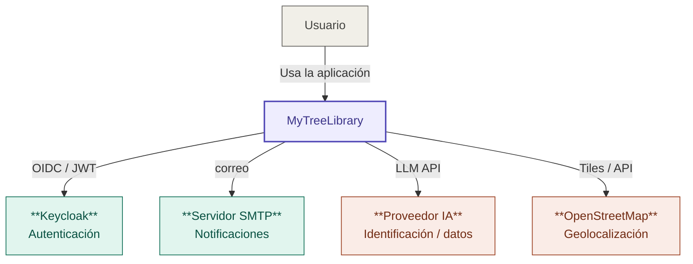
```mermaid
flowchart TB
  U[Usuario]
  S[MyTreeLibrary]
  KC["**Keycloak**<br/>Autenticación"]
  SMTP["**Servidor SMTP**<br/>Notificaciones"]
  PIA["**Proveedor IA**<br/>Identificación / datos"]
  MAP["**OpenStreetMap**<br/>Geolocalización"] 
  U -->|Usa la aplicación| S
  S -->|OIDC / JWT| KC
  S -->|correo| SMTP
  S -->|LLM API| PIA
  S -->|Tiles / API| MAP

  classDef sistema fill:#EEEDFE,stroke:#534AB7,stroke-width:2px,color:#3C3489
  classDef soporte fill:#E1F5EE,stroke:#0F6E56,stroke-width:1px,color:#085041
  classDef externo fill:#FAECE7,stroke:#993C1D,stroke-width:1px,color:#712B13
  classDef usuario fill:#F1EFE8,stroke:#5F5E5A,stroke-width:1px,color:#444441

  class S sistema
  class KC,SMTP soporte
  class PIA,MAP externo
  class U usuario

```
Leyenda

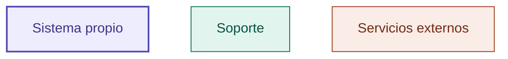
```mermaid
flowchart TB
    direction LR
    L1["Sistema propio"]
    L2["Soporte"]
    L3["Servicios externos"]

  classDef sistema fill:#EEEDFE,stroke:#534AB7,stroke-width:2px,color:#3C3489
  classDef soporte fill:#E1F5EE,stroke:#0F6E56,stroke-width:1px,color:#085041
  classDef externo fill:#FAECE7,stroke:#993C1D,stroke-width:1px,color:#712B13
  classDef usuario fill:#F1EFE8,stroke:#5F5E5A,stroke-width:1px,color:#444441

  class L1 sistema
  class L2 soporte
  class L3 externo
```

#### Diagrama de Casos de Uso del sistema

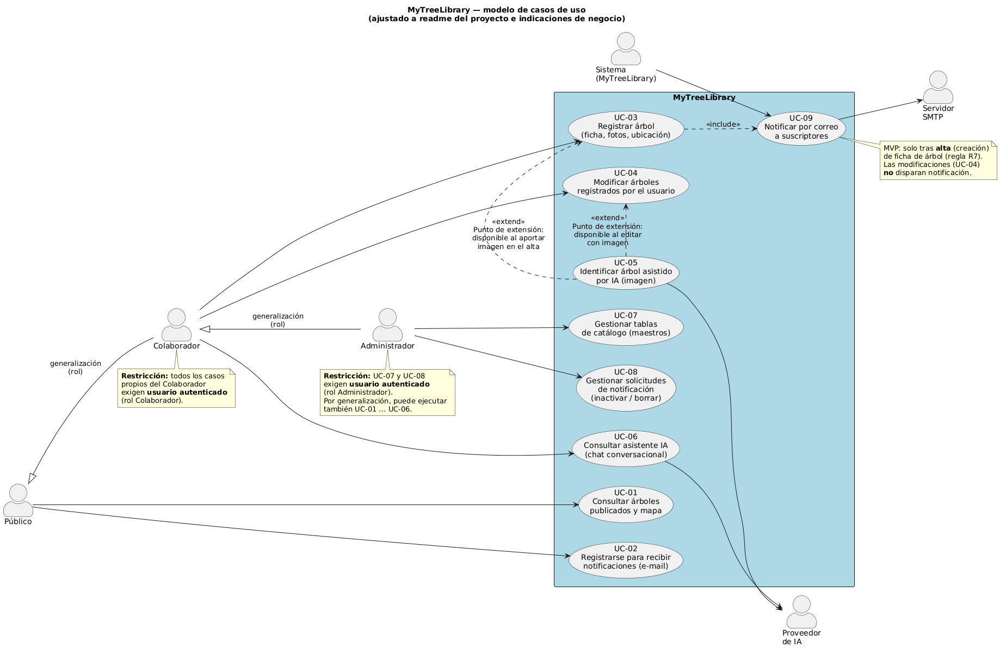

*Fuentes:* [resumen de casos de uso](docs/use-cases/use-case-summary.md) · [modelo PlantUML](docs/use-cases/use-case-model.puml)

### **2.3. Diseño y experiencia de usuario:**

La aplicación implementa una navegación simple por roles con una **home de entrada** adaptada a cada perfil.

#### Jerarquía de páginas (MVP)

- **Público (sin login):**
  - `Home` (`/`)
  - `Listado de árboles publicados` (`/trees`)
  - `Detalle de árbol publicado` (`/trees/:id`)
  - `Suscripción por email` (`/subscriptions/new`)
- **Colaborador (autenticado):**
  - Todas las páginas públicas
  - `Alta de ficha` (`/trees/new`)
  - `Edición de mis árboles` (`/trees/:id/edit`) con control de autoría
  - `IA orientativa` (`/ai/identify`, `/ai/chat`) 
- **ADMIN (autenticado):**
  - Todas las páginas de colaborador
  - `Administración de maestro de especies` (`/admin/masters`)
  - `Gestión de suscripciones` (`/admin/subscriptions`)


### **2.4. Instrucciones de instalación:**

#### Infraestructura de apoyo

En `[infra/compose/](infra/compose/)` hay un `docker-compose.yml` que levanta la infraestructura de soporte del proyecto:


| Servicio                | Detalle                                                         |
| ----------------------- | --------------------------------------------------------------- |
| PostgreSQL 16 + PostGIS | BD `mtl` con esquemas `catalog`, `media`, `notification` y `ai` |
| PostgreSQL / Keycloak   | BD `keycloak`                                                   |
| MongoDB                 | Versión 7                                                       |
| Redis                   | Versión 7                                                       |
| MinIO                   | Almacenamiento de objetos                                       |
| Kafka                   | Modo KRaft, con topic `catalog.arbol.evento`                    |
| Keycloak                | Versión 26 en modo desarrollo                                   |


> **Nota:** por defecto, Postgres del Compose se expone en el host en el **puerto `5433`**  
> mediante la variable `POSTGRES_PORT` definida en `.env`, para evitar conflictos con un PostgreSQL local en `5432`.

#### Pasos:

- Copiar `infra/compose/.env.example` a `infra/compose/.env` (en Windows `copy .env.example .env`; en Unix `cp .env.example .env`), 
- Ejecutar `docker compose up -d` desde `infra/compose/`.

#### Detalle y puertos: [infra/compose/README.md](infra/compose/README.md).

#### Backend: microservicios y gateway

Los módulos Maven del backend están bajo `[services/](services/)`:


| Módulo                 | Descripción                |
| ---------------------- | -------------------------- |
| `api-gateway`          | Gateway de entrada         |
| `catalog-service`      | Servicio de catálogo       |
| `media-service`        | Servicio de media          |
| `notification-service` | Servicio de notificaciones |
| `ai-assistant-service` | Servicio de asistente IA   |


El POM agregador está en:

```txt
services/pom.xml
```

Puedes ejecutar Maven desde `services/`:

```bash
mvn ...
```

O desde la raíz del proyecto:

```bash
mvn -f services/pom.xml ...
```

#### Perfil de desarrollo

Tras tener la infraestructura en marcha, arranca cada servicio con el perfil `dev`.

> El perfil `dev` **no está fijado en `application.properties`**.

Puedes activarlo de cualquiera de estas formas:


| Método                   | Ejemplo                                                            |
| ------------------------ | ------------------------------------------------------------------ |
| Variable de entorno      | `SPRING_PROFILES_ACTIVE=dev`                                       |
| Argumento de Spring Boot | `--spring.profiles.active=dev`                                     |
| Maven                    | `-Dspring-boot.run.profiles=dev`                                   |
| VS Code                  | Entradas `* (dev)` en `[.vscode/launch.json](.vscode/launch.json)` |


#### Más información

Consulta `[services/README.md](services/README.md)` para ver:

- comandos de arranque
- puertos
- configuración de Flyway
- ejecución de tests

#### Frontend

La carpeta `[frontend/](frontend/)` es la SPA Vue 3 (Vite): OIDC, alta de ficha, mapa OSM/Leaflet; detalle en `[frontend/README.md](frontend/README.md)`.

#### Datos iniciales en catálogo

Además del init de Postgres/Keycloak en Compose, **catalog-service** aplica semillas de maestros (familia, género, especie, provincia) mediante migraciones Flyway (`V2__seed_maestros_inicial.sql`, etc.); el esquema relacional está en `V1__baseline.sql`.

---

## 3. Arquitectura del sistema

### **3.1. Diagrama de arquitectura:**

La aplicación se desarrollará en microservicios con Spring en la parte de backend y Vue como tecnología frontend. Aunque es una **arquitectura sobredimensionada** para el alcance real del sistema, ya que sería suficiente con un back monolítico comunicándose con API REST y JWT con el front y un módulo especial para la comunicación IA, se ha seleccionado esta implementación **por motivos didácticos**, con el fin de adquirir experiencia en estas tecnologías.

#### Patrón y Stack tecnológico

- **Arquitectura:** Microservicios 
- **Seguridad:** OIDC y JWT

**Stack tecnológico principal:**

- **Backend:** Spring Boot 4 y Maven
- **Frontend:** Vue 3
- **Identidad:** Keycloak para OIDC y JWT
- **Eventos de dominio:** Kafka
- **Base de datos SQL:** PostgreSQL
- **Base de datos NoSQL:** MongoDB
- **Caché:** Redis
- **Almacenamiento de imágenes:** Compatible S3 (MinIO)


#### C2 — Diagrama de contenedores (nivel 2)

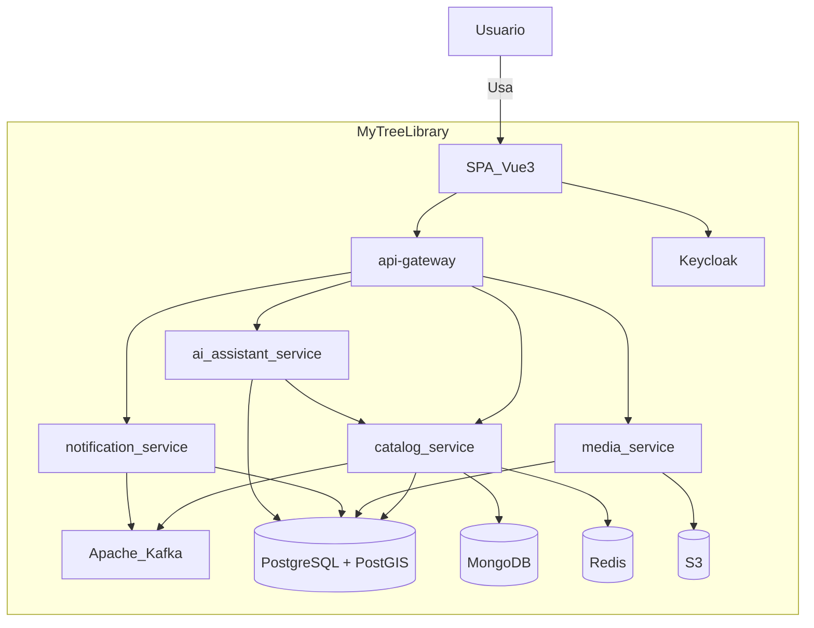
```mermaid
flowchart TB
  subgraph mtl [MyTreeLibrary]
    SPA[SPA_Vue3]
    GW[api-gateway]
    KC[Keycloak]
    CAT[catalog_service]
    MED[media_service]
    NOT[notification_service]
    AIS[ai_assistant_service]
    K[Apache_Kafka]
    PG[(PostgreSQL + PostGIS)]
    MG[(MongoDB)]
    RD[(Redis)]
    OBJ[(S3)]
  end
  U[Usuario] -->|Usa| SPA
  SPA --> GW
  SPA --> KC
  GW --> CAT
  GW --> MED
  GW --> AIS
  GW --> NOT
  CAT --> PG
  CAT --> RD
  CAT --> K
  CAT --> MG
  MED --> PG
  MED --> OBJ
  NOT --> PG
  NOT --> K
  AIS --> PG
  AIS --> CAT
```

**C2 (detalle) — un servidor PostgreSQL con PostGIS, cuatro esquemas, un esquema por servicio:**

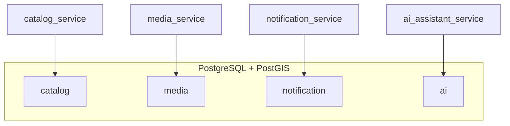
```mermaid
flowchart TB
  CAT[catalog_service]
  MED[media_service]
  NS[notification_service]
  AIS[ai_assistant_service]
  subgraph PG [PostgreSQL + PostGIS]
    direction LR
    SCH_C[catalog]
    SCH_M[media]
    SCH_N[notification]
    SCH_I[ai]
  end
  CAT --> SCH_C
  MED --> SCH_M
  NS --> SCH_N
  AIS --> SCH_I
```


**Flujo de notificación tras evento `catalog.arbol.evento` (Kafka):**

**Comunicaciones principales:** el usuario interactúa con la SPA; la SPA obtiene tokens en Keycloak y llama al API Gateway; el gateway enruta a los microservicios; **catalog-service** publica en Kafka eventos como `catalog.arbol.evento` al registrar un nuevo ejemplar; **notification-service** consume Kafka y envía correo vía SMTP externo; **ai-assistant-service** invoca al proveedor de IA externo.

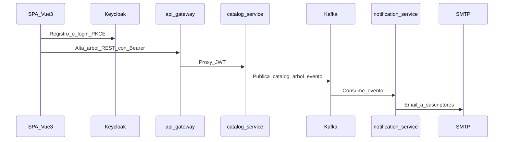
```mermaid
sequenceDiagram
  participant SPA as SPA_Vue3
  participant KC as Keycloak
  participant GW as api_gateway
  participant CAT as catalog_service
  participant K as Kafka
  participant N as notification_service
  participant Mail as SMTP
  SPA->>KC: Registro_o_login_PKCE
  SPA->>GW: Alta_arbol_REST_con_Bearer
  GW->>CAT: Proxy_JWT
  CAT->>K: Publica_catalog_arbol_evento
  K->>N: Consume_evento
  N->>Mail: Email_a_suscriptores
```


**Flujo de consulta IA (datos de especie vía catalog-service):**

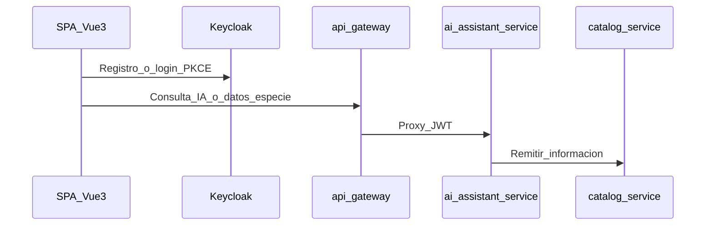
```mermaid
sequenceDiagram
  participant SPA as SPA_Vue3
  participant KC as Keycloak
  participant GW as api_gateway
  participant AIS as ai_assistant_service
  participant CAT as catalog_service
  SPA->>KC: Registro_o_login_PKCE
  SPA->>GW: Consulta_IA_o_datos_especie
  GW->>AIS: Proxy_JWT
  AIS->>CAT: Remitir_informacion
```


**Flujo de registro de árbol y subida de imagen:**

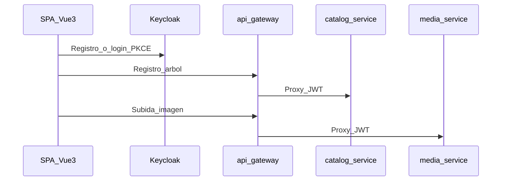
```mermaid
sequenceDiagram
  participant SPA as SPA_Vue3
  participant KC as Keycloak
  participant GW as api_gateway
  participant CAT as catalog_service
  participant MED as media_service
  SPA->>KC: Registro_o_login_PKCE
  SPA->>GW: Registro_arbol
  GW->>CAT: Proxy_JWT
  SPA->>GW: Subida_imagen
  GW->>MED: Proxy_JWT
```


### 3.1.1 Autenticación en Front (Vue):

Descripción genérica del flujo de autenticación para SPA en **Vue 3** con **OIDC Authorization Code + PKCE** (IdP: Keycloak).  
Objetivo: mantener rutas protegidas con sesión válida, renovar token de forma transparente y centralizar el manejo de `401` en cliente HTTP.

#### C3 — Componentes (nivel 3): autenticación en el contenedor SPA Vue

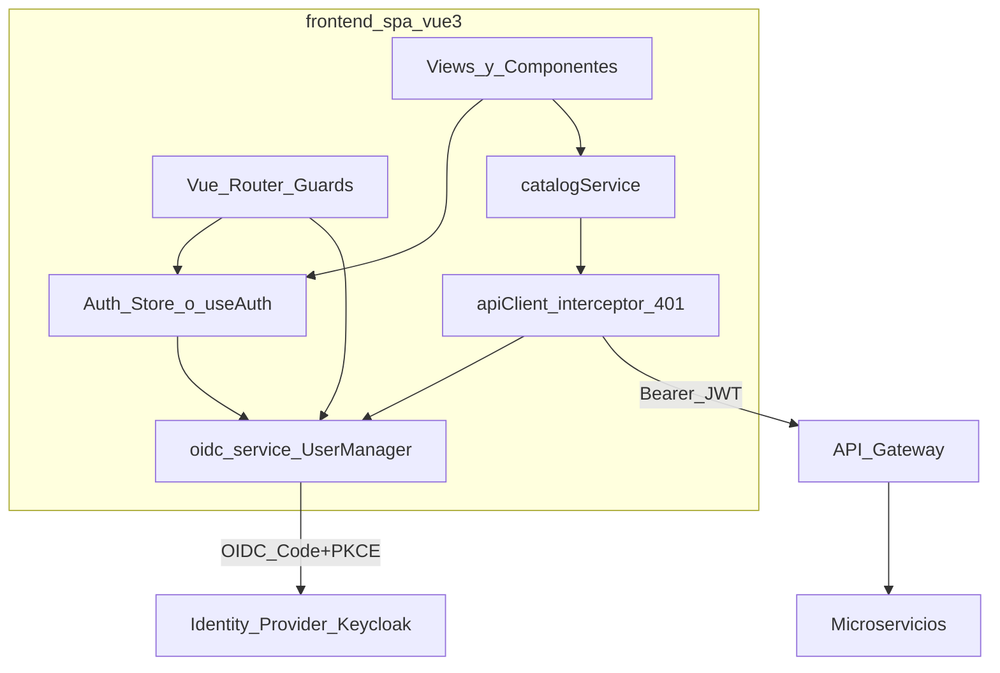
```mermaid
flowchart TB
  subgraph SPA [frontend_spa_vue3]
    direction TB
    Router[Vue_Router_Guards]
    Views[Views_y_Componentes]
    AuthStore[Auth_Store_o_useAuth]
    Oidc[oidc_service_UserManager]
    Http[apiClient_interceptor_401]
    CatalogSvc[catalogService]

    Views --> AuthStore
    Views --> CatalogSvc
    CatalogSvc --> Http
    Http --> Oidc
    Router --> AuthStore
    Router --> Oidc
    AuthStore --> Oidc
  end

  Oidc -->|OIDC_Code+PKCE| IdP[Identity_Provider_Keycloak]
  Http -->|Bearer_JWT| GW[API_Gateway]
  GW --> Services[Microservicios]
```


Responsabilidades clave:

- `**Router Guards**`: bloquean rutas protegidas cuando no hay sesión válida.
- `**Auth Store / useAuth**`: estado reactivo de sesión (`currentUser`, `isAuthenticated`) y listeners de eventos OIDC.
- `**oidc_service**`: login, callback, `signinSilent`, logout.
- `**apiClient**`: inyecta Bearer, reintenta una vez tras `401` usando `signinSilent`; si falla, redirige a login con `returnPath`.

#### C4 — Comportamiento (dinámico): secuencia de autenticación y acceso protegido

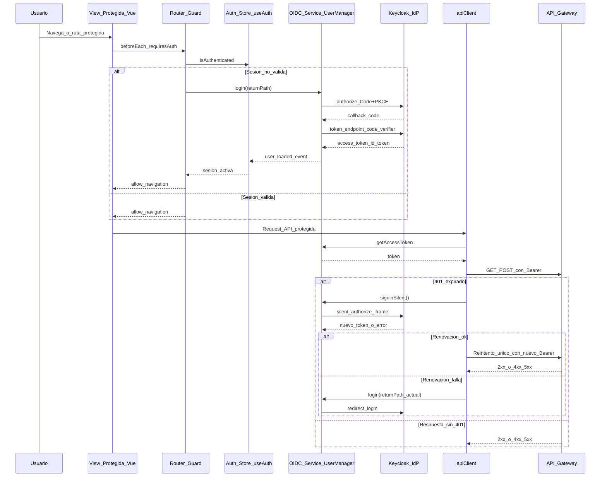
```mermaid
sequenceDiagram
  participant U as Usuario
  participant V as View_Protegida_Vue
  participant R as Router_Guard
  participant A as Auth_Store_useAuth
  participant O as OIDC_Service_UserManager
  participant K as Keycloak_IdP
  participant H as apiClient
  participant G as API_Gateway

  U->>V: Navega_a_ruta_protegida
  V->>R: beforeEach_requiresAuth
  R->>A: isAuthenticated

  alt Sesion_no_valida
    R->>O: login(returnPath)
    O->>K: authorize_Code+PKCE
    K-->>O: callback_code
    O->>K: token_endpoint_code_verifier
    K-->>O: access_token_id_token
    O-->>A: user_loaded_event
    A-->>R: sesion_activa
    R-->>V: allow_navigation
  else Sesion_valida
    R-->>V: allow_navigation
  end

  V->>H: Request_API_protegida
  H->>O: getAccessToken
  O-->>H: token
  H->>G: GET_POST_con_Bearer

  alt 401_expirado
    H->>O: signinSilent()
    O->>K: silent_authorize_iframe
    K-->>O: nuevo_token_o_error
    alt Renovacion_ok
      H->>G: Reintento_unico_con_nuevo_Bearer
      G-->>H: 2xx_o_4xx_5xx
    else Renovacion_falla
      H->>O: login(returnPath_actual)
      O->>K: redirect_login
    end
  else Respuesta_sin_401
    G-->>H: 2xx_o_4xx_5xx
  end
```

### 3.1.2 Kafka:

#### C3 — Componentes (nivel 3): **catalog-service** y Kafka

Vista de **componentes lógicos** dentro del contenedor **catalog-service** y su relación con **Kafka** y **PostgreSQL**. El productor de eventos de alta de árbol vive en **infraestructura** (`KafkaArbolCreadoEventPublisher`); el caso de uso solo conoce la interfaz `**ArbolCreadoEventPublisher`**. Con Kafka desactivado (`mtl.catalog.kafka.enabled=false`, p. ej. tests), Spring registra `**NoOpArbolCreadoEventPublisher**` en su lugar. Contrato del topic y del JSON: [docs/events/kafka-events.md](docs/events/kafka-events.md).

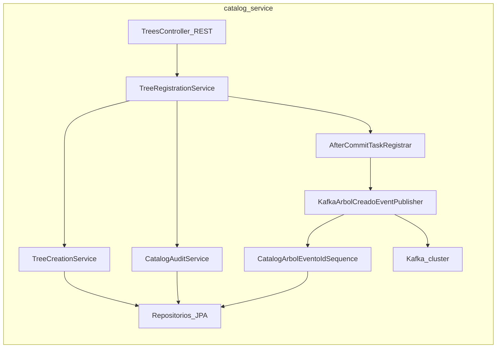
```mermaid
flowchart TB
  subgraph catalogSvc [catalog_service]
    direction TB
    TreesCtrl[TreesController_REST]
    TreeReg[TreeRegistrationService]
    TreeCre[TreeCreationService]
    CatAud[CatalogAuditService]
    AfterCommit[AfterCommitTaskRegistrar]
    KafkaPub[KafkaArbolCreadoEventPublisher]
    EventoSeq[CatalogArbolEventoIdSequence]
    JpaRepos[Repositorios_JPA]
    TreesCtrl --> TreeReg
    TreeReg --> TreeCre
    TreeReg --> CatAud
    TreeReg --> AfterCommit
    AfterCommit --> KafkaPub
    KafkaPub --> EventoSeq
    KafkaPub --> KafkaBroker[Kafka_cluster]
    TreeCre --> JpaRepos
    CatAud --> JpaRepos
    EventoSeq --> JpaRepos
  end
```


En tiempo de ejecución, `**TreeRegistrationService**` depende de la interfaz `**ArbolCreadoEventPublisher**`; Spring inyecta `**KafkaArbolCreadoEventPublisher**` si `mtl.catalog.kafka.enabled=true`, o `**NoOpArbolCreadoEventPublisher**` si está en `false` (por defecto o perfil `test`).

#### C4 — Código y comportamiento: secuencia de publicación **ARBOL_CREADO**

A nivel de **código**, el flujo relevante es: validación y persistencia del **ARBOL** y auditoría  dentro de una transacción; a continuación se registra una tarea `**afterCommit`** que, una vez confirmado el commit en PostgreSQL, obtiene `**evento_id**` con `nextval(catalog.seq_arbol_evento_id)`, serializa el cuerpo según [kafka-events.md](docs/events/kafka-events.md) y envía al topic `**catalog.arbol.evento**` con clave `**arbol_id**`. Si el envío a Kafka falla tras el **201**, el error se registra en logs (el consumidor **notification-service** debe ser idempotente ante reentregas). Detalle de clases: [services/README.md](services/README.md) (Kafka y **catalog-service**).


```mermaid
sequenceDiagram
  participant Client as Cliente_SPA_o_GW
  participant Ctrl as CatalogTreesController
  participant Reg as TreeRegistrationService
  participant Cre as TreeCreationService
  participant Aud as CatalogAuditService
  participant Tx as AfterCommitTaskRegistrar
  participant Pub as KafkaArbolCreadoEventPublisher
  participant Seq as CatalogArbolEventoIdSequence
  participant PG as PostgreSQL_catalog
  participant KB as Kafka

  Client->>Ctrl: POST_trees_Bearer_JWT
  Ctrl->>Reg: register
  Reg->>Cre: create
  Cre->>PG: persistir_ARBOL_y_usuario
  Cre-->>Reg: CreatedTreeResult
  Reg->>Aud: recordTreeCreated_R3
  Aud->>PG: insertar_AUDITORIA_CATALOGO
  Reg->>Tx: runAfterCommit_publicar
  Tx-->>Reg: sincronizacion_registrada
  Reg-->>Ctrl: CreatedTreeResult
  Ctrl-->>Client: 201_CreatedTreeResponse

  Note over Reg,PG: commit_transaccion
  Tx->>Pub: publishArbolCreado
  Pub->>Seq: nextval_seq_arbol_evento_id
  Seq->>PG: SELECT_nextval
  PG-->>Seq: evento_id
  Seq-->>Pub: evento_id
  Pub->>KB: send_catalog_arbol_evento_clave_arbol_id
```

### 3.1.3 Almacenamiento de fotografías

Las fotografías se almacenan como **objetos** en un almacén **S3-compatible** (**MinIO**) y sus **metadatos** en PostgreSQL, esquema **`media`**, vía **media-service** detrás del **API Gateway**. La SPA obtiene primero una **URL prefirmada** (`POST /api/media/uploads/presign`) con JWT; el servicio valida reglas de negocio (MIME permitidos, tamaño máximo configurable y cupo de fotos por árbol) y devuelve la URL y la clave de objeto. El cliente sube el binario directamente al bucket y, a continuación, **confirma** la operación (`POST /api/media/photos/confirm`) para persistir metadatos: la **primera confirmación** por árbol queda como **foto principal**; el **orden** refleja la secuencia de confirmaciones (o el índice explícito enviado por la SPA si coincide con el esperado). La visibilidad efectiva de la imagen en consulta pública se **hereda de la ficha del árbol**; detalle funcional y criterios de aceptación: [HU-006](docs/backlog/HU-006-fotografias-asociadas-al-arbol.md) y contrato HTTP en [docs/api/openapi.yaml](docs/api/openapi.yaml).

Para **consulta pública mínima** ([HU-014](docs/backlog/HU-014-consulta-de-fotografias-del-arbol.md), existe `GET /api/media/public/trees/{treeId}/primary-photo` (**sin JWT** en gateway): media-service comprueba que el árbol sea visible vía catálogo público y devuelve el binario de la foto principal si existe en el bucket. La SPA lo usa para la **miniatura** del listado de árboles publicados.

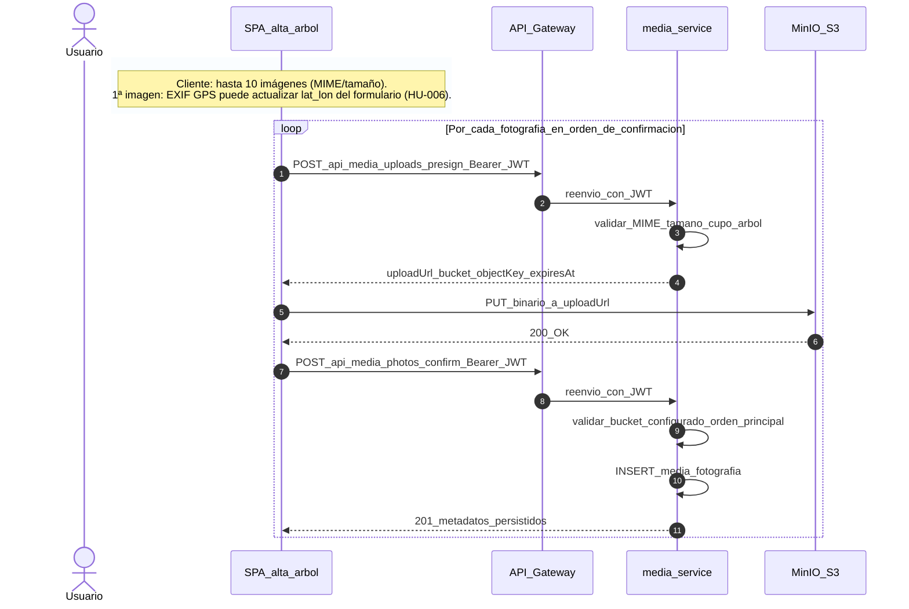
```mermaid
sequenceDiagram
  autonumber
  actor U as Usuario
  participant SPA as SPA_alta_arbol
  participant GW as API_Gateway
  participant MS as media_service
  participant M as MinIO_S3

  rect rgba(240, 248, 255, 0.35)
    Note over SPA: Cliente: hasta 10 imágenes (MIME/tamaño).<br/>1ª imagen: EXIF GPS puede actualizar lat_lon del formulario (HU-006).
  end

  loop Por_cada_fotografia_en_orden_de_confirmacion
    SPA->>GW: POST_api_media_uploads_presign_Bearer_JWT
    GW->>MS: reenvio_con_JWT
    MS->>MS: validar_MIME_tamano_cupo_arbol
    MS-->>SPA: uploadUrl_bucket_objectKey_expiresAt

    SPA->>M: PUT_binario_a_uploadUrl
    M-->>SPA: 200_OK

    SPA->>GW: POST_api_media_photos_confirm_Bearer_JWT
    GW->>MS: reenvio_con_JWT
    MS->>MS: validar_bucket_configurado_orden_principal
    MS->>MS: INSERT_media_fotografia
    MS-->>SPA: 201_metadatos_persistidos
  end
```

### **3.2. Descripción de componentes principales:**


| Componente           | Tecnología                                                                                                                                                                                                        | Responsabilidad                                                                                                                                                                                                                                                                                                                                                                  |
| -------------------- | ----------------------------------------------------------------------------------------------------------------------------------------------------------------------------------------------------------------- | -------------------------------------------------------------------------------------------------------------------------------------------------------------------------------------------------------------------------------------------------------------------------------------------------------------------------------------------------------------------------------- |
| SPA                  | Vue 3, Vite, TypeScript                                                                                                                                                                                           | UI: biblioteca, mapa, IA, flujos OIDC con Keycloak                                                                                                                                                                                                                                                                                                                               |
| API Gateway          | Spring Cloud Gateway (**WebFlux**), **Spring Boot 4**                                                                                                                                                             | Enrutado `/api/catalog`, `/api/media`, `/api/notifications`, `/api/ai`; **validación JWT** (OAuth2 Resource Server, Keycloak); actuator; token relay hacia microservicios (MVP)                                                                                                                                                                                                  |
| catalog-service      | **Spring Boot 4**, JPA, Flyway, PostgreSQL, Redis (Mongo según evolución); **productor Kafka** topic `catalog.arbol.evento` (`ARBOL_CREADO` tras alta; [TASK-HU-005-05](docs/backlog/HU-005-ticket-breakdown.md)) | Árboles, coordenadas numéricas (MVP sin geometría PostGIS en DDL); **PostgreSQL** (esquema **catalog**); publicación de eventos de dominio según [kafka-events.md](docs/events/kafka-events.md)                                                                                                                                                                                  |
| media-service        | **Spring Boot 4**, JPA, Flyway, AWS SDK v2 (S3)                                                                                                                                                                   | Metadatos solo en esquema `**media`**; objetos en bucket MinIO/S3; URLs prefirmadas                                                                                                                                                                                                                                                                                              |
| notification-service | **Spring Boot 4**, JPA, Flyway, Spring Kafka, JavaMail                                                                                                                                                            | Consume `catalog.arbol.evento`; datos solo en esquema `**notification`**; envío SMTP                                                                                                                                                                                                                                                                                             |
| ai-assistant-service | **Spring Boot 4**, Spring WebClient (o equivalente), Spring Data JPA                                                                                                                                              | Orquestación hacia proveedor IA; datos de auditoria en esquema `**ai`** (p. ej. **AUDITORIA_USO_IA**); delegación de datos de catálogo en **catalog-service**                                                                                                                                                                                                                    |
| Keycloak             | Keycloak 26                                                                                                                                                                                                       | Realm, clientes, roles, emisión de JWT                                                                                                                                                                                                                                                                                                                                           |
| Kafka                | Apache Kafka (KRaft en dev)                                                                                                                                                                                       | Topics p. ej. `catalog.arbol.evento`                                                                                                                                                                                                                                                                                                                                             |
| PostgreSQL           | 16                                                                                                                                                                                                                | **Un servidor**; **cuatro esquemas** (`catalog`, `media`, `notification`, `ai`). En **catalog**, el DDL actual   usa **latitud/longitud** `NUMERIC` (sin columna PostGIS); la extensión PostGIS está prevista en el contenedor para iteraciones posteriores ([V1__baseline.sql](services/catalog-service/src/main/resources/db/migration/V1__baseline.sql)). |
| MongoDB              | 7                                                                                                                                                                                                                 | Colecciones de enriquecimiento y notas; proyección mínima para búsqueda sin SQL (véase [mongo.md](docs/data-model/mongo.md))                                                                                                                                                                                                                                                     |
| Redis                | 7                                                                                                                                                                                                                 | Caché                                                                                                                                                                                                                                                                                                                                                                            |
| MinIO                | S3 API                                                                                                                                                                                                            | Imágenes en desarrollo                                                                                                                                                                                                                                                                                                                                                           |


### **3.3. Descripción de alto nivel del proyecto y estructura de ficheros**

Estructura de repositorio **prevista** para la fase de implementación (monorepo):

```
proyecto/
├── frontend/                 # SPA Vue 3 (Vite)
├── services/                 # Gateway + microservicios Spring Boot (un directorio por despliegue)
│   ├── api-gateway/
│   ├── catalog-service/
│   ├── media-service/
│   ├── notification-service/
│   ├── ai-assistant-service/
│   └── system-e2e-tests/     # IT E2E HTTP contra el API Gateway (JWT real; ver README del módulo)
├── platform/
│   └── observability/        # Configuración de telemetría/trazas/logs (OTel, Prometheus, Grafana…)
├── infra/                    # Orquestación local y nube
│   ├── compose/              # Docker Compose (infra de apoyo); ver README.md en esa carpeta
│   └── k8s/                  # Manifiestos / Helm (según despliegue)
├── docs/
│   ├── adr/                  # Architecture Decision Records
│   ├── api/                  # OpenAPI (contrato del gateway)
│   ├── backlog/              # Historias y desgloses de tickets (HU-*)
│   ├── data-model/           # Modelo de datos (reglas, Mongo, readme §3)
│   ├── engineering/          # Guías: tests Java/Maven (`testing-java.md`), Flyway local (`flyway-dev-reset.md`), mapa canónico (`canonical-sources.md`)
│   ├── events/               # Contrato de eventos Kafka
│   ├── security/             # JWT, gateway, estrategia de validación
│   └── use-cases/            # Casos de uso
└── readme.md
```

### **3.4. Infraestructura y despliegue**

**Desarrollo:** Docker Compose (o equivalente) con **un** PostgreSQL con extensión **PostGIS** (cuatro esquemas de aplicación: `catalog`, `media`, `notification`, `ai`), MongoDB, Redis, MinIO, Kafka y Keycloak; los microservicios pueden ejecutarse en el host o como contenedores.

**Despliegue Producción:** orquestación (Kubernetes), secretos externos, Keycloak y Kafka en HA según entorno, bases de datos gestionadas y almacenamiento de objetos S3 en nube.

**Decisiones documentadas:** descubrimiento de servicios y configuración **sin Eureka ni Spring Cloud Config** (asumidas por Compose/Kubernetes) — [ADR-0001](docs/adr/0001-discovery-y-configuracion-por-orquestador.md). Claves primarias **numéricas** en SQL frente a UUID — [ADR-0002](docs/adr/0002-claves-primarias-numericas-frente-a-uuid.md). Observavilidad sencilla son Prometheus y Grafana — [ADR-0005](docs/adr/0005-microservices-observabilty-spring-boot.md)

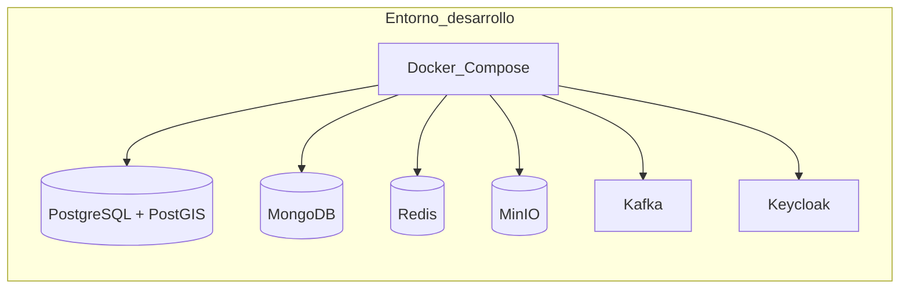
```mermaid
flowchart LR
  subgraph dev [Entorno_desarrollo]
    DC[Docker_Compose]
    PGd[(PostgreSQL + PostGIS)]
    MGd[(MongoDB)]
    Rd[(Redis)]
    S3d[(MinIO)]
    Kd[Kafka]
    KCd[Keycloak]
  end
  DC --> PGd
  DC --> MGd
  DC --> Rd
  DC --> S3d
  DC --> Kd
  DC --> KCd
```


### **3.5. Seguridad**


| Práctica                  | Descripción                                                                                                                                                                             |
| ------------------------- | --------------------------------------------------------------------------------------------------------------------------------------------------------------------------------------- |
| Autenticación OIDC        | Keycloak como IdP; SPA con **Authorization Code + PKCE**; JWT firmados; `issuer-uri` alineado con el realm                                                                              |
| Autorización              | Roles de realm `COLABORADOR` y `ADMIN`; políticas en recursos sensibles                                                                                                                 |
| Gateway                   | Validación de JWT en el gateway (`spring-boot-starter-oauth2-resource-server`); rutas públicas según OpenAPI; **cabeceras de correlación** en roadmap (propagación gateway → servicios) |
| Almacenamiento de objetos | Buckets privados; **URLs prefirmadas** de corta duración; sin credenciales en el cliente                                                                                                |
| Datos personales          | Suscripciones por email con **token hash** para baja; minimización de logs                                                                                                              |
| Transporte                | TLS en producción; CORS restringido al origen del SPA                                                                                                                                   |
| Observabilidad            | Health/metrics Prometheus; Grafana                                                    |


**Implementación y normativa:** [docs/security/jwt-gateway-strategy.md](docs/security/jwt-gateway-strategy.md) · `.cursor/rules/api-security.mdc` · [docs/api/openapi.yaml](docs/api/openapi.yaml) · Keycloak: [infra/compose/README.md](infra/compose/README.md).

### **3.6. Tests**

Estrategia prevista: pruebas unitarias de dominio; **integración** con **Testcontainers** (PostgreSQL con PostGIS, MongoDB, Kafka) donde aporte valor; **contrato de API** en [docs/api/openapi.yaml](docs/api/openapi.yaml) como referencia para pruebas de contrato y revisiones; tests de capa web y de aceptación sobre flujos críticos (catalogo, notificaciones, IA).

**Backend Java (`services/`):** convención `src/test/java` vs `src/testIT/java`, Surefire/Failsafe, checklist (p. ej. Gateway 5.x) e IDE — [docs/engineering/testing-java.md](docs/engineering/testing-java.md).

**End-to-end backend Java (`services/system-e2e-test`):** convención `src/test/java` vs `src/testIT/java`, Surefire/Failsafe, proyecto con test end to end del back; testea la capa completa de microservicios java.

---

## 4. Modelo de datos

**Documentación relacionada:** [Notas de negocio y reglas](docs/data-model/data-model.md) · [Modelo técnico MongoDB (colecciones, validación, índices)](docs/data-model/mongo.md) · [Eventos Kafka](docs/events/kafka-events.md)

### **3.1. Modelo lógico del sistema completo**

A continuación se muestra el **Modelo lógico** del sistema; una vista unificada de entidades principales del sistema y sus relaciones; se incluyen todas las entidades lógicas del sistema, independientemente del modo y servicio en el que se realice su implementación física; los tipos indican el modelo físico previsto alineado con §3.2.

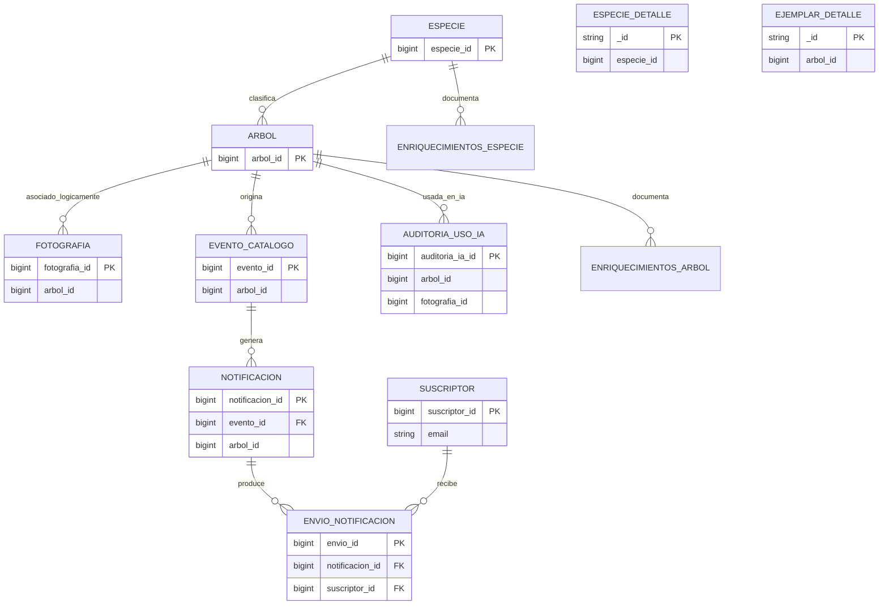
```mermaid
erDiagram
    ARBOL {
        bigint arbol_id PK
    }

    ESPECIE {
        bigint especie_id PK
    }
    
    ESPECIE_DETALLE {
        string _id PK
        bigint especie_id
    }

    EJEMPLAR_DETALLE {
        string _id PK
        bigint arbol_id
    }

    FOTOGRAFIA {
        bigint fotografia_id PK
        bigint arbol_id
    }

    EVENTO_CATALOGO {
        bigint evento_id PK
        bigint arbol_id
    }

    NOTIFICACION {
        bigint notificacion_id PK
        bigint evento_id FK
        bigint arbol_id
    }

    SUSCRIPTOR {
        bigint suscriptor_id PK
        string email
    }

    ENVIO_NOTIFICACION {
        bigint envio_id PK
        bigint notificacion_id FK
        bigint suscriptor_id FK
    }

    AUDITORIA_USO_IA {
        bigint auditoria_ia_id PK
        bigint arbol_id
        bigint fotografia_id
    }

    ARBOL ||--o{ FOTOGRAFIA : asociado_logicamente
    ARBOL ||--o{ EVENTO_CATALOGO : origina
    ARBOL ||--o{ AUDITORIA_USO_IA : usada_en_ia
    EVENTO_CATALOGO ||--o{ NOTIFICACION : genera
    ARBOL ||--o{ ENRIQUECIMIENTOS_ARBOL : documenta
    ESPECIE ||--o{ ENRIQUECIMIENTOS_ESPECIE : documenta
    ESPECIE ||--o{ ARBOL : clasifica
    NOTIFICACION ||--o{ ENVIO_NOTIFICACION : produce
    SUSCRIPTOR ||--o{ ENVIO_NOTIFICACION : recibe

```


### **4.2. Diagrama de persistencia (implementación)**

#### **PostgreSQL: catalog_service:**

Esquema con los datos generales de cada árbol y auditoria del usuario que los registró.

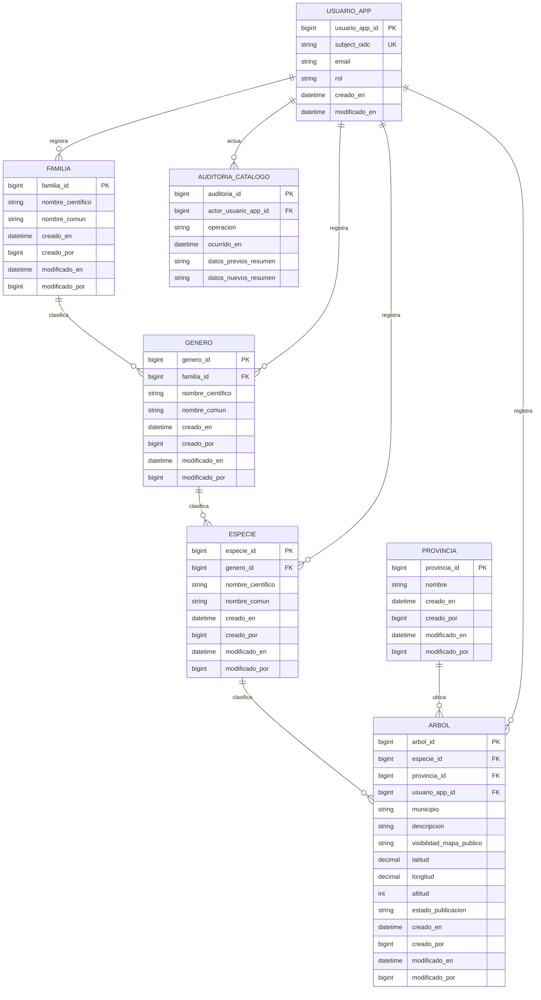
```mermaid
erDiagram
    USUARIO_APP {
        bigint usuario_app_id PK
        string subject_oidc UK
        string email
        string rol
        datetime creado_en
        datetime modificado_en
    }

    FAMILIA {
        bigint familia_id PK
        string nombre_cientifico
        string nombre_comun
        datetime creado_en
        bigint creado_por
        datetime modificado_en
        bigint modificado_por
    }

    GENERO {
        bigint genero_id PK
        bigint familia_id FK
        string nombre_cientifico
        string nombre_comun
        datetime creado_en
        bigint creado_por
        datetime modificado_en
        bigint modificado_por
    }

    ESPECIE {
        bigint especie_id PK
        bigint genero_id FK
        string nombre_cientifico
        string nombre_comun
        datetime creado_en
        bigint creado_por
        datetime modificado_en
        bigint modificado_por
    }

    PROVINCIA {
        bigint provincia_id PK
        string nombre
        datetime creado_en
        bigint creado_por
        datetime modificado_en
        bigint modificado_por
    }

    ARBOL {
        bigint arbol_id PK
        bigint especie_id FK
        bigint provincia_id FK
        bigint usuario_app_id FK
        string municipio
        string descripcion
        string visibilidad_mapa_publico
        decimal latitud
        decimal longitud
        int altitud
        string estado_publicacion
        datetime creado_en
        bigint creado_por
        datetime modificado_en
        bigint modificado_por
    }

    AUDITORIA_CATALOGO {
        bigint auditoria_id PK
        bigint actor_usuario_app_id FK
        string operacion
        datetime ocurrido_en
        string datos_previos_resumen
        string datos_nuevos_resumen
    }

    FAMILIA ||--o{ GENERO : clasifica
    GENERO ||--o{ ESPECIE : clasifica
    ESPECIE ||--o{ ARBOL : clasifica
    PROVINCIA ||--o{ ARBOL : ubica
    USUARIO_APP ||--o{ ARBOL : registra
    USUARIO_APP ||--o{ FAMILIA : registra
    USUARIO_APP ||--o{ GENERO : registra
    USUARIO_APP ||--o{ ESPECIE : registra
    USUARIO_APP ||--o{ AUDITORIA_CATALOGO : actua
```


Para el alta de árbol, los valores admitidos son:

- `estado_publicacion`: `BORRADOR` o `PUBLICADO`.
- `visibilidad_mapa_publico`: `PRIVADO` o `PUBLICO`.

#### **Mongo catalog_service:**

Base de datos NoSQL que permite almacenar información no estructurada de cada árbol.

*Tiene una proyección mínima de datos generales de  `ESPECIE` para facilitar búsquedas en Mongo por nombre de especie  sin join obligatorio con SQL; el maestro completo permanece en PostgreSQL.  [mongo.md](docs/data-model/mongo.md).*

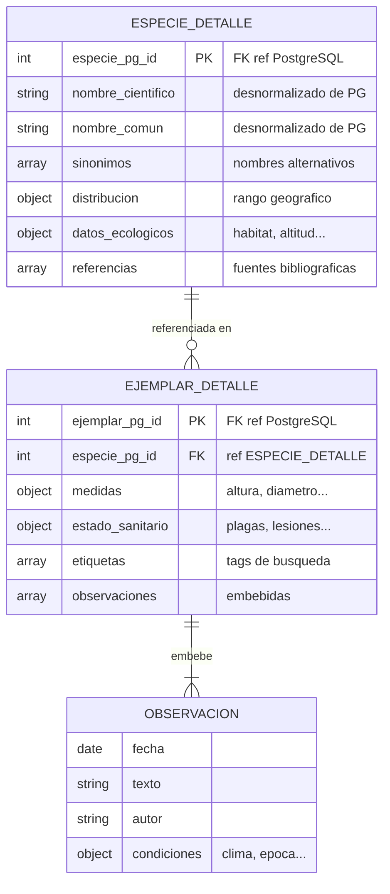
```mermaid
erDiagram

  ESPECIE_DETALLE ||--o{ EJEMPLAR_DETALLE : "referenciada en"

  ESPECIE_DETALLE {
    int    especie_pg_id       PK "FK ref PostgreSQL"
    string nombre_cientifico      "desnormalizado de PG"
    string nombre_comun           "desnormalizado de PG"
    array  sinonimos              "nombres alternativos"
    object distribucion           "rango geografico"
    object datos_ecologicos       "habitat, altitud..."
    array  referencias            "fuentes bibliograficas"
  }

  EJEMPLAR_DETALLE {
    int    ejemplar_pg_id      PK "FK ref PostgreSQL"
    int    especie_pg_id       FK "ref ESPECIE_DETALLE"
    object medidas                "altura, diametro..."
    object estado_sanitario       "plagas, lesiones..."
    array  etiquetas              "tags de busqueda"
    array  observaciones          "embebidas"
  }

  OBSERVACION {
    date   fecha
    string texto
    string autor
    object condiciones            "clima, epoca..."
  }

  EJEMPLAR_DETALLE ||--|{ OBSERVACION : "embebe"
```


#### **PostgreSQL media_service:**

Información de las fotografías de cada árbol almacenadas en el  sistema.

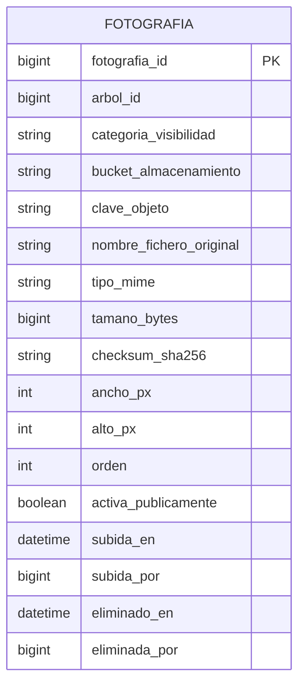
```mermaid
erDiagram
    FOTOGRAFIA {
        bigint fotografia_id PK
        bigint arbol_id
        string categoria_visibilidad
        string bucket_almacenamiento
        string clave_objeto
        string nombre_fichero_original
        string tipo_mime
        bigint tamano_bytes
        string checksum_sha256
        int ancho_px
        int alto_px
        int orden
        boolean activa_publicamente
        datetime subida_en
        bigint subida_por
        datetime eliminado_en
        bigint eliminada_por
    }

```


#### **PostgreSQL notification_service:**

Avisos de de nuevas altas en el sistema a los suscriptores.

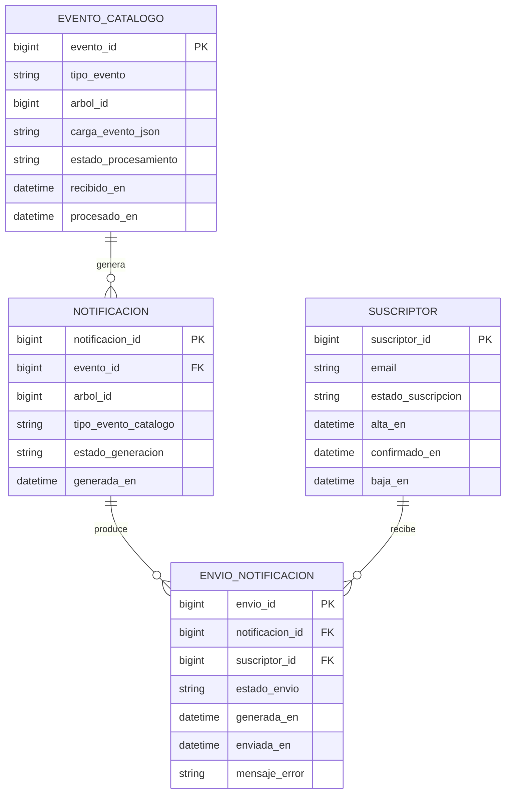
```mermaid
erDiagram
    SUSCRIPTOR {
        bigint suscriptor_id PK
        string email
        string estado_suscripcion
        datetime alta_en
        datetime confirmado_en
        datetime baja_en
    }

    EVENTO_CATALOGO {
        bigint evento_id PK
        string tipo_evento
        bigint arbol_id
        string carga_evento_json
        string estado_procesamiento
        datetime recibido_en
        datetime procesado_en
    }

    NOTIFICACION {
        bigint notificacion_id PK
        bigint evento_id FK
        bigint arbol_id
        string tipo_evento_catalogo
        string estado_generacion
        datetime generada_en
    }

    ENVIO_NOTIFICACION {
        bigint envio_id PK
        bigint notificacion_id FK
        bigint suscriptor_id FK
        string estado_envio
        datetime generada_en
        datetime enviada_en
        string mensaje_error
    }

    EVENTO_CATALOGO ||--o{ NOTIFICACION : genera
    NOTIFICACION ||--o{ ENVIO_NOTIFICACION : produce
    SUSCRIPTOR ||--o{ ENVIO_NOTIFICACION : recibe
```


#### **PostgreSQL ai_assistant_service (esquema `ai`):**

Audtoría de las consultas realizadas al asistnete de IA (ChatGPT).

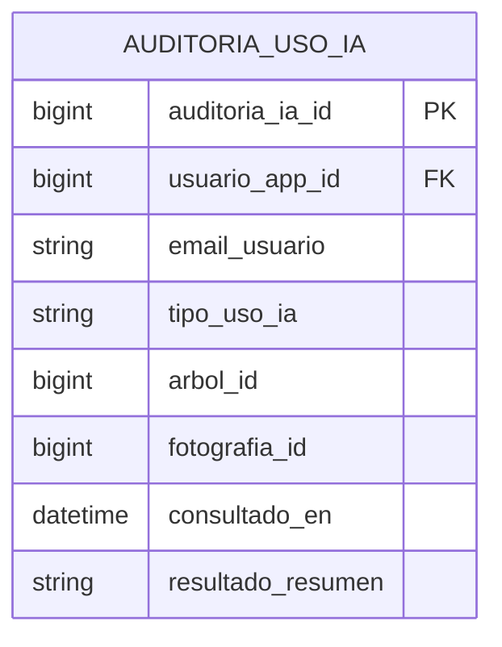
```mermaid
erDiagram
    AUDITORIA_USO_IA {
        bigint auditoria_ia_id PK
        bigint usuario_app_id FK
        string email_usuario
        string tipo_uso_ia
        bigint arbol_id
        bigint fotografia_id
        datetime consultado_en
        string resultado_resumen
    }
```


### **4.3. Descripción de entidades principales (orientación física)**

Las entidades físicas se reparten por servicio y almacén como se indica en §3.2: Un servidor **PostgreSQL** con cuatro esquemas `catalog`, `media`, `notification` y `ai`; Una Base e datos **MongoDB** usada pro  **catalog-service**.

**Usuario de aplicación:** La audditoría de la aplicación se implementa en torno a `USUARIO_APP` que usa **PK numérica** `usuario_app_id` (alineado con [ADR-0002](docs/adr/0002-claves-primarias-numericas-frente-a-uuid.md)); el identificador estable del proveedor OIDC (`sub`) se guarda en el campo `**subject_oidc`** con unicidad, no como clave primaria. Las FK en otros esquemas/servicios (`usuario_app_id`, `creador_usuario_app_id`, etc.) referencian a la clave primaria; No habrá FK cruzadas entre esquemas; cada microservicio tiene un esquema de Base de Datos independiente.

---

## 5. Especificación de la API

**Contrato canónico (OpenAPI 3):** [docs/api/openapi.yaml](docs/api/openapi.yaml) — rutas bajo el API Gateway (`/api/catalog`, `/api/media`, `/api/notifications`, `/api/ai`), seguridad JWT donde aplica, listados paginados (`page`, `size`) y errores en **RFC 9457** (`application/problem+json`).

**Convenciones de diseño:** de cara a homogeneizar el desarrollo. se han definido las siguientes reglas de Cursor `.cursor/rules/api-contract.mdc`, `.cursor/rules/api-design.mdc` y `.cursor/rules/api-security.mdc`.

**Eventos asíncronos** notificaciones asíncronas asociadas al alte de un ejemplar: [docs/events/kafka-events.md](docs/events/kafka-events.md).

---

## 6. Historias de usuario

A partir del Modelo de análisis (actores, casos de uso, diagrama PlantUML): [docs/use-cases/use-case-summary.md](docs/use-cases/use-case-summary.md) y de la definición del sistema (archivo actual) se ha generado el backlog con la relación de las historias de uauario a implementar [docs/backlog/backlog.md](docs/backlog/backlog.md).

La definición y refinamiento de cada una de las historias de usuario incluidas en el backlog, y sus correspondientes ticket de trabajo, se ha realizado mediante los siguientes prompts genéricos que se han guardado como skills de Cursor: `.cursor/skills/hu-refinement-mtl/SKILL.md` (generación/refinamiento de historias) y `.cursor/skills/hu-breakdown-mtl/SKILL.md` (desglose en tickets). Estos prompt generar el correspondiente archivo dentro de la carpeta backlog.

Por operativa práctica, al comienzo de la historia se hacen unas comprobaciones iniciales que permiten detectar historias incompletas o mal formadas.   

**Historia de Usuario 1**

**Historia de Usuario 2**

**Historia de Usuario 3**

---

## 7. Tickets de trabajo

Como se ha comentado en el punto anterior, para mantener formato homogéneo se usa un prompt genérico que se ha almacenado como skill`.cursor/skills/hu-breakdown-mtl/SKILL.md` (desglose en tickets). Este prompt gerera el correspondiente archivo md dentro de la carpeta backlog.

En la generación ed ticket de trabajo se incluye explicitamente una sección con las rules de Cursor que debe aplicar el agente de IA al implementarlos.


**Ticket 1**

**Ticket 2**

**Ticket 3**

---

## 8. Pull requests

> Documenta 3 de las Pull Requests realizadas durante la ejecución del proyecto

**Pull Request 1**

**Pull Request 2**

**Pull Request 3**