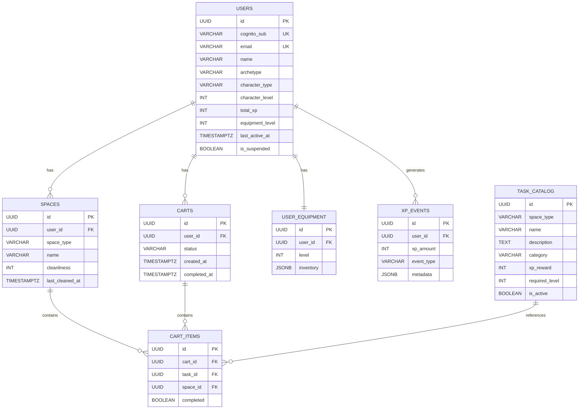

## Índice

0. [Ficha del proyecto](#0-ficha-del-proyecto)
1. [Descripción general del producto](#1-descripción-general-del-producto)
2. [Arquitectura del sistema](#2-arquitectura-del-sistema)
3. [Modelo de datos](#3-modelo-de-datos)
4. [Especificación de la API](#4-especificación-de-la-api)
5. [Historias de usuario](#5-historias-de-usuario)
6. [Tickets de trabajo](#6-tickets-de-trabajo)
7. [Pull requests](#7-pull-requests)

---

## 0. Ficha del proyecto

### **0.1. Tu nombre completo:**

Andrés Lagos (nandilagos)

### **0.2. Nombre del proyecto:**

Aida – Your Cleaning Coach

### **0.3. Descripción breve del proyecto:**

Aida es una aplicación gamificada de gestión doméstica que transforma la limpieza del hogar en una experiencia narrativa mediante un innovador "Shopping Cart" de tareas. Los usuarios seleccionan tareas libremente, ganan XP, desbloquean personajes y disfrutan de gamificación sostenible diseñada para 6–8 meses de engagement. MVP construido con Flutter (móvil), React (admin dashboard) e IA adaptativa en AWS Serverless.

### **0.4. URL del proyecto:**

https://github.com/nandilagos/AI4Devs-finalproject-ALJ  
Branch: `finalproject-ALJ`

### 0.5. URL o archivo comprimido del repositorio

https://github.com/nandilagos/AI4Devs-finalproject

---

## 1. Descripción general del producto

### **1.1. Objetivo:**

Aida existe para eliminar la "fase de planeación" que causa fatiga de decisión en la limpieza doméstica. El propósito es convertir las tareas del hogar de una fuente de estrés en una experiencia tan adictiva y gratificante como un juego móvil de alta calidad: el **"Duolingo de la domesticidad"**.

Usuarios objetivo:
- Personas neurodivergentes (ADHD) con dificultad para iniciar/mantener rutinas
- Profesionales independientes con horarios impredecibles
- Parejas jóvenes aprendiendo a distribuir responsabilidades
- Familias (3–8 miembros) coordinando limpieza
- Roommates con estilos de vida diferentes

### **1.2. Características y funcionalidades principales:**

**F1. Onboarding narrativo (Trivia Game)**
- Trivia de 3–5 preguntas que perfila al usuario
- Asignación automática de personaje (Gold, Intermedio, Novato)
- Presets de arquetipo de hogar (Solo Pro, Recién casados, Familia, Roommates)
- Sin formularios tediosos, solo 2 minutos

**F2. Configuración del hogar (Espacios y ambientes)**
- Catálogo de espacios predefinidos: baño, dormitorios, cocina, sala, comedor, oficina, lavandería
- Presets automáticos por arquetipo
- Invitación de cohabitantes con visibilidad compartida

**F3. Shopping Cart de tareas (core)**
- Tareas presentadas como productos en un catálogo
- Selección libre sin obligación de completar todo
- Carrito con tiempo estimado y XP proyectado
- Ejecución guiada con timer y tips contextuales

**F4. Sistema de equipamiento (Cleaning Levels)**
- Level 0: Agua + papel + jabón (básico)
- Level 1: Esponja, cloro, cepillos (intermedio)
- Level 2: Sprays especializados, productos textiles (avanzado)
- Tareas adaptadas al nivel del usuario

**F5. Motor de gamificación**
- Personajes con XP y niveles
- Sistema de puntos coherente (10 min = 3 XP, 30 min = 7 XP)
- Campañas estacionales narrativas
- Leaderboard del hogar (opcional, no punitivo)

**F6. Motor de realismo conductual**
- Tolerancia a inactividad sin backlogs acumulados
- Reanudación suave tras pausas
- Frecuencias adaptativas

**F7. Guías de limpieza integradas**
- Tips contextuales durante ejecución
- Módulos deep-clean paso a paso
- Contenido educativo descubrible

**F8. Inteligencia adaptativa (IA)**
- Claude API genera carrito sugerido personalizado
- Tips contextuales basados en perfil del usuario
- Caching 24h para control de costos

### **1.3. Diseño y experiencia de usuario:**

**Flujo usuario final (Flutter mobile):**
1. Onboarding (trivia, personaje, arquetipo) — 2 minutos
2. Setup hogar (confirmar espacios, equipamiento)
3. Home (resumen limpieza por espacio, carrito sugerido)
4. Shopping Cart (seleccionar tareas, tiempo/XP proyectado)
5. Ejecución (timer, tips, XP en tiempo real)
6. Perfil (personaje, historial, progreso)

**Flujo administrador (React web):**
1. Login (Cognito grupo aida-admins)
2. CRUD de tareas (crear, editar, desactivar)
3. CRUD de productos (inventario de limpieza)
4. CRUD de usuarios (buscar, suspender, ver perfiles)

**Wireframes principales:**
- Onboarding (trivia interactivo)
- Home (resumen de limpieza por espacio)
- Shopping Cart (seleccionar tareas, tiempo estimado)
- Ejecución (timer + tips contextuales)
- Admin Dashboard (CRUD de tareas/productos/usuarios)

### **1.4. Instrucciones de instalación:**

**Requisitos previos:**
- Node.js 18+ (web)
- Flutter 3.10+ (mobile)
- Python 3.13 (backend)
- Docker (PostgreSQL local, opcional)

**Backend:**
```bash
cd backend
python3.13 -m venv venv && source venv/bin/activate
pip install uv && uv pip install -r layer/requirements.txt -e ".[dev]"
cp .env.example .env  # Editar con credenciales

# Base de datos local (Docker)
docker-compose up -d postgres && sleep 5
alembic upgrade head

# Tests
uv run pytest
uv run ruff check . && uv run black --check .
```

**Web (Admin Dashboard):**
```bash
cd web
npm install && cp .env.example .env.local

# Desarrollo
npm run dev  # http://localhost:5173

# Tests
npm test
```

**Mobile:**
```bash
cd mobile
flutter pub get
flutter run --dart-define=API_BASE_URL=http://localhost:3000

# Tests
flutter test
flutter analyze
```

---

## 2. Arquitectura del Sistema

### **2.1. Diagrama de arquitectura:**

```
Flutter / React
     │
     ▼
API Gateway (HTTP API + Cognito JWT)
     │
     ├─ Lambdas Auth (fn_register, fn_login, fn_onboarding)
     ├─ Lambdas Core (fn_home_*, fn_tasks_*, fn_cart_*)
     ├─ Lambdas IA (fn_ai_suggest_cart, fn_ai_tip)
     └─ Lambdas Admin (fn_admin_tasks, fn_admin_products, fn_admin_users)
         │
         ▼
     Lambda Layer (Clean Architecture)
     ├─ domain/ (entidades, servicios puros)
     ├─ use_cases/ (casos de uso + ports)
     ├─ adapters/ (repositories, gateways)
     └─ infrastructure/ (db, auth, response, config)
         │
     ┌───┴──────┐
     ▼          ▼
RDS PostgreSQL  S3 + CloudFront
(db.t4g.micro)  (avatares, web)
```

**Decisiones arquitectónicas:**
- Database: PostgreSQL db.t4g.micro ($15/mes) vs Aurora ($44/mes) → PostgreSQL por costo + escalamiento
- Backend: Lambda per endpoint + Layer compartida (testeable, free tier)
- API: HTTP API ($0.40/M requests vs $3.50/M REST) → 10x más barato
- Auth: Cognito (integración nativa API Gateway, free 50K MAUs)
- IaC: CDK Python (programable, testeable vs YAML)
- IA: Claude Haiku (tips) + Sonnet (suggest-cart) con caching 24h → reduce costos 80%

### **2.2. Descripción de componentes principales:**

| Componente | Tecnología | Descripción |
|---|---|---|
| **Mobile** | Flutter | Aplicación iOS + Android |
| **Web** | React + Vite | Admin Dashboard (CRUD) |
| **API** | AWS HTTP API | Enrutamiento, Cognito JWT |
| **Backend** | Python 3.13 Lambdas | 24 funciones (18 user + 6 admin) |
| **Layer** | Clean Architecture | Dominio, casos de uso, adapters |
| **Base de datos** | RDS PostgreSQL | db.t4g.micro, 9 tablas |
| **IA** | Claude API | Haiku (tips) + Sonnet (suggest-cart) |
| **Auth** | Cognito | Email/password + Google sign-in |
| **Storage** | S3 + CloudFront | Avatares, web estática |

### **2.3. Descripción de alto nivel del proyecto y estructura de ficheros**

```
AI4Devs-finalproject-ALJ/
│
├── backend/                   # Lambdas + Layer — Python
│   ├── layer/python/shared/   # Clean Architecture
│   │   ├── domain/            # Entidades, value objects, servicios puros
│   │   ├── use_cases/         # Casos de uso + ports (interfaces)
│   │   ├── adapters/          # Repositories, gateways, presenters
│   │   ├── infrastructure/    # db.py, auth.py, response.py, config.py
│   │   ├── schemas/           # Pydantic v2 DTOs
│   │   └── orm/               # SQLAlchemy models
│   ├── lambdas/               # 24 funciones (fn_register, fn_login, fn_cart_*, etc.)
│   ├── migrations/            # Alembic (PostgreSQL)
│   ├── seed/                  # Datos iniciales (task_catalog.json)
│   ├── tests/                 # Unit + integration (pytest ≥95%)
│   └── pyproject.toml         # Deps (uv, ruff, black, mypy, pytest)
│
├── mobile/                    # Flutter app
│   ├── lib/
│   │   ├── core/              # Config, Dio client, router, theme
│   │   ├── data/              # Datasources, DTOs, repositories
│   │   ├── domain/            # Entidades, casos de uso, interfaces
│   │   └── presentation/      # UI por feature
│   └── test/                  # Flutter tests (≥90%)
│
├── web/                       # React (Vite) — Admin Dashboard
│   ├── src/
│   │   ├── api/               # Cliente Axios + funciones /v1/admin/*
│   │   ├── features/          # Módulos (tasks, products, users)
│   │   ├── hooks/             # Custom hooks
│   │   └── store/             # Zustand (sesión, admin group)
│   └── tests/                 # Vitest + MSW (≥90%)
│
├── infrastructure/            # AWS CDK (Python)
│   ├── app.py                 # Entry point
│   ├── stacks/                # 8 stacks (vpc, database, lambda, api, auth, storage, cdn, ci)
│   └── pyproject.toml
│
├── .github/workflows/         # CI
│   ├── ci.yml                 # Lint + tests
│   └── secret-scan.yml        # Escaneo de secretos
│
├── README.md                  # Este archivo
└── prompts.md                 # Prompts + respuestas de desarrollo
```

**Patrón arquitectónico:** Monorepo serverless con Clean Architecture en backend, patrones similares en Flutter y React.

### **2.4. Infraestructura y despliegue**

**Stack AWS (8 stacks CDK):**
1. `vpc_stack` — VPC, subnets, security groups, NAT Gateway
2. `database_stack` — RDS PostgreSQL, RDS Proxy, Secrets Manager
3. `ci_stack` — GitHub Actions OIDC rol para Alembic (depende de database)
4. `lambda_stack` — Lambdas + Layer compartida (depende de vpc + database)
5. `api_stack` — HTTP API Gateway, rutas (depende de lambda)
6. `auth_stack` — Cognito, JWT authorizer (depende de api)
7. `storage_stack` — S3 buckets (assets, web)
8. `cdn_stack` — CloudFront (depende de storage)

**Despliegue:**
```bash
cd infrastructure
uv sync
uv run cdk deploy --all  # Requiere AWS CLI configurado
```

**Costos estimados (MVP):**
- RDS PostgreSQL (db.t4g.micro): ~$15/mes
- RDS Proxy: ~$22/mes
- NAT Gateway: ~$33/mes
- Lambda, API Gateway, Cognito, S3, CloudFront: free tier
- **Total AWS:** ~$72/mes
- **IA:** Variable (3 suggest-cart + 5 tips/usuario/día, cacheado 24h)

### **2.5. Seguridad**

**Principios aplicados:**
- Menor privilegio: rol IAM por Lambda, no compartido
- Defensa profunda: VPC, security groups, authorizer JWT, validación
- Defaults seguros: CORS restrictivo, TLS obligatorio, auth requerida por defecto
- Fail securely: sin stack traces, sin PII en errores

**Implementación:**
- **Autenticación:** Cognito JWT (email/password + Google)
- **Autorización:** Anti-IDOR (queries filtradas por user_id), admin vía grupo Cognito `aida-admins`
- **Secretos:** AWS Secrets Manager (DB credentials + API keys)
- **Red:** RDS en subnets privadas, Lambdas en VPC, NAT Gateway para salida controlada
- **Validación:** Pydantic v2 en frontend de cada Lambda
- **IA:** Input tratado como dato, no instrucción; caching de system prompt separado
- **Logs:** Sin PII (email/tokens), sí `cognito_sub` + `request_id`

**Checklist de security review:**
- ✅ Secretos no hardcodeados (Secrets Manager)
- ✅ SQL injection: queries parametrizadas via SQLAlchemy
- ✅ IDOR: queries filtradas por user_id
- ✅ Token validation: JWT claim `sub` extraído del event
- ✅ Logging sin PII (email/passwords)
- ✅ Error messages sin stack traces ni detalles internos

### **2.6. Tests**

**Coverage gates:**
- Backend: ≥95% (pytest + pytest-cov)
- Web: ≥90% (Vitest + MSW)
- Mobile: ≥90% (flutter test)

**Estrategia TDD:**
- Red → Green → Refactor en cada feature
- **Unit tests:** Sin BD (fakes), domain + use_cases + adapters
- **Integration tests:** Contra PostgreSQL real (testcontainers)
- **Handlers:** Testeados sin DB (inyección de dependencias)

**Ejecución:**
```bash
# Backend
cd backend && uv run pytest --cov=shared --cov-report=html

# Web
cd web && npm test

# Mobile
cd mobile && flutter test
```

---

## 3. Modelo de Datos

### **3.1. Diagrama del modelo de datos:**


```mermaid
erDiagram
    USERS ||--o{ SPACES : has
    USERS ||--o{ CARTS : has
    USERS ||--|| USER_EQUIPMENT : has
    USERS ||--o{ XP_EVENTS : generates
    SPACES ||--o{ CART_ITEMS : contains
    CARTS ||--o{ CART_ITEMS : contains
    TASK_CATALOG ||--o{ CART_ITEMS : references
    
    USERS {
        UUID id PK
        VARCHAR cognito_sub UK
        VARCHAR email UK
        VARCHAR name
        VARCHAR archetype
        VARCHAR character_type
        INT character_level
        INT total_xp
        INT equipment_level
        TIMESTAMPTZ last_active_at
        BOOLEAN is_suspended
    }
    
    SPACES {
        UUID id PK
        UUID user_id FK
        VARCHAR space_type
        VARCHAR name
        INT cleanliness
        TIMESTAMPTZ last_cleaned_at
    }
    
    TASK_CATALOG {
        UUID id PK
        VARCHAR space_type
        VARCHAR name
        TEXT description
        VARCHAR category
        INT xp_reward
        INT required_level
        BOOLEAN is_active
    }
    
    CARTS {
        UUID id PK
        UUID user_id FK
        VARCHAR status
        TIMESTAMPTZ created_at
        TIMESTAMPTZ completed_at
    }
    
    CART_ITEMS {
        UUID id PK
        UUID cart_id FK
        UUID task_id FK
        UUID space_id FK
        BOOLEAN completed
    }
    
    USER_EQUIPMENT {
        UUID id PK
        UUID user_id FK
        INT level
        JSONB inventory
    }
    
    XP_EVENTS {
        UUID id PK
        UUID user_id FK
        INT xp_amount
        VARCHAR event_type
        JSONB metadata
    }
```

### **3.2. Descripción de entidades principales:**

**users:** Perfil del usuario, resultado del onboarding, gamificación. PKs UUID, cognito_sub UNIQUE, email UNIQUE, `is_suspended` para gestión admin, `last_active_at` para realismo conductual.

**spaces:** Espacios/ambientes del hogar del usuario. FK users con CASCADE. UNIQUE(user_id, space_type). `cleanliness` calculado dinámicamente en queries, nunca stored.

**task_catalog:** Catálogo global de tareas (admin-managed). Los usuarios de la app solo leen y seleccionan; nunca crean ni editan. Campos: name, description, space_type, category (basic/special/deep_clean), frequency_days, estimated_minutes, required_level, xp_reward, tips (JSONB), is_active.

**carts:** Carritos de limpieza (sesiones del usuario). Status: active, completed, abandoned. `suggested_by_ai` booleano.

**cart_items:** Tareas dentro de un carrito. FK carts CASCADE, task_id, space_id, completed bool.

**user_equipment:** Nivel de equipamiento (0–2) e inventario de productos (JSONB).

**xp_events:** Registro granular de XP (auditoría). event_type: task_completed, cart_completed, etc. Metadata en JSONB.

**products:** Catálogo de productos de limpieza (admin-managed). Nivel (0–2), categoría, descripción, is_active.

**ai_suggestions_cache:** Cache 24h de respuestas Claude. Clave: (user_id, suggestion_type, context_hash SHA-256).

---

## 4. Especificación de la API

**Base URL:** `https://api.aida.local/v1` (por entorno)

**Error envelope estándar:**
```json
{
  "error": "human-readable message",
  "error_code": "MACHINE_READABLE_CODE",
  "request_id": "uuid"
}
```

**Rutas públicas:** `/auth/*`, `/onboarding/*`  
**Rutas protegidas:** Require JWT Authorization header  
**Rutas admin:** Require cognito:groups = `aida-admins`

**Rate limiting:**
- API Gateway: 10K requests/min
- IA: 3 suggest-cart + 5 tips per user per day
- Cache hits no cuentan

**CORS:** Server-side allowlist por entorno, NUNCA `*`

**Endpoints principales:**

| Endpoint | Método | Descripción | Auth |
|---|---|---|---|
| `/auth/register` | POST | Registra usuario en Cognito + BD | No |
| `/cart` | POST | Crea carrito con tareas | Sí |
| `/cart/{id}/complete` | PUT | Completa carrito, registra XP | Sí |
| `/ai/suggest-cart` | POST | IA sugiere carrito personalizado | Sí |
| `/admin/tasks` | GET/POST | CRUD tareas (admin only) | Admin |
| `/admin/products` | GET/POST | CRUD productos (admin only) | Admin |
| `/admin/users` | GET | Listar usuarios (admin only) | Admin |

---

## 5. Historias de Usuario

### Historia de Usuario 1

**Como** usuario nuevo  
**Quiero** empezar el juego sin llenar formularios tediosos  
**Para que** entienda la propuesta de Aida en menos de 2 minutos sin fricción

**Criterios de aceptación:**
- El usuario accede a la app y ve un trivia de 3–5 preguntas sin login obligatorio
- Cada pregunta tiene 3–4 opciones de múltiple choice
- Al finalizar, el sistema asigna un personaje (Gold/Intermedio/Novato) según puntaje
- El sistema sugiere un arquetipo de hogar (Solo Pro, Recién casados, Familia, Roommates)
- El usuario puede proceder a registrarse o probar la app anónimamente
- Tras registrarse, los espacios se precargan automáticamente según el arquetipo
- Tiempo total de onboarding: <2 minutos

### Historia de Usuario 2

**Como** usuario  
**Quiero** seleccionar qué tareas hacer ahora, sin obligación de hacer todo  
**Para que** me sienta motivado a limpiar sin culpa por lo incompleto

**Criterios de aceptación:**
- El usuario ve un catálogo de tareas por espacio (como un estante de tienda)
- Puede agregar/quitar tareas libremente del carrito
- El carrito muestra tiempo total estimado y XP proyectado
- Al confirmar, la app guía la ejecución con timer y tips contextuales
- Al completar cada tarea, el usuario gana XP visualizado en tiempo real
- Al completar el carrito, se registra en historial y el personaje progresa
- Las tareas se filtran por nivel de equipamiento del usuario

### Historia de Usuario 3

**Como** usuario en pausa de la app  
**Quiero** volver sin ver una lista enorme de tareas pendientes acumuladas  
**Para que** la app no me culpe ni desmoralice por haber pausado

**Criterios de aceptación:**
- Tras 1 semana sin uso, el estado del hogar se recalcula desde cero
- Las tareas urgentes se recargan sin backlogs acumulados
- El mensaje de bienvenida es positivo ("¡Qué bueno verte de vuelta!") no culposo
- El historial de carritos antiguo queda visible pero no interfiere
- Las prioridades de tareas se recalculan dinámicamente en cada llamada
- No hay penalizaciones por inactividad

---

## 6. Tickets de Trabajo

### Ticket 1: Backend — Onboarding trivia

**Descripción:** Implementar endpoints de onboarding: trivia questions, evaluación de respuestas, asignación de personaje y arquetipo.

**Tareas técnicas:**
1. `fn_onboard_trivia_questions` (GET /onboarding/trivia/questions) — Devuelve 5 preguntas con opciones
2. `fn_onboard_trivia` (POST /onboarding/trivia) — Calcula personaje, devuelve character_type y trivia_score
3. `fn_onboard_archetype` (POST /onboarding/archetype) — Genera presets de espacios

**Aceptación:**
- Tests unitarios para scoring y mapping de arquetipo
- Coverage ≥95% en use_cases/onboarding/
- Endpoints testeados end-to-end
- Validación de entrada con Pydantic v2

### Ticket 2: Backend — fn_cart_create

**Descripción:** Implementar creación de carrito con validación de tareas, cálculo de tiempo y XP.

**Tareas técnicas:**
1. Use case `CreateCartUseCase` — Valida tareas, filtra por equipamiento, calcula tiempo + XP
2. `fn_cart_create` handler — Thin handler sin lógica de negocio
3. Tests — Handler sin BD, use case con fakes, coverage ≥95%

**Aceptación:**
- Handler thin (<15 líneas), zero business logic
- Use case puro, testeado sin BD
- Anti-IDOR: queries filtradas por user_id
- Error envelope estándar

### Ticket 3: Web — Admin CRUD de tareas

**Descripción:** Implementar dashboard de admin para crear, editar y desactivar tareas.

**Tareas técnicas:**
1. Componente `TasksPage` — Tabla, filtros, botones
2. Form `TaskEditForm` — Campos con validación client + server
3. API hooks — GET /v1/admin/tasks, POST, PUT, DELETE
4. Tests — Rendering, form submission, error handling

**Aceptación:**
- Tests + coverage ≥90%
- Estilos consistentes con diseño
- Validación previa al envío
- Manejo de errores integrado

---

## 7. Pull Requests

### Pull Request 1: Backend — Sprint Auth + Onboarding

**Descripción:** Implementación completa de autenticación con Cognito y onboarding narrativo (trivia + personaje + arquetipo).

**Commits:**
- feat(backend): fn_register con integración Cognito
- feat(backend): fn_login con JWT tokens
- feat(backend): fn_onboard_trivia_questions y fn_onboard_trivia
- feat(backend): fn_onboard_archetype con generación de presets
- test(backend): unit + integration tests con coverage 95%

**Testing:**
- Tests unitarios: scoring, mapping de personaje, asignación de arquetipo
- Integration tests: contra PostgreSQL real (testcontainers)
- Handlers testeados sin DB (injection)

**Code Review:**
- ✅ Clean Architecture respetada (handler → use case → repository)
- ✅ Pydantic v2 para DTOs de request/response
- ✅ Error envelope estándar
- ✅ Sin secrets hardcodeados; uso de Secrets Manager

**Merge:** Aprobado con 1 aprobación + CI verde.

### Pull Request 2: Backend — Shopping Cart Core

**Descripción:** Implementación del core loop: creación de carrito, adición de tareas, cálculo de XP, completado.

**Commits:**
- feat(backend): fn_cart_create con validación y cálculo
- feat(backend): fn_cart_active y fn_cart_complete
- feat(backend): xp_events table + XpCalculator service
- feat(backend): cleanliness dinámico en queries
- test(backend): tests del shopping cart loop

**Testing:**
- Tests: crear carrito, agregar tareas, completar, validar XP
- Edge cases: tareas inválidas, equipo insuficiente
- Coverage 96% en use_cases/cart/

**Security Review:**
- ✅ Anti-IDOR: se valida que cart.user_id == authenticated_user
- ✅ Validación de entrada: Pydantic en handler
- ✅ SQL parametrizado: SQLAlchemy + repositories

**Merge:** Aprobado con 2 aprobaciones.

### Pull Request 3: Web — Admin Dashboard (Tasks + Products + Users)

**Descripción:** Admin dashboard React completo: gestión de tareas, productos y usuarios de la app.

**Commits:**
- feat(web): TasksPage con CRUD + filtros
- feat(web): ProductsPage con CRUD
- feat(web): UsersPage con búsqueda y suspension
- feat(web): API hooks para /v1/admin/*
- feat(web): forms con validación client-side
- test(web): unit tests + MSW mocks
- style(web): CSS + diseño responsive

**Testing:**
- Unit tests: rendering, form submission, error handling
- MSW mocks para `/v1/admin/*`
- Coverage 91% en features/

**Security Review:**
- ✅ RequireAdmin guard en rutas
- ✅ LocalStorage sin tokens sensibles
- ✅ CORS header validado desde backend

**Design:**
- ✅ Tablas responsive
- ✅ Modales para crear/editar
- ✅ Feedback visual de carga/error

**Merge:** Aprobado con 1 aprobación + e2e tests verdes.

---

**Contacto:** Andrés Lagos | lagos.jara.a@gmail.com | https://github.com/nandilagos  
**Última actualización:** Julio 29, 2026
