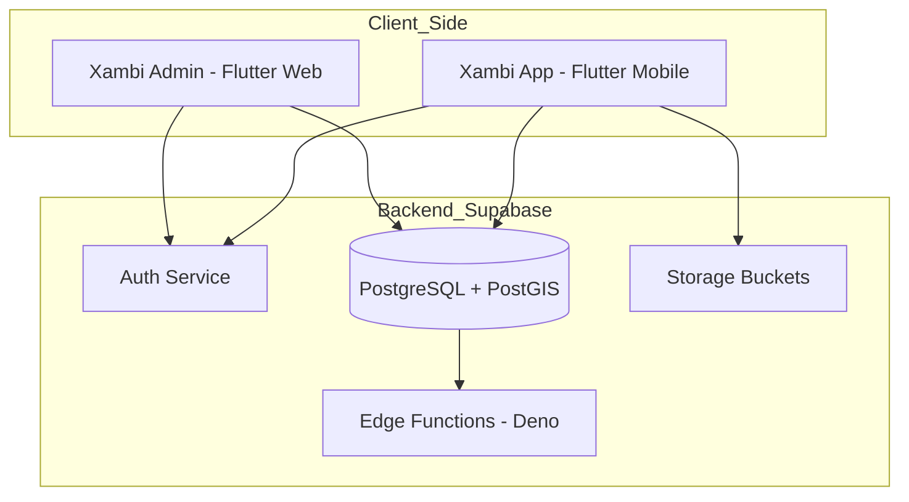
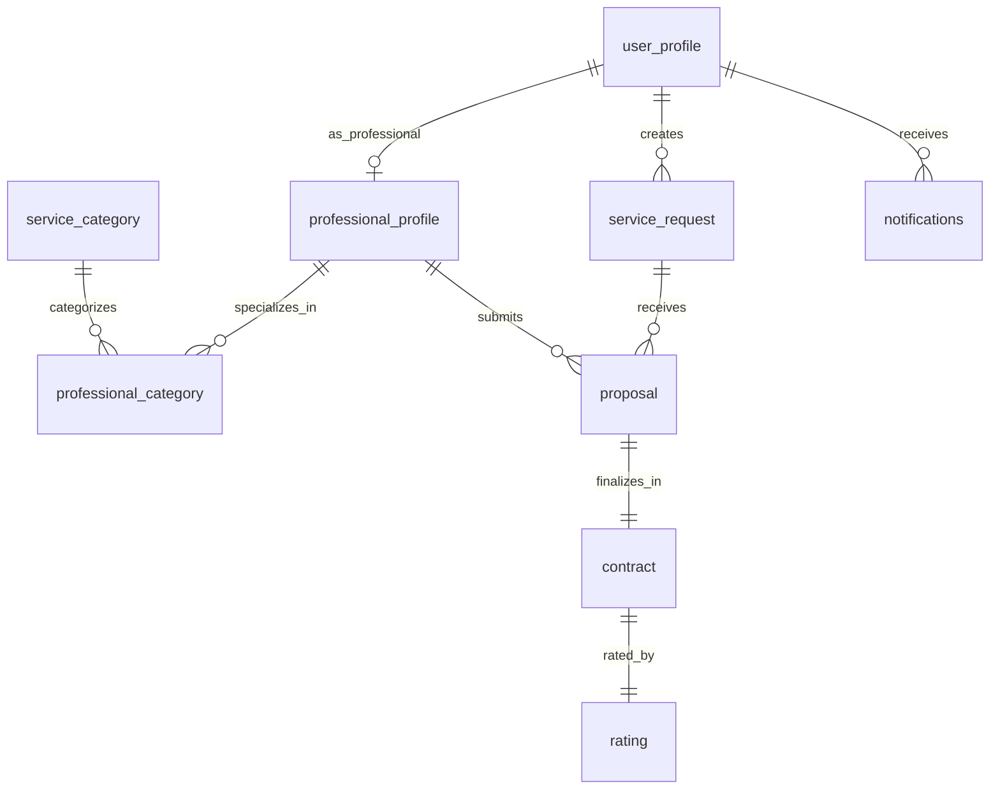

# Proyecto Xambi - Documentación Final
## Índice
0. [Ficha del proyecto](#0-ficha-del-proyecto)
1. [Descripción general del producto](#1-descripción-general-del-producto)
2. [Arquitectura del sistema](#2-arquitectura-del-sistema)
3. [Modelo de datos](#3-modelo-datos)
4. [Especificación de la API](#4-especificación-de-la-api)
5. [Historias de usuario](#5-historias-de-usuario)
6. [Tickets de trabajo](#6-tickets-de-trabajo)
7. [Pull requests](#7-pull-requests)
---
## 0. Ficha del proyecto
### **0.1. Tu nombre completo:**
Carlos Navarro
### **0.2. Nombre del proyecto:**
Xambi
### **0.3. Descripción breve del proyecto:**
Marketplace de servicios bajo demanda que conecta a clientes con profesionales locales (electricistas, plomeros, etc.) a través de una aplicación móvil y un panel administrativo.
### **0.4. URL del proyecto:**
https://tkooizxsdfcyorsfiuow.supabase.co (API Base)
### 0.5. URL o archivo comprimido del repositorio
https://github.com/xaman1990/MarketService
### 0.6. Fase Inicial y Especificaciones
- **Fase Inicial:** El proyecto se armó inicialmente en esta sesión de ChatGPT: [Master Final Project](https://chatgpt.com/g/g-p-694b1bbf832c8191bba6ebae7d281f5a-masterfinal/project)
- **Especificaciones Originales:** Las especificaciones iniciales obtenidas del prompt de ChatGPT se encuentran en el repositorio [MarketService](https://github.com/xaman1990/MarketService) en la ruta `/MarketService/openspec/specs`.
---
## 1. Descripción general del producto
### **1.1. Objetivo:**
Facilitar la contratación de servicios domésticos y profesionales de manera rápida y segura. Xambi aporta valor al digitalizar el mercado de servicios locales, proporcionando confianza a través de perfiles verificados y un sistema de reseñas, solucionando la dificultad de encontrar profesionales de confianza para los clientes y brindando una herramienta de gestión para los proveedores.
### **1.2. Características y funcionalidades principales:**
- **Registro y Perfiles Multi-rol**: Soporte para Clientes y Profesionales con flujos de registro diferenciados.
- **Búsqueda Geocalizada**: Localización de profesionales cercanos mediante integración con mapas y GPS.
- **Solicitud de Servicios**: Los clientes pueden crear solicitudes detalladas (fotos, descripción, urgencia).
- **Sistema de Propuestas**: Los profesionales envían cotizaciones a las solicitudes abiertas.
- **Chat en Tiempo Real**: Comunicación directa entre cliente y profesional para acordar detalles.
- **Verificación de Profesionales**: Proceso de validación de documentos (DNI, antecedentes) realizado por administradores.
- **Panel Administrativo**: Gestión de categorías, auditoría de usuarios, resolución de disputas y facturación.
- **Notificaciones Push**: Alertas sobre nuevas solicitudes, mensajes de chat y actualizaciones de estado.
### **1.3. Diseño y experiencia de usuario:**
La experiencia comienza con una pantalla de inicio donde el usuario visualiza categorías de servicios y profesionales destacados. Un mapa interactivo permite ver la disponibilidad en la zona. El flujo de creación de solicitud es un wizard paso a paso para simplificar la entrada de datos. El profesional tiene un dashboard dedicado para gestionar sus ofertas y agenda.
### **1.4. Instrucciones de instalación:**
1. **Requisitos**: Flutter SDK (3.x), Supabase CLI, Dart SDK.
2. **Backend**:
   - `supabase start` para iniciar el entorno local.
   - `supabase db push` para aplicar las 170+ migraciones.
   - `supabase functions serve` para probar Edge Functions localmente.
3. **Frontend (Mobile)**:
   - `cd apps/mobile`
   - `flutter pub get`
   - `flutter run`
4. **Admin (Web)**:
   - `cd apps/admin`
   - `flutter pub get`
   - `flutter run -d chrome`
---
## 2. Arquitectura del Sistema
### **2.1. Diagrama de arquitectura:**
El sistema sigue una arquitectura de **Monorepo** con separación clara entre aplicaciones y backend.

```mermaid
graph TD
    subgraph Client_Side
        Mobile[Xambi App - Flutter Mobile]
        Admin[Xambi Admin - Flutter Web]
    end
    
    subgraph Backend_Supabase
        Auth[Auth Service]
        Database[(PostgreSQL + PostGIS)]
        Storage[Storage Buckets]
        Functions[Edge Functions - Deno]
    end
    
    Mobile --> Auth
    Mobile --> Database
    Mobile --> Storage
    
    Admin --> Auth
    Admin --> Database
    
    Database --> Functions
```
**Justificación**: Se eligió esta arquitectura por su alta velocidad de desarrollo y escalabilidad. Flutter permite compartir lógica entre móvil y web, mientras que Supabase abstrae la complejidad del backend (Auth, Realtime, DB) permitiendo enfocarse en la lógica de negocio mediante RPCs y RLS. El uso de PostGIS es crítico para las funcionalidades de geolocalización.
### **2.2. Descripción de componentes principales:**
- **App Móvil (Flutter)**: Implementa Clean Architecture (Data, Domain, Presentation) con BLoC para el manejo de estados.
- **Supabase (Backend-as-a-Service)**: Provee la base de datos, autenticación JWT y almacenamiento de archivos.
- **PostgreSQL**: Motor relacional con extensiones para geolocalización y triggers de auditoría.
- **Edge Functions**: Lógica de servidor para integraciones externas (notificaciones push, pagos).
### **2.3. Descripción de alto nivel del proyecto y estructura de ficheros**
El proyecto obedece al patrón de Monorepo:
- `/apps`: Aplicaciones finales (mobile, admin).
- `/packages/shared`: Modelos y utilidades compartidas.
- `/supabase`: Configuración de base de datos y funciones de servidor.
- `/openspec`: Documentación técnica viva y especificaciones de cambios.
### **2.4. Infraestructura y despliegue**
- **Hosting Móvil**: Play Store / App Store.
- **Hosting Web (Admin)**: Cloudflare Pages / Vercel.
- **Backend**: Supabase Cloud (AWS/Azure infra).
- **CI/CD**: GitHub Actions para validación de tests y despliegue automático de migraciones y Edge Functions.
### **2.5. Seguridad**
- **Row Level Security (RLS)**: Cada tabla tiene políticas estrictas para asegurar que un usuario solo acceda a sus propios datos.
- **JWT (JSON Web Tokens)**: Autenticación segura en cada petición API.
- **Auditoría Universal**: Triggers que registran cada cambio (INSERT/UPDATE) en las tablas core para trazabilidad.
- **Variables de Entorno**: Secretos gestionados a través de Supabase Vault y GitHub Secrets.
### **2.6. Tests**
- **E2E Tests**: Suite completa con Cypress para validar flujos de login y creación de solicitudes.
- **Unit Tests**: Pruebas en Dart para la lógica de negocio (Use Cases) en la capa de dominio.
- **Integration Tests**: Validación de RPCs directamente en la base de datos mediante scripts SQL.
---
## 3. Modelo de Datos
### **3.1. Diagrama del modelo de datos:**

```mermaid
erDiagram
    user_profile ||--o| professional_profile : "as_professional"
    professional_profile ||--o{ professional_category : "specializes_in"
    service_category ||--o{ professional_category : "categorizes"
    user_profile ||--o{ service_request : "creates"
    service_request ||--o{ proposal : "receives"
    professional_profile ||--o{ proposal : "submits"
    proposal ||--|| contract : "finalizes_in"
    contract ||--|| rating : "rated_by"
    user_profile ||--o{ notifications : "receives"
```
### **3.2. Descripción de entidades principales:**
- **`user_profile`**: Información básica de usuarios (id, email, full_name, primary_role).
- **`professional_profile`**: Perfil extendido para proveedores (bio, rating_avg, is_verified).
- **`service_request`**: Solicitud de un cliente (category_id, description, lat/long, status).
- **`proposal`**: Oferta económica y mensaje de un profesional a una solicitud.
- **`contract`**: Acuerdo final (agreed_price, status, start/end dates).
- **`notifications`**: Registro de alertas enviadas (title, body, type, data, is_read).
---
## 4. Especificación de la API
Endpoints principales en formato OpenAPI:
```yaml
paths:
  /rpc/get_home_categories:
    post:
      summary: Obtener categorías para la pantalla principal
      responses:
        "200":
          description: Lista de categorías con conteo de solicitudes activas.
  /rpc/accept_proposal:
    post:
      summary: Aceptar una propuesta y crear automáticamente el contrato
      parameters:
        - name: p_proposal_id
          in: body
          type: uuid
      responses:
        "200":
          description: Contrato creado exitosamente.
  /rpc/get_public_professional_profile:
    post:
      summary: Obtener perfil público (seguro) de un profesional
      parameters:
        - name: p_professional_id
          in: body
          type: uuid
      responses:
        "200":
          description: Datos públicos (nombre, bio, rating) sin exponer datos sensibles.
```
---
## 5. Historias de Usuario
**Historia de Usuario 1: Registro de Profesional**
- **COMO** profesional, **QUIERO** crear mi perfil y subir mis documentos, **PARA** poder ser verificado y empezar a ofrecer servicios.
- **Criterios de Aceptación**: Debe permitir subir foto de perfil, DNI y comprobante de domicilio. El estado inicial debe ser "pendiente".

**Historia de Usuario 2: Crear Solicitud de Servicio**
- **COMO** cliente, **QUIERO** describir lo que necesito y mi ubicación, **PARA** recibir propuestas de profesionales cercanos.
- **Criterios de Aceptación**: Se debe poder adjuntar fotos y definir el rango de búsqueda (radius_km).

**Historia de Usuario 3: Chat de Negociación**
- **COMO** usuario, **QUIERO** chatear con la otra parte antes de cerrar el contrato, **PARA** aclarar dudas sobre el precio o el trabajo.
- **Criterios de Aceptación**: Mensajes en tiempo real sincronizados vía Supabase Realtime.
---
## 6. Tickets de Trabajo
**Ticket 1 (Backend): Implementar Lógica de Aceptación de Propuesta**
- **Descripción**: Crear función RPC `accept_proposal` que cierre la solicitud original, marque las demás propuestas como rechazadas y genere el registro en la tabla `contract` de forma atómica.

**Ticket 2 (Frontend): Rediseño de Marcadores en el Mapa**
- **Descripción**: Actualizar los iconos de los profesionales en el mapa para mostrar su categoría mediante avatares personalizados. Implementar clustering si hay más de 10 profesionales en un área pequeña.

**Ticket 3 (Base de Datos): Sistema de Notificaciones Centralizado**
- **Descripción**: Crear la tabla `notifications` y un conjunto de triggers que inserten registros automáticamente cuando cambie el estado de un contrato o llegue un nuevo mensaje de chat.
---
## 7. Pull Requests
**Pull Request 1: 2026-03-14-fix-service-request-notifications**
- **Descripción**: Corrección en los triggers de notificaciones para asegurar el despacho correcto a profesionales cercanos en solicitudes de servicio.

**Pull Request 2: 2026-02-21-us-105-pro-coverage-and-currency**
- **Descripción**: Implementación del radio de cobertura para profesionales y estandarización de monedas en el sistema.

**Pull Request 3: us-103-fix-notification-unread-badges**
- **Descripción**: Ajuste en la lógica de conteo de notificaciones no leídas para el indicador visual en el ícono de la campana.
