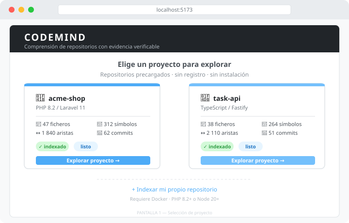
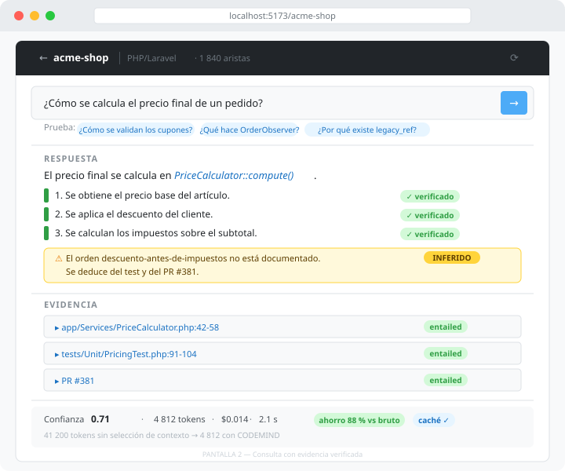
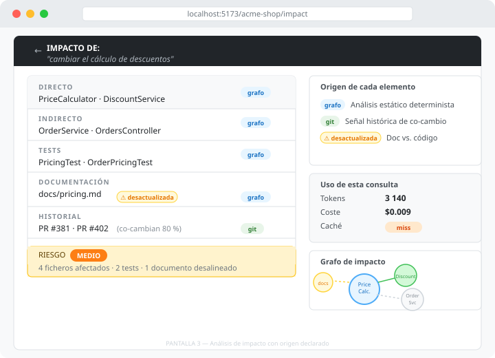
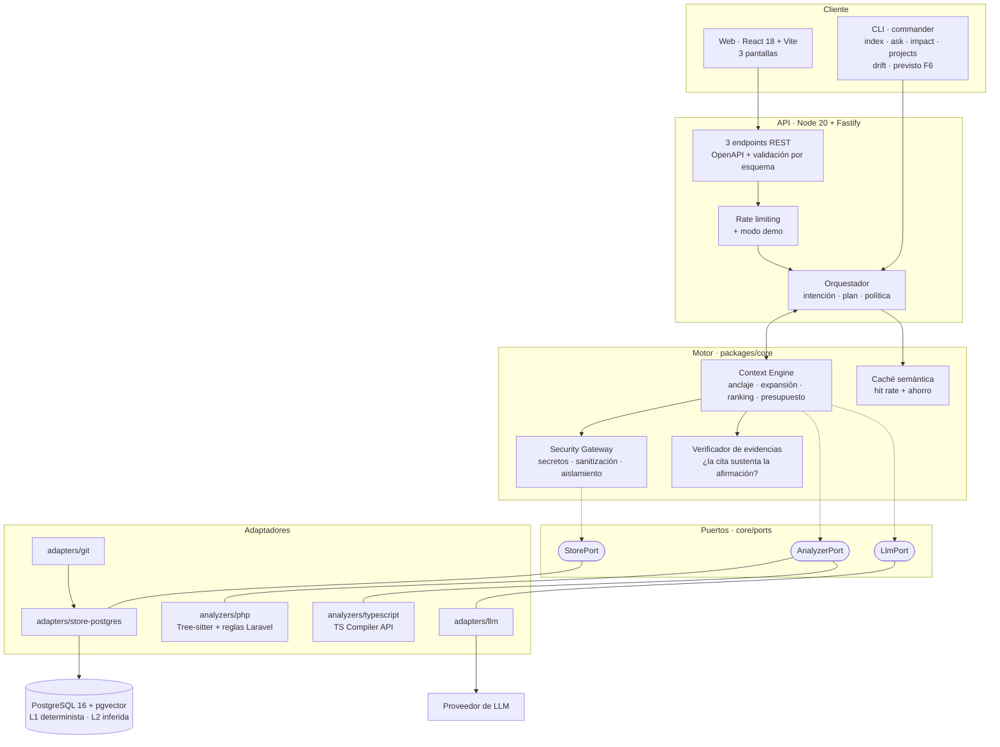
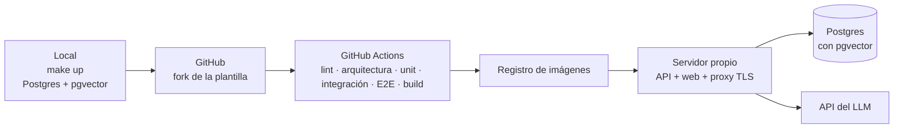
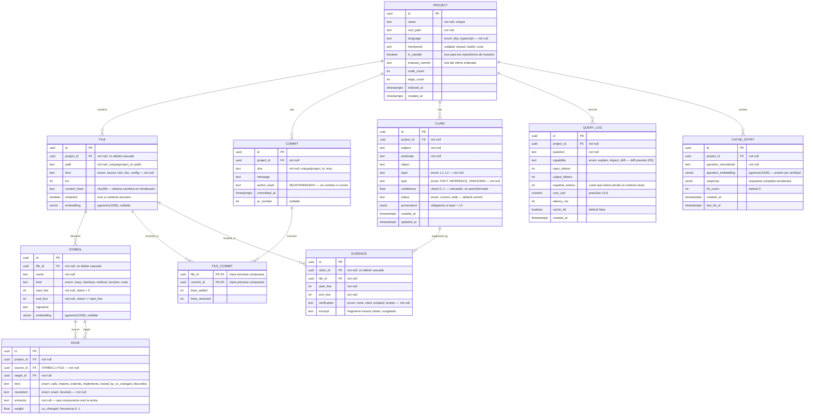

# CODEMIND

**Comprensión de repositorios de código con evidencia verificable**

Proyecto Final del Máster AI4Devs · Cristina Rodríguez Núñez

---

> **Estado de la entrega**
>
> Este documento corresponde a la **Entrega 1 — Documentación técnica** (24 de septiembre de 2026), que es documentación sin código. Describe el sistema tal como está diseñado para construirse.
>
> - **Entrega 2** (22 de octubre): código funcional con el flujo principal operativo.
> - **Entrega 3** (12 de noviembre): funcionalidades completas, tests, despliegue y `prompts.md`.
>
> Las secciones marcadas con *(pendiente)* se completarán en las entregas correspondientes. La sección 7 (Pull Requests) queda necesariamente vacía en esta entrega, ya que aún no hay código.
>
> **Sobre la evidencia de funcionamiento:** la verificación se hará mediante la demo alojada y, sobre todo, mediante el repositorio levantable en local en tres comandos. Los wireframes de las tres pantallas principales están en [1.3](#13-diseño-y-experiencia-de-usuario).

---

## Índice

0. [Ficha del proyecto](#0-ficha-del-proyecto)
1. [Descripción general del producto](#1-descripción-general-del-producto)
2. [Arquitectura del sistema](#2-arquitectura-del-sistema)
3. [Modelo de datos](#3-modelo-de-datos)
4. [Especificación de la API](#4-especificación-de-la-api)
5. [Historias de usuario](#5-historias-de-usuario)
6. [Tickets de trabajo](#6-tickets-de-trabajo)
7. [Pull requests](#7-pull-requests)

---

## 0. Ficha del proyecto

### **0.1. Tu nombre completo:**

Cristina Rodríguez Núñez

### **0.2. Nombre del proyecto:**

CODEMIND

### **0.3. Descripción breve del proyecto:**

CODEMIND indexa un repositorio de código —PHP/Laravel o TypeScript— y construye un grafo de conocimiento a partir de cuatro fuentes que normalmente nadie mantiene relacionadas: el código, el historial de Git, los tests y la documentación. Sobre ese grafo responde dos preguntas: **cómo funciona una parte del proyecto** y **qué se rompería al cambiarla**.

Se diferencia de un asistente de código convencional en tres comportamientos verificables: **verifica que cada cita sustenta realmente lo que afirma** en lugar de limitarse a adjuntarla; **distingue explícitamente lo observado de lo inferido**; y **responde que no lo sabe** cuando no hay evidencia suficiente, en lugar de generar una explicación plausible. Además envía al modelo solo los fragmentos necesarios en lugar del repositorio completo, lo que reduce coste y latencia de forma medida.

### **0.4. URL del proyecto:**

*(pendiente — se publicará en la Entrega 3)*

Demo alojada en servidor propio, con dos repositorios de muestra ya indexados y consultables sin registro ni configuración.

Alternativa equivalente y garantizada: clonar el repositorio y levantarlo en local en tres comandos. Ver [1.4](#14-instrucciones-de-instalación).

### 0.5. URL o archivo comprimido del repositorio

https://github.com/DisTinta/AI4Devs-finalproject — **público**. Fork de `LIDR-academy/AI4Devs-finalproject`.

En el proyecto intervienen **tres repositorios distintos**, y conviene no confundirlos:

| | Repositorio | Visibilidad | Papel |
|---|---|---|---|
| **1** | Este — `AI4Devs-finalproject` | Público | **Es la entrega:** CODEMIND, la herramienta que se evalúa |
| **2** | Un proyecto Laravel propio, ya existente | Privado | Se usa durante el desarrollo para comprobar que el analizador aguanta código real. Es **material de entrada** —como el fichero que se le pasa a un programa— y no forma parte de la entrega |
| **3** | `acme-shop` y `task-api` | Públicos, **incluidos dentro del 1** | Repositorios de muestra pequeños, con su grafo ya construido, en `fixtures/`. Son lo que permite reproducir la demo sin credenciales de nadie |

Que el número 2 sea privado **no obliga a que CODEMIND sea público o privado**: el repositorio analizado es dato de entrada, no el producto entregado. Pero tiene una consecuencia de diseño, y es la que explica el número 3: nadie ajeno puede abrir el número 2, así que no sirve para demostrar nada. Los repositorios de muestra existen para que la evaluación sea reproducible por cualquiera, y por eso viajan dentro de la entrega en lugar de enlazarse desde fuera.

---

## 1. Descripción general del producto

### **1.1. Objetivo:**

#### El problema

Cuando alguien se incorpora a un proyecto que no escribió —o vuelve a uno que no toca desde hace meses— la información que necesita existe, pero está repartida en cuatro sitios que nadie mantiene sincronizados:

- el **código** dice *qué* hace el sistema;
- los **tests** dicen *qué comportamiento se garantiza*;
- el **historial de Git** dice *por qué* se cambió algo;
- la **documentación** dice lo que alguien creyó cierto en su momento.

Los asistentes de código actuales recuperan fragmentos por similitud semántica. Eso funciona bien para «escríbeme una función parecida a esta» y falla para «explícame por qué este descuento se aplica antes de los impuestos», porque la respuesta no está en ningún fragmento: está en la **relación** entre un método, un test y un pull request de hace dos años.

Y falla de una forma concreta y difícil de detectar: cuando no encuentra la respuesta, la genera. Con una cita que parece válida.

#### Qué aporta CODEMIND

Cuatro comportamientos que un asistente convencional no tiene:

1. **Relaciona las cuatro fuentes** en un grafo consultable, en lugar de tratarlas como texto indiferenciado.
2. **Verifica sus propias citas.** No basta con adjuntar `PriceCalculator.php:42`: el sistema comprueba que ese fragmento sustenta la afirmación, y elimina o degrada lo que no pasa la comprobación.
3. **Sabe callarse.** Si no hay evidencia suficiente, responde `UNKNOWN` en lugar de producir una explicación plausible.
4. **Envía solo lo necesario.** Selecciona fragmentos guiándose por el grafo, no ficheros completos, y muestra cuánto contexto ha ahorrado.

#### Independencia del lenguaje

El núcleo no conoce ningún lenguaje: los analizadores son adaptadores que implementan un puerto. Para **demostrarlo y no solo afirmarlo**, el proyecto incluye dos analizadores completos —PHP/Laravel y TypeScript— y el criterio de aceptación del segundo es que su pull request **no modifique una sola línea del núcleo**. Es una afirmación comprobable con `git diff`, no una promesa de diseño.

#### Para quién

Desarrolladores que trabajan sobre código que no escribieron: incorporaciones a un equipo, mantenimiento de sistemas heredados, revisión de un módulo antes de modificarlo.

### **1.2. Características y funcionalidades principales:**

| # | Funcionalidad | Prioridad |
|---|---|---|
| **F1** | Indexar un repositorio **PHP/Laravel o TypeScript** y construir su grafo de conocimiento | must |
| **F2** | Explicar cómo funciona una parte del proyecto, con evidencia verificada por afirmación | must |
| **F3** | Analizar qué se vería afectado por un cambio, separando grafo determinista de señal histórica | must |
| **F4** | **Probar el sistema sin configurar nada**: dos repositorios de muestra ya indexados | must |
| **F5** | Mostrar tokens consumidos, coste y ahorro frente a enviar contexto bruto | must |
| **F6** | Detectar contradicciones entre la documentación y el código | should |
| **F7** | Caché semántica de consultas con métrica de acierto | should |

**F4 merece una nota**. Los wireframes de [1.3](#13-diseño-y-experiencia-de-usuario) muestran el diseño; F4 es la evidencia de que el sistema **funciona realmente**. Se concreta en dos caminos, ambos sin configuración:

- **Camino A — demo alojada.** Servidor propio, los dos repositorios de muestra indexados y consultables sin registro. Un conjunto de preguntas sugeridas se responde desde caché, de forma instantánea y a coste cero; las preguntas libres se ejecutan con límite de uso.
- **Camino B — local, en tres comandos.** Se clona el repositorio, se levanta con `make up` y el sistema queda operativo con los dos proyectos consultables. **Sin PHP instalado, sin clonar repositorios ajenos, sin esperar ningún indexado**, porque los grafos van versionados como semillas SQL.

El camino B es el **garantizado**: no depende de que un servidor esté en pie el día de la revisión.

#### Lo que el producto no hace

Declarado desde el principio: **no modifica código, no genera pull requests, no ejecuta comandos y no sustituye al IDE.** Es un sistema de solo lectura, y eso es una decisión de seguridad antes que una limitación de alcance — ver [2.5](#25-seguridad).

### **1.3. Diseño y experiencia de usuario:**

#### Evidencia de esta sección

Los wireframes de las tres pantallas muestran el flujo completo del producto. La evidencia ejecutable complementa las imágenes:

1. **La demo alojada**, donde se recorre el flujo completo en directo.
2. **El repositorio levantable en local** en tres comandos (ver [1.4](#14-instrucciones-de-instalación)), que produce exactamente la misma experiencia.
3. **`docs/DEMO.md`**: guion de demostración con los comandos exactos y **la salida real de terminal** que producen. Se puede copiar, ejecutar y comparar con lo que uno obtiene.
4. **`npm run verify`**: prueba de humo ejecutable que consulta cada repositorio de muestra y compara con la salida esperada.

#### Las tres pantallas

El principio de diseño es que **la fiabilidad y el coste sean legibles en la propia respuesta**, no un detalle escondido en un log.

**Pantalla 1 — Selección de proyecto**




```
┌────────────────────────────────────────────────────────────┐
│  CODEMIND                                                  │
├────────────────────────────────────────────────────────────┤
│  Elige un proyecto para explorar:                          │
│                                                            │
│  ┌──────────────────────────┐  ┌──────────────────────────┐│
│  │ 🐘 acme-shop             │  │ 📘 task-api              ││
│  │ PHP 8.2 / Laravel 11     │  │ TypeScript / Fastify     ││
│  │ 47 ficheros · 312 símb.  │  │ 38 ficheros · 264 símb.  ││
│  │ 1 840 aristas · 62 commits│  │ 2 110 aristas · 51 commits││
│  │ ✓ indexado · listo       │  │ ✓ indexado · listo       ││
│  └──────────────────────────┘  └──────────────────────────┘│
│                                                            │
│  + Indexar mi propio repositorio                           │
└────────────────────────────────────────────────────────────┘
```

**Pantalla 2 — Consulta**



```
┌────────────────────────────────────────────────────────────┐
│  ← acme-shop        PHP/Laravel  ·  1 840 aristas  ·  ⟳    │
├────────────────────────────────────────────────────────────┤
│  ¿Cómo se calcula el precio final de un pedido?      [→]   │
│                                                            │
│  Prueba:  · ¿Cómo se validan los cupones?                  │
│           · ¿Qué hace OrderObserver?                       │
│           · ¿Por qué existe el campo legacy_ref?           │
├────────────────────────────────────────────────────────────┤
│  RESPUESTA                                                 │
│                                                            │
│  El precio final se calcula en PriceCalculator::compute().  │
│                                                            │
│  1. Se obtiene el precio base del artículo.     ✓ verificado│
│  2. Se aplica el descuento del cliente.         ✓ verificado│
│  3. Se calculan los impuestos sobre el subtotal.✓ verificado│
│                                                            │
│  ⚠ El orden descuento-antes-de-impuestos no está           │
│    documentado. Se deduce del test y del PR #381. INFERIDO  │
│                                                            │
│  EVIDENCIA                                                 │
│  ▸ app/Services/PriceCalculator.php:42-58    entailed      │
│  ▸ tests/Unit/PricingTest.php:91-104         entailed      │
│  ▸ PR #381                                    entailed      │
│                                                            │
│  Confianza 0.71                                            │
│  4 812 tokens · $0.014 · 2.1 s · ahorro 88 % vs contexto   │
│  bruto (41 200 tokens)                          [caché ✓]  │
└────────────────────────────────────────────────────────────┘
```

El valor de confianza que aparece al pie de la respuesta **no lo autoinforma el modelo**: se calcula a partir de señales del grafo y del verificador, y se presenta como indicador ordinal, no como probabilidad. El cálculo está en [3.2](#32-descripción-de-entidades-principales).

**Pantalla 3 — Impacto**



```
┌────────────────────────────────────────────────────────────┐
│  IMPACTO DE: "cambiar el cálculo de descuentos"            │
├────────────────────────────────────────────────────────────┤
│  DIRECTO       PriceCalculator · DiscountService   [grafo] │
│  INDIRECTO     OrderService · OrdersController     [grafo] │
│  TESTS         PricingTest · OrderPricingTest      [grafo] │
│  DOCUMENTACIÓN docs/pricing.md         ⚠ desactualizada    │
│  HISTORIAL     PR #381 · PR #402 (co-cambian 80 %) [git]   │
│                                                            │
│  RIESGO  MEDIO                                             │
│  4 ficheros afectados, 2 tests que cubren el cambio,       │
│  1 documento desalineado desde el commit a3f9c21.          │
│                                                            │
│  3 140 tokens · $0.009                                     │
└────────────────────────────────────────────────────────────┘
```

Cada elemento del informe de impacto indica su **origen**: `[grafo]` para lo derivado del análisis determinista, `[git]` para la señal histórica de co-cambio. Mezclarlos sin distinguir haría el informe imposible de calibrar — quien lo lee no sabría cuánto confiar en cada línea y acabaría desconfiando de todas.

#### Recorrido de demostración

`docs/DEMO.md` lleva en unos cinco minutos a los momentos que definen el producto:

| Paso | Acción | Qué demuestra |
|---|---|---|
| 1 | Elegir `acme-shop` y preguntar por el cálculo del precio | Respuesta con evidencia verificada y ahorro de tokens visible |
| 2 | Pulsar una evidencia | La cita resuelve a un fragmento real del código |
| 3 | Preguntar algo que el repositorio no puede responder | **El sistema responde `UNKNOWN` en lugar de inventar** |
| 4 | Pedir el impacto de cambiar los descuentos | Separación entre grafo determinista y señal histórica |
| 5 | Repetir el paso 1 reformulando la pregunta | Acierto de caché por similitud, coste 0 |
| 6 | Cambiar a `task-api` y repetir el paso 1 | **El mismo núcleo sobre TypeScript**, con grafo más preciso |

El paso 3 es el más característico: un sistema que sabe callarse.

### **1.4. Instrucciones de instalación:**

Al ser el arranque local **la evidencia principal de que el sistema funciona**, esta sección se trata como crítica. El camino corto no requiere nada más que **Docker y Node 20+**: ni PHP instalado, ni clonar repositorios ajenos, ni esperar un indexado.

#### Camino corto — sistema operativo en tres comandos

```bash
git clone https://github.com/DisTinta/AI4Devs-finalproject && cd AI4Devs-finalproject
cp .env.example .env               # añade tu clave de API
make up
```

`make up` encapsula la secuencia completa:

```bash
docker compose up -d               # PostgreSQL 16 + pgvector
npm install
npm run db:migrate                 # esquema
npm run db:seed                    # ← los 2 repositorios de muestra YA indexados
npm run dev                        # API en :3000 · web en :5173
```

Salida esperada al terminar:

```text
✓ postgres        healthy on :5432 (pgvector 0.7)
✓ migrations      12 applied
✓ seed            2 projects loaded
                    acme-shop   php/laravel   47 files · 312 symbols · 1840 edges
                    task-api    typescript    38 files · 264 symbols · 2110 edges
✓ api             http://localhost:3000  (openapi at /docs)
✓ web             http://localhost:5173

Ready. No indexing required — sample graphs are pre-built.
```

#### El mismo flujo por CLI

Sin necesidad de abrir la web:

```bash
npm run cli -- projects
npm run cli -- ask acme-shop "¿Cómo se calcula el precio final de un pedido?"
npm run cli -- impact acme-shop "cambiar el cálculo de descuentos"
npm run cli -- ask task-api "¿Cómo se validan las peticiones entrantes?"
```

#### Camino completo — indexar tu propio repositorio

Solo aquí aparecen requisitos adicionales:

```bash
# PHP/Laravel  → requiere PHP 8.2+ en el PATH
# TypeScript   → nada extra, el analizador usa la API del compilador

npm run cli -- index /ruta/a/tu/repo --name mi-proyecto --language php
npm run cli -- ask mi-proyecto "¿Cómo funciona el módulo de pagos?"
```

#### Verificación de la instalación

```bash
npm run verify
```

Ejecuta una consulta contra cada repositorio de muestra y compara la salida con la esperada. Sirve como prueba de humo para quien evalúa y como test de integración en CI.

#### Variables de entorno

| Variable | Obligatoria | Descripción |
|---|---|---|
| `LLM_API_KEY` | sí | Clave del proveedor de LLM |
| `LLM_MODEL` | no | Modelo para generación (valor por defecto en `.env.example`) |
| `LLM_MODEL_VERIFY` | no | Modelo económico para la verificación de evidencias |
| `DATABASE_URL` | no | Cadena de conexión; por defecto apunta al contenedor local |
| `ALLOWED_REPOS_DIR` | no | Directorio raíz permitido para indexar (ver [2.5](#25-seguridad)) |
| `DAILY_BUDGET_USD` | no | Techo de gasto diario en LLM para la demo pública |

Las semillas se regeneran con `npm run seed:build`, que indexa los dos repositorios de muestra y volca el grafo a `seeds/graph-dump.sql`, versionado en el repositorio. Así la instalación es determinista y no depende de que el indexado se comporte igual en otra máquina.

---

## 2. Arquitectura del Sistema

### **2.1. Diagrama de arquitectura:**


```mermaid
flowchart TB
    subgraph client["Cliente"]
        WEB["Web · React 18 + Vite<br/>3 pantallas"]
        CLI["CLI · commander<br/>index · ask · impact · projects<br/>drift · previsto F6"]
    end

    subgraph api["API · Node 20 + Fastify"]
        REST["3 endpoints REST<br/>OpenAPI + validación por esquema"]
        RATE["Rate limiting<br/>+ modo demo"]
        ORCH["Orquestador<br/>intención · plan · política"]
    end

    subgraph engine["Motor · packages/core"]
        CTX["Context Engine<br/>anclaje · expansión · ranking · presupuesto"]
        SEC["Security Gateway<br/>secretos · sanitización · aislamiento"]
        VER["Verificador de evidencias<br/>¿la cita sustenta la afirmación?"]
        CACHE["Caché semántica<br/>hit rate + ahorro"]
    end

    subgraph ports["Puertos · core/ports"]
        AP(["AnalyzerPort"])
        LP(["LlmPort"])
        SP(["StorePort"])
    end

    subgraph adapters["Adaptadores"]
        PHP["analyzers/php<br/>Tree-sitter + reglas Laravel"]
        TSA["analyzers/typescript<br/>TS Compiler API"]
        GIT["adapters/git"]
        LLMA["adapters/llm"]
        PGA["adapters/store-postgres"]
    end

    PG[("PostgreSQL 16 + pgvector<br/>L1 determinista · L2 inferida")]
    LLM["Proveedor de LLM"]

    WEB --> REST
    CLI --> ORCH
    REST --> RATE --> ORCH
    ORCH <--> CTX
    ORCH --> CACHE
    CTX --> SEC
    CTX --> VER
    CTX -.-> AP
    CTX -.-> LP
    SEC -.-> SP
    AP --- PHP
    AP --- TSA
    LP --- LLMA --> LLM
    SP --- PGA --> PG
    GIT --> PGA
```

#### Patrón: arquitectura hexagonal (puertos y adaptadores) con extracción offline

**Justificación de cada decisión:**

- **El núcleo no conoce ni el lenguaje analizado ni el proveedor de LLM.** Ambos son adaptadores detrás de un puerto. Esto es lo que hace *comprobable* la independencia del lenguaje: el criterio de aceptación del analizador de TypeScript es que su pull request **no toque `packages/core`**. Una afirmación falsable con `git diff`, no una promesa.
- **La extracción es offline y separada de la consulta.** Indexar es lento y determinista; consultar es rápido. Mezclarlas obligaría a reanalizar el repositorio en cada pregunta.
- **El verificador es un paso posterior obligatorio**, no una instrucción dentro del prompt. Pedirle al modelo «cita tus fuentes» produce citas; comprobarlas mecánicamente produce citas válidas. Es la diferencia que justifica el producto.
- **Repository Pattern en la persistencia.** El dominio habla con `StorePort`, no con PostgreSQL. Como efecto secundario útil, las semillas precargadas del arranque local no necesitan ninguna lógica especial.
- **Flujo de control en bucle, no en cascada.** El orquestador y el Context Engine se invocan mutuamente: el agente solicita información de forma incremental en lugar de recibir todo el contexto de una vez. Es lo que permite el presupuesto de tokens.

**Beneficios principales:** sustituibilidad del LLM y de los analizadores; un único grafo reutilizado por las tres capacidades; coste de contexto medible en un solo punto; y un arranque local sin dependencias externas.

#### Sacrificios y déficits

**1. El grafo de llamadas nunca será completo en PHP/Laravel.** Las facades, el contenedor de servicios, `__call`, los atributos mágicos de Eloquent y las rutas resueltas por *string* hacen que parte del grafo real sea invisible para un analizador estático. En TypeScript, en cambio, el compilador resuelve referencias con precisión, así que el mismo núcleo producirá un grafo notablemente mejor. **Ese contraste se mide y se publica** ([2.6](#26-tests)) en lugar de disimularse. Consecuencia práctica: en PHP el sistema depende más de la señal histórica de co-cambio, que no requiere análisis estático.

**2. Indexar cuesta tiempo y dinero por adelantado.** Un asistente basado solo en recuperación semántica no tiene ese coste inicial. La apuesta es que se amortiza en consultas repetidas; las mediciones de [2.6](#26-tests) permiten juzgarlo con datos.

**3. La capa inferida depende del LLM** y hereda su falibilidad. Se acota con procedencia obligatoria y con la regla —impuesta en la base de datos, no solo en el código— de que una inferencia nunca se etiquete como hecho.

**4. La extracción offline implica desfase.** El grafo refleja el último indexado, no el estado actual del repositorio. El indexado incremental lo reduce; no lo elimina.

**5. Tres pantallas no son un producto terminado.** La web es evidencia de funcionamiento y superficie para probar, no una interfaz completa.

**6. El repositorio de validación real es privado**, así que las cifras obtenidas sobre él no son reproducibles por terceros. Por eso las mediciones publicables se hacen sobre los dos repositorios de muestra públicos, y las del privado se reportan aparte como observación.

### **2.2. Descripción de componentes principales:**

| Componente | Tecnología | Responsabilidad |
|---|---|---|
| CLI | TypeScript + `commander` | `index`, `ask`, `impact`, `projects`; `drift` **previsto** (F6) |
| API | Node 20 + **Fastify** + Zod | 3 endpoints REST, validación por esquema, OpenAPI generado |
| Web | React 18 + TypeScript + **Vite** | Selección de proyecto, consulta, impacto |
| Orquestador | TypeScript | Clasifica intención, coordina el bucle, aplica política de seguridad |
| **Analizador PHP** | **Tree-sitter** (`tree-sitter-php`) + reglas Laravel | Ficheros, clases, métodos, rutas, spans, llamadas |
| **Analizador TypeScript** | **TypeScript Compiler API** / `ts-morph` | Lo mismo, con referencias resueltas por el compilador |
| Extractor de Git | `simple-git` | Commits, ficheros modificados, co-cambio, número de PR |
| Context Engine | TypeScript | Anclaje de entidades, expansión por grafo, ranking híbrido, presupuesto de tokens |
| Verificador de evidencias | TypeScript + LLM acotado | Validación sintáctica y semántica de cada cita |
| Caché semántica | TypeScript + pgvector | Reutiliza respuestas de preguntas equivalentes; sostiene el modo demo |
| Security Gateway | `gitleaks` + reglas propias | Secretos antes de indexar, sanitización, aislamiento por proyecto |
| Persistencia | **PostgreSQL 16 + pgvector** | Nodos, aristas, embeddings, afirmaciones, evidencias, uso |

**Sobre `drift`.** Es el comando de la funcionalidad F6, que es *should-have* y vive en la reserva del calendario: puede no entrar en esta versión. Aparece ya en el diagrama, en la CLI y en el enum `capability` de `QUERY_LOG` porque el punto de extensión conviene diseñarlo ahora —añadir un valor a un enum con datos dentro es una migración, no un cambio de código— pero se documenta como **previsto, no entregado**. La distinción no es cosmética: un README que anuncia un comando que el código no tiene es exactamente la divergencia entre documentación y código que F6 existe para detectar.

**Por qué Fastify y no NestJS.** Con tres endpoints y el dominio ya aislado en `packages/core`, la estructura de módulos y la inyección de dependencias de NestJS resuelven un problema que este proyecto no tiene. Fastify aporta validación por esquema y generación de OpenAPI, que es exactamente lo que se necesita.

**Por qué dos tecnologías de análisis distintas.** Tree-sitter da estructura sintáctica pero no resuelve tipos, lo que en PHP obliga a añadir reglas heurísticas para las convenciones de Laravel. En TypeScript, la API del compilador ya devuelve referencias resueltas, así que usarla es más simple *y* más preciso. Que los dos analizadores tengan perfiles de precisión distintos detrás del mismo puerto es justamente lo que valida la arquitectura.

### **2.3. Descripción de alto nivel del proyecto y estructura de ficheros**

```
AI4Devs-finalproject/
├── packages/
│   ├── core/                       # dominio — CERO dependencias de infraestructura
│   │   ├── knowledge/              #   entidades L1/L2, afirmaciones, evidencia, reglas de tipado
│   │   ├── context/                #   Context Engine, ranking, presupuesto de tokens
│   │   ├── verify/                 #   verificador de evidencias
│   │   ├── cache/                  #   caché semántica
│   │   └── ports/                  #   AnalyzerPort · LlmPort · StorePort · GitPort
│   │
│   ├── analyzers/                  # adaptadores de lenguaje
│   │   ├── php/                    #   Tree-sitter + reglas Laravel
│   │   └── typescript/             #   TS Compiler API
│   │
│   ├── adapters/                   # adaptadores de infraestructura
│   │   ├── store-postgres/
│   │   ├── llm/
│   │   └── git/
│   │
│   ├── api/                        # Fastify, rutas, esquemas, rate limiting, modo demo
│   ├── cli/                        # comandos
│   └── web/                        # React + Vite
│
├── fixtures/                       # los 2 repositorios de muestra
│   ├── acme-shop/                  #   Laravel 11, ~47 ficheros, con drift plantado
│   └── task-api/                   #   TypeScript + Fastify, ~38 ficheros
│
├── seeds/
│   └── graph-dump.sql              # grafos ya construidos, versionados
│
├── docs/                           # ── del proyecto ──
│   ├── DEMO.md                     # guion reproducible: comandos + salida real
│   ├── CONFIDENCE.md               # los 6 pesos de la fórmula, con su valor y su motivo
│   ├── TESTING.md
│   ├── DEPLOYMENT.md
│   ├── adr/                        # decisiones de arquitectura
│   ├── ai-sessions/                # transcripciones de las sesiones citadas en prompts.md
│   │                               # ── del harness: se reemplazan al actualizarlo ──
│   ├── base-standards.md
│   ├── documentation-standards.md
│   ├── openspec-tasks-mandatory-steps.md
│   ├── backend-standards.md        #   capas y convenciones del adaptador de stack
│   ├── frontend-standards.md
│   └── project-context.md          #   el único que se escribe a mano y sobrevive
│
├── ai-specs/                       # harness: skills, subagentes y plantillas
├── openspec/                       # especificaciones y cambios (OpenSpec)
├── .claude/ · .cursor/             # referencias al harness + 9 hooks del ciclo de vida
├── .mcp.json                       # MCP del proyecto: Context7 y Playwright
├── CLAUDE.md · AGENTS.md · GEMINI.md · codex.md    # punteros a la doctrina
│
├── images/                         # los 3 wireframes de 1.3, en SVG
│
├── tests/
│   ├── unit/
│   ├── integration/
│   └── e2e/
│
├── .github/workflows/ci.yml
├── docker-compose.yml
├── Makefile
├── .gitignore · .gitattributes
├── readme.md
└── prompts.md
```

**Monorepo con workspaces de npm.** La regla de dependencias es unidireccional y **se comprueba en CI**: `core` no importa nada de `adapters`, `analyzers` ni `api`; solo define los puertos que ellos implementan. Un test de arquitectura con `dependency-cruiser` falla el build si alguien la rompe, de modo que la afirmación de independencia del lenguaje está protegida por el pipeline y no por la buena voluntad.

**Parte del árbol es un harness de desarrollo, no código del producto.** `ai-specs/`, `openspec/`, `.claude/hooks/`, los estándares de `docs/` y los cuatro ficheros de memoria son el andamiaje de trabajo con IA, que se instala desde una herramienta propia descrita en `prompts.md`. Se instalará al arrancar la Entrega 2, junto con el resto del árbol; se documenta ya porque va a formar parte de la estructura del repositorio y omitirlo dejaría esta sección incompleta desde el primer commit de código.

Tiene dos consecuencias que conviene declarar. La primera es operativa: los ficheros de `docs/` que instala el harness **se reemplazan cuando el harness se actualiza**, así que la documentación del proyecto no puede compartir nombre con ellos — de ahí que estén separados en dos grupos en el árbol. La segunda es de diseño, y es deliberada: uno de los hooks comprueba, al guardar un fichero de `packages/core`, que no mencione `adapters/` ni `analyzers/`. Es la **misma** regla que `dependency-cruiser` impone en CI. La redundancia es intencionada: el hook es rápido y local y avisa mientras escribes; el CI es la autoridad y no se puede saltar.

**`docs/` no duplica este README.** Guarda solo lo que aquí no cabe: el guion de demostración con salidas reales, los pesos de la fórmula de confianza, las guías de tests y despliegue, y las transcripciones de las sesiones con IA que `prompts.md` cita.

El Ejemplo 1 oficial reparte las secciones de la plantilla en ocho documentos numerados que la espejan. Aquí se ha evitado a propósito: **cada copia de un contenido es un sitio más donde puede quedar desincronizado**, y detectar exactamente eso es la funcionalidad F6 de este producto. Documentar de una forma que genere el problema que el sistema pretende resolver sería una mala señal sobre el criterio con el que está hecho.

### **2.4. Infraestructura y despliegue**


```mermaid
flowchart LR
    DEV["Local<br/>make up<br/>Postgres + pgvector"]
    GH["GitHub<br/>fork de la plantilla"]
    CI["GitHub Actions<br/>lint · arquitectura · unit · integración · E2E · build"]
    REG["Registro de imágenes"]
    HOST["Servidor propio<br/>API + web + proxy TLS"]
    DB[("Postgres<br/>con pgvector")]
    LLM["API del LLM"]

    DEV --> GH --> CI --> REG --> HOST
    HOST --> DB
    HOST --> LLM
```

#### Proceso de despliegue

Push a la rama → CI ejecuta lint, test de arquitectura, unitarios, integración (con PostgreSQL en contenedor), E2E y build → imagen al registro → despliegue → migraciones → **carga de semillas** → `npm run verify` como prueba de humo.

#### Dos entornos, no uno

| Entorno | Cómo se levanta | Para qué sirve | Garantía |
|---|---|---|---|
| **Local** | `make up` — Docker y Node, nada más | Que quien evalúe pruebe el sistema y la CLI | **Siempre disponible.** No depende de terceros |
| **Demo alojada** | Servidor propio, mismo `docker-compose` más proxy inverso con TLS | Probar sin instalar nada | Sujeta a que el servidor esté en pie |

**Que los dos entornos usen el mismo `docker-compose` es deliberado**: elimina la clase de fallo «en mi máquina funciona». El despliegue no es una configuración distinta, es el mismo artefacto con variables de entorno de producción y un proxy delante (Caddy o Nginx, con certificado automático).

#### Modo demo: sostener una demo pública sin agotar la cuota de API

| Tipo de consulta | Comportamiento | Coste |
|---|---|---|
| Una de las ~12 preguntas sugeridas | Se sirve desde caché precalculada | **0 $** |
| Pregunta libre semánticamente equivalente a una cacheada | Acierto de caché por similitud de embedding | **0 $** |
| Pregunta libre nueva | Se ejecuta, con límite por IP y presupuesto diario global | Acotado |
| Presupuesto diario agotado | Modo solo-caché, con aviso claro en la interfaz | 0 $ |

Así la demo es siempre utilizable, instantánea en el camino habitual, y su coste tiene techo. La métrica de acierto de caché se muestra en la propia interfaz.

#### Secretos

Solo por variables de entorno. `.env` en `.gitignore`, `.env.example` sin valores reales, secretos de despliegue en el gestor del proveedor. Ninguna clave en el repositorio ni en la imagen.

### **2.5. Seguridad**

Referencias normativas: **OWASP Top 10 for LLM Applications (2025)** y **OWASP Top 10 for Agentic Applications (edición 2026)**.

#### 1. El sistema es de solo lectura, por diseño

No existe ninguna herramienta con efectos secundarios: ni escritura de ficheros, ni ejecución de comandos, ni peticiones de red arbitrarias. Es la mitigación más eficaz de la inyección indirecta de prompt, porque **elimina la clase de ataque** en lugar de intentar detectarla. Que CODEMIND no modifique código es una decisión de seguridad antes que una limitación de alcance.

#### 2. Agente en cuarentena

El contenido del repositorio no es de confianza: un comentario, un mensaje de commit o el cuerpo de un issue puede contener instrucciones dirigidas al modelo. El componente que procesa ese contenido **no puede invocar herramientas** y solo devuelve datos conformes a esquema.

```ts
const InferredRuleSchema = z.object({
  description: z.string().max(500),
  location: z.object({ file: z.string(), startLine: z.number().int().positive() }),
  sourceNodeIds: z.array(z.string().uuid()).min(1),
});

const parsed = InferredRuleSchema.safeParse(llmOutput);
if (!parsed.success) {
  audit.log('schema_violation', { stage: 'l2_inference', issues: parsed.error.issues });
  return null;                     // se descarta, no se interpreta
}
```

#### 3. Los secretos no entran en el índice

La detección se ejecuta **antes de indexar**, no antes de enviar al modelo. Un secreto que nunca entra en la base de datos no puede filtrarse por una consulta posterior.

```ts
if (await secretScanner.detect(span.text)) {
  span.text = '[REDACTED: possible secret]';
  span.redacted = true;
  audit.log('secret_redacted', { file: span.file, line: span.startLine });
}
```

#### 4. Validación de entrada y prevención de *path traversal*

Todos los endpoints validan con Zod antes de que los datos lleguen al dominio. Las rutas de repositorio se normalizan y se comprueba que resuelven dentro del directorio permitido.

```ts
const resolved = path.resolve(rootPath);
if (!resolved.startsWith(path.resolve(process.env.ALLOWED_REPOS_DIR!))) {
  throw new ForbiddenPathError(rootPath);
}
```

#### 5. Aislamiento por proyecto

Cada consulta lleva su `project_id` y toda consulta al almacén lo filtra. Ninguna respuesta puede mezclar información de dos repositorios distintos — relevante cuando uno de ellos es privado.

#### 6. Límite de uso y protección de la cuota

*Rate limiting* por IP y presupuesto diario global de gasto en LLM, para que un tercero no pueda agotar la cuota a través de la demo pública. Al alcanzar el techo, el sistema degrada a modo solo-caché con aviso, en lugar de fallar.

#### Riesgos aceptados, declarados

La sanitización de contenido no confiable es **defensa en profundidad, no una barrera**: en un LLM no existe separación real entre datos e instrucciones dentro del prompt, y cualquier detector de inyecciones tiene falsos negativos. Lo que protege de verdad es que el agente no disponga de herramientas con efectos secundarios (práctica 1) y que su salida se valide por esquema (práctica 2).

#### Protección de datos (RGPD)

El historial de Git contiene nombres y direcciones de correo de contribuidores, que son **datos personales**. Medidas adoptadas:

- El autor de un commit se almacena **seudonimizado** (hash con sal). No se indexan nombres ni correos.
- **No se realiza ningún análisis por individuo.** Una funcionalidad candidata —detectar qué personas concentran el conocimiento de un módulo— se descartó por este motivo y porque es sensible en el plano laboral.
- Los repositorios de muestra se generan con autores ficticios.
- El repositorio privado que se usa como validación es un **proyecto personal de la autora**, así que no hay datos de contribuidores ajenos que tratar. La seudonimización se aplica igualmente: es el comportamiento por defecto del sistema, no una excepción concedida a este caso.

### **2.6. Tests**

Los tests forman parte de la **definición de hecho de cada ticket**, no de una fase final.

| Nivel | Herramienta | Qué cubre |
|---|---|---|
| **Arquitectura** | `dependency-cruiser` en CI | Que `core` no importe de `adapters`, `analyzers` ni `api`. **Falla el build si se rompe** |
| Unitarios | **Vitest** | Context Engine (presupuesto respetado, ranking), verificador de evidencias, reglas de tipado hecho/inferencia, caché |
| Integración | Vitest + PostgreSQL en contenedor | Indexado de los dos repositorios de muestra, travesía del grafo, los 3 endpoints, migraciones reversibles |
| **E2E** | **Playwright** | Flujo principal: elegir proyecto → preguntar → respuesta con evidencia verificada y coste. Y el caso `UNKNOWN` |
| **Prueba de humo** | `npm run verify` | Consulta contra cada repositorio de muestra comparada con la salida esperada |
| Estáticos | ESLint + `tsc --noEmit` | En CI |

**`npm run verify` cumple una función doble:** es un test de integración en CI **y** el mecanismo por el que alguien externo comprueba que su instalación local reproduce lo documentado. Los wireframes de [1.3](#13-diseño-y-experiencia-de-usuario) muestran el diseño de las pantallas, no el sistema en marcha, y no se aporta vídeo: **la evidencia de funcionamiento es ejecutable**, y esta es la pieza que la hace comprobable en un solo comando.

**Los dos repositorios de muestra son también el arnés de pruebas.** Uso cuádruple: tests deterministas, demo alojada, arranque local sin dependencias, y caso de la funcionalidad F6. `acme-shop` incluye a propósito una divergencia entre documentación y código, y una regla de negocio implementada y cubierta por tests pero sin documentar.

**Objetivo de cobertura:** >80 % en `packages/core`, >70 % en `analyzers`. No se persigue cobertura alta en adaptadores de infraestructura.

#### Mediciones que se publicarán

**Tabla 1 — Ahorro de contexto** (~20 preguntas por repositorio, revisión manual)

| Repositorio | Contexto bruto | CODEMIND | Ahorro | Correctas (de 20) |
|---|---|---|---|---|
| `acme-shop` (PHP/Laravel) | *(pendiente)* | *(pendiente)* | *(pendiente)* | *(pendiente)* |
| `task-api` (TypeScript) | *(pendiente)* | *(pendiente)* | *(pendiente)* | *(pendiente)* |

**Tabla 2 — Calidad del grafo por analizador** (50 sitios de llamada anotados a mano por lenguaje)

| Analizador | Cobertura | Precisión | Aristas `exact` | Aristas `heuristic` |
|---|---|---|---|---|
| PHP/Laravel | *(pendiente)* | *(pendiente)* | *(pendiente)* | *(pendiente)* |
| TypeScript | *(pendiente)* | *(pendiente)* | *(pendiente)* | *(pendiente)* |

La Tabla 2 es la medición más interesante del proyecto: se espera que TypeScript salga claramente mejor porque el compilador resuelve referencias, mientras PHP depende de heurísticas sobre las convenciones de Laravel. **Medir el límite del propio sistema y explicar por qué existe es mejor material que ocultarlo**, y da contenido concreto al primer sacrificio de [2.1](#21-diagrama-de-arquitectura).

**Limitaciones a declarar junto a las tablas:** una sola ejecución, sin repeticiones; preguntas y anotación realizadas por la autora; repositorios de muestra pequeños y creados a propósito. No son resultados de investigación, son mediciones de producto.

---

## 3. Modelo de Datos

### **3.1. Diagrama del modelo de datos:**


```mermaid
erDiagram
    PROJECT ||--o{ FILE : contains
    PROJECT ||--o{ COMMIT : has
    PROJECT ||--o{ CLAIM : has
    PROJECT ||--o{ QUERY_LOG : records
    PROJECT ||--o{ CACHE_ENTRY : caches
    FILE ||--o{ SYMBOL : declares
    FILE ||--o{ FILE_COMMIT : touched_in
    COMMIT ||--o{ FILE_COMMIT : touches
    SYMBOL ||--o{ EDGE : source
    SYMBOL ||--o{ EDGE : target
    CLAIM ||--|{ EVIDENCE : supported_by
    FILE ||--o{ EVIDENCE : located_in

    PROJECT {
        uuid id PK
        text name "not null, unique"
        text root_path "not null"
        text language "enum: php, typescript — not null"
        text framework "nullable: laravel, fastify, none"
        boolean is_sample "true para los repositorios de muestra"
        text indexed_commit "sha del último indexado"
        int node_count
        int edge_count
        timestamptz indexed_at
        timestamptz created_at
    }

    FILE {
        uuid id PK
        uuid project_id FK "not null, on delete cascade"
        text path "not null, unique(project_id, path)"
        text kind "enum: source, test, doc, config — not null"
        int loc
        text content_hash "sha256 — detecta cambios en reindexado"
        boolean redacted "true si contenía secretos"
        vector embedding "pgvector(1536), nullable"
    }

    SYMBOL {
        uuid id PK
        uuid file_id FK "not null, on delete cascade"
        text name "not null"
        text kind "enum: class, interface, method, function, route"
        int start_line "not null, check > 0"
        int end_line "not null, check >= start_line"
        text signature
        vector embedding "pgvector(1536), nullable"
    }

    EDGE {
        uuid id PK
        uuid project_id FK "not null"
        uuid source_id FK "SYMBOL o FILE — not null"
        uuid target_id FK "not null"
        text kind "enum: calls, imports, extends, implements, tested_by, co_changed, describes"
        text resolution "enum: exact, heuristic — not null"
        text extractor "not null — qué componente creó la arista"
        float weight "co_changed: frecuencia 0..1"
    }

    COMMIT {
        uuid id PK
        uuid project_id FK "not null"
        text sha "not null, unique(project_id, sha)"
        text message
        text author_hash "SEUDONIMIZADO — sin nombre ni correo"
        timestamptz committed_at
        int pr_number "nullable"
    }

    FILE_COMMIT {
        uuid file_id PK, FK "clave primaria compuesta"
        uuid commit_id PK, FK "clave primaria compuesta"
        int lines_added
        int lines_removed
    }

    CLAIM {
        uuid id PK
        uuid project_id FK "not null"
        text subject "not null"
        text predicate "not null"
        text object
        text layer "enum: L1, L2 — not null"
        text type "enum: FACT, INFERENCE, UNKNOWN — not null"
        float confidence "check 0..1 — calculado, no autoinformado"
        text status "enum: current, stale — default current"
        jsonb provenance "obligatorio si layer = L2"
        timestamptz created_at
        timestamptz updated_at
    }

    EVIDENCE {
        uuid id PK
        uuid claim_id FK "not null, on delete cascade"
        uuid file_id FK "not null"
        int start_line "not null"
        int end_line "not null"
        text verification "enum: none, cited, entailed, broken — not null"
        text excerpt "fragmento exacto citado, congelado"
    }

    QUERY_LOG {
        uuid id PK
        uuid project_id FK "not null"
        text question "not null"
        text capability "enum: explain, impact, drift — drift previsto (F6)"
        int input_tokens
        int output_tokens
        int baseline_tokens "coste que habría tenido el contexto bruto"
        numeric cost_usd "precision 10,6"
        int latency_ms
        boolean cache_hit "default false"
        timestamptz created_at
    }

    CACHE_ENTRY {
        uuid id PK
        uuid project_id FK "not null"
        text question_normalized "not null"
        vector question_embedding "pgvector(1536) — acierto por similitud"
        jsonb response "respuesta completa serializada"
        int hit_count "default 0"
        timestamptz created_at
        timestamptz last_hit_at
    }
```

### **3.2. Descripción de entidades principales:**

#### PROJECT

Un repositorio indexado. `indexed_commit` es la clave de la incrementalidad: al reindexar se calcula el diff desde ese SHA y solo se reprocesa lo afectado. `language` selecciona el analizador a través de `AnalyzerPort`. `is_sample` distingue los repositorios de muestra, que se cargan por semilla y se ofrecen en la pantalla de selección.

#### FILE

`content_hash` (SHA-256) permite saltarse ficheros sin cambios en un reindexado, y es el disparador de la invalidación de afirmaciones. `kind` distingue fuente, test, documentación y configuración porque el Context Engine los pondera de forma distinta: para una pregunta de comportamiento, un test pesa más que un README. `redacted` marca ficheros de los que se eliminó un secreto.

#### SYMBOL

Clase, interfaz, método, función o ruta. `start_line` y `end_line` delimitan el **span**, que es la unidad de contexto del sistema: nunca se envía un fichero completo si basta un span. Es el mecanismo concreto del ahorro de tokens.

#### EDGE

La tabla central del grafo. Dos campos la hacen especial:

- **`resolution`** (`exact` | `heuristic`) es obligatorio y decisivo. Solo las aristas `exact` pueden sustentar una afirmación de tipo `FACT`. Una llamada resuelta por convención de Laravel —una facade, un binding del contenedor— es `heuristic` y degrada la afirmación a `INFERENCE`. Es la traducción a esquema de la honestidad epistémica del producto. Se eligió un enum de dos valores en lugar de una puntuación continua porque una puntuación obligaría a fijar umbrales que no se pueden justificar con datos y daría una precisión aparente que el sistema no tiene.
- **`extractor`** permite auditar el origen de cada arista, y es lo que hace comparables los dos analizadores en la Tabla 2 de [2.6](#26-tests).

#### COMMIT

`author_hash` almacena el autor **seudonimizado**, no su nombre ni su correo: el historial de Git contiene datos personales y el producto no necesita identidades para funcionar. `pr_number` se extrae del mensaje del commit cuando está presente.

#### FILE_COMMIT

Tabla de unión entre `FILE` y `COMMIT`, con clave primaria compuesta. Parece un detalle de normalización y no lo es: **es de donde sale el `weight` de las aristas `co_changed`.** Dos ficheros que aparecen juntos en 8 de los 10 commits que tocan a cualquiera de los dos tienen una relación que ningún analizador estático puede ver, y esa señal es la que sostiene el informe de impacto en PHP/Laravel, donde las facades y el contenedor de servicios dejan huecos en el grafo de llamadas (ver el primer sacrificio de [2.1](#21-diagrama-de-arquitectura)).

`lines_added` y `lines_removed` permiten ponderar: un commit que toca dos ficheros con 200 líneas cada uno es una señal más fuerte que uno que corrige una errata en ambos.

#### CLAIM

Unidad de afirmación. `layer` y `type` son campos distintos a propósito: **`layer` dice de dónde salió la afirmación, `type` dice qué garantía tiene.** Fusionarlos impediría la restricción siguiente.

Dos restricciones se imponen **en la base de datos**, no solo en el código, para que un principio de diseño no se erosione con las prisas:

```sql
-- Una afirmación no puede ser un hecho si procede de la capa inferida
ALTER TABLE claim ADD CONSTRAINT fact_only_from_l1
  CHECK (type <> 'FACT' OR layer = 'L1');

-- Toda inferencia debe declarar su procedencia
ALTER TABLE claim ADD CONSTRAINT l2_requires_provenance
  CHECK (layer <> 'L2' OR provenance IS NOT NULL);
```

`provenance` registra modelo, hash del prompt, evidencias de entrada y marca temporal. `status = 'stale'` marca las afirmaciones cuya evidencia ha cambiado; se recalculan de forma perezosa la primera vez que la recuperación las alcanza.

##### Cómo se calcula `confidence`

El comentario del esquema dice *«calculado, no autoinformado»*, y conviene explicar por qué y cómo. **La confianza no la produce el modelo.** Un valor pedido al LLM está mal calibrado por defecto (referencia 4) y no es defendible: parece una medida y es una opinión, con el agravante de que su forma numérica invita a confiar en ella. Aquí se calcula a partir de señales observables del grafo y del verificador:

```text
confidence = σ( w₁·evidencias_norm         # nº de evidencias que superan la verificación
              + w₂·diversidad_de_fuentes   # tipos distintos: código / test / historial / doc
              + w₃·confirmacion_cruzada    # ¿código y test concuerdan?
              + w₄·calidad_de_resolucion   # proporción de aristas 'exact' en la cadena
              + w₅·entailment              # salida del verificador de evidencias
              − w₆·contradiccion )         # existe evidencia contraria
```

σ es una sigmoide, que acota el resultado al intervalo (0, 1). Los pesos se fijan **una sola vez**, a mano, sobre las preguntas de desarrollo de los repositorios de muestra, y se publican con su valor y su motivo en `docs/CONFIDENCE.md`. No se reajustan después contra las preguntas con las que se mide.

**Lo que este número no es.** No está calibrado: no se afirma que `0.71` signifique «acierta el 71 % de las veces». Demostrar eso exigiría curva de fiabilidad y error de calibración esperado sobre un conjunto de test suficiente, que está deliberadamente fuera del alcance de este proyecto. Es un **indicador ordinal**: sirve para comparar dos respuestas del mismo sistema, no como probabilidad. La interfaz lo presenta siempre junto a las evidencias, que son lo que de verdad se puede comprobar.

La propiedad que sí se garantiza es la **reproducibilidad**: dos ejecuciones sobre el mismo grafo y la misma pregunta devuelven el mismo valor, porque ninguno de los seis términos depende de una generación del modelo.

#### EVIDENCE

Cita concreta con span exacto y `excerpt` congelado, para poder detectar después que el código cambió. `verification` guarda el resultado del verificador:

| Valor | Significado |
|---|---|
| `entailed` | El fragmento sustenta la afirmación |
| `cited` | La cita existe, pero no se comprobó el sentido |
| `broken` | La cita no resuelve — **es un fallo del sistema** y se registra como tal |
| `none` | Sin verificar |

#### QUERY_LOG

Sostiene la funcionalidad F5 y la Tabla 1 de [2.6](#26-tests). `baseline_tokens` es lo que hace posible mostrar el ahorro en la propia interfaz: se calcula qué habría costado enviar los ficheros completos en lugar de los spans seleccionados, y el dato viaja con la respuesta en lugar de recalcularse en el cliente.

#### CACHE_ENTRY

Sostiene F7 y el modo demo. El acierto **no es por texto exacto sino por similitud de embedding**, de modo que «¿cómo se calcula el precio?» y «explícame el cálculo del precio final» comparten entrada. `hit_count` alimenta la métrica de acierto que se muestra en la interfaz.

#### Índices

```sql
CREATE INDEX ON edge (project_id, source_id, kind);
CREATE INDEX ON edge (project_id, target_id, kind);
CREATE INDEX ON file (project_id, content_hash);
CREATE INDEX ON file_commit (commit_id);          -- co-cambio: ficheros de un commit
CREATE INDEX ON claim (project_id, status) WHERE status = 'stale';
CREATE INDEX ON file        USING hnsw (embedding vector_cosine_ops);
CREATE INDEX ON symbol      USING hnsw (embedding vector_cosine_ops);
CREATE INDEX ON cache_entry USING hnsw (question_embedding vector_cosine_ops);
```

---

## 4. Especificación de la API

Tres endpoints, el máximo que permite la plantilla, elegidos para cubrir las tres historias de usuario *must-have* sin dejar ninguna a medias.

```yaml
openapi: 3.0.3
info:
  title: CODEMIND API
  version: 1.0.0
  description: |
    Comprensión de repositorios con evidencia verificable.
    Soporta proyectos PHP/Laravel y TypeScript.

servers:
  - url: http://localhost:3000
    description: Local

paths:
  /api/projects/{projectId}/index:
    post:
      summary: Indexa o reindexa un repositorio
      description: |
        El analizador se selecciona según el lenguaje declarado. Por defecto el
        indexado es incremental: solo se reprocesan los ficheros cuyo hash ha
        cambiado, y sus dependientes directos.
      parameters:
        - name: projectId
          in: path
          required: true
          schema: {type: string, format: uuid}
      requestBody:
        required: true
        content:
          application/json:
            schema:
              type: object
              required: [rootPath, language]
              properties:
                rootPath:    {type: string, example: "/repos/acme-shop"}
                language:    {type: string, enum: [php, typescript]}
                incremental: {type: boolean, default: true}
      responses:
        '202':
          description: Indexado iniciado
          content:
            application/json:
              example:
                jobId: "8f3c1e2a-4b71-4c0e-9a12-5d6e7f801234"
                mode: "incremental"
                analyzer: "php-treesitter-laravel"
                filesQueued: 34
                filesSkipped: 13
        '400': {description: Lenguaje no soportado o ruta inválida}
        '403': {description: Ruta fuera del directorio permitido}

  /api/projects/{projectId}/ask:
    post:
      summary: Explica cómo funciona una parte del proyecto
      description: |
        Devuelve una explicación descompuesta en afirmaciones, cada una con su
        tipo (FACT / INFERENCE) y el resultado de la verificación de su
        evidencia. Si no hay evidencia suficiente devuelve UNKNOWN en lugar de
        generar una explicación sin fundamento.
      parameters:
        - name: projectId
          in: path
          required: true
          schema: {type: string, format: uuid}
      requestBody:
        required: true
        content:
          application/json:
            schema:
              type: object
              required: [question]
              properties:
                question:    {type: string, minLength: 5, maxLength: 500}
                tokenBudget: {type: integer, default: 8000, minimum: 1000, maximum: 32000}
                useCache:    {type: boolean, default: true}
            example:
              question: "¿Cómo se calcula el precio final de un pedido?"
              tokenBudget: 8000
      responses:
        '200':
          description: Respuesta con evidencia verificada
          content:
            application/json:
              example:
                answer: "El precio final se calcula en PriceCalculator::compute()."
                statements:
                  - text: "Se aplica el descuento del cliente antes de los impuestos."
                    type: "INFERENCE"
                    verification: "entailed"
                    evidenceIds: ["ev-1", "ev-2"]
                  - text: "El método devuelve el importe redondeado a 2 decimales."
                    type: "FACT"
                    verification: "entailed"
                    evidenceIds: ["ev-1"]
                evidence:
                  - id: "ev-1"
                    file: "app/Services/PriceCalculator.php"
                    startLine: 42
                    endLine: 58
                    verification: "entailed"
                    excerpt: "public function compute(Order $order): Money {"
                  - id: "ev-2"
                    file: "tests/Unit/PricingTest.php"
                    startLine: 91
                    endLine: 104
                    verification: "entailed"
                    excerpt: "$this->assertEquals(90.75, $result->amount());"
                confidence: 0.71
                usage:
                  inputTokens: 4812
                  outputTokens: 380
                  baselineTokens: 41200
                  savingsPct: 88.3
                  costUsd: 0.014
                  latencyMs: 2100
                  cacheHit: false
        '429': {description: Límite de uso alcanzado o presupuesto diario agotado}

  /api/projects/{projectId}/impact:
    post:
      summary: Analiza qué se vería afectado por un cambio
      description: |
        Separa explícitamente lo derivado del grafo determinista de lo derivado
        de la señal histórica de co-cambio, indicando el origen y la fiabilidad
        de cada elemento.
      parameters:
        - name: projectId
          in: path
          required: true
          schema: {type: string, format: uuid}
      requestBody:
        required: true
        content:
          application/json:
            schema:
              type: object
              required: [change]
              properties:
                change:  {type: string, minLength: 5, maxLength: 500}
                maxHops: {type: integer, default: 2, minimum: 1, maximum: 3}
            example:
              change: "cambiar la forma en que se calculan los descuentos"
              maxHops: 2
      responses:
        '200':
          description: Informe de impacto
          content:
            application/json:
              example:
                direct:
                  - {symbol: "PriceCalculator", origin: "graph", resolution: "exact"}
                  - {symbol: "DiscountService", origin: "graph", resolution: "exact"}
                indirect:
                  - {symbol: "OrderService", origin: "graph", resolution: "heuristic", hops: 2}
                  - {symbol: "OrdersController", origin: "graph", resolution: "exact", hops: 2}
                tests:
                  - {symbol: "PricingTest", origin: "graph"}
                  - {symbol: "OrderPricingTest", origin: "graph"}
                docs:
                  - {path: "docs/pricing.md", stale: true, staleSince: "a3f9c21"}
                history:
                  - {pr: 381, coChangeRate: 0.8, origin: "git"}
                  - {pr: 402, coChangeRate: 0.8, origin: "git"}
                risk:
                  level: "MEDIUM"
                  rationale: "4 ficheros afectados, 2 cubiertos por tests, 1 documento desalineado."
                usage: {inputTokens: 3140, costUsd: 0.009, cacheHit: false}

components:
  schemas:
    Error:
      type: object
      properties:
        error:
          type: object
          properties:
            code:    {type: string}
            message: {type: string}
            details: {type: object}
```

Todos los errores usan el formato `Error`. Todos los cuerpos de petición se validan por esquema antes de llegar al dominio.

---

## 5. Historias de Usuario

El proyecto tiene cinco historias *must-have* y dos *should-have*. Se documentan aquí las tres principales; el resto figura al final de la sección.

### **Historia de Usuario 1**

> **Como** desarrollador que se incorpora a un proyecto que no conozco,
> **quiero** indexar el repositorio con un solo comando, sea PHP/Laravel o TypeScript,
> **para** poder empezar a hacer preguntas sobre él sin leerlo entero primero.

**Criterios de aceptación**

- **Dado** un repositorio Laravel válido, **cuando** ejecuto `codemind index <ruta> --language php`, **entonces** se construye el grafo y se informa del número de ficheros, símbolos, aristas y commits procesados.
- **Dado** un repositorio TypeScript válido, **cuando** ejecuto el mismo comando con `--language typescript`, **entonces** obtengo un grafo equivalente **sin que el núcleo haya cambiado** (verificable con `git diff` sobre `packages/core`).
- **Dado** un repositorio ya indexado, **cuando** lo reindexo, **entonces** solo se reprocesan los ficheros cuyo hash ha cambiado y sus dependientes directos, y se informa de cuántos se han saltado.
- **Dado** un fichero que contiene un secreto detectable, **cuando** se indexa, **entonces** el fragmento se almacena redactado y queda registrado en la auditoría.
- **Dado** un repositorio de más de 200 000 líneas, **cuando** lo indexo, **entonces** se advierte de que excede el tamaño soportado en esta versión.
- **Dadas** aristas que el analizador no puede resolver con certeza, **entonces** se marcan como `heuristic` y no como `exact`.
- El progreso es visible durante el proceso.

**Prioridad:** must · **Estimación:** 13 puntos

### **Historia de Usuario 2**

> **Como** desarrollador que va a modificar un módulo,
> **quiero** preguntar en lenguaje natural cómo funciona,
> **para** entender su comportamiento real y poder comprobar cada afirmación en el código.

**Criterios de aceptación**

- **Dada** una pregunta sobre una parte indexada, **cuando** la envío, **entonces** recibo una explicación en la que cada afirmación lleva su tipo (`FACT` / `INFERENCE`) y su estado de verificación.
- **Dada** una afirmación cuya cita no sustenta lo afirmado, **cuando** se genera la respuesta, **entonces** esa afirmación se elimina o se degrada explícitamente, y **no aparece nunca como hecho**.
- **Dada** cualquier evidencia, **entonces** incluye fichero y rango de líneas, y el rango **existe realmente** en el commit indexado. Una cita que no resuelve se registra como fallo del sistema.
- **Dada** una pregunta sin evidencia suficiente en el repositorio, **entonces** el sistema responde que no lo sabe, **en lugar de generar una explicación plausible**.
- **Entonces** se muestran los tokens consumidos, el coste y el ahorro frente a enviar contexto bruto.
- **Dada** una pregunta semánticamente equivalente a otra ya respondida, **entonces** se sirve desde caché y se indica.
- La respuesta llega en menos de 10 segundos para un repositorio de hasta 200 000 líneas.

**Prioridad:** must · **Estimación:** 21 puntos

> El cuarto criterio es el que más carácter da al producto: **un sistema que sabe callarse.** Es también el criterio de mayor riesgo de implementación, junto con el de latencia, ya que la verificación de evidencias añade una llamada al modelo por consulta.

### **Historia de Usuario 3**

> **Como** desarrollador a punto de modificar un componente,
> **quiero** saber qué más se vería afectado,
> **para** no romper nada que no había considerado.

**Criterios de aceptación**

- **Dada** la descripción de un cambio, **entonces** recibo un informe con impacto directo, indirecto, tests afectados y documentación relacionada.
- **Entonces** el informe **separa** lo derivado del grafo determinista de lo derivado del historial de co-cambio, indicando el origen y la resolución de cada elemento.
- **Dado** un documento relacionado que no se ha editado desde que cambió el código que describe, **entonces** se marca como posiblemente desactualizado, indicando desde qué commit.
- **Entonces** se indica un nivel de riesgo **con su justificación**, no solo la etiqueta.
- **Entonces** los elementos se ordenan por relevancia, no alfabéticamente.
- El número de saltos del grafo es configurable, con un máximo de 3.

**Prioridad:** must · **Estimación:** 13 puntos

### Resto del backlog

| HU | Título | Prioridad | Estimación |
|---|---|---|---|
| HU4 | Probar el sistema sin configurar nada: repositorios de muestra precargados y demo de coste cero | must | 8 |
| HU5 | Ver tokens, coste y ahorro frente a contexto bruto | must | 5 |
| HU6 | Detectar contradicciones entre documentación y código | should | 8 |
| HU7 | Caché semántica con métrica de acierto | should | 5 |

---

## 6. Tickets de Trabajo

Uno de backend, uno de frontend y uno de base de datos.

### **Ticket 1** · BACKEND — Verificador de evidencias

**Descripción**

Implementar el componente que valida, para cada afirmación de una respuesta generada, si sus citas la sustentan realmente. Es el diferenciador del producto: sin él, el sistema produce citas bien formadas que pueden ser falsas, que es el modo de fallo más difícil de detectar para el usuario.

**Tareas**

1. Descomponer la respuesta del LLM en afirmaciones atómicas, con guía de descomposición documentada.
2. Validación sintáctica: comprobar que el fichero existe, que el rango existe y que corresponde al `indexed_commit` del proyecto.
3. Validación semántica: comprobar por *entailment* si el span sustenta la afirmación, usando el modelo económico configurado en `LLM_MODEL_VERIFY`.
4. Etiquetar cada afirmación como `entailed`, `cited` o `broken`.
5. Aplicar la política de salida: eliminar lo no sustentado o degradarlo a `INFERENCE` / `UNKNOWN`.
6. Persistir el resultado en `EVIDENCE.verification`; registrar los `broken` como fallo del sistema con alerta en el log.
7. Cachear resultados por par (afirmación, span) para contener el coste.

**Criterios de aceptación**

- Una cita a un fichero o rango inexistente produce `broken` y queda registrada.
- Una cita válida pero irrelevante produce `cited`, nunca `entailed`.
- Ninguna afirmación sin soporte válido llega a la respuesta final como `FACT`.
- El coste añadido por la verificación no supera el **25 %** del coste de la consulta.
- Tests unitarios con los tres casos: cita válida, rota e irrelevante.

**Definición de hecho:** tests en verde, cobertura >80 % del módulo, documentado en [2.2](#22-descripción-de-componentes-principales), coste medido y registrado en `QUERY_LOG`.

**Dependencias:** Context Engine, adaptador de LLM · **Estimación:** 4 días

### **Ticket 2** · FRONTEND — Pantalla de consulta con evidencia y coste

**Descripción**

Implementar la pantalla principal de la web: selección de proyecto, caja de pregunta con sugerencias, respuesta con el tipo y la verificación de cada afirmación, lista de evidencias navegable y panel de coste con el ahorro frente a contexto bruto.

El objetivo de diseño no es que sea bonita: es que **la fiabilidad de la respuesta sea legible de un vistazo**.

**Tareas**

1. `ProjectPicker`: tarjetas de los repositorios de muestra con sus estadísticas, más entrada para repositorio propio.
2. `QueryBox` con preguntas sugeridas (las cacheadas, de coste cero), validación y estado de carga.
3. `AnswerView` que renderiza afirmaciones con distintivo por tipo (`FACT` / `INFERENCE`) y por verificación.
4. `EvidenceList` con fichero, rango y fragmento expandible.
5. `UsagePanel` con tokens, coste, latencia, ahorro porcentual e indicador de acierto de caché.
6. Estado `UNKNOWN` con mensaje explícito de que no hay evidencia suficiente, no una respuesta vacía.
7. Manejo de errores de la API, incluido el 429 de presupuesto agotado, con mensaje comprensible.
8. Accesibilidad: roles ARIA, gestión de foco, contraste suficiente.

**Criterios de aceptación**

- Una afirmación `INFERENCE` se distingue de un `FACT` **sin necesidad de leer texto adicional**, mediante color **más icono más etiqueta**. No solo por color: depender del color excluiría a quien no lo distingue, y sería contradictorio en un sistema cuyo argumento central es la fiabilidad de la información.
- Al pulsar una evidencia se muestra el fragmento exacto citado.
- Con respuesta `UNKNOWN`, la interfaz explica por qué no hay respuesta.
- El ahorro de tokens es visible sin abrir ningún panel adicional.
- Responsive a 1280 px y 768 px.
- Test E2E con Playwright del flujo: elegir proyecto → preguntar → expandir evidencia → ver coste.

**Definición de hecho:** E2E en verde, recorrido documentado en `docs/DEMO.md` con la salida real de cada paso, revisión de accesibilidad básica. Los wireframes de [1.3](#13-diseño-y-experiencia-de-usuario) son la referencia visual; la evidencia ejecutable es la demo alojada y el arranque local.

**Dependencias:** endpoint `/ask` · **Estimación:** 4 días

### **Ticket 3** · BASE DE DATOS — Esquema del grafo, índices e invalidación

**Descripción**

Crear el esquema de PostgreSQL con pgvector, los índices para travesía del grafo y búsqueda semántica, las restricciones que protegen la distinción hecho/inferencia, y el mecanismo de invalidación que sostiene el indexado incremental.

**Tareas**

1. Migraciones para las 10 tablas del modelo de [3.1](#31-diagrama-del-modelo-de-datos), incluida la tabla de unión `FILE_COMMIT` con clave primaria compuesta.
2. Habilitar `pgvector` e índices HNSW sobre `FILE.embedding`, `SYMBOL.embedding` y `CACHE_ENTRY.question_embedding`.
3. Índices compuestos de travesía: `EDGE(project_id, source_id, kind)` y `EDGE(project_id, target_id, kind)`.
4. Restricción `fact_only_from_l1`: impide `type = 'FACT'` cuando `layer = 'L2'`.
5. Restricción `l2_requires_provenance`: exige `provenance` no nulo en la capa inferida.
6. Consulta recursiva (`WITH RECURSIVE`) de travesía a N saltos, con límite de profundidad y detección de ciclos.
7. Trigger que marca `status = 'stale'` en las afirmaciones cuya evidencia apunta a un fichero cuyo `content_hash` ha cambiado.
8. Índice parcial sobre afirmaciones `stale` para que la re-inferencia perezosa sea eficiente.
9. Script `seed:build` que indexa los dos repositorios de muestra y genera `seeds/graph-dump.sql`, versionado en el repositorio.

**Criterios de aceptación**

- La travesía a 2 saltos sobre un grafo de 100 000 aristas responde en menos de 200 ms.
- Intentar insertar un `FACT` con `layer = 'L2'` **falla a nivel de base de datos**, no solo en la aplicación. Hay un test de integración que lo comprueba.
- Al cambiar el `content_hash` de un fichero, sus afirmaciones quedan `stale` automáticamente.
- `npm run db:seed` deja el sistema operativo con los dos proyectos de muestra consultables, **sin necesidad de tener PHP instalado ni de clonar repositorios ajenos**.
- Migraciones reversibles, con test de integración que las aplica y las revierte.

**Definición de hecho:** migraciones en CI, tests de integración en verde, diagrama de [3.1](#31-diagrama-del-modelo-de-datos) actualizado, semillas reproducibles.

**Dependencias:** ninguna — puede empezar primero · **Estimación:** 4 días

---

## 7. Pull Requests

*(pendiente — se completará en la Entrega 3)*

En esta primera entrega no hay código, por lo que no existen pull requests. Se documentarán tres al final del proyecto.

Las ramas de entrega, con las iniciales que exige la mecánica del máster, son `feature/entrega-1-CRN`, `feature/entrega-2-CRN` y `final-project-CRN`.

Candidatas previstas:

| PR | Contenido | Entrega |
|---|---|---|
| **PR 1** | Esquema de base de datos, analizador PHP y extractor de Git | 2 |
| **PR 2** | Context Engine, verificador de evidencias y web mínima — flujo `explain` completo | 2 |
| **PR 3** | **Analizador TypeScript.** El diff no toca `packages/core`, lo que demuestra la independencia del lenguaje afirmada en [2.1](#21-diagrama-de-arquitectura) | 3 |

**PR 3 es la más relevante de documentar**: su valor está precisamente en lo que *no* cambia. Su descripción incluirá la salida de `git diff --stat` como prueba, y la Tabla 2 de [2.6](#26-tests), que solo se puede construir cuando existen los dos analizadores.

**Habrá más de tres.** La disciplina de trabajo del proyecto pide pull requests pequeñas y de un solo objetivo, así que el número real será bastante mayor que tres. Las tres de la tabla son una **selección** —la que cierra cada fase, y entre las tres cubren backend, base de datos y frontend—, no el inventario completo. Lo que describe cada fila es el alcance de su fase, no el de un único commit.

---

## Referencias

Limitadas a las que sostienen decisiones concretas de arquitectura o seguridad.

1. Greshake, K. et al. (2023). *Not What You've Signed Up For: Compromising Real-World LLM-Integrated Applications with Indirect Prompt Injection*. AISec '23. https://arxiv.org/abs/2302.12173
2. Beurer-Kellner, L. et al. (2025). *Design Patterns for Securing LLM Agents against Prompt Injections*. https://arxiv.org/abs/2506.08837
3. Debenedetti, E. et al. (2025). *Defeating Prompt Injections by Design* (CaMeL). https://arxiv.org/abs/2503.18813
4. Tian, K. et al. (2023). *Just Ask for Calibration: Strategies for Eliciting Calibrated Confidence Scores from Language Models Fine-Tuned with Human Feedback*. EMNLP 2023. https://aclanthology.org/2023.emnlp-main.330/
5. OWASP GenAI Security Project. *Top 10 for LLM Applications (2025)*. https://genai.owasp.org/llm-top-10/
6. OWASP GenAI Security Project. *Top 10 for Agentic Applications* (edición 2026). https://genai.owasp.org/resource/owasp-top-10-for-agentic-applications-for-2026/
7. Bohner, S. A., Arnold, R. S. (1996). *Software Change Impact Analysis*. IEEE Computer Society Press.

---

El registro del uso de IA en el proyecto está en [`prompts.md`](./prompts.md).
