## Table of Contents

0. [Project Profile](#0-project-profile)
1. [Product Overview](#1-product-overview)
2. [System Architecture](#2-system-architecture)
3. [Data Model](#3-data-model)
4. [API Specification](#4-api-specification)
5. [User Stories](#5-user-stories)
6. [Work Tickets](#6-work-tickets)
7. [Pull Requests](#7-pull-requests)
8. [Prompt Documentation](#8-prompt-documentation)
9. [Screenshots](#9-screenshots)
10. [Security and OWASP Top 10](#10-security-and-owasp-top-10)

**SaaS business plan:** [PLAN_NEGOCIO.md](./PLAN_NEGOCIO.md) · **Technical roadmap:** [ROADMAP_SAAS.md](https://github.com/BurgosAngel/codigofinal/blob/angel-burgos-r/docs/ROADMAP_SAAS.md)

**Delivery branch:** `finalproject-ABR` · **Reference conversations:** [agent-transcripts/index.md](./agent-transcripts/index.md)

---

## 0. Project Profile

**Author:** Angel Burgos Ruiz

**Project name:** LMS-CMS (Interactive Open Source LMS Platform)

**Brief description:**
Open-source learning management system (LMS) built with Laravel 12. Enables educational institutions, companies, and trainers to create, manage, and distribute online courses with interactive content through a drag & drop plugin system, dynamic assessments, enrollment management, academic calendar, user profile, and bilingual interface (ES/EN).

**Project URL (local):** `http://localhost:8080` (Docker)

**Deployment URL (ASEMAD hosting):** [https://proyectolms.asemad.es/](https://proyectolms.asemad.es/) — cPanel/FTP production instance

**Code repository:** [BurgosAngel/codigofinal](https://github.com/BurgosAngel/codigofinal) — implementation in `codigofinal/lms-cms-laravel12` (branch `angel-burgos-r`)

**Documentation delivery (this folder):** `AI4Devs-finalproject` on branch `finalproject-ABR`

**Prompt documentation:** [prompts.md](./prompts.md)

**SaaS business plan:** [PLAN_NEGOCIO.md](./PLAN_NEGOCIO.md)

**Transcript index:** [agent-transcripts/index.md](./agent-transcripts/index.md)

### Workspace layout (monorepo)

The course workspace groups the **LMS implementation**, **FTP deploy packages**, and **final project documentation**:

```text
repositorio/                          # Local monorepo (AI4Devs course)
├── AI4Devs-finalproject/             # Final delivery docs (branch finalproject-ABR)
│   ├── readme.md, prompts.md, PLAN_NEGOCIO.md, seguridad.md
│   ├── agent-transcripts/            # Exported Cursor conversations
│   └── docs/screenshots/             # UI captures for documentation
├── codigofinal/
│   ├── lms-cms-laravel12/            # Main Laravel 12 LMS (branch angel-burgos-r)
│   ├── deploy-moodle52-features/     # FTP pack: login 5.2, gradebook, AI, upgrade assistant
│   ├── deploy-moodle52-comms/        # FTP pack: notifications, messages, mail, topbar
│   ├── deploy-proyectolms-roles/     # FTP pack: role hierarchy + seed users
│   ├── deploy-highlight-quill/       # FTP pack: highlight colors in lesson editor
│   └── deploy-responsive-all-screens/ # FTP pack: drawer nav, calendar topbar, all roles/devices
└── [other AI4Devs course modules]    # backend, frontend, design, cicd, etc.
```

**Separation of concerns:**

| Location | Purpose |
|----------|---------|
| `lms-cms-laravel12` | Full application source, Docker, tests, migrations |
| `deploy-*` | Minimal file sets + `INSTALAR.md` for cPanel/FTP on `proyectolms.asemad.es` |
| `AI4Devs-finalproject` | Academic deliverable: product doc, prompts, screenshots, security analysis |

---

## 1. Product Overview

### 1.0. SaaS Vision (business plan)

**SaaS** platform aimed at bootcamps, tech companies, and independent educators to **create, share, and monetize technology courses** with **integrated AI** (per-lesson tutor, analytics, API for external LMS). The current technical MVP covers **Phase 1** of the roadmap; commercial plans at `/pricing`.

| Plan | Price | Status |
|------|-------|--------|
| Basic (students) | €4.99/month | Defined in app |
| Pro (creators) | €29/month | Defined in app |
| Enterprise | €299–999/month | Defined in app |

Detailed roadmap: [ROADMAP_SAAS.md](https://github.com/BurgosAngel/codigofinal/blob/angel-burgos-r/docs/ROADMAP_SAAS.md).

### 1.1. Objective

Provide a modern, modular, open-source LMS platform that enables the creation and consumption of courses with rich content through plugins, interactive assessments, differentiated roles (teacher/student), enrollment management, progress tracking, academic calendar, and localized user experience.

### 1.2. Main features and functionality

- **Course management:** Create, edit, publish, and organize courses with ordered lessons.
- **Drag & drop plugin system:** Interactive blocks (text, image, video, code, quick quiz, matching, fill-blanks, forum, file upload, H5P) with visual editor, reordering, and preview.
- **Dynamic assessments:** Quizzes with configurable multiple-choice options, automatic grading, and scoring.
- **Enrollment management:** Drag & drop panel to assign/remove users in courses.
- **Academic calendar:** Monthly view with lesson events (`due_at`), enrollments, and custom teacher events; Moodle layout for teachers at `/calendar`.
- **Academic events (teacher):** Create, edit, and delete events at `/calendar/events/*` (teacher role only).
- **Internationalization (i18n):** Interface in Spanish and English via session (`/locale/{es|en}`) and `lang/*/lms.php` files.
- **Unified sidebar navigation:** Home, My Courses, Calendar (+ Log out) on all authenticated pages; «New event» link only on `/calendar` for teachers.
- **Responsive UI (all screens):** Mobile sidebar drawer (≤900px), overlay menu, mobile search toggle, responsive teacher calendar topbar with comms icons, secondary nav strip on narrow viewports; verification checklist in `deploy-responsive-all-screens/VERIFICAR-PANTALLAS.md`.
- **User profile:** Edit name, email, and avatar.
- **Progress tracking:** Record of lessons completed per student.
- **Differentiated dashboards:** Teacher and student views; coordinator and admin use the teacher dashboard and Moodle calendar shell (`hasRoleAtLeast(Teacher)`).
- **Multimedia file uploads:** Local videos with configured limits (128 MB).
- **Moodle 5.2-inspired pack:** Redesigned login, multi-grader gradebook, AI tutor actions (`summarize`, `explain`, `tutor_hint`), Smart Upgrade Assistant (`/upgrade-assistant`).
- **Communications (comms):** In-app notifications, private messaging, internal mail (`/comms/*`) with topbar shortcuts.
- **Grill me:** Cursor command + in-app guided interrogation for teachers (`POST /ai/grill/*`) to validate plans before building.
- **Smart Report plugin:** SIIU-oriented reporting and CSV export for Spanish universities.
- **Role hierarchy:** `student`, `teacher`, `coordinator`, `admin` with policies and enrollment rules.
- **Production deploy:** cPanel/FTP workflow documented for `proyectolms.asemad.es`.

### 1.3. Design and user experience

Main flow:
1. User accesses `/login` or `/register` (language selector available).
2. Teacher creates course → adds lessons → manages plugins → enrolls students → publishes course → views calendar and creates events.
3. Student accesses course → views lesson with plugins → answers quiz/interacts.
4. System calculates score and records progress.

### 1.4. Installation instructions

**Requirements:** Docker and Docker Compose

**Installation with Docker:**
```bash
git clone -b angel-burgos-r https://github.com/BurgosAngel/codigofinal.git
cd codigofinal
cp .env.example .env
docker compose up -d
docker compose exec app composer install
docker compose exec app php artisan key:generate
docker compose exec app php artisan migrate --seed
docker compose exec app php artisan storage:link
```

**Access:**

| Environment | URL | Notes |
|-------------|-----|-------|
| Local (Docker) | [http://localhost:8080](http://localhost:8080) | Development stack |
| phpMyAdmin | [http://localhost:8082](http://localhost:8082) | Local DB admin |
| **Production (ASEMAD)** | [https://proyectolms.asemad.es/](https://proyectolms.asemad.es/) | Hosted on cPanel at ASEMAD |

**Language switch (local):** `http://localhost:8080/locale/es` or `/locale/en` · **Production:** [https://proyectolms.asemad.es/locale/es](https://proyectolms.asemad.es/locale/es) or `/locale/en`

**Test credentials (after seed):**
- Teacher: `teacher@example.com` / `password123`
- Student: `student@example.com` / `password123`

**Local installation (without Docker):**
```bash
composer install
cp .env.example .env
php artisan key:generate
php artisan migrate --seed
php artisan storage:link
php artisan serve
```
Requires: PHP 8.3+, Composer, MySQL 8.4.

**Production deployment (ASEMAD hosting):**

The live application is available at **[https://proyectolms.asemad.es/](https://proyectolms.asemad.es/)**. Deploy uses cPanel/FTP (not Docker): see `codigofinal/lms-cms-laravel12/docs/DEPLOY-CPANEL-ASEMAD.md` and FTP packages under `codigofinal/deploy-*` (latest responsive pack: `deploy-responsive-all-screens/`).

---

## 2. System Architecture

### 2.1. Architecture diagram

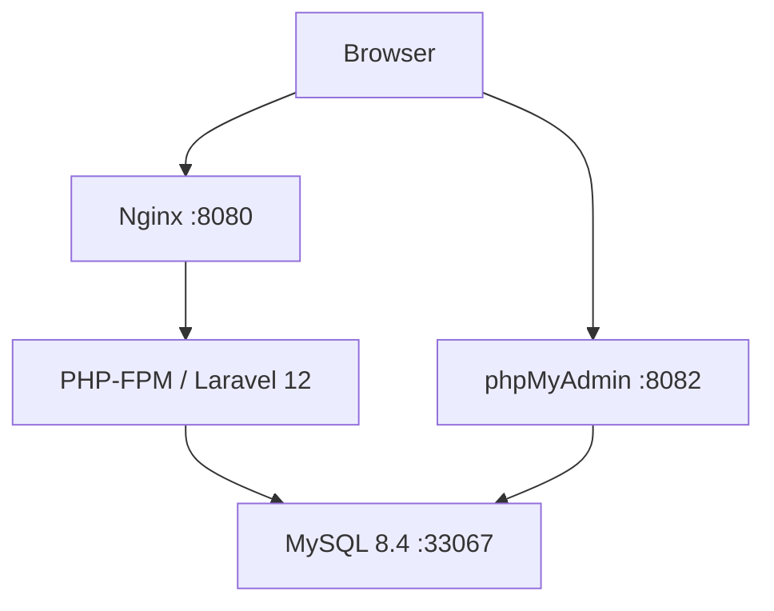
```mermaid
graph TD
    Browser[Browser] --> Nginx[Nginx :8080]
    Nginx --> PhpFpm[PHP-FPM / Laravel 12]
    PhpFpm --> MySQL[MySQL 8.4 :33067]
    Browser --> PMA[phpMyAdmin :8082]
    PMA --> MySQL
```

**Pattern:** MVC (Model-View-Controller) with Laravel 12.

### 2.2. Main components

| Layer | Technology |
|-------|------------|
| Frontend | Blade + CSS (`lms.css`, `calendar*.css`, `moodle52.css`, `lms-comms.css`, `auth.css`, `topbar-brand-asemad.css`) + JS (`lms.js`, `lms-comms.js`, `lms-ai.js`) |
| Backend | Laravel 12 (PHP 8.3 local / 8.2+ production) |
| i18n | `lang/en/lms.php`, `lang/es/lms.php`, middleware `SetLocale` |
| Database | MySQL 8.4 |
| Web server | Nginx 1.27 (Docker) / Apache (cPanel production) |
| E2E tests | Playwright (`playwright/tests/*.spec.ts`) |

### 2.3. Project structure (`codigofinal/lms-cms-laravel12`)

```text
lms-cms-laravel12/
├── app/
│   ├── Http/Controllers/           19 feature controllers (+ base Controller)
│   ├── Http/Middleware/            EnsureRole, SetLocale
│   ├── Models/                     28 Eloquent models
│   ├── Services/                   13 services (AI, comms, gradebook, calendar…)
│   ├── Policies/                   Course, Lesson
│   └── Enums/                      UserRole, SubscriptionPlan
├── config/                         lms.php, saas.php, grill-me.php
├── database/migrations/            29 migrations
├── resources/views/
│   ├── comms/                      notifications, messages, mail
│   ├── gradebook/                  multi-grader UI
│   ├── upgrade/                    Smart Upgrade Assistant
│   ├── components/                 ai-assistant (Grill me)
│   ├── calendar/, courses/, lessons/, plugins/, layouts/
│   │   └── partials/               mobile-nav-toggle, moodle-mobile-nav, topbar-comms, sidebar-nav
├── public/css|js/                  lms, comms, moodle52, auth, calendar-teacher assets
├── routes/web.php
├── tests/Feature|Unit/             PHPUnit + GrillMeTest
├── playwright/                     E2E automation + screenshot script
├── .cursor/                        commands (grill-me), skills, rules
├── docker-compose.yml              ports 8080, 8082, 33067
└── docs/                           DEPLOY-CPANEL-ASEMAD.md, ROADMAP_SAAS.md
```

### 2.4. Infrastructure and deployment

**Docker Compose** with 4 services:

| Service | Image | Port |
|---------|-------|------|
| app | PHP 8.3 FPM Alpine (local build) | — |
| web | nginx:1.27-alpine | 8080 |
| db | mysql:8.4 | 33067 |
| phpmyadmin | phpmyadmin:5-apache | 8082 |

### 2.5. Security

- Password hashing (bcrypt)
- Middleware `EnsureRole` (`role:teacher` / `role:student`)
- Middleware `SetLocale` (only `en` | `es`)
- CSRF protection on forms
- Input validation in controllers
- Calendar event routes restricted to teachers

### 2.6. Tests

| Test | Description |
|------|-------------|
| `LmsFlowTest` | Flow: registration → course → lesson → quiz |
| `LocaleTest` | Language switch and sidebar text |
| `CalendarTest` | Calendar access, teacher/student layout, «New event» link |
| `CalendarEventTest` | Academic event CRUD (teacher) |
| `LessonCastTest` | JSON casting of lesson content |
| `GrillMeTest` | Grill me API (teacher, policy, session flow) |
| Playwright specs | Guest, auth, dashboard, courses, calendar, plugins, enrollments, lessons |

Run in Docker:
```bash
docker compose exec app php artisan test
```

---

## 3. Data Model

### 3.1. Model diagram (excerpt)

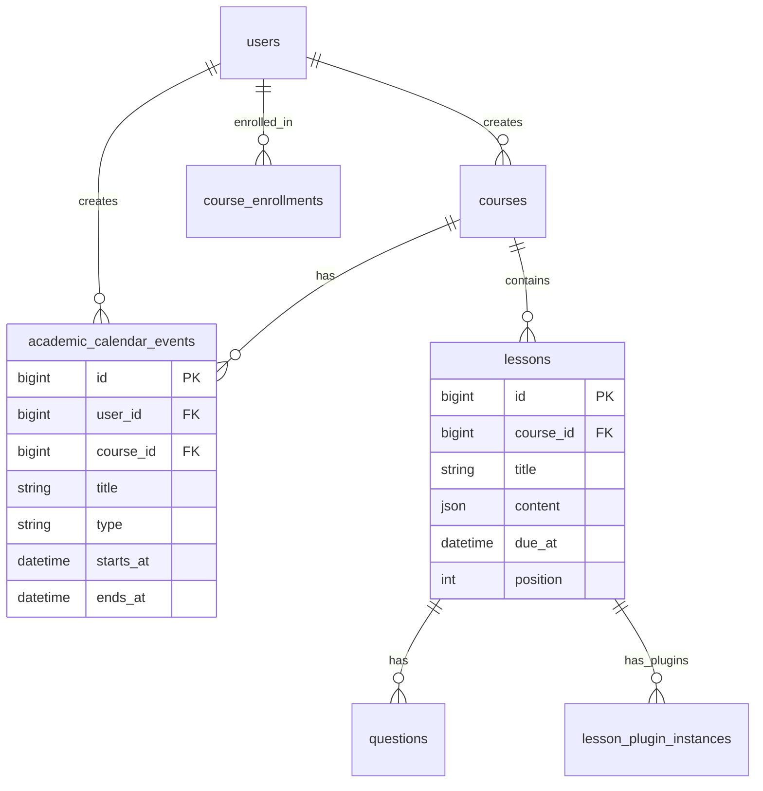
```mermaid
erDiagram
    users ||--o{ courses : creates
    users ||--o{ academic_calendar_events : creates
    users ||--o{ course_enrollments : enrolled_in
    courses ||--o{ lessons : contains
    courses ||--o{ academic_calendar_events : has
    lessons ||--o{ questions : has
    lessons ||--o{ lesson_plugin_instances : has_plugins

    academic_calendar_events {
        bigint id PK
        bigint user_id FK
        bigint course_id FK
        string title
        string type
        datetime starts_at
        datetime ends_at
    }

    lessons {
        bigint id PK
        bigint course_id FK
        string title
        json content
        datetime due_at
        int position
    }
```

### 3.2. Main entities

| Entity | Description |
|--------|-------------|
| **users** | Users with `teacher` or `student` role |
| **courses** | Courses with draft/published status |
| **lessons** | Ordered lessons; `due_at` for calendar |
| **questions** | Quiz questions (JSON options, min. 2) |
| **quiz_results** | Score per lesson and user |
| **progress** | Completed lessons |
| **course_enrollments** | Enrollments with role |
| **academic_calendar_events** | Custom teacher events |
| **plugin_definitions** … **lesson_layout_snapshots** | Plugin system (see migrations 2026_05_07_*) |

---

## 4. API Specification

Web routes in `routes/web.php` (no separate REST API).

### Public / locale routes

| Method | Route | Action |
|--------|-------|--------|
| GET | `/locale/{locale}` | Change language (es/en) |
| GET/POST | `/login`, `/register` | Authentication |

### Authenticated routes (any role)

| Method | Route | Action |
|--------|-------|--------|
| GET | `/dashboard` | Dashboard by role |
| GET | `/calendar` | Calendar (teacher or student view) |
| GET/PATCH | `/profile/edit`, `/profile` | User profile |
| GET | `/courses` | Course listing |
| GET | `/upgrade-assistant` | Smart Upgrade Assistant checks |
| POST | `/logout` | Log out |

### Communications (`/comms`, authenticated)

| Method | Route | Action |
|--------|-------|--------|
| GET | `/comms/notifications` | Notification center |
| GET | `/comms/messages` | Private conversations |
| GET/POST | `/comms/mail`, `/comms/mail/compose` | Internal mail (incl. reply) |

### AI (`/ai`, authenticated)

| Method | Route | Action |
|--------|-------|--------|
| GET/POST | `/ai/policy` | AI policy status / accept |
| POST | `/ai/action` | `summarize`, `explain`, `tutor_hint` |
| POST | `/ai/grill/start`, `/respond`, `/finish` | Grill me interrogation (teachers) |

### Teacher routes (`role:teacher`)

| Method | Route | Action |
|--------|-------|--------|
| GET | `/calendar/events/create` | New event form |
| POST | `/calendar/events` | Save event |
| GET/PUT/DELETE | `/calendar/events/edit?id=` | Edit / update / delete event |
| POST | `/courses` | Create course |
| GET | `/courses/{course}` | Course detail |
| POST | `/courses/{course}/publish` | Publish |
| GET | `/courses/{course}/enrollments` | Enrollment panel |
| GET/POST/DELETE | `/courses/{course}/enrollments/*` | JSON enrollment APIs |
| POST | `/lessons` | Create lesson |
| GET | `/lessons/{lesson}/edit` | Lesson editor + plugins + quiz |
| GET/POST/PATCH/DELETE | `/plugins/*`, `/lessons/{lesson}/plugins/*` | Plugin system |
| GET | `/courses/{course}/grades` | Multi-grader gradebook |
| PATCH/POST | `/courses/{course}/grades/instances/*` | Grader settings and marks |

### Student routes (`role:student`)

| Method | Route | Action |
|--------|-------|--------|
| GET | `/lessons/{lesson}` | View lesson |
| POST | `/quiz/submit` | Submit quiz |
| POST | `/plugins/instances/{instance}/interact` | Plugin interaction |
| POST | `/plugins/instances/{instance}/submit` | Gradable submission |

---

## 5. User Stories

**HU-1:** As a teacher, I want to create courses to organize my educational content.

**HU-2:** As a teacher, I want to add lessons to a course to structure the material.

**HU-3:** As a teacher, I want to publish a course so students can access it.

**HU-4:** As a teacher, I want to add interactive plugins with drag & drop.

**HU-5:** As a teacher, I want to manage quiz questions dynamically.

**HU-6:** As a teacher, I want to assign users to a course via drag & drop.

**HU-7:** As a student, I want to view published courses.

**HU-8:** As a student, I want to view lessons with interactive plugins.

**HU-9:** As a student, I want to answer quizzes and receive a score.

**HU-10:** As a student, I want to view my progress.

**HU-11:** As a teacher, I want to view a monthly academic calendar and create my own events to plan the course.

**HU-12:** As a user, I want to change the interface language (ES/EN) and see translated navigation (Home, My Courses, Calendar).

**HU-13:** As a user, I want notifications, messages, and internal mail from the topbar (`/comms/*`).

**HU-14:** As a teacher, I want a multi-grader gradebook and AI-assisted lesson tools (tutor + Grill me).

**HU-15:** As an operator, I want the Upgrade Assistant to verify DB tables and files before deploying Moodle 5.2 features.

**HU-16:** As a user on mobile or tablet, I want a collapsible navigation menu and readable layouts on every screen (dashboard, courses, calendar, comms, profile) without overlapping topbar elements.

### 5.1 MoSCoW prioritization (excerpt)

**Must-Have:** authentication, course/lesson CRUD, enrollment, student consumption, assessment.

**Should-Have:** advanced plugin editor, academic calendar, full i18n, user profile.

---

## 6. Work Tickets

**Ticket 1 — Authentication and roles**

**Ticket 2 — Course and lesson CRUD**

**Ticket 3 — Assessment system (dynamic quiz)**

**Ticket 4 — Drag & drop plugin system**

**Ticket 5 — Enrollment management**

**Ticket 6 — Docker infrastructure and uploads**

**Ticket 7 — Academic calendar**
- `CalendarService` + events from lessons, enrollments, and `academic_calendar_events`
- Views `calendar/index`, `calendar/teacher`, layout `calendar-moodle`
- Event CRUD: `CalendarEventController`, migration and `AcademicCalendarEvent` model
- `lessons.due_at` field and data in `LmsDemoSeeder`
- Tests `CalendarTest`, `CalendarEventTest`

**Ticket 8 — Internationalization and navigation**
- `lang/en/lms.php`, `lang/es/lms.php`, `SetLocale`, `LocaleController`
- Unified `sidebar-nav` partial; `language-switcher`, `i18n-js` + `window.lmsT()` in `lms.js`
- «New event» link conditioned on `calendar` route and teacher role
- Test `LocaleTest`

**Ticket 9 — Moodle 5.2 pack**
- Login redesign (`auth.blade.php`, `auth.css`), gradebook tables and UI
- `AiController`, `UpgradeAssistantController`, `moodle52.css`, `lms-ai.js`
- Deploy package `deploy-moodle52-features`

**Ticket 10 — Communications**
- `CommsController`, notification/messaging/mail services, comms migrations
- Topbar partial, `lms-comms.js/css`, reply-to-mail flow
- Deploy package `deploy-moodle52-comms`

**Ticket 11 — Grill me**
- `GrillMeService`, Cursor command/skill, in-app UI in `ai-assistant` component
- `tests/Feature/GrillMeTest.php`

**Ticket 12 — Production deploy (cPanel)**
- `DEPLOY-CPANEL-ASEMAD.md`, `diag.php`, role/FTP packages, remote i18n merge scripts

**Ticket 13 — Responsive UI (all screens and roles)**
- Mobile sidebar drawer + overlay in `lms.css` / `lms.js`
- Responsive calendar topbar with comms + `moodle-mobile-nav` strip
- `DashboardController` / `CalendarController`: staff roles see teacher views
- FTP package `deploy-responsive-all-screens/` with `INSTALAR.md` and `VERIFICAR-PANTALLAS.md`

---

## 7. Pull Requests

**PR 1 — Authentication and roles**

**PR 2 — Course and lesson management**

**PR 3 — Assessments and progress**

**PR 4 — Interactive plugin system**

**PR 5 — Enrollment management**

**PR 6 — Dockerization and CI**

**PR 7 — Academic calendar and teacher events**

**PR 8 — ES/EN i18n and unified navigation sidebar**

**PR 9 — Moodle 5.2 pack (login, gradebook, AI, upgrade assistant)**

**PR 10 — Communications module and topbar**

**PR 11 — Grill me (Cursor + in-app)**

**PR 12 — cPanel production deploy and FTP packages**

**PR 13 — Responsive UI for all screens, roles, and devices**
- Drawer navigation, calendar topbar responsive, coordinator/admin teacher shell
- Deploy package `deploy-responsive-all-screens/`

---

## 8. Prompt Documentation

Prompts used with code assistants and the detailed file list are in **[prompts.md](./prompts.md)** (sections 1–20).

### Final delivery (`finalproject-ABR`)

| Artifact | Description |
|----------|-------------|
| [readme.md](./readme.md) | Product documentation aligned with `codigofinal/lms-cms-laravel12` |
| [prompts.md](./prompts.md) | Prompts by lifecycle phase, deploy, comms, Moodle 5.2, grill-me, responsive UI |
| [PLAN_NEGOCIO.md](./PLAN_NEGOCIO.md) | SaaS business plan |
| [seguridad.md](./seguridad.md) | Security by user story and OWASP Top 10 |
| [agent-transcripts/index.md](./agent-transcripts/index.md) | Exported conversation index |

Transcripts: [362d8b59…](./agent-transcripts/362d8b59-41b4-47ce-89fa-5fe5f7a83cbb.md) (MVP), [8ff11265…](./agent-transcripts/8ff11265-f2f9-4ac1-b458-5dd9a909c31f.md) (calendar/i18n).

---

## 9. Screenshots

Screenshots from Docker (`http://localhost:8080`, `LmsDemoSeeder`). All files live in [`docs/screenshots/`](docs/screenshots/) and are indexed in [docs/screenshots/README.md](docs/screenshots/README.md).

### Access

Login (Moodle 5.2 style, ASEMAD branding) with EN/ES language selector.

| View | File |
|------|------|
| Login Moodle 5.2 | [login-moodle52.png](docs/screenshots/login-moodle52.png) |

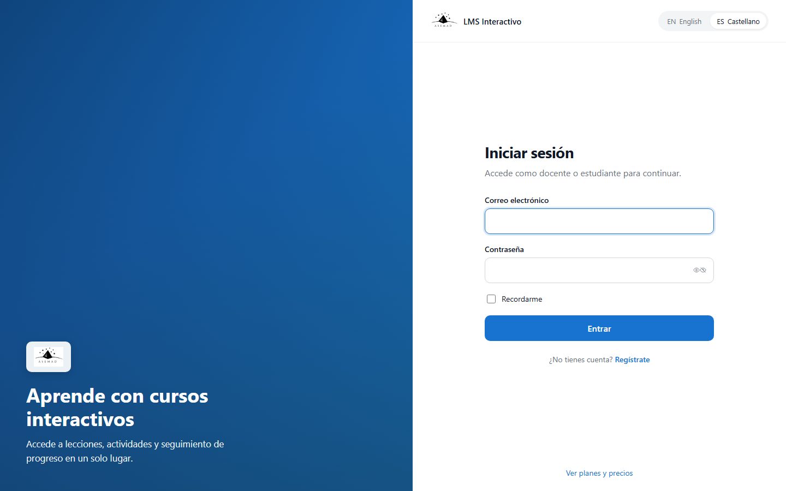

### Teacher role

| View | File | Description |
|------|------|-------------|
| Dashboard | [dashboard-teacher.png](docs/screenshots/dashboard-teacher.png) | Main panel with courses, timeline, and creation form |
| My Courses | [courses-teacher.png](docs/screenshots/courses-teacher.png) | Listing and management of published courses |
| Calendar | [calendar-teacher.png](docs/screenshots/calendar-teacher.png) | Monthly view (Moodle layout), academic events |
| Create event | [calendar-event-create.png](docs/screenshots/calendar-event-create.png) | Academic event form |
| Upgrade Assistant | [upgrade-assistant.png](docs/screenshots/upgrade-assistant.png) | Pre-deploy health checks for Moodle 5.2 pack |
| Gradebook | [gradebook-teacher.png](docs/screenshots/gradebook-teacher.png) | Multi-grader marks per course activity |
| Comms — notifications | [comms-notifications.png](docs/screenshots/comms-notifications.png) | In-app notifications |
| Comms — messages | [comms-messages.png](docs/screenshots/comms-messages.png) | Private messaging |
| Comms — mail | [comms-mail.png](docs/screenshots/comms-mail.png) | Internal mail |
| Grill me | [ai-grill-me.png](docs/screenshots/ai-grill-me.png) | AI assistant panel on lesson view |

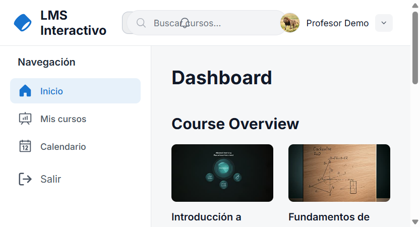

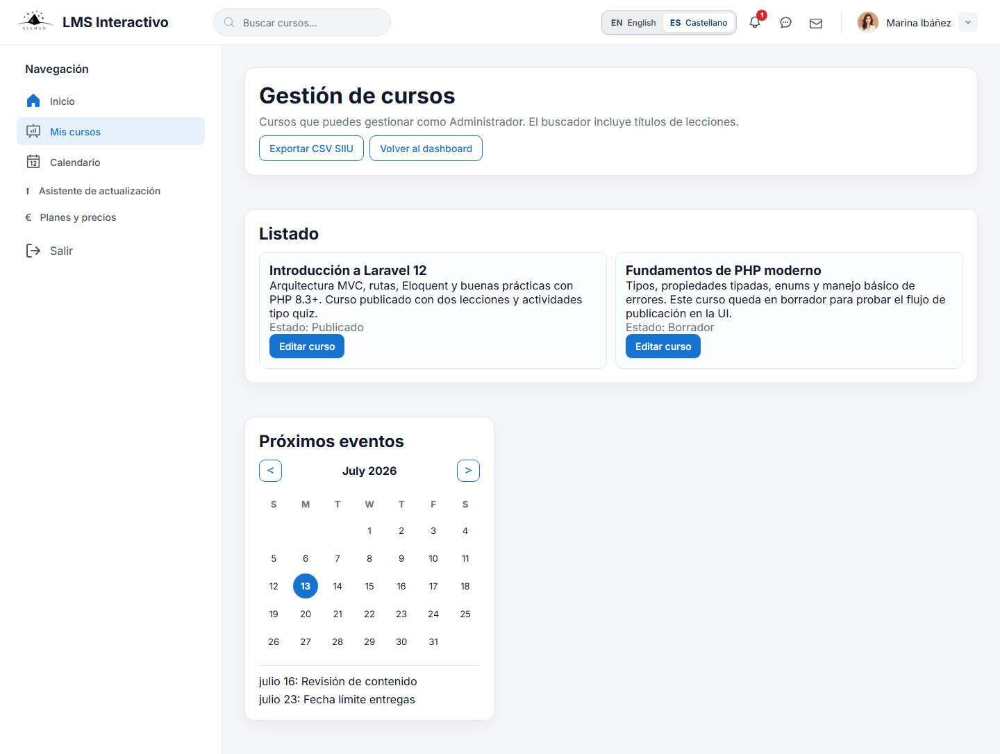

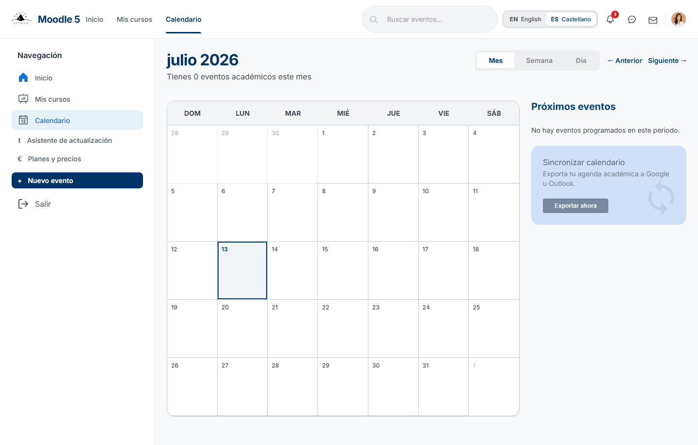

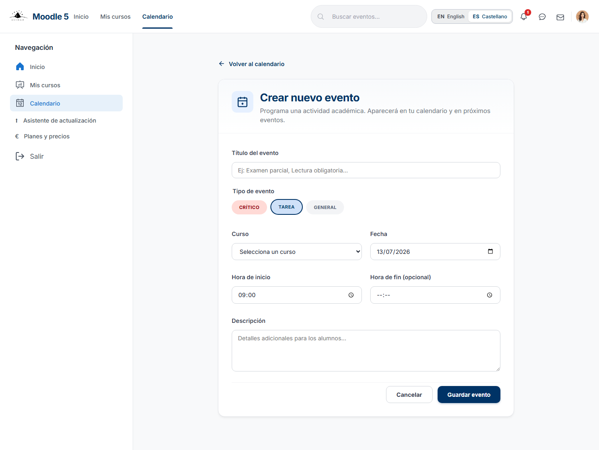

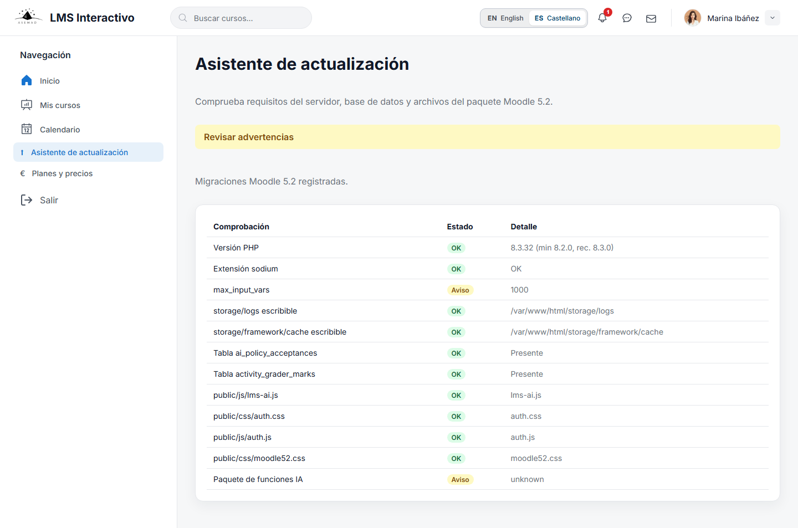

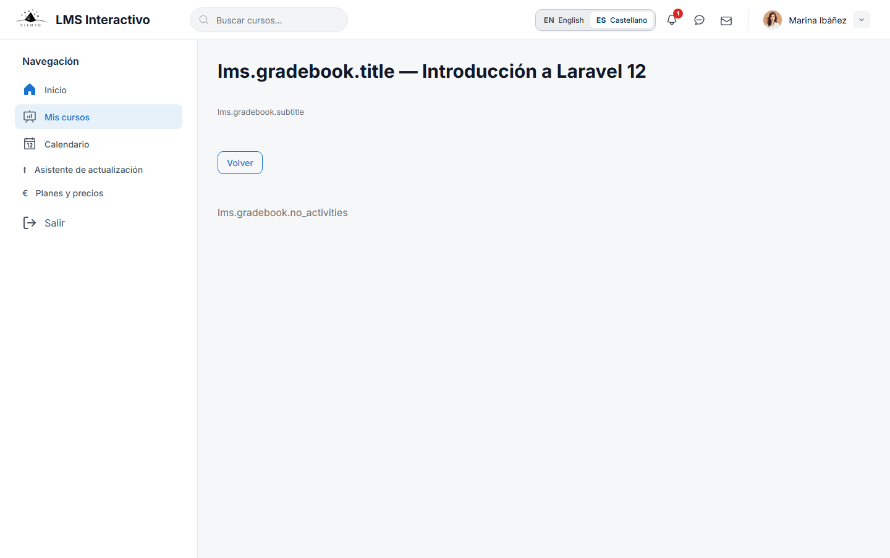

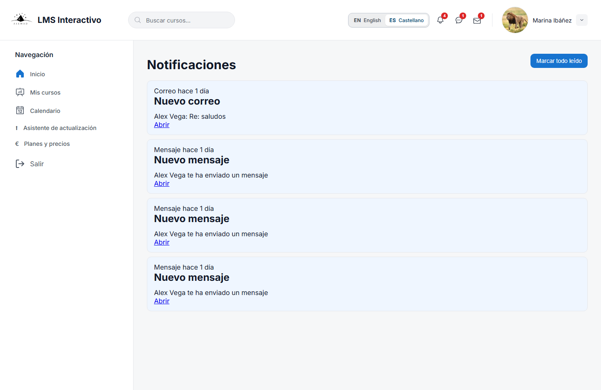

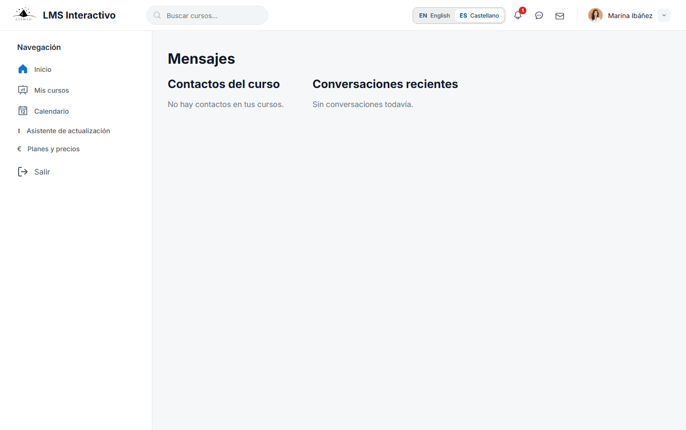

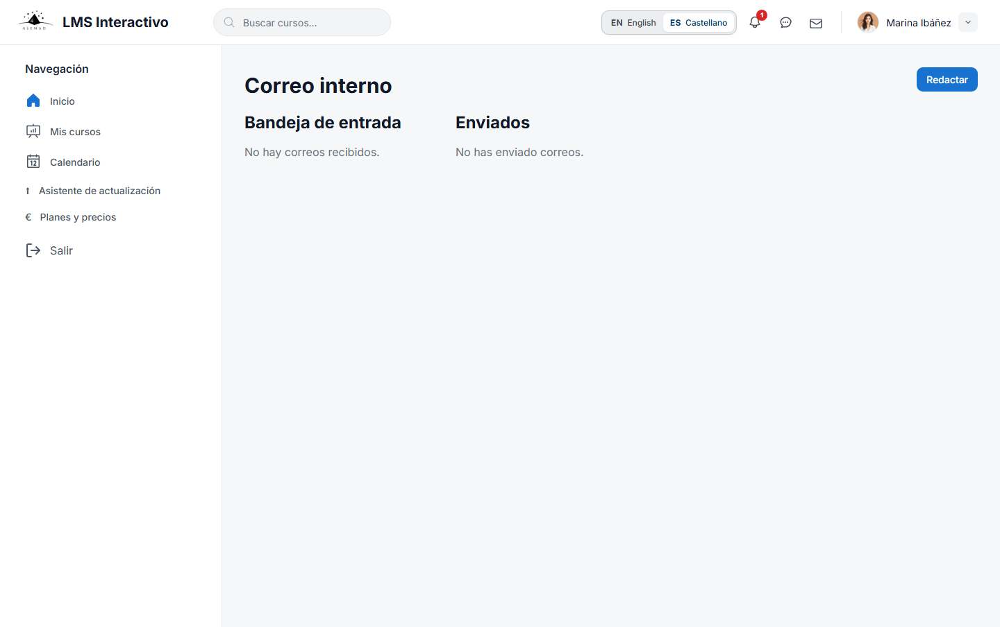

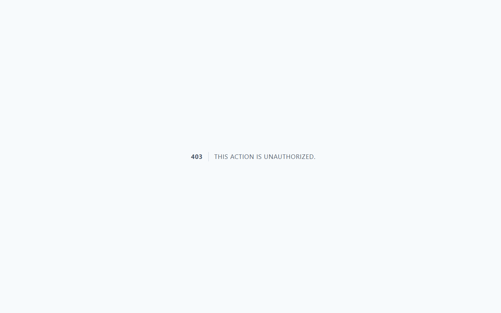

### Student role

| View | File | Description |
|------|------|-------------|
| Dashboard | [dashboard-student.png](docs/screenshots/dashboard-student.png) | Enrolled courses and quick access |
| Calendar | [calendar-student.png](docs/screenshots/calendar-student.png) | Monthly view with standard LMS layout |

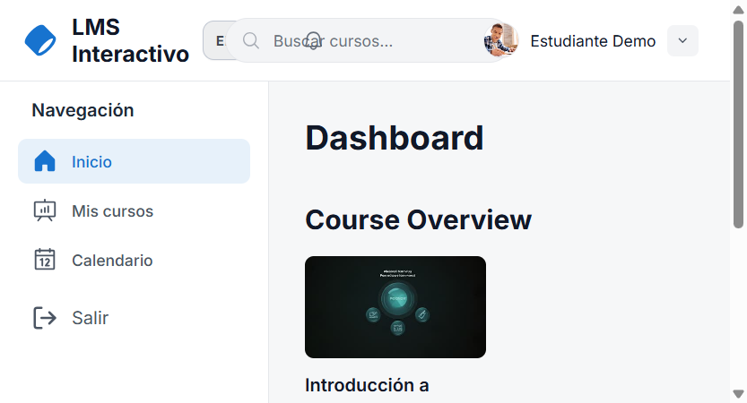

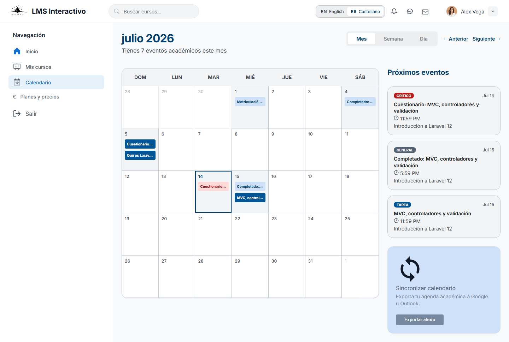

### Responsive (mobile)

| View | File | Description |
|------|------|-------------|
| Dashboard (390px) | [dashboard-teacher-mobile.png](docs/screenshots/dashboard-teacher-mobile.png) | Drawer nav ☰, stacked course cards |
| Calendar (390px) | [calendar-teacher-mobile.png](docs/screenshots/calendar-teacher-mobile.png) | Moodle topbar + comms icons on narrow viewport |

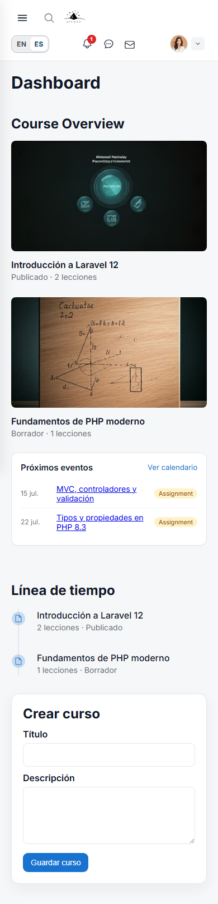

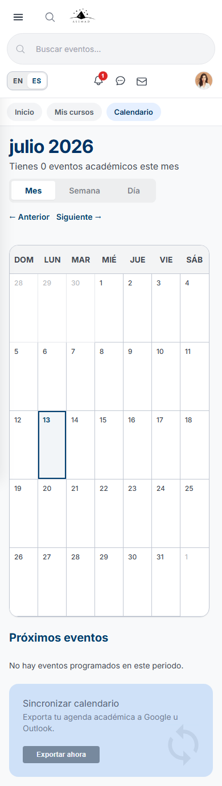

> Regenerate captures: `npm run screenshots` (see [docs/screenshots/README.md](docs/screenshots/README.md)). For responsive QA before production deploy, see [VERIFICAR-PANTALLAS.md](https://github.com/BurgosAngel/codigofinal/blob/angel-burgos-r/deploy-responsive-all-screens/VERIFICAR-PANTALLAS.md).

---

## 10. Security and OWASP Top 10

Project security documentation is split into two levels:

| Document | Content |
|----------|---------|
| [seguridad.md](./seguridad.md#security-by-user-story) | Acceptance criteria and non-functional requirements per user story (HU-1 … HU-12); see also [User Stories](#5-user-stories) |
| [seguridad.md § OWASP Analysis](./seguridad.md#owasp-top-10-vulnerability-analysis) | Priority vulnerabilities detected in the code, with concrete examples and proposed fixes |

### Priority vulnerabilities (summary)

| # | OWASP | Vulnerability | Severity |
|---|-------|---------------|----------|
| 1 | A03 Injection | Stored XSS in lesson HTML content (`{!! !!}`) | Critical |
| 2 | A01 Broken Access Control | Uploaded files accessible without enrollment verification | High |
| 3 | A03 / A10 | Malicious embedded content via unallowlisted embed URLs in plugins (iframe) | High |
| 4 | A04 / A08 | Unlimited quiz resubmission without integrity controls | Medium-High |
| 5 | A01 Broken Access Control | Enrollment with arbitrary `teacher` role on another user's course | Medium |

> Cross-cutting controls (authentication, global roles, TLS, CSRF) are documented in section [2.5. Security](#25-security) and are out of scope for the per-user-story analysis.
