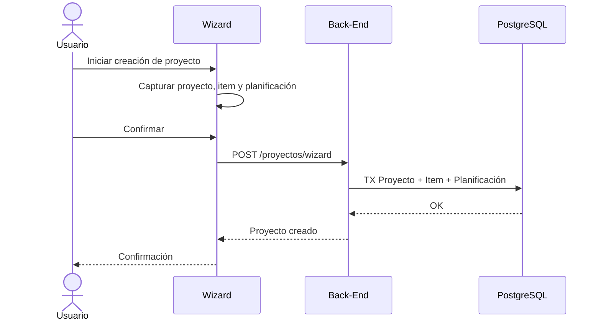
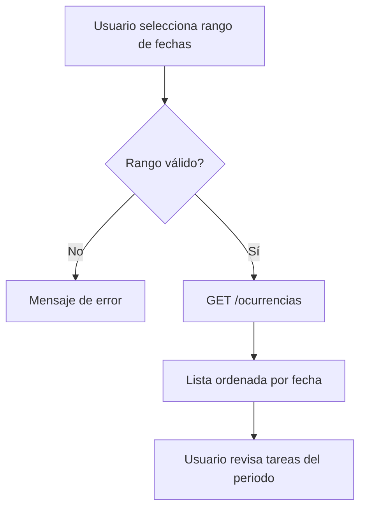
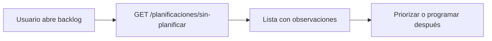
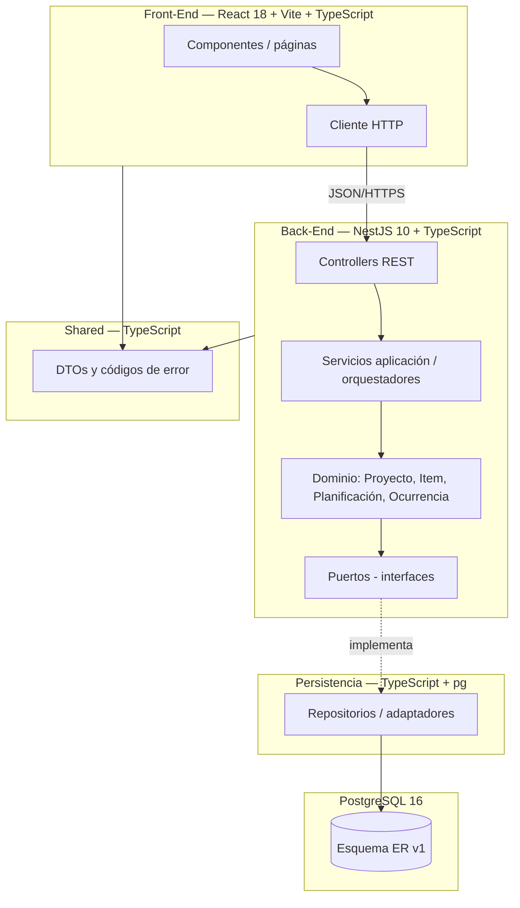
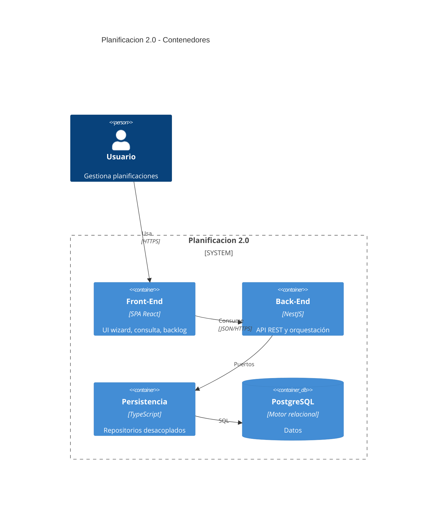
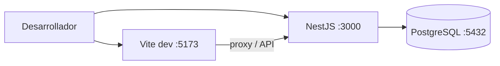

## Índice

0. [Ficha del proyecto](#0-ficha-del-proyecto)
1. [Descripción general del producto](#1-descripción-general-del-producto)
2. [Arquitectura del sistema](#2-arquitectura-del-sistema)
3. [Modelo de datos](#3-modelo-de-datos)
4. [Especificación de la API](#4-especificación-de-la-api)
5. [Historias de usuario](#5-historias-de-usuario)
6. [Tickets de trabajo](#6-tickets-de-trabajo)
7. [Pull requests](#7-pull-requests)

---

## 0. Ficha del proyecto

### **0.1. Tu nombre completo:**

Sergio Peris González

### **0.2. Nombre del proyecto:**

Planificacion 2.0

### **0.3. Descripción breve del proyecto:**

Sistema de gestión y seguimiento de planificaciones para proyectos. Permite organizar el trabajo en proyectos e items, asignar planificaciones puntuales, periódicas o sin fecha (backlog), y consultar ocurrencias en un rango temporal.

> **Alcance de esta documentación (Entrega 1):** acotado al **MVP del curso AI4Devs** (~30 h). El diseño completo del producto está en el repositorio [Planificacion_2.0](https://github.com/serpegon11710-byte/Planificacion_2.0); aquí se documenta la versión demostrable prevista en las Entregas 2 (código MVP) y final (cierre de funcionalidades).

### **0.4. URL del proyecto:**

https://github.com/serpegon11710-byte/Planificacion_2.0

> Aplicación desplegada: pendiente. El repositorio es público y contiene toda la documentación técnica y el plan de implementación.

### 0.5. URL o archivo comprimido del repositorio

https://github.com/serpegon11710-byte/Planificacion_2.0

> **Etiqueta de entrega:** [Entrega1-AI4Devs-finalproject](https://github.com/serpegon11710-byte/Planificacion_2.0/tree/Entrega1-AI4Devs-finalproject)

---

## 1. Descripción general del producto

### **1.1. Objetivo:**

**Planificacion 2.0** resuelve la necesidad de personas y equipos que gestionan múltiples iniciativas y deben coordinar tareas con distintos ritmos temporales: entregas puntuales, rutinas recurrentes y trabajo aún sin programar.

**Valor que aporta:**

- Estructura el trabajo en **Proyecto → Item → Planificación**, evitando listas planas difíciles de mantener.
- Unifica tres modalidades temporales en un solo modelo: **puntual**, **periódica** y **sin planificar** (backlog).
- Ofrece una **vista temporal de ocurrencias** para saber qué hay que hacer en un periodo concreto.

**Usuarios objetivo:** profesionales que planifican su trabajo personal o de equipo (desarrollo, consultoría, gestión de proyectos) y necesitan flexibilidad sin la complejidad de una suite enterprise.

### **1.2. Características y funcionalidades principales:**

#### Funcionalidades del MVP (Entrega 2)

| Funcionalidad | Descripción | UC |
|---------------|-------------|-----|
| Wizard de creación | Asistente guiado para crear proyecto, item y planificación inicial en una sesión | UC-01.1 |
| Consulta de ocurrencias | Listado de tareas planificadas en un rango de fechas | UC-02.1 |
| Backlog sin planificar | Listado de planificaciones sin fecha asignada | UC-03 |

#### Roadmap por entrega

| Entrega | Alcance |
|---------|---------|
| **Entrega 1** (actual) | Documentación técnica del MVP acotado |
| **Entrega 2** | Código ejecutable: bootstrap + flujo estrella (wizard, consulta, backlog) |
| **Entrega final** | Gestión manual (UC-01.2–01.4), acciones sobre ocurrencias (UC-02.2–02.4 reducidos), tipos periódicos adicionales |

#### Tipos de planificación (modelo completo; MVP implementa subconjunto)

- **Puntual:** una sola fecha y hora.
- **Periódica:** repetición diaria, semanal o mensual entre fecha inicio y fin. *MVP Entrega 2: solo semanal.*
- **Sin planificar:** sin fecha; observaciones obligatorias; backlog.

#### Estados de planificación

- **Pendiente:** dentro de plazo, no completada.
- **Completada:** finalizada por el usuario.
- **Expirada:** fecha/hora pasada sin completar (calculado en consulta).

#### Fuera de alcance del MVP documentado aquí

- Autenticación y multi-usuario.
- Variantes diarias «fin de semana» / «todos los días» y comportamiento «mes corto» en mensual.
- Materialización completa de ocurrencias periódicas y vaciado masivo.
- Despliegue en cloud (solo local / Docker previsto).

### **1.3. Diseño y experiencia de usuario:**

La interfaz aún no está implementada (Entrega 2). Los flujos principales del MVP se representan con diagramas extraídos del diseño del producto.

#### Flujo 1 — Wizard de creación (UC-01.1)


```mermaid
sequenceDiagram
    actor U as Usuario
    participant W as Wizard
    participant API as Back-End
    participant DB as PostgreSQL

    U->>W: Iniciar creación de proyecto
    W->>W: Capturar proyecto, item y planificación
    U->>W: Confirmar
    W->>API: POST /proyectos/wizard
    API->>DB: TX Proyecto + Item + Planificación
    DB-->>API: OK
    API-->>W: Proyecto creado
    W-->>U: Confirmación
```

#### Flujo 2 — Consulta de ocurrencias (UC-02.1)


```mermaid
flowchart TD
    A[Usuario selecciona rango de fechas] --> B{Rango válido?}
    B -- No --> C[Mensaje de error]
    B -- Sí --> D[GET /ocurrencias]
    D --> E[Lista ordenada por fecha]
    E --> F[Usuario revisa tareas del periodo]
```

#### Flujo 3 — Backlog sin planificar (UC-03)


```mermaid
flowchart LR
    A[Usuario abre backlog] --> B[GET /planificaciones/sin-planificar]
    B --> C[Lista con observaciones]
    C --> D[Priorizar o programar después]
```

#### Jerarquía conceptual de la UI

```
Proyecto
└── Item
    └── Planificación (Puntual | Periódica | Sin planificar)
        └── Ocurrencia (instancia en el tiempo)
```

> Diagramas de arquitectura y modelo de datos en las secciones 2 y 3. Capturas de pantalla se añadirán en Entrega 2.

### **1.4. Instrucciones de instalación:**

> **Estado:** planificado según [Ticket T-001](https://github.com/serpegon11710-byte/Planificacion_2.0/blob/main/backlog/001-bootstrap/README.md). El código ejecutable se implementará en la Entrega 2.

#### Requisitos previos

| Herramienta | Versión mínima |
|-------------|----------------|
| Node.js | 22 LTS |
| pnpm | 9+ |
| PostgreSQL | 16 |
| Git | 2.x |

Opcional: Docker / Docker Compose para PostgreSQL.

#### Pasos (orientativos)

```bash
# 1. Clonar el repositorio
git clone https://github.com/serpegon11710-byte/Planificacion_2.0.git
cd Planificacion_2.0

# 2. Instalar dependencias del monorepo
pnpm install

# 3. Configurar variables de entorno
cp .env.example .env
# Editar: DATABASE_URL, puertos FE/BE

# 4. Levantar PostgreSQL (local o contenedor)
# docker compose up -d db   # previsto en Entrega 2

# 5. Ejecutar migraciones y seeds
pnpm run db:migrate
pnpm run db:seed

# 6. Arrancar en desarrollo
pnpm dev

# 7. Verificar
# API:  http://localhost:3000/health
# SPA:  http://localhost:5173
```

#### Estructura del monorepo (prevista)

| Paquete | Tecnología | Puerto |
|---------|------------|--------|
| `implementacion/back-end/nestjs-typescript` | NestJS 10 | 3000 |
| `implementacion/front-end/react-typescript` | React 18 + Vite | 5173 |
| `implementacion/persistencia/typescript` | TypeScript + `pg` | — |
| `implementacion/shared/typescript` | DTOs compartidos | — |
| `implementacion/bbdd/postgresql` | Migraciones SQL | 5432 |

---

## 2. Arquitectura del Sistema

### **2.1. Diagrama de arquitectura:**

Arquitectura **web por capas** con desacoplamiento por contratos (puertos y DTOs). El motor de base de datos es externo al Back-End; la capa de Persistencia implementa los puertos definidos por el dominio.


```mermaid
flowchart TB
  subgraph FE [Front-End — React 18 + Vite + TypeScript]
    UI[Componentes / páginas]
    APIClient[Cliente HTTP]
  end

  subgraph BE [Back-End — NestJS 10 + TypeScript]
    Ctrl[Controllers REST]
    App[Servicios aplicación / orquestadores]
    Dom[Dominio: Proyecto, Item, Planificación, Ocurrencia]
    Ports[Puertos - interfaces]
  end

  subgraph PERS [Persistencia — TypeScript + pg]
    Repos[Repositorios / adaptadores]
  end

  subgraph BBDD [PostgreSQL 16]
    Tablas[(Esquema ER v1)]
  end

  subgraph Shared [Shared — TypeScript]
    DTO[DTOs y códigos de error]
  end

  UI --> APIClient
  APIClient -->|JSON/HTTPS| Ctrl
  Ctrl --> App --> Dom --> Ports
  Ports -.implementa.-> Repos
  Repos --> Tablas
  FE --> DTO
  BE --> DTO
```

**Patrón:** hexagonal / ports & adapters dentro de una organización por capas lógicas (C4).

**Beneficios:**

- El dominio no depende de NestJS ni de PostgreSQL; facilita tests unitarios.
- Los DTOs en `shared` fijan el contrato FE↔BE sin acoplar tecnologías.
- La Persistencia puede sustituir el motor SQL sin tocar el Back-End.

**Sacrificios:**

- Más carpetas y contratos que una aplicación monolítica simple.
- Overhead de monorepo pnpm para un MVP pequeño.

#### Vista C4 — Contenedores


```mermaid
C4Container
title Planificacion 2.0 - Contenedores

Person(usuario, "Usuario", "Gestiona planificaciones")

System_Boundary(s1, "Planificacion 2.0") {
  Container(frontend, "Front-End", "SPA React", "UI wizard, consulta, backlog")
  Container(backend, "Back-End", "NestJS", "API REST y orquestación")
  Container(persistencia, "Persistencia", "TypeScript", "Repositorios desacoplados")
  ContainerDb(db, "PostgreSQL", "Motor relacional", "Datos")
}

Rel(usuario, frontend, "Usa", "HTTPS")
Rel(frontend, backend, "Consume", "JSON/HTTPS")
Rel(backend, persistencia, "Puertos")
Rel(persistencia, db, "SQL")
```

### **2.2. Descripción de componentes principales:**

| Componente | Tecnología | Responsabilidad |
|------------|------------|-----------------|
| **Front-End** | React 18, TypeScript 5, Vite | UI: wizard (UC-01.1), vista de ocurrencias (UC-02.1), backlog (UC-03). Cliente REST e i18n por código de error. |
| **Back-End** | NestJS 10, Node 22, TypeScript 5 | Controllers REST, orquestadores (p. ej. wizard transaccional), servicios de dominio (ZC-1 consulta ocurrencias, ZC-3 planificación). |
| **Persistencia** | TypeScript, `pg` | Implementación de `*RepositoryPort` y `DatabaseConnectionPort`; mapeo entidad ↔ SQL. |
| **Shared** | TypeScript | DTOs de entrada/salida, enum `ErrorCode`, tipos de paginación y rango de fechas. |
| **BBDD** | PostgreSQL 16 | Esquema relacional, migraciones versionadas, seeds (`TipoPeriodo`). |

**Zonas críticas de negocio (referencia de diseño):**

| ZC | Función |
|----|---------|
| ZC-1 | Consulta y composición de ocurrencias en rango |
| ZC-3 | Reglas de planificación temporal |
| ZC-4 | Orquestación de casos de uso (wizard) |
| ZC-5 | Persistencia y transacciones |

### **2.3. Descripción de alto nivel del proyecto y estructura de ficheros**

```
Planificacion_2.0/
├── backlog/              # Épicas T-000…T-008 y tickets de trabajo
├── docs/                 # Casos de uso, C4, entidades, arquitectura, stack
├── implementacion/       # Código ejecutable (por componente y tecnología)
│   ├── front-end/react-typescript/
│   ├── back-end/nestjs-typescript/
│   ├── persistencia/typescript/
│   ├── shared/typescript/
│   └── bbdd/postgresql/
├── README.md             # Descripción funcional del producto
├── ENTREGAS-AI4DEVS.md   # Plan de entregas del curso para agentes
└── AGENTS.md             # Normativa para agentes de código
```

**Patrón de organización:** contenedor C4 estable (`front-end`, `back-end`…) + subcarpeta de tecnología (`react-typescript`, `nestjs-typescript`…). El dominio vive en `back-end/.../src/domain/{proyecto,item,planificacion,ocurrencia}/`.

### **2.4. Infraestructura y despliegue**

#### Entorno de desarrollo (previsto)


```mermaid
flowchart LR
  Dev[Desarrollador] --> FE[Vite dev :5173]
  Dev --> BE[NestJS :3000]
  BE --> PG[(PostgreSQL :5432)]
  FE -->|proxy / API| BE
```

| Entorno | Infraestructura | Despliegue |
|---------|-----------------|------------|
| **Local** | Node 22 + PostgreSQL 16 (nativo o Docker) | `pnpm dev` |
| **Staging / Prod** | Pendiente | Docker Compose previsto en Entrega final; sin cloud en MVP |

**Proceso de despliegue (planificado):**

1. Build: `pnpm build` (FE estático + BE compilado).
2. Migraciones: ejecutar scripts en `implementacion/bbdd/postgresql/migrations/`.
3. Variables: `DATABASE_URL`, `PORT`, `CORS_ORIGIN`.
4. Arranque: contenedor Node con NestJS; servir SPA desde CDN o mismo servidor.

### **2.5. Seguridad**

| Práctica | Estado | Detalle |
|----------|--------|---------|
| Autenticación / autorización | Fuera de alcance v1 | Aplicación mono-usuario local |
| Validación de entrada | Planificado | Pipes NestJS + reglas de dominio por capa |
| Códigos de error estables | Diseñado | `ErrorCode` en Shared; sin filtrar stack traces al cliente |
| SQL injection | Planificado | Consultas parametrizadas vía `pg` |
| CORS | Planificado | Origen FE restringido en configuración NestJS |
| Secretos | Planificado | `.env` en `.gitignore`; `.env.example` sin credenciales |

Ejemplo de respuesta de error (contrato RE-5):

```json
{
  "codigo": "PROYECTO_NOMBRE_DUPLICADO",
  "campo": "nombre"
}
```

### **2.6. Tests**

Estrategia documentada en [convenciones-tests.md](https://github.com/serpegon11710-byte/Planificacion_2.0/blob/main/docs/implementacion/convenciones-tests.md). **Implementación prevista a partir de Entrega 2.**

| Tipo | Capa | Alcance MVP |
|------|------|-------------|
| Unitario dominio | Back-End | Reglas de planificación y consulta ZC-1 |
| Integración API | Back-End | Controllers con persistencia fake |
| Integración repos | Persistencia | Repositorios contra PostgreSQL |
| Migraciones | BBDD | up/down, UNIQUE, seeds |
| Componentes UI | Front-End | Wizard y formularios con MSW |
| Smoke / E2E | Front-End | `clonar → dev → wizard feliz` (Entrega 2) |

Convención de nombres: `*.spec.ts` (BE, persistencia, shared, BBDD); `*.test.tsx` (FE).

---

## 3. Modelo de Datos

### **3.1. Diagrama del modelo de datos:**

```mermaid
erDiagram
    Proyectos ||--o{ Items : contiene
    Items ||--o{ Planificaciones : planifica
    Planificaciones ||--o| PlanificacionPeriodo : periodo
    TipoPeriodo ||--o{ PlanificacionPeriodo : tipo
    PlanificacionPeriodo ||--o{ OcurrenciasMaterializadas : ocurrencias

    Proyectos {
        bigint proyecto_id PK
        varchar nombre UK
        text descripcion
        timestamptz fecha_creacion
    }

    Items {
        bigint item_id PK
        bigint proyecto_id FK
        varchar nombre
        text descripcion
    }

    Planificaciones {
        bigint planificacion_id PK
        bigint item_id FK
        date fecha_inicio
        date fecha_fin
        time hora
        text observaciones
        varchar estado
    }

    TipoPeriodo {
        smallint tipo_periodo_id PK
        varchar codigo
    }

    PlanificacionPeriodo {
        bigint planificacion_id PK_FK
        smallint tipo_periodo_id FK
        varchar variante_diaria
        varchar dias_semana
        smallint dia_mes
        varchar comportamiento_mes_corto
    }

    OcurrenciasMaterializadas {
        bigint ocurrencia_id PK
        bigint planificacion_id FK
        date fecha_original
        date fecha_efectiva
        time hora
        text observaciones
        varchar estado
        boolean eliminada_virtual
    }
```

### **3.2. Descripción de entidades principales:**

#### Proyectos

| Atributo | Tipo | Restricción | Descripción |
|----------|------|-------------|-------------|
| `proyecto_id` | `bigint` | PK | Identificador interno |
| `nombre` | `varchar` | NOT NULL, UNIQUE global | Nombre del proyecto |
| `descripcion` | `text` | NULL | Descripción opcional |
| `fecha_creacion` | `timestamptz` | NOT NULL | UTC |

**Relaciones:** 1:N con `Items` (CASCADE al eliminar).

#### Items

| Atributo | Tipo | Restricción | Descripción |
|----------|------|-------------|-------------|
| `item_id` | `bigint` | PK | Identificador interno |
| `proyecto_id` | `bigint` | FK → Proyectos, NOT NULL | Proyecto padre |
| `nombre` | `varchar` | NOT NULL | Único por proyecto |
| `descripcion` | `text` | NULL | Descripción opcional |

**Relaciones:** N:1 con `Proyectos`; 1:N con `Planificaciones`.

#### Planificaciones

| Atributo | Tipo | Restricción | Descripción |
|----------|------|-------------|-------------|
| `planificacion_id` | `bigint` | PK | Identificador interno |
| `item_id` | `bigint` | FK → Items, NOT NULL | Item padre |
| `fecha_inicio` | `date` | NULL en Sin planificar | Inicio del rango |
| `fecha_fin` | `date` | NULL en Sin planificar | Fin del rango |
| `hora` | `time` | NULL en Sin planificar | Hora UTC |
| `observaciones` | `text` | NOT NULL en Sin planificar | Qué hay que hacer |
| `estado` | `varchar` | `Pendiente` \| `Completada`; NULL en Sin planificar | Estado de la tarea |

**Tipos inferidos desde persistencia (sin flag en BD):**

- **Sin planificar:** fechas y hora NULL; observaciones obligatorias.
- **Puntual:** `fecha_inicio = fecha_fin`; sin fila en `PlanificacionPeriodo`.
- **Periódica:** `fecha_fin > fecha_inicio`; fila 1:1 en `PlanificacionPeriodo`.

#### PlanificacionPeriodo

| Atributo | Tipo | Restricción | Descripción |
|----------|------|-------------|-------------|
| `planificacion_id` | `bigint` | PK, FK → Planificaciones | Extensión 1:1 |
| `tipo_periodo_id` | `smallint` | FK → TipoPeriodo | Diario, Semanal, Mensual |
| `variante_diaria` | `varchar` | NULL | Patrón diario (L–V, etc.) |
| `dias_semana` | `varchar` | NULL | Días para semanal |
| `dia_mes` | `smallint` | NULL | Día para mensual |
| `comportamiento_mes_corto` | `varchar` | NULL | Regla mes corto (diseño; fuera de MVP) |

#### OcurrenciasMaterializadas

Ocurrencias físicas que sobreescriben o anulan ocurrencias dinámicas calculadas (Entrega final).

| Atributo | Tipo | Restricción | Descripción |
|----------|------|-------------|-------------|
| `ocurrencia_id` | `bigint` | PK | Identificador |
| `planificacion_id` | `bigint` | FK, NOT NULL | Planificación origen |
| `fecha_original` | `date` | NOT NULL | Fecha base del patrón |
| `fecha_efectiva` | `date` | NOT NULL | Fecha mostrada |
| `hora` | `time` | NOT NULL | Hora UTC |
| `observaciones` | `text` | NULL | Texto opcional |
| `estado` | `varchar` | NOT NULL | Pendiente / Completada |
| `eliminada_virtual` | `boolean` | NOT NULL, default false | Anulación sin borrado |

---

## 4. Especificación de la API

Endpoints principales del MVP (planificados). Contrato completo en [contratos-minimos.md](https://github.com/serpegon11710-byte/Planificacion_2.0/blob/main/docs/arquitectura/contratos-minimos.md).

```yaml
openapi: 3.0.3
info:
  title: Planificacion 2.0 API
  version: 0.1.0-mvp
  description: MVP acotado — Entrega 2

paths:
  /proyectos:
    post:
      summary: Crear proyecto (o vía wizard en /proyectos/wizard)
      tags: [Proyectos]
      requestBody:
        required: true
        content:
          application/json:
            schema:
              $ref: '#/components/schemas/CrearProyectoInput'
            example:
              nombre: "Desarrollo Web 2026"
              descripcion: "Proyecto principal del año"
      responses:
        '201':
          description: Proyecto creado
          content:
            application/json:
              schema:
                $ref: '#/components/schemas/ProyectoOutput'
              example:
                proyectoId: 1
                nombre: "Desarrollo Web 2026"
                descripcion: "Proyecto principal del año"
        '409':
          description: Nombre duplicado
          content:
            application/json:
              example:
                codigo: "PROYECTO_NOMBRE_DUPLICADO"
                campo: "nombre"

  /ocurrencias:
    get:
      summary: Consultar ocurrencias en rango (UC-02.1)
      tags: [Ocurrencias]
      parameters:
        - name: desde
          in: query
          required: true
          schema:
            type: string
            format: date
          example: "2026-06-01"
        - name: hasta
          in: query
          required: true
          schema:
            type: string
            format: date
          example: "2026-06-30"
      responses:
        '200':
          description: Lista de ocurrencias en el rango
          content:
            application/json:
              schema:
                $ref: '#/components/schemas/ListaOcurrenciaOutput'
              example:
                items:
                  - ocurrenciaId: null
                    planificacionId: 10
                    fechaEfectiva: "2026-06-15"
                    hora: "09:00"
                    observaciones: "Daily standup"
                    estado: "Pendiente"
                    tipo: "periodica"
        '400':
          description: Rango inválido
          content:
            application/json:
              example:
                codigo: "RANGO_TEMPORAL_INVALIDO"

  /planificaciones/sin-planificar:
    get:
      summary: Listar planificaciones sin fecha (UC-03)
      tags: [Planificaciones]
      parameters:
        - name: page
          in: query
          schema:
            type: integer
            default: 1
        - name: pageSize
          in: query
          schema:
            type: integer
            default: 20
      responses:
        '200':
          description: Backlog de planificaciones
          content:
            application/json:
              schema:
                $ref: '#/components/schemas/ListaPlanificacionOutput'
              example:
                items:
                  - planificacionId: 5
                    itemId: 2
                    observaciones: "Investigar herramienta de testing"
                    estado: null
                total: 1
                page: 1
                pageSize: 20

components:
  schemas:
    CrearProyectoInput:
      type: object
      required: [nombre]
      properties:
        nombre:
          type: string
        descripcion:
          type: string
    ProyectoOutput:
      type: object
      properties:
        proyectoId:
          type: integer
        nombre:
          type: string
        descripcion:
          type: string
    ListaOcurrenciaOutput:
      type: object
      properties:
        items:
          type: array
          items:
            type: object
    ListaPlanificacionOutput:
      type: object
      properties:
        items:
          type: array
          items:
            type: object
        total:
          type: integer
        page:
          type: integer
        pageSize:
          type: integer
```

---

## 5. Historias de Usuario

> Tres historias del **MVP acotado**. La especificación completa de cada caso de uso está en el repositorio del producto.

### Historia de Usuario 1 — Wizard de creación (UC-01.1)

**Como** usuario nuevo,  
**quiero** crear un proyecto con su primer item y una planificación inicial mediante un asistente guiado,  
**para** empezar a organizar tareas sin conocer la estructura interna del sistema.

**Criterios de aceptación (MVP):**

- Flujo lineal: datos de proyecto → item → planificación.
- Tipos de planificación en MVP: **puntual**, **sin planificar** y **periódica semanal**.
- Al confirmar, se persiste todo en una **transacción atómica** (todo o nada).
- Si el nombre de proyecto ya existe, se muestra error `PROYECTO_NOMBRE_DUPLICADO`.

**Fuera de alcance MVP:** cancelación con borrador parcial, edición posterior vía wizard.

**Prioridad:** Alta — Entrega 2.

---

### Historia de Usuario 2 — Consulta de ocurrencias (UC-02.1)

**Como** usuario,  
**quiero** consultar las ocurrencias planificadas en un rango de fechas,  
**para** saber qué tareas tengo en un periodo concreto.

**Criterios de aceptación (MVP):**

- Parámetros `desde` y `hasta` obligatorios; rango inválido devuelve error.
- Incluye planificaciones **puntuales** y **periódicas semanales**.
- Excluye planificaciones «Sin planificar».
- Resultado en **vista lista** ordenada por fecha y hora.

**Fuera de alcance MVP:** calendario visual elaborado; completar/editar ocurrencias (Entrega final).

**Prioridad:** Alta — Entrega 2.

---

### Historia de Usuario 3 — Backlog sin planificar (UC-03)

**Como** usuario,  
**quiero** ver las planificaciones que aún no tienen fecha asignada,  
**para** gestionar mi backlog y decidir qué programar.

**Criterios de aceptación (MVP):**

- Listado paginado de planificaciones tipo «Sin planificar».
- Muestra observaciones (campo obligatorio en este tipo).
- Accesible desde la navegación principal.

**Fuera de alcance MVP Entrega 2:** convertir a planificada con fecha (Entrega final).

**Prioridad:** Media — Entrega 2.

> **Nota:** la implementación del listado (H3) se desarrolla en el módulo de planificación (API `GET /planificaciones/sin-planificar`); ver nota en §6.

---

## 6. Tickets de Trabajo

> Tres subtickets representativos (**1 BBDD + 1 Back-End + 1 Front-End**), alineados con las historias del MVP. No se documentan épicas completas.

### Ticket 1 — Bases de datos: T-001-03 Migraciones esquema ER v1

| Campo | Valor |
|-------|--------|
| **Capa** | BBDD |
| **Épica padre** | T-001 Bootstrap |
| **Historia relacionada** | Transversal (habilita H1, H2, H3) |

**Descripción:**  
Crear las migraciones iniciales del modelo entidad-relación v1 en `implementacion/bbdd/postgresql/migrations/`, incluyendo tablas `Proyectos`, `Items`, `Planificaciones`, `PlanificacionPeriodo`, `TipoPeriodo` y `OcurrenciasMaterializadas`, con constraints UNIQUE y FK documentados en el ER.

**Tareas:**

1. Script `up`: crear tablas según diagrama §3.1.
2. Script `down`: revertir en orden inverso.
3. Índice `UNIQUE (nombre)` en `Proyectos`.
4. Índice `UNIQUE (proyecto_id, nombre)` en `Items`.
5. Seed `TipoPeriodo` (T-001-04): códigos Diario, Semanal, Mensual.
6. Test de migración: up → down → up sin error.

**Criterios de aceptación:**

- [ ] Migraciones reproducibles en PostgreSQL 16 limpio.
- [ ] Constraints de unicidad activas.
- [ ] Seed mínimo de tipos de periodo cargado.

**Estimación:** 1,5 h.

---

### Ticket 2 — Back-End: T-005-01 Servicio de consulta de ocurrencias (ZC-1)

| Campo | Valor |
|-------|--------|
| **Capa** | Back-End |
| **Épica padre** | T-005 Consulta ocurrencias |
| **Historia relacionada** | H2 — UC-02.1 |

**Descripción:**  
Implementar el servicio de dominio/aplicación que compone ocurrencias dinámicas (puntuales y periódicas semanales) en un rango temporal, consumiendo `OcurrenciaQueryPort` y exponiendo el endpoint `GET /ocurrencias`.

**Tareas:**

1. Validar rango `desde`/`hasta` (`RANGO_TEMPORAL_INVALIDO` si aplica).
2. Obtener planificaciones aplicables al rango (excluir Sin planificar).
3. Calcular ocurrencias dinámicas para periódica semanal.
4. Aplicar precedencia de ocurrencias materializadas (si existen en BD).
5. Ordenar por `fecha_efectiva`, `hora`.
6. Controller NestJS + DTO `ListaOcurrenciaOutput` desde Shared.
7. Tests unitarios del servicio con puertos mockeados.

**Criterios de aceptación:**

- [ ] `GET /ocurrencias?desde=2026-06-01&hasta=2026-06-30` devuelve puntuales y semanales.
- [ ] Planificaciones sin planificar no aparecen en el resultado.
- [ ] Tests unitarios de reglas de rango y composición pasan.

**Estimación:** 3 h.

---

### Ticket 3 — Front-End: T-004-03 Wizard de creación de proyecto

| Campo | Valor |
|-------|--------|
| **Capa** | Front-End |
| **Épica padre** | T-004 Wizard UC-01.1 |
| **Historia relacionada** | H1 — UC-01.1 |

**Descripción:**  
Implementar el wizard multi-paso en React que guía al usuario por la creación de proyecto, item y planificación, reutilizando la lógica de captura de UC-01.5 (componente de formulario sin persistir hasta el final).

**Tareas:**

1. Página/ruta «Crear proyecto con wizard».
2. Pasos: nombre y descripción de proyecto → nombre y descripción de item → captura de planificación (puntual / sin planificar / semanal).
3. Validación en cada paso antes de avanzar.
4. Botón Confirmar: `POST` al endpoint de wizard; manejo de errores por `codigo` i18n.
5. Pantalla de éxito con resumen.
6. Tests de componente con MSW para flujo feliz y error de nombre duplicado.

**Criterios de aceptación:**

- [ ] Usuario completa el wizard y ve confirmación de proyecto creado.
- [ ] Error de nombre duplicado muestra mensaje traducido.
- [ ] Cancelar en cualquier paso no persiste datos.

**Estimación:** 2,5 h.

---

> **Nota sobre H3 (UC-03):** el listado de planificaciones sin planificar se implementa en el módulo de planificación (`GET /planificaciones/sin-planificar`, subtarea de T-003) en el mismo sprint MVP. No se documenta como cuarto ticket por el límite de la plantilla (3 tickets).

---

## 7. Pull Requests

> Pull Requests del repositorio [Planificacion_2.0](https://github.com/serpegon11710-byte/Planificacion_2.0) correspondientes a la fase de **documentación y diseño** (T-000).

### Pull Request 1 — Casos de uso

| Campo | Valor |
|-------|--------|
| **Número** | [#1](https://github.com/serpegon11710-byte/Planificacion_2.0/pull/1) |
| **Rama** | `docs/casos-uso` |
| **Título** | Docs/casos uso |
| **Fecha** | 2026-06-10 |

**Descripción:**  
Introduce la estructura `docs/casos-uso/` con los casos de uso UC-01 (mantenimiento de proyecto), UC-02 (gestión de ocurrencias) y UC-03 (sin planificar), incluyendo sub-casos, diagramas Mermaid y reglas de negocio. Base de las historias de usuario documentadas en §5.

---

### Pull Request 2 — Modelo entidad-relación

| Campo | Valor |
|-------|--------|
| **Número** | [#5](https://github.com/serpegon11710-byte/Planificacion_2.0/pull/5) |
| **Rama** | `docs/modelo-ER` |
| **Título** | Docs/modelo ER |
| **Fecha** | 2026-06-12 |

**Descripción:**  
Define el modelo entidad-relación v1 (`Proyectos`, `Items`, `Planificaciones`, `PlanificacionPeriodo`, `TipoPeriodo`, `OcurrenciasMaterializadas`), diagramas `.mmd`/`.svg` y documentación de entidades. Base del Ticket T-001-03 y de la sección §3.

---

### Pull Request 3 — Diagramas C4 Nivel 4 (implementación)

| Campo | Valor |
|-------|--------|
| **Número** | [#7](https://github.com/serpegon11710-byte/Planificacion_2.0/pull/7) |
| **Rama** | `docs/diagramas-c4` |
| **Título** | Diagramas C4 Nivel 4: implementación |
| **Fecha** | 2026-06-13 |

**Descripción:**  
Proyección C4 Nivel 4 por componente y tecnología (NestJS, React, Persistencia, PostgreSQL, Shared): pseudocódigo de zonas críticas ZC-1…ZC-6, contratos API/DTOs y guías de implementación. Base de la arquitectura documentada en §2 y de los tickets de Back-End y Front-End.

---

**Entrega 1 — rama del curso:** `feature-entrega1-SPG` en [AI4Devs-finalproject](https://github.com/serpegon11710-byte/AI4Devs-finalproject).
