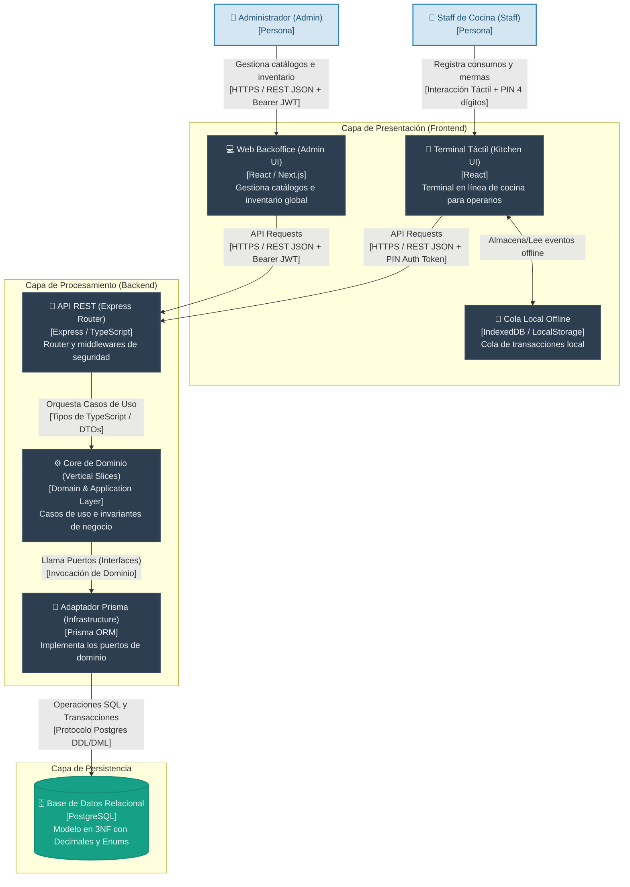
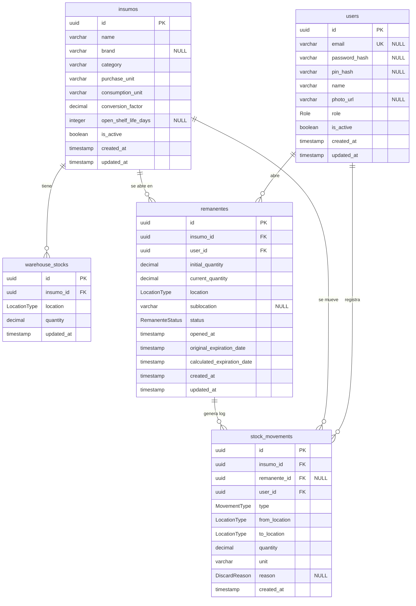

## Índice

0. [Ficha del proyecto](#0-ficha-del-proyecto)
1. [Descripción general del producto](#1-descripción-general-del-producto)
2. [Arquitectura del sistema](#2-arquitectura-del-sistema)
3. [Modelo de datos](#3-modelo-de-datos)
4. [Especificación de la API](#4-especificación-de-la-api)
5. [Historias de usuario](#5-historias-de-usuario)
6. [Tickets de trabajo](#6-tickets-de-trabajo)
7. [Pull requests](#7-pull-requests)

---

## 0. Ficha del proyecto

### **0.1. Tu nombre completo:** Jose David Lacruz Mora

### **0.2. Nombre del proyecto:** RestoStock

### **0.3. Descripción breve del proyecto:**
RestoStock es un sistema inteligente y ágil de trazabilidad e inventario para cocinas de restaurantes. Está diseñado para mitigar la merma de alimentos mediante la ordenación FEFO (First Expired, First Out) de remanentes e insumos abiertos en tiempo real, calculando dinámicamente la fecha de expiración acelerada tras su apertura.

### **0.4. URL del proyecto:**
No hay despliegue público en vivo — el proyecto corre localmente vía `pnpm dev` o `docker compose up` (ver sección de arquitectura y `docs/00_stack_manifest.md` para instrucciones).

### **0.5. URL o archivo comprimido del repositorio:**
https://github.com/lacruzjd/AI4Devs-finalproject

---

## 1. Descripción general del producto

### **1.1. Objetivo:**
RestoStock tiene como propósito eliminar las mermas invisibles y desperdicios de alimentos en restaurantes de alta rotación, automatizando el control de insumos abiertos (remanentes). El sistema aporta valor al:
1.  **Reducir pérdidas financieras** forzando un flujo operativo basado en FEFO (First Expired, First Out).
2.  **Facilitar la operación** mediante una interfaz táctil optimizada para operarios de cocina.
3.  **Garantizar la inocuidad alimentaria** calculando dinámicamente fechas de expiración acelerada tras la apertura de empaques originales de fábrica (ventanas TRR y vidas útiles acotadas).

### **1.2. Características y funcionalidades principales:**
*   **Autenticación Táctil con PIN:** Inicio de sesión en tablets de cocina en menos de 5 segundos utilizando un código PIN numérico de 4 dígitos.
*   **Gestión de Extracciones de Bodega:** Registro del traslado de unidades cerradas desde el depósito central a las áreas de preparación, inicializando el remanente activo de cocina con fecha de vencimiento acelerado.
*   **Tablero de Remanentes FEFO:** Panel visual interactivo que prioriza automáticamente los ingredientes más próximos a vencer.
*   **Consumo Parcial y Agotamiento:** Descuento de stock en cocina conforme se elaboran preparaciones, marcando automáticamente como `CONSUMED` los insumos agotados.
*   **Registro de Descartes y Mermas:** Declaración explícita de descartes por daño, contaminación u obsolescencia cronológica para alimentar reportes analíticos de merma.
*   **Feed Táctil de Alertas Críticas (Notificaciones):** Tablero visual e instantáneo con tarjetas semafóricas que alertan al personal de cocina sobre vencimientos inminentes (FEFO), roturas de stock de seguridad por ingrediente y avisos de pérdida de red en la terminal.
*   **Descuento Rápido de Stock por Recetas:** Consumo ágil en cocina descontando de forma automática del remanente más antiguo activo (FEFO) según las porciones requeridas por los platos.
*   **Cierre de Turno y Conciliación Rápida:** Flujo de fin de jornada para reportar conteo físico real, auto-descartar insumos vencidos de forma masiva y registrar variaciones de stock.
*   **Dashboard y Reporte de Mermas Visibles:** Panel web administrativo para visualizar de forma consolidada las pérdidas físicas (mermas) por ingrediente y motivo en un rango de fechas, haciendo visible el desperdicio.
*   **Gestión Mínima de Personal:** Panel de administración para dar de alta operarios y bloquear/reactivar cuentas (rol `ADMIN`), sin depender de un redeploy de código.
*   **Trazabilidad de Movimientos de Stock:** Panel de auditoría para consultar el historial de extracciones, consumos y descartes filtrado por insumo, para saber quién movió qué y cuándo.
*   **Persistencia Real en Producción:** Todos los repositorios (incluyendo recetas, conciliaciones de turno y reportes) están respaldados por PostgreSQL en producción, con bootstrap idempotente del primer administrador en cada despliegue nuevo.


### **1.3. Diseño y experiencia de usuario:**
La aplicación de cocina está diseñada bajo una estética oscura de alto contraste (**sleek dark mode** con elementos de **glassmorphism**), optimizada para pantallas táctiles de tablets de 10 pulgadas resistentes a la grasa de cocina:
*   Botones y controles de gran tamaño para evitar errores de selección.
*   Indicadores visuales semafóricos de proximidad de vencimiento (Rojo: menos de 6 horas, Amarillo: menos de 24 horas, Verde: seguro).
*   PIN Pad digital integrado para autenticación instantánea sin teclados físicos.

### **1.4. Instrucciones de instalación:**
#### Prerrequisitos
*   Node.js (versión 24 LTS o superior)
*   Manejador de paquetes `pnpm` (versión 9 o superior)
*   OpenTofu (versión 1.6 o superior) / Docker Compose (PostgreSQL 15)

#### Pasos para la puesta en marcha local
1.  **Clonar el repositorio:**
    ```bash
    git clone https://github.com/usuario/restostock.git
    cd AI4Devs-finalproject
    ```
2.  **Instalar dependencias del monorepo:**
    ```bash
    pnpm install
    ```
3.  **Configurar Variables de Entorno:**
    Copie la plantilla de variables de entorno en el backend y frontend:
    ```bash
    cp apps/backend/.env.example apps/backend/.env
    cp apps/frontend/.env.example apps/frontend/.env
    ```
4.  **Ejecutar Pruebas Automatizadas:**
    ```bash
    pnpm test
    ```
5.  **Compilación del Proyecto:**
    ```bash
    pnpm build
    ```
6.  **Iniciar Servidores en modo Desarrollo:**
    Desde la raíz del monorepo:
    ```bash
    pnpm --filter @restostock/frontend dev
    ```

---

## 2. Arquitectura del Sistema

### **2.1. Diagrama de arquitectura:**
El sistema sigue un patrón de **Arquitectura Hexagonal (Ports & Adapters)** y **Vertical Slicing** (Auth, Catalog, Stock, Kitchen). A continuación se muestra el diagrama de contenedores de C4:


```mermaid
graph TB
    Admin["👤 Administrador (Admin)<br/>[Persona]"]
    Staff["👤 Staff de Cocina (Staff)<br/>[Persona]"]

    subgraph Presentation ["Capa de Presentación (Frontend)"]
        WebBO["💻 Web Backoffice (Admin UI)<br/>[React / Next.js]<br/>Gestiona catálogos e inventario global"]
        TabletUI["📱 Terminal Táctil (Kitchen UI)<br/>[React]<br/>Terminal en línea de cocina para operarios"]
        OfflineQueue["💾 Cola Local Offline<br/>[IndexedDB / LocalStorage]<br/>Cola de transacciones local"]
    end

    subgraph Processing ["Capa de Procesamiento (Backend)"]
        API["🔌 API REST (Express Router)<br/>[Express / TypeScript]<br/>Router y middlewares de seguridad"]
        Core["⚙️ Core de Dominio (Vertical Slices)<br/>[Domain & Application Layer]<br/>Casos de uso e invariantes de negocio"]
        Prisma["💾 Adaptador Prisma (Infrastructure)<br/>[Prisma ORM]<br/>Implementa los puertos de dominio"]
    end

    subgraph Persistence ["Capa de Persistencia"]
        DB[("🗄️ Base de Datos Relacional<br/>[PostgreSQL]<br/>Modelo en 3NF con Decimales y Enums")]
    end

    Admin -->|"Gestiona catálogos e inventario<br/>[HTTPS / REST JSON + Bearer JWT]"| WebBO
    Staff -->|"Registra consumos y mermas<br/>[Interacción Táctil + PIN 4 dígitos]"| TabletUI

    TabletUI <-->|Almacena/Lee eventos offline| OfflineQueue

    WebBO -->|"API Requests<br/>[HTTPS / REST JSON + Bearer JWT]"| API
    TabletUI -->|"API Requests<br/>[HTTPS / REST JSON + PIN Auth Token]"| API

    API -->|"Orquesta Casos de Uso<br/>[Tipos de TypeScript / DTOs]"| Core
    Core -->|"Llama Puertos (Interfaces)<br/>[Invocación de Dominio]"| Prisma
    Prisma -->|"Operaciones SQL y Transacciones<br/>[Protocolo Postgres DDL/DML]"| DB

    classDef persona fill:#D4E6F1,stroke:#2980B9,stroke-width:2px,color:#1B4F72;
    classDef container fill:#2C3E50,stroke:#34495E,stroke-width:2px,color:#ECF0F1;
    classDef db fill:#16A085,stroke:#138D75,stroke-width:2px,color:#E8F8F5;

    class Admin,Staff persona;
    class WebBO,TabletUI,OfflineQueue,API,Core,Prisma container;
    class DB db;
```

### **2.2. Descripción de componentes principales:**
*   **Presentation Layer (Frontend):** Construido en Next.js (Admin Backoffice) y React Vanilla (Tablet Cocina). Implementa llamadas seguras interceptando y enviando los tokens JWT/PIN. En la tablet, incluye una cola local en **IndexedDB** para encolar transacciones en escenarios de inestabilidad de red (conmutación offline).
*   **API & Processing Layer (Backend):** Servidor HTTP Express estructurado en TypeScript. Implementa la lógica de puertos de entrada a través de controladores Express y middlewares de sanitización activa (`Zod`).
*   **Domain & Application Layer:** Capa pura libre de librerías de infraestructura. Define las entidades (`Remanente`, `Insumo`, `User`) y los casos de uso (`RecordExtraction`, `RecordConsumption`, `AuthenticatePin`).
*   **Persistence Layer:** PostgreSQL y Prisma ORM encargados del mapeo físico e integridad transaccional (CASCADE y RESTRICT).

### **2.3. Descripción de alto nivel del proyecto y estructura de ficheros:**
El proyecto está estructurado como un Monorepo utilizando workspaces de `pnpm`. Sigue el **Principio de Cierre Común (CCP)** de modo que la lógica de backend y frontend de una misma feature residen encapsuladas en sus respectivos slices verticales:

```
restostock-monorepo/
├── apps/
│   ├── frontend/             # Frontend React/Next.js
│   │   └── src/
│       │       ├── app/          # Mapeo de Rutas (Admin y Kitchen)
│       │       ├── components/   # UI Reutilizable
│       │       └── features/     # Slices del Cliente (auth, catalog, stock, kitchen, reports)
│       │
│       └── backend/              # API Express / Node.js
│           ├── prisma/           # schema.prisma y migraciones SQL
│           └── src/
│               ├── shared/       # Shared Kernel (Prisma client, validation middlewares)
│               ├── auth/         # Slice de Autenticación
│               ├── catalog/      # Slice de Catálogo de Insumos
│               ├── stock/        # Slice de Extracciones y Bodega
│               ├── kitchen/      # Slice de Operaciones de Cocina
│               └── reports/      # Slice de Reportes y Analíticas
```

### **2.4. Infraestructura y despliegue:**
El despliegue y aprovisionamiento están automatizados mediante **GitHub Actions 2026 SOTA** (`.github/workflows/ci.yml`) y módulos declarativos de **OpenTofu** (`infrastructure/opentofu/main.tf` bajo licencia MPL-2.0). El pipeline de CI ejecuta:
1.  Verificación de gobernanza agéntica con `bash .agents/scripts/validate_agents.sh` (0 enlaces rotos).
2.  Entorno de ejecución Node 24 LTS con caché optimizada de `pnpm 9`.
3.  Servicio PostgreSQL efímero y aislado en contenedor Docker para tests de integración.
4.  Comprobación de tipos con TypeScript, auditoría estática con linters (`pnpm run lint`), linter de especificaciones `DESIGN.md` y ejecución de la suite de 51 pruebas automatizadas unitarias/integración.
5.  Autenticación segura en la nube mediante OpenID Connect (OIDC) sin almacenamiento de llaves estáticas.

### **2.5. Seguridad:**
*   **Validación Activa:** Todos los payloads que ingresan a la API son parseados síncronamente con **Zod** para prevenir inyección de payloads malformados (*Mass Assignment*).
*   **Gobernanza de Secretos:** Implementación de wrapper de entorno síncrono Fail-Fast para detener el sistema si falta algún secreto.
*   **Cifrado de Datos:** PINs hasheados con `crypto.scryptSync` y salt aleatorio por usuario (formato `salt:hash`) en base de datos — nunca en texto plano.
*   **Mitigación SQLi:** Uso obligatorio de sentencias preparadas (Prepared Statements) a través del motor relacional de Prisma.

### **2.6. Tests y Gobernanza Agéntica:**
El proyecto sigue la directiva de **Desarrollo Guiado por Pruebas (TDD)** y **Gobernanza Agéntica v2.3.0**:
*   Se prohíbe escribir código de producción sin un test unitario/integración que falle previamente (`RED` a `GREEN`).
*   Suite completa verificada: **51/51 tests activos al 100% de éxito**.
*   Patrón de **3 Oráculos** (UI, RED, ESTADO) para aserciones deterministas en Playwright E2E y pruebas unitarias/integración.
*   Uso de **Fake Repositories** en memoria para pruebas de la capa de aplicación con sincronización dinámica entre modelos de lectura y escritura.
*   Cumplimiento de **Stryker Mutation Score $\ge 70\%$** para evitar pruebas tautológicas.

---

## 3. Modelo de Datos

### **3.1. Diagrama del modelo de datos:**

```mermaid
erDiagram
    users {
        uuid id PK
        varchar email UK "NULL"
        varchar password_hash "NULL"
        varchar pin_hash "NULL"
        varchar name
        varchar photo_url "NULL"
        Role role
        boolean is_active
        timestamp created_at
        timestamp updated_at
    }
    insumos {
        uuid id PK
        varchar name
        varchar brand "NULL"
        varchar category
        varchar purchase_unit
        varchar consumption_unit
        decimal conversion_factor
        integer open_shelf_life_days "NULL"
        boolean is_active
        timestamp created_at
        timestamp updated_at
    }
    warehouse_stocks {
        uuid id PK
        uuid insumo_id FK
        LocationType location
        decimal quantity
        timestamp updated_at
    }
    remanentes {
        uuid id PK
        uuid insumo_id FK
        uuid user_id FK
        decimal initial_quantity
        decimal current_quantity
        LocationType location
        varchar sublocation "NULL"
        RemanenteStatus status
        timestamp opened_at
        timestamp original_expiration_date
        timestamp calculated_expiration_date
        timestamp created_at
        timestamp updated_at
    }
    stock_movements {
        uuid id PK
        uuid insumo_id FK
        uuid remanente_id FK "NULL"
        uuid user_id FK
        MovementType type
        LocationType from_location
        LocationType to_location
        decimal quantity
        varchar unit
        DiscardReason reason "NULL"
        timestamp created_at
    }

    users ||--o{ remanentes : "abre"
    users ||--o{ stock_movements : "registra"
    insumos ||--o{ warehouse_stocks : "tiene"
    insumos ||--o{ remanentes : "se abre en"
    insumos ||--o{ stock_movements : "se mueve"
    remanentes ||--o{ stock_movements : "genera log"
```

### **3.2. Descripción de entidades principales:**
*   **`users`**: Almacena credenciales de administradores (email/password) y operarios (PIN hash). Restricción `RESTRICT` en FK para salvaguardar logs de auditoría física.
*   **`insumos`**: Catálogo maestro de ingredientes. Define la unidad de compra (ej. Horma), la unidad de consumo (ej. KG) y el factor de conversión preciso (Decimal).
*   **`warehouse_stocks`**: Existencias de insumos cerrados por ubicación. Posee una restricción `UNIQUE` en `(insumo_id, location)` e índices en `location`.
*   **`remanentes`**: Registro de ingredientes abiertos actualmente en uso en cocina. Posee el índice compuesto FEFO `(status, calculated_expiration_date)` para optimizar búsquedas.
*   **`stock_movements`**: Log transaccional inmutable. Almacena todos los traslados, consumos y descartes.

---

## 4. Especificación de la API

La API REST opera bajo el estándar OpenAPI 3.1.0. A continuación se detallan los 4 endpoints críticos de negocio del MVP original (el contrato completo, incluyendo los endpoints añadidos en la entrega 2, vive en [`docs/03_persistence_and_api/openapi.yaml`](docs/03_persistence_and_api/openapi.yaml)):

### **4.1. POST `/api/v1/auth/login-pin` (Autenticación)**
*   **Propósito:** Valida el PIN de 4-6 dígitos de un operario y genera un token JWT temporal.
*   **Request Body (application/json):**
    ```json
    {
      "userId": "usr-maria-2",
      "pin": "1234"
    }
    ```
*   **Response Success (`200 OK`):**
    ```json
    {
      "accessToken": "eyJhbGciOiJIUzI1NiIsIn...",
      "user": {
        "id": "usr-maria-2",
        "name": "Maria Gomez",
        "role": "KITCHEN_STAFF"
      }
    }
    ```

### **4.2. POST `/api/v1/stock/extraction` (Registro de Extracción)**
*   **Propósito:** Registra traslado de bodega a cocina y crea un remanente activo calculando su vencimiento acelerado.
*   **Headers:** `Authorization: Bearer <JWT_TOKEN>`
*   **Request Body (application/json):**
    ```json
    {
      "insumoId": "e2298c5d-6c17-4886-9a2d-4f1b80e8efea",
      "quantity": "2.0000",
      "toLocation": "KITCHEN_FRIDGE"
    }
    ```
*   **Response Success (`201 Created`):**
    ```json
    {
      "remanenteId": "f8a9e223-92b0-464a-93cd-9bc64e22340b",
      "insumoId": "e2298c5d-6c17-4886-9a2d-4f1b80e8efea",
      "insumoName": "Queso Mozzarella",
      "quantityExtracted": "2.0000",
      "remainingWarehouseStock": "3.0000",
      "location": "KITCHEN_FRIDGE",
      "expirationDate": "2026-07-05T16:36:12Z",
      "status": "ACTIVE"
    }
    ```

### **4.3. GET `/api/v1/kitchen/remanentes-activos` (Listar Remanentes FEFO)**
*   **Propósito:** Retorna la lista de ingredientes abiertos en cocina ordenados por fecha de expiración acelerada de menor a mayor.
*   **Headers:** `Authorization: Bearer <JWT_TOKEN>`
*   **Response Success (`200 OK`):**
    ```json
    [
      {
        "id": "f8a9e223-92b0-464a-93cd-9bc64e22340b",
        "insumoId": "e2298c5d-6c17-4886-9a2d-4f1b80e8efea",
        "insumoName": "Queso Mozzarella",
        "unitOfMeasure": "KG",
        "currentQuantity": "1.7500",
        "initialQuantity": "2.0000",
        "location": "KITCHEN_FRIDGE",
        "expirationDate": "2026-07-05T16:30:00Z",
        "hoursRemaining": 3,
        "isCriticalAlert": true,
        "status": "ACTIVE"
      }
    ]
    ```

### **4.4. GET `/api/v1/reports/waste` (Reporte de Mermas)**
*   **Propósito:** Consulta y consolidación agregada de mermas físicas descartadas en un rango temporal.
*   **Headers:** `Authorization: Bearer <JWT_TOKEN>` (Rol requerido: `ADMIN`)
*   **Query Parameters:**
    *   `startDate` (opcional): Fecha inicial ISO 8601 (ej. `2026-07-01T00:00:00Z`).
    *   `endDate` (opcional): Fecha final ISO 8601 (ej. `2026-07-11T23:59:59Z`).
*   **Response Success (`200 OK`):**
    ```json
    [
      {
        "insumoId": "e2298c5d-6c17-4886-9a2d-4f1b80e8efea",
        "insumoName": "Queso Mozzarella",
        "unitOfMeasure": "KG",
        "totalDiscardedQuantity": "3.5000",
        "reason": "EXPIRATION"
      }
    ]
    ```

### **4.5. POST `/api/v1/auth/users` (Alta de Operario — Rol `ADMIN`)**
*   **Propósito:** Crea una cuenta de operario nueva (nombre, rol, PIN), reutilizando el mismo hash con salt de `US-001`.
*   **Headers:** `Authorization: Bearer <JWT_TOKEN>` (Rol requerido: `ADMIN`)
*   **Request Body (application/json):**
    ```json
    {
      "name": "Nuevo Operario",
      "role": "KITCHEN_STAFF",
      "pin": "4321"
    }
    ```
*   **Response Success (`201 Created`):**
    ```json
    {
      "id": "d4e5f678-90ab-4cde-8f12-345678901bcd",
      "name": "Nuevo Operario",
      "role": "KITCHEN_STAFF",
      "status": "ACTIVE"
    }
    ```

### **4.6. PATCH `/api/v1/auth/users/{id}/status` (Bloqueo/Reactivación — Rol `ADMIN`)**
*   **Propósito:** Bloquea o reactiva la cuenta de un operario existente.
*   **Headers:** `Authorization: Bearer <JWT_TOKEN>` (Rol requerido: `ADMIN`)
*   **Request Body (application/json):**
    ```json
    {
      "action": "BLOCK"
    }
    ```
*   **Response Success (`200 OK`):**
    ```json
    {
      "id": "d4e5f678-90ab-4cde-8f12-345678901bcd",
      "status": "BLOCKED"
    }
    ```

### **4.7. GET `/api/v1/stock/movements` (Historial de Movimientos — Rol `ADMIN`)**
*   **Propósito:** Consulta el historial de movimientos de stock (extracciones, consumos, descartes) con filtros opcionales.
*   **Headers:** `Authorization: Bearer <JWT_TOKEN>` (Rol requerido: `ADMIN`)
*   **Query Parameters:**
    *   `insumoId` (opcional): filtra por insumo.
    *   `startDate` / `endDate` (opcional): rango de fechas ISO 8601.
*   **Response Success (`200 OK`):**
    ```json
    [
      {
        "id": "8bf9f8a3-231a-4c22-b91c-22340bb95a31",
        "insumoId": "e2298c5d-6c17-4886-9a2d-4f1b80e8efea",
        "insumoName": "Queso Mozzarella",
        "type": "EXTRACTION",
        "quantity": "2.0000",
        "fromLoc": "MAIN_WAREHOUSE",
        "toLoc": "KITCHEN_FRIDGE",
        "createdAt": "2026-08-21T14:02:11Z"
      }
    ]
    ```

---

## 5. Historias de Usuario

Se han definido detalladamente las siguientes 11 historias de usuario críticas (disponibles en el [Índice de Historias de Usuario](docs/05_agile_planning/11_user_stories/indice_user_stories.md)):

### **5.1. US-001: Autenticación por PIN del Personal de Cocina**
*   **Formato de Negocio:** Como operario de cocina (Staff), quiero autenticarme en la terminal táctil ingresando mi PIN personal de 4 dígitos, para registrar mis movimientos de insumos y consumos de forma rápida y segura sin interrumpir el ritmo del servicio.
*   **Criterio de Aceptación (Gherkin):**
    *   *Given* que la terminal de cocina está en la pantalla de PIN,
    *   *When* el operario con ID `c596e191-230d-45db-99ff-411a2f6412b1` ingresa su PIN correcto `1234`,
    *   *Then* el sistema le autoriza el acceso a la cocina y le asigna un token JWT por 8 horas.

### **5.2. US-002: Registro de Extracciones de Bodega**
*   **Formato de Negocio:** Como operario de cocina (Staff), quiero registrar la extracción física de un insumo desde la bodega principal, para transferir la materia prima al inventario activo de cocina e iniciar su ciclo de vida y control de expiración dinámica.
*   **Criterio de Aceptación (Gherkin):**
    *   *Given* un insumo `Queso Mozzarella` con stock de `5.0` en `MAIN_WAREHOUSE`,
    *   *When* el operario registra una extracción de `2.0` Hormas,
    *   *Then* el stock de bodega se reduce a `3.0` y se genera un remanente activo de `2.0` en cocina con fecha de vencimiento acelerada.

### **5.3. US-003: Consulta Táctil de Remanentes Activos en Orden FEFO**
*   **Formato de Negocio:** Como operario de cocina (Staff), quiero visualizar en la terminal táctil la lista de insumos abiertos y activos de forma ordenada por fecha de vencimiento acelerado, para priorizar el uso de los ingredientes más próximos a expirar (FEFO) y minimizar el desperdicio.
*   **Criterio de Aceptación (Gherkin):**
    *   *Given* un remanente A que expira el `2026-07-05` y un remanente B que expira el `2026-07-04`,
    *   *When* el operario accede al panel táctil,
    *   *Then* el sistema ordena en primer lugar el remanente B.

### **5.4. US-004: Registro de Consumo Parcial de Remanentes**
*   **Formato de Negocio:** Como operario de cocina (Staff), quiero registrar la cantidad parcial de un ingrediente que he consumido de un remanente activo durante el servicio, para mantener actualizadas las existencias físicas en tiempo real y permitir al sistema calcular mermas correctas.
*   **Criterio de Aceptación (Gherkin):**
    *   *Given* que el operario está autenticado en el sistema y existe un remanente activo de `Queso Mozzarella` con cantidad de `"1.7500"` KG en cocina,
    *   *When* el operario registra un consumo parcial de `"0.2500"` KG,
    *   *Then* el sistema descuenta la cantidad y actualiza las existencias del remanente a `"1.5000"` KG, quedando en estado activo.

### **5.5. US-005: Registro de Descartes y Mermas**
*   **Formato de Negocio:** Como operario de cocina (Staff), quiero registrar el descarte total de un remanente activo indicando la causa específica del desperdicio (vencimiento, caída, contaminación, etc.), para retirar el insumo del inventario de forma segura y proveer datos precisos para el reporte de mermas administrativas.
*   **Criterio de Aceptación (Gherkin):**
    *   *Given* que el operario está autenticado en el sistema y existe un remanente activo de `Queso Mozzarella` con cantidad de `"1.5000"` KG en cocina,
    *   *When* el operario registra un descarte con la razón `EXPIRATION` (vencido),
    *   *Then* el sistema actualiza la cantidad del remanente a `"0.0000"` KG, cambia su estado a `DISCARDED` y guarda un registro de tipo `DISCARD`.

### **5.6. US-006: Consulta de Alertas y Notificaciones Críticas en Cocina**
*   **Formato de Negocio:** Como operario de cocina (Staff), quiero visualizar un feed visual de notificaciones y alertas críticas en la terminal táctil, para ser alertado inmediatamente sobre vencimientos de remanentes (FEFO), existencias bajas de insumos en la línea y estados de red sin conexión, evitando pérdidas y fallos operacionales.
*   **Criterio de Aceptación (Gherkin):**
    *   *Given* que el operario de cocina ha iniciado sesión en la terminal táctil y existe un remanente activo de `Queso Mozzarella` con vencimiento dentro de 3 horas,
    *   *When* el operario abre la pantalla de notificaciones,
    *   *Then* el sistema muestra una tarjeta de alerta de color ROJO (Urgencia Crítica) detallando el nombre del insumo y el tiempo restante.

### **5.7. US-007: Consumo Rápido de Stock por Recetas**
*   **Formato de Negocio:** Como operario de cocina (Staff), quiero registrar el consumo de ingredientes seleccionando una receta preconfigurada, para descontar automáticamente en cascada FEFO las porciones de todos los ingredientes asociados a los platos elaborados en un solo paso.
*   **Criterio de Aceptación (Gherkin):**
    *   *Given* que la receta `Pizza Margarita` requiere `"0.1500"` KG de `Queso Mozzarella` y existen remanentes de `Queso Mozzarella` A (`"0.1000"` KG, vence hoy) y B (`"0.2000"` KG, vence mañana),
    *   *When* el operario registra el consumo de 1 porción de `Pizza Margarita`,
    *   *Then* el sistema consume la totalidad del remanente A (estado `CONSUMED`) y `"0.0500"` KG del remanente B (estado `ACTIVE` con `"0.1500"` KG restantes).

### **5.8. US-008: Cierre de Turno y Conciliación de Cocina**
*   **Formato de Negocio:** Como operario de cocina (Staff), quiero realizar un proceso guiado de cierre de turno al final de la jornada laboral, para auto-descartar los insumos vencidos de forma masiva y registrar las cantidades físicas de ingredientes restantes, conciliando el inventario teórico con el real.
*   **Criterio de Aceptación (Gherkin):**
    *   *Given* que el operario inicia el cierre de turno y existen 3 remanentes activos en cocina que superaron las 24 horas de vida útil TRR,
    *   *When* el operario confirma la conciliación,
    *   *Then* el sistema actualiza automáticamente el estado de esos 3 remanentes a `DISCARDED` con motivo `EXPIRATION` y registra los movimientos de descarte.

### **5.9. US-009: Dashboard y Reporte de Mermas Visibles**
*   **Formato de Negocio:** Como Administrador del restaurante, quiero visualizar un reporte agrupado de las existencias descartadas (mermas) registradas en cocina durante un periodo de tiempo, para identificar los ingredientes que más se desperdician y sus causas exactas, permitiendo tomar decisiones informadas para optimizar costos.
*   **Criterio de Aceptación (Gherkin):**
    *   *Given* que se han registrado descartes de `Queso Mozzarella` por `EXPIRATION` (`"3.5000"` KG total) y `Salsa de Tomate` por `DAMAGE_OR_DROP` (`"1.0000"` L total),
    *   *When* el administrador consulta el endpoint de reporte de mermas para hoy,
    *   *Then* el sistema responde con una lista consolidada agrupando por ingrediente y motivo mostrando las cantidades exactas en formato de string.

### **5.10. US-010: Gestión Mínima de Personal (Alta y Bloqueo de Operarios)**
*   **Formato de Negocio:** Como Administrador del restaurante, quiero dar de alta operarios y bloquear/reactivar cuentas existentes vía API, para mantener el control de acceso al día sin depender de un redeploy de código.
*   **Criterio de Aceptación (Gherkin):**
    *   *Given* que un Administrador autenticado envía nombre, rol `KITCHEN_STAFF` y PIN `"4321"`,
    *   *When* invoca `POST /api/v1/auth/users`,
    *   *Then* el sistema crea la cuenta y el operario puede autenticarse de inmediato con ese PIN.
*   **Estado:** ✅ Backend y Frontend implementados y verificados (⚠️ el backend no expone endpoint de listado; el bloqueo/reactivación se hace por ID exacto).

### **5.11. US-011: Trazabilidad y Auditoría de Movimientos de Stock**
*   **Formato de Negocio:** Como Administrador del restaurante, quiero consultar el historial de movimientos de stock filtrado por insumo y rango de fechas, para auditar quién movió qué y cuándo.
*   **Criterio de Aceptación (Gherkin):**
    *   *Given* que se registró una extracción real de `Queso Mozzarella`,
    *   *When* el Administrador invoca `GET /api/v1/stock/movements`,
    *   *Then* el sistema retorna el movimiento con su tipo, cantidad, ubicaciones y fecha de creación.
*   **Estado:** ✅ Backend y Frontend implementados y verificados (filtro por insumo; el selector de rango de fechas queda como mejora incremental).

---

## 6. Tickets de Trabajo

El backlog técnico y funcional (disponible en el [Índice de Tickets de Trabajo](docs/05_agile_planning/12_tickets/indice_tickets.md)) contiene las especificaciones exactas para el desarrollo de cada sprint, organizados en subcarpetas por módulo/epic (ej: `12_tickets/{modulo}/backend/` y `12_tickets/{modulo}/frontend/`):

### ⚙️ 6.1. Tickets de Backend (en subcarpetas `docs/05_agile_planning/12_tickets/{modulo}/backend/`)


*   **TK-001: Configuración del Core del Backend y Base de Datos (Base de Datos)**
    *   **Descripción:** Configuración inicial del monorepo Express, Prisma Client, inyección síncrona segura de variables de entorno y middleware global de excepciones y validación de esquemas Zod.
    *   **Capas Afectadas:** `shared/domain`, `shared/infrastructure`.
    *   **DoD:** Build de typescript exitoso en CI, conexión segura TLS verificada en la base de datos de test efímera.
*   **TK-002: Implementación de Autenticación de Operarios por PIN (Backend)**
    *   **Descripción:** Implementación de la API `/api/v1/auth/login-pin` integrando el caso de uso `AuthenticateByPin` y la validación de hash con `crypto.scryptSync` (salt por usuario).
    *   **Capas Afectadas:** `auth/domain`, `auth/application`, `auth/infrastructure`.
    *   **DoD:** Test unitario pasando con el 100% de cobertura y aserción de que el PIN plano nunca se retorna ni se guarda.
*   **TK-003: Implementación de Extracciones de Bodega (Backend & Log)**
    *   **Descripción:** Lógica transaccional que reduce stock consolidado y genera un remanente activo calculando su vida útil acotada.
    *   **Capas Afectadas:** `stock/domain`, `stock/application`, `stock/infrastructure`.
    *   **DoD:** Garantía transaccional de base de datos verificada: si el débito de stock o la creación del remanente falla, toda la transacción debe revertirse (rollback).
*   **TK-004: Implementación del Slice de Consulta de Remanentes Activos en Cocina (FEFO) (Backend)**
    *   **Descripción:** Exposición de una consulta optimizada para obtener los remanentes abiertos y disponibles en cocina ordenados por vencimiento de menor a mayor (FEFO).
    *   **Capas Afectadas:** `kitchen/domain`, `kitchen/application`, `kitchen/infrastructure`.
    *   **DoD:** Test unitario del caso de uso utilizando un repositorio en memoria para validar que el resultado del caso de uso retorne la lista ordenada cronológicamente; autenticación JWT con rol mínimo `KITCHEN_STAFF` requerida.
*   **TK-005: Implementación del Slice de Consumo Parcial de Remanentes (Backend)**
    *   **Descripción:** Funcionalidad para descontar cantidades de insumos abiertos (remanentes). Si el consumo reduce la cantidad de un remanente a cero exacto, el sistema debe cambiar automáticamente su estado a agotado (`CONSUMED`).
    *   **Capas Afectadas:** `kitchen/domain`, `kitchen/application`, `kitchen/infrastructure`.
    *   **DoD:** Tests unitarios verificando transiciones del flujo (consumo parcial, consumo agotador y rechazo por saldo insuficiente) pasando en verde; uso estricto de la librería `decimal.js` para toda aritmética decimal.
*   **TK-006: Implementación del Slice de Descarte y Mermas de Cocina (Backend)**
    *   **Descripción:** Permite retirar del inventario activo ingredientes abiertos e inservibles (vencidos, dañados, etc.). La cantidad remanente se pone en cero, el estado cambia a descartado (`DISCARDED`) y se crea una entrada de auditoría en la tabla `stock_movements`.
    *   **Capas Afectadas:** `kitchen/domain`, `kitchen/application`, `kitchen/infrastructure`.
    *   **DoD:** Validar en dominio e impedir doble descarte sobre remanentes consumidos o descartados; requerimiento de autenticación JWT con rol mínimo `KITCHEN_STAFF`.
*   **TK-008: Implementación de Recetas y Descuento FEFO en Cascadas (Backend)**
    *   **Descripción:** Implementa el flujo de descuento rápido de ingredientes en cocina basado en recetas maestras, buscando remanentes activos de cada ingrediente y debitando la cantidad en cascada FEFO de forma atómica.
    *   **Capas Afectadas:** `catalog/domain`, `kitchen/domain`, `kitchen/application`, `kitchen/infrastructure`.
    *   **DoD:** Pruebas unitarias en rojo del caso de uso `ConsumeRecipeUseCase` antes de codificar la lógica del dominio; ejecución de la cascada completa dentro de una única transacción Prisma (`$transaction`).
*   **TK-009: Implementación de Cierre de Turno y Conciliación en Cocina (Backend)**
    *   **Descripción:** Proceso guiado de cierre de turno y conciliación física. Marca automáticamente como `DISCARDED` remanentes vencidos y permite reportar cantidades físicas reales restantes registrando variaciones de stock (varianzas).
    *   **Capas Afectadas:** `kitchen/domain`, `kitchen/application`, `kitchen/infrastructure`.
    *   **DoD:** Escribir pruebas unitarias en rojo del caso de uso antes del código de producción; optimización SQL mediante actualizaciones por lote (`updateMany`) en una transacción atómica.
*   **TK-010: Implementación del Módulo de Reportes y Analítica de Mermas (Backend)**
    *   **Descripción:** Endpoint REST `GET /api/v1/reports/waste` que permite al administrador consultar la cantidad total de inventario desechado (mermas físicas) agrupado por ingrediente y motivo en un rango de fechas.
    *   **Capas Afectadas:** `reports/domain`, `reports/application`, `reports/infrastructure`.
    *   **DoD:** Pruebas de integración para `GetWasteReportUseCase` verificando la sumatoria y el rango de fechas; autenticación JWT con rol requerido `ADMIN`.
*   **TK-018: Sincronización del Modelo de Consulta de Remanentes (Read-Model Sync)**
    *   **Descripción:** Vinculación directa del `InMemoryRemanenteQueryRepository` con el `InMemoryStockRepository` para garantizar la actualización en tiempo real del estado consumido en la UI de cocina.
    *   **Capas Afectadas:** `kitchen/infrastructure`, `stock/infrastructure`, `http/app`.
    *   **DoD:** Prueba de integración del Oráculo de Estado en verde verificando impacto inmediato de `POST /consume` en `GET /remanentes-activos`.
*   **TK-019: Modernización del Pipeline CI/CD SOTA y Módulo IaC OpenTofu**
    *   **Descripción:** Actualización del workflow `.github/workflows/ci.yml` a Node 24 LTS, Actions v5, pnpm 9 e integración de módulo declarativo de infraestructura con OpenTofu (`infrastructure/opentofu/main.tf`).
    *   **Capas Afectadas:** `.github/workflows`, `infrastructure/opentofu`.
    *   **DoD:** Pipeline pasando exitosamente con `validate_agents.sh` y validación de `DESIGN.md`.
*   **TK-020: Gobernanza Agéntica - Guards 22 (IaC OpenTofu) y 23 (CI/CD SOTA)**
    *   **Descripción:** Codificación en `AGENTS.md` de los Guards Universales 22 y 23 para obligar la observancia de la infraestructura declarativa en OpenTofu y CI/CD en Node 24 LTS por parte del agente.
    *   **Capas Afectadas:** `AGENTS.md`.
    *   **DoD:** `validate_agents.sh` ejecutado exitosamente con 0 enlaces rotos.
*   **TK-021: Actualización del Arnés .agents/README.md a v2.3.0**
    *   **Descripción:** Actualización del manual de operaciones `.agents/README.md` reflejando 34 Skills, 8 Workflows y la versión 2.3.0 SOTA Enterprise 2026.
    *   **Capas Afectadas:** `.agents/README.md`.
    *   **DoD:** Integridad del framework verificada con 54 enlaces absolutos validados.
*   **TK-048: Cierre de Persistencia Parcial en Producción (Backend)**
    *   **Descripción:** Elimina la última persistencia en memoria en producción — `reportRepository`, `recipeRepository` y `reconciliationRepository` pasan a ser Prisma-backed, con nuevos modelos `Recipe`, `RecipeIngredient`, `ShiftReconciliation`, `ShiftReconciliationItem` y la primera migración real del proyecto.
    *   **Capas Afectadas:** `catalog/infrastructure`, `kitchen/infrastructure`, `reports/infrastructure`, `prisma/schema.prisma`.
    *   **DoD:** Validado en vivo contra Postgres real (creación/lectura sobreviviendo a reinicio); 46/46 tests backend en verde.
*   **TK-049: Gestión Mínima de Personal (Backend)**
    *   **Descripción:** `POST /api/v1/auth/users` y `PATCH /api/v1/auth/users/{id}/status` (rol `ADMIN`) para alta y bloqueo/reactivación de operarios, reutilizando el hash de PIN con salt ya existente.
    *   **Capas Afectadas:** `auth/domain`, `auth/application`, `auth/infrastructure`.
    *   **DoD:** 9 tests nuevos (creación, login inmediato, 403/401/400/404, bloqueo con verificación de login posterior fallido, reactivación); `openapi.yaml` sincronizado.
*   **TK-050: Trazabilidad de Movimientos de Stock (Backend)**
    *   **Descripción:** `GET /api/v1/stock/movements` (rol `ADMIN`, filtros `insumoId`/`startDate`/`endDate`) sobre el modelo `StockMovement` ya poblado por extracción/consumo/descarte pero previamente inconsultable.
    *   **Capas Afectadas:** `stock/domain`, `stock/application`, `stock/infrastructure`.
    *   **DoD:** 5 tests nuevos (historial poblado por movimiento real, filtro, 403/401, lista vacía); 60/60 tests backend en verde.
*   **TK-051: Bootstrap del Primer Administrador (Backend)**
    *   **Descripción:** Corrige el problema huevo-gallina de despliegue nuevo (`POST /auth/users` exige ya ser ADMIN) y un bug crítico encontrado al investigarlo — `prisma/seed.ts` guardaba el PIN del admin en texto plano. Ahora hashea correctamente y siembra un admin configurable (`SEED_ADMIN_PIN`/`SEED_ADMIN_NAME`) de forma idempotente en cada arranque del contenedor.
    *   **Capas Afectadas:** `apps/backend/prisma/seed.ts`, `apps/backend/Dockerfile`, `apps/backend/docker-entrypoint.sh`.
    *   **DoD:** Validado extremo a extremo con contenedor real (login tras bootstrap, PIN persiste tras reinicio, arranque sin `SEED_ADMIN_PIN` no bloquea el despliegue).

Sus tickets de Frontend (`TK-049-FE`, `TK-050-FE`) están documentados en la sección 6.2 más abajo y ya implementados.

### 🖥️ 6.2. Tickets de Frontend (en subcarpetas `docs/05_agile_planning/12_tickets/{modulo}/frontend/`)

*   **TK-007: Implementación de Pantalla de Notificaciones y Alertas Dinámicas (Frontend)**
    *   **Descripción:** Pantalla táctil de notificaciones en el cliente y lógica de renderizado del feed de alertas críticas en la tablet, calculando dinámicamente vencimientos FEFO, stock mínimo en línea y estado de red offline.
    *   **Capas Afectadas:** `/app/kitchen/notifications/page.tsx`, `features/kitchen/components`.
    *   **DoD:** Banner offline y alertas críticas diseñadas bajo estándares de accesibilidad táctil; simular estado offline mediante IndexedDB.
*   **TK-007-B: Pantalla de Login por PIN (Frontend)**
    *   **Descripción:** Interfaz de teclado numérico táctil (`PinPad`) optimizado para pantallas de cocina para el inicio de sesión rápido, guardando el JWT devuelto.
    *   **Capas Afectadas:** `features/auth/components`, `/app/login/page.tsx`.
    *   **DoD:** Botones táctiles de mínimo `64px`, máscara de dígitos y pruebas unitarias de interactividad.
*   **TK-007-C: Interfaz de Consumo de Recetas (Frontend)**
    *   **Descripción:** Panel de visualización de recetas maestras en cocina con disparadores táctiles para registrar la preparación de porciones y descuento FEFO.
    *   **Capas Afectadas:** `features/kitchen/components`, `/app/kitchen/recipes/page.tsx`.
    *   **DoD:** Control de inventario restante en cliente, botón de acción rápida de al menos `54px` e integración con cola IndexedDB.
*   **TK-007-D: Formulario de Reconciliación de Turno (Frontend)**
    *   **Descripción:** Wizard táctil paso a paso para reportar stock real en cocina y autorizar/ingresar variaciones de inventario al fin de turno.
    *   **Capas Afectadas:** `features/kitchen/components`, `/app/kitchen/reconciliation/page.tsx`.
    *   **DoD:** Advertencia de color rojo y checkbox de confirmación especial para variaciones de inventario físico mayores al 50%.
*   **TK-007-E: Dashboard de Reportes de Desperdicio y Eficiencia FEFO (Frontend)**
    *   **Descripción:** Panel web para administradores que visualiza mediante gráficos interactivos y donas las pérdidas de stock consolidado y motivos.
    *   **Capas Afectadas:** `features/reports/components`, `/app/admin/reports/page.tsx`.
    *   **DoD:** Autenticación y control de rutas JWT para rol `ADMIN`, gráficos interactivos optimizados y selectores de rango temporal.
*   **TK-007-F: Pantalla de Registro de Extracciones de Bodega (Frontend)**
    *   **Descripción:** Formulario táctil ergonómico para registrar el paso de insumos de bodega a cocina abriendo los empaques de fábrica.
    *   **Capas Afectadas:** `features/stock/components`, `/app/stock/extraction/page.tsx`.
    *   **DoD:** Deshabilitación de doble clic para evitar transacciones repetidas, validación de inputs mayores a cero y mapeo a `POST /api/v1/stock/extraction`.
*   **TK-049-FE: Panel de Gestión de Personal (Frontend)**
    *   **Descripción:** Modal con pestañas de alta de operario y bloqueo/reactivación por ID, consumiendo `POST /api/v1/auth/users` y `PATCH /api/v1/auth/users/{id}/status`.
    *   **Capas Afectadas:** `features/auth/components` (`UserManagementPanel.tsx`, `CreateUserForm.tsx`, `UserStatusForm.tsx`), `features/auth/services/users.service.ts`.
    *   **DoD:** 5 pruebas RTL en verde; sin fallback a datos sintéticos ante error (acciones administrativas reales, nunca simuladas); componente `AccessDeniedState` extraído a `shared/components/` para evitar una tercera duplicación del guard de rol `ADMIN`.
*   **TK-050-FE: Panel de Auditoría de Movimientos (Frontend)**
    *   **Descripción:** Modal con tabla de historial de movimientos filtrable por insumo, consumiendo `GET /api/v1/stock/movements`.
    *   **Capas Afectadas:** `features/stock/components/MovementHistoryPanel.tsx`, `features/stock/services/stock.service.ts` (extendido).
    *   **DoD:** 5 pruebas RTL en verde (incluye estado vacío explícito y error real sin datos sintéticos, al ser un registro de auditoría).

---

## 7. Pull Requests

A continuación se registra el histórico de Pull Requests de este repositorio:

### 🔄 PR #1: `docs: setup RestoStock MVP technical specification and backlog`
*   **Ramas:** `feature-entrega1-JDLM` ➡️ `main`
*   **Ticket Relacionado:** N/A (Hito inicial de especificación y diseño del MVP)
*   **Descripción del Cambio:** Creación del PRD del MVP, especificación lógica del modelo de datos, diseño de puertos/adaptadores en arquitectura hexagonal, feed de la API REST, planes de pruebas TDD, planes de seguridad OWASP y la estructuración de las 8 Historias de Usuario (US-001 a US-008) y 9 Tickets Técnicos (TK-001 a TK-009) enlazados dinámicamente en el mapa del backlog.
*   **Quality Gates (DoD):** 
    *   Revisión y aprobación de la auditoría documental por el oráculo de IA.
    *   Formato Markdown y sintaxis de diagramas Mermaid validados.
    *   Pipeline inicial de integración continua (`ci.yml`) configurado.


