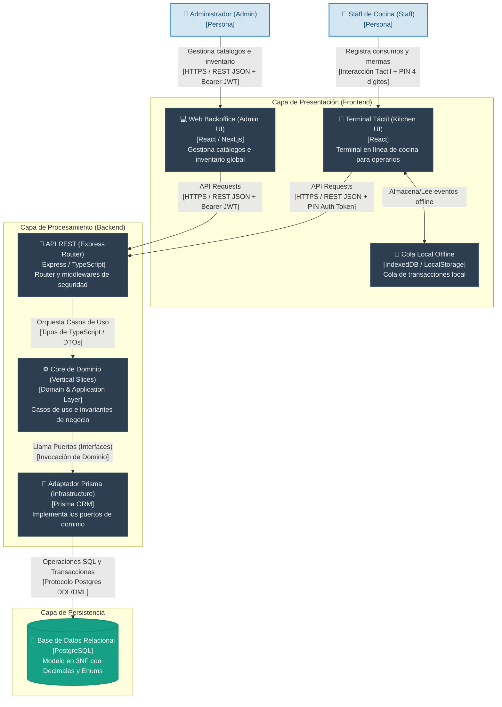
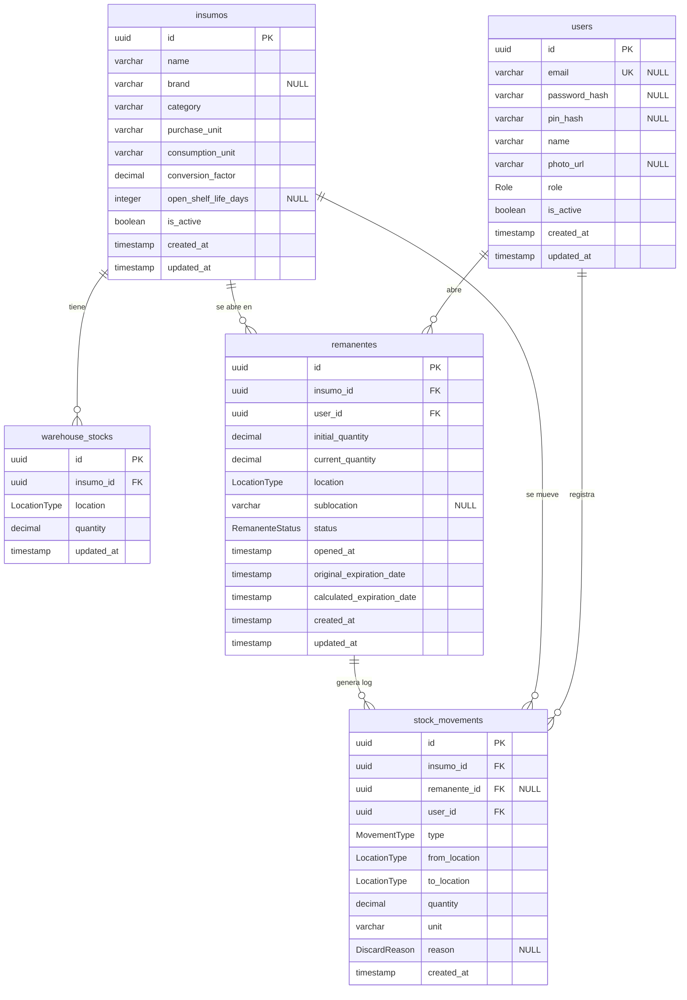

## Índice

0. [Ficha del proyecto](#0-ficha-del-proyecto)
1. [Descripción general del producto](#1-descripción-general-del-producto)
2. [Arquitectura del sistema](#2-arquitectura-del-sistema)
3. [Modelo de datos](#3-modelo-de-datos)
4. [Especificación de la API](#4-especificación-de-la-api)
5. [Historias de usuario](#5-historias-de-usuario)
6. [Tickets de trabajo](#6-tickets-de-trabajo)
7. [Pull requests](#7-pull-requests)

---

## 0. Ficha del proyecto

### **0.1. Tu nombre completo:** Jose David Lacruz Mora

### **0.2. Nombre del proyecto:** RestoStock

### **0.3. Descripción breve del proyecto:**
RestoStock es un sistema inteligente y ágil de trazabilidad e inventario para cocinas de restaurantes. Está diseñado para mitigar la merma de alimentos mediante la ordenación FEFO (First Expired, First Out) de remanentes e insumos abiertos en tiempo real, calculando dinámicamente la fecha de expiración acelerada tras su apertura.

### **0.4. URL del proyecto:**
...

### **0.5. URL o archivo comprimido del repositorio:**
...

---

## 1. Descripción general del producto

### **1.1. Objetivo:**
RestoStock tiene como propósito eliminar las mermas invisibles y desperdicios de alimentos en restaurantes de alta rotación, automatizando el control de insumos abiertos (remanentes). El sistema aporta valor al:
1.  **Reducir pérdidas financieras** forzando un flujo operativo basado en FEFO (First Expired, First Out).
2.  **Facilitar la operación** mediante una interfaz táctil optimizada para operarios de cocina.
3.  **Garantizar la inocuidad alimentaria** calculando dinámicamente fechas de expiración acelerada tras la apertura de empaques originales de fábrica (ventanas TRR y vidas útiles acotadas).

### **1.2. Características y funcionalidades principales:**
*   **Autenticación Táctil con PIN:** Inicio de sesión en tablets de cocina en menos de 5 segundos utilizando un código PIN numérico de 4 dígitos.
*   **Gestión de Extracciones de Bodega:** Registro del traslado de unidades cerradas desde el depósito central a las áreas de preparación, inicializando el remanente activo de cocina con fecha de vencimiento acelerado.
*   **Tablero de Remanentes FEFO:** Panel visual interactivo que prioriza automáticamente los ingredientes más próximos a vencer.
*   **Consumo Parcial y Agotamiento:** Descuento de stock en cocina conforme se elaboran preparaciones, marcando automáticamente como `CONSUMED` los insumos agotados.
*   **Registro de Descartes y Mermas:** Declaración explícita de descartes por daño, contaminación u obsolescencia cronológica para alimentar reportes analíticos de merma.
*   **Feed Táctil de Alertas Críticas (Notificaciones):** Tablero visual e instantáneo con tarjetas semafóricas que alertan al personal de cocina sobre vencimientos inminentes (FEFO), roturas de stock de seguridad por ingrediente y avisos de pérdida de red en la terminal.
*   **Descuento Rápido de Stock por Recetas:** Consumo ágil en cocina descontando de forma automática del remanente más antiguo activo (FEFO) según las porciones requeridas por los platos.
*   **Cierre de Turno y Conciliación Rápida:** Flujo de fin de jornada para reportar conteo físico real, auto-descartar insumos vencidos de forma masiva y registrar variaciones de stock.


### **1.3. Diseño y experiencia de usuario:**
La aplicación de cocina está diseñada bajo una estética oscura de alto contraste (**sleek dark mode** con elementos de **glassmorphism**), optimizada para pantallas táctiles de tablets de 10 pulgadas resistentes a la grasa de cocina:
*   Botones y controles de gran tamaño para evitar errores de selección.
*   Indicadores visuales semafóricos de proximidad de vencimiento (Rojo: menos de 6 horas, Amarillo: menos de 24 horas, Verde: seguro).
*   PIN Pad digital integrado para autenticación instantánea sin teclados físicos.

### **1.4. Instrucciones de instalación:**
#### Prerrequisitos
*   Node.js (versión 18 o superior)
*   Manejador de paquetes `pnpm` (versión 8 o superior)
*   Motor de base de datos PostgreSQL

#### Pasos para la puesta en marcha local
1.  **Clonar el repositorio:**
    ```bash
    Sin definir aun.
    ```
2.  **Instalar dependencias del monorepo:**
    ```bash
    Sin definir aun.
    ```
3.  **Configurar Variables de Entorno:**
    Cree un archivo `.env` en el directorio `apps/backend/` con las siguientes llaves:
    ```env
    Sin definir aun.
    ```
4.  **Levantar Base de Datos (Docker Compose):**
    ```bash
    Sin definir aun.
    ```
5.  **Ejecutar Migraciones y Seed en Prisma:**
    ```bash
    Sin definir aun.
    ```
6.  **Iniciar Servidores en modo Desarrollo:**
    Desde la raíz del monorepo:
    ```
    Sin definir aun.
    ```

---

## 2. Arquitectura del Sistema

### **2.1. Diagrama de arquitectura:**
El sistema sigue un patrón de **Arquitectura Hexagonal (Ports & Adapters)** y **Vertical Slicing** (Auth, Catalog, Stock, Kitchen). A continuación se muestra el diagrama de contenedores de C4:


```mermaid
graph TB
    Admin["👤 Administrador (Admin)<br/>[Persona]"]
    Staff["👤 Staff de Cocina (Staff)<br/>[Persona]"]

    subgraph Presentation ["Capa de Presentación (Frontend)"]
        WebBO["💻 Web Backoffice (Admin UI)<br/>[React / Next.js]<br/>Gestiona catálogos e inventario global"]
        TabletUI["📱 Terminal Táctil (Kitchen UI)<br/>[React]<br/>Terminal en línea de cocina para operarios"]
        OfflineQueue["💾 Cola Local Offline<br/>[IndexedDB / LocalStorage]<br/>Cola de transacciones local"]
    end

    subgraph Processing ["Capa de Procesamiento (Backend)"]
        API["🔌 API REST (Express Router)<br/>[Express / TypeScript]<br/>Router y middlewares de seguridad"]
        Core["⚙️ Core de Dominio (Vertical Slices)<br/>[Domain & Application Layer]<br/>Casos de uso e invariantes de negocio"]
        Prisma["💾 Adaptador Prisma (Infrastructure)<br/>[Prisma ORM]<br/>Implementa los puertos de dominio"]
    end

    subgraph Persistence ["Capa de Persistencia"]
        DB[("🗄️ Base de Datos Relacional<br/>[PostgreSQL]<br/>Modelo en 3NF con Decimales y Enums")]
    end

    Admin -->|"Gestiona catálogos e inventario<br/>[HTTPS / REST JSON + Bearer JWT]"| WebBO
    Staff -->|"Registra consumos y mermas<br/>[Interacción Táctil + PIN 4 dígitos]"| TabletUI

    TabletUI <-->|Almacena/Lee eventos offline| OfflineQueue

    WebBO -->|"API Requests<br/>[HTTPS / REST JSON + Bearer JWT]"| API
    TabletUI -->|"API Requests<br/>[HTTPS / REST JSON + PIN Auth Token]"| API

    API -->|"Orquesta Casos de Uso<br/>[Tipos de TypeScript / DTOs]"| Core
    Core -->|"Llama Puertos (Interfaces)<br/>[Invocación de Dominio]"| Prisma
    Prisma -->|"Operaciones SQL y Transacciones<br/>[Protocolo Postgres DDL/DML]"| DB

    classDef persona fill:#D4E6F1,stroke:#2980B9,stroke-width:2px,color:#1B4F72;
    classDef container fill:#2C3E50,stroke:#34495E,stroke-width:2px,color:#ECF0F1;
    classDef db fill:#16A085,stroke:#138D75,stroke-width:2px,color:#E8F8F5;

    class Admin,Staff persona;
    class WebBO,TabletUI,OfflineQueue,API,Core,Prisma container;
    class DB db;
```

### **2.2. Descripción de componentes principales:**
*   **Presentation Layer (Frontend):** Construido en Next.js (Admin Backoffice) y React Vanilla (Tablet Cocina). Implementa llamadas seguras interceptando y enviando los tokens JWT/PIN. En la tablet, incluye una cola local en **IndexedDB** para encolar transacciones en escenarios de inestabilidad de red (conmutación offline).
*   **API & Processing Layer (Backend):** Servidor HTTP Express estructurado en TypeScript. Implementa la lógica de puertos de entrada a través de controladores Express y middlewares de sanitización activa (`Zod`).
*   **Domain & Application Layer:** Capa pura libre de librerías de infraestructura. Define las entidades (`Remanente`, `Insumo`, `User`) y los casos de uso (`RecordExtraction`, `RecordConsumption`, `AuthenticatePin`).
*   **Persistence Layer:** PostgreSQL y Prisma ORM encargados del mapeo físico e integridad transaccional (CASCADE y RESTRICT).

### **2.3. Descripción de alto nivel del proyecto y estructura de ficheros:**
El proyecto está estructurado como un Monorepo utilizando workspaces de `pnpm`. Sigue el **Principio de Cierre Común (CCP)** de modo que la lógica de backend y frontend de una misma feature residen encapsuladas en sus respectivos slices verticales:

```
restostock-monorepo/
├── apps/
│   ├── frontend/             # Frontend React/Next.js
│   │   └── src/
│   │       ├── app/          # Mapeo de Rutas (Admin y Kitchen)
│   │       ├── components/   # UI Reutilizable
│   │       └── features/     # Slices del Cliente (auth, catalog, stock, kitchen)
│   │
│   └── backend/              # API Express / Node.js
│       ├── prisma/           # schema.prisma y migraciones SQL
│       └── src/
│           ├── shared/       # Shared Kernel (Prisma client, validation middlewares)
│           ├── auth/         # Slice de Autenticación
│           ├── catalog/      # Slice de Catálogo de Insumos
│           ├── stock/        # Slice de Extracciones y Bodega
│           └── kitchen/      # Slice de Operaciones de Cocina
```

### **2.4. Infraestructura y despliegue:**
El despliegue está automatizado mediante **GitHub Actions** (`.github/workflows/ci.yml`). El pipeline de CI ejecuta:
1.  Servicio PostgreSQL efímero y aislado en contenedor Docker para tests de integración.
2.  Caché de dependencias `pnpm` para velocidad.
3.  Comprobación de tipos con TypeScript, auditoría estática con linters (`pnpm lint`) y ejecución de la suite de pruebas unitarias y de integración.
4.  Carga segura de credenciales utilizando GitHub Secrets.

### **2.5. Seguridad:**
*   **Validación Activa:** Todos los payloads que ingresan a la API son parseados síncronamente con **Zod** para prevenir inyección de payloads malformados (*Mass Assignment*).
*   **Gobernanza de Secretos:** Implementación de wrapper de entorno síncrono Fail-Fast para detener el sistema si falta algún secreto.
*   **Cifrado de Datos:** Contraseñas y PINs cifrados con `bcrypt` factor de costo 10 en base de datos.
*   **Mitigación SQLi:** Uso obligatorio de sentencias preparadas (Prepared Statements) a través del motor relacional de Prisma.

### **2.6. Tests:**
El proyecto sigue la directiva de **Desarrollo Guiado por Pruebas (TDD)**:
*   Se prohíbe escribir código de producción sin un test unitario/integración que falle previamente (`RED` a `GREEN`).
*   Uso de **Fake Repositories** en memoria para pruebas de la capa de aplicación, evitando mocks pesados de base de datos que acoplen los tests a la implementación física del ORM.

---

## 3. Modelo de Datos

### **3.1. Diagrama del modelo de datos:**

```mermaid
erDiagram
    users {
        uuid id PK
        varchar email UK "NULL"
        varchar password_hash "NULL"
        varchar pin_hash "NULL"
        varchar name
        varchar photo_url "NULL"
        Role role
        boolean is_active
        timestamp created_at
        timestamp updated_at
    }
    insumos {
        uuid id PK
        varchar name
        varchar brand "NULL"
        varchar category
        varchar purchase_unit
        varchar consumption_unit
        decimal conversion_factor
        integer open_shelf_life_days "NULL"
        boolean is_active
        timestamp created_at
        timestamp updated_at
    }
    warehouse_stocks {
        uuid id PK
        uuid insumo_id FK
        LocationType location
        decimal quantity
        timestamp updated_at
    }
    remanentes {
        uuid id PK
        uuid insumo_id FK
        uuid user_id FK
        decimal initial_quantity
        decimal current_quantity
        LocationType location
        varchar sublocation "NULL"
        RemanenteStatus status
        timestamp opened_at
        timestamp original_expiration_date
        timestamp calculated_expiration_date
        timestamp created_at
        timestamp updated_at
    }
    stock_movements {
        uuid id PK
        uuid insumo_id FK
        uuid remanente_id FK "NULL"
        uuid user_id FK
        MovementType type
        LocationType from_location
        LocationType to_location
        decimal quantity
        varchar unit
        DiscardReason reason "NULL"
        timestamp created_at
    }

    users ||--o{ remanentes : "abre"
    users ||--o{ stock_movements : "registra"
    insumos ||--o{ warehouse_stocks : "tiene"
    insumos ||--o{ remanentes : "se abre en"
    insumos ||--o{ stock_movements : "se mueve"
    remanentes ||--o{ stock_movements : "genera log"
```

### **3.2. Descripción de entidades principales:**
*   **`users`**: Almacena credenciales de administradores (email/password) y operarios (PIN hash). Restricción `RESTRICT` en FK para salvaguardar logs de auditoría física.
*   **`insumos`**: Catálogo maestro de ingredientes. Define la unidad de compra (ej. Horma), la unidad de consumo (ej. KG) y el factor de conversión preciso (Decimal).
*   **`warehouse_stocks`**: Existencias de insumos cerrados por ubicación. Posee una restricción `UNIQUE` en `(insumo_id, location)` e índices en `location`.
*   **`remanentes`**: Registro de ingredientes abiertos actualmente en uso en cocina. Posee el índice compuesto FEFO `(status, calculated_expiration_date)` para optimizar búsquedas.
*   **`stock_movements`**: Log transaccional inmutable. Almacena todos los traslados, consumos y descartes.

---

## 4. Especificación de la API

La API REST opera bajo el estándar OpenAPI 3.0.0. A continuación se detallan los 3 endpoints críticos de negocio:

### **4.1. POST `/api/auth/pin` (Autenticación)**
*   **Propósito:** Valida el PIN de 4 dígitos de un operario y genera un token JWT temporal.
*   **Request Body (application/json):**
    ```json
    {
      "userId": "c596e191-230d-45db-99ff-411a2f6412b1",
      "pin": "1234"
    }
    ```
*   **Response Success (`200 OK`):**
    ```json
    {
      "token": "eyJhbGciOiJIUzI1NiIsIn...",
      "user": {
        "id": "c596e191-230d-45db-99ff-411a2f6412b1",
        "name": "Carlos Gomez",
        "role": "OPERATOR"
      }
    }
    ```

### **4.2. POST `/api/stock/extraction` (Registro de Extracción)**
*   **Propósito:** Registra traslado de bodega a cocina y crea un remanente activo calculando su vencimiento acelerado.
*   **Headers:** `Authorization: Bearer <JWT_TOKEN>`
*   **Request Body (application/json):**
    ```json
    {
      "insumoId": "e2298c5d-6c17-4886-9a2d-4f1b80e8efea",
      "quantity": "2.0000",
      "unit": "Horma"
    }
    ```
*   **Response Success (`201 Created`):**
    ```json
    {
      "message": "Stock extraction recorded successfully",
      "movementId": "8bf9f8a3-231a-4c22-b91c-22340bb95a31",
      "remanente": {
        "id": "f8a9e223-92b0-464a-93cd-9bc64e22340b",
        "insumoId": "e2298c5d-6c17-4886-9a2d-4f1b80e8efea",
        "currentQuantity": "2.0000",
        "status": "ACTIVE",
        "calculatedExpirationDate": "2026-07-05T16:36:12Z"
      }
    }
    ```

### **4.3. GET `/api/kitchen/remanentes` (Listar Remanentes FEFO)**
*   **Propósito:** Retorna la lista de ingredientes abiertos en cocina ordenados por fecha de expiración acelerada de menor a mayor.
*   **Headers:** `Authorization: Bearer <JWT_TOKEN>`
*   **Response Success (`200 OK`):**
    ```json
    [
      {
        "id": "f8a9e223-92b0-464a-93cd-9bc64e22340b",
        "insumo": {
          "id": "e2298c5d-6c17-4886-9a2d-4f1b80e8efea",
          "name": "Queso Mozzarella",
          "consumptionUnit": "KG"
        },
        "currentQuantity": "1.7500",
        "location": "KITCHEN_FRIDGE",
        "status": "ACTIVE",
        "calculatedExpirationDate": "2026-07-05T16:30:00Z"
      }
    ]
    ```

---

## 5. Historias de Usuario

Se han definido detalladamente las siguientes 3 historias de usuario críticas (disponibles en `docs/user_stories/`):

### **5.1. US-001: Autenticación por PIN del Personal de Cocina**
*   **Formato de Negocio:** Como operario de cocina (Staff), quiero autenticarme en la terminal táctil ingresando mi PIN personal de 4 dígitos, para registrar mis movimientos de insumos y consumos de forma rápida y segura sin interrumpir el ritmo del servicio.
*   **Criterio de Aceptación (Gherkin):**
    *   *Given* que la terminal de cocina está en la pantalla de PIN,
    *   *When* el operario con ID `c596e191-230d-45db-99ff-411a2f6412b1` ingresa su PIN correcto `1234`,
    *   *Then* el sistema le autoriza el acceso a la cocina y le asigna un token JWT por 8 horas.

### **5.2. US-002: Registro de Extracciones de Bodega**
*   **Formato de Negocio:** Como operario de cocina (Staff), quiero registrar la extracción física de un insumo desde la bodega principal, para transferir la materia prima al inventario activo de cocina e iniciar su ciclo de vida y control de expiración dinámica.
*   **Criterio de Aceptación (Gherkin):**
    *   *Given* un insumo `Queso Mozzarella` con stock de `5.0` en `MAIN_WAREHOUSE`,
    *   *When* el operario registra una extracción de `2.0` Hormas,
    *   *Then* el stock de bodega se reduce a `3.0` y se genera un remanente activo de `2.0` en cocina con fecha de vencimiento acelerada.

### **5.3. US-003: Consulta Táctil de Remanentes Activos en Orden FEFO**
*   **Formato de Negocio:** Como operario de cocina (Staff), quiero visualizar en la terminal táctil la lista de insumos abiertos y activos de forma ordenada por fecha de vencimiento acelerado, para priorizar el uso de los ingredientes más próximos a expirar (FEFO) y minimizar el desperdicio.
*   **Criterio de Aceptación (Gherkin):**
    *   *Given* un remanente A que expira el `2026-07-05` y un remanente B que expira el `2026-07-04`,
    *   *When* el operario accede al panel táctil,
    *   *Then* el sistema ordena en primer lugar el remanente B.

---

## 6. Tickets de Trabajo

El backlog técnico y funcional (disponible en `docs/tickets/`) contiene las especificaciones exactas para el desarrollo del sprint:

### **6.1. TK-001: Configuración del Core del Backend y Base de Datos (Base de Datos)**
*   **Descripción:** Configuración inicial del monorepo Express, Prisma Client, inyección síncrona segura de variables de entorno y middleware global de excepciones y validación de esquemas Zod.
*   **Capas Afectadas:** `shared/domain`, `shared/infrastructure`.
*   **DoD:** Build de typescript exitoso en CI, conexión segura TLS verificada en la base de datos de test efímera.

### **6.2. TK-002: Implementación de Autenticación de Operarios por PIN (Backend)**
*   **Descripción:** Implementación de la API `/api/auth/pin` integrando el caso de uso `AuthenticateByPin` y la validación de hash `bcrypt` (10 salt rounds).
*   **Capas Afectadas:** `auth/domain`, `auth/application`, `auth/infrastructure`.
*   **DoD:** Test unitario pasando con el 100% de cobertura y aserción de que el PIN plano nunca se retorna ni se guarda.

### **6.3. TK-003: Implementación de Extracciones de Bodega (Backend & Log)**
*   **Descripción:** Lógica transaccional que reduce stock consolidado y genera un remanente activo calculando su vida útil acotada.
*   **Capas Afectadas:** `stock/domain`, `stock/application`, `stock/infrastructure`.
*   **DoD:** Garantía transaccional de base de datos verificada: si el débito de stock o la creación del remanente falla, toda la transacción debe revertirse (rollback).

---

## 7. Pull Requests

A continuación se registra el histórico de Pull Requests de este repositorio:

### 🔄 PR #1: `docs: setup RestoStock MVP technical specification and backlog`
*   **Ramas:** `feature-entrega1-JDLM` ➡️ `main`
*   **Ticket Relacionado:** N/A (Hito inicial de especificación y diseño del MVP)
*   **Descripción del Cambio:** Creación del PRD del MVP, especificación lógica del modelo de datos, diseño de puertos/adaptadores en arquitectura hexagonal, feed de la API REST, planes de pruebas TDD, planes de seguridad OWASP y la estructuración de las 8 Historias de Usuario (US-001 a US-008) y 9 Tickets Técnicos (TK-001 a TK-009) enlazados dinámicamente en el mapa del backlog.
*   **Quality Gates (DoD):** 
    *   Revisión y aprobación de la auditoría documental por el oráculo de IA.
    *   Formato Markdown y sintaxis de diagramas Mermaid validados.
    *   Pipeline inicial de integración continua (`ci.yml`) configurado.

