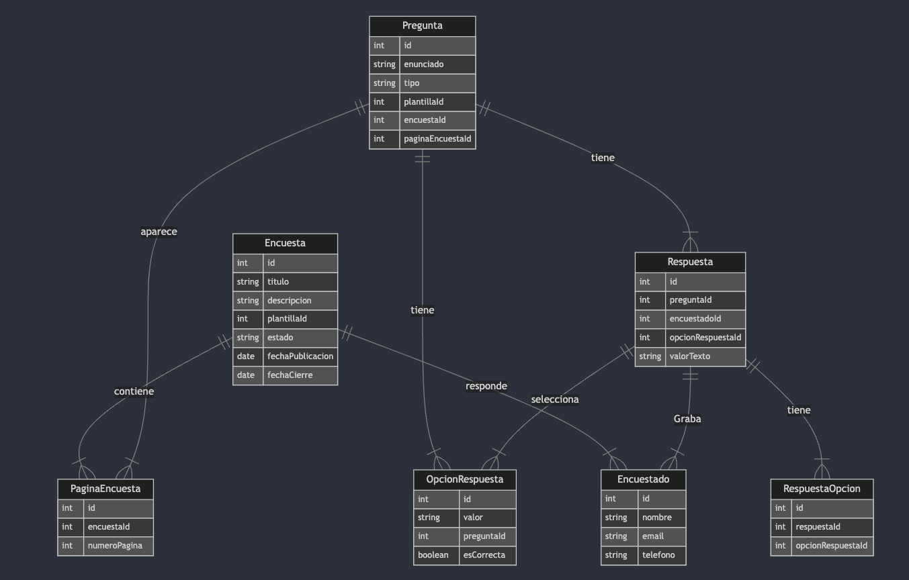

## Índice

0. [Ficha del proyecto](#0-ficha-del-proyecto)
1. [Descripción general del producto](#1-descripción-general-del-producto)
2. [Arquitectura del sistema](#2-arquitectura-del-sistema)
3. [Modelo de datos](#3-modelo-de-datos)
4. [Especificación de la API](#4-especificación-de-la-api)
5. [Historias de usuario](#5-historias-de-usuario)
6. [Tickets de trabajo](#6-tickets-de-trabajo)
7. [Pull requests](#7-pull-requests)

---

## 0. Ficha del proyecto

### **0.1. Tu nombre completo:**

Miguel Antonio Casallas Tarazona

### **0.2. Nombre del proyecto:**

Módulo de encuenstas para integrar con la Suite Visión Empresarial

### **0.3. Descripción breve del proyecto:**

Desarrollaremos una plataforma de gestión y administración de encuestas escalable y robusta, diseñada para satisfacer las necesidades cambiantes de nuestra empresa.

Front-end: Utilizando React, crearemos una interfaz de usuario intuitiva y moderna que permita a los usuarios diseñar y configurar encuestas de manera visual y sencilla. La plataforma será totalmente responsiva, optimizada para su uso en dispositivos móviles y de escritorio.

Back-end: Con Java y Spring Boot, construiremos un backend sólido y eficiente que se encargará de la lógica de negocio, el almacenamiento de datos, la gestión de usuarios y la integración con la aplicación existente. Utilizaremos una base de datos relacional (por ejemplo, PostgreSQL) para almacenar la información de las encuestas, las respuestas y los usuarios.

Escalabilidad: La arquitectura del sistema estará diseñada para soportar un gran volumen de encuestas y usuarios, utilizando tecnologías y patrones de diseño que garanticen un rendimiento óptimo y una alta disponibilidad.

Integración: Desarrollaremos una API RESTful que permita a nuestra aplicación existente consumir los datos recopilados en las encuestas de manera fácil y segura. Esto facilitará la generación de informes, análisis y la toma de decisiones basadas en datos.

Mantenimiento: La plataforma será documentada de manera exhaustiva y estará integrada al portafolio de productos de la empresa, garantizando su mantenimiento a largo plazo y su evolución en línea con las necesidades del negocio.

### **0.4. URL del proyecto:**

> Puede ser pública o privada, en cuyo caso deberás compartir los accesos de manera segura. Puedes enviarlos a [alvaro@lidr.co](mailto:alvaro@lidr.co) usando algún servicio como [onetimesecret](https://onetimesecret.com/).

### 0.5. URL o archivo comprimido del repositorio

https://github.com/sysdent/AI4Devs-finalproject


---

## 1. Descripción general del producto

Presentamos Módulo de encuestas para la Suite Visión Empresarial, la solución integral para crear y distribuir encuestas personalizadas.

Con el Módulo de encuestas para la Suite Visión Empresarial, podrás:

Diseñar encuestas a tu medida: Crea encuestas atractivas y personalizadas con diversos tipos de preguntas (opción múltiple, escala Likert, abiertas, etc.) adaptable a tus necesidades.
Distribuir tus encuestas fácilmente: Comparte tus encuestas a través de múltiples canales (correo electrónico, redes sociales, incrustación en sitios web) y sigue su progreso en tiempo real.
Analizar los resultados de manera sencilla: Obtén insights valiosos a través de informes detallados y visualizaciones intuitivas. Nuestras herramientas de análisis te permitirán comprender mejor a tu audiencia y tomar decisiones basadas en datos.
Empoderar a tus clientes: Permite a tus clientes crear y gestionar sus propias encuestas, brindándoles una herramienta poderosa para recopilar feedback y mejorar sus productos o servicios.
Integrar con tus sistemas existentes: Nuestra plataforma se integra fácilmente con tus soluciones actuales, facilitando la adopción y maximizando la eficiencia.
¿Por qué elegir el Módulo de encuestas para la Suite Visión Empresarial?

Flexibilidad: Adapta la plataforma a tus necesidades específicas y a las de tus clientes.
Escalabilidad: Nuestra solución crece contigo, sin importar el tamaño de tu empresa o el número de encuestas que realices.
Facilidad de uso: Una interfaz intuitiva y un proceso de creación de encuestas sencillo te permiten obtener resultados rápidos.
Personalización: Crea una experiencia de marca única para tus clientes con opciones de personalización avanzadas.
Seguridad y privacidad: Protegemos la información de tus encuestados con las más altas medidas de seguridad.

El Módulo de encuestas para la Suite Visión Empresarial es la herramienta ideal para:

Empresas que buscan mejorar la experiencia del cliente: Recopila feedback valioso y toma decisiones basadas en datos para mejorar tus productos y servicios.
Equipos de investigación de mercado: Realiza estudios de mercado de manera eficiente y obtiene insights profundos sobre tu audiencia.
Organizaciones sin fines de lucro: Recopila donaciones y mide el impacto de tus programas.
Universidades y centros educativos: Evalúa la satisfacción de los estudiantes y el desempeño de los profesores.
Con Módulo de encuestas para la Suite Visión Empresarial, transformarás la forma en que recolectas y analizas datos. ¡Contáctanos hoy mismo y descubre cómo podemos ayudarte a alcanzar tus objetivos!

### **1.1. Objetivo:**

Desarrollar una plataforma web flexible y escalable que permita tanto a la empresa como a sus clientes crear, administrar y distribuir encuestas personalizadas. La plataforma facilitará la recolección de datos de manera eficiente y confiable, y se integrará de manera seamless con las soluciones existentes de la empresa, empoderando a los clientes a obtener insights valiosos y tomar decisiones basadas en datos.

### **1.2. Características y funcionalidades principales:**

## Funcionalidades Clave de la Plataforma de Encuestas

### Creación y Edición de Encuestas

* **Diseño de encuestas:**
    * Editor visual intuitivo para arrastrar y soltar preguntas y secciones.
* ***Tipos de preguntas:***
    * Preguntas de opción múltiple: Con una o múltiples respuestas correctas.
    * Preguntas de escala Likert: Para medir la opinión o el acuerdo en una escala numérica.
    * Preguntas abiertas: Para respuestas textuales extensas.
    * Preguntas de selección múltiple: Para seleccionar varias opciones de una lista.
    * Preguntas de fecha: Para capturar fechas específicas.
* **Análsis de los datos:**
    * Para las preguntas de opción múltiple obtendremos las mediciones correspondientes a:
      * Moda: La opción más seleccionada. Indica la preferencia común.
      * Frecuencia: El número de veces que cada opción fue seleccionada. Muestra la distribución de las respuestas.
      * Procentaje: La proporción de encuestados que eligieron cada opción. Facilita la comparación entre categorías.
      * Co-ocurrencias de opciones: Con qué frecuencia se seleccionan dos o más opciones juntas. Esto puede revelar patrones o asociaciones entre las respuestas.
    * Para las preguntas de escala likert obtendremos las mediciones:
      * Media: Representa el valor promedio de todas las respuestas. Te da una idea general del nivel de acuerdo o desacuerdo con la afirmación.
      * Mediana: El valor que divide a los datos en dos partes iguales. Es útil cuando hay valores extremos que podrían distorsionar la media.
      * Moda: La respuesta más frecuente. Te indica la opinión más común.
      * Desviación estándar: Mide la variabilidad de las respuestas. Un valor alto indica que las opiniones están muy dispersas, mientras que un valor bajo sugiere un alto consenso.
      * Rango: La diferencia entre el valor más alto y el más bajo. Te da una idea de la amplitud de las respuestas.
    * Para las preguntas abiertas no se ha definido aún el método de medición, pero se revisaron las siguientes:
      * Categorización: Agrupar las respuestas en categorías temáticas para identificar patrones y tendencias.
      * Codificación: Asignar códigos a las respuestas para facilitar el análisis y la comparación.
      * Frecuencia de palabras clave: Identificar las palabras o frases que se repiten con mayor frecuencia para entender los conceptos más importantes.
      * Sentimiento: Analizar el tono de las respuestas (positivo, negativo, neutro) para evaluar la satisfacción o insatisfacción.
      * Análisis de sentimientos: Utilizar software especializado para determinar la polaridad de las respuestas (positivo, negativo, neutro).


### **1.3. Diseño y experiencia de usuario:**

Ruta de acceso al proyecto: http://survey.goldrain.online/

Puedes encontrar un video introductorio en el siguiente enlace:

https://www.loom.com/share/a7aa52fa29984e70b0f300f8ec713297?sid=2160fa2c-323d-451b-8c07-cae1628be3fb


### **1.4. Instrucciones de instalación:**

SurveyVE ha sido empaquetado usando contenedores de docker, para facilitar la instalación y ejecución de la aplicación, sin depender de configuraciones previas o adicionales.

Para realizar la instalación debes crear un directorio en tu sistema, y posteriormente crear 2 archivos de texto, así:

- docker-compose.yml
- application.properties


Posteriormente, copiar el contenido de los archivos tal como se indican a continuación:

#### docker-compose.yml
```
version: '3.8'

services:
  db:
    image: postgres:latest
    environment:
      POSTGRES_USER: survey
      POSTGRES_PASSWORD: pensemos
      POSTGRES_DB: surveydb
    volumes:
      - survey_data:/var/lib/postgresql/data
    ports:
      - 5432:5432

  survey-engine:
    image: sysdent/survey-engine:latest
    ports:
      - "8080:8080"
    volumes:
      - ./application.properties:/survey/application.properties
    depends_on:
      - db

  survey:
    image: sysdent/survey-ui:latest
    ports:
      - "80:80"
    depends_on:
      - survey-engine

volumes:
  survey_data:

```

#### application.properties
```
spring.application.name=surveyve

spring.datasource.url=jdbc:postgresql://db:5432/surveydb
spring.datasource.username=survey
spring.datasource.password=pensemos
spring.datasource.driver-class-name=org.postgresql.Driver
spring.jpa.hibernate.ddl-auto=update
spring.jpa.show-sql=true
spring.jpa.properties.hibernate.dialect=org.hibernate.dialect.PostgreSQLDialect

management.endpoints.web.exposure.include=*


springdoc.swagger-ui.path=/swagger-ui.html
```

Una vez creados los archivos, con su contenido correspondiente, deberás abrir una terminal en dicho directorio y ejecutar el comando:

```
  docker compose up -d
```


Posteriormente, podrás usar la aplicación abriendo un navegador y navegando a http://localhost


---

## 2. Arquitectura del Sistema

### **2.1. Diagrama de arquitectura:**


Flujo de la aplicación:

El usuario accede a la aplicación: Ingresa la URL de tu aplicación en el navegador, lo que desencadena una solicitud HTTP al servidor Nginx.
Nginx redirige la solicitud: Nginx recibe la solicitud y la redirige al servidor que hospeda el frontend React.
El frontend carga la interfaz de usuario: El navegador carga la interfaz de usuario de React, que es una aplicación de una sola página (SPA).
El usuario interactúa con la interfaz: A medida que el usuario interactúa con la aplicación (por ejemplo, llena una encuesta), el frontend realiza solicitudes al API Service a través de HTTP.
El API Service procesa las solicitudes: El API Service recibe las solicitudes del frontend, las procesa y realiza las operaciones necesarias en la base de datos PostgreSQL.
El API Service devuelve una respuesta: Una vez que el API Service ha completado la operación, devuelve una respuesta al frontend.
El frontend actualiza la interfaz: El frontend recibe la respuesta del API Service y actualiza la interfaz de usuario para reflejar los cambios.
Ventajas de esta arquitectura:

Separación de responsabilidades: Cada componente tiene una función bien definida, lo que facilita el desarrollo, el mantenimiento y la escalabilidad de la aplicación.
Reutilización del código: El API Service puede ser utilizado por múltiples clientes (por ejemplo, una aplicación móvil y una aplicación web), lo que reduce la duplicación de código.
Escalabilidad: Cada componente puede ser escalado de forma independiente para satisfacer las demandas cambiantes de la aplicación.
Seguridad: Nginx puede utilizarse para implementar medidas de seguridad, como firewalls de aplicaciones web (WAF) y cifrado SSL/TLS.


### **2.2. Descripción de componentes principales:**

#### React Frontend:

Esta es la interfaz de usuario de la aplicación, es decir, lo que el usuario ve y con lo que interactúa directamente. React es un framework de JavaScript muy popular para construir interfaces de usuario modernas y dinámicas.
El frontend se encarga de gestionar la lógica de la vista, los eventos del usuario y la presentación de los datos.

#### Nginx:

Nginx actúa como un servidor web de alto rendimiento. Es el encargado de recibir las solicitudes de los usuarios y de dirigirlas 
al componente adecuado de la aplicación.
Nginx también puede funcionar como un proxy inverso, lo que significa que puede enmascarar múltiples servidores detrás de una única dirección IP, mejorando la seguridad y la escalabilidad.

#### API Service:

Este es el corazón de tu aplicación, donde se encuentra la lógica del negocio. El API Service expone una serie de endpoints (o puntos de acceso) que pueden ser llamados desde el frontend.
Cuando un usuario realiza una acción en la interfaz (por ejemplo, enviar una encuesta), el frontend envía una solicitud a un endpoint específico del API Service. Este, a su vez, interactúa con la base de datos para realizar las operaciones necesarias y devuelve una respuesta al frontend.
PostgreSQL Database:

####  PostgreSQL

es un sistema de gestión de bases de datos relacionales muy potente y flexible. Es donde se almacenan todos los datos de tu aplicación, como las encuestas, las preguntas, las respuestas y los usuarios.
El API Service se conecta a la base de datos para realizar operaciones de lectura y escritura, como consultar información, insertar nuevos registros o actualizar datos existentes.

### **2.3. Descripción de alto nivel del proyecto y estructura de ficheros**

```java
src/main/java/
    com.tuempresa.encuestas/
        concepts/
            encuesta/
                domain/
                    Encuesta.java
                    Pregunta.java
                    OpcionRespuesta.java
                    LogicaSalto.java
                application/
                    CreateEncuestaService.java
                    ResponderPreguntaService.java
                infrastructure/
                    EncuestaRepository.java
                    PreguntaRepository.java
                    EncuestaController.java
            encuestado/
                domain/
                    Encuestado.java
                    Respuesta.java
                    RespuestaOpcion.java
                application/
                    // ... servicios relacionados con encuestados
                infrastructure/
                    EncuestadoController.java
        shared/
            config/
                AppConfig.java
                SecurityConfig.java
            utils/
                DateUtils.java
                EmailUtils.java
                // ... otros utilidades
```

Explicación Detallada

En esta estructura, cada concepto clave del diagrama de datos tiene su propia carpeta. Esto permite una mejor organización y facilita la gestión de cada parte de la aplicación.

encuesta: Todo lo relacionado con la creación, gestión y análisis de encuestas.
encuestado: Todo lo relacionado con los usuarios que responden las encuestas y sus respuestas.
otros conceptos: Otros conceptos que puedas necesitar, como reportes, notificaciones, integraciones con otros sistemas, etc.

Ventajas de esta Estructura:

Alta Cohesión: Cada concepto se mantiene aislado, lo que facilita la comprensión y el mantenimiento del código.
Flexibilidad: Los cambios en un concepto se pueden realizar de forma más aislada, reduciendo el riesgo de afectar otras partes de la aplicación.
Escalabilidad: Es fácil agregar nuevos conceptos o funcionalidades.
Reutilización: Se pueden compartir componentes comunes entre los diferentes conceptos (e.g., utilidades).
Consideraciones Adicionales:

Relaciones entre Conceptos: Las relaciones entre los conceptos se gestionan a través de las entidades y los servicios. Por ejemplo, una encuesta tiene muchas preguntas, y un encuestado puede responder muchas encuestas.
Nivel de Detalle: Puedes ajustar el nivel de detalle de cada concepto según la complejidad de tu aplicación. Por ejemplo, si tienes muchos tipos de preguntas, puedes crear un concepto separado para cada tipo.
Patrones de Diseño: Considera utilizar patrones de diseño como Repository, Factory, Strategy, etc., para mejorar la estructura y la mantenibilidad del código.
Próximos Pasos:

Diseño detallado de las entidades: Define los atributos y relaciones de cada entidad de acuerdo con el diagrama de datos y las necesidades de tu aplicación.
Implementación de los servicios: Crea los servicios necesarios para realizar las operaciones CRUD y las reglas de negocio.
Configuración de Spring Boot: Configura Spring Boot con las dependencias necesarias (Spring Data JPA, Spring Security, etc.) y las propiedades de la aplicación.
Desarrollo de la interfaz de usuario: Diseña y desarrolla la interfaz de usuario para interactuar con la aplicación.


> Representa la estructura del proyecto y explica brevemente el propósito de las carpetas principales, así como si obedece a algún patrón o arquitectura específica.

### **2.4. Infraestructura y despliegue**

> Detalla la infraestructura del proyecto, incluyendo un diagrama en el formato que creas conveniente, y explica el proceso de despliegue que se sigue

### **2.5. Seguridad**

> Enumera y describe las prácticas de seguridad principales que se han implementado en el proyecto, añadiendo ejemplos si procede

### **2.6. Tests**

> Describe brevemente algunos de los tests realizados

---

## 3. Modelo de Datos

### **3.1. Diagrama del modelo de datos:**

[](https://mermaid.live/edit#pako:eNqVVNtOwzAM_ZUoz-wH8goIISExAY-VkJd4XURqV2mCgG3_TtqV3tZW4mVLHfv42D7xUWo2KJVEf2ch91BkJMQ96YhVAHGsv4SwFIQ1l3MVvKVcBBui45HJYKW9LbVl6sNKBxSsc_A4jq_hTRtvIKDYoz7ANu6c1dBD9Fe3Fr3H2nquf4Y0Da8QJS52l7g-dwHWjatBh3smbuHrvy3klmCtE_UZ2_vHgY1igZ4v8SO-W495pNW2IkXStutM1-ySV1q6RKQclXC56ci8YFWulla2bOeyGB5auZl5BziZ9Cc49m_4FXg-_3MTvcTCT1EXE3bIz-PblW431JYr3jE7BEpaveWkPR0m4_ybw__UN3kmHdwT50n6r-DCmpw1k7H9-2itoK_gOuWeTpvN6Thgq0RMB_sDc26DN6Wa5qd8ONbLnOeDh90s3uQZqbqAYJFw9CBa5z6HEotOV4hQQhrOrO9UCgPYq3qufau0FZrGwmzAVMErnIezVSJFGXwPyTeJT97ItC7SRjJpCzdzz2Q4YIGZVOlowH9kMqNz8oMY-PWbtFTBR7yRnmN-kGoPrkpfsayXZbvFW-v5F541BP4)


### **3.2. Descripción de entidades principales:**

#### Encuesta

Descripción: Representa una instancia completa de una encuesta, desde su creación hasta su cierre.
Propósito: Almacenar la información general de una encuesta, como su título, descripción y estado.

##### Atributos

- id: Identificador único de la encuesta.
- titulo: Título descriptivo de la encuesta.
- descripcion: Descripción detallada del objetivo de la encuesta.
- plantillaId: Identificador de la plantilla utilizada para crear la encuesta (opcional).
- estado: Estado actual de la encuesta (activa, inactiva, borrador).
- fechaPublicacion: Fecha en que la encuesta se puso a disposición de los encuestados.
- fechaCierre: Fecha en que la encuesta se cerró para nuevas respuestas.


#### Encuestado

Descripción: Representa a una persona que participa en una encuesta.
Propósito: Almacenar los datos demográficos y de contacto de los encuestados.

##### Atributos

- id: Identificador único del encuestado.
- nombre: Nombre completo del encuestado.
- email: Correo electrónico del encuestado (para enviar invitaciones).
- telefono: Número de teléfono del encuestado (opcional).
- otrosAtributos: Otros datos relevantes sobre el encuestado (edad, género, ubicación, etc.).


#### Respuesta

Descripción: Representa una respuesta individual a una pregunta de una encuesta.
Propósito: Almacenar las respuestas de los encuestados a las preguntas.

##### Atributos

- id: Identificador único de la respuesta.
- preguntaId: Identificador de la pregunta a la que se responde.
- encuestadoId: Identificador del encuestado que respondió.
- opcionRespuestaId: Identificador de la opción seleccionada (para preguntas de selección múltiple).
- valorTexto: Texto de la respuesta (para preguntas abiertas).


#### OpciónRespuesta

Descripción: Representa una posible respuesta a una pregunta de tipo selección múltiple.
Propósito: Definir las opciones disponibles para las preguntas de selección múltiple.

##### Atributos

- id: Identificador único de la opción de respuesta.
- valor: Texto de la opción.
- preguntaId: Identificador de la pregunta a la que pertenece la opción.
- esCorrecta: Indica si la opción es la correcta (solo relevante para preguntas con una sola respuesta correcta).


#### Pregunta

Descripción: Representa una pregunta individual dentro de una encuesta.
Propósito: Definir el contenido y el tipo de cada pregunta.

##### Atributos

- id: Identificador único de la pregunta.
- enunciado: Texto de la pregunta.
- tipo: Tipo de pregunta (abierta, cerrada, selección múltiple, etc.).
- plantillaId: Identificador de la plantilla a la que pertenece la pregunta (opcional).
- encuestaId: Identificador de la encuesta a la que pertenece la pregunta.
- paginaEncuestaId: Identificador de la página de la encuesta en la que aparece la pregunta (opcional).


#### PaginaEncuesta

Descripción: Representa una página dentro de una encuesta.
Propósito: Organizar las preguntas de una encuesta en diferentes páginas.

##### Atributos

- id: Identificador único de la página de la encuesta.
- encuestaId: Identificador de la encuesta a la que pertenece la página.
- numeroPagina: Número de la página dentro de la encuesta.


#### Plantilla

Descripción: Representa una plantilla predefinida de encuesta.
Propósito: Almacenar estructuras de encuestas reutilizables.

##### Atributos

- id: Identificador único de la plantilla.
- nombre: Nombre de la plantilla.
- descripcion: Descripción de la plantilla.


#### Relaciones

- Una encuesta tiene muchas preguntas: Una encuesta puede contener varias preguntas.
- Una pregunta pertenece a una sola encuesta: Cada pregunta está asociada a una única encuesta.
- Una pregunta puede tener muchas opciones de respuesta: Las preguntas de selección múltiple tienen múltiples opciones.
- Una opción de respuesta pertenece a una sola pregunta: Cada opción está asociada a una única pregunta.
- Una encuesta puede tener muchas páginas: Las encuestas largas pueden dividirse en múltiples páginas.
- Una página pertenece a una sola encuesta: Cada página está asociada a una única encuesta.
- Una pregunta aparece en una sola página: Cada pregunta se muestra en una única página de la encuesta (aunque esto podría - modificarse para permitir preguntas que aparezcan en múltiples páginas).
- Una encuesta puede ser utilizada en muchas plantillas: Una plantilla puede ser utilizada para crear múltiples encuestas.
- Una pregunta puede pertenecer a una sola plantilla: Cada pregunta está asociada a una única plantilla.
- Un encuestado puede responder a muchas encuestas: Un encuestado puede participar en múltiples encuestas.
- Una encuesta puede ser respondida por muchos encuestados: Una encuesta puede ser completada por un número indeterminado de personas.
- Una respuesta está asociada a una pregunta y un encuestado: Cada respuesta está vinculada a una pregunta específica y a un encuestado en particular.


## 4. Especificación de la API

```yml
openapi: 3.0.3
info:
  title: API de Sistema de Encuestas
  version: 1.0.0
  description: API para la gestión de encuestas, preguntas, respuestas y más, basada en el modelo de datos provisto.

servers:
  - url: https://api.example.com/v1
    description: Servidor principal

paths:
  /encuestas:
    get:
      summary: Obtener todas las encuestas
      description: Obtiene una lista de encuestas con paginación y ordenado.
      parameters:
        - name: page
          in: query
          description: Número de la página.
          required: false
          schema:
            type: integer
            default: 1
        - name: pageSize
          in: query
          description: Cantidad de encuestas por página.
          required: false
          schema:
            type: integer
            default: 10
        - name: sortBy
          in: query
          description: Campo por el cual se ordenará.
          required: false
          schema:
            type: string
        - name: sortOrder
          in: query
          description: Orden de la ordenación (ascendente o descendente).
          required: false
          schema:
            type: string
            enum: [asc, desc]
      responses:
        '200':
          description: Lista de encuestas.
          content:
            application/json:
              schema:
                type: array
                items:
                  $ref: '#/components/schemas/Encuesta'
    post:
      summary: Crear una nueva encuesta
      description: Crea una nueva encuesta.
      requestBody:
        required: true
        content:
          application/json:
            schema:
              $ref: '#/components/schemas/Encuesta'
      responses:
        '201':
          description: Encuesta creada exitosamente.
          content:
            application/json:
              schema:
                $ref: '#/components/schemas/Encuesta'

  /encuestas/{id}:
    get:
      summary: Obtener encuesta por ID
      description: Obtiene los detalles de una encuesta específica.
      parameters:
        - name: id
          in: path
          required: true
          schema:
            type: integer
      responses:
        '200':
          description: Detalles de la encuesta.
          content:
            application/json:
              schema:
                $ref: '#/components/schemas/Encuesta'
        '404':
          description: Encuesta no encontrada.
    put:
      summary: Actualizar encuesta
      description: Actualiza una encuesta existente.
      parameters:
        - name: id
          in: path
          required: true
          schema:
            type: integer
      requestBody:
        required: true
        content:
          application/json:
            schema:
              $ref: '#/components/schemas/Encuesta'
      responses:
        '200':
          description: Encuesta actualizada exitosamente.
          content:
            application/json:
              schema:
                $ref: '#/components/schemas/Encuesta'
        '404':
          description: Encuesta no encontrada.
    delete:
      summary: Eliminar encuesta
      description: Elimina una encuesta existente.
      parameters:
        - name: id
          in: path
          required: true
          schema:
            type: integer
      responses:
        '204':
          description: Encuesta eliminada exitosamente.
        '404':
          description: Encuesta no encontrada.

  /preguntas:
    get:
      summary: Obtener todas las preguntas
      description: Obtiene una lista de preguntas con paginación y ordenado.
      parameters:
        - name: page
          in: query
          description: Número de la página.
          required: false
          schema:
            type: integer
            default: 1
        - name: pageSize
          in: query
          description: Cantidad de preguntas por página.
          required: false
          schema:
            type: integer
            default: 10
        - name: sortBy
          in: query
          description: Campo por el cual se ordenará.
          required: false
          schema:
            type: string
        - name: sortOrder
          in: query
          description: Orden de la ordenación (ascendente o descendente).
          required: false
          schema:
            type: string
            enum: [asc, desc]
      responses:
        '200':
          description: Lista de preguntas.
          content:
            application/json:
              schema:
                type: array
                items:
                  $ref: '#/components/schemas/Pregunta'
    post:
      summary: Crear una nueva pregunta
      description: Crea una nueva pregunta.
      requestBody:
        required: true
        content:
          application/json:
            schema:
              $ref: '#/components/schemas/Pregunta'
      responses:
        '201':
          description: Pregunta creada exitosamente.
          content:
            application/json:
              schema:
                $ref: '#/components/schemas/Pregunta'

  /preguntas/{id}:
    get:
      summary: Obtener pregunta por ID
      description: Obtiene los detalles de una pregunta específica.
      parameters:
        - name: id
          in: path
          required: true
          schema:
            type: integer
      responses:
        '200':
          description: Detalles de la pregunta.
          content:
            application/json:
              schema:
                $ref: '#/components/schemas/Pregunta'
        '404':
          description: Pregunta no encontrada.
    put:
      summary: Actualizar pregunta
      description: Actualiza una pregunta existente.
      parameters:
        - name: id
          in: path
          required: true
          schema:
            type: integer
      requestBody:
        required: true
        content:
          application/json:
            schema:
              $ref: '#/components/schemas/Pregunta'
      responses:
        '200':
          description: Pregunta actualizada exitosamente.
          content:
            application/json:
              schema:
                $ref: '#/components/schemas/Pregunta'
        '404':
          description: Pregunta no encontrada.
    delete:
      summary: Eliminar pregunta
      description: Elimina una pregunta existente.
      parameters:
        - name: id
          in: path
          required: true
          schema:
            type: integer
      responses:
        '204':
          description: Pregunta eliminada exitosamente.
        '404':
          description: Pregunta no encontrada.
components:
  schemas:
    Encuesta:
      type: object
      properties:
        id:
          type: integer
        titulo:
          type: string
        descripcion:
          type: string
        plantilladId:
          type: integer
        estado:
          type: string
        fechaPublicacion:
          type: string
          format: date
        fechaCierre:
          type: string
          format: date

    Pregunta:
      type: object
      properties:
        id:
          type: integer
        enunciado:
          type: string
        tipo:
          type: string
        plantilladId:
          type: integer
        encuestaId:
          type: integer
        paginaEncuestaId:
          type: integer

Respuesta:
      type: object
      properties:
        id:
          type: integer
        preguntaId:
          type: integer
        encuestadoId:
          type: integer
        opcionRespuestaId:
          type: integer
        valorTexto:
          type: string

    OpcionRespuesta:
      type: object
      properties:
        id:
          type: integer
        valor:
          type: string
        preguntaId:
          type: integer
        esCorrecta:
          type: boolean

    Encuestado:
      type: object
      properties:
        id:
          type: integer
        nombre:
          type: string
        email:
          type: string
        telefono:
          type: string

    PaginaEncuesta:
      type: object
      properties:
        id:
          type: integer
        encuestaId:
          type: integer
        numeroPagina:
          type: integer

```

## 5. Historias de Usuario

Dado que el Creador de Encuestas es el rol que primero obtendrá valor con nuestro sistema, vamos a priorizar sus historias de usuario. A continuación, te presento una propuesta de ordenamiento, considerando que la creación de encuestas básicas es el núcleo de la funcionalidad:

Historias de Usuario Priorizadas para el Creador de Encuestas
Como creador de encuestas, quiero poder crear diferentes tipos de preguntas (opción múltiple, escala de Likert, abierta, etc.) para poder diseñar encuestas variadas.
Como creador de encuestas, quiero poder agregar nuevas preguntas a una encuesta existente para poder personalizarla.
Como creador de encuestas, quiero poder establecer la lógica de salto entre preguntas para poder personalizar la experiencia del encuestado.
Como creador de encuestas, quiero poder previsualizar la encuesta antes de publicarla para poder identificar y corregir errores.
Como creador de encuestas, quiero poder duplicar encuestas existentes para poder crear nuevas encuestas basadas en plantillas.
Como creador de encuestas, quiero poder agregar imágenes o videos a las preguntas para poder hacer las encuestas más atractivas.
Justificación de la Priorización
Historias 1 y 2: Son fundamentales para la creación de encuestas básicas y constituyen la base de cualquier encuesta.
Historia 3: Permite crear encuestas más dinámicas y personalizadas, mejorando la experiencia del encuestado.
Historia 4: Es esencial para garantizar la calidad de las encuestas antes de publicarlas.
Historias 5 y 6: Ofrecen funcionalidades adicionales que aumentan la flexibilidad y el atractivo de la herramienta.
Próximos Pasos y Otras Historias de Usuario
Una vez completadas estas historias, podríamos enfocarnos en:

Historias del Administrador:
Crear cuentas de nuevos usuarios.
Compartir encuestas con usuarios específicos.
Ver reportes de las encuestas completadas.
Historias del Encuestado:
Iniciar sesión y acceder a las encuestas asignadas.
Navegar fácilmente entre las preguntas.
Guardar el progreso y continuar más tarde.
Consideraciones Adicionales:

Historias de Usuario Técnicas: A medida que avancemos, podríamos identificar historias de usuario técnicas relacionadas con la arquitectura, la base de datos, la seguridad, etc. Estas historias deben ser integradas en el backlog de desarrollo.
Historias de Usuario de Mejora Continua: A medida que recibamos feedback de los usuarios, podemos agregar nuevas historias de usuario para mejorar la herramienta y adaptarla a las necesidades de los usuarios.

**Historia de Usuario 1**

Como creador de encuestas, quiero poder crear diferentes tipos de preguntas (opción múltiple, escala de Likert, abierta, etc.) para poder diseñar encuestas variadas.


**Historia de Usuario 2**

Como usuario, quiero completar una encuesta para que mi opinión sea tomada en cuenta en los resultados finales.

**Historia de Usuario 3**

Como administrador de una encuesta, quiero generar un reporte detallado que incluya gráficos y estadísticas sobre las respuestas de los encuestados para tomar decisiones basadas en datos.

---

## 6. Tickets de Trabajo

| Ticket | Título | Descripción | Tareas | Prioridad | Etiquetas |
|---|---|---|---|---|---|
| 1 | Implementar diferentes tipos de preguntas en el formulario de encuestas | Desarrollar la funcionalidad necesaria para permitir a los creadores de encuestas agregar preguntas de opción múltiple, escala de Likert, abiertas y otros tipos de preguntas a sus encuestas. | Crear componentes de interfaz de usuario para cada tipo de pregunta. Desarrollar la lógica backend para almacenar y procesar las diferentes respuestas. Validar los datos ingresados en cada tipo de pregunta. Implementar una interfaz intuitiva para que los creadores puedan seleccionar el tipo de pregunta y configurar sus opciones. | Alta | desarrollo, frontend, backend |
| 2 | Implementar el flujo de respuesta a encuestas | Desarrollar la funcionalidad para que los usuarios puedan completar las encuestas de forma sencilla y clara. | Crear una interfaz de usuario amigable para responder a las preguntas. Implementar la lógica para guardar las respuestas de los usuarios. Mostrar una barra de progreso o indicador para que los usuarios sepan cuánto han avanzado. Implementar un mecanismo para enviar recordatorios a los usuarios que no han completado la encuesta. | Alta | desarrollo, frontend, backend |
| 3 | Desarrollar la funcionalidad de generación de reportes | Crear un módulo para generar reportes detallados con gráficos y estadísticas a partir de los datos de las encuestas. | Seleccionar una biblioteca de visualización de datos (e.g., Chart.js, D3.js). Desarrollar consultas a la base de datos para obtener los datos necesarios para los reportes. Crear diferentes tipos de reportes (resúmenes, comparaciones, tendencias). Permitir a los administradores personalizar los reportes según sus necesidades. Implementar la exportación de reportes en diferentes formatos (PDF, CSV, etc.). | Media | desarrollo, backend, reporting |

---

## 7. Pull Requests

> Documenta 3 de las Pull Requests realizadas durante la ejecución del proyecto

**Pull Request 1**

https://github.com/LIDR-academy/AI4Devs-finalproject/pull/4

**Pull Request 2**

https://github.com/LIDR-academy/AI4Devs-finalproject/pull/7

**Pull Request 3**


## 8. Proyecto Spring

https://start.spring.io/#!type=gradle-project&language=java&platformVersion=3.3.4&packaging=jar&jvmVersion=21&groupId=co.com.goldrain&artifactId=surveyve&name=surveyve&description=Survey%20m%C3%B3dule&packageName=co.com.goldrain.surveyve&dependencies=data-jpa,postgresql,lombok