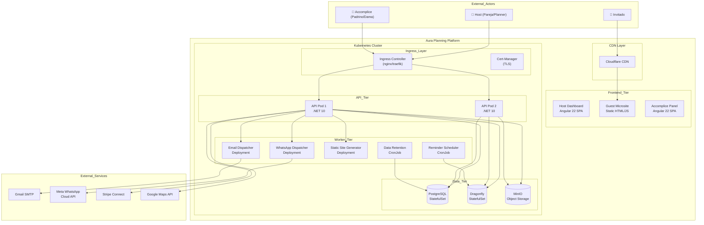
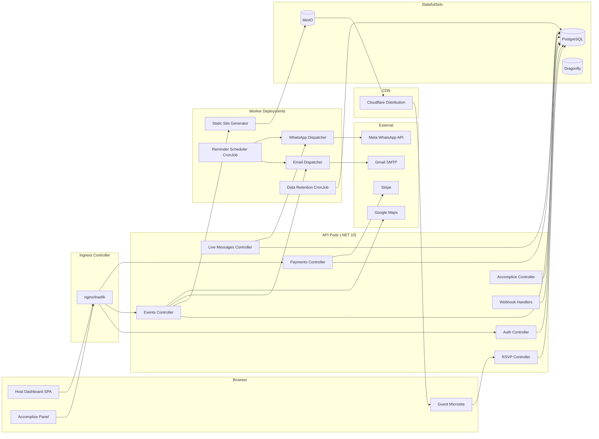
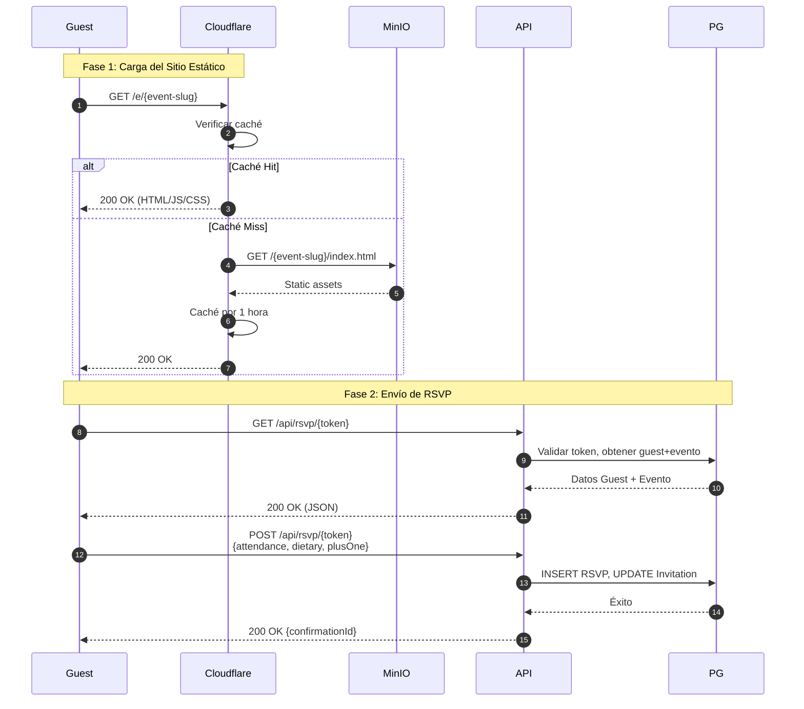
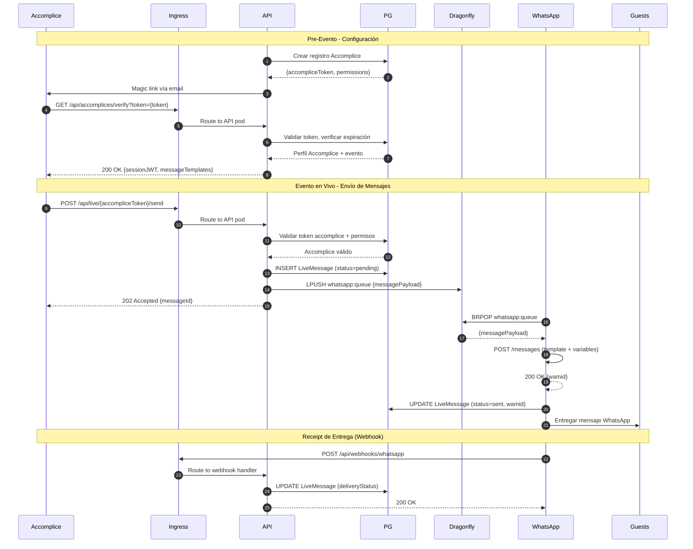

# 2.1. Diagrama de Arquitectura

## Arquitectura de Alto Nivel (C4 - Contexto)

Aura Planning sigue una arquitectura **cloud-native sobre Kubernetes** con separación clara entre el panel de gestión (SPA dinámico), los micrositios de invitados (estáticos servidos por CDN desde MinIO), y servicios de fondo distribuidos.

## Diagrama de Contenedores (C4 Model)

## Flujo del Micrositio de Invitados (JAMstack + MinIO)

## Flujo Live Guest Journey (Accomplice → WhatsApp)

## Justificación de la Arquitectura

### Patrón Arquitectónico: Cloud-Native Kubernetes + Clean Architecture

Aura Planning combina dos patrones arquitectónicos:

1. **Cloud-Native Kubernetes**: Microservicios containerizados con orquestación K8s, escalado automático (HPA), service discovery nativo, y gestión de estado mediante StatefulSets (PostgreSQL, Dragonfly, MinIO).

2. **Clean Architecture (Onion)** para el backend: separación en capas (Api → Core → Infrastructure) que permite independencia de frameworks, testabilidad y mantenibilidad.

### Beneficios

| Beneficio | Descripción |
|-----------|-------------|
| **Escalabilidad automática** | HPA escala pods de API según CPU/memoria; Dragonfly maneja miles de ops/sec |
| **Portabilidad** | K8s abstracta el proveedor; funciona en GKE, EKS, DOKS, on-premise, Rancher Desktop |
| **Resiliencia** | Liveness/readiness probes, auto-restart de pods, réplicas múltiples |
| **Costo** | Dragonfly usa 25x menos memoria que Redis; MinIO reemplaza S3; Gmail SMTP gratuito |
| **Observabilidad nativa** | Prometheus + Grafana + Loki integrados en el cluster |
| **GitOps-ready** | Kustomize overlays para entornos; CI/CD con GHCR + kubectl |

### Sacrificios y Déficits

| Sacrificio | Impacto | Mitigación |
|------------|---------|------------|
| **Complejidad operativa de K8s** | Mayor curva de aprendizaje que PaaS | Rancher Desktop para local; Kustomize simplifica despliegue |
| **Gmail SMTP limitado** | 500 emails/día, sin bounce webhooks | Adecuado para MVP; IEmailService permite swap a Mailgun/Brevo |
| **PostgreSQL vs SQLite** | Mayor overhead de infraestructura | Necesario para multi-pod; Helm chart simplifica instalación |
| **Sin HA multi-región** | Single cluster para MVP | K8s facilita migración a multi-cluster futuro |
| **Dragonfly madurez** | Proyecto relativamente nuevo vs Redis | API-compatible con Redis; mismo cliente StackExchange.Redis |

---

[← Volver a readme.md](../../readme.md) | [Siguiente: Componentes Principales →](./02-components.md)
